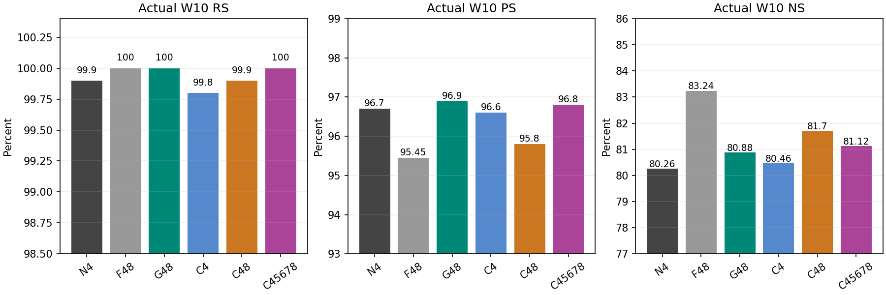
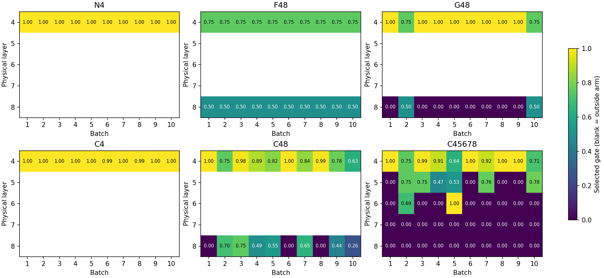
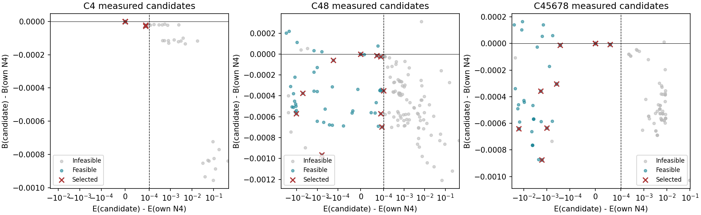

# Sequential Local-z Allocation v2 — 여섯 cold arm 완료 상세 사실 리뷰

상태: **6/6 scheduler COMPLETED(0:0), 6/6 실제 W10/1000 terminal 및 저장근거 CPU 검산 완료**. 신규 GPU 0. 과학적 우열·인과 기여·후속 정책의 판정은 이 SH 보고의 범위가 아니다.


## 1. 실행 범위·읽기 기준과 검증 수준

동일 fixed first1000의 여섯 cold W0/zeroM4..8 chain, 각 B100×10이다. 실제60batch/6000 arm-request observations이며 unique request는1000이다. 다른 실험의 N4/CAKE/repair/기존 cold7은 새 주표를 대체하지 않았고 해당 task를 재개하지 않았다.

실행 `21297ec19e7f5aecec16d2fdb14cc79380a1df94` / tree `26be0758ee75503161c7cafffdec8397e6cf8165`; archive `c97083a1e1039c059b082bcf0ad0de1143bbfbe41a26be1db5c5d7a1bf54a7a8`; lock `a41cb76a25ab98b02c043397cd9cf4db0768e9ae312931b349008c3e9b303d18`. 제출·인계 publication `38fe0d39`, 이번 분석 시작 main `3658b7b4`와 다르다. Analysis source/현재 publication은 analysis-manifest 및 rooted receipt에 별도 결속한다.

과거 2026-09-17T07:16:03Z의 agent 관측은 여섯 main PENDING/Resources·initial 미관측이었다. 이번에 읽은 initial-gate.json은 사후 저장 증거이며 그때 실시간 PASS였다고 소급하지 않는다. 지정6job만 한 번 sacct 조회했고 다른 job/실험 자료·live output 모니터링은 하지 않았다.

| Arm | Array / 실제Job | 상태/exit | 시작(KST) | 종료(KST) | 할당 GPU초 |
| --- | --- | --- | --- | --- | --- |
| C45678 | 49466_0 / 49474 | COMPLETED 0:0 | 2026-09-17T16:35:01 | 2026-09-17T22:03:37 | 19716 |
| N4 | 49466_1 / 49492 | COMPLETED 0:0 | 2026-09-17T17:44:31 | 2026-09-17T19:00:12 | 4541 |
| F48 | 49466_2 / 49556 | COMPLETED 0:0 | 2026-09-17T19:00:31 | 2026-09-17T20:33:11 | 5560 |
| G48 | 49466_3 / 49592 | COMPLETED 0:0 | 2026-09-17T20:33:31 | 2026-09-17T22:27:12 | 6821 |
| C4 | 49466_4 / 49720 | COMPLETED 0:0 | 2026-09-17T22:03:57 | 2026-09-17T23:31:56 | 5279 |
| C48 | 49466_5 / 49466 | COMPLETED 0:0 | 2026-09-17T22:27:34 | 2026-09-18T03:06:00 | 16706 |

공통 model revision `8afb486c1db24fe5011ec46dfbe5b5dccdb575c2`, FP32/eager, matmul·cuDNN TF32 off, seed20260916. C4 sampling seed20260915와 구분한다. Physical4..8→P asset0..4→singleton local0. Context text/token/RNG 및 teacher는 기존 cold capsule를 재사용했다. 대형 model/teacher tensor를 이번에 전량 재해시하거나 모델로 재검증하지 않았다. 작은 manifest/source/lock은 현재 SHA, 모델·teacher 실물의 수치 연결은 봉인 technical evidence 재사용 수준이다.

Dataset SHA `3d7f5e31db47b23f3a281bb6fb447c2fb1776e3d4721cdfb5fe5c6f998f10ae1`; whole order `5b01356928ad2e2e46effad5a2c5621c87746b610992b7b92bf3ace16b6f5729`; first1000 `40fe1afb318a4a5da9630425213644a729a1e85fb4e78c18e9a4dcd2870eefdd`. 원 data/order는 source lock과 결속했고 모든 평가 row의 case/prompt/target 해시를 독립적으로 재계산했다.

## 2. Actual W10 전체1000 — 첫 독립 표

RS/PS는 new NLL < true NLL, NS는 true NLL < new NLL. 동점은 실패다. 분모1000/2000/10000, 모든 arm ties0. TF-strict와 token accuracy는 이 preference 지표와 별개다.

| Arm | RS count / % | PS count / % | NS count / % | ΔN4 RS/PS/NS pp |
| --- | --- | --- | --- | --- |
| N4 | 999/1000 · 99.9 | 1934/2000 · 96.7 | 8026/10000 · 80.26 | +0.00/+0.00/+0.00 |
| F48 | 1000/1000 · 100 | 1909/2000 · 95.45 | 8324/10000 · 83.24 | +0.10/-1.25/+2.98 |
| G48 | 1000/1000 · 100 | 1938/2000 · 96.9 | 8088/10000 · 80.88 | +0.10/+0.20/+0.62 |
| C4 | 998/1000 · 99.8 | 1932/2000 · 96.6 | 8046/10000 · 80.46 | -0.10/-0.10/+0.20 |
| C48 | 999/1000 · 99.9 | 1916/2000 · 95.8 | 8170/10000 · 81.7 | +0.00/-0.90/+1.44 |
| C45678 | 1000/1000 · 100 | 1936/2000 · 96.8 | 8112/10000 · 81.12 | +0.10/+0.10/+0.86 |



각 축은 차이를 읽기 위한 확대 범위이며0에서 시작하지 않는다. 첫 표 SHA `e648ea8a0de86c70162db4f15b603513041cfb68e956910b983038da97460640`. 첫 표의 당시 status는 state audit pending이라는 중간 provenance를 보존했다. 아래 audit-summary가 후속 전체 저장근거 검산 수준이다.

## 3. 동일 문항 paired 차이와 반대 방향 결과

표는 앞 arm−뒤 arm이다. Lost=뒤 arm 성공→앞 arm 실패, gained=그 반대. 모든 비교는 동일 원문항 identity다. Δdesired NLL 양수는 R/P에서 new NLL, N에서 true NLL의 악화다. 아래 CI는 1000 case cluster bootstrap(2000회, seed20260918)의 percentile95%로, 관련 R/P/N prompt를 독립표본으로 부풀리지 않는다. 한 fixed order의 기술적 불확실성 요약이며 보편적 비열화 증명이나 다중비교 보정된 확정효과가 아니다.

| 비교 | 지표 | lost/gained | Δpp | 95% CI(pp) | Δdesired NLL 평균 / p99 |
| --- | --- | --- | --- | --- | --- |
| C4-N4 | RS | 1/0 | -0.1 | [-0.300, 0.000] | -0.00151 / +0.00445 |
| C4-N4 | PS | 6/4 | -0.1 | [-0.400, 0.200] | +0.00741 / +1.34478 |
| C4-N4 | NS | 49/69 | 0.2 | [-0.010, 0.420] | -0.01518 / +0.65549 |
| C48-C4 | RS | 0/1 | 0.1 | [0.000, 0.300] | +0.00566 / +0.06461 |
| C48-C4 | PS | 39/23 | -0.8 | [-1.700, 0.101] | +0.15589 / +3.81197 |
| C48-C4 | NS | 136/260 | 1.24 | [0.760, 1.720] | -0.05941 / +2.42033 |
| C48-F48 | RS | 1/0 | -0.1 | [-0.300, 0.000] | -0.00516 / +0.04820 |
| C48-F48 | PS | 34/41 | 0.35 | [-0.600, 1.300] | -0.03718 / +4.43572 |
| C48-F48 | NS | 275/121 | -1.54 | [-2.050, -1.050] | +0.07050 / +3.21270 |
| C48-G48 | RS | 1/0 | -0.1 | [-0.300, 0.000] | +0.01576 / +0.07041 |
| C48-G48 | PS | 35/13 | -1.1 | [-1.850, -0.350] | +0.09718 / +3.83090 |
| C48-G48 | NS | 120/202 | 0.82 | [0.390, 1.230] | -0.05447 / +1.94569 |
| C45678-C48 | RS | 0/1 | 0.1 | [0.000, 0.300] | +0.00657 / +0.04756 |
| C45678-C48 | PS | 17/37 | 1 | [0.250, 1.850] | -0.08869 / +3.47475 |
| C45678-C48 | NS | 203/145 | -0.58 | [-0.960, -0.190] | +0.00947 / +2.52104 |

예를 들어 C48−G48은 PS −1.10pp(lost35/gained13), NS +.82pp(lost120/gained202)다. C45678−C48은 PS +1.00pp(lost17/gained37), NS −.58pp(lost203/gained145)다. 반대 방향 값을 합산한 단일 성공점수로 숨기지 않는다. C48−G48은 탐색 범위/예산도 달라 연속성만의 인과효과가 아니다.

전체 신규 arm−N4, strict lost/gained, true/new NLL 평균·p95·p99·최대, 요청별 악화 수는 [paired.csv](paired.csv)에 있다. Hash-only per-row 변이는 local `paired-row-changes.json`에 보존하며 누락 행·가상 joint 분포를 생성하지 않았다.

## 4. 시점별 유지·소실·회복, strict 및 tail

At-write는 각 요청이 도착한 서로 다른 모델의 관측을 모은 것이며 W0 또는 한 final 모델이 아니다. W5 first500과 W10 same first500은 같은 집단의 시간상 전이; W10 last500은 다른 cohort다.

| Arm | 시점/집단 | RS% | PS% | NS% |
| --- | --- | --- | --- | --- |
| N4 | POOLED_ATWRITE | 99.9 | 96.4 | 83.79 |
| N4 | W5_FIRST500 | 100 | 96.1 | 84.06 |
| N4 | W10_FIRST500 | 100 | 95.8 | 79.62 |
| N4 | W10_LAST500 | 99.8 | 97.6 | 80.9 |
| F48 | POOLED_ATWRITE | 100 | 95.35 | 85.29 |
| F48 | W5_FIRST500 | 100 | 93.9 | 85.62 |
| F48 | W10_FIRST500 | 100 | 94 | 82.82 |
| F48 | W10_LAST500 | 100 | 96.9 | 83.66 |
| G48 | POOLED_ATWRITE | 100 | 96.6 | 83.87 |
| G48 | W5_FIRST500 | 100 | 95.6 | 84.04 |
| G48 | W10_FIRST500 | 100 | 95.9 | 80.3 |
| G48 | W10_LAST500 | 100 | 97.9 | 81.46 |
| C4 | POOLED_ATWRITE | 99.9 | 96.4 | 83.82 |
| C4 | W5_FIRST500 | 100 | 96.1 | 84.06 |
| C4 | W10_FIRST500 | 99.8 | 95.9 | 79.74 |
| C4 | W10_LAST500 | 99.8 | 97.3 | 81.18 |
| C48 | POOLED_ATWRITE | 99.9 | 95.8 | 84.21 |
| C48 | W5_FIRST500 | 100 | 95 | 84.34 |
| C48 | W10_FIRST500 | 100 | 95.1 | 81.02 |
| C48 | W10_LAST500 | 99.8 | 96.5 | 82.38 |
| C45678 | POOLED_ATWRITE | 100 | 96.55 | 83.96 |
| C45678 | W5_FIRST500 | 100 | 95.9 | 84.04 |
| C45678 | W10_FIRST500 | 100 | 96.3 | 80.48 |
| C45678 | W10_LAST500 | 100 | 97.3 | 81.76 |


| Arm | 전이 | 지표 | 원분모 | lost/gained | Δdesired NLL 평균/p99 |
| --- | --- | --- | --- | --- | --- |
| N4 | ATWRITE_TO_W10 | RS | 1000 | 0/0 | +0.02081/+0.01857 |
| N4 | W5_TO_W10_FIRST500 | RS | 500 | 0/0 | +0.02337/+0.20995 |
| N4 | ATWRITE_TO_W10 | PS | 2000 | 8/14 | -0.03053/+1.26992 |
| N4 | W5_TO_W10_FIRST500 | PS | 1000 | 8/5 | -0.02870/+1.22979 |
| N4 | ATWRITE_TO_W10 | NS | 10000 | 470/117 | +0.15302/+6.76857 |
| N4 | W5_TO_W10_FIRST500 | NS | 5000 | 275/53 | +0.25160/+7.28823 |
| F48 | ATWRITE_TO_W10 | RS | 1000 | 0/0 | +0.02697/+0.03837 |
| F48 | W5_TO_W10_FIRST500 | RS | 500 | 0/0 | +0.03278/+0.08050 |
| F48 | ATWRITE_TO_W10 | PS | 2000 | 9/11 | -0.05419/+0.89979 |
| F48 | W5_TO_W10_FIRST500 | PS | 1000 | 6/7 | -0.05188/+0.96018 |
| F48 | ATWRITE_TO_W10 | NS | 10000 | 295/90 | +0.05814/+4.84546 |
| F48 | W5_TO_W10_FIRST500 | NS | 5000 | 182/42 | +0.12783/+5.44490 |
| G48 | ATWRITE_TO_W10 | RS | 1000 | 0/0 | +0.01039/+0.02808 |
| G48 | W5_TO_W10_FIRST500 | RS | 500 | 0/0 | +0.00861/+0.03276 |
| G48 | ATWRITE_TO_W10 | PS | 2000 | 3/9 | -0.04295/+1.14193 |
| G48 | W5_TO_W10_FIRST500 | PS | 1000 | 3/6 | -0.03481/+1.41150 |
| G48 | ATWRITE_TO_W10 | NS | 10000 | 412/113 | +0.13133/+6.22334 |
| G48 | W5_TO_W10_FIRST500 | NS | 5000 | 243/56 | +0.22825/+6.63657 |
| C4 | ATWRITE_TO_W10 | RS | 1000 | 1/0 | +0.01810/+0.02034 |
| C4 | W5_TO_W10_FIRST500 | RS | 500 | 1/0 | +0.02442/+0.17886 |
| C4 | ATWRITE_TO_W10 | PS | 2000 | 8/12 | -0.03370/+1.38693 |
| C4 | W5_TO_W10_FIRST500 | PS | 1000 | 7/5 | -0.03132/+1.20788 |
| C4 | ATWRITE_TO_W10 | NS | 10000 | 453/117 | +0.13848/+6.77048 |
| C4 | W5_TO_W10_FIRST500 | NS | 5000 | 273/57 | +0.23663/+7.05925 |
| C48 | ATWRITE_TO_W10 | RS | 1000 | 0/0 | +0.02364/+0.03210 |
| C48 | W5_TO_W10_FIRST500 | RS | 500 | 0/0 | +0.04591/+0.05253 |
| C48 | ATWRITE_TO_W10 | PS | 2000 | 9/9 | -0.03147/+1.07353 |
| C48 | W5_TO_W10_FIRST500 | PS | 1000 | 7/8 | -0.01967/+1.47966 |
| C48 | ATWRITE_TO_W10 | NS | 10000 | 349/98 | +0.08489/+5.29361 |
| C48 | W5_TO_W10_FIRST500 | NS | 5000 | 225/59 | +0.17243/+6.03964 |
| C45678 | ATWRITE_TO_W10 | RS | 1000 | 0/0 | +0.03169/+0.02729 |
| C45678 | W5_TO_W10_FIRST500 | RS | 500 | 0/0 | +0.05305/+0.03961 |
| C45678 | ATWRITE_TO_W10 | PS | 2000 | 4/9 | -0.03471/+0.98712 |
| C45678 | W5_TO_W10_FIRST500 | PS | 1000 | 2/6 | -0.03051/+1.06760 |
| C45678 | ATWRITE_TO_W10 | NS | 10000 | 383/99 | +0.09499/+5.64023 |
| C45678 | W5_TO_W10_FIRST500 | NS | 5000 | 229/51 | +0.18043/+6.44885 |


| Arm | R TF-strict /1000 | P TF-strict /2000 | two-P strict /1000 | N true TF-strict /10000 |
| --- | --- | --- | --- | --- |
| N4 | 993 | 1354 | 513 | 1761 |
| F48 | 998 | 1280 | 457 | 1972 |
| G48 | 998 | 1337 | 500 | 1823 |
| C4 | 993 | 1349 | 511 | 1781 |
| C48 | 996 | 1313 | 488 | 1917 |
| C45678 | 997 | 1318 | 481 | 1873 |

Native/TF argmax의 tie는 원 torch 첫 token-index 규칙이며 preference NLL 동점 실패와 구분한다. Token 정확수/분모, true/new NLL·desired margin 중앙값/p95/p99/최대 및10cohort는 [performance.csv](performance.csv), 전이 tail은 [retention.csv](retention.csv).

Received fact 기준 최종 ACTIVE 999, SUPERSEDED 1다. 합당한 동일 subject/relation overwrite를 단순 forgetting과 합치지 않았고 전체 requested1000을 주분모로 유지했다. 실제 overwrite는 ordinal94(case14566)→ordinal689(case21743) 한 건이며 target 문자열이 변경됐다. Past64는 성공 기반이 아니다. 평가가 없는 batch 사이 정확한 최초 실패/회복 시점은 NOT_RECORDED다.

| Arm | W0 성공 N 분모 | W10 유지 count/% |
| --- | --- | --- |
| N4 | 8820 | 7852 / 89.02494331065759 |
| F48 | 8820 | 8168 / 92.6077097505669 |
| G48 | 8820 | 7921 / 89.80725623582767 |
| C4 | 8820 | 7868 / 89.2063492063492 |
| C48 | 8820 | 8004 / 90.74829931972789 |
| C45678 | 8820 | 7942 / 90.0453514739229 |


## 5. 설계 → 실행 source → 저장 evidence

검증 용어: SOURCE_CONFIRMED는 실제 executed bytes의 경로 확인, STORED_EVIDENCE_CONSISTENT는 저장 로그·해시·스칼라의 독립 산술 일치다. 이 둘을 새 model-level parity나 GPU continuation PASS로 승격하지 않는다.

| 요구사항 | 실제 함수/줄 | 실측/검사 | 수준·한계 |
| --- | --- | --- | --- |
| 공통 cold 시작 | runtime.py:38–98; runner.py:29–35 | 6 arm start W/M/P/context/RNG hash 동일; W0와 zeroM는 저장 runtime guard+공통 capsule | STORED_EVIDENCE_CONSISTENT; 현재 model/W/M 실물 독립 재로드 없음 |
| native 동일 연산 | native.py:105–154; fitting.py:23–160 | BLUE 원 AST fit/history 분리, L2=1/lr=.1/decay=.5/clamp=.75/KL=.0625/25loss·24Adam | SOURCE_CONFIRMED + STORED_EVIDENCE_CONSISTENT; CPU55,200 target capture 검산은 모델 재실행 아님 |
| prefix local-z 및 cache | controller.py:258–326; runtime.py:193–234 | fit input/output 실제 상태와 ledger cache key 결속; 같은 prefix의 layer fit만 재사용 | STORED_EVIDENCE_CONSISTENT; 전체 weight 미보존으로 fractional endpoint 독립 재구성 불가 |
| gate0/1/중간 FP32 | runtime.py:23–33; controller.py:258–326 | 0 skip, 1 exact native copy, 중간 FP32 U+a(V−U); L5–7 포함 | SOURCE_CONFIRMED + STORED_EVIDENCE_CONSISTENT; CPU hash는 GPU off/on parity 대체 아님 |
| E/H/B와 보호 ID | metrics.py:36–137; controller.py:342–366 | E token→native context→request; H canonical; B full-vocab W0 KL; exact strict/pair subset | STORED_EVIDENCE_CONSISTENT; 평균 E 보호는 모든 요청 NLL·PS·NS 보호가 아님 |
| global min/tie | controller.py:512–520; analysis/audit.py:reasons/choose | 전 실제 feasible pool Bmin+1e-6, ownN4→actual support→concat norm→gate lex→SHA;60/60 일치 | STORED_EVIDENCE_CONSISTENT; 국소 탐색 pool 안 선택이며 global optimum 아님 |
| F48 고정 예외 | controller.py:665–672 | (.75,.5) 10/10 raw commit; guard 탈락에도 ownN4로 교체하지 않음 | STORED_EVIDENCE_CONSISTENT; F48 infeasible는 승인된 fixed 정책 관측이지 기술실패 아님 |
| legacy COBYLA | controller.py:614–644; execution.lock dependencies | SciPy1.15.3; u=1−a/u0=0/rhobeg.25/tol.01/catol1e-8/maxiter64; E/H·pair .05는 단위 | SOURCE_CONFIRMED + STORED_EVIDENCE_CONSISTENT; tol은 loss 허용치 아님; budget stop 수렴 증거 아님 |
| bounds/score 공유 | controller.py:468–499 | raw u bounds 먼저 검사; GPU0/dummy1/no clip; objective·constraint 동일 raw u 점수 공유 | STORED_EVIDENCE_CONSISTENT; adaptive 호출 permutation invariance를 추가 요구하지 않음 |
| phase budget/미완료 | controller.py:279–321,421–437 | search32+prune reserve8; score24+4; extraAdam9600; fit2400 reserve 후 actual 차감 | STORED_EVIDENCE_CONSISTENT; pruning 전용 Adam reserve 없음; budget 미완료는 층 필요성 증거 아님 |
| exact-zero pruning | controller.py:522–555 | 8→7→6→5 한 번씩, incumbent nonzero 추가층만, L4 pruning0, 글로벌 재선택 | STORED_EVIDENCE_CONSISTENT; 연속 a4=0 경계와 L4 pruning을 구분 |
| Past64 received-event | runner.py:46–50; local_z policy.py:27–37 | latest raw subject/relation, 현재 overwrite 제외, 고정 SHA priority, B1empty/후속64 | STORED_EVIDENCE_CONSISTENT; 성공 filtering0; all1000을 accepted-only로 바꾸지 않음 |
| observer 분리 | runner.py:57–96; runtime.py:172–173 | 선택·다음 state 결정 먼저 봉인, official P/N·Dev 이후; scope 밖 후보완성0 | SOURCE_CONFIRMED + STORED_EVIDENCE_CONSISTENT; 관측 함수 호출순서를 저장참조와 source로 확인; 모델 replay 없음 |
| history/다음 entry | runtime.py:252–264; runner.py:99–117 | 60commit/300append/54인접link, selected endpoint에서 모든5층 whole100 key append1 | STORED_EVIDENCE_CONSISTENT; zero gate·미사용층도 history 갱신; 기록 hash 검산과 M tensor 재구성 구분 |
| 실제 tensor 수준 | runtime.py:224–232; artifacts.py | 552 native files target/anchor/radius/key/readout/capture finite 및 카운터 검산 | CPU_STORED_TENSOR_PASS; W/M checkpoint0; exact crash-resume NOT_AVAILABLE; GPU continuation NOT_TESTED |

각 source 줄은 frozen `21297ec` 기준이다. [source-inventory.csv](source-inventory.csv), [source-conformance.csv](source-conformance.csv), local audit-checks가 정확 SHA와 검사 이름을 결속한다.

## 6. 탐색·채택·support·pruning 실제 동작

매batch own We에서 mandatory full-L4 N4 한 번을 만든다. 후속 local-z/key/solve는 실제 앞층 gate를 적용한 prefix에서 계산한다. Own-N4는 자기 이전 trajectory의 누적 후속층도 유지하므로 독립 N4 sequential chain으로 복귀하는 것이 아니다. L4 fit을 앞 arm의 미래 direction으로 replay하지 않았다.

| Arm | ownN4/10 | 선택 support1/2/≥3 | 완료후보/feasible | 미완료 | 탐색 count proxy충족 |
| --- | --- | --- | --- | --- | --- |
| N4 | 10 | 10/0/0 | 10/10 | 0 | N/A fixed/grid |
| F48 | 0 | 0/10/0 | 20/13 | 0 | N/A fixed/grid |
| G48 | 8 | 8/2/0 | 60/34 | 0 | N/A fixed/grid |
| C4 | 8 | 10/0/0 | 40/12 | 0 | 10/10 |
| C48 | 1 | 3/7/0 | 174/69 | 4 | 10/10 |
| C45678 | 3 | 4/4/2 | 142/78 | 11 | 10/10 |

Support는 gate가 양수인 개수와 실제 entry 대비 W hash가 바뀐 층 수를 별도로 집계했다. [selected-gates.csv](selected-gates.csv)와 [candidate.csv](candidate.csv)에는 둘 다 있다. `action_norm`은 runtime의 actual concat ΔW FP64 Frobenius scalar다. 사후 W/M 미보존 상태에서 path/net/energy를 새로 재구성한 실측으로 만들지 않았다.



그림 숫자는 소수둘째자리 반올림이다. 표시1.00을 exact gate1로 읽지 않으며 정확한값은 CSV를 따른다. C4는 ownN4 8회, 나머지B6 a4=.9939162178/B8 .9925433527. G48은B2/B10에(.75,.5), 나머지8회ownN4. C48은B1 ownN4, B6/B8은 L4-only 연속계수, 나머지7회 L4/L8. C45678은B2/B5에 실제3층, B3/B4/B7/B10에2층, B1은 a4=.9982652821 단층, B6/B8/B9 ownN4다. C45678의 L7/L8 선택은0회다. 이는 조사된 pool의 선택 사실이지 해당 층의 불필요성/전역 support 최적성 증거가 아니다.

| Arm/B | search vectors / unique endpoints / distinct a4 | stop | extra fit/Adam | prune 시도/완료/삭제 | prune완료? |
| --- | --- | --- | --- | --- | --- |
| C48/1 | 10/10/7 | EXTRA_ADAM_RESERVE | 7/8596 | 0/0/0 | True |
| C48/2 | 13/13/12 | EXTRA_ADAM_RESERVE | 12/7508 | 1/1/0 | True |
| C48/3 | 20/20/19 | SOLVER_RETURN | 19/1824 | 1/1/0 | True |
| C48/4 | 24/24/23 | ENDPOINT_RESERVE | 23/2640 | 1/1/0 | True |
| C48/5 | 14/14/13 | SOLVER_RETURN | 13/6303 | 1/1/0 | True |
| C48/6 | 21/21/20 | SOLVER_RETURN | 20/360 | 1/1/1 | True |
| C48/7 | 19/19/18 | SOLVER_RETURN | 18/2880 | 1/1/0 | True |
| C48/8 | 7/7/4 | SOLVER_RETURN | 4/240 | 1/1/1 | True |
| C48/9 | 16/16/15 | SOLVER_RETURN | 15/3452 | 1/1/0 | True |
| C48/10 | 11/11/10 | EXTRA_ADAM_RESERVE | 10/7980 | 1/1/0 | True |
| C45678/1 | 11/11/6 | SUFFIX_FIT_CAP | 32/888 | 4/4/4 | True |
| C45678/2 | 10/10/5 | SUFFIX_FIT_CAP | 33/4904 | 4/4/2 | True |
| C45678/3 | 11/11/6 | SUFFIX_FIT_CAP | 32/504 | 4/4/3 | True |
| C45678/4 | 10/10/6 | SUFFIX_FIT_CAP | 32/720 | 4/4/3 | True |
| C45678/5 | 10/10/6 | SUFFIX_FIT_CAP | 32/7271 | 4/3/2 | False |
| C45678/6 | 10/10/6 | SUFFIX_FIT_CAP | 32/1288 | 0/0/0 | True |
| C45678/7 | 12/12/6 | SUFFIX_FIT_CAP | 32/1080 | 4/4/3 | True |
| C45678/8 | 10/10/6 | SUFFIX_FIT_CAP | 32/1368 | 0/0/0 | True |
| C45678/9 | 11/11/6 | SUFFIX_FIT_CAP | 32/1632 | 0/0/0 | True |
| C45678/10 | 10/10/6 | SUFFIX_FIT_CAP | 32/2160 | 4/4/3 | True |

연속30batch의 count proxy는 전부 충족했다(C4는 d1→3vector, C48 d2→최소4, C45678 d5→최소7 및 a4≥2). 실제 solver simplex나 수렴 인증이 아니다. C45678 전10batch SUFFIX_FIT_CAP; C48은 EXTRA_ADAM_RESERVE3/ENDPOINT_RESERVE1/SOLVER_RETURN6이다. 완료 후보만 score pool에 남겼고 불완전15개 비용은 보존했다. Pruning에서 Adam reserve가 부족한 경우를 층 삭제 실패의 품질 결론으로 쓰지 않는다.

품질 판정은 E≤E_N4+1e-4, Past가 있으면 H≤H_N4+1e-4 및 각각 strict/pair exact-ID subset. `.05 plateau`는 없다. 수치 scale.05를 품질 allowance로 오해하지 않는다. [candidate.csv](candidate.csv)에 모든 후보의 E/H/B·ΔE/ΔB·lost ID 개수·탈락 이유·선택/phase가 남아 있고 원 ID집합·마진은 local raw에 있다.




## 7. 대표 batch를 관측값으로 풀어 보기


### C48 B002

own entry의 full L4는 E=0.0266223788, B=0.00382393357. 최종 gates `[0.7537144584968246, 0.7005140165601613]`, actual support=2, concat ΔW norm=6.822826가 선택됐다. E=0.0160818454(Δ-0.0105405), B=0.00325474042(Δ-0.000569193). ownN4=False; completed candidate=15, incomplete=1; stop=EXTRA_ADAM_RESERVE. Prune 시도1/완료1/삭제0, 삭제층[]. 이 선택 이후 같은 actual endpoint에서5층 history각1회, next ordinal=200으로 연결된다.


### C45678 B002

own entry의 full L4는 E=0.0293964454, B=0.00377822378. 최종 gates `[0.75, 0.7506035388713365, 0.6875029141412915, 0.0, 0.0]`, actual support=3, concat ΔW norm=6.6549904가 선택됐다. E=0.0124701932(Δ-0.0169263), B=0.00313756769(Δ-0.000640656). ownN4=False; completed candidate=15, incomplete=1; stop=SUFFIX_FIT_CAP. Prune 시도4/완료4/삭제2, 삭제층[8, 7]. 이 선택 이후 같은 actual endpoint에서5층 history각1회, next ordinal=200으로 연결된다.


### C45678 B006

own entry의 full L4는 E=0.00256951495, B=0.0102619767. 최종 gates `[1.0, 0.0, 0.0, 0.0, 0.0]`, actual support=1, concat ΔW norm=8.1337114가 선택됐다. E=0.00256951495(Δ+0), B=0.0102619767(Δ+0). ownN4=True; completed candidate=11, incomplete=1; stop=SUFFIX_FIT_CAP. Prune 시도0/완료0/삭제0, 삭제층[]. 이 선택 이후 같은 actual endpoint에서5층 history각1회, next ordinal=600으로 연결된다.


### C45678 B001

own entry의 full L4는 E=0.00340461437, B=0.00172090799. 최종 gates `[0.998265282065913, 0.0, 0.0, 0.0, 0.0]`, actual support=1, concat ΔW norm=7.5984486가 선택됐다. E=0.00346141724(Δ+5.68029e-05), B=0.0017147404(Δ-6.1676e-06). ownN4=False; completed candidate=16, incomplete=1; stop=SUFFIX_FIT_CAP. Prune 시도4/완료4/삭제4, 삭제층[8, 7, 6, 5]. 이 선택 이후 같은 actual endpoint에서5층 history각1회, next ordinal=100으로 연결된다.

OwnN4 선택은 그batch에서만 새L4 native endpoint를 선택한다는 뜻이며 이전 suffix의 누적분을 W0로 되돌리지 않는다. 저장된B1/B5/B10 ownN4→selected 공식 R/P/N 전이는 [own-n4-to-selected.csv](own-n4-to-selected.csv)다. 나머지batch의 ownN4 공식 P/N은 NOT_RECORDED이며 별도forward로 채우지 않았다. 후보 P/N은 이미 seal된 선택을 바꾸지 않는 same-entry 관측이고 가상 lifelong chain이 아니다.

## 8. Native 최적화 계측·S64/Dev

Native target55,200개를 모두 CPU weights_only로 읽어 request순서/target capture/anchor/radius/finite/Adam·loss·clamp counters를 검산했다. 아래 cap-stop은 마지막loss가 .05미만이 아니고25 loss budget으로 끝난 source stop label이다. 24step 도달을 target 학습 부족·수렴·capacity 증명으로 바꾸지 않는다. 추가 final gradient·KKT는 NOT_RECORDED.

| Arm | target calls | zero Adam | 25-loss cap stop | loss<.05 stop | clamp events |
| --- | --- | --- | --- | --- | --- |
| N4 | 1000 | 0 | 1000 | 0 | 23995 |
| F48 | 2000 | 837 | 1162 | 838 | 27848 |
| G48 | 3000 | 1827 | 1173 | 1827 | 28100 |
| C4 | 1000 | 0 | 1000 | 0 | 23995 |
| C48 | 15100 | 12357 | 2710 | 12390 | 64890 |
| C45678 | 33100 | 31191 | 1900 | 31200 | 45250 |

[native-target-summary.csv](native-target-summary.csv)에 arm/batch/layer별 native total/NLL/KL/decay 및 delta/radius 분포가 있다. Clamp event는 실제 trace횟수이며 최종 radius만 보고 추정한 값이 아니다. 동일 요청이 서로 다른 prefix에서 여러 번 native target을 만들므로 target calls는 unique 요청수와 다르다.

| Arm | B5 S64 / Dev128 | B10 S64 / Dev128 |
| --- | --- | --- |
| N4 | 0.010314426 / 0.010870847 | 0.021280895 / 0.022651887 |
| F48 | 0.0067086431 / 0.0064920293 | 0.012498649 / 0.013646588 |
| G48 | 0.0090965262 / 0.0096188265 | 0.019116542 / 0.019336089 |
| C4 | 0.010314426 / 0.010870847 | 0.021388099 / 0.022559228 |
| C48 | 0.0085126845 / 0.0088998299 | 0.016007508 / 0.017582473 |
| C45678 | 0.0083035193 / 0.0092191931 | 0.017642505 / 0.019387702 |

S64는 selection online KL, Dev128은 독립 observer다. D의 감소를 canonical NS·true likelihood 향상 보장으로 동치화하지 않는다. Fixed W0 teacher192(기존98GPU초)는 재생성 없이 재사용했고 actual token/teacher 반복 연결의9단계READY는 technical49421의 저장 검증을 재사용했다. Report256/Audit/MMLU/FutureN은 NOT_MEASURED.

## 9. 실제 비용·자원·저장

신규6main 할당 합계 **58,623 GPU초 (16.284167 GPUh)**. 준비technical49421 **3379 GPU초**와 prior teacher98초는 별도이며 신규science에 중복청구하지 않는다. Exact six interval의 최대동시할당은2로 cap2와 일치한다. 다른task interval은 조회하지 않았고 제출 당시 admission evidence만 재사용한다. GPU allocation을 compute utilization으로 부르지 않는다.

| Arm | 할당GPU초 | program wall초 | target / Adam / loss / solve | online score / history | peak allocated GPU GiB |
| --- | --- | --- | --- | --- | --- |
| C45678 | 19716 | 19711.5 | 33100/45791/78891/331 | 142/50 | 33.4818 |
| N4 | 4541 | 4534.98 | 1000/24000/25000/10 | 10/50 | 33.4818 |
| F48 | 5560 | 5554.16 | 2000/27912/29912/20 | 20/50 | 33.4818 |
| G48 | 6821 | 6815.74 | 3000/28152/31152/30 | 60/50 | 33.4818 |
| C4 | 5279 | 5274.59 | 1000/24000/25000/10 | 40/50 | 33.4818 |
| C48 | 16706 | 16701.5 | 15100/65759/80859/151 | 174/50 | 33.4818 |


| 종류 | 계획상한 | actual |
| --- | --- | --- |
| native_targets | 89000 | 55200 |
| native_Adam | 408000 | 215614 |
| native_loss | 497000 | 270814 |
| native_solves | 890 | 552 |
| online_scores | 960 | 446 |
| history_appends | 300 | 300 |

Pure writer 및 state-I/O는 NOT_SEPARATED. Native-inclusive 안에 target/key/solve가 포함되고 online generic total 안에 teacherread가 포함되므로 합산하지 않는다. [actual-cost.csv](actual-cost.csv), [fit-cost.csv](fit-cost.csv), [score-cost.csv](score-cost.csv), [allocation.csv](allocation.csv)에 비중첩 invocation counters/단위가 있다. Official observer의 실제 F/B·token 합계는 별도 exact계수 NOT_RECORDED이며 raw panel 수를 forward수로 대체하지 않는다.

Technical prior3379초 내부 nativeinclusive2315.1324초를 다시 더하지 않는다. 기술의 uninstrumented reference800target은 Adam/loss 미계측으로 보존했다. 과학 본실험552fit는 모두 계측됐다. No-update/ownN4 선택 및 rejected/incomplete 탐색 비용을 제외하지 않았다.

현재 여섯 output의 fullSHA inventory는 **9,696파일 / 9,922,229,924B**, native `.pt`552개다. W/M disk checkpoint는0이며 target/key/capture tensor만 CPU검산했다. 최초64GiB와 pilot후44GiB reserve는 예상계획이지 actual allocation이 아니다. Review 자체 출력은 원 과학 output과 분리하며 공유volume 변화의 원인을 이 실험으로 독점 귀속하지 않는다.

## 10. 무결성·분석 한계와 재현

Source/selector/state/metric 권한 검사는 최종 **7966개 / 실패0**다. 별도 red agent를 사용하지 않았고 SH4 자체 source audit와 runtime import 없는 독립 reducer/selector 재구현을 사용했다. CPU 검사 개수는 model correctness 확률이나 새로운GPU numerical gate PASS가 아니다.

분석 r0에서는 prompt identity JSON의 ensure_ascii 및 ID집합 serialization의 numeric/lexical 정렬 차이를 처리하지 못했다. 원 source의 hash convention과 set semantics를 확인하여 새 분석 코드만 수리했다. 이전 r0 결과는 local audit-checks-analysis-r0-set-order.json에 보존했고 raw/source/threshold는 변경하지 않았다. Scalar와 margin 값 자체는 exact 일치 대조를 유지했다.

최종 selected W/M 전체, 정확 crash-resume, independent GPU off/on/continuation은 각각 NOT_AVAILABLE / NOT_AVAILABLE / NOT_TESTED다. Hash-only commit/link는 기록된 chain 무결성 수준이다. 없는 tensor를 복원했다고 쓰지 않으며, 원 reviewer의 CPU재검산을 모델 재평가로 부르지 않는다. 원래 runtime hardguard가 지나간 증거와 사후 independent raw 산술은 구분한다.

재현(새GPU/Slurm 호출 없음; bootstrap의 scheduler는 이미 한 번 봉인되어 재실행하지 않는다):

```bash
CUDA_VISIBLE_DEVICES='' /data/janghj/EasyEdit/.venv/bin/python project/run_scripts/sequential_local_z_allocation/analysis/completed_review_20260918/reducer.py
python3 project/run_scripts/sequential_local_z_allocation/analysis/completed_review_20260918/audit.py
CUDA_VISIBLE_DEVICES='' /data/janghj/EasyEdit/.venv/bin/python project/run_scripts/sequential_local_z_allocation/analysis/completed_review_20260918/performance.py
CUDA_VISIBLE_DEVICES='' /data/janghj/EasyEdit/.venv/bin/python project/run_scripts/sequential_local_z_allocation/analysis/completed_review_20260918/artifacts.py
CUDA_VISIBLE_DEVICES='' /data/janghj/EasyEdit/.venv/bin/python project/run_scripts/sequential_local_z_allocation/analysis/completed_review_20260918/synthesis.py
CUDA_VISIBLE_DEVICES='' /data/janghj/EasyEdit/.venv/bin/python project/run_scripts/sequential_local_z_allocation/analysis/completed_review_20260918/plot.py
python3 project/run_scripts/sequential_local_z_allocation/analysis/completed_review_20260918/report.py
```

원 raw는 read-only. 코드의 ROOT/LOCAL/WT는 이 task의 봉인 S4 경로이며 다른 서버로 raw전송하지 않는다. [raw-inventory.csv](raw-inventory.csv), [analysis-manifest.json](analysis-manifest.json), [rooted-receipt.json](rooted-receipt.json), [publication-checks.json](publication-checks.json)이 산출물·검사·source lineage를 결속한다. PNG는 코드 생성, 실제 관측점만 사용했고 미측정 성능을 보간하지 않았다. HTML parser 렌더와 PNG 육안 확인 수준은 publication checks에 명시한다.

완료후 TASK_COMPLETE_STOP / automatic_resume=false. 새로운 실험·후속 tuning·자동모니터링은 하지 않는다. NO_BROADCAST_NOT_REQUIRED.
