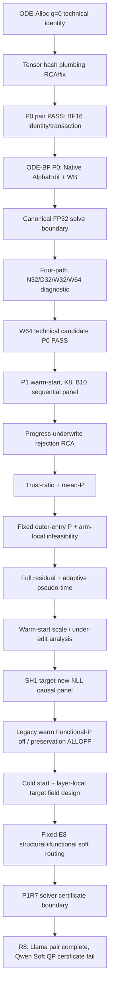
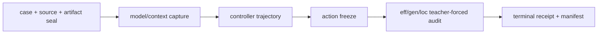
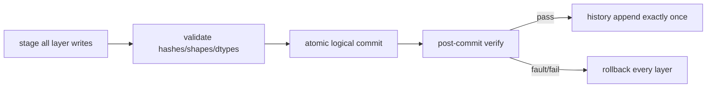

# ODE-BF 실험 파이프라인, 실행 계보, 관찰 결과 보고서

작성 기준 시각: 2026-08-08 KST
범위: SH2(Session 04) ODE-Alloc/ODE-BF 기술 검증부터 SH1(Session 05) fixed-E8 R8 pair terminal까지
상태: 실험·기술 보고서. 논문 성능 주장을 승인하는 문서가 아님

---

## 0. 이 문서가 답하는 질문

이 문서는 지금까지 실제로 무엇을 만들고, 어떤 순서로 실행했으며, 각 실패가 기술 오류인지 수치 경계인지 과학적 실패인지 구분하기 위해 작성했다. 특히 다음을 한 문서 안에서 추적한다.

1. 모델·데이터·평가기를 어떻게 고정했는가.
2. BF16 virtual edit와 실제 commit이 같은지를 어떻게 검증했는가.
3. Native AlphaEdit, Woodbury, warm start, full residual, adaptive pseudo-time, cold start, fixed E8로 설계가 왜 이동했는가.
4. efficacy를 올릴 때 pretrained-drift raw observable이 어떻게 변했는지, 반대로 임의 preservation threshold를 hard veto로 두면 왜 under-edit가 생겼는가.
5. layer routing이 특정 layer로 붕괴했는지 어떤 telemetry로 확인했는가.
6. 현재 P1R7이 과학 결과가 아니라 solver certificate 경계에서 멈춘 이유는 무엇인가.
7. 어떤 값은 직접 기록됐고, 어떤 값은 아직 기록되지 않았는가.

### 0.1 증거 표기

문서 전체에서 다음 표기를 사용한다.

| 표기 | 뜻 |
|---|---|
| **FACT** | source, lock, create-once receipt, terminal packet에서 직접 확인한 사실 |
| **INFERENCE** | FACT를 바탕으로 한 해석이며 직접 측정값과 구분함 |
| **NOT_RECORDED** | 해당 실행에서 저장되지 않아 사후 복원하지 않은 값 |
| **NOT_EXECUTED** | control flow가 해당 단계에 도달하지 않은 경우 |

### 0.2 증거의 위치와 한계

- **FACT — SH1:** 아래 Session 05 결과는 SH1 worktree의 `local/odebf/results/**` create-once receipt와 실행 source를 직접 읽어 확인했다.
- **FACT — SH2:** Session 04의 raw server2 root는 이 보고서 작성 workspace에 mount되어 있지 않다. SH2가 보낸 immutable terminal packet의 job/root/hash 사실과, SH1로 source-only handoff된 동일 계열 source/lock을 교차 확인했다.
- **FACT:** 어느 경우에도 hash만 남은 tensor나 수치를 역산하지 않았다.
- **FACT:** `scientific_promotion_authorized=false`인 causal/reused-seal run은 성능 우월성 근거로 승격하지 않는다.

---

## 1. 한눈에 보는 결론

### 1.1 지금까지 확실히 된 것

1. **BF16 technical path는 성립했다.**
   - mixed-FP64 reduced Woodbury(`W64`) 경로는 두 모델에서 residual certificate를 통과했다.
   - W64 virtual endpoint와 같은 W64를 실제 commit한 endpoint는 parameter bytes, logits, event가 exact였다.
   - fault injection rollback과 최종 W0 restore가 exact였다.

2. **Native dense와 Woodbury는 BF16 byte-exact가 아니다.**
   - Llama N32↔W64 mismatch 비율은 약 `1.71e-4`, Qwen은 약 `1.373e-2`였다.
   - 그러나 sealed P0 B10에서 official CF bit vector와 H/P/trust decision vector는 같았다.
   - 따라서 현재 정당한 명칭은 `W64 technical candidate`, Native exact replacement가 아니다.

3. **초기 under-edit의 주원인은 ODE가 본질적으로 약해서가 아니었다.**
   - 첫 P1은 잘못 큰 predicted progress를 trial에 그대로 요구해 모든 trial을 reject했다.
   - trust-ratio로 바꾼 뒤 accepted state가 생겼다.
   - functional-P 기준을 moving state가 아니라 fixed outer-entry로 바로잡은 뒤 acceptance와 efficacy가 크게 늘었다.

4. **legacy warm-start 계열에서 hard functional-P가 full edit를 막았다.**
   - Llama는 hard P 경로에서 `3/10`, P-off에서 `9/10`, preservation-influence-off full-τ에서 `10/10`까지 갔다.
   - Qwen도 P-off/ALLOFF에서 full-τ `10/10`에 도달했다.
   - 즉 해당 warm-start 계열에는 edit 능력이 있었지만, 관찰로 calibration되지 않은 preservation threshold가 진행을 멈췄다.

5. **legacy ALLOFF는 Native-level edit capacity를 보인 control이다.**
   - 여기서 ALLOFF는 ODE 전체를 끈 것이 아니다. Warm target state, refreshed full-residual field, layer routing, pseudo-time integration은 유지하고 structural/functional H/P의 routing·veto 영향만 0으로 만들었다.
   - efficacy/generalization은 Native와 같아졌고 locality count도 Native와 같거나 1 높았다.
   - Llama NEWNLL-ALLOFF terminal functional-P mean `0.08233`, Qwen `0.00250`은 기존 heuristic threshold `0.001`보다 크지만, threshold가 zero-write/native 분산으로 calibration되지 않았으므로 이를 곧바로 “model damage”로 해석하지 않는다. 둘 다 raw teacher-KL observable이다.
   - 이 결과만으로 ALLOFF를 최종 방법에서 배제하지 않는다. 같은-seal cold fixed-E8에서 Neutral과 Soft를 비교해 Soft가 실제 Eff/Gen/Loc 또는 retention 이득을 주는지 확인해야 한다.

6. **그래서 최신 설계는 fixed E8 + preservation soft routing이다.**
   - `K=8`, `h=1/8`, `τ=1`을 항상 끝까지 진행한다.
   - H/P 값은 scientific reject가 아니라 routing score로만 쓴다.
   - first-hit은 관찰만 하고 중단·선택에 쓰지 않는다.

7. **P1R7 numerical boundary를 수리한 R8에서 Llama terminal 결과를 얻었지만 pair는 미완성이다.**
   - 최신 R7에서도 Llama는 step 6 stage-2 KKT stationarity, Qwen은 step 1 SLSQP optimizer-success 경계에서 fail-close했다.
   - 따라서 P1R7 efficacy/gen/loc 최종 row는 **NOT_RECORDED**다.
   - R8은 neutral authoritative solve와 diagnostic soft shadow를 분리하고 independent mathematical certificate를 authority로 사용한다.
   - R8 `E8-NEUTRAL`은 source/lock audit상 `COLD-FR-E8-NEWNLL-ALLOFF`와 같은 semantic path다.
   - Llama `17697`은 Neutral과 Soft 모두 full tau를 완료했다. Neutral(ALLOFF)은 Eff `8/10`, Gen `12/20`, Loc `89/100`으로 Native `10/10`, `18/20`, `89/100`에 미달했다. Soft도 Eff `8/10`, Loc `89/100`은 같고 Gen만 `13/20`으로 1 증가했다.
   - Qwen `17698`은 Neutral(ALLOFF) full tau를 완료했지만 Soft step 3의 genuine QP certificate miss로 action freeze 전에 실패했다. Qwen Native/post-freeze Eff/Gen/Loc는 **NOT_RECORDED**다.

### 1.2 현재 가장 중요한 설계 판단

> 현재 데이터는 “임의 hard threshold로 edit를 veto하지 말라”를 강하게 지지한다. 그러나 hard veto를 없앤 것만으로 cold fixed-E8가 Native 수준에 도달하지는 않았다. Llama에서 Soft의 관찰 이득은 Gen `+1/20`뿐이었고 Qwen pair는 미완성이다. Soft를 최종적으로 유지할지는 추가 완전 pair와 sequential retention에서 실질적 이득이 확인될 때만 결정한다.

동시에 현재 fixed-E8 구현은 functional basis 48 endpoint/arm과 최대 104 optimizer backend invocation/arm이라는 큰 비용을 가진다. 이는 최종 방법 특성이 아니라, 다음 경량화 대상이다.

---

## 2. 전체 실행 계보

### 2.1 주요 phase 요약

| Phase | 핵심 질문 | 최종 상태 |
|---|---|---|
| ODE-Alloc P0 | q=0에서 Native와 technical identity가 가능한가 | 양 모델 PASS |
| ODE-BF P0 | W64 virtual/commit/rollback이 안전한가 | 양 모델 PASS, Native byte-equivalence 주장은 보류 |
| SH2 P1 warm K8 | barrier routing이 Native 수준 edit를 내는가 | under-edit, progress/P 원인 분리 |
| SH2 fixed-entry/full residual | moving P baseline과 residual pre-share 문제인가 | acceptance 및 Qwen efficacy 개선 |
| SH2 adaptive τ | reject가 time을 소비하지 않으면 나아지는가 | Llama 일부 개선, horizon 미완료; Qwen solver boundary |
| SH1 NEWNLL | target-new NLL 목적이 margin보다 나은가 | 일부 prefix 개선, hard P가 계속 제한 |
| SH1 warm P-off/ALLOFF | edit 잠재력이 실제로 남아 있는가 | full-τ에서 10/10 가능 확인, P는 uncalibrated raw observable |
| SH1 cold fixed-E8 R7 | 비용을 8 step으로 고정하면서 preservation을 soft routing에 넣을 수 있는가 | 구현됐으나 solver boundary로 scientific row 미완성 |
| SH1 cold fixed-E8 R8-R2 | cold ALLOFF(Neutral)와 Soft를 같은 seal에서 비교할 수 있는가 | Llama 완료: Neutral 8/10·12/20·89/100, Soft 8/10·13/20·89/100; Qwen pair 미완성 |

---

## 3. 재현성 경계: source, artifact, case, evaluator lock

### 3.1 source와 artifact

**FACT:** P0 artifact lock은 다음을 고정한다.

| 항목 | 고정값 |
|---|---|
| ODE-BF 원 proposal | commit `aac2f752...`, blob `d7d59943...`, SHA-256 `9524b58d...` |
| EasyEdit | git head `3488a66e...` |
| Llama | `Meta-Llama-3-8B-Instruct`, revision `8afb486c...`, BF16 |
| Qwen | `Qwen2.5-7B-Instruct`, revision `a09a3545...`, BF16 |
| target layers | 두 모델 모두 `[4,5,6,7,8]` down-proj |
| Llama projector | SHA-256 `6d356468...` |
| Qwen projector | SHA-256 `d3a9687d...` |
| 실행 환경 | `HF_HUB_OFFLINE=1`, `TRANSFORMERS_OFFLINE=1` |

**FACT:** source manifest는 path, size, SHA-256의 rooted digest로 묶고, 실행 helper는 exact HEAD/parent와 manifest를 다시 검증했다.

### 3.2 case seal

case는 outcome을 보기 전에 고정했다.

| Seal | 용도 | 핵심 계약 |
|---|---|---|
| P0 B10 | technical joint edit | genuine B10, 한 editor invocation, 두 모델 동일 request order |
| P1 stream | 4개의 ordered B10 | 최대 40 logical edits의 short sequential panel |
| P1R2 stream/P population | causal rerun | prior case 및 duplicate group 제외 |
| SH1 P1R6 fresh B10 | cold-start 이후 panel | fresh CF B10, prior 431 case 제외, outcome 접근 0 |
| P1R7 provenance | fixed-E8 | P1R6 B10 order를 그대로 재사용, fresh selection 0 |

**FACT:** P1R7 case provenance root는 `6e9832bb...`, source case root는 `94d6a970...`이다.

### 3.3 evaluator parity

#### CounterFact

한 request의 rewrite efficacy bit는 length-normalized suffix NLL로 계산한다.

\[
e_i = \mathbf 1\left[
\operatorname{NLL}_{\theta}(o_i^{new})
<
\operatorname{NLL}_{\theta}(o_i^{old})
\right].
\]

- efficacy: 10 requests × canonical rewrite prompt = `10` bits.
- generalization: 10 requests × 2 paraphrase prompts = `20` bits.
- locality/preservation: 10 requests × 10 neighborhood prompts = `100` bits.
- joint exact efficacy hit: `10/10`.

#### zsRE

zsRE는 각 target suffix 위치를 teacher forcing하고 full-vocabulary argmax가 정답 token인지 기록한다. 모든 request의 모든 suffix position이 맞아야 joint exact다.

**FACT:** 현재 SH1 P1 causal/fixed-E8 실행은 CounterFact다. zsRE metric contract는 구현·lock됐지만 이 결과표의 scientific outcome으로 실행되지 않았다.

### 3.4 controller/held-out firewall

**FACT:** controller는 rewrite training/controller contexts와 sealed P/H replay만 사용한다. paraphrase와 locality prompt는 action-freeze 뒤에만 연다.

**FACT:** 해당 causal run의 `generation_call_count=0`은 일반화가 측정되지 않았다는 뜻이 아니다. 일반화는 teacher-forced paraphrase metric이며 자유 생성은 하지 않았다는 뜻이다.

---

## 4. 공통 수학·시스템 구조

### 4.1 layer arm

layer \(l\)의 low-rank write arm은 다음처럼 표현한다.

\[
B_l = R_l Q_l^\top.
\]

초기 구현은 Native AlphaEdit처럼 residual을 remaining layer 수로 미리 나눴다. full-residual pivot 이후에는 모든 layer가 같은 current full residual 후보를 받고, routing coefficient가 분배를 결정한다.

### 4.2 structural H/P

누적 accepted update를 포함하면 H 또는 P의 structural risk는 공통적으로 다음 quadratic form이 된다.

\[
\mathcal R_j(v)
= d_j + 2h g_j^\top v + h^2 v^\top M_j v,
\qquad j\in\{H,P\}.
\]

- H: 과거 성공 edit의 projected key에 현재 arm이 주는 변화.
- P: pinned Wikipedia covariance \(C_l^0\)에서의 평균 local disturbance.

\[
c_{P,l}
=\operatorname{tr}(B_l C_l^0 B_l^\top)
=\mathbb E_{k\sim\mathcal D_0}\|B_l k\|_2^2.
\]

**FACT:** B10-1은 active history가 0이므로 H는 수학적으로 존재하지만 decision 관점에서는 vacuous였다.

### 4.3 functional P

theta0 teacher에 대한 KL drift의 outer-entry incremental positive part를 사용했다. 이 값은 pretrained-distribution 변화의 raw observable이며, 별도 calibration 없이 곧바로 downstream damage와 동일시하지 않는다.

\[
D_P(W)
=\frac1{|\mathcal B_P|}
\sum_{x\in\mathcal B_P}
\left[
KL(p_{\theta_0}\|p_W)
-KL(p_{\theta_0}\|p_{W_{entry}})
\right]_+.
\]

초기 구현의 waypoint baseline은 accepted virtual state에 따라 이동했지만 terminal은 outer-entry 기준이었다. 이것이 waypoint 통과 후 terminal P 실패를 만드는 불일치였다. P1R3에서 waypoint와 terminal 모두 fixed outer-entry로 고정했다.

### 4.4 초기 QCQP

초기 BF router는 다음 형태의 minimum-capacity solve였다.

\[
\begin{aligned}
\min_{0\le y_l\le 1}\quad & \tfrac12 y^\top Qy\\
\text{s.t.}\quad
&a^\top y\ge p,\\
&\mathcal R_H^{str}(y)\le B_H,\\
&\mathcal R_P^{str}(y)\le B_P,\\
&y^\top M_{trust}y\le h_{trust}^2.
\end{aligned}
\]

초기 budget은 각각 nominal self-risk 증가의 `0.5`를 허용하는 heuristic이었다. 관찰 기반 calibration이 아니었다.

### 4.5 target objective

두 objective를 분리해 실험했다.

Margin objective:

\[
\Phi_{margin}(W)
=\frac1{10}\sum_i
\left[
NLL_W(o_i^{new})-NLL_W(o_i^{old})
\right].
\]

Target-new-only objective:

\[
\Phi_{new}(W)
=\frac1{10}\sum_i NLL_W(o_i^{new}).
\]

**FACT:** NEWNLL router에서 target-old는 routing gradient와 target-z velocity에 영향을 주지 않고, official CF success 계산에만 남는다.

### 4.6 BF16 endpoint semantics

authoritative trial은 FP32 overlay 자체가 아니라 다음 BF16 effective weight다.

\[
W_l^{eff}=Q_{BF16}(W_{l,entry}+\Delta_l).
\]

- 한 번에 target layer 한 개의 effective BF16 weight만 materialize.
- dense FP32/FP64 full delta를 계속 보관하지 않음.
- virtual trial과 committed candidate는 같은 assembler/order를 사용.

---

## 5. P0: plumbing에서 W64 technical candidate까지

### 5.1 ODE-Alloc q=0 technical identity

| 실행 | Job | 결과 | 분류 |
|---|---:|---|---|
| ODE-Alloc R1 | 16333/16334 | factor tensor hash 경로 RuntimeError | plumbing |
| ODE-Alloc R2 | 16337/16338 | exact leaf `tensor_sha256` 재현 | RCA |
| ODE-Alloc R3 | 16344/16345 | 양 모델 complete, q=0 identity/transaction PASS | technical PASS |

R3에서 확인한 계약:

- 5 layers, rank 1, CPU float64 factor structure.
- original model과 관찰 parameter 모두 BF16.
- Native == q0 parameter bytes, logits, event.
- injected rollback, final W0 restore, pointer/version/grad/RNG invariant.
- scientific outcome, held-out generation/evaluation은 0.

### 5.2 ODE-BF P0 실패와 수리 계보

| Pair | Job | 최초 경계 | 의미 |
|---|---:|---|---|
| R0 | 16486/16487 | FP32 projector × BF16 key matmul | original-BF16 AlphaEdit solve plumbing |
| R1 | 16503/16504 | dense Native와 WB BF16 bytes 불일치 | algebraic equivalence ≠ BF16 byte identity |
| R2 | 16532/16533 | request digest domain mismatch; Qwen W32 residual miss | diagnostic/receipt + W32 numerical boundary |
| R3 | 16578/16579 | `device_class` vs `solve_device_class` | receipt field plumbing |
| R4 | 16593/16594 | 두 모델 complete | W64 technical candidate PASS |

### 5.3 four-path diagnostic

같은 source inputs로 네 경로를 비교했다.

| 기호 | 연산 |
|---|---|
| N32 | `solve(A32, G32 @ R32.T)` |
| D32 | `solve(A32, G32) @ R32.T` |
| W32 | FP32 Woodbury/reconstruction |
| W64 | FP64 reduced Woodbury → 동일 FP32/BF16 assembler |

**FACT:** 결합 순서와 reduced precision이 다르면 BF16 quantization 뒤 byte가 달라졌다.

| 모델 | N32↔W64 mismatches | 비율 | max abs |
|---|---:|---:|---:|
| Llama | 50,218 / 293,601,280 | 0.0001710 | 0.00048828125 |
| Qwen | 4,661,344 / 339,476,480 | 0.0137310 | 0.0009765625 |

**FACT:** 그럼에도 sealed B10에서 N32와 W64 official CF event vector 및 H/P/trust decision vector는 exact parity였다.

### 5.4 P0 R4 hard gates

양 모델 모두:

- genuine joint B10, rank 10, direct-z initialization 10.
- W64 residual \(\eta\le10^{-5}\) PASS.
- W64 virtual vs committed parameter bytes/logits/event exact.
- rollback write point `[0,2,4]` exact, final W0 restore exact.
- W32 fallback 0.
- persistent endpoint commit 0, history append 0, scientific outcome 0.

**INFERENCE:** 이후 P1에서 W64를 authoritative technical backend로 사용할 근거는 생겼다. 그러나 N32 exact equivalence 또는 scientific superiority 근거는 아니다.

---

## 6. SH2 P1: warm-start K8에서 fixed-entry/full-residual까지

### 6.1 첫 sequential B10 Native-floor run

pre-model CUDA reset 오류를 수리한 P1R1(16641/16642)은 B10-1에서 다음 결과를 냈다.

| 모델/arm | efficacy | gen | loc |
|---|---:|---:|---:|
| Llama N32 Native | 10/10 | 20/20 | 89/100 |
| Llama F_G / F_BF / R_BF | 1/10 | 1/20 | 92/100 |
| Qwen N32 Native | 10/10 | 20/20 | 88/100 |
| Qwen F_G / F_BF / R_BF | 2/10 | 3/20 | 89/100 |

**FACT:** non-Native arms는 8 slots 모두 reject하여 사실상 W0/no-op endpoint였다.

### 6.2 rejection RCA

초기 accept gate는 solver가 예측한 requested progress \(p\) 전체를 BF16 trial이 실현해야 했다.

**FACT:** 144/144 trial에서 actual progress는 양수였지만 `actual >= p`는 0/144였다.

| 모델/arm | largest-beta actual / p |
|---|---:|
| Llama F_G | 25.54% |
| Llama F_BF/R_BF | 27.31% |
| Qwen F_G | 36.80% |
| Qwen F_BF/R_BF | 40.51% |

Functional-P도 112/144 trial에서 raw-max budget을 넘었지만, P를 통과한 32 trial도 progress 때문에 reject했다. 따라서 universal cause는 `RAW_FIELD/PROGRESS_FAILURE`였다.

### 6.3 trust-ratio와 mean-P

P1R2는 acceptance를 다음처럼 바꿨다.

\[
\rho=\frac{\text{actual progress}}
{\max(\text{predicted}_\beta,10^{-8})},
\qquad
\text{accept if actual}>10^{-8},\ \rho\ge0.1.
\]

functional-P hard decision도 raw-max가 아니라 samplewise positive-part의 uniform mean `≤0.001`로 바꿨다.

### 6.4 terminal component diagnostic

16675/16676은 F_G의 in-memory K8 telemetry를 append-safe하게 기록했다.

| 모델 | accepted slots | terminal efficacy | terminal P mean | P budget | 최종 false component |
|---|---:|---:|---:|---:|---|
| Llama | 8/8 | 4/10 | 0.001867 | 0.001 | terminal P |
| Qwen | 8/8 | 6/10 | 0.001143 | 0.001 | terminal P |

여기서 waypoint P는 current virtual state를 baseline으로 삼고 terminal P는 outer-entry를 baseline으로 삼는 source mismatch가 발견됐다.

### 6.5 fixed outer-entry + arm-local continuation

P1R3(16677/16678)은 P baseline을 전체 trajectory에서 outer-entry로 고정하고, 한 arm의 infeasible이 다음 arm을 막지 않게 했다.

| 모델 | Arm | acc/rej | efficacy | terminal P | 최종 상태 |
|---|---|---:|---:|---:|---|
| Llama | F_G | 7/1 | 3/10 | 0.001335 | terminal-P infeasible |
| Llama | F_BF | 6/2 | 4/10 | 0.001203 | terminal-P infeasible |
| Llama | R_BF | 6/2 | 4/10 | 0.003013 | terminal-P infeasible |
| Qwen | F_G | 8/0 | 6/10 | 0.001297 | terminal-P infeasible |
| Qwen | F_BF | 7/1 | 5/10 | 0.000823 | feasible, no exact hit |
| Qwen | R_BF | 7/1 | 10/10, first hit 7 | 0.001291 | terminal-P infeasible |

**INFERENCE:** baseline 정합성 수리는 acceptance를 실제로 회복했다. 동시에 exact efficacy hit이 preservation feasibility와 같은 것은 아님을 Qwen R_BF가 보여줬다.

---

## 7. full residual과 adaptive pseudo-time

### 7.1 full residual pivot

이전 pre-share:

\[
R_l=\frac{z_s-z_l^{current}}{\#\text{remaining layers}}.
\]

full residual:

\[
R_l=z_s-z_l^{current},\qquad \forall l.
\]

각 layer가 같은 full residual candidate를 받고 routing이 allocation을 결정하도록 바꿨다.

Legacy full-residual pair(16681/16682)의 R_BF online efficacy:

| 모델 | accepted/rejected | stepwise efficacy | terminal P | 결론 |
|---|---:|---|---:|---|
| Llama | 4/4 | 2→2→2→4→6→6→6→9→9 | 0.009932 | 9/10까지 갔지만 P fail |
| Qwen | 5/3 | 0→4→4→9→10→10→10→10→10 | 0.001409 | step 4 exact hit, P fail |

**NOT_RECORDED:** 이 legacy pair에는 stepwise gen/loc와 numeric NLL vector, routing coefficient vector가 저장되지 않았다.

### 7.2 adaptive clock

adaptive 설계는 다음을 분리하려 했다.

\[
\tau_{n+1}=\tau_n+\Delta\tau_n,
\qquad
W_{n+1}=W_n+\Delta\tau_n F_{BF}(W_n).
\]

- reject는 \(\tau\)와 accepted index를 소비하지 않는다.
- 같은 state/field에서 \(\Delta\tau\)만 줄여 retry한다.
- accept 후에만 field를 refresh한다.
- target-z와 weight가 같은 \(\Delta\tau\)를 사용한다.

변형:

| Variant | residual | step 정책 |
|---|---|---|
| PS-S8 | pre-share | legacy fixed 8 slots, reject도 slot 소비 |
| PS-A8 | pre-share | adaptive, max dt 1/8 |
| FR-A8 | full residual | adaptive, max dt 1/8 |
| FR-A16 | full residual | adaptive, max dt 1/16 |

### 7.3 Llama adaptive 결과

| Variant | τ | Kacc | trial/reject | eff | gen | loc | final P |
|---|---:|---:|---:|---:|---:|---:|---:|
| PS-S8 | 0.625 | 5 | 24/12 | 4/10 | 8/20 | 82/100 | 0.003292 |
| PS-A8 | 0.375 | 3 | 8/5 | 3/10 | 6/20 | 83/100 | 0.001355 |
| FR-A8 | 0.125 | 1 | 6/5 | 3/10 | 6/20 | 83/100 | 0.001445 |
| FR-A16 | 0.125 | 3 | 7/4 | 3/10 | 6/20 | 83/100 | 0.001172 |

**FACT:** 모든 adaptive variant가 τ=1 전에 same-state retry/min-dt 경계에서 멈췄다. 당시 `COMPUTE_CAP_UNRESOLVED` label은 실제 aggregate trial cap 128이 아니라 retry/min-dt exhaustion도 같이 가리킨 observational defect였다.

### 7.4 routing concentration

Llama의 마지막 관찰 state는 특정 한 layer로 붕괴하지 않았다.

| Variant | top1 | top2 | HHI | effective layers |
|---|---:|---:|---:|---:|
| PS-S8 | 0.239 | 0.448 | 0.203 | 4.924 |
| PS-A8 | 0.238 | 0.459 | 0.204 | 4.907 |
| FR-A8 | 0.264 | 0.498 | 0.214 | 4.675 |
| FR-A16 | 0.251 | 0.500 | 0.216 | 4.624 |

**INFERENCE:** Llama under-edit를 initial routing collapse로 설명할 근거는 없다. 주요 limiter는 first FR accept 이후의 functional-P와 미완료 pseudo-time이었다.

### 7.5 Qwen solver boundary와 warm start

Qwen은 initial PS-S8에서:

- dt=1/8: P `0.0010726`로 reject.
- dt=1/16: P `0.0008958`로 accept.
- 다음 accepted-state field rebuild에서 solver certificate fail.

관찰 전용 재실행에서는 같은 candidate prefix가 재현됐지만 다음 solve는 PASS했다. 따라서 분류는 `NONDETERMINISTIC_OR_INSTRUMENTATION_SENSITIVE`였다.

warm displacement:

| 모델 | \(\|z_{native}-z_{base}\|_F\) |
|---|---:|
| Llama | 15.46395 |
| Qwen | 466.92258 |

**FACT:** W0/no-write P는 0이다. target-z alone은 functional-P evaluator의 입력이 아니므로 `NOT_APPLICABLE`이다.

**INFERENCE:** warm start는 특히 Qwen에서 field scale을 크게 만드는 upstream contributor지만, initial functional-P 자체를 직접 위반한 것은 아니다.

---

## 8. SH1 causal panel: objective와 preservation veto 분리

SH1은 SH2 scientific source commit `18d13f...`를 source-only handoff 받아, warm start는 유지한 채 objective와 P decision을 먼저 분리했다.

### 8.1 target-new-NLL routing

| 모델 | Variant | τ | efficacy | gen | loc | terminal P |
|---|---|---:|---:|---:|---:|---:|
| Llama | MARGIN | 0.125 | 3/10 | 6/20 | 83/100 | 0.001445 |
| Llama | NEWNLL | 0.125 | 3/10 | 6/20 | 83/100 | 0.001752 |
| Qwen | MARGIN | 0.03125 | 1/10 | 6/20 | 81/100 | 0.001034 |
| Qwen | NEWNLL | 0.0625 | 4/10 | 7/20 | 80/100 | 0.001259 |

W0 / Native references:

| 모델 | W0 eff/gen/loc | N32 eff/gen/loc |
|---|---|---|
| Llama | 2/10, 3/20, 84/100 | 10/10, 20/20, 79/100 |
| Qwen | 0/10, 4/20, 80/100 | 10/10, 20/20, 80/100 |

**INFERENCE:** NEWNLL은 Qwen prefix에서는 도움이 됐지만 Llama hard-P trajectory에서는 단독 해결책이 아니었다.

### 8.2 functional-P decision off

Llama P1R3에서 같은 후보를 관찰하되 functional-P decision influence만 0으로 만들었다.

| Arm | τ | efficacy | gen | loc | terminal P observed |
|---|---:|---:|---:|---:|---:|
| MARGIN-PCTRL | 0.125 | 3/10 | 6/20 | 83/100 | 0.001445 |
| NEWNLL-PCTRL | 0.125 | 3/10 | 6/20 | 83/100 | 0.001752 |
| MARGIN-FPOFF | 0.5 | 9/10 | 18/20 | 80/100 | 0.018373 |
| NEWNLL-FPOFF | 0.5 | 9/10 | 18/20 | 80/100 | 0.018019 |

**FACT:** Qwen P-off pair는 terminal artifact가 없어 같은 표를 만들 수 없다. **NOT_RECORDED**.

### 8.3 legacy warm-start preservation-influence-off(ALLOFF) full-τ

이 panel은 **cold fixed-E8가 아니라 이전 warm-start 계열**이다. 모든 H/P preservation decision influence를 0으로 만들되, target dynamics, refreshed field, dynamic layer allocation, pseudo-time integration, positive progress, layer cap, BF16 transaction, solver certificate는 유지했다. 따라서 ALLOFF는 “barrier influence off”이지 “ODE off”나 단순 Native write가 아니다.

| 모델 | Variant | τ | eff | gen | loc | terminal P observed |
|---|---|---:|---:|---:|---:|---:|
| Llama | MARGIN-ALLOFF | 1.0 | 10/10 | 20/20 | 80/100 | 0.075608 |
| Llama | NEWNLL-ALLOFF | 1.0 | 10/10 | 20/20 | 80/100 | 0.082328 |
| Qwen | MARGIN-ALLOFF | 1.0 | 10/10 | 20/20 | 80/100 | 0.002699 |
| Qwen | NEWNLL-ALLOFF | 1.0 | 10/10 | 20/20 | 80/100 | 0.002500 |

**FACT:** Llama NEWNLL-ALLOFF의 final layer coefficient shares는 `[0.0532, 0.1015, 0.1913, 0.2850, 0.3690]`, effective layer count `3.744`, top1 `0.369`였다. severe collapse 기준에는 해당하지 않았다.

**FACT:** 위 terminal P 값은 outer-entry teacher-KL 기반 raw observable이다. 기존 `0.001`은 no-op/native 분산에서 calibration한 damage threshold가 아니므로, `0.082328` 또는 `0.002500`을 그 자체로 “모델이 해당 비율만큼 손상됐다”고 읽을 수 없다.

**INFERENCE:** 이 warm-start 계열에서 full edit capacity는 충분했다. 다만 이 결과는 cold-start fixed-E8의 성능을 직접 증명하지 않는다. 또한 ALLOFF를 자동으로 “최종 방법이 아닌 upper bound”로 제외하지 않는다. 같은 seal에서 cold Neutral(ALLOFF)과 Soft의 Eff/Gen/Loc, absolute NLL, Native-relative teacher-KL 및 이후 historical retention을 비교해 최종 후보를 결정한다.

### 8.3.1 cold fixed-E8 ALLOFF R8 결과

R8 source/lock audit에서 `E8-NEUTRAL`은 다음 의미로 확인됐다.

- `z0=z_base` cold start, Native/direct-z controller access 0.
- TARGET_NEW_NLL, genuine B10, layers `[4,5,6,7,8]`.
- layer-local full-current residual과 layer-local target field.
- fixed `K=8`, `h=1/8`, `tau=1`; first-hit decision influence 0.
- structural/functional H/P score, legacy budget, hard veto의 selected velocity/state/clock/endpoint 영향 0.
- technical progress, physical write-trust, independent solver certificate, W64/BF16 transaction은 유지.

따라서 R8 `E8-NEUTRAL`을 raw-free semantic alias `COLD-FR-E8-NEWNLL-ALLOFF`로 채택했다. 별도 R9 pair는 중복이라 제출하지 않았다. Diagnostic Soft shadow는 matched observability/cost를 위해 계산될 수 있지만 Neutral의 authoritative velocity나 endpoint를 바꾸지 않는다. Local raw-free alias receipt는 `local/odebf/analysis/s05-fixed-e8-neutral-alloff-alias.json`, SHA-256 `8be0104eb602590c7f7c6aa6d5f1a52f5edfa988fe7711f6c6a7f6df818da7ad`다.

Authoritative executed checkpoint는 `3711f371c16e360d809dd5f0b4b1a5271a870c26`이다.

| 모델/arm | 상태 | Eff | Gen | Loc | mean NLL-new | mean NLL-old | margin |
|---|---|---:|---:|---:|---:|---:|---:|
| Llama W0 | post-freeze | 0/10 | 1/20 | 89/100 | NOT_RECORDED | NOT_RECORDED | NOT_RECORDED |
| Llama N32 Native | complete | 10/10 | 18/20 | 89/100 | 0.001237 | 12.71875 | 12.71751 |
| Llama Neutral(ALLOFF) | full tau complete | 8/10 | 12/20 | 89/100 | 2.60296 | 5.36875 | 2.76579 |
| Llama Soft | full tau complete | 8/10 | 13/20 | 89/100 | 2.62136 | 5.41484 | 2.79349 |
| Qwen Neutral(ALLOFF) | full tau complete | NOT_RECORDED | NOT_RECORDED | NOT_RECORDED | NOT_RECORDED | NOT_RECORDED | NOT_RECORDED |
| Qwen Soft | step 3 numerical fail | NOT_RECORDED | NOT_RECORDED | NOT_RECORDED | NOT_RECORDED | NOT_RECORDED | NOT_RECORDED |

**FACT:** Llama에서는 Soft가 Neutral과 동일한 Eff/Loc를 유지하며 Gen을 `+1/20` 높였지만, 두 cold arm 모두 Native Eff/Gen에는 미달했다. 따라서 최신 cold ALLOFF가 legacy warm ALLOFF의 Native-level 결과를 재현했다는 주장은 기각된다.

**FACT:** Qwen Neutral은 tau=1까지 완료했지만 Soft가 action freeze 전에 실패하여 post-freeze evaluator와 N32 panel이 열리지 않았다. Neutral의 online/controller 수치를 official terminal Eff/Gen/Loc로 대체하지 않는다.

### 8.4 P-soft + hard P

parameter-free P-soft routing을 추가했지만 hard P veto는 유지한 panel:

| 모델 | Variant | τ | eff | gen | loc | terminal P |
|---|---|---:|---:|---:|---:|---:|
| Llama | PCTRL probe | 0.125 | 3/10 | 6/20 | 83/100 | 0.001752 |
| Llama | PSOFT-HARD | 0.125 | 3/10 | 6/20 | 83/100 | 0.001149 |
| Llama | FPOFF probe | 0.5 | 9/10 | 18/20 | 80/100 | 0.018019 |
| Qwen | PCTRL probe | 0.0625 | 4/10 | 7/20 | 80/100 | 0.001259 |
| Qwen | PSOFT-HARD | 0.015625 | 1/10 | 6/20 | 81/100 | 0.001450 |
| Qwen | FPOFF probe | 1.0 | 10/10 | 20/20 | 80/100 | 0.002675 |

Qwen PSOFT-HARD final BF coefficient는 사실상 layer 4에 몰렸다(top1 약 `0.99999995`, effective layers 약 `1.0000001`).

**INFERENCE:** soft score를 넣고도 hard veto를 유지하면 under-edit가 해결되지 않았다. 또한 soft geometry가 특정 state에서 severe concentration을 만들 수 있으므로 stepwise routing telemetry가 필수다.

---

## 9. cold start 설계

### 9.1 왜 Native direct-z warm start를 제거했는가

warm start는 edit target을 빠르게 주지만:

- ODE가 `z_base`에서 출발한다는 claim을 약화한다.
- Qwen처럼 Native displacement가 큰 모델에서 field scale을 크게 만든다.
- Native direct-z 자체의 계산을 방법 비용에 포함시킨다.

따라서 cold path는 \(z_0=z_{base}\)에서 시작하고 Native-z를 controller metric, radius, gradient, fallback에 넣지 않는다.

### 9.2 cold bootstrap

bootstrap objective는 genuine B10 target-new suffix NLL뿐이다.

\[
\Phi_{boot}(z)=\frac1{10}\sum_i NLL(o_i^{new};z).
\]

metric:

\[
G_i=I/\|z_{base,i}\|_2^2,
\qquad
v_z=-G^{-1}\nabla_z\Phi/\|\nabla_z\Phi\|_{G^{-1}}.
\]

- \(\lambda_z=0\).
- boot clock와 joint clock을 분리.
- target-only bootstrap state는 first-hit/endpoint로 세지 않음.
- joint 진입 뒤 target-z와 weight는 같은 dt를 사용.

### 9.3 layer-local target field 수리

각 layer의 target overlay를 다음으로 고정했다.

\[
R_l(z_s)+(z-z_s).
\]

terminal layer 하나의 `current_z`를 모든 layer에 재사용하던 coupling을 제거했다. five-layer distinct residual fixture, finite-difference/autograd parity, one-layer perturbation isolation을 통과했다.

### 9.4 P1R6이 실행되지 않은 이유

P1R6 adaptive cold panel은 다음 설계 충돌을 남겼다.

- `dt_min=1/128`, `K_acc_cap=32`이면 최악에는 τ=0.25에서 cap에 걸릴 수 있음.
- 그런데 method contract는 full τ=1을 요구함.
- adaptive retry는 계산량을 8회보다 훨씬 크게 만들 수 있음.

따라서 P1R6을 그대로 제출하지 않고 fixed-E8 pivot으로 이동했다.

---

## 10. 현재 비교 방법: fixed E8 cold Neutral(ALLOFF) vs structural+functional Soft

method id:

`COLD-FR-E8-NEWNLL-STRUCTSOFT-FUNCSOFT-FULLTAU`

### 10.1 고정 시간축

\[
K=8,\qquad h=1/8,\qquad \tau_k=k/8,\qquad \tau_8=1.
\]

- adaptive retry/backtracking 없음.
- scientific veto 없음.
- 매 grid에서 정확히 한 transition.
- first hit은 receipt에 기록하지만 stop/select/commit/dt에 영향 0.
- zero-write field도 target recovery를 수행하며 grid 한 칸을 소비한다.

### 10.2 두 arm

| Arm | 역할 |
|---|---|
| E8-NEUTRAL | progress/technical write-trust set 안에서 minimum capacity; H/P decision influence 0인 cold ALLOFF semantic alias |
| E8-SOFT | 동일 field/probe schedule에서 worst normalized H/P score를 먼저 최소화하고 capacity를 tie-break |

두 arm은 field, probe, evaluator schedule을 맞춰 soft routing 차이만 보도록 설계했다. `E8-NEUTRAL`에서도 ODE target evolution, refreshed field, layer routing과 8-step Euler integration은 계속 작동한다. 꺼진 것은 preservation H/P가 routing과 accept/reject에 미치는 영향이다.

### 10.3 technical feasible set

\[
0\le v_l\le1,
\qquad
a^\top v\ge\kappa p_{max},
\qquad \kappa=0.25.
\]

write trust는 integration bound로 유지한다. 기존 heuristic H/P budget은 hard constraint에서 제거했다.

### 10.4 soft score

structural score 예:

\[
s_j(v)=
\frac{
[2h g_j^\top v+h^2v^\top M_jv]_+
}{\max(\epsilon,\operatorname{tr}M_j)}.
\]

functional basis로 얻은 layer별 positive slope도 정규화해 score로 사용한다.

E8-SOFT는 lexicographic하게:

1. active structural/functional score 중 최댓값 \(\xi\) 최소화.
2. \(\xi\le\xi^*+10^{-8}\) 안에서 capacity 최소화.

### 10.5 functional basis endpoint 48의 정확한 의미

매 field에서 functional secant basis를 만들기 위해 다음 6개 endpoint를 평가한다.

1. **baseline 1개:** 현재 accepted virtual factors를 적용한 현재 state.
2. **layer probe 5개:** 현재 state에 layer 4, 5, 6, 7, 8의 full-`h` basis update를 각각 하나씩 더한 endpoint.

따라서:

\[
6\ \text{endpoints/field}\times8\ \text{fields}
=48\ \text{endpoints/arm}.
\]

중요한 해석:

- baseline은 W0도, Native도 아니다.
- baseline은 각 field 시작 시점의 **현재 accepted virtual endpoint**다.
- probe increment는 `probe - baseline`으로 functional-P/H layer slope를 만든다.
- H와 P가 같은 forward endpoint를 공유하므로 H가 활성화돼도 endpoint 개수 자체는 6으로 유지할 수 있다.
- 그러나 history item을 replay하는 token/forward work는 history sample size에 따라 늘어난다.
- recent/reservoir cap을 두지 않으면 lifelong edit에서 history replay 비용이 누적 증가한다.

### 10.6 48 외의 endpoint/연산

per arm 고정 ceiling:

| 항목 | 수 |
|---|---:|
| field | 8 |
| functional basis endpoint | 48 |
| candidate functional audit | 8 |
| terminal audit | 8 |
| rewrite evaluations | 9 |
| target backward batches | 8 |
| field backward batches | 8 |
| mathematical QPs | 32 |
| scientific retry | 0 |

즉 48은 전체 evaluation 수가 아니라 functional basis용 endpoint만 센 값이다.

### 10.7 왜 NEUTRAL(ALLOFF)도 diagnostic soft QP를 계산하는가

현재 matched-compute 설계는 NEUTRAL arm에서도 soft stage를 diagnostic shadow로 계산한 뒤 최종 velocity로 neutral solution을 고른다. 그래야 두 arm의 probe/solver schedule이 같아진다. 과학적 비교에는 장점이 있지만 production 비용에는 불리하다. 이 추가 계산 때문에 현재 R8 Neutral은 **decision-semantic ALLOFF**이지만 최소 연산량의 production ALLOFF는 아니다.

다만 **matched compute는 diagnostic shadow를 authoritative dependency로 만들 이유가 아니다.** 동일한 field, functional probe, evaluator schedule과 solver 호출 기회를 유지하더라도, E8-NEUTRAL에서 사용하지 않는 soft stage가 수치적으로 실패하면 다음처럼 arm-local하게 처리해야 한다.

- soft shadow 시도와 비용은 그대로 기록한다.
- 실패는 `SOFT_SHADOW_NUMERIC_UNAVAILABLE` 같은 typed diagnostic으로 직렬화한다.
- 이미 certificate를 통과한 neutral velocity의 선택, candidate, clock, endpoint에는 영향 0이어야 한다.
- 반대로 E8-SOFT에서는 그 soft solve가 authoritative하므로 같은 실패를 fail-close한다.

최신 Llama R7은 바로 이 구분이 없어서 중단됐다. 선택된 arm은 E8-NEUTRAL이었지만, neutral velocity를 반환하기 전에 계산한 **미사용 soft stage-2 shadow**의 stationarity failure가 전체 arm을 abort했다. 이는 method의 preservation 실패가 아니라 harness dependency 문제다. Qwen은 authoritative `neutral-minimum-capacity` 자체가 실패했으므로 이 예외 처리로 우회할 수 없다.

---

## 11. routing telemetry와 collapse 판정

매 step/field/trial/accepted/final에서 ordered layers `[4,5,6,7,8]`에 대해 다음을 기록한다.

- signed routing efficiency.
- raw velocity, pre-soft BF velocity, soft velocity.
- applied coefficient \(\theta=h v\).
- predicted progress contribution.
- structural H/P, trust contribution.
- prequantized update energy와 realized BF16 energy.
- top1/top2 share, HHI, effective-layer count, entropy, Gini, depth centroid.
- raw→BF L1/cosine/JS divergence와 top-layer change.

collapse 경고 예:

- top1 share ≥0.8.
- effective layer count ≤1.5.

**FACT:** telemetry는 observation-only이며 controller input이 아니다. telemetry on/off가 state bytes를 바꾸지 않는 회귀 계약이 있다.

관찰 예:

| 실행 | top1 | effective layers | 판정 |
|---|---:|---:|---|
| SH2 Llama initial FR-A8 | 0.2666 | 4.643 | distributed |
| SH1 Llama NEWNLL-ALLOFF final | 0.3690 | 3.744 | distributed |
| SH1 Qwen PSOFT-HARD final | ≈1.0 | ≈1.0 | severe collapse |

---

## 12. transaction, rollback, state purity

### 12.1 virtual trial

각 candidate는 cumulative low-rank factor로만 구성하고, effective BF16 weight를 streaming materialize한다. trial 후 persistent model parameter는 원상태여야 한다.

### 12.2 atomic commit

terminal materialization이 허용된 경우에만 모든 target layer를 하나의 logical transaction으로 commit한다.

### 12.3 검증된 invariants

- virtual W64 == committed W64 parameter bytes/logits/event.
- injected early/middle/late write failure rollback exact.
- final W0 restore exact.
- pointer/version/grad/RNG invariant.
- rejected trial은 weight/history/load/sampler/cache version을 바꾸지 않음.
- persistent endpoint commit과 history append는 causal diagnostics에서 0.

---

## 13. 계산량과 확장성

### 13.1 P0 resource 관찰

| 모델 | peak allocated | peak reserved | process MaxRSS |
|---|---:|---:|---:|
| Llama P0 R4 | 20,821 MiB | 22,030 MiB | 12,843 MiB |
| Qwen P0 R4 | 24,137 MiB | 25,058 MiB | 19,962 MiB |

### 13.2 adaptive 설계의 비용 문제

adaptive P1R4 lock은 variant 전체에서 최대 408 trials, 138 post-freeze states까지 허용했다. 실제로는 더 일찍 retry/min-dt에서 멈췄지만, 적용 가능한 final method로는 상한이 너무 컸다.

### 13.3 fixed-E8의 장점과 남은 비용

장점:

- scientific transitions는 정확히 8.
- retry/backtracking 0.
- τ=1 completion이 구조적으로 명확.
- first-hit 이후에도 같은 grid를 끝까지 관찰.

남은 비용:

- functional basis 48 endpoint/arm.
- 두 arm이면 96 endpoint.
- candidate/terminal audit까지 포함하면 더 많은 replay forward가 필요.
- historical sample이 커지면 endpoint 수는 같아도 endpoint당 replay work가 증가.

### 13.4 최신 a907 numerical continuation ceiling

P1R7 solver boundary를 tolerance 완화 없이 재확인하기 위해 same-QP certificate continuation을 추가했다.

현재 lock의 ceiling:

| 항목 | per arm | two arms |
|---|---:|---:|
| mathematical QPs | 32 | 64 |
| nominal backend calls | 40 | 80 |
| certificate continuation ceiling | 64 | 128 |
| total optimizer backend invocation ceiling | 104 | 208 |

**INFERENCE / SCALABILITY WARNING:** `104 optimizer calls/arm`은 최종 ODE-BF의 본질적 특성이 아니다. 현재 SLSQP certificate 경계를 관찰하기 위한 repair-chain 상한이며 production method로 채택하면 계산량 목표에 어긋난다.

---

## 14. 실패 분류 규칙

### 14.1 technical plumbing

예:

- tensor byte-view/hash.
- CUDA current-device/reset 순서.
- FP32 projector와 BF16 key dtype.
- receipt field name/schema/root digest.
- launcher token/source manifest/namespace.
- GPU identity와 free-capacity 의미 혼동.

처리: scientific semantics를 바꾸지 않는 최소 수리, focused regression, distinct create-once root.

### 14.2 numerical boundary

예:

- solver `success=false`인데 primal/KKT residual은 tolerance 안에 있음.
- solver success는 true지만 stationarity가 locked `1e-5`를 조금 넘음.
- same-QP continuation으로도 certificate가 통과하지 않음.

처리: tolerance를 몰래 늘리지 않음. solver/precision/continuation policy는 명시적 numerical decision 대상.

### 14.3 scientific/mechanistic failure

예:

- Native-floor efficacy/gen/loc 미달.
- exact hit 없음.
- full-τ 전에 functional-P가 계속 veto.
- legacy warm ALLOFF에서는 edit되며 raw teacher-KL이 증가함. 이 증가는 calibration되지 않은 observable이므로 그 자체를 damage 판정으로 부르지 않음.
- routing collapse.

처리: 결과로 인정하고 redesign/ablation 근거로 사용. plumbing hotfix처럼 취급하지 않음.

---

## 15. P1R7 실행 계보와 R8 수리·재실행

### 15.1 기술 수리 계보

| Commit/Pair | 경계 | 분류 |
|---|---|---|
| `7faa432` initial | fixed-E8 구현 | CPU complete |
| 17105/17106 | provenance `schema` vs `schema_version` | pre-model plumbing |
| R2 | launcher/provenance parity | plumbing |
| R3 | GPU memory identity | plumbing |
| R4 | zero-capacity entry field | implementation boundary |
| R5 | solver certificate fail before detailed receipt | observability gap |
| R6 17117/17118 | exact certificate components persisted | numerical boundary isolated |
| `a90756b`, R7 17131/17132 | bounded same-QP continuation | boundary persists |

### 15.2 R6 사실

Llama:

- E8-NEUTRAL step 6, `soft-minimum-capacity-within-xi-tie`.
- optimizer success true.
- primal `1.939e-13` PASS.
- complementarity `2.346e-10` PASS.
- stationarity `1.1091e-5 > 1e-5` FAIL.

Qwen:

- E8-NEUTRAL step 1, `neutral-minimum-capacity`.
- optimizer success false.
- primal/stationarity/complementarity는 모두 locked bound 안.
- R6 receipt에는 status/message가 없어 exact termination reason은 NOT_RECORDED였다.

### 15.3 최신 R7 사실

Llama job 17131:

| 필드 | 값 |
|---|---|
| failing step | 6 |
| phase | soft-minimum-capacity-within-xi-tie |
| optimizer pass count | 4 |
| status history | `[0,0,0,0]` |
| success | true |
| primal | `1.7603e-13` PASS |
| complementarity | `2.1299e-10` PASS |
| stationarity | `1.71005e-4` FAIL |
| first false | stationarity |

Qwen job 17132:

| 필드 | 값 |
|---|---|
| failing step | 1 |
| phase | neutral-minimum-capacity |
| optimizer pass count | 3 |
| status history | `[8,8,8]` |
| optimizer message | positive directional derivative 계열의 hash-only 기록 |
| success | false |
| primal | `5.0188e-9` PASS |
| stationarity | `2.4294e-11` PASS |
| complementarity | `5.4846e-7` PASS |
| first false | optimizer_success |

### 15.4 해석 경계

- **FACT:** 두 모델 모두 model/context/teacher 이후 실제 field solve에 도달했다.
- **FACT:** 실패는 H/P scientific veto가 아니다. fixed-E8에서는 H/P hard influence가 0이다.
- **FACT:** Llama E8-NEUTRAL은 6개 grid transition을 완료해 `tau=0.75`, online efficacy `5/10`까지 갔지만 arm 전체와 held-out panel을 완료하지 못했다. step 6에서 authoritative neutral solve가 아니라, velocity 선택 전에 실행된 미사용 `soft-minimum-capacity-within-xi-tie` shadow가 실패했다.
- **FACT:** Llama의 관찰 prefix에서 online efficacy는 `0,0,0,0,3,5 / 10`으로 변했고, functional-P mean은 `0.000377, 0.000488, 0.000806, 0.000746, 0.001115, 0.002310`이었다. 이 P 값은 observation-only이며 reject 원인이 아니다. gen/loc는 action freeze 전이라 **NOT_RECORDED**다.
- **FACT:** Qwen은 `tau=0.125`의 zero-write recovery 한 점을 기록한 뒤 step 1의 authoritative `neutral-minimum-capacity`에서 멈췄다. 따라서 Qwen에는 cold edit endpoint가 없다.
- **INFERENCE:** Llama failure는 matched-compute를 유지하면서도 arm-local typed shadow-unavailability로 분리할 수 있다. 동일 solver work를 기록하는 것과 neutral arm을 shadow failure에 종속시키는 것은 별개다.
- **INFERENCE:** Qwen failure는 neutral arm 자체의 numerical policy 문제다. independent KKT residual은 locked bound 안이었으므로 backend `success=false/status=8`과 독립 certificate 중 무엇을 authoritative로 볼지 outcome-free하게 잠가야 한다.
- **NOT_RECORDED:** 완성된 E8-NEUTRAL/E8-SOFT 최종 efficacy/gen/loc 비교.
- **NOT_RECORDED:** full τ=1에서 Soft가 ALLOFF 대비 raw teacher-KL, Eff/Gen/Loc 또는 historical retention을 실제로 개선하는지.
- **INFERENCE:** 단순 continuation 횟수 확대는 Llama stationarity를 개선하지 않았고 Qwen status 8도 없애지 못했다. 같은 정책을 더 반복하는 것은 계산량만 늘릴 가능성이 높다.

### 15.5 R8 terminal과 ALLOFF dedup

R8은 R7 결과를 보고 tolerance를 완화한 실행이 아니다. 다음 outcome-free numerical/harness policy를 추가했다.

- Neutral authoritative certificate와 diagnostic Soft shadow certificate 분리.
- backend `success/status`가 아니라 finite/primal/stationarity/complementarity independent certificate를 authority로 사용.
- authoritative certificate가 실제 실패할 때만 동일 QP의 independent fallback을 최대 한 번 허용.
- H/P floor와 context anomaly는 observation-only로 기록.

Source/lock audit상 R8 `E8-NEUTRAL`은 cold fixed-E8 ALLOFF의 요구 조건과 같아 별도 R9 pair를 제출하지 않았다.

| 항목 | 현재 사실 |
|---|---|
| executed source | `3711f371c16e360d809dd5f0b4b1a5271a870c26` |
| Llama job | `17697`, COMPLETED 0:0, 01:28:44 |
| Qwen job | `17698`, FAILED 1:0, 01:01:29 |
| Neutral alias | `COLD-FR-E8-NEWNLL-ALLOFF` |
| alias receipt | `8be0104eb602590c7f7c6aa6d5f1a52f5edfa988fe7711f6c6a7f6df818da7ad` |
| scientific veto/retry observed | 0 |
| Llama terminal Neutral/Soft | 8/10·12/20·89/100 / 8/10·13/20·89/100 |
| Qwen terminal paired metrics | NOT_RECORDED |

Extreme-H/P CPU audit에서는 H/P telemetry가 크게 변해도 Neutral velocity, applied coefficient, requested progress와 authoritative certificate가 exact-identical했다. Diagnostic Soft shadow failure도 Neutral state/clock/endpoint를 변경하지 않는 회귀가 통과했다. 따라서 이는 단순 명칭 변경이 아니라 decision semantics 기반 dedup이다.

Qwen은 Neutral full tau 이후 Soft step 3 `soft-minimum-capacity-within-xi-tie`에서 primary SLSQP와 locked trust-constr fallback 모두 independent certificate를 통과하지 못했다. 첫 false component는 progress constraint였고, requested/signed progress는 `1.66590549/1.65246958`, primal/stationarity/complementarity residual은 `0.0159838/0.401524/1892.70`이었다. 이는 H/P budget veto나 ALLOFF 실패가 아니라 Soft authoritative QP의 genuine numerical fail-close다.

Llama terminal integrity는 K=8, tau=1, scientific retry/rejection 0, final W0 restore true다. Terminal/root hashes는 다음과 같다.

- terminal: `cb2ca7bf8cbda691e72fd01b96aecf88dee14e7af1f940d4e6491a28d64b20ff`
- N32 receipt: `6164d04197e1ba010cdde22f749f5b0b5a987d2db440b08d31be4b54dbc221dc`
- stepwise panel: `12df073799a1c25139c5f6c3d22c4619fd5cf73be5cf036838c2a7aa5b57985b`
- root digest: `761a0e0e00ee7ea041dc2d2c1f1d41aea3beeb15a5ecc236e2fb34b4b62a0867`

Qwen partial root는 102 files, digest `1f788d45d1c3f6862b77400c58ffaee7989030d857c73fd92ba949b2562896f2`이며 post-freeze paired scientific panel은 없다.

### 15.6 Monitoring incident

초기 “30-minute monitor configured” 보고는 운영 사실로는 잘못됐다. Detached watcher는 16:46:04에 한 번 poll한 뒤 사라졌고 Qwen 17:33:57 terminal을 포착하지 못했다. 사용자/GH wake-up 후 17:51:41까지 최대 17분 44초 늦게 확인됐다. 교정 후에는 task를 active로 유지한 bounded poll로 Llama 18:01:12 terminal을 2초 이내에 포착했다. 분류는 `MONITORING_IMPLEMENTATION_FAILURE`이며 scientific 결과와 분리한다.

---

## 16. 현재까지 확인된 것과 아직 확인되지 않은 것

### 16.1 확인된 것

| 주장 | 상태 |
|---|---|
| BF16 W64 virtual/commit/rollback contract | 확인 |
| genuine joint B10 rank-10 path | 확인 |
| fixed outer-entry P baseline 필요성 | 확인 |
| full residual이 online efficacy를 크게 올릴 수 있음 | 확인 |
| hard P가 under-edit의 주요 limiter | 확인 |
| legacy warm ALLOFF full-τ에서 Native-level eff/gen 가능 | 확인 |
| layer routing이 항상 collapse하는가 | 아니며 model/state 의존 |
| first-hit 뒤에도 끝까지 가면 더 높은 efficacy를 볼 수 있음 | 확인 |

### 16.2 아직 확인되지 않은 것

| 질문 | 상태 |
|---|---|
| Llama cold fixed-E8 Soft가 ALLOFF보다 Eff/Gen/Loc를 개선했는가 | Eff/Loc 동일, Gen +1/20; Native floor는 둘 다 미달 |
| Llama cold fixed-E8 ALLOFF가 Native-level eff/gen/loc를 재현했는가 | 아니오: 8/10·12/20·89/100 vs Native 10/10·18/20·89/100 |
| Qwen cold fixed-E8 ALLOFF/Soft paired terminal 비교 | Soft numerical failure로 NOT_RECORDED |
| cold start가 warm start보다 최종 scientific metric에서 낫나 | NOT_RECORDED |
| historical H-soft가 sequential B10-2 이후 collapse를 막나 | NOT_EXECUTED |
| 4개 이상 ordered B10 lifelong trajectory에서 Native floor를 유지하나 | NOT_EXECUTED |
| zsRE exact teacher-forced joint hit에서 동일 패턴인가 | NOT_EXECUTED |
| 48 functional basis endpoint를 더 싸게 근사해도 routing이 유지되나 | NOT_EXECUTED |
| SLSQP를 대체하거나 reformulate하면 R7 boundary가 사라지나 | NOT_EXECUTED |

---

## 17. 다음 실험 전에 필요한 gate

1. **Numerical gate**
   - E8-NEUTRAL의 authoritative solve와 observation-only soft shadow를 분리한다. Shadow failure는 비용과 상태를 기록하되 certified neutral candidate를 막지 않는다.
   - finite/primal/stationarity/complementarity로 구성된 independent certificate를 authority로 두고 backend `optimizer_success/status`는 diagnostic으로 남긴다. 이는 tolerance 완화가 아니다.
   - independent certificate가 실제로 실패할 때만 동일 objective·constraint·tolerance의 두 번째 backend를 한 번 호출한다. 후보는 pinned SciPy `trust-constr`와 analytic derivatives이지만, option·constraint order·version을 잠그고 dry-repeat identity가 통과해야만 deterministic이라고 부른다.
   - 다음 raw-free receipt에는 작은 coefficient vector, ordered constraint slacks와 KKT multipliers를 포함해 certificate를 사후 재구성할 수 있게 한다.
   - 동일 SLSQP continuation 반복이 아니라, outcome-free CPU fixture에서 위 policy를 먼저 검증한다.

2. **Cost gate**
   - 48 endpoint/arm을 production default로 두지 않는다.
   - common probe를 JVP/secant reuse로 줄이는 안을 비교한다.
   - H recent/reservoir sample cap을 고정해 lifelong cost가 edit 수에 무한히 비례하지 않게 한다.

3. **Scientific gate**
   - Qwen Soft QP failure의 원인이 true infeasibility인지 formulation/scaling/backend 문제인지 outcome-free fixture에서 분리한다.
   - 같은-seal 양 모델 full pair를 완성하되 기존 failed root를 재해석하거나 tolerance를 결과에 맞춰 완화하지 않는다.
   - 모든 8 step의 eff/gen/loc, NLL-new/NLL-old, P/H, routing vector를 저장.
   - 같은 seal의 N32 Native와 비보상적 eff/gen/loc floor 비교.

4. **Sequential gate**
   - B10-1에서는 H가 비어 있으므로 historical claim을 하지 않는다.
   - B10-2 이상에서 history append exactly once, stale/obsolete target 처리, replay cost를 함께 검증한다.

5. **Claim gate**
   - fixed E8는 ODE-like discrete flow지만 formal continuous CBF guarantee라고 부르지 않는다.
   - 현재 적절한 표현은 `fixed-grid preservation-aware soft layer routing with BF16 transactional realization`이다.

---

## 18. 아주 쉽게 설명하면

이 실험은 “모델 지식을 바꿀 때 어느 layer를 얼마나 수정해야 새 사실은 잘 배우고, 원래 알던 것은 덜 망가지는가”를 시험한 것이다.

초기에는 원래 지식을 지키기 위해 둔 임의 threshold가 너무 엄격하게 작동해 모델이 거의 수정되지 않았다. 이전 warm-start 계열에서 그 threshold의 decision influence를 끄고 full τ까지 가면 Llama와 Qwen 모두 새 사실과 paraphrase를 Native 수준으로 맞출 수 있었다. Llama의 raw teacher-KL도 크게 증가했지만, 이 값의 damage threshold는 calibration되지 않았으므로 곧바로 “모델이 크게 망가졌다”고 결론내리지 않는다. 확실한 결론은 **편집 능력이 없는 것이 아니라, 임의 hard veto가 진행을 막았다는 것**이다.

그래서 현재 방향은 다음과 같다.

- 편집은 정확히 8 Euler step을 끝까지 진행한다.
- 보존 지표가 조금 나쁘다고 step을 취소하지 않는다.
- 대신 보존 위험이 작은 layer 쪽으로 weight를 부드럽게 재분배한다.
- 매 step에서 efficacy, gen, loc, NLL, P/H, layer weight를 모두 기록한다.

R8에서 Llama cold fixed-E8 Neutral(ALLOFF)과 Soft는 모두 끝났지만 Native 수준 efficacy/generalization을 회복하지 못했다. Qwen은 Neutral을 끝낸 뒤 Soft QP가 수치 certificate를 만족하지 못해 paired terminal panel이 없다. 따라서 **Llama scientific row는 확보됐고 Qwen pair는 미완성**이다.

---

## 19. 최종 상태 요약

| 축 | 현재 상태 |
|---|---|
| Technical backend | W64 BF16 transaction PASS |
| Native equivalence | decision parity만 확인, byte exact 아님 |
| Edit capacity | legacy warm ALLOFF는 10/10; Llama cold fixed-E8 ALLOFF는 8/10 |
| Hard preservation | under-edit 유발 확인 |
| Soft preservation | Llama 완료: Gen +1/20, Eff/Loc 동일; Qwen numerical fail |
| Cold start | 구현 계열 확정, P1R7에 포함 |
| Fixed 8-step | 구현됨 |
| Stepwise telemetry | 구현됨 |
| Historical H | B10-1에서 비활성, sequential 검증 전 |
| Latest blocker | Qwen Soft authoritative QP certificate failure |
| Scientific promotion | 없음 |

이 문서 기준의 결론은 `method failed`도 `method succeeded`도 아니다. 더 정확한 결론은 다음이다.

> BF16 편집·transaction 기반과 legacy warm-start full-τ edit capacity는 검증됐다. 임의 hard preservation threshold가 under-edit를 만든다는 causal evidence도 확보했다. 그러나 Llama cold fixed-E8 ALLOFF는 Native 수준을 재현하지 못했고 Soft의 이득도 Gen +1/20에 그쳤다. 현재 핵심은 cold dynamics의 under-edit 원인과 Qwen Soft QP failure를 분리하고, 이후 sequential history에서 Soft가 비용에 상응하는 retention 이득을 실제로 주는지 확인하는 것이다.
