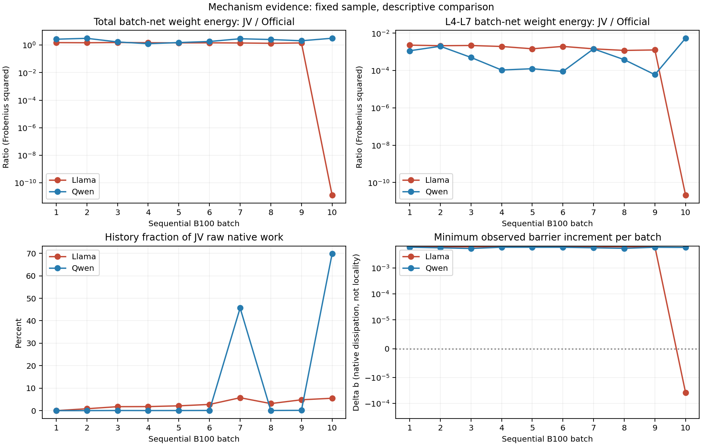

# AlphaEdit JV sequential 1,000: GH 독립 기전·수식·결과 종합 분석

2026-09-07. 완료된 Llama/Qwen × Official/JV 네 chain만 분석한다. 사용자 요청의 핵심은 L8 집중, 과거 edit history 반영, Qwen locality 개선, Llama 실패 및 sweep 필요성이다. 추가 요청인 **L8 집중 JV와 Official single-L8 AlphaEdit의 차이**도 별도로 다룬다.

이 보고서는 SH1의 사실 보고서를 반복하는 것이 아니라 실행 코드, 봉인된 CSV와 소형 controller 행렬을 독립 분석한 GH의 해석이다. 모델/GPU/새 evaluator/Slurm 제출/기존 실행 수정은 0이다. 현재 SH4 L8-only 실행의 미완료 산출물은 읽지 않았다. Sweep HOLD는 유지한다. 신규 lifelong 실행도 승인·수행하지 않았다.

## 1. 결론부터: 무엇은 확인됐고 무엇은 아직 모르는가

1. **과거 edit 정보가 빠진 구현은 아니다.** 누적 W/M 전달이 있으며 M은 native writer와 controller의 native quadratic metric 양쪽에 들어간다. 그러나 M은 과거 commit 시점의 key Gram이고, 과거 정답·현재 residual·현재 output을 직접 보호하는 constraint는 없다.
2. **L8 집중은 지금 목적식의 예상 가능한 해다.** 목표가 final logits가 아니라 L8 activation이므로 L8 write의 응답이 목표 residual에 매우 잘 정렬된다. History 비용을 넣어도 다른 layer로 분산할 의무는 없다. Qwen에서는 정상적으로 계속 L8에 집중했고, Llama B10은 집중이 아니라 전체 near-noaction으로 바뀌었다.
3. **Qwen locality 이득은 이 실험의 canonical NS와 likelihood 모두에서 확인된다.** 단순 wrong-target 확률 저하만의 효과는 아니다. 전체 weight update도 더 크므로 단순 전체 감속 설명은 맞지 않는다. Early-layer write 회피가 유리했을 가능성은 강한 경쟁 가설이지만, barrier 또는 다층 결합의 인과적 이득은 아직 입증되지 않았다.
4. **Llama final rewrite 실패 대부분은 forgetting이 아니라 B10 신규 edit 미실현이다.** 다만 PS/NS의 열세는 B1부터 존재한다. B10의 큰 H는 ill-conditioned solver failure가 아니다. 저장된 normalized response가 current error를 거의 설명하지 못하며, tiny-positive N0가 강한 원인 후보다.
5. **지금 상태에서 촘촘한 λ sweep을 먼저 늘리는 것은 효율적이지 않다.** 동일 B10 state에서 λ .001–1의 13점은 physical field를 최대 2.55e-7만 바꿨다. Normal state의 operating point 탐색과 B10 정규화 문제 진단을 분리해야 한다.
6. **JV가 L8에만 쓰더라도 Official single-L8 one-pass와 일반적으로 동일하지 않다.** 그러나 실제 L8-only JV가 같은 결과를 낸다면 현재 이득을 adaptive multi-layer mixing 덕분이라고 주장할 근거는 약해진다.

## 2. 입력, 검증 범위, 재현 한계

- 실행 source: `77358b1546d1baf83b3e251afcce663b08d7bfd7`.
- SH2 봉인 publication: `0d0a0131e4a6a2a645dfa6530377d420a084d136`, main-four-terminal-v1.
- SH1 상세 분석 publication: `02aa3f0d0c156d2318d623eaa3f5303adab58080`, report SHA `7966d00f7e3218f2c092123bc87f45f9a2cc047f0caa726d28ac8c478b5595e7`.
- SH2 48개 + SH1 34개 publication member **82/82**를 file SHA/bytes/CSV row count 및 manifest/receipt와 대조했다. 겹치는 자료는 독립 실험으로 중복 집계하지 않는다.
- 80 controller node, 400 node-layer, 40 batch, 200 batch-layer, 36 W/M inter-batch links, 40 history append 기록을 교차 점검했다.
- 동일 80개 H/g/G에서 source coefficient를 독립 FP64 active-face solve로 재현: 최대 상대차 **5.56e-16**. 13개 λ의 **1,040 same-state shadow**를 CPU에서 계산했다. 새 trajectory나 GPU sweep이 아니다.
- 실행 이후 해당 source에 추가된 diff는 보고서/분석 관련 파일이다. 핵심 runtime/controller/state 파일의 실행 source와 분석 snapshot 동일성을 확인했다.
- **Server2 외부 raw W/M/checkpoint, 원본 prompt transition CSV를 새로 rehash하지 못했다.** 기존 receipt가 주장하는 raw 검증과 이번 GH의 publication 재검증은 다른 보증이다. 이 한계 때문에 cluster 통계, per-request JVP attribution 및 exact-state 재현을 완료했다고 주장하지 않는다.

재현 코드: [analyze.py](analyze.py). 새 CPU 검증과 그림: [derived/verification.json](derived/verification.json), [80-node barrier audit](derived/controller_barrier_audit.csv), [20-batch physical comparison](derived/batch_mechanism_comparison.csv). 세 독립 보조 감사에는 코드 line과 추가 표를 포함한다: [history/수식](supporting/history-audit.md), [Qwen locality](supporting/qwen-audit.md), [Llama/sweep](supporting/llama-audit.md).

## 3. 이전 edit의 정보가 barrier에 들어가는가

### 3.1 두 곳에 실제로 들어간다

AlphaEdit native direction은 현재 K/residual과 frozen batch-entry M을 사용해 생성된다. 저장 orientation을 생략하면 P-inside native solve의 핵심은

\[
D_\ell=\operatorname{NativeSolve}(P_\ell,K_\ell,R;M_{\mathrm{entry},\ell},\lambda_{L2}).
\]

Controller의 physical quadratic cost도

\[
Q_N^{raw}(F)=\sum_\ell\operatorname{tr}\{F_\ell(M_{\mathrm{entry},\ell}+\lambda_{L2}I)F_\ell^\top\}
\]

로 계산한다. Native-whitened coordinates에서 `G=I`인 것은 history를 버리고 Frobenius metric으로 바꿨기 때문이 아니다. M은 D, q, T, weighted response Ψ에 남는다.

Code trace: `alpha_native_response_ode_v31_sequential/runtime.py:98–154`가 batch마다 새 family/dictionary를 만들고, 첫 batch만 cold 초기화하며 이후 기존 M을 bind한다. `state.py:10–25`가 capture/restore/commit 후 다음 W/M equality를 검사한다. `ordered_response_barrier_ode/runtime.py:879–890`은 endpoint keys로 전체 다섯 layer history를 한 번 append한다. `native_response_ode_v31/native_binding.py:65–125`가 frozen M+L2 metric과 entry qref/whitening을 계산한다. 자세한 실제 파일 링크는 보조 감사에 제시한다.

### 3.2 하지만 무엇을 기억하는지는 제한적이다

과거 commit keys를 \(K^{(j)}\)라 하면 실수 대수에서

\[
M_\ell=\sum_{j<k}K_\ell^{(j)}K_\ell^{(j)\top},\qquad
\operatorname{tr}(F_\ell M_\ell F_\ell^\top)=\sum_{j<k}\|F_\ell K_\ell^{(j)}\|_F^2.
\]

즉 **과거에 관측한 key의 해당 linear module output을 변화시키는 비용**이다. 다음은 controller에 들어가지 않는다.

- 지금 모델에서 다시 측정한 과거 request의 current keys 및 key drift.
- 과거 z에 대한 현재 residual, 과거 정답 margin, RS/PS/NS.
- 과거 output으로 전달되는 전체 downstream Jacobian과 layer 간 functional cross-term.
- 과거 모든 edit를 대상으로 한 minimum-retention constraint.

따라서 질문에 대한 정확한 답은 **“history는 반영되지만, historical behavior를 직접 보존하는 barrier는 아니다”**이다. 한 batch의 frozen historical-key quadratic surrogate와 전체 old-edit functional safety를 혼동하면 안 된다. Early layers가 변하면 과거 key 자체도 바뀔 수 있다. 반대로 early-layer write를 줄이면 이 drift가 작을 가능성이 있으나, 현재 자료에서 직접 측정·인과 검증한 사실은 아니다.

### 3.3 누적 M이 커져도 무조건 protection이 강해지는 것은 아니다

현재 비용은 \(Q_N=Q_N^{raw}/q_N^{ref}\)이며 qref는 각 batch의 전체 entry directions에서 새로 계산된다. Batch 내부에서는 고정이지만 batch 간 global constant가 아니다. \(V_0\)와 누적 energy도 batch마다 새로 시작한다.

고정된 physical 후보에 대해 metric과 qref를 같은 scalar로 키우면 normalized cost는 그대로다. 실제로는 M의 방향성/W/D도 달라지지만, **“history 크기 증가→항상 더 강한 절대 penalty”**는 현재 계약에서 나오지 않는다. 이것은 누락 버그가 아니라 설계상 의미다. M trace, 실제 선택된 F의 history cost, normalized work, forgetting을 따로 봐야 한다.

## 4. 왜 L8에 반복해서 집중하는가

Target readout Φ는 `model.layers.8` output이다. 편집 module은 각 layer의 MLP down-projection이다. L8 down-projection의 변화는 목표 readout에 직접 가산되는 경로를 가진다. 앞 layer는 여러 nonlinear block을 거쳐 목표에 영향을 준다. 따라서 이 목적식은 구조적으로 마지막 target layer를 선호할 가능성이 있다.

실제 weighted response–residual cosine 중앙값:

| 범위 | L4 | L5 | L6 | L7 | L8 |
|---|---:|---:|---:|---:|---:|
| Llama B1–B9, 36 node | .2510 | .3681 | .5083 | .6755 | **.9977** |
| Qwen B1–B10, 40 node | .2350 | .2648 | .3748 | .5206 | **.9960** |

같은 state에서 best single-layer가 L8인 비율은 Llama 36/40, Qwen 40/40이다. Joint objective가 L8-only보다 나은 비율의 중앙값은 정상/예외를 합한 Llama 약 .0606%, Qwen 약 .0143%로 작다. 이는 endpoint 동치를 증명하지 않지만, 상당수 node에서 L8가 거의 충분한 actuator였다는 증거다.

실제 batch-net Frobenius energy의 L8 비율:

- Llama B1–B9: 약 **99.916–99.946%**.
- Qwen B1–B10: 약 **99.876–99.997%**.
- Llama B10: 약 **0.00884%**, 하지만 전체 energy가 **2.72e-9**다. 유용한 다른-layer 이동이 아니라 near-noaction이다.

M은 layer 사용 횟수 penalty나 균등배분 quota가 아니다. L8의 response-per-native-cost가 계속 좋으면 history가 쌓여도 L8을 선택하는 것이 목적식에 맞는다. 따라서 분산되지 않았다는 이유만으로 구현 실패라고 할 수 없고, 분산이 없는데도 좋은 성능이 난 것을 모순으로 볼 이유도 없다.

## 5. History 비용이 실제 선택을 바꿨는가

Cost-only shadow는 W/z/dictionary/response/N0/qref를 고정하고 M+L2 비용을 M0+L2로만 바꾼다. 초기 shadow에서도 실제 Gram을 계산했으며 `G=I`를 잘못 재사용하지 않았다.

| node0 | 실제 history-cost field와 초기-cost field의 native angle | 실제/초기-cost native Q_N norm 비율 |
|---|---:|---:|
| Llama B5 | .02748° | .99910 |
| Llama B10 | 약 0° | 약 1 |
| Qwen B5 | .000236° | .999989 |
| Qwen B10 | .27444° | .98331 |

Qwen B10은 전체 batch raw work 중 history 항이 약 **69.79%**, node0 L8 후보 action에서 history 항이 약 **75.37%**다. 그런데 cost-only field angle은 작다. 즉 **history 비용이 존재한다**는 것은 분명하지만, **history 비용이 큰 layer 재배분을 일으켰다**는 근거는 약하다. Qwen B10에서는 주로 작은 amplitude 조절과 작은 mixture 변화가 관측된다.

주의: shadow는 M이 이미 바꾼 candidate direction을 고정하므로 **M이 writer 방향을 만든 전체 효과**, 과거 W trajectory 효과, 실제 NS 개선의 인과효과는 제거하지 않는다. Qwen B7 history fraction 45.68%→B8 .0747%라는 변화도 reset 증거가 아니다. M 자체가 아니라 바뀐 F가 어느 historical-key 방향에 작용하는지를 측정한 비율이다.

## 6. Barrier가 잘 작동했는가: 세 가지 답을 분리해야 한다

현재 controller는

\[
\min_{c\ge0}\frac12\|e-\Psi c\|^2+\frac\lambda2 c^TGc
\]

를 풀고, KKT로

\[
g^Tc=c^THc+\lambda c^TGc,
\quad b=V_0-V-\lambda\mathscr E,
\quad \dot b=\|\Psi c\|^2
\]

를 얻는다. 이 구현은 b가 unsafe해지면 별도 old-output safe-set constraint를 걸어 rectification하는 구조가 아니라, **regularized response solve에서 도출되는 native-action dissipation 관계**다.

### 수학·solver 수준: 제대로 풀었다는 근거가 있다

80 node 전체에서 독립 KKT 최대잔차 **8.88e-16**, dissipation residual은 FP64 반올림 수준이며 native speed bound 위반은 없다. History metric whitening도 코드에 반영돼 있다. 발견된 증거만으로 controller 구현 오류를 선언할 수 없다.

### 유한 Euler 수준: 전 node safety 보장은 아니다

실제 관측 V를 사용해

\[
\Delta b=V_n-V_{n+1}-.05\,c_n^TGc_n
\]

를 재계산했다. Qwen **40/40** 양수, Llama **38/40** 양수다. Llama B10 node0/node3은 각각 **−3.78e-5, −3.64e-5**다. 기존 `finite_step_dissipation_defect`가 양수라는 사실과 실제 Δb가 음수라는 것은 서로 다른 조건이다.

Llama B10에서 normalized model-error norm은 예측 step norm의 **8.3–38.3배**다. Virtual/materialized normalized discrepancy도 약 .01418이다. 이를 V 감소와 단위 없이 직접 비교하면 안 되지만, \(|\delta V|\le\|e\|\|\delta e\|+\|\delta e\|^2/2\)이므로 아주 작은 V 감소(~2.64e-5)를 robust한 개선으로 주장하기에는 부족하다. 원래 FP32 parity는 통과했고, 여기서 사후 strict gate를 추가하거나 기존 결과를 제외하지 않는다.

### 유용성 수준: 아직 별도 질문이다

KKT가 맞아도 c가 거의 0이면 edit usefulness는 없다. Δb가 양수여도 NS/old-edit margin은 보호 대상이 아니다. 따라서 **“대수적 barrier 작동”은 확인됐지만 “functional locality/retention barrier가 성공”은 확인되지 않았다.**

위 그림의 energy는 실제 batch-entry→endpoint weight 차이의 Frobenius 제곱이다. Native work 또는 W10−W0 net energy가 아니다. Weight에는 균등배분 기준선을 넣지 않았다.

## 7. Qwen locality 개선은 무엇을 의미하는가

Final W10에서 동일 1,000 requests를 평가한 결과다. RS/PS는 new NLL < true NLL, NS는 true NLL < new NLL이며 tie는 실패다. 자유생성 accuracy와 다르다.

| 모델 | arm | RS /1000 | PS /2000 | NS /10000 |
|---|---|---:|---:|---:|
| Llama | Official | 1000 (100.0%) | 1910 (95.5%) | 7584 (75.84%) |
| Llama | JV | 923 (92.3%) | 1690 (84.5%) | 7259 (72.59%) |
| Qwen | Official | 992 (99.2%) | 1887 (94.35%) | 6978 (69.78%) |
| Qwen | JV | 997 (99.7%) | 1894 (94.70%) | 7377 (73.77%) |

### 7.1 점수 하나만 오른 현상은 아니다

Qwen 동일-prompt paired NS: **개선 1,289 / 악화 890 / 순증 399 (+3.99pp)**. Request별 열 neighborhood가 전부 성공하는 strict NS도 **230→284/1000**이다.

Neighborhood true NLL mean은 **6.8350→6.3312**, median **6.5048→5.9099**, p90 **12.1569→11.5431**로 모두 좋아졌다. New NLL mean은 **9.0331→9.0463**이다. 평균 margin 증가 **+.5170 nat**의 약 **97.45%**는 true NLL 감소에서 나온다. 이는 평균 이동의 산술 분해이지 인과 기여율이나 문항 비율이 아니다.

W0에서 맞던 neighborhood 8,463개 중 새 실패가 **1,838→1,390**, 즉 448개 적다. W0에서 틀리던 1,537개 중 회복은 **353→304**로 49개 적다. 순이득399는 주로 원래 맞던 문항을 덜 잃은 결과다. 그래도 W0 NS84.63%보다 JV73.77%는 낮으므로 원래 지식을 온전히 보존한 것은 아니다.

### 7.2 단순 전체 감속 가설은 맞지 않는다

Qwen JV의 **전체 actual batch-net weight energy는 모든 batch에서 Official의 1.256–3.135배**다. 반면 **L4–7 energy는 Official의 0.0060–0.5402%**에 불과하다. 따라서 “전반적으로 덜 썼으니 덜 망가졌다”는 Frobenius 물리량 설명은 지지되지 않는다.

실측에 맞는 경쟁 가설은 **early-layer disturbance를 거의 피하면서, target에 직접 잘 작용하는 L8를 더 크게 사용한 경로가 Qwen에서 유리했다**는 것이다. 다만 이것은 현재 증거와 일관된 설명이며 실제 historical key drift/old-output Jacobian을 측정한 인과 증명은 아니다. 작은 multi-layer mixture, 반복 residual correction, response-based amplitude, native metric은 함께 변했다.

### 7.3 집중 자체만으로도 설명은 끝나지 않는다

L8 집중은 B1부터인데 Qwen paired seen NS 차이는 W1 **−1.60pp**, W5 **+3.82pp**, W10 **+3.99pp**다. 처음 두 current batches도 NS가 낮고 B3 이후 높다. 따라서 “L8에 집중하면 언제나 locality가 좋다”는 명제는 이 실험 자체가 지지하지 않는다. 또한 이 checkpoint의 평가 inventory는 100→500→1000으로 달라지므로 이를 고정 cohort의 단순 시간곡선으로 읽지 않는다.

PS는 +7/2000에 그치며 rephrase-new NLL mean **2.1800→2.2830**, p90 **6.3888→7.3729**로 악화했다. Rewrite 후속 실패는 Official **6/998**, JV **3/1000**으로 소수 사례 차이다. 따라서 Qwen은 **특정 locality 지표에서 좋은 관측**, **비슷한 binary edit success**, **일부 likelihood tail 악화**가 공존한다.

10,000 prompts는 같은 request/target/trajectory 의존성이 있다. 이들을 독립 Bernoulli로 취급한 p-value로 “통계적으로 유의”를 선언하지 않았다. Prompt-level external CSV 복구 뒤 request/relation cluster paired 분석은 가능하지만, 현재는 효과 크기와 방향을 확인한 범위다.

## 8. Llama는 왜 나빴는가: 두 문제가 겹쳤다

### 8.1 Rewrite failure 대부분은 마지막 batch 신규 실패

JV 최종 실패77건 중 **75건은 B10 at-write 실패**, 이전에 성공했던 edit의 후속 실패는 **2건**이다. B1–B9의 900개는 at-write900/900, final898/900이다. 이 결과를 “모든 old edit가 history 때문에 붕괴”라고 해석하면 잘못이다.

반면 PS/NS는 B1–B9에도 전부 Official보다 낮았다. 따라서 B10 문제만 해결하면 모든 성능 문제가 사라진다고도 말할 수 없다. **일반화/locality operating point의 지속적 열세 + B10에서의 급격한 신규 under-write**를 분리해야 한다.

### 8.2 H가 크지만 ill-conditioned한 것은 아니다

독립 full-H spectrum/선형 설명력 계산:

| node0 | Llama B9 | Llama B10 | Qwen B10 |
|---|---:|---:|---:|
| H 최소 eigenvalue | 1.3774 | 1,661,413.9 | 3.4196 |
| H 최대 eigenvalue | 30.911 | 5,301,647.2 | 59.428 |
| condition number | 22.44 | **3.19** | 17.38 |
| λ / 최소 eigenvalue | .0726 | **6.02e-8** | .0292 |
| 자유부호·λ0 선형 설명 비율 | 99.52% | **0.00446%** | 98.46% |

마지막 행은 \(g^TH^{-1}g/\|e\|^2\), 즉 전체 response span에서 current normalized error를 얼마나 설명할 수 있는지다. 자유부호와 λ0를 실제 method로 사용하자는 제안이 아니라 **양수 제약/regularizer를 없애도 이 state의 선형 response가 거의 유용하지 않다**는 진단이다.

그러므로 B10은 singular solve, 강제 L8 router, 과도한 λ로만 설명되지 않는다. NNLS는 그 목적에 맞게 거의 0인 field를 선택했다.

### 8.3 Tiny-positive N0가 강한 원인 후보

Llama B10 case4228의 entry residual scale은 **3.5747e-5**, 두 번째 최소값 **4.3894**, median **5.2684**다. 해당 inverse row weight는 약 **2797.4**다. Native compute-z는 이 case에서 delta0로 종료했다고 봉인 관측이 기록하지만 별도 FP32 terminal capture와의 차이는 작은 양수로 남는다.

그 결과 거의 만족한 한 command의 작은 차이에 매우 큰 JVP weight가 부여되어 다른 99개 요청의 response를 억제했을 가능성이 있다. **Inverse weight 제곱합의 99.999999536%**가 이 row에 몰리지만, 이것을 실제 H contribution이라고 말하면 안 된다. 실제 per-request raw JVP norm이 저장 publication에 없어 그 인과를 완전히 분해하지 못한다.

Qwen B10은 min scale48.225, median117.349로 같은 극단이 없다. 이는 이번 sample/state의 차이이지 Llama architecture 전체의 불가능성을 증명하지 않는다.

## 9. λ sweep 필요성: 같은-state 결과와 새 trajectory를 구분

기존 80 node를 그대로 두고 λ=\(10^{-3+k/4}, k=0..12\)를 계산한 **1,040개 CPU shadow**에서 source .1 해를 재현했다. Llama B10 네 node의 최대 native physical field 상대변화는 **2.548e-7**이며 support도 같다. History-cost만 M0로 돌린 shadow도 B10에서 거의 변화가 없다.

따라서 **현재 B10 state를 λ .001–1 범위에서 촘촘히 나누는 것만으로 구제할 근거는 매우 약하다.** Grid를 촘촘히 하는 것은 이 작은 민감도를 바꾸지 않는다. 더 큰 λ는 regularization을 강화하는 축이며, λ0·자유부호의 선형 설명 상한도 이미 작다.

반대로 정상 Llama B9 node0은 λ .001/.1/1에서 field 상대변화가 약 **.049/0/.280**이다. λ는 정상 operating point 및 앞 batch들의 trajectory를 바꿀 수 있다. 실제 전체 chain을 λ별로 실행하면 B10 W/z/N0도 달라지므로 모든 λ trajectory가 실패한다고 단정하지 않는다. 다만 우연히 문제 state를 피한 것과 정규화 기작을 교정한 것은 다른 주장이다.

권장 순서는 (a) 복원 가능한 exact entry가 있는지 확인, (b) per-request JVP/H 및 readout repeatability의 제한적 diagnosis, (c) normalization counterfactual을 명시적 science ablation으로 분리, (d) 새 development/audit와 고정 예산 아래 λ operating-point sweep이다. 원본 failure를 삭제하거나 tiny row를 조용히 제외/clip하지 않는다. 현재 요청은 분석이므로 이 후속 실행은 하지 않았다.

## 10. L8 집중 JV와 Official single-L8 AlphaEdit는 무엇이 다른가

이 질문은 method의 추가 가치에 직결된다. **현재 실행 중인 L8_ONLY_NATIVE는 Official single-L8 one-pass가 아니다.**

| 구분 | Official single-L8 one-pass | JV가 사실상 L8만 선택 | 승인된 L8_ONLY_NATIVE |
|---|---|---|---|
| 후보 | L8 native write | L4–L8 joint candidates | support만 L8 |
| update | native D8를 한 번 적용 | N4, h.5 current-state Euler | N4, h.5 current-state Euler |
| response controller | 없음 | joint NNLS | 1변수 NNLS closed form |
| qref/history | 정확한 single-layer binding 필요 | 전체5-layer reference/history | 전체5-layer reference/history |
| 검증할 것 | stock one-pass localization | adaptive mixing 필요성 | mixing을 제거한 controlled comparator |

같은 state에서 raw direction \(D_8\), weighted raw response \(p_8=D\widetilde\Phi[D_8]\), \(q_8=Q_N(D_8)\)라 하면 support-L8 JV는

\[
F=aD_8,\qquad a=\frac{[e^Tp_8]_+}{\|p_8\|^2+\lambda q_8},\qquad W_{n+1}=W_n+h\,aD_8(W_n).
\]

Official single-layer write는 \(W'=W+D_8(W)\) 한 번이다. JV의 a에는 일반적으로 상한1이 없고, 매 node residual/direction/JVP를 새로 측정하므로 두 endpoint가 동일할 이유는 없다. Full JV 해의 support가 정확히 L8 하나라면 **그 node의 해**는 L8-only closed form과 같지만, 미세한 다른-layer write와 이후 state 차이는 남을 수 있다.

설명용 특수 조건: 앞 layer/keys가 고정, L8 readout affine, native response가 residual을 정확히 실현(\(p_8=e\)), λ0이면 a=1이다. 그래도 h.5를 네 번 적용하면

\[
R_4=R_0/16,\qquad \Delta W_4=(15/16)D_8(W_0),\qquad V_4/V_0=1/256.
\]

즉 이 이상적인 경우조차 현재 fixed horizon은 full Official update와 다르다. λ>0이면 이 특수 조건의 gain은 더 작다. 실제 P/regularization/context 때문에 \(p_8=e\)는 근사에 불과하고 반복 residual 방향도 달라질 수 있으므로, 모든 실험을 단순 scalar damping과 같다고 주장하는 것도 부정확하다.

또한 `hparams.layers=[8]`만 바꾸면 P/cache의 positional indexing을 원래 L4 slice와 잘못 연결할 수 있다. 정확한 Official single-L8 대조는 target optimizer/context/P8/cache/history 정책까지 명시해야 한다. 지금 SH4의 support-only 대조는 이 변경을 피한 설계다.

**해석 규칙:**

- JV ≈ L8_ONLY이면 adaptive multi-layer mixing의 추가 가치가 약하다. Qwen 이득은 localization/iteration/amplitude/native geometry로도 설명 가능하다.
- JV가 비슷한 신규 edit 품질에서 L8_ONLY보다 old retention/NS가 좋으면 작은 multi-layer mixture의 실질적 가치를 지지한다.
- 두 JV 계열이 모두 Official보다 좋아도, Official single-L8 one-pass 없이 “joint flow가 single-layer stock보다 낫다”는 결론은 미검증이다.
- 기존 chain끼리는 각자의 W/M/z가 다르다. Same-state algebra와 end-to-end endpoint 성능을 혼합하여 원인을 확정하지 않는다.

새 arm을 이 분석에서 제출하지 않았다.

## 11. 현재의 모델별 판정과 다음에 필요한 증거

| 질문 | 현재 판정 | 남는 증거 |
|---|---|---|
| M이 실제 반영됐나 | 코드와 publication continuity에서 YES | raw W/M 독립 재해시 |
| barrier 목적식을 제대로 풀었나 | 80-node CPU KKT/dissipation YES | 모든 finite nonlinear step의 안전 보장은 아님 |
| history 때문에 multi-layer 재배분됐나 | 큰 재배분 근거 약함 | actual L8-only, dictionary/history 효과 분리 |
| Qwen locality 이득이 있나 | 이 sample에서 NS/NLL/기존 성공 보존 개선 | request-cluster 통계, 독립 sample/order 일반화 |
| Qwen이 모든 품질에서 낫나 | NO: rephrase NLL tail 악화 | matched-quality tradeoff 분석 |
| Llama 실패가 old forgetting인가 | 대부분 NO: B10 신규75, 후속2 | tiny-N0 per-request response 원인분해 |
| λ dense sweep으로 직접 복구되나 | 같은 B10 state에서는 근거 약함 | 정상 operating-point와 full-trajectory 영향 분리 |
| Lifelong 즉시 진입 | Llama HOLD, Qwen 후보일 뿐 PASS 아님 | L8-only/robustness/비용 확인 |

이 사후 검토를 사전 등록 gate PASS로 포장하지 않는다. L8 집중 자체를 실패로 만들거나 균등배분을 목표로 새 heuristic을 넣을 이유도 없다. 반대로 locality 상승 하나로 barrier/mixing의 성공을 확정할 근거도 없다.

## 12. 한 문장으로 정리

**현재 JV는 과거 key 기반 native 비용을 실제로 사용하는 current-activation response controller지만, 과거 edit의 functional safety를 직접 제약하는 barrier는 아니다. L8에 집중하는 것은 이 목적에 자연스럽고 Qwen에서는 좋은 관측을 보였으나, adaptive mixing의 필요성은 L8-only와 구분해야 한다. Llama B10의 핵심은 정규화된 response가 거의 유용하지 않은 상태이며, 이를 λ sweep만의 문제로 취급하면 진단을 놓칠 수 있다.**

## 13. 사용자 추가 요청: Ours sweep 후보와 원본 z 연산 고정

후보를 [sweep-candidates.csv](sweep-candidates.csv)와 [sweep-candidate-policy.json](sweep-candidate-policy.json)에 저장했다. 이는 **후보 산출이지 실행 승인/제출/선택된 최적값이 아니다.** 코드는 [sweep_candidates.py](sweep_candidates.py)로 재현한다. 원본 AlphaEdit z 최적화는 모두 고정한다.

### 13.1 현재 코드에서 실제로 조절되는 항목과 주의점

| 항목 | 현재값 | 의미와 이번 범위 |
|---|---|---|
| `LAMBDA` | .1 | JV response-controller 비용계수. AlphaEdit `L2`와 다른 값 |
| `N` | 4 | 실제 `range(N)`으로 실행하는 Euler node 수 |
| `H` | .5 | 실제 step size h. physical write와 energy에 각각 한 번 적용 |
| `T` | 2 | 현재 계약/lock의 horizon. 실제 실행은 **N×H** |
| Normalization | source-exact N0 | entry residual 기반, batch 내 고정. 별도 ablation 외에는 변경하지 않음 |
| qN_ref | 전체5-layer entry action | batch마다 새로 만들고 inner node에서 고정. 튜닝 scalar 아님 |
| NNLS support | c≥0, 상한 없음 | 후보 layer를 음수 individual gain만으로 제거하지 않음 |
| First-hit/adaptive h/gain/rescue | OFF | 이번 후보에서도 OFF |
| Target/readout/layers | 기존 L8, L4–L8 | 이번 sweep에서 그대로 고정 |

실제 소스의 중요한 점: `trajectory.py`는 `H,N,LAMBDA`를 import하지만 **T는 실행 loop에 사용하지 않는다**. 현재 T2=N4×H.5는 일치하므로 기존 run이 잘못된 것은 아니다. 그러나 JSON/표의 T만 바꿔서는 horizon sweep이 되지 않는다. 또한 `telemetry.py`도 LAMBDA를 별도로 import하므로 trajectory 한 곳만 monkeypatch하면 history/single-layer shadow의 λ가 달라질 수 있다.

실제 sweep 구현 때는 한 immutable config를 trajectory/telemetry/lock가 공유하게 하고 `T=N*h`를 실행 전에 확인해야 한다. h를 NNLS 목적식에 넣거나 solve 뒤 임의 velocity gain을 추가해서는 안 된다. 이는 source-binding의 최소 correctness 요구이며, 새 대규모 gate를 추가하자는 뜻은 아니다. 이번 분석에서는 runtime을 수정하지 않았다.

### 13.2 먼저 분리할 세 축

| 축 | 후보 | 고정 조건 | 질문 |
|---|---|---|---|
| Response λ | **.01, .0316228, .1, .316228, 1** | T2/N4/h.5/N0 | 정상 operating point의 progress–native-cost tradeoff |
| Euler resolution | **N=2,4,8,16** | T2, λ.1/N0; h=1,.5,.25,.125 | 같은 horizon에서 수치 오차와 endpoint 차이가 줄어드는가 |
| Horizon | **T=1,2,4** | h.5, λ.1/N0; N=2,4,8 | 더 오래 반응시키는 것이 edit strength와 locality를 어떻게 바꾸는가 |

공통 기준점 (.1,T2,N4)을 중복 제거하면 **10개 configuration**, 두 모델 모두 적용하면 **20개 model×configuration 후보**다. 전부 B100×10으로 지금 실행하라는 뜻이 아니다. N16은 N8까지의 변화/비용을 확인할 수 있을 때의 조건부 refinement 후보다. 해상도 실험과 horizon 실험은 절대로 한 축으로 섞지 않는다.

예를 들어 N8은 T2/h.25일 수도, T4/h.5일 수도 있다. 전자는 resolution 변화이고 후자는 nominal exposure 변화다. "Euler steps를 늘렸다"만 기록해서는 어떤 효과인지 해석할 수 없다.

기존 양 모델 JV 1,000 main의 측정 process 합은 약 **8.17 GPUh**다. 이를 단순 proxy로만 써도 N4 λ 다섯 값의 양 모델 full-chain 비교는 약 **40.9 GPUh** 규모이며, 실제 비용은 state/target 최적화/evaluation에 따라 달라진다. N 증가가 전체 runtime을 정확히 선형으로 늘리는 것은 아니다. 저장·evaluation·실제 head별 cap을 포함한 별도 실행 budget을 정하기 전 자동 제출하지 않는다.

### 13.3 촘촘한 sweep은 단계적으로

1. **이미 완료한 CPU density:** λ=10^(-3+k/4), k=0..12, .001–1의13점 ×80 node. 기존 H/g/G를 재사용해 비용 없이 민감도를 본 것이며 GPU trajectory 결과가 아니다.
2. **실제 development 후보:** 위의5개 λ에서 동일 W0/M0/sample과 고정 T2/N4로 비교. Llama/Qwen을 함께 보고 결과가 좋은 모델만 선택적으로 확장하지 않는다. 기존 1,000개 결과는 사후 진단 자료이며 독립 confirmation으로 재사용하지 않는다.
3. **조건부 세밀화:** 개발 기준을 사전 고정한 뒤 선정되는 λ_dev 주변 `λ_dev×10^(k/8), k=-2,-1,0,1,2`의5점. λ_dev는 **아직 선택하지 않았다**. 첫 screen 경계가 유리하면 해당 경계를 어떻게 확장할지도 결과를 열기 전에 정한다.
4. **Resolution/horizon:** 기준 λ에서 먼저 각각 분리하고, 필요할 때만 선택된 development λ와 제한적으로 교차 확인한다. 처음부터 λ×T×N의 전체 Cartesian product를 돌리지 않는다.
5. **미개봉 audit:** 선택된 configuration을 별도 고정 표본에서 검증한다. PS/NS/old retention을 본 뒤 계속 knob를 바꾸고 같은 audit를 재사용하지 않는다.

이 계획은 Llama B10의 λ 무민감도를 우회한 원인 설명이 아니다. 초기 state부터 다른 λ가 만드는 경로 효과를 시험하는 것이다. B10 문제는 별도로 진단해야 한다.

추가 CPU 민감도 근거: 정상 Llama B1–B9에서 λ1은 λ.1 대비 median predicted gain .8476배, native action .5635배, field 회전8.63°였다. Qwen에서는 각각 .8891배, .7062배,3.63°다. 즉 λ 증가로 layer 집중이 줄어도 progress/action 감소가 함께 나타난다. λ를 낮추면 이 기록된 state들에서 L8 집중은 대체로 더 강해졌다. 이를 "분산에 성공한 λ"로 선택하지 말고 quality–retention–cost tradeoff로 판단해야 한다. 전체52개 group×λ 요약: [candidate-sensitivity-summary.csv](supporting/candidate-sensitivity-summary.csv).

### 13.4 N0 문제를 위한 후보는 별도 science ablation

- **N0:** 원본 primary 그대로 유지.
- **NRMS_ENTRY:** 기존 active inventory를 유지하면서 batch-entry RMS scale을 쓰고, 동일 weight를 residual/JVP에 적용하는 후보. `s_batch²=mean(s_i²)`, `e_i=R_i/(sqrt(B_active)*s_batch)`로 entry potential이 정렬된다. Tiny request를 writer에서 삭제하지 않는다.
- **NNUM_OBSERVED_NOISE:** entry readout의 독립 반복 측정으로 noise scale을 확보한 경우만 floor 정의를 검토한다. 임의의 1e-3 같은 상수나 실패 case에만 적용하는 rescue는 후보로 정하지 않았다.

두 normalization 후보는 **현재 구현된/승인 실행된 설정이 아니다**. Per-request raw response/JVP가 없으면 aggregate H만으로 올바른 reweighting shadow를 계산할 수 없다. 원본 B10 entry availability를 먼저 확인해야 하며 exact state가 없으면 unavailable을 기록한다. Core z 연산을 바꾸지 않고도 우리 normalization의 영향을 분리할 수 있다는 의미다. Normalize 변경을 technical repair로 취급해 원본 결과를 지우지 않는다.

### 13.5 이번에 손대지 않을 AlphaEdit 부분

원본 compute-z의 다음 항목은 freeze: `v_num_grad_steps`, `v_lr`, `v_loss_layer`, `v_weight_decay`, `kl_factor`, `clamp_norm_factor`, `fact_token`, target layer/readout, target loss, contexts, tokenizer/padding/position semantics, stock early-stop loss .05. Layer/module naming, lm-head/final-norm binding도 유지한다. Case4228의 stock delta0 관측이 있더라도 z optimizer를 바꿔 문제를 없애는 실험은 지금 하지 않는다.

추가 confounding을 피하기 위해 이번 Ours 후보표에서는 baseline P, native L2, covariance/history finalization, editable5-layer inventory도 고정했다. 특히 **JV λ=.1을 sweep하는 것과 native AlphaEdit L2를 sweep하는 것은 다른 실험**이다.

실제 pinned 값도 확인했다([source knob audit](supporting/sweep-runtime-knobs-audit.md)). 두 모델은 원본부터 target-optimizer hparam이 다르다.

| 원본 고정값 | Llama | Qwen |
|---|---:|---:|
| v_num_grad_steps | 25 | 25 |
| v_lr | .1 | .5 |
| v_loss_layer | 31 | 27 |
| v_weight_decay | .5 | .001 |
| clamp_norm_factor | .75 | 4 |
| kl_factor | .0625 | .0625 |
| native L2 | 1 | 1 |

따라서 두 모델의 다른 양상을 architecture 하나의 인과효과로 확정할 수 없다. Pretraining/representation/native geometry뿐 아니라 원본 target optimization의 operating point도 다르다. 이는 각 모델 내 Official/JV 비교가 불공정하다는 뜻은 아니며, 동일 모델 내에서는 같은 pinned 원본을 사용했다. 사용자의 최신 지시대로 이 표의 원본값은 이번 sweep에서 통일하거나 변경하지 않는다.

### 13.6 후보 선정에 필요한 결과

기존 current/final RS/PS/NS와 NLL tail, at-write failure vs forgetting, absolute layer action, history/L2 action을 계속 분리한다. 추가로 각 candidate의 actual horizon N×h, main JVP=5N/batch, Euler defect, actual Δb, nonzero materialization, per-request normalization response concentration을 결속한다. L8-only를 통해 mixing 가치를 확인하고, Official single-L8 one-pass는 그와 다른 **추가 comparator 후보**로만 남긴다. 신규 Official single-L8 실행을 이번 sweep표에 몰래 포함시키지 않는다.

현재 제안의 우선순위는 **L8-only 구분 + Llama N0/response 진단 → 제한된 λ operating-point screen → resolution/horizon 분리 → 독립 확인**이다. Llama lifelong HOLD, Qwen candidate/not-PASS라는 판정을 바꾸지 않았다.
