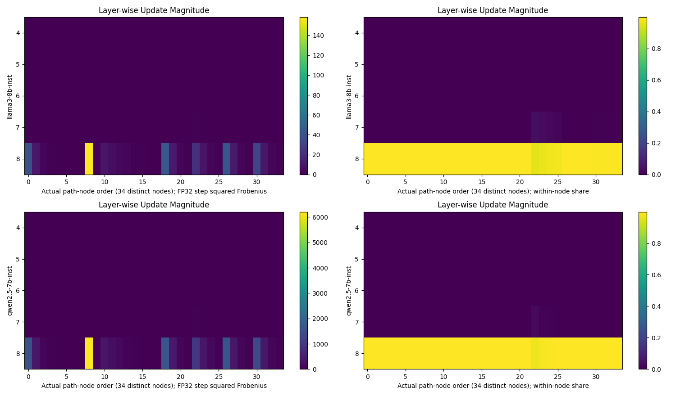
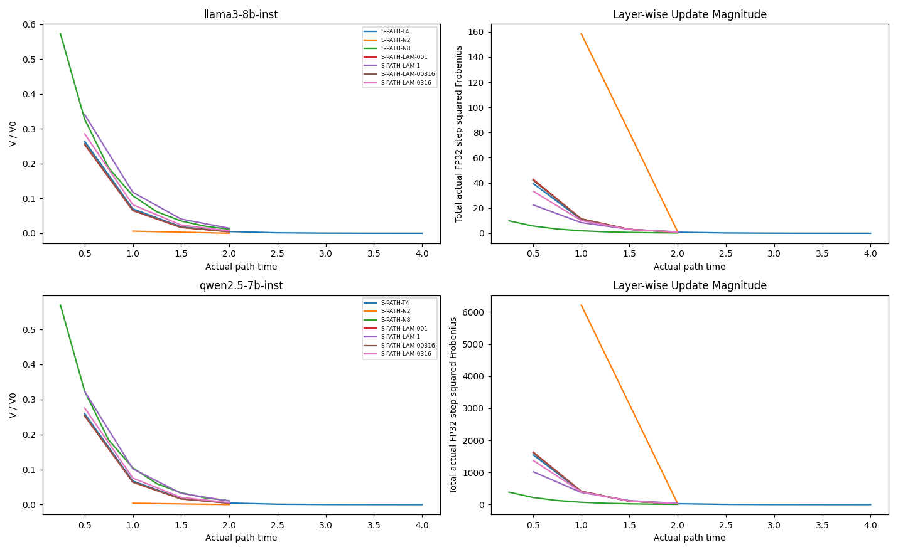
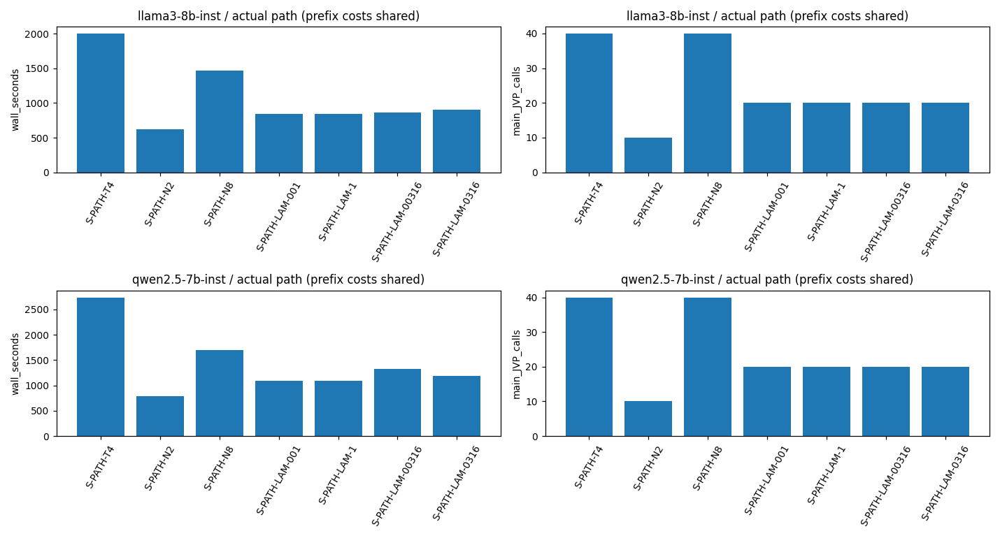
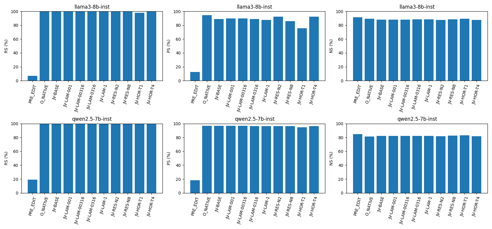
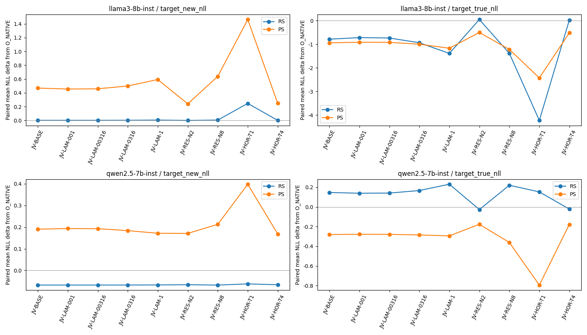

# AlphaEdit JV D/S — S_DEV B100 실제 sweep 상세 사실 보고서

## 범위·지표·분모

완료 모델 2/2. 모델별 W0 1개, Official O 1개, JV 후보 9개를 구분한다. 9 후보는 7 실제 trajectory/34 node이며 T1·BASE는 T4 경로의 저장 prefix다. S_DEV100 동일 raw request/order, cold W0/M0, 모델별 fixed-z 1회·N0_SOURCE 및 qref를 공유한다. 새 audit300·sequential/lifelong 실행은 포함하지 않는다. 실패/partial 셀은 run_registry에 남기며 완료 모델의 endpoint 분모로 대체하거나 보간하지 않는다.

RS: rewrite target-new NLL < target-true NLL (100 requests, 각 1 prompt). PS: 같은 부등식의 rephrase prompt (200). NS: locality target-true NLL < target-new NLL (1000). 모두 strict inequality이며 tie는 실패다. NLL은 낮을수록 해당 정답열의 likelihood가 높다. new/true를 둘 다 공개하며 preference와 new-NLL 향상을 혼동하지 않는다. Token accuracy와 all-token strict, request별 all-prompt strict를 별도 기록한다. PS prompt 분모200과 strict-request 분모100은 다르다.

| model | candidate | RS | PS | NS | rewrite_new_NLL | rephrase_new_NLL | rephrase_new_p90 | V_ratio |
| --- | --- | --- | --- | --- | --- | --- | --- | --- |
| llama3-8b-inst | PRE_EDIT | 7/100 (7.00%) | 25/200 (12.50%) | 914/1000 (91.40%) | 10.6559 | 9.7623 | 14.4619 | NOT_RECORDED_SCHEMA_GAP |
| llama3-8b-inst | O_NATIVE | 100/100 (100.00%) | 189/200 (94.50%) | 891/1000 (89.10%) | 0.0013771 | 1.9564 | 6.18442 | NOT_RECORDED_SCHEMA_GAP |
| llama3-8b-inst | JV-BASE | 100/100 (100.00%) | 178/200 (89.00%) | 881/1000 (88.10%) | 0.00285783 | 2.4248 | 6.64302 | 0.00493789 |
| llama3-8b-inst | JV-LAM-001 | 100/100 (100.00%) | 179/200 (89.50%) | 879/1000 (87.90%) | 0.00266863 | 2.41085 | 6.63656 | 0.00423394 |
| llama3-8b-inst | JV-LAM-00316 | 100/100 (100.00%) | 179/200 (89.50%) | 880/1000 (88.00%) | 0.00271327 | 2.41433 | 6.63808 | 0.00439867 |
| llama3-8b-inst | JV-LAM-0316 | 100/100 (100.00%) | 178/200 (89.00%) | 883/1000 (88.30%) | 0.00336614 | 2.45519 | 6.65734 | 0.00681983 |
| llama3-8b-inst | JV-LAM-1 | 100/100 (100.00%) | 175/200 (87.50%) | 883/1000 (88.30%) | 0.00589805 | 2.5488 | 6.64421 | 0.0143285 |
| llama3-8b-inst | JV-RES-N2 | 100/100 (100.00%) | 185/200 (92.50%) | 875/1000 (87.50%) | 0.00134404 | 2.19594 | 6.40629 | 5.81796e-05 |
| llama3-8b-inst | JV-RES-N8 | 100/100 (100.00%) | 172/200 (86.00%) | 884/1000 (88.40%) | 0.00587583 | 2.59431 | 6.8788 | 0.0116003 |
| llama3-8b-inst | JV-HOR-T1 | 98/100 (98.00%) | 151/200 (75.50%) | 892/1000 (89.20%) | 0.247743 | 3.41841 | 9.03381 | 0.0700083 |
| llama3-8b-inst | JV-HOR-T4 | 100/100 (100.00%) | 185/200 (92.50%) | 875/1000 (87.50%) | 0.00136504 | 2.20348 | 6.42261 | 2.53261e-05 |
| qwen2.5-7b-inst | PRE_EDIT | 19/100 (19.00%) | 37/200 (18.50%) | 847/1000 (84.70%) | 10.235 | 9.98832 | 14.9801 | NOT_RECORDED_SCHEMA_GAP |
| qwen2.5-7b-inst | O_NATIVE | 100/100 (100.00%) | 194/200 (97.00%) | 813/1000 (81.30%) | 0.0871976 | 1.87237 | 5.47652 | NOT_RECORDED_SCHEMA_GAP |
| qwen2.5-7b-inst | JV-BASE | 100/100 (100.00%) | 194/200 (97.00%) | 824/1000 (82.40%) | 0.0197145 | 2.06299 | 6.26946 | 0.00449573 |
| qwen2.5-7b-inst | JV-LAM-001 | 100/100 (100.00%) | 194/200 (97.00%) | 824/1000 (82.40%) | 0.019676 | 2.06604 | 6.3621 | 0.00407052 |
| qwen2.5-7b-inst | JV-LAM-00316 | 100/100 (100.00%) | 194/200 (97.00%) | 824/1000 (82.40%) | 0.0196847 | 2.06532 | 6.33847 | 0.00416985 |
| qwen2.5-7b-inst | JV-LAM-0316 | 100/100 (100.00%) | 193/200 (96.50%) | 822/1000 (82.20%) | 0.01982 | 2.05629 | 6.10716 | 0.00563682 |
| qwen2.5-7b-inst | JV-LAM-1 | 100/100 (100.00%) | 193/200 (96.50%) | 822/1000 (82.20%) | 0.0201722 | 2.0441 | 6.092 | 0.0101463 |
| qwen2.5-7b-inst | JV-RES-N2 | 100/100 (100.00%) | 193/200 (96.50%) | 818/1000 (81.80%) | 0.0212527 | 2.04341 | 6.10136 | 7.76734e-05 |
| qwen2.5-7b-inst | JV-RES-N8 | 100/100 (100.00%) | 193/200 (96.50%) | 826/1000 (82.60%) | 0.0195631 | 2.08527 | 5.99484 | 0.0109564 |
| qwen2.5-7b-inst | JV-HOR-T1 | 100/100 (100.00%) | 189/200 (94.50%) | 833/1000 (83.30%) | 0.0250688 | 2.2708 | 6.41622 | 0.0673015 |
| qwen2.5-7b-inst | JV-HOR-T4 | 100/100 (100.00%) | 193/200 (96.50%) | 819/1000 (81.90%) | 0.0211923 | 2.04071 | 6.14331 | 1.9938e-05 |

## 결과 요약과 해석 경계

### llama3-8b-inst

기본 JV(λ=.1,T2,N4)는 Official 대비 RS +0.00pp, PS -5.50pp, NS -1.00pp다. Rephrase target-new NLL mean은 1.956403 → 2.424796, p90은 6.184425 → 6.643016다. Preference success와 target-new likelihood/tail은 다른 관찰이므로 하나로 개선이라고 묶지 않는다.

T2/N4 고정 5λ 실제 sweep의 PS 범위는 87.50–89.50%, NS는 87.90–88.30%, V/V0는 0.00423394–0.0143285다. 이는 정상 cold-entry development 반응이며 역사적 Llama B10 near-stall의 원인 검증이 아니다.

기본 JV의 L8 actual endpoint energy share는 99.9081%다. 전체 실제 squared-Frobenius update는 149.87, Official은 96.5705로, 비율은 1.5519배다. 따라서 이 cold S 표본을 이전 sequential B10의 거의 무동작 endpoint와 같은 현상으로 취급할 수 없다. L8 집중이 강하지만 이것만으로 집중의 원인이나 유익성을 확정하지 않는다.

| candidate | lambda_ | T | N | RS_pct | PS_pct | NS_pct | PS_delta_O_pp | NS_delta_O_pp | PS_new_mean | PS_new_p90 | V_ratio |
| --- | --- | --- | --- | --- | --- | --- | --- | --- | --- | --- | --- |
| JV-LAM-001 | 0.01 | 2 | 4 | 100 | 89.5 | 87.9 | -5 | -1.2 | 2.41085 | 6.63656 | 0.00423394 |
| JV-LAM-00316 | 0.0316228 | 2 | 4 | 100 | 89.5 | 88 | -5 | -1.1 | 2.41433 | 6.63808 | 0.00439867 |
| JV-BASE | 0.1 | 2 | 4 | 100 | 89 | 88.1 | -5.5 | -1 | 2.4248 | 6.64302 | 0.00493789 |
| JV-LAM-0316 | 0.316228 | 2 | 4 | 100 | 89 | 88.3 | -5.5 | -0.8 | 2.45519 | 6.65734 | 0.00681983 |
| JV-LAM-1 | 1 | 2 | 4 | 100 | 87.5 | 88.3 | -7 | -0.8 | 2.5488 | 6.64421 | 0.0143285 |
| JV-RES-N2 | 0.1 | 2 | 2 | 100 | 92.5 | 87.5 | -2 | -1.6 | 2.19594 | 6.40629 | 5.81796e-05 |
| JV-RES-N8 | 0.1 | 2 | 8 | 100 | 86 | 88.4 | -8.5 | -0.7 | 2.59431 | 6.8788 | 0.0116003 |
| JV-HOR-T1 | 0.1 | 1 | 2 | 98 | 75.5 | 89.2 | -19 | 0.1 | 3.41841 | 9.03381 | 0.0700083 |
| JV-HOR-T4 | 0.1 | 4 | 8 | 100 | 92.5 | 87.5 | -2 | -1.6 | 2.20348 | 6.42261 | 2.53261e-05 |

T2 고정의 N2/N4/N8 차이는 수치 해상도 민감도다. 더 작은 terminal V만으로 더 나은 generalization 또는 수치 수렴 PASS를 선언하지 않는다. T1/T2/T4는 h=.5 동일 parent 경로의 endpoint다. 동일 trajectory prefix를 별도 독립 실행으로 부풀리지 않는다.

### llama3-8b-inst — Rewrite NLL (target-new / target-true)

| candidate | target | mean | median | p90 | max |
| --- | --- | --- | --- | --- | --- |
| PRE_EDIT | new | 10.6559 | 10.8131 | 15.4033 | 20.6518 |
| PRE_EDIT | true | 4.4416 | 4.11806 | 8.8282 | 13.928 |
| O_NATIVE | new | 0.0013771 | 0.000799515 | 0.00287076 | 0.0193427 |
| O_NATIVE | true | 13.823 | 13.8152 | 19.1354 | 21.0667 |
| JV-BASE | new | 0.00285783 | 0.00124669 | 0.00511408 | 0.0712963 |
| JV-BASE | true | 13.0345 | 13.0576 | 18.1848 | 22.1388 |
| JV-LAM-001 | new | 0.00266863 | 0.00119716 | 0.00482719 | 0.0652253 |
| JV-LAM-001 | true | 13.1017 | 13.1122 | 18.2494 | 22.2034 |
| JV-LAM-00316 | new | 0.00271327 | 0.00121204 | 0.00489713 | 0.0666578 |
| JV-LAM-00316 | true | 13.0852 | 13.0988 | 18.2333 | 22.1872 |
| JV-LAM-0316 | new | 0.00336614 | 0.00128491 | 0.00620703 | 0.0875063 |
| JV-LAM-0316 | true | 12.8836 | 12.9006 | 18.049 | 22.0036 |
| JV-LAM-1 | new | 0.00589805 | 0.00163898 | 0.010846 | 0.161912 |
| JV-LAM-1 | true | 12.4325 | 12.3497 | 17.9737 | 21.6548 |
| JV-RES-N2 | new | 0.00134404 | 0.000751928 | 0.00228215 | 0.0249239 |
| JV-RES-N2 | true | 13.8671 | 13.886 | 18.8187 | 22.3495 |
| JV-RES-N8 | new | 0.00587583 | 0.00168111 | 0.0108434 | 0.152687 |
| JV-RES-N8 | true | 12.4334 | 12.3001 | 17.8087 | 21.9449 |
| JV-HOR-T1 | new | 0.247743 | 0.0120939 | 0.506162 | 5.36262 |
| JV-HOR-T1 | true | 9.5974 | 9.865 | 15.0696 | 20.2118 |
| JV-HOR-T4 | new | 0.00136504 | 0.00076241 | 0.00231432 | 0.0253838 |
| JV-HOR-T4 | true | 13.8469 | 13.8361 | 18.7762 | 22.3397 |

### llama3-8b-inst — Rephrase NLL (target-new / target-true)

| candidate | target | mean | median | p90 | max |
| --- | --- | --- | --- | --- | --- |
| PRE_EDIT | new | 9.7623 | 9.68128 | 14.4619 | 19.8125 |
| PRE_EDIT | true | 4.7052 | 4.33772 | 9.39523 | 13.8913 |
| O_NATIVE | new | 1.9564 | 0.404947 | 6.18442 | 10.5222 |
| O_NATIVE | true | 9.31692 | 9.10834 | 14.6356 | 20.6974 |
| JV-BASE | new | 2.4248 | 1.23032 | 6.64302 | 11.4407 |
| JV-BASE | true | 8.37381 | 8.57771 | 14.1723 | 18.625 |
| JV-LAM-001 | new | 2.41085 | 1.22493 | 6.63656 | 11.4959 |
| JV-LAM-001 | true | 8.40061 | 8.59191 | 14.1863 | 18.6429 |
| JV-LAM-00316 | new | 2.41433 | 1.22629 | 6.63808 | 11.4839 |
| JV-LAM-00316 | true | 8.39392 | 8.58797 | 14.1846 | 18.6384 |
| JV-LAM-0316 | new | 2.45519 | 1.20883 | 6.65734 | 11.2698 |
| JV-LAM-0316 | true | 8.31601 | 8.49506 | 14.1345 | 18.5875 |
| JV-LAM-1 | new | 2.5488 | 1.34285 | 6.64421 | 10.8511 |
| JV-LAM-1 | true | 8.14688 | 8.0628 | 14.0127 | 18.4845 |
| JV-RES-N2 | new | 2.19594 | 0.859764 | 6.40629 | 11.9749 |
| JV-RES-N2 | true | 8.81254 | 8.78392 | 14.5789 | 19.511 |
| JV-RES-N8 | new | 2.59431 | 1.48587 | 6.8788 | 11.1643 |
| JV-RES-N8 | true | 8.09606 | 8.15848 | 13.9025 | 18.4731 |
| JV-HOR-T1 | new | 3.41841 | 2.6472 | 9.03381 | 12.0869 |
| JV-HOR-T1 | true | 6.88871 | 6.82128 | 11.8249 | 17.4687 |
| JV-HOR-T4 | new | 2.20348 | 0.858416 | 6.42261 | 11.9858 |
| JV-HOR-T4 | true | 8.79696 | 8.77704 | 14.5556 | 19.4787 |

### llama3-8b-inst — secondary accuracy / strict

| candidate | rewrite_token_acc | rephrase_token_acc | rephrase_strict_prompt | rephrase_strict_request_success | rephrase_strict_request_accuracy |
| --- | --- | --- | --- | --- | --- |
| PRE_EDIT | 4/104 | 7/208 | 1/200 | 8/100 | 0/100 |
| O_NATIVE | 104/104 | 127/208 | 120/200 | 91/100 | 42/100 |
| JV-BASE | 104/104 | 111/208 | 105/200 | 81/100 | 33/100 |
| JV-LAM-001 | 104/104 | 112/208 | 106/200 | 82/100 | 34/100 |
| JV-LAM-00316 | 104/104 | 112/208 | 106/200 | 82/100 | 34/100 |
| JV-LAM-0316 | 104/104 | 110/208 | 104/200 | 81/100 | 33/100 |
| JV-LAM-1 | 104/104 | 109/208 | 103/200 | 79/100 | 32/100 |
| JV-RES-N2 | 104/104 | 117/208 | 111/200 | 87/100 | 36/100 |
| JV-RES-N8 | 104/104 | 108/208 | 102/200 | 76/100 | 32/100 |
| JV-HOR-T1 | 97/104 | 88/208 | 82/200 | 66/100 | 26/100 |
| JV-HOR-T4 | 104/104 | 118/208 | 112/200 | 87/100 | 37/100 |

### qwen2.5-7b-inst

기본 JV(λ=.1,T2,N4)는 Official 대비 RS +0.00pp, PS +0.00pp, NS +1.10pp다. Rephrase target-new NLL mean은 1.872372 → 2.062990, p90은 5.476517 → 6.269457다. Preference success와 target-new likelihood/tail은 다른 관찰이므로 하나로 개선이라고 묶지 않는다.

T2/N4 고정 5λ 실제 sweep의 PS 범위는 96.50–97.00%, NS는 82.20–82.40%, V/V0는 0.00407052–0.0101463다. 이는 정상 cold-entry development 반응이며 역사적 Llama B10 near-stall의 원인 검증이 아니다.

기본 JV의 L8 actual endpoint energy share는 99.9665%다. 전체 실제 squared-Frobenius update는 5616.87, Official은 2249.1로, 비율은 2.4974배다. 따라서 이 cold S 표본을 이전 sequential B10의 거의 무동작 endpoint와 같은 현상으로 취급할 수 없다. L8 집중이 강하지만 이것만으로 집중의 원인이나 유익성을 확정하지 않는다.

| candidate | lambda_ | T | N | RS_pct | PS_pct | NS_pct | PS_delta_O_pp | NS_delta_O_pp | PS_new_mean | PS_new_p90 | V_ratio |
| --- | --- | --- | --- | --- | --- | --- | --- | --- | --- | --- | --- |
| JV-LAM-001 | 0.01 | 2 | 4 | 100 | 97 | 82.4 | 0 | 1.1 | 2.06604 | 6.3621 | 0.00407052 |
| JV-LAM-00316 | 0.0316228 | 2 | 4 | 100 | 97 | 82.4 | 0 | 1.1 | 2.06532 | 6.33847 | 0.00416985 |
| JV-BASE | 0.1 | 2 | 4 | 100 | 97 | 82.4 | 0 | 1.1 | 2.06299 | 6.26946 | 0.00449573 |
| JV-LAM-0316 | 0.316228 | 2 | 4 | 100 | 96.5 | 82.2 | -0.5 | 0.9 | 2.05629 | 6.10716 | 0.00563682 |
| JV-LAM-1 | 1 | 2 | 4 | 100 | 96.5 | 82.2 | -0.5 | 0.9 | 2.0441 | 6.092 | 0.0101463 |
| JV-RES-N2 | 0.1 | 2 | 2 | 100 | 96.5 | 81.8 | -0.5 | 0.5 | 2.04341 | 6.10136 | 7.76734e-05 |
| JV-RES-N8 | 0.1 | 2 | 8 | 100 | 96.5 | 82.6 | -0.5 | 1.3 | 2.08527 | 5.99484 | 0.0109564 |
| JV-HOR-T1 | 0.1 | 1 | 2 | 100 | 94.5 | 83.3 | -2.5 | 2 | 2.2708 | 6.41622 | 0.0673015 |
| JV-HOR-T4 | 0.1 | 4 | 8 | 100 | 96.5 | 81.9 | -0.5 | 0.6 | 2.04071 | 6.14331 | 1.9938e-05 |

T2 고정의 N2/N4/N8 차이는 수치 해상도 민감도다. 더 작은 terminal V만으로 더 나은 generalization 또는 수치 수렴 PASS를 선언하지 않는다. T1/T2/T4는 h=.5 동일 parent 경로의 endpoint다. 동일 trajectory prefix를 별도 독립 실행으로 부풀리지 않는다.

### qwen2.5-7b-inst — Rewrite NLL (target-new / target-true)

| candidate | target | mean | median | p90 | max |
| --- | --- | --- | --- | --- | --- |
| PRE_EDIT | new | 10.235 | 10.488 | 15.2572 | 19.2538 |
| PRE_EDIT | true | 5.38557 | 4.6053 | 11.1299 | 15.5379 |
| O_NATIVE | new | 0.0871976 | 0.0147309 | 0.0649265 | 4.67238 |
| O_NATIVE | true | 13.5106 | 13.461 | 18.3176 | 22.3706 |
| JV-BASE | new | 0.0197145 | 0.0125973 | 0.0501511 | 0.180813 |
| JV-BASE | true | 13.6573 | 13.3896 | 19.5752 | 23.8271 |
| JV-LAM-001 | new | 0.019676 | 0.0124763 | 0.0497258 | 0.186688 |
| JV-LAM-001 | true | 13.6499 | 13.3974 | 19.5694 | 23.6355 |
| JV-LAM-00316 | new | 0.0196847 | 0.012501 | 0.0498428 | 0.18518 |
| JV-LAM-00316 | true | 13.6516 | 13.3952 | 19.5711 | 23.684 |
| JV-LAM-0316 | new | 0.01982 | 0.0126156 | 0.0508219 | 0.169986 |
| JV-LAM-0316 | true | 13.677 | 13.3851 | 19.5836 | 24.2092 |
| JV-LAM-1 | new | 0.0201722 | 0.0125074 | 0.0539306 | 0.150388 |
| JV-LAM-1 | true | 13.7417 | 13.4537 | 19.5872 | 25.0224 |
| JV-RES-N2 | new | 0.0212527 | 0.0135155 | 0.0506894 | 0.211479 |
| JV-RES-N2 | true | 13.4837 | 13.4535 | 18.7629 | 22.3491 |
| JV-RES-N8 | new | 0.0195631 | 0.0121635 | 0.0511691 | 0.166158 |
| JV-RES-N8 | true | 13.7311 | 13.3754 | 19.5553 | 24.6246 |
| JV-HOR-T1 | new | 0.0250688 | 0.0120346 | 0.0723657 | 0.153701 |
| JV-HOR-T1 | true | 13.6634 | 13.2075 | 19.8421 | 26.7861 |
| JV-HOR-T4 | new | 0.0211923 | 0.013497 | 0.0505321 | 0.207701 |
| JV-HOR-T4 | true | 13.4884 | 13.4384 | 18.8168 | 22.346 |

### qwen2.5-7b-inst — Rephrase NLL (target-new / target-true)

| candidate | target | mean | median | p90 | max |
| --- | --- | --- | --- | --- | --- |
| PRE_EDIT | new | 9.98832 | 9.9706 | 14.9801 | 19.2138 |
| PRE_EDIT | true | 5.36555 | 4.68895 | 10.5663 | 18.1363 |
| O_NATIVE | new | 1.87237 | 0.642091 | 5.47652 | 13.4338 |
| O_NATIVE | true | 11.0587 | 11.3286 | 15.0132 | 21.7798 |
| JV-BASE | new | 2.06299 | 0.629813 | 6.26946 | 13.6938 |
| JV-BASE | true | 10.7778 | 10.8872 | 15.4765 | 22.8915 |
| JV-LAM-001 | new | 2.06604 | 0.639371 | 6.3621 | 13.6697 |
| JV-LAM-001 | true | 10.7805 | 10.8836 | 15.5116 | 22.8671 |
| JV-LAM-00316 | new | 2.06532 | 0.637006 | 6.33847 | 13.6761 |
| JV-LAM-00316 | true | 10.7798 | 10.881 | 15.5026 | 22.8735 |
| JV-LAM-0316 | new | 2.05629 | 0.609593 | 6.10716 | 13.735 |
| JV-LAM-0316 | true | 10.774 | 10.8823 | 15.5078 | 22.932 |
| JV-LAM-1 | new | 2.0441 | 0.607147 | 6.092 | 13.7734 |
| JV-LAM-1 | true | 10.7645 | 10.9072 | 15.3673 | 22.981 |
| JV-RES-N2 | new | 2.04341 | 0.645917 | 6.10136 | 13.676 |
| JV-RES-N2 | true | 10.8823 | 11.0852 | 15.5021 | 22.772 |
| JV-RES-N8 | new | 2.08527 | 0.605096 | 5.99484 | 13.7177 |
| JV-RES-N8 | true | 10.6975 | 10.7516 | 15.3824 | 22.882 |
| JV-HOR-T1 | new | 2.2708 | 0.796316 | 6.41622 | 13.7744 |
| JV-HOR-T1 | true | 10.2644 | 10.2504 | 15.0545 | 22.3066 |
| JV-HOR-T4 | new | 2.04071 | 0.638205 | 6.14331 | 13.6748 |
| JV-HOR-T4 | true | 10.8809 | 11.0635 | 15.6025 | 22.7625 |

### qwen2.5-7b-inst — secondary accuracy / strict

| candidate | rewrite_token_acc | rephrase_token_acc | rephrase_strict_prompt | rephrase_strict_request_success | rephrase_strict_request_accuracy |
| --- | --- | --- | --- | --- | --- |
| PRE_EDIT | 5/104 | 8/208 | 0/200 | 10/100 | 0/100 |
| O_NATIVE | 103/104 | 130/208 | 122/200 | 96/100 | 45/100 |
| JV-BASE | 104/104 | 123/208 | 115/200 | 96/100 | 40/100 |
| JV-LAM-001 | 104/104 | 123/208 | 115/200 | 96/100 | 40/100 |
| JV-LAM-00316 | 104/104 | 123/208 | 115/200 | 96/100 | 40/100 |
| JV-LAM-0316 | 104/104 | 123/208 | 115/200 | 95/100 | 40/100 |
| JV-LAM-1 | 104/104 | 122/208 | 114/200 | 95/100 | 39/100 |
| JV-RES-N2 | 104/104 | 123/208 | 115/200 | 95/100 | 40/100 |
| JV-RES-N8 | 104/104 | 122/208 | 114/200 | 95/100 | 39/100 |
| JV-HOR-T1 | 104/104 | 117/208 | 109/200 | 91/100 | 35/100 |
| JV-HOR-T4 | 104/104 | 123/208 | 115/200 | 95/100 | 40/100 |

## 실제 weight 변화와 layer 집중

| model | candidate | actual_endpoint_Frob_sq | L8_endpoint_share | V_ratio | integrated_native_work | raw_integrated_work | native_net_raw |
| --- | --- | --- | --- | --- | --- | --- | --- |
| llama3-8b-inst | O_NATIVE | 96.5705 | 0.451632 | NOT_RECORDED_SCHEMA_GAP | NOT_APPLICABLE_NO_EULER_TRAJECTORY | NOT_RECORDED_SCHEMA_GAP | 96.5705 |
| llama3-8b-inst | JV-BASE | 149.87 | 0.999081 | 0.00493789 | 0.132656 | 108.944 | NOT_RECORDED_SCHEMA_GAP |
| llama3-8b-inst | JV-LAM-001 | 157.997 | 0.999966 | 0.00423394 | 0.141905 | 116.54 | 157.997 |
| llama3-8b-inst | JV-LAM-00316 | 155.891 | 0.999856 | 0.00439867 | 0.139521 | 114.582 | 155.891 |
| llama3-8b-inst | JV-LAM-0316 | 135.185 | 0.993889 | 0.00681983 | 0.115831 | 95.1266 | 135.185 |
| llama3-8b-inst | JV-LAM-1 | 107.896 | 0.968612 | 0.0143285 | 0.0859406 | 70.579 | 107.896 |
| llama3-8b-inst | JV-RES-N2 | 173.667 | 0.999075 | 5.81796e-05 | 0.194348 | 159.609 | 173.667 |
| llama3-8b-inst | JV-RES-N8 | 137.657 | 0.99909 | 0.0116003 | 0.113843 | 93.4941 | 137.657 |
| llama3-8b-inst | JV-HOR-T1 | 92.1827 | 0.999061 | 0.0700083 | 0.123194 | 101.173 | NOT_RECORDED_SCHEMA_GAP |
| llama3-8b-inst | JV-HOR-T4 | 172.998 | 0.999081 | 2.53261e-05 | 0.133443 | 109.59 | 172.998 |
| qwen2.5-7b-inst | O_NATIVE | 2249.1 | 0.158119 | NOT_RECORDED_SCHEMA_GAP | NOT_APPLICABLE_NO_EULER_TRAJECTORY | NOT_RECORDED_SCHEMA_GAP | 2249.1 |
| qwen2.5-7b-inst | JV-BASE | 5616.87 | 0.999665 | 0.00449573 | 0.0880579 | 4186.09 | NOT_RECORDED_SCHEMA_GAP |
| qwen2.5-7b-inst | JV-LAM-001 | 5789.5 | 0.999991 | 0.00407052 | 0.0919479 | 4371.01 | 5789.5 |
| qwen2.5-7b-inst | JV-LAM-00316 | 5745.28 | 0.999953 | 0.00416985 | 0.0909575 | 4323.93 | 5745.28 |
| qwen2.5-7b-inst | JV-LAM-0316 | 5287.26 | 0.997534 | 0.00563682 | 0.0806396 | 3833.44 | 5287.26 |
| qwen2.5-7b-inst | JV-LAM-1 | 4560.37 | 0.986059 | 0.0101463 | 0.0659646 | 3135.82 | 4560.37 |
| qwen2.5-7b-inst | JV-RES-N2 | 6390.16 | 0.999569 | 7.76734e-05 | 0.131222 | 6238.02 | 6390.16 |
| qwen2.5-7b-inst | JV-RES-N8 | 5168.41 | 0.999678 | 0.0109564 | 0.0752026 | 3574.97 | 5168.41 |
| qwen2.5-7b-inst | JV-HOR-T1 | 3544.01 | 0.999617 | 0.0673015 | 0.082454 | 3919.69 | NOT_RECORDED_SCHEMA_GAP |
| qwen2.5-7b-inst | JV-HOR-T4 | 6382.06 | 0.999679 | 1.9938e-05 | 0.0884569 | 4205.05 | 6382.06 |

모든 endpoint는 같은 모델의 cold W0 대비 실제 FP32 weight 차이다. L8 share는 해당 endpoint total squared Frobenius를 분모로 쓴다. 이 cold AlphaEdit fixture에서 native history M0=0이므로 source L2 metric과 Frobenius가 일치할 수 있으며, 이를 warm/lifelong history에서도 같다고 일반화하지 않는다. E=Σh QN(F), native net action, actual rounded endpoint Frobenius는 서로 다른 양이다. Prefix의 미기록 native net은 NA로 유지한다.

## 내부 node progression / 첫 strict hit

| model | path_id | node | t | V_ratio | actual_step_DeltaW_squared | L8_step_energy_share | support_count | model_error_normalized | finite_step_dissipation_defect |
| --- | --- | --- | --- | --- | --- | --- | --- | --- | --- |
| llama3-8b-inst | S-PATH-T4 | 0 | 0.5 | 0.264386 | 39.6105 | 0.999036 | 4 | 0.00217152 | 0.000140858 |
| llama3-8b-inst | S-PATH-T4 | 1 | 1 | 0.0700083 | 10.9762 | 0.999107 | 4 | 0.000554626 | 1.8635e-05 |
| llama3-8b-inst | S-PATH-T4 | 2 | 1.5 | 0.0185729 | 3.0418 | 0.999155 | 4 | 0.000144538 | 2.4722e-06 |
| llama3-8b-inst | S-PATH-T4 | 3 | 2 | 0.00493789 | 0.843514 | 0.999155 | 4 | 3.90007e-05 | 3.3805e-07 |
| llama3-8b-inst | S-PATH-T4 | 4 | 2.5 | 0.00131592 | 0.234359 | 0.999121 | 4 | 1.09231e-05 | 4.58566e-08 |
| llama3-8b-inst | S-PATH-T4 | 5 | 3 | 0.000351605 | 0.0653059 | 0.999061 | 3 | 3.50289e-06 | 6.69336e-09 |
| llama3-8b-inst | S-PATH-T4 | 6 | 3.5 | 9.42169e-05 | 0.0182682 | 0.99898 | 3 | 1.95114e-06 | 8.82501e-10 |
| llama3-8b-inst | S-PATH-T4 | 7 | 4 | 2.53261e-05 | 0.00513371 | 0.998877 | 3 | 1.73457e-06 | -8.71105e-11 |
| llama3-8b-inst | S-PATH-N2 | 0 | 1 | 0.00606524 | 158.442 | 0.999036 | 4 | 0.00872171 | 6.05566e-05 |
| llama3-8b-inst | S-PATH-N2 | 1 | 2 | 5.81796e-05 | 1.16697 | 0.999672 | 5 | 3.59768e-05 | 1.68282e-08 |
| llama3-8b-inst | S-PATH-N8 | 0 | 0.25 | 0.572422 | 9.90263 | 0.999036 | 4 | 0.000542052 | 4.33452e-05 |
| llama3-8b-inst | S-PATH-N8 | 1 | 0.5 | 0.327735 | 5.7612 | 0.999057 | 4 | 0.000306766 | 1.94055e-05 |
| llama3-8b-inst | S-PATH-N8 | 2 | 0.75 | 0.187682 | 3.35293 | 0.999089 | 4 | 0.000172917 | 8.50943e-06 |
| llama3-8b-inst | S-PATH-N8 | 3 | 1 | 0.107503 | 1.95143 | 0.99912 | 4 | 9.76998e-05 | 3.6997e-06 |
| llama3-8b-inst | S-PATH-N8 | 4 | 1.25 | 0.0615918 | 1.13572 | 0.999144 | 4 | 5.54432e-05 | 1.58799e-06 |
| llama3-8b-inst | S-PATH-N8 | 5 | 1.5 | 0.0352963 | 0.660979 | 0.999159 | 4 | 3.16671e-05 | 7.01483e-07 |
| llama3-8b-inst | S-PATH-N8 | 6 | 1.75 | 0.0202322 | 0.38471 | 0.999167 | 4 | 1.82411e-05 | 3.03553e-07 |
| llama3-8b-inst | S-PATH-N8 | 7 | 2 | 0.0116003 | 0.223942 | 0.999169 | 4 | 1.06455e-05 | 1.3297e-07 |
| llama3-8b-inst | S-PATH-LAM-001 | 0 | 0.5 | 0.254905 | 42.9109 | 0.999963 | 4 | 0.000486333 | 2.51984e-05 |
| llama3-8b-inst | S-PATH-LAM-001 | 1 | 1 | 0.0650031 | 11.469 | 0.999968 | 4 | 0.00011884 | 3.16682e-06 |
| llama3-8b-inst | S-PATH-LAM-001 | 2 | 1.5 | 0.0165847 | 3.06823 | 0.999971 | 4 | 2.92685e-05 | 4.0381e-07 |
| llama3-8b-inst | S-PATH-LAM-001 | 3 | 2 | 0.00423394 | 0.821793 | 0.999973 | 3 | 7.61989e-06 | 5.24265e-08 |
| llama3-8b-inst | S-PATH-LAM-1 | 0 | 0.5 | 0.340982 | 22.5896 | 0.960809 | 4 | 0.0107202 | 0.00130529 |
| llama3-8b-inst | S-PATH-LAM-1 | 1 | 1 | 0.11754 | 8.45005 | 0.970547 | 5 | 0.00317331 | 0.000220915 |
| llama3-8b-inst | S-PATH-LAM-1 | 2 | 1.5 | 0.0408802 | 3.11431 | 0.977264 | 5 | 0.000985826 | 3.21532e-05 |
| llama3-8b-inst | S-PATH-LAM-1 | 3 | 2 | 0.0143285 | 1.13557 | 0.98144 | 5 | 0.000319172 | 4.33772e-06 |
| llama3-8b-inst | S-PATH-LAM-00316 | 0 | 0.5 | 0.257214 | 42.0666 | 0.999848 | 4 | 0.00092326 | 5.02067e-05 |
| llama3-8b-inst | S-PATH-LAM-00316 | 1 | 1 | 0.0662063 | 11.3394 | 0.99986 | 4 | 0.000231232 | 6.44703e-06 |
| llama3-8b-inst | S-PATH-LAM-00316 | 2 | 1.5 | 0.0170564 | 3.05901 | 0.999868 | 4 | 5.87228e-05 | 8.35181e-07 |
| llama3-8b-inst | S-PATH-LAM-00316 | 3 | 2 | 0.00439867 | 0.826109 | 0.999867 | 3 | 1.54873e-05 | 1.13759e-07 |
| llama3-8b-inst | S-PATH-LAM-0316 | 0 | 0.5 | 0.28571 | 33.4825 | 0.993155 | 4 | 0.00518193 | 0.000474264 |
| llama3-8b-inst | S-PATH-LAM-0316 | 1 | 1 | 0.0819208 | 10.1192 | 0.994178 | 4 | 0.00137207 | 6.64695e-05 |
| llama3-8b-inst | S-PATH-LAM-0316 | 2 | 1.5 | 0.0235847 | 3.04626 | 0.994913 | 4 | 0.00037477 | 8.98527e-06 |
| llama3-8b-inst | S-PATH-LAM-0316 | 3 | 2 | 0.00681983 | 0.915275 | 0.995313 | 4 | 0.000106174 | 1.23055e-06 |
| qwen2.5-7b-inst | S-PATH-T4 | 0 | 0.5 | 0.259874 | 1553.12 | 0.999562 | 2 | 0.00287403 | 0.000277085 |
| qwen2.5-7b-inst | S-PATH-T4 | 1 | 1 | 0.0673015 | 406.727 | 0.999715 | 3 | 0.00061285 | 2.46463e-05 |
| qwen2.5-7b-inst | S-PATH-T4 | 2 | 1.5 | 0.0174019 | 105.809 | 0.999806 | 3 | 0.000130915 | 2.42312e-06 |
| qwen2.5-7b-inst | S-PATH-T4 | 3 | 2 | 0.00449573 | 27.3883 | 0.999842 | 3 | 3.06823e-05 | 2.97934e-07 |
| qwen2.5-7b-inst | S-PATH-T4 | 4 | 2.5 | 0.00116082 | 7.07109 | 0.999856 | 3 | 7.67068e-06 | 3.99857e-08 |
| qwen2.5-7b-inst | S-PATH-T4 | 5 | 3 | 0.000299605 | 1.82275 | 0.999861 | 3 | 2.23865e-06 | 6.19857e-09 |
| qwen2.5-7b-inst | S-PATH-T4 | 6 | 3.5 | 7.73004e-05 | 0.469348 | 0.999861 | 3 | 1.18216e-06 | 5.05752e-10 |
| qwen2.5-7b-inst | S-PATH-T4 | 7 | 4 | 1.9938e-05 | 0.120747 | 0.999859 | 3 | 9.84072e-07 | 7.79484e-11 |
| qwen2.5-7b-inst | S-PATH-N2 | 0 | 1 | 0.00388802 | 6212.48 | 0.999562 | 2 | 0.0118988 | 8.72096e-05 |
| qwen2.5-7b-inst | S-PATH-N2 | 1 | 2 | 7.76734e-05 | 25.544 | 0.9995 | 4 | 0.000571304 | 3.01395e-06 |
| qwen2.5-7b-inst | S-PATH-N8 | 0 | 0.25 | 0.569174 | 388.28 | 0.999562 | 2 | 0.000709119 | 7.4414e-05 |
| qwen2.5-7b-inst | S-PATH-N8 | 1 | 0.5 | 0.323871 | 221.534 | 0.999617 | 3 | 0.000383839 | 2.98354e-05 |
| qwen2.5-7b-inst | S-PATH-N8 | 2 | 0.75 | 0.184248 | 126.438 | 0.999682 | 3 | 0.000200633 | 1.13652e-05 |
| qwen2.5-7b-inst | S-PATH-N8 | 3 | 1 | 0.104799 | 72.1122 | 0.999735 | 3 | 0.000104601 | 4.31563e-06 |
| qwen2.5-7b-inst | S-PATH-N8 | 4 | 1.25 | 0.0596009 | 41.0926 | 0.999773 | 3 | 5.51105e-05 | 1.68097e-06 |
| qwen2.5-7b-inst | S-PATH-N8 | 5 | 1.5 | 0.0338921 | 23.3984 | 0.9998 | 3 | 2.94746e-05 | 6.73549e-07 |
| qwen2.5-7b-inst | S-PATH-N8 | 6 | 1.75 | 0.0192709 | 13.3154 | 0.999819 | 3 | 1.59953e-05 | 2.75566e-07 |
| qwen2.5-7b-inst | S-PATH-N8 | 7 | 2 | 0.0109564 | 7.57385 | 0.999832 | 3 | 8.78523e-06 | 1.18797e-07 |
| qwen2.5-7b-inst | S-PATH-LAM-001 | 0 | 0.5 | 0.253231 | 1640.38 | 0.999987 | 2 | 0.000500222 | 2.68531e-05 |
| qwen2.5-7b-inst | S-PATH-LAM-001 | 1 | 1 | 0.0639769 | 414.408 | 0.999993 | 4 | 0.000109106 | 2.78193e-06 |
| qwen2.5-7b-inst | S-PATH-LAM-001 | 2 | 1.5 | 0.0161433 | 104.447 | 0.999995 | 3 | 2.25654e-05 | 3.01699e-07 |
| qwen2.5-7b-inst | S-PATH-LAM-001 | 3 | 2 | 0.00407052 | 26.2729 | 0.999995 | 3 | 5.47409e-06 | 3.77742e-08 |
| qwen2.5-7b-inst | S-PATH-LAM-1 | 0 | 0.5 | 0.323444 | 1025.06 | 0.976251 | 4 | 0.021233 | 0.00569719 |
| qwen2.5-7b-inst | S-PATH-LAM-1 | 1 | 1 | 0.102182 | 378.797 | 0.990406 | 5 | 0.00352408 | 0.000225297 |
| qwen2.5-7b-inst | S-PATH-LAM-1 | 2 | 1.5 | 0.0321916 | 124.289 | 0.994969 | 4 | 0.000752317 | 5.17555e-08 |
| qwen2.5-7b-inst | S-PATH-LAM-1 | 3 | 2 | 0.0101463 | 39.7598 | 0.996636 | 3 | 0.000192902 | -1.50127e-06 |
| qwen2.5-7b-inst | S-PATH-LAM-00316 | 0 | 0.5 | 0.25481 | 1618.48 | 0.999939 | 2 | 0.00109078 | 7.04208e-05 |
| qwen2.5-7b-inst | S-PATH-LAM-00316 | 1 | 1 | 0.064765 | 412.259 | 0.999961 | 4 | 0.000236384 | 7.10222e-06 |
| qwen2.5-7b-inst | S-PATH-LAM-00316 | 2 | 1.5 | 0.0164397 | 104.702 | 0.999972 | 3 | 5.03969e-05 | 7.62377e-07 |
| qwen2.5-7b-inst | S-PATH-LAM-00316 | 3 | 2 | 0.00416985 | 26.5201 | 0.999975 | 3 | 1.1951e-05 | 9.95815e-08 |
| qwen2.5-7b-inst | S-PATH-LAM-0316 | 0 | 0.5 | 0.276122 | 1378.84 | 0.996431 | 3 | 0.00799897 | 0.00137698 |
| qwen2.5-7b-inst | S-PATH-LAM-0316 | 1 | 1 | 0.075602 | 396.606 | 0.998055 | 3 | 0.00157882 | 9.34308e-05 |
| qwen2.5-7b-inst | S-PATH-LAM-0316 | 2 | 1.5 | 0.0206517 | 110.734 | 0.998838 | 3 | 0.000331299 | 7.22092e-06 |
| qwen2.5-7b-inst | S-PATH-LAM-0316 | 3 | 2 | 0.00563682 | 30.5388 | 0.999142 | 3 | 7.79006e-05 | 7.91862e-07 |

| model | path_id | recorded_requests | ever_observed_hit | terminal_strict | transient_hit_terminal_miss |
| --- | --- | --- | --- | --- | --- |
| llama3-8b-inst | S-PATH-T4 | 100 | 100 | 100 | 0 |
| llama3-8b-inst | S-PATH-N2 | 100 | 100 | 100 | 0 |
| llama3-8b-inst | S-PATH-N8 | 100 | 99 | 99 | 0 |
| llama3-8b-inst | S-PATH-LAM-001 | 100 | 99 | 99 | 0 |
| llama3-8b-inst | S-PATH-LAM-1 | 100 | 99 | 99 | 0 |
| llama3-8b-inst | S-PATH-LAM-00316 | 100 | 99 | 99 | 0 |
| llama3-8b-inst | S-PATH-LAM-0316 | 100 | 99 | 99 | 0 |
| qwen2.5-7b-inst | S-PATH-T4 | 100 | 100 | 100 | 0 |
| qwen2.5-7b-inst | S-PATH-N2 | 100 | 100 | 100 | 0 |
| qwen2.5-7b-inst | S-PATH-N8 | 100 | 100 | 100 | 0 |
| qwen2.5-7b-inst | S-PATH-LAM-001 | 100 | 100 | 100 | 0 |
| qwen2.5-7b-inst | S-PATH-LAM-1 | 100 | 100 | 100 | 0 |
| qwen2.5-7b-inst | S-PATH-LAM-00316 | 100 | 100 | 100 | 0 |
| qwen2.5-7b-inst | S-PATH-LAM-0316 | 100 | 100 | 100 | 0 |

내부 training strict predicate는 controller observation이다. Canonical rephrase/NS endpoint 결과와 같은 분모로 혼동하지 않는다. 첫 hit 이후 다시 miss가 생겨도 실행을 멈추거나 해당 요청을 제거하지 않았다.

## 시간·실제 연산 호출·예산

| model | status | JVP_calls | FD_forwards | dictionary_build_count | authoritative_write_count | W0_M_RNG_restore |
| --- | --- | --- | --- | --- | --- | --- |
| llama3-8b-inst | PASS | 10 | 60 | 10 | 0 | True |
| qwen2.5-7b-inst | PASS | 10 | 60 | 10 | 0 | True |

| model | component | actual_nodes | main_JVP_calls | dictionary_build_count | native_solve_count | wall_seconds |
| --- | --- | --- | --- | --- | --- | --- |
| llama3-8b-inst | S-PATH-T4 | 8 | 40 | 40 | 40 | 2004.49 |
| llama3-8b-inst | S-PATH-N2 | 2 | 10 | 10 | 10 | 623.039 |
| llama3-8b-inst | S-PATH-N8 | 8 | 40 | 40 | 40 | 1467.27 |
| llama3-8b-inst | S-PATH-LAM-001 | 4 | 20 | 20 | 20 | 838.33 |
| llama3-8b-inst | S-PATH-LAM-1 | 4 | 20 | 20 | 20 | 841.497 |
| llama3-8b-inst | S-PATH-LAM-00316 | 4 | 20 | 20 | 20 | 859.946 |
| llama3-8b-inst | S-PATH-LAM-0316 | 4 | 20 | 20 | 20 | 899.656 |
| qwen2.5-7b-inst | S-PATH-T4 | 8 | 40 | 40 | 40 | 2740.1 |
| qwen2.5-7b-inst | S-PATH-N2 | 2 | 10 | 10 | 10 | 783.057 |
| qwen2.5-7b-inst | S-PATH-N8 | 8 | 40 | 40 | 40 | 1703.95 |
| qwen2.5-7b-inst | S-PATH-LAM-001 | 4 | 20 | 20 | 20 | 1087.34 |
| qwen2.5-7b-inst | S-PATH-LAM-1 | 4 | 20 | 20 | 20 | 1096.04 |
| qwen2.5-7b-inst | S-PATH-LAM-00316 | 4 | 20 | 20 | 20 | 1321.62 |
| qwen2.5-7b-inst | S-PATH-LAM-0316 | 4 | 20 | 20 | 20 | 1191.32 |

| model | path_id | seconds_native_dictionary | seconds_main_jvp | seconds_primary_NNLS | seconds_shadow_metric_NNLS | node_wall_seconds | training_semantic_wall_seconds |
| --- | --- | --- | --- | --- | --- | --- | --- |
| llama3-8b-inst | S-PATH-T4 | 503.599 | 121.494 | 0.270792 | 20.4081 | 908.496 | 92.1395 |
| llama3-8b-inst | S-PATH-N2 | 123.125 | 30.1223 | 0.339564 | 3.66349 | 216.705 | 22.7885 |
| llama3-8b-inst | S-PATH-N8 | 511.762 | 122.327 | 0.555146 | 20.9096 | 921.89 | 92.6247 |
| llama3-8b-inst | S-PATH-LAM-001 | 246.786 | 60.524 | 0.108947 | 6.43266 | 425.509 | 45.6163 |
| llama3-8b-inst | S-PATH-LAM-1 | 246.764 | 60.6175 | 0.118032 | 6.14662 | 426.425 | 45.7156 |
| llama3-8b-inst | S-PATH-LAM-00316 | 248.298 | 60.4404 | 0.119771 | 7.91801 | 435.53 | 45.6707 |
| llama3-8b-inst | S-PATH-LAM-0316 | 252.91 | 60.3764 | 0.656399 | 9.77598 | 462.425 | 45.86 |
| qwen2.5-7b-inst | S-PATH-T4 | 528.244 | 109.346 | 1.5288 | 53.5358 | 1132.49 | 86.9566 |
| qwen2.5-7b-inst | S-PATH-N2 | 134.065 | 27.0763 | 0.0497268 | 5.03446 | 253.581 | 21.5219 |
| qwen2.5-7b-inst | S-PATH-N8 | 518.123 | 109.164 | 1.1573 | 23.2531 | 1002.9 | 87.0536 |
| qwen2.5-7b-inst | S-PATH-LAM-001 | 259.06 | 54.2901 | 1.08738 | 20.1053 | 531.979 | 43.1066 |
| qwen2.5-7b-inst | S-PATH-LAM-1 | 264.77 | 54.4377 | 0.119743 | 16.6577 | 525.097 | 43.3775 |
| qwen2.5-7b-inst | S-PATH-LAM-00316 | 267.156 | 54.5024 | 1.17227 | 18.1709 | 544.107 | 43.1614 |
| qwen2.5-7b-inst | S-PATH-LAM-0316 | 261.276 | 54.3544 | 1.00424 | 21.8361 | 540.048 | 43.2574 |

| model | scope | component | wall_seconds | model_forward_invocations | evaluation_seconds | peak_allocated_gpu_bytes | peak_reserved_gpu_bytes |
| --- | --- | --- | --- | --- | --- | --- | --- |
| llama3-8b-inst | SCOPED_RUNTIME_COMPONENT | O_NATIVE | 436.764 | 233 | 125.567 | 39082148352 | 42505076736 |
| llama3-8b-inst | SCOPED_RUNTIME_COMPONENT | S-PATH-LAM-001 | 924.041 | 373 | 86.7292 | 39082148352 | 42505076736 |
| llama3-8b-inst | SCOPED_RUNTIME_COMPONENT | S-PATH-LAM-00316 | 957.975 | 373 | 95.9436 | 39082148352 | 42505076736 |
| llama3-8b-inst | SCOPED_RUNTIME_COMPONENT | S-PATH-LAM-0316 | 1001.04 | 373 | 98.7227 | 39082148352 | 42505076736 |
| llama3-8b-inst | SCOPED_RUNTIME_COMPONENT | S-PATH-LAM-1 | 930.717 | 373 | 86.968 | 39082148352 | 42505076736 |
| llama3-8b-inst | SCOPED_RUNTIME_COMPONENT | S-PATH-N2 | 707.251 | 289 | 132.188 | 39082148352 | 42505076736 |
| llama3-8b-inst | SCOPED_RUNTIME_COMPONENT | S-PATH-N8 | 1621.76 | 541 | 87.7217 | 39082148352 | 42505076736 |
| llama3-8b-inst | SCOPED_RUNTIME_COMPONENT | S-PATH-T4 | 2152.6 | 897 | 310.811 | 39082148352 | 42505076736 |
| llama3-8b-inst | SCOPED_RUNTIME_COMPONENT | first_fidelity | 413.093 | 130 | NOT_RECORDED_SCHEMA_GAP | 37430608384 | 39640367104 |
| llama3-8b-inst | SCOPED_RUNTIME_COMPONENT | fixed_target_and_entry | 1515.24 | 2823 | 108.493 | 37430608384 | 39640367104 |
| llama3-8b-inst | PROCESS_TOTAL | PROCESS | 10885 | 6283 | NOT_RECORDED_SCHEMA_GAP | NOT_RECORDED_SCHEMA_GAP | NOT_RECORDED_SCHEMA_GAP |
| qwen2.5-7b-inst | SCOPED_RUNTIME_COMPONENT | O_NATIVE | 588.284 | 233 | 177.805 | 40950159872 | 44098912256 |
| qwen2.5-7b-inst | SCOPED_RUNTIME_COMPONENT | S-PATH-LAM-001 | 1228.63 | 373 | 113.205 | 40950159872 | 45084573696 |
| qwen2.5-7b-inst | SCOPED_RUNTIME_COMPONENT | S-PATH-LAM-00316 | 1472.64 | 373 | 320.272 | 40950159872 | 45084573696 |
| qwen2.5-7b-inst | SCOPED_RUNTIME_COMPONENT | S-PATH-LAM-0316 | 1345.18 | 373 | 200.758 | 40950159872 | 45084573696 |
| qwen2.5-7b-inst | SCOPED_RUNTIME_COMPONENT | S-PATH-LAM-1 | 1255.05 | 373 | 119.633 | 40950159872 | 45084573696 |
| qwen2.5-7b-inst | SCOPED_RUNTIME_COMPONENT | S-PATH-N2 | 908.246 | 289 | 166.287 | 40950159872 | 45084573696 |
| qwen2.5-7b-inst | SCOPED_RUNTIME_COMPONENT | S-PATH-N8 | 1878.71 | 541 | 105.719 | 40950159872 | 45084573696 |
| qwen2.5-7b-inst | SCOPED_RUNTIME_COMPONENT | S-PATH-T4 | 2911.92 | 897 | 466.433 | 40950159872 | 45084573696 |
| qwen2.5-7b-inst | SCOPED_RUNTIME_COMPONENT | first_fidelity | 515.973 | 130 | NOT_RECORDED_SCHEMA_GAP | 39043602944 | 41108373504 |
| qwen2.5-7b-inst | SCOPED_RUNTIME_COMPONENT | fixed_target_and_entry | 1385.23 | 1659 | 163.312 | 39043602944 | 41108373504 |
| qwen2.5-7b-inst | PROCESS_TOTAL | PROCESS | 13980.1 | 5120 | NOT_RECORDED_SCHEMA_GAP | NOT_RECORDED_SCHEMA_GAP | NOT_RECORDED_SCHEMA_GAP |

| job_id | state | charged_GPU_seconds | GPU_hours | reserved_remaining_GPU_seconds |
| --- | --- | --- | --- | --- |
| 38475_0 | COMPLETED | 10899 | 3.0275 | 0 |
| 38475_1 | COMPLETED | 14000 | 3.88889 | 0 |

dictionary/solve/JVP는 실제 계수이며 FLOPs로 환산하지 않았다. node timer는 기록 시점상 이후 semantic·raw IO·prefix 평가·terminal을 제외한다. 경로 wall에는 평가·진단·artifact I/O도 포함된다. Official component와 경로 wall의 정의가 달라 pure edit-core overhead ratio는 NOT_COMPARABLE_NOT_SEPARATELY_TIMED다. 특히 T4 parent의 세 endpoint에 임의 시간 몫을 배정하지 않는다. process GPU peak는 누적 high-water이므로 각 arm 독립 peak가 아니다.

## 후속 판단 — development 한정, audit/lifelong 미확정

이번에는 두 모델 모두 5λ actual 결과와 N/T 축을 빠짐없이 공개했다. Llama의 rephrase/NS tradeoff가 λ만으로 해소됐다고 볼 수 없으며, Qwen의 preference 또는 NS 이득도 rephrase target-new/tail과 비용을 함께 봐야 한다. 모델별 operating point를 자동 선택하거나 audit 결과를 가정하지 않았다. audit300 미실행, D exact replay/intervention 미실행, sequential confirmation/lifelong 미실행이다. 따라서 이는 개발 표본 결과이며 독립 확인 PASS나 lifelong readiness PASS가 아니다. 추가 run은 이 보고서 생성에 필요하지 않아 제출하지 않았다.

본 S attempt의 실제 charge=24899 GPU-sec=6.916389 GPUh. D+S 승인 총48 GPUh 중 등록된 attempt 기준 잔여 41.083611 GPUh이며, 이는 실행 확대 승인이 아니다. 새 job 제출0·기존 job 변경0·새 model/evaluation0의 분석 작업이다.

## 실행 clock·동일성

| model | candidate_id | path_id | lambda_response | effective_T | effective_N | h | parent_T | parent_N | derived_observation_only |
| --- | --- | --- | --- | --- | --- | --- | --- | --- | --- |
| llama3-8b-inst | JV-BASE | S-PATH-T4 | 0.1 | 2 | 4 | 0.5 | 4 | 8 | True |
| llama3-8b-inst | JV-LAM-001 | S-PATH-LAM-001 | 0.01 | 2 | 4 | 0.5 | 2 | 4 | False |
| llama3-8b-inst | JV-LAM-00316 | S-PATH-LAM-00316 | 0.0316228 | 2 | 4 | 0.5 | 2 | 4 | False |
| llama3-8b-inst | JV-LAM-0316 | S-PATH-LAM-0316 | 0.316228 | 2 | 4 | 0.5 | 2 | 4 | False |
| llama3-8b-inst | JV-LAM-1 | S-PATH-LAM-1 | 1 | 2 | 4 | 0.5 | 2 | 4 | False |
| llama3-8b-inst | JV-RES-N2 | S-PATH-N2 | 0.1 | 2 | 2 | 1 | 2 | 2 | False |
| llama3-8b-inst | JV-RES-N8 | S-PATH-N8 | 0.1 | 2 | 8 | 0.25 | 2 | 8 | False |
| llama3-8b-inst | JV-HOR-T1 | S-PATH-T4 | 0.1 | 1 | 2 | 0.5 | 4 | 8 | True |
| llama3-8b-inst | JV-HOR-T4 | S-PATH-T4 | 0.1 | 4 | 8 | 0.5 | 4 | 8 | False |
| qwen2.5-7b-inst | JV-BASE | S-PATH-T4 | 0.1 | 2 | 4 | 0.5 | 4 | 8 | True |
| qwen2.5-7b-inst | JV-LAM-001 | S-PATH-LAM-001 | 0.01 | 2 | 4 | 0.5 | 2 | 4 | False |
| qwen2.5-7b-inst | JV-LAM-00316 | S-PATH-LAM-00316 | 0.0316228 | 2 | 4 | 0.5 | 2 | 4 | False |
| qwen2.5-7b-inst | JV-LAM-0316 | S-PATH-LAM-0316 | 0.316228 | 2 | 4 | 0.5 | 2 | 4 | False |
| qwen2.5-7b-inst | JV-LAM-1 | S-PATH-LAM-1 | 1 | 2 | 4 | 0.5 | 2 | 4 | False |
| qwen2.5-7b-inst | JV-RES-N2 | S-PATH-N2 | 0.1 | 2 | 2 | 1 | 2 | 2 | False |
| qwen2.5-7b-inst | JV-RES-N8 | S-PATH-N8 | 0.1 | 2 | 8 | 0.25 | 2 | 8 | False |
| qwen2.5-7b-inst | JV-HOR-T1 | S-PATH-T4 | 0.1 | 1 | 2 | 0.5 | 4 | 8 | True |
| qwen2.5-7b-inst | JV-HOR-T4 | S-PATH-T4 | 0.1 | 4 | 8 | 0.5 | 4 | 8 | False |

λ 비교는 .01/.0316227766/.1/.316227766/1의 T2/N4 actual endpoint다. N2/N8은 T2 resolution 축, T1/T4는 h=.5 horizon 축으로 분리한다. prefix는 history append0의 observation이며 sequential resume checkpoint가 아니다. 후보 선택·추가 grid·실패 제거·outcome-based gate는 하지 않았다.

## Request-paired 성능·tail

main.csv에 rewrite/rephrase/locality의 target-new·true NLL mean/median/p90/max와 success/strict/accuracy 절대 분모를 기록했다. paired_prompt.csv와 paired_request.csv는 O_NATIVE 및 JV-BASE 대비 exact request/hash/prompt 결합의 delta mean/median/p90/max, better/equal/worse를 담는다. request_reduction은 prompt 평균/최대·all-prompt strict일 뿐 원래 PS/NS prompt 지표를 대체하지 않는다.

## Node·layer·physics·first-hit

nodes.csv/layers.csv는 모든 실제 경로 node를 한 번만 집계한다. actual_step_DeltaW_squared는 연속 materialized FP32 상태의 실제 차, actual_net_DeltaW_squared는 동일 cold-entry 대비 실제 net 차다. step norm/energy의 합을 net norm으로 부르지 않는다. native/raw/normalized velocity action, history/L2, h×action work, signed g_l*c_l, c/q/raw physical coefficient를 구분한다. L8 share는 total physical magnitude와 함께만 해석하며 share 변화만으로 유익한 재배분을 주장하지 않는다. 0 total의 share는 NA, inactive direction의 미기록 q/c는 NA이며 Official Euler node는 만들지 않는다. KKT/finite defect/model error는 저장된 intrinsic 값을 그대로 공개한다. finite 성능저하/stall은 과학 관찰이며 제외하지 않는다.

first_hit.csv는 저장된 post-node training strict predicate에서 처음 관측된 hit다. entry predicate가 없는 경우 ENTRY_ALREADY_HIT를 추론하지 않으며 first-hit에 따른 dynamics 변경0. same-state single-layer는 shadow만이며 actual endpoint 효과가 아니다.

## 계산량·시간

compute.csv는 실제 경로와 scoped runtime component 및 process total을 구분한다. fixed_target_and_entry는 first_fidelity를 포함한다. nested component를 합산해 총시간으로 만들지 않으며 T4의 세 endpoint에 비용을 임의 배분하지 않는다. native dictionary/solve, model.forward, main/diagnostic JVP, evaluator·semantic wall을 기록된 범위에서만 사용한다. FLOPs/FLOP-equivalent를 역추정하지 않는다. scheduler GPU-hour는 별도 authoritative ledger가 필요하다. W0/O와 JV의 endpoint/직접비교는 가능하지만 load/setup/fidelity 비용을 edit-core로 혼합하지 않는다.

## 검증 범위·한계

execution source: ee6594882e03b57cd6e8934dc758868bb1defdd8 / 4df08fb8523afedb9babf87e21bf8c527980be71. S_DEV order: e6bed37af36d22ebc6c66bc0d0aa5e3108dbffc521a6ccd2f8e42b5ef615f737. 분석은 sealed terminal JSON 및 실제 소비 입력의 before/after SHA를 검증했다. local raw tensor/chronological journal의 production reconstruction은 수행하지 않았으며 STORED_NOT_RECONSTRUCTED다. D의 W5/context bytes는 실행 중 별도 확보됐지만 exact W9/B10-z replay 및 D intervention은 아직 실행하지 않았다. 원래 terminal의 D unavailable 문구는 실행 소스 봉인 시점 상태이며 현재 파일 확보와 구분한다. S는 D 결과의 대체 근거가 아니다. NOT_RECORDED_SCHEMA_GAP은 0/추정값으로 채우지 않는다. 모든 관계는 contemporaneous descriptive association이며 causal·lifelong readiness·locality guarantee 또는 자동 promotion 주장은 없다. scientific_promotion=false.

## 산출물

main/prompts/requests/clocks/nodes/layers/endpoint_layers/shadows/first_hit/compute/integrity/runtime/status/paired_prompt/paired_request CSV와 tables.json, code-generated PNG, plot-reproduction.json, input-manifest.json, source-manifest.json, manifest.json, rooted-receipt.json. manifest의 각 member bytes/SHA/rows와 plot 재실행 byte identity가 이 보고서에 결속된다.
