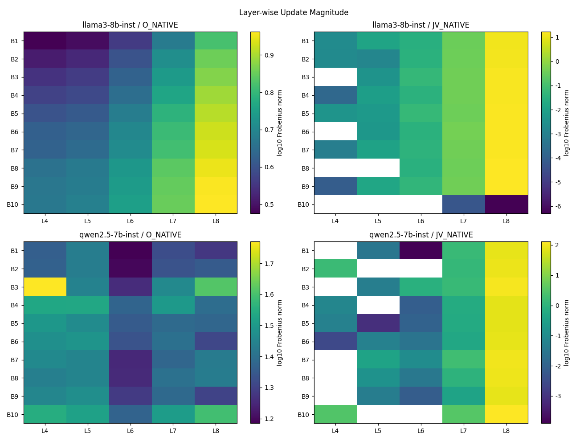
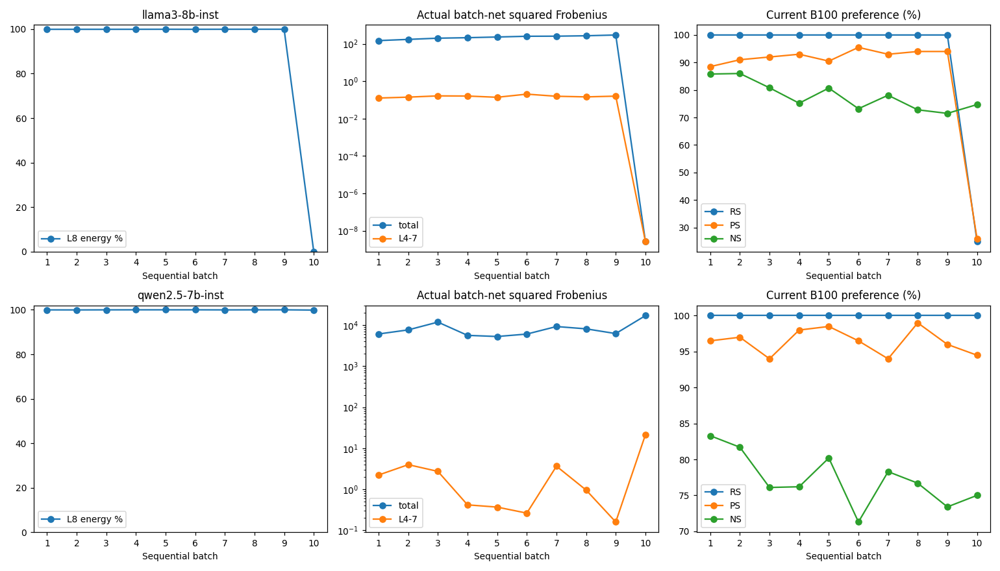
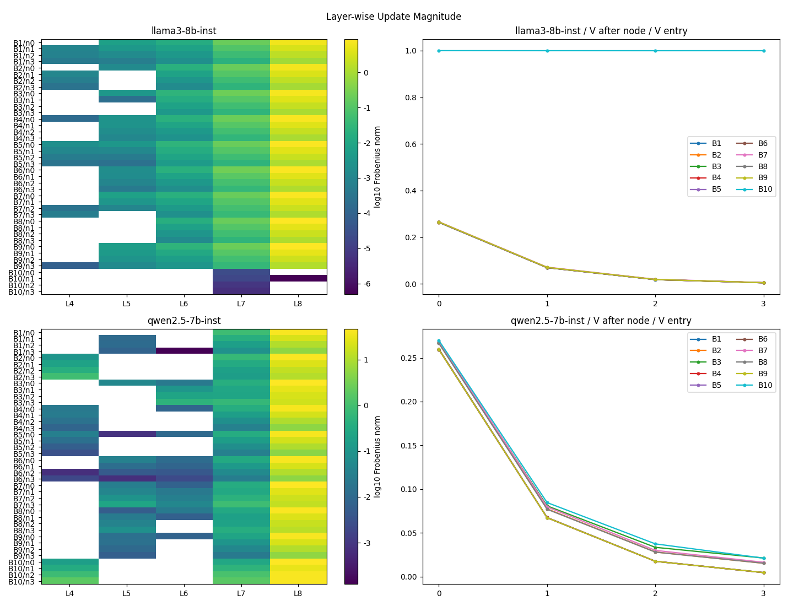

# AlphaEdit JV sequential 1,000 — layer 집중·물리적 write·retention 상세 사실 보고서

분석 기준: 2026-09-07. **완료 main 4 chains만**: Llama/Qwen × Official/JV, 각 10×B100 sequential W/M 누적. B10 warm pilot 및 미완료 L8-only와 pooling하지 않는다. 신규 GPU/모델/evaluator/Slurm 제출0; sweep HOLD; scientific_promotion=false.

## 1. 정의·분모·검증 범위

RS=canonical rewrite target-new NLL < target-true NLL, PS=두 rephrase prompt의 같은 strict preference, NS=neighborhood target-true NLL < target-new NLL; tie는 실패다. Final 분모는 chain별 RS1000/PS2000/NS10000; current B100는100/200/1000이다. Token denominator는 multi-token 때문에 prompt denominator와 다르다. Target-new/true NLL 모두 lower가 해당 target의 높은 likelihood를 뜻하나 preference는 양자의 차이이다. Strict PS는 request의 두 prompt 모두 preference 성공이다. Token accuracy와 자유 생성 정확도는 다른 값이다.

Git publication `0d0a0131e4a6a2a645dfa6530377d420a084d136`의48/48 member 및 package receipt 재계산 PASS. Execution `77358b1546d1baf83b3e251afcce663b08d7bfd7`; 분석 source `94d626606c768532d71f516efe6b82d3207d7c34`. Server2 외부 raw/checkpoint는 host 장애로 **독립 재해시하지 못했다**. 현 보고서는 Git의 raw-free tables/receipts를 독립 교차검산한 범위이며 source path의 존재만으로 raw 검증을 주장하지 않는다.

## 2. Final W10 전체 1,000 request 성능 (온라인 합계가 아님)

|model|arm|RS|PS|strictPS|NS|
|---|---|---|---|---|---|
|llama3-8b-inst|PRE_EDIT_ORIGINAL_W0|71/1000 (7.10%)|227/2000 (11.35%)|66/1000|8820/10000 (88.20%)|
|qwen2.5-7b-inst|PRE_EDIT_ORIGINAL_W0|131/1000 (13.10%)|344/2000 (17.20%)|93/1000|8463/10000 (84.63%)|
|llama3-8b-inst|O_NATIVE|1000/1000 (100.00%)|1910/2000 (95.50%)|927/1000|7584/10000 (75.84%)|
|qwen2.5-7b-inst|O_NATIVE|992/1000 (99.20%)|1887/2000 (94.35%)|900/1000|6978/10000 (69.78%)|
|llama3-8b-inst|JV_NATIVE|923/1000 (92.30%)|1690/2000 (84.50%)|786/1000|7259/10000 (72.59%)|
|qwen2.5-7b-inst|JV_NATIVE|997/1000 (99.70%)|1894/2000 (94.70%)|910/1000|7377/10000 (73.77%)|

### rewrite: target-new / target-true NLL 별도 분포

|model|arm|target|mean|median|p90|max|
|---|---|---|---|---|---|---|
|llama3-8b-inst|PRE_EDIT_ORIGINAL_W0|new|11.045759|10.930408|16.048845|21.289547|
|llama3-8b-inst|PRE_EDIT_ORIGINAL_W0|true|4.6960784|4.2983162|9.9756051|17.286938|
|qwen2.5-7b-inst|PRE_EDIT_ORIGINAL_W0|new|10.331439|10.297251|14.817537|20.701672|
|qwen2.5-7b-inst|PRE_EDIT_ORIGINAL_W0|true|5.2426646|4.7825027|9.8806986|17.76458|
|llama3-8b-inst|O_NATIVE|new|0.031701463|0.0012494266|0.0072453837|11.816629|
|llama3-8b-inst|O_NATIVE|true|14.201043|13.994936|19.626919|27.835144|
|qwen2.5-7b-inst|O_NATIVE|new|0.34538546|0.024036363|0.36990723|14.610106|
|qwen2.5-7b-inst|O_NATIVE|true|13.380405|13.300272|19.013797|30.110746|
|llama3-8b-inst|JV_NATIVE|new|0.89371302|0.0022973225|1.2863426|20.85808|
|llama3-8b-inst|JV_NATIVE|true|12.481717|12.505188|18.588577|26.33828|
|qwen2.5-7b-inst|JV_NATIVE|new|0.2369696|0.031286393|0.32358892|10.838152|
|qwen2.5-7b-inst|JV_NATIVE|true|13.102686|13.0778|19.053749|27.744514|

### rephrase: target-new / target-true NLL 별도 분포

|model|arm|target|mean|median|p90|max|
|---|---|---|---|---|---|---|
|llama3-8b-inst|PRE_EDIT_ORIGINAL_W0|new|10.055194|10.067713|14.313309|21.190834|
|llama3-8b-inst|PRE_EDIT_ORIGINAL_W0|true|4.8536435|4.4442203|9.9203388|18.126444|
|qwen2.5-7b-inst|PRE_EDIT_ORIGINAL_W0|new|10.286304|10.214387|14.817905|22.479809|
|qwen2.5-7b-inst|PRE_EDIT_ORIGINAL_W0|true|5.8091114|5.3386972|11.582826|18.595827|
|llama3-8b-inst|O_NATIVE|new|1.3579957|0.17228504|4.7945279|15.362717|
|llama3-8b-inst|O_NATIVE|true|9.9993983|9.9647923|15.146531|25.220594|
|qwen2.5-7b-inst|O_NATIVE|new|2.1800049|0.60433027|6.3887848|17.531527|
|qwen2.5-7b-inst|O_NATIVE|true|11.177967|11.089465|16.938268|29.519012|
|llama3-8b-inst|JV_NATIVE|new|2.5476444|0.75766438|7.9869936|22.709879|
|llama3-8b-inst|JV_NATIVE|true|8.4746014|8.3234577|13.64985|24.671646|
|qwen2.5-7b-inst|JV_NATIVE|new|2.283015|0.58505672|7.3728586|20.51218|
|qwen2.5-7b-inst|JV_NATIVE|true|11.285603|11.289533|16.660589|26.776316|

Qwen의 PS +7/2000과 rephrase target-new 평균·p90 상승은 다른 측정이다. 양쪽 target NLL 및 paired 성공 획득/손실은 별도 CSV로 제공하며 전체 generalization 개선으로 합치지 않는다.

## 3. 10개 batch 전체: 집중도와 절대 크기

Actual FP32 step ΔW는 node직전→직후 차이, batch-net은 batch entry→terminal 차이다. W0→W10 net은 Git tables에 없음(NOT_RECORDED). Step norm/energy의 합은 net norm/energy가 아니다. Native action은 S_l metric의 quadratic이고 Frobenius 제곱합과 다르다. Work는 h=.5를 한번 곱한 velocity action 합이다. 각 batch qref/M/N0가 달라 coefficient·normalized share만 cross-batch physical 이동으로 해석하지 않는다.

### llama3-8b-inst / JV_NATIVE: 모든 B1–B10

|B|batch-net energy|batch-net norm|L8 share|max layer|L4–7 energy|L4–7 hΣgc|RS/100|PS/200|NS/1000|V/V0|
|---|---|---|---|---|---|---|---|---|---|---|
|1|148.48132|12.185291|0.99915581|8|0.12534594|0.017503191|100|177|858|0.0048516418|
|2|172.01231|13.115346|0.99918504|8|0.14018282|0.016652134|100|182|860|0.0048878448|
|3|199.69981|14.131518|0.99918141|8|0.16347153|0.017341732|100|184|808|0.0049806616|
|4|212.15617|14.565582|0.9992442|8|0.16034837|0.016158385|100|186|752|0.0049586947|
|5|230.98006|15.198028|0.99940371|8|0.13773068|0.015103611|100|181|807|0.0049397457|
|6|253.18566|15.911809|0.99919905|8|0.20278861|0.01643628|100|191|732|0.0049543753|
|7|255.96049|15.998765|0.99939031|8|0.15605677|0.014310855|100|186|781|0.0056759644|
|8|268.8013|16.395161|0.99946256|8|0.14446336|0.013550582|100|188|728|0.0049498344|
|9|296.25122|17.21195|0.99946494|8|0.15851115|0.014113663|100|188|715|0.005130431|
|10|2.7167007e-09|5.2121979e-05|8.8415874e-05|7|2.7164605e-09|4.9450364e-06|25|52|747|0.99994719|

### llama3-8b-inst / O_NATIVE: 모든 B1–B10

|B|batch-net energy|batch-net norm|L8 share|max layer|L4–7 energy|L4–7 hΣgc|RS/100|PS/200|NS/1000|V/V0|
|---|---|---|---|---|---|---|---|---|---|---|
|1|98.171792|9.9081679|0.44688241|8|54.300545|N/A|100|185|869|N/A|
|2|116.65991|10.800922|0.44114069|8|65.196474|N/A|100|188|866|N/A|
|3|129.42416|11.376474|0.42804115|8|74.025294|N/A|100|189|846|N/A|
|4|142.96999|11.957006|0.42621368|8|82.034224|N/A|100|191|798|N/A|
|5|159.89518|12.644967|0.41395804|8|93.705284|N/A|100|190|821|N/A|
|6|173.70812|13.179838|0.40778113|8|102.87323|N/A|100|196|763|N/A|
|7|180.31865|13.428278|0.40706825|8|106.91665|N/A|100|198|797|N/A|
|8|199.3066|14.117599|0.39661856|8|120.25791|N/A|100|195|790|N/A|
|9|207.27061|14.396896|0.39960961|8|124.44328|N/A|100|197|750|N/A|
|10|211.88801|14.556373|0.39742636|8|127.67813|N/A|100|197|764|N/A|

### qwen2.5-7b-inst / JV_NATIVE: 모든 B1–B10

|B|batch-net energy|batch-net norm|L8 share|max layer|L4–7 energy|L4–7 hΣgc|RS/100|PS/200|NS/1000|V/V0|
|---|---|---|---|---|---|---|---|---|---|---|
|1|6134.1645|78.320907|0.99963612|8|2.232077|0.011259404|100|193|833|0.0045291439|
|2|7721.851|87.874063|0.99948325|8|3.990292|0.0097525511|100|194|817|0.01516124|
|3|11952.293|109.32654|0.99977105|8|2.7364671|0.0057805345|100|188|761|0.02116718|
|4|5676.2749|75.341057|0.99992644|8|0.4175365|0.005456967|100|196|762|0.0045213469|
|5|5324.7192|72.970674|0.99993082|8|0.36835188|0.0054034056|100|197|802|0.0045156367|
|6|6104.828|78.133399|0.99995698|8|0.26260311|0.0043323566|100|193|713|0.0044821427|
|7|9318.199|96.530819|0.99960684|8|3.6635564|0.006224906|100|188|783|0.016277573|
|8|8185.3435|90.472888|0.99988275|8|0.9597583|0.0045366835|100|198|767|0.015233888|
|9|6272.9643|79.202048|0.99997454|8|0.15973022|0.0032600323|100|192|734|0.0045115167|
|10|17152.653|130.96814|0.99875923|8|21.282413|0.0082196134|100|189|750|0.021031095|

### qwen2.5-7b-inst / O_NATIVE: 모든 B1–B10

|B|batch-net energy|batch-net norm|L8 share|max layer|L4–7 energy|L4–7 hΣgc|RS/100|PS/200|NS/1000|V/V0|
|---|---|---|---|---|---|---|---|---|---|---|
|1|2303.8267|47.998194|0.15718228|5|1941.7059|N/A|99|195|849|N/A|
|2|2493.0898|49.930851|0.20315618|5|1986.6032|N/A|100|198|825|N/A|
|3|7083.8311|84.165498|0.23730661|4|5402.7911|N/A|100|187|751|N/A|
|4|4519.2861|67.225635|0.13572538|5|3905.9043|N/A|100|199|716|N/A|
|5|3495.7794|59.125116|0.16302335|4|2925.8857|N/A|100|200|744|N/A|
|6|3348.7454|57.868345|0.12395834|5|2933.6405|N/A|100|192|696|N/A|
|7|3237.1029|56.895544|0.22240866|4|2517.1432|N/A|100|197|764|N/A|
|8|3231.6298|56.847426|0.22523254|5|2503.7616|N/A|100|192|735|N/A|
|9|3051.297|55.238547|0.13241954|5|2647.2457|N/A|100|192|672|N/A|
|10|5470.8605|73.965265|0.2799034|8|3939.548|N/A|99|190|705|N/A|

Llama B10: L8 share와 전체 energy가 동시에 작아진다. B1–B9와 B10을 같은 “다른 layer로의 성공적 이동”으로 묶을 근거는 없다. Qwen은 높은 L8 share가 지속된다. 두 모델 모두 절대값·분모를 위 표 그대로 보존한다.

보조 집중도: p_l=layer energy/total, entropy=-Σp log p, effective layers=exp(entropy). Total=0은 share/max-layer/entropy/effective 모두 N/A; zero p의 entropy contribution만0. 성공 gate가 아니다. Signed g_l c_l은 음수 가능하며 음수 layer를 제거하거나 norm share로 바꾸지 않았다.

## 4. 내부 4 node progression 및 전체 layer joins

`node-layer.csv` 400행이 각 B/node/layer의 actual step 및 batch-entry net, coefficient/raw coefficient/q/qref, g/H diagonal/gc, native/history/L2/Frobenius velocity와 h-work, materialized nonzero를 결속한다. `nodes.csv`80행과 `batch-layer.csv`200행, `batches.csv`40행은 각각 다른 단위다. Official은 Euler 값 NOT_RECORDED이며 actual batch ΔW만 비교한다.

### llama3-8b-inst: 모든 node의 progression

|B|node|step energy|batch-entry net energy|L8 step share|support|Σgc|V/V0|raw model error|finite defect|
|---|---|---|---|---|---|---|---|---|---|
|1|0|39.533344|39.533344|0.9990624|[5, 6, 7, 8]|0.97606711|0.26349632|0.097443108|0.00012589878|
|1|1|10.849756|91.716252|0.99920114|[4, 5, 6, 7, 8]|0.25698364|0.069500728|0.023942097|1.6721493e-05|
|1|2|2.9718516|127.53058|0.99929503|[4, 5, 6, 7, 8]|0.06773208|0.01835244|0.0060209063|2.236621e-06|
|1|3|0.81232767|148.48132|0.99933621|[4, 5, 6, 7, 8]|0.017872976|0.0048516418|0.0015832153|3.0764528e-07|
|2|0|46.165862|46.165862|0.99915358|[5, 6, 7, 8]|0.97500333|0.263954|0.093753997|5.2880586e-05|
|2|1|12.53996|106.71754|0.99919607|[4, 6, 7, 8]|0.25718143|0.069745115|0.023561982|3.9693264e-06|
|2|2|3.4021882|148.00544|0.99923756|[4, 6, 7, 8]|0.067910385|0.018451574|0.0060336121|1.4655705e-07|
|2|3|0.92200478|172.01231|0.99925828|[4, 6, 7, 8]|0.017954407|0.0048878448|0.0015834933|-3.6895855e-08|
|3|0|52.864792|52.864792|0.99910776|[5, 6, 7, 8]|0.97386206|0.26472666|0.095452806|9.7429321e-05|
|3|1|14.613607|122.90474|0.99922449|[5, 6, 7, 8]|0.25750305|0.070216836|0.023824093|1.0719425e-05|
|3|2|4.0501681|171.2331|0.99928585|[6, 7, 8]|0.06820976|0.018672082|0.0061346235|1.1905253e-06|
|3|3|1.1272031|199.69981|0.99930911|[6, 7, 8]|0.018110592|0.0049806616|0.0016381306|1.2732053e-07|
|4|0|56.387889|56.387889|0.99923797|[4, 5, 6, 7, 8]|0.97380952|0.26465549|0.093321305|0.00012165941|
|4|1|15.496011|130.85399|0.99923789|[5, 6, 7, 8]|0.25747025|0.070145205|0.024457737|1.5279828e-05|
|4|2|4.2686801|182.07599|0.9992638|[5, 6, 7, 8]|0.068166069|0.018628148|0.006442608|1.951919e-06|
|4|3|1.1792659|212.15617|0.99927229|[5, 6, 7, 8]|0.018080524|0.0049586947|0.0017466275|2.6651834e-07|
|5|0|61.573346|61.573346|0.99938495|[4, 5, 6, 7, 8]|0.97393894|0.26439224|0.089412018|8.0129404e-05|
|5|1|16.847131|142.68614|0.99941557|[4, 5, 6, 7, 8]|0.25725791|0.070011115|0.023384049|8.5514638e-06|
|5|2|4.6214172|198.35095|0.99943397|[4, 5, 6, 7, 8]|0.068050849|0.01857533|0.0061863804|8.5750111e-07|
|5|3|1.2715697|230.98006|0.99943016|[4, 5, 6, 7, 8]|0.01803436|0.0049397457|0.0016827758|8.253065e-08|
|6|0|67.691731|67.691731|0.99920294|[5, 6, 7, 8]|0.97319998|0.26474448|0.089789336|5.3316157e-05|
|6|1|18.458097|156.67759|0.9991935|[5, 6, 7, 8]|0.25744429|0.07017644|0.023857204|3.1489945e-06|
|6|2|5.0416856|217.58724|0.99919933|[5, 6, 7, 8]|0.068183931|0.018630475|0.0063540825|-8.8460713e-08|
|6|3|1.3794232|253.18566|0.99919226|[5, 6, 7, 8]|0.018085567|0.0049543753|0.0017249262|-8.1000993e-08|
|7|0|68.239774|68.239774|0.99943537|[5, 6, 7, 8]|0.97107968|0.26627047|0.084513559|4.5193977e-05|
|7|1|18.639736|158.015|0.99942567|[5, 6, 7, 8]|0.25737388|0.071707558|0.022452763|4.6839313e-06|
|7|2|5.1413373|219.67501|0.99933549|[4, 5, 6, 7, 8]|0.068681832|0.01974997|0.0064662498|3.1894997e-07|
|7|3|1.4453659|255.96049|0.99898751|[4, 6, 7, 8]|0.018580497|0.0056759644|0.0022317603|-2.1068271e-07|
|8|0|71.921687|71.921687|0.99945364|[6, 7, 8]|0.97328017|0.26451383|0.083313523|-7.9928129e-06|
|8|1|19.57523|166.37691|0.99946489|[6, 7, 8]|0.25722983|0.070083868|0.021815234|-3.1944016e-06|
|8|2|5.3436907|231.01035|0.99947953|[6, 7, 8]|0.068089919|0.018604903|0.005742632|-6.1353635e-07|
|8|3|1.4633752|268.8013|0.99948331|[6, 7, 8]|0.018056467|0.0049498344|0.0015451469|-9.6846483e-08|
|9|0|78.400402|78.400402|0.99947466|[5, 6, 7, 8]|0.97193599|0.26554687|0.082942862|3.1102057e-05|
|9|1|21.636878|182.16|0.99948075|[5, 6, 7, 8]|0.25759805|0.070805237|0.021941748|2.0122846e-06|
|9|2|6.023794|253.85681|0.99945074|[5, 6, 7, 8]|0.068510565|0.018986564|0.0060812166|-8.8116628e-08|
|9|3|1.6973325|296.25122|0.99936179|[4, 5, 6, 7, 8]|0.018308289|0.005130431|0.0018094435|-1.0313849e-07|
|10|0|5.8393734e-10|5.8393734e-10|0|[7]|6.1149445e-06|1.0000756|5.6728942e-05|4.0103013e-05|
|10|1|2.969317e-10|1.7049516e-09|0.00080893844|[7, 8]|3.126001e-06|0.9999531|5.2972891e-05|-6.008524e-05|
|10|2|4.7250814e-11|2.2953367e-09|0|[7]|4.6767242e-07|0.9998743|4.2395119e-05|-3.9226124e-05|
|10|3|2.0719334e-11|2.7167007e-09|0|[7]|2.0246273e-07|0.99994719|3.9187793e-05|3.6519289e-05|

### qwen2.5-7b-inst: 모든 node의 progression

|B|node|step energy|batch-entry net energy|L8 step share|support|Σgc|V/V0|raw model error|finite defect|
|---|---|---|---|---|---|---|---|---|---|
|1|0|1698.2485|1698.2485|0.99957896|[7, 8]|0.98308987|0.26009021|4.1770747|0.0004056371|
|1|1|443.46078|3872.7772|0.99965135|[5, 7, 8]|0.25573094|0.067483781|0.95815836|4.0284789e-05|
|1|2|115.11664|5316.313|0.99973354|[5, 7, 8]|0.066362974|0.017488798|0.2151629|3.9833869e-06|
|1|3|29.74557|6134.1645|0.99977335|[5, 6, 7, 8]|0.017201256|0.0045291439|0.051297211|4.5196086e-07|
|2|0|1826.2022|1826.2022|0.99974167|[4, 7, 8]|0.97326395|0.2674677|3.1176604|0.0003042195|
|2|1|549.93257|4332.413|0.99975073|[4, 7, 8]|0.25233091|0.077327595|0.85941878|3.4766682e-05|
|2|2|213.53692|6275.7804|0.99916275|[4, 7, 8]|0.065223901|0.028061004|0.4747527|1.2332995e-05|
|2|3|119.087|7721.851|0.99277115|[4, 7, 8]|0.01696289|0.01516124|0.62201951|1.5302751e-05|
|3|0|2167.0898|2167.0898|0.9999274|[5, 6, 7, 8]|0.97567934|0.26712639|1.8778843|0.00011153455|
|3|1|831.42411|5549.002|0.9999157|[6, 7, 8]|0.24786105|0.080769051|0.70054193|2.5785875e-05|
|3|2|477.22396|8845.9366|0.99977475|[6, 7, 8]|0.06282106|0.033380353|0.43893417|1.0841482e-05|
|3|3|338.93974|11952.293|0.9980305|[6, 7, 8]|0.016006749|0.02116718|0.51792182|5.6494792e-07|
|4|0|1583.1756|1583.1756|0.99991424|[4, 6, 7, 8]|0.98232876|0.25988455|1.6011398|5.0477199e-05|
|4|1|408.54762|3596.3047|0.9999318|[4, 7, 8]|0.25543233|0.067423881|0.37593191|4.4785683e-06|
|4|2|105.36377|4925.6417|0.99994449|[4, 7, 8]|0.066299696|0.01746911|0.089520165|4.5544272e-07|
|4|3|27.159158|5676.2749|0.99995087|[4, 7, 8]|0.017184479|0.0045213469|0.02213649|5.7876052e-08|
|5|0|1479.8492|1479.8492|0.99991711|[4, 5, 6, 7, 8]|0.98254657|0.25954842|1.5936623|5.3219475e-05|
|5|1|383.34757|3367.3764|0.99993777|[4, 7, 8]|0.25508048|0.067304095|0.3498334|5.5197951e-06|
|5|2|99.018079|4617.2507|0.99995087|[4, 7, 8]|0.066162571|0.017439432|0.081034133|6.7669161e-07|
|5|3|25.521394|5324.7192|0.99995707|[4, 7, 8]|0.017148096|0.0045156367|0.019765537|9.4065178e-08|
|6|0|1709.677|1709.677|0.99994847|[5, 6, 7, 8]|0.98340043|0.2594033|1.2908396|8.4815745e-05|
|6|1|439.00316|3877.6478|0.99996193|[5, 6, 7, 8]|0.25526343|0.067147709|0.29238472|8.8673413e-06|
|6|2|112.3368|5303.3969|0.999969|[4, 5, 6, 7, 8]|0.066108466|0.017357099|0.068964061|1.0169123e-06|
|6|3|28.677824|6104.828|0.99997207|[4, 5, 6, 7, 8]|0.01709503|0.0044821427|0.017029057|1.2715757e-07|
|7|0|2007.3031|2007.3031|0.99993799|[5, 6, 7, 8]|0.97009659|0.2688785|1.355851|3.2472408e-05|
|7|1|657.30532|4865.5889|0.99987094|[5, 6, 7, 8]|0.25030926|0.079620367|0.74210852|-8.7432571e-06|
|7|2|312.20743|7289.727|0.99927149|[5, 6, 7, 8]|0.065269481|0.029886695|1.2914018|-2.3605037e-05|
|7|3|208.21592|9318.199|0.99604968|[5, 6, 7, 8]|0.017554225|0.016277573|2.3523665|-3.3234217e-05|
|8|0|1830.9499|1830.9499|0.99995635|[5, 6, 7, 8]|0.97333681|0.26654585|1.1714715|3.1114212e-05|
|8|1|576.93426|4401.9991|0.99994075|[5, 6, 7, 8]|0.25135832|0.076927622|0.36748464|3.8442225e-06|
|8|2|249.48426|6506.7576|0.99983194|[5, 7, 8]|0.064703383|0.027923995|0.18708114|1.3348192e-06|
|8|3|150.60157|8185.3435|0.99905335|[5, 7, 8]|0.016537672|0.015233888|0.16346052|1.0706883e-06|
|9|0|1729.9186|1729.9186|0.99997063|[5, 6, 7, 8]|0.98292495|0.259506|0.96737854|5.4810614e-05|
|9|1|453.03773|3951.0104|0.99997633|[5, 7, 8]|0.25513582|0.067273695|0.22593941|6.2414782e-06|
|9|2|118.16346|5430.8635|0.99998016|[5, 7, 8]|0.066154327|0.017426624|0.054966481|7.7471475e-07|
|9|3|30.734745|6272.9643|0.9999819|[5, 7, 8]|0.017139662|0.0045115167|0.013980484|1.0325213e-07|
|10|0|2032.8214|2032.8214|0.99995177|[4, 7, 8]|0.96831972|0.26983394|1.2344744|2.5245123e-05|
|10|1|944.12765|5320.0988|0.99959798|[4, 7, 8]|0.24304817|0.084537297|1.218084|3.196315e-05|
|10|2|1703.3201|10216.248|0.99882147|[4, 7, 8]|0.060166309|0.037340901|2.6739547|-2.572884e-07|
|10|3|1645.2823|17152.653|0.99618927|[4, 7, 8]|0.020165279|0.021031095|5.6149623|-0.00011042785|

## 5. Native work / history / L2 / normalization

History/L2 분해는 raw native work와 같은 metric 안에서만 더한다. History-cost shadow는 actual W/dictionary/response/N0/qref를 고정하고 cost Gram만 초기값으로 바꾼다. History가 없는 전체 method 또는 actual L8 trajectory가 아니다.

|model|B|raw work|normalized work|history work|L2 work|history/raw|L8 native share|N0 min|H diag max node0|
|---|---|---|---|---|---|---|---|---|---|
|llama3-8b-inst|1|108.33456|0.1289367|0|108.33456|0|0.99910706|3.5311265|11.799074|
|llama3-8b-inst|2|127.13191|0.13377932|1.0718796|126.06003|0.0084312399|0.99916882|3.5393443|12.961597|
|llama3-8b-inst|3|147.92415|0.13948723|2.6126124|145.31154|0.017661838|0.99914335|4.0024571|12.940097|
|llama3-8b-inst|4|157.50315|0.14349956|2.8394627|154.66369|0.018027974|0.99924144|3.7111437|13.180942|
|llama3-8b-inst|5|172.31489|0.14556107|3.6879463|168.62694|0.021402366|0.99939641|3.7763479|13.885162|
|llama3-8b-inst|6|190.39064|0.14945822|5.2487865|185.14186|0.027568511|0.99920377|4.0420542|13.891585|
|llama3-8b-inst|7|198.33721|0.15274318|11.404765|186.93244|0.057501895|0.99941992|3.9868839|14.574688|
|llama3-8b-inst|8|202.98194|0.15068243|6.3739774|196.60797|0.031401697|0.99946021|4.2629199|15.397584|
|llama3-8b-inst|9|226.45532|0.15341576|10.938516|215.5168|0.048303197|0.99947404|4.1771278|14.518329|
|llama3-8b-inst|10|1.9831411e-09|1.3385274e-12|1.093599e-10|1.8737812e-09|0.055144793|0.00058775154|3.5747129e-05|4402280.7|
|qwen2.5-7b-inst|1|4573.1432|0.091655334|0|4573.1432|0|0.99960331|60.886482|21.142131|
|qwen2.5-7b-inst|2|5418.0685|0.094716982|0.55119428|5417.5173|0.00010173261|0.99939138|29.933226|18.200737|
|qwen2.5-7b-inst|3|7633.8933|0.047085129|4.5379837|7629.3553|0.00059445207|0.99973719|46.847469|49.699791|
|qwen2.5-7b-inst|4|4250.1397|0.093111199|1.6472962|4248.4924|0.00038758637|0.99991959|49.628414|26.638215|
|qwen2.5-7b-inst|5|3977.4535|0.098001643|1.9808526|3975.4726|0.00049802031|0.99992329|46.668884|30.39906|
|qwen2.5-7b-inst|6|4583.0669|0.086142984|3.6773526|4579.3895|0.00080237813|0.99995235|48.387383|32.703881|
|qwen2.5-7b-inst|7|11727.21|0.12468105|5357.1472|6370.0633|0.45681342|0.99955184|59.385952|20.704014|
|qwen2.5-7b-inst|8|5620.1372|0.10777581|4.1973743|5615.9399|0.00074684552|0.99989368|46.660515|34.47061|
|qwen2.5-7b-inst|9|4669.7671|0.091926534|6.0580386|4663.709|0.0012972892|0.99997238|49.543659|34.036493|
|qwen2.5-7b-inst|10|41875.198|0.20174568|29224.095|12651.103|0.69788553|0.99625707|48.225349|22.636737|

|model|B|native cosine|Frob cosine|shadow/actual native norm|actual progress|shadow progress|
|---|---|---|---|---|---|---|
|llama3-8b-inst|1|1|1|1|0.97606711|0.97606711|
|llama3-8b-inst|5|0.99999988|0.99999988|1.0009016|0.97393894|0.97438955|
|llama3-8b-inst|10|1|1|1|6.1149445e-06|6.1149445e-06|
|qwen2.5-7b-inst|1|1|1|1|0.98308987|0.98308987|
|qwen2.5-7b-inst|5|1|1|1.0000113|0.98254657|0.98255394|
|qwen2.5-7b-inst|10|0.99998853|0.9999885|1.016978|0.96831972|0.9805125|

Llama B10 작은 양수 N0 row, 큰 H, active set 및 실제 FP32 nonzero count를 각각 보존한다. g/H는 aggregate이고 per-request raw JVP·Gram decomposition은 이 publication에 없다. N0 단독 원인, λ 단독 원인, history 단독 원인은 UNRESOLVED. λ=.1/maxdiagH는 scale 진단일 뿐 전체 spectrum의 λ 효과를 배제하지 않는다. Source N0 floor/clip/행 제외를 추가하지 않았다. 원본 native optimizer delta0 로그와 capture residual의 차이는 `native_target_log_observations.csv`/`normalization_batch_summary.csv`에 분리했다.

## 6. Same-state joint vs best-single/L8

|model|nodes|best_L8|mean|median|p90|max|
|---|---|---|---|---|---|---|
|llama3-8b-inst|40|36|0.098762037|0.00060624332|0.095888524|1|
|qwen2.5-7b-inst|40|40|0.0030273494|0.00014328485|0.0049244854|0.065683756|

비율=(joint objective improvement−L8 improvement)/joint improvement. Joint improvement0이면 N/A. 40/40과36/40 best-L8 같은 same-state 비교는 actual L8-only chain 완료를 대체하지 않는다. L8-only는 이 package의 completed denominator에 없으며 SH4 live output을 읽지 않았다.

## 7. At-write failure / forgetting / recovery / overwrite

|alias|arm|at_write_success|initially_failed|at_write_success_to_final_failure|conditional_failure_denominator|initially_failed_to_final_recovery|final_RS|nonoverwrite_failure|nonoverwrite_success_den|overwrite_candidates|
|---|---|---|---|---|---|---|---|---|---|---|
|llama3-8b-inst|O_NATIVE|1000|0|0|1000|0|1000|0|999|1|
|qwen2.5-7b-inst|O_NATIVE|998|2|6|998|0|992|6|997|1|
|llama3-8b-inst|JV_NATIVE|925|75|2|925|0|923|1|924|1|
|qwen2.5-7b-inst|JV_NATIVE|1000|0|3|1000|0|997|3|999|1|

Previous-checkpoint failure→recovery와 최초 at-write failure→final recovery는 다르다. 220개 cohort/checkpoint 행을 모두 유지하고 overwrite 후보도 제거하지 않는다. Llama JV 75건 at-write 실패와2건 후속 실패를 모두 forgetting으로 부르지 않는다. B1–B9 PS 변화와 B10 신규 실패는 서로 다른 범위다. W0 locality 손실/회복 및 O→JV paired 성공 획득/손실은 각각 분리 CSV다.

## 8. 시간·연산량 및 이전 warm pilot 비교

|alias|arm|process_seconds|process_JV_over_O|forward|backward|main_JVP|native_key_captures|solve_instrumented|target_seconds|write_including_endpoint_seconds|endpoint_seconds|peak_gpu_bytes|
|---|---|---|---|---|---|---|---|---|---|---|---|---|
|llama3-8b-inst|O_NATIVE|10814.555|1|26895|21025|0|100|50|6914.2581|2428.347|795.1885|39115080192|
|qwen2.5-7b-inst|O_NATIVE|8627.0217|1|19178|13307|0|100|50|4067.9094|2570.5651|931.87117|40953551360|
|llama3-8b-inst|JV_NATIVE|16371.129|1.5138052|31075|23955|200|300|1583|7920.0617|6259.7298|801.98525|38191523328|
|qwen2.5-7b-inst|JV_NATIVE|13055.047|1.5132739|18842|11721|200|300|1583|3595.7379|6742.2392|917.86947|39044651520|

Process ratio는 target·writer·evaluator·state bookkeeping을 포함한다. Terminal compute.wall은 절대 clock이며 elapsed로 합산하지 않는다. Solve instrumentation에는 NNLS face solves가 들어가므로 Official native solve 수와 같은 종류로 해석하지 않는다. Model.forward 횟수는 FLOPs가 아니며 FLOP 추정 없음. Memory는 peak이며 합산값 아님.

이전 B10 warm pilot은 Official D10A1회로 만든 공통 warm entry에서 D10B/H10 독립 비교였다. 이번1000은 각 arm이 자기 W/M/z를 B1→B10 누적하며 sample도 다르다. 기존 pilot main/old-edit tables를 입력 identity와 함께 별도 보조 표로 제공하고 수치 pooling하지 않는다. Warm pilot old-edit loss0과 이번 sequential forgetting을 같은 denominator의 결과로 보지 않는다.

## 9. Sweep 및 lifelong readiness: 사후·탐색적 판정

이번 사용자 instruction의 명시적 해석 요청에 한해 아래 판단을 기재한다. 결과를 본 후 만든 retrospective/exploratory 검토이며 사전 threshold PASS가 아니다.

|Model|현재 lifelong readiness|Sweep 검토|한계|
|---|---|---|---|
|Llama|HOLD|λ축 bounded development는 사용자 승인됐으나 현재 제출 HOLD; N0 민감도 분해를 함께 기록할 필요|B10 신규RS25/100, near-no-action; B1부터 PS 약화. λ만 바꾸면 회복된다는 증거 없음|
|Qwen|CANDIDATE, lifelong PASS 아님|동일 λ/control/audit matrix를 유지할 비교 후보; 필요성 확정은 UNRESOLVED|RS/PS/NS 증가와 rephrase new NLL tail 악화·L8집중·약1.51× 비용 공존|

N0 변경은 별도 scientific authority 없이는 하지 않는다. T/N/h는 고정축이고 λ와 동시에 바꾸지 않는다. 기존1000은 retrospective 진단이며 개발 및 독립 confirmation 양쪽에 사용할 수 없다. 새 sample의 development 선택 후 unopened audit가 필요하고 신규10k 자동실행0. 현재 report-first override에 따라 GPU sweep은 HOLD다.

## 10. 독립 교차검산·미기록·재현

GH verification과 독립 CSV 산술 비교: `PASS_INDEPENDENT_ARITHMETIC_MATCH`, 비교항목136개. GH memo 문장을 source evidence 대신 복사하지 않았다. detailed 수치는 `gh-crosscheck.json`에 있다.

Publication이 담지 않은 W0-net dense displacement, per-request H/JVP 정밀 분해, node-local solve spectrum은 NOT_RECORDED/UNRESOLVED로 남긴다. Runtime source에서 validator가 실행되었다는 경로 확인과 external raw 재해시는 다른 보증이다. 정밀 원인 검증을 위해 새 모델/evaluator를 실행하지 않았다.

재현: `python3 -m project.run_scripts.alpha_native_response_ode_v31_analysis.analyze --repo <worktree> --output <new-create-once-directory> --gh-verification /mnt/raid5/janghj/ODE-edit/local/state/alpha-jv-gh-review-20260907-v1/verification.json`. PNG는 같은 derived CSV를 다시 읽어 재실행하고 byte SHA 일치를 검사했다. Input/output/source/environment/row-count identity는 `analysis-manifest.json`, `rooted-receipt.json`, `plot-reproduction.json`, `input-inventory.json`에 결속한다.

### 상세 테이블 목록

- [batch-layer.csv](batch-layer.csv)
- [batches.csv](batches.csv)
- [compute_accounting.csv](compute_accounting.csv)
- [cost.csv](cost.csv)
- [current_batch_metrics.csv](current_batch_metrics.csv)
- [endpoint-partitions.csv](endpoint-partitions.csv)
- [final_metrics.csv](final_metrics.csv)
- [history-cost-comparison.csv](history-cost-comparison.csv)
- [history_cost_shadows.csv](history_cost_shadows.csv)
- [l8_single_layer_shadows.csv](l8_single_layer_shadows.csv)
- [layer_allocation_nodes.csv](layer_allocation_nodes.csv)
- [native_target_log_observations.csv](native_target_log_observations.csv)
- [neighborhood_transition_summary.csv](neighborhood_transition_summary.csv)
- [nll-distributions.csv](nll-distributions.csv)
- [node-layer.csv](node-layer.csv)
- [nodes.csv](nodes.csv)
- [normalization_batch_summary.csv](normalization_batch_summary.csv)
- [paired_seen_endpoint_metrics.csv](paired_seen_endpoint_metrics.csv)
- [previous-warm-old_edit_metrics.csv](previous-warm-old_edit_metrics.csv)
- [previous-warm-pilot_main_table.csv](previous-warm-pilot_main_table.csv)
- [request_normalization_scales.csv](request_normalization_scales.csv)
- [retention_cohort_metrics.csv](retention_cohort_metrics.csv)
- [seen_prefix_metrics.csv](seen_prefix_metrics.csv)
- [state_continuity_summary.csv](state_continuity_summary.csv)
