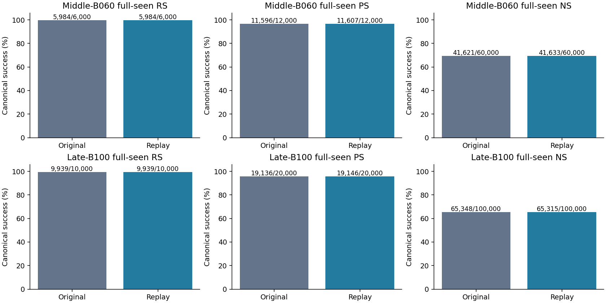
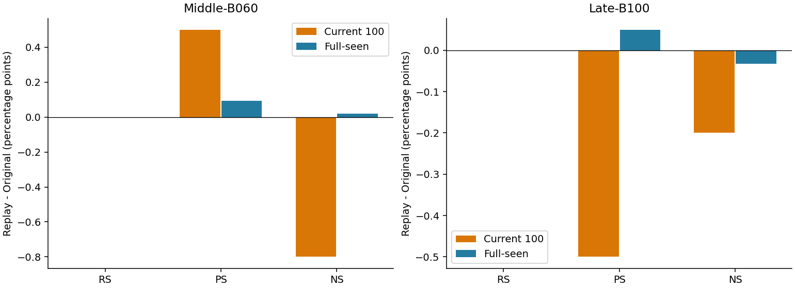
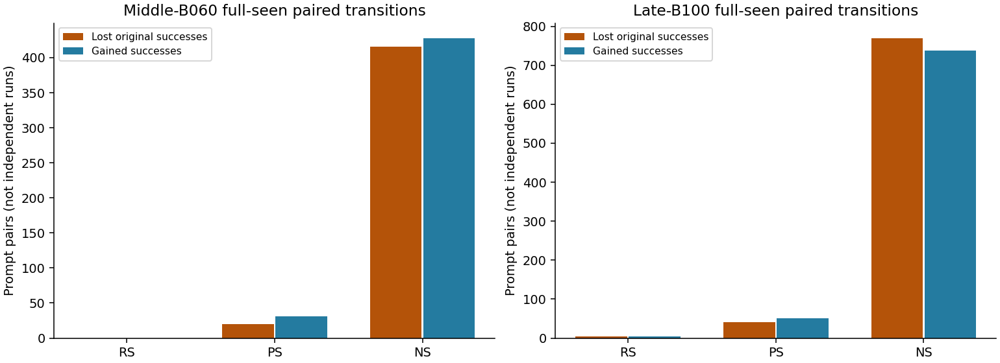

# E01 Middle/Late actual full-seen — 원본 L4-only 대비 상세 사실 보고

상태: **지정 Middle/Late 관측 보완 및 이번 CPU 리뷰 완료. 전체 E01 완료 아님.**

instruction_id: `ODEEDIT-S06-E01-MIDDLE-LATE-FULLSEEN-DETAILED-REVIEW-SH1-V1`  
작성 역할: SH1 사실·수치·검증. 과학적 원인 종합·선택·허용 claim은 GH 소유. `scientific_promotion=false`.

## 1. 비교 대상·지표·분모

원본은 고정 CounterFact10k의 **AlphaEdit BLUE-style L4_ONLY(singleton L2=1)** 원 trajectory B060/B100이다. Replay는 각각 그 원본 B050/B090 W/M에서 10개 B100 native batch를 실행한 별도 endpoint다. 원본 5-layer AlphaEdit, JV, 다른 stream 점수는 이번 표에 섞지 않았다.

`B060=W6000`, `B100=W10000`이다. Current100은 마지막 batch B060 또는 B100의 100 requests를 **그 terminal weight에서** 평가한 값이다. Fullseen은 terminal에서 관측한 전체 과거6000/10000 requests이며, 각 batch의 온라인 at-write 점수를 더한 값이 아니다. 두 endpoint는 독립적으로 복원한 서로 다른 suffix이고 Middle에서 Late로 state를 넘기지 않았다.

RS/PS는 rewrite/rephrase의 `new_nll < true_nll`, NS는 neighborhood의 `true_nll < new_nll`; tie는 모두 실패다. 각 NLL은 해당 target의 모든 teacher-forced token 평균이며 낮을수록 해당 후보에 더 높은 likelihood다. Desired margin은 RS/PS에서 `true−new`, NS에서 `new−true`; success는 margin>0이다. Raw true−new margin은 원본 그대로 보존했다.

Request당 RS1/PS2/NS10 prompt pairs. Fullseen Middle 분모6000/12000/60000, Late10000/20000/100000. Current100 분모100/200/1000. Fullseen과 그 부분집합 Current/old/new/cohort/active를 서로 더하지 않는다. NS100000은 독립 run100000개가 아니다.

## 2. 첫 핵심 결과 — 원본과 replay

Δpp=replay−원본. Lost/gained는 동일 case·prompt·target 쌍의 원본 성공→replay 실패 / 원본 실패→replay 성공이다. 총 성공 수가 같아도 같은 문항이 성공했다는 뜻은 아니다.

| Endpoint | Panel | Metric | 원본 n/d (%) | Replay n/d (%) | Δpp | Lost | Gained |
| --- | --- | --- | --- | --- | --- | --- | --- |
| Middle-B060 | fullseen | RS | 5984/6000 (99.7333) | 5984/6000 (99.7333) | +0.000000 | 0 | 0 |
| Middle-B060 | fullseen | PS | 11596/12000 (96.6333) | 11607/12000 (96.7250) | +0.091667 | 20 | 31 |
| Middle-B060 | fullseen | NS | 41621/60000 (69.3683) | 41633/60000 (69.3883) | +0.020000 | 416 | 428 |
| Middle-B060 | Current100 | RS | 100/100 (100.0000) | 100/100 (100.0000) | +0.000000 | 0 | 0 |
| Middle-B060 | Current100 | PS | 195/200 (97.5000) | 196/200 (98.0000) | +0.500000 | 1 | 2 |
| Middle-B060 | Current100 | NS | 734/1000 (73.4000) | 726/1000 (72.6000) | -0.800000 | 12 | 4 |
| Late-B100 | fullseen | RS | 9939/10000 (99.3900) | 9939/10000 (99.3900) | +0.000000 | 4 | 4 |
| Late-B100 | fullseen | PS | 19136/20000 (95.6800) | 19146/20000 (95.7300) | +0.050000 | 41 | 51 |
| Late-B100 | fullseen | NS | 65348/100000 (65.3480) | 65315/100000 (65.3150) | -0.033000 | 770 | 737 |
| Late-B100 | Current100 | RS | 100/100 (100.0000) | 100/100 (100.0000) | +0.000000 | 0 | 0 |
| Late-B100 | Current100 | PS | 194/200 (97.0000) | 193/200 (96.5000) | -0.500000 | 2 | 1 |
| Late-B100 | Current100 | NS | 655/1000 (65.5000) | 653/1000 (65.3000) | -0.200000 | 11 | 9 |

Late fullseen RS는 양쪽9939/10000이지만 lost4/gained4다. Middle fullseen NS는 +12건, Late는 −33건이며, 각각 lost416/gained428 및 lost770/gained737을 포함한다. 이 산술은 원인 판정이나 weight parity를 뜻하지 않는다.





## 3. 기존 entry-old와 이번 신규1000, 전체 cohort

`entry_old`는 원 checkpoint까지의5000/9000 requests, `new_window1000`은 이번 10-batch suffix의1000 requests다. 이 구분은 평가 시점이 아니라 request의 편집 ordinal이다. 두 집단 모두 B060/B100 terminal 관측이다.

| Endpoint | Panel | Metric | 원본 n/d | Replay n/d | Δpp | Lost/Gained |
| --- | --- | --- | --- | --- | --- | --- |
| Middle-B060 | entry_old | RS | 4984/5000 | 4984/5000 | +0.000000 | 0/0 |
| Middle-B060 | entry_old | PS | 9658/10000 | 9662/10000 | +0.040000 | 15/19 |
| Middle-B060 | entry_old | NS | 34513/50000 | 34528/50000 | +0.030000 | 340/355 |
| Middle-B060 | new_window1000 | RS | 1000/1000 | 1000/1000 | +0.000000 | 0/0 |
| Middle-B060 | new_window1000 | PS | 1938/2000 | 1945/2000 | +0.350000 | 5/12 |
| Middle-B060 | new_window1000 | NS | 7108/10000 | 7105/10000 | -0.030000 | 76/73 |
| Late-B100 | entry_old | RS | 8943/9000 | 8943/9000 | +0.000000 | 4/4 |
| Late-B100 | entry_old | PS | 17214/18000 | 17220/18000 | +0.033333 | 34/40 |
| Late-B100 | entry_old | NS | 58808/90000 | 58780/90000 | -0.031111 | 684/656 |
| Late-B100 | new_window1000 | RS | 996/1000 | 996/1000 | +0.000000 | 0/0 |
| Late-B100 | new_window1000 | PS | 1922/2000 | 1926/2000 | +0.200000 | 7/11 |
| Late-B100 | new_window1000 | NS | 6540/10000 | 6535/10000 | -0.050000 | 86/81 |

모든 B001…B060 및 B001…B100 cohort 각각의 세 지표·strict/token 보조값은 [cohort-performance.csv](cohort-performance.csv), 각 cohort lost/gained/unchanged는 [paired-transitions.csv](paired-transitions.csv)에 있다. 대표 시점만 고른 표가 아니며 빈 subset은 0점으로 대체하지 않는다.

## 4. Active·superseded·overwrite metadata

NFC 및 공백 정규화 subject+relation의 관측 prefix 내 최신 ordinal을 active로 둔다. 이전 version은 뒤에 다른 target이 있으면 `superseded_conflicting_target`, 같은 target만 있으면 `superseded_same_target`다. 이 metadata 분류는 실제 정당한 지식 갱신을 외부에서 판정한 결과가 아니다. 원래 전체 분모를 유지하고 보조 subset을 따로 보여준다.

| Endpoint | Subset | Requests | RS 원본→Replay | PS 원본→Replay | NS 원본→Replay |
| --- | --- | --- | --- | --- | --- |
| Middle-B060 | active | 5903 | 5894→5894/5903 | 11459→11467/11806 | 40993→41005/59030 |
| Middle-B060 | superseded_conflicting_target | 96 | 89→89/96 | 135→138/192 | 623→623/960 |
| Middle-B060 | superseded_same_target | 1 | 1→1/1 | 2→2/2 | 5→5/10 |
| Late-B100 | active | 9783 | 9743→9743/9783 | 18816→18825/19566 | 64024→63999/97830 |
| Late-B100 | superseded_conflicting_target | 212 | 191→191/212 | 310→311/424 | 1295→1287/2120 |
| Late-B100 | superseded_same_target | 5 | 5→5/5 | 10→10/10 | 29→29/50 |

실패가 처음 발생한 정확한 batch는 두 endpoint 비교에서 관측할 수 없다. Checkpoint 사이 실패·회복을 보간하지 않았다. Superseded 문항의 실패를 전부 active-memory 손실로 부르지 않는다.

## 5. NLL 및 desired-margin 분포

아래는 fullseen의 원본/replay 분포다. 모든 request/prompt가 포함되며 분위수는 정렬된 prompt-pair 값의 `(n−1)q` 선형 분위수다. tail이 같은 문항인지 알려면 paired delta를 보아야 한다. Current100·old/new·모든 cohort·overwrite subset의 mean/median/p90/p95/p99/min/max와 각 paired delta는 [distributions.csv](distributions.csv)에 전부 있다.

### Target-new NLL

| Endpoint | Metric | Population | n | Mean | Median | p90 | p95 | p99 |
| --- | --- | --- | --- | --- | --- | --- | --- | --- |
| Middle-B060 | RS | baseline | 6000 | 0.1129229 | 0.003087577 | 0.04068064 | 0.1916867 | 3.816921 |
| Middle-B060 | RS | replay | 6000 | 0.1107897 | 0.003004384 | 0.03939839 | 0.1984249 | 3.711594 |
| Middle-B060 | PS | baseline | 12000 | 1.445792 | 0.303428 | 4.738873 | 6.548985 | 9.63725 |
| Middle-B060 | PS | replay | 12000 | 1.443532 | 0.3055772 | 4.726784 | 6.470527 | 9.61012 |
| Middle-B060 | NS | baseline | 60000 | 8.232116 | 8.22036 | 13.2183 | 14.6546 | 17.56463 |
| Middle-B060 | NS | replay | 60000 | 8.237371 | 8.214797 | 13.21838 | 14.65193 | 17.55657 |
| Late-B100 | RS | baseline | 10000 | 0.2305267 | 0.007097153 | 0.2581025 | 1.206997 | 5.449679 |
| Late-B100 | RS | replay | 10000 | 0.2305848 | 0.007050338 | 0.2480682 | 1.216665 | 5.362853 |
| Late-B100 | PS | baseline | 20000 | 1.589231 | 0.4179298 | 5.054902 | 6.799633 | 10.0466 |
| Late-B100 | PS | replay | 20000 | 1.584036 | 0.4165967 | 5.051159 | 6.779636 | 10.02181 |
| Late-B100 | NS | baseline | 100000 | 8.020099 | 8.031927 | 12.96232 | 14.38521 | 17.25546 |
| Late-B100 | NS | replay | 100000 | 8.013487 | 8.027173 | 12.96387 | 14.39573 | 17.28313 |

### Target-true NLL

| Endpoint | Metric | Population | n | Mean | Median | p90 | p95 | p99 |
| --- | --- | --- | --- | --- | --- | --- | --- | --- |
| Middle-B060 | RS | baseline | 6000 | 13.30873 | 13.09397 | 18.79238 | 20.37817 | 23.40177 |
| Middle-B060 | RS | replay | 6000 | 13.33815 | 13.10642 | 18.81688 | 20.3612 | 23.44087 |
| Middle-B060 | PS | baseline | 12000 | 9.876688 | 9.713361 | 14.83055 | 16.40613 | 19.59146 |
| Middle-B060 | PS | replay | 12000 | 9.891819 | 9.736336 | 14.83112 | 16.36503 | 19.61071 |
| Middle-B060 | NS | baseline | 60000 | 6.092686 | 5.781995 | 11.10714 | 12.47963 | 15.52837 |
| Middle-B060 | NS | replay | 60000 | 6.097817 | 5.79687 | 11.11433 | 12.4958 | 15.44588 |
| Late-B100 | RS | baseline | 10000 | 12.23844 | 12.03249 | 17.69875 | 19.26326 | 22.3593 |
| Late-B100 | RS | replay | 10000 | 12.23737 | 12.01811 | 17.6753 | 19.27961 | 22.36733 |
| Late-B100 | PS | baseline | 20000 | 9.505839 | 9.301263 | 14.35154 | 15.88968 | 18.98955 |
| Late-B100 | PS | replay | 20000 | 9.510542 | 9.297671 | 14.32053 | 15.89733 | 18.99714 |
| Late-B100 | NS | baseline | 100000 | 6.458119 | 6.244174 | 11.24065 | 12.72825 | 15.7813 |
| Late-B100 | NS | replay | 100000 | 6.451774 | 6.247194 | 11.2228 | 12.73903 | 15.74337 |

### Desired margin

| Endpoint | Metric | Population | n | Mean | Median | p90 | p95 | p99 |
| --- | --- | --- | --- | --- | --- | --- | --- | --- |
| Middle-B060 | RS | baseline | 6000 | 13.19581 | 13.06102 | 18.79071 | 20.36437 | 23.39965 |
| Middle-B060 | RS | replay | 6000 | 13.22736 | 13.077 | 18.81006 | 20.36054 | 23.44012 |
| Middle-B060 | PS | baseline | 12000 | 8.430896 | 8.406477 | 14.31172 | 16.0645 | 19.45869 |
| Middle-B060 | PS | replay | 12000 | 8.448288 | 8.403609 | 14.30866 | 16.05787 | 19.48957 |
| Middle-B060 | NS | baseline | 60000 | 2.139429 | 2.206989 | 7.947459 | 9.581946 | 12.824 |
| Middle-B060 | NS | replay | 60000 | 2.139554 | 2.196607 | 7.943773 | 9.595299 | 12.86379 |
| Late-B100 | RS | baseline | 10000 | 12.00792 | 11.96273 | 17.68246 | 19.24209 | 22.35887 |
| Late-B100 | RS | replay | 10000 | 12.00678 | 11.9448 | 17.65764 | 19.27146 | 22.3602 |
| Late-B100 | PS | baseline | 20000 | 7.916608 | 7.909786 | 13.80869 | 15.51827 | 18.85495 |
| Late-B100 | PS | replay | 20000 | 7.926506 | 7.914273 | 13.80518 | 15.47746 | 18.87039 |
| Late-B100 | NS | baseline | 100000 | 1.56198 | 1.605193 | 7.219536 | 8.853907 | 12.14603 |
| Late-B100 | NS | replay | 100000 | 1.561713 | 1.61425 | 7.219205 | 8.850605 | 12.13658 |

RS/PS/NS preference 변화와 target-new NLL 변화는 같은 정의가 아니다. NS의 true와 competing-new 양쪽을 별도로 제시했으며, preference가 높다는 이유로 두 후보 모두의 NLL 개선이라고 쓰지 않는다.

## 6. Paired 전이·strict/token 보조·at-write



주표의 loss 분모는 전체 prompt pairs, `loss_rate_among_baseline_success`의 분모는 해당 원본 성공 수다. `unchanged_success`와 `unchanged_failure`까지 합해 전체 분모가 되는 conservation identity를 검산했다. Baseline vs replay final 전이와 각 trajectory의 시간상 forgetting은 다른 비교다.

Token/strict는 canonical NLL-pair 지표와 별개다. RS/PS의 target-new와 NS의 target-true strict/token을 아래에 보이며 양 target의 전체 count는 CSV에 보존했다. Token 수는 multi-token target을 포함하므로 prompt 분모와 같지 않을 수 있다.

| Endpoint | Metric | 원본 strict n/d | Replay strict n/d | 원본 token correct/d | Replay token correct/d |
| --- | --- | --- | --- | --- | --- |
| Middle-B060 | RS | 5860/6000 | 5863/6000 | 5945/6085 | 5948/6085 |
| Middle-B060 | PS | 8286/12000 | 8308/12000 | 8452/12170 | 8474/12170 |
| Middle-B060 | NS | 6148/60000 | 6210/60000 | 6834/60730 | 6896/60730 |
| Late-B100 | RS | 9529/10000 | 9528/10000 | 9688/10163 | 9687/10163 |
| Late-B100 | PS | 13362/20000 | 13395/20000 | 13658/20326 | 13692/20326 |
| Late-B100 | NS | 8210/100000 | 8259/100000 | 9195/101270 | 9242/101270 |

기존 원본 at-write 관측을 사용한 별도 endpoint 전이는 [atwrite-transitions.csv](atwrite-transitions.csv)에 수록했다. 원본 at-write를 replay 자체의 과거 at-write였다고 바꾸어 부르지 않는다. 수신·identity·비교범위와 missing은 companion receipt에 기록한다.

| Endpoint | Metric | At-write 기준 | Final | n/d at-write→final | Lost/Gained |
| --- | --- | --- | --- | --- | --- |
| Middle-B060 | RS | ORIGINAL_OWN_ATWRITE | original_final | 5998→5984/6000 | 14/0 |
| Middle-B060 | PS | ORIGINAL_OWN_ATWRITE | original_final | 11649→11596/12000 | 151/98 |
| Middle-B060 | NS | ORIGINAL_OWN_ATWRITE | original_final | 45700→41621/60000 | 6062/1983 |
| Middle-B060 | RS | ORIGINAL_OWN_ATWRITE | replay_final | 5998→5984/6000 | 14/0 |
| Middle-B060 | PS | ORIGINAL_OWN_ATWRITE | replay_final | 11649→11607/12000 | 146/104 |
| Middle-B060 | NS | ORIGINAL_OWN_ATWRITE | replay_final | 45700→41633/60000 | 6080/2013 |
| Late-B100 | RS | ORIGINAL_OWN_ATWRITE | original_final | 9993→9939/10000 | 55/1 |
| Late-B100 | PS | ORIGINAL_OWN_ATWRITE | original_final | 19403→19136/20000 | 423/156 |
| Late-B100 | NS | ORIGINAL_OWN_ATWRITE | original_final | 72505→65348/100000 | 11547/4390 |
| Late-B100 | RS | ORIGINAL_OWN_ATWRITE | replay_final | 9993→9939/10000 | 55/1 |
| Late-B100 | PS | ORIGINAL_OWN_ATWRITE | replay_final | 19403→19146/20000 | 420/163 |
| Late-B100 | NS | ORIGINAL_OWN_ATWRITE | replay_final | 72505→65315/100000 | 11603/4413 |

위 두 final 열에 공통으로 사용한 것은 원본 at-write reference다. Replay 자체 at-write는 B051/B060 및 B091/B100의 각200 requests만 저장되어 있다. 전체 prefix 대비5800/9800, 신규 window1000 대비800 requests의 replay-own at-write가 없어 그 부분 forgetting을 추정하지 않는다. 부분관측 전이는 atwrite CSV의 REPLAY_OWN_RECORDED_ATWRITE 행이며 `observed_requests/missing_atwrite_requests`를 그대로 표시한다.

## 7. W/M tensor 차이와 성능 fidelity의 구분

CPU mmap 및 FP64 chunk reduction으로 실제 저장된 원본/재개 B060/B100을 비교했다. Shape는 W=[4096,14336], M=[1,14336,14336], 저장 dtype FP32다. 상대 Frobenius는 `||replay−reference||F / ||reference||F`; 작은 history 상대차이를 bitexact로 바꾸지 않았다. Changed fraction은 FP32 원소가 정확히 다른 비율이며 유의성 비율이 아니다.

| Entry→endpoint | Tensor | \|\|difference\|\|F | \|\|reference\|\|F | Relative F | Max abs | Changed / total | 상태 |
| --- | --- | --- | --- | --- | --- | --- | --- |
| 5000→6000 | weight_L4 | 8.819284 | 107.3737 | 0.08213632 | 0.02349893 | 58720238/58720256 | NONEXACT_CAUSE_UNRESOLVED |
| 5000→6000 | history_M4 | 0.001392752 | 3303.831 | 4.215567e-07 | 7.629395e-05 | 200219295/205520896 | NONEXACT_CAUSE_UNRESOLVED |
| 9000→10000 | weight_L4 | 9.630476 | 129.554 | 0.07433561 | 0.0303023 | 58720229/58720256 | NONEXACT_CAUSE_UNRESOLVED |
| 9000→10000 | history_M4 | 0.001401672 | 5460.987 | 2.566701e-07 | 0.0001220703 | 197216607/205520896 | NONEXACT_CAUSE_UNRESOLVED |

전체 shape/dtype/hash/changed fraction 및 기존 B001/B020의 재사용 수치는 [weight-history-differences.csv](weight-history-differences.csv). B001/B020는 이번에 다시 모델 실행하거나 tensor 전수 재검산한 값이 아니라 기존 receipt 재사용이다. Tensor hash 규약과 파일 SHA는 구별하며 실행 guard hash와 단순 raw-byte hash를 동일 형식으로 간주하지 않는다.

B060 W relative F 약8.2136%, B100 약7.4336%와 위의 성능 차이를 나란히 관측했다. **성능 비슷함은 weight/trajectory parity PASS가 아니고, weight nonexact는 성능 붕괴를 뜻하지 않는다.** 원인은 `NONEXACT_CAUSE_UNRESOLVED`; hardware, target, solver 중 하나로 추정 귀속하지 않는다.

## 8. E0의 비교 수준과 source repair

No-op/저장 CP 복원, 실제 다음 native write, 10-batch continuation, 원본 endpoint tensor 일치, 같은 endpoint 성능 비교를 분리한다. 이번 관측은 저장된 replay endpoint를 평가한 것이며 원본 trajectory와 exact하다고 판정하지 않는다. 첫 B051/B091의 계측을 최종 B060/B100 계측으로 읽지 않는다.

Native source `b51dcf5ab825608bee81dd13549318d8d267e835`(tree `5da478cacf175e0d387452e63aee6f4c4925e295`) → observation source `58f50a25809779918b22ad0aceded732c097eab4`(tree `1c2b49a75ee7e39e03d51346fb35ccb8b0a602cf`) diff는 신규5파일/289줄, 기존 파일 수정0이다. 원본 seen-full에 없는 request_order를 전체 canonical row identity 검증 후 결속하는 관측 schema 수리다. Native equation/target/history/precision/tolerance 변경은 없다.

45914/45915는 10 native batch와 terminal Current100을 저장한 뒤 원본 seen-full header의 `KeyError: request_order`에서 실패했다. 실패 전체를 valid 실험으로 바꾸지 않고, 완전한 저장 endpoint와 Current100만 별도 observer가 재사용했다. 46439/46440은 native/z/history append를 다시 수행하지 않는다. 0 count는 source call graph와 receipt의 선언값으로 확인되며, 별도 하드웨어 action-counter를 사용한 것은 아니다.

## 9. Guard·복원·정보 분리·전체 검산

- 모든 shard 전후 selected L4 W/M 전체 byte SHA, 모든 parameter pointer/version, Python/NumPy/Torch/CUDA RNG를 비교했다.
- 매 shard의 모든 nonselected parameter/buffer byte를 전수 재해시했다고 주장하지 않는다.
- Outer transaction은 모델 전체 parameter/buffer CPU backup 32,121,053,440bytes를 포착해 끝에서 pointer/bytes 및 RNG 복원 PASS를 기록했다. changed_version_count1이며 version원복은 NOT_CLAIMED_NATIVE_COPY_INCREMENTS다.
- Fullseen 성능은 actual endpoint W/M scope 안에서 저장되고, 그 후 새로 로드한 pinned W0로 복구했다. 반환 후 W0 성능을 endpoint로 저장한 것이 아니다.
- `C0_restored=false`는 CP가 covariance 자산까지 복원했다는 주장이 아님을 뜻한다. Hook registry는 source상 복원하며 per-hook independent numeric equality는 별도 미기록이다.
- Historical evaluator microbatch16·manual left-padding·position override 없음·전체 target-token NLL·no_grad 경로가 source에 결속된다. Tokenizer global padding은 right로 유지한다.
- Original header 부재를 행번호만으로 보완하지 않았다. Fixed dataset에서 모든 case/prompt/target SHA를 재계산해 순서/분모/중복/strict-sign/finite를 확인했다.

| Endpoint | Past | Shards | Reused current | Unique fullseen | Prompt pairs | 누락/중복/nonfinite |
| --- | --- | --- | --- | --- | --- | --- |
| Middle-B060 | 5900 | 47 | 100 | 6000 | 78000 | 0/0/0 |
| Late-B100 | 9900 | 78 | 100 | 10000 | 130000 | 0/0/0 |

[reduction-checks.json](reduction-checks.json)은 원본/current/shards/fullseen의 SHA before/after, dataset identity 및 수치검산을 결속한다. Source/restore 독립 감사는 [source-integrity-review.md](../../../../../audits/servers/server1/2026-09-13-e01-middle-late-review/source-integrity-review.md)와 JSON이다. 새 GPU/forward/evaluator/Slurm mutation은0이다.

## 10. 실제 E1-B 계측과 빠진 연결

[instrumentation-summary.csv](instrumentation-summary.csv)는 B051/B091의 실제 저장된 target/write/query/geometry/signed/General 계측을 추출한 표다. B060/B100 terminal에서 새 query/General/backward를 수행하지 않았다.

각 B051/B091의 승인 current100+historical128은2964 prompt pairs다. 관측 receipt forward_pairs2965는 별도 대표 query1을 포함하므로 canonical 평가 분모에1을 더하지 않는다. Signed backward는 Current/Historical160 pairs와 별도 General16 sequences이며, 대표 FD는 별도1 backward/5 diagnostic forwards다. 전체176개 모두 FD로 검증했다고 부르지 않는다.

General은 기존 Wikipedia128의 W0/entry/첫 native endpoint per-sequence NLL이다. Canonical CounterFact NS가 아니며 full vocabulary teacher 자산이나 최종 B060/B100 general 성능을 대신하지 않는다. Signed desired-margin derivative와 General NLL derivative는 부호·단위가 달라 별도 기록한다. `progress_slope=max(0,−derivative)`를 signed derivative로 바꾸어 보고하지 않았다.

Target 최종 trainingNLL/실제 iteration/stop/clamp는 NOT_OBSERVED. Compute_z 호출수만 최적화 수렴을 뜻하지 않는다. Projected C0/history exact spectrum/rank/condition은 NOT_RECORDED이며 native-system symmetry error는 condition number가 아니다. Query prefix의 SUBJECT_UNRESOLVED를 임의 subject 위치로 채우지 않았다. L5–L8 미실행으로 layer별 output-response 비교도 이번 관측에서 없다.

### 첫 batch signed·General 실제 수치

R/P는 true-new NLL margin, N은 new-true NLL margin의 signed derivative이며 양수가 해당 preference 개선 방향이다. General은 NLL derivative여서 음수가 낮은 NLL 방향이다. 단일 entry 미분을 10-batch terminal 결과로 해석하지 않는다.

| entry | panel | category | signed derivative mean | positive | negative | denominator |
|---|---|---|---:|---:|---:|---:|
| 5000 | Current | signed_N | -0.0544522677 | 15 | 17 | 32 |
| 5000 | Current | signed_R | 35.3527702 | 32 | 0 | 32 |
| 5000 | General | signed_GENERAL_NLL | -0.00567437593 | 7 | 9 | 16 |
| 5000 | Historical | signed_N | -0.0832892638 | 16 | 16 | 32 |
| 5000 | Historical | signed_P | 0.0409764575 | 23 | 9 | 32 |
| 5000 | Historical | signed_R | 0.0490002853 | 16 | 16 | 32 |
| 9000 | Current | signed_N | -0.194505486 | 9 | 23 | 32 |
| 9000 | Current | signed_R | 34.042425 | 29 | 3 | 32 |
| 9000 | General | signed_GENERAL_NLL | 0.00438606304 | 9 | 7 | 16 |
| 9000 | Historical | signed_N | 0.0447788874 | 15 | 17 | 32 |
| 9000 | Historical | signed_P | 0.0178318295 | 13 | 19 | 32 |
| 9000 | Historical | signed_R | -0.0314420189 | 13 | 19 | 32 |

| entry | General state | NLL mean (128 sequences) |
|---|---|---:|
| 5000 | W0 | 2.05983718 |
| 5000 | entry | 2.30413844 |
| 5000 | native | 2.30387261 |
| 9000 | W0 | 2.05983718 |
| 9000 | entry | 2.45722555 |
| 9000 | native | 2.46433396 |

`forward_pairs=2965`는 계약 패널2964 + 동일 fixed input의 own-input-stability 추가1이며 canonical 평가 denominator에 더하지 않는다. Tensor SHA는 dtype/shape prefix 포함 historical 방식이고 checkpoint serialized-file SHA와 별개다. B060/B100 actual tensor SHA가 execution lock expected_W/M과 정확히 일치했다.

B051/B091 원본 target 대 replay recomputation의 exact 일치는 각각0/100이다. 100 targets 중 max-abs의 최대값은0.00370012969/0.09020320326이며 원인을 hardware로 귀속하지 않는다. 나머지18 continuation batch의 원본 target 대조는 NOT_RECORDED다. B060/B100 checkpoint의 batch/seen_ids/model revision/contexts/RNG/covariance metadata 비교는 exact지만 W/M tensor는 위 표처럼 nonexact다.

## 11. 비용·실패 lineage·중복계수 금지

Allocation GPU-sec는 단일 GPU job의 실제 scheduler elapsed이고 batch/extern 중복합산0. Native total과 z/key/solve/history 세부시간, program elapsed, evaluation/guard wall은 서로 포함관계이므로 모두 더하지 않는다. Host wall을 FLOPs/CUDA kernel 시간으로 표시하지 않는다.

| Job | Entry | GPU-sec | GPU-hour | 상태 |
| --- | --- | --- | --- | --- |
| 46439 | 5000 | 2806 | 0.779444 | COMPLETED_EXIT_0 |
| 45914 | 5000 | 9727 | 2.701944 | FAILED_POST_NATIVE_EVAL_SCHEMA |
| 46440 | 9000 | 4663 | 1.295278 | COMPLETED_EXIT_0 |
| 45915 | 9000 | 9748 | 2.707778 | FAILED_POST_NATIVE_EVAL_SCHEMA |
| 45908 | 5000 | 1187 | 0.329722 | USER_SUPERSEDED_NOT_NUMERICAL_FAILURE |
| 45913 | 9000 | 0 | 0.000000 | USER_SUPERSEDED_NOT_NUMERICAL_FAILURE |
| 45719 | 0 | 1175 | 0.326389 | PRIOR_COMPLETED_RECEIPT_REUSED |
| 45805 | 1000 | 8810 | 2.447222 | PRIOR_COMPLETED_RECEIPT_REUSED |

46439+46440 신규 관측 allocation은 **7,469 GPU-sec(2.074722 GPUh)**. 재사용 native 실패 attempts45914+45915의 **19,475 GPU-sec**를 포함한 핵심 repair lineage는 **26,944 GPU-sec(7.484444 GPUh)**이다. 과거 user-superseded45908/45913은 각각1187/0초로 별도 보존하며, 이를 포함하면28131초다. 이 합은 모든 과거 E01 초기 job 비용을 포함한 campaign-total이라고 주장하지 않는다.

| Job | Component | 값 | 단위 | 계수 경계 |
| --- | --- | --- | --- | --- |
| 46439 | program_elapsed | 2800.92 | seconds | PROGRAM_TOTAL_NESTED_IN_ALLOCATION |
| 46439 | model_load | 15.24242 | seconds | PROGRAM_COMPONENT |
| 46439 | fullseen_past_eval_guard_shards | 2467.133 | seconds | PROGRAM_COMPONENT |
| 46439 | peak_allocated_bytes | 3.478304e+10 | bytes | COUNT_OR_PEAK_NOT_ADDITIVE |
| 46439 | peak_reserved_bytes | 3.946211e+10 | bytes | COUNT_OR_PEAK_NOT_ADDITIVE |
| 45914 | program_elapsed | 9720.066 | seconds | PROGRAM_TOTAL_NESTED_IN_ALLOCATION |
| 45914 | native_10_batches | 8170.79 | seconds | PROGRAM_COMPONENT |
| 45914 | target_seconds | 6726.751 | seconds | NATIVE_NESTED_COMPONENT_NOT_ADDITIVE |
| 45914 | key_seconds | 236.6767 | seconds | NATIVE_NESTED_COMPONENT_NOT_ADDITIVE |
| 45914 | solve_seconds | 2.949664 | seconds | NATIVE_NESTED_COMPONENT_NOT_ADDITIVE |
| 45914 | model_load | NOT_RECORDED | seconds | NOT_SEPARATELY_RECORDED |
| 46440 | program_elapsed | 4656.181 | seconds | PROGRAM_TOTAL_NESTED_IN_ALLOCATION |
| 46440 | model_load | 21.25005 | seconds | PROGRAM_COMPONENT |
| 46440 | fullseen_past_eval_guard_shards | 4269.784 | seconds | PROGRAM_COMPONENT |
| 46440 | peak_allocated_bytes | 3.478304e+10 | bytes | COUNT_OR_PEAK_NOT_ADDITIVE |
| 46440 | peak_reserved_bytes | 3.946211e+10 | bytes | COUNT_OR_PEAK_NOT_ADDITIVE |
| 45915 | program_elapsed | 9742.126 | seconds | PROGRAM_TOTAL_NESTED_IN_ALLOCATION |
| 45915 | native_10_batches | 8172.952 | seconds | PROGRAM_COMPONENT |
| 45915 | target_seconds | 6727.513 | seconds | NATIVE_NESTED_COMPONENT_NOT_ADDITIVE |
| 45915 | key_seconds | 240.4122 | seconds | NATIVE_NESTED_COMPONENT_NOT_ADDITIVE |
| 45915 | solve_seconds | 2.948028 | seconds | NATIVE_NESTED_COMPONENT_NOT_ADDITIVE |
| 45915 | model_load | NOT_RECORDED | seconds | NOT_SEPARATELY_RECORDED |

Fullseen 과거 관측/guard wall Middle2467.132626초, Late4269.783501초에는 hash/RNG overhead가 포함된다. 최초128 gate의130.374/136.791초를 전체 completion 비용으로 쓰지 않았다. 각종 I/O·load·native breakdown의 실제 기록과 미분리 항목은 [compute-summary.csv](compute-summary.csv)에 남겼다. 독립적인 FLOP·연산자별 kernel time은 NOT_RECORDED다.

## 12. E01 전체 coverage와 이번 task의 완료 경계

[coverage.csv](coverage.csv)는5 layers×4 entries=20 canonical E1cell 전부의 상태다. L4 n0/1000/5000/9000의 첫 native B100이 존재해 **4/20**, L5–L8의16cells는 NOT_RUN이다. Cold1+warm3×10의 canonical 저장 native31batches는20cell 진단을31개 완료했다는 뜻이 아니다. Target·signed·General 항목은 cell별 partial이다.

E1-A 원본 AlphaEdit/MEMIT singleton10arm CPU per-case/matching package와 기존 cold45719/warm45805 검산은 [evidence-reuse-manifest.json](evidence-reuse-manifest.json)으로 결속해 재사용했다. 이 리뷰에서 이전10arm 전체를 새로 실행/전수 동기감사하지 않았다. B020 fullseen replay 및 L5–L8 E0동등성은 미측정/미실행으로 남는다.

이번 완료 범위는 **B060/B100 실제 fullseen 성능 보완 + 저장 결과 상세 CPU 리뷰**뿐이다. E0 전체 원 trajectory fidelity, E1-B20cell, E2 이후, AOS/A/B/다른 paused task는 완료·재개하지 않았다. 성능 불리한 row를 제거하거나 추가 GPU 확인으로 메우지 않았다.

## 13. 산출물·source·재현

Raw weights/checkpoints/prompts/keys/full logs는 기존 local 원본 그대로이며 Git에 포함하지 않았다. 원격 새 raw transfer0; `NO_BROADCAST_NOT_REQUIRED`. 기존 실패bytes와 sealed report도 덮어쓰지 않았다.

- [endpoint-performance.csv](endpoint-performance.csv): Current/fullseen/entry-old/new1000와 secondary count.
- [cohort-performance.csv](cohort-performance.csv), [paired-transitions.csv](paired-transitions.csv), [distributions.csv](distributions.csv): 전체 cohort·metadata별 수치.
- [weight-history-differences.csv](weight-history-differences.csv), [instrumentation-summary.csv](instrumentation-summary.csv), [compute-summary.csv](compute-summary.csv), [coverage.csv](coverage.csv).
- [input-manifest.json](input-manifest.json), [source-manifest.json](source-manifest.json), [analysis-manifest.json](analysis-manifest.json), [rooted-receipt.json](rooted-receipt.json).
- [plot-reproduction.json](plot-reproduction.json): 실제 동일 CSV 재실행 PNG3개 byte-identical, plotting 코드/environment/명령/input/output SHA. Imagegen/manual image edit0.

분석 source는 `source-manifest.json`의 HEAD/tree+members로, 실제 실행은58f50a와 native b51dcf5로 별도 식별한다. Main에 올린 것은 이번 CPU analysis/reducer/report scope이며 다른 미완료 runtime을 완료로 표시하지 않았다.

```bash
python3 -m project.run_scripts.baseline_mechanism_first.completed_review_reducer \
  --root /mnt/raid5/janghj/.codex/worktrees/odeeditsh1-e01-fullseen-schema-repair-r3/local/baseline-mechanism-first-e01/20260912-v1/fullseen-schema-repair-r3 \
  --dataset /mnt/raid5/janghj/ODE-edit/local/datasets/counterfact-fixed-10k-v1/counterfact.json --output <새_분석_폴더>
/mnt/raid5/janghj/EasyEdit/.venv/bin/python -m project.run_scripts.baseline_mechanism_first.completed_review_package plots --root <새_분석_폴더>
python3 -m project.run_scripts.baseline_mechanism_first.completed_review_report --root <완비된_새_분석_폴더>
python3 -m project.run_scripts.baseline_mechanism_first.completed_review_package verify --root <봉인_보고서_폴더>
```

원인·방법 우열·다음 실행 선택은 이 수치와 미검증 범위를 받은 GH의 별도 종합 대상이다. 본 보고서는 관측되지 않은 원인을 확정하거나 새 실험을 자동 제안·실행하지 않는다.
