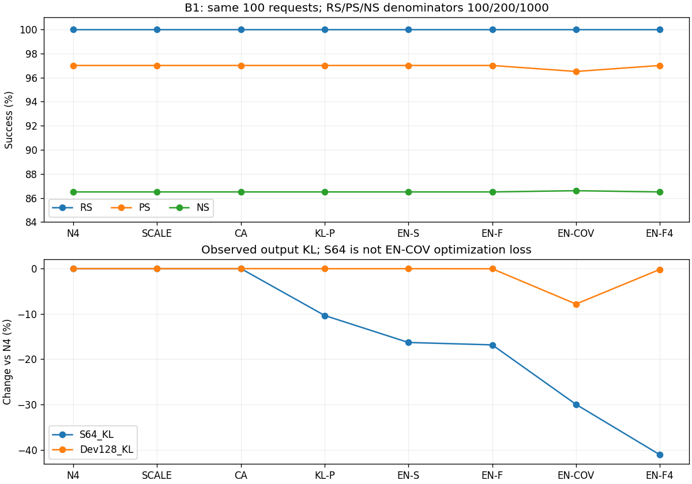
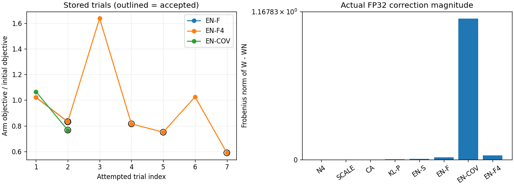

# ENFC B1 완료 실험 상세 사실 리뷰

## 1. 범위와 완료 판정

job50098 `odeedit_enfc_m_b001_s1`은 단발 accounting에서 COMPLETED, exit0:0이었다. 시작 2026-09-18T16:42:17, 종료19:14:44, parent allocation **9,147 GPU초(2.540833시간)**, 1GPU/8CPU/178G이다. batch/extern을 중복 합산하지 않았다. 프로그램 terminal은 `COMPLETE_WITH_T_SKIPPED`, wall 9142.141955초이며 8 primary endpoint와 2 RAND 관측이 존재한다. 이 리뷰에서는 GPU/model/forward/evaluator/Slurm 변경·재실행·원격 raw 수신을 하지 않았다.

이는 cold O0/b001 ordinal[0,100)의 **unique100 요청** 비교다. 8arm×100=800 arm-request 관측이지 unique800이 아니다. 성공 총점·checkpoint·저장된 guard를 검산했으나 **T=SKIPPED_USER_DIRECTED / full_numerical_validation=NOT_ESTABLISHED**를 유지한다. 전체 ENFC M10/S/R/L 또는 장기 검증 완료가 아니다. 과학적 선택·인과 해석은 GH 소유다.

## 2. 지표와 첫 8arm 비교

RS/PS는 target-new NLL < target-true NLL, NS는 반대로 true < new다. tie는 실패다. NLL은 낮을수록 해당 target의 확률이 높다. desired margin은 R/P에서 true−new, N에서 new−true로 양수가 성공이다. R100/P200/N1000의 exact case/prompt/target/token identity로 쌍을 묶었다. TF strict는 target 모든 token argmax 일치이며 NLL 선호와 다르다. RP joint는 한 요청의 R+2P 세 NLL 비교가 모두 성공한 수/100이다.

| arm | RS | PS | NS | R_strict | RP_strict | RP_joint | S64_KL | Dev128_KL | Dnorm | dPS_pp | dNS_pp |
| --- | --- | --- | --- | --- | --- | --- | --- | --- | --- | --- | --- |
| N4 | 100/100 | 194/200 | 865/1000 | 100/100 | 44/100 | 96/100 | 0.00172091162 | 0.00176669353 | 0 | 0 | 0 |
| SCALE | 100/100 | 194/200 | 865/1000 | 100/100 | 44/100 | 96/100 | 0.00172091162 | 0.00176669353 | 0 | 0 | 0 |
| CA | 100/100 | 194/200 | 865/1000 | 100/100 | 44/100 | 96/100 | 0.00172091162 | 0.00176669353 | 0 | 0 | 0 |
| KL-P | 100/100 | 194/200 | 865/1000 | 100/100 | 44/100 | 96/100 | 0.00154277465 | 0.00176634871 | 0.00319276171 | 0 | 0 |
| EN-S | 100/100 | 194/200 | 865/1000 | 100/100 | 44/100 | 96/100 | 0.00144025734 | 0.00176638983 | 0.0064357438 | 0 | 0 |
| EN-F | 100/100 | 194/200 | 865/1000 | 100/100 | 44/100 | 96/100 | 0.00143122396 | 0.00176605467 | 0.0165475536 | 0 | 0 |
| EN-COV | 100/100 | 193/200 | 866/1000 | 100/100 | 44/100 | 95/100 | 0.00120513267 | 0.00162853887 | 1.11222008 | -0.5 | 0.1 |
| EN-F4 | 100/100 | 194/200 | 865/1000 | 100/100 | 44/100 | 96/100 | 0.00101396277 | 0.00176340452 | 0.0339544739 | 0 | 0 |

Dnorm은 저장 FP32 endpoint−WN의 FP64 Frobenius norm이다. Native ΔN norm은 7.6116527986668565이며 Dnorm과 구분한다. N4/SCALE/CA는 실제 weight bytes가 같다. 8 의미상 arm을 유지하되 primary distinct endpoint는 **6개**다. SCALE/CA의 canonical·Dev·generation 재사용을 새 평가 계산으로 세지 않았다. N4 ledger의 fallback=true는 accepted_rounds=0인 reference의 구현 표기이지 N4 최적화 실패가 아니다. SCALE/CA는 각8 trial의 current guard 거절 뒤 WN fallback이다.

S64 output KL과 Dev128 output KL의 N4 대비 산술 변화는 다음과 같다. EN-COV 최적화 목적은 output KL이 아니라 W0 기준 cumulative activation drift이므로 목적값을 섞지 않았다.

| arm | S64_change_pct | Dev128_change_pct |
| --- | --- | --- |
| N4 | 0 | 0 |
| SCALE | 0 | 0 |
| CA | 0 | 0 |
| KL-P | -10.3513143 | -0.0195182869 |
| EN-S | -16.308466 | -0.0171904441 |
| EN-F | -16.8333842 | -0.0361617405 |
| EN-COV | -29.9712631 | -7.81995662 |
| EN-F4 | -41.0799048 | -0.186167741 |



## 3. 요청 단위 손실·회복, strict 및 NLL 꼬리

독립 reducer가 모든 저장 true/new raw NLL과 strict token을 재집계하여 기존 n/d 및 row별 성공·NLL·margin과 대조했다. 11개 state(8arm+W0+RAND±), 33개 metric 집계가 일치한다. 입력 중복/누락·nonfinite·token 길이 불일치는 검사상 없었다. raw prompt/token은 Git에 포함하지 않았다.

N4→EN-COV: PS **lost1/gained0/unchanged199**, NS **lost0/gained1/unchanged999**. 나머지 primary arm과 RAND±는 R/P/N 모두 lost0/gained0으로 성공 ID도 동일하다. 동일 총점이라는 이유만으로 ID 동일을 가정하지 않고 쌍별 확인했다. R strict100/100, R+2P strict44/100은 모든 arm에서 같다. R+2P NLL joint는 EN-COV95/100, 나머지96/100이다.

| arm | W0_correct_N_retained | W0_correct_N_d | W0_correct_N_lost | W0_incorrect_N_gained |
| --- | --- | --- | --- | --- |
| N4 | 862 | 886 | 24 | 3 |
| SCALE | 862 | 886 | 24 | 3 |
| CA | 862 | 886 | 24 | 3 |
| KL-P | 862 | 886 | 24 | 3 |
| EN-S | 862 | 886 | 24 | 3 |
| EN-F | 862 | 886 | 24 | 3 |
| EN-COV | 863 | 886 | 23 | 3 |
| EN-F4 | 862 | 886 | 24 | 3 |
| W0 | 886 | 886 | 0 | 0 |
| RAND+ | 862 | 886 | 24 | 3 |
| RAND- | 862 | 886 | 24 | 3 |

W0 RS5/100, PS20/200, NS886/1000이다. W0-correct NS 조건분모886은 전체 NS1000과 다르며 분모 오류가 아니다. 전체 PS의 TF strict와 token accuracy는 [strict-and-retention.csv](strict-and-retention.csv)에 별도로 있다.

아래는 target-new NLL의 평균/중앙/p95/p99다. true NLL, desired margin, p90/min/max, N4 대비 paired delta의 동일 통계는 [request-tail.csv](request-tail.csv)에 모두 보존한다. quantile은 NumPy linear interpolation이며 tail cutoff에 따른 선택이나 bootstrap을 하지 않았다.

| arm | metric | quantity | mean | median | p95 | p99 |
| --- | --- | --- | --- | --- | --- | --- |
| N4 | RS | new_nll | 0.00145049524 | 0.000862405228 | 0.00410362738 | 0.00673247038 |
| N4 | PS | new_nll | 1.64006482 | 0.395501301 | 6.82936089 | 9.77697055 |
| N4 | NS | new_nll | 11.1337251 | 11.1045833 | 17.2749706 | 20.1729062 |
| SCALE | RS | new_nll | 0.00145049524 | 0.000862405228 | 0.00410362738 | 0.00673247038 |
| SCALE | PS | new_nll | 1.64006482 | 0.395501301 | 6.82936089 | 9.77697055 |
| SCALE | NS | new_nll | 11.1337251 | 11.1045833 | 17.2749706 | 20.1729062 |
| CA | RS | new_nll | 0.00145049524 | 0.000862405228 | 0.00410362738 | 0.00673247038 |
| CA | PS | new_nll | 1.64006482 | 0.395501301 | 6.82936089 | 9.77697055 |
| CA | NS | new_nll | 11.1337251 | 11.1045833 | 17.2749706 | 20.1729062 |
| KL-P | RS | new_nll | 0.00145058583 | 0.000862464774 | 0.00410432201 | 0.00673257687 |
| KL-P | PS | new_nll | 1.64014162 | 0.395549968 | 6.82977352 | 9.776995 |
| KL-P | NS | new_nll | 11.1337699 | 11.1046953 | 17.2749546 | 20.173039 |
| EN-S | RS | new_nll | 0.00145041344 | 0.000862405228 | 0.00410384706 | 0.00673233632 |
| EN-S | PS | new_nll | 1.64010416 | 0.39557153 | 6.82962189 | 9.77697899 |
| EN-S | NS | new_nll | 11.1337679 | 11.1046453 | 17.2749997 | 20.1730987 |
| EN-F | RS | new_nll | 0.00145049466 | 0.000862405228 | 0.00410352051 | 0.00673246921 |
| EN-F | PS | new_nll | 1.6401012 | 0.395583123 | 6.82942996 | 9.77671378 |
| EN-F | NS | new_nll | 11.1337642 | 11.1045914 | 17.2751035 | 20.1734306 |
| EN-COV | RS | new_nll | 0.00145050239 | 0.000862405228 | 0.00410362738 | 0.0067325863 |
| EN-COV | PS | new_nll | 1.64928705 | 0.391852155 | 6.8590528 | 9.80777171 |
| EN-COV | NS | new_nll | 11.1456726 | 11.120151 | 17.3205427 | 20.2087348 |
| EN-F4 | RS | new_nll | 0.00145050177 | 0.000862405228 | 0.00410362738 | 0.00673258747 |
| EN-F4 | PS | new_nll | 1.64018381 | 0.395713598 | 6.82965252 | 9.77641877 |
| EN-F4 | NS | new_nll | 11.1339295 | 11.1043997 | 17.275444 | 20.1738482 |

greedy32는 모든 primary 및 RAND 행에서 rewrite target-prefix100/100, target>32 censor0, EOS 종료0, 길이32/한도도달100이다. 의미적 정확도나 자연스러운 후속 생성의 검증이 아니다. 두 P 동시 TF strict44/100과 생성 prefix100/100을 같은 지표로 부르지 않는다. 실제 고유 endpoint 8개에서 generation800회/25,600 tokens가 실행됐고 SCALE/CA는 중복 실행하지 않았다. 바뀐 case/prompt ID와 양쪽 margin은 [changed-identities.csv](changed-identities.csv)에 raw 문장 없이 공개한다.

## 4. 교정 경로와 수용/거절

| arm | accepted_rounds | attempted_trial_slots | gradient_rounds | gradient_sweeps | reject_reasons |
| --- | --- | --- | --- | --- | --- |
| N4 | 0 | 0 | 0 | 0 | {} |
| SCALE | 0 | 8 | 1 | 0 | {"QUALITY_GUARD_FAILED": 8} |
| CA | 0 | 8 | 1 | 0 | {"QUALITY_GUARD_FAILED": 8} |
| KL-P | 1 | 4 | 1 | 0 | {"ARMIJO_FAILED": 1, "QUALITY_GUARD_FAILED": 2} |
| EN-S | 1 | 3 | 1 | 0 | {"ARMIJO_FAILED": 1, "QUALITY_GUARD_FAILED": 1} |
| EN-F | 1 | 2 | 1 | 0 | {"ARMIJO_FAILED": 1} |
| EN-COV | 1 | 2 | 1 | 1 | {"ARMIJO_FAILED": 1} |
| EN-F4 | 4 | 7 | 4 | 3 | {"ARMIJO_FAILED": 3} |

모든 실제 trial은 [trials.csv](trials.csv)에 round/trial/eta/eta0/actual step norm/ideal norm/nominal prediction/actual directional product/Armijo bound/감소량/거절 사유로 있다. accepted trial의 실제 음의 방향미분·Armijo·분해능 감소 조건을 CPU 산술로 재확인했다. duplicate trial0, nonfinite selected endpoint0. EN-F4는 shared 첫 gradient+후속3 fresh gradient, 네 수용 round이며 최대4×6 중 실제7 trial을 사용했다. EN-COV는 별도 activation gradient1회를 사용했다. S4 재사용 KL-P/EN-S의 최적화 gradient를 S1에서 다시 실행하지 않았다.



EN-F 실제 수용 Dnorm0.01654755, EN-F4 최종0.03395447, EN-COV1.11222008이다. ideal/actual norm과 rounding norm은 별도 기록된다. W−W0 cumulative norm은 허용 local inputs에 W0 원 tensor가 없어 NOT_RECORDED로 남겼다. ΔN norm+Dnorm을 cumulative norm으로 더하지 않았다. 실제 EN-COV 목적식이 W−W0라는 source 사실과 그 cumulative norm 미기록은 다른 사항이다.

## 5. geometry·gradient·RAND

| space | allowed | blocked | remaining | chi | projected_fraction | status |
| --- | --- | --- | --- | --- | --- | --- |
| CA | 100 | 0 | 100 | 7.05691779e-05 | 0.0155457801 | RESOLVED |
| EN-S | 14326 | 100 | 14226 | 0.00446887336 | 0.984454186 | RESOLVED |
| EN-F | 14326 | 4482 | 9844 | 0.00270389337 | 0.595644344 | RESOLVED |

KL-P의 allowed gradient squared norm은0.004539442695615405, EN-F 잔존 비율은0.5956443443024163이다. 이 수치는 S1 WN에서 새로 계산한 gradient 진단이며 S4의 수용 경로를 같은 하드웨어로 재현한 증거가 아니다. CA-EXACT는 rank(A)=100, rank(AK)=100, physical dimension0/REPAIR_SPACE_EMPTY. CA 자체는 제한된 writer-row 공간의 별도 optimization arm이므로 CA-EXACT와 같은 행으로 합치지 않는다. EN-F reduced rank4482, condition 약1.4306e9, ambiguity indices는 기록상 비어 있다. 편의 rank truncation을 추가하지 않았다.

| arm | status | RS | PS | NS | S64_KL | Dev128_KL | actual_norm | relative_norm_error | invariant_pass |
| --- | --- | --- | --- | --- | --- | --- | --- | --- | --- |
| RAND+ | RECORDED | 100 | 194 | 865 | 0.00172086738 | 0.00176674588 | 0.0165475535 | 2.6134591e-09 | True |
| RAND- | RECORDED | 100 | 194 | 865 | 0.00172096184 | 0.00176664076 | 0.0165475535 | 2.62218453e-09 | True |

RAND±는 EN-F actual norm에 맞춘 동일 난수의 두 부호이며 objective로 부호를 선택하지 않았다. 분모 R/P/N=100/200/1000. 두 actual final RAND weight 파일은 보존되지 않았고 seed/space/norm/hash/관측만 보존됐다. 이는 필수 primary8 endpoint 보존과 구분한다. 모든 rejected trial weight도 원 retention 정책상 미보존이다.

## 6. 실제 invariant와 설계 대조

accepted EN-F 계열에서 ideal response relative≤1e-10, actual token normalized response≤1e-5, P leakage≤1e-5, NLL maxdiff≤1e-4, logit max≤1e-3/rms≤1e-4의 원 경계를 검사했다. EN-F의 실제 logit max8.2016e-5, NLL max2.8610e-5이며 exact-zero/bitwise invariant라고 쓰지 않는다. EN-COV의 PS 손실은 보호된 current rewrite/context 경계와 별개의 post-selection paraphrase 관측이다. 허용 공간 존재와 실제 locality 성공은 별도 열로 유지한다.

| arm | round | detail_ideal_response_relative | detail_actual_max_token_normalized_response | detail_actual_projection_leakage_relative | detail_max_NLL_difference | detail_logit_max | detail_logit_rms | passed |
| --- | --- | --- | --- | --- | --- | --- | --- | --- |
| EN-F | 0 | 4.8206241759594177e-17 | 2.6331498394687918e-08 | 3.035776284461691e-06 | 2.86102294921875e-05 | 8.20159912109375e-05 | 2.7814520537436966e-06 | True |
| EN-COV | 0 | 1.0804361421247296e-16 | 2.6807968988139207e-08 | 4.5197762893835265e-08 | 2.47955322265625e-05 | 6.103515625e-05 | 2.7644164098717924e-06 | True |
| EN-F4 | 0 | 4.8206241759594177e-17 | 2.6331498394687918e-08 | 3.035776284461691e-06 | 2.86102294921875e-05 | 8.20159912109375e-05 | 2.7814520537436966e-06 | True |
| EN-F4 | 1 | 5.2521565245954285e-17 | 2.746129131601589e-08 | 2.229198741245595e-06 | 2.6702880859375e-05 | 6.532669067382812e-05 | 2.757700105243222e-06 | True |
| EN-F4 | 2 | 5.076829900661725e-17 | 2.6877533514421784e-08 | 1.5422849955700474e-06 | 3.337860107421875e-05 | 6.556510925292969e-05 | 2.7704498749724146e-06 | True |
| EN-F4 | 3 | 5.3142350701447267e-17 | 2.6599191677261902e-08 | 1.4897003172914222e-06 | 2.09808349609375e-05 | 5.6743621826171875e-05 | 2.7640619792477336e-06 | True |

| requirement | file | function | runtime_evidence | bounded_finding |
| --- | --- | --- | --- | --- |
| scope/T override | server1_single_batch/reuse.py:54 | validation_binding | validation-status.json; terminal.json | b001 only; T skipped; no T PASS |
| same native endpoint / cold history | runtime.py:24 | Runtime; native | runtime-load.json; native/; endpoint-artifacts.csv | 8 metadata W0/WN/context/order equal; history0 |
| reuse selection binding | server1_single_batch/reuse.py:16 | verify_endpoint | arms/*/reuse.json; imported selection seals | 5 optimization endpoints reused; 3 new |
| old/new all-valid-token union | binding.py:12 | protected_sequences | protected-provenance.json | 1400 sequences; 624 inputs; 10416 positions; no P/N in lock |
| actual FP32 key dedup | runtime.py:152 | protected_oracle | geometry/reuse.json; artifact-checks.json | identical prefix plus identical FP32 key required; S4 4596 vs S1 4482 |
| P star and rank rule | geometry.py:280 | allowed_range; edit_null_space | P-star-basis seal; geometry/*.json | 14326 allowed; cutoff unchanged; T not established |
| W0 forward KL teacher | runtime.py:141 | reference_oracle | native-objective.json; teacher path-binding lock | fixed stored payload; current WN gradient recomputed on S1 |
| EN-COV cumulative objective | runtime.py:179 | covariance | arms/EN-COV/events; selection ledger | W-W0, not W-WN; activation drift distinct from output KL |
| FP64 ideal / FP32 actual | optimizer.py:373 | optimize trial materialization | trials.csv; endpoint-artifacts.csv | (WN64+Dideal).float; actual endpoint-WN norm rechecked |
| Armijo / budget / fallback | optimizer.py:450 | optimize acceptance | trials.csv; controller-counts.csv | actual negative directional product; c1=1e-4; no quality-based endpoint exclusion |
| per-sequence current guard | binding.py:49 | quality_ok | controller-events.csv; raw event hashes | new NLL epsilon1e-4; successful strict/canonical IDs retained |
| ideal/actual response and logits | runtime.py:195 | invariant | controller-events.csv | ideal1e-10; actual response/leak1e-5; NLL1e-4; logit max1e-3/rms1e-4 |
| EN-F4 fresh gradients | optimizer.py:306 | optimize rounds | gradient event state SHAs | 4 rounds; shared first +3 fresh; 7/24 available trial slots used |
| selection before observer | server1_single_batch/runner.py:207 | run observer phase | ALL_SELECTIONS_SEALED.json; observer seals | P/N/Dev after selection; Report256 not opened by this route |
| canonical RS/PS/NS and strict | observer.py:79 | strict_summary; observe | raw rows vs final tables | CPU independent identity-based reduce PASS; ties failure |
| observer and final reset | server1_single_batch/runner.py:270 | independent_reset | episode-integrity; before/after manifests | runtime W0/M0/RNG reset evidence; no new GPU continuation verification |
| RAND paired diagnostics | server1_single_batch/runner.py:179 | RAND_diagnostic | diagnostics/RAND±.json | both signs; norm match; no selection; final RAND tensor not saved |

파일 위치는 실행 source3f1941b2의 `project/run_scripts/single_layer_edit_preserving_correction/` 상대경로이다. 현재 분석 checkout의 frozen runtime bytes가 실행 commit과 동일함을 파일별 SHA로 확인했다. code의 조건 존재, runtime 기록의 통과, 새 CPU 검산의 통과를 서로 대체하지 않았다. 실제 T/FD/full Llama 수치 검증을 새로 수행하지 않았다.

## 7. 플랫폼·입력·재사용·복원

N4/SCALE/CA/KL-P/EN-S 최적화는 S4 Blackwell 보존 endpoint 재사용, EN-F/EN-COV/EN-F4는 S1 A6000 신규 계산이다. 모든 현재 공식 관측은 S1에서 같은 저장 endpoint로 계산하거나 exact 동일 endpoint 관측을 재사용했다. S4 observer는 REFERENCE_ONLY이며 S1 관측으로 덮어쓰지 않았다.

동일 native WN/target/native K/A/P/zeroM/context/order/teacher payload lineage를 유지한다. 단, full-token key는 S1에서 다시 capture하여 bytes가 다르다. protected prefix alias10416개와 입력624개/sequence1400개는 S4/S1 정확히 같고, token-prefix 자체4315개도 같다. 실제 FP32 key 동일성까지 요구한 dedup 결과가 S4 **4596**열, S1 **4482**열이다. 따라서 같은 token inventory라는 근거는 있으나 geometry/captured-key byte parity는 **false**이고 그 수치적 원인·동등성은 NOT_TESTED다. hardware 차이만으로 원인을 확정하지 않는다. affected EN-F geometry와 WN S64 gradient 재계산 사실을 기록했고 native fit·teacher 생성은 새로 하지 않는 경로이다. native_fit_new0/history_appends0은 terminal 및 source route와 일치한다. teacher generation 별도 runtime 카운터는 없으며 seal 재사용+생성 호출 없는 source 근거다.

final8는 현재 regular file/size/SHA 및 `torch.load(weights_only=True,map_location=cpu)`로 [4096,14336] FP32 finite·case100·WN/W0/context/history0·selection ledger/seal·observer binding을 확인했다. 파일8개, primary unique tensor6개다. [endpoint-artifacts.csv](endpoint-artifacts.csv)와 [artifact-manifest.json](artifact-manifest.json)에 경로/모드/크기/해시를 보존한다. before/after nonselected 전체 parameter hash manifest는 서로 같고 final W0/M0/RNG reset은 저장 receipt로 확인했다. 이번 CPU 검토가 full model을 다시 복원하거나 GPU continuation을 검증한 것은 아니다.

## 8. 실측 비용

| group | seconds | scope |
| --- | --- | --- |
| parent allocation | 9147 | single parent; batch/extern not added |
| program wall | 9142.14195 | subset of allocation |
| model load | 16.2431319 | shared |
| canonical+generation observer | 1596.2874 | 9 unique states including W0 |
| S64 backward | 181.454627 | nested in objective; not additive |
| S64 suffix forward | 268.568599 | overlaps objective/invariant components |
| protected suffix forward | 859.585967 | overlaps guards/invariants |
| Dev128 suffix forward | 240.924842 | observer component |

peak allocated GPU=32.821232GiB, reserved=35.087891GiB, host peak=32.976795GiB. 실험 프로그램 wall과 parent allocation 차이는 약4.858초다. CPU geometry·I/O 동안도 GPU allocation 비용에 포함된다. 최종 작은 projection/solve만 전체 계산량이라고 하지 않는다.

canonical observer는 실제9 states(W0 포함), 1494 microbatches, true/new sequence rows23400, forward calls27094(생성 포함), model_input_tokens418064를 기록했다. 이는 primary arm-pair10400와 계산 단위가 다르다. S64 backward document256=4×64, suffix1152, Dev suffix1024; prefix/teacher streaming/guard/invariant 및 arm별 objective timing은 [compute.csv](compute.csv)의 원 counter 단위로 공개한다. callback timing과 oracle timing은 포함관계가 있어 중복 합산 금지. exact arm별 총 wall 및 저장 I/O 별도시간은 NOT_SEPARATED다.

과거 S4 M50050 두 cell 합9768초, 이전 T/M3231초, metadata failure2301초는 이전 lineage 비용으로만 기재한다. B1/B2로 나눌 증거 없이 반분하지 않으며 새 S1 9147초에 재합산하지 않는다. S4 기존5arm 최적화 counter는 S4_REUSED, S1 신규3arm은 S1_NEW로 분리했다.

## 9. 검산·재현·자료 한계

새 reducer 8개 focused CPU test PASS. 실제 raw independently reduced counts/NLL/joint/retention 일치, final8 CPU tensor/selection SHA 검산 PASS. 별도 독립 red subagent는 사용하지 않았고 SH1이 실행 source 대조 및 별도 reducer/postcheck를 수행했다. 이는 독립 연구자 검증이나 T_PASS가 아니다. 원 raw 및 frozen source 수정0, 신규 GPU/Slurm0, raw broadcast=NO_BROADCAST_NOT_REQUIRED.

| item | status | limitation |
| --- | --- | --- |
| T full validation | SKIPPED_USER_DIRECTED | FD/ULP/full GPU numerical validation NOT_ESTABLISHED |
| cross-hardware equivalence | NOT_TESTED | S4 and S1 actual key byte inventories differ; no same hardware counterfactual |
| cumulative Frobenius(W-W0) | NOT_RECORDED_WITHIN_LOCAL_INPUTS | WN delta norm recorded; full local W0 weight absent; norms cannot be added |
| RAND final tensors | NOT_RETAINED | seed/rule/space/norm/hash/invariant/observer saved; primary final8 preserved |
| all trial tensors | NOT_RETAINED_BY_POLICY | gradient/factors/formula/hash/events retained, not every rejected physical weight |
| full K tensor | NOT_RETAINED_BY_POLICY | token alias SHA and projector factors saved; actual full K numeric payload not saved |
| GPU continuation / full model CPU restore | NOT_RUN_REVIEW_ONLY | stored selected and nonselected hash receipt audit only |
| Report256 / Past / sequential / M10 | NOT_IN_SCOPE | Report256 unopened; cold Past empty; one batch only |
| storage I/O / individual arm complete wall | NOT_SEPARATED | callback and streaming counters overlap; cannot sum as disjoint costs |

한 cold batch에서 S64/Dev 변화와 canonical/strict 관측을 제공할 뿐 장기효과·일반화·통계적 동등성·최종 정책 우열을 판정하지 않는다. EN-COV의 PS1개 손실과 NS1개 회복을 모두 유지한다. EN-F/EN-F4의 S64 감소를 공식 성공률 상승으로 바꾸어 설명하지 않는다. Report256, 추가 T/arm/sweep/S/R/L은 실행하지 않았다.

## 10. 재현 명령과 파일

실행 source: `3f1941b21538d6a7ad0afd756774ad6a0b605750`, tree `72503847266864bf5e1b0c96d63ba99aa03d846d`. 실행 lock SHA `b463293b23131b1453d1d3521a58f8f57e1804b0ca18d0fd8fcd0bdc64999147`. 원 M87f65ea2와 분석 source는 [source-evidence-manifest.json](source-evidence-manifest.json)에 분리한다. 최종 publication HEAD는 main push 후 별도 receipt로 인계한다.

```bash
python project/run_scripts/single_layer_edit_preserving_correction/server1_single_batch/analysis/review.py --input /mnt/raid5/janghj/.codex/worktrees/odeeditsh1-enfc-single-batch-m-v1/local/enfc-single-batch-m/20260918-v1/output-r1/b001/attempt-v1 --output experiment-reports/servers/server1/enfc-single-batch-m-2026-09-18-v1/completed-review-r1
CUDA_VISIBLE_DEVICES='' python project/run_scripts/single_layer_edit_preserving_correction/server1_single_batch/analysis/artifacts.py --input /mnt/raid5/janghj/.codex/worktrees/odeeditsh1-enfc-single-batch-m-v1/local/enfc-single-batch-m/20260918-v1/output-r1/b001/attempt-v1 --output experiment-reports/servers/server1/enfc-single-batch-m-2026-09-18-v1/completed-review-r1
python project/run_scripts/single_layer_edit_preserving_correction/server1_single_batch/analysis/plot.py --root experiment-reports/servers/server1/enfc-single-batch-m-2026-09-18-v1/completed-review-r1
python project/run_scripts/single_layer_edit_preserving_correction/server1_single_batch/analysis/report.py --input /mnt/raid5/janghj/.codex/worktrees/odeeditsh1-enfc-single-batch-m-v1/local/enfc-single-batch-m/20260918-v1/output-r1/b001/attempt-v1 --output experiment-reports/servers/server1/enfc-single-batch-m-2026-09-18-v1/completed-review-r1
```

실제 Python은 `/mnt/raid5/janghj/EasyEdit/.venv/bin/python`을 사용했다. PNG는 CSV 입력만으로 코드 생성했고 두 번 render한 bytes 일치를 [plot-reproduction.json](plot-reproduction.json)에 기록했다. 입력/출력SHA·환경·명령 포함. 이미지 육안 확인 및 Markdown 렌더/링크/열 검사 결과는 postcheck receipt에 별도 기록한다.

핵심 CSV: [첫 표](first-eight-arm-table.csv), [최종 표](final-eight-arm-table.csv), [paired 전이](paired-transitions.csv), [NLL 꼬리](request-tail.csv), [기계적 경로](mechanism.csv), [trial](trials.csv), [geometry](geometry.csv), [RAND](random-diagnostics.csv), [비용](compute-summary.csv), [누락](coverage-and-limitations.csv). 로컬 raw는 원 실행WT 및 그 imports에 보존하며 Git에는 코드/집계/해시만 게시한다.
