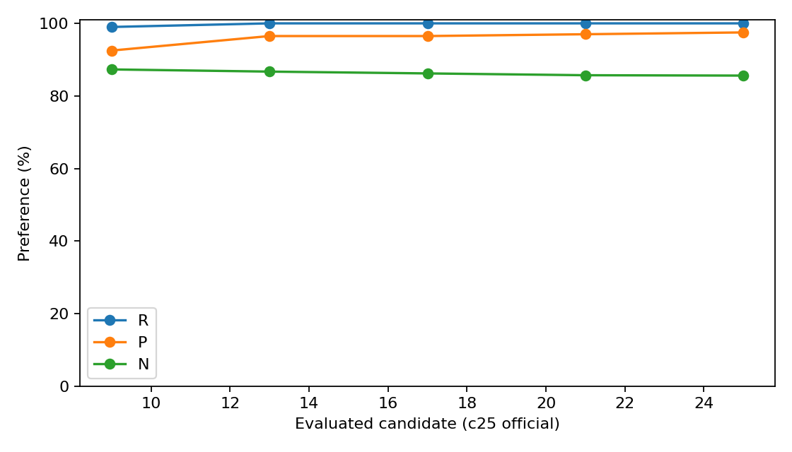

# JLZ v10 A 단일 B1 D1/D2 사실 보고

실행 상태: `D1_D2_COMPLETE`. 단일 cold W0/H0, 고정100요청, 25후보/24갱신 계약이다.

실행 source: `9cf106713e587fa08ddcfed89628b2770a55b74b`. 모델/runtime/input/평가 identity는 execution lock에 결속했다.
독립 구현 CPU reducer로 저장 true/new NLL, strict 및 분모를 다시 집계했다. 독립 reviewer agent는 사용하지 않았다.

| 후보 | R /100 | P /200 | N /1000 |
|---|---:|---:|---:|
| W0 | 5 | 20 | 886 |
| 9 | 99 | 185 | 873 |
| 13 | 100 | 193 | 867 |
| 17 | 100 | 193 | 862 |
| 21 | 100 | 194 | 857 |
| 25 | 100 | 195 | 856 |

D2 공통 식별 subset: 874/1000. 제외 문항은 D1 N1000에서 제외하지 않았다.

| D2 mask | NS numerator | denominator |
|---|---:|---:|
| NONE | 769 | 874 |
| SUBJECT_ONLY | 744 | 874 |
| NONSUBJECT_ONLY | 762 | 874 |
| ALL | 740 | 874 |

NS margin은 new NLL−true NLL이다. Interaction은 ALL−SUBJECT−NONSUBJECT+NONE의 산술 차이다.
TF는 teacher-forced 정확도이며 자유생성 결과가 아니다. c25만 공식 terminal이며 중간 후보는 관측이다.

누락/미검증: 요구된 저장 coverage 검사에서 누락 없음.
Program seconds: 14531.208316363394; peak GPU allocated bytes: 49424475648.
Peak host KiB: 34744388. 할당 비용은 accounting.json의 exact parent 행과 구분한다.
Fit 시간은 관측 backward/capture를 포함한 상위 timer다. 중첩 timer를 추가 합산하지 않는다. 미분리 I/O는 NOT_SEPARATED.

복원 주장은 selected W/H와 RNG/context/hook 및 nonselected pointer/version guard 범위다. 전체 모델 byte 검증으로 확대하지 않는다.
Disk checkpoint 저장0, exact crash-resume 불가. RAM snapshot은 teardown 후 해제한다.
이 결과로 원인·우열·장기 효과를 판정하지 않는다. 과학 판정은 GH 소유다.
NO_BROADCAST_NOT_REQUIRED: 같은 host의 local 결과를 GH가 접근할 수 있다. Raw/weight/prompt는 Git에 게시하지 않는다.

## 완료 검산·게시 기록

GPU57780과 CPU57781은 각각 COMPLETED/0:0이다. GPU 할당 14,539초
(4.0386 GPU시간), 수집기 할당 2초다. 이는 program timer와 구분한다.
이번 CPU 검산은 저장 raw의 counts/NLL/TF/paired/interaction을 다시 계산했고,
collector manifest의 입력/산출물과 frozen source bytes를 재검증했다. 새 GPU평가0.
원 수집기 보고 bytes는 [collector-report-ko.md](collector-report-ko.md)에 보존한다.

- [지표·분포](metrics.csv), [paired 손실·회복](paired.csv), [후보별 비용·loss](candidate.csv)
- [층별 수치](layers.csv), [D2 interaction](interaction-summary.csv), [비용](compute.csv)
- [검산·출처](publication-manifest.json), [기술 검증](qualification-summary.json)



실행 source `9cf106713e587fa08ddcfed89628b2770a55b74b`와 이번 publication source는 구분한다.
원본 raw·큰 per-row 표·로그는 `/mnt/raid5/janghj/ODE-edit/local/jlz-v10-a-b1-diagnostics/20261003-v1/attempt-r1`에 보존하며 Git에는 포함하지 않았다.
미분리 시간·전체 모델 byte 복원·교차 플랫폼 동등성의 제한은 원 보고와 동일하다.
원래의 공개 artifact를 게시하는 것이며 새로운 방법 선택/가설 판정은 하지 않는다.

재현(CPU only, 새 빈 출력경로 지정):
```bash
PYTHONDONTWRITEBYTECODE=1 /mnt/raid5/janghj/EasyEdit/.venv/bin/python -m project.run_scripts.jlz_realized_subject_diagnostics.publish_completed --attempt /mnt/raid5/janghj/ODE-edit/local/jlz-v10-a-b1-diagnostics/20261003-v1/attempt-r1 --out /mnt/raid5/janghj/ODE-edit/local/jlz-v10-a-b1-diagnostics/20261003-v1/publication-recheck-new
```
