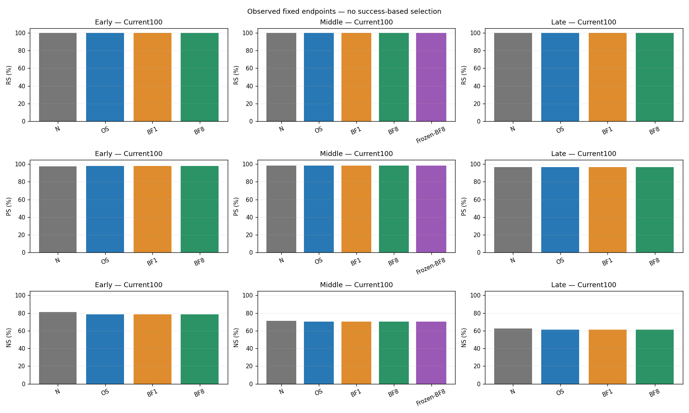
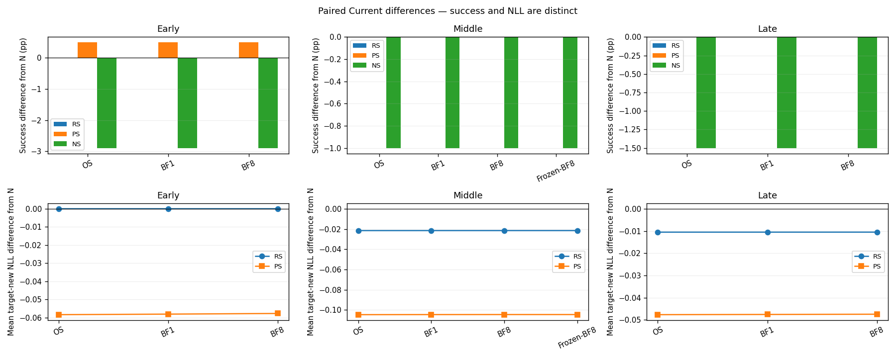
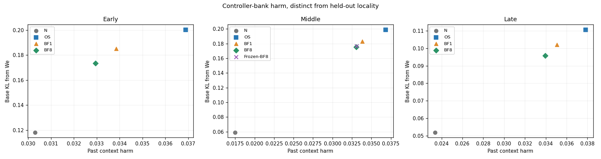
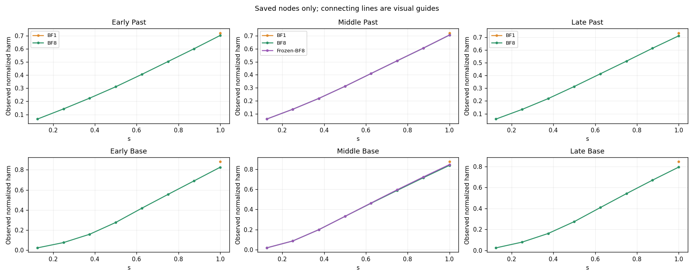
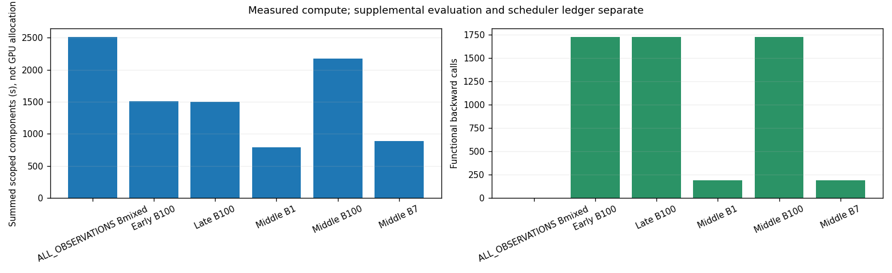

# L4 two-memory conflict routing v2 — 상세 진단 보고서

새 경로 16/16, B100 native reference 재사용 3/3. We 기준 Base 보존, active-Past bank, full P* 및 시간당 비용·누적 anchor의 v2다. ABC/이전 EP 및 W0 복구 objective와 별도 실험이다. scientific_promotion=false.

**기술 정정:** 최초 실행의 BF8 3개와 Middle Frozen-BF8은 큰 Gram 행렬 크기의 residual tolerance를 dual의 부호 검사에 잘못 적용하여 음수 dual/slack을 허용했다. 해당4경로만 제외·복구했고 N/OS/BF1 및 준비 자산은 보존했다. Middle-first/primary-three-entry 중간 보고의 BF8/Frozen 수치와 최초 전체-valid 표기는 이 보고서로 대체한다. 새 solver는 기존 λ≥0 영역을 정확히 검사하며 목적식·bank·calibration·h·threshold를 바꾸지 않았다. 37개 canonical node의 비음수 domain과 저장 QP replay를 재검산했다. 실패/취소 allocation도 아래 비용에 포함한다.
16개는 고유한 예정 경로의 수다. 최초16개 실행 중4개를 기술 교체했으므로 실제 신규 endpoint/history action은 총20회이며, 정상 endpoint를 성능 때문에 재실행한 것은 아니다. 원3개 N reference는 별도 재사용이다.

### 기술 정정의 수치 영향 — 이전 값은 과학 분모에서 제외

| entry | arm | Past old→fixed | Base KL old→fixed | BaseAudit KL old→fixed | Current NS old→fixed |
| --- | --- | --- | --- | --- | --- |
| Early | BF8 | 0.03365911→0.03294256 | 0.1821398→0.1735743 | 0.1040101→0.1037841 | 784/1000→784/1000 |
| Middle | BF8 | 0.03363882→0.03304748 | 0.1798746→0.1751769 | 0.1335287→0.1335131 | 701/1000→701/1000 |
| Middle | Frozen-BF8 | 0.03364584→0.03308555 | 0.1812362→0.1768535 | 0.1334969→0.1335018 | 701/1000→701/1000 |
| Late | BF8 | 0.03480581→0.03395546 | 0.1007239→0.09583316 | 0.05134396→0.05133212 | 611/1000→611/1000 |


### 고정 비교 구성

N은 원 BLUE L4 native proposal, OS는 We 기준의 새 정적 soft-preservation 해다. gamma=lambda_p=lambda_b=1, lambda_r=1e−3·trace(C_E+C_resp+C_p+C_b)/d+1e−8이며, C_p는 active-fact bank만 사용한다. Native M을 정화하거나 routing C_p에 섞지 않았다. W0는 audit-only이고, Native에는 Praw·routing에는 전체 P*를 쓴다.
각 bank는 outcome-blind candidate512 중 hash 절반+native 구조 영향 절반으로 최대128개를 선택했다. Past는 canonical+첫 paraphrase의 전체 target-new tokens, Base는 dataset target-true의 첫최대8tokens다. BaseAudit128은 Base candidate512 밖이다. 실제 overlap/퇴역 version/분모는 bank-manifest 및 bank-overlap에 남겼다.
BF1/BF8/Frozen은 같은 We와 저장 WOS−We anchor에서 시작한다. h=1 또는1/8, kappa=2, eta=1; sigma=F(WOS)+.01, terminal budget=.9·F(WOS)/sigma, epsilon=.1·(q_ref+1e−4)를 공통 고정했다. Action과 slack 비용에는1/h가 있고 누적 Z 비용도 포함한다. Frozen만 OS gradient 방향을 고정하며 actual risk/RHS/anchor는 갱신한다. Current backward·z/key 재계산·inner history append·line search는 없다.

## 1. 지표와 분모

RS/PS는 target-new NLL < target-true NLL, NS는 반대 방향이며 동률은 실패다. NLL은 낮을수록 해당 target의 확률이 높다. TF strict와 token accuracy는 별도 열로 보존했다. Current B100/Fixed100/Past100은 각각 RS100·PS200·NS1000이다. B1/B7 Current는 실제 B·2B·10B이며 Fixed/Past는 각100을 유지한다. Token accuracy의 분모는 target token 수이므로1010처럼 더 클 수 있지만, NS 성공률의 분모1000과 혼용하지 않는다. 같은 Fixed100의 entry 반복을 독립300으로 합치지 않았다. 성공률은 서로 다른 state의 pair-event를 합산한 온라인 점수가 아니다.

## 2. 전체 endpoint — 절대 성공률

| entry | B | arm | panel | RS | PS | NS | rewrite new NLL | rephrase new NLL |
| --- | --- | --- | --- | --- | --- | --- | --- | --- |
| Early | 100 | W0 | Current100 | 10/100 (10.00%) | 22/200 (11.00%) | 900/1000 (90.00%) | 10.95406 | 9.887661 |
| Early | 100 | W0 | Fixed100 | 5/100 (5.00%) | 20/200 (10.00%) | 886/1000 (88.60%) | 11.7434 | 10.18415 |
| Early | 100 | W0 | Past100 | 9/100 (9.00%) | 20/200 (10.00%) | 885/1000 (88.50%) | 11.18614 | 10.03967 |
| Early | 100 | ENTRY | Current100 | 19/100 (19.00%) | 33/200 (16.50%) | 832/1000 (83.20%) | 9.359709 | 9.045167 |
| Early | 100 | ENTRY | Fixed100 | 100/100 (100.00%) | 193/200 (96.50%) | 828/1000 (82.80%) | 0.06445582 | 1.431539 |
| Early | 100 | ENTRY | Past100 | 100/100 (100.00%) | 198/200 (99.00%) | 798/1000 (79.80%) | 0.002372801 | 1.684179 |
| Early | 100 | N | Current100 | 100/100 (100.00%) | 195/200 (97.50%) | 813/1000 (81.30%) | 0.001548704 | 1.627192 |
| Early | 100 | N | Fixed100 | 100/100 (100.00%) | 194/200 (97.00%) | 818/1000 (81.80%) | 0.05602935 | 1.432466 |
| Early | 100 | N | Past100 | 100/100 (100.00%) | 198/200 (99.00%) | 792/1000 (79.20%) | 0.002333623 | 1.667373 |
| Early | 100 | OS | Current100 | 100/100 (100.00%) | 196/200 (98.00%) | 784/1000 (78.40%) | 0.001463486 | 1.568874 |
| Early | 100 | OS | Fixed100 | 100/100 (100.00%) | 195/200 (97.50%) | 805/1000 (80.50%) | 0.05908925 | 1.351198 |
| Early | 100 | OS | Past100 | 100/100 (100.00%) | 198/200 (99.00%) | 785/1000 (78.50%) | 0.006641208 | 1.607946 |
| Early | 100 | BF1 | Current100 | 100/100 (100.00%) | 196/200 (98.00%) | 784/1000 (78.40%) | 0.001464277 | 1.569181 |
| Early | 100 | BF1 | Fixed100 | 100/100 (100.00%) | 195/200 (97.50%) | 805/1000 (80.50%) | 0.05898567 | 1.351042 |
| Early | 100 | BF1 | Past100 | 100/100 (100.00%) | 198/200 (99.00%) | 785/1000 (78.50%) | 0.006636307 | 1.607817 |
| Early | 100 | BF8 | Current100 | 100/100 (100.00%) | 196/200 (98.00%) | 784/1000 (78.40%) | 0.001465025 | 1.569536 |
| Early | 100 | BF8 | Fixed100 | 100/100 (100.00%) | 195/200 (97.50%) | 805/1000 (80.50%) | 0.05887707 | 1.350994 |
| Early | 100 | BF8 | Past100 | 100/100 (100.00%) | 198/200 (99.00%) | 785/1000 (78.50%) | 0.006630771 | 1.60779 |
| Middle | 100 | W0 | Current100 | 12/100 (12.00%) | 23/200 (11.50%) | 888/1000 (88.80%) | 11.24173 | 10.38965 |
| Middle | 100 | W0 | Fixed100 | 5/100 (5.00%) | 20/200 (10.00%) | 886/1000 (88.60%) | 11.7434 | 10.18415 |
| Middle | 100 | W0 | Past100 | 11/100 (11.00%) | 20/200 (10.00%) | 879/1000 (87.90%) | 10.86838 | 9.589275 |
| Middle | 100 | ENTRY | Current100 | 30/100 (30.00%) | 53/200 (26.50%) | 724/1000 (72.40%) | 8.809954 | 8.648566 |
| Middle | 100 | ENTRY | Fixed100 | 100/100 (100.00%) | 194/200 (97.00%) | 693/1000 (69.30%) | 0.2106896 | 1.522312 |
| Middle | 100 | ENTRY | Past100 | 100/100 (100.00%) | 192/200 (96.00%) | 685/1000 (68.50%) | 0.01951838 | 1.317095 |
| Middle | 100 | N | Current100 | 100/100 (100.00%) | 197/200 (98.50%) | 711/1000 (71.10%) | 0.02666907 | 1.19442 |
| Middle | 100 | N | Fixed100 | 100/100 (100.00%) | 194/200 (97.00%) | 696/1000 (69.60%) | 0.2273579 | 1.502077 |
| Middle | 100 | N | Past100 | 100/100 (100.00%) | 193/200 (96.50%) | 686/1000 (68.60%) | 0.02774264 | 1.31975 |
| Middle | 100 | OS | Current100 | 100/100 (100.00%) | 197/200 (98.50%) | 701/1000 (70.10%) | 0.005066744 | 1.089747 |
| Middle | 100 | OS | Fixed100 | 99/100 (99.00%) | 194/200 (97.00%) | 682/1000 (68.20%) | 0.2583655 | 1.408407 |
| Middle | 100 | OS | Past100 | 100/100 (100.00%) | 192/200 (96.00%) | 676/1000 (67.60%) | 0.02449803 | 1.304396 |
| Middle | 100 | BF1 | Current100 | 100/100 (100.00%) | 197/200 (98.50%) | 701/1000 (70.10%) | 0.005076583 | 1.089832 |
| Middle | 100 | BF1 | Fixed100 | 99/100 (99.00%) | 194/200 (97.00%) | 682/1000 (68.20%) | 0.25836 | 1.408504 |
| Middle | 100 | BF1 | Past100 | 100/100 (100.00%) | 192/200 (96.00%) | 676/1000 (67.60%) | 0.02449866 | 1.304423 |
| Middle | 100 | BF8 | Current100 | 100/100 (100.00%) | 197/200 (98.50%) | 701/1000 (70.10%) | 0.005081147 | 1.089874 |
| Middle | 100 | BF8 | Fixed100 | 99/100 (99.00%) | 194/200 (97.00%) | 682/1000 (68.20%) | 0.2583719 | 1.408571 |
| Middle | 100 | BF8 | Past100 | 100/100 (100.00%) | 192/200 (96.00%) | 675/1000 (67.50%) | 0.02450004 | 1.304446 |
| Middle | 100 | Frozen-BF8 | Current100 | 100/100 (100.00%) | 197/200 (98.50%) | 701/1000 (70.10%) | 0.0050807 | 1.089866 |
| Middle | 100 | Frozen-BF8 | Fixed100 | 99/100 (99.00%) | 194/200 (97.00%) | 682/1000 (68.20%) | 0.2583662 | 1.408551 |
| Middle | 100 | Frozen-BF8 | Past100 | 100/100 (100.00%) | 192/200 (96.00%) | 675/1000 (67.50%) | 0.0244993 | 1.30444 |
| Late | 100 | W0 | Current100 | 6/100 (6.00%) | 18/200 (9.00%) | 875/1000 (87.50%) | 11.04664 | 10.17624 |
| Late | 100 | W0 | Fixed100 | 5/100 (5.00%) | 20/200 (10.00%) | 886/1000 (88.60%) | 11.7434 | 10.18415 |
| Late | 100 | W0 | Past100 | 7/100 (7.00%) | 20/200 (10.00%) | 873/1000 (87.30%) | 10.86115 | 9.706544 |
| Late | 100 | ENTRY | Current100 | 27/100 (27.00%) | 59/200 (29.50%) | 634/1000 (63.40%) | 8.405041 | 8.154777 |
| Late | 100 | ENTRY | Fixed100 | 99/100 (99.00%) | 188/200 (94.00%) | 662/1000 (66.20%) | 0.6867841 | 1.978736 |
| Late | 100 | ENTRY | Past100 | 100/100 (100.00%) | 192/200 (96.00%) | 688/1000 (68.80%) | 0.1441151 | 1.652545 |
| Late | 100 | N | Current100 | 100/100 (100.00%) | 193/200 (96.50%) | 626/1000 (62.60%) | 0.01622595 | 1.38731 |
| Late | 100 | N | Fixed100 | 99/100 (99.00%) | 191/200 (95.50%) | 660/1000 (66.00%) | 0.7155793 | 1.964489 |
| Late | 100 | N | Past100 | 100/100 (100.00%) | 191/200 (95.50%) | 688/1000 (68.80%) | 0.1457646 | 1.652015 |
| Late | 100 | OS | Current100 | 100/100 (100.00%) | 193/200 (96.50%) | 611/1000 (61.10%) | 0.005698251 | 1.339672 |
| Late | 100 | OS | Fixed100 | 99/100 (99.00%) | 190/200 (95.00%) | 663/1000 (66.30%) | 0.6592631 | 1.959837 |
| Late | 100 | OS | Past100 | 100/100 (100.00%) | 191/200 (95.50%) | 675/1000 (67.50%) | 0.1474136 | 1.626248 |
| Late | 100 | BF1 | Current100 | 100/100 (100.00%) | 193/200 (96.50%) | 611/1000 (61.10%) | 0.005703918 | 1.339774 |
| Late | 100 | BF1 | Fixed100 | 99/100 (99.00%) | 190/200 (95.00%) | 663/1000 (66.30%) | 0.6594951 | 1.959915 |
| Late | 100 | BF1 | Past100 | 100/100 (100.00%) | 191/200 (95.50%) | 675/1000 (67.50%) | 0.1474231 | 1.626329 |
| Late | 100 | BF8 | Current100 | 100/100 (100.00%) | 193/200 (96.50%) | 611/1000 (61.10%) | 0.005708418 | 1.339879 |
| Late | 100 | BF8 | Fixed100 | 99/100 (99.00%) | 190/200 (95.00%) | 663/1000 (66.30%) | 0.659662 | 1.960011 |
| Late | 100 | BF8 | Past100 | 100/100 (100.00%) | 191/200 (95.50%) | 675/1000 (67.50%) | 0.1474263 | 1.62641 |
| Middle | 1 | W0 | Current100 | 0/1 (0.00%) | 0/2 (0.00%) | 10/10 (100.00%) | 10.47486 | 12.29194 |
| Middle | 1 | W0 | Fixed100 | 5/100 (5.00%) | 20/200 (10.00%) | 886/1000 (88.60%) | 11.7434 | 10.18415 |
| Middle | 1 | W0 | Past100 | 11/100 (11.00%) | 20/200 (10.00%) | 879/1000 (87.90%) | 10.86838 | 9.589275 |
| Middle | 1 | ENTRY | Current100 | 0/1 (0.00%) | 0/2 (0.00%) | 10/10 (100.00%) | 6.533131 | 10.11105 |
| Middle | 1 | ENTRY | Fixed100 | 100/100 (100.00%) | 194/200 (97.00%) | 693/1000 (69.30%) | 0.2106896 | 1.522312 |
| Middle | 1 | ENTRY | Past100 | 100/100 (100.00%) | 192/200 (96.00%) | 685/1000 (68.50%) | 0.01951838 | 1.317095 |
| Middle | 1 | N | Current100 | 1/1 (100.00%) | 2/2 (100.00%) | 10/10 (100.00%) | 0.006012923 | 1.845763 |
| Middle | 1 | N | Fixed100 | 100/100 (100.00%) | 194/200 (97.00%) | 693/1000 (69.30%) | 0.2104103 | 1.523249 |
| Middle | 1 | N | Past100 | 100/100 (100.00%) | 192/200 (96.00%) | 684/1000 (68.40%) | 0.01946217 | 1.317286 |
| Middle | 1 | OS | Current100 | 1/1 (100.00%) | 2/2 (100.00%) | 10/10 (100.00%) | 0.006077263 | 1.854161 |
| Middle | 1 | OS | Fixed100 | 100/100 (100.00%) | 194/200 (97.00%) | 695/1000 (69.50%) | 0.209857 | 1.526491 |
| Middle | 1 | OS | Past100 | 100/100 (100.00%) | 192/200 (96.00%) | 689/1000 (68.90%) | 0.01944926 | 1.314563 |
| Middle | 1 | BF1 | Current100 | 1/1 (100.00%) | 2/2 (100.00%) | 10/10 (100.00%) | 0.006077144 | 1.854181 |
| Middle | 1 | BF1 | Fixed100 | 100/100 (100.00%) | 194/200 (97.00%) | 695/1000 (69.50%) | 0.209855 | 1.526485 |
| Middle | 1 | BF1 | Past100 | 100/100 (100.00%) | 192/200 (96.00%) | 689/1000 (68.90%) | 0.01944862 | 1.314563 |
| Middle | 7 | W0 | Current100 | 0/7 (0.00%) | 3/14 (21.43%) | 67/70 (95.71%) | 11.6505 | 10.87677 |
| Middle | 7 | W0 | Fixed100 | 5/100 (5.00%) | 20/200 (10.00%) | 886/1000 (88.60%) | 11.7434 | 10.18415 |
| Middle | 7 | W0 | Past100 | 11/100 (11.00%) | 20/200 (10.00%) | 879/1000 (87.90%) | 10.86838 | 9.589275 |
| Middle | 7 | ENTRY | Current100 | 4/7 (57.14%) | 4/14 (28.57%) | 50/70 (71.43%) | 6.867826 | 7.466173 |
| Middle | 7 | ENTRY | Fixed100 | 100/100 (100.00%) | 194/200 (97.00%) | 693/1000 (69.30%) | 0.2106896 | 1.522312 |
| Middle | 7 | ENTRY | Past100 | 100/100 (100.00%) | 192/200 (96.00%) | 685/1000 (68.50%) | 0.01951838 | 1.317095 |
| Middle | 7 | N | Current100 | 7/7 (100.00%) | 13/14 (92.86%) | 50/70 (71.43%) | 0.3159444 | 2.559757 |
| Middle | 7 | N | Fixed100 | 100/100 (100.00%) | 194/200 (97.00%) | 694/1000 (69.40%) | 0.2113875 | 1.523375 |
| Middle | 7 | N | Past100 | 100/100 (100.00%) | 192/200 (96.00%) | 683/1000 (68.30%) | 0.019361 | 1.312067 |
| Middle | 7 | OS | Current100 | 7/7 (100.00%) | 13/14 (92.86%) | 50/70 (71.43%) | 0.08294635 | 2.375601 |
| Middle | 7 | OS | Fixed100 | 100/100 (100.00%) | 194/200 (97.00%) | 694/1000 (69.40%) | 0.2201013 | 1.501665 |
| Middle | 7 | OS | Past100 | 100/100 (100.00%) | 192/200 (96.00%) | 685/1000 (68.50%) | 0.01751841 | 1.301676 |
| Middle | 7 | BF1 | Current100 | 7/7 (100.00%) | 13/14 (92.86%) | 50/70 (71.43%) | 0.0830244 | 2.37565 |
| Middle | 7 | BF1 | Fixed100 | 100/100 (100.00%) | 194/200 (97.00%) | 694/1000 (69.40%) | 0.2201337 | 1.501646 |
| Middle | 7 | BF1 | Past100 | 100/100 (100.00%) | 192/200 (96.00%) | 685/1000 (68.50%) | 0.01751837 | 1.301687 |

W0는 audit reference이며 controller teacher가 아니다. ENTRY는 We, N은 해당 effective B의 native endpoint다.

## 3. NLL 분포와 N 대비 paired 변화

| entry | B | arm | metric | new mean/median/p90/max | true mean/median/p90/max | N 대비 new NLL Δ mean/median/p90/max | 성공률 Δpp [95% CI] | N 성공→실패 / N 성공 |
| --- | --- | --- | --- | --- | --- | --- | --- | --- |
| Early | 100 | W0 | RS | 10.95406/11.17306/15.08498/22.30512 | 4.872374/4.284566/10.39671/16.08782 | 10.95251/11.17116/15.08332/22.30482 | -90 [-95,-84] | 90/100 |
| Early | 100 | W0 | PS | 9.887661/9.942129/13.41201/17.81965 | 4.715173/4.300475/10.0392/14.00026 | 8.260468/8.20405/13.04177/17.78847 | -86.5 [-92,-80] | 174/195 |
| Early | 100 | W0 | NS | 10.79004/10.52429/15.87827/22.76663 | 5.071621/4.604432/10.7266/17.21576 | 1.874139/1.119946/6.355196/20.09907 | 8.7 [5.5,12.3] | 21/813 |
| Early | 100 | ENTRY | RS | 9.359709/9.374645/14.59569/18.13982 | 4.649037/4.097961/9.070108/14.22587 | 9.35816/9.373405/14.5951/18.13952 | -81 [-88,-73] | 81/100 |
| Early | 100 | ENTRY | PS | 9.045167/8.999004/13.18449/20.46646 | 4.529855/4.265218/8.873763/15.09042 | 7.417974/7.402416/11.72329/16.66888 | -81 [-87.5,-74.5] | 162/195 |
| Early | 100 | ENTRY | NS | 9.38003/9.216895/13.92555/21.13626 | 4.988044/4.64607/9.969995/17.6661 | 0.4641331/0.1419911/1.355607/14.29592 | 1.9 [0.2,4] | 12/813 |
| Early | 100 | N | RS | 0.001548704/0.001087253/0.003223023/0.00868484 | 14.55925/14.74846/19.03678/25.31846 | 0/0/0/0 | 0 [0,0] | 0/100 |
| Early | 100 | N | PS | 1.627192/0.1851589/5.218409/18.10067 | 10.35143/10.03425/15.28184/20.80249 | 0/0/0/0 | 0 [0,0] | 0/195 |
| Early | 100 | N | NS | 8.915897/8.857708/13.49575/20.93843 | 5.210743/4.782192/10.10343/17.63714 | 0/0/0/0 | 0 [0,0] | 0/813 |
| Early | 100 | OS | RS | 0.001463486/0.001085705/0.002938026/0.007089696 | 14.58477/14.71456/18.79317/25.91903 | -8.521753e-05/1.89772e-05/0.000199342/0.0009404025 | 0 [0,0] | 0/100 |
| Early | 100 | OS | PS | 1.568874/0.1672825/5.13665/12.90175 | 10.30676/9.996875/15.29436/21.3836 | -0.05831799/0.0002531165/0.08047422/0.59764 | 0.5 [0,1.5] | 0/195 |
| Early | 100 | OS | NS | 8.719052/8.751036/13.34295/21.40294 | 5.290469/4.946668/10.14013/18.14439 | -0.1968452/-0.1166687/0.3339111/2.568365 | -2.9 [-4.3,-1.7] | 31/813 |
| Early | 100 | BF1 | RS | 0.001464277/0.001086122/0.00293881/0.007094667 | 14.58404/14.71424/18.79167/25.91759 | -8.442646e-05/1.915591e-05/0.0001995918/0.0009412344 | 0 [0,0] | 0/100 |
| Early | 100 | BF1 | PS | 1.569181/0.1674667/5.136685/12.92473 | 10.30697/10.00851/15.29451/21.38187 | -0.05801102/0.0002525859/0.08094278/0.5987473 | 0.5 [0,1.5] | 0/195 |
| Early | 100 | BF1 | NS | 8.719348/8.750428/13.34238/21.41899 | 5.28994/4.946989/10.14031/18.14503 | -0.1965489/-0.1150603/0.3322038/2.568841 | -2.9 [-4.3,-1.7] | 31/813 |
| Early | 100 | BF8 | RS | 0.001465025/0.00108642/0.002939357/0.007098929 | 14.58334/14.71398/18.7901/25.9165 | -8.367876e-05/1.930483e-05/0.000199643/0.0009418288 | 0 [0,0] | 0/100 |
| Early | 100 | BF8 | PS | 1.569536/0.1682483/5.1368/12.95003 | 10.3072/10.01386/15.29474/21.38052 | -0.05765612/0.0002524676/0.08129667/0.5998497 | 0.5 [0,1.5] | 0/195 |
| Early | 100 | BF8 | NS | 8.719615/8.750058/13.34185/21.4343 | 5.28946/4.947296/10.14051/18.14317 | -0.1962824/-0.1167994/0.330672/2.568679 | -2.9 [-4.3,-1.7] | 31/813 |
| Middle | 100 | W0 | RS | 11.24173/11.0921/16.30466/19.4746 | 4.874907/4.527986/10.94721/14.37289 | 11.21506/11.0864/16.28875/19.47202 | -88 [-94,-81] | 88/100 |
| Middle | 100 | W0 | PS | 10.38965/10.59861/14.1765/19.79795 | 4.835782/4.198387/10.31319/14.77459 | 9.195234/9.225045/13.47821/18.81302 | -87 [-92,-81] | 174/197 |
| Middle | 100 | W0 | NS | 11.36198/11.20808/16.51552/24.71312 | 5.070171/4.350456/10.50523/17.91903 | 2.883001/2.347287/8.633679/18.92707 | 17.7 [12.4975,23.2025] | 27/711 |
| Middle | 100 | ENTRY | RS | 8.809954/8.733416/14.37581/20.46383 | 6.173868/5.765422/11.01345/17.02288 | 8.783285/8.730291/14.10153/20.46187 | -70 [-78,-61] | 70/100 |
| Middle | 100 | ENTRY | PS | 8.648566/8.551675/12.91084/18.11487 | 6.087803/6.092076/10.72186/16.30185 | 7.454146/7.588502/12.15579/17.99928 | -72 [-80,-64] | 144/197 |
| Middle | 100 | ENTRY | NS | 8.623838/8.65432/13.93109/21.6617 | 5.897434/5.38667/10.76646/21.42372 | 0.1448608/0.04755878/0.5289161/10.30281 | 1.3 [-0.1,3] | 6/711 |
| Middle | 100 | N | RS | 0.02666907/0.001393122/0.006594937/2.081218 | 14.25408/14.0469/19.95148/23.32014 | 0/0/0/0 | 0 [0,0] | 0/100 |
| Middle | 100 | N | PS | 1.19442/0.1575049/3.823673/9.980755 | 10.57392/10.44775/15.13874/22.59986 | 0/0/0/0 | 0 [0,0] | 0/197 |
| Middle | 100 | N | NS | 8.478977/8.530241/13.88794/21.45708 | 5.960385/5.453312/10.82565/21.41585 | 0/0/0/0 | 0 [0,0] | 0/711 |
| Middle | 100 | OS | RS | 0.005066744/0.001561376/0.006205936/0.2024447 | 14.27149/14.07128/19.82881/23.46763 | -0.02160233/3.80671e-05/0.0008054398/0.007168362 | 0 [0,0] | 0/100 |
| Middle | 100 | OS | PS | 1.089747/0.1496874/3.878958/8.937132 | 10.52155/10.3766/15.05912/22.74245 | -0.1046729/0.001388624/0.09120115/0.9297205 | 0 [0,0] | 0/197 |
| Middle | 100 | OS | NS | 8.259065/8.226561/13.66673/20.392 | 6.030582/5.59243/10.98276/19.0787 | -0.2199122/-0.1371293/0.3365682/7.188526 | -1 [-2,0] | 19/711 |
| Middle | 100 | BF1 | RS | 0.005076583/0.001561495/0.006211931/0.2024689 | 14.26943/14.06914/19.82872/23.46622 | -0.02159249/3.812664e-05/0.0008692384/0.007174326 | 0 [0,0] | 0/100 |
| Middle | 100 | BF1 | PS | 1.089832/0.1496967/3.87878/8.937113 | 10.52121/10.37663/15.05903/22.74177 | -0.1045885/0.001395934/0.09120705/0.9300281 | 0 [0,0] | 0/197 |
| Middle | 100 | BF1 | NS | 8.259308/8.225618/13.6666/20.39354 | 6.03039/5.59552/10.98238/19.07939 | -0.2196689/-0.1371608/0.3352551/7.184703 | -1 [-2,0] | 19/711 |
| Middle | 100 | BF8 | RS | 0.005081147/0.001561614/0.006214549/0.202503 | 14.2684/14.06815/19.82866/23.46569 | -0.02158793/3.818622e-05/0.0008726414/0.007177833 | 0 [0,0] | 0/100 |
| Middle | 100 | BF8 | PS | 1.089874/0.1496791/3.878777/8.937125 | 10.52105/10.3767/15.05903/22.74165 | -0.1045461/0.001398387/0.09115974/0.9301223 | 0 [0,0] | 0/197 |
| Middle | 100 | BF8 | NS | 8.25944/8.225119/13.66655/20.39406 | 6.03029/5.596954/10.98217/19.0829 | -0.2195374/-0.1371627/0.3356688/7.179808 | -1 [-2,0] | 19/711 |
| Middle | 100 | Frozen-BF8 | RS | 0.0050807/0.001561554/0.006214206/0.2024831 | 14.26858/14.06831/19.82869/23.46574 | -0.02158837/3.818622e-05/0.0008713488/0.007177133 | 0 [0,0] | 0/100 |
| Middle | 100 | Frozen-BF8 | PS | 1.089866/0.1497006/3.878719/8.93712 | 10.52108/10.37665/15.05899/22.74163 | -0.1045539/0.001398623/0.09120424/0.9301976 | 0 [0,0] | 0/197 |
| Middle | 100 | Frozen-BF8 | NS | 8.25941/8.225222/13.66655/20.39409 | 6.030305/5.596691/10.98222/19.07966 | -0.2195678/-0.1371436/0.336085/7.18316 | -1 [-2,0] | 19/711 |
| Late | 100 | W0 | RS | 11.04664/11.21567/14.95358/22.67022 | 4.595472/4.200868/8.838274/15.04351 | 11.03041/11.21323/14.95228/22.65843 | -94 [-98,-89] | 94/100 |
| Late | 100 | W0 | PS | 10.17624/10.01043/14.1527/20.53771 | 4.941471/4.441301/9.528412/16.3837 | 8.788929/8.764543/13.16939/19.71294 | -87.5 [-92.5,-81.9875] | 175/193 |
| Late | 100 | W0 | NS | 10.71016/10.57055/15.56241/25.1516 | 5.283253/4.962254/10.45854/20.77038 | 2.769217/2.476671/8.124671/18.37367 | 24.9 [19.3,30.8025] | 27/626 |
| Late | 100 | ENTRY | RS | 8.405041/8.173588/12.75016/17.8966 | 5.864682/5.490673/9.805922/14.71407 | 8.388815/8.171607/12.64573/17.8952 | -73 [-82,-64] | 73/100 |
| Late | 100 | ENTRY | PS | 8.154777/8.00083/12.88877/17.94612 | 5.945163/5.552065/10.45324/15.69917 | 6.767467/6.484618/12.17982/17.68906 | -67 [-74.5,-59] | 134/193 |
| Late | 100 | ENTRY | NS | 8.064722/7.976195/13.284/21.72359 | 6.665566/6.415553/11.53547/19.03238 | 0.1237782/0.05221367/0.490339/14.38759 | 0.8 [-0.3025,2] | 11/626 |
| Late | 100 | N | RS | 0.01622595/0.003363965/0.01762458/0.7127964 | 13.26201/12.95331/18.84527/23.19794 | 0/0/0/0 | 0 [0,0] | 0/100 |
| Late | 100 | N | PS | 1.38731/0.2436626/4.718886/10.71843 | 10.14699/9.983323/14.8046/20.66793 | 0/0/0/0 | 0 [0,0] | 0/193 |
| Late | 100 | N | NS | 7.940944/7.90678/13.15951/21.34686 | 6.676306/6.420578/11.5675/18.89453 | 0/0/0/0 | 0 [0,0] | 0/626 |
| Late | 100 | OS | RS | 0.005698251/0.003545251/0.01189876/0.05323208 | 13.28094/12.85744/18.20521/23.12179 | -0.0105277/0.0001033041/0.001298137/0.00990849 | 0 [0,0] | 0/100 |
| Late | 100 | OS | PS | 1.339672/0.237839/4.700802/10.72789 | 10.07432/10.02442/14.7403/20.11777 | -0.04763807/0.002475177/0.116299/0.7984557 | 0 [0,0] | 0/193 |
| Late | 100 | OS | NS | 7.750038/7.648049/13.03513/21.0336 | 6.703984/6.448012/11.59903/19.06799 | -0.1909064/-0.1130754/0.3754221/1.859876 | -1.5 [-2.8,-0.3] | 25/626 |
| Late | 100 | BF1 | RS | 0.005703918/0.003545785/0.01190224/0.05324847 | 13.27919/12.85154/18.20441/23.11981 | -0.01052203/0.0001041362/0.001303409/0.009924877 | 0 [0,0] | 0/100 |
| Late | 100 | BF1 | PS | 1.339774/0.237809/4.700592/10.72809 | 10.07416/10.02438/14.74031/20.11781 | -0.04753659/0.002475911/0.1164023/0.8077292 | 0 [0,0] | 0/193 |
| Late | 100 | BF1 | NS | 7.749914/7.648446/13.03467/21.03064 | 6.703856/6.44828/11.59613/19.06726 | -0.1910299/-0.1137998/0.3754012/1.858736 | -1.5 [-2.8,-0.3] | 25/626 |
| Late | 100 | BF8 | RS | 0.005708418/0.003546201/0.01190595/0.05326452 | 13.27784/12.84673/18.20384/23.119 | -0.01051753/0.000104384/0.00130692/0.00994093 | 0 [0,0] | 0/100 |
| Late | 100 | BF8 | PS | 1.339879/0.2378353/4.700496/10.72822 | 10.074/10.02424/14.7403/20.11795 | -0.04743106/0.002445734/0.1165195/0.8182788 | 0 [0,0] | 0/193 |
| Late | 100 | BF8 | NS | 7.749891/7.64881/13.03409/21.02811 | 6.703775/6.448588/11.59392/19.06675 | -0.1910532/-0.1144059/0.3753077/1.857834 | -1.5 [-2.8,-0.3] | 25/626 |
| Middle | 1 | W0 | RS | 10.47486/10.47486/10.47486/10.47486 | 7.156568/7.156568/7.156568/7.156568 | 10.46884/10.46884/10.46884/10.46884 | -100 [-100,-100] | 1/1 |
| Middle | 1 | W0 | PS | 12.29194/12.29194/13.07877/13.27547 | 7.497105/7.497105/10.66668/11.45907 | 10.44618/10.44618/10.7875/10.87284 | -100 [-100,-100] | 2/2 |
| Middle | 1 | W0 | NS | 13.78536/12.47717/18.35442/19.06862 | 7.985177/7.002748/12.93943/13.7178 | 5.472721/5.168686/8.824954/9.041711 | 0 [0,0] | 0/10 |
| Middle | 1 | ENTRY | RS | 6.533131/6.533131/6.533131/6.533131 | 3.120564/3.120564/3.120564/3.120564 | 6.527118/6.527118/6.527118/6.527118 | -100 [-100,-100] | 1/1 |
| Middle | 1 | ENTRY | PS | 10.11105/10.11105/11.7388/12.14573 | 6.056525/6.056525/7.401032/7.737159 | 8.265292/8.265292/8.764879/8.889776 | -100 [-100,-100] | 2/2 |
| Middle | 1 | ENTRY | NS | 8.339457/8.05716/9.90286/10.03163 | 3.617372/3.787195/5.918188/6.106273 | 0.02681804/0.01711011/0.05262508/0.1143837 | 0 [0,0] | 0/10 |
| Middle | 1 | N | RS | 0.006012923/0.006012923/0.006012923/0.006012923 | 10.02534/10.02534/10.02534/10.02534 | 0/0/0/0 | 0 [0,0] | 0/1 |
| Middle | 1 | N | PS | 1.845763/1.845763/2.97392/3.255959 | 5.660247/5.660247/6.614258/6.85276 | 0/0/0/0 | 0 [0,0] | 0/2 |
| Middle | 1 | N | NS | 8.312639/8.013646/9.885811/10.02691 | 3.629373/3.820692/5.925117/6.114914 | 0/0/0/0 | 0 [0,0] | 0/10 |
| Middle | 1 | OS | RS | 0.006077263/0.006077263/0.006077263/0.006077263 | 10.06341/10.06341/10.06341/10.06341 | 6.434042e-05/6.434042e-05/6.434042e-05/6.434042e-05 | 0 [0,0] | 0/1 |
| Middle | 1 | OS | PS | 1.854161/1.854161/2.978441/3.259511 | 5.646161/5.646161/6.600923/6.839613 | 0.00839816/0.00839816/0.01227569/0.01324508 | 0 [0,0] | 0/2 |
| Middle | 1 | OS | NS | 8.120598/7.836623/9.785015/9.826295 | 3.629806/3.903763/5.78733/6.106552 | -0.1920405/-0.1930399/-0.07632103/0.04413891 | 0 [0,0] | 0/10 |
| Middle | 1 | BF1 | RS | 0.006077144/0.006077144/0.006077144/0.006077144 | 10.06343/10.06343/10.06343/10.06343 | 6.422168e-05/6.422168e-05/6.422168e-05/6.422168e-05 | 0 [0,0] | 0/1 |
| Middle | 1 | BF1 | PS | 1.854181/1.854181/2.978448/3.259515 | 5.646175/5.646175/6.600906/6.839588 | 0.008418307/0.008418307/0.01230852/0.01328108 | 0 [0,0] | 0/2 |
| Middle | 1 | BF1 | NS | 8.120659/7.836679/9.785009/9.826327 | 3.629771/3.903724/5.78736/6.106524 | -0.1919797/-0.1930218/-0.07632523/0.04418278 | 0 [0,0] | 0/10 |
| Middle | 7 | W0 | RS | 11.6505/11.27987/14.34935/14.38298 | 3.293697/3.452528/6.518684/7.156561 | 11.33455/11.27895/13.26437/14.3794 | -100 [-100,-100] | 7/7 |
| Middle | 7 | W0 | PS | 10.87677/11.3544/13.07038/15.89167 | 4.05199/3.030987/10.73075/13.02231 | 8.317011/9.518834/12.36228/12.51504 | -71.42857 [-92.85714,-42.85714] | 10/13 |
| Middle | 7 | W0 | NS | 11.23613/10.92361/17.505/23.14255 | 4.702382/4.276349/10.02769/14.87525 | 4.617431/3.842201/9.743395/12.32196 | 24.28571 [-2.857143,55.71429] | 3/50 |
| Middle | 7 | ENTRY | RS | 6.867826/6.355135/10.59122/15.52707 | 7.248313/7.346164/11.45054/12.47738 | 6.551882/6.35422/9.678156/13.49996 | -42.85714 [-71.42857,-14.28571] | 3/7 |
| Middle | 7 | ENTRY | PS | 7.466173/6.449238/11.48673/13.07984 | 6.952339/6.685481/12.51504/12.56325 | 4.906416/4.54358/8.524387/9.894353 | -64.28571 [-92.85714,-35.53571] | 9/13 |
| Middle | 7 | ENTRY | NS | 6.684806/6.748096/11.52837/16.44952 | 4.881197/4.692961/9.701416/13.72335 | 0.06610909/0.0162755/0.2435289/0.7360728 | 0 [0,0] | 0/50 |
| Middle | 7 | N | RS | 0.3159444/0.003576789/0.9130603/2.027117 | 11.73592/10.05544/16.68845/18.55448 | 0/0/0/0 | 0 [0,0] | 0/7 |
| Middle | 7 | N | PS | 2.559757/1.628429/6.639551/9.823013 | 9.405795/10.71089/13.49204/13.78662 | 0/0/0/0 | 0 [0,0] | 0/13 |
| Middle | 7 | N | NS | 6.618697/6.634844/11.52234/16.46366 | 4.918246/4.667893/9.637212/13.59356 | 0/0/0/0 | 0 [0,0] | 0/50 |
| Middle | 7 | OS | RS | 0.08294635/0.003740221/0.2360984/0.4807672 | 11.56776/9.959524/16.31118/17.7165 | -0.232998/0.0003433935/0.004984817/0.009560571 | 0 [0,0] | 0/7 |
| Middle | 7 | OS | PS | 2.375601/1.319723/6.571782/7.804183 | 9.341313/10.39254/13.39608/14.85775 | -0.1841555/-0.04326/0.1619238/0.4692342 | 0 [0,0] | 0/13 |
| Middle | 7 | OS | NS | 6.517692/6.575123/11.45458/16.25311 | 5.001628/4.547007/9.732018/13.69454 | -0.1010049/-0.07047629/0.07382889/0.3027439 | 0 [0,0] | 0/50 |
| Middle | 7 | BF1 | RS | 0.0830244/0.003739984/0.2364242/0.4807893 | 11.56643/9.950098/16.31135/17.71684 | -0.23292/0.0003430368/0.004983336/0.009557402 | 0 [0,0] | 0/7 |
| Middle | 7 | BF1 | PS | 2.37565/1.319817/6.571811/7.804182 | 9.340774/10.3921/13.39616/14.85478 | -0.1841073/-0.04322854/0.1621572/0.4691487 | 0 [0,0] | 0/13 |
| Middle | 7 | BF1 | NS | 6.517855/6.57547/11.45463/16.253 | 5.001512/4.547278/9.733141/13.69476 | -0.1008416/-0.07041371/0.07404919/0.3026562 | 0 [0,0] | 0/50 |

request-cluster paired bootstrap 2000회, seed20260911. 같은 요청의 prompt들을 함께 재표집했다. 개발된 고정 패널에서의 descriptive association이며 새 독립 benchmark/인과 증명이 아니다. Fixed/Past의 전체 NLL 분포·ENTRY 대비 loss/recovery는 endpoint-summary.csv에 있다.

| entry | B | arm | metric | TF new exact | TF true exact | new token accuracy | true token accuracy |
| --- | --- | --- | --- | --- | --- | --- | --- |
| Early | 100 | W0 | RS | 0/100 | 24/100 | 0/101 | 27/103 |
| Early | 100 | W0 | PS | 0/200 | 50/200 | 0/202 | 56/206 |
| Early | 100 | W0 | NS | 9/1000 | 230/1000 | 9/1010 | 260/1030 |
| Early | 100 | ENTRY | RS | 4/100 | 18/100 | 4/101 | 21/103 |
| Early | 100 | ENTRY | PS | 3/200 | 45/200 | 3/202 | 51/206 |
| Early | 100 | ENTRY | NS | 21/1000 | 211/1000 | 21/1010 | 241/1030 |
| Early | 100 | N | RS | 100/100 | 0/100 | 101/101 | 3/103 |
| Early | 100 | N | PS | 138/200 | 0/200 | 140/202 | 6/206 |
| Early | 100 | N | NS | 27/1000 | 190/1000 | 27/1010 | 220/1030 |
| Early | 100 | OS | RS | 100/100 | 0/100 | 101/101 | 3/103 |
| Early | 100 | OS | PS | 138/200 | 0/200 | 140/202 | 6/206 |
| Early | 100 | OS | NS | 30/1000 | 174/1000 | 30/1010 | 204/1030 |
| Early | 100 | BF1 | RS | 100/100 | 0/100 | 101/101 | 3/103 |
| Early | 100 | BF1 | PS | 138/200 | 0/200 | 140/202 | 6/206 |
| Early | 100 | BF1 | NS | 30/1000 | 173/1000 | 30/1010 | 203/1030 |
| Early | 100 | BF8 | RS | 100/100 | 0/100 | 101/101 | 3/103 |
| Early | 100 | BF8 | PS | 138/200 | 0/200 | 140/202 | 6/206 |
| Early | 100 | BF8 | NS | 30/1000 | 173/1000 | 30/1010 | 203/1030 |
| Middle | 100 | W0 | RS | 0/100 | 18/100 | 1/101 | 21/103 |
| Middle | 100 | W0 | PS | 0/200 | 39/200 | 1/202 | 44/206 |
| Middle | 100 | W0 | NS | 5/1000 | 172/1000 | 15/1010 | 202/1030 |
| Middle | 100 | ENTRY | RS | 3/100 | 7/100 | 4/101 | 9/103 |
| Middle | 100 | ENTRY | PS | 4/200 | 17/200 | 5/202 | 22/206 |
| Middle | 100 | ENTRY | NS | 46/1000 | 103/1000 | 56/1010 | 133/1030 |
| Middle | 100 | N | RS | 99/100 | 0/100 | 100/101 | 3/103 |
| Middle | 100 | N | PS | 149/200 | 0/200 | 150/202 | 6/206 |
| Middle | 100 | N | NS | 50/1000 | 101/1000 | 59/1010 | 131/1030 |
| Middle | 100 | OS | RS | 100/100 | 0/100 | 101/101 | 3/103 |
| Middle | 100 | OS | PS | 152/200 | 0/200 | 153/202 | 6/206 |
| Middle | 100 | OS | NS | 67/1000 | 90/1000 | 77/1010 | 120/1030 |
| Middle | 100 | BF1 | RS | 100/100 | 0/100 | 101/101 | 3/103 |
| Middle | 100 | BF1 | PS | 152/200 | 0/200 | 153/202 | 6/206 |
| Middle | 100 | BF1 | NS | 67/1000 | 90/1000 | 77/1010 | 120/1030 |
| Middle | 100 | BF8 | RS | 100/100 | 0/100 | 101/101 | 3/103 |
| Middle | 100 | BF8 | PS | 152/200 | 0/200 | 153/202 | 6/206 |
| Middle | 100 | BF8 | NS | 67/1000 | 90/1000 | 77/1010 | 120/1030 |
| Middle | 100 | Frozen-BF8 | RS | 100/100 | 0/100 | 101/101 | 3/103 |
| Middle | 100 | Frozen-BF8 | PS | 152/200 | 0/200 | 153/202 | 6/206 |
| Middle | 100 | Frozen-BF8 | NS | 67/1000 | 90/1000 | 77/1010 | 120/1030 |
| Late | 100 | W0 | RS | 0/100 | 19/100 | 2/102 | 19/100 |
| Late | 100 | W0 | PS | 0/200 | 36/200 | 2/204 | 36/200 |
| Late | 100 | W0 | NS | 5/1000 | 184/1000 | 23/1020 | 184/1000 |
| Late | 100 | ENTRY | RS | 4/100 | 10/100 | 5/102 | 10/100 |
| Late | 100 | ENTRY | PS | 6/200 | 15/200 | 10/204 | 15/200 |
| Late | 100 | ENTRY | NS | 51/1000 | 74/1000 | 66/1020 | 74/1000 |
| Late | 100 | N | RS | 100/100 | 0/100 | 102/102 | 0/100 |
| Late | 100 | N | PS | 146/200 | 0/200 | 150/204 | 0/200 |
| Late | 100 | N | NS | 54/1000 | 74/1000 | 69/1020 | 74/1000 |
| Late | 100 | OS | RS | 100/100 | 0/100 | 102/102 | 0/100 |
| Late | 100 | OS | PS | 148/200 | 0/200 | 152/204 | 0/200 |
| Late | 100 | OS | NS | 58/1000 | 82/1000 | 74/1020 | 82/1000 |
| Late | 100 | BF1 | RS | 100/100 | 0/100 | 102/102 | 0/100 |
| Late | 100 | BF1 | PS | 148/200 | 0/200 | 152/204 | 0/200 |
| Late | 100 | BF1 | NS | 58/1000 | 82/1000 | 74/1020 | 82/1000 |
| Late | 100 | BF8 | RS | 100/100 | 0/100 | 102/102 | 0/100 |
| Late | 100 | BF8 | PS | 148/200 | 0/200 | 152/204 | 0/200 |
| Late | 100 | BF8 | NS | 58/1000 | 82/1000 | 74/1020 | 82/1000 |
| Middle | 1 | W0 | RS | 0/1 | 0/1 | 0/1 | 0/1 |
| Middle | 1 | W0 | PS | 0/2 | 0/2 | 0/2 | 0/2 |
| Middle | 1 | W0 | NS | 0/10 | 0/10 | 0/10 | 0/10 |
| Middle | 1 | ENTRY | RS | 0/1 | 0/1 | 0/1 | 0/1 |
| Middle | 1 | ENTRY | PS | 0/2 | 0/2 | 0/2 | 0/2 |
| Middle | 1 | ENTRY | NS | 0/10 | 3/10 | 0/10 | 3/10 |
| Middle | 1 | N | RS | 1/1 | 0/1 | 1/1 | 0/1 |
| Middle | 1 | N | PS | 1/2 | 0/2 | 1/2 | 0/2 |
| Middle | 1 | N | NS | 0/10 | 3/10 | 0/10 | 3/10 |
| Middle | 1 | OS | RS | 1/1 | 0/1 | 1/1 | 0/1 |
| Middle | 1 | OS | PS | 1/2 | 0/2 | 1/2 | 0/2 |
| Middle | 1 | OS | NS | 0/10 | 2/10 | 0/10 | 2/10 |
| Middle | 1 | BF1 | RS | 1/1 | 0/1 | 1/1 | 0/1 |
| Middle | 1 | BF1 | PS | 1/2 | 0/2 | 1/2 | 0/2 |
| Middle | 1 | BF1 | NS | 0/10 | 2/10 | 0/10 | 2/10 |
| Middle | 7 | W0 | RS | 0/7 | 2/7 | 1/8 | 2/7 |
| Middle | 7 | W0 | PS | 0/14 | 6/14 | 1/16 | 6/14 |
| Middle | 7 | W0 | NS | 0/70 | 18/70 | 10/80 | 18/70 |
| Middle | 7 | ENTRY | RS | 0/7 | 1/7 | 1/8 | 1/7 |
| Middle | 7 | ENTRY | PS | 0/14 | 1/14 | 1/16 | 1/14 |
| Middle | 7 | ENTRY | NS | 7/70 | 7/70 | 17/80 | 7/70 |
| Middle | 7 | N | RS | 6/7 | 0/7 | 7/8 | 0/7 |
| Middle | 7 | N | PS | 6/14 | 0/14 | 7/16 | 0/14 |
| Middle | 7 | N | NS | 7/70 | 7/70 | 17/80 | 7/70 |
| Middle | 7 | OS | RS | 7/7 | 0/7 | 8/8 | 0/7 |
| Middle | 7 | OS | PS | 7/14 | 0/14 | 8/16 | 0/14 |
| Middle | 7 | OS | NS | 8/70 | 7/70 | 18/80 | 7/70 |
| Middle | 7 | BF1 | RS | 7/7 | 0/7 | 8/8 | 0/7 |
| Middle | 7 | BF1 | PS | 7/14 | 0/14 | 8/16 | 0/14 |
| Middle | 7 | BF1 | NS | 8/70 | 7/70 | 18/80 | 7/70 |


## 4. We 보존과 W0 복구 — 분리된 관측

| entry | B | arm | bank | F(controller) | raw mean | context raw median/p90/max | 음수 KL token |
| --- | --- | --- | --- | --- | --- | --- | --- |
| Early | 100 | W0 | Base | 1.402446 | 1.402446 | 0.3820598/4.617347/12.20881 | 0 |
| Early | 100 | W0 | BaseAudit | 1.105969 | 1.105969 | 0.3536409/2.745626/12.59957 | 0 |
| Early | 100 | W0 | BaseAuditW0 | 0 | 0 | 0/0/0 | 0 |
| Early | 100 | W0 | BaseW0 | 0 | 0 | 0/0/0 | 0 |
| Early | 100 | W0 | Past | 9.217834 | 9.220268 | 9.002203/14.37737/19.64246 | 0 |
| Early | 100 | ENTRY | Base | 0 | 0 | 0/0/0 | 0 |
| Early | 100 | ENTRY | BaseAudit | 0 | 0 | 0/0/0 | 0 |
| Early | 100 | ENTRY | BaseAuditW0 | 0.6906968 | 0.6906968 | 0.2932459/1.891/6.900585 | 0 |
| Early | 100 | ENTRY | BaseW0 | 0.9577089 | 0.9577089 | 0.330531/2.917449/8.101346 | 0 |
| Early | 100 | ENTRY | Past | 0 | 0 | 0/0/0 | 0 |
| Early | 100 | N | Base | 0.1181472 | 0.1181472 | 0.01832961/0.172543/6.637645 | 0 |
| Early | 100 | N | BaseAudit | 0.0410171 | 0.0410171 | 0.01156442/0.07005305/1.196751 | 0 |
| Early | 100 | N | BaseAuditW0 | 0.770901 | 0.770901 | 0.3247545/2.023664/7.307463 | 0 |
| Early | 100 | N | BaseW0 | 1.120789 | 1.120789 | 0.3944582/3.342764/8.101478 | 0 |
| Early | 100 | N | Past | 0.0303122 | 0.005383087 | 9.177231e-06/0.04077959/1.071596 | 0 |
| Early | 100 | OS | Base | 0.2002204 | 0.2002204 | 0.04957956/0.4339957/6.605114 | 0 |
| Early | 100 | OS | BaseAudit | 0.1042908 | 0.1042908 | 0.02990498/0.2775596/1.746295 | 0 |
| Early | 100 | OS | BaseAuditW0 | 0.906156 | 0.906156 | 0.4443218/2.243632/7.716308 | 0 |
| Early | 100 | OS | BaseW0 | 1.249838 | 1.249838 | 0.4466508/3.508821/8.879127 | 0 |
| Early | 100 | OS | Past | 0.03689277 | -0.03367545 | -0.0001577978/0.0499974/0.9534581 | 0 |
| Early | 100 | BF1 | Base | 0.185198 | 0.185198 | 0.04816252/0.3567026/6.396218 | 0 |
| Early | 100 | BF1 | BaseAudit | 0.1040369 | 0.1040369 | 0.02977884/0.2769931/1.744698 | 0 |
| Early | 100 | BF1 | BaseAuditW0 | 0.9052775 | 0.9052775 | 0.4440776/2.239952/7.713537 | 0 |
| Early | 100 | BF1 | BaseW0 | 1.237599 | 1.237599 | 0.4430799/3.520953/8.879645 | 0 |
| Early | 100 | BF1 | Past | 0.03385706 | -0.03657397 | -0.0001613394/0.03508752/0.8843307 | 0 |
| Early | 100 | BF8 | Base | 0.1735743 | 0.1735743 | 0.0454711/0.3268502/6.125568 | 0 |
| Early | 100 | BF8 | BaseAudit | 0.1037841 | 0.1037841 | 0.02968195/0.2764777/1.74337 | 0 |
| Early | 100 | BF8 | BaseAuditW0 | 0.9044103 | 0.9044103 | 0.4438845/2.236009/7.713453 | 0 |
| Early | 100 | BF8 | BaseW0 | 1.22379 | 1.22379 | 0.4408661/3.512422/8.879693 | 0 |
| Early | 100 | BF8 | Past | 0.03294256 | -0.03735584 | -0.0001964254/0.03497051/0.8582327 | 0 |
| Middle | 100 | W0 | Base | 3.000425 | 3.000425 | 1.885273/7.166579/13.39614 | 0 |
| Middle | 100 | W0 | BaseAudit | 3.184006 | 3.184006 | 1.642423/7.807542/14.73559 | 0 |
| Middle | 100 | W0 | BaseAuditW0 | 0 | 0 | 0/0/0 | 0 |
| Middle | 100 | W0 | BaseW0 | 0 | 0 | 0/0/0 | 0 |
| Middle | 100 | W0 | Past | 10.23189 | 10.23413 | 10.07925/15.29592/20.3072 | 0 |
| Middle | 100 | ENTRY | Base | 0 | 0 | 0/0/0 | 0 |
| Middle | 100 | ENTRY | BaseAudit | 0 | 0 | 0/0/0 | 0 |
| Middle | 100 | ENTRY | BaseAuditW0 | 2.085202 | 2.085202 | 1.393139/5.164845/8.790907 | 0 |
| Middle | 100 | ENTRY | BaseW0 | 1.985334 | 1.985334 | 1.125506/5.118097/9.643932 | 0 |
| Middle | 100 | ENTRY | Past | 0 | 0 | 0/0/0 | 0 |
| Middle | 100 | N | Base | 0.0590353 | 0.0590353 | 0.02034226/0.1052733/1.022545 | 0 |
| Middle | 100 | N | BaseAudit | 0.03662795 | 0.03662795 | 0.01359282/0.07113452/0.5062827 | 0 |
| Middle | 100 | N | BaseAuditW0 | 2.049938 | 2.049938 | 1.325242/4.961707/8.318908 | 0 |
| Middle | 100 | N | BaseW0 | 1.983822 | 1.983822 | 1.100529/4.859674/9.88096 | 0 |
| Middle | 100 | N | Past | 0.0175018 | -0.005306807 | -2.889239e-05/0.04354435/0.6796243 | 0 |
| Middle | 100 | OS | Base | 0.1987944 | 0.1987944 | 0.04879491/0.2182276/8.408924 | 0 |
| Middle | 100 | OS | BaseAudit | 0.1335077 | 0.1335077 | 0.03615031/0.2730701/3.833222 | 0 |
| Middle | 100 | OS | BaseAuditW0 | 2.179074 | 2.179074 | 1.58164/5.224107/9.032979 | 0 |
| Middle | 100 | OS | BaseW0 | 2.160753 | 2.160753 | 1.387952/5.610034/9.689344 | 0 |
| Middle | 100 | OS | Past | 0.0368504 | -0.01274317 | -0.0002211707/0.05783747/1.920989 | 0 |
| Middle | 100 | BF1 | Base | 0.1827942 | 0.1827942 | 0.04536822/0.2118552/7.947371 | 0 |
| Middle | 100 | BF1 | BaseAudit | 0.1334962 | 0.1334962 | 0.03598367/0.2723168/3.836563 | 0 |
| Middle | 100 | BF1 | BaseAuditW0 | 2.178727 | 2.178727 | 1.58057/5.222161/9.028555 | 0 |
| Middle | 100 | BF1 | BaseW0 | 2.149699 | 2.149699 | 1.384705/5.553687/9.607542 | 0 |
| Middle | 100 | BF1 | Past | 0.03384419 | -0.01578986 | -0.00023874/0.04562011/1.895855 | 0 |
| Middle | 100 | BF8 | Base | 0.1751769 | 0.1751769 | 0.04398715/0.2089232/7.648024 | 0 |
| Middle | 100 | BF8 | BaseAudit | 0.1335131 | 0.1335131 | 0.03591622/0.2719583/3.838333 | 0 |
| Middle | 100 | BF8 | BaseAuditW0 | 2.178566 | 2.178566 | 1.579975/5.220451/9.026704 | 0 |
| Middle | 100 | BF8 | BaseW0 | 2.144294 | 2.144294 | 1.383162/5.546065/9.581803 | 0 |
| Middle | 100 | BF8 | Past | 0.03304748 | -0.01671449 | -0.0002363679/0.04294364/1.886315 | 0 |
| Middle | 100 | Frozen-BF8 | Base | 0.1768535 | 0.1768535 | 0.04416406/0.2097465/7.763902 | 0 |
| Middle | 100 | Frozen-BF8 | BaseAudit | 0.1335018 | 0.1335018 | 0.0359167/0.2720078/3.838071 | 0 |
| Middle | 100 | Frozen-BF8 | BaseAuditW0 | 2.178599 | 2.178599 | 1.580134/5.220657/9.026853 | 0 |
| Middle | 100 | Frozen-BF8 | BaseW0 | 2.145574 | 2.145574 | 1.383392/5.547986/9.577453 | 0 |
| Middle | 100 | Frozen-BF8 | Past | 0.03308555 | -0.01666253 | -0.0002369019/0.04294536/1.888229 | 0 |
| Late | 100 | W0 | Base | 3.085154 | 3.085154 | 2.617081/6.738727/11.31156 | 0 |
| Late | 100 | W0 | BaseAudit | 3.988473 | 3.988473 | 2.903521/8.877746/16.30649 | 0 |
| Late | 100 | W0 | BaseAuditW0 | 0 | 0 | 0/0/0 | 0 |
| Late | 100 | W0 | BaseW0 | 0 | 0 | 0/0/0 | 0 |
| Late | 100 | W0 | Past | 9.09508 | 9.084929 | 9.23417/13.69369/20.15464 | 0 |
| Late | 100 | ENTRY | Base | 0 | 0 | 0/0/0 | 0 |
| Late | 100 | ENTRY | BaseAudit | 0 | 0 | 0/0/0 | 0 |
| Late | 100 | ENTRY | BaseAuditW0 | 2.498857 | 2.498857 | 1.678997/5.822836/12.59715 | 0 |
| Late | 100 | ENTRY | BaseW0 | 1.87878 | 1.87878 | 1.571765/4.118273/6.793653 | 0 |
| Late | 100 | ENTRY | Past | 0 | 0 | 0/0/0 | 0 |
| Late | 100 | N | Base | 0.05182044 | 0.05182044 | 0.01497264/0.1006698/1.424211 | 0 |
| Late | 100 | N | BaseAudit | 0.03536686 | 0.03536686 | 0.01694845/0.0683501/0.3836054 | 0 |
| Late | 100 | N | BaseAuditW0 | 2.562018 | 2.562018 | 1.671339/5.679467/12.84059 | 0 |
| Late | 100 | N | BaseW0 | 1.906296 | 1.906296 | 1.576272/4.125138/6.902522 | 0 |
| Late | 100 | N | Past | 0.02338325 | -0.0006440499 | 0.0001438261/0.06230754/0.7896109 | 0 |
| Late | 100 | OS | Base | 0.110583 | 0.110583 | 0.02264088/0.1407811/4.636806 | 0 |
| Late | 100 | OS | BaseAudit | 0.05147451 | 0.05147451 | 0.03027537/0.1156889/0.4913573 | 0 |
| Late | 100 | OS | BaseAuditW0 | 2.594563 | 2.594563 | 1.760492/6.083869/12.76858 | 0 |
| Late | 100 | OS | BaseW0 | 1.972576 | 1.972576 | 1.661254/4.293354/6.835759 | 0 |
| Late | 100 | OS | Past | 0.03783633 | -0.002835964 | -8.550123e-06/0.06716326/2.171441 | 0 |
| Late | 100 | BF1 | Base | 0.1020739 | 0.1020739 | 0.02070903/0.1219618/4.419468 | 0 |
| Late | 100 | BF1 | BaseAudit | 0.05139302 | 0.05139302 | 0.03016879/0.1154639/0.4914117 | 0 |
| Late | 100 | BF1 | BaseAuditW0 | 2.593962 | 2.593962 | 1.760492/6.081652/12.7672 | 0 |
| Late | 100 | BF1 | BaseW0 | 1.960144 | 1.960144 | 1.649815/4.143307/6.834412 | 0 |
| Late | 100 | BF1 | Past | 0.03505936 | -0.005945407 | -5.292593e-05/0.05350766/2.133777 | 0 |
| Late | 100 | BF8 | Base | 0.09583316 | 0.09583316 | 0.02003664/0.1029315/4.251882 | 0 |
| Late | 100 | BF8 | BaseAudit | 0.05133212 | 0.05133212 | 0.03010048/0.1152805/0.4915315 | 0 |
| Late | 100 | BF8 | BaseAuditW0 | 2.593511 | 2.593511 | 1.760453/6.080001/12.76668 | 0 |
| Late | 100 | BF8 | BaseW0 | 1.952533 | 1.952533 | 1.641506/4.061818/6.83325 | 0 |
| Late | 100 | BF8 | Past | 0.03395546 | -0.006767587 | -5.262849e-05/0.04073733/2.12162 | 0 |
| Middle | 1 | W0 | Base | 2.52433 | 2.52433 | 1.654523/6.37095/10.22408 | 0 |
| Middle | 1 | W0 | BaseAudit | 3.160741 | 3.160741 | 1.598479/7.807542/14.73559 | 0 |
| Middle | 1 | W0 | BaseAuditW0 | 0 | 0 | 0/0/0 | 0 |
| Middle | 1 | W0 | BaseW0 | 0 | 0 | 0/0/0 | 0 |
| Middle | 1 | W0 | Past | 9.922959 | 9.925203 | 9.752694/14.90756/20.97458 | 0 |
| Middle | 1 | ENTRY | Base | 0 | 0 | 0/0/0 | 0 |
| Middle | 1 | ENTRY | BaseAudit | 0 | 0 | 0/0/0 | 0 |
| Middle | 1 | ENTRY | BaseAuditW0 | 2.06958 | 2.06958 | 1.393141/5.164845/8.790907 | 0 |
| Middle | 1 | ENTRY | BaseW0 | 1.755609 | 1.755609 | 1.097692/4.215085/9.643919 | 0 |
| Middle | 1 | ENTRY | Past | 0 | 0 | 0/0/0 | 0 |
| Middle | 1 | N | Base | 0.0003096311 | 0.0003096311 | 8.730337e-05/0.0008402931/0.005019293 | 0 |
| Middle | 1 | N | BaseAudit | 0.0001646395 | 0.0001646391 | 3.918419e-05/0.000249699/0.004870622 | 1 |
| Middle | 1 | N | BaseAuditW0 | 2.068048 | 2.068048 | 1.385508/5.200517/8.74655 | 0 |
| Middle | 1 | N | BaseW0 | 1.755798 | 1.755798 | 1.090463/4.202451/9.64775 | 0 |
| Middle | 1 | N | Past | 0.0004926875 | -0.0001631998 | 2.382338e-06/0.002551004/0.02903652 | 0 |
| Middle | 1 | OS | Base | 0.002014059 | 0.002014058 | 0.0002781162/0.004713121/0.06289157 | 1 |
| Middle | 1 | OS | BaseAudit | 0.001212964 | 0.001212964 | 0.0001557455/0.002841466/0.02915105 | 0 |
| Middle | 1 | OS | BaseAuditW0 | 2.069236 | 2.069236 | 1.383536/5.175875/8.69662 | 0 |
| Middle | 1 | OS | BaseW0 | 1.760816 | 1.760816 | 1.081328/4.212183/9.613909 | 0 |
| Middle | 1 | OS | Past | 0.002177081 | -0.0007033617 | -6.605696e-06/0.005195677/0.07819939 | 0 |
| Middle | 1 | BF1 | Base | 0.001852417 | 0.001852417 | 0.0002735446/0.004525455/0.05344024 | 1 |
| Middle | 1 | BF1 | BaseAudit | 0.001211746 | 0.001211746 | 0.000155942/0.002840354/0.02918185 | 0 |
| Middle | 1 | BF1 | BaseAuditW0 | 2.069228 | 2.069228 | 1.38353/5.175898/8.696552 | 0 |
| Middle | 1 | BF1 | BaseW0 | 1.760476 | 1.760476 | 1.084973/4.2122/9.613283 | 0 |
| Middle | 1 | BF1 | Past | 0.001996704 | -0.0008941582 | -7.236144e-06/0.00464572/0.07073355 | 0 |
| Middle | 7 | W0 | Base | 2.930065 | 2.930065 | 1.89898/7.166579/13.39614 | 0 |
| Middle | 7 | W0 | BaseAudit | 3.162984 | 3.162984 | 1.598479/7.807542/14.73559 | 0 |
| Middle | 7 | W0 | BaseAuditW0 | 0 | 0 | 0/0/0 | 0 |
| Middle | 7 | W0 | BaseW0 | 0 | 0 | 0/0/0 | 0 |
| Middle | 7 | W0 | Past | 9.964217 | 9.966461 | 10.01684/14.9424/20.3072 | 0 |
| Middle | 7 | ENTRY | Base | 0 | 0 | 0/0/0 | 0 |
| Middle | 7 | ENTRY | BaseAudit | 0 | 0 | 0/0/0 | 0 |
| Middle | 7 | ENTRY | BaseAuditW0 | 2.075316 | 2.075316 | 1.393141/5.164845/8.790907 | 0 |
| Middle | 7 | ENTRY | BaseW0 | 1.889709 | 1.889709 | 1.175589/4.231726/9.643919 | 0 |
| Middle | 7 | ENTRY | Past | 0 | 0 | 0/0/0 | 0 |
| Middle | 7 | N | Base | 0.009318881 | 0.009318881 | 0.001058922/0.007384194/0.7293186 | 0 |
| Middle | 7 | N | BaseAudit | 0.002002607 | 0.002002607 | 0.0007544277/0.005114733/0.03252568 | 0 |
| Middle | 7 | N | BaseAuditW0 | 2.06881 | 2.06881 | 1.371419/5.183103/8.605162 | 0 |
| Middle | 7 | N | BaseW0 | 1.896572 | 1.896572 | 1.216101/4.243352/9.557829 | 0 |
| Middle | 7 | N | Past | 0.005738666 | 0.0006042215 | -6.550108e-07/0.008578971/0.3645356 | 0 |
| Middle | 7 | OS | Base | 0.02603034 | 0.02603034 | 0.00412448/0.02363133/1.674944 | 0 |
| Middle | 7 | OS | BaseAudit | 0.007823001 | 0.007823001 | 0.002909292/0.02311532/0.06439948 | 0 |
| Middle | 7 | OS | BaseAuditW0 | 2.085155 | 2.085155 | 1.454774/5.319923/8.69452 | 0 |
| Middle | 7 | OS | BaseW0 | 1.926144 | 1.926144 | 1.213451/4.409378/9.550001 | 0 |
| Middle | 7 | OS | Past | 0.01733781 | 0.004603506 | -4.270574e-05/0.02426675/0.755429 | 0 |
| Middle | 7 | BF1 | Base | 0.02420361 | 0.02420361 | 0.004001202/0.02027739/1.641504 | 0 |
| Middle | 7 | BF1 | BaseAudit | 0.007813924 | 0.007813924 | 0.002908543/0.02305/0.06430287 | 0 |
| Middle | 7 | BF1 | BaseAuditW0 | 2.085152 | 2.085152 | 1.45484/5.319823/8.694271 | 0 |
| Middle | 7 | BF1 | BaseW0 | 1.926728 | 1.926728 | 1.229664/4.409037/9.541101 | 0 |
| Middle | 7 | BF1 | Past | 0.01592073 | 0.003122559 | -4.941982e-05/0.02225664/0.6784534 | 0 |

Past의 ψ는 context target-token 평균 NLL 증가에 먼저 적용하고 request/context 평균한다. Base는 KL(p_We||p_W)이며 작은 음수 반올림은 raw/count를 보존한 뒤 controller에서0으로 처리했다. BaseW0/BaseAuditW0는 같은 위치에서의 별도 audit KL이다. BaseAudit는 Base candidate512 전체와 disjoint하다. dataset target_true NLL과 NS는 별도 모델 평가이며 KL 감소와 동일한 지식 복구로 간주하지 않는다.

| entry | B | arm | bank | Base NS | target_true rewrite NLL mean | NS true NLL mean | NS new NLL mean |
| --- | --- | --- | --- | --- | --- | --- | --- |
| Early | 100 | BF1 | Base | 1094/1280 | 5.329262 | 5.05785 | 9.953691 |
| Early | 100 | BF1 | BaseAudit | 1013/1280 | 5.189048 | 5.365238 | 9.444232 |
| Early | 100 | BF8 | Base | 1094/1280 | 5.313391 | 5.057316 | 9.953903 |
| Early | 100 | BF8 | BaseAudit | 1013/1280 | 5.188437 | 5.365222 | 9.444321 |
| Early | 100 | ENTRY | Base | 1113/1280 | 4.927915 | 4.9564 | 10.23396 |
| Early | 100 | ENTRY | BaseAudit | 1020/1280 | 5.060545 | 5.283896 | 9.61219 |
| Early | 100 | N | Base | 1101/1280 | 5.246237 | 5.078336 | 10.05706 |
| Early | 100 | N | BaseAudit | 1022/1280 | 5.090496 | 5.346255 | 9.540089 |
| Early | 100 | OS | Base | 1094/1280 | 5.341607 | 5.058339 | 9.953437 |
| Early | 100 | OS | BaseAudit | 1013/1280 | 5.189674 | 5.365252 | 9.444147 |
| Early | 100 | W0 | Base | 1185/1280 | 4.362402 | 4.924431 | 11.78587 |
| Early | 100 | W0 | BaseAudit | 1110/1280 | 5.099054 | 5.006959 | 10.82892 |
| Middle | 100 | BF1 | Base | 925/1280 | 5.314782 | 5.623757 | 8.159066 |
| Middle | 100 | BF1 | BaseAudit | 931/1280 | 5.974477 | 6.044211 | 8.542049 |
| Middle | 100 | BF8 | Base | 925/1280 | 5.309459 | 5.623627 | 8.159067 |
| Middle | 100 | BF8 | BaseAudit | 932/1280 | 5.974613 | 6.044059 | 8.542012 |
| Middle | 100 | ENTRY | Base | 948/1280 | 5.225435 | 5.571605 | 8.227195 |
| Middle | 100 | ENTRY | BaseAudit | 934/1280 | 6.018808 | 5.983655 | 8.585436 |
| Middle | 100 | Frozen-BF8 | Base | 925/1280 | 5.310957 | 5.623635 | 8.159054 |
| Middle | 100 | Frozen-BF8 | BaseAudit | 932/1280 | 5.974591 | 6.044078 | 8.541986 |
| Middle | 100 | N | Base | 941/1280 | 5.21535 | 5.584848 | 8.221074 |
| Middle | 100 | N | BaseAudit | 930/1280 | 5.978557 | 6.023507 | 8.585491 |
| Middle | 100 | OS | Base | 926/1280 | 5.325205 | 5.624072 | 8.159099 |
| Middle | 100 | OS | BaseAudit | 931/1280 | 5.974319 | 6.044521 | 8.542196 |
| Middle | 100 | W0 | Base | 1147/1280 | 3.677534 | 4.905096 | 11.03859 |
| Middle | 100 | W0 | BaseAudit | 1163/1280 | 4.297013 | 4.932388 | 11.14849 |
| Late | 100 | BF1 | Base | 871/1280 | 5.490367 | 6.255742 | 8.081982 |
| Late | 100 | BF1 | BaseAudit | 898/1280 | 6.074877 | 6.075134 | 8.250686 |
| Late | 100 | BF8 | Base | 871/1280 | 5.484306 | 6.255646 | 8.081783 |
| Late | 100 | BF8 | BaseAudit | 898/1280 | 6.074369 | 6.074948 | 8.250471 |
| Late | 100 | ENTRY | Base | 882/1280 | 5.507037 | 6.224532 | 8.114379 |
| Late | 100 | ENTRY | BaseAudit | 913/1280 | 6.04965 | 6.0375 | 8.309795 |
| Late | 100 | N | Base | 876/1280 | 5.523704 | 6.238851 | 8.107885 |
| Late | 100 | N | BaseAudit | 905/1280 | 6.049072 | 6.036833 | 8.276842 |
| Late | 100 | OS | Base | 871/1280 | 5.499803 | 6.255901 | 8.082277 |
| Late | 100 | OS | BaseAudit | 898/1280 | 6.075554 | 6.075398 | 8.250991 |
| Late | 100 | W0 | Base | 1150/1280 | 3.938696 | 4.604122 | 10.38774 |
| Late | 100 | W0 | BaseAudit | 1164/1280 | 3.882829 | 4.688425 | 11.29943 |
| Middle | 1 | BF1 | Base | 933/1280 | 5.284241 | 5.650735 | 8.040946 |
| Middle | 1 | BF1 | BaseAudit | 926/1280 | 6.16183 | 6.006349 | 8.541847 |
| Middle | 1 | ENTRY | Base | 933/1280 | 5.277572 | 5.650724 | 8.051313 |
| Middle | 1 | ENTRY | BaseAudit | 927/1280 | 6.162192 | 6.016856 | 8.55331 |
| Middle | 1 | N | Base | 931/1280 | 5.277079 | 5.651306 | 8.049243 |
| Middle | 1 | N | BaseAudit | 927/1280 | 6.164788 | 6.015603 | 8.551836 |
| Middle | 1 | OS | Base | 933/1280 | 5.284979 | 5.650744 | 8.040949 |
| Middle | 1 | OS | BaseAudit | 926/1280 | 6.161842 | 6.006358 | 8.541847 |
| Middle | 1 | W0 | Base | 1138/1280 | 4.243683 | 5.15486 | 10.76816 |
| Middle | 1 | W0 | BaseAudit | 1164/1280 | 4.394585 | 5.018085 | 11.09025 |
| Middle | 7 | BF1 | Base | 896/1280 | 5.254679 | 5.826643 | 8.006451 |
| Middle | 7 | BF1 | BaseAudit | 927/1280 | 6.1059 | 6.015288 | 8.590625 |
| Middle | 7 | ENTRY | Base | 905/1280 | 5.229369 | 5.807315 | 8.036099 |
| Middle | 7 | ENTRY | BaseAudit | 932/1280 | 6.114944 | 6.012536 | 8.602628 |
| Middle | 7 | N | Base | 904/1280 | 5.235685 | 5.811514 | 8.026108 |
| Middle | 7 | N | BaseAudit | 930/1280 | 6.119549 | 6.019327 | 8.596648 |
| Middle | 7 | OS | Base | 896/1280 | 5.254399 | 5.826678 | 8.006513 |
| Middle | 7 | OS | BaseAudit | 927/1280 | 6.105904 | 6.015301 | 8.590657 |
| Middle | 7 | W0 | Base | 1150/1280 | 3.804911 | 5.041702 | 11.09455 |
| Middle | 7 | W0 | BaseAudit | 1164/1280 | 4.348926 | 4.986454 | 11.14105 |


## 5. 실제 기하·누적 보정·joint conflict

| entry | B | λr | scalar constraint residual | FP32 scalar drift | span residual | projected stationarity |
| --- | --- | --- | --- | --- | --- | --- |
| Early | 100 | 2.27402e-06 | 4.705437e-17 | 1.885714e-10 | 1.155829e-16 | 5.158169e-13 |
| Middle | 100 | 2.305348e-06 | -2.566849e-17 | 6.321994e-10 | 1.003907e-16 | 7.219939e-13 |
| Late | 100 | 2.301855e-06 | -8.131516e-17 | -3.663249e-10 | 9.650129e-17 | 8.95375e-13 |
| Middle | 1 | 2.2363e-06 | -6.257202e-17 | 3.135818e-09 | 1.34373e-16 | 3.798303e-12 |
| Middle | 7 | 2.221141e-06 | 4.683753e-17 | -1.34645e-09 | 1.16203e-16 | 3.876972e-12 |

P*는 sym(Praw)의 eigenvalue>.5 전체 공간이다. 저장된 작은 제외공간은 정확한 동일 operator 표현이며 Ub100/V256 제한이 아니다. N에는 원 Praw를 사용했다. OS의 대수적 scalar equality와 실제 FP32 weight 반올림은 별도 값이다. context-response.csv의 성분은 실제 저장 weight 차이를 고정 L4 입력에 적용한 구조적 응답이며 final logits의 선형성 주장이 아니다.

| entry | B | channel | a_A | sigma | q_ref | epsilon | terminal budget |
| --- | --- | --- | --- | --- | --- | --- | --- |
| Early | 100 | Past | 8.776642 | 0.04689277 | 1.198176e+10 | 1.198176e+09 | 0.7080727 |
| Early | 100 | Base | 8.776642 | 0.2102204 | 5.741697e+08 | 5.741697e+07 | 0.8571878 |
| Middle | 100 | Past | 9.338958 | 0.0468504 | 1.105775e+10 | 1.105775e+09 | 0.7078992 |
| Middle | 100 | Base | 9.338958 | 0.2087944 | 6.33905e+08 | 6.33905e+07 | 0.8568954 |
| Late | 100 | Past | 9.12303 | 0.04783633 | 1.051429e+10 | 1.051429e+09 | 0.7118585 |
| Late | 100 | Base | 9.12303 | 0.120583 | 7.937316e+08 | 7.937316e+07 | 0.8253626 |
| Middle | 1 | Past | 7.282353 | 0.01217708 | 1.104698e+11 | 1.104698e+10 | 0.1609066 |
| Middle | 1 | Base | 7.282353 | 0.01201406 | 4.839949e+09 | 4.839949e+08 | 0.1508776 |
| Middle | 7 | Past | 7.476818 | 0.02733781 | 4.097263e+10 | 4.097263e+09 | 0.5707856 |
| Middle | 7 | Base | 7.476818 | 0.03603034 | 3.296884e+09 | 3.296884e+08 | 0.6502105 |

| entry | B | arm | node | Σ용 step action/h | cumulative Z H² | ξ/h | joint active | 실제 normalized harm | actual f−c−ξ | terminal f−budget |
| --- | --- | --- | --- | --- | --- | --- | --- | --- | --- | --- |
| Early | 100 | BF1 | 0 | 1.132291e-11 | 1.132291e-11 | [0.01294520887072205,0.015867309244770814] | [True, True] | [0.7220102357784924,0.8809708621332946] | [0.000992278079821926,0.007915764807472744] | [0.013937486950543976,0.023783074052243558] |
| Early | 100 | BF8 | 0 | 0 | 0 | [0.0,0.0] | [False, False] | [0.06491136852247838,0.02055308333953391] | [-0.02359772508101518,-0.08659539017059746] |  |
| Early | 100 | BF8 | 1 | 0 | 0 | [0.0,0.0] | [False, False] | [0.1423911317506716,0.0735660706417504] | [-0.01624912868451714,-0.0732903187032772] |  |
| Early | 100 | BF8 | 2 | 0 | 0 | [0.0,0.0] | [False, False] | [0.2244694423206421,0.15648606034915044] | [-0.014090260585003095,-0.05535804345533321] |  |
| Early | 100 | BF8 | 3 | 0 | 0 | [0.0,0.0] | [False, False] | [0.3114167202660031,0.27450934014324] | [-0.010643777380865582,-0.02561407501317492] |  |
| Early | 100 | BF8 | 4 | 4.606927e-13 | 5.758659e-14 | [0.0,0.008323664445723515] | [False, True] | [0.405893569843444,0.4168003119166022] | [-0.0034596781493514417,1.86575446439333e-05] |  |
| Early | 100 | BF8 | 5 | 6.734887e-12 | 1.327476e-12 | [0.007732563780901113,0.028241448131016894] | [True, True] | [0.5034809452743506,0.5541163802179977] | [4.3401797597861875e-06,0.0003275242087566223] |  |
| Early | 100 | BF8 | 6 | 3.082e-11 | 9.540247e-12 | [0.02528624136544485,0.0549968087785366] | [True, True] | [0.6012897589003648,0.6896888637802338] | [3.967750808026461e-05,0.0019125677331041134] |  |
| Early | 100 | BF8 | 7 | 8.016427e-11 | 3.836443e-11 | [0.048872162394304856,0.08572115864763022] | [True, True] | [0.7025082601617131,0.8256778921948289] | [0.0025582158014435053,0.0047759376173225725] | [-0.005564488666235379,-0.031509895886222106] |
| Middle | 100 | BF1 | 0 | 1.031658e-11 | 1.031658e-11 | [0.013051319148262564,0.015865701514280402] | [True, True] | [0.7223886031668205,0.8754747352847997] | [0.0014381175788313431,0.002713645966866022] | [0.014489436727093907,0.018579347481146424] |
| Middle | 100 | BF8 | 0 | 0 | 0 | [0.0,0.0] | [False, False] | [0.05961671970638721,0.017733778187876775] | [-0.028870676098578615,-0.08937814528757988] |  |
| Middle | 100 | BF8 | 1 | 0 | 0 | [0.0,0.0] | [False, False] | [0.13515051955946386,0.08648169708916105] | [-0.01933976689709388,-0.05813438032231526] |  |
| Middle | 100 | BF8 | 2 | 0 | 0 | [0.0,0.0] | [False, False] | [0.21878279212539795,0.1993217542093395] | [-0.014106619465203724,-0.02252832987347303] |  |
| Middle | 100 | BF8 | 3 | 0 | 0 | [0.0,0.0] | [False, False] | [0.31168583778638637,0.33133868231502356] | [-0.005909795828715092,-0.002084400211292692] |  |
| Middle | 100 | BF8 | 4 | 1.887447e-12 | 2.359309e-13 | [0.005010559413345379,0.0161255624206553] | [True, True] | [0.41015383813288603,0.46209695535599504] | [5.577220511033252e-06,0.00015021694322217907] |  |
| Middle | 100 | BF8 | 5 | 8.860043e-12 | 2.332809e-12 | [0.01608655200554664,0.030148209764509926] | [True, True] | [0.5078240992841964,0.5899806793417441] | [3.104086035787953e-05,0.0007533909771297183] |  |
| Middle | 100 | BF8 | 6 | 2.074886e-11 | 9.64544e-12 | [0.026636638284031063,0.043611725561690275] | [True, True] | [0.6048403221278466,0.7158489205951283] | [8.948439165920629e-05,0.0016496747771907834] |  |
| Middle | 100 | BF8 | 7 | 2.77246e-11 | 2.406253e-11 | [0.03797200038789301,0.052597660007637485] | [True, True] | [0.7053831526422844,0.8389926301569429] | [0.004085741661740603,0.0019507840848194064] | [-0.0025160137974422625,-0.017902757646710343] |
| Middle | 100 | Frozen-BF8 | 0 | 0 | 0 | [0.0,0.0] | [False, False] | [0.05961671970638721,0.017733778187876775] | [-0.028870676098578615,-0.08937814528757988] |  |
| Middle | 100 | Frozen-BF8 | 1 | 0 | 0 | [0.0,0.0] | [False, False] | [0.13515051955946386,0.08648169708916105] | [-0.01933976689709388,-0.05813438032231526] |  |
| Middle | 100 | Frozen-BF8 | 2 | 0 | 0 | [0.0,0.0] | [False, False] | [0.21878279212539795,0.1993217542093395] | [-0.014106619465203724,-0.02252832987347303] |  |
| Middle | 100 | Frozen-BF8 | 3 | 0 | 0 | [0.0,0.0] | [False, False] | [0.31168583778638637,0.33133868231502356] | [-0.005909795828715092,-0.002084400211292692] |  |
| Middle | 100 | Frozen-BF8 | 4 | 1.094937e-12 | 1.368671e-13 | [0.004628733288181783,0.00830834964696701] | [True, True] | [0.41043920378754717,0.4649228026026793] | [0.0003386711408176233,0.003953215786617491] |  |
| Middle | 100 | Frozen-BF8 | 5 | 6.878997e-12 | 1.682379e-12 | [0.015354894832888162,0.021629035560487116] | [True, True] | [0.5085658025747483,0.5963463511050018] | [0.000641958302180271,0.005983187467332368] |  |
| Middle | 100 | Frozen-BF8 | 6 | 1.792492e-11 | 7.805886e-12 | [0.025977560318793343,0.036653755959876036] | [True, True] | [0.6058510516764862,0.7236878124418584] | [0.0006049595824651954,0.005400722670147162] |  |
| Middle | 100 | Frozen-BF8 | 7 | 2.364244e-11 | 2.036053e-11 | [0.03739633903134042,0.04509501642533798] | [True, True] | [0.7061957665858691,0.8470221869931318] | [0.004183156310940421,0.0048132362601503295] | [-0.001703399853857479,-0.009873200810521454] |
| Late | 100 | BF1 | 0 | 7.785286e-12 | 7.785286e-12 | [0.013458577340688553,0.015302818172606182] | [True, True] | [0.7329023681539318,0.8465031234230899] | [0.007585299820935927,0.005837688452003574] | [0.02104387716162448,0.021140506624609756] |
| Late | 100 | BF8 | 0 | 0 | 0 | [0.0,0.0] | [False, False] | [0.05832246918674475,0.023128988267456428] | [-0.030659842187293666,-0.08004133883235359] |  |
| Late | 100 | BF8 | 1 | 0 | 0 | [0.0,0.0] | [False, False] | [0.13369083824800213,0.0778684526381269] | [-0.020395875395764707,-0.0661359442007725] |  |
| Late | 100 | BF8 | 2 | 0 | 0 | [0.0,0.0] | [False, False] | [0.2184754810905434,0.16048674917515324] | [-0.013990994993378997,-0.0489699809452786] |  |
| Late | 100 | BF8 | 3 | 0 | 0 | [0.0,0.0] | [False, False] | [0.3133435339110925,0.2739052021710561] | [-0.004836106007464203,-0.022715917553182363] |  |
| Late | 100 | BF8 | 4 | 2.188853e-13 | 2.736066e-14 | [0.0076769297836303384,0.005346516540557302] | [True, True] | [0.41279816215694587,0.40846036721425705] | [9.277459389858537e-05,1.935734974744922e-05] |  |
| Late | 100 | BF8 | 5 | 1.258216e-11 | 1.975027e-12 | [0.018283206491485,0.03923506924214859] | [True, True] | [0.5118920829068165,0.541605422405038] | [0.0007227508009077324,0.0013154799861374578] |  |
| Late | 100 | BF8 | 6 | 2.385138e-11 | 9.700742e-12 | [0.02784802080842499,0.054957901799874885] | [True, True] | [0.6129152881948842,0.6706745242894556] | [0.003693113625309091,0.0019045589914286941] |  |
| Late | 100 | BF8 | 7 | 2.804761e-11 | 2.443543e-11 | [0.04496989727883224,0.0632506927305474] | [True, True] | [0.7098257864411334,0.7947484901596231] | [0.00010360832959326483,0.0016016128126097595] | [-0.0020327045511739916,-0.030614126638856987] |
| Middle | 1 | BF1 | 0 | 4.23281e-14 | 4.23281e-14 | [0.0029750612539134647,0.0027938114879520496] | [True, True] | [0.1639722837787719,0.15418742649662998] | [9.061100920935592e-05,0.0005159768312290288] | [0.0030656722631228206,0.0033097883191810784] |
| Middle | 7 | BF1 | 0 | 1.167887e-12 | 1.167887e-12 | [0.010600402339126007,0.012043081211628894] | [True, True] | [0.5823701726095154,0.6717563389142781] | [0.0009841348420586774,0.009502750551564352] | [0.011584537181184684,0.021545831763193246] |

conflict-map.csv는 같은 state 두 gradient의 H^-1 inner product와 joint dual/slack을 기록한다. 작은 2×2 solve 시간은 전체 full-space/observer 비용이 아니다. 단순 Σ step norm을 net norm으로 바꾸지 않는다. FP32 runtime 표시용 first-order error와 저장된 FP64 scalar들에서 다시 산출한 진단값은 구분했다. 후자는 추가 forward나 controller 변경 없이 산술적으로 유도한 값이다.
actual f−c−ξ와 최종 f−budget는 실제 nonlinear 관측의 signed gap이다. 양수도 정상 과학 관측이며 재실행/탈락 조건이 아니다. Linearized KKT의 PASS와 실제10% bank 목표 달성은 서로 다르다.

### 실제 물리 변화와 구조적 목적식

| entry | B | arm | \|\|W−We\|\|F² | \|\|W−W0\|\|F² | Past mapping | Base mapping | response deviation N | J_pres | native M action | entry C0 action |
| --- | --- | --- | --- | --- | --- | --- | --- | --- | --- | --- |
| Early | 100 | ENTRY | 0 | 652.7556 | 0 | 0 | 4.423124 | 5.343291 | 0 | 0 |
| Early | 100 | N | 76.9261 | 729.7675 | 0.05157562 | 0.05307819 | 0 | 0.1548056 | 5.71331 | 0.04764482 |
| Early | 100 | OS | 68.17602 | 722.8669 | 2.73329e-09 | 8.418884e-10 | 0.008753218 | 0.0937147 | 156.3958 | 0.04979021 |
| Early | 100 | BF1 | 68.17607 | 722.8661 | 2.733259e-09 | 8.41885e-10 | 0.008753218 | 0.0937147 | 156.3768 | 0.04978921 |
| Early | 100 | BF8 | 68.17617 | 722.8652 | 2.733225e-09 | 8.418892e-10 | 0.008753218 | 0.0937147 | 156.3588 | 0.04978826 |
| Middle | 100 | ENTRY | 0 | 4415.941 | 0 | 0 | 4.743449 | 6.37068 | 0 | 0 |
| Middle | 100 | N | 115.4339 | 4530.71 | 0.06679642 | 0.07126739 | 0 | 0.3394795 | 21.22628 | 0.05557031 |
| Middle | 100 | OS | 72.91021 | 4490.22 | 2.221427e-09 | 6.630211e-10 | 0.02145446 | 0.2489438 | 786 | 0.05168141 |
| Middle | 100 | BF1 | 72.91025 | 4490.22 | 2.221423e-09 | 6.630232e-10 | 0.02145446 | 0.2489438 | 785.9374 | 0.05168066 |
| Middle | 100 | BF8 | 72.91031 | 4490.22 | 2.22142e-09 | 6.630245e-10 | 0.02145446 | 0.2489438 | 785.8998 | 0.05168028 |
| Middle | 100 | Frozen-BF8 | 72.9103 | 4490.22 | 2.22142e-09 | 6.63022e-10 | 0.02145446 | 0.2489438 | 785.9123 | 0.05168038 |
| Late | 100 | ENTRY | 0 | 9489.093 | 0 | 0 | 4.638005 | 6.844288 | 0 | 0 |
| Late | 100 | N | 131.4836 | 9619.469 | 0.07357912 | 0.07642688 | 0 | 0.5096861 | 46.16835 | 0.05733114 |
| Late | 100 | OS | 69.63797 | 9559.4 | 2.068481e-09 | 6.754008e-10 | 0.02393262 | 0.4106793 | 1233.466 | 0.04735609 |
| Late | 100 | BF1 | 69.638 | 9559.4 | 2.068486e-09 | 6.753979e-10 | 0.02393262 | 0.4106793 | 1233.391 | 0.0473555 |
| Late | 100 | BF8 | 69.63807 | 9559.401 | 2.068473e-09 | 6.75405e-10 | 0.02393262 | 0.4106793 | 1233.327 | 0.047355 |
| Middle | 1 | ENTRY | 0 | 4415.941 | 0 | 0 | 3.641461 | 4.599812 | 0 | 0 |
| Middle | 1 | N | 0.7845958 | 4416.714 | 0.0003148082 | 0.0003593694 | 0 | 0.1013468 | 0.07303211 | 0.0003411338 |
| Middle | 1 | OS | 0.5451963 | 4416.495 | 1.13617e-11 | 3.127232e-12 | 9.397652e-14 | 0.1010094 | 14.33908 | 0.0004426471 |
| Middle | 1 | BF1 | 0.5451964 | 4416.495 | 1.136566e-11 | 3.131436e-12 | 9.766212e-14 | 0.1010094 | 14.33595 | 0.0004426152 |
| Middle | 7 | ENTRY | 0 | 4415.941 | 0 | 0 | 3.941024 | 6.880477 | 0 | 0 |
| Middle | 7 | N | 8.300946 | 4423.889 | 0.005196517 | 0.005316927 | 0 | 0.8769626 | 6.247466 | 0.004186364 |
| Middle | 7 | OS | 4.484733 | 4420.587 | 1.489031e-10 | 4.282016e-11 | 0.06401096 | 0.8076908 | 130.2582 | 0.004681772 |
| Middle | 7 | BF1 | 4.484737 | 4420.587 | 1.489032e-10 | 4.282134e-11 | 0.06401096 | 0.8076908 | 130.2381 | 0.004681568 |

native M action은 별도 진단이다. Routing Cp는 active bank이고 M_native를 혼합하지 않았다. J_pres와 functional F, Frobenius energy와 H action은 서로 다른 양이다. geometry-spectrum.csv는 Praw 전체 spectrum 및 projected data-Gram spectrum을 보존한다.

### 저장된 중간 Current 관측

| entry | arm | completed node | reference | metric | success | new NLL mean/p90 | paired Δpp |
| --- | --- | --- | --- | --- | --- | --- | --- |
| Early | BF8 | 2 | N | RS | 76/100 | 2.647591/7.620027 | -24 |
| Early | BF8 | 2 | N | PS | 127/200 | 4.788872/9.321842 | -34 |
| Early | BF8 | 2 | OS | RS | 76/100 | 2.647591/7.620027 | -24 |
| Early | BF8 | 2 | OS | PS | 127/200 | 4.788872/9.321842 | -34.5 |
| Early | BF8 | 4 | N | RS | 97/100 | 0.4831149/0.9589194 | -3 |
| Early | BF8 | 4 | N | PS | 179/200 | 2.540017/6.673943 | -8 |
| Early | BF8 | 4 | OS | RS | 97/100 | 0.4831149/0.9589194 | -3 |
| Early | BF8 | 4 | OS | PS | 179/200 | 2.540017/6.673943 | -8.5 |
| Middle | BF8 | 2 | N | RS | 92/100 | 2.171089/5.881115 | -8 |
| Middle | BF8 | 2 | N | PS | 151/200 | 4.184356/8.86552 | -23 |
| Middle | BF8 | 2 | OS | RS | 92/100 | 2.171089/5.881115 | -8 |
| Middle | BF8 | 2 | OS | PS | 151/200 | 4.184356/8.86552 | -23 |
| Middle | BF8 | 4 | N | RS | 99/100 | 0.3424216/0.6800984 | -1 |
| Middle | BF8 | 4 | N | PS | 188/200 | 2.238799/6.63071 | -4.5 |
| Middle | BF8 | 4 | OS | RS | 99/100 | 0.3424216/0.6800984 | -1 |
| Middle | BF8 | 4 | OS | PS | 188/200 | 2.238799/6.63071 | -4.5 |
| Middle | Frozen-BF8 | 2 | N | RS | 92/100 | 2.171089/5.881115 | -8 |
| Middle | Frozen-BF8 | 2 | N | PS | 151/200 | 4.184356/8.86552 | -23 |
| Middle | Frozen-BF8 | 2 | OS | RS | 92/100 | 2.171089/5.881115 | -8 |
| Middle | Frozen-BF8 | 2 | OS | PS | 151/200 | 4.184356/8.86552 | -23 |
| Middle | Frozen-BF8 | 4 | N | RS | 99/100 | 0.3424216/0.6800984 | -1 |
| Middle | Frozen-BF8 | 4 | N | PS | 188/200 | 2.238799/6.63071 | -4.5 |
| Middle | Frozen-BF8 | 4 | OS | RS | 99/100 | 0.3424216/0.6800984 | -1 |
| Middle | Frozen-BF8 | 4 | OS | PS | 188/200 | 2.238799/6.63071 | -4.5 |
| Late | BF8 | 2 | N | RS | 88/100 | 2.158396/5.188999 | -12 |
| Late | BF8 | 2 | N | PS | 141/200 | 4.225048/8.935268 | -26 |
| Late | BF8 | 2 | OS | RS | 88/100 | 2.158396/5.188999 | -12 |
| Late | BF8 | 2 | OS | PS | 141/200 | 4.225048/8.935268 | -26 |
| Late | BF8 | 4 | N | RS | 98/100 | 0.4504398/1.401255 | -2 |
| Late | BF8 | 4 | N | PS | 175/200 | 2.47494/6.752279 | -9 |
| Late | BF8 | 4 | OS | RS | 98/100 | 0.4504398/1.401255 | -2 |
| Late | BF8 | 4 | OS | PS | 175/200 | 2.47494/6.752279 | -9 |

s=.25/.5의 실제 관측만 사용한다. 시점 사이 NLL/성공률을 보간하지 않았다. per-context 목표 성분·수직 성분의 mean/median/p90/max는 context-response-summary.csv에 있다.

## 6. 계산량·자원·실용성

전체 승인 scope allocation: 14,024 GPU-seconds = 3.8956 GPUh. 모든 실제 job/attempt의 model 상주·평가·생성 시간을 포함한다. CPU geometry/분석 시간은 별도이며 GPUh로 세지 않는다.

| job | status | exit | GPU seconds |
| --- | --- | --- | --- |
| 44573 | COMPLETED | 0:0 | 2439 |
| 44608 | COMPLETED | 0:0 | 1847 |
| 44615 | COMPLETED | 0:0 | 1844 |
| 44645 | COMPLETED | 0:0 | 838 |
| 44646 | COMPLETED | 0:0 | 931 |
| 44654 | CANCELLED by 1025 | 0:0 | 178 |
| 44655 | CANCELLED by 1025 | 0:0 | 178 |
| 44656 | COMPLETED | 0:0 | 1538 |
| 44657 | COMPLETED | 0:0 | 1628 |
| 44678 | COMPLETED | 0:0 | 1186 |
| 44683 | COMPLETED | 0:0 | 1417 |

CPU geometry pass의 기록된 wall-time 합(이전 preview 포함)은 831.777초다. 병행 실행된 pass의 합이므로 campaign 경과시간이나 GPU시간이 아니다. cpu-geometry-ledger.csv로 결속했다.

| entry | B | 종류 | component | actual |
| --- | --- | --- | --- | --- |
| Early | 100 | counts | evaluation_candidate_sequences | 24600 |
| Early | 100 | counts | evaluation_materialization | 6 |
| Early | 100 | counts | evaluation_model_forwards | 3086 |
| Early | 100 | counts | evaluation_pairs_reused | 11700 |
| Early | 100 | counts | evaluation_restore | 6 |
| Early | 100 | counts | full_projector_exact_reuse | 1 |
| Early | 100 | counts | functional_backward | 1728 |
| Early | 100 | counts | functional_input_tokens | 144676 |
| Early | 100 | counts | functional_model_forward | 6145 |
| Early | 100 | counts | functional_sequences | 12289 |
| Early | 100 | counts | generation_output_tokens | 5760 |
| Early | 100 | counts | generation_sequences | 180 |
| Early | 100 | counts | native_b100_endpoint_reused | 1 |
| Early | 100 | counts | native_representation_physical_batches | 862 |
| Early | 100 | counts | native_targets_reused | 100 |
| Early | 100 | counts | terminal_active_ledger_finalize | 3 |
| Early | 100 | counts | terminal_history_append | 3 |
| Early | 100 | seconds | current_intermediate_evaluation | 28.94554 |
| Early | 100 | seconds | full_endpoint_evaluation | 433.7131 |
| Early | 100 | seconds | full_space_factor_static_inverse | 10.13124 |
| Early | 100 | seconds | functional_gradient | 408.3689 |
| Early | 100 | seconds | functional_harm | 264.3975 |
| Early | 100 | seconds | generation | 272.0073 |
| Early | 100 | seconds | model_load | 12.61405 |
| Early | 100 | seconds | native_representation_capture | 51.19114 |
| Early | 100 | seconds | saved_metric_bind_progress | 1.798185 |
| Early | 100 | seconds | teacher_and_key_capture | 24.2402 |
| Early | 100 | seconds | terminal_history_finalize | 0.9393088 |
| Middle | 100 | counts | evaluation_candidate_sequences | 33600 |
| Middle | 100 | counts | evaluation_materialization | 9 |
| Middle | 100 | counts | evaluation_model_forwards | 4216 |
| Middle | 100 | counts | evaluation_pairs_reused | 11700 |
| Middle | 100 | counts | evaluation_restore | 9 |
| Middle | 100 | counts | functional_backward | 1728 |
| Middle | 100 | counts | functional_input_tokens | 224012 |
| Middle | 100 | counts | functional_model_forward | 9601 |
| Middle | 100 | counts | functional_sequences | 19201 |
| Middle | 100 | counts | generation_output_tokens | 7680 |
| Middle | 100 | counts | generation_sequences | 240 |
| Middle | 100 | counts | native_b100_endpoint_reused | 1 |
| Middle | 100 | counts | native_representation_physical_batches | 862 |
| Middle | 100 | counts | native_targets_reused | 100 |
| Middle | 100 | counts | terminal_active_ledger_finalize | 4 |
| Middle | 100 | counts | terminal_history_append | 4 |
| Middle | 100 | seconds | current_intermediate_evaluation | 58.12393 |
| Middle | 100 | seconds | full_endpoint_evaluation | 588.1444 |
| Middle | 100 | seconds | full_projector_eigen | 27.43046 |
| Middle | 100 | seconds | full_space_factor_static_inverse | 10.08753 |
| Middle | 100 | seconds | functional_gradient | 549.7454 |
| Middle | 100 | seconds | functional_harm | 491.8075 |
| Middle | 100 | seconds | generation | 362.1322 |
| Middle | 100 | seconds | model_load | 10.07321 |
| Middle | 100 | seconds | native_representation_capture | 51.35591 |
| Middle | 100 | seconds | saved_metric_bind_progress | 1.810771 |
| Middle | 100 | seconds | teacher_and_key_capture | 24.07564 |
| Middle | 100 | seconds | terminal_history_finalize | 1.170042 |
| Late | 100 | counts | evaluation_candidate_sequences | 24600 |
| Late | 100 | counts | evaluation_materialization | 6 |
| Late | 100 | counts | evaluation_model_forwards | 3086 |
| Late | 100 | counts | evaluation_pairs_reused | 11700 |
| Late | 100 | counts | evaluation_restore | 6 |
| Late | 100 | counts | full_projector_exact_reuse | 1 |
| Late | 100 | counts | functional_backward | 1728 |
| Late | 100 | counts | functional_input_tokens | 142354 |
| Late | 100 | counts | functional_model_forward | 6145 |
| Late | 100 | counts | functional_sequences | 12289 |
| Late | 100 | counts | generation_output_tokens | 5760 |
| Late | 100 | counts | generation_sequences | 180 |
| Late | 100 | counts | native_b100_endpoint_reused | 1 |
| Late | 100 | counts | native_representation_physical_batches | 862 |
| Late | 100 | counts | native_targets_reused | 100 |
| Late | 100 | counts | terminal_active_ledger_finalize | 3 |
| Late | 100 | counts | terminal_history_append | 3 |
| Late | 100 | seconds | current_intermediate_evaluation | 30.10426 |
| Late | 100 | seconds | full_endpoint_evaluation | 444.4806 |
| Late | 100 | seconds | full_space_factor_static_inverse | 10.11359 |
| Late | 100 | seconds | functional_gradient | 395.6396 |
| Late | 100 | seconds | functional_harm | 260.4267 |
| Late | 100 | seconds | generation | 271.4839 |
| Late | 100 | seconds | model_load | 9.773879 |
| Late | 100 | seconds | native_representation_capture | 51.77593 |
| Late | 100 | seconds | saved_metric_bind_progress | 1.745353 |
| Late | 100 | seconds | teacher_and_key_capture | 24.04424 |
| Late | 100 | seconds | terminal_history_finalize | 0.9163189 |
| Middle | 1 | counts | evaluation_candidate_sequences | 26130 |
| Middle | 1 | counts | evaluation_materialization | 6 |
| Middle | 1 | counts | evaluation_model_forwards | 3300 |
| Middle | 1 | counts | evaluation_restore | 6 |
| Middle | 1 | counts | full_projector_exact_reuse | 1 |
| Middle | 1 | counts | functional_backward | 192 |
| Middle | 1 | counts | functional_input_tokens | 57330 |
| Middle | 1 | counts | functional_model_forward | 2689 |
| Middle | 1 | counts | functional_sequences | 5377 |
| Middle | 1 | counts | generation_output_tokens | 288 |
| Middle | 1 | counts | generation_sequences | 9 |
| Middle | 1 | counts | native_proposal_build | 1 |
| Middle | 1 | counts | native_representation_physical_batches | 523 |
| Middle | 1 | counts | native_temporary_restore | 1 |
| Middle | 1 | counts | native_z_cache_hits | 1 |
| Middle | 1 | counts | terminal_active_ledger_finalize | 3 |
| Middle | 1 | counts | terminal_history_append | 3 |
| Middle | 1 | seconds | full_endpoint_evaluation | 489.6418 |
| Middle | 1 | seconds | full_space_factor_static_inverse | 9.242979 |
| Middle | 1 | seconds | functional_gradient | 74.10284 |
| Middle | 1 | seconds | functional_harm | 134.1191 |
| Middle | 1 | seconds | generation | 13.57373 |
| Middle | 1 | seconds | model_load | 15.34483 |
| Middle | 1 | seconds | native_joint_write | 1.845975 |
| Middle | 1 | seconds | native_representation_capture | 28.72536 |
| Middle | 1 | seconds | teacher_and_key_capture | 24.19271 |
| Middle | 1 | seconds | terminal_history_finalize | 0.9203057 |
| Middle | 7 | counts | evaluation_candidate_sequences | 26910 |
| Middle | 7 | counts | evaluation_materialization | 6 |
| Middle | 7 | counts | evaluation_model_forwards | 3380 |
| Middle | 7 | counts | evaluation_restore | 6 |
| Middle | 7 | counts | full_projector_exact_reuse | 1 |
| Middle | 7 | counts | functional_backward | 192 |
| Middle | 7 | counts | functional_input_tokens | 57268 |
| Middle | 7 | counts | functional_model_forward | 2689 |
| Middle | 7 | counts | functional_sequences | 5377 |
| Middle | 7 | counts | generation_output_tokens | 2016 |
| Middle | 7 | counts | generation_sequences | 63 |
| Middle | 7 | counts | native_proposal_build | 1 |
| Middle | 7 | counts | native_representation_physical_batches | 583 |
| Middle | 7 | counts | native_temporary_restore | 1 |
| Middle | 7 | counts | native_z_cache_hits | 7 |
| Middle | 7 | counts | terminal_active_ledger_finalize | 3 |
| Middle | 7 | counts | terminal_history_append | 3 |
| Middle | 7 | seconds | full_endpoint_evaluation | 507.051 |
| Middle | 7 | seconds | full_space_factor_static_inverse | 9.292015 |
| Middle | 7 | seconds | functional_gradient | 70.44454 |
| Middle | 7 | seconds | functional_harm | 134.2314 |
| Middle | 7 | seconds | generation | 94.82501 |
| Middle | 7 | seconds | model_load | 10.6241 |
| Middle | 7 | seconds | native_joint_write | 4.447174 |
| Middle | 7 | seconds | native_representation_capture | 30.03493 |
| Middle | 7 | seconds | teacher_and_key_capture | 24.13371 |
| Middle | 7 | seconds | terminal_history_finalize | 0.6402237 |
| ALL_OBSERVATIONS | mixed | counts | base_endpoint_observation_reused | 2 |
| ALL_OBSERVATIONS | mixed | counts | base_evaluation_candidate_sequences | 145152 |
| ALL_OBSERVATIONS | mixed | counts | base_evaluation_forwards | 18144 |
| ALL_OBSERVATIONS | mixed | counts | evaluation_materialization | 27 |
| ALL_OBSERVATIONS | mixed | counts | evaluation_restore | 27 |
| ALL_OBSERVATIONS | mixed | counts | native_representation_physical_batches | 924 |
| ALL_OBSERVATIONS | mixed | seconds | base_audit_answer_and_NS | 2427.559 |
| ALL_OBSERVATIONS | mixed | seconds | current_all_context_entry_readout | 62.54634 |
| ALL_OBSERVATIONS | mixed | seconds | model_load | 23.56257 |

| entry | B | peak allocated GPU bytes | GiB |
| --- | --- | --- | --- |
| Early | 100 | 44024290304 | 41.001 |
| Middle | 100 | 44024803328 | 41.001 |
| Late | 100 | 44025431040 | 41.002 |
| Middle | 1 | 41585044480 | 38.729 |
| Middle | 7 | 41591032832 | 38.735 |

위 scoped component 합은 scheduler GPU elapsed와 동일하지 않다. 모델 load·native/cache·candidate/key·We/W0 teacher·full P*·factor/inverse·functional gradient·actual risk·Full 평가·generation·저장/계측·추가 관측 비용을 분리한다. 원 B100 N3의 cold z/native GPU 시간을 이번 실행 시간에 더하지 않았다. B1/B7 native joint solve는 새로 실행했다. 5,568 backward는 bank128/128의 계획값이며 실제 count와 비교한다. 미배정 GPU-hour cap에 이전8h/48h를 상속하지 않았다.
Global model.forward hook의 완전 계수와 node별 inverse-action 단독 timer는 NOT_RECORDED_SCHEMA_GAP이다. 대신 실제 functional forward/backward, evaluator forward, generation token/sequence, static factor+inverse, 전체 node/할당 시간을 공개한다. 이 누락을0이나 추정 FLOPs로 채우지 않았고 profiling-only 재실행도 하지 않았다.
compute-ledger는 유효 preparation/path와 최종 관측의 scoped count다. technical-exclusions.json은 교체된4경로의 추가 소모를 따로 보존하며 job-gpu-ledger는 원시 시도·수리·중단된 관측을 모두 포함한다. 따라서 유효5568 backward와 실제 낭비를 포함한 총연산량을 동일시하지 않는다.
all-attempt-compute.csv는 allocation별 실제 cumulative counter를 중복 없이 기록한다. 중단된 관측2개는 마지막 저장 시점의 lower bound이며 이후 호출을 추정하지 않는다. 중단 전후 전체 GPU 상주 시간은 scheduler로 정확히 계상한다.

## 7. 사용자의 아홉 질문에 대한 해석

### 고정 generation 패널

| entry | B | arm | literal prefix / prompts |
| --- | --- | --- | --- |
| Early | 100 | N | 49/60 |
| Early | 100 | OS | 49/60 |
| Early | 100 | BF1 | 49/60 |
| Early | 100 | BF8 | 49/60 |
| Middle | 100 | N | 45/60 |
| Middle | 100 | OS | 46/60 |
| Middle | 100 | BF1 | 46/60 |
| Middle | 100 | BF8 | 46/60 |
| Middle | 100 | Frozen-BF8 | 46/60 |
| Late | 100 | N | 53/60 |
| Late | 100 | OS | 53/60 |
| Late | 100 | BF1 | 53/60 |
| Late | 100 | BF8 | 53/60 |
| Middle | 1 | N | 2/3 |
| Middle | 1 | OS | 2/3 |
| Middle | 1 | BF1 | 2/3 |
| Middle | 7 | N | 12/21 |
| Middle | 7 | OS | 14/21 |
| Middle | 7 | BF1 | 14/21 |

기존 metadata-hash Current20×(rewrite+2rephrase), 작은 B는 min(20,B)의 실제 패널이다. Greedy32 tokens의 literal-prefix 관측이며 semantic accuracy가 아니다. 원 generation 문자열은 local-only다.

### 1. OS는 Native보다 Current를 유지하면서 보호했는가?

Early: RS +0.000pp, PS +0.500pp, NS -2.900pp; Past 0.0303122→0.03689277; Base 0.1181472→0.2002204; BaseAudit 0.0410171→0.1042908

Middle: RS +0.000pp, PS +0.000pp, NS -1.000pp; Past 0.0175018→0.0368504; Base 0.0590353→0.1987944; BaseAudit 0.03662795→0.1335077

Late: RS +0.000pp, PS +0.000pp, NS -1.500pp; Past 0.02338325→0.03783633; Base 0.05182044→0.110583; BaseAudit 0.03536686→0.05147451

Current rewrite success는 유지되지만 세 entry의 Base/Past functional harm은 Native보다 크다. 구조 목적식 개선을 기능적 보호 성공으로 부를 수 없다.

### 2. Scalar 진척이 같아도 개별 반응/NLL은 달라지는가?

Early: N 대비 new NLL 악화 rewrite 60/100, rephrase 111/200; 목표 수직 response² type-weighted mean 0.0008781882

Middle: N 대비 new NLL 악화 rewrite 64/100, rephrase 126/200; 목표 수직 response² type-weighted mean 0.002779464

Late: N 대비 new NLL 악화 rewrite 64/100, rephrase 126/200; 목표 수직 response² type-weighted mean 0.00243683

실제 weight의 scalar residual과 개별 prompt NLL은 다른 조건이다. 좋은 평균 NLL도 모든 요청의 비악화를 의미하지 않는다.

### 3. BF1의 실질적 추가 가치는?

Early: OS→BF1 RS +0.000pp, PS +0.000pp, NS +0.000pp; Past 0.03689277→0.03385706; Base 0.2002204→0.185198; BaseAudit 0.1042908→0.1040369

Middle: OS→BF1 RS +0.000pp, PS +0.000pp, NS +0.000pp; Past 0.0368504→0.03384419; Base 0.1987944→0.1827942; BaseAudit 0.1335077→0.1334962

Late: OS→BF1 RS +0.000pp, PS +0.000pp, NS +0.000pp; Past 0.03783633→0.03505936; Base 0.110583→0.1020739; BaseAudit 0.05147451→0.05139302

관측한 controller-bank harm 변화와 audit 전이를 분리한다. 이 고정 실험에서 작은 bank 개선만으로 전체 edit/locality 우월성을 확정하지 않는다.

### 4. BF8이 BF1보다 추가 비용을 정당화하는가?

Early: BF1→BF8 RS +0.000pp, PS +0.000pp, NS +0.000pp; Past 0.03385706→0.03294256; Base 0.185198→0.1735743; BaseAudit 0.1040369→0.1037841

Middle: BF1→BF8 RS +0.000pp, PS +0.000pp, NS +0.000pp; Past 0.03384419→0.03304748; Base 0.1827942→0.1751769; BaseAudit 0.1334962→0.1335131

Late: BF1→BF8 RS +0.000pp, PS +0.000pp, NS +0.000pp; Past 0.03505936→0.03395546; Base 0.1020739→0.09583316; BaseAudit 0.05139302→0.05133212

BF8은 entry당1536개의 추가 functional backward와 중간 평가를 사용한다. 성공률/보호 이득을 이 추가비용과 함께 판단해야 하며, 미세 bank 차이를 실용적 우월성으로 확대하지 않는다.

### 5. Frozen 대비 방향 갱신의 이득은?

Middle: Frozen→BF8 RS +0.000pp, PS +0.000pp, NS +0.000pp; Past 0.03308555→0.03304748; Base 0.1768535→0.1751769; BaseAudit 0.1335018→0.1335131

공통 h/anchor/calibration에서 방향 refresh 차이다. 새로운1536 backward의 비용은 추가되며, 한 entry에서의 작은 차이를 다른 상태의 일반 법칙으로 확장하지 않는다.

### 6. Bank 개선은 held-out 보호로 이어지는가?

Early Fixed100, OS→BF8: RS +0.000pp, PS +0.000pp, NS +0.000pp

Early Past100, OS→BF8: RS +0.000pp, PS +0.000pp, NS +0.000pp

Early BaseAudit NS OS 1013/1280→BF8 1013/1280

Middle Fixed100, OS→BF8: RS +0.000pp, PS +0.000pp, NS +0.000pp

Middle Past100, OS→BF8: RS +0.000pp, PS +0.000pp, NS -0.100pp

Middle BaseAudit NS OS 931/1280→BF8 932/1280

Late Fixed100, OS→BF8: RS +0.000pp, PS +0.000pp, NS +0.000pp

Late Past100, OS→BF8: RS +0.000pp, PS +0.000pp, NS +0.000pp

Late BaseAudit NS OS 898/1280→BF8 898/1280

Fixed/Past retention과 candidate-disjoint BaseAudit에서 관측된 변화만 전이라고 부른다. Bank 향상이 전이되지 않으면 bank 적합이라는 설명과 양립한다.

### 7. 보정/수직 성분/slack는 어떻게 읽는가?

Early BF8: end ||Z||F²=0.000147944, Σ||C||F²=5.696688e-05, Σ||C||H²/h=1.181798e-10, physical net²=68.17617

Middle BF8: end ||Z||F²=9.739964e-05, Σ||C||F²=2.996405e-05, Σ||C||H²/h=5.922095e-11, physical net²=72.91031

Late BF8: end ||Z||F²=9.676534e-05, Σ||C||F²=3.202684e-05, Σ||C||H²/h=6.470004e-11, physical net²=69.63807

End Z, step action 합, 실제 net weight 차이는 구분했다. Slack와 nonlinear prediction error는 관측이며 hard safety certificate가 아니다. 수정 후 비음수 slack만 canonical에 포함한다.

### 8. We Base 보존과 W0 복구는 같은가?

Early BF8: We KL=0.1735743, W0 KL=1.22379; Base NS=1094/1280

Middle BF8: We KL=0.1751769, W0 KL=2.144294; Base NS=925/1280

Late BF8: We KL=0.09583316, W0 KL=1.952533; Base NS=871/1280

서로 다른 teacher의 KL 절대값은 직접 같은 목적 달성률이 아니다. Preservation/recovery paired 표의 We−W0와 endpoint−We, 정답 NLL/NS를 각각 사용한다.

### 9. B1/B7는 무엇을 보여주는가?

B1 N: RS 1/1, PS 2/2, NS 10/10; BaseKL=0.0003096311

B1 OS: RS 1/1, PS 2/2, NS 10/10; BaseKL=0.002014059

B1 BF1: RS 1/1, PS 2/2, NS 10/10; BaseKL=0.001852417

B7 N: RS 7/7, PS 13/14, NS 50/70; BaseKL=0.009318881

B7 OS: RS 7/7, PS 13/14, NS 50/70; BaseKL=0.02603034

B7 BF1: RS 7/7, PS 13/14, NS 50/70; BaseKL=0.02420361

해당 B의 별도 native solve와 실제 분모를 사용했다. 실행 가능한 가변 B 구현이지 모든 B에서 충분한 보호/편집 용량의 증명이 아니다. B별 요청 구성도 달라 batch-size 인과 효과로 해석하지 않는다.

### 관측값에 묶인 핵심 비교

Early — OS: N 대비 RS 0pp, PS 0.5pp, NS -2.9pp, rewrite new NLL Δ -8.521753e-05; BF1: N 대비 RS 0pp, PS 0.5pp, NS -2.9pp, rewrite new NLL Δ -8.442646e-05; BF8: N 대비 RS 0pp, PS 0.5pp, NS -2.9pp, rewrite new NLL Δ -8.367876e-05.

Early N→OS: Past 0.0303122→0.03689277 (Δ +0.00658057); Base 0.1181472→0.2002204 (Δ +0.08207319); BaseAudit 0.0410171→0.1042908 (Δ +0.06327366).

Early OS→BF1: Past 0.03689277→0.03385706 (Δ -0.003035709); Base 0.2002204→0.185198 (Δ -0.01502235); BaseAudit 0.1042908→0.1040369 (Δ -0.0002538204).

Early BF1→BF8: Past 0.03385706→0.03294256 (Δ -0.0009145016); Base 0.185198→0.1735743 (Δ -0.01162371); BaseAudit 0.1040369→0.1037841 (Δ -0.000252888).

Early 정적 변화: J_pres 0.1548056→0.0937147; Past token-key mapping energy 0.05157562→2.73329e-09; Base token-key mapping energy 0.05307819→8.418884e-10; native M action 5.71331→156.3958.

Middle — OS: N 대비 RS 0pp, PS 0pp, NS -1pp, rewrite new NLL Δ -0.02160233; BF1: N 대비 RS 0pp, PS 0pp, NS -1pp, rewrite new NLL Δ -0.02159249; BF8: N 대비 RS 0pp, PS 0pp, NS -1pp, rewrite new NLL Δ -0.02158793; Frozen-BF8: N 대비 RS 0pp, PS 0pp, NS -1pp, rewrite new NLL Δ -0.02158837.

Middle N→OS: Past 0.0175018→0.0368504 (Δ +0.01934859); Base 0.0590353→0.1987944 (Δ +0.1397591); BaseAudit 0.03662795→0.1335077 (Δ +0.09687976).

Middle OS→BF1: Past 0.0368504→0.03384419 (Δ -0.003006204); Base 0.1987944→0.1827942 (Δ -0.01600017); BaseAudit 0.1335077→0.1334962 (Δ -1.149029e-05).

Middle BF1→BF8: Past 0.03384419→0.03304748 (Δ -0.0007967121); Base 0.1827942→0.1751769 (Δ -0.007617258); BaseAudit 0.1334962→0.1335131 (Δ +1.683962e-05).

Middle Frozen-BF8→BF8: Past 0.03308555→0.03304748 (Δ -3.807128e-05); Base 0.1768535→0.1751769 (Δ -0.001676526); BaseAudit 0.1335018→0.1335131 (Δ +1.122291e-05).

Middle 정적 변화: J_pres 0.3394795→0.2489438; Past token-key mapping energy 0.06679642→2.221427e-09; Base token-key mapping energy 0.07126739→6.630211e-10; native M action 21.22628→786.

Late — OS: N 대비 RS 0pp, PS 0pp, NS -1.5pp, rewrite new NLL Δ -0.0105277; BF1: N 대비 RS 0pp, PS 0pp, NS -1.5pp, rewrite new NLL Δ -0.01052203; BF8: N 대비 RS 0pp, PS 0pp, NS -1.5pp, rewrite new NLL Δ -0.01051753.

Late N→OS: Past 0.02338325→0.03783633 (Δ +0.01445308); Base 0.05182044→0.110583 (Δ +0.05876257); BaseAudit 0.03536686→0.05147451 (Δ +0.01610766).

Late OS→BF1: Past 0.03783633→0.03505936 (Δ -0.002776971); Base 0.110583→0.1020739 (Δ -0.008509115); BaseAudit 0.05147451→0.05139302 (Δ -8.149865e-05).

Late BF1→BF8: Past 0.03505936→0.03395546 (Δ -0.001103899); Base 0.1020739→0.09583316 (Δ -0.006240729); BaseAudit 0.05139302→0.05133212 (Δ -6.089915e-05).

Late 정적 변화: J_pres 0.5096861→0.4106793; Past token-key mapping energy 0.07357912→2.068481e-09; Base token-key mapping energy 0.07642688→6.754008e-10; native M action 46.16835→1233.466.

**설명과 미분리 요인:** 보호된 target 예측 위치의 고정 key에서 ΔWk가 작아도, 다른 문맥 token의 L4 출력 변화가 이후 attention/비선형 경로에 영향을 줄 수 있다. 따라서 구조 mapping 비용 감소와 실제 KL/NLL 손상 증가가 공존하는 것은 구현상 모순이 아니다. 이 설명은 full-model 관측과 정합적인 가설이며, 특정 token 경로를 분리한 causal intervention으로 확정하지 않았다. 또한 active bank Cp와 전체 native M의 보호 범위가 다르다. M action 증가를 그 자체로 실제 forgetting이나 causal 원인으로 단정하지 않는다.

input-mode-conflict.csv와 input-mode-endpoint-change.csv는 P*로 투영·정규화한 **서로 직교하지 않는 named factor column**의 Current/Past/C0 에너지와 공통 OS gradient의 native-mode 내적을 제공한다. 이 열들을 합해 독립 에너지 share로 만들지 않는다. 각 BF node의 전체 gradient tensor 또는 request별 native factor attribution은 NOT_RECORDED이며, 저장된 joint Gram/dual 및 OS gradient 이상으로 원인 귀속을 꾸며내지 않는다.

**이번 결과의 실용성 판단:** 세 B100에서 OS는 Native보다 보호 bank의 실제 Past 손상과 Base KL이 모두 커졌고, Current NS도 낮아졌다. 따라서 구조 목적값 감소만으로 Native 대비 보존 우위를 주장할 수 없다. BF8은 OS 대비 bank 손상을 줄이지만 Native 대비 이 격차를 해소하지 못한다. BF1보다 작은 추가 bank 개선을 얻기 위해 방향 gradient를 반복 계산하는 비용이 들며, Middle Frozen 비교도 방향 refresh의 광범위한 held-out 이득을 입증하지 않는다. 이는 이번 고정 진단에서 관측된 결과이며 자동 method 승격 또는 새 hyperparameter 선택의 근거가 아니다.

이 수치와 비용은 이번 고정 entry/panel에 한정된다. OS가 같은 보존/품질을 더 적은 추가 비용으로 제공하면 one-shot을 우선한다. BF8/Frozen 차이가 없거나 부정적이면 방향 갱신의 실용 이득이 입증되지 않은 결과로 남긴다. 현재 설계에서 미분리된 요인은 요청 내용·history·bank 표본·scalar response의 대리성이다. 가장 중요한 후속 질문은 **동일한 실제 Current 품질에서 bank 밖 보존 이득이 추가 observer 비용을 정당화하는가**다. 추가 실험은 자동 제출하지 않는다.

## 8. 재현·원본 보존·한계

source/runtime/input identities는 run-index.csv 및 raw-input-manifest.json으로 연결된다. 원 ABC/BLUE/EP bytes는 읽기 전용이며 technical attempt와 terminal-valid 경로를 구분한다. 실제 B1000·sequential·multilayer·새 z·sweep·hard-key-null/V256 확장은 수행하지 않았다. NO_BROADCAST_NOT_REQUIRED: 같은 server1의 immutable raw 경로와 hash manifest를 참조한다.

| entry | B | execution HEAD | job | new paths | native reused |
| --- | --- | --- | --- | --- | --- |
| Early | 100 | 7e515f938dcca270388abec9e2e941d77e5ed884 + BF-repair 7b2ac5563f63be105d920cc37175d451d6323a59 | 44608 + BF-repair 44657 | 3 | True |
| Middle | 100 | 7e515f938dcca270388abec9e2e941d77e5ed884 + BF-repair 7b2ac5563f63be105d920cc37175d451d6323a59 | 44573 + BF-repair 44656 | 4 | True |
| Late | 100 | 7e515f938dcca270388abec9e2e941d77e5ed884 + BF-repair 7b2ac5563f63be105d920cc37175d451d6323a59 | 44615 + BF-repair 44657 | 3 | True |
| Middle | 1 | 7e515f938dcca270388abec9e2e941d77e5ed884 | 44645 | 3 | False |
| Middle | 7 | 7e515f938dcca270388abec9e2e941d77e5ed884 | 44646 | 3 | False |

분석 source HEAD/tree와 member SHA는 analysis-manifest.json, input의 before/after SHA는 input-preservation-receipt.json에 있다. input.lock.json의 source_head는 커밋 전 준비 시점 base이며 실제 실행 HEAD는 위 표의 별도 봉인값이다. 실행 원문 SHA=1dee69d0a203fd1816e24452ca614db79fdaaf63e7ad97eb1191a3ef5fdaa80f, v2 설계 SHA=4efe1063ea80684beafa791eb99e20c1aa7f3f61636dabab00f9f3805c32eb1d.

| requirement | expected | observed | status |
| --- | --- | --- | --- |
| entry independent paths and endpoint receipts |  | 3 | PASS |
| entry independent paths and endpoint receipts |  | 4 | PASS |
| entry independent paths and endpoint receipts |  | 3 | PASS |
| entry independent paths and endpoint receipts |  | 3 | PASS |
| entry independent paths and endpoint receipts |  | 3 | PASS |
| new_paths | 16 | 16 | PASS |
| native_reuse | 3 | 3 | PASS |
| full_paired_rows | 100620 | 100620 | PASS |
| generation_prompts | 852 | 852 | PASS |
| intermediate_pair_events | 2400 | 2400 | PASS |
| functional_backward | 5568 | 5568 | PASS |
| terminal_history_appends | 16 | 16 | PASS |
| Base and disjoint audit NS / target_true actual endpoint evaluation |  |  | PASS |
| actual full B1000 / sequential / multilayer / new-z / hparam sweep |  | 0 | NOT_IN_SCOPE |
| global model.forward hook count and isolated per-node H inverse walltime |  |  | NOT_RECORDED_SCHEMA_GAP |
| cross-server large raw broadcast |  |  | NO_BROADCAST_NOT_REQUIRED |

```bash
python -m project.run_scripts.l4_two_memory_conflict_routing.plotting --input experiment-reports/servers/server1/l4-two-memory-conflict-routing-2026-09-11-v2/final-v1 --output <create-once-output>
```










