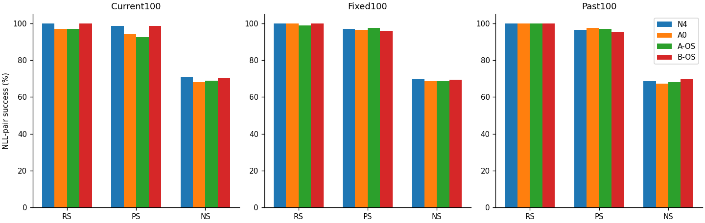
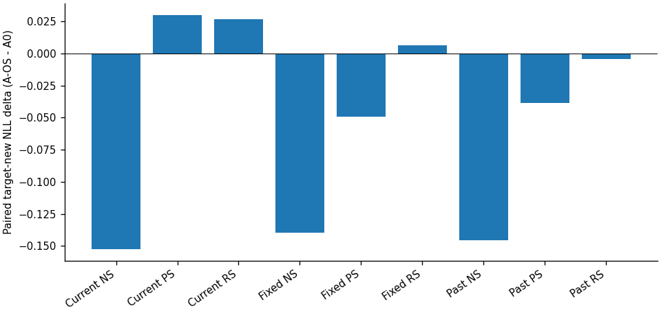
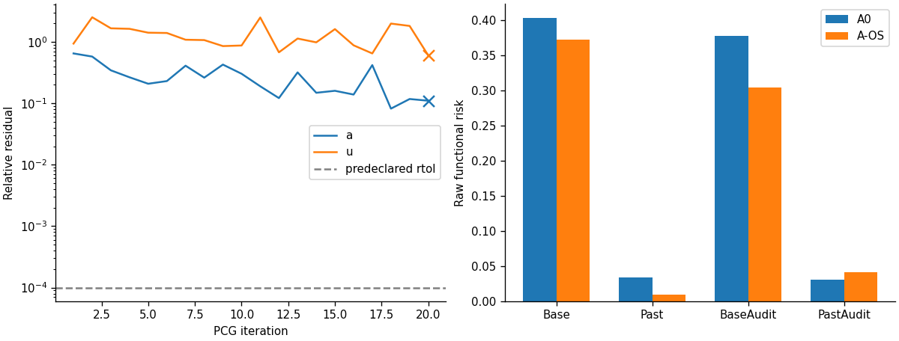
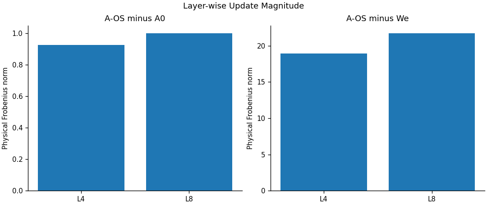

# Middle A-OS 완료분 사실 검토 — 전체 A/B campaign 미완료

## 1. 범위와 지표

본 문서는 완료된 job45633 A-OS의 CPU-only recall 리뷰다. 새 모델 load/forward/evaluator/GPU/Slurm 실행은 모두0이다. Scheduler COMPLETED와 수치 수렴은 다르다. 실제 endpoint는 finite이고 저장·평가가 완료됐으나, PCG 두 RHS 모두 사전 한도20회에서 미수렴하여 **APPROXIMATE_PCG_NONCONVERGENCE**다. 초기 full-operator 검사를 수렴 또는 성능 PASS로 대체하지 않는다. scientific_promotion=false.

Current100은 Middle W50 다음 B51의100요청, Fixed100/Past100은 공통 봉인 패널이다. 각 패널 RS100, PS200, NS1000 prompt-pair, 합계3900 pairs다. 세 패널을 독립300요청의 실험 반복으로 간주하지 않는다. RS/PS는 target-new NLL < target-true NLL, NS는 반대의 strict inequality이며 tie는 failure다. NLL은 낮을수록 해당 continuation의 가능도가 높다. `margin=true-new`; 유리한 방향의 desired margin은 RS/PS에서는 margin, NS에서는 -margin이다. Token accuracy/sequence strict는 별도 secondary 지표로 CSV에 보존한다.

N4와 B-OS는 exact common READY/panel이 일치하는 SH2의 봉인 aggregate를 재사용했다. 새 remote raw rehash나 cross-hardware numerical parity를 수행하지 않았다. A0/A-OS 및 실제 removal 관측은 로컬 원시 JSON을 독립 join/검산했다. 다른 BLUE 두-layer/원본5-layer AlphaEdit/MEMIT same-entry baseline은 이 리뷰에서 NOT_MEASURED이며 다른 chain 점수로 채우지 않았다.

## 2. 동일 패널 핵심표

| 패널 | state | RS n/d | PS n/d | NS n/d | rewrite new NLL mean | rephrase new NLL mean |
| --- | --- | --- | --- | --- | --- | --- |
| Current100 | N4 | 100/100 (100.0%) | 197/200 (98.5%) | 711/1000 (71.1%) | 0.02666907 | 1.19442035 |
| Current100 | A0 | 97/100 (97.0%) | 188/200 (94.0%) | 682/1000 (68.2%) | 0.28932454 | 2.04255143 |
| Current100 | A-OS | 97/100 (97.0%) | 185/200 (92.5%) | 688/1000 (68.8%) | 0.31609666 | 2.07233746 |
| Current100 | B-OS | 100/100 (100.0%) | 197/200 (98.5%) | 706/1000 (70.6%) | 0.03218118 | 0.72148729 |
| Fixed100 | N4 | 100/100 (100.0%) | 194/200 (97.0%) | 696/1000 (69.6%) | 0.22735790 | 1.50207670 |
| Fixed100 | A0 | 100/100 (100.0%) | 193/200 (96.5%) | 687/1000 (68.7%) | 0.21674329 | 1.44844308 |
| Fixed100 | A-OS | 99/100 (99.0%) | 195/200 (97.5%) | 686/1000 (68.6%) | 0.22296314 | 1.39896944 |
| Fixed100 | B-OS | 100/100 (100.0%) | 192/200 (96.0%) | 695/1000 (69.5%) | 0.21343255 | 1.22701486 |
| Past100 | N4 | 100/100 (100.0%) | 193/200 (96.5%) | 686/1000 (68.6%) | 0.02774264 | 1.31975041 |
| Past100 | A0 | 100/100 (100.0%) | 195/200 (97.5%) | 674/1000 (67.4%) | 0.03314088 | 1.23644945 |
| Past100 | A-OS | 100/100 (100.0%) | 194/200 (97.0%) | 682/1000 (68.2%) | 0.02898690 | 1.19803962 |
| Past100 | B-OS | 100/100 (100.0%) | 191/200 (95.5%) | 697/1000 (69.7%) | 0.02250555 | 1.08109720 |

We에서 기록된 Current RS=30/100, PS=53/200이다. 이 removal 기준 관측에는 Current NS 및 Fixed/Past 전체 We 평가가 없으므로0으로 채우지 않는다.



## 3. A0 → A-OS paired 변화


| 패널 | metric | 분모 | Δpp | 성공→실패 | 실패→성공 | new NLL Δmean | median | p90 | max |
| --- | --- | --- | --- | --- | --- | --- | --- | --- | --- |
| Current100 | NS | 1000 | +0.60 | 7 | 13 | -0.15245579 | -0.08801794 | +0.34150639 | +2.66775513 |
| Current100 | PS | 200 | -1.50 | 3 | 0 | +0.02978603 | +0.01046137 | +0.19972553 | +2.25295258 |
| Current100 | RS | 100 | +0.00 | 0 | 0 | +0.02677212 | +0.00798805 | +0.07387534 | +0.74967623 |
| Fixed100 | NS | 1000 | -0.10 | 8 | 7 | -0.13943222 | -0.07344007 | +0.33920880 | +4.55400944 |
| Fixed100 | PS | 200 | +1.00 | 0 | 2 | -0.04947364 | +0.00152729 | +0.15353224 | +1.42126751 |
| Fixed100 | RS | 100 | -1.00 | 1 | 0 | +0.00621985 | +0.00095612 | +0.04613149 | +1.54188347 |
| Past100 | NS | 1000 | +0.80 | 12 | 20 | -0.14572987 | -0.06576979 | +0.36496563 | +6.09876537 |
| Past100 | PS | 200 | -0.50 | 1 | 0 | -0.03840983 | +0.00305166 | +0.09693452 | +0.54131779 |
| Past100 | RS | 100 | +0.00 | 0 | 0 | -0.00415399 | +0.00072683 | +0.00915036 | +0.13754353 |

`paired-summary.csv`에는 true NLL/desired margin의 동일 통계와 positive/equal/negative count도 있다. `paired-case-deltas.csv`는 exact case/prompt/target identity 해시로 결속한3900쌍 및 We→A-OS Current300쌍이다. N4/B-OS에 대해서는 이번 로컬 aggregate만으로 per-case delta나 loss/recovery를 추정하지 않는다. Request/context별 NLL과 sequence/token strict 전체 요약은 `endpoint-summary.csv`에 있다.



## 4. 기능적 bank와 독립 Audit

Base/Past reference는 고정 We다. Base는 KL(We||state), Past는 봉인 psi(.1) NLL 증가다. 아래 숫자는 같은 bank의 raw functional value이며 covariance key energy가 아니다. Context별 가중치를 전부 독립 합산하고 기록된 reduction과 FP32 rounding-bound 내 일치를 확인했다. Count, context NLL, p90/max, 음수 raw value count는 CSV에 있다. BaseAudit/PastAudit는 controller bank와 별도로 기록된 관측이다.

| 역할 | A0 raw risk | A-OS raw risk | Δ(A-OS−A0) | A0 mean NLL | A-OS mean NLL | contexts |
| --- | --- | --- | --- | --- | --- | --- |
| Base | 0.403123520 | 0.372483209 | -0.030640312 | 5.884034159 | 5.619945134 | 128 |
| Past | 0.033725210 | 0.008971100 | -0.024754110 | 0.537261621 | 0.377395835 | 256 |
| BaseAudit | 0.377371893 | 0.304168562 | -0.073203331 | 5.809471708 | 5.729466751 | 128 |
| PastAudit | 0.030918288 | 0.041319991 | +0.010401702 | 0.530182776 | 0.541581696 | 256 |
| Current | 4727.240508112 | 0.905159229 | -4726.335348882 | 0.272290297 | 0.284402428 | 600 |

주의: Current functional profile은 A0의 기준과 A-OS의 fixed WA teacher가 다르므로 두 profile value 차이를 동일 목적 개선으로 해석하지 않는다. 같은 Current context의 mean NLL은 비교 가능하다. N4 calibration bank risk는 Base .0348951202304, Past .0103827207665다. A-OS의 Base/Past 변화가 Audit 일반화 또는 native 대비 우위를 증명한다고 해석하지 않는다. W0-KL·추가 W0 복구 효과는 이번 raw에서 NOT_RECORDED다.

## 5. PCG·constraint·실제 적용

실행된 K는 native .01H + 2/sigmaB GGN_Base + 1/sigmaP GGN_Past + GGN_Current + A balance다. Native preconditioner는100H^-1이며 K의 정확 역행렬이 아니다. 두 layer를 함께 통과하는 full-sequence functional operator 및 cross block을 유지한다. Current는 joint equality 한 개이며 layer별 equality0이다. Current GGN은 KL/.1 Fisher + NLL-profile outer/.1², Past는 psi'' outer와 psi' Fisher를 함께 사용한다. Full Hessian을 저장한 것은 아니다.

| RHS | iterations | actual relres | actual absres | RHS norm | status |
| --- | --- | --- | --- | --- | --- |
| a | 20 | 0.110079346955 | 0.979453120466 | 8.89770104529 | APPROXIMATE_PCG_NONCONVERGENCE |
| u | 20 | 0.600043751205 | 401.667996603 | 669.3978494 | APPROXIMATE_PCG_NONCONVERGENCE |

사전 rtol=1e-4/maxiter20을 바꾸지 않았다. 실제 operator 재적용 잔차와 recursive residual은 분리 기록한다. Stationarity norm=392.119717643, reference norm=669.3978494, 비율=0.585779769078. Intended correction의 equality residual=-5.07402389419e-11; range relative residual=3.37692660838e-09. 이 작은 equality 하나가 전체 solve 정확도를 보증하지 않는다. OS에는 BF inequality가 적용되지 않았으므로 raw dual/slack [0,0]은 barrier 만족 PASS가 아니라 N/A다.

Predicted Current change=-5.07402389419e-11와 actual Current train-NLL change=0.0121121309942를 구분한다. Predicted normalized Base/Past changes=[-62.579472855833785, -181.16606143575865], actual=[-0.8780686661158904, -2.3841641057895475]. 실제 변화는 선형 예측과 다르며 이것만으로 특정 원인을 확정하지 않는다. 낮은 성능 또는 finite PCG 미수렴 때문에 endpoint를 제외하지 않았다. No extra h/no inner compute-z/no inner history append/no rank truncation은 source 및 telemetry에서 확인된다.



## 6. 실제 weight와 signed 기여

Intended correction norm=1.36028210621, 실제 FP32 endpoint−A0 norm=1.36028210615. FP32 addition residual norm=3.33255817827e-06; 전체 We→A-OS batch delta norm=28.7907357752. Saved endpoint를 CPU에서 읽어 full dense block norm과 SHA를 다시 확인했다. 물리 Frobenius norm과 raw native energy는 다른 단위다.

| layer | 실제 AOS−A0 norm | 실제 AOS−We norm | raw native energy before | after |
| --- | --- | --- | --- | --- |
| 4 | 0.9246950508 | 18.94290631 | 1935.419101 | 1935.815429 |
| 8 | 0.9976504755 | 21.68116157 | 2637.658271 | 2638.309076 |



Signed attribution은 We, We+D4, We+D8, We+D4+D8의 **실제 기록된 Current RS100/PS200** 관측이다. 여기서 D는 A0부터의 correction만이 아니라 We 기준 이번 batch 누적 delta다. E4/E8/E48은 We 대비 target-new NLL 감소, signed L4=(E4+E48−E8)/2, signed L8=(E8+E48−E4)/2, interaction=E48−E4−E8. 음수도 보존하며 norm-share를 기여로 바꾸지 않는다.

| metric | quantity | n | mean | median | p90 | max | positive/zero/negative |
| --- | --- | --- | --- | --- | --- | --- | --- |
| RS | standalone_E48 | 100 | +8.4938577 | +8.4726961 | +14.0937500 | +20.4607389 | 100/0/0 |
| RS | signed_L4 | 100 | +5.4776327 | +5.2246550 | +9.2332066 | +14.4674553 | 97/0/3 |
| RS | signed_L8 | 100 | +3.0162250 | +2.9896457 | +8.0738996 | +11.5907826 | 74/0/26 |
| RS | interaction | 100 | -2.8008594 | -2.3299585 | +4.4969673 | +15.1869545 | 36/0/64 |
| PS | standalone_E48 | 200 | +6.5762287 | +6.3729801 | +11.7949923 | +17.8503516 | 193/0/7 |
| PS | signed_L4 | 200 | +4.0848125 | +3.9084498 | +8.1609799 | +12.0815307 | 189/0/11 |
| PS | signed_L8 | 200 | +2.4914161 | +1.8786947 | +6.6960758 | +13.0386259 | 159/0/41 |
| PS | interaction | 200 | -1.9181516 | -1.0888532 | +3.3309431 | +13.9047915 | 72/0/128 |

이 paired interaction 수치는 signed NLL decomposition이다. 편집 부담의 인과적 이전, locality guarantee, lifelong 우위 또는 multi-layer capacity 불가능성으로 확대하지 않는다. 추가 Base/Past removal intervention은 이 리뷰에서 새로 실행하지 않았다.

## 7. History·복원 검증 범위

Endpoint weights L4/L8은 terminal의 tensor SHA와 일치하고 FULL_FP32 shape[4096,14336]이다. Saved final M 및 endpoint에서 capture한 K의 tensor SHA도 일치한다. 두 layer 각각 terminal append1, batch finalization1, inner append0이다. CPU에서 원 식 M_entry+KKᵀ를 row-block으로 검산한 residual은 `history-checks.csv`에 그대로 기록한다. CPU BLAS 연산 순서 차이를 숨겨 byte-exact replay라고 하지 않는다. M4는 원 native history, M8는 common fixture에서 같은 We로 준비한 history이며 독립 새 lifelong provenance가 아니다.

Actual endpoint materialization1/restore1, attribution materialization2/restore2, 각각 version-increment0이 terminal counters에 있다. Virtual/physical forward parity는 실제 관측2contexts에서 byte_equal=true/l2_error0이다. 전체3900 평가를 다시 forward해 parity를 증명한 것은 아니다. Source의 JointView guard는 모든 parameter의 pointer/version/shape/dtype/device 및 selected byte SHA를 검사한다.

**복원 기준은 We다.** common session은 W0 로딩 확인 후 selected weights를 We로 바꾸고 guard를 생성한다. Materialization context는 그 We로 복원한다. Process 종료 직전 W0 전체 bytes 복원 또는 모든 nonselected parameter/buffer bytes의 manifest는 NOT_RECORDED다. 따라서 ‘W0 exact final restore PASS’로 보고하지 않는다. 이 한계 때문에 기록된 endpoint 평가를 삭제하거나 다른 상태로 대체하지 않는다.

## 8. 비용과 카운터

Scheduler45633: COMPLETED0:0, 2026-09-12 12:24:06–18:58:23, allocation23657 GPU-sec=6.57139 GPUh(1GPU). Batch/extern 시간을 중복 합산하지 않는다. AOS protection solve23174.478777s, model load10.338117s, teacher35.055517s, full endpoint147.234326s, removal Current29.158636s, generation90.408074s, native key capture27.075353s. 이 timer들은 계층/중첩 관계가 있으므로 단순 합계를 새로운 GPU 시간으로 만들지 않는다. A0/공통 cold preparation의 과거 비용은 AOS 신규 allocation에 포함되지 않았으며 ‘cold end-to-end 전체’라고 부르지 않는다.

Full K matvec43, native inverse42; 두 RHS 각각 PCG20회+실제 residual 평가1회, stationarity 추가1회다. Functional solve JVP21156/VJP21156, 명시 gradient backward792, logits-forward43296. Actual model invocation47484와 functional-view44283은 포함관계이므로 합산0. Evaluation9000 candidate sequences/1130forward; generation60prompts/1920output tokens(고정 greedy32)이다. 생성 문자열은 local-only이고 semantic accuracy로 재해석하지 않았다.

Host weight transfer counter20,802,003,009,536 bytes는 explicit storage-copy accounting이지 측정한 PCIe bandwidth/전체 tangent traffic이 아니다. Peak allocated40,262,761,984B, reserved42,557,505,536B. CPU PCG vector/actual model은 FP32, native factors FP64, scalar reductions FP64다. 긴 operator 비용과 실제 미수렴을 함께 보고하며 ‘작은 최종 scalar solve라 저렴하다’고 주장하지 않는다. 상세 `compute-ledger.csv`는 단위/포함관계를 보존한다.

## 9. Coverage와 현재 미완료

이번 완료분: Middle A-OS endpoint3900pairs, functional Base/Past/Current 및 Audit, Current removal300pairs×두 layer, 기존 We300pair 재사용, generation60, saved W/M 및 비용이다. Middle A0와 N4/B-OS의 봉인 비교는 위 범위만 재사용했다. E01 두 replacement의 진행/성능 결과는 이 보고서에 혼합하지 않았다.

나머지 Early/Late A 계열, Middle 추가 variant, native Alpha/MEMIT/BLUE 비교, A/N4/BLUE shortchains, SH2의 나머지 B campaign은 이 문서가 완료를 주장하지 않는다. B-BF4 paused task를 조회하거나 깨우지 않았다. Full26+baseline6 endpoints/4shortchains 완료 아님. 미측정 자료는0/추정/다른 chain으로 대체하지 않았다. 이번 표는 사실·수치 package이며 최종 원인 종합과 후속 방법 선택은 GH 소유다.

## 10. 재현·검증·산출물

Raw full terminal24members는 분석 전후 전체 SHA/bytes/mode와 members root를 검증했다. Common184members는 기존 receiver 검증을 재사용하고 이번 분석에 읽은 subset만 새 SHA 검증했다. Dataset SHA/panel/order/target identity,3900row uniqueness, strict tie 방향, functional weighted reduction, endpoint 및 history tensor SHA를 결속했다. Plot은 저장소 Python code로 두 번 실제 렌더링하여 byte-identical 확인했다. Raw prompts/tensors/model/cache/generation text/log는 Git 제외다.

Execution source `815f933e3bb6e6694cb3c0ad8bb6cd6ff63234d0` / tree `4b35bec2bf6f29a8d45dbaee5bb0c9a99dcc877e`. Analysis source `51675eabd51d326600c3d2dc0cca370d3a8d7443` (code commit; publication commit과 구분). Pure CPU helper는 `ba91f274ddf452be4124aedfc1ff37c1fb92fdb8:project/run_scripts/multilayer_joint_compensation/track_a/analyze_partial.py` SHA `a3db0b15028252b43d4880fec570252842f5ac48a293c426c06375321ab5b5bb`를 Git object에서 검증하여 재사용한다. 저장소에 해당 object가 없으면 공개된 SH1 source branch를 fetch한 뒤 실행해야 하며, 임의 최신 runtime을 import하지 않는다.

```bash
/mnt/raid5/janghj/EasyEdit/.venv/bin/python project/run_scripts/multilayer_joint_compensation/analysis/aos_review.py --repo . --raw-root /mnt/raid5/janghj/.codex/worktrees/odeeditsh1-multilayer-joint-edit-a-v1 --output experiment-reports/servers/server1/multilayer-joint-edit-a-2026-09-11-v1/middle-aos-review-recall-v1
```

주요 파일: `endpoint-summary.csv`, `paired-summary.csv`, `paired-case-deltas.csv`, `functional-risk.csv`, `functional-context-values.csv`, `signed-attribution.csv`, `signed-attribution-summary.csv`, `physical-update.csv`, `history-checks.csv`, `pcg.csv`, `pcg-iterations.csv`, `solver-and-transaction.json`, `compute-ledger.csv`. Input/source/member identities는 `input-manifest.json`, PNG 환경·명령·입력/출력SHA는 `plot-reproduction.json`, 출력 전체 결속은 `analysis-manifest.json` 및 `rooted-receipt.json`이다. 기존 report/raw bytes는 덮어쓰지 않았다.
