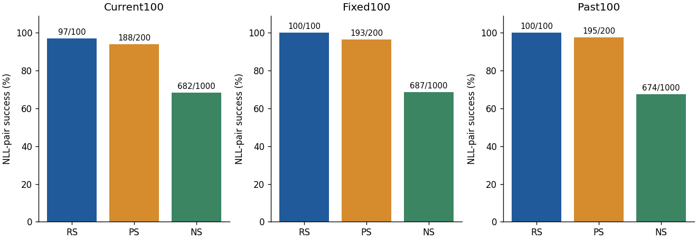
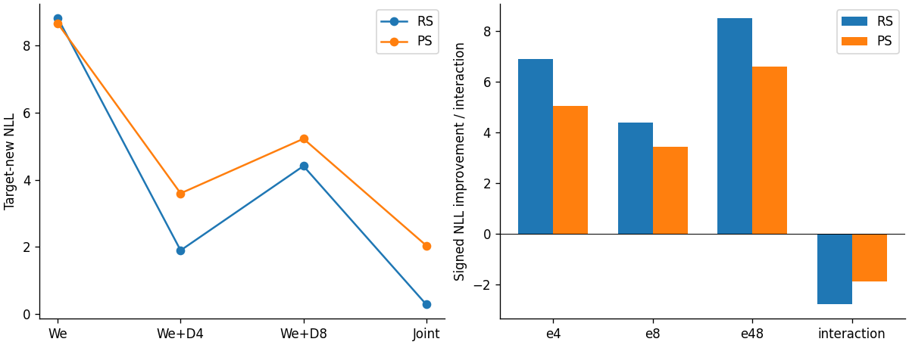
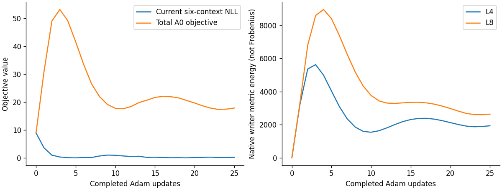
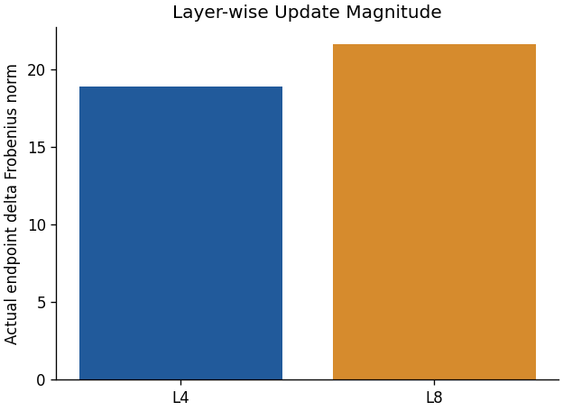

# Middle B100 A0 공동 편집 — 부분 사실 보고서

상태: PARTIAL_MIDDLE_A0_REVIEW_READY. **전체 A/B campaign 완료 보고가 아니다.** Llama3-8B-Instruct의 같은 Middle W50 entry에서 A0 한 경로만 새 endpoint로 완료했다. AOS/BOS의 local terminal과 나머지 arm·4개 short chain은 이 패키지에 없다. 이 보고는 저장된 결과에 대한 CPU 분석이며 새 모델/평가/GPU/제출은 모두 0이다. scientific_promotion=false.

## 1. 지표와 관측 범위

RS는 rewrite, PS는 두 paraphrase prompt, NS는 열 neighborhood prompt에 대한 NLL-pair strict 비교다. RS/PS는 target-new NLL < target-true NLL, NS는 target-true NLL < target-new NLL이다. Tie는 실패다. NLL은 target token 평균이며 낮을수록 해당 target을 더 선호한다. Margin=true−new는 RS/PS에서 양수가 유리하고 NS에서는 음수가 유리하다. Teacher-forced strict accuracy는 모든 token argmax 일치이며 preference success와 다른 지표다.

각 Current100/Fixed100/Past100에서 분모는 RS100·PS200·NS1000이고 전체 endpoint는 3900 prompt-pair다. Current는 frozen10k ordinal5000:5100, B51의 유효100개다. 세 패널은 서로 다른 역할이며 한 pooled 성공률을 대표값으로 만들지 않았다. PS prompt200개를 request200개로 부르지 않는다. We와 D4-only/D8-only의 저장 관측은 Current RS/PS 각300pair뿐이며 **We NS 및 Fixed/Past entry-before 값은 미기록**이다. 따라서 NS 개선/악화, Fixed/Past forgetting 또는 recovery를 A0 endpoint 수준만으로 판정하지 않는다.

## 2. Endpoint 결과

| state | panel | metric | success n/d | rate % | new NLL mean | true NLL mean | new strict n |
| --- | --- | --- | --- | --- | --- | --- | --- |
| A0 | Current100 | RS | 97/100 | 97 | 0.289325 | 12.0065 | 93 |
| A0 | Current100 | PS | 188/200 | 94 | 2.04255 | 9.602 | 117 |
| A0 | Current100 | NS | 682/1000 | 68.2 | 8.351 | 6.04496 | 70 |
| A0 | Fixed100 | RS | 100/100 | 100 | 0.216743 | 12.8541 | 95 |
| A0 | Fixed100 | PS | 193/200 | 96.5 | 1.44844 | 9.71015 | 140 |
| A0 | Fixed100 | NS | 687/1000 | 68.7 | 8.74107 | 6.56917 | 53 |
| A0 | Past100 | RS | 100/100 | 100 | 0.0331409 | 13.8621 | 100 |
| A0 | Past100 | PS | 195/200 | 97.5 | 1.23645 | 10.45 | 141 |
| A0 | Past100 | NS | 674/1000 | 67.4 | 7.83363 | 5.99261 | 67 |
| We | Current100 | RS | 30/100 | 30 | 8.80995 | 6.17387 | 3 |
| We | Current100 | PS | 53/200 | 26.5 | 8.64857 | 6.0878 | 4 |
| We_plus_D4 | Current100 | RS | 93/100 | 93 | 1.89829 | 8.68605 | 70 |
| We_plus_D4 | Current100 | PS | 168/200 | 84 | 3.59563 | 7.98364 | 69 |
| We_plus_D8 | Current100 | RS | 74/100 | 74 | 4.40856 | 9.90274 | 43 |
| We_plus_D8 | Current100 | PS | 129/200 | 64.5 | 5.22004 | 8.51741 | 50 |


new strict의 분모는 각 success 분모와 같다. NS에서는 true strict가 보존-target strict이므로 표의 new strict를 locality accuracy로 해석하지 않는다. 모든 new/true NLL mean/median/p90/max, margin, strict 및 token-correct n/d는 [endpoint-summary.csv](endpoint-summary.csv)에 있다. **높은 Current RS와 동시에 측정된 Base/Past harm은 그대로 남긴다.**



## 3. 네 실제 state의 signed attribution

L(W)를 Current target-new NLL이라 할 때 e4=L(We)−L(We+D4), e8=L(We)−L(We+D8), e48=L(We)−L(We+D4+D8), interaction=e48−e4−e8이다. 아래 값은 실제 저장된 네 state의 request/prompt-matched 관측이며 단순 weight norm share가 아니다. Conditional marginal은 e48−e8 및 e48−e4다. 음의 interaction은 개별 효과의 중복/비선형성까지 포함하며 곧바로 방해 또는 실패를 뜻하지 않는다. 합의 NLL 개선이 양수인 사실만으로 50:50 부담 분산이나 A0-L4 대비 capacity 우위를 입증하지 않는다.

| metric | quantity | mean | median | p90 | positive n | negative n |
| --- | --- | --- | --- | --- | --- | --- |
| RS | e4 | 6.91166 | 7.06459 | 11.272 | 97 | 3 |
| RS | e8 | 4.4014 | 4.94401 | 13.1585 | 72 | 28 |
| RS | e48 | 8.52063 | 8.47368 | 14.0987 | 100 | 0 |
| RS | interaction | -2.79243 | -2.54249 | 4.57616 | 35 | 65 |
| RS | marginal_L4_given_L8 | 4.11923 | 2.23586 | 10.7615 | 81 | 19 |
| RS | marginal_L8_given_L4 | 1.60897 | 0.511827 | 4.68314 | 98 | 2 |
| PS | e4 | 5.05294 | 4.81857 | 9.41785 | 187 | 13 |
| PS | e8 | 3.42853 | 2.63681 | 10.3954 | 146 | 54 |
| PS | e48 | 6.60601 | 6.40329 | 11.7973 | 193 | 7 |
| PS | interaction | -1.87545 | -1.098 | 3.39414 | 73 | 127 |
| PS | marginal_L4_given_L8 | 3.17749 | 1.9702 | 8.61663 | 152 | 48 |
| PS | marginal_L8_given_L4 | 1.55308 | 0.686553 | 4.20454 | 173 | 27 |


개별 signed 값/entry success→failure 및 failure→success flags는 [signed-attribution.csv](signed-attribution.csv)에 있다. 다른 패널에는 entry 관측이 없어 해당 paired 값을 만들지 않았다. A0-L4, A0-bal0, AOS/BF 및 같은-entry native 전체 성능 비교가 아직 없으므로 공동 target 자체·추가 L8·balance 효과는 분리되지 않았다.



## 4. Functional Base/Past와 독립 Audit

Base는 고정 We full-vocabulary teacher의 KL(p_We∥p_endpoint), Past는 context별 token-mean NLL 증가에 ψτ(τ=.1)을 적용한 뒤 context/request 평균이다. BaseAudit/PastAudit는 controller bank와 분리된 동일 정의의 관측이다. Current functional은 **We-relative KL/.1 + NLL-profile 제곱/(2·.1²)** 관측이며 A0가 최소화한 edit NLL 또는 향후 BF의 시간별 reference와 동일하지 않다. 여기서는 이를 새로운 성능 gate로 삼지 않는다.

| role | requests | contexts | weighted value | raw context p90 | raw max | native same-bank value | A0/native |
| --- | --- | --- | --- | --- | --- | --- | --- |
| Base | 128 | 128 | 0.403124 | 1.09721 | 2.32451 | 0.0348951 | 11.5524 |
| BaseAudit | 128 | 128 | 0.377372 | 0.816265 | 2.62008 | NOT_RECORDED | N/A |
| Current | 100 | 600 | 4727.24 | 10256.4 | 21058.7 | NOT_RECORDED | N/A |
| Past | 128 | 256 | 0.0337252 | 0.00419227 | 1.62508 | 0.0103827 | 3.24821 |
| PastAudit | 128 | 256 | 0.0309183 | 0.00975089 | 1.30791 | NOT_RECORDED | N/A |


Native Base/Past 값은 common calibration에 봉인된 같은 We의 N4 risk이며 N4의 새 full3900 endpoint 평가를 대신하지 않는다. Audit native risk와 We NS는 미기록이다. 모든 raw negative KL count와 weighted reduction residual은 [functional-summary.csv](functional-summary.csv), [input-verification.json](input-verification.json)에 남겼다. Microbatch 평균을 다시 평균내지 않고 저장된 context weight로 독립 재집계했다. Controller bank fitting과 audit 일반화 또는 locality 우월성은 아직 비교군이 없으므로 주장하지 않는다.

## 5. A0 최적화와 layer magnitude

Adam25 updates, lr=.1, β=(.9,.999), epsilon1e−8, balance λ=.1이다. q는 entry에서 한 번 캡처하고 두 RHS는 zero에서 공동 시작했다. 25번 update와 최종 observation을 합해 26개 callback gradient set이 기록됐으며 7800 physical backward microbatch=26×300이다. **PCG는 A0에 적용되지 않으며 N/A**다. 초기 derivative/transaction 검사의 JVP9·FD54는 진단 비용으로 분리한다.

Train six-context Current NLL은 9.02714→0.27229, 총 objective는 9.02714→17.9329다. 마지막 unweighted balance=176.606, weighted contribution=17.6606이다. 편집 NLL이 낮아졌어도 balance를 포함한 총 목적값은 초기보다 높다. 이는 실제 finite optimization 결과이며 convergence 또는 objective 최적화 성공으로 포장하지 않는다. Pre-update step25는 completed24이며 final row는 post-update25다. [a0-trajectory.csv](a0-trajectory.csv)는 이 시간축을 명시한다.

| layer | actual FP32 ΔW ||·||F | actual squared energy | energy share | planned Δ norm | cast/add difference norm | W0-net norm | native writer energy | q |
| --- | --- | --- | --- | --- | --- | --- | --- | --- |
| 4 | 18.9232 | 358.089 | 0.432866 | 18.9232 | 2.67165e-06 | 69.0929 | 1935.42 | 11.1989 |
| 8 | 21.6602 | 469.162 | 0.567134 | 21.6602 | 2.11939e-06 | 21.6602 | 2637.66 | 2.69499 |


Actual ΔW는 저장된 FP32 endpoint−We를 FP64로 차분했다. Planned Δ와 실제 덧셈 뒤 차이는 따로 남겼다. W0-net은 기존5000 edit의 누적 L4 상태를 포함하므로 이번 batch update와 섞지 않는다. Native metric energy는 Frobenius 제곱과 다른 단위다. 중간 step별 실제 dense delta는 저장되지 않았으므로 native energy trajectory를 물리 net displacement로 대체하지 않았다.





## 6. 비용·공통 준비·검증

| job | phase | state | GPU seconds | GPU hours |
| --- | --- | --- | --- | --- |
| 44952 | common_setup | COMPLETED | 916 | 0.254444 |
| 44970 | A0 | COMPLETED | 1561 | 0.433611 |


두 1GPU job의 실제 allocation 합은 2477 GPU-sec (0.688056 GPUh)다. Slurm batch/extern 하위행을 중복 합산하지 않았다. common setup은 별도 재사용 비용이며 A0에 포함시킨 cold subtotal은 위 합계지만 원래 N4 z/이전 checkpoint 생성비용은 포함하지 않는다.

A0 joint target optimization 974.549s, 그 안의 Current forward/backward 949.914s, full endpoint evaluator 146.994s, generation 90.573s다. Common native key capture 705.599s에는 현재 key와5000 raw-history key가 포함된다. Nested timer는 서로 더해 총 wall로 만들지 않는다. Actual model forward 호출은 common 4776, A0 12156이고 기능별 wrapper count와 구분했다. A0 peak allocated GPU=37.897GiB, common peak allocated=30.742GiB다. Native z를 새로 최적화하지 않은 캐시 재사용과 A0 신규 RHS 최적화를 혼동하지 않는다.

L8 history는 같은 We에서 모든 과거 raw5000 requests를 B100×50 chronological FP32 Gram으로 재구성했다. M4는 원본을 유지하며 이것이 옛 L8 trajectory history와 동일하다는 주장은 없다. Endpoint 후 두 layer key를 한 번씩 finalization, terminal batch finalization1, inner append0가 봉인됐다. Full P* rank는 L4=14326, L8=14293; 100/256 rank truncate가 아니다.

초기 actual derivative/transaction receipt의 PASS와 pointer/version/bytes restore를 확인했다. 이는 A0 initial probe 범위이며 아직 실행하지 않은 full protection PCG의 PASS가 아니다. Raw terminal/common 총 235개 member, 14806991142bytes의 SHA/bytes/mode/root를 전후 두 번 검증했다. 표본/order·panel/row identity·NLL 비교방향·finite·strict token분모·history·source binding도 독립 확인했다. Raw tensor의 file SHA 검증과 model inference 재검증은 다른 수준이며 후자는 새로 하지 않았다. 외부SH2 검증 여부는 이 local sealed READY의 false/ACK_REQUIRED를 임의 갱신하지 않았다.

Generation은 고정20 requests×3prompts=60행, greedy≤32tokens; literal-prefix 42/60이다. 이는 semantic accuracy가 아니며 raw 생성문은 Git에서 제외했다.

## 7. 한계와 다음 해석

관측: A0의 Current 편집성은 높고 두 layer 단독 intervention과 joint intervention이 다른 결과를 냈다. 동시에 Base/Past functional harm은 같은-bank native calibration보다 컸고 총 A0 objective도 entry보다 높았다. 가능한 설명은 공동 writer의 nonlinear 전달 및 balance/고정 Adam 경로 사이 tradeoff지만, A0-L4·balance0·OS/BF가 없어 그 원인을 분리 확정할 수 없다. 현재 결과만으로 편집 부담 분산 성공, locality 개선, BF 효용, 후속10batch 보존 또는 lifelong 우위를 주장하지 않는다.

미실행/미기록 범위는 [coverage.csv](coverage.csv)에 분리했다. 낮은 성능이나 큰 harm 때문에 제외한 endpoint는 없다. 가장 중요한 남은 질문은 **동일 Current 품질에서 기능적 OS/BF가 독립 Base/Past audit 손상을 실제로 낮추는가**다. 이 부분 보고서가 후속 승인 범위를 늘리거나 자동 promotion하지 않는다.

## 8. 재현과 provenance

실행 A0 source `5f916fa7ffbee8793e09fc21029df453c7644989`, common source `7d17747b741378c4b406cdefc6dcb94060f5c959`. Analysis source file SHA와 실행 Git blob은 [manifest.json](manifest.json), raw input closure는 [input-verification.json](input-verification.json), package root는 [rooted-receipt.json](rooted-receipt.json)에 있다. Model revision은 `8afb486c1db24fe5011ec46dfbe5b5dccdb575c2`다.

```bash
/mnt/raid5/janghj/EasyEdit/.venv/bin/python -m project.run_scripts.multilayer_joint_compensation.track_a.analyze_partial --a0 /mnt/raid5/janghj/.codex/worktrees/odeeditsh1-multilayer-joint-edit-a-v1/local/multilayer-joint-compensation/20260911-v1/track-a/a0-r1-Middle --common /mnt/raid5/janghj/.codex/worktrees/odeeditsh1-multilayer-joint-edit-a-v1/local/multilayer-joint-compensation/20260911-v1/common/common-r1-Middle --output <new-create-once-output>
```

PNG는 repository Python 코드로 동일 derived 입력에서 두 번 실제 rendering하여 byte equality를 확인했다. [plot-reproduction.json](plot-reproduction.json)에 입력/코드 실행명령·환경·출력 SHA를 결속했다. Endpoint 원문 prompt, teacher, tensor, model, full log는 Git에 포함하지 않는다. 본 보고서의 분석은 설명적 비교이며 과학적 promotion은 false다.
