# 단일 layer 누적위험 진단 — A 사실 보고서

상태: COMPLETE. writers 13/13, logical full-batch steps 320/320, 추가 native scaling endpoints 12/12.

이 문서는 Llama L4 단일 weight의 세 historical entry를 이용한 진단이다. 새 lifelong run, 안전성 보장, 인과적 locality 개선 또는 scientific promotion을 의미하지 않는다. 상위 B/C는 이 A의 Direct-B/Direct-C support와 다른 실험 단계다.

## 읽는 법과 분모

- W0는 원본 모델, ENTRY(We)는 현재 B100을 편집하기 전 historical checkpoint다. 둘을 같은 pre-edit로 부르지 않는다.
- RS/PS는 target-new NLL < target-true NLL, NS는 target-true NLL < target-new NLL이다. Tie는 실패다. NLL은 target token별 평균이며 raw sequence joint NLL/확률과 구분한다. 낮을수록 해당 target의 token 평균 likelihood가 높다.
- margin=true−new. NS에서 양의 margin 변화는 새 competing target 방향이다. inherited=ENTRY−W0, additional=post−ENTRY를 같은 prompt에서 계산한다.
- Full은 panel마다 RS100/PS200/NS1000, 세 panel 합계3900쌍이다. Curve는 RS300/CurrentPS200/고정 neighbor600, 합계1100쌍이며 full NS로 부르지 않는다.
- Teacher-forced exact는 모든 target token top-1 일치이며 자유 생성 의미적 정확도와 다르다.
- 신뢰구간은 request별 prompt 묶음의 paired bootstrap 2000회다. Edit order/seed 변동의 신뢰구간이 아니다.

## 모든 full endpoint 성능

### Early

| endpoint | panel | RS | PS | NS | rewrite TF exact | rephrase TF exact | neighbor true TF exact |
| --- | --- | --- | --- | --- | --- | --- | --- |
| W0-full | Current100 | 10/100 (10.00%) | 22/200 (11.00%) | 900/1000 (90.00%) | 0/100 | 0/200 | 230/1000 |
| W0-full | Fixed100 | 5/100 (5.00%) | 20/200 (10.00%) | 886/1000 (88.60%) | 0/100 | 0/200 | 171/1000 |
| W0-full | Past100 | 9/100 (9.00%) | 20/200 (10.00%) | 885/1000 (88.50%) | 0/100 | 1/200 | 193/1000 |
| ENTRY-full | Current100 | 19/100 (19.00%) | 33/200 (16.50%) | 832/1000 (83.20%) | 4/100 | 3/200 | 211/1000 |
| ENTRY-full | Fixed100 | 100/100 (100.00%) | 193/200 (96.50%) | 828/1000 (82.80%) | 99/100 | 133/200 | 139/1000 |
| ENTRY-full | Past100 | 100/100 (100.00%) | 198/200 (99.00%) | 798/1000 (79.80%) | 100/100 | 126/200 | 174/1000 |
| N-full | Current100 | 100/100 (100.00%) | 195/200 (97.50%) | 813/1000 (81.30%) | 100/100 | 138/200 | 190/1000 |
| N-full | Fixed100 | 100/100 (100.00%) | 194/200 (97.00%) | 818/1000 (81.80%) | 99/100 | 133/200 | 133/1000 |
| N-full | Past100 | 100/100 (100.00%) | 198/200 (99.00%) | 792/1000 (79.20%) | 100/100 | 126/200 | 167/1000 |
| B-alpha-0.02/eval-032 | Current100 | 99/100 (99.00%) | 191/200 (95.50%) | 802/1000 (80.20%) | 99/100 | 128/200 | 197/1000 |
| B-alpha-0.02/eval-032 | Fixed100 | 100/100 (100.00%) | 193/200 (96.50%) | 818/1000 (81.80%) | 99/100 | 132/200 | 138/1000 |
| B-alpha-0.02/eval-032 | Past100 | 100/100 (100.00%) | 198/200 (99.00%) | 795/1000 (79.50%) | 100/100 | 127/200 | 168/1000 |
| C-alpha-0.02/eval-032 | Current100 | 100/100 (100.00%) | 192/200 (96.00%) | 746/1000 (74.60%) | 100/100 | 143/200 | 252/1000 |
| C-alpha-0.02/eval-032 | Fixed100 | 100/100 (100.00%) | 196/200 (98.00%) | 802/1000 (80.20%) | 97/100 | 162/200 | 211/1000 |
| C-alpha-0.02/eval-032 | Past100 | 100/100 (100.00%) | 199/200 (99.50%) | 796/1000 (79.60%) | 98/100 | 148/200 | 265/1000 |

### Middle

| endpoint | panel | RS | PS | NS | rewrite TF exact | rephrase TF exact | neighbor true TF exact |
| --- | --- | --- | --- | --- | --- | --- | --- |
| W0-full | Current100 | 12/100 (12.00%) | 23/200 (11.50%) | 888/1000 (88.80%) | 0/100 | 0/200 | 172/1000 |
| W0-full | Fixed100 | 5/100 (5.00%) | 20/200 (10.00%) | 886/1000 (88.60%) | 0/100 | 0/200 | 171/1000 |
| W0-full | Past100 | 11/100 (11.00%) | 20/200 (10.00%) | 879/1000 (87.90%) | 0/100 | 0/200 | 219/1000 |
| ENTRY-full | Current100 | 30/100 (30.00%) | 53/200 (26.50%) | 724/1000 (72.40%) | 3/100 | 4/200 | 103/1000 |
| ENTRY-full | Fixed100 | 100/100 (100.00%) | 194/200 (97.00%) | 693/1000 (69.30%) | 97/100 | 133/200 | 81/1000 |
| ENTRY-full | Past100 | 100/100 (100.00%) | 192/200 (96.00%) | 685/1000 (68.50%) | 100/100 | 138/200 | 109/1000 |
| N-full | Current100 | 100/100 (100.00%) | 197/200 (98.50%) | 711/1000 (71.10%) | 99/100 | 149/200 | 101/1000 |
| N-full | Fixed100 | 100/100 (100.00%) | 194/200 (97.00%) | 696/1000 (69.60%) | 97/100 | 134/200 | 79/1000 |
| N-full | Past100 | 100/100 (100.00%) | 193/200 (96.50%) | 686/1000 (68.60%) | 99/100 | 137/200 | 113/1000 |
| B-alpha-0.02/eval-032 | Current100 | 100/100 (100.00%) | 196/200 (98.00%) | 716/1000 (71.60%) | 99/100 | 144/200 | 105/1000 |
| B-alpha-0.02/eval-032 | Fixed100 | 100/100 (100.00%) | 194/200 (97.00%) | 696/1000 (69.60%) | 97/100 | 134/200 | 76/1000 |
| B-alpha-0.02/eval-032 | Past100 | 100/100 (100.00%) | 192/200 (96.00%) | 684/1000 (68.40%) | 100/100 | 138/200 | 114/1000 |
| B-alpha-0.06/eval-032 | Current100 | 100/100 (100.00%) | 199/200 (99.50%) | 709/1000 (70.90%) | 100/100 | 148/200 | 105/1000 |
| B-alpha-0.06/eval-032 | Fixed100 | 100/100 (100.00%) | 194/200 (97.00%) | 695/1000 (69.50%) | 97/100 | 137/200 | 78/1000 |
| B-alpha-0.06/eval-032 | Past100 | 100/100 (100.00%) | 192/200 (96.00%) | 683/1000 (68.30%) | 100/100 | 139/200 | 118/1000 |
| B-alpha-0.2/eval-032 | Current100 | 100/100 (100.00%) | 199/200 (99.50%) | 698/1000 (69.80%) | 100/100 | 153/200 | 105/1000 |
| B-alpha-0.2/eval-032 | Fixed100 | 99/100 (99.00%) | 194/200 (97.00%) | 701/1000 (70.10%) | 96/100 | 135/200 | 84/1000 |
| B-alpha-0.2/eval-032 | Past100 | 100/100 (100.00%) | 192/200 (96.00%) | 687/1000 (68.70%) | 100/100 | 141/200 | 114/1000 |
| C-alpha-0.02/eval-032 | Current100 | 100/100 (100.00%) | 192/200 (96.00%) | 678/1000 (67.80%) | 100/100 | 152/200 | 144/1000 |
| C-alpha-0.02/eval-032 | Fixed100 | 97/100 (97.00%) | 193/200 (96.50%) | 693/1000 (69.30%) | 94/100 | 142/200 | 109/1000 |
| C-alpha-0.02/eval-032 | Past100 | 100/100 (100.00%) | 190/200 (95.00%) | 680/1000 (68.00%) | 99/100 | 149/200 | 175/1000 |
| C-alpha-0.06/eval-032 | Current100 | 100/100 (100.00%) | 194/200 (97.00%) | 663/1000 (66.30%) | 100/100 | 168/200 | 147/1000 |
| C-alpha-0.06/eval-032 | Fixed100 | 96/100 (96.00%) | 190/200 (95.00%) | 683/1000 (68.30%) | 88/100 | 139/200 | 129/1000 |
| C-alpha-0.06/eval-032 | Past100 | 99/100 (99.00%) | 190/200 (95.00%) | 663/1000 (66.30%) | 95/100 | 150/200 | 183/1000 |
| C-alpha-0.2/eval-032 | Current100 | 100/100 (100.00%) | 197/200 (98.50%) | 642/1000 (64.20%) | 100/100 | 178/200 | 158/1000 |
| C-alpha-0.2/eval-032 | Fixed100 | 95/100 (95.00%) | 187/200 (93.50%) | 689/1000 (68.90%) | 86/100 | 147/200 | 146/1000 |
| C-alpha-0.2/eval-032 | Past100 | 99/100 (99.00%) | 188/200 (94.00%) | 664/1000 (66.40%) | 90/100 | 161/200 | 206/1000 |

### Late

| endpoint | panel | RS | PS | NS | rewrite TF exact | rephrase TF exact | neighbor true TF exact |
| --- | --- | --- | --- | --- | --- | --- | --- |
| W0-full | Current100 | 6/100 (6.00%) | 18/200 (9.00%) | 875/1000 (87.50%) | 0/100 | 0/200 | 184/1000 |
| W0-full | Fixed100 | 5/100 (5.00%) | 20/200 (10.00%) | 886/1000 (88.60%) | 0/100 | 0/200 | 171/1000 |
| W0-full | Past100 | 7/100 (7.00%) | 20/200 (10.00%) | 873/1000 (87.30%) | 0/100 | 1/200 | 184/1000 |
| ENTRY-full | Current100 | 27/100 (27.00%) | 59/200 (29.50%) | 634/1000 (63.40%) | 4/100 | 6/200 | 74/1000 |
| ENTRY-full | Fixed100 | 99/100 (99.00%) | 188/200 (94.00%) | 662/1000 (66.20%) | 89/100 | 118/200 | 53/1000 |
| ENTRY-full | Past100 | 100/100 (100.00%) | 192/200 (96.00%) | 688/1000 (68.80%) | 97/100 | 133/200 | 87/1000 |
| N-full | Current100 | 100/100 (100.00%) | 193/200 (96.50%) | 626/1000 (62.60%) | 100/100 | 146/200 | 74/1000 |
| N-full | Fixed100 | 99/100 (99.00%) | 191/200 (95.50%) | 660/1000 (66.00%) | 88/100 | 117/200 | 55/1000 |
| N-full | Past100 | 100/100 (100.00%) | 191/200 (95.50%) | 688/1000 (68.80%) | 98/100 | 135/200 | 90/1000 |
| B-alpha-0.02/eval-032 | Current100 | 100/100 (100.00%) | 190/200 (95.00%) | 632/1000 (63.20%) | 100/100 | 142/200 | 81/1000 |
| B-alpha-0.02/eval-032 | Fixed100 | 99/100 (99.00%) | 189/200 (94.50%) | 662/1000 (66.20%) | 89/100 | 118/200 | 56/1000 |
| B-alpha-0.02/eval-032 | Past100 | 100/100 (100.00%) | 191/200 (95.50%) | 682/1000 (68.20%) | 97/100 | 135/200 | 91/1000 |
| C-alpha-0.02/eval-032 | Current100 | 100/100 (100.00%) | 189/200 (94.50%) | 568/1000 (56.80%) | 100/100 | 153/200 | 117/1000 |
| C-alpha-0.02/eval-032 | Fixed100 | 98/100 (98.00%) | 190/200 (95.00%) | 652/1000 (65.20%) | 91/100 | 132/200 | 74/1000 |
| C-alpha-0.02/eval-032 | Past100 | 100/100 (100.00%) | 189/200 (94.50%) | 670/1000 (67.00%) | 95/100 | 158/200 | 127/1000 |

## NLL 및 손실/회복 — 전체 full endpoint

| entry | endpoint | panel | metric | new mean/median/p90/max | true mean/median/p90/max | entry 성공→실패 | entry 실패→성공 |
| --- | --- | --- | --- | --- | --- | --- | --- |
| Early | W0-full | Current100 | NS | 10.79004/10.52429/15.87827/22.76663 | 5.07162/4.60443/10.72660/17.21576 | 21/832 | 89/168 |
| Early | W0-full | Current100 | PS | 9.88766/9.94213/13.41201/17.81965 | 4.71517/4.30047/10.03920/14.00026 | 17/33 | 6/167 |
| Early | W0-full | Current100 | RS | 10.95406/11.17306/15.08498/22.30512 | 4.87237/4.28457/10.39671/16.08782 | 11/19 | 2/81 |
| Early | W0-full | Fixed100 | NS | 11.70287/11.75324/16.33090/23.89068 | 5.54888/5.32751/10.79242/19.43765 | 16/828 | 74/172 |
| Early | W0-full | Fixed100 | PS | 10.18415/10.16867/14.70674/18.51071 | 5.01151/4.74598/9.87364/18.12643 | 173/193 | 0/7 |
| Early | W0-full | Fixed100 | RS | 11.74340/11.79482/16.15798/21.15651 | 4.89929/4.41177/9.81137/15.27221 | 95/100 | 0/0 |
| Early | W0-full | Past100 | NS | 11.02600/11.05851/15.44333/24.46855 | 5.32493/4.63224/11.05778/19.25225 | 18/798 | 105/202 |
| Early | W0-full | Past100 | PS | 10.03967/10.45301/13.31999/16.53173 | 5.04132/4.44572/10.78347/16.43047 | 178/198 | 0/2 |
| Early | W0-full | Past100 | RS | 11.18614/10.85816/15.48152/20.28924 | 4.84269/4.59067/10.06761/15.17431 | 91/100 | 0/0 |
| Early | ENTRY-full | Current100 | NS | 9.38003/9.21689/13.92555/21.13626 | 4.98804/4.64607/9.96999/17.66610 | 0/832 | 0/168 |
| Early | ENTRY-full | Current100 | PS | 9.04517/8.99900/13.18449/20.46646 | 4.52986/4.26522/8.87376/15.09042 | 0/33 | 0/167 |
| Early | ENTRY-full | Current100 | RS | 9.35971/9.37464/14.59569/18.13982 | 4.64904/4.09796/9.07011/14.22587 | 0/19 | 0/81 |
| Early | ENTRY-full | Fixed100 | NS | 9.90960/9.75949/14.96950/22.70506 | 5.57224/5.23294/10.49778/23.21782 | 0/828 | 0/172 |
| Early | ENTRY-full | Fixed100 | PS | 1.43154/0.35040/4.27438/8.98753 | 9.89433/9.44560/15.00569/21.66729 | 0/193 | 0/7 |
| Early | ENTRY-full | Fixed100 | RS | 0.06446/0.00214/0.00800/4.58755 | 14.11659/14.40676/19.59931/26.54629 | 0/100 | 0/0 |
| Early | ENTRY-full | Past100 | NS | 9.10730/9.09405/13.70488/21.73882 | 5.34891/4.88156/10.56042/18.16494 | 0/798 | 0/202 |
| Early | ENTRY-full | Past100 | PS | 1.68418/0.34394/5.41764/11.00203 | 10.31201/9.99240/14.95776/22.22046 | 0/198 | 0/2 |
| Early | ENTRY-full | Past100 | RS | 0.00237/0.00113/0.00509/0.02815 | 14.61116/14.43460/19.05439/25.90018 | 0/100 | 0/0 |
| Early | N-full | Current100 | NS | 8.91590/8.85771/13.49575/20.93843 | 5.21074/4.78219/10.10343/17.63714 | 31/832 | 12/168 |
| Early | N-full | Current100 | PS | 1.62719/0.18516/5.21841/18.10067 | 10.35143/10.03425/15.28184/20.80249 | 0/33 | 162/167 |
| Early | N-full | Current100 | RS | 0.00155/0.00109/0.00322/0.00868 | 14.55925/14.74846/19.03678/25.31846 | 0/19 | 81/81 |
| Early | N-full | Fixed100 | NS | 9.74081/9.59242/14.86679/23.81164 | 5.65314/5.25955/10.42879/23.15910 | 17/828 | 7/172 |
| Early | N-full | Fixed100 | PS | 1.43247/0.34660/4.12997/9.13302 | 9.90363/9.48228/14.61824/21.41036 | 0/193 | 1/7 |
| Early | N-full | Fixed100 | RS | 0.05603/0.00209/0.00911/4.56467 | 14.05918/14.39023/19.42504/26.44696 | 0/100 | 0/0 |
| Early | N-full | Past100 | NS | 8.99173/9.02326/13.61647/21.45881 | 5.40271/4.97084/10.69941/18.02667 | 15/798 | 9/202 |
| Early | N-full | Past100 | PS | 1.66737/0.35857/5.31021/10.85005 | 10.29229/9.91942/15.05583/22.42913 | 0/198 | 0/2 |
| Early | N-full | Past100 | RS | 0.00233/0.00117/0.00444/0.03062 | 14.64147/14.50094/19.08499/26.06043 | 0/100 | 0/0 |
| Early | B-alpha-0.02/eval-032 | Current100 | NS | 8.98594/8.97236/13.54605/21.96778 | 5.14460/4.71086/10.04609/19.03448 | 38/832 | 8/168 |
| Early | B-alpha-0.02/eval-032 | Current100 | PS | 1.83322/0.29469/5.49011/18.58715 | 9.99658/9.73865/14.73414/19.01365 | 0/33 | 158/167 |
| Early | B-alpha-0.02/eval-032 | Current100 | RS | 0.13958/0.00676/0.02820/11.09015 | 12.97736/12.42733/18.03328/22.59500 | 0/19 | 80/81 |
| Early | B-alpha-0.02/eval-032 | Fixed100 | NS | 9.80447/9.72695/14.84402/24.08195 | 5.58982/5.25307/10.48874/23.54281 | 15/828 | 5/172 |
| Early | B-alpha-0.02/eval-032 | Fixed100 | PS | 1.40450/0.32044/4.26104/9.20946 | 9.91495/9.42785/14.87404/21.48759 | 0/193 | 0/7 |
| Early | B-alpha-0.02/eval-032 | Fixed100 | RS | 0.06213/0.00188/0.00765/5.30905 | 14.14288/14.29590/19.53462/26.66972 | 0/100 | 0/0 |
| Early | B-alpha-0.02/eval-032 | Past100 | NS | 9.02525/9.06074/13.63409/21.33172 | 5.32435/4.91499/10.63215/18.88827 | 11/798 | 8/202 |
| Early | B-alpha-0.02/eval-032 | Past100 | PS | 1.64447/0.31697/5.18331/11.03299 | 10.29842/9.92686/15.11184/22.47821 | 0/198 | 0/2 |
| Early | B-alpha-0.02/eval-032 | Past100 | RS | 0.00228/0.00111/0.00459/0.03059 | 14.66912/14.55459/18.99937/26.41313 | 0/100 | 0/0 |
| Early | C-alpha-0.02/eval-032 | Current100 | NS | 7.93123/7.92190/12.75009/20.68564 | 4.73435/3.74242/10.92921/19.69372 | 114/832 | 28/168 |
| Early | C-alpha-0.02/eval-032 | Current100 | PS | 1.56159/0.25980/5.00649/14.67382 | 9.73904/9.65962/14.35168/19.50902 | 0/33 | 159/167 |
| Early | C-alpha-0.02/eval-032 | Current100 | RS | 0.00396/0.00206/0.01009/0.02726 | 13.81303/13.36132/17.99031/22.76436 | 0/19 | 81/81 |
| Early | C-alpha-0.02/eval-032 | Fixed100 | NS | 9.02470/8.99403/14.18996/24.51857 | 4.97348/4.57626/10.22582/23.55171 | 54/828 | 28/172 |
| Early | C-alpha-0.02/eval-032 | Fixed100 | PS | 0.89015/0.12819/2.57472/15.49399 | 10.18380/9.95018/15.45549/21.71191 | 1/193 | 4/7 |
| Early | C-alpha-0.02/eval-032 | Fixed100 | RS | 0.11675/0.00182/0.02701/3.95748 | 13.55408/14.04452/18.83735/23.65415 | 0/100 | 0/0 |
| Early | C-alpha-0.02/eval-032 | Past100 | NS | 8.36516/8.51875/13.25503/22.11858 | 4.58732/3.86099/10.02282/18.99109 | 41/798 | 39/202 |
| Early | C-alpha-0.02/eval-032 | Past100 | PS | 1.16210/0.12777/3.89226/9.94978 | 10.60145/10.54135/15.91107/21.15866 | 1/198 | 2/2 |
| Early | C-alpha-0.02/eval-032 | Past100 | RS | 0.05598/0.00127/0.01541/2.85735 | 13.87999/14.38069/18.72304/26.55120 | 0/100 | 0/0 |
| Late | W0-full | Current100 | NS | 10.71016/10.57055/15.56241/25.15160 | 5.28325/4.96225/10.45854/20.77038 | 27/634 | 268/366 |
| Late | W0-full | Current100 | PS | 10.17624/10.01043/14.15270/20.53771 | 4.94147/4.44130/9.52841/16.38370 | 45/59 | 4/141 |
| Late | W0-full | Current100 | RS | 11.04664/11.21567/14.95358/22.67022 | 4.59547/4.20087/8.83827/15.04351 | 22/27 | 1/73 |
| Late | W0-full | Fixed100 | NS | 11.70287/11.75324/16.33090/23.89068 | 5.54888/5.32751/10.79242/19.43765 | 29/662 | 253/338 |
| Late | W0-full | Fixed100 | PS | 10.18415/10.16867/14.70674/18.51071 | 5.01151/4.74598/9.87364/18.12643 | 170/188 | 2/12 |
| Late | W0-full | Fixed100 | RS | 11.74340/11.79482/16.15798/21.15651 | 4.89929/4.41177/9.81137/15.27221 | 94/99 | 0/1 |
| Late | W0-full | Past100 | NS | 10.90155/10.73190/15.52793/22.40350 | 5.27599/4.82607/10.77125/17.32908 | 30/688 | 215/312 |
| Late | W0-full | Past100 | PS | 9.70654/9.68665/14.17390/17.28991 | 4.81739/4.22073/9.68045/16.72149 | 172/192 | 0/8 |
| Late | W0-full | Past100 | RS | 10.86115/11.13435/15.16627/19.79442 | 5.04079/4.92993/9.80540/13.42686 | 93/100 | 0/0 |
| Late | ENTRY-full | Current100 | NS | 8.06472/7.97620/13.28400/21.72359 | 6.66557/6.41555/11.53547/19.03238 | 0/634 | 0/366 |
| Late | ENTRY-full | Current100 | PS | 8.15478/8.00083/12.88877/17.94612 | 5.94516/5.55206/10.45324/15.69917 | 0/59 | 0/141 |
| Late | ENTRY-full | Current100 | RS | 8.40504/8.17359/12.75016/17.89660 | 5.86468/5.49067/9.80592/14.71407 | 0/27 | 0/73 |
| Late | ENTRY-full | Fixed100 | NS | 8.63545/8.64666/14.09892/21.97745 | 6.98458/6.74111/11.71800/19.00740 | 0/662 | 0/338 |
| Late | ENTRY-full | Fixed100 | PS | 1.97874/0.88541/6.18457/14.15710 | 8.99735/8.75057/13.67783/18.51201 | 0/188 | 0/12 |
| Late | ENTRY-full | Fixed100 | RS | 0.68678/0.02679/2.17283/12.97760 | 11.05943/10.82539/16.35179/25.69039 | 0/99 | 0/1 |
| Late | ENTRY-full | Past100 | NS | 8.25348/8.09509/13.23182/24.01459 | 6.40748/6.16572/11.46718/19.26324 | 0/688 | 0/312 |
| Late | ENTRY-full | Past100 | PS | 1.65255/0.56362/5.09498/14.17617 | 9.53098/9.45200/14.13773/21.50323 | 0/192 | 0/8 |
| Late | ENTRY-full | Past100 | RS | 0.14412/0.00436/0.06557/4.60639 | 12.95037/13.07655/17.99264/21.07322 | 0/100 | 0/0 |
| Late | N-full | Current100 | NS | 7.94094/7.90678/13.15951/21.34686 | 6.67631/6.42058/11.56750/18.89453 | 19/634 | 11/366 |
| Late | N-full | Current100 | PS | 1.38731/0.24366/4.71889/10.71843 | 10.14699/9.98332/14.80460/20.66793 | 0/59 | 134/141 |
| Late | N-full | Current100 | RS | 0.01623/0.00336/0.01762/0.71280 | 13.26201/12.95331/18.84527/23.19794 | 0/27 | 73/73 |
| Late | N-full | Fixed100 | NS | 8.62689/8.57051/14.05253/21.97968 | 6.98841/6.77452/11.85756/18.96713 | 11/662 | 9/338 |
| Late | N-full | Fixed100 | PS | 1.96449/0.87049/6.10580/13.78587 | 9.00609/8.70065/13.51652/18.02478 | 0/188 | 3/12 |
| Late | N-full | Fixed100 | RS | 0.71558/0.02312/2.55405/13.35030 | 11.08509/11.15325/16.58920/25.75662 | 0/99 | 0/1 |
| Late | N-full | Past100 | NS | 8.24604/8.10762/13.21673/24.76583 | 6.40924/6.15406/11.45539/19.32889 | 7/688 | 7/312 |
| Late | N-full | Past100 | PS | 1.65201/0.54931/5.23060/14.17180 | 9.47580/9.34477/14.15621/21.59692 | 1/192 | 0/8 |
| Late | N-full | Past100 | RS | 0.14576/0.00460/0.08880/4.42967 | 12.90627/13.11915/18.16397/21.04810 | 0/100 | 0/0 |
| Late | B-alpha-0.02/eval-032 | Current100 | NS | 7.90326/7.87238/13.07544/21.92772 | 6.62529/6.35082/11.44014/19.76382 | 16/634 | 14/366 |
| Late | B-alpha-0.02/eval-032 | Current100 | PS | 1.33983/0.23738/4.58239/10.56651 | 10.24689/10.22456/14.63391/21.07204 | 0/59 | 131/141 |
| Late | B-alpha-0.02/eval-032 | Current100 | RS | 0.01046/0.00542/0.02042/0.10136 | 13.50570/13.15923/18.17576/26.70054 | 0/27 | 73/73 |
| Late | B-alpha-0.02/eval-032 | Fixed100 | NS | 8.58168/8.51888/14.02314/22.06359 | 6.93465/6.72302/11.70347/20.74043 | 9/662 | 9/338 |
| Late | B-alpha-0.02/eval-032 | Fixed100 | PS | 1.91499/0.82936/6.06452/13.83169 | 9.04256/8.77819/13.83068/18.44602 | 1/188 | 2/12 |
| Late | B-alpha-0.02/eval-032 | Fixed100 | RS | 0.67802/0.02432/1.81297/13.01787 | 11.09405/11.04274/16.52223/25.87553 | 0/99 | 0/1 |
| Late | B-alpha-0.02/eval-032 | Past100 | NS | 8.20727/8.07635/13.22107/24.29145 | 6.36438/6.10356/11.38791/19.34912 | 7/688 | 1/312 |
| Late | B-alpha-0.02/eval-032 | Past100 | PS | 1.59912/0.54510/4.86661/14.30209 | 9.52276/9.38065/14.06298/21.36996 | 1/192 | 0/8 |
| Late | B-alpha-0.02/eval-032 | Past100 | RS | 0.14379/0.00374/0.07319/4.45780 | 12.98300/13.11208/17.91303/21.15616 | 0/100 | 0/0 |
| Late | C-alpha-0.02/eval-032 | Current100 | NS | 6.98759/6.88542/12.48558/23.88673 | 6.34760/5.93051/11.77881/23.53881 | 98/634 | 32/366 |
| Late | C-alpha-0.02/eval-032 | Current100 | PS | 1.19468/0.13524/3.38491/12.70243 | 10.11483/9.95936/14.42481/22.71539 | 0/59 | 130/141 |
| Late | C-alpha-0.02/eval-032 | Current100 | RS | 0.00252/0.00172/0.00568/0.02138 | 14.95114/14.83047/20.08798/27.28222 | 0/27 | 73/73 |
| Late | C-alpha-0.02/eval-032 | Fixed100 | NS | 8.34550/8.32839/14.41156/21.59634 | 6.62417/6.19777/11.90304/19.63421 | 51/662 | 41/338 |
| Late | C-alpha-0.02/eval-032 | Fixed100 | PS | 1.64587/0.52271/4.84912/11.98293 | 9.26926/8.92071/14.33131/22.32503 | 4/188 | 6/12 |
| Late | C-alpha-0.02/eval-032 | Fixed100 | RS | 0.65850/0.01920/1.03488/11.86454 | 10.90537/10.38777/16.72002/24.61736 | 1/99 | 0/1 |
| Late | C-alpha-0.02/eval-032 | Past100 | NS | 7.92256/7.82625/13.48808/22.07879 | 6.02256/5.61067/11.41428/20.31227 | 54/688 | 36/312 |
| Late | C-alpha-0.02/eval-032 | Past100 | PS | 1.07641/0.12985/3.73773/14.57920 | 9.81993/9.66211/15.35400/20.46093 | 4/192 | 1/8 |
| Late | C-alpha-0.02/eval-032 | Past100 | RS | 0.22105/0.00354/0.08087/6.45604 | 12.90389/12.60058/18.70255/21.05541 | 0/100 | 0/0 |
| Middle | W0-full | Current100 | NS | 11.36198/11.20808/16.51552/24.71312 | 5.07017/4.35046/10.50523/17.91903 | 27/724 | 191/276 |
| Middle | W0-full | Current100 | PS | 10.38965/10.59861/14.17650/19.79795 | 4.83578/4.19839/10.31319/14.77459 | 35/53 | 5/147 |
| Middle | W0-full | Current100 | RS | 11.24173/11.09210/16.30466/19.47460 | 4.87491/4.52799/10.94721/14.37289 | 20/30 | 2/70 |
| Middle | W0-full | Fixed100 | NS | 11.70287/11.75324/16.33090/23.89068 | 5.54888/5.32751/10.79242/19.43765 | 17/693 | 210/307 |
| Middle | W0-full | Fixed100 | PS | 10.18415/10.16867/14.70674/18.51071 | 5.01151/4.74598/9.87364/18.12643 | 174/194 | 0/6 |
| Middle | W0-full | Fixed100 | RS | 11.74340/11.79482/16.15798/21.15651 | 4.89929/4.41177/9.81137/15.27221 | 95/100 | 0/0 |
| Middle | W0-full | Past100 | NS | 10.52669/10.49703/14.98915/21.15171 | 5.14217/4.43714/11.24596/20.46799 | 35/685 | 229/315 |
| Middle | W0-full | Past100 | PS | 9.58928/9.35912/13.23273/19.26406 | 4.84898/4.59199/9.22344/14.38722 | 174/192 | 2/8 |
| Middle | W0-full | Past100 | RS | 10.86838/10.81865/14.95595/21.28954 | 5.14640/4.44204/11.05192/18.51655 | 89/100 | 0/0 |
| Middle | ENTRY-full | Current100 | NS | 8.62384/8.65432/13.93109/21.66170 | 5.89743/5.38667/10.76646/21.42372 | 0/724 | 0/276 |
| Middle | ENTRY-full | Current100 | PS | 8.64857/8.55167/12.91084/18.11487 | 6.08780/6.09208/10.72186/16.30185 | 0/53 | 0/147 |
| Middle | ENTRY-full | Current100 | RS | 8.80995/8.73342/14.37581/20.46383 | 6.17387/5.76542/11.01345/17.02288 | 0/30 | 0/70 |
| Middle | ENTRY-full | Fixed100 | NS | 8.69133/8.78903/14.05514/23.06938 | 6.51910/6.27592/11.15738/20.23283 | 0/693 | 0/307 |
| Middle | ENTRY-full | Fixed100 | PS | 1.52231/0.46373/4.63179/11.53713 | 9.61725/9.33530/14.52115/20.92515 | 0/194 | 0/6 |
| Middle | ENTRY-full | Fixed100 | RS | 0.21069/0.00609/0.19233/5.91587 | 12.73612/12.78249/17.66039/27.05892 | 0/100 | 0/0 |
| Middle | ENTRY-full | Past100 | NS | 7.77285/7.83500/12.57018/19.69345 | 5.89422/5.64048/10.65670/19.41255 | 0/685 | 0/315 |
| Middle | ENTRY-full | Past100 | PS | 1.31710/0.22658/3.85333/11.73184 | 9.95088/9.78483/14.35545/20.21700 | 0/192 | 0/8 |
| Middle | ENTRY-full | Past100 | RS | 0.01952/0.00260/0.02634/0.38547 | 13.66741/13.29489/18.74926/23.20054 | 0/100 | 0/0 |
| Middle | N-full | Current100 | NS | 8.47898/8.53024/13.88794/21.45708 | 5.96038/5.45331/10.82565/21.41585 | 19/724 | 6/276 |
| Middle | N-full | Current100 | PS | 1.19442/0.15750/3.82367/9.98075 | 10.57392/10.44775/15.13874/22.59986 | 0/53 | 144/147 |
| Middle | N-full | Current100 | RS | 0.02667/0.00139/0.00659/2.08122 | 14.25408/14.04690/19.95148/23.32014 | 0/30 | 70/70 |
| Middle | N-full | Fixed100 | NS | 8.67281/8.74085/13.95979/23.09614 | 6.51595/6.23562/11.15685/20.22259 | 11/693 | 14/307 |
| Middle | N-full | Fixed100 | PS | 1.50208/0.46621/4.54506/11.54855 | 9.62862/9.30479/14.67217/20.61684 | 0/194 | 0/6 |
| Middle | N-full | Fixed100 | RS | 0.22736/0.00589/0.20490/6.49021 | 12.72422/12.89283/17.81847/27.04059 | 0/100 | 0/0 |
| Middle | N-full | Past100 | NS | 7.74324/7.84104/12.42356/19.82882 | 5.90733/5.61253/10.64334/19.57468 | 12/685 | 13/315 |
| Middle | N-full | Past100 | PS | 1.31975/0.22049/4.06645/11.37870 | 9.97262/9.81733/14.28911/20.29910 | 0/192 | 1/8 |
| Middle | N-full | Past100 | RS | 0.02774/0.00249/0.03025/1.09983 | 13.62889/13.18382/18.53334/23.01950 | 0/100 | 0/0 |
| Middle | B-alpha-0.02/eval-032 | Current100 | NS | 8.44499/8.43114/13.91685/21.73703 | 5.90092/5.41355/10.75298/21.42754 | 15/724 | 7/276 |
| Middle | B-alpha-0.02/eval-032 | Current100 | PS | 1.31152/0.21884/4.30185/10.84142 | 10.67594/10.52177/15.44479/21.38399 | 0/53 | 143/147 |
| Middle | B-alpha-0.02/eval-032 | Current100 | RS | 0.05862/0.00408/0.02449/3.69328 | 13.84120/14.25591/19.19427/24.60240 | 0/30 | 70/70 |
| Middle | B-alpha-0.02/eval-032 | Fixed100 | NS | 8.63779/8.77590/14.11966/23.19438 | 6.46318/6.17203/11.14752/20.16390 | 8/693 | 11/307 |
| Middle | B-alpha-0.02/eval-032 | Fixed100 | PS | 1.49158/0.45873/4.55397/11.59704 | 9.61487/9.17025/14.86211/20.72164 | 0/194 | 0/6 |
| Middle | B-alpha-0.02/eval-032 | Fixed100 | RS | 0.21611/0.00597/0.18069/6.06276 | 12.75396/12.83928/17.75071/27.09207 | 0/100 | 0/0 |
| Middle | B-alpha-0.02/eval-032 | Past100 | NS | 7.70870/7.79863/12.48454/19.99701 | 5.86799/5.56713/10.59240/19.51229 | 10/685 | 9/315 |
| Middle | B-alpha-0.02/eval-032 | Past100 | PS | 1.30460/0.22723/4.11622/11.53768 | 9.96742/9.52092/14.37336/20.36120 | 1/192 | 1/8 |
| Middle | B-alpha-0.02/eval-032 | Past100 | RS | 0.01737/0.00248/0.03097/0.38523 | 13.64882/13.38761/18.79832/22.99806 | 0/100 | 0/0 |
| Middle | B-alpha-0.06/eval-032 | Current100 | NS | 8.35735/8.29895/13.83909/21.73368 | 5.91320/5.31709/10.82084/21.77680 | 29/724 | 14/276 |
| Middle | B-alpha-0.06/eval-032 | Current100 | PS | 1.11245/0.14031/3.56063/10.96690 | 10.91316/10.65666/16.25904/20.63225 | 0/53 | 146/147 |
| Middle | B-alpha-0.06/eval-032 | Current100 | RS | 0.00451/0.00222/0.00895/0.07385 | 14.62147/14.61150/19.17975/23.88859 | 0/30 | 70/70 |
| Middle | B-alpha-0.06/eval-032 | Fixed100 | NS | 8.60980/8.73360/14.08174/23.27201 | 6.43112/6.12957/11.16292/19.98741 | 12/693 | 14/307 |
| Middle | B-alpha-0.06/eval-032 | Fixed100 | PS | 1.46119/0.45292/4.43149/11.67183 | 9.61834/9.10154/14.98729/20.42814 | 0/194 | 0/6 |
| Middle | B-alpha-0.06/eval-032 | Fixed100 | RS | 0.22271/0.00550/0.16757/6.07446 | 12.75033/12.91576/17.79217/27.08693 | 0/100 | 0/0 |
| Middle | B-alpha-0.06/eval-032 | Past100 | NS | 7.66788/7.77027/12.43906/19.75862 | 5.85371/5.48982/10.55970/19.56754 | 20/685 | 18/315 |
| Middle | B-alpha-0.06/eval-032 | Past100 | PS | 1.29475/0.21612/4.37674/11.47465 | 9.97946/9.62447/14.38619/20.44148 | 1/192 | 1/8 |
| Middle | B-alpha-0.06/eval-032 | Past100 | RS | 0.01816/0.00232/0.03405/0.43388 | 13.58593/13.11699/18.66386/22.72102 | 0/100 | 0/0 |
| Middle | B-alpha-0.2/eval-032 | Current100 | NS | 8.19319/8.22295/13.85143/21.80772 | 5.93678/5.35397/11.06100/22.38676 | 55/724 | 29/276 |
| Middle | B-alpha-0.2/eval-032 | Current100 | PS | 1.01395/0.18193/3.24494/11.64749 | 10.88345/10.84958/16.68680/23.02066 | 0/53 | 146/147 |
| Middle | B-alpha-0.2/eval-032 | Current100 | RS | 0.00284/0.00182/0.00604/0.01092 | 14.88483/14.28954/20.42400/27.21479 | 0/30 | 70/70 |
| Middle | B-alpha-0.2/eval-032 | Fixed100 | NS | 8.58282/8.69054/13.99636/23.39549 | 6.41614/6.14441/11.11480/19.66808 | 22/693 | 30/307 |
| Middle | B-alpha-0.2/eval-032 | Fixed100 | PS | 1.41448/0.41733/4.17129/11.93370 | 9.59071/9.16371/14.42581/19.72632 | 1/194 | 1/6 |
| Middle | B-alpha-0.2/eval-032 | Fixed100 | RS | 0.27281/0.00608/0.18934/6.76183 | 12.59459/12.92258/17.91870/26.85629 | 1/100 | 0/0 |
| Middle | B-alpha-0.2/eval-032 | Past100 | NS | 7.57315/7.79213/12.10828/19.18528 | 5.82017/5.38995/10.67603/19.85702 | 35/685 | 37/315 |
| Middle | B-alpha-0.2/eval-032 | Past100 | PS | 1.29295/0.25268/4.23827/10.97083 | 9.93589/9.67903/14.39730/20.29376 | 1/192 | 1/8 |
| Middle | B-alpha-0.2/eval-032 | Past100 | RS | 0.02813/0.00254/0.04943/0.62306 | 13.34910/12.85356/19.14309/22.13956 | 0/100 | 0/0 |
| Middle | C-alpha-0.02/eval-032 | Current100 | NS | 7.58607/7.50736/13.33653/20.01102 | 5.33870/4.73136/10.55297/19.57171 | 75/724 | 29/276 |
| Middle | C-alpha-0.02/eval-032 | Current100 | PS | 0.97162/0.13930/2.97075/15.31673 | 10.16483/9.77470/15.61750/19.80692 | 2/53 | 141/147 |
| Middle | C-alpha-0.02/eval-032 | Current100 | RS | 0.00406/0.00238/0.00889/0.04523 | 14.56175/14.32102/20.52001/23.88885 | 0/30 | 70/70 |
| Middle | C-alpha-0.02/eval-032 | Fixed100 | NS | 8.20462/8.37130/13.62327/22.66523 | 6.01303/5.79157/11.03008/18.42574 | 39/693 | 39/307 |
| Middle | C-alpha-0.02/eval-032 | Fixed100 | PS | 1.26560/0.29411/3.96991/11.13864 | 9.41953/9.23042/14.58342/21.36452 | 2/194 | 1/6 |
| Middle | C-alpha-0.02/eval-032 | Fixed100 | RS | 0.36154/0.00765/0.51747/9.23084 | 12.08578/11.52920/18.29003/26.45700 | 3/100 | 0/0 |
| Middle | C-alpha-0.02/eval-032 | Past100 | NS | 7.20159/7.12468/12.04488/22.50773 | 5.17498/4.79497/10.14264/19.46474 | 49/685 | 44/315 |
| Middle | C-alpha-0.02/eval-032 | Past100 | PS | 1.01230/0.10678/3.15195/11.27534 | 9.98385/9.61675/14.89240/20.21015 | 2/192 | 0/8 |
| Middle | C-alpha-0.02/eval-032 | Past100 | RS | 0.07596/0.00234/0.10714/3.15705 | 12.95015/12.55826/19.96581/25.23802 | 0/100 | 0/0 |
| Middle | C-alpha-0.06/eval-032 | Current100 | NS | 7.43832/7.27576/13.32908/24.98554 | 5.52914/4.95513/10.79750/20.44176 | 99/724 | 38/276 |
| Middle | C-alpha-0.06/eval-032 | Current100 | PS | 0.70644/0.06304/2.12756/14.22818 | 10.62742/10.68324/16.68939/21.15917 | 2/53 | 143/147 |
| Middle | C-alpha-0.06/eval-032 | Current100 | RS | 0.00156/0.00096/0.00363/0.01177 | 15.78802/15.84363/21.16622/25.99216 | 0/30 | 70/70 |
| Middle | C-alpha-0.06/eval-032 | Fixed100 | NS | 8.30989/8.53251/13.84030/22.35586 | 6.06169/5.69851/11.34729/20.27259 | 62/693 | 52/307 |
| Middle | C-alpha-0.06/eval-032 | Fixed100 | PS | 1.37365/0.25329/4.90264/9.81236 | 9.21599/9.09945/14.16063/19.92391 | 5/194 | 1/6 |
| Middle | C-alpha-0.06/eval-032 | Fixed100 | RS | 0.50828/0.00714/1.13750/9.73211 | 11.54393/11.39929/18.23204/21.37172 | 4/100 | 0/0 |
| Middle | C-alpha-0.06/eval-032 | Past100 | NS | 7.27021/7.24016/12.31581/20.75186 | 5.26707/4.77340/10.43197/19.44737 | 72/685 | 50/315 |
| Middle | C-alpha-0.06/eval-032 | Past100 | PS | 1.02869/0.08666/3.52731/10.94854 | 9.95168/9.61837/15.01773/21.20269 | 3/192 | 1/8 |
| Middle | C-alpha-0.06/eval-032 | Past100 | RS | 0.15891/0.00387/0.38418/4.41511 | 12.46552/12.40988/19.40122/25.42321 | 1/100 | 0/0 |
| Middle | C-alpha-0.2/eval-032 | Current100 | NS | 7.32318/7.05990/13.33759/28.09630 | 5.52704/5.08852/11.13259/20.19884 | 126/724 | 44/276 |
| Middle | C-alpha-0.2/eval-032 | Current100 | PS | 0.41034/0.03329/1.19120/8.81215 | 11.12140/11.25879/16.68855/23.17141 | 2/53 | 146/147 |
| Middle | C-alpha-0.2/eval-032 | Current100 | RS | 0.00097/0.00060/0.00214/0.00792 | 16.09662/15.64451/21.79453/26.92129 | 0/30 | 70/70 |
| Middle | C-alpha-0.2/eval-032 | Fixed100 | NS | 8.44916/8.46956/14.27408/23.73211 | 5.90269/5.55239/11.39188/23.18116 | 76/693 | 72/307 |
| Middle | C-alpha-0.2/eval-032 | Fixed100 | PS | 1.33625/0.28577/4.21509/12.60265 | 8.44105/8.31480/13.42114/19.75136 | 9/194 | 2/6 |
| Middle | C-alpha-0.2/eval-032 | Fixed100 | RS | 0.67170/0.03304/2.10814/10.25258 | 9.79431/10.20751/15.18298/22.77931 | 5/100 | 0/0 |
| Middle | C-alpha-0.2/eval-032 | Past100 | NS | 7.14420/7.16268/12.40013/23.08423 | 5.06909/4.48681/10.89212/19.83848 | 91/685 | 70/315 |
| Middle | C-alpha-0.2/eval-032 | Past100 | PS | 0.90701/0.11110/3.13005/9.99630 | 9.05941/8.74226/14.34036/20.63475 | 5/192 | 1/8 |
| Middle | C-alpha-0.2/eval-032 | Past100 | RS | 0.35386/0.01427/0.91141/5.87990 | 10.66582/10.96622/16.78544/21.38917 | 1/100 | 0/0 |

전체 분모는 성능이나 기존 실패 여부로 제외하지 않았다. Conditional loss의 분모는 entry 성공 수이며, 전체 request/prompt 분모와 다르다.

## 학습률 선택과 실행 경계

각 support는 Middle의 실제 finite W32 endpoint가 있는 후보 중 post-update W29..W32 공통 training objective 평균으로 alpha를 선택했다. PS/NS는 선택 입력이 아니다. Early/Late는 이 alpha를 재사용하되 각 entry의 native norm/초기 gradient로 eta를 한 번 계산한다.

| support | selected alpha | training scores |
| --- | --- | --- |
| B | 0.02 | {"0.02": 0.14192960558960976, "0.06": 0.1569144243223889, "0.2": 0.5810727821327418} |
| C | 0.02 | {"0.02": 0.19397011205132025, "0.06": 0.35278994093340477, "0.2": 1.1062716869766867} |

목적함수는 context/request/target-token 평균 NLL + 0.1 native-action ratio + 0.0625 KL(student || frozen entry teacher)다. Canonical rewrite NLL 표는 이 six-context 전체 training objective와 구분한다.

## 그림과 재현

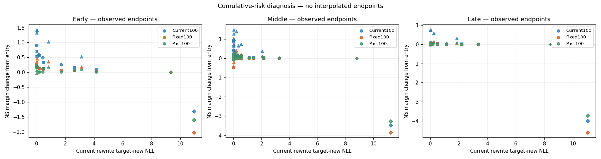

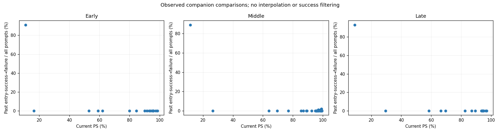

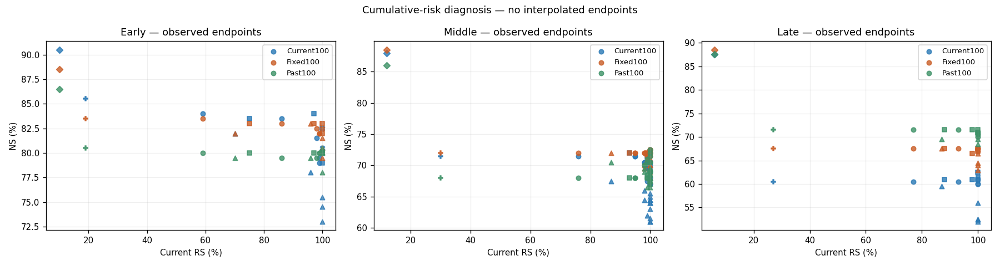

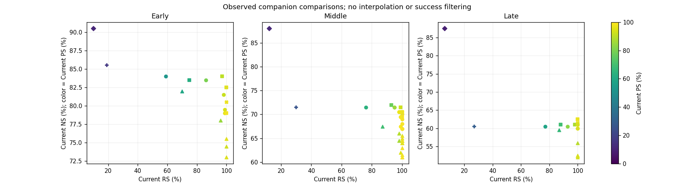

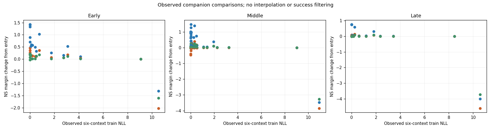

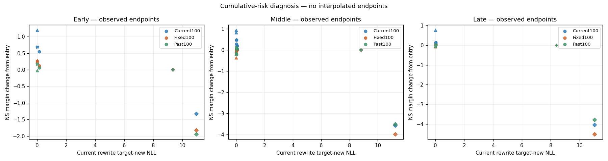

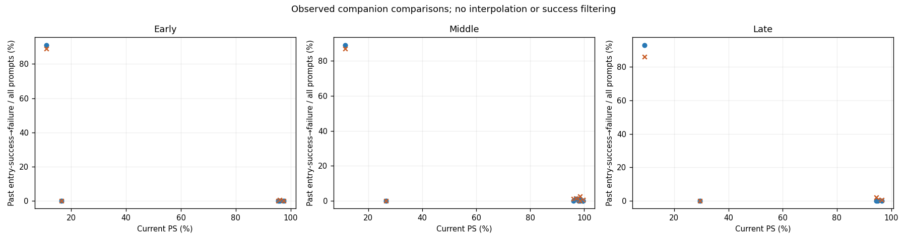

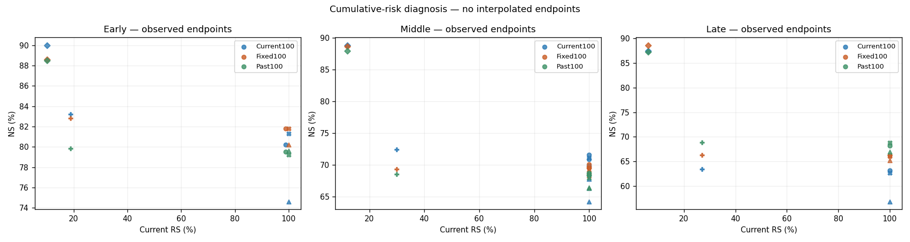

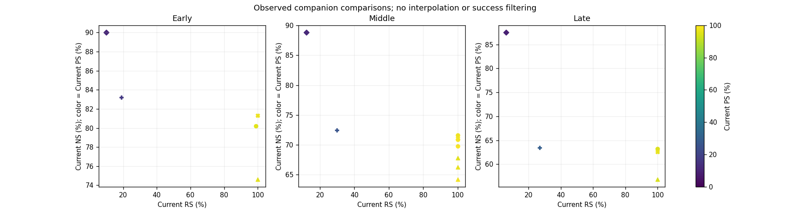

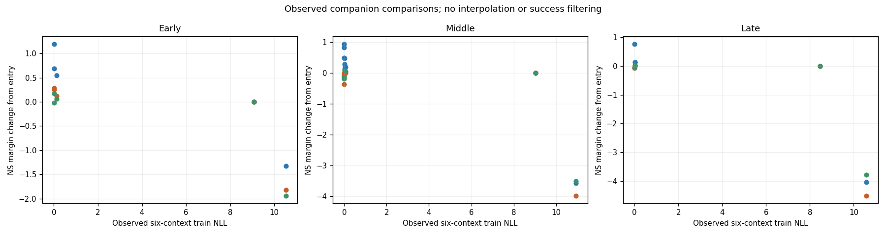

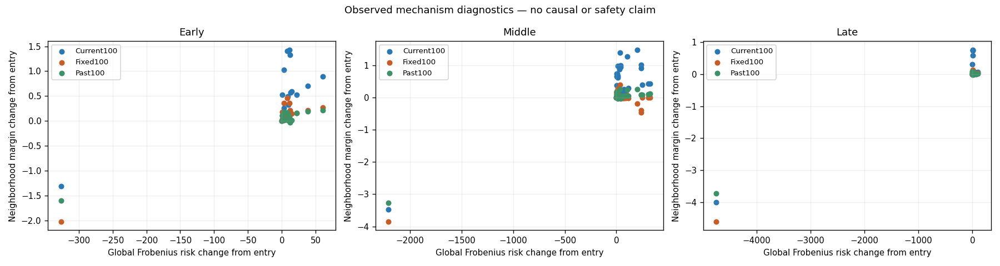

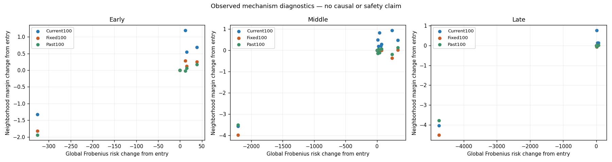

모든 PNG는 저장소 plotting.py를 실행하여 생성한다. 입력/명령/환경/출력 SHA 및 동일 입력 두 번 렌더링의 byte 일치는 figures/plot-reproduction.json에 기록한다. 기존 output을 덮어쓰지 않고 재현 시 새 output directory를 사용한다.

## 해석과 제한

- Early/Middle/Late는 다음 B100이 서로 다르므로 age만의 인과효과로 읽지 않는다.
- Native z cache hit 비용과 direct training 비용을 cold-native online speed 비교로 해석하지 않는다. 모델 load, preparation, evaluation, generation과 optimizer 시간을 분리한다.
- Norm의 합은 net norm이 아니며 native metric action은 Frobenius 제곱합이 아니다. 위험량 감소와 실제 Past/Fixed 성능 변화는 함께 해석한다.
- Curve에 없는 Past/Fixed PS는 미측정이다. 보간값이나 생성 점수로 채우지 않는다. Full endpoint에서 curve에 해당하는 실제 행만 추출한 경우 measurement_reuse=true이며 별도 model 평가나 추가 독립 분모가 아니다.
- 그림의 marker는 W0=diamond, ENTRY=filled plus, Native=X, native scaling=square, Direct-B=circle, Direct-C=triangle이다. 각 점의 exact endpoint와 해상도는 CSV에 결속한다.
- 손실 증가, risk 증가, 작은 gradient, strength 범위의 비중첩은 정상 관측이며 결과 제외나 다음 단계 차단 근거가 아니다.
- A만으로 누적위험 방향이나 refresh의 정보 가치를 결론내리지 않는다. 상위 B/C의 공통 native 출발점 비교가 아직 별도로 필요하다.
- 본 자동 factual table은 별도의 diagnostic discussion, direction/compute/metadata tables 및 requirements-evidence와 함께 읽는다. 없는 필드를 기록된 것으로 간주하지 않는다.

Scientific promotion=false.
