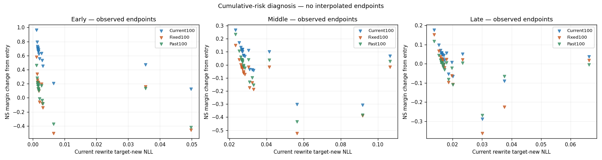
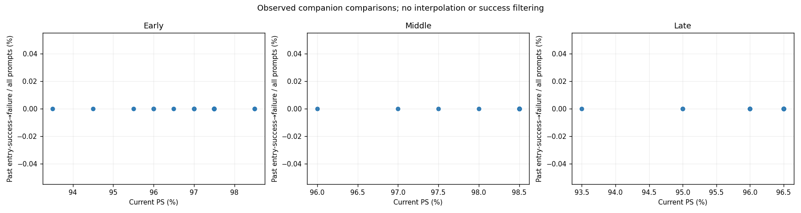
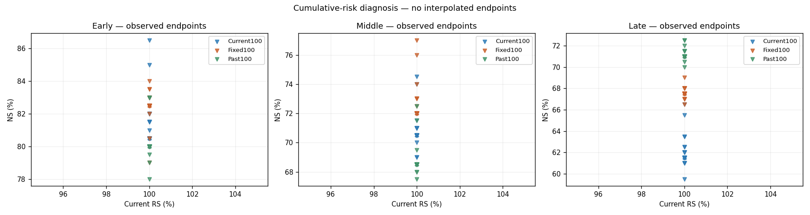
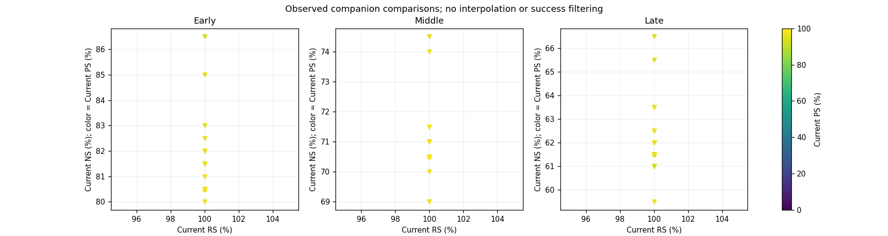
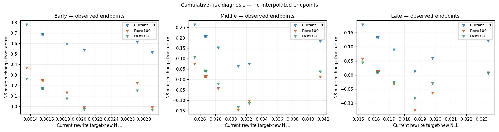
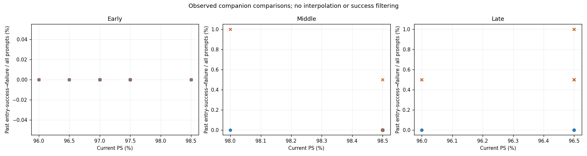
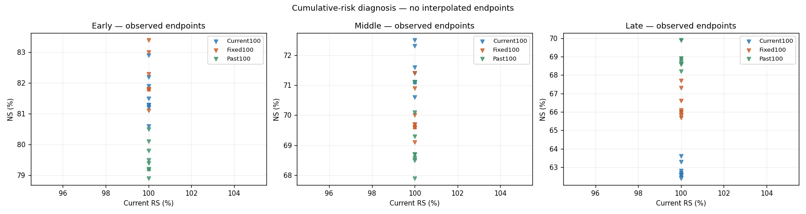
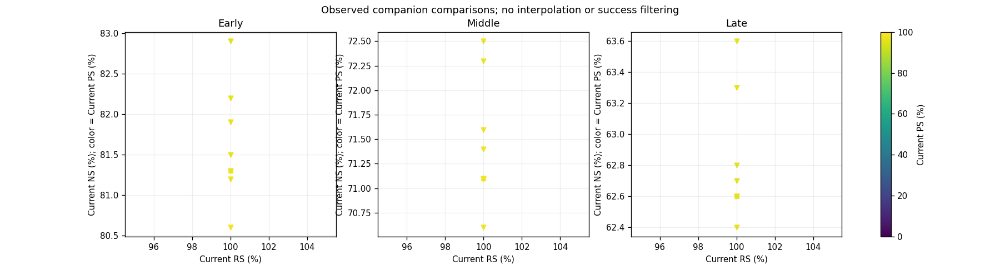
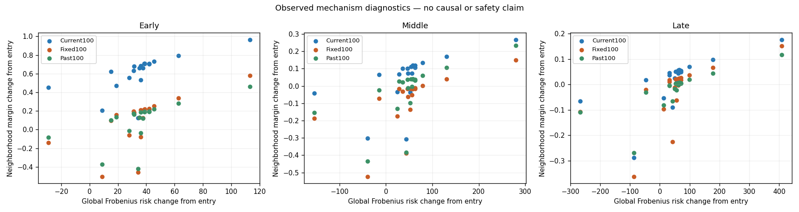
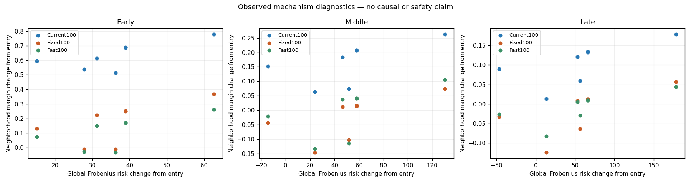

# 단일 layer 누적위험 진단 — 상위 B 사실 보고서

상태: COMPLETE; trials=63, nominal optimizer steps=0.

W0(원본), We(현재 batch 직전 historical checkpoint), WN(같은 entry의 native endpoint)를 구분한다. 모든 비교는 동일 request/prompt identity로 결속한다. ENTRY 대비 변화와 N 대비 변화는 별도 행이며 두 reference를 합산하여 분모를 늘리지 않는다.

inherited_margin=We−W0, additional_margin=post−We는 비교 reference와 무관하게 고정한다. N 대비 margin 변화는 reference_margin_delta에 따로 기록한다. N 대비 손실/회복 및 NLL delta의 분모/reference 역시 N 행에 명시한다.

RS/PS=new NLL<true NLL; NS=true NLL<new NLL; tie 실패. Full은 panel별 RS100/PS200/NS1000, 총3900쌍; curve는 RS300/CurrentPS200/neighbor600, 총1100쌍이다.

상위 B는 Direct-B support가 아니며, 상위 C도 Direct-C support와 다른 단계다. 낮은 성능·risk 증가·0 또는 미해결 방향은 결과에 남기고 자동 성공/안전성 판정에 사용하지 않는다.

## 방향 및 amplitude 계약

A에서 저장한 공통 WN에서 Current100을 metadata-only 10개 group으로 나누고 context-averaged NLL gradient를 한 번 계산한다. 정규화된 row/sqrt(10)로 J를 만든다. Sγ(g)=g−Jᵀ(JJᵀ+0.1I)⁻¹Jg는 soft filtering이며 Jd=0을 보장하지 않는다.

GF−/GF+/LF−/Random1/Random2/OP−/COV− 각각 native update Frobenius norm의 0.03/0.1/0.3으로 관측한다. GF+는 GF−의 정확한 반대다. Actual FP32 norm은 intended norm과 분리한다. 0 또는 수치적으로 미해결 방향을 강제로 증폭하지 않는다. N은 A의 측정값을 재사용하며 신규 trial로 중복 집계하지 않는다.

모든 trial의 curve를 관측하고, 미리 정한 amplitude0.1만 full로 관측한다. Full에서 포함된 curve rows를 다시 평가하지 않는다. Native scaling과 LF− 비교는 현재 update 축소 효과를 구분하는 보조 증거다.

GF 부호쌍의 중심차분과 curvature는 GF− 방향의 intended physical epsilon 기준이다. Actual rounded update norm과 함께 해석한다. RS/NS의 미분 또는 단일 amplitude로 일반적인 인과효과를 주장하지 않는다.

## Full endpoint — 실제 전체 분모

### Early

| endpoint | panel | RS | PS | NS | rewrite TF exact | rephrase TF exact | neighbor true TF exact |
| --- | --- | --- | --- | --- | --- | --- | --- |
| N_REUSED | Current100 | 100/100 (100.00%) | 195/200 (97.50%) | 813/1000 (81.30%) | 100/100 | 138/200 | 190/1000 |
| N_REUSED | Fixed100 | 100/100 (100.00%) | 194/200 (97.00%) | 818/1000 (81.80%) | 99/100 | 133/200 | 133/1000 |
| N_REUSED | Past100 | 100/100 (100.00%) | 198/200 (99.00%) | 792/1000 (79.20%) | 100/100 | 126/200 | 167/1000 |
| COVminus-amplitude-0.1/eval | Current100 | 100/100 (100.00%) | 193/200 (96.50%) | 822/1000 (82.20%) | 100/100 | 133/200 | 195/1000 |
| COVminus-amplitude-0.1/eval | Fixed100 | 100/100 (100.00%) | 191/200 (95.50%) | 830/1000 (83.00%) | 99/100 | 128/200 | 141/1000 |
| COVminus-amplitude-0.1/eval | Past100 | 100/100 (100.00%) | 198/200 (99.00%) | 801/1000 (80.10%) | 100/100 | 126/200 | 165/1000 |
| GFminus-amplitude-0.1/eval | Current100 | 100/100 (100.00%) | 194/200 (97.00%) | 819/1000 (81.90%) | 100/100 | 138/200 | 194/1000 |
| GFminus-amplitude-0.1/eval | Fixed100 | 100/100 (100.00%) | 193/200 (96.50%) | 823/1000 (82.30%) | 99/100 | 131/200 | 137/1000 |
| GFminus-amplitude-0.1/eval | Past100 | 100/100 (100.00%) | 198/200 (99.00%) | 798/1000 (79.80%) | 100/100 | 126/200 | 170/1000 |
| GFplus-amplitude-0.1/eval | Current100 | 100/100 (100.00%) | 197/200 (98.50%) | 806/1000 (80.60%) | 100/100 | 138/200 | 180/1000 |
| GFplus-amplitude-0.1/eval | Fixed100 | 100/100 (100.00%) | 194/200 (97.00%) | 811/1000 (81.10%) | 99/100 | 135/200 | 131/1000 |
| GFplus-amplitude-0.1/eval | Past100 | 100/100 (100.00%) | 198/200 (99.00%) | 789/1000 (78.90%) | 100/100 | 126/200 | 165/1000 |
| LFminus-amplitude-0.1/eval | Current100 | 100/100 (100.00%) | 194/200 (97.00%) | 815/1000 (81.50%) | 100/100 | 136/200 | 190/1000 |
| LFminus-amplitude-0.1/eval | Fixed100 | 100/100 (100.00%) | 194/200 (97.00%) | 818/1000 (81.80%) | 99/100 | 133/200 | 132/1000 |
| LFminus-amplitude-0.1/eval | Past100 | 100/100 (100.00%) | 198/200 (99.00%) | 795/1000 (79.50%) | 100/100 | 126/200 | 168/1000 |
| OPminus-amplitude-0.1/eval | Current100 | 100/100 (100.00%) | 192/200 (96.00%) | 829/1000 (82.90%) | 100/100 | 132/200 | 196/1000 |
| OPminus-amplitude-0.1/eval | Fixed100 | 100/100 (100.00%) | 192/200 (96.00%) | 834/1000 (83.40%) | 99/100 | 129/200 | 141/1000 |
| OPminus-amplitude-0.1/eval | Past100 | 100/100 (100.00%) | 198/200 (99.00%) | 805/1000 (80.50%) | 100/100 | 124/200 | 170/1000 |
| Random1-amplitude-0.1/eval | Current100 | 100/100 (100.00%) | 195/200 (97.50%) | 813/1000 (81.30%) | 100/100 | 138/200 | 191/1000 |
| Random1-amplitude-0.1/eval | Fixed100 | 100/100 (100.00%) | 194/200 (97.00%) | 818/1000 (81.80%) | 99/100 | 133/200 | 134/1000 |
| Random1-amplitude-0.1/eval | Past100 | 100/100 (100.00%) | 198/200 (99.00%) | 792/1000 (79.20%) | 100/100 | 126/200 | 168/1000 |
| Random2-amplitude-0.1/eval | Current100 | 100/100 (100.00%) | 195/200 (97.50%) | 812/1000 (81.20%) | 100/100 | 138/200 | 191/1000 |
| Random2-amplitude-0.1/eval | Fixed100 | 100/100 (100.00%) | 194/200 (97.00%) | 818/1000 (81.80%) | 99/100 | 133/200 | 133/1000 |
| Random2-amplitude-0.1/eval | Past100 | 100/100 (100.00%) | 198/200 (99.00%) | 794/1000 (79.40%) | 100/100 | 126/200 | 166/1000 |

### Middle

| endpoint | panel | RS | PS | NS | rewrite TF exact | rephrase TF exact | neighbor true TF exact |
| --- | --- | --- | --- | --- | --- | --- | --- |
| N_REUSED | Current100 | 100/100 (100.00%) | 197/200 (98.50%) | 711/1000 (71.10%) | 99/100 | 149/200 | 101/1000 |
| N_REUSED | Fixed100 | 100/100 (100.00%) | 194/200 (97.00%) | 696/1000 (69.60%) | 97/100 | 134/200 | 79/1000 |
| N_REUSED | Past100 | 100/100 (100.00%) | 193/200 (96.50%) | 686/1000 (68.60%) | 99/100 | 137/200 | 113/1000 |
| COVminus-amplitude-0.1/eval | Current100 | 100/100 (100.00%) | 197/200 (98.50%) | 725/1000 (72.50%) | 99/100 | 145/200 | 108/1000 |
| COVminus-amplitude-0.1/eval | Fixed100 | 99/100 (99.00%) | 193/200 (96.50%) | 714/1000 (71.40%) | 97/100 | 130/200 | 88/1000 |
| COVminus-amplitude-0.1/eval | Past100 | 100/100 (100.00%) | 192/200 (96.00%) | 701/1000 (70.10%) | 100/100 | 134/200 | 112/1000 |
| GFminus-amplitude-0.1/eval | Current100 | 100/100 (100.00%) | 197/200 (98.50%) | 716/1000 (71.60%) | 99/100 | 149/200 | 104/1000 |
| GFminus-amplitude-0.1/eval | Fixed100 | 100/100 (100.00%) | 194/200 (97.00%) | 700/1000 (70.00%) | 97/100 | 133/200 | 82/1000 |
| GFminus-amplitude-0.1/eval | Past100 | 100/100 (100.00%) | 193/200 (96.50%) | 693/1000 (69.30%) | 99/100 | 137/200 | 114/1000 |
| GFplus-amplitude-0.1/eval | Current100 | 100/100 (100.00%) | 197/200 (98.50%) | 706/1000 (70.60%) | 99/100 | 149/200 | 100/1000 |
| GFplus-amplitude-0.1/eval | Fixed100 | 100/100 (100.00%) | 195/200 (97.50%) | 691/1000 (69.10%) | 97/100 | 135/200 | 73/1000 |
| GFplus-amplitude-0.1/eval | Past100 | 100/100 (100.00%) | 193/200 (96.50%) | 679/1000 (67.90%) | 99/100 | 138/200 | 109/1000 |
| LFminus-amplitude-0.1/eval | Current100 | 100/100 (100.00%) | 197/200 (98.50%) | 714/1000 (71.40%) | 99/100 | 148/200 | 103/1000 |
| LFminus-amplitude-0.1/eval | Fixed100 | 100/100 (100.00%) | 194/200 (97.00%) | 697/1000 (69.70%) | 97/100 | 134/200 | 79/1000 |
| LFminus-amplitude-0.1/eval | Past100 | 100/100 (100.00%) | 193/200 (96.50%) | 685/1000 (68.50%) | 99/100 | 138/200 | 112/1000 |
| OPminus-amplitude-0.1/eval | Current100 | 100/100 (100.00%) | 196/200 (98.00%) | 723/1000 (72.30%) | 99/100 | 143/200 | 101/1000 |
| OPminus-amplitude-0.1/eval | Fixed100 | 100/100 (100.00%) | 194/200 (97.00%) | 709/1000 (70.90%) | 97/100 | 133/200 | 85/1000 |
| OPminus-amplitude-0.1/eval | Past100 | 100/100 (100.00%) | 191/200 (95.50%) | 711/1000 (71.10%) | 99/100 | 132/200 | 111/1000 |
| Random1-amplitude-0.1/eval | Current100 | 100/100 (100.00%) | 197/200 (98.50%) | 711/1000 (71.10%) | 99/100 | 149/200 | 101/1000 |
| Random1-amplitude-0.1/eval | Fixed100 | 100/100 (100.00%) | 194/200 (97.00%) | 697/1000 (69.70%) | 97/100 | 134/200 | 78/1000 |
| Random1-amplitude-0.1/eval | Past100 | 100/100 (100.00%) | 193/200 (96.50%) | 687/1000 (68.70%) | 99/100 | 139/200 | 113/1000 |
| Random2-amplitude-0.1/eval | Current100 | 100/100 (100.00%) | 197/200 (98.50%) | 711/1000 (71.10%) | 99/100 | 149/200 | 102/1000 |
| Random2-amplitude-0.1/eval | Fixed100 | 100/100 (100.00%) | 194/200 (97.00%) | 696/1000 (69.60%) | 97/100 | 134/200 | 79/1000 |
| Random2-amplitude-0.1/eval | Past100 | 100/100 (100.00%) | 193/200 (96.50%) | 687/1000 (68.70%) | 99/100 | 138/200 | 113/1000 |

### Late

| endpoint | panel | RS | PS | NS | rewrite TF exact | rephrase TF exact | neighbor true TF exact |
| --- | --- | --- | --- | --- | --- | --- | --- |
| N_REUSED | Current100 | 100/100 (100.00%) | 193/200 (96.50%) | 626/1000 (62.60%) | 100/100 | 146/200 | 74/1000 |
| N_REUSED | Fixed100 | 99/100 (99.00%) | 191/200 (95.50%) | 660/1000 (66.00%) | 88/100 | 117/200 | 55/1000 |
| N_REUSED | Past100 | 100/100 (100.00%) | 191/200 (95.50%) | 688/1000 (68.80%) | 98/100 | 135/200 | 90/1000 |
| COVminus-amplitude-0.1/eval | Current100 | 100/100 (100.00%) | 193/200 (96.50%) | 636/1000 (63.60%) | 100/100 | 143/200 | 80/1000 |
| COVminus-amplitude-0.1/eval | Fixed100 | 98/100 (98.00%) | 190/200 (95.00%) | 677/1000 (67.70%) | 88/100 | 117/200 | 64/1000 |
| COVminus-amplitude-0.1/eval | Past100 | 100/100 (100.00%) | 190/200 (95.00%) | 699/1000 (69.90%) | 98/100 | 133/200 | 87/1000 |
| GFminus-amplitude-0.1/eval | Current100 | 100/100 (100.00%) | 192/200 (96.00%) | 627/1000 (62.70%) | 100/100 | 144/200 | 76/1000 |
| GFminus-amplitude-0.1/eval | Fixed100 | 98/100 (98.00%) | 191/200 (95.50%) | 666/1000 (66.60%) | 87/100 | 117/200 | 58/1000 |
| GFminus-amplitude-0.1/eval | Past100 | 100/100 (100.00%) | 191/200 (95.50%) | 689/1000 (68.90%) | 98/100 | 134/200 | 89/1000 |
| GFplus-amplitude-0.1/eval | Current100 | 100/100 (100.00%) | 193/200 (96.50%) | 624/1000 (62.40%) | 100/100 | 146/200 | 74/1000 |
| GFplus-amplitude-0.1/eval | Fixed100 | 99/100 (99.00%) | 189/200 (94.50%) | 657/1000 (65.70%) | 87/100 | 115/200 | 52/1000 |
| GFplus-amplitude-0.1/eval | Past100 | 100/100 (100.00%) | 191/200 (95.50%) | 682/1000 (68.20%) | 97/100 | 135/200 | 90/1000 |
| LFminus-amplitude-0.1/eval | Current100 | 100/100 (100.00%) | 192/200 (96.00%) | 626/1000 (62.60%) | 99/100 | 142/200 | 74/1000 |
| LFminus-amplitude-0.1/eval | Fixed100 | 99/100 (99.00%) | 191/200 (95.50%) | 660/1000 (66.00%) | 88/100 | 117/200 | 56/1000 |
| LFminus-amplitude-0.1/eval | Past100 | 100/100 (100.00%) | 191/200 (95.50%) | 686/1000 (68.60%) | 98/100 | 136/200 | 89/1000 |
| OPminus-amplitude-0.1/eval | Current100 | 100/100 (100.00%) | 193/200 (96.50%) | 633/1000 (63.30%) | 100/100 | 140/200 | 74/1000 |
| OPminus-amplitude-0.1/eval | Fixed100 | 99/100 (99.00%) | 191/200 (95.50%) | 673/1000 (67.30%) | 89/100 | 117/200 | 60/1000 |
| OPminus-amplitude-0.1/eval | Past100 | 100/100 (100.00%) | 190/200 (95.00%) | 699/1000 (69.90%) | 98/100 | 132/200 | 90/1000 |
| Random1-amplitude-0.1/eval | Current100 | 100/100 (100.00%) | 193/200 (96.50%) | 628/1000 (62.80%) | 100/100 | 145/200 | 74/1000 |
| Random1-amplitude-0.1/eval | Fixed100 | 99/100 (99.00%) | 191/200 (95.50%) | 658/1000 (65.80%) | 88/100 | 117/200 | 55/1000 |
| Random1-amplitude-0.1/eval | Past100 | 100/100 (100.00%) | 191/200 (95.50%) | 686/1000 (68.60%) | 98/100 | 136/200 | 90/1000 |
| Random2-amplitude-0.1/eval | Current100 | 100/100 (100.00%) | 193/200 (96.50%) | 626/1000 (62.60%) | 100/100 | 146/200 | 74/1000 |
| Random2-amplitude-0.1/eval | Fixed100 | 99/100 (99.00%) | 191/200 (95.50%) | 661/1000 (66.10%) | 88/100 | 117/200 | 55/1000 |
| Random2-amplitude-0.1/eval | Past100 | 100/100 (100.00%) | 191/200 (95.50%) | 689/1000 (68.90%) | 98/100 | 135/200 | 90/1000 |

## Paired NLL와 loss/recovery

| entry | endpoint | reference | panel | metric | new mean/median/p90/max | true mean/median/p90/max | 성공→실패 | 실패→성공 |
| --- | --- | --- | --- | --- | --- | --- | --- | --- |
| Early | N_REUSED | ENTRY | Current100 | NS | 8.91590/8.85771/13.49575/20.93843 | 5.21074/4.78219/10.10343/17.63714 | 31/832 | 12/168 |
| Early | N_REUSED | ENTRY | Current100 | PS | 1.62719/0.18516/5.21841/18.10067 | 10.35143/10.03425/15.28184/20.80249 | 0/33 | 162/167 |
| Early | N_REUSED | ENTRY | Current100 | RS | 0.00155/0.00109/0.00322/0.00868 | 14.55925/14.74846/19.03678/25.31846 | 0/19 | 81/81 |
| Early | N_REUSED | ENTRY | Fixed100 | NS | 9.74081/9.59242/14.86679/23.81164 | 5.65314/5.25955/10.42879/23.15910 | 17/828 | 7/172 |
| Early | N_REUSED | ENTRY | Fixed100 | PS | 1.43247/0.34660/4.12997/9.13302 | 9.90363/9.48228/14.61824/21.41036 | 0/193 | 1/7 |
| Early | N_REUSED | ENTRY | Fixed100 | RS | 0.05603/0.00209/0.00911/4.56467 | 14.05918/14.39023/19.42504/26.44696 | 0/100 | 0/0 |
| Early | N_REUSED | ENTRY | Past100 | NS | 8.99173/9.02326/13.61647/21.45881 | 5.40271/4.97084/10.69941/18.02667 | 15/798 | 9/202 |
| Early | N_REUSED | ENTRY | Past100 | PS | 1.66737/0.35857/5.31021/10.85005 | 10.29229/9.91942/15.05583/22.42913 | 0/198 | 0/2 |
| Early | N_REUSED | ENTRY | Past100 | RS | 0.00233/0.00117/0.00444/0.03062 | 14.64147/14.50094/19.08499/26.06043 | 0/100 | 0/0 |
| Early | N_REUSED | N | Current100 | NS | 8.91590/8.85771/13.49575/20.93843 | 5.21074/4.78219/10.10343/17.63714 | 0/813 | 0/187 |
| Early | N_REUSED | N | Current100 | PS | 1.62719/0.18516/5.21841/18.10067 | 10.35143/10.03425/15.28184/20.80249 | 0/195 | 0/5 |
| Early | N_REUSED | N | Current100 | RS | 0.00155/0.00109/0.00322/0.00868 | 14.55925/14.74846/19.03678/25.31846 | 0/100 | 0/0 |
| Early | N_REUSED | N | Fixed100 | NS | 9.74081/9.59242/14.86679/23.81164 | 5.65314/5.25955/10.42879/23.15910 | 0/818 | 0/182 |
| Early | N_REUSED | N | Fixed100 | PS | 1.43247/0.34660/4.12997/9.13302 | 9.90363/9.48228/14.61824/21.41036 | 0/194 | 0/6 |
| Early | N_REUSED | N | Fixed100 | RS | 0.05603/0.00209/0.00911/4.56467 | 14.05918/14.39023/19.42504/26.44696 | 0/100 | 0/0 |
| Early | N_REUSED | N | Past100 | NS | 8.99173/9.02326/13.61647/21.45881 | 5.40271/4.97084/10.69941/18.02667 | 0/792 | 0/208 |
| Early | N_REUSED | N | Past100 | PS | 1.66737/0.35857/5.31021/10.85005 | 10.29229/9.91942/15.05583/22.42913 | 0/198 | 0/2 |
| Early | N_REUSED | N | Past100 | RS | 0.00233/0.00117/0.00444/0.03062 | 14.64147/14.50094/19.08499/26.06043 | 0/100 | 0/0 |
| Early | COVminus-amplitude-0.1/eval | ENTRY | Current100 | NS | 9.00197/8.92532/13.49332/20.48372 | 5.14679/4.74452/10.05900/17.49176 | 29/832 | 19/168 |
| Early | COVminus-amplitude-0.1/eval | ENTRY | Current100 | PS | 1.68503/0.27288/5.26448/16.85761 | 10.02308/9.72964/15.03459/20.32552 | 0/33 | 160/167 |
| Early | COVminus-amplitude-0.1/eval | ENTRY | Current100 | RS | 0.00207/0.00143/0.00442/0.01154 | 14.15386/14.30009/18.80721/24.15510 | 0/19 | 81/81 |
| Early | COVminus-amplitude-0.1/eval | ENTRY | Fixed100 | NS | 9.92836/9.77469/14.93386/22.95167 | 5.58132/5.15442/10.43842/23.27431 | 8/828 | 10/172 |
| Early | COVminus-amplitude-0.1/eval | ENTRY | Fixed100 | PS | 1.59219/0.40356/4.62540/9.71944 | 9.60474/9.19673/14.25760/21.81198 | 2/193 | 0/7 |
| Early | COVminus-amplitude-0.1/eval | ENTRY | Fixed100 | RS | 0.05484/0.00243/0.00903/4.22916 | 13.81947/14.25724/19.47146/26.81606 | 0/100 | 0/0 |
| Early | COVminus-amplitude-0.1/eval | ENTRY | Past100 | NS | 9.14369/9.24619/13.85483/21.67011 | 5.35674/4.89005/10.50893/17.37990 | 11/798 | 14/202 |
| Early | COVminus-amplitude-0.1/eval | ENTRY | Past100 | PS | 1.75118/0.42954/5.39732/10.98149 | 9.98052/9.91883/14.98929/21.56746 | 0/198 | 0/2 |
| Early | COVminus-amplitude-0.1/eval | ENTRY | Past100 | RS | 0.00284/0.00148/0.00574/0.03382 | 14.27390/13.67918/18.69344/25.59851 | 0/100 | 0/0 |
| Early | COVminus-amplitude-0.1/eval | N | Current100 | NS | 9.00197/8.92532/13.49332/20.48372 | 5.14679/4.74452/10.05900/17.49176 | 6/813 | 15/187 |
| Early | COVminus-amplitude-0.1/eval | N | Current100 | PS | 1.68503/0.27288/5.26448/16.85761 | 10.02308/9.72964/15.03459/20.32552 | 2/195 | 0/5 |
| Early | COVminus-amplitude-0.1/eval | N | Current100 | RS | 0.00207/0.00143/0.00442/0.01154 | 14.15386/14.30009/18.80721/24.15510 | 0/100 | 0/0 |
| Early | COVminus-amplitude-0.1/eval | N | Fixed100 | NS | 9.92836/9.77469/14.93386/22.95167 | 5.58132/5.15442/10.43842/23.27431 | 2/818 | 14/182 |
| Early | COVminus-amplitude-0.1/eval | N | Fixed100 | PS | 1.59219/0.40356/4.62540/9.71944 | 9.60474/9.19673/14.25760/21.81198 | 3/194 | 0/6 |
| Early | COVminus-amplitude-0.1/eval | N | Fixed100 | RS | 0.05484/0.00243/0.00903/4.22916 | 13.81947/14.25724/19.47146/26.81606 | 0/100 | 0/0 |
| Early | COVminus-amplitude-0.1/eval | N | Past100 | NS | 9.14369/9.24619/13.85483/21.67011 | 5.35674/4.89005/10.50893/17.37990 | 4/792 | 13/208 |
| Early | COVminus-amplitude-0.1/eval | N | Past100 | PS | 1.75118/0.42954/5.39732/10.98149 | 9.98052/9.91883/14.98929/21.56746 | 0/198 | 0/2 |
| Early | COVminus-amplitude-0.1/eval | N | Past100 | RS | 0.00284/0.00148/0.00574/0.03382 | 14.27390/13.67918/18.69344/25.59851 | 0/100 | 0/0 |
| Early | GFminus-amplitude-0.1/eval | ENTRY | Current100 | NS | 8.96111/8.88792/13.53612/20.53497 | 5.16465/4.76239/10.11789/17.43199 | 27/832 | 14/168 |
| Early | GFminus-amplitude-0.1/eval | ENTRY | Current100 | PS | 1.65682/0.19510/5.28330/18.04469 | 10.17780/9.91760/15.13837/20.58018 | 0/33 | 161/167 |
| Early | GFminus-amplitude-0.1/eval | ENTRY | Current100 | RS | 0.00185/0.00133/0.00468/0.00984 | 14.30519/14.52752/18.97560/24.82500 | 0/19 | 81/81 |
| Early | GFminus-amplitude-0.1/eval | ENTRY | Fixed100 | NS | 9.80710/9.64411/14.89851/23.28749 | 5.60224/5.20390/10.44894/23.11856 | 14/828 | 9/172 |
| Early | GFminus-amplitude-0.1/eval | ENTRY | Fixed100 | PS | 1.49381/0.38463/4.45775/9.16679 | 9.74841/9.40924/14.55676/21.33709 | 0/193 | 0/7 |
| Early | GFminus-amplitude-0.1/eval | ENTRY | Fixed100 | RS | 0.05931/0.00250/0.00862/4.37120 | 13.82227/14.18715/19.36443/26.16261 | 0/100 | 0/0 |
| Early | GFminus-amplitude-0.1/eval | ENTRY | Past100 | NS | 9.05319/9.07424/13.71572/21.52532 | 5.36916/4.95196/10.59673/17.47547 | 12/798 | 12/202 |
| Early | GFminus-amplitude-0.1/eval | ENTRY | Past100 | PS | 1.70087/0.38544/5.19582/10.85763 | 10.12305/9.98493/14.84903/22.02563 | 0/198 | 0/2 |
| Early | GFminus-amplitude-0.1/eval | ENTRY | Past100 | RS | 0.00287/0.00139/0.00534/0.04465 | 14.38165/14.12663/18.84978/25.63947 | 0/100 | 0/0 |
| Early | GFminus-amplitude-0.1/eval | N | Current100 | NS | 8.96111/8.88792/13.53612/20.53497 | 5.16465/4.76239/10.11789/17.43199 | 0/813 | 6/187 |
| Early | GFminus-amplitude-0.1/eval | N | Current100 | PS | 1.65682/0.19510/5.28330/18.04469 | 10.17780/9.91760/15.13837/20.58018 | 1/195 | 0/5 |
| Early | GFminus-amplitude-0.1/eval | N | Current100 | RS | 0.00185/0.00133/0.00468/0.00984 | 14.30519/14.52752/18.97560/24.82500 | 0/100 | 0/0 |
| Early | GFminus-amplitude-0.1/eval | N | Fixed100 | NS | 9.80710/9.64411/14.89851/23.28749 | 5.60224/5.20390/10.44894/23.11856 | 0/818 | 5/182 |
| Early | GFminus-amplitude-0.1/eval | N | Fixed100 | PS | 1.49381/0.38463/4.45775/9.16679 | 9.74841/9.40924/14.55676/21.33709 | 1/194 | 0/6 |
| Early | GFminus-amplitude-0.1/eval | N | Fixed100 | RS | 0.05931/0.00250/0.00862/4.37120 | 13.82227/14.18715/19.36443/26.16261 | 0/100 | 0/0 |
| Early | GFminus-amplitude-0.1/eval | N | Past100 | NS | 9.05319/9.07424/13.71572/21.52532 | 5.36916/4.95196/10.59673/17.47547 | 1/792 | 7/208 |
| Early | GFminus-amplitude-0.1/eval | N | Past100 | PS | 1.70087/0.38544/5.19582/10.85763 | 10.12305/9.98493/14.84903/22.02563 | 0/198 | 0/2 |
| Early | GFminus-amplitude-0.1/eval | N | Past100 | RS | 0.00287/0.00139/0.00534/0.04465 | 14.38165/14.12663/18.84978/25.63947 | 0/100 | 0/0 |
| Early | GFplus-amplitude-0.1/eval | ENTRY | Current100 | NS | 8.87296/8.80096/13.55889/21.29886 | 5.25901/4.87354/10.17257/17.95364 | 38/832 | 12/168 |
| Early | GFplus-amplitude-0.1/eval | ENTRY | Current100 | PS | 1.60050/0.16576/5.17221/18.12089 | 10.51007/10.12663/15.53871/21.07383 | 0/33 | 164/167 |
| Early | GFplus-amplitude-0.1/eval | ENTRY | Current100 | RS | 0.00135/0.00086/0.00276/0.00794 | 14.77738/14.89363/19.08115/25.70696 | 0/19 | 81/81 |
| Early | GFplus-amplitude-0.1/eval | ENTRY | Fixed100 | NS | 9.67821/9.55318/14.81192/24.28604 | 5.70793/5.32965/10.49134/23.17579 | 23/828 | 6/172 |
| Early | GFplus-amplitude-0.1/eval | ENTRY | Fixed100 | PS | 1.38141/0.34818/4.08246/9.10884 | 10.04783/9.70338/14.89914/21.47921 | 0/193 | 1/7 |
| Early | GFplus-amplitude-0.1/eval | ENTRY | Fixed100 | RS | 0.05494/0.00169/0.00925/4.74666 | 14.26875/14.43797/19.62667/26.70318 | 0/100 | 0/0 |
| Early | GFplus-amplitude-0.1/eval | ENTRY | Past100 | NS | 8.93349/8.92461/13.58024/21.39427 | 5.43777/5.06936/10.71997/19.84337 | 17/798 | 8/202 |
| Early | GFplus-amplitude-0.1/eval | ENTRY | Past100 | PS | 1.63922/0.32200/5.31668/10.82295 | 10.45001/10.25275/15.21111/22.78297 | 0/198 | 0/2 |
| Early | GFplus-amplitude-0.1/eval | ENTRY | Past100 | RS | 0.00199/0.00102/0.00388/0.02856 | 14.86749/14.82824/19.41512/26.28435 | 0/100 | 0/0 |
| Early | GFplus-amplitude-0.1/eval | N | Current100 | NS | 8.87296/8.80096/13.55889/21.29886 | 5.25901/4.87354/10.17257/17.95364 | 8/813 | 1/187 |
| Early | GFplus-amplitude-0.1/eval | N | Current100 | PS | 1.60050/0.16576/5.17221/18.12089 | 10.51007/10.12663/15.53871/21.07383 | 0/195 | 2/5 |
| Early | GFplus-amplitude-0.1/eval | N | Current100 | RS | 0.00135/0.00086/0.00276/0.00794 | 14.77738/14.89363/19.08115/25.70696 | 0/100 | 0/0 |
| Early | GFplus-amplitude-0.1/eval | N | Fixed100 | NS | 9.67821/9.55318/14.81192/24.28604 | 5.70793/5.32965/10.49134/23.17579 | 7/818 | 0/182 |
| Early | GFplus-amplitude-0.1/eval | N | Fixed100 | PS | 1.38141/0.34818/4.08246/9.10884 | 10.04783/9.70338/14.89914/21.47921 | 0/194 | 0/6 |
| Early | GFplus-amplitude-0.1/eval | N | Fixed100 | RS | 0.05494/0.00169/0.00925/4.74666 | 14.26875/14.43797/19.62667/26.70318 | 0/100 | 0/0 |
| Early | GFplus-amplitude-0.1/eval | N | Past100 | NS | 8.93349/8.92461/13.58024/21.39427 | 5.43777/5.06936/10.71997/19.84337 | 3/792 | 0/208 |
| Early | GFplus-amplitude-0.1/eval | N | Past100 | PS | 1.63922/0.32200/5.31668/10.82295 | 10.45001/10.25275/15.21111/22.78297 | 0/198 | 0/2 |
| Early | GFplus-amplitude-0.1/eval | N | Past100 | RS | 0.00199/0.00102/0.00388/0.02856 | 14.86749/14.82824/19.41512/26.28435 | 0/100 | 0/0 |
| Early | LFminus-amplitude-0.1/eval | ENTRY | Current100 | NS | 8.96611/8.88914/13.53154/21.13048 | 5.18715/4.78559/10.11236/17.64584 | 29/832 | 12/168 |
| Early | LFminus-amplitude-0.1/eval | ENTRY | Current100 | PS | 1.69359/0.22695/5.33709/18.53288 | 9.99569/9.79045/14.81042/20.57472 | 0/33 | 161/167 |
| Early | LFminus-amplitude-0.1/eval | ENTRY | Current100 | RS | 0.00272/0.00156/0.00539/0.02102 | 13.93886/14.14070/18.76307/24.51124 | 0/19 | 81/81 |
| Early | LFminus-amplitude-0.1/eval | ENTRY | Fixed100 | NS | 9.75727/9.62365/14.87435/23.11792 | 5.64206/5.23000/10.44642/23.25168 | 17/828 | 7/172 |
| Early | LFminus-amplitude-0.1/eval | ENTRY | Fixed100 | PS | 1.42582/0.34453/4.13590/9.13303 | 9.91682/9.47804/14.69302/21.47081 | 0/193 | 1/7 |
| Early | LFminus-amplitude-0.1/eval | ENTRY | Fixed100 | RS | 0.05612/0.00205/0.00920/4.62759 | 14.09272/14.41045/19.43337/26.45752 | 0/100 | 0/0 |
| Early | LFminus-amplitude-0.1/eval | ENTRY | Past100 | NS | 9.00220/9.00283/13.66298/21.49515 | 5.39355/4.96839/10.61414/18.06012 | 12/798 | 9/202 |
| Early | LFminus-amplitude-0.1/eval | ENTRY | Past100 | PS | 1.66537/0.34624/5.23267/10.85370 | 10.31102/9.98753/15.09057/22.46363 | 0/198 | 0/2 |
| Early | LFminus-amplitude-0.1/eval | ENTRY | Past100 | RS | 0.00228/0.00114/0.00432/0.03017 | 14.66467/14.51504/19.10985/26.08666 | 0/100 | 0/0 |
| Early | LFminus-amplitude-0.1/eval | N | Current100 | NS | 8.96611/8.88914/13.53154/21.13048 | 5.18715/4.78559/10.11236/17.64584 | 0/813 | 2/187 |
| Early | LFminus-amplitude-0.1/eval | N | Current100 | PS | 1.69359/0.22695/5.33709/18.53288 | 9.99569/9.79045/14.81042/20.57472 | 1/195 | 0/5 |
| Early | LFminus-amplitude-0.1/eval | N | Current100 | RS | 0.00272/0.00156/0.00539/0.02102 | 13.93886/14.14070/18.76307/24.51124 | 0/100 | 0/0 |
| Early | LFminus-amplitude-0.1/eval | N | Fixed100 | NS | 9.75727/9.62365/14.87435/23.11792 | 5.64206/5.23000/10.44642/23.25168 | 0/818 | 0/182 |
| Early | LFminus-amplitude-0.1/eval | N | Fixed100 | PS | 1.42582/0.34453/4.13590/9.13303 | 9.91682/9.47804/14.69302/21.47081 | 0/194 | 0/6 |
| Early | LFminus-amplitude-0.1/eval | N | Fixed100 | RS | 0.05612/0.00205/0.00920/4.62759 | 14.09272/14.41045/19.43337/26.45752 | 0/100 | 0/0 |
| Early | LFminus-amplitude-0.1/eval | N | Past100 | NS | 9.00220/9.00283/13.66298/21.49515 | 5.39355/4.96839/10.61414/18.06012 | 0/792 | 3/208 |
| Early | LFminus-amplitude-0.1/eval | N | Past100 | PS | 1.66537/0.34624/5.23267/10.85370 | 10.31102/9.98753/15.09057/22.46363 | 0/198 | 0/2 |
| Early | LFminus-amplitude-0.1/eval | N | Past100 | RS | 0.00228/0.00114/0.00432/0.03017 | 14.66467/14.51504/19.10985/26.08666 | 0/100 | 0/0 |
| Early | OPminus-amplitude-0.1/eval | ENTRY | Current100 | NS | 9.01003/8.93765/13.50971/20.15241 | 5.13254/4.76193/10.00071/17.40087 | 28/832 | 25/168 |
| Early | OPminus-amplitude-0.1/eval | ENTRY | Current100 | PS | 1.74903/0.29235/5.23438/16.88473 | 9.75709/9.39924/14.80844/19.50887 | 0/33 | 159/167 |
| Early | OPminus-amplitude-0.1/eval | ENTRY | Current100 | RS | 0.00291/0.00198/0.00695/0.01265 | 13.75640/13.80780/18.25107/24.21967 | 0/19 | 81/81 |
| Early | OPminus-amplitude-0.1/eval | ENTRY | Fixed100 | NS | 9.94246/9.84660/14.99953/22.74990 | 5.59610/5.21830/10.45692/22.83611 | 11/828 | 17/172 |
| Early | OPminus-amplitude-0.1/eval | ENTRY | Fixed100 | PS | 1.52757/0.43718/4.47447/9.53341 | 9.74800/9.34105/14.47977/21.99426 | 1/193 | 0/7 |
| Early | OPminus-amplitude-0.1/eval | ENTRY | Fixed100 | RS | 0.05139/0.00216/0.00715/4.44769 | 14.03325/14.44413/19.74845/26.66441 | 0/100 | 0/0 |
| Early | OPminus-amplitude-0.1/eval | ENTRY | Past100 | NS | 9.15733/9.21713/13.81519/21.97951 | 5.36534/4.89490/10.60197/16.89751 | 11/798 | 18/202 |
| Early | OPminus-amplitude-0.1/eval | ENTRY | Past100 | PS | 1.79975/0.46371/5.19239/10.85459 | 9.84474/9.84808/14.50071/21.55149 | 0/198 | 0/2 |
| Early | OPminus-amplitude-0.1/eval | ENTRY | Past100 | RS | 0.00321/0.00191/0.00685/0.03441 | 14.00391/13.51893/18.80782/26.08016 | 0/100 | 0/0 |
| Early | OPminus-amplitude-0.1/eval | N | Current100 | NS | 9.01003/8.93765/13.50971/20.15241 | 5.13254/4.76193/10.00071/17.40087 | 9/813 | 25/187 |
| Early | OPminus-amplitude-0.1/eval | N | Current100 | PS | 1.74903/0.29235/5.23438/16.88473 | 9.75709/9.39924/14.80844/19.50887 | 3/195 | 0/5 |
| Early | OPminus-amplitude-0.1/eval | N | Current100 | RS | 0.00291/0.00198/0.00695/0.01265 | 13.75640/13.80780/18.25107/24.21967 | 0/100 | 0/0 |
| Early | OPminus-amplitude-0.1/eval | N | Fixed100 | NS | 9.94246/9.84660/14.99953/22.74990 | 5.59610/5.21830/10.45692/22.83611 | 2/818 | 18/182 |
| Early | OPminus-amplitude-0.1/eval | N | Fixed100 | PS | 1.52757/0.43718/4.47447/9.53341 | 9.74800/9.34105/14.47977/21.99426 | 2/194 | 0/6 |
| Early | OPminus-amplitude-0.1/eval | N | Fixed100 | RS | 0.05139/0.00216/0.00715/4.44769 | 14.03325/14.44413/19.74845/26.66441 | 0/100 | 0/0 |
| Early | OPminus-amplitude-0.1/eval | N | Past100 | NS | 9.15733/9.21713/13.81519/21.97951 | 5.36534/4.89490/10.60197/16.89751 | 6/792 | 19/208 |
| Early | OPminus-amplitude-0.1/eval | N | Past100 | PS | 1.79975/0.46371/5.19239/10.85459 | 9.84474/9.84808/14.50071/21.55149 | 0/198 | 0/2 |
| Early | OPminus-amplitude-0.1/eval | N | Past100 | RS | 0.00321/0.00191/0.00685/0.03441 | 14.00391/13.51893/18.80782/26.08016 | 0/100 | 0/0 |
| Early | Random1-amplitude-0.1/eval | ENTRY | Current100 | NS | 8.91412/8.86029/13.49883/20.93271 | 5.20973/4.76605/10.14622/17.63330 | 31/832 | 12/168 |
| Early | Random1-amplitude-0.1/eval | ENTRY | Current100 | PS | 1.62721/0.18553/5.20901/18.12836 | 10.34961/10.04018/15.29241/20.80247 | 0/33 | 162/167 |
| Early | Random1-amplitude-0.1/eval | ENTRY | Current100 | RS | 0.00155/0.00110/0.00323/0.00862 | 14.55654/14.75444/19.03681/25.30946 | 0/19 | 81/81 |
| Early | Random1-amplitude-0.1/eval | ENTRY | Fixed100 | NS | 9.73973/9.58483/14.86300/23.80357 | 5.65291/5.25360/10.42723/23.15236 | 17/828 | 7/172 |
| Early | Random1-amplitude-0.1/eval | ENTRY | Fixed100 | PS | 1.43356/0.34402/4.10096/9.13693 | 9.90467/9.50461/14.63975/21.43542 | 0/193 | 1/7 |
| Early | Random1-amplitude-0.1/eval | ENTRY | Fixed100 | RS | 0.05618/0.00209/0.00898/4.56637 | 14.06232/14.38931/19.44007/26.45292 | 0/100 | 0/0 |
| Early | Random1-amplitude-0.1/eval | ENTRY | Past100 | NS | 8.99161/9.00590/13.62926/21.48985 | 5.40282/4.97596/10.71768/18.05596 | 15/798 | 9/202 |
| Early | Random1-amplitude-0.1/eval | ENTRY | Past100 | PS | 1.66840/0.35819/5.30303/10.85437 | 10.29100/9.91355/15.05325/22.43125 | 0/198 | 0/2 |
| Early | Random1-amplitude-0.1/eval | ENTRY | Past100 | RS | 0.00233/0.00116/0.00440/0.03111 | 14.64195/14.50860/19.03835/26.07147 | 0/100 | 0/0 |
| Early | Random1-amplitude-0.1/eval | N | Current100 | NS | 8.91412/8.86029/13.49883/20.93271 | 5.20973/4.76605/10.14622/17.63330 | 1/813 | 1/187 |
| Early | Random1-amplitude-0.1/eval | N | Current100 | PS | 1.62721/0.18553/5.20901/18.12836 | 10.34961/10.04018/15.29241/20.80247 | 0/195 | 0/5 |
| Early | Random1-amplitude-0.1/eval | N | Current100 | RS | 0.00155/0.00110/0.00323/0.00862 | 14.55654/14.75444/19.03681/25.30946 | 0/100 | 0/0 |
| Early | Random1-amplitude-0.1/eval | N | Fixed100 | NS | 9.73973/9.58483/14.86300/23.80357 | 5.65291/5.25360/10.42723/23.15236 | 0/818 | 0/182 |
| Early | Random1-amplitude-0.1/eval | N | Fixed100 | PS | 1.43356/0.34402/4.10096/9.13693 | 9.90467/9.50461/14.63975/21.43542 | 0/194 | 0/6 |
| Early | Random1-amplitude-0.1/eval | N | Fixed100 | RS | 0.05618/0.00209/0.00898/4.56637 | 14.06232/14.38931/19.44007/26.45292 | 0/100 | 0/0 |
| Early | Random1-amplitude-0.1/eval | N | Past100 | NS | 8.99161/9.00590/13.62926/21.48985 | 5.40282/4.97596/10.71768/18.05596 | 0/792 | 0/208 |
| Early | Random1-amplitude-0.1/eval | N | Past100 | PS | 1.66840/0.35819/5.30303/10.85437 | 10.29100/9.91355/15.05325/22.43125 | 0/198 | 0/2 |
| Early | Random1-amplitude-0.1/eval | N | Past100 | RS | 0.00233/0.00116/0.00440/0.03111 | 14.64195/14.50860/19.03835/26.07147 | 0/100 | 0/0 |
| Early | Random2-amplitude-0.1/eval | ENTRY | Current100 | NS | 8.91509/8.86158/13.49254/20.95086 | 5.21029/4.78181/10.10486/17.64043 | 33/832 | 13/168 |
| Early | Random2-amplitude-0.1/eval | ENTRY | Current100 | PS | 1.62756/0.18692/5.25540/18.09132 | 10.35014/10.01090/15.29566/20.79308 | 0/33 | 162/167 |
| Early | Random2-amplitude-0.1/eval | ENTRY | Current100 | RS | 0.00155/0.00107/0.00321/0.00875 | 14.56050/14.75276/19.04001/25.28361 | 0/19 | 81/81 |
| Early | Random2-amplitude-0.1/eval | ENTRY | Fixed100 | NS | 9.74119/9.59623/14.86831/23.81567 | 5.65246/5.26546/10.42416/23.18212 | 17/828 | 7/172 |
| Early | Random2-amplitude-0.1/eval | ENTRY | Fixed100 | PS | 1.43048/0.34575/4.11218/9.14743 | 9.90209/9.48909/14.60623/21.38093 | 0/193 | 1/7 |
| Early | Random2-amplitude-0.1/eval | ENTRY | Fixed100 | RS | 0.05573/0.00210/0.00933/4.55515 | 14.05958/14.40025/19.44916/26.43065 | 0/100 | 0/0 |
| Early | Random2-amplitude-0.1/eval | ENTRY | Past100 | NS | 8.99158/9.00993/13.60458/21.41296 | 5.40273/4.97134/10.68497/18.01923 | 13/798 | 9/202 |
| Early | Random2-amplitude-0.1/eval | ENTRY | Past100 | PS | 1.66646/0.35932/5.22152/10.86457 | 10.29093/9.92475/15.04136/22.42070 | 0/198 | 0/2 |
| Early | Random2-amplitude-0.1/eval | ENTRY | Past100 | RS | 0.00234/0.00118/0.00442/0.03102 | 14.64336/14.50275/19.06744/26.10760 | 0/100 | 0/0 |
| Early | Random2-amplitude-0.1/eval | N | Current100 | NS | 8.91509/8.86158/13.49254/20.95086 | 5.21029/4.78181/10.10486/17.64043 | 2/813 | 1/187 |
| Early | Random2-amplitude-0.1/eval | N | Current100 | PS | 1.62756/0.18692/5.25540/18.09132 | 10.35014/10.01090/15.29566/20.79308 | 0/195 | 0/5 |
| Early | Random2-amplitude-0.1/eval | N | Current100 | RS | 0.00155/0.00107/0.00321/0.00875 | 14.56050/14.75276/19.04001/25.28361 | 0/100 | 0/0 |
| Early | Random2-amplitude-0.1/eval | N | Fixed100 | NS | 9.74119/9.59623/14.86831/23.81567 | 5.65246/5.26546/10.42416/23.18212 | 0/818 | 0/182 |
| Early | Random2-amplitude-0.1/eval | N | Fixed100 | PS | 1.43048/0.34575/4.11218/9.14743 | 9.90209/9.48909/14.60623/21.38093 | 0/194 | 0/6 |
| Early | Random2-amplitude-0.1/eval | N | Fixed100 | RS | 0.05573/0.00210/0.00933/4.55515 | 14.05958/14.40025/19.44916/26.43065 | 0/100 | 0/0 |
| Early | Random2-amplitude-0.1/eval | N | Past100 | NS | 8.99158/9.00993/13.60458/21.41296 | 5.40273/4.97134/10.68497/18.01923 | 0/792 | 2/208 |
| Early | Random2-amplitude-0.1/eval | N | Past100 | PS | 1.66646/0.35932/5.22152/10.86457 | 10.29093/9.92475/15.04136/22.42070 | 0/198 | 0/2 |
| Early | Random2-amplitude-0.1/eval | N | Past100 | RS | 0.00234/0.00118/0.00442/0.03102 | 14.64336/14.50275/19.06744/26.10760 | 0/100 | 0/0 |
| Late | N_REUSED | ENTRY | Current100 | NS | 7.94094/7.90678/13.15951/21.34686 | 6.67631/6.42058/11.56750/18.89453 | 19/634 | 11/366 |
| Late | N_REUSED | ENTRY | Current100 | PS | 1.38731/0.24366/4.71889/10.71843 | 10.14699/9.98332/14.80460/20.66793 | 0/59 | 134/141 |
| Late | N_REUSED | ENTRY | Current100 | RS | 0.01623/0.00336/0.01762/0.71280 | 13.26201/12.95331/18.84527/23.19794 | 0/27 | 73/73 |
| Late | N_REUSED | ENTRY | Fixed100 | NS | 8.62689/8.57051/14.05253/21.97968 | 6.98841/6.77452/11.85756/18.96713 | 11/662 | 9/338 |
| Late | N_REUSED | ENTRY | Fixed100 | PS | 1.96449/0.87049/6.10580/13.78587 | 9.00609/8.70065/13.51652/18.02478 | 0/188 | 3/12 |
| Late | N_REUSED | ENTRY | Fixed100 | RS | 0.71558/0.02312/2.55405/13.35030 | 11.08509/11.15325/16.58920/25.75662 | 0/99 | 0/1 |
| Late | N_REUSED | ENTRY | Past100 | NS | 8.24604/8.10762/13.21673/24.76583 | 6.40924/6.15406/11.45539/19.32889 | 7/688 | 7/312 |
| Late | N_REUSED | ENTRY | Past100 | PS | 1.65201/0.54931/5.23060/14.17180 | 9.47580/9.34477/14.15621/21.59692 | 1/192 | 0/8 |
| Late | N_REUSED | ENTRY | Past100 | RS | 0.14576/0.00460/0.08880/4.42967 | 12.90627/13.11915/18.16397/21.04810 | 0/100 | 0/0 |
| Late | N_REUSED | N | Current100 | NS | 7.94094/7.90678/13.15951/21.34686 | 6.67631/6.42058/11.56750/18.89453 | 0/626 | 0/374 |
| Late | N_REUSED | N | Current100 | PS | 1.38731/0.24366/4.71889/10.71843 | 10.14699/9.98332/14.80460/20.66793 | 0/193 | 0/7 |
| Late | N_REUSED | N | Current100 | RS | 0.01623/0.00336/0.01762/0.71280 | 13.26201/12.95331/18.84527/23.19794 | 0/100 | 0/0 |
| Late | N_REUSED | N | Fixed100 | NS | 8.62689/8.57051/14.05253/21.97968 | 6.98841/6.77452/11.85756/18.96713 | 0/660 | 0/340 |
| Late | N_REUSED | N | Fixed100 | PS | 1.96449/0.87049/6.10580/13.78587 | 9.00609/8.70065/13.51652/18.02478 | 0/191 | 0/9 |
| Late | N_REUSED | N | Fixed100 | RS | 0.71558/0.02312/2.55405/13.35030 | 11.08509/11.15325/16.58920/25.75662 | 0/99 | 0/1 |
| Late | N_REUSED | N | Past100 | NS | 8.24604/8.10762/13.21673/24.76583 | 6.40924/6.15406/11.45539/19.32889 | 0/688 | 0/312 |
| Late | N_REUSED | N | Past100 | PS | 1.65201/0.54931/5.23060/14.17180 | 9.47580/9.34477/14.15621/21.59692 | 0/191 | 0/9 |
| Late | N_REUSED | N | Past100 | RS | 0.14576/0.00460/0.08880/4.42967 | 12.90627/13.11915/18.16397/21.04810 | 0/100 | 0/0 |
| Late | COVminus-amplitude-0.1/eval | ENTRY | Current100 | NS | 7.97933/7.88801/13.08461/21.15426 | 6.59323/6.28559/11.38477/19.47788 | 17/634 | 19/366 |
| Late | COVminus-amplitude-0.1/eval | ENTRY | Current100 | PS | 1.44066/0.27506/4.90657/10.93287 | 9.93573/9.85210/14.54390/20.14718 | 0/59 | 134/141 |
| Late | COVminus-amplitude-0.1/eval | ENTRY | Current100 | RS | 0.01866/0.00374/0.01747/0.73512 | 13.01986/12.88137/18.37089/22.58538 | 0/27 | 73/73 |
| Late | COVminus-amplitude-0.1/eval | ENTRY | Fixed100 | NS | 8.67724/8.71772/13.94529/21.98954 | 6.90226/6.65395/11.54570/19.00054 | 6/662 | 21/338 |
| Late | COVminus-amplitude-0.1/eval | ENTRY | Fixed100 | PS | 1.98058/0.87479/5.80020/13.42012 | 8.91162/8.77735/13.34685/18.42923 | 0/188 | 2/12 |
| Late | COVminus-amplitude-0.1/eval | ENTRY | Fixed100 | RS | 0.63286/0.02174/2.15506/12.10980 | 11.16045/11.18282/16.39645/25.98207 | 1/99 | 0/1 |
| Late | COVminus-amplitude-0.1/eval | ENTRY | Past100 | NS | 8.26579/8.09373/13.22131/24.30333 | 6.33783/6.07175/11.22889/18.63791 | 8/688 | 19/312 |
| Late | COVminus-amplitude-0.1/eval | ENTRY | Past100 | PS | 1.67641/0.57517/5.23539/14.25731 | 9.32720/9.16787/13.82681/21.57776 | 2/192 | 0/8 |
| Late | COVminus-amplitude-0.1/eval | ENTRY | Past100 | RS | 0.14390/0.00456/0.08351/4.46447 | 12.81253/12.83938/18.02940/20.79163 | 0/100 | 0/0 |
| Late | COVminus-amplitude-0.1/eval | N | Current100 | NS | 7.97933/7.88801/13.08461/21.15426 | 6.59323/6.28559/11.38477/19.47788 | 6/626 | 16/374 |
| Late | COVminus-amplitude-0.1/eval | N | Current100 | PS | 1.44066/0.27506/4.90657/10.93287 | 9.93573/9.85210/14.54390/20.14718 | 0/193 | 0/7 |
| Late | COVminus-amplitude-0.1/eval | N | Current100 | RS | 0.01866/0.00374/0.01747/0.73512 | 13.01986/12.88137/18.37089/22.58538 | 0/100 | 0/0 |
| Late | COVminus-amplitude-0.1/eval | N | Fixed100 | NS | 8.67724/8.71772/13.94529/21.98954 | 6.90226/6.65395/11.54570/19.00054 | 0/660 | 17/340 |
| Late | COVminus-amplitude-0.1/eval | N | Fixed100 | PS | 1.98058/0.87479/5.80020/13.42012 | 8.91162/8.77735/13.34685/18.42923 | 1/191 | 0/9 |
| Late | COVminus-amplitude-0.1/eval | N | Fixed100 | RS | 0.63286/0.02174/2.15506/12.10980 | 11.16045/11.18282/16.39645/25.98207 | 1/99 | 0/1 |
| Late | COVminus-amplitude-0.1/eval | N | Past100 | NS | 8.26579/8.09373/13.22131/24.30333 | 6.33783/6.07175/11.22889/18.63791 | 4/688 | 15/312 |
| Late | COVminus-amplitude-0.1/eval | N | Past100 | PS | 1.67641/0.57517/5.23539/14.25731 | 9.32720/9.16787/13.82681/21.57776 | 1/191 | 0/9 |
| Late | COVminus-amplitude-0.1/eval | N | Past100 | RS | 0.14390/0.00456/0.08351/4.46447 | 12.81253/12.83938/18.02940/20.79163 | 0/100 | 0/0 |
| Late | GFminus-amplitude-0.1/eval | ENTRY | Current100 | NS | 7.95299/7.91985/13.14697/21.27272 | 6.64359/6.34871/11.54284/18.95156 | 18/634 | 11/366 |
| Late | GFminus-amplitude-0.1/eval | ENTRY | Current100 | PS | 1.39808/0.25250/4.73483/10.78359 | 10.09250/9.94257/14.79173/20.47724 | 0/59 | 133/141 |
| Late | GFminus-amplitude-0.1/eval | ENTRY | Current100 | RS | 0.01732/0.00354/0.01771/0.74270 | 13.18103/12.88827/18.65848/23.06358 | 0/27 | 73/73 |
| Late | GFminus-amplitude-0.1/eval | ENTRY | Fixed100 | NS | 8.63835/8.63913/14.05618/22.00471 | 6.95523/6.75079/11.82228/18.91790 | 7/662 | 11/338 |
| Late | GFminus-amplitude-0.1/eval | ENTRY | Fixed100 | PS | 1.95652/0.85634/6.16325/13.77426 | 8.98976/8.67928/13.58016/17.90206 | 0/188 | 3/12 |
| Late | GFminus-amplitude-0.1/eval | ENTRY | Fixed100 | RS | 0.69642/0.02343/2.41828/13.22480 | 11.08713/11.31163/16.47788/25.71445 | 1/99 | 0/1 |
| Late | GFminus-amplitude-0.1/eval | ENTRY | Past100 | NS | 8.25367/8.13151/13.19630/24.77175 | 6.38140/6.12197/11.41336/19.02029 | 6/688 | 7/312 |
| Late | GFminus-amplitude-0.1/eval | ENTRY | Past100 | PS | 1.65586/0.55848/5.26634/14.21401 | 9.44035/9.33045/14.07266/21.60631 | 1/192 | 0/8 |
| Late | GFminus-amplitude-0.1/eval | ENTRY | Past100 | RS | 0.14500/0.00452/0.09177/4.43190 | 12.87212/13.02255/18.14082/20.96814 | 0/100 | 0/0 |
| Late | GFminus-amplitude-0.1/eval | N | Current100 | NS | 7.95299/7.91985/13.14697/21.27272 | 6.64359/6.34871/11.54284/18.95156 | 4/626 | 5/374 |
| Late | GFminus-amplitude-0.1/eval | N | Current100 | PS | 1.39808/0.25250/4.73483/10.78359 | 10.09250/9.94257/14.79173/20.47724 | 1/193 | 0/7 |
| Late | GFminus-amplitude-0.1/eval | N | Current100 | RS | 0.01732/0.00354/0.01771/0.74270 | 13.18103/12.88827/18.65848/23.06358 | 0/100 | 0/0 |
| Late | GFminus-amplitude-0.1/eval | N | Fixed100 | NS | 8.63835/8.63913/14.05618/22.00471 | 6.95523/6.75079/11.82228/18.91790 | 0/660 | 6/340 |
| Late | GFminus-amplitude-0.1/eval | N | Fixed100 | PS | 1.95652/0.85634/6.16325/13.77426 | 8.98976/8.67928/13.58016/17.90206 | 0/191 | 0/9 |
| Late | GFminus-amplitude-0.1/eval | N | Fixed100 | RS | 0.69642/0.02343/2.41828/13.22480 | 11.08713/11.31163/16.47788/25.71445 | 1/99 | 0/1 |
| Late | GFminus-amplitude-0.1/eval | N | Past100 | NS | 8.25367/8.13151/13.19630/24.77175 | 6.38140/6.12197/11.41336/19.02029 | 2/688 | 3/312 |
| Late | GFminus-amplitude-0.1/eval | N | Past100 | PS | 1.65586/0.55848/5.26634/14.21401 | 9.44035/9.33045/14.07266/21.60631 | 0/191 | 0/9 |
| Late | GFminus-amplitude-0.1/eval | N | Past100 | RS | 0.14500/0.00452/0.09177/4.43190 | 12.87212/13.02255/18.14082/20.96814 | 0/100 | 0/0 |
| Late | GFplus-amplitude-0.1/eval | ENTRY | Current100 | NS | 7.92956/7.91540/13.07968/21.42330 | 6.70894/6.45141/11.58180/18.95755 | 21/634 | 11/366 |
| Late | GFplus-amplitude-0.1/eval | ENTRY | Current100 | PS | 1.37827/0.23938/4.70396/10.65606 | 10.19846/10.05610/14.78547/20.85134 | 0/59 | 134/141 |
| Late | GFplus-amplitude-0.1/eval | ENTRY | Current100 | RS | 0.01529/0.00331/0.01635/0.68455 | 13.33615/13.02760/19.02498/23.31532 | 0/27 | 73/73 |
| Late | GFplus-amplitude-0.1/eval | ENTRY | Fixed100 | NS | 8.61589/8.60003/14.02998/21.94989 | 7.02133/6.78525/11.85004/19.05740 | 13/662 | 8/338 |
| Late | GFplus-amplitude-0.1/eval | ENTRY | Fixed100 | PS | 1.97432/0.88817/6.02565/13.78293 | 9.01995/8.70603/13.61788/18.12868 | 2/188 | 3/12 |
| Late | GFplus-amplitude-0.1/eval | ENTRY | Fixed100 | RS | 0.73521/0.02466/2.68884/13.47044 | 11.08078/11.00844/16.68635/25.79115 | 0/99 | 0/1 |
| Late | GFplus-amplitude-0.1/eval | ENTRY | Past100 | NS | 8.23884/8.09533/13.28753/24.75505 | 6.43662/6.16288/11.48525/19.62568 | 11/688 | 5/312 |
| Late | GFplus-amplitude-0.1/eval | ENTRY | Past100 | PS | 1.64968/0.55433/5.19205/14.12744 | 9.50973/9.37449/14.15610/21.59366 | 1/192 | 0/8 |
| Late | GFplus-amplitude-0.1/eval | ENTRY | Past100 | RS | 0.14676/0.00453/0.08647/4.42475 | 12.93479/13.08306/18.17064/21.13453 | 0/100 | 0/0 |
| Late | GFplus-amplitude-0.1/eval | N | Current100 | NS | 7.92956/7.91540/13.07968/21.42330 | 6.70894/6.45141/11.58180/18.95755 | 3/626 | 1/374 |
| Late | GFplus-amplitude-0.1/eval | N | Current100 | PS | 1.37827/0.23938/4.70396/10.65606 | 10.19846/10.05610/14.78547/20.85134 | 0/193 | 0/7 |
| Late | GFplus-amplitude-0.1/eval | N | Current100 | RS | 0.01529/0.00331/0.01635/0.68455 | 13.33615/13.02760/19.02498/23.31532 | 0/100 | 0/0 |
| Late | GFplus-amplitude-0.1/eval | N | Fixed100 | NS | 8.61589/8.60003/14.02998/21.94989 | 7.02133/6.78525/11.85004/19.05740 | 3/660 | 0/340 |
| Late | GFplus-amplitude-0.1/eval | N | Fixed100 | PS | 1.97432/0.88817/6.02565/13.78293 | 9.01995/8.70603/13.61788/18.12868 | 2/191 | 0/9 |
| Late | GFplus-amplitude-0.1/eval | N | Fixed100 | RS | 0.73521/0.02466/2.68884/13.47044 | 11.08078/11.00844/16.68635/25.79115 | 0/99 | 0/1 |
| Late | GFplus-amplitude-0.1/eval | N | Past100 | NS | 8.23884/8.09533/13.28753/24.75505 | 6.43662/6.16288/11.48525/19.62568 | 6/688 | 0/312 |
| Late | GFplus-amplitude-0.1/eval | N | Past100 | PS | 1.64968/0.55433/5.19205/14.12744 | 9.50973/9.37449/14.15610/21.59366 | 0/191 | 0/9 |
| Late | GFplus-amplitude-0.1/eval | N | Past100 | RS | 0.14676/0.00453/0.08647/4.42475 | 12.93479/13.08306/18.17064/21.13453 | 0/100 | 0/0 |
| Late | LFminus-amplitude-0.1/eval | ENTRY | Current100 | NS | 7.95586/7.92222/13.20569/21.41966 | 6.67770/6.42070/11.53939/18.91815 | 19/634 | 11/366 |
| Late | LFminus-amplitude-0.1/eval | ENTRY | Current100 | PS | 1.46883/0.29637/4.72939/10.90321 | 9.82041/9.75104/14.38514/20.07224 | 0/59 | 133/141 |
| Late | LFminus-amplitude-0.1/eval | ENTRY | Current100 | RS | 0.02342/0.00529/0.02304/0.88883 | 12.65853/12.28526/18.08357/22.67002 | 0/27 | 73/73 |
| Late | LFminus-amplitude-0.1/eval | ENTRY | Fixed100 | NS | 8.63314/8.58614/14.02004/22.00263 | 6.99110/6.77658/11.84941/18.98151 | 11/662 | 9/338 |
| Late | LFminus-amplitude-0.1/eval | ENTRY | Fixed100 | PS | 1.95515/0.84380/6.12704/13.84150 | 9.02839/8.72226/13.52781/18.08895 | 0/188 | 3/12 |
| Late | LFminus-amplitude-0.1/eval | ENTRY | Fixed100 | RS | 0.70281/0.02183/2.44469/13.30635 | 11.12383/11.24010/16.59471/25.79417 | 0/99 | 0/1 |
| Late | LFminus-amplitude-0.1/eval | ENTRY | Past100 | NS | 8.25190/8.08850/13.24784/24.77971 | 6.41143/6.16494/11.42871/19.34200 | 7/688 | 5/312 |
| Late | LFminus-amplitude-0.1/eval | ENTRY | Past100 | PS | 1.64522/0.55145/5.21916/14.18055 | 9.49894/9.35983/14.16293/21.61525 | 1/192 | 0/8 |
| Late | LFminus-amplitude-0.1/eval | ENTRY | Past100 | RS | 0.14484/0.00423/0.08106/4.45281 | 12.95209/13.14105/18.19788/21.05125 | 0/100 | 0/0 |
| Late | LFminus-amplitude-0.1/eval | N | Current100 | NS | 7.95586/7.92222/13.20569/21.41966 | 6.67770/6.42070/11.53939/18.91815 | 3/626 | 3/374 |
| Late | LFminus-amplitude-0.1/eval | N | Current100 | PS | 1.46883/0.29637/4.72939/10.90321 | 9.82041/9.75104/14.38514/20.07224 | 1/193 | 0/7 |
| Late | LFminus-amplitude-0.1/eval | N | Current100 | RS | 0.02342/0.00529/0.02304/0.88883 | 12.65853/12.28526/18.08357/22.67002 | 0/100 | 0/0 |
| Late | LFminus-amplitude-0.1/eval | N | Fixed100 | NS | 8.63314/8.58614/14.02004/22.00263 | 6.99110/6.77658/11.84941/18.98151 | 1/660 | 1/340 |
| Late | LFminus-amplitude-0.1/eval | N | Fixed100 | PS | 1.95515/0.84380/6.12704/13.84150 | 9.02839/8.72226/13.52781/18.08895 | 0/191 | 0/9 |
| Late | LFminus-amplitude-0.1/eval | N | Fixed100 | RS | 0.70281/0.02183/2.44469/13.30635 | 11.12383/11.24010/16.59471/25.79417 | 0/99 | 0/1 |
| Late | LFminus-amplitude-0.1/eval | N | Past100 | NS | 8.25190/8.08850/13.24784/24.77971 | 6.41143/6.16494/11.42871/19.34200 | 2/688 | 0/312 |
| Late | LFminus-amplitude-0.1/eval | N | Past100 | PS | 1.64522/0.55145/5.21916/14.18055 | 9.49894/9.35983/14.16293/21.61525 | 0/191 | 0/9 |
| Late | LFminus-amplitude-0.1/eval | N | Past100 | RS | 0.14484/0.00423/0.08106/4.45281 | 12.95209/13.14105/18.19788/21.05125 | 0/100 | 0/0 |
| Late | OPminus-amplitude-0.1/eval | ENTRY | Current100 | NS | 7.93991/7.86997/12.95396/21.44821 | 6.59975/6.29809/11.37175/18.83341 | 22/634 | 21/366 |
| Late | OPminus-amplitude-0.1/eval | ENTRY | Current100 | PS | 1.47881/0.27853/4.95055/10.80556 | 9.87749/9.90245/14.43079/20.07718 | 0/59 | 134/141 |
| Late | OPminus-amplitude-0.1/eval | ENTRY | Current100 | RS | 0.01981/0.00389/0.01930/0.79724 | 12.93149/12.77799/18.18863/22.88338 | 0/27 | 73/73 |
| Late | OPminus-amplitude-0.1/eval | ENTRY | Fixed100 | NS | 8.62835/8.64420/13.78393/21.86488 | 6.91355/6.64772/11.59670/18.91309 | 6/662 | 17/338 |
| Late | OPminus-amplitude-0.1/eval | ENTRY | Fixed100 | PS | 1.91584/0.88898/6.04310/13.40565 | 9.05779/8.91302/13.71886/18.43214 | 0/188 | 3/12 |
| Late | OPminus-amplitude-0.1/eval | ENTRY | Fixed100 | RS | 0.61511/0.02126/2.07743/12.42766 | 11.27564/11.52650/16.70430/25.94087 | 0/99 | 0/1 |
| Late | OPminus-amplitude-0.1/eval | ENTRY | Past100 | NS | 8.22824/8.12258/13.06003/24.27999 | 6.35323/6.08579/11.19365/18.35467 | 6/688 | 17/312 |
| Late | OPminus-amplitude-0.1/eval | ENTRY | Past100 | PS | 1.68894/0.57444/5.30293/14.37772 | 9.28830/9.13933/13.75947/21.32311 | 2/192 | 0/8 |
| Late | OPminus-amplitude-0.1/eval | ENTRY | Past100 | RS | 0.14394/0.00500/0.08018/4.51927 | 12.70836/12.80867/18.01682/20.91456 | 0/100 | 0/0 |
| Late | OPminus-amplitude-0.1/eval | N | Current100 | NS | 7.93991/7.86997/12.95396/21.44821 | 6.59975/6.29809/11.37175/18.83341 | 8/626 | 15/374 |
| Late | OPminus-amplitude-0.1/eval | N | Current100 | PS | 1.47881/0.27853/4.95055/10.80556 | 9.87749/9.90245/14.43079/20.07718 | 0/193 | 0/7 |
| Late | OPminus-amplitude-0.1/eval | N | Current100 | RS | 0.01981/0.00389/0.01930/0.79724 | 12.93149/12.77799/18.18863/22.88338 | 0/100 | 0/0 |
| Late | OPminus-amplitude-0.1/eval | N | Fixed100 | NS | 8.62835/8.64420/13.78393/21.86488 | 6.91355/6.64772/11.59670/18.91309 | 1/660 | 14/340 |
| Late | OPminus-amplitude-0.1/eval | N | Fixed100 | PS | 1.91584/0.88898/6.04310/13.40565 | 9.05779/8.91302/13.71886/18.43214 | 0/191 | 0/9 |
| Late | OPminus-amplitude-0.1/eval | N | Fixed100 | RS | 0.61511/0.02126/2.07743/12.42766 | 11.27564/11.52650/16.70430/25.94087 | 0/99 | 0/1 |
| Late | OPminus-amplitude-0.1/eval | N | Past100 | NS | 8.22824/8.12258/13.06003/24.27999 | 6.35323/6.08579/11.19365/18.35467 | 1/688 | 12/312 |
| Late | OPminus-amplitude-0.1/eval | N | Past100 | PS | 1.68894/0.57444/5.30293/14.37772 | 9.28830/9.13933/13.75947/21.32311 | 1/191 | 0/9 |
| Late | OPminus-amplitude-0.1/eval | N | Past100 | RS | 0.14394/0.00500/0.08018/4.51927 | 12.70836/12.80867/18.01682/20.91456 | 0/100 | 0/0 |
| Late | Random1-amplitude-0.1/eval | ENTRY | Current100 | NS | 7.94074/7.90825/13.15582/21.35510 | 6.67637/6.41728/11.57657/18.88698 | 19/634 | 13/366 |
| Late | Random1-amplitude-0.1/eval | ENTRY | Current100 | PS | 1.38589/0.24663/4.70548/10.71416 | 10.14533/9.97199/14.79429/20.64636 | 0/59 | 134/141 |
| Late | Random1-amplitude-0.1/eval | ENTRY | Current100 | RS | 0.01623/0.00340/0.01695/0.71724 | 13.26144/12.96671/18.87028/23.16902 | 0/27 | 73/73 |
| Late | Random1-amplitude-0.1/eval | ENTRY | Fixed100 | NS | 8.62644/8.58064/14.05977/21.98003 | 6.98825/6.76609/11.85858/18.97240 | 12/662 | 8/338 |
| Late | Random1-amplitude-0.1/eval | ENTRY | Fixed100 | PS | 1.96604/0.88003/6.04937/13.76624 | 9.00808/8.69585/13.55493/17.99674 | 0/188 | 3/12 |
| Late | Random1-amplitude-0.1/eval | ENTRY | Fixed100 | RS | 0.71274/0.02316/2.56731/13.31588 | 11.08573/11.15818/16.58651/25.78687 | 0/99 | 0/1 |
| Late | Random1-amplitude-0.1/eval | ENTRY | Past100 | NS | 8.24557/8.12779/13.25327/24.72442 | 6.40873/6.16013/11.42091/19.31037 | 8/688 | 6/312 |
| Late | Random1-amplitude-0.1/eval | ENTRY | Past100 | PS | 1.65119/0.54786/5.23130/14.17556 | 9.47463/9.34196/14.19008/21.58858 | 1/192 | 0/8 |
| Late | Random1-amplitude-0.1/eval | ENTRY | Past100 | RS | 0.14583/0.00457/0.09151/4.46568 | 12.91058/13.12475/18.17796/21.02901 | 0/100 | 0/0 |
| Late | Random1-amplitude-0.1/eval | N | Current100 | NS | 7.94074/7.90825/13.15582/21.35510 | 6.67637/6.41728/11.57657/18.88698 | 1/626 | 3/374 |
| Late | Random1-amplitude-0.1/eval | N | Current100 | PS | 1.38589/0.24663/4.70548/10.71416 | 10.14533/9.97199/14.79429/20.64636 | 0/193 | 0/7 |
| Late | Random1-amplitude-0.1/eval | N | Current100 | RS | 0.01623/0.00340/0.01695/0.71724 | 13.26144/12.96671/18.87028/23.16902 | 0/100 | 0/0 |
| Late | Random1-amplitude-0.1/eval | N | Fixed100 | NS | 8.62644/8.58064/14.05977/21.98003 | 6.98825/6.76609/11.85858/18.97240 | 2/660 | 0/340 |
| Late | Random1-amplitude-0.1/eval | N | Fixed100 | PS | 1.96604/0.88003/6.04937/13.76624 | 9.00808/8.69585/13.55493/17.99674 | 0/191 | 0/9 |
| Late | Random1-amplitude-0.1/eval | N | Fixed100 | RS | 0.71274/0.02316/2.56731/13.31588 | 11.08573/11.15818/16.58651/25.78687 | 0/99 | 0/1 |
| Late | Random1-amplitude-0.1/eval | N | Past100 | NS | 8.24557/8.12779/13.25327/24.72442 | 6.40873/6.16013/11.42091/19.31037 | 2/688 | 0/312 |
| Late | Random1-amplitude-0.1/eval | N | Past100 | PS | 1.65119/0.54786/5.23130/14.17556 | 9.47463/9.34196/14.19008/21.58858 | 0/191 | 0/9 |
| Late | Random1-amplitude-0.1/eval | N | Past100 | RS | 0.14583/0.00457/0.09151/4.46568 | 12.91058/13.12475/18.17796/21.02901 | 0/100 | 0/0 |
| Late | Random2-amplitude-0.1/eval | ENTRY | Current100 | NS | 7.94055/7.90871/13.16767/21.31929 | 6.67407/6.41597/11.55728/18.89811 | 20/634 | 12/366 |
| Late | Random2-amplitude-0.1/eval | ENTRY | Current100 | PS | 1.38707/0.24045/4.70106/10.70540 | 10.14710/9.99150/14.80906/20.73851 | 0/59 | 134/141 |
| Late | Random2-amplitude-0.1/eval | ENTRY | Current100 | RS | 0.01629/0.00339/0.01788/0.71984 | 13.26104/12.94148/18.87387/23.17325 | 0/27 | 73/73 |
| Late | Random2-amplitude-0.1/eval | ENTRY | Fixed100 | NS | 8.62654/8.56641/14.02533/21.98825 | 6.98780/6.76583/11.85440/18.97361 | 11/662 | 10/338 |
| Late | Random2-amplitude-0.1/eval | ENTRY | Fixed100 | PS | 1.96689/0.86863/6.07623/13.80429 | 9.00568/8.70906/13.51086/18.02358 | 0/188 | 3/12 |
| Late | Random2-amplitude-0.1/eval | ENTRY | Fixed100 | RS | 0.71761/0.02322/2.55457/13.32170 | 11.08373/11.16792/16.56589/25.78288 | 0/99 | 0/1 |
| Late | Random2-amplitude-0.1/eval | ENTRY | Past100 | NS | 8.24581/8.10138/13.23114/24.78875 | 6.40952/6.15963/11.43011/19.30879 | 7/688 | 8/312 |
| Late | Random2-amplitude-0.1/eval | ENTRY | Past100 | PS | 1.65479/0.54875/5.23166/14.15524 | 9.47283/9.34687/14.12148/21.63819 | 1/192 | 0/8 |
| Late | Random2-amplitude-0.1/eval | ENTRY | Past100 | RS | 0.14561/0.00459/0.09152/4.38795 | 12.90265/13.10347/18.18410/21.03584 | 0/100 | 0/0 |
| Late | Random2-amplitude-0.1/eval | N | Current100 | NS | 7.94055/7.90871/13.16767/21.31929 | 6.67407/6.41597/11.55728/18.89811 | 2/626 | 2/374 |
| Late | Random2-amplitude-0.1/eval | N | Current100 | PS | 1.38707/0.24045/4.70106/10.70540 | 10.14710/9.99150/14.80906/20.73851 | 0/193 | 0/7 |
| Late | Random2-amplitude-0.1/eval | N | Current100 | RS | 0.01629/0.00339/0.01788/0.71984 | 13.26104/12.94148/18.87387/23.17325 | 0/100 | 0/0 |
| Late | Random2-amplitude-0.1/eval | N | Fixed100 | NS | 8.62654/8.56641/14.02533/21.98825 | 6.98780/6.76583/11.85440/18.97361 | 0/660 | 1/340 |
| Late | Random2-amplitude-0.1/eval | N | Fixed100 | PS | 1.96689/0.86863/6.07623/13.80429 | 9.00568/8.70906/13.51086/18.02358 | 0/191 | 0/9 |
| Late | Random2-amplitude-0.1/eval | N | Fixed100 | RS | 0.71761/0.02322/2.55457/13.32170 | 11.08373/11.16792/16.56589/25.78288 | 0/99 | 0/1 |
| Late | Random2-amplitude-0.1/eval | N | Past100 | NS | 8.24581/8.10138/13.23114/24.78875 | 6.40952/6.15963/11.43011/19.30879 | 0/688 | 1/312 |
| Late | Random2-amplitude-0.1/eval | N | Past100 | PS | 1.65479/0.54875/5.23166/14.15524 | 9.47283/9.34687/14.12148/21.63819 | 0/191 | 0/9 |
| Late | Random2-amplitude-0.1/eval | N | Past100 | RS | 0.14561/0.00459/0.09152/4.38795 | 12.90265/13.10347/18.18410/21.03584 | 0/100 | 0/0 |
| Middle | N_REUSED | ENTRY | Current100 | NS | 8.47898/8.53024/13.88794/21.45708 | 5.96038/5.45331/10.82565/21.41585 | 19/724 | 6/276 |
| Middle | N_REUSED | ENTRY | Current100 | PS | 1.19442/0.15750/3.82367/9.98075 | 10.57392/10.44775/15.13874/22.59986 | 0/53 | 144/147 |
| Middle | N_REUSED | ENTRY | Current100 | RS | 0.02667/0.00139/0.00659/2.08122 | 14.25408/14.04690/19.95148/23.32014 | 0/30 | 70/70 |
| Middle | N_REUSED | ENTRY | Fixed100 | NS | 8.67281/8.74085/13.95979/23.09614 | 6.51595/6.23562/11.15685/20.22259 | 11/693 | 14/307 |
| Middle | N_REUSED | ENTRY | Fixed100 | PS | 1.50208/0.46621/4.54506/11.54855 | 9.62862/9.30479/14.67217/20.61684 | 0/194 | 0/6 |
| Middle | N_REUSED | ENTRY | Fixed100 | RS | 0.22736/0.00589/0.20490/6.49021 | 12.72422/12.89283/17.81847/27.04059 | 0/100 | 0/0 |
| Middle | N_REUSED | ENTRY | Past100 | NS | 7.74324/7.84104/12.42356/19.82882 | 5.90733/5.61253/10.64334/19.57468 | 12/685 | 13/315 |
| Middle | N_REUSED | ENTRY | Past100 | PS | 1.31975/0.22049/4.06645/11.37870 | 9.97262/9.81733/14.28911/20.29910 | 0/192 | 1/8 |
| Middle | N_REUSED | ENTRY | Past100 | RS | 0.02774/0.00249/0.03025/1.09983 | 13.62889/13.18382/18.53334/23.01950 | 0/100 | 0/0 |
| Middle | N_REUSED | N | Current100 | NS | 8.47898/8.53024/13.88794/21.45708 | 5.96038/5.45331/10.82565/21.41585 | 0/711 | 0/289 |
| Middle | N_REUSED | N | Current100 | PS | 1.19442/0.15750/3.82367/9.98075 | 10.57392/10.44775/15.13874/22.59986 | 0/197 | 0/3 |
| Middle | N_REUSED | N | Current100 | RS | 0.02667/0.00139/0.00659/2.08122 | 14.25408/14.04690/19.95148/23.32014 | 0/100 | 0/0 |
| Middle | N_REUSED | N | Fixed100 | NS | 8.67281/8.74085/13.95979/23.09614 | 6.51595/6.23562/11.15685/20.22259 | 0/696 | 0/304 |
| Middle | N_REUSED | N | Fixed100 | PS | 1.50208/0.46621/4.54506/11.54855 | 9.62862/9.30479/14.67217/20.61684 | 0/194 | 0/6 |
| Middle | N_REUSED | N | Fixed100 | RS | 0.22736/0.00589/0.20490/6.49021 | 12.72422/12.89283/17.81847/27.04059 | 0/100 | 0/0 |
| Middle | N_REUSED | N | Past100 | NS | 7.74324/7.84104/12.42356/19.82882 | 5.90733/5.61253/10.64334/19.57468 | 0/686 | 0/314 |
| Middle | N_REUSED | N | Past100 | PS | 1.31975/0.22049/4.06645/11.37870 | 9.97262/9.81733/14.28911/20.29910 | 0/193 | 0/7 |
| Middle | N_REUSED | N | Past100 | RS | 0.02774/0.00249/0.03025/1.09983 | 13.62889/13.18382/18.53334/23.01950 | 0/100 | 0/0 |
| Middle | COVminus-amplitude-0.1/eval | ENTRY | Current100 | NS | 8.55140/8.58071/14.00313/21.61327 | 5.88912/5.39190/10.65298/21.20275 | 16/724 | 17/276 |
| Middle | COVminus-amplitude-0.1/eval | ENTRY | Current100 | PS | 1.27152/0.21046/4.30767/10.08262 | 10.36245/10.29385/15.02133/22.41492 | 0/53 | 144/147 |
| Middle | COVminus-amplitude-0.1/eval | ENTRY | Current100 | RS | 0.03095/0.00178/0.00977/2.18686 | 14.02810/13.85486/19.67676/22.63692 | 0/30 | 70/70 |
| Middle | COVminus-amplitude-0.1/eval | ENTRY | Fixed100 | NS | 8.73632/8.75949/14.05894/22.95895 | 6.41805/6.21596/11.17720/20.16643 | 5/693 | 26/307 |
| Middle | COVminus-amplitude-0.1/eval | ENTRY | Fixed100 | PS | 1.59656/0.49233/4.47498/11.75629 | 9.46653/9.14638/14.12593/20.48946 | 1/194 | 0/6 |
| Middle | COVminus-amplitude-0.1/eval | ENTRY | Fixed100 | RS | 0.21175/0.00600/0.13965/6.28557 | 12.78201/12.87414/17.63993/27.10629 | 1/100 | 0/0 |
| Middle | COVminus-amplitude-0.1/eval | ENTRY | Past100 | NS | 7.82431/7.95581/12.43752/18.72104 | 5.81250/5.48563/10.55175/19.56668 | 6/685 | 22/315 |
| Middle | COVminus-amplitude-0.1/eval | ENTRY | Past100 | PS | 1.39255/0.25177/4.27848/11.47044 | 9.73321/9.40078/13.82035/19.96096 | 1/192 | 1/8 |
| Middle | COVminus-amplitude-0.1/eval | ENTRY | Past100 | RS | 0.02281/0.00316/0.02374/0.75392 | 13.48571/12.96018/19.02751/23.41770 | 0/100 | 0/0 |
| Middle | COVminus-amplitude-0.1/eval | N | Current100 | NS | 8.55140/8.58071/14.00313/21.61327 | 5.88912/5.39190/10.65298/21.20275 | 2/711 | 16/289 |
| Middle | COVminus-amplitude-0.1/eval | N | Current100 | PS | 1.27152/0.21046/4.30767/10.08262 | 10.36245/10.29385/15.02133/22.41492 | 0/197 | 0/3 |
| Middle | COVminus-amplitude-0.1/eval | N | Current100 | RS | 0.03095/0.00178/0.00977/2.18686 | 14.02810/13.85486/19.67676/22.63692 | 0/100 | 0/0 |
| Middle | COVminus-amplitude-0.1/eval | N | Fixed100 | NS | 8.73632/8.75949/14.05894/22.95895 | 6.41805/6.21596/11.17720/20.16643 | 3/696 | 21/304 |
| Middle | COVminus-amplitude-0.1/eval | N | Fixed100 | PS | 1.59656/0.49233/4.47498/11.75629 | 9.46653/9.14638/14.12593/20.48946 | 1/194 | 0/6 |
| Middle | COVminus-amplitude-0.1/eval | N | Fixed100 | RS | 0.21175/0.00600/0.13965/6.28557 | 12.78201/12.87414/17.63993/27.10629 | 1/100 | 0/0 |
| Middle | COVminus-amplitude-0.1/eval | N | Past100 | NS | 7.82431/7.95581/12.43752/18.72104 | 5.81250/5.48563/10.55175/19.56668 | 4/686 | 19/314 |
| Middle | COVminus-amplitude-0.1/eval | N | Past100 | PS | 1.39255/0.25177/4.27848/11.47044 | 9.73321/9.40078/13.82035/19.96096 | 1/193 | 0/7 |
| Middle | COVminus-amplitude-0.1/eval | N | Past100 | RS | 0.02281/0.00316/0.02374/0.75392 | 13.48571/12.96018/19.02751/23.41770 | 0/100 | 0/0 |
| Middle | GFminus-amplitude-0.1/eval | ENTRY | Current100 | NS | 8.49686/8.48771/13.91039/21.54757 | 5.92206/5.42822/10.82132/21.32580 | 17/724 | 9/276 |
| Middle | GFminus-amplitude-0.1/eval | ENTRY | Current100 | PS | 1.21537/0.17992/3.95743/10.07937 | 10.50654/10.44611/15.14608/22.60599 | 0/53 | 144/147 |
| Middle | GFminus-amplitude-0.1/eval | ENTRY | Current100 | RS | 0.02835/0.00157/0.00723/2.17510 | 14.15249/13.98663/19.92159/23.08553 | 0/30 | 70/70 |
| Middle | GFminus-amplitude-0.1/eval | ENTRY | Fixed100 | NS | 8.68896/8.78638/13.96349/23.07989 | 6.47331/6.20900/11.17375/20.09666 | 10/693 | 17/307 |
| Middle | GFminus-amplitude-0.1/eval | ENTRY | Fixed100 | PS | 1.52039/0.45304/4.63232/11.57953 | 9.57972/9.24400/14.44266/20.54098 | 0/194 | 0/6 |
| Middle | GFminus-amplitude-0.1/eval | ENTRY | Fixed100 | RS | 0.22293/0.00646/0.20448/6.49966 | 12.69187/12.91209/17.60023/26.86368 | 0/100 | 0/0 |
| Middle | GFminus-amplitude-0.1/eval | ENTRY | Past100 | NS | 7.76559/7.87969/12.48149/19.70712 | 5.86576/5.57093/10.56839/19.49468 | 9/685 | 17/315 |
| Middle | GFminus-amplitude-0.1/eval | ENTRY | Past100 | PS | 1.33630/0.22862/4.12532/11.54444 | 9.90066/9.68528/14.12474/20.15926 | 0/192 | 1/8 |
| Middle | GFminus-amplitude-0.1/eval | ENTRY | Past100 | RS | 0.02592/0.00270/0.02583/0.94895 | 13.56206/13.08481/18.68386/23.03329 | 0/100 | 0/0 |
| Middle | GFminus-amplitude-0.1/eval | N | Current100 | NS | 8.49686/8.48771/13.91039/21.54757 | 5.92206/5.42822/10.82132/21.32580 | 0/711 | 5/289 |
| Middle | GFminus-amplitude-0.1/eval | N | Current100 | PS | 1.21537/0.17992/3.95743/10.07937 | 10.50654/10.44611/15.14608/22.60599 | 0/197 | 0/3 |
| Middle | GFminus-amplitude-0.1/eval | N | Current100 | RS | 0.02835/0.00157/0.00723/2.17510 | 14.15249/13.98663/19.92159/23.08553 | 0/100 | 0/0 |
| Middle | GFminus-amplitude-0.1/eval | N | Fixed100 | NS | 8.68896/8.78638/13.96349/23.07989 | 6.47331/6.20900/11.17375/20.09666 | 0/696 | 4/304 |
| Middle | GFminus-amplitude-0.1/eval | N | Fixed100 | PS | 1.52039/0.45304/4.63232/11.57953 | 9.57972/9.24400/14.44266/20.54098 | 0/194 | 0/6 |
| Middle | GFminus-amplitude-0.1/eval | N | Fixed100 | RS | 0.22293/0.00646/0.20448/6.49966 | 12.69187/12.91209/17.60023/26.86368 | 0/100 | 0/0 |
| Middle | GFminus-amplitude-0.1/eval | N | Past100 | NS | 7.76559/7.87969/12.48149/19.70712 | 5.86576/5.57093/10.56839/19.49468 | 1/686 | 8/314 |
| Middle | GFminus-amplitude-0.1/eval | N | Past100 | PS | 1.33630/0.22862/4.12532/11.54444 | 9.90066/9.68528/14.12474/20.15926 | 0/193 | 0/7 |
| Middle | GFminus-amplitude-0.1/eval | N | Past100 | RS | 0.02592/0.00270/0.02583/0.94895 | 13.56206/13.08481/18.68386/23.03329 | 0/100 | 0/0 |
| Middle | GFplus-amplitude-0.1/eval | ENTRY | Current100 | NS | 8.46227/8.51959/13.83456/21.45265 | 5.99876/5.50503/10.86791/21.49724 | 24/724 | 6/276 |
| Middle | GFplus-amplitude-0.1/eval | ENTRY | Current100 | PS | 1.17584/0.14069/3.71250/9.97663 | 10.63811/10.46083/15.09760/22.57646 | 0/53 | 144/147 |
| Middle | GFplus-amplitude-0.1/eval | ENTRY | Current100 | RS | 0.02530/0.00130/0.00611/1.99958 | 14.34588/14.14696/19.97568/23.53851 | 0/30 | 70/70 |
| Middle | GFplus-amplitude-0.1/eval | ENTRY | Fixed100 | NS | 8.65752/8.72397/13.95089/23.10892 | 6.55888/6.35000/11.21115/20.34435 | 15/693 | 13/307 |
| Middle | GFplus-amplitude-0.1/eval | ENTRY | Fixed100 | PS | 1.48604/0.48337/4.63079/11.50178 | 9.67254/9.34467/14.89239/20.69298 | 1/194 | 2/6 |
| Middle | GFplus-amplitude-0.1/eval | ENTRY | Fixed100 | RS | 0.23492/0.00569/0.23251/6.48001 | 12.75040/12.74744/18.01691/27.20665 | 0/100 | 0/0 |
| Middle | GFplus-amplitude-0.1/eval | ENTRY | Past100 | NS | 7.72220/7.83706/12.39000/19.93665 | 5.94941/5.65033/10.67062/19.64813 | 18/685 | 12/315 |
| Middle | GFplus-amplitude-0.1/eval | ENTRY | Past100 | PS | 1.30452/0.21404/4.06367/11.20287 | 10.04033/9.94627/14.36725/20.42274 | 0/192 | 1/8 |
| Middle | GFplus-amplitude-0.1/eval | ENTRY | Past100 | RS | 0.03003/0.00231/0.03347/1.27744 | 13.68493/13.28120/18.67659/22.97818 | 0/100 | 0/0 |
| Middle | GFplus-amplitude-0.1/eval | N | Current100 | NS | 8.46227/8.51959/13.83456/21.45265 | 5.99876/5.50503/10.86791/21.49724 | 6/711 | 1/289 |
| Middle | GFplus-amplitude-0.1/eval | N | Current100 | PS | 1.17584/0.14069/3.71250/9.97663 | 10.63811/10.46083/15.09760/22.57646 | 0/197 | 0/3 |
| Middle | GFplus-amplitude-0.1/eval | N | Current100 | RS | 0.02530/0.00130/0.00611/1.99958 | 14.34588/14.14696/19.97568/23.53851 | 0/100 | 0/0 |
| Middle | GFplus-amplitude-0.1/eval | N | Fixed100 | NS | 8.65752/8.72397/13.95089/23.10892 | 6.55888/6.35000/11.21115/20.34435 | 5/696 | 0/304 |
| Middle | GFplus-amplitude-0.1/eval | N | Fixed100 | PS | 1.48604/0.48337/4.63079/11.50178 | 9.67254/9.34467/14.89239/20.69298 | 1/194 | 2/6 |
| Middle | GFplus-amplitude-0.1/eval | N | Fixed100 | RS | 0.23492/0.00569/0.23251/6.48001 | 12.75040/12.74744/18.01691/27.20665 | 0/100 | 0/0 |
| Middle | GFplus-amplitude-0.1/eval | N | Past100 | NS | 7.72220/7.83706/12.39000/19.93665 | 5.94941/5.65033/10.67062/19.64813 | 9/686 | 2/314 |
| Middle | GFplus-amplitude-0.1/eval | N | Past100 | PS | 1.30452/0.21404/4.06367/11.20287 | 10.04033/9.94627/14.36725/20.42274 | 0/193 | 0/7 |
| Middle | GFplus-amplitude-0.1/eval | N | Past100 | RS | 0.03003/0.00231/0.03347/1.27744 | 13.68493/13.28120/18.67659/22.97818 | 0/100 | 0/0 |
| Middle | LFminus-amplitude-0.1/eval | ENTRY | Current100 | NS | 8.49558/8.53934/13.91191/21.49714 | 5.95318/5.44855/10.81804/21.44799 | 16/724 | 6/276 |
| Middle | LFminus-amplitude-0.1/eval | ENTRY | Current100 | PS | 1.28078/0.20696/4.17738/10.38724 | 10.35099/10.34096/14.95440/22.03995 | 0/53 | 144/147 |
| Middle | LFminus-amplitude-0.1/eval | ENTRY | Current100 | RS | 0.04157/0.00255/0.01092/3.11078 | 13.76190/13.63891/19.70326/22.29415 | 0/30 | 70/70 |
| Middle | LFminus-amplitude-0.1/eval | ENTRY | Fixed100 | NS | 8.67646/8.75594/14.00353/23.10121 | 6.51658/6.22342/11.16806/20.23509 | 10/693 | 14/307 |
| Middle | LFminus-amplitude-0.1/eval | ENTRY | Fixed100 | PS | 1.49979/0.46189/4.54940/11.54957 | 9.63984/9.34474/14.66515/20.65853 | 0/194 | 0/6 |
| Middle | LFminus-amplitude-0.1/eval | ENTRY | Fixed100 | RS | 0.22420/0.00568/0.19872/6.40172 | 12.74827/12.90642/17.81564/27.04396 | 0/100 | 0/0 |
| Middle | LFminus-amplitude-0.1/eval | ENTRY | Past100 | NS | 7.74722/7.84432/12.44939/19.82730 | 5.90587/5.63138/10.64683/19.57774 | 12/685 | 12/315 |
| Middle | LFminus-amplitude-0.1/eval | ENTRY | Past100 | PS | 1.31744/0.22175/3.98188/11.43701 | 9.98551/9.83702/14.29532/20.32144 | 0/192 | 1/8 |
| Middle | LFminus-amplitude-0.1/eval | ENTRY | Past100 | RS | 0.02584/0.00244/0.02996/0.94174 | 13.65748/13.22008/18.56308/23.09457 | 0/100 | 0/0 |
| Middle | LFminus-amplitude-0.1/eval | N | Current100 | NS | 8.49558/8.53934/13.91191/21.49714 | 5.95318/5.44855/10.81804/21.44799 | 0/711 | 3/289 |
| Middle | LFminus-amplitude-0.1/eval | N | Current100 | PS | 1.28078/0.20696/4.17738/10.38724 | 10.35099/10.34096/14.95440/22.03995 | 0/197 | 0/3 |
| Middle | LFminus-amplitude-0.1/eval | N | Current100 | RS | 0.04157/0.00255/0.01092/3.11078 | 13.76190/13.63891/19.70326/22.29415 | 0/100 | 0/0 |
| Middle | LFminus-amplitude-0.1/eval | N | Fixed100 | NS | 8.67646/8.75594/14.00353/23.10121 | 6.51658/6.22342/11.16806/20.23509 | 0/696 | 1/304 |
| Middle | LFminus-amplitude-0.1/eval | N | Fixed100 | PS | 1.49979/0.46189/4.54940/11.54957 | 9.63984/9.34474/14.66515/20.65853 | 0/194 | 0/6 |
| Middle | LFminus-amplitude-0.1/eval | N | Fixed100 | RS | 0.22420/0.00568/0.19872/6.40172 | 12.74827/12.90642/17.81564/27.04396 | 0/100 | 0/0 |
| Middle | LFminus-amplitude-0.1/eval | N | Past100 | NS | 7.74722/7.84432/12.44939/19.82730 | 5.90587/5.63138/10.64683/19.57774 | 1/686 | 0/314 |
| Middle | LFminus-amplitude-0.1/eval | N | Past100 | PS | 1.31744/0.22175/3.98188/11.43701 | 9.98551/9.83702/14.29532/20.32144 | 0/193 | 0/7 |
| Middle | LFminus-amplitude-0.1/eval | N | Past100 | RS | 0.02584/0.00244/0.02996/0.94174 | 13.65748/13.22008/18.56308/23.09457 | 0/100 | 0/0 |
| Middle | OPminus-amplitude-0.1/eval | ENTRY | Current100 | NS | 8.53395/8.57881/13.91106/21.89904 | 5.88107/5.45728/10.57803/20.50557 | 20/724 | 19/276 |
| Middle | OPminus-amplitude-0.1/eval | ENTRY | Current100 | PS | 1.32978/0.27015/4.34885/9.97600 | 10.22985/10.27955/14.93486/22.09407 | 0/53 | 143/147 |
| Middle | OPminus-amplitude-0.1/eval | ENTRY | Current100 | RS | 0.03238/0.00233/0.01117/2.10226 | 13.77950/13.63177/19.52288/23.01339 | 0/30 | 70/70 |
| Middle | OPminus-amplitude-0.1/eval | ENTRY | Fixed100 | NS | 8.70548/8.64510/13.87066/22.88687 | 6.43052/6.17770/11.05194/19.94691 | 10/693 | 26/307 |
| Middle | OPminus-amplitude-0.1/eval | ENTRY | Fixed100 | PS | 1.53941/0.44079/4.63783/11.97319 | 9.63934/9.14737/14.61319/20.62493 | 0/194 | 0/6 |
| Middle | OPminus-amplitude-0.1/eval | ENTRY | Fixed100 | RS | 0.18995/0.00560/0.15211/5.62424 | 12.94129/13.09919/18.03465/26.68185 | 0/100 | 0/0 |
| Middle | OPminus-amplitude-0.1/eval | ENTRY | Past100 | NS | 7.80924/7.86982/12.43880/18.27763 | 5.81677/5.50536/10.54566/19.45996 | 11/685 | 37/315 |
| Middle | OPminus-amplitude-0.1/eval | ENTRY | Past100 | PS | 1.40869/0.28350/4.43720/11.13387 | 9.62273/9.42560/13.80237/19.57387 | 2/192 | 1/8 |
| Middle | OPminus-amplitude-0.1/eval | ENTRY | Past100 | RS | 0.02486/0.00369/0.02803/0.88033 | 13.32415/12.72591/18.96645/22.44410 | 0/100 | 0/0 |
| Middle | OPminus-amplitude-0.1/eval | N | Current100 | NS | 8.53395/8.57881/13.91106/21.89904 | 5.88107/5.45728/10.57803/20.50557 | 7/711 | 19/289 |
| Middle | OPminus-amplitude-0.1/eval | N | Current100 | PS | 1.32978/0.27015/4.34885/9.97600 | 10.22985/10.27955/14.93486/22.09407 | 1/197 | 0/3 |
| Middle | OPminus-amplitude-0.1/eval | N | Current100 | RS | 0.03238/0.00233/0.01117/2.10226 | 13.77950/13.63177/19.52288/23.01339 | 0/100 | 0/0 |
| Middle | OPminus-amplitude-0.1/eval | N | Fixed100 | NS | 8.70548/8.64510/13.87066/22.88687 | 6.43052/6.17770/11.05194/19.94691 | 7/696 | 20/304 |
| Middle | OPminus-amplitude-0.1/eval | N | Fixed100 | PS | 1.53941/0.44079/4.63783/11.97319 | 9.63934/9.14737/14.61319/20.62493 | 0/194 | 0/6 |
| Middle | OPminus-amplitude-0.1/eval | N | Fixed100 | RS | 0.18995/0.00560/0.15211/5.62424 | 12.94129/13.09919/18.03465/26.68185 | 0/100 | 0/0 |
| Middle | OPminus-amplitude-0.1/eval | N | Past100 | NS | 7.80924/7.86982/12.43880/18.27763 | 5.81677/5.50536/10.54566/19.45996 | 10/686 | 35/314 |
| Middle | OPminus-amplitude-0.1/eval | N | Past100 | PS | 1.40869/0.28350/4.43720/11.13387 | 9.62273/9.42560/13.80237/19.57387 | 2/193 | 0/7 |
| Middle | OPminus-amplitude-0.1/eval | N | Past100 | RS | 0.02486/0.00369/0.02803/0.88033 | 13.32415/12.72591/18.96645/22.44410 | 0/100 | 0/0 |
| Middle | Random1-amplitude-0.1/eval | ENTRY | Current100 | NS | 8.47889/8.51975/13.88939/21.46029 | 5.95978/5.43869/10.81025/21.45221 | 19/724 | 6/276 |
| Middle | Random1-amplitude-0.1/eval | ENTRY | Current100 | PS | 1.19372/0.15535/3.86441/9.97221 | 10.57095/10.45303/15.15141/22.61661 | 0/53 | 144/147 |
| Middle | Random1-amplitude-0.1/eval | ENTRY | Current100 | RS | 0.02679/0.00137/0.00663/2.09533 | 14.25423/14.03457/19.97208/23.34072 | 0/30 | 70/70 |
| Middle | Random1-amplitude-0.1/eval | ENTRY | Fixed100 | NS | 8.67230/8.73012/13.94783/23.07826 | 6.51506/6.23231/11.15424/20.20355 | 11/693 | 15/307 |
| Middle | Random1-amplitude-0.1/eval | ENTRY | Fixed100 | PS | 1.50280/0.46597/4.54590/11.53371 | 9.62742/9.28763/14.70323/20.62849 | 0/194 | 0/6 |
| Middle | Random1-amplitude-0.1/eval | ENTRY | Fixed100 | RS | 0.22793/0.00588/0.20300/6.49936 | 12.72589/12.87397/17.81906/27.05375 | 0/100 | 0/0 |
| Middle | Random1-amplitude-0.1/eval | ENTRY | Past100 | NS | 7.74244/7.83239/12.41455/19.76029 | 5.90513/5.62488/10.63208/19.57824 | 12/685 | 14/315 |
| Middle | Random1-amplitude-0.1/eval | ENTRY | Past100 | PS | 1.31930/0.22059/4.01215/11.40754 | 9.97276/9.83655/14.31732/20.27366 | 0/192 | 1/8 |
| Middle | Random1-amplitude-0.1/eval | ENTRY | Past100 | RS | 0.02831/0.00245/0.03061/1.14564 | 13.63433/13.17751/18.53308/23.01208 | 0/100 | 0/0 |
| Middle | Random1-amplitude-0.1/eval | N | Current100 | NS | 8.47889/8.51975/13.88939/21.46029 | 5.95978/5.43869/10.81025/21.45221 | 0/711 | 0/289 |
| Middle | Random1-amplitude-0.1/eval | N | Current100 | PS | 1.19372/0.15535/3.86441/9.97221 | 10.57095/10.45303/15.15141/22.61661 | 0/197 | 0/3 |
| Middle | Random1-amplitude-0.1/eval | N | Current100 | RS | 0.02679/0.00137/0.00663/2.09533 | 14.25423/14.03457/19.97208/23.34072 | 0/100 | 0/0 |
| Middle | Random1-amplitude-0.1/eval | N | Fixed100 | NS | 8.67230/8.73012/13.94783/23.07826 | 6.51506/6.23231/11.15424/20.20355 | 0/696 | 1/304 |
| Middle | Random1-amplitude-0.1/eval | N | Fixed100 | PS | 1.50280/0.46597/4.54590/11.53371 | 9.62742/9.28763/14.70323/20.62849 | 0/194 | 0/6 |
| Middle | Random1-amplitude-0.1/eval | N | Fixed100 | RS | 0.22793/0.00588/0.20300/6.49936 | 12.72589/12.87397/17.81906/27.05375 | 0/100 | 0/0 |
| Middle | Random1-amplitude-0.1/eval | N | Past100 | NS | 7.74244/7.83239/12.41455/19.76029 | 5.90513/5.62488/10.63208/19.57824 | 1/686 | 2/314 |
| Middle | Random1-amplitude-0.1/eval | N | Past100 | PS | 1.31930/0.22059/4.01215/11.40754 | 9.97276/9.83655/14.31732/20.27366 | 0/193 | 0/7 |
| Middle | Random1-amplitude-0.1/eval | N | Past100 | RS | 0.02831/0.00245/0.03061/1.14564 | 13.63433/13.17751/18.53308/23.01208 | 0/100 | 0/0 |
| Middle | Random2-amplitude-0.1/eval | ENTRY | Current100 | NS | 8.47896/8.52931/13.88963/21.46620 | 5.95937/5.45271/10.81582/21.41560 | 19/724 | 6/276 |
| Middle | Random2-amplitude-0.1/eval | ENTRY | Current100 | PS | 1.19527/0.15826/3.79377/9.97960 | 10.57422/10.47418/15.11838/22.55176 | 0/53 | 144/147 |
| Middle | Random2-amplitude-0.1/eval | ENTRY | Current100 | RS | 0.02666/0.00141/0.00661/2.08405 | 14.25196/14.06919/19.92814/23.22615 | 0/30 | 70/70 |
| Middle | Random2-amplitude-0.1/eval | ENTRY | Fixed100 | NS | 8.67227/8.72902/13.97301/23.08974 | 6.51558/6.26549/11.16513/20.22376 | 11/693 | 14/307 |
| Middle | Random2-amplitude-0.1/eval | ENTRY | Fixed100 | PS | 1.50202/0.46308/4.50922/11.55196 | 9.62725/9.28820/14.65142/20.59775 | 0/194 | 0/6 |
| Middle | Random2-amplitude-0.1/eval | ENTRY | Fixed100 | RS | 0.22736/0.00596/0.20659/6.51069 | 12.72605/12.88486/17.81472/27.05626 | 0/100 | 0/0 |
| Middle | Random2-amplitude-0.1/eval | ENTRY | Past100 | NS | 7.74382/7.82987/12.41825/19.81976 | 5.90637/5.61492/10.64205/19.57957 | 12/685 | 14/315 |
| Middle | Random2-amplitude-0.1/eval | ENTRY | Past100 | PS | 1.31895/0.22113/4.07214/11.38579 | 9.97165/9.82960/14.27362/20.29353 | 0/192 | 1/8 |
| Middle | Random2-amplitude-0.1/eval | ENTRY | Past100 | RS | 0.02796/0.00249/0.03023/1.11397 | 13.62785/13.18834/18.55381/22.99754 | 0/100 | 0/0 |
| Middle | Random2-amplitude-0.1/eval | N | Current100 | NS | 8.47896/8.52931/13.88963/21.46620 | 5.95937/5.45271/10.81582/21.41560 | 0/711 | 0/289 |
| Middle | Random2-amplitude-0.1/eval | N | Current100 | PS | 1.19527/0.15826/3.79377/9.97960 | 10.57422/10.47418/15.11838/22.55176 | 0/197 | 0/3 |
| Middle | Random2-amplitude-0.1/eval | N | Current100 | RS | 0.02666/0.00141/0.00661/2.08405 | 14.25196/14.06919/19.92814/23.22615 | 0/100 | 0/0 |
| Middle | Random2-amplitude-0.1/eval | N | Fixed100 | NS | 8.67227/8.72902/13.97301/23.08974 | 6.51558/6.26549/11.16513/20.22376 | 0/696 | 0/304 |
| Middle | Random2-amplitude-0.1/eval | N | Fixed100 | PS | 1.50202/0.46308/4.50922/11.55196 | 9.62725/9.28820/14.65142/20.59775 | 0/194 | 0/6 |
| Middle | Random2-amplitude-0.1/eval | N | Fixed100 | RS | 0.22736/0.00596/0.20659/6.51069 | 12.72605/12.88486/17.81472/27.05626 | 0/100 | 0/0 |
| Middle | Random2-amplitude-0.1/eval | N | Past100 | NS | 7.74382/7.82987/12.41825/19.81976 | 5.90637/5.61492/10.64205/19.57957 | 0/686 | 1/314 |
| Middle | Random2-amplitude-0.1/eval | N | Past100 | PS | 1.31895/0.22113/4.07214/11.38579 | 9.97165/9.82960/14.27362/20.29353 | 0/193 | 0/7 |
| Middle | Random2-amplitude-0.1/eval | N | Past100 | RS | 0.02796/0.00249/0.03023/1.11397 | 13.62785/13.18834/18.55381/22.99754 | 0/100 | 0/0 |

Conditional loss의 분모와 all-prompt 분모를 혼동하지 않는다. Bootstrap은 request-cluster 2000회이며 edit order/seed 분포를 추정하지 않는다. Subject/relation과 overwrite strata는 exact metadata 기반 보조 분석이고 제외 기준이 아니다.

## 그림·계산량·한계

PNG는 repository Python code로 생성하며 각 plot-reproduction receipt가 입력/명령/환경/SHA와 실제 byte 재현을 결속한다. Curve/full 해상도를 합산하지 않는다.

계산량은 actual forward/backward/sequence/token counts와 wall time이다. FLOPs는 측정하지 않았으며 시간에서 역산하지 않는다. Process total과 누적 child ledger를 중복 더하지 않는다.

Norm 합은 net norm이 아니고, Frobenius risk와 native history/L2 action은 서로 다른 양이다. Risk의 변화만으로 locality/retention 개선을 단정하지 않는다. Development checkpoint 세 개를 독립 lifelong benchmark로 부르지 않는다.

상세 해석, 미분리 원인, 방향 leakage와 비용은 diagnostic discussion 및 모든 원표를 함께 확인한다. Scientific promotion=false.
