# 단일 layer 누적위험 진단 — 상위 C 사실 보고서

상태: COMPLETE; trials=5, nominal optimizer steps=40.

W0(원본), We(현재 batch 직전 historical checkpoint), WN(같은 entry의 native endpoint)를 구분한다. 모든 비교는 동일 request/prompt identity로 결속한다. ENTRY 대비 변화와 N 대비 변화는 별도 행이며 두 reference를 합산하여 분모를 늘리지 않는다.

inherited_margin=We−W0, additional_margin=post−We는 비교 reference와 무관하게 고정한다. N 대비 margin 변화는 reference_margin_delta에 따로 기록한다. N 대비 손실/회복 및 NLL delta의 분모/reference 역시 N 행에 명시한다.

RS/PS=new NLL<true NLL; NS=true NLL<new NLL; tie 실패. Full은 panel별 RS100/PS200/NS1000, 총3900쌍; curve는 RS300/CurrentPS200/neighbor600, 총1100쌍이다.

상위 B는 Direct-B support가 아니며, 상위 C도 Direct-C support와 다른 단계다. 낮은 성능·risk 증가·0 또는 미해결 방향은 결과에 남기고 자동 성공/안전성 판정에 사용하지 않는다.

## Frozen/refresh 계약

Middle의 동일 WN에서 Continue/FrozenGlobal/RefreshedGlobal/RefreshedLocal/SoftGlobal을 각각 8 step 실행한다. We/M/essence teacher는 고정하고, 모든 arm의 nominal direct gradient와 momentum은 현재 상태에서 갱신한다. Momentum은 WN에서 새로 시작하며 eta는 A의 train-only 선택 Direct-C 값을 재사용한다.

FrozenGlobal은 처음 global filtered direction을 고정한다. RefreshedGlobal/Local은 각각 W0/We reference에서 risk gradient와 Current J를 함께 갱신한다. 따라서 차이를 J 하나만의 단일요인 인과효과로 읽지 않는다. Correction은 nominal momentum 밖에서 적용한다.

SoftGlobal의 penalty coefficient는 첫 correction의 물리 norm을 맞춰 한 번 계산하며 이후 재조정하지 않는다. Actual correction norm은 최종 FP32 state와 nominal-only FP32 state의 차이이고, intended coefficient-space correction norm과 다르다.

Step2/4는 curve, step8은 full 및 literal generation 관측이다. 미측정 Past/Fixed PS를 보간하지 않는다.

## Full endpoint — 실제 전체 분모

### Middle

| endpoint | panel | RS | PS | NS | rewrite TF exact | rephrase TF exact | neighbor true TF exact |
| --- | --- | --- | --- | --- | --- | --- | --- |
| N_REUSED | Current100 | 100/100 (100.00%) | 197/200 (98.50%) | 711/1000 (71.10%) | 99/100 | 149/200 | 101/1000 |
| N_REUSED | Fixed100 | 100/100 (100.00%) | 194/200 (97.00%) | 696/1000 (69.60%) | 97/100 | 134/200 | 79/1000 |
| N_REUSED | Past100 | 100/100 (100.00%) | 193/200 (96.50%) | 686/1000 (68.60%) | 99/100 | 137/200 | 113/1000 |
| Continue/eval-008 | Current100 | 100/100 (100.00%) | 197/200 (98.50%) | 710/1000 (71.00%) | 100/100 | 150/200 | 102/1000 |
| Continue/eval-008 | Fixed100 | 99/100 (99.00%) | 195/200 (97.50%) | 697/1000 (69.70%) | 97/100 | 135/200 | 79/1000 |
| Continue/eval-008 | Past100 | 100/100 (100.00%) | 193/200 (96.50%) | 686/1000 (68.60%) | 99/100 | 140/200 | 113/1000 |
| FrozenGlobal/eval-008 | Current100 | 100/100 (100.00%) | 197/200 (98.50%) | 714/1000 (71.40%) | 100/100 | 151/200 | 104/1000 |
| FrozenGlobal/eval-008 | Fixed100 | 99/100 (99.00%) | 194/200 (97.00%) | 702/1000 (70.20%) | 97/100 | 134/200 | 83/1000 |
| FrozenGlobal/eval-008 | Past100 | 100/100 (100.00%) | 193/200 (96.50%) | 691/1000 (69.10%) | 99/100 | 137/200 | 113/1000 |
| RefreshedGlobal/eval-008 | Current100 | 100/100 (100.00%) | 197/200 (98.50%) | 714/1000 (71.40%) | 100/100 | 151/200 | 104/1000 |
| RefreshedGlobal/eval-008 | Fixed100 | 99/100 (99.00%) | 194/200 (97.00%) | 702/1000 (70.20%) | 97/100 | 134/200 | 83/1000 |
| RefreshedGlobal/eval-008 | Past100 | 100/100 (100.00%) | 193/200 (96.50%) | 691/1000 (69.10%) | 99/100 | 137/200 | 113/1000 |
| RefreshedLocal/eval-008 | Current100 | 100/100 (100.00%) | 197/200 (98.50%) | 711/1000 (71.10%) | 100/100 | 149/200 | 103/1000 |
| RefreshedLocal/eval-008 | Fixed100 | 99/100 (99.00%) | 195/200 (97.50%) | 698/1000 (69.80%) | 97/100 | 135/200 | 79/1000 |
| RefreshedLocal/eval-008 | Past100 | 100/100 (100.00%) | 193/200 (96.50%) | 686/1000 (68.60%) | 99/100 | 140/200 | 113/1000 |
| SoftGlobal/eval-008 | Current100 | 100/100 (100.00%) | 197/200 (98.50%) | 714/1000 (71.40%) | 100/100 | 150/200 | 104/1000 |
| SoftGlobal/eval-008 | Fixed100 | 99/100 (99.00%) | 194/200 (97.00%) | 702/1000 (70.20%) | 97/100 | 134/200 | 83/1000 |
| SoftGlobal/eval-008 | Past100 | 100/100 (100.00%) | 193/200 (96.50%) | 691/1000 (69.10%) | 99/100 | 137/200 | 113/1000 |

## Paired NLL와 loss/recovery

| entry | endpoint | reference | panel | metric | new mean/median/p90/max | true mean/median/p90/max | 성공→실패 | 실패→성공 |
| --- | --- | --- | --- | --- | --- | --- | --- | --- |
| Middle | N_REUSED | ENTRY | Current100 | NS | 8.47898/8.53024/13.88794/21.45708 | 5.96038/5.45331/10.82565/21.41585 | 19/724 | 6/276 |
| Middle | N_REUSED | ENTRY | Current100 | PS | 1.19442/0.15750/3.82367/9.98075 | 10.57392/10.44775/15.13874/22.59986 | 0/53 | 144/147 |
| Middle | N_REUSED | ENTRY | Current100 | RS | 0.02667/0.00139/0.00659/2.08122 | 14.25408/14.04690/19.95148/23.32014 | 0/30 | 70/70 |
| Middle | N_REUSED | ENTRY | Fixed100 | NS | 8.67281/8.74085/13.95979/23.09614 | 6.51595/6.23562/11.15685/20.22259 | 11/693 | 14/307 |
| Middle | N_REUSED | ENTRY | Fixed100 | PS | 1.50208/0.46621/4.54506/11.54855 | 9.62862/9.30479/14.67217/20.61684 | 0/194 | 0/6 |
| Middle | N_REUSED | ENTRY | Fixed100 | RS | 0.22736/0.00589/0.20490/6.49021 | 12.72422/12.89283/17.81847/27.04059 | 0/100 | 0/0 |
| Middle | N_REUSED | ENTRY | Past100 | NS | 7.74324/7.84104/12.42356/19.82882 | 5.90733/5.61253/10.64334/19.57468 | 12/685 | 13/315 |
| Middle | N_REUSED | ENTRY | Past100 | PS | 1.31975/0.22049/4.06645/11.37870 | 9.97262/9.81733/14.28911/20.29910 | 0/192 | 1/8 |
| Middle | N_REUSED | ENTRY | Past100 | RS | 0.02774/0.00249/0.03025/1.09983 | 13.62889/13.18382/18.53334/23.01950 | 0/100 | 0/0 |
| Middle | N_REUSED | N | Current100 | NS | 8.47898/8.53024/13.88794/21.45708 | 5.96038/5.45331/10.82565/21.41585 | 0/711 | 0/289 |
| Middle | N_REUSED | N | Current100 | PS | 1.19442/0.15750/3.82367/9.98075 | 10.57392/10.44775/15.13874/22.59986 | 0/197 | 0/3 |
| Middle | N_REUSED | N | Current100 | RS | 0.02667/0.00139/0.00659/2.08122 | 14.25408/14.04690/19.95148/23.32014 | 0/100 | 0/0 |
| Middle | N_REUSED | N | Fixed100 | NS | 8.67281/8.74085/13.95979/23.09614 | 6.51595/6.23562/11.15685/20.22259 | 0/696 | 0/304 |
| Middle | N_REUSED | N | Fixed100 | PS | 1.50208/0.46621/4.54506/11.54855 | 9.62862/9.30479/14.67217/20.61684 | 0/194 | 0/6 |
| Middle | N_REUSED | N | Fixed100 | RS | 0.22736/0.00589/0.20490/6.49021 | 12.72422/12.89283/17.81847/27.04059 | 0/100 | 0/0 |
| Middle | N_REUSED | N | Past100 | NS | 7.74324/7.84104/12.42356/19.82882 | 5.90733/5.61253/10.64334/19.57468 | 0/686 | 0/314 |
| Middle | N_REUSED | N | Past100 | PS | 1.31975/0.22049/4.06645/11.37870 | 9.97262/9.81733/14.28911/20.29910 | 0/193 | 0/7 |
| Middle | N_REUSED | N | Past100 | RS | 0.02774/0.00249/0.03025/1.09983 | 13.62889/13.18382/18.53334/23.01950 | 0/100 | 0/0 |
| Middle | Continue/eval-008 | ENTRY | Current100 | NS | 8.47896/8.53662/13.92318/21.50252 | 5.96379/5.43637/10.84529/21.50579 | 20/724 | 6/276 |
| Middle | Continue/eval-008 | ENTRY | Current100 | PS | 1.13669/0.14075/3.70210/9.54922 | 10.66028/10.53687/15.17042/22.64312 | 0/53 | 144/147 |
| Middle | Continue/eval-008 | ENTRY | Current100 | RS | 0.00502/0.00132/0.00585/0.21882 | 14.48634/14.18459/19.91881/23.36553 | 0/30 | 70/70 |
| Middle | Continue/eval-008 | ENTRY | Fixed100 | NS | 8.68636/8.77593/14.08233/23.12708 | 6.51975/6.23184/11.27253/20.28992 | 12/693 | 16/307 |
| Middle | Continue/eval-008 | ENTRY | Fixed100 | PS | 1.48441/0.45915/4.52072/11.72135 | 9.65585/9.32682/14.73352/20.63867 | 0/194 | 1/6 |
| Middle | Continue/eval-008 | ENTRY | Fixed100 | RS | 0.22597/0.00552/0.19013/6.51158 | 12.78329/13.02675/17.85296/27.04807 | 1/100 | 0/0 |
| Middle | Continue/eval-008 | ENTRY | Past100 | NS | 7.74900/7.84752/12.48886/19.87706 | 5.91186/5.61407/10.63642/19.59750 | 13/685 | 14/315 |
| Middle | Continue/eval-008 | ENTRY | Past100 | PS | 1.31184/0.21761/4.05439/11.29453 | 10.01137/9.89981/14.32103/20.40707 | 0/192 | 1/8 |
| Middle | Continue/eval-008 | ENTRY | Past100 | RS | 0.02608/0.00241/0.03040/1.00619 | 13.69948/13.35666/18.74542/23.17669 | 0/100 | 0/0 |
| Middle | Continue/eval-008 | N | Current100 | NS | 8.47896/8.53662/13.92318/21.50252 | 5.96379/5.43637/10.84529/21.50579 | 2/711 | 1/289 |
| Middle | Continue/eval-008 | N | Current100 | PS | 1.13669/0.14075/3.70210/9.54922 | 10.66028/10.53687/15.17042/22.64312 | 0/197 | 0/3 |
| Middle | Continue/eval-008 | N | Current100 | RS | 0.00502/0.00132/0.00585/0.21882 | 14.48634/14.18459/19.91881/23.36553 | 0/100 | 0/0 |
| Middle | Continue/eval-008 | N | Fixed100 | NS | 8.68636/8.77593/14.08233/23.12708 | 6.51975/6.23184/11.27253/20.28992 | 1/696 | 2/304 |
| Middle | Continue/eval-008 | N | Fixed100 | PS | 1.48441/0.45915/4.52072/11.72135 | 9.65585/9.32682/14.73352/20.63867 | 0/194 | 1/6 |
| Middle | Continue/eval-008 | N | Fixed100 | RS | 0.22597/0.00552/0.19013/6.51158 | 12.78329/13.02675/17.85296/27.04807 | 1/100 | 0/0 |
| Middle | Continue/eval-008 | N | Past100 | NS | 7.74900/7.84752/12.48886/19.87706 | 5.91186/5.61407/10.63642/19.59750 | 1/686 | 1/314 |
| Middle | Continue/eval-008 | N | Past100 | PS | 1.31184/0.21761/4.05439/11.29453 | 10.01137/9.89981/14.32103/20.40707 | 0/193 | 0/7 |
| Middle | Continue/eval-008 | N | Past100 | RS | 0.02608/0.00241/0.03040/1.00619 | 13.69948/13.35666/18.74542/23.17669 | 0/100 | 0/0 |
| Middle | FrozenGlobal/eval-008 | ENTRY | Current100 | NS | 8.49502/8.51592/13.95696/21.58576 | 5.92692/5.43505/10.82098/21.42284 | 18/724 | 8/276 |
| Middle | FrozenGlobal/eval-008 | ENTRY | Current100 | PS | 1.15571/0.15671/3.91237/9.38184 | 10.59798/10.57835/15.19916/22.66077 | 0/53 | 144/147 |
| Middle | FrozenGlobal/eval-008 | ENTRY | Current100 | RS | 0.00525/0.00145/0.00632/0.22455 | 14.39789/14.09587/19.88981/23.15696 | 0/30 | 70/70 |
| Middle | FrozenGlobal/eval-008 | ENTRY | Fixed100 | NS | 8.70133/8.79655/14.07715/23.11607 | 6.47865/6.22082/11.20489/20.15816 | 10/693 | 19/307 |
| Middle | FrozenGlobal/eval-008 | ENTRY | Fixed100 | PS | 1.50101/0.44722/4.53921/11.74092 | 9.61085/9.27723/14.50913/20.56615 | 0/194 | 0/6 |
| Middle | FrozenGlobal/eval-008 | ENTRY | Fixed100 | RS | 0.22309/0.00586/0.18191/6.52009 | 12.75047/13.02577/17.63707/26.87086 | 1/100 | 0/0 |
| Middle | FrozenGlobal/eval-008 | ENTRY | Past100 | NS | 7.76978/7.86108/12.45463/19.78421 | 5.87214/5.57940/10.58753/19.51491 | 10/685 | 16/315 |
| Middle | FrozenGlobal/eval-008 | ENTRY | Past100 | PS | 1.32707/0.22263/4.09964/11.46744 | 9.94498/9.77453/14.15898/20.27537 | 0/192 | 1/8 |
| Middle | FrozenGlobal/eval-008 | ENTRY | Past100 | RS | 0.02445/0.00253/0.02593/0.87012 | 13.63600/13.20692/18.62173/23.19356 | 0/100 | 0/0 |
| Middle | FrozenGlobal/eval-008 | N | Current100 | NS | 8.49502/8.51592/13.95696/21.58576 | 5.92692/5.43505/10.82098/21.42284 | 1/711 | 4/289 |
| Middle | FrozenGlobal/eval-008 | N | Current100 | PS | 1.15571/0.15671/3.91237/9.38184 | 10.59798/10.57835/15.19916/22.66077 | 0/197 | 0/3 |
| Middle | FrozenGlobal/eval-008 | N | Current100 | RS | 0.00525/0.00145/0.00632/0.22455 | 14.39789/14.09587/19.88981/23.15696 | 0/100 | 0/0 |
| Middle | FrozenGlobal/eval-008 | N | Fixed100 | NS | 8.70133/8.79655/14.07715/23.11607 | 6.47865/6.22082/11.20489/20.15816 | 0/696 | 6/304 |
| Middle | FrozenGlobal/eval-008 | N | Fixed100 | PS | 1.50101/0.44722/4.53921/11.74092 | 9.61085/9.27723/14.50913/20.56615 | 0/194 | 0/6 |
| Middle | FrozenGlobal/eval-008 | N | Fixed100 | RS | 0.22309/0.00586/0.18191/6.52009 | 12.75047/13.02577/17.63707/26.87086 | 1/100 | 0/0 |
| Middle | FrozenGlobal/eval-008 | N | Past100 | NS | 7.76978/7.86108/12.45463/19.78421 | 5.87214/5.57940/10.58753/19.51491 | 2/686 | 7/314 |
| Middle | FrozenGlobal/eval-008 | N | Past100 | PS | 1.32707/0.22263/4.09964/11.46744 | 9.94498/9.77453/14.15898/20.27537 | 0/193 | 0/7 |
| Middle | FrozenGlobal/eval-008 | N | Past100 | RS | 0.02445/0.00253/0.02593/0.87012 | 13.63600/13.20692/18.62173/23.19356 | 0/100 | 0/0 |
| Middle | RefreshedGlobal/eval-008 | ENTRY | Current100 | NS | 8.49508/8.51601/13.95823/21.58632 | 5.92713/5.43553/10.82093/21.42564 | 18/724 | 8/276 |
| Middle | RefreshedGlobal/eval-008 | ENTRY | Current100 | PS | 1.15563/0.15651/3.91195/9.38129 | 10.59932/10.57854/15.20273/22.66434 | 0/53 | 144/147 |
| Middle | RefreshedGlobal/eval-008 | ENTRY | Current100 | RS | 0.00524/0.00145/0.00631/0.22436 | 14.40212/14.09605/19.89317/23.17644 | 0/30 | 70/70 |
| Middle | RefreshedGlobal/eval-008 | ENTRY | Fixed100 | NS | 8.70150/8.79664/14.07775/23.11640 | 6.47889/6.22162/11.20499/20.16174 | 10/693 | 19/307 |
| Middle | RefreshedGlobal/eval-008 | ENTRY | Fixed100 | PS | 1.50110/0.44718/4.53983/11.73916 | 9.61147/9.27810/14.50951/20.56798 | 0/194 | 0/6 |
| Middle | RefreshedGlobal/eval-008 | ENTRY | Fixed100 | RS | 0.22316/0.00586/0.18200/6.52134 | 12.75058/13.02573/17.63761/26.87108 | 1/100 | 0/0 |
| Middle | RefreshedGlobal/eval-008 | ENTRY | Past100 | NS | 7.76985/7.86099/12.45353/19.78522 | 5.87229/5.57928/10.58942/19.51542 | 10/685 | 16/315 |
| Middle | RefreshedGlobal/eval-008 | ENTRY | Past100 | PS | 1.32705/0.22251/4.09972/11.46880 | 9.94539/9.77543/14.15984/20.27624 | 0/192 | 1/8 |
| Middle | RefreshedGlobal/eval-008 | ENTRY | Past100 | RS | 0.02445/0.00252/0.02595/0.86959 | 13.63646/13.20815/18.62187/23.19324 | 0/100 | 0/0 |
| Middle | RefreshedGlobal/eval-008 | N | Current100 | NS | 8.49508/8.51601/13.95823/21.58632 | 5.92713/5.43553/10.82093/21.42564 | 1/711 | 4/289 |
| Middle | RefreshedGlobal/eval-008 | N | Current100 | PS | 1.15563/0.15651/3.91195/9.38129 | 10.59932/10.57854/15.20273/22.66434 | 0/197 | 0/3 |
| Middle | RefreshedGlobal/eval-008 | N | Current100 | RS | 0.00524/0.00145/0.00631/0.22436 | 14.40212/14.09605/19.89317/23.17644 | 0/100 | 0/0 |
| Middle | RefreshedGlobal/eval-008 | N | Fixed100 | NS | 8.70150/8.79664/14.07775/23.11640 | 6.47889/6.22162/11.20499/20.16174 | 0/696 | 6/304 |
| Middle | RefreshedGlobal/eval-008 | N | Fixed100 | PS | 1.50110/0.44718/4.53983/11.73916 | 9.61147/9.27810/14.50951/20.56798 | 0/194 | 0/6 |
| Middle | RefreshedGlobal/eval-008 | N | Fixed100 | RS | 0.22316/0.00586/0.18200/6.52134 | 12.75058/13.02573/17.63761/26.87108 | 1/100 | 0/0 |
| Middle | RefreshedGlobal/eval-008 | N | Past100 | NS | 7.76985/7.86099/12.45353/19.78522 | 5.87229/5.57928/10.58942/19.51542 | 2/686 | 7/314 |
| Middle | RefreshedGlobal/eval-008 | N | Past100 | PS | 1.32705/0.22251/4.09972/11.46880 | 9.94539/9.77543/14.15984/20.27624 | 0/193 | 0/7 |
| Middle | RefreshedGlobal/eval-008 | N | Past100 | RS | 0.02445/0.00252/0.02595/0.86959 | 13.63646/13.20815/18.62187/23.19324 | 0/100 | 0/0 |
| Middle | RefreshedLocal/eval-008 | ENTRY | Current100 | NS | 8.49598/8.58226/13.93424/21.54754 | 5.95836/5.44936/10.83730/21.55291 | 19/724 | 6/276 |
| Middle | RefreshedLocal/eval-008 | ENTRY | Current100 | PS | 1.21818/0.19534/4.06420/9.67948 | 10.45151/10.37762/15.07627/22.12503 | 0/53 | 144/147 |
| Middle | RefreshedLocal/eval-008 | ENTRY | Current100 | RS | 0.00670/0.00220/0.00766/0.27367 | 14.04692/13.80481/19.70481/22.47219 | 0/30 | 70/70 |
| Middle | RefreshedLocal/eval-008 | ENTRY | Fixed100 | NS | 8.69203/8.76818/14.13406/23.13519 | 6.52243/6.23442/11.25907/20.33434 | 11/693 | 16/307 |
| Middle | RefreshedLocal/eval-008 | ENTRY | Fixed100 | PS | 1.48338/0.45305/4.53257/11.72336 | 9.67305/9.36647/14.73525/20.69614 | 0/194 | 1/6 |
| Middle | RefreshedLocal/eval-008 | ENTRY | Fixed100 | RS | 0.22366/0.00537/0.17764/6.43422 | 12.80959/13.06108/17.85578/27.05376 | 1/100 | 0/0 |
| Middle | RefreshedLocal/eval-008 | ENTRY | Past100 | NS | 7.75402/7.84771/12.47656/19.88573 | 5.91203/5.61477/10.67105/19.60538 | 13/685 | 14/315 |
| Middle | RefreshedLocal/eval-008 | ENTRY | Past100 | PS | 1.30940/0.21760/4.08080/11.35421 | 10.02817/9.91516/14.33149/20.43637 | 0/192 | 1/8 |
| Middle | RefreshedLocal/eval-008 | ENTRY | Past100 | RS | 0.02415/0.00232/0.03047/0.84279 | 13.73202/13.41174/18.75214/23.25451 | 0/100 | 0/0 |
| Middle | RefreshedLocal/eval-008 | N | Current100 | NS | 8.49598/8.58226/13.93424/21.54754 | 5.95836/5.44936/10.83730/21.55291 | 3/711 | 3/289 |
| Middle | RefreshedLocal/eval-008 | N | Current100 | PS | 1.21818/0.19534/4.06420/9.67948 | 10.45151/10.37762/15.07627/22.12503 | 0/197 | 0/3 |
| Middle | RefreshedLocal/eval-008 | N | Current100 | RS | 0.00670/0.00220/0.00766/0.27367 | 14.04692/13.80481/19.70481/22.47219 | 0/100 | 0/0 |
| Middle | RefreshedLocal/eval-008 | N | Fixed100 | NS | 8.69203/8.76818/14.13406/23.13519 | 6.52243/6.23442/11.25907/20.33434 | 1/696 | 3/304 |
| Middle | RefreshedLocal/eval-008 | N | Fixed100 | PS | 1.48338/0.45305/4.53257/11.72336 | 9.67305/9.36647/14.73525/20.69614 | 0/194 | 1/6 |
| Middle | RefreshedLocal/eval-008 | N | Fixed100 | RS | 0.22366/0.00537/0.17764/6.43422 | 12.80959/13.06108/17.85578/27.05376 | 1/100 | 0/0 |
| Middle | RefreshedLocal/eval-008 | N | Past100 | NS | 7.75402/7.84771/12.47656/19.88573 | 5.91203/5.61477/10.67105/19.60538 | 1/686 | 1/314 |
| Middle | RefreshedLocal/eval-008 | N | Past100 | PS | 1.30940/0.21760/4.08080/11.35421 | 10.02817/9.91516/14.33149/20.43637 | 0/193 | 0/7 |
| Middle | RefreshedLocal/eval-008 | N | Past100 | RS | 0.02415/0.00232/0.03047/0.84279 | 13.73202/13.41174/18.75214/23.25451 | 0/100 | 0/0 |
| Middle | SoftGlobal/eval-008 | ENTRY | Current100 | NS | 8.49465/8.51569/13.95323/21.58303 | 5.92709/5.43584/10.82140/21.41999 | 18/724 | 8/276 |
| Middle | SoftGlobal/eval-008 | ENTRY | Current100 | PS | 1.15675/0.15721/3.91213/9.38244 | 10.59291/10.57666/15.14801/22.64865 | 0/53 | 144/147 |
| Middle | SoftGlobal/eval-008 | ENTRY | Current100 | RS | 0.00534/0.00145/0.00634/0.22705 | 14.38440/14.09116/19.87912/23.15290 | 0/30 | 70/70 |
| Middle | SoftGlobal/eval-008 | ENTRY | Fixed100 | NS | 8.70089/8.79656/14.07249/23.11504 | 6.47878/6.22210/11.20472/20.15766 | 10/693 | 19/307 |
| Middle | SoftGlobal/eval-008 | ENTRY | Fixed100 | PS | 1.50144/0.44749/4.53873/11.74086 | 9.60938/9.27683/14.50736/20.56453 | 0/194 | 0/6 |
| Middle | SoftGlobal/eval-008 | ENTRY | Fixed100 | RS | 0.22320/0.00588/0.18261/6.51910 | 12.74768/13.02163/17.63700/26.87202 | 1/100 | 0/0 |
| Middle | SoftGlobal/eval-008 | ENTRY | Past100 | NS | 7.76942/7.86029/12.45489/19.78229 | 5.87232/5.57969/10.57419/19.51411 | 10/685 | 16/315 |
| Middle | SoftGlobal/eval-008 | ENTRY | Past100 | PS | 1.32722/0.22286/4.09838/11.46616 | 9.94341/9.77322/14.15794/20.27235 | 0/192 | 1/8 |
| Middle | SoftGlobal/eval-008 | ENTRY | Past100 | RS | 0.02452/0.00254/0.02599/0.87395 | 13.63335/13.20304/18.61884/23.18700 | 0/100 | 0/0 |
| Middle | SoftGlobal/eval-008 | N | Current100 | NS | 8.49465/8.51569/13.95323/21.58303 | 5.92709/5.43584/10.82140/21.41999 | 1/711 | 4/289 |
| Middle | SoftGlobal/eval-008 | N | Current100 | PS | 1.15675/0.15721/3.91213/9.38244 | 10.59291/10.57666/15.14801/22.64865 | 0/197 | 0/3 |
| Middle | SoftGlobal/eval-008 | N | Current100 | RS | 0.00534/0.00145/0.00634/0.22705 | 14.38440/14.09116/19.87912/23.15290 | 0/100 | 0/0 |
| Middle | SoftGlobal/eval-008 | N | Fixed100 | NS | 8.70089/8.79656/14.07249/23.11504 | 6.47878/6.22210/11.20472/20.15766 | 0/696 | 6/304 |
| Middle | SoftGlobal/eval-008 | N | Fixed100 | PS | 1.50144/0.44749/4.53873/11.74086 | 9.60938/9.27683/14.50736/20.56453 | 0/194 | 0/6 |
| Middle | SoftGlobal/eval-008 | N | Fixed100 | RS | 0.22320/0.00588/0.18261/6.51910 | 12.74768/13.02163/17.63700/26.87202 | 1/100 | 0/0 |
| Middle | SoftGlobal/eval-008 | N | Past100 | NS | 7.76942/7.86029/12.45489/19.78229 | 5.87232/5.57969/10.57419/19.51411 | 2/686 | 7/314 |
| Middle | SoftGlobal/eval-008 | N | Past100 | PS | 1.32722/0.22286/4.09838/11.46616 | 9.94341/9.77322/14.15794/20.27235 | 0/193 | 0/7 |
| Middle | SoftGlobal/eval-008 | N | Past100 | RS | 0.02452/0.00254/0.02599/0.87395 | 13.63335/13.20304/18.61884/23.18700 | 0/100 | 0/0 |

Conditional loss의 분모와 all-prompt 분모를 혼동하지 않는다. Bootstrap은 request-cluster 2000회이며 edit order/seed 분포를 추정하지 않는다. Subject/relation과 overwrite strata는 exact metadata 기반 보조 분석이고 제외 기준이 아니다.

## 그림·계산량·한계

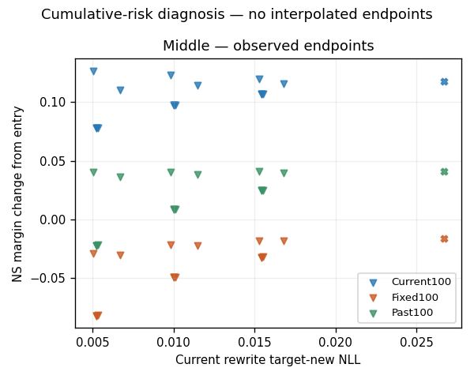

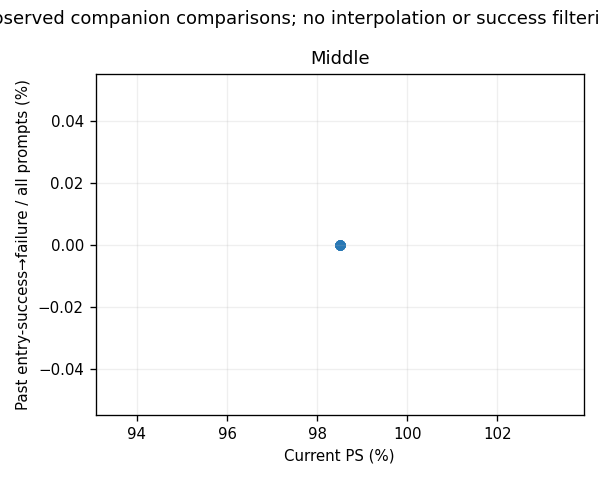

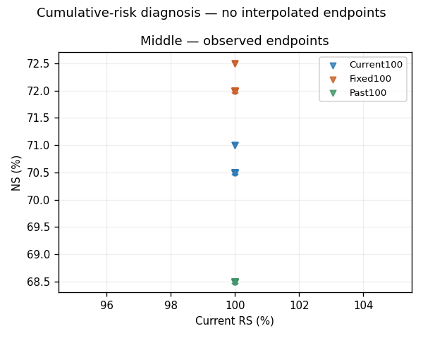

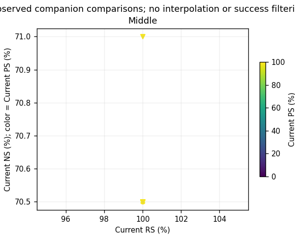

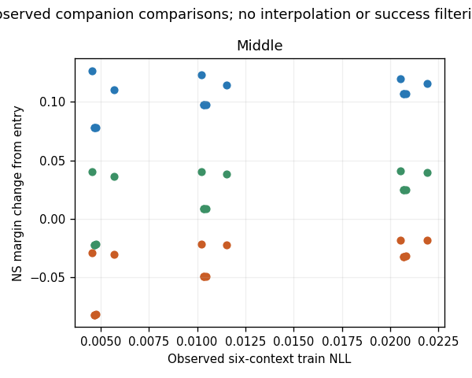

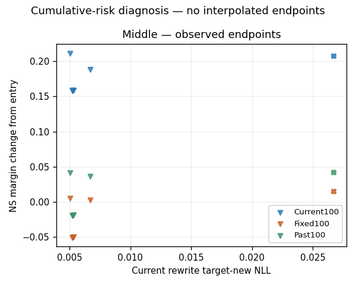

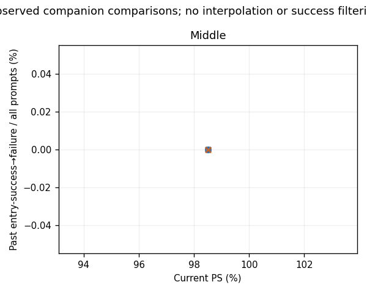

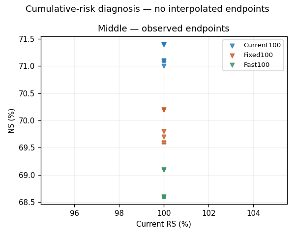

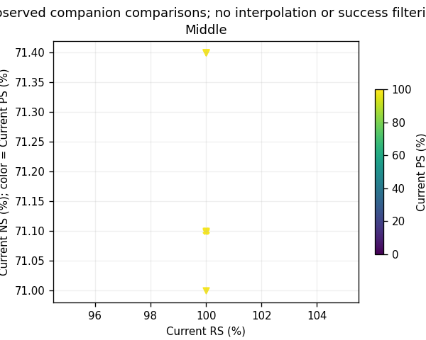

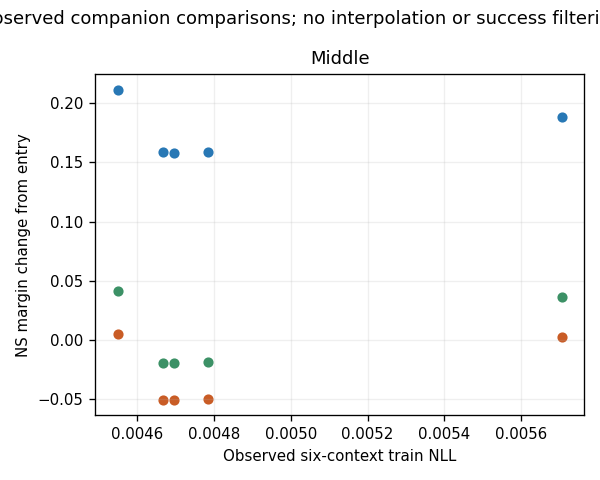

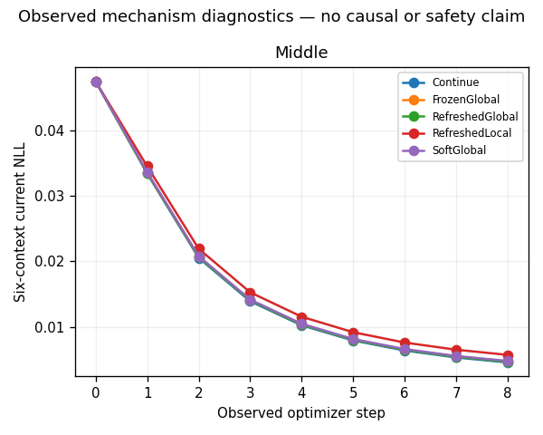

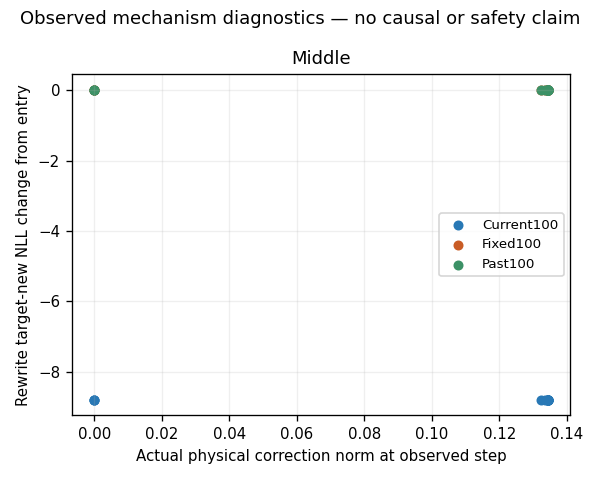

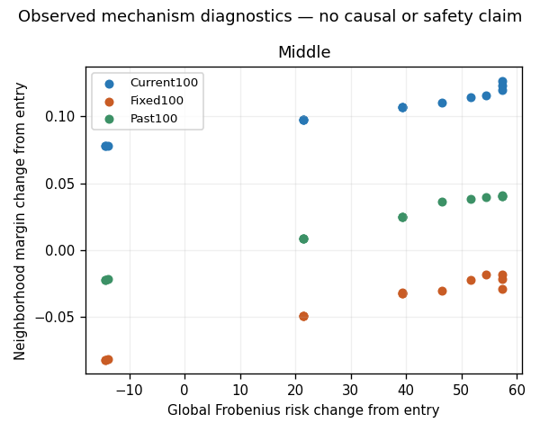

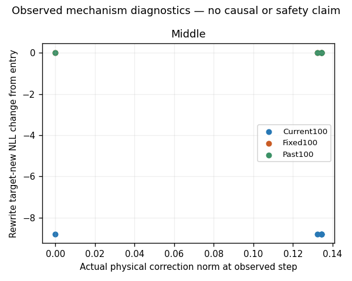

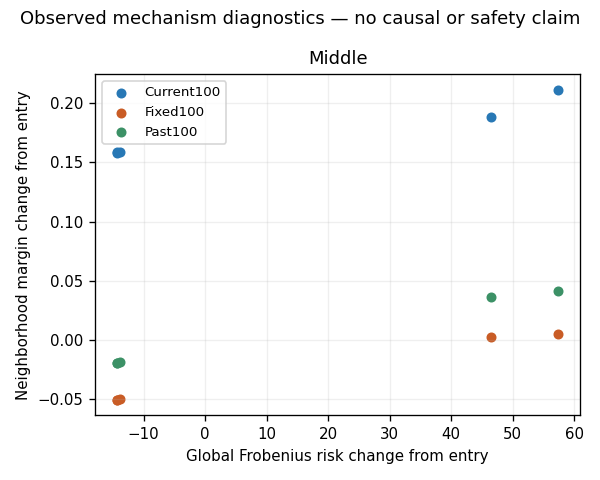

PNG는 repository Python code로 생성하며 각 plot-reproduction receipt가 입력/명령/환경/SHA와 실제 byte 재현을 결속한다. Curve/full 해상도를 합산하지 않는다.

계산량은 actual forward/backward/sequence/token counts와 wall time이다. FLOPs는 측정하지 않았으며 시간에서 역산하지 않는다. Process total과 누적 child ledger를 중복 더하지 않는다.

Norm 합은 net norm이 아니고, Frobenius risk와 native history/L2 action은 서로 다른 양이다. Risk의 변화만으로 locality/retention 개선을 단정하지 않는다. Development checkpoint 세 개를 독립 lifelong benchmark로 부르지 않는다.

상세 해석, 미분리 원인, 방향 leakage와 비용은 diagnostic discussion 및 모든 원표를 함께 확인한다. Scientific promotion=false.
