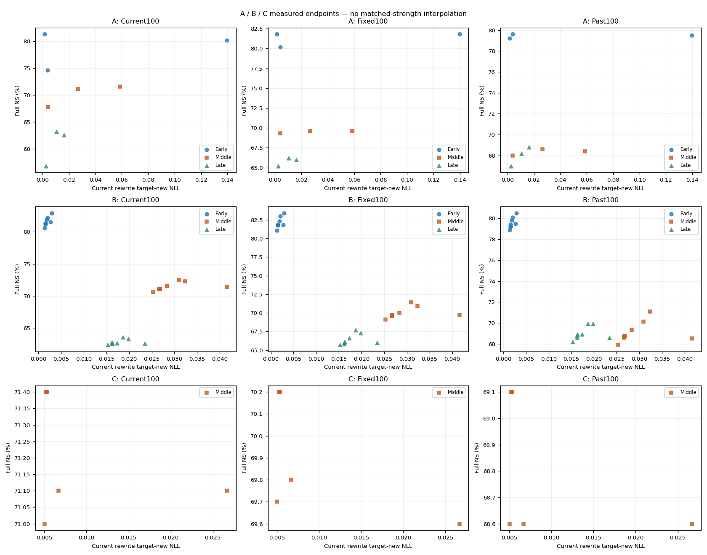
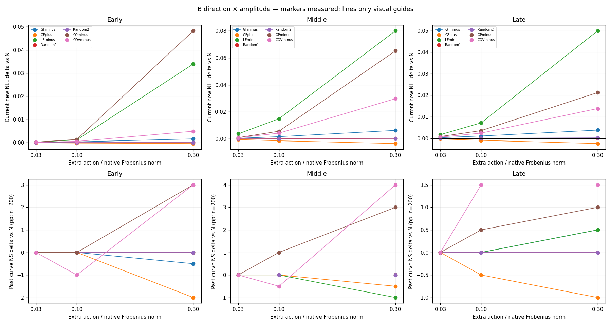

# 단일 layer 누적위험 A→B→C 최종 진단 보고서

A/B/C 모두 완료. 각 stage의 immutable 상세 보고서·원본 identity·요구사항 evidence를 아래 parent package로 결속한다. Scientific promotion=false. 낮은 성능, risk 증가, strength 불일치를 제외하거나 성공 gate로 바꾸지 않았다.

## 설계와 분모

A: native-assisted Direct-B/Direct-C support 비교(13 writers,320 SGD steps,12 추가 native scales). B: 공통 WN에서7방향×3amplitudes×3entry=63 trials. C: Middle WN에서5방식×8steps=40 steps. A의 Direct-B/Direct-C 이름과 상위 B/C 단계는 다르다.

Full 각 panel은 RS100/PS200/NS1000, Current·Fixed·Past 전체3900쌍이다. RS/PS는 new NLL<true NLL, NS는 true NLL<new NLL이며 tie는 실패다. Curve1100쌍 및 full에서 재사용한 동일 관측행은 별도 독립 분모로 합산하지 않는다. Conditional loss/recovery, all-prompt success, TF exact 및 literal generation을 서로 구분한다.

W0=원본, We=historical entry, WN=native endpoint. NS inherited margin은 We−W0, additional은post−We이며 N 대비 변화는 별도 reference delta다. 모든 margin은 true NLL−new NLL이다. 따라서 rewrite/rephrase에서는 큰 margin이 새 target 선호이고, neighbor에서는 작은 margin이 원래 정답 선호다. NLL은 해당 정답 token 평균으로 낮을수록 그 문자열에 높은 확률을 준다. Joint sequence probability나 literal generation accuracy와 동일한 지표가 아니다.

생성 관측의 “Middle C step8”은 상위 C의5개 trajectory endpoint다. A는Native3+선택Direct-B/C6=9endpoint×60prompt, 상위 C는5endpoint×60prompt이다. A Direct-C step8을 추가 필수 항목으로 해석했던 준비는 명시적 scope clarification으로 철회했으며 추가 model/GPU/Slurm 실행은0이다. 기존 A/B bytes는 바꾸지 않았다.

## Current / Fixed / Past — 사전 지정 full endpoints

### A

| entry | endpoint | panel | RS n/d (%) | PS n/d (%) | NS n/d (%) | rewrite new NLL | rephrase new NLL | rephrase new p90 |
| --- | --- | --- | --- | --- | --- | --- | --- | --- |
| Early | B-alpha-0.02/eval-032 | Current100 | 99/100 (99.00%) | 191/200 (95.50%) | 802/1000 (80.20%) | 0.139581 | 1.83322 | 5.49011 |
| Early | B-alpha-0.02/eval-032 | Fixed100 | 100/100 (100.00%) | 193/200 (96.50%) | 818/1000 (81.80%) | 0.0621302 | 1.4045 | 4.26104 |
| Early | B-alpha-0.02/eval-032 | Past100 | 100/100 (100.00%) | 198/200 (99.00%) | 795/1000 (79.50%) | 0.00227981 | 1.64447 | 5.18331 |
| Early | C-alpha-0.02/eval-032 | Current100 | 100/100 (100.00%) | 192/200 (96.00%) | 746/1000 (74.60%) | 0.00395517 | 1.56159 | 5.00649 |
| Early | C-alpha-0.02/eval-032 | Fixed100 | 100/100 (100.00%) | 196/200 (98.00%) | 802/1000 (80.20%) | 0.116746 | 0.890154 | 2.57472 |
| Early | C-alpha-0.02/eval-032 | Past100 | 100/100 (100.00%) | 199/200 (99.50%) | 796/1000 (79.60%) | 0.0559751 | 1.1621 | 3.89226 |
| Early | N-full | Current100 | 100/100 (100.00%) | 195/200 (97.50%) | 813/1000 (81.30%) | 0.0015487 | 1.62719 | 5.21841 |
| Early | N-full | Fixed100 | 100/100 (100.00%) | 194/200 (97.00%) | 818/1000 (81.80%) | 0.0560293 | 1.43247 | 4.12997 |
| Early | N-full | Past100 | 100/100 (100.00%) | 198/200 (99.00%) | 792/1000 (79.20%) | 0.00233362 | 1.66737 | 5.31021 |
| Late | B-alpha-0.02/eval-032 | Current100 | 100/100 (100.00%) | 190/200 (95.00%) | 632/1000 (63.20%) | 0.0104557 | 1.33983 | 4.58239 |
| Late | B-alpha-0.02/eval-032 | Fixed100 | 99/100 (99.00%) | 189/200 (94.50%) | 662/1000 (66.20%) | 0.678021 | 1.91499 | 6.06452 |
| Late | B-alpha-0.02/eval-032 | Past100 | 100/100 (100.00%) | 191/200 (95.50%) | 682/1000 (68.20%) | 0.143789 | 1.59912 | 4.86661 |
| Late | C-alpha-0.02/eval-032 | Current100 | 100/100 (100.00%) | 189/200 (94.50%) | 568/1000 (56.80%) | 0.00252073 | 1.19468 | 3.38491 |
| Late | C-alpha-0.02/eval-032 | Fixed100 | 98/100 (98.00%) | 190/200 (95.00%) | 652/1000 (65.20%) | 0.658497 | 1.64587 | 4.84912 |
| Late | C-alpha-0.02/eval-032 | Past100 | 100/100 (100.00%) | 189/200 (94.50%) | 670/1000 (67.00%) | 0.221051 | 1.07641 | 3.73773 |
| Late | N-full | Current100 | 100/100 (100.00%) | 193/200 (96.50%) | 626/1000 (62.60%) | 0.016226 | 1.38731 | 4.71889 |
| Late | N-full | Fixed100 | 99/100 (99.00%) | 191/200 (95.50%) | 660/1000 (66.00%) | 0.715579 | 1.96449 | 6.1058 |
| Late | N-full | Past100 | 100/100 (100.00%) | 191/200 (95.50%) | 688/1000 (68.80%) | 0.145765 | 1.65201 | 5.2306 |
| Middle | B-alpha-0.02/eval-032 | Current100 | 100/100 (100.00%) | 196/200 (98.00%) | 716/1000 (71.60%) | 0.058624 | 1.31152 | 4.30185 |
| Middle | B-alpha-0.02/eval-032 | Fixed100 | 100/100 (100.00%) | 194/200 (97.00%) | 696/1000 (69.60%) | 0.216113 | 1.49158 | 4.55397 |
| Middle | B-alpha-0.02/eval-032 | Past100 | 100/100 (100.00%) | 192/200 (96.00%) | 684/1000 (68.40%) | 0.0173741 | 1.3046 | 4.11622 |
| Middle | C-alpha-0.02/eval-032 | Current100 | 100/100 (100.00%) | 192/200 (96.00%) | 678/1000 (67.80%) | 0.00406219 | 0.971624 | 2.97075 |
| Middle | C-alpha-0.02/eval-032 | Fixed100 | 97/100 (97.00%) | 193/200 (96.50%) | 693/1000 (69.30%) | 0.361542 | 1.2656 | 3.96991 |
| Middle | C-alpha-0.02/eval-032 | Past100 | 100/100 (100.00%) | 190/200 (95.00%) | 680/1000 (68.00%) | 0.0759649 | 1.0123 | 3.15195 |
| Middle | N-full | Current100 | 100/100 (100.00%) | 197/200 (98.50%) | 711/1000 (71.10%) | 0.0266691 | 1.19442 | 3.82367 |
| Middle | N-full | Fixed100 | 100/100 (100.00%) | 194/200 (97.00%) | 696/1000 (69.60%) | 0.227358 | 1.50208 | 4.54506 |
| Middle | N-full | Past100 | 100/100 (100.00%) | 193/200 (96.50%) | 686/1000 (68.60%) | 0.0277426 | 1.31975 | 4.06645 |

### B

| entry | endpoint | panel | RS n/d (%) | PS n/d (%) | NS n/d (%) | rewrite new NLL | rephrase new NLL | rephrase new p90 |
| --- | --- | --- | --- | --- | --- | --- | --- | --- |
| Early | COVminus-amplitude-0.1/eval | Current100 | 100/100 (100.00%) | 193/200 (96.50%) | 822/1000 (82.20%) | 0.0020666 | 1.68503 | 5.26448 |
| Early | COVminus-amplitude-0.1/eval | Fixed100 | 100/100 (100.00%) | 191/200 (95.50%) | 830/1000 (83.00%) | 0.0548371 | 1.59219 | 4.6254 |
| Early | COVminus-amplitude-0.1/eval | Past100 | 100/100 (100.00%) | 198/200 (99.00%) | 801/1000 (80.10%) | 0.00284093 | 1.75118 | 5.39732 |
| Early | GFminus-amplitude-0.1/eval | Current100 | 100/100 (100.00%) | 194/200 (97.00%) | 819/1000 (81.90%) | 0.0018487 | 1.65682 | 5.2833 |
| Early | GFminus-amplitude-0.1/eval | Fixed100 | 100/100 (100.00%) | 193/200 (96.50%) | 823/1000 (82.30%) | 0.0593132 | 1.49381 | 4.45775 |
| Early | GFminus-amplitude-0.1/eval | Past100 | 100/100 (100.00%) | 198/200 (99.00%) | 798/1000 (79.80%) | 0.00286834 | 1.70087 | 5.19582 |
| Early | GFplus-amplitude-0.1/eval | Current100 | 100/100 (100.00%) | 197/200 (98.50%) | 806/1000 (80.60%) | 0.00135314 | 1.6005 | 5.17221 |
| Early | GFplus-amplitude-0.1/eval | Fixed100 | 100/100 (100.00%) | 194/200 (97.00%) | 811/1000 (81.10%) | 0.0549421 | 1.38141 | 4.08246 |
| Early | GFplus-amplitude-0.1/eval | Past100 | 100/100 (100.00%) | 198/200 (99.00%) | 789/1000 (78.90%) | 0.00199431 | 1.63922 | 5.31668 |
| Early | LFminus-amplitude-0.1/eval | Current100 | 100/100 (100.00%) | 194/200 (97.00%) | 815/1000 (81.50%) | 0.00271934 | 1.69359 | 5.33709 |
| Early | LFminus-amplitude-0.1/eval | Fixed100 | 100/100 (100.00%) | 194/200 (97.00%) | 818/1000 (81.80%) | 0.0561234 | 1.42582 | 4.1359 |
| Early | LFminus-amplitude-0.1/eval | Past100 | 100/100 (100.00%) | 198/200 (99.00%) | 795/1000 (79.50%) | 0.0022797 | 1.66537 | 5.23267 |
| Early | N_REUSED | Current100 | 100/100 (100.00%) | 195/200 (97.50%) | 813/1000 (81.30%) | 0.0015487 | 1.62719 | 5.21841 |
| Early | N_REUSED | Fixed100 | 100/100 (100.00%) | 194/200 (97.00%) | 818/1000 (81.80%) | 0.0560293 | 1.43247 | 4.12997 |
| Early | N_REUSED | Past100 | 100/100 (100.00%) | 198/200 (99.00%) | 792/1000 (79.20%) | 0.00233362 | 1.66737 | 5.31021 |
| Early | OPminus-amplitude-0.1/eval | Current100 | 100/100 (100.00%) | 192/200 (96.00%) | 829/1000 (82.90%) | 0.00290571 | 1.74903 | 5.23438 |
| Early | OPminus-amplitude-0.1/eval | Fixed100 | 100/100 (100.00%) | 192/200 (96.00%) | 834/1000 (83.40%) | 0.0513877 | 1.52757 | 4.47447 |
| Early | OPminus-amplitude-0.1/eval | Past100 | 100/100 (100.00%) | 198/200 (99.00%) | 805/1000 (80.50%) | 0.00320758 | 1.79975 | 5.19239 |
| Early | Random1-amplitude-0.1/eval | Current100 | 100/100 (100.00%) | 195/200 (97.50%) | 813/1000 (81.30%) | 0.00155042 | 1.62721 | 5.20901 |
| Early | Random1-amplitude-0.1/eval | Fixed100 | 100/100 (100.00%) | 194/200 (97.00%) | 818/1000 (81.80%) | 0.0561813 | 1.43356 | 4.10096 |
| Early | Random1-amplitude-0.1/eval | Past100 | 100/100 (100.00%) | 198/200 (99.00%) | 792/1000 (79.20%) | 0.00233205 | 1.6684 | 5.30303 |
| Early | Random2-amplitude-0.1/eval | Current100 | 100/100 (100.00%) | 195/200 (97.50%) | 812/1000 (81.20%) | 0.0015462 | 1.62756 | 5.2554 |
| Early | Random2-amplitude-0.1/eval | Fixed100 | 100/100 (100.00%) | 194/200 (97.00%) | 818/1000 (81.80%) | 0.0557343 | 1.43048 | 4.11218 |
| Early | Random2-amplitude-0.1/eval | Past100 | 100/100 (100.00%) | 198/200 (99.00%) | 794/1000 (79.40%) | 0.00234276 | 1.66646 | 5.22152 |
| Late | COVminus-amplitude-0.1/eval | Current100 | 100/100 (100.00%) | 193/200 (96.50%) | 636/1000 (63.60%) | 0.0186629 | 1.44066 | 4.90657 |
| Late | COVminus-amplitude-0.1/eval | Fixed100 | 98/100 (98.00%) | 190/200 (95.00%) | 677/1000 (67.70%) | 0.632855 | 1.98058 | 5.8002 |
| Late | COVminus-amplitude-0.1/eval | Past100 | 100/100 (100.00%) | 190/200 (95.00%) | 699/1000 (69.90%) | 0.143896 | 1.67641 | 5.23539 |
| Late | GFminus-amplitude-0.1/eval | Current100 | 100/100 (100.00%) | 192/200 (96.00%) | 627/1000 (62.70%) | 0.0173162 | 1.39808 | 4.73483 |
| Late | GFminus-amplitude-0.1/eval | Fixed100 | 98/100 (98.00%) | 191/200 (95.50%) | 666/1000 (66.60%) | 0.696422 | 1.95652 | 6.16325 |
| Late | GFminus-amplitude-0.1/eval | Past100 | 100/100 (100.00%) | 191/200 (95.50%) | 689/1000 (68.90%) | 0.145005 | 1.65586 | 5.26634 |
| Late | GFplus-amplitude-0.1/eval | Current100 | 100/100 (100.00%) | 193/200 (96.50%) | 624/1000 (62.40%) | 0.0152879 | 1.37827 | 4.70396 |
| Late | GFplus-amplitude-0.1/eval | Fixed100 | 99/100 (99.00%) | 189/200 (94.50%) | 657/1000 (65.70%) | 0.735212 | 1.97432 | 6.02565 |
| Late | GFplus-amplitude-0.1/eval | Past100 | 100/100 (100.00%) | 191/200 (95.50%) | 682/1000 (68.20%) | 0.146762 | 1.64968 | 5.19205 |
| Late | LFminus-amplitude-0.1/eval | Current100 | 100/100 (100.00%) | 192/200 (96.00%) | 626/1000 (62.60%) | 0.0234189 | 1.46883 | 4.72939 |
| Late | LFminus-amplitude-0.1/eval | Fixed100 | 99/100 (99.00%) | 191/200 (95.50%) | 660/1000 (66.00%) | 0.70281 | 1.95515 | 6.12704 |
| Late | LFminus-amplitude-0.1/eval | Past100 | 100/100 (100.00%) | 191/200 (95.50%) | 686/1000 (68.60%) | 0.144835 | 1.64522 | 5.21916 |
| Late | N_REUSED | Current100 | 100/100 (100.00%) | 193/200 (96.50%) | 626/1000 (62.60%) | 0.016226 | 1.38731 | 4.71889 |
| Late | N_REUSED | Fixed100 | 99/100 (99.00%) | 191/200 (95.50%) | 660/1000 (66.00%) | 0.715579 | 1.96449 | 6.1058 |
| Late | N_REUSED | Past100 | 100/100 (100.00%) | 191/200 (95.50%) | 688/1000 (68.80%) | 0.145765 | 1.65201 | 5.2306 |
| Late | OPminus-amplitude-0.1/eval | Current100 | 100/100 (100.00%) | 193/200 (96.50%) | 633/1000 (63.30%) | 0.0198135 | 1.47881 | 4.95055 |
| Late | OPminus-amplitude-0.1/eval | Fixed100 | 99/100 (99.00%) | 191/200 (95.50%) | 673/1000 (67.30%) | 0.615108 | 1.91584 | 6.0431 |
| Late | OPminus-amplitude-0.1/eval | Past100 | 100/100 (100.00%) | 190/200 (95.00%) | 699/1000 (69.90%) | 0.143945 | 1.68894 | 5.30293 |
| Late | Random1-amplitude-0.1/eval | Current100 | 100/100 (100.00%) | 193/200 (96.50%) | 628/1000 (62.80%) | 0.0162323 | 1.38589 | 4.70548 |
| Late | Random1-amplitude-0.1/eval | Fixed100 | 99/100 (99.00%) | 191/200 (95.50%) | 658/1000 (65.80%) | 0.712735 | 1.96604 | 6.04937 |
| Late | Random1-amplitude-0.1/eval | Past100 | 100/100 (100.00%) | 191/200 (95.50%) | 686/1000 (68.60%) | 0.145831 | 1.65119 | 5.2313 |
| Late | Random2-amplitude-0.1/eval | Current100 | 100/100 (100.00%) | 193/200 (96.50%) | 626/1000 (62.60%) | 0.0162949 | 1.38707 | 4.70106 |
| Late | Random2-amplitude-0.1/eval | Fixed100 | 99/100 (99.00%) | 191/200 (95.50%) | 661/1000 (66.10%) | 0.717615 | 1.96689 | 6.07623 |
| Late | Random2-amplitude-0.1/eval | Past100 | 100/100 (100.00%) | 191/200 (95.50%) | 689/1000 (68.90%) | 0.145605 | 1.65479 | 5.23166 |
| Middle | COVminus-amplitude-0.1/eval | Current100 | 100/100 (100.00%) | 197/200 (98.50%) | 725/1000 (72.50%) | 0.0309519 | 1.27152 | 4.30767 |
| Middle | COVminus-amplitude-0.1/eval | Fixed100 | 99/100 (99.00%) | 193/200 (96.50%) | 714/1000 (71.40%) | 0.211748 | 1.59656 | 4.47498 |
| Middle | COVminus-amplitude-0.1/eval | Past100 | 100/100 (100.00%) | 192/200 (96.00%) | 701/1000 (70.10%) | 0.022805 | 1.39255 | 4.27848 |
| Middle | GFminus-amplitude-0.1/eval | Current100 | 100/100 (100.00%) | 197/200 (98.50%) | 716/1000 (71.60%) | 0.0283521 | 1.21537 | 3.95743 |
| Middle | GFminus-amplitude-0.1/eval | Fixed100 | 100/100 (100.00%) | 194/200 (97.00%) | 700/1000 (70.00%) | 0.222932 | 1.52039 | 4.63232 |
| Middle | GFminus-amplitude-0.1/eval | Past100 | 100/100 (100.00%) | 193/200 (96.50%) | 693/1000 (69.30%) | 0.0259171 | 1.3363 | 4.12532 |
| Middle | GFplus-amplitude-0.1/eval | Current100 | 100/100 (100.00%) | 197/200 (98.50%) | 706/1000 (70.60%) | 0.0252972 | 1.17584 | 3.7125 |
| Middle | GFplus-amplitude-0.1/eval | Fixed100 | 100/100 (100.00%) | 195/200 (97.50%) | 691/1000 (69.10%) | 0.234919 | 1.48604 | 4.63079 |
| Middle | GFplus-amplitude-0.1/eval | Past100 | 100/100 (100.00%) | 193/200 (96.50%) | 679/1000 (67.90%) | 0.0300311 | 1.30452 | 4.06367 |
| Middle | LFminus-amplitude-0.1/eval | Current100 | 100/100 (100.00%) | 197/200 (98.50%) | 714/1000 (71.40%) | 0.041574 | 1.28078 | 4.17738 |
| Middle | LFminus-amplitude-0.1/eval | Fixed100 | 100/100 (100.00%) | 194/200 (97.00%) | 697/1000 (69.70%) | 0.224198 | 1.49979 | 4.5494 |
| Middle | LFminus-amplitude-0.1/eval | Past100 | 100/100 (100.00%) | 193/200 (96.50%) | 685/1000 (68.50%) | 0.0258412 | 1.31744 | 3.98188 |
| Middle | N_REUSED | Current100 | 100/100 (100.00%) | 197/200 (98.50%) | 711/1000 (71.10%) | 0.0266691 | 1.19442 | 3.82367 |
| Middle | N_REUSED | Fixed100 | 100/100 (100.00%) | 194/200 (97.00%) | 696/1000 (69.60%) | 0.227358 | 1.50208 | 4.54506 |
| Middle | N_REUSED | Past100 | 100/100 (100.00%) | 193/200 (96.50%) | 686/1000 (68.60%) | 0.0277426 | 1.31975 | 4.06645 |
| Middle | OPminus-amplitude-0.1/eval | Current100 | 100/100 (100.00%) | 196/200 (98.00%) | 723/1000 (72.30%) | 0.0323824 | 1.32978 | 4.34885 |
| Middle | OPminus-amplitude-0.1/eval | Fixed100 | 100/100 (100.00%) | 194/200 (97.00%) | 709/1000 (70.90%) | 0.189953 | 1.53941 | 4.63783 |
| Middle | OPminus-amplitude-0.1/eval | Past100 | 100/100 (100.00%) | 191/200 (95.50%) | 711/1000 (71.10%) | 0.0248579 | 1.40869 | 4.4372 |
| Middle | Random1-amplitude-0.1/eval | Current100 | 100/100 (100.00%) | 197/200 (98.50%) | 711/1000 (71.10%) | 0.0267932 | 1.19372 | 3.86441 |
| Middle | Random1-amplitude-0.1/eval | Fixed100 | 100/100 (100.00%) | 194/200 (97.00%) | 697/1000 (69.70%) | 0.227929 | 1.5028 | 4.5459 |
| Middle | Random1-amplitude-0.1/eval | Past100 | 100/100 (100.00%) | 193/200 (96.50%) | 687/1000 (68.70%) | 0.0283097 | 1.3193 | 4.01215 |
| Middle | Random2-amplitude-0.1/eval | Current100 | 100/100 (100.00%) | 197/200 (98.50%) | 711/1000 (71.10%) | 0.0266632 | 1.19527 | 3.79377 |
| Middle | Random2-amplitude-0.1/eval | Fixed100 | 100/100 (100.00%) | 194/200 (97.00%) | 696/1000 (69.60%) | 0.227355 | 1.50202 | 4.50922 |
| Middle | Random2-amplitude-0.1/eval | Past100 | 100/100 (100.00%) | 193/200 (96.50%) | 687/1000 (68.70%) | 0.0279565 | 1.31895 | 4.07214 |

### C

| entry | endpoint | panel | RS n/d (%) | PS n/d (%) | NS n/d (%) | rewrite new NLL | rephrase new NLL | rephrase new p90 |
| --- | --- | --- | --- | --- | --- | --- | --- | --- |
| Middle | Continue/eval-008 | Current100 | 100/100 (100.00%) | 197/200 (98.50%) | 710/1000 (71.00%) | 0.00501909 | 1.13669 | 3.7021 |
| Middle | Continue/eval-008 | Fixed100 | 99/100 (99.00%) | 195/200 (97.50%) | 697/1000 (69.70%) | 0.225966 | 1.48441 | 4.52072 |
| Middle | Continue/eval-008 | Past100 | 100/100 (100.00%) | 193/200 (96.50%) | 686/1000 (68.60%) | 0.0260768 | 1.31184 | 4.05439 |
| Middle | FrozenGlobal/eval-008 | Current100 | 100/100 (100.00%) | 197/200 (98.50%) | 714/1000 (71.40%) | 0.00525272 | 1.15571 | 3.91237 |
| Middle | FrozenGlobal/eval-008 | Fixed100 | 99/100 (99.00%) | 194/200 (97.00%) | 702/1000 (70.20%) | 0.223091 | 1.50101 | 4.53921 |
| Middle | FrozenGlobal/eval-008 | Past100 | 100/100 (100.00%) | 193/200 (96.50%) | 691/1000 (69.10%) | 0.0244476 | 1.32707 | 4.09964 |
| Middle | N_REUSED | Current100 | 100/100 (100.00%) | 197/200 (98.50%) | 711/1000 (71.10%) | 0.0266691 | 1.19442 | 3.82367 |
| Middle | N_REUSED | Fixed100 | 100/100 (100.00%) | 194/200 (97.00%) | 696/1000 (69.60%) | 0.227358 | 1.50208 | 4.54506 |
| Middle | N_REUSED | Past100 | 100/100 (100.00%) | 193/200 (96.50%) | 686/1000 (68.60%) | 0.0277426 | 1.31975 | 4.06645 |
| Middle | RefreshedGlobal/eval-008 | Current100 | 100/100 (100.00%) | 197/200 (98.50%) | 714/1000 (71.40%) | 0.005239 | 1.15563 | 3.91195 |
| Middle | RefreshedGlobal/eval-008 | Fixed100 | 99/100 (99.00%) | 194/200 (97.00%) | 702/1000 (70.20%) | 0.223164 | 1.5011 | 4.53983 |
| Middle | RefreshedGlobal/eval-008 | Past100 | 100/100 (100.00%) | 193/200 (96.50%) | 691/1000 (69.10%) | 0.0244462 | 1.32705 | 4.09972 |
| Middle | RefreshedLocal/eval-008 | Current100 | 100/100 (100.00%) | 197/200 (98.50%) | 711/1000 (71.10%) | 0.0067021 | 1.21818 | 4.0642 |
| Middle | RefreshedLocal/eval-008 | Fixed100 | 99/100 (99.00%) | 195/200 (97.50%) | 698/1000 (69.80%) | 0.223659 | 1.48338 | 4.53257 |
| Middle | RefreshedLocal/eval-008 | Past100 | 100/100 (100.00%) | 193/200 (96.50%) | 686/1000 (68.60%) | 0.0241512 | 1.3094 | 4.0808 |
| Middle | SoftGlobal/eval-008 | Current100 | 100/100 (100.00%) | 197/200 (98.50%) | 714/1000 (71.40%) | 0.00533978 | 1.15675 | 3.91213 |
| Middle | SoftGlobal/eval-008 | Fixed100 | 99/100 (99.00%) | 194/200 (97.00%) | 702/1000 (70.20%) | 0.223204 | 1.50144 | 4.53873 |
| Middle | SoftGlobal/eval-008 | Past100 | 100/100 (100.00%) | 193/200 (96.50%) | 691/1000 (69.10%) | 0.0245174 | 1.32722 | 4.09838 |

## 관측에 근거한 해석과 미분리 요인

### A — 직접 최적화는 무엇을 바꿨는가

Middle의 training objective 마지막4step 평균만으로 B/C 모두 alpha0.02를 선택했다. Early/Late에서는 재선택하지 않았다. 모든 alpha의 유효 결과를 공개했고 PS/NS로 후보를 제외하지 않았다. Step32가 선택 점수 자체는 아니며 선택에는 step29–32의 post-update objective가 사용됐다.

선택된 Direct-C는 Early/Middle/Late 모두 Current RS100/100이었으나 Current NS는 Native 대비 각각 −6.7/−3.3/−5.8pp였다. Current PS도 Native195/197/193에서 C192/192/189(각200분모)로 낮아졌다. Middle에서는 rewrite new NLL이 Native0.0266691→C0.00406219로 줄면서 rephrase PS는98.5%→96%가 됐다. Current의 적합도·선호 성공·neighborhood 보존을 하나의 성공 지표로 합치면 안 된다.

Direct-B는 제한된 native support에서 더 작은 native-metric action을 사용했다. 선택된 B의 normalized native action은 Early/Middle/Late0.4172/0.4261/0.4200이고 C는1.2214/1.7479/1.7788이었다. 반면 C의 실제 batch-net Frobenius norm은4.7932/5.1280/4.9874로 Native8.7708/10.7440/11.4666보다 작았다. 즉 **작은 Frobenius write가 작은 native-metric 비용이라는 뜻은 아니다.** Support, metric anisotropy, fitting과 regularization이 함께 달라져 support 크기 하나만의 인과효과로 읽지 않는다.

Six-context training NLL과 canonical rewrite NLL 역시 같은 값이 아니다. Middle B step32의 training NLL0.07074는 Native0.04747보다 높지만 전체 training objective는0.13634로 Native0.15806보다 작았다. C training NLL은0.001729로 낮아도 normalized native action1.7479 때문에 objective0.19128이었다. 동일 RS100이 동일 train loss·NLL·regularization 비용을 뜻하지 않는 실제 예다.

Native scaling과 direct curve는 저장된 실제 endpoint만 비교했다. 같은 RS의 포화구간에서도 NLL/PS/NS가 달라 정확한 strength match를 주장하지 않는다. 보간 또는 가장 유리한 NS 지점 선택은 하지 않았다.

### B — 누적위험 방향과 단순 contraction을 얼마나 분리했는가

모든 B trial은 A의 동일 WN에서 독립 시작했다. 미리 정한 amplitude0.1의 full 평가에서 GF−와 GF+는 Current RS가 모든 entry에서100/100이었다. GF−−GF+의 Past NS 차이는 Early+0.9pp, Middle+1.4pp, Late+0.7pp였다. Request-cluster2000회의 탐색적95%구간은 각각[+0.3,+1.6], [+0.4,+2.5], [+0.1,+1.3]pp다. 이는 이번 request-panel의 부호 비교이지, 다중검정 보정된 승자 판정이나 safety gate가 아니다.

GF−는 Native 대비 Past NS가 Early79.2→79.8%, Middle68.6→69.3%, Late68.8→68.9%였다. GF−−LF−는 각각+0.3/+0.8/+0.3pp이고 구간은[−0.1,+0.8]/[+0.2,+1.5]/[−0.1,+0.8]pp다. 단순 batch-local contraction보다 항상 분명한 이득이라고 볼 수는 없다. Raw global/local risk coefficient-gradient cosine은0.3249/0.1592/0.1164였지만 이는 **filter 적용 전 gradient cosine**이며 최종 physical direction cosine으로 바꿔 부르지 않는다.

GF−가 모든 위험 surrogate 중 가장 좋지도 않았다. 같은0.1에서 OP− Past NS는80.5/71.1/69.9%로 GF−보다 높았다. 대신 OP−의 Current rewrite NLL은 각 Native보다 높았고, Middle/Late Past PS는 Native193/191에서191/190(각200분모)로 낮아졌다. COV− 역시 NS가 높아지는 반면 Middle/Late Fixed RS가100→99 및99→98로 줄었다. GF−에서도 Late Fixed RS가99→98로 감소했다. 위험 감소, NS 상승, 기존 edit 보존은 서로 동의어가 아니다.

같은0.1의 actual Frobenius extra norm은 entry별 약0.87708/1.07440/1.14666으로 방향마다 거의 같았다. GF−의 global squared-Frobenius risk 감소와 GF+의 증가, random의 주로 양의2차항은 actual FP32 delta의1차+2차 분해로 기록했다. 이 항등식은 성능/로컬리티 증명은 아니다. .03/.1/.3 전체 curve와 GF sign-pair NLL/margin 중심차분·curvature도 별도 CSV로 공개하며 단일 amplitude를 미분의 정확값으로 간주하지 않는다.

### C — 고정/갱신 및 amplitude 경로

상위 C의 다섯 arm은 동일 Middle WN에서 8step을 끝냈다. 모두 Current RS100/100·PS197/200, Past RS100/100·PS193/200이었다. NS는 Continue의 Current/Fixed/Past710/697/686에서 FrozenGlobal과 RefreshedGlobal 모두714/702/691로 변했다(각1000분모). SoftGlobal도714/702/691, RefreshedLocal은711/698/686이었다. Global 계열의 Past NS+0.5pp를 과거 edit RS 보존 향상이라고 바꿔 부르지 않는다. Fixed RS는 다섯 arm 모두99/100이고, Fixed PS는 Continue/RefreshedLocal195/200, 나머지194/200이었다.

Global 계열의 Past NS 변화는 Continue-success686개 중1개 loss와 Continue-failure314개 중6개 recovery를 합친 순+5/1000이다. Request-cluster2000회95%구간은+0.5pp에 대해[0,+1.1]pp였으며, 별도 성능 PASS 또는 일반화된 효과로 판정하지 않았다. 이 loss/recovery는 Continue reference이고, We reference의 inherited/additional 손실표와 혼합하지 않는다.

핵심 frozen↔refresh 비교에서 **Full3900쌍의 성공 판정이 바뀐 행은0**이었다. 단, endpoint weight SHA와 NLL은 같지 않다. Current rewrite new NLL은 Frozen0.00525272→Refreshed0.00523900, Past rewrite는0.02444763→0.02444616이었다. 전체 RS300/PS600/NS3000행의 new-NLL 차이 최대절댓값은 각각0.0046673/0.0256467/0.0207338이다. 따라서 bitwise equivalence나 모든 request의 동일 출력은 주장하지 않지만, 이번8step에서는 반복 갱신의 추가 성공률 이득이 관측되지 않았다. 이는 refresh 불필요성의 보편적 증명이 아니라 한 Middle state에서의 음성·혼합 진단이다.

RefreshedGlobal은 FrozenGlobal보다 group-J를7회 더 만들고 model forward2100회·group backward2100회를 추가했으며 group-J 구성에259.811초가 들었다. 각 arm의 공통 nominal backward는2800회다. 전체 arm forward는 Frozen6604회, Refreshed8704회로 차이는31.8%이지만 이를 전체 GPU wall-time 비율이나 FLOP 비율로 치환하지 않는다. 초기 J1회는 공통 준비이며 이후7회와 구분한다. RefreshedLocal도7회 추가 구성·259.787초였다. 비용을 더 썼다는 것과 더 유용한 direction을 얻었다는 것은 분리한다.

실제 correction 누적 길이는 Frozen1.07440166, RefreshedGlobal1.07440163, RefreshedLocal1.07440162로 거의 같았고 SoftGlobal은1.06693349였다. 실제 전체 path 길이/추가WN-net norm은 각각 Frozen1.092292/1.091388, RefreshedGlobal1.092096/1.091171, RefreshedLocal1.097993/1.096805, SoftGlobal1.084591/1.083672였다. Continue는0.199849/0.197294다. Path 합을 net norm으로 바꾸지 않았고, Soft의 감소하는 correction 크기는 최초 norm 보정 뒤 재보정하지 않은 결과로 기록했다.

Global risk 감소도 local/native 비용 감소와 같지 않았다. Continue의 global squared-Frobenius4530.633이 Frozen4387.452·RefreshedGlobal4387.452로 낮아지는 동안 native action은138.160→144.281/144.266으로 늘었다. Local L2는115.398→112.880으로 줄어도 history action이22.762→31.401/31.386으로 증가했기 때문이다. RefreshedLocal은 native action112.460과 batch-net norm9.6693으로 더 작지만 global risk4508.794이고 Past NS는Continue와 같은68.6%였다. Risk reference, metric anisotropy와 성능을 하나의 보존 지표로 합치지 않는다.

Current rewrite NLL은 Continue0.00501909, Frozen0.00525272, RefreshedGlobal0.00523900, RefreshedLocal0.00670210, SoftGlobal0.00533978이며, Current rephrase new NLL은 각각1.13669/1.15571/1.15563/1.21818/1.15675였다. 같은 RS/PS라고 같은 target 확률·tail·generation이라는 뜻은 아니다. Full/curve별 paired CSV와 NLL 분포를 함께 공개했으며, 작은 차이·위험 증가·비단조 궤적 때문에 arm을 제외하지 않았다. Frozen↔RefreshedGlobal은 risk gradient와 Current J를 공동 갱신하므로 J 단독의 인과효과로는 분리되지 않는다.

### 공통 한계와 해석 경계

Current/Fixed/Past의 loss/recovery는 We 또는 명시된 공통N reference와 all-panel 분모를 분리한다. 세 entry는 history와 Current cohort가 함께 달라지는 조건부 진단으로 age-only 인과효과가 아니다. Exact metadata 기반 overwrite/conflict/neighbor-overlap strata는 공개하지만 semantic conflict를 완전히 찾았다는 뜻은 아니다. Request/subject-relation bootstrap은 학습 seed·edit-order 모집단 불확실성이 아니다.

A의 Middle B와 C에는 FP32 gradient reduction order 차이가 있고, Middle C0 diagnostic의 NumPy promotion은 저장 state37개의 algebra-only 보충으로 교정했다. 학습/target/선택 결과는 바꾸지 않았다. W0 기준 평가의 cross-entry 중복2717쌍은 원래 관측값과 비용을 그대로 보존했으며 성공 판정 차이는0이었다. 이 중복을 추가 독립 분모로 합산하지 않는다.

Raw normalization/hash/snapshot은 원래 namespace에 보존했다. B plotting의 trial-vs-step schema 오류는 CPU publication만 수리했으며 GPU 재실행/metric 변경은0이었다. Native z는 sealed cache hit이므로 cold compute-z를 포함한 online speed 우위를 주장하지 않는다. FLOPs는 측정하지 않아 NOT_RECORDED다. 각 단계의 model forwards, nominal/group/small-penalty backwards, evaluator/generation 및 allocation 시간은 별도 표로 읽는다.

### 가장 중요한 후속 질문 한 개

**현재 edit 품질과 실제 추가 write 크기를 함께 맞췄을 때, 공동 refresh는 고정된 global 위험 방향보다 재현 가능한 과거 편집 보존 이득을 주는가?** 이번 Middle8step에서 성공 판정 추가 이득은0이고 비용은 증가했으므로, 이를 이미 입증된 feedback 기전 또는 자동 promotion의 근거로 삼지 않는다. 이 질문은 해석상의 미분리 요인을 명시한 것이며 새 실험 제출·설정 변경을 뜻하지 않는다.

## 계산량과 출처

| stage | job | entry | allocated GPU seconds | GPU hours |
| --- | --- | --- | --- | --- |
| A | 43145 | Middle | 789 | 0.21916666666666668 |
| A | 43149 | Middle | 5181 | 1.4391666666666667 |
| A | 43165 | Middle | 5166 | 1.435 |
| A | 43196 | Early | 1167 | 0.32416666666666666 |
| A | 43198 | Late | 980 | 0.2722222222222222 |
| A | 43206 | Late | 1792 | 0.49777777777777776 |
| A | 43207 | Early | 1797 | 0.49916666666666665 |
| A | 43217 | Late | 1812 | 0.5033333333333333 |
| A | 43218 | Early | 1810 | 0.5027777777777778 |
| B | 43235 | Middle | 1761 | 0.4891666666666667 |
| B | 43236 | Early | 1782 | 0.495 |
| B | 43247 | Late | 1793 | 0.49805555555555553 |
| C | 43274 | Middle | 4166 | 1.1572222222222222 |

합계 29996 GPU-seconds / 8.332222 GPU-hours. 모델 준비·평가·생성·process residency를 포함한다. 각 stage auxiliary/compute-summary.csv의 process total과 child ledger를 중복 합산하지 않는다. FLOPs는 NOT_RECORDED이며 시간에서 추정하지 않았다.

두 번째 그림은 curve에서 같은 Past NS200쌍을 사용하며, full NS1000쌍과 섞지 않는다. 연결선은 눈금을 읽기 위한 안내일 뿐 중간 amplitude의 측정·보간값이 아니다.

그림은 관측점만 나타내며 색/marker는 entry이다. 선형보간, NS 기반 선택, 동일 strength 또는 age-only 인과효과를 주장하지 않는다. 전체 방향·amplitude 표와 내부 step 궤적은 각 stage CSV/PNG를 함께 본다.

## 봉인된 상세 보고서

- [A 상세 보고서](/mnt/raid5/janghj/.codex/worktrees/odeeditsh1-single-layer-cumulative-risk-abc-v1/experiment-reports/servers/server1/single-layer-cumulative-risk-abc-2026-09-10-v1/A/A-factual-report-ko.md): SHA256 `9d35bc4b183e1c858402d91c9c286194caaec2f4ae8b165508972912444f10ff`; members root `82292f2589294e38c940138cf5e42732e559b31964f4454b8d3d73a8826a588a`.
- [B 상세 보고서](/mnt/raid5/janghj/.codex/worktrees/odeeditsh1-single-layer-cumulative-risk-abc-v1/experiment-reports/servers/server1/single-layer-cumulative-risk-abc-2026-09-10-v1/B/B-factual-report-ko.md): SHA256 `20794f13900f1b4b35be0172c91644af2cd1e87f4c5ee3c68a6deb47738a5b07`; members root `b4c57f94f90026e21ff4fd6575d6a0864d49c27cfd6948bde54b0e2d6b158373`.
- [C 상세 보고서](/mnt/raid5/janghj/.codex/worktrees/odeeditsh1-single-layer-cumulative-risk-abc-v1/experiment-reports/servers/server1/single-layer-cumulative-risk-abc-2026-09-10-v1/C/C-factual-report-ko.md): SHA256 `ed53ab9573f5647d123884bc847fae445a97453b83a0b26238777a857b1438d0`; members root `25a924e04736aa186cf09a2375886269c7924ba94d4f2d55411b316c9983f46e`.
