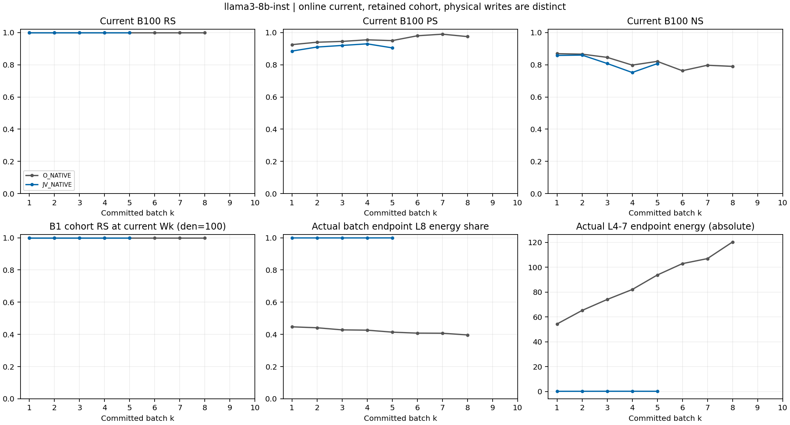
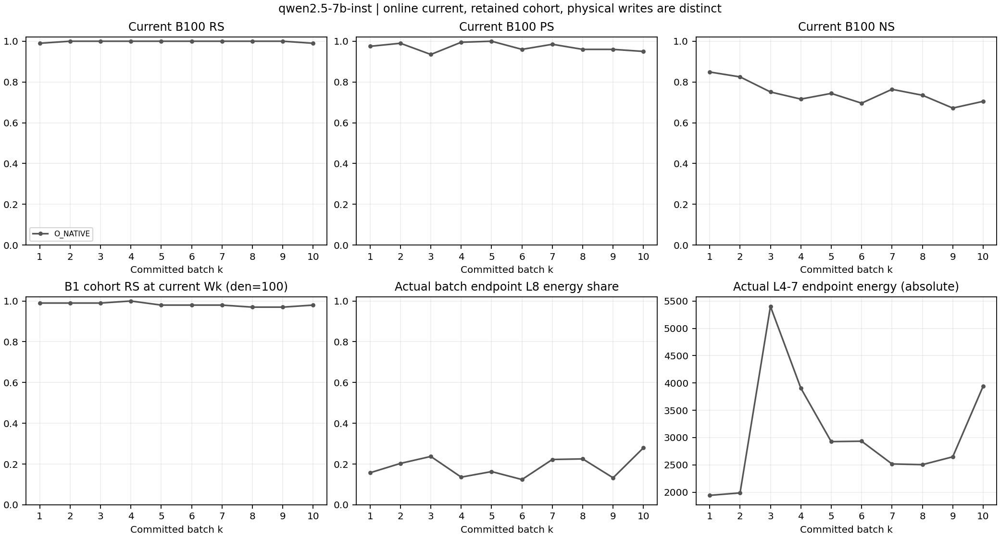

# AlphaEdit JV sequential routing — factual report

작성: 2026-09-06T20:57:10.536753+09:00 / 단계: LLAMA_B5_PAIRED_QWEN_OFFICIAL_W10_MAIN_STILL_INCOMPLETE

RS/PS/NS는 pinned NLL preference이고 tie는 실패다. 자유 생성 accuracy가 아니다. 아래 final 값은 동일한 W10의 전체 1,000 requests이며 online-own-batch pooling과 다르다.

| Model | Arm / state | RS | PS | strict PS | NS |
|---|---|---:|---:|---:|---:|
| llama3-8b-inst | PRE_EDIT_ORIGINAL_W0 / same1000_W0 | 71/1000 | 227/2000 | 66/1000 | 8820/10000 |
| qwen2.5-7b-inst | PRE_EDIT_ORIGINAL_W0 / same1000_W0 | 131/1000 | 344/2000 | 93/1000 | 8463/10000 |
| qwen2.5-7b-inst | O_NATIVE / single_final_W10_full1000 | 992/1000 | 1887/2000 | 900/1000 | 6978/10000 |

## Current-B100와 seen-prefix (완료 receipt만)

| Model | Arm | Batch/state scope | RS | PS | strict PS | NS |
|---|---|---|---:|---:|---:|---:|
| llama3-8b-inst | O_NATIVE | B1 current B100 | 100/100 | 185/200 | 88/100 | 869/1000 |
| llama3-8b-inst | O_NATIVE | B2 current B100 | 100/100 | 188/200 | 91/100 | 866/1000 |
| llama3-8b-inst | O_NATIVE | B3 current B100 | 100/100 | 189/200 | 91/100 | 846/1000 |
| llama3-8b-inst | O_NATIVE | B4 current B100 | 100/100 | 191/200 | 93/100 | 798/1000 |
| llama3-8b-inst | O_NATIVE | B5 current B100 | 100/100 | 190/200 | 92/100 | 821/1000 |
| llama3-8b-inst | O_NATIVE | B6 current B100 | 100/100 | 196/200 | 96/100 | 763/1000 |
| llama3-8b-inst | O_NATIVE | B7 current B100 | 100/100 | 198/200 | 98/100 | 797/1000 |
| llama3-8b-inst | O_NATIVE | B8 current B100 | 100/100 | 195/200 | 96/100 | 790/1000 |
| qwen2.5-7b-inst | O_NATIVE | B1 current B100 | 99/100 | 195/200 | 96/100 | 849/1000 |
| qwen2.5-7b-inst | O_NATIVE | B2 current B100 | 100/100 | 198/200 | 98/100 | 825/1000 |
| qwen2.5-7b-inst | O_NATIVE | B3 current B100 | 100/100 | 187/200 | 90/100 | 751/1000 |
| qwen2.5-7b-inst | O_NATIVE | B4 current B100 | 100/100 | 199/200 | 99/100 | 716/1000 |
| qwen2.5-7b-inst | O_NATIVE | B5 current B100 | 100/100 | 200/200 | 100/100 | 744/1000 |
| qwen2.5-7b-inst | O_NATIVE | B6 current B100 | 100/100 | 192/200 | 93/100 | 696/1000 |
| qwen2.5-7b-inst | O_NATIVE | B7 current B100 | 100/100 | 197/200 | 97/100 | 764/1000 |
| qwen2.5-7b-inst | O_NATIVE | B8 current B100 | 100/100 | 192/200 | 93/100 | 735/1000 |
| qwen2.5-7b-inst | O_NATIVE | B9 current B100 | 100/100 | 192/200 | 93/100 | 672/1000 |
| qwen2.5-7b-inst | O_NATIVE | B10 current B100 | 99/100 | 190/200 | 91/100 | 705/1000 |
| llama3-8b-inst | JV_NATIVE | B1 current B100 | 100/100 | 177/200 | 81/100 | 858/1000 |
| llama3-8b-inst | JV_NATIVE | B2 current B100 | 100/100 | 182/200 | 86/100 | 860/1000 |
| llama3-8b-inst | JV_NATIVE | B3 current B100 | 100/100 | 184/200 | 87/100 | 808/1000 |
| llama3-8b-inst | JV_NATIVE | B4 current B100 | 100/100 | 186/200 | 88/100 | 752/1000 |
| llama3-8b-inst | JV_NATIVE | B5 current B100 | 100/100 | 181/200 | 83/100 | 807/1000 |
| llama3-8b-inst | O_NATIVE | B1 same Wk seen-prefix | 100/100 | 185/200 | 88/100 | 869/1000 |
| llama3-8b-inst | O_NATIVE | B5 same Wk seen-prefix | 500/500 | 942/1000 | 455/500 | 4100/5000 |
| qwen2.5-7b-inst | O_NATIVE | B1 same Wk seen-prefix | 99/100 | 195/200 | 96/100 | 849/1000 |
| qwen2.5-7b-inst | O_NATIVE | B5 same Wk seen-prefix | 496/500 | 969/1000 | 474/500 | 3716/5000 |
| qwen2.5-7b-inst | O_NATIVE | B10 same Wk seen-prefix | 992/1000 | 1887/2000 | 900/1000 | 6978/10000 |
| llama3-8b-inst | JV_NATIVE | B1 same Wk seen-prefix | 100/100 | 177/200 | 81/100 | 858/1000 |
| llama3-8b-inst | JV_NATIVE | B5 same Wk seen-prefix | 499/500 | 902/1000 | 418/500 | 3909/5000 |

## 완전성·해석 경계

완료 chain: [1] / 계약: 6 chains × 1,000 requests. 미완료는 위 final 분모로 채우지 않는다; imputation0. Scientific promotion0.

첫 B100, B5 및 final seen-prefix는 각 표에 분리했다. 실패·overwrite 후보는 canonical denominator에 유지하고 조건부 forgetting을 별도 행으로 기록한다. 평가하지 않은 intermediate PS/NS는 NOT_RECORDED다.

## 상태와 계측

sequential_commit_checks는 실제 W/M commit→entry identity 및 append1/recompute0을 결속한다. checkpoint1/5/10은 실제 selected weight/dense M tensor를 저장하고 다시 읽어 hash를 검증했다. Low-rank journal replay parity는 NOT_TESTED이며 hash만으로 복원성을 주장하지 않는다.

layer_allocation_nodes와 layer_action_decomposition은 g/full H/G, raw/normalized work, 실제 FP32 DeltaW를 구분한다. L8 share 감소 자체는 redistribution 성공이 아니다. 다른 layer의 절대 write/기여와 RS/PS를 함께 보아야 한다. 초기 history-cost shadow는 actual basis/response/N0/qref를 유지하며 M0+L2 Gram을 실제 계산한 observer다.

## 비용

compute_accounting의 writer 시간은 endpoint 평가 포함값과 endpoint 평가값을 함께 제공한다. Keys/solves/JVP/shadow/forward/materialization은 node와 writer receipt에 분리했다. History bracket은 post-key부터 snapshot/restore까지로, 순수 append-only 시간과 동일시하지 않는다. 첫 B100 비용의 10배는 예상치이지 실제 전체 시간은 아니다.

## 독립 검토

A/B/C 및 Cases A..H 판정은 current-B100, all-seen retention, 절대 layer action, same-state history-cost 및 실제 L8-only trajectory를 함께 비교한다. Main 네 chain 보고를 L8-only 완료까지 미루지 않는다. 1,000 edits 이후 generalization, global causal claim 또는 learned history preservation 보장은 이번 범위 밖이다.

원본 root: `/mnt/raid5/janghj/ODE-edit/local/alpha-native-response-v31-sequential-routing/run-20260906-main-v2`

Source: `77358b1546d1baf83b3e251afcce663b08d7bfd7`; sample root: `40fe1afb318a4a5da9630425213644a729a1e85fb4e78c18e9a4dcd2870eefdd`.

## Checkpoint 복원 보조 state

checkpoint_context_support.csv는 이미 생성된 native context cache를 해당 chain runtime hash 및 stdout의 정확한 byte 구간과 결속한다. 문자열은 별도 private local JSON에 보존하며 Git에 싣지 않는다. Selected weights/M checkpoint 자체는 수정하지 않았고 추가 generation/model replay는 0이다. 복원 시 pinned pretrained snapshot/source/hparams/P와 해당 selected-weight/M checkpoint 및 context-cache 보조 파일을 함께 사용한다. 추가 trajectory replay parity는 NOT_TESTED다.

## 수치 기반 구분: 물리적 write·온라인/최종 retention

아래 layer 값은 실제 FP32 batch endpoint ΔW이며 velocity-action 적분과 다르다. 여러 batch의 ΔW norm 합을 W10−W0 net norm으로 부르지 않는다.

| Model | Arm | Batch | endpoint energy | L8 energy share | L4–7 energy |
|---|---|---:|---:|---:|---:|
| llama3-8b-inst | JV_NATIVE | 1 | 148.481 | 99.915581% | 0.125346 |
| llama3-8b-inst | JV_NATIVE | 5 | 230.98 | 99.940371% | 0.137731 |
| llama3-8b-inst | O_NATIVE | 1 | 98.1718 | 44.688241% | 54.3005 |
| llama3-8b-inst | O_NATIVE | 5 | 159.895 | 41.395804% | 93.7053 |
| qwen2.5-7b-inst | O_NATIVE | 1 | 2303.83 | 15.718228% | 1941.71 |
| qwen2.5-7b-inst | O_NATIVE | 5 | 3495.78 | 16.302335% | 2925.89 |
| qwen2.5-7b-inst | O_NATIVE | 10 | 5470.86 | 27.990340% | 3939.55 |

온라인 own-batch 합계는 online_own_batch_metrics.csv, 동일 final W10의 전체 1,000 문항은 final_metrics.csv에 분리했다. Rewrite forgetting의 모든 canonical 분모와 at-write-success 조건부 분모를 retention_cohort_metrics.csv에서 함께 제공한다. Overwrite 후보는 삭제하지 않고 비-overwrite 조건부 수치도 별도로 제공한다.

paired_seen_endpoint_metrics.csv는 같은 prompt/target identity의 양 arm 비교이며, 첫 batch 이후 W/M/z 자체가 같은 실험이라는 뜻이 아니다. Native metric 변화와 physical ΔW 변화를 함께 보며, 분산 자체를 성공조건으로 사용하지 않는다.

실제 완료된 chains=[1]. Source identity=['77358b1546d1baf83b3e251afcce663b08d7bfd7']. 추가 model/evaluator replay=0.

