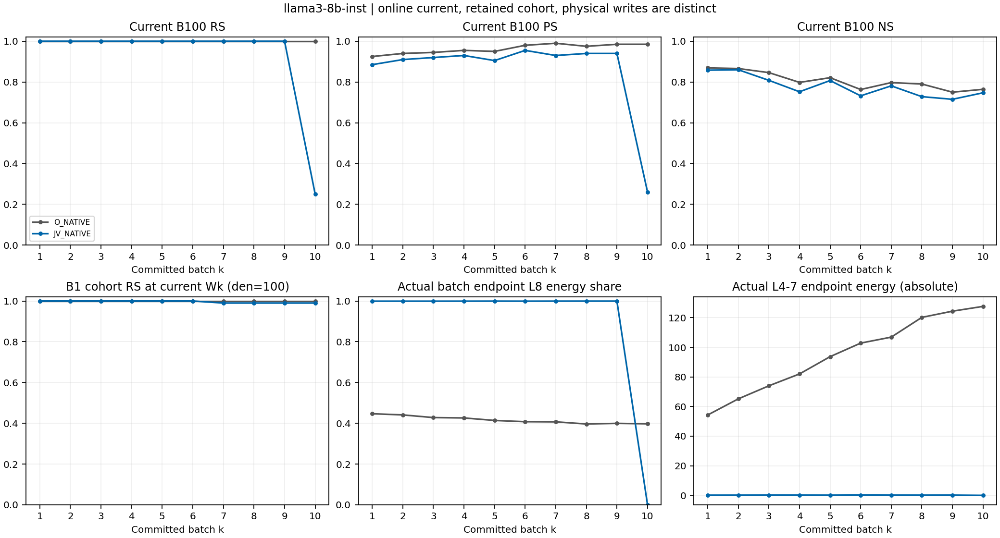
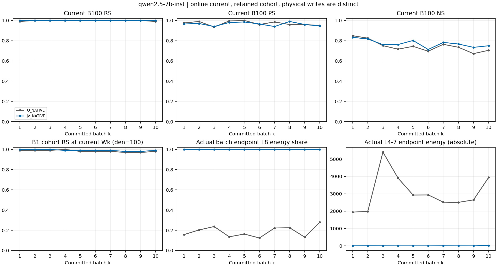

# AlphaEdit JV sequential routing — factual report

작성: 2026-09-07T00:34:38.111754+09:00 / 단계: MAIN_FOUR_CHAINS_TERMINAL_VALID_L8_NOT_YET_SUBMITTED

Task authority: `ODEEDIT-S06-ALPHA-JV-SEQUENTIAL-ROUTING-SH2-V1`. 사용자가 요청한 A/B/C 및 Cases A..H 범위의 해석 예외를 적용하되, source-backed 관측과 미검증 원인을 분리한다. 새 수식·threshold·선택·추가 trajectory는 도입하지 않았다.

RS/PS/NS는 pinned NLL preference이고 tie는 실패다. 자유 생성 accuracy가 아니다. 아래 final 값은 동일한 W10의 전체 1,000 requests이며 online-own-batch pooling과 다르다.

| Model | Arm / state | RS | PS | strict PS | NS |
|---|---|---:|---:|---:|---:|
| llama3-8b-inst | PRE_EDIT_ORIGINAL_W0 / same1000_W0 | 71/1000 | 227/2000 | 66/1000 | 8820/10000 |
| qwen2.5-7b-inst | PRE_EDIT_ORIGINAL_W0 / same1000_W0 | 131/1000 | 344/2000 | 93/1000 | 8463/10000 |
| llama3-8b-inst | O_NATIVE / single_final_W10_full1000 | 1000/1000 | 1910/2000 | 927/1000 | 7584/10000 |
| qwen2.5-7b-inst | O_NATIVE / single_final_W10_full1000 | 992/1000 | 1887/2000 | 900/1000 | 6978/10000 |
| llama3-8b-inst | JV_NATIVE / single_final_W10_full1000 | 923/1000 | 1690/2000 | 786/1000 | 7259/10000 |
| qwen2.5-7b-inst | JV_NATIVE / single_final_W10_full1000 | 997/1000 | 1894/2000 | 910/1000 | 7377/10000 |

### Final W10의 동일 분모 산술 비교

llama3-8b-inst, JV_NATIVE−O_NATIVE: RS -77/1000 (-7.700 percentage points), PS -220/2000 (-11.000 percentage points), NS -325/10000 (-3.250 percentage points).

qwen2.5-7b-inst, JV_NATIVE−O_NATIVE: RS +5/1000 (+0.500 percentage points), PS +7/2000 (+0.350 percentage points), NS +399/10000 (+3.990 percentage points).

같은 sample/order와 final W10 평가 범위의 end-to-end 비교다. Batch1 이후 W/M/z가 arm별로 달라져 same-state controller 인과 비교와 같지 않다. 미완료 arm은 위 산술에 포함하지 않으며, main 네 chain 보고 뒤 양 모델 L8-only를 결과 선택 없이 진행한다.

## Current-B100와 seen-prefix (완료 receipt만)

| Model | Arm | Batch/state scope | RS | PS | strict PS | NS |
|---|---|---|---:|---:|---:|---:|
| llama3-8b-inst | O_NATIVE | B1 current B100 | 100/100 | 185/200 | 88/100 | 869/1000 |
| llama3-8b-inst | O_NATIVE | B2 current B100 | 100/100 | 188/200 | 91/100 | 866/1000 |
| llama3-8b-inst | O_NATIVE | B3 current B100 | 100/100 | 189/200 | 91/100 | 846/1000 |
| llama3-8b-inst | O_NATIVE | B4 current B100 | 100/100 | 191/200 | 93/100 | 798/1000 |
| llama3-8b-inst | O_NATIVE | B5 current B100 | 100/100 | 190/200 | 92/100 | 821/1000 |
| llama3-8b-inst | O_NATIVE | B6 current B100 | 100/100 | 196/200 | 96/100 | 763/1000 |
| llama3-8b-inst | O_NATIVE | B7 current B100 | 100/100 | 198/200 | 98/100 | 797/1000 |
| llama3-8b-inst | O_NATIVE | B8 current B100 | 100/100 | 195/200 | 96/100 | 790/1000 |
| llama3-8b-inst | O_NATIVE | B9 current B100 | 100/100 | 197/200 | 97/100 | 750/1000 |
| llama3-8b-inst | O_NATIVE | B10 current B100 | 100/100 | 197/200 | 97/100 | 764/1000 |
| qwen2.5-7b-inst | O_NATIVE | B1 current B100 | 99/100 | 195/200 | 96/100 | 849/1000 |
| qwen2.5-7b-inst | O_NATIVE | B2 current B100 | 100/100 | 198/200 | 98/100 | 825/1000 |
| qwen2.5-7b-inst | O_NATIVE | B3 current B100 | 100/100 | 187/200 | 90/100 | 751/1000 |
| qwen2.5-7b-inst | O_NATIVE | B4 current B100 | 100/100 | 199/200 | 99/100 | 716/1000 |
| qwen2.5-7b-inst | O_NATIVE | B5 current B100 | 100/100 | 200/200 | 100/100 | 744/1000 |
| qwen2.5-7b-inst | O_NATIVE | B6 current B100 | 100/100 | 192/200 | 93/100 | 696/1000 |
| qwen2.5-7b-inst | O_NATIVE | B7 current B100 | 100/100 | 197/200 | 97/100 | 764/1000 |
| qwen2.5-7b-inst | O_NATIVE | B8 current B100 | 100/100 | 192/200 | 93/100 | 735/1000 |
| qwen2.5-7b-inst | O_NATIVE | B9 current B100 | 100/100 | 192/200 | 93/100 | 672/1000 |
| qwen2.5-7b-inst | O_NATIVE | B10 current B100 | 99/100 | 190/200 | 91/100 | 705/1000 |
| llama3-8b-inst | JV_NATIVE | B1 current B100 | 100/100 | 177/200 | 81/100 | 858/1000 |
| llama3-8b-inst | JV_NATIVE | B2 current B100 | 100/100 | 182/200 | 86/100 | 860/1000 |
| llama3-8b-inst | JV_NATIVE | B3 current B100 | 100/100 | 184/200 | 87/100 | 808/1000 |
| llama3-8b-inst | JV_NATIVE | B4 current B100 | 100/100 | 186/200 | 88/100 | 752/1000 |
| llama3-8b-inst | JV_NATIVE | B5 current B100 | 100/100 | 181/200 | 83/100 | 807/1000 |
| llama3-8b-inst | JV_NATIVE | B6 current B100 | 100/100 | 191/200 | 91/100 | 732/1000 |
| llama3-8b-inst | JV_NATIVE | B7 current B100 | 100/100 | 186/200 | 89/100 | 781/1000 |
| llama3-8b-inst | JV_NATIVE | B8 current B100 | 100/100 | 188/200 | 90/100 | 728/1000 |
| llama3-8b-inst | JV_NATIVE | B9 current B100 | 100/100 | 188/200 | 90/100 | 715/1000 |
| llama3-8b-inst | JV_NATIVE | B10 current B100 | 25/100 | 52/200 | 21/100 | 747/1000 |
| qwen2.5-7b-inst | JV_NATIVE | B1 current B100 | 100/100 | 193/200 | 94/100 | 833/1000 |
| qwen2.5-7b-inst | JV_NATIVE | B2 current B100 | 100/100 | 194/200 | 94/100 | 817/1000 |
| qwen2.5-7b-inst | JV_NATIVE | B3 current B100 | 100/100 | 188/200 | 91/100 | 761/1000 |
| qwen2.5-7b-inst | JV_NATIVE | B4 current B100 | 100/100 | 196/200 | 96/100 | 762/1000 |
| qwen2.5-7b-inst | JV_NATIVE | B5 current B100 | 100/100 | 197/200 | 97/100 | 802/1000 |
| qwen2.5-7b-inst | JV_NATIVE | B6 current B100 | 100/100 | 193/200 | 94/100 | 713/1000 |
| qwen2.5-7b-inst | JV_NATIVE | B7 current B100 | 100/100 | 188/200 | 91/100 | 783/1000 |
| qwen2.5-7b-inst | JV_NATIVE | B8 current B100 | 100/100 | 198/200 | 98/100 | 767/1000 |
| qwen2.5-7b-inst | JV_NATIVE | B9 current B100 | 100/100 | 192/200 | 94/100 | 734/1000 |
| qwen2.5-7b-inst | JV_NATIVE | B10 current B100 | 100/100 | 189/200 | 91/100 | 750/1000 |
| llama3-8b-inst | O_NATIVE | B1 same Wk seen-prefix | 100/100 | 185/200 | 88/100 | 869/1000 |
| llama3-8b-inst | O_NATIVE | B5 same Wk seen-prefix | 500/500 | 942/1000 | 455/500 | 4100/5000 |
| llama3-8b-inst | O_NATIVE | B10 same Wk seen-prefix | 1000/1000 | 1910/2000 | 927/1000 | 7584/10000 |
| qwen2.5-7b-inst | O_NATIVE | B1 same Wk seen-prefix | 99/100 | 195/200 | 96/100 | 849/1000 |
| qwen2.5-7b-inst | O_NATIVE | B5 same Wk seen-prefix | 496/500 | 969/1000 | 474/500 | 3716/5000 |
| qwen2.5-7b-inst | O_NATIVE | B10 same Wk seen-prefix | 992/1000 | 1887/2000 | 900/1000 | 6978/10000 |
| llama3-8b-inst | JV_NATIVE | B1 same Wk seen-prefix | 100/100 | 177/200 | 81/100 | 858/1000 |
| llama3-8b-inst | JV_NATIVE | B5 same Wk seen-prefix | 499/500 | 902/1000 | 418/500 | 3909/5000 |
| llama3-8b-inst | JV_NATIVE | B10 same Wk seen-prefix | 923/1000 | 1690/2000 | 786/1000 | 7259/10000 |
| qwen2.5-7b-inst | JV_NATIVE | B1 same Wk seen-prefix | 100/100 | 193/200 | 94/100 | 833/1000 |
| qwen2.5-7b-inst | JV_NATIVE | B5 same Wk seen-prefix | 499/500 | 967/1000 | 472/500 | 3907/5000 |
| qwen2.5-7b-inst | JV_NATIVE | B10 same Wk seen-prefix | 997/1000 | 1894/2000 | 910/1000 | 7377/10000 |

## 완전성·해석 경계

완료 chain: [0, 1, 2, 3] / 계약: 6 chains × 1,000 requests. 미완료는 위 final 분모로 채우지 않는다; imputation0. Scientific promotion0.

첫 B100, B5 및 final seen-prefix는 각 표에 분리했다. 실패·overwrite 후보는 canonical denominator에 유지하고 조건부 forgetting을 별도 행으로 기록한다. 평가하지 않은 intermediate PS/NS는 NOT_RECORDED다.

## 상태와 계측

sequential_commit_checks는 실제 W/M commit→entry identity 및 append1/recompute0을 결속한다. checkpoint1/5/10은 실제 selected weight/dense M tensor를 저장하고 다시 읽어 hash를 검증했다. Low-rank journal replay parity는 NOT_TESTED이며 hash만으로 복원성을 주장하지 않는다.

layer_allocation_nodes와 layer_action_decomposition은 g/full H/G, raw/normalized work, 실제 FP32 DeltaW를 구분한다. L8 share 감소 자체는 redistribution 성공이 아니다. 다른 layer의 절대 write/기여와 RS/PS를 함께 보아야 한다. 초기 history-cost shadow는 actual basis/response/N0/qref를 유지하며 M0+L2 Gram을 실제 계산한 observer다.

## 비용

compute_accounting의 writer 시간은 endpoint 평가 포함값과 endpoint 평가값을 함께 제공한다. Keys/solves/JVP/shadow/forward/materialization은 node와 writer receipt에 분리했다. History bracket은 post-key부터 snapshot/restore까지로, 순수 append-only 시간과 동일시하지 않는다. 첫 B100 비용의 10배는 예상치이지 실제 전체 시간은 아니다. Terminal compute.wall은 time.perf_counter의 절대 clock reading이며 elapsed가 아니다. 전체 시간은 terminal total_seconds/run_registry process_total_seconds, 구간 시간은 difference로 기록한 wall을 사용한다.

## 독립 검토

A/B/C 및 Cases A..H 판정은 current-B100, all-seen retention, 절대 layer action, same-state history-cost 및 실제 L8-only trajectory를 함께 비교한다. Main 네 chain 보고를 L8-only 완료까지 미루지 않는다. 1,000 edits 이후 generalization, global causal claim 또는 learned history preservation 보장은 이번 범위 밖이다.

원본 root: `/mnt/raid5/janghj/ODE-edit/local/alpha-native-response-v31-sequential-routing/run-20260906-main-v2`

Source: `77358b1546d1baf83b3e251afcce663b08d7bfd7`; sample root: `40fe1afb318a4a5da9630425213644a729a1e85fb4e78c18e9a4dcd2870eefdd`.

## Checkpoint 복원 보조 state

checkpoint_context_support.csv는 이미 생성된 native context cache를 해당 chain runtime hash 및 stdout의 정확한 byte 구간과 결속한다. 문자열은 별도 private local JSON에 보존하며 Git에 싣지 않는다. Selected weights/M checkpoint 자체는 수정하지 않았고 추가 generation/model replay는 0이다. 복원 시 pinned pretrained snapshot/source/hparams/P와 해당 selected-weight/M checkpoint 및 context-cache 보조 파일을 함께 사용한다. 추가 trajectory replay parity는 NOT_TESTED다.

## 수치 기반 구분: 물리적 write·온라인/최종 retention

아래 layer 값은 실제 FP32 batch endpoint ΔW이며 velocity-action 적분과 다르다. 여러 batch의 ΔW norm 합을 W10−W0 net norm으로 부르지 않는다.

| Model | Arm | Batch | endpoint energy | L8 energy share | L4–7 energy |
|---|---|---:|---:|---:|---:|
| llama3-8b-inst | JV_NATIVE | 1 | 148.481 | 99.915581% | 0.125346 |
| llama3-8b-inst | JV_NATIVE | 5 | 230.98 | 99.940371% | 0.137731 |
| llama3-8b-inst | JV_NATIVE | 10 | 2.7167e-09 | 0.008842% | 2.71646e-09 |
| llama3-8b-inst | O_NATIVE | 1 | 98.1718 | 44.688241% | 54.3005 |
| llama3-8b-inst | O_NATIVE | 5 | 159.895 | 41.395804% | 93.7053 |
| llama3-8b-inst | O_NATIVE | 10 | 211.888 | 39.742636% | 127.678 |
| qwen2.5-7b-inst | JV_NATIVE | 1 | 6134.16 | 99.963612% | 2.23208 |
| qwen2.5-7b-inst | JV_NATIVE | 5 | 5324.72 | 99.993082% | 0.368352 |
| qwen2.5-7b-inst | JV_NATIVE | 10 | 17152.7 | 99.875923% | 21.2824 |
| qwen2.5-7b-inst | O_NATIVE | 1 | 2303.83 | 15.718228% | 1941.71 |
| qwen2.5-7b-inst | O_NATIVE | 5 | 3495.78 | 16.302335% | 2925.89 |
| qwen2.5-7b-inst | O_NATIVE | 10 | 5470.86 | 27.990340% | 3939.55 |

온라인 own-batch 합계는 online_own_batch_metrics.csv, 동일 final W10의 전체 1,000 문항은 final_metrics.csv에 분리했다. Rewrite forgetting의 모든 canonical 분모와 at-write-success 조건부 분모를 retention_cohort_metrics.csv에서 함께 제공한다. Overwrite 후보는 삭제하지 않고 비-overwrite 조건부 수치도 별도로 제공한다.

paired_seen_endpoint_metrics.csv는 같은 prompt/target identity의 양 arm 비교이며, 첫 batch 이후 W/M/z 자체가 같은 실험이라는 뜻이 아니다. Native metric 변화와 physical ΔW 변화를 함께 보며, 분산 자체를 성공조건으로 사용하지 않는다.

실제 완료된 chains=[0, 1, 2, 3]. Source identity=['77358b1546d1baf83b3e251afcce663b08d7bfd7']. 추가 model/evaluator replay=0.

## Source-exact N0 민감도 (observer-only; sweep0)

N0는 FP32 entry residual norm을 request별 scale로 동결하고 scale>0인 행을 1/(scale×sqrt(active count))로 가중한다. 작은 양수를 위한 새 floor는 넣지 않았다. 아래 response Gram H는 PsiᵀPsi이며 history covariance M이나 native metric G와 다르다.

| Model | Arm | B | min active N0 | max/min N0 | qN_ref | max diag response H (node0) | final V/V0 | actual endpoint energy |
|---|---|---:|---:|---:|---:|---:|---:|---:|
| llama3-8b-inst | JV_NATIVE | 1 | 3.53112649918 | 1.52945879774 | 840.21510806 | 11.7990740723 | 0.004851641794 | 148.481321565 |
| llama3-8b-inst | JV_NATIVE | 5 | 3.7763478756 | 1.56556598267 | 1183.79787943 | 13.88516191 | 0.00493974571553 | 230.98006195 |
| llama3-8b-inst | JV_NATIVE | 10 | 3.57471290044e-05 | 173776.31037 | 1481.58424439 | 4402280.67568 | 0.999947188578 | 2.71670070011e-09 |
| qwen2.5-7b-inst | JV_NATIVE | 1 | 60.8864822388 | 3.11577864731 | 49895.0036474 | 21.1421309599 | 0.00452914385716 | 6134.16447099 |
| qwen2.5-7b-inst | JV_NATIVE | 5 | 46.6688842773 | 3.94605642258 | 40585.5796008 | 30.3990603814 | 0.00451563665806 | 5324.71923127 |
| qwen2.5-7b-inst | JV_NATIVE | 10 | 48.2253494263 | 7.28689748589 | 207564.286243 | 22.6367368925 | 0.0210310952001 | 17152.6531325 |

작은 N0와 큰 H의 동시 관측은 normalized objective 민감도와 일관되지만, per-request H 분해 및 normalization ablation이 없으므로 단독 원인으로 확정하지 않는다. qN_ref/history 비용과 response Gram 변화를 혼합하지 않는다. Primal virtual/materialized parity는 기존 FP32 tensor tolerance로 검사되며 N0-normalized discrepancy는 별도 observer다. Normalized observer 값에 새 사후 fail threshold를 만들지 않았다. 모든 finite endpoint/실패 문항은 분모에 유지하며 source/normalization 변경·재실행0이다.

### 기존 stock target log와의 결속

이 표는 완료된 자기 chain의 기존 stdout만 raw-free로 추출했다. Native optimizer의 소수점 세 자리 출력 loss는 canonical rewrite/rephrase NLL과 다른 필드이며, 새 evaluator 측정이나 replay가 아니다.

llama3-8b-inst JV_NATIVE B10, case 4228: native optimizer loss rows=1, rounded initial total loss=0.043, reported optimizer delta norm=0; 별도 terminal capture 대비 N0 scale=3.57471290044e-05, active=True. 전체 1,000 optimizer blocks의 batch별 backward ledger와 request/printed-target identity를 대조했다. 미세한 capture 잔차가 양수인 source N0에 남아 있는 사실과 response Gram 확대를 구분해서 기록하며, 원인 ablation은 실행하지 않았다.

## 최종 해석을 위한 질문별 근거 (미완료 arm은 대입하지 않음)

### 1. 실제 sequential 누적과 복원성

각 완료 batch의 W/M commit→next-entry hash, history append1 및 commit 중 target/writer/evaluator 재실행0은 state_continuity_summary.csv와 sequential_commit_checks.csv에 있다. Semantic outcome과 무관하게 분모와 history를 유지했다. 실제 W/M checkpoint1/5/10 저장·tensor 재해시는 checkpoint_inventory.csv에 있으며, 전체 trajectory replay를 검증했다는 뜻은 아니다.

### 2–3. L8 집중·물리적 재배분·감속을 구분

| Model | Arm | B | actual batch ΔW energy | L8 energy share | L4–7 energy | L4–7 signed progress | L8 native work share | history/raw work |
|---|---|---:|---:|---:|---:|---:|---:|---:|
| llama3-8b-inst | JV_NATIVE | 1 | 148.481321565 | 0.999155813401 | 0.12534594183 | 0.0175031907683 | 0.999107059616 | 0 |
| llama3-8b-inst | JV_NATIVE | 5 | 230.98006195 | 0.999403711811 | 0.137730682845 | 0.0151036111148 | 0.999396406174 | 0.0214023663339 |
| llama3-8b-inst | JV_NATIVE | 10 | 2.71670070011e-09 | 8.84158743433e-05 | 2.71646050064e-09 | 4.94503642926e-06 | 0.000587751542762 | 0.0551447930219 |
| llama3-8b-inst | O_NATIVE | 1 | 98.1717915909 | 0.446882408593 | 54.3005449089 | NOT_RECORDED | NOT_RECORDED | NOT_RECORDED |
| llama3-8b-inst | O_NATIVE | 5 | 159.895180201 | 0.41395804256 | 93.70528439 | NOT_RECORDED | NOT_RECORDED | NOT_RECORDED |
| llama3-8b-inst | O_NATIVE | 10 | 211.888009392 | 0.397426360563 | 127.678128973 | NOT_RECORDED | NOT_RECORDED | NOT_RECORDED |
| qwen2.5-7b-inst | JV_NATIVE | 1 | 6134.16447099 | 0.999636123718 | 2.23207696176 | 0.0112594036407 | 0.999603312316 | 0 |
| qwen2.5-7b-inst | JV_NATIVE | 5 | 5324.71923127 | 0.99993082229 | 0.368351882234 | 0.00540340563954 | 0.999923291721 | 0.00049802030952 |
| qwen2.5-7b-inst | JV_NATIVE | 10 | 17152.6531325 | 0.998759234942 | 21.2824126636 | 0.00821961342787 | 0.996257070125 | 0.697885533806 |
| qwen2.5-7b-inst | O_NATIVE | 1 | 2303.82666014 | 0.157182283267 | 1941.70592545 | NOT_RECORDED | NOT_RECORDED | NOT_RECORDED |
| qwen2.5-7b-inst | O_NATIVE | 5 | 3495.77935817 | 0.163023348358 | 2925.88570208 | NOT_RECORDED | NOT_RECORDED | NOT_RECORDED |
| qwen2.5-7b-inst | O_NATIVE | 10 | 5470.8604806 | 0.279903398607 | 3939.54803878 | NOT_RECORDED | NOT_RECORDED | NOT_RECORDED |

Share 감소는 절대 L4–7 write/기여 증가와 같지 않다. 위 energy는 해당 batch의 actual endpoint ΔW 제곱합이며, native work는 h를 한 번 곱한 velocity-action 적분이다. Official one-pass의 Euler velocity work는 NOT_RECORDED이며 0으로 대입하지 않았다. Batch별 metric/qN_ref 및 target이 달라지므로 coefficient만으로 physical migration을 주장하지 않는다.

### 4. 같은 state에서 history 비용이 선택에 미친 직접 영향

| Model | Arm | Batch/node | native cosine(actual vs initial cost) | Frobenius cosine | L8 c actual | L8 c initial-cost shadow | progress actual | progress shadow |
|---|---|---|---:|---:|---:|---:|---:|---:|
| llama3-8b-inst | JV_NATIVE | 1/0 | 1 | 1 | 0.433623544643 | 0.433623544643 | 0.976067112026 | 0.976067112026 |
| llama3-8b-inst | JV_NATIVE | 5/0 | 0.999999884982 | 0.999999884612 | 0.460896185711 | 0.461317148224 | 0.973938937664 | 0.974389545304 |
| llama3-8b-inst | JV_NATIVE | 10/0 | 1 | 1 | 0 | 0 | 6.11494448218e-06 | 6.11494449132e-06 |
| qwen2.5-7b-inst | JV_NATIVE | 1/0 | 1 | 1 | 0.368901698147 | 0.368901698147 | 0.983089870583 | 0.983089870583 |
| qwen2.5-7b-inst | JV_NATIVE | 5/0 | 0.999999999991 | 0.999999999991 | 0.381983360146 | 0.381987709896 | 0.982546574052 | 0.982553936229 |
| qwen2.5-7b-inst | JV_NATIVE | 10/0 | 0.999988528854 | 0.999988500279 | 0.398825048388 | 0.405603655917 | 0.9683197191 | 0.980512502266 |

실제 G_initial, c와 physical coefficients는 history_cost_shadows.csv에 보존했다. 이는 actual basis/response/N0/qN_ref를 고정한 비용-only observer이며, history-free method나 retention에 대한 전체 인과 효과가 아니다. Zero-field는 receipt status를 유지하며 cosine을 생성하지 않는다.

### 5. 신규 editability와 누적 retention은 별개의 비교

첫 B100 current 비교는 초기 operating point 차이다. Final W10 전체 1,000 요청은 누적 결과다. 두 값을 섞어 초기 차이를 forgetting으로 설명하지 않는다.

| Model | Arm | scope | RS | PS | NS | rewrite new/true NLL mean | rephrase new/true NLL mean |
|---|---|---|---:|---:|---:|---|---|
| llama3-8b-inst | O_NATIVE | first current B100 | 100/100 | 185/200 | 869/1000 | 0.00194517361124 / 14.4058408785 | 1.56658244085 / 9.2453742981 |
| qwen2.5-7b-inst | O_NATIVE | first current B100 | 99/100 | 195/200 | 849/1000 | 0.0362202721037 / 15.078082574 | 1.79856255578 / 12.2744706081 |
| llama3-8b-inst | JV_NATIVE | first current B100 | 100/100 | 177/200 | 858/1000 | 0.00258733163111 / 13.8465310717 | 2.09571930636 / 8.34000469116 |
| qwen2.5-7b-inst | JV_NATIVE | first current B100 | 100/100 | 193/200 | 833/1000 | 0.0200192617554 / 15.2584136891 | 1.87425335185 / 12.0804607886 |
| llama3-8b-inst | PRE_EDIT_ORIGINAL_W0 | same1000_W0 | 71/1000 | 227/2000 | 8820/10000 | 11.0457594866 / 4.6960783765 | 10.0551940772 / 4.8536434862 |
| qwen2.5-7b-inst | PRE_EDIT_ORIGINAL_W0 | same1000_W0 | 131/1000 | 344/2000 | 8463/10000 | 10.3314394364 / 5.24266464682 | 10.2863036182 / 5.80911144742 |
| llama3-8b-inst | O_NATIVE | single_final_W10_full1000 | 1000/1000 | 1910/2000 | 7584/10000 | 0.0317014630366 / 14.201043247 | 1.35799571887 / 9.99939827495 |
| qwen2.5-7b-inst | O_NATIVE | single_final_W10_full1000 | 992/1000 | 1887/2000 | 6978/10000 | 0.345385462002 / 13.380405465 | 2.18000488976 / 11.1779674946 |
| llama3-8b-inst | JV_NATIVE | single_final_W10_full1000 | 923/1000 | 1690/2000 | 7259/10000 | 0.893713018719 / 12.4817165027 | 2.54764441611 / 8.47460142059 |
| qwen2.5-7b-inst | JV_NATIVE | single_final_W10_full1000 | 997/1000 | 1894/2000 | 7377/10000 | 0.236969595763 / 13.1026864875 | 2.28301495828 / 11.2856026611 |

NLL median/p90/max, strict preference 및 teacher-forced token correctness는 current_batch_metrics.csv / final_metrics.csv의 별도 열에 보존한다. 자유 생성 accuracy는 NOT_RECORDED다.

| Model | Arm | at-write rewrite success | final W10 success | at-write failure | at-write success→final failure | at-write failure→final recovery | non-overwrite conditional forgetting |
|---|---|---:|---:|---:|---:|---:|---:|
| llama3-8b-inst | JV_NATIVE | 925/1000 | 923/1000 | 75/1000 | 2/925 | 0/75 | 1/924 |
| llama3-8b-inst | O_NATIVE | 1000/1000 | 1000/1000 | 0/1000 | 0/1000 | 0/0 | 0/999 |
| qwen2.5-7b-inst | JV_NATIVE | 1000/1000 | 997/1000 | 0/1000 | 3/1000 | 0/0 | 3/999 |
| qwen2.5-7b-inst | O_NATIVE | 998/1000 | 992/1000 | 2/1000 | 6/998 | 0/2 | 6/997 |

분모 0은 빈 조건부 집합이며 rate를 계산하지 않는다. 위 분해는 final rewrite 손실을 전부 forgetting으로 오인하지 않기 위한 것이다. At-write와 final 사이에 일시적 실패 후 회복한 경로는 별도의 cohort/retention matrix에 보존했다.

### 6. Official 대비 retention/locality 및 문항 전이

paired_seen_endpoint_metrics.csv는 exact request/prompt identity를 확인한 O/JV/L8 end-to-end 차이와 양방향 성공 전이를 제공한다. B1 이후 arm-local W/M/z가 다르므로 same-state causal contrast라고 부르지 않는다.

| Model | Arm | Wk | W0-success→failure / W0-success | W0-failure→recovery / W0-failure | all NS prompts |
|---|---|---:|---|---|---:|
| llama3-8b-inst | JV_NATIVE | 1 | 37/886 | 9/114 | 1000 |
| llama3-8b-inst | JV_NATIVE | 5 | 588/4392 | 105/608 | 5000 |
| llama3-8b-inst | JV_NATIVE | 10 | 1775/8820 | 214/1180 | 10000 |
| llama3-8b-inst | O_NATIVE | 1 | 26/886 | 9/114 | 1000 |
| llama3-8b-inst | O_NATIVE | 5 | 405/4392 | 113/608 | 5000 |
| llama3-8b-inst | O_NATIVE | 10 | 1490/8820 | 254/1180 | 10000 |
| qwen2.5-7b-inst | JV_NATIVE | 1 | 39/860 | 12/140 | 1000 |
| qwen2.5-7b-inst | JV_NATIVE | 5 | 462/4229 | 140/771 | 5000 |
| qwen2.5-7b-inst | JV_NATIVE | 10 | 1390/8463 | 304/1537 | 10000 |
| qwen2.5-7b-inst | O_NATIVE | 1 | 16/860 | 5/140 | 1000 |
| qwen2.5-7b-inst | O_NATIVE | 5 | 642/4229 | 129/771 | 5000 |
| qwen2.5-7b-inst | O_NATIVE | 10 | 1838/8463 | 353/1537 | 10000 |

Retained/failed/recovered/overwrite-candidate rewrite cohort의 unconditional/conditional 분모는 retention_cohort_metrics.csv에 별도로 있다. 동일 NS 총점이 같은 문항 보존이라는 뜻이 아니며, NS를 general pretrained capability의 보장으로 확대하지 않는다.

### 7. L8-only로 설명되지 않는 JV 이득

Same-state L8/single-layer shadow는 추가 forward/JVP0인 algebraic comparison이며 actual L8 chain과 다르다. joint objective improvement와 best single-layer는 node_mechanism_summary.csv에 있다. Actual L8 chain은 아직 둘 다 완료되지 않았으므로 Case G/H 또는 L8-only 대비 최종 이득 판정은 보류한다.

### 8. 추가 계산 비용

실제 process wall/GPU-hours는 run_registry.csv, model F/B/input-token-slot/solve/JVP와 구간별 비용은 compute_accounting.csv에 있다. write_including_endpoint에서 endpoint_observation bracket을 빼도 pure solver latency와 같지 않다. Endpoint bracket에는 evaluator와 physical metric observer/capture overhead가 포함된다. History bracket도 append-only 시간이 아니다. L8는 actual JVP4/batch, JV20/batch이나 기존 all-layer field build 재사용 비용은 그대로 계상한다.

### 9. 검증 범위 밖과 경쟁 설명

1,000 edits 이후 안정성, 추가 seed/order, all-capability preservation, history-free whole-method counterfactual, learned preservation, unconditional causal superiority는 검증하지 않았다. L8 집중의 간섭 증가와 early-layer write 감소의 downstream key-drift 완화는 경쟁 가설이며, 이번 관측만으로 원인을 확정하지 않는다. 새로운 threshold/수식/selector/trajectory replay/imputation0.

