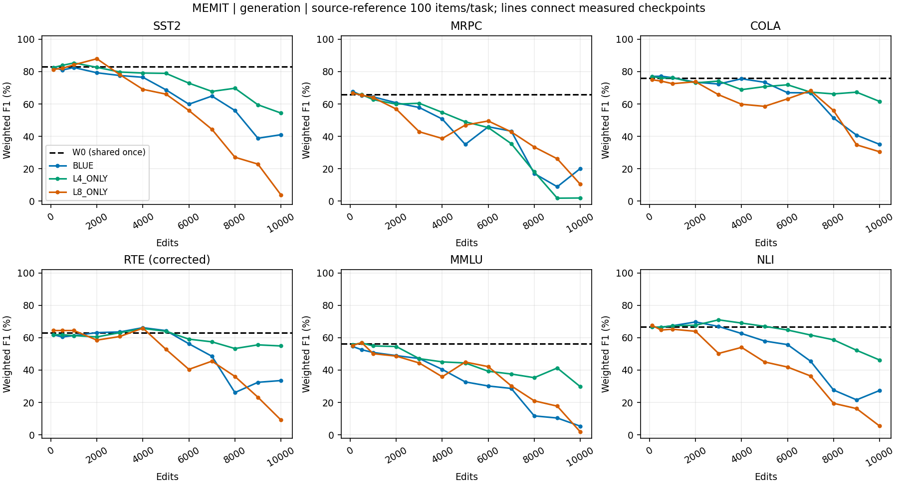
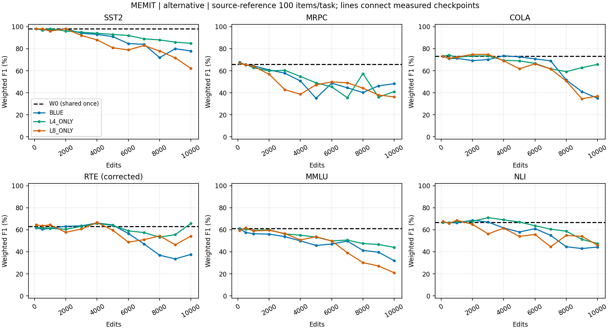
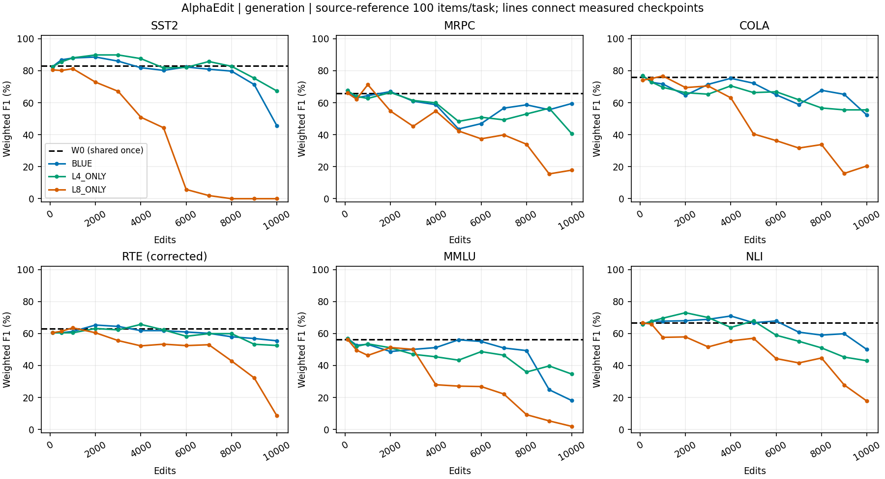
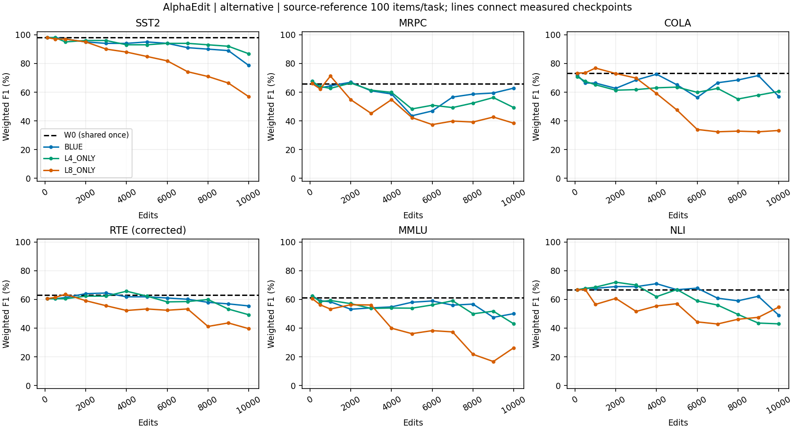

# BLUE checkpoint downstream 평가 — 최종 한국어 검산 보고서

작성: Server2 / 2026-09-12. `scientific_promotion=false`. 신규 GPU 평가 없이 job42706의 완료 결과만 CPU로 검산했다. 기존 전용 branch에는 준비 감사만 있었고 최종 보고서는 없었다. 원 실행 source와 raw는 수정하지 않았다.

## 1. 완료 범위와 읽는 법

단발 scheduler 확인은 `COMPLETED / 0:0`, GPU allocation 37,250초였다. INITIAL_VALID는 W0+첫 checkpoint의 초기 gate였으며, 이번에는 전체 terminal과 각 상태의 완료/복원 기록을 별도로 확인했다. **73 상태(W0 1 + 72 checkpoint), 438 state-task cells, 43,800 task-example 관측**이 실제 존재하고 누락/실패 0이다. 두 예측 분기의 876개 집계 모두 독립 계산과 저장값의 최대 절대 차이 0.0였다.

평가 문항은 task당 고정 100개, 총 600개다. 이를 73개 상태에서 반복 측정했으므로 43,800개의 독립 표본이 아니다. W0는 한 번 측정한 공통값을 두 계열 표에서 참조한다. 이 문서의 edit 10,000은 편집 checkpoint 위치이며 downstream 10,000문항 평가를 뜻하지 않는다. 각 task는 full benchmark가 아닌 봉인된 100-row reference panel이다.

주표의 F1은 **support-weighted F1×100**이다. generation은 원본 생성 parser의 예측, alternative는 고정 답안 문자열의 teacher-forced 확률 비교다. 둘은 서로 다른 지표이고 좋은 쪽만 선택하지 않는다. 아래 Δ는 공통 W0 대비 percentage points(pp)다. BLUE는 L4+L8; L4_ONLY/L8_ONLY는 각 단일 layer variant이며 Official native baseline이라는 뜻이 아니다.

## 2.1. MEMIT — final10k 독립 비교표

### generation: weighted F1 % (W0 대비 Δpp)


| 상태 | sst2 | mrpc | cola | rte | mmlu | nli |
| --- | --- | --- | --- | --- | --- | --- |
| W0 | 83.11 (+0.00) | 65.76 (+0.00) | 76.07 (+0.00) | 63.11 (+0.00) | 56.24 (+0.00) | 66.60 (+0.00) |
| BLUE | 41.03 (-42.08) | 20.13 (-45.63) | 35.06 (-41.00) | 33.52 (-29.59) | 5.36 (-50.88) | 27.38 (-39.21) |
| L4_ONLY | 54.40 (-28.71) | 1.96 (-63.80) | 61.57 (-14.50) | 54.88 (-8.23) | 29.75 (-26.49) | 46.19 (-20.40) |
| L8_ONLY | 3.88 (-79.23) | 10.45 (-55.32) | 30.51 (-45.56) | 9.19 (-53.92) | 1.85 (-54.39) | 5.45 (-61.14) |


### alternative: weighted F1 % (W0 대비 Δpp)


| 상태 | sst2 | mrpc | cola | rte | mmlu | nli |
| --- | --- | --- | --- | --- | --- | --- |
| W0 | 98.00 (+0.00) | 65.76 (+0.00) | 73.13 (+0.00) | 63.11 (+0.00) | 61.10 (+0.00) | 66.60 (+0.00) |
| BLUE | 77.96 (-20.03) | 48.26 (-17.50) | 35.03 (-38.10) | 37.63 (-25.48) | 31.89 (-29.21) | 44.32 (-22.28) |
| L4_ONLY | 84.93 (-13.07) | 41.07 (-24.70) | 65.78 (-7.35) | 65.68 (+2.57) | 44.02 (-17.08) | 47.48 (-19.11) |
| L8_ONLY | 62.17 (-35.83) | 36.29 (-29.47) | 37.11 (-36.02) | 54.23 (-8.88) | 20.97 (-40.13) | 46.09 (-20.51) |


### Final10k 정확도·invalid·paired 변화

셀은 `정답/100; invalid; lost/gained`다. lost는 W0 정답→해당 상태 오답, gained는 W0 오답→정답이며 invalid도 오답 분모에 남긴다. F1 변화와 lost−gained를 동일시하지 않는다.

**generation**

| 상태 | sst2 | mrpc | cola | rte | mmlu | nli |
| --- | --- | --- | --- | --- | --- | --- |
| BLUE | 27/100; 70; 50/4 | 13/100; 74; 58/4 | 49/100; 4; 32/5 | 28/100; 53; 41/3 | 4/100; 75; 51/3 | 17/100; 77; 55/5 |
| L4_ONLY | 39/100; 60; 37/3 | 1/100; 99; 66/0 | 60/100; 7; 22/6 | 55/100; 17; 13/2 | 21/100; 58; 36/5 | 47/100; 7; 32/12 |
| L8_ONLY | 2/100; 97; 71/0 | 7/100; 83; 65/5 | 36/100; 31; 43/3 | 5/100; 91; 61/0 | 1/100; 90; 51/0 | 3/100; 95; 64/0 |


**alternative**

| 상태 | sst2 | mrpc | cola | rte | mmlu | nli |
| --- | --- | --- | --- | --- | --- | --- |
| BLUE | 78/100; 0; 21/1 | 51/100; 0; 28/12 | 50/100; 0; 28/4 | 52/100; 0; 18/4 | 34/100; 0; 42/15 | 49/100; 0; 28/10 |
| L4_ONLY | 85/100; 0; 13/0 | 53/100; 0; 40/26 | 66/100; 0; 18/10 | 68/100; 0; 8/10 | 44/100; 0; 27/10 | 49/100; 0; 32/14 |
| L8_ONLY | 64/100; 0; 35/1 | 47/100; 0; 44/24 | 51/100; 0; 28/5 | 55/100; 0; 24/13 | 26/100; 0; 45/10 | 47/100; 0; 36/16 |


## 2.2. AlphaEdit — final10k 독립 비교표

### generation: weighted F1 % (W0 대비 Δpp)


| 상태 | sst2 | mrpc | cola | rte | mmlu | nli |
| --- | --- | --- | --- | --- | --- | --- |
| W0 | 83.11 (+0.00) | 65.76 (+0.00) | 76.07 (+0.00) | 63.11 (+0.00) | 56.24 (+0.00) | 66.60 (+0.00) |
| BLUE | 45.59 (-37.52) | 59.52 (-6.24) | 52.28 (-23.79) | 55.44 (-7.67) | 18.05 (-38.19) | 49.98 (-16.62) |
| L4_ONLY | 67.32 (-15.79) | 40.57 (-25.20) | 55.52 (-20.55) | 52.50 (-10.61) | 34.60 (-21.64) | 42.96 (-23.64) |
| L8_ONLY | 0.00 (-83.11) | 17.86 (-47.91) | 20.48 (-55.59) | 8.54 (-54.57) | 1.92 (-54.32) | 17.76 (-48.83) |


### alternative: weighted F1 % (W0 대비 Δpp)


| 상태 | sst2 | mrpc | cola | rte | mmlu | nli |
| --- | --- | --- | --- | --- | --- | --- |
| W0 | 98.00 (+0.00) | 65.76 (+0.00) | 73.13 (+0.00) | 63.11 (+0.00) | 61.10 (+0.00) | 66.60 (+0.00) |
| BLUE | 78.64 (-19.36) | 62.82 (-2.95) | 57.03 (-16.10) | 55.44 (-7.67) | 50.04 (-11.06) | 48.99 (-17.60) |
| L4_ONLY | 86.78 (-11.22) | 49.30 (-16.46) | 60.53 (-12.60) | 49.29 (-13.82) | 42.98 (-18.12) | 42.96 (-23.64) |
| L8_ONLY | 56.90 (-41.10) | 38.42 (-27.34) | 33.33 (-39.80) | 39.60 (-23.51) | 26.29 (-34.81) | 54.60 (-12.00) |


### Final10k 정확도·invalid·paired 변화

셀은 `정답/100; invalid; lost/gained`다. lost는 W0 정답→해당 상태 오답, gained는 W0 오답→정답이며 invalid도 오답 분모에 남긴다. F1 변화와 lost−gained를 동일시하지 않는다.

**generation**

| 상태 | sst2 | mrpc | cola | rte | mmlu | nli |
| --- | --- | --- | --- | --- | --- | --- |
| BLUE | 31/100; 64; 44/2 | 58/100; 5; 27/18 | 58/100; 2; 24/6 | 60/100; 0; 12/6 | 12/100; 76; 45/5 | 50/100; 0; 29/12 |
| L4_ONLY | 54/100; 40; 26/7 | 39/100; 28; 45/17 | 58/100; 2; 22/4 | 59/100; 0; 11/4 | 28/100; 39; 32/8 | 54/100; 0; 26/13 |
| L8_ONLY | 0/100; 100; 73/0 | 15/100; 64; 60/8 | 17/100; 67; 63/4 | 5/100; 84; 63/2 | 1/100; 95; 51/0 | 11/100; 80; 62/6 |


**alternative**

| 상태 | sst2 | mrpc | cola | rte | mmlu | nli |
| --- | --- | --- | --- | --- | --- | --- |
| BLUE | 79/100; 0; 20/1 | 63/100; 0; 24/20 | 62/100; 0; 17/5 | 60/100; 0; 12/6 | 50/100; 0; 25/14 | 49/100; 0; 29/11 |
| L4_ONLY | 87/100; 0; 13/2 | 53/100; 0; 35/21 | 63/100; 0; 16/5 | 57/100; 0; 12/3 | 43/100; 0; 27/9 | 54/100; 0; 26/13 |
| L8_ONLY | 58/100; 0; 40/0 | 40/100; 0; 47/20 | 50/100; 0; 28/4 | 47/100; 0; 24/5 | 30/100; 0; 44/13 | 57/100; 0; 31/21 |


## 3. 평가 계약·label·parser 경계

자료는 사용자 지정 AlphaEdit `b84624f44dfe8fc6cd9e41df916c44124a0c46dc` 계보의 dataset 복사본이다. Server2 `EasyEdit/glue_eval/dataset`를 읽었지만 upstream EasyEdit에 본 evaluator가 원래 포함되었다는 주장이 아니다. 평가 코드는 BLUE `311b076a92e4ed0f14f5c8b4909732da781bc5f7` reference를 별도 private source로 사용했다. 원본 파일·label·prompt·parser는 보존했고 RTE scoring-only adapter만 승인 적용했다.


| task | 파일 전체 rows | 실행 rows | gold 의미/support |
| --- | --- | --- | --- |
| sst2 | 856 | [10:110], 100 | source label 0/1; 각50 |
| mrpc | 258 | [10:110], 100 | source label 0/1; 각50 |
| cola | 644 | [10:110], 100 | source label 0/1; 각50 |
| rte | 262 | [10:110], 100 | GLUE entailment=0 / not_entailment=1; 각50 |
| mmlu | 1516 | [10:110], 100 | A/B/C/D=0/1/2/3; 각25 |
| nli | 2489 | [10:110], 100 | entailment=1 / not_entailment=0; 각50 |


SST2는 negative=0/positive=1, MRPC는 non-equivalent=0/equivalent=1, CoLA는 unacceptable=0/acceptable=1이다. NLI는 이 파일의 binary entailment/not_entailment이며 MNLI 3-class로 부르지 않는다. MMLU는 고정 100개 choice 문제의 reference 평가다. 전체 57-subject benchmark/공식 subject-macro accuracy를 측정했다는 주장은 하지 않는다. 원 파일의 공식 train/validation/test provenance와 유사문장 중복 제거는 미검증이다. 저장된 exact record/order 및 각 상태의 전체 input_prompt 순서 동일성은 이번에 확인했다. 예약 10행을 fewshot로 사용하지 않았고 fewshot=0, generation length=5, source 순서 그대로다.

Weighted F1 = Σ_k support_k/N × 2TP_k/(2TP_k+FP_k+FN_k). Accuracy=정답/N. MCC는 전체 confusion matrix(예측 invalid=-1 포함)의 multiclass 상관계수이며 분모0이면0이다. 원 source는 generation MCC만 기록했고 이번 CPU 표는 alternative MCC도 같은 정의로 별도 계산했다. F1에는 단일 정답 numerator가 없으므로 `confusion.csv`에 class별 support/TP/FP/FN을 제공한다. `metrics.csv`에는 ACC numerator/denominator, F1, MCC, invalid, Δ 모두 있다.

Alternative 점수는 각 고정 답안의 exp(−mean token NLL)를 비교한다. 이는 선택지 사이 합1로 정규화한 확률이 아니다. Binary는 strict >로 비교하며 동률은 False/No/negative, MMLU는 유일한 strict maximum이 없으면 invalid다. Generation은 생성문에 대한 원본 substring parser를 유지한다. 따라서 instruction-following/출력 형식과 task 정답 능력이 분리되지 않는다.

RTE는 `RTE_LABEL_MAPPING_CORRECTED_V1`: source semantic True(1)→GLUE entailment(0), False(0)→not_entailment(1); invalid -1은 유지한다. 두 분기에 동일 적용했으며 raw prediction/semantic/canonical/raw gold는 원본 metrics.records에 별도 보존되어 있다. 원 source의 `correct` 및 교정 전 F1은 bug diagnostic으로만 검산하고 위 main 점수에 섞지 않았다. 이 교정으로 오른 점수를 method 개선으로 해석하지 않는다.

MMLU generation은 원본 parser가 `A\n` 등 newline 포함 문자에 반응하고 bare `A`는 invalid가 될 수 있다. 이번에 parser를 고치거나 생성문을 다시 해석하지 않았다. generation F1과 alternative f1_new를 각각 공개하고 `mmlu-parser.csv`에 invalid 및 bare-letter invalid 관측을 보존했다. 이 한계로 invalid가 많다는 사실을 곧 지식 전체 소실로 치환할 수 없다.

## 4. 관측과 가능한 설명

관측: final10k L8_ONLY에서는 두 계열 모두 generation F1이 매우 낮고 invalid가 많다. 그러나 alternative 점수는 일률적으로 0이 아니다. 예를 들어 AlphaEdit L8_ONLY SST2는 generation 0/100, invalid100이지만 alternative 58/100이다. MEMIT L8_ONLY MMLU는 generation 1/100, alternative26/100이다. 따라서 생성 parser/짧은 출력 형식 영향과 선택지 discrimination 감소를 함께 보고해야 한다.

관측: MEMIT L4_ONLY의 final10k alternative weighted F1은 6task 중 5개에서 MEMIT BLUE보다 높고 MRPC에서는 낮다. AlphaEdit도 단순한 동일 순위가 아니다. L4_ONLY는 SST2/CoLA에서 BLUE보다 높지만 MRPC/RTE/MMLU/NLI에서는 낮다. MEMIT L4_ONLY RTE alternative는 W0보다 소폭 높은 반면 나머지 task는 W0보다 낮다. 모든 경우의 정확한 lost/gained와 분모는 위 표 및 CSV에 있다. 점수 상승 자체가 W0에서 맞았던 모든 문항 보존을 뜻하지 않는다.

가능한 설명: 반복 편집 후 출력 형식, 답안 선호, task별 decision boundary가 서로 다르게 변했을 수 있다. L8-only의 저점은 이 조건에서 측정된 association이며 layer 자체의 보편적 열등성이나 편집 알고리즘 전체의 인과 효과를 증명하지 않는다. NLL 편집 efficacy/RS/PS/NS, history, key drift를 이번 downstream 점수로 대체하지 않는다. 원 BLUE lifelong 6chain 결과와 provenance를 연결할 수 있지만, 추가 L5/6/7/native/다른14chain downstream 점수는 NOT_MEASURED다.

미분리 한계: task당100개 단일 고정 panel, 단일 source/parser 및 checkpoint trajectory다. 새로운 seed·prompt·parser·fullsplit·다른 하드웨어 반복 평가가 없으므로 통계적 독립 43,800 표본 또는 일반 capability/lifelong 우위로 확대하지 않는다. 곡선은 측정된12점만 연결한 도식이며 보간된 점수를 표에 추가하거나 best checkpoint를 사후 선택하지 않았다.

## 5. 계산량·실제 복원과 비변조


| 항목 | 실측/범위 |
| --- | --- |
| scheduler allocated GPU seconds | 37250 |
| 전체 프로그램 wall seconds | 37247.061664261855 |
| 6task 평가 wall 합 | 23391.256349717267 |
| 73state wall 합 | 37180.96742400993 |
| state 내 비평가 차이(복원·hash·CP load·I/O 혼합) | 13789.71107429266 |
| entry setup(순수 model load 아님) | 66.01231868751347 |
| forward calls | 321173 |
| input tokens(호출별, 재처리 포함) | 10645052 |
| peak GPU bytes | 33231294464 |
| runtime peak host KiB | 34690092 |
| sacct batch MaxRSS KiB | 11889140 |


할당 시간은 약10.347 GPUh이며 순수 write/학습 비용이 아니다. 초기 512.91초와 잔여10.12h는 당시 추정이므로 최종 실측과 구분한다. `compute-tasks.csv`/`compute-states.csv`는 task/state별 실제 시간이다. restore/hash/CP읽기 각각의 독립 timer는 NOT_RECORDED이며 혼합 잔차를 순수 restore 시간으로 주장하지 않는다. runtime host peak와 sacct MaxRSS는 집계 경계가 달라 서로 일치하지 않으며 어느 하나로 대체하지 않았다. 하드웨어간 numerical parity 반복검증은 하지 않았다.

Llama-3-8B-Instruct revision `8afb486c1db24fe5011ec46dfbe5b5dccdb575c2`; FP32 parameters, eager attention, torch2.9.1+cu128 / transformers4.44.2, matmul TF32=false/cudnn TF32=true. Seed20260907, threads8, eval/비학습 inference, greedy do_sample=False. Deterministic-algorithms 또는 cross-hardware bitwise repeat PASS는 주장하지 않는다. Tokenizer padding_side=right/pad=eos128009이며 task source는 문항별 단일 입력으로 평가했다. 경로 이름을 canonical model 이름에 bind한 것은 source lookup 경계이고 weight 변경이 아니다.

각 checkpoint는 W0 위에 지정 selected key(두 layer 또는 singleton)만 overwrite했다. Alpha cache/history는 보존 provenance이고 forward에 적용하지 않았다. 원 runner는 전 parameter pointer/version 및 streamed tensor byte hash를 endpoint 전후, W0 복원 시 검증했다. 이번 CPU 분석은 W0 전체 parameter hash dictionary에 manifest의 selected tensor hashes를 대입해 73개 expected parameter root를 독립 재구성하여 entry/metrics/terminal과 비교했다. 새 model load/GPU replay는 0이다.

## 6. Provenance와 검산 범위

Execution HEAD `257fe5483dc3407690fec9c9bb45cc7dcda91215` / tree `5da774085483d8f88de2b146417efa5c11cd1127`; execution.lock SHA `cf9b6ad68d7c68683799bbe1acb0598f0c2fd37ba54c0c144545f3120ba15abc`. Analysis source는 `project/run_scripts/blue_checkpoint_downstream_review/`이며 아래 rooted receipt의 Git base/파일 SHA로 별도 결속한다. 과거 완료 runtime commit만 재사용 통합하며 현재 multilayer 코드는 포함하지 않는다.

CP manifest SHA `e4625ab025e6bf57c30a5c3a1e6eece01557cd2d204c3266a37777368368884a`, 72개/62,011,141,768B. Server2 retained imports 경로는 `checkpoints.csv`에 전부 기록했다. Server4 삭제된 원본 경로는 provenance일 뿐 읽거나 재전송하지 않았다. CP와 4개 multiGB pretrained shards는 기존 full SHA·schema/실행 검증을 결속하고 현재 size/readability를 확인했으며 이번에 대형 bytes 재해시를 반복하지 않았다. 그 외 1884개 source/data/dependency member 검산(중복 경로 포함)은 전체 SHA 재계산했다.

Output 1463개 파일을 full SHA 재계산하고 분석 후 다시 비교하여 변경0을 확인했다. 원 terminal이 봉인한 438 metrics SHA는 전부 일치한다. **raw rows 자체는 원 terminal에서 개별 SHA를 남기지 않았으므로**, 현재 full hash·dataset/order/저장 metrics 일치가 원래 row 생성 시점의 독립 서명이라는 주장은 하지 않는다. 새 raw member root `d96b4ba884c3d8c2951d531c59358538fed704dd1c1c2000b8d1b61a50e5cbfc`는 이번 CPU recall 시점의 결속이다.

Dataset10member root `e9328a5d351816cb9ba89454d228f7ade841c526313dae9c0d1a0e72a8ab00fc`. 편집 provenance fixed10k dataset SHA `3d7f5e31db47b23f3a281bb6fb447c2fb1776e3d4721cdfb5fe5c6f998f10ae1` / order root `5b01356928ad2e2e46effad5a2c5621c87746b610992b7b92bf3ace16b6f5729`는 downstream 데이터 SHA와 다르다. 원 raw는 `local/blue-checkpoint-downstream/20260909-v1/attempt-v1/output/`; source/data/CP exact 경로는 JSON/CSV manifest에 있다. Raw prompt/prediction/log/tensor는 Git에 포함하지 않는다. `NO_BROADCAST_NOT_REQUIRED`: 기존 Server2 보존으로 충분하여 신규 대형 broadcast 0.

## 7. 재현·파일 안내

CPU reducer는 원본 bytes를 읽고 새 출력 디렉터리를 요구한다. 모델을 import/호출하지 않는다. 아래 python은 기존 EasyEdit venv의 CPU plotting/metric libraries만 재사용하며 환경 수정은 없다.

```bash
python3 project/run_scripts/blue_checkpoint_downstream_review/review.py --output /absolute/new-private-reduction
/mnt/raid5/janghj/EasyEdit/.venv/bin/python -m unittest discover -s project/run_scripts/blue_checkpoint_downstream_review -p "test_*.py" -v
/mnt/raid5/janghj/EasyEdit/.venv/bin/python project/run_scripts/blue_checkpoint_downstream_review/publish.py --reduction /absolute/new-private-reduction --output /absolute/new-report --scratch /absolute/new-private-plot-check
```

`metrics.csv`: 876 branch summaries; `paired-transitions.csv`: 864 W0-paired rows; `confusion.csv`: class counts; `checkpoints.csv`: 72 retained identities; `compute-*.csv`: 실제 비용; `mmlu-parser.csv`: parser 한계; `verification.json`: 전체 gate; `raw-member-manifest.json`: private raw 경로/hash만. `analysis-manifest.json`/`rooted-receipt.json`은 report/code/test/input을 결속한다.

PNG는 위 CSV를 입력으로 직접 작성한 `plots.py`를 실행했다. 아래4개는 같은 입력으로 별도 디렉터리에 다시 생성해 byte SHA 동일성을 확인했다. 추가 GPU 실험/외부 이미지 도구/수동 수치 수정 0.









## 부록. 전체12 checkpoint 경로

모든 값은 weighted F1 %이며 정확 ACC/MCC/invalid/paired n/d는 연결된 CSV 전체행으로 제공한다. W0 공통값은 앞 표를 참조한다.

### MEMIT / generation


| variant | edits | sst2 | mrpc | cola | rte | mmlu | nli |
| --- | --- | --- | --- | --- | --- | --- | --- |
| BLUE | 100 | 82.50 | 67.84 | 77.03 | 61.79 | 54.57 | 66.60 |
| BLUE | 500 | 80.98 | 65.16 | 77.14 | 60.44 | 52.53 | 66.43 |
| BLUE | 1000 | 82.50 | 64.41 | 76.25 | 61.28 | 50.84 | 67.36 |
| BLUE | 2000 | 79.26 | 60.72 | 73.41 | 63.11 | 48.92 | 69.70 |
| BLUE | 3000 | 77.56 | 57.83 | 72.32 | 63.53 | 47.11 | 66.92 |
| BLUE | 4000 | 76.48 | 50.72 | 75.56 | 66.15 | 40.40 | 62.55 |
| BLUE | 5000 | 68.76 | 35.03 | 73.41 | 64.35 | 32.68 | 57.93 |
| BLUE | 6000 | 59.86 | 45.93 | 66.95 | 56.21 | 30.16 | 55.70 |
| BLUE | 7000 | 64.88 | 43.23 | 66.90 | 48.51 | 28.65 | 45.45 |
| BLUE | 8000 | 55.98 | 17.11 | 51.29 | 26.10 | 11.71 | 27.66 |
| BLUE | 9000 | 38.86 | 8.90 | 40.74 | 32.44 | 10.39 | 21.60 |
| BLUE | 10000 | 41.03 | 20.13 | 35.06 | 33.52 | 5.36 | 27.38 |
| L4_ONLY | 100 | 82.50 | 66.67 | 77.03 | 61.79 | 55.64 | 66.60 |
| L4_ONLY | 500 | 83.85 | 65.76 | 75.94 | 61.79 | 56.73 | 66.43 |
| L4_ONLY | 1000 | 85.34 | 62.67 | 76.17 | 61.28 | 54.88 | 67.36 |
| L4_ONLY | 2000 | 82.64 | 59.89 | 73.07 | 60.44 | 54.54 | 67.68 |
| L4_ONLY | 3000 | 79.72 | 60.44 | 74.14 | 63.11 | 47.05 | 71.00 |
| L4_ONLY | 4000 | 79.10 | 54.81 | 68.84 | 65.68 | 45.04 | 69.00 |
| L4_ONLY | 5000 | 78.91 | 49.00 | 70.72 | 63.97 | 44.37 | 67.00 |
| L4_ONLY | 6000 | 72.85 | 45.44 | 71.84 | 59.07 | 39.26 | 64.71 |
| L4_ONLY | 7000 | 67.75 | 35.52 | 67.30 | 57.42 | 37.55 | 61.62 |
| L4_ONLY | 8000 | 69.72 | 18.13 | 66.22 | 53.28 | 35.29 | 58.66 |
| L4_ONLY | 9000 | 59.51 | 1.85 | 67.29 | 55.56 | 41.27 | 52.19 |
| L4_ONLY | 10000 | 54.40 | 1.96 | 61.57 | 54.88 | 29.75 | 46.19 |
| L8_ONLY | 100 | 81.28 | 66.67 | 74.98 | 64.41 | 55.16 | 67.68 |
| L8_ONLY | 500 | 82.04 | 65.48 | 74.14 | 64.41 | 56.92 | 64.71 |
| L8_ONLY | 1000 | 84.19 | 63.92 | 72.55 | 64.41 | 50.09 | 65.20 |
| L8_ONLY | 2000 | 87.92 | 56.85 | 73.71 | 58.48 | 48.61 | 63.91 |
| L8_ONLY | 3000 | 78.09 | 42.86 | 65.72 | 60.72 | 44.37 | 50.26 |
| L8_ONLY | 4000 | 69.04 | 38.69 | 59.82 | 65.87 | 35.84 | 54.00 |
| L8_ONLY | 5000 | 66.08 | 46.95 | 58.54 | 52.83 | 44.94 | 45.00 |
| L8_ONLY | 6000 | 55.98 | 49.52 | 63.19 | 40.42 | 42.12 | 41.84 |
| L8_ONLY | 7000 | 44.35 | 42.78 | 68.23 | 45.49 | 30.24 | 36.34 |
| L8_ONLY | 8000 | 27.12 | 33.44 | 55.89 | 36.06 | 21.02 | 19.46 |
| L8_ONLY | 9000 | 22.88 | 26.17 | 34.78 | 23.22 | 17.72 | 16.20 |
| L8_ONLY | 10000 | 3.88 | 10.45 | 30.51 | 9.19 | 1.85 | 5.45 |


### MEMIT / alternative


| variant | edits | sst2 | mrpc | cola | rte | mmlu | nli |
| --- | --- | --- | --- | --- | --- | --- | --- |
| BLUE | 100 | 98.00 | 67.84 | 73.13 | 61.79 | 61.04 | 66.60 |
| BLUE | 500 | 97.00 | 65.16 | 71.06 | 60.44 | 57.54 | 66.43 |
| BLUE | 1000 | 97.00 | 64.41 | 71.26 | 61.28 | 56.38 | 66.24 |
| BLUE | 2000 | 98.00 | 60.72 | 69.21 | 63.11 | 55.99 | 68.62 |
| BLUE | 3000 | 93.99 | 57.83 | 70.14 | 63.53 | 53.77 | 66.92 |
| BLUE | 4000 | 92.99 | 50.72 | 73.62 | 66.15 | 49.90 | 61.62 |
| BLUE | 5000 | 90.99 | 35.03 | 72.54 | 64.35 | 45.74 | 57.93 |
| BLUE | 6000 | 84.65 | 48.75 | 70.76 | 56.60 | 47.03 | 61.00 |
| BLUE | 7000 | 83.97 | 44.55 | 69.00 | 47.15 | 49.71 | 54.89 |
| BLUE | 8000 | 71.96 | 40.26 | 51.65 | 36.89 | 41.23 | 44.58 |
| BLUE | 9000 | 79.93 | 46.26 | 41.07 | 33.54 | 39.66 | 42.94 |
| BLUE | 10000 | 77.96 | 48.26 | 35.03 | 37.63 | 31.89 | 44.32 |
| L4_ONLY | 100 | 98.00 | 66.67 | 73.13 | 61.79 | 60.24 | 66.60 |
| L4_ONLY | 500 | 97.00 | 65.76 | 74.26 | 61.79 | 60.68 | 66.43 |
| L4_ONLY | 1000 | 98.00 | 62.67 | 72.20 | 61.28 | 59.40 | 67.36 |
| L4_ONLY | 2000 | 96.00 | 59.89 | 73.48 | 60.44 | 59.95 | 67.68 |
| L4_ONLY | 3000 | 95.00 | 60.44 | 73.48 | 63.11 | 56.21 | 71.00 |
| L4_ONLY | 4000 | 94.00 | 54.81 | 69.40 | 65.68 | 55.08 | 69.00 |
| L4_ONLY | 5000 | 92.99 | 49.00 | 69.00 | 63.97 | 53.29 | 67.00 |
| L4_ONLY | 6000 | 92.00 | 45.44 | 66.67 | 59.07 | 49.86 | 63.64 |
| L4_ONLY | 7000 | 88.97 | 35.52 | 61.80 | 57.42 | 50.62 | 60.52 |
| L4_ONLY | 8000 | 87.98 | 57.39 | 59.20 | 53.28 | 47.51 | 58.66 |
| L4_ONLY | 9000 | 85.95 | 36.05 | 62.82 | 55.56 | 46.61 | 51.30 |
| L4_ONLY | 10000 | 84.93 | 41.07 | 65.78 | 65.68 | 44.02 | 47.48 |
| L8_ONLY | 100 | 98.00 | 66.67 | 73.13 | 64.41 | 59.33 | 67.68 |
| L8_ONLY | 500 | 98.00 | 65.48 | 71.26 | 63.53 | 61.77 | 65.66 |
| L8_ONLY | 1000 | 95.99 | 63.92 | 72.38 | 64.41 | 58.94 | 68.62 |
| L8_ONLY | 2000 | 98.00 | 56.85 | 74.88 | 57.66 | 59.51 | 64.91 |
| L8_ONLY | 3000 | 92.00 | 42.86 | 74.88 | 60.72 | 56.58 | 56.27 |
| L8_ONLY | 4000 | 88.00 | 38.69 | 69.00 | 66.56 | 50.78 | 61.44 |
| L8_ONLY | 5000 | 80.84 | 47.25 | 61.80 | 59.60 | 53.66 | 53.98 |
| L8_ONLY | 6000 | 78.90 | 49.87 | 66.24 | 48.74 | 49.80 | 55.72 |
| L8_ONLY | 7000 | 82.92 | 49.07 | 61.62 | 50.98 | 39.20 | 44.55 |
| L8_ONLY | 8000 | 77.92 | 44.23 | 50.66 | 54.45 | 30.20 | 54.89 |
| L8_ONLY | 9000 | 71.72 | 38.00 | 34.54 | 46.35 | 27.11 | 54.00 |
| L8_ONLY | 10000 | 62.17 | 36.29 | 37.11 | 54.23 | 20.97 | 46.09 |


### AlphaEdit / generation


| variant | edits | sst2 | mrpc | cola | rte | mmlu | nli |
| --- | --- | --- | --- | --- | --- | --- | --- |
| BLUE | 100 | 82.50 | 67.57 | 77.03 | 60.44 | 56.92 | 65.66 |
| BLUE | 500 | 86.80 | 63.05 | 72.78 | 60.44 | 52.70 | 67.68 |
| BLUE | 1000 | 87.92 | 64.41 | 71.67 | 61.28 | 53.15 | 67.68 |
| BLUE | 2000 | 88.54 | 66.93 | 64.64 | 65.28 | 48.72 | 67.95 |
| BLUE | 3000 | 85.97 | 60.94 | 71.47 | 64.41 | 50.06 | 68.85 |
| BLUE | 4000 | 81.88 | 58.77 | 75.24 | 61.79 | 51.18 | 70.93 |
| BLUE | 5000 | 80.21 | 43.57 | 72.17 | 61.79 | 56.05 | 66.73 |
| BLUE | 6000 | 82.30 | 46.93 | 64.94 | 60.94 | 55.00 | 67.79 |
| BLUE | 7000 | 80.93 | 56.60 | 58.85 | 60.09 | 50.92 | 60.81 |
| BLUE | 8000 | 79.74 | 58.66 | 67.74 | 57.93 | 49.30 | 59.00 |
| BLUE | 9000 | 71.35 | 55.61 | 65.23 | 56.85 | 24.83 | 59.84 |
| BLUE | 10000 | 45.59 | 59.52 | 52.28 | 55.44 | 18.05 | 49.98 |
| L4_ONLY | 100 | 82.50 | 67.57 | 77.03 | 60.44 | 56.92 | 65.66 |
| L4_ONLY | 500 | 85.54 | 63.92 | 72.94 | 60.44 | 51.94 | 67.68 |
| L4_ONLY | 1000 | 88.03 | 62.67 | 69.60 | 60.44 | 53.50 | 69.56 |
| L4_ONLY | 2000 | 89.85 | 66.37 | 66.23 | 63.11 | 51.06 | 72.98 |
| L4_ONLY | 3000 | 89.85 | 61.39 | 65.32 | 62.25 | 46.98 | 69.95 |
| L4_ONLY | 4000 | 87.54 | 59.89 | 70.53 | 65.68 | 45.42 | 63.77 |
| L4_ONLY | 5000 | 81.76 | 48.31 | 66.31 | 62.25 | 43.32 | 67.88 |
| L4_ONLY | 6000 | 82.05 | 50.91 | 66.83 | 58.24 | 48.65 | 58.90 |
| L4_ONLY | 7000 | 85.74 | 49.29 | 61.81 | 59.89 | 46.43 | 55.12 |
| L4_ONLY | 8000 | 82.75 | 52.95 | 56.70 | 59.89 | 35.90 | 50.98 |
| L4_ONLY | 9000 | 75.31 | 56.54 | 55.51 | 53.25 | 39.71 | 45.24 |
| L4_ONLY | 10000 | 67.32 | 40.57 | 55.52 | 52.50 | 34.60 | 42.96 |
| L8_ONLY | 100 | 80.51 | 66.04 | 74.03 | 60.44 | 56.38 | 66.60 |
| L8_ONLY | 500 | 80.14 | 62.25 | 75.10 | 61.39 | 49.62 | 65.88 |
| L8_ONLY | 1000 | 81.25 | 71.26 | 76.73 | 63.53 | 46.28 | 57.58 |
| L8_ONLY | 2000 | 72.85 | 54.77 | 69.44 | 60.44 | 51.23 | 57.85 |
| L8_ONLY | 3000 | 67.10 | 45.24 | 70.46 | 55.56 | 50.09 | 51.60 |
| L8_ONLY | 4000 | 50.93 | 54.81 | 63.03 | 52.26 | 27.96 | 55.39 |
| L8_ONLY | 5000 | 44.33 | 42.34 | 40.48 | 53.31 | 27.10 | 57.00 |
| L8_ONLY | 6000 | 5.77 | 37.43 | 36.30 | 52.42 | 26.83 | 44.32 |
| L8_ONLY | 7000 | 1.96 | 39.88 | 31.65 | 52.97 | 22.16 | 41.59 |
| L8_ONLY | 8000 | 0.00 | 34.04 | 33.84 | 42.86 | 9.26 | 44.69 |
| L8_ONLY | 9000 | 0.00 | 15.49 | 15.79 | 32.25 | 5.36 | 27.84 |
| L8_ONLY | 10000 | 0.00 | 17.86 | 20.48 | 8.54 | 1.92 | 17.76 |


### AlphaEdit / alternative


| variant | edits | sst2 | mrpc | cola | rte | mmlu | nli |
| --- | --- | --- | --- | --- | --- | --- | --- |
| BLUE | 100 | 98.00 | 67.57 | 71.99 | 60.44 | 62.52 | 66.60 |
| BLUE | 500 | 98.00 | 63.05 | 66.37 | 60.44 | 59.04 | 67.68 |
| BLUE | 1000 | 97.00 | 64.41 | 66.37 | 61.28 | 58.28 | 67.68 |
| BLUE | 2000 | 95.00 | 66.93 | 62.67 | 63.97 | 53.12 | 68.92 |
| BLUE | 3000 | 93.99 | 60.94 | 68.47 | 64.41 | 54.07 | 68.85 |
| BLUE | 4000 | 93.99 | 58.77 | 72.54 | 61.79 | 54.75 | 70.93 |
| BLUE | 5000 | 95.00 | 43.57 | 65.16 | 61.79 | 57.99 | 66.73 |
| BLUE | 6000 | 94.00 | 46.93 | 56.34 | 60.94 | 58.88 | 67.79 |
| BLUE | 7000 | 90.99 | 56.60 | 66.56 | 60.09 | 55.98 | 60.81 |
| BLUE | 8000 | 89.98 | 58.66 | 68.47 | 57.93 | 56.71 | 59.00 |
| BLUE | 9000 | 88.97 | 59.42 | 71.59 | 56.85 | 47.49 | 62.15 |
| BLUE | 10000 | 78.64 | 62.82 | 57.03 | 55.44 | 50.04 | 48.99 |
| L4_ONLY | 100 | 98.00 | 67.57 | 70.83 | 60.44 | 62.52 | 66.60 |
| L4_ONLY | 500 | 98.00 | 63.92 | 67.57 | 60.44 | 58.38 | 67.68 |
| L4_ONLY | 1000 | 95.00 | 62.67 | 65.16 | 60.44 | 59.22 | 68.47 |
| L4_ONLY | 2000 | 96.00 | 66.37 | 61.39 | 62.25 | 57.02 | 71.96 |
| L4_ONLY | 3000 | 96.00 | 61.39 | 61.80 | 62.25 | 53.68 | 69.95 |
| L4_ONLY | 4000 | 93.00 | 59.89 | 63.05 | 65.68 | 53.99 | 61.86 |
| L4_ONLY | 5000 | 93.00 | 48.31 | 63.53 | 62.25 | 53.85 | 66.84 |
| L4_ONLY | 6000 | 94.00 | 50.91 | 59.89 | 58.24 | 56.11 | 58.90 |
| L4_ONLY | 7000 | 94.00 | 49.29 | 62.64 | 58.48 | 59.02 | 56.01 |
| L4_ONLY | 8000 | 93.00 | 52.43 | 55.24 | 59.89 | 49.95 | 49.50 |
| L4_ONLY | 9000 | 91.99 | 56.26 | 57.93 | 53.25 | 51.77 | 43.50 |
| L4_ONLY | 10000 | 86.78 | 49.30 | 60.53 | 49.29 | 42.98 | 42.96 |
| L8_ONLY | 100 | 98.00 | 66.04 | 73.32 | 60.44 | 60.59 | 66.60 |
| L8_ONLY | 500 | 97.00 | 62.25 | 73.48 | 61.39 | 56.18 | 66.84 |
| L8_ONLY | 1000 | 97.00 | 71.26 | 76.81 | 63.53 | 53.25 | 56.47 |
| L8_ONLY | 2000 | 94.99 | 54.77 | 73.00 | 59.07 | 56.25 | 60.68 |
| L8_ONLY | 3000 | 90.00 | 45.24 | 69.81 | 55.56 | 56.09 | 51.60 |
| L8_ONLY | 4000 | 87.92 | 54.81 | 59.07 | 52.26 | 39.92 | 55.39 |
| L8_ONLY | 5000 | 84.88 | 42.34 | 47.62 | 53.31 | 36.13 | 57.00 |
| L8_ONLY | 6000 | 81.82 | 37.43 | 34.04 | 52.42 | 38.23 | 44.32 |
| L8_ONLY | 7000 | 74.26 | 39.88 | 32.43 | 53.33 | 37.34 | 42.86 |
| L8_ONLY | 8000 | 70.93 | 39.22 | 32.89 | 41.15 | 21.75 | 46.15 |
| L8_ONLY | 9000 | 66.37 | 42.70 | 32.43 | 43.58 | 16.72 | 47.48 |
| L8_ONLY | 10000 | 56.90 | 38.42 | 33.33 | 39.60 | 26.29 | 54.60 |
