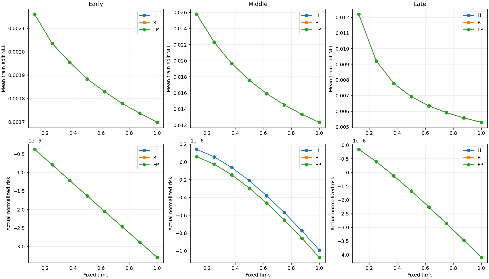
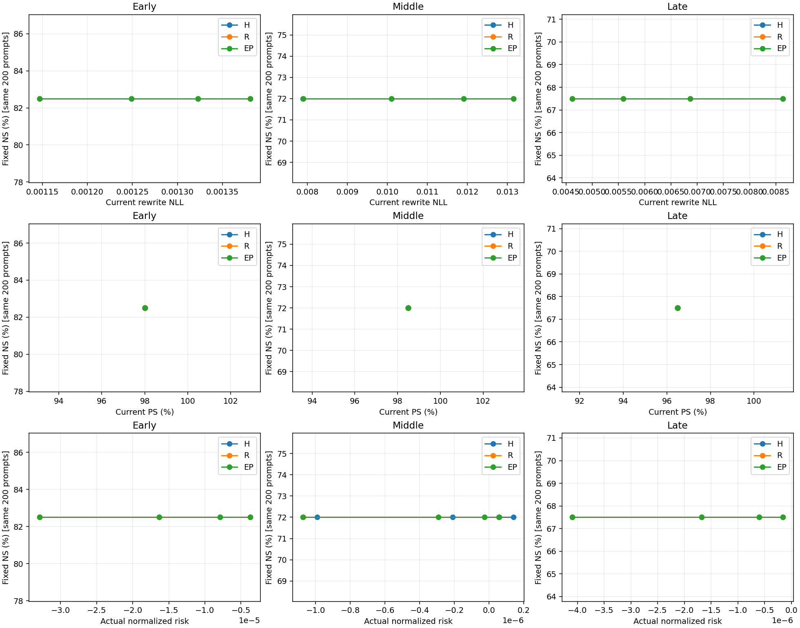
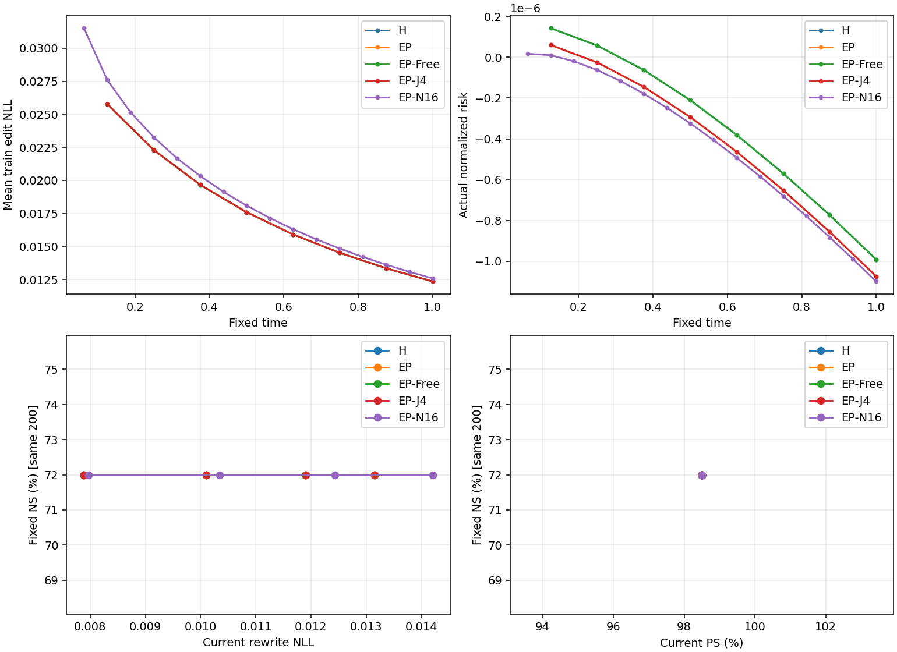

# BLUE L4-only progress-preserving barrier — 최종 진단 보고서

instruction_id: ODEEDIT-S06-BLUE-L4-PROGRESS-PRESERVING-BARRIER-SH2-V1

작성: Server2. 주 비교 9 trajectories/72 logical steps, 보조 3/32, 합계 **12/104**. N은 새 native 실행이 아니라 정확한 기존 N3/WN 평가다(이번 refinement의 t=0 reference). N8/N16은 새 refinement의 Euler step 수이며 기존 N3와 구분한다. 아래 표는 fixed terminal(N8 step8, 보조 N16 step16)이며, 성능으로 endpoint를 선택하지 않았다. scientific_promotion=false.

## 1. 핵심 절대값 — Current100

| entry | arm | RS | PS | NS | rewrite new NLL | rephrase new NLL | NS true NLL | NS new NLL | actual normalized risk |
| --- | --- | --- | --- | --- | --- | --- | --- | --- | --- |
| Early | N | 100/100 (100.00%) | 195/200 (97.50%) | 813/1000 (81.30%) | 0.0015487 | 1.62719 | 5.21074 | 8.9159 | 0 |
| Early | H | 100/100 (100.00%) | 196/200 (98.00%) | 815/1000 (81.50%) | 0.0011468 | 1.62416 | 5.20519 | 8.92761 | -3.29233e-05 |
| Early | R | 100/100 (100.00%) | 196/200 (98.00%) | 815/1000 (81.50%) | 0.0011468 | 1.62416 | 5.20519 | 8.92761 | -3.29233e-05 |
| Early | EP | 100/100 (100.00%) | 196/200 (98.00%) | 815/1000 (81.50%) | 0.0011468 | 1.62416 | 5.20519 | 8.92761 | -3.29233e-05 |
| Middle | N | 100/100 (100.00%) | 197/200 (98.50%) | 711/1000 (71.10%) | 0.0266691 | 1.19442 | 5.96038 | 8.47898 | 0 |
| Middle | H | 100/100 (100.00%) | 197/200 (98.50%) | 711/1000 (71.10%) | 0.00788835 | 1.16722 | 5.9605 | 8.47609 | -9.90746e-07 |
| Middle | R | 100/100 (100.00%) | 197/200 (98.50%) | 711/1000 (71.10%) | 0.00788913 | 1.16725 | 5.9605 | 8.4761 | -1.07286e-06 |
| Middle | EP | 100/100 (100.00%) | 197/200 (98.50%) | 711/1000 (71.10%) | 0.00788899 | 1.16724 | 5.9605 | 8.4761 | -1.07288e-06 |
| Late | N | 100/100 (100.00%) | 193/200 (96.50%) | 626/1000 (62.60%) | 0.016226 | 1.38731 | 6.67631 | 7.94094 | 0 |
| Late | H | 100/100 (100.00%) | 193/200 (96.50%) | 627/1000 (62.70%) | 0.00462331 | 1.34186 | 6.67722 | 7.93889 | -4.09235e-06 |
| Late | R | 100/100 (100.00%) | 193/200 (96.50%) | 627/1000 (62.70%) | 0.00462331 | 1.34186 | 6.67722 | 7.93889 | -4.09235e-06 |
| Late | EP | 100/100 (100.00%) | 193/200 (96.50%) | 627/1000 (62.70%) | 0.00462331 | 1.34186 | 6.67722 | 7.93889 | -4.09235e-06 |

관측 요약: Early: EP−H PS +0.00pp, EP−R PS +0.00pp, EP actual risk -3.29233e-05; Middle: EP−H PS +0.00pp, EP−R PS +0.00pp, EP actual risk -1.07288e-06; Late: EP−H PS +0.00pp, EP−R PS +0.00pp, EP actual risk -4.09235e-06. 평균 일차 진척 조건과 실제 유한-step NLL/held-out 성공은 다른 관측이다. 아래 같은-state 및 요청 분포를 함께 읽어야 한다.

### 핵심 비교의 동시 관측

| entry | 비교 | Current rewrite NLL Δ | Current PS Δpp | Fixed NS Δpp | Past NS Δpp | actual risk Δ |
| --- | --- | --- | --- | --- | --- | --- |
| Early | H−N | -0.000401907 | 0.5 | 0 | 0.1 | -3.29233e-05 |
| Early | EP−H | 0 | 0 | 0 | 0 | 0 |
| Early | EP−R | 0 | 0 | 0 | 0 | 0 |
| Middle | H−N | -0.0187807 | 0 | 0 | -0.1 | -9.90746e-07 |
| Middle | EP−H | 6.4277e-07 | 0 | 0 | 0 | -8.21381e-08 |
| Middle | EP−R | -1.34082e-07 | 0 | 0 | 0 | -2.80066e-11 |
| Late | H−N | -0.0116026 | 0 | 0.1 | 0.1 | -4.09235e-06 |
| Late | EP−H | 0 | 0 | 0 | 0 | 0 |
| Late | EP−R | 0 | 0 | 0 | 0 | 0 |

NLL Δ는 음수가 낮은 손실, 성공률 Δ는 양수가 높은 선호 성공이다. Risk가 더 낮아도 NS가 같은 방향으로 움직이지 않으면 두 관측을 분리해 해석한다. 아래 수치는 최저 NLL 또는 최상 NS를 고른 결과가 아니라 사전 고정 terminal이다.

**관측에 근거한 해석:** Early: H−N Current rewrite NLL=-0.00040190721. H/R/EP의 세 패널 RS/PS/NS 절대 성공 count는 모두 동일하다. 이 entry에서는 barrier 추가의 성공률 이득이 관측되지 않았다. Middle: H−N Current rewrite NLL=-0.018780721. H/R/EP의 세 패널 RS/PS/NS 절대 성공 count는 모두 동일하다. 이 entry에서는 barrier 추가의 성공률 이득이 관측되지 않았다. Late: H−N Current rewrite NLL=-0.011602644. H/R/EP의 세 패널 RS/PS/NS 절대 성공 count는 모두 동일하다. 이 entry에서는 barrier 추가의 성공률 이득이 관측되지 않았다. 성공률이 같아도 NLL·risk·개별 문항 전환이 같다는 뜻은 아니다. Native 후 refinement의 효과와 barrier가 추가로 만드는 효과를 구분한다.

**활성과 실제 endpoint:** Early: EP 보정 활성 0/8, H/EP 최종 weight SHA 동일, actual cap 초과 0/8. Middle: EP 보정 활성 1/8, H/EP 최종 weight SHA 다름, actual cap 초과 1/8. Late: EP 보정 활성 0/8, H/EP 최종 weight SHA 동일, actual cap 초과 0/8. 비활성 경로에서는 이 입력에서 nominal이 이미 elastic 판정의 허용 방향에 있었다는 해석이 가능하다. 이것은 barrier의 일반적 무용성이나 다른 입력의 안전성 증명이 아니다. 양의 cap 초과/slack도 삭제하지 않았으며 hard safety PASS로 부르지 않는다.

**가능한 설명(확정 원인 아님):** 세 N reference의 Current RS가 이미100/100이다. 높은 초기 선호 성공률 때문에 NLL 변화가 성공 count 변화로 이어지지 않을 수 있다. 이 개발 패널의 operating point와 낮은 barrier 활성 빈도를 함께 고려해야 하며, 이를 일반적인 layer capacity 또는 모델 전체 성능의 결론으로 확대하지 않는다.

### 재사용 W0 / We(ENTRY) / WN(N)

| entry | state | panel | RS | PS | NS |
| --- | --- | --- | --- | --- | --- |
| Early | W0 | Current100 | 10/100 (10.00%) | 22/200 (11.00%) | 900/1000 (90.00%) |
| Early | W0 | Fixed100 | 5/100 (5.00%) | 20/200 (10.00%) | 886/1000 (88.60%) |
| Early | W0 | Past100 | 9/100 (9.00%) | 20/200 (10.00%) | 885/1000 (88.50%) |
| Early | ENTRY | Current100 | 19/100 (19.00%) | 33/200 (16.50%) | 832/1000 (83.20%) |
| Early | ENTRY | Fixed100 | 100/100 (100.00%) | 193/200 (96.50%) | 828/1000 (82.80%) |
| Early | ENTRY | Past100 | 100/100 (100.00%) | 198/200 (99.00%) | 798/1000 (79.80%) |
| Early | N | Current100 | 100/100 (100.00%) | 195/200 (97.50%) | 813/1000 (81.30%) |
| Early | N | Fixed100 | 100/100 (100.00%) | 194/200 (97.00%) | 818/1000 (81.80%) |
| Early | N | Past100 | 100/100 (100.00%) | 198/200 (99.00%) | 792/1000 (79.20%) |
| Middle | W0 | Current100 | 12/100 (12.00%) | 23/200 (11.50%) | 888/1000 (88.80%) |
| Middle | W0 | Fixed100 | 5/100 (5.00%) | 20/200 (10.00%) | 886/1000 (88.60%) |
| Middle | W0 | Past100 | 11/100 (11.00%) | 20/200 (10.00%) | 879/1000 (87.90%) |
| Middle | ENTRY | Current100 | 30/100 (30.00%) | 53/200 (26.50%) | 724/1000 (72.40%) |
| Middle | ENTRY | Fixed100 | 100/100 (100.00%) | 194/200 (97.00%) | 693/1000 (69.30%) |
| Middle | ENTRY | Past100 | 100/100 (100.00%) | 192/200 (96.00%) | 685/1000 (68.50%) |
| Middle | N | Current100 | 100/100 (100.00%) | 197/200 (98.50%) | 711/1000 (71.10%) |
| Middle | N | Fixed100 | 100/100 (100.00%) | 194/200 (97.00%) | 696/1000 (69.60%) |
| Middle | N | Past100 | 100/100 (100.00%) | 193/200 (96.50%) | 686/1000 (68.60%) |
| Late | W0 | Current100 | 6/100 (6.00%) | 18/200 (9.00%) | 875/1000 (87.50%) |
| Late | W0 | Fixed100 | 5/100 (5.00%) | 20/200 (10.00%) | 886/1000 (88.60%) |
| Late | W0 | Past100 | 7/100 (7.00%) | 20/200 (10.00%) | 873/1000 (87.30%) |
| Late | ENTRY | Current100 | 27/100 (27.00%) | 59/200 (29.50%) | 634/1000 (63.40%) |
| Late | ENTRY | Fixed100 | 99/100 (99.00%) | 188/200 (94.00%) | 662/1000 (66.20%) |
| Late | ENTRY | Past100 | 100/100 (100.00%) | 192/200 (96.00%) | 688/1000 (68.80%) |
| Late | N | Current100 | 100/100 (100.00%) | 193/200 (96.50%) | 626/1000 (62.60%) |
| Late | N | Fixed100 | 99/100 (99.00%) | 191/200 (95.50%) | 660/1000 (66.00%) |
| Late | N | Past100 | 100/100 (100.00%) | 191/200 (95.50%) | 688/1000 (68.80%) |

이는 봉인된 기존 Full3900이며 신규 native 또는 W0 평가가 아니다. 동일 reference를 여러 대비에 사용해도 독립 실행/분모를 늘리지 않았다. W0의 낮은 RS는 지정 target-new 선호이며 모델 전체 능력 저하를 뜻하지 않는다.

## 2. Fixed/Past retention과 locality

### Fixed100

| entry | arm | RS | PS | NS | rewrite new NLL | rephrase new NLL | NS true NLL | NS new NLL | actual normalized risk |
| --- | --- | --- | --- | --- | --- | --- | --- | --- | --- |
| Early | N | 100/100 (100.00%) | 194/200 (97.00%) | 818/1000 (81.80%) | 0.0560293 | 1.43247 | 5.65314 | 9.74081 | 0 |
| Early | H | 100/100 (100.00%) | 194/200 (97.00%) | 818/1000 (81.80%) | 0.0560942 | 1.43128 | 5.65056 | 9.74493 | -3.29233e-05 |
| Early | R | 100/100 (100.00%) | 194/200 (97.00%) | 818/1000 (81.80%) | 0.0560942 | 1.43128 | 5.65056 | 9.74493 | -3.29233e-05 |
| Early | EP | 100/100 (100.00%) | 194/200 (97.00%) | 818/1000 (81.80%) | 0.0560942 | 1.43128 | 5.65056 | 9.74493 | -3.29233e-05 |
| Middle | N | 100/100 (100.00%) | 194/200 (97.00%) | 696/1000 (69.60%) | 0.227358 | 1.50208 | 6.51595 | 8.67281 | 0 |
| Middle | H | 100/100 (100.00%) | 194/200 (97.00%) | 696/1000 (69.60%) | 0.227173 | 1.50131 | 6.51649 | 8.67374 | -9.90746e-07 |
| Middle | R | 100/100 (100.00%) | 194/200 (97.00%) | 696/1000 (69.60%) | 0.227172 | 1.50131 | 6.51649 | 8.67374 | -1.07286e-06 |
| Middle | EP | 100/100 (100.00%) | 194/200 (97.00%) | 696/1000 (69.60%) | 0.227172 | 1.50131 | 6.51649 | 8.67374 | -1.07288e-06 |
| Late | N | 99/100 (99.00%) | 191/200 (95.50%) | 660/1000 (66.00%) | 0.715579 | 1.96449 | 6.98841 | 8.62689 | 0 |
| Late | H | 99/100 (99.00%) | 191/200 (95.50%) | 661/1000 (66.10%) | 0.713281 | 1.96348 | 6.98821 | 8.62695 | -4.09235e-06 |
| Late | R | 99/100 (99.00%) | 191/200 (95.50%) | 661/1000 (66.10%) | 0.713281 | 1.96348 | 6.98821 | 8.62695 | -4.09235e-06 |
| Late | EP | 99/100 (99.00%) | 191/200 (95.50%) | 661/1000 (66.10%) | 0.713281 | 1.96348 | 6.98821 | 8.62695 | -4.09235e-06 |

### Past100

| entry | arm | RS | PS | NS | rewrite new NLL | rephrase new NLL | NS true NLL | NS new NLL | actual normalized risk |
| --- | --- | --- | --- | --- | --- | --- | --- | --- | --- |
| Early | N | 100/100 (100.00%) | 198/200 (99.00%) | 792/1000 (79.20%) | 0.00233362 | 1.66737 | 5.40271 | 8.99173 | 0 |
| Early | H | 100/100 (100.00%) | 198/200 (99.00%) | 793/1000 (79.30%) | 0.00232194 | 1.66701 | 5.39963 | 8.99482 | -3.29233e-05 |
| Early | R | 100/100 (100.00%) | 198/200 (99.00%) | 793/1000 (79.30%) | 0.00232194 | 1.66701 | 5.39963 | 8.99482 | -3.29233e-05 |
| Early | EP | 100/100 (100.00%) | 198/200 (99.00%) | 793/1000 (79.30%) | 0.00232194 | 1.66701 | 5.39963 | 8.99482 | -3.29233e-05 |
| Middle | N | 100/100 (100.00%) | 193/200 (96.50%) | 686/1000 (68.60%) | 0.0277426 | 1.31975 | 5.90733 | 7.74324 | 0 |
| Middle | H | 100/100 (100.00%) | 193/200 (96.50%) | 685/1000 (68.50%) | 0.0276683 | 1.31994 | 5.90809 | 7.74398 | -9.90746e-07 |
| Middle | R | 100/100 (100.00%) | 193/200 (96.50%) | 685/1000 (68.50%) | 0.027668 | 1.31994 | 5.90809 | 7.74398 | -1.07286e-06 |
| Middle | EP | 100/100 (100.00%) | 193/200 (96.50%) | 685/1000 (68.50%) | 0.0276681 | 1.31994 | 5.90809 | 7.74398 | -1.07288e-06 |
| Late | N | 100/100 (100.00%) | 191/200 (95.50%) | 688/1000 (68.80%) | 0.145765 | 1.65201 | 6.40924 | 8.24604 | 0 |
| Late | H | 100/100 (100.00%) | 191/200 (95.50%) | 689/1000 (68.90%) | 0.145633 | 1.65029 | 6.41046 | 8.24735 | -4.09235e-06 |
| Late | R | 100/100 (100.00%) | 191/200 (95.50%) | 689/1000 (68.90%) | 0.145633 | 1.65029 | 6.41046 | 8.24735 | -4.09235e-06 |
| Late | EP | 100/100 (100.00%) | 191/200 (95.50%) | 689/1000 (68.90%) | 0.145633 | 1.65029 | 6.41046 | 8.24735 | -4.09235e-06 |

Fixed100은 세 entry에서 같은 100 requests다. 이를 독립 300개로 합산하지 않았다. Early/Middle/Late는 history뿐 아니라 Current batch도 다르므로 age-only 인과 비교가 아니다. NS는 해당 문항의 true/new 선호이며 일반 pretrained capability의 보존 증명이 아니다.

### 실제 snapshot의 strength 범위

| entry | arm | 관측 rewrite NLL min | max | 실제 points |
| --- | --- | --- | --- | --- |
| Early | H | 0.0011468 | 0.00138066 | 4 |
| Early | R | 0.0011468 | 0.00138066 | 4 |
| Early | EP | 0.0011468 | 0.00138066 | 4 |
| Early | interval intersection | 0.0011468 | 0.00138066 | range only |
| Middle | H | 0.00788835 | 0.013153 | 4 |
| Middle | R | 0.00788913 | 0.0131548 | 4 |
| Middle | EP | 0.00788899 | 0.0131541 | 4 |
| Middle | interval intersection | 0.00788913 | 0.013153 | range only |
| Late | H | 0.00462331 | 0.00863421 | 4 |
| Late | R | 0.00462331 | 0.00863421 | 4 |
| Late | EP | 0.00462331 | 0.00863421 | 4 |
| Late | interval intersection | 0.00462331 | 0.00863421 | range only |

Range가 겹치는 것은 동일 strength의 실제 checkpoint가 존재한다는 증명이 아니다. 그림은 실제 4개 snapshot만 연결한 시각적 가이드이며, 교차 구간의 NS를 보간하거나 strength-matched 점수를 만들지 않았다.

## 3. 같은-state nominal shadow와 matched-risk probe

| entry | 검사 | pre-step | EP−대조 mean NLL | median | p90 | 최대 | 악화/100 | 개선/100 | 일차 mean 차이 |
| --- | --- | --- | --- | --- | --- | --- | --- | --- | --- |
| Middle | same_state_nominal_shadow | 0 | 3.75581e-06 | 2.18138e-07 | 1.3714e-06 | 0.000230437 | 92 | 4 | 4.87166e-13 |
| Middle | same_state_nominal_shadow | 3 | 0 | 0 | 0 | 0 | 0 | 0 | 0 |
| Middle | same_state_nominal_shadow | 7 | 0 | 0 | 0 | 0 | 0 | 0 | 0 |
| Middle | matched_risk_at_WN | 0 | -1.3517e-06 | 0 | 1.98314e-08 | 5.9527e-08 | 19 | 42 | -8.81895e-06 |
| Early | same_state_nominal_shadow | 0 | 0 | 0 | 0 | 0 | 0 | 0 | 0 |
| Early | same_state_nominal_shadow | 3 | 0 | 0 | 0 | 0 | 0 | 0 | 0 |
| Early | same_state_nominal_shadow | 7 | 0 | 0 | 0 | 0 | 0 | 0 | 0 |
| Early | matched_risk_at_WN | 0 | 0 | 0 | 0 | 0 | 0 | 0 | 0 |
| Late | same_state_nominal_shadow | 0 | 0 | 0 | 0 | 0 | 0 | 0 | 0 |
| Late | same_state_nominal_shadow | 3 | 0 | 0 | 0 | 0 | 0 | 0 | 0 |
| Late | same_state_nominal_shadow | 7 | 0 | 0 | 0 | 0 | 0 | 0 | 0 |
| Late | matched_risk_at_WN | 0 | 0 | 0 | 0 | 0 | 0 | 0 | 0 |

Nominal shadow는 실제 EP pre-state0/3/7에서 비교한다. pre0은 동일 WN의 H1을 재사용했다. Matched-risk는 동일 WN에서 EP 첫 step과 **일차 risk 감소량**만 맞춘 단발 비교다. 실제 risk 이차항·FP32 적용 차이가 남으므로 완전히 같은 nonlinear risk endpoint라고 부르지 않는다. Probe는 trajectory에 carry하지 않았다.

## 4. Middle 보조: Free/J4/N16

| arm | Current RS | Current PS | Current NS | actual risk | Fixed NS% | Past NS% |
| --- | --- | --- | --- | --- | --- | --- |
| N | 100/100 (100.00%) | 197/200 (98.50%) | 711/1000 (71.10%) | 0 | 69.6 | 68.6 |
| H | 100/100 (100.00%) | 197/200 (98.50%) | 711/1000 (71.10%) | -9.90746e-07 | 69.6 | 68.5 |
| R | 100/100 (100.00%) | 197/200 (98.50%) | 711/1000 (71.10%) | -1.07286e-06 | 69.6 | 68.5 |
| EP | 100/100 (100.00%) | 197/200 (98.50%) | 711/1000 (71.10%) | -1.07288e-06 | 69.6 | 68.5 |
| EP-Free | 100/100 (100.00%) | 197/200 (98.50%) | 711/1000 (71.10%) | -9.90746e-07 | 69.6 | 68.5 |
| EP-J4 | 100/100 (100.00%) | 197/200 (98.50%) | 711/1000 (71.10%) | -1.07295e-06 | 69.6 | 68.5 |
| EP-N16 | 100/100 (100.00%) | 197/200 (98.50%) | 711/1000 (71.10%) | -1.09837e-06 | 69.6 | 68.5 |

Free는 기존 free 성분 삭제, J4는 고정 case-ID hash 4×25 observer, N16은 같은 ν/ε/field에서 h만 절반이다. J4/N16의 좋은 문항만 선택하지 않았으며 추가 threshold나 gain은 없다. 상세 CI는 paired-summary.csv의 각 보조−EP 비교다.

Free 보정 활성 0/8; H와 최종 weight SHA는 동일하다. 같은 weight와 같은 covariance에서도 별도 프로세스에서 저장한 FP64 reduction scalar의 미세 차이가 있을 수 있다. 동일 weight의 scalar 차이를 물리적 write 변화나 방법 성능 개선으로 해석하지 않는다. 별도 프로세스 전 경로의 bitwise gradient replay는 검증하지 않았다.

### Matched-risk의 held-out 실제 관측

| entry | panel | metric | EP1−probe Δpp | 95% CI | prompts |
| --- | --- | --- | --- | --- | --- |
| Middle | Current100 | NS | 0 | [0,0] | 200 |
| Middle | Current100 | PS | 0 | [0,0] | 200 |
| Middle | Current100 | RS | 0 | [0,0] | 100 |
| Middle | Fixed100 | NS | 0 | [0,0] | 200 |
| Middle | Fixed100 | RS | 0 | [0,0] | 100 |
| Middle | Past100 | NS | 0 | [0,0] | 200 |
| Middle | Past100 | RS | 0 | [0,0] | 100 |
| Early | Current100 | NS | 0 | [0,0] | 200 |
| Early | Current100 | PS | 0 | [0,0] | 200 |
| Early | Current100 | RS | 0 | [0,0] | 100 |
| Early | Fixed100 | NS | 0 | [0,0] | 200 |
| Early | Fixed100 | RS | 0 | [0,0] | 100 |
| Early | Past100 | NS | 0 | [0,0] | 200 |
| Early | Past100 | RS | 0 | [0,0] | 100 |
| Late | Current100 | NS | 0 | [0,0] | 200 |
| Late | Current100 | PS | 0 | [0,0] | 200 |
| Late | Current100 | RS | 0 | [0,0] | 100 |
| Late | Fixed100 | NS | 0 | [0,0] | 200 |
| Late | Fixed100 | RS | 0 | [0,0] | 100 |
| Late | Past100 | NS | 0 | [0,0] | 200 |
| Late | Past100 | RS | 0 | [0,0] | 100 |

Matched probe risk는 저장 reduced-coordinate risk다. EP의 actual FP32 risk와 동일 필드로 섞지 않는다. Probe의 full-weight FP32 risk는 NOT_RECORDED이며 matched-risk의 동등성 주장은 일차 감소량에 한정한다.

## 5. 요청 단위 paired 통계

| entry | 비교 | panel | metric | Δpp | 95% CI | requests/prompts | 기존성공→실패 | 기존실패→성공 |
| --- | --- | --- | --- | --- | --- | --- | --- | --- |
| Early | EP−H | Current100 | NS | 0 | [0, 0] | 100/1000 | 0 | 0 |
| Early | EP−H | Current100 | PS | 0 | [0, 0] | 100/200 | 0 | 0 |
| Early | EP−H | Fixed100 | NS | 0 | [0, 0] | 100/1000 | 0 | 0 |
| Early | EP−H | Fixed100 | PS | 0 | [0, 0] | 100/200 | 0 | 0 |
| Early | EP−H | Past100 | NS | 0 | [0, 0] | 100/1000 | 0 | 0 |
| Early | EP−H | Past100 | PS | 0 | [0, 0] | 100/200 | 0 | 0 |
| Early | EP−R | Current100 | NS | 0 | [0, 0] | 100/1000 | 0 | 0 |
| Early | EP−R | Current100 | PS | 0 | [0, 0] | 100/200 | 0 | 0 |
| Early | EP−R | Fixed100 | NS | 0 | [0, 0] | 100/1000 | 0 | 0 |
| Early | EP−R | Fixed100 | PS | 0 | [0, 0] | 100/200 | 0 | 0 |
| Early | EP−R | Past100 | NS | 0 | [0, 0] | 100/1000 | 0 | 0 |
| Early | EP−R | Past100 | PS | 0 | [0, 0] | 100/200 | 0 | 0 |
| Early | H−N | Current100 | NS | 0.2 | [0, 0.5] | 100/1000 | 0 | 2 |
| Early | H−N | Current100 | PS | 0.5 | [0, 1.5] | 100/200 | 0 | 1 |
| Early | H−N | Fixed100 | NS | 0 | [0, 0] | 100/1000 | 0 | 0 |
| Early | H−N | Fixed100 | PS | 0 | [0, 0] | 100/200 | 0 | 0 |
| Early | H−N | Past100 | NS | 0.1 | [0, 0.3] | 100/1000 | 0 | 1 |
| Early | H−N | Past100 | PS | 0 | [0, 0] | 100/200 | 0 | 0 |
| Middle | EP−H | Current100 | NS | 0 | [0, 0] | 100/1000 | 0 | 0 |
| Middle | EP−H | Current100 | PS | 0 | [0, 0] | 100/200 | 0 | 0 |
| Middle | EP−H | Fixed100 | NS | 0 | [0, 0] | 100/1000 | 0 | 0 |
| Middle | EP−H | Fixed100 | PS | 0 | [0, 0] | 100/200 | 0 | 0 |
| Middle | EP−H | Past100 | NS | 0 | [0, 0] | 100/1000 | 0 | 0 |
| Middle | EP−H | Past100 | PS | 0 | [0, 0] | 100/200 | 0 | 0 |
| Middle | EP−R | Current100 | NS | 0 | [0, 0] | 100/1000 | 0 | 0 |
| Middle | EP−R | Current100 | PS | 0 | [0, 0] | 100/200 | 0 | 0 |
| Middle | EP−R | Fixed100 | NS | 0 | [0, 0] | 100/1000 | 0 | 0 |
| Middle | EP−R | Fixed100 | PS | 0 | [0, 0] | 100/200 | 0 | 0 |
| Middle | EP−R | Past100 | NS | 0 | [0, 0] | 100/1000 | 0 | 0 |
| Middle | EP−R | Past100 | PS | 0 | [0, 0] | 100/200 | 0 | 0 |
| Middle | H−N | Current100 | NS | 0 | [0, 0] | 100/1000 | 0 | 0 |
| Middle | H−N | Current100 | PS | 0 | [0, 0] | 100/200 | 0 | 0 |
| Middle | H−N | Fixed100 | NS | 0 | [0, 0] | 100/1000 | 0 | 0 |
| Middle | H−N | Fixed100 | PS | 0 | [0, 0] | 100/200 | 0 | 0 |
| Middle | H−N | Past100 | NS | -0.1 | [-0.3, 0] | 100/1000 | 1 | 0 |
| Middle | H−N | Past100 | PS | 0 | [0, 0] | 100/200 | 0 | 0 |
| Late | EP−H | Current100 | NS | 0 | [0, 0] | 100/1000 | 0 | 0 |
| Late | EP−H | Current100 | PS | 0 | [0, 0] | 100/200 | 0 | 0 |
| Late | EP−H | Fixed100 | NS | 0 | [0, 0] | 100/1000 | 0 | 0 |
| Late | EP−H | Fixed100 | PS | 0 | [0, 0] | 100/200 | 0 | 0 |
| Late | EP−H | Past100 | NS | 0 | [0, 0] | 100/1000 | 0 | 0 |
| Late | EP−H | Past100 | PS | 0 | [0, 0] | 100/200 | 0 | 0 |
| Late | EP−R | Current100 | NS | 0 | [0, 0] | 100/1000 | 0 | 0 |
| Late | EP−R | Current100 | PS | 0 | [0, 0] | 100/200 | 0 | 0 |
| Late | EP−R | Fixed100 | NS | 0 | [0, 0] | 100/1000 | 0 | 0 |
| Late | EP−R | Fixed100 | PS | 0 | [0, 0] | 100/200 | 0 | 0 |
| Late | EP−R | Past100 | NS | 0 | [0, 0] | 100/1000 | 0 | 0 |
| Late | EP−R | Past100 | PS | 0 | [0, 0] | 100/200 | 0 | 0 |
| Late | H−N | Current100 | NS | 0.1 | [0, 0.3] | 100/1000 | 0 | 1 |
| Late | H−N | Current100 | PS | 0 | [0, 0] | 100/200 | 0 | 0 |
| Late | H−N | Fixed100 | NS | 0.1 | [0, 0.3] | 100/1000 | 0 | 1 |
| Late | H−N | Fixed100 | PS | 0 | [0, 0] | 100/200 | 0 | 0 |
| Late | H−N | Past100 | NS | 0.1 | [0, 0.3] | 100/1000 | 0 | 1 |
| Late | H−N | Past100 | PS | 0 | [0, 0] | 100/200 | 0 | 0 |

Bootstrap 2000회는 request를 cluster로 재표집하고 rewrite/rephrase/neighborhood 및 두 arm의 대응을 유지한다. 원시 prompt identity를 검증한 뒤 join했다. CI는 이 기존 개발 패널의 조건부 불확실성이며 새 독립 benchmark 일반화 증거가 아니다. NLL mean/median/p90, true와 new NLL, TF strict/token numerator/denominator는 endpoint-and-curve-summary.csv에 별도 기록했다. TF exact와 candidate preference를 혼합하지 않았다.

## 6. 기하·실제 적용·분포 진단

| entry | arm | 최대 observer leakage | 평균 q/q_all | 최대 slack | 보정 활성 step | 평균 correction/nominal norm | Σ 실제 step norm² | 최대 off-support rounding norm |
| --- | --- | --- | --- | --- | --- | --- | --- | --- |
| Early | H | 0 | 0.988142 | 0 | 0/8 | 0 | 0.0178997 | 2.91818e-06 |
| Early | R | 0 | 1 | 0 | 0/8 | 0 | 0.0178997 | 2.91818e-06 |
| Early | EP | 0 | 0.988142 | 0 | 0/8 | 0 | 0.0178997 | 2.91818e-06 |
| Middle | H | 0 | 0.994565 | 7.28904e-07 | 0/8 | 0 | 0.0163971 | 3.649e-06 |
| Middle | R | 7.05589e-05 | 1 | 6.62745e-08 | 1/8 | 0.000719535 | 0.0163964 | 3.64888e-06 |
| Middle | EP | 4.11764e-19 | 0.994564 | 6.63428e-08 | 1/8 | 0.000719868 | 0.0164005 | 3.64917e-06 |
| Late | H | 0 | 0.996531 | 0 | 0/8 | 0 | 0.0196084 | 4.45608e-06 |
| Late | R | 0 | 1 | 0 | 0/8 | 0 | 0.0196084 | 4.45608e-06 |
| Late | EP | 0 | 0.996531 | 0 | 0/8 | 0 | 0.0196084 | 4.45608e-06 |

활성은 저장 factor>0이라는 계산 분기이며 새 과학 threshold가 아니다. H는 설계상 보정0이다. R에는 progress equality가 요구되지 않으므로 R leakage는 구현 오류 판정값이 아니다. q/q_all은 현재 support/observer에서의 local 여력이며 전역 capacity 충분성/부족의 증명이 아니다. Saved Ub의 실제 Gram을 사용했다. 작은 FP32 materialization의 off-support rounding도 숨기지 않았으며 projected actual prediction과 이상적 coefficient prediction을 분리했다. 요청별 gradient는 기존 backward의 L4 per-sequence 관측으로 수집하여 추가 backward0이다; group dense pullback과의 부동소수점 차이는 원 raw step terms에 보존했다.

## 7. 자유 생성과 관측 범위

| entry | arm | literal prefix | denominator |
| --- | --- | --- | --- |
| Middle | N | 45 | 60 |
| Middle | H | 45 | 60 |
| Middle | R | 45 | 60 |
| Middle | EP | 45 | 60 |

동일 Middle20 rewrite+40 rephrase, greedy/max_new_tokens32 패널이다. 새 H/R/EP180 sequences만 생성했고 기존 N은 재사용 reference다. Literal prefix는 의미 정확도가 아니며 전체 자유 생성 accuracy로 확대하지 않는다. 생성 문자열은 local-only다.

## 8. 비용·실용성

계획과 실측을 분리한다. 계획은 95 gradient sweeps/34,390 backward/41,692 training forwards, 89,700 새 prompt pairs/179,400 candidate sequences+180 generation이다. 실제 실행별 항목은 compute-summary.csv를 기준으로 한다. Teacher·load·geometry·paired 평가·generation·행렬 계측·저장 비용은 서로 다르다. Scheduler elapsed는 별도 job receipt로 결속한다. 초기 reference를 공유할 때에는 teacher/input/groups 해시가 동일해야 한다.

이것은 **cached-native 뒤의 refinement 비용**이다. 새로운 cold compute-z/native writer/history 비용을 실제로 재측정하지 않았으므로 온라인 전체속도 개선이나 과거 다른 GPU의 native 시간 대비 우월성을 주장하지 않는다. EP의 실용성은 위 CurrentPS/Fixed·Past/NS 변화와 추가 비용을 함께 판단할 조건부 결과다.

| 호출 계측 | 계획 | 실제 |
| --- | --- | --- |
| gradient sweep | 95 | 95 |
| edit+essence backward | 34390 | 34390 |
| training forward (gate 별도) | 41692 | 41692 |
| evaluation candidate sequences | 179400 | 179400 |
| 새 generation sequences | 180 | 180 |
| 요청별 관측 추가 backward | 0 | 0 |

training_tokens/evaluation_input_tokens/generation_output_tokens를 분리한다. actual_model_forward_tokens는 attention-mask 합계이므로 generation의 cached context도 포함한다. 이를 새 input token 수라고 부르지 않는다.

89,700은 새 **평가 pair-event 수**이며 서로 다른 요청 89,700개라는 뜻이 아니다. 별도 봉인 reference35100 pair-rows를 재사용했고, local request-metrics.csv는 신규+reference124800 state-bound rows다. 상태별 분모만 사용하며 이 행들을 하나의 pooled 성공률 분모로 합치지 않는다. Training 요청별 관측은10400행이다. Margin은 모든 metric에서 true−new로 보존하므로 RS/PS는 양수, NS는 음수일 때 성공한다.

### Arm별 실제 추가 비용

| entry | arm | 추가 gradient sweeps | B | training F | objective 초 | panel eval 초 | generation 초 |
| --- | --- | --- | --- | --- | --- | --- | --- |
| Middle | H | 7 | 2534 | 2896 | 316.989 | 272.736 | 90.2734 |
| Middle | R | 7 | 2534 | 2896 | 317.347 | 273.2 | 90.2655 |
| Middle | EP | 7 | 2534 | 3520 | 358.627 | 273.065 | 90.2668 |
| Early | H | 7 | 2534 | 2896 | 317.91 | 271.431 | 0 |
| Early | R | 7 | 2534 | 2896 | 317.798 | 271.693 | 0 |
| Early | EP | 7 | 2534 | 3520 | 359.612 | 271.539 | 0 |
| Late | H | 7 | 2534 | 2896 | 317.74 | 277.228 | 0 |
| Late | R | 7 | 2534 | 2896 | 317.973 | 277.345 | 0 |
| Late | EP | 7 | 2534 | 3520 | 359.875 | 277.381 | 0 |
| Middle | EP-Free | 7 | 2534 | 2896 | 317.041 | 272.446 | 0 |
| Middle | EP-J4 | 7 | 2534 | 2896 | 317.05 | 273.26 | 0 |
| Middle | EP-N16 | 15 | 5430 | 5792 | 652.273 | 272.699 | 0 |

각 arm 첫 node 준비 후부터 terminal까지의 누적 ledger 차이다. G0/teacher/load/geometry/matched probe는 shared entry setup에 별도 배정하며 per-arm-compute.csv에 보존했다. 공유된 G0 비용을 숨겨 독립 단독 실행 비용이라고 부르지 않는다. 보조 arm에는 generation을 수행하지 않았으므로 generation0을 controller 속도 개선으로 해석하지 않는다. setup+arm increment의 모든 count 합이 전체 ledger와 정확히 일치하는지 검산했다.

EP의 추가 training forward에는 pre3/pre7의 same-state shadow 진단도 포함된다. 따라서 위 측정값은 이번 진단 campaign 비용이며, 진단을 제거한 production-only controller latency는 NOT_RECORDED다. Small controller solve와 일부 tensor/SHA 관측은 전체 job overhead 안에 있으며 독립 timing replay를 추가하지 않았다.

| 측정 component | 합산 초 |
| --- | --- |
| actual_weight_gate | 0.505363 |
| curve_evaluation | 1641.76 |
| essence_teacher | 11.7142 |
| full_evaluation | 1768.35 |
| generation | 270.806 |
| geometry | 26.8373 |
| grouped_objective | 4465.76 |
| model_load | 68.1361 |

상기 ledger component를 중첩/누락 없이 전체 GPU elapsed라고 가정하지 않는다. 파일 저장·SHA·matrix/scalar 계측 및 예약/시작 overhead가 별도로 있다.

| run | 자원/저장 항목 | 관측값 |
| --- | --- | --- |
| Middle-main | peak_gpu_bytes | 37887000064 |
| Middle-main | peak_host_kib | 34494844 |
| Middle-main | terminal_output_bytes | 215309019 |
| Early-main | peak_gpu_bytes | 37886430720 |
| Early-main | peak_host_kib | 34495056 |
| Early-main | terminal_output_bytes | 215249832 |
| Late-main | peak_gpu_bytes | 37885923840 |
| Late-main | peak_host_kib | 34496896 |
| Late-main | terminal_output_bytes | 215245980 |
| Middle-auxiliary | peak_gpu_bytes | 37876382208 |
| Middle-auxiliary | peak_host_kib | 34496784 |
| Middle-auxiliary | terminal_output_bytes | 33062322 |

GPU는 allocator peak allocated bytes, host는 프로세스 max RSS KiB다. 노드 전체 사용량이나 예약량과 동일하지 않다. Output bytes는 해당 terminal run 디렉터리 파일 합이며 공통 imported assets는 별도 보존한다.

실제 job GPU elapsed 합계: **2.41194 GPUh**. 대기시간은 제외했다.

| job | 상태 | exit | elapsed초 |
| --- | --- | --- | --- |
| 44124 | COMPLETED | 0:0 | 2325 |
| 44143 | COMPLETED | 0:0 | 2043 |
| 44144 | COMPLETED | 0:0 | 2057 |
| 44158 | COMPLETED | 0:0 | 2258 |

### 고정 geometry 및 초기 free 성분

| entry | observer | 초기 free-energy 비중 | rank |
| --- | --- | --- | --- |
| Early | J1 | 0.17047 | 1 |
| Early | J4 | 0.169626 | 4 |
| Middle | J1 | 0.00688128 | 1 |
| Middle | J4 | 0.00686915 | 4 |
| Late | J1 | 0.0569765 | 1 |
| Late | J4 | 0.056961 | 4 |

전체 H_N eigenvalue는 fixed-geometry-spectrum.csv에 CPU FP64 재구성으로 기록하고 runtime GPU min/max와 차이를 별도로 기록했다. U/K/M가 inner 동안 고정이므로 geometry spectrum도 고정이다. Free-energy 비중은 저장 G0로 계산한 entry pre0 값이며 이후 node 비중은 NOT_RECORDED다.

## 9. 관측·가능한 설명·미분리 가설

- **H 대 N:** endpoint 표의 H−N은 공통 loss와 저장 native support에서 추가 refinement한 실제 차이다. H가 나쁘면 barrier 효과 이전에 공통 refinement의 operating point/노출을 의심할 수 있으나, 원인을 확정한 실험은 아니다.
- **EP 대 H/R:** 같은-state 평균 일차 leakage와 nonlinear request NLL 차이를 분리한다. matched-risk 표에서 EP−probe NLL이 음수인 경우 해당 같은-state 일차 risk 감소량에서는 EP 쪽 실제 edit 손실이 더 작았다. 이것만으로 모든 endpoint의 risk가 완전히 같거나 locality가 보장된다고 하지 않는다.
- **평균 보호의 한계:** shadow의 악화 request 수, J4 및 CurrentPS/Fixed/Past를 함께 보아야 한다. J1 mean 조건은 요청별/held-out/과거 fact 보호 조건이 아니다.
- **Risk와 locality:** 구조적 covariance risk와 실제 NS true/new NLL을 별도로 측정했다. 방향이 일치하지 않는 경우 proxy와 출력평가의 분리가 관측된 것이며 capacity failure로 바꿔 설명하지 않는다.
- **Free/J4/N16:** 동일 field의 삭제/observer/시간격자 보조 비교다. N16은 추가 feedback 비용도 증가한다. 결과가 유사하면 이 세 entry에서 추가 비용 대비 차이가 제한된 관측이지 모든 문제의 충분한 step size 증명은 아니다.
- **미검증:** natural sequential 5-batch, 다른 모델/레이어, cold-z 포함 전체비용, 새 독립 benchmark, 보편적 causality/lifelong safety는 수행하지 않았다. 어떤 후속도 자동 제출하지 않는다.

해석은 이 instruction에 명시된 사용자 예외 범위이며 사실표와 가능한 설명을 분리했다. Scientific promotion은 false다.

## 10. 정확한 계약·source·복원

설계 SHA30be08eccc4b74b34acfeb9e3deb5cbffc9e6c4a02768e6f69fddf5593d99a8e, baseline main285d464361c82d033cbaf88c177fd6c5af8f83df. 실행 source/job별 정체성은 run-index.csv와 runtime/input/execution locks에 결속한다. Llama revision8afb486c1db24fe5011ec46dfbe5b5dccdb575c2, FULLFP32, L4 down_proj 단일 weight, 정확한 WN+XUbᵀ에서 시작했다. We teacher, pre-native M, fixed z/K/U/P/M, κ2/ε=.1q_ref/ν entry-once/d_ref1/8, N8/N16 matched time을 유지했다. 새 compute-z/native/history append0.

actual-output functional/materialized gate는 대표 입력의 exact logits를 검증했고, 전체 모든 prompt의 cross-server bitwise replay라고 주장하지 않는다. Transformers/tokenizers runtime .py/.so1735개는 source와 exact이며 torch/CUDA/GPU actual runtime은 각 job에 별도로 기록했다. 기존 full 평가와 새 평가의 패널/packing/source를 결속하되 미검증 numerical parity는 동일성으로 부풀리지 않았다.

Entry binding: Early=We B010/current B011, Middle=We B050/current B051, Late=We B090/current B091의 봉인 자산이다. 각 current의 기존 N3/WN을 공통 refinement 시작점으로 사용했다. 세 entry의 history만 바꾸고 Current를 고정한 실험은 아니다.

Local X snapshots는 0/1/2/4/8(N16 대응)의 실제 저장 값과 Ub/WN reference를 포함한다. X와 reference로 재구성하며 full pretrained 모델을 중복 저장하지 않는다. 이전 ABC source/report 및 원본 raw는 수정하지 않았다. Native scalar J_N의 원 저장 FP32 값을 정규화에 재사용하고 FP64 재검산 차이를 calibration.json에 별도 기록했다.

## 11. 산출물과 재현

- `run-index.csv`, `trajectory.csv`, `same-state-probes.csv`, `paired-summary.csv`, `compute-summary.csv`, `endpoint-and-curve-summary.csv`.
- 요청별 raw-free numeric CSV: request-metrics-reference.json의 local path/SHA. 원 prompt/generation/tensor는 Git 제외.
- 실제 입력/출력 전수 SHA: raw-input-manifest.json. 소형 publication closure: analysis-manifest.json/rooted-receipt.json.
- 그림은 아래 Python report code로 생성했으며 측정 snapshot 점만 연결한다. 보간된 endpoint/NS strength matching은 없다.

```bash
python -m project.run_scripts.blue_l4_progress_barrier.report --report <canonical_report_root>
```

재생성은 같은 집계 CSV를 복사한 새 디렉터리에서 실행한다(create-once). PNG source: trajectory.csv / curve-common-inventory-summary.csv. Codex imagegen/visualization 사용0.







Raw preservation root: `/mnt/raid5/janghj/ODE-edit/local/blue-l4-progress-barrier/attempt-v1/`. Raw broadcast: **NO_BROADCAST_NOT_REQUIRED** — 이번 승인 예외에 따라 동일 프로젝트 보존 경로와 manifest만 공유. 다른 task의 monitoring pause/실행 변경0.
