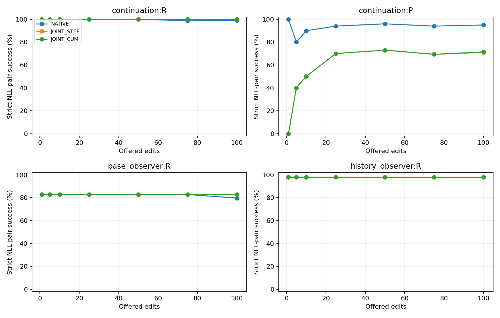

# B010 다층 BS1 실험 세 arm 완료 리뷰

2026년 9월 30일 SH2가 사용자 recall에 따라 작성한 CPU 사실 검산 보고서다. BASE_ALPHAEDIT의 **B010 부모 state**에서 시작한 NATIVE, JOINT_STEP, JOINT_CUM이 각각 추가 100요청을 완료했다. 이 문서의 step100은 새 continuation의 100번째 요청이며, 원 lifelong B100 checkpoint를 뜻하지 않는다. B050 및 B090 결과를 이 표에 합치지 않았다.

세 arm 모두 100/100 commit, 100/100 accepted다. 최종 rewrite NLL-pair 성공은 99/100, 100/100, 100/100이고, paraphrase는 190/200, 142/200, 143/200이다. 이 수치와 strict·NLL·observer·비용을 분리해 제시한다. 효과의 인과적 해석과 후속 권고는 하지 않으며 `scientific_promotion=false`다.

## 최종 동일 요청 비교

모든 값은 각 arm의 실제 마지막 weight에서 측정한 기존 raw의 독립 CPU 재계산이다. RS/PS는 target-new 평균 token NLL이 target-true보다 **엄격히 작을 때** 성공이며 tie는 실패다. Base observer는 반대로 true를 선호해야 성공한다. History observer는 과거 편집 target-new를 선호해야 성공한다.

|지표|NATIVE|JOINT_STEP|JOINT_CUM|
|---|---:|---:|---:|
|최종 RS|99/100 (99%)|100/100 (100%)|100/100 (100%)|
|최종 PS|190/200 (95%)|142/200 (71%)|143/200 (71.5%)|
|RS strict 정답|99/100|82/100|81/100|
|PS strict 정답|137/200|61/200|63/200|
|RS token 정답|102/103|85/103|84/103|
|PS token 정답|143/206|67/206|69/206|
|Base observer true 선호|51/64|53/64|53/64|
|History observer new 선호|47/48|47/48|47/48|
|Base observer strict|16/64|17/64|17/64|
|History observer strict|47/48|47/48|47/48|

NATIVE 대비 JOINT_STEP의 RS/PS 차이는 +1/−24 percentage points, JOINT_CUM은 +1/−23.5 pp다. 같은 Base observer에서 두 joint arm 모두 NATIVE보다 +2/64, 즉 +3.125 pp다. 이는 산술 차이이며 표본 범위 밖 성능이나 원인 판정이 아니다.

Strict는 teacher-forced target 전체 token의 top1 일치다. Pair 성공과 strict를 같은 정확도로 취급하지 않는다. PS 두 문항은 같은 요청에 속하므로 독립 요청 200개가 아니다. 세 arm이 공유하는 unique continuation 요청은 100개, 총 arm-request 관측은 300개다.

## NLL과 꼬리 값

RS/PS safety margin은 true NLL−new NLL이다. Base observer는 new−true로 방향을 바꾼다. 아래는 최종 RS/PS이며, 전체 observer 및 7시점 값은 [metrics.csv](metrics.csv)에 있다. p10은 정렬된 관측값의 `floor(.1*(n−1))` 원소, median은 정렬 배열의 `n//2` 원소다.

|Arm|RS new NLL 평균|RS true NLL 평균|RS 최소 margin|PS new NLL 평균|PS true NLL 평균|PS p10 margin|
|---|---:|---:|---:|---:|---:|---:|
|NATIVE|0.076458|12.536583|−6.240725|1.375616|9.051285|1.860725|
|JOINT_STEP|0.791113|6.550297|0.019203|3.525566|5.605760|−2.453845|
|JOINT_CUM|0.805676|6.499044|0.002193|3.511645|5.603409|−2.306540|

동일 final pair를 NATIVE에서 joint로 비교하면 PS의 성공→실패/실패→성공은 STEP 48/0, CUM 47/0이다. RS는 두 joint 모두 0/1이다. NATIVE 대비 RS strict 성공→실패/회복은 STEP 18/1, CUM 19/1이며 PS strict는 STEP 80/4, CUM 78/4다. Pair ID뿐 아니라 row/input/target/position SHA 결속 후 계산했다.

## At write와 최종 retention

각 요청을 자기 write 직후 평가한 합계는 하나의 최종 weight 평가가 아니다. 다음 표에서 왼쪽은 online pooling, 오른쪽은 최종 동일 weight다. 실패·정상 reject를 제거하지 않는 원분모를 유지했으며, 이번 세 경로에는 정상 reject가 없었다.

|Arm|At-write RS → final|RS lost/gained|At-write PS → final|PS lost/gained|
|---|---:|---:|---:|---:|
|NATIVE|99 → 99 /100|0/0|191 → 190 /200|2/1|
|JOINT_STEP|100 → 100 /100|0/0|140 → 142 /200|0/2|
|JOINT_CUM|100 → 100 /100|0/0|142 → 143 /200|0/1|

PS의 at-write와 final 차이를 최종 arm 간 PS 차이와 혼동하지 않는다. 요청별 NLL margin이 악화된 RS 수는 NATIVE 47/100, STEP 44/100, CUM 41/100이며, pair 성공 수가 유지됐다는 사실과 별도 관측이다. [transitions.csv](transitions.csv)에 strict 전이와 margin 변화도 함께 저장했다.

## 고정 observer와 제한된 neighborhood

B010의 실제 고정 패널은 base control16/base observer64/history control16/history observer48의 **144개 pair**다. 원 272 inventory는 여러 부모에서의 전체 패널이며, B010 한 부모의 분모를 272로 부풀리지 않았다. Final fixed-post는 observer112 pair이고 control과 섞지 않는다.

공통 B010 entry는 Base observer 53/64, history observer 47/48이다. Pretrained W0의 같은 패널은 각각 58/64, 3/48이지만 이번 continuation은 W0가 아니라 B010에서 시작했다.

|Arm|Base entry→final lost/gained|Base true NLL 평균|Base KL 평균|History entry→final lost/gained|History new NLL 평균|
|---|---:|---:|---:|---:|---:|
|B010 entry|해당 없음|4.268368|1.706030|해당 없음|0.275832|
|NATIVE|4/2|4.436694|1.906200|0/0|0.286820|
|JOINT_STEP|1/1|4.360075|1.757850|0/0|0.274953|
|JOINT_CUM|1/1|4.364194|1.763940|0/0|0.275555|

KL은 원 `Scorer.metric`의 W0 teacher→현재 분포 방향, 해당 true-target prediction 위치의 full-vocabulary KL 평균이다. 임의의 전 token KL이나 전체 pretrained capability 점수가 아니다. Joint에서 base 성공 총수가 entry와 같아도 실제 문항은 하나 실패하고 하나 회복했다.

Neighborhood는 step1/5/10/25/50/75/100의 **그때 offered 요청 한 개에 딸린 10문항**만 측정했다. Step100은 NATIVE 7/10, STEP 8/10, CUM 8/10이다. 서로 다른 state·요청의 7시점 합계를 final NS로 부르지 않는다. 전체 continuation100 요청의 final NS1000은 **NOT_MEASURED**다. 새 forward로 채우지 않았다.

## 실제 저장 시점과 평가 경로

|추가 edit 수|NATIVE RS / PS|JOINT_STEP RS / PS|JOINT_CUM RS / PS|
|---:|---:|---:|---:|
|1|1/1 · 2/2|1/1 · 0/2|1/1 · 0/2|
|5|5/5 · 8/10|5/5 · 4/10|5/5 · 4/10|
|10|10/10 · 18/20|10/10 · 10/20|10/10 · 10/20|
|25|25/25 · 47/50|25/25 · 35/50|25/25 · 35/50|
|50|50/50 · 96/100|50/50 · 73/100|50/50 · 73/100|
|75|74/75 · 141/150|75/75 · 104/150|75/75 · 104/150|
|100|99/100 · 190/200|100/100 · 142/200|100/100 · 143/200|



표와 PNG는 기존 raw에서 생성했다. 선은 실제 저장된 평가점들을 연결한 표시이며, 중간 state를 평가하거나 보간 점수를 만들지 않았다. `review_b010_extra.py`가 같은 CSV에서 PNG를 다시 생성해 byte SHA 동일성을 확인했다. 이미지 생성 전용 도구는 사용하지 않았다.

## 실행한 방법과 controller 기록

NATIVE는 원 AlphaEdit 다섯 layer L4–L8, `blue=false`, L2=10, fresh target fit을 사용한다. Joint는 raw-P writer 방향의 rank≤1 basis를 각 layer에서 만들고, 다섯 layer의 live downstream token 경로를 함께 사용한다. 추가 요청은 metadata 봉인500의 앞100이며 fixed10k first100으로 대체하지 않았다.

STEP은 매 step entry 위험+여유를, CUM은 고정 anchor+여유를 bound로 쓴다. Base 여유 .05, history NLL 여유 .10, current6contexts 평균 NLL≤1 및 canonical new≤true, 원 trust·dual·working-set·full guard 계약을 유지했다. 수치 feasibility tolerance는 원 1e-5다. Observer PS/NS는 선택 후 평가이며 controller 입력이 아니다.

|Joint 기록|JOINT_STEP|JOINT_CUM|
|---|---:|---:|
|Accepted / normal reject / zero-write|100 / 0 / 0|100 / 0 / 0|
|Proposals / backtrack trials|1009 / 4241|1013 / 4250|
|Full physical guards|500|500|
|그중 feasible rounds|499|498|
|기록된 최대 hook/physical row NLL 차이|0.000021935|0.000022650|
|최대 preference margin 차이|0.000024796|0.000024796|
|Step100 selected base KL / bound|1.548472 / 1.598961|1.547393 / 1.548857|
|Step100 최대 history residual|−0.073900|−0.035976|

Selected100 상태별 실제 residual이 원 threshold 이내임을 저장된 receipt에서 재검산했다. 모든 round가 feasible이었다는 주장은 하지 않는다. 최대 row/margin 오차는 실행 source의 한도 .00025/.0005와 비교한 기존 실제 기록이며, 이번 리뷰가 새 GPU parity 테스트를 수행했다는 뜻이 아니다. Step100 history 제약은 old16+직전까지 accepted99=115개이고, 현재100번째 요청은 current 제약으로 취급된다. [selected_constraints.csv](selected_constraints.csv)와 [guards.csv](guards.csv)를 참조한다.

각 step 실제 FP32 delta의 `0.5*(||delta W_l||/||W0_l||)^2`를 100step에 걸쳐 합한 layer별 비중은 다음과 같다. 이는 step별 squared norm의 합이며 **최종 누적 delta norm, functional contribution, 부담 이전의 증거가 아니다**.

|Arm|L4|L5|L6|L7|L8|
|---|---:|---:|---:|---:|---:|
|NATIVE|5.67%|8.02%|12.07%|20.42%|53.82%|
|JOINT_STEP|37.66%|26.52%|18.35%|10.67%|6.80%|
|JOINT_CUM|37.79%|26.62%|18.29%|10.59%|6.71%|

실제 norm·정규화 에너지는 [layer_actions.csv](layer_actions.csv), 고정 observer key/readout drift와 E·deltaK norm은 [layer_traces.csv](layer_traces.csv)에 있다. Layer ablation이나 인과적 attribution을 새로 수행하지 않았다.

## 계산량과 저장 검산

|항목|NATIVE|JOINT_STEP|JOINT_CUM|
|---|---:|---:|---:|
|Slurm job|55116_1|55116_0|55116_2|
|Terminal / exit|COMPLETED / 0:0|COMPLETED / 0:0|COMPLETED / 0:0|
|할당 GPU seconds|12,778|46,153|46,396|
|프로그램 wall seconds|12,773.60|46,149.42|46,391.47|
|Method 합계 seconds|2,425.48|35,401.22|35,561.50|
|Method에 포함된 geometry seconds|해당 없음|7,827.19|7,784.11|
|Native target fits|100|0|0|
|Native loss evaluations / Adam updates|2133 / 2033|0 / 0|0 / 0|
|Scorer backward 호출|0 별도계측|1716|1808|
|CUDA peak allocated GiB|34.744|36.057|36.057|
|Host max RSS GiB|32.928|32.928|32.944|

NATIVE의 scorer backward0은 native Adam backward가 없었다는 뜻이 아니다. Native trace와 joint scorer의 계측 경로가 다르다. 전체 할당은 세 경로 합계 **105,327 GPU-seconds =29.2575 GPUh**다. 이는 사용률 적분이 아니다. Method·geometry·forward/backward·전체 wall은 중첩 timer이므로 서로 단순 합산하지 않는다. CPU observer layer trace, hashing, load, save/reload, greedy 및 기타 I/O가 전체 wall에 포함되며, 각각의 완전한 exclusive 시간 분해는 NOT_RECORDED다. GPU hardware는 RTX A6000이며 peak allocated와 nvidia-smi 예약량은 다르다.

각 path step25/50/75/100의 다섯 fullFP32 weight를 저장했다. 총12파일/60tensor, 파일 header 포함 **14,093,258,476 bytes**를 이번에 full SHA 재검산했고, 원 저장 후 reload와 logp exact receipt를 확인했다. 원 checkpoint를 수정하거나 새 checkpoint를 만들지 않았다. 이 저장은 사용자 명시 예외다. M/RNG 전체 editor resume bundle이 아니므로 `exact_editor_resume=NOT_AVAILABLE`다.

## Generation과 미측정 경계

기존 final greedy300문항/arm은 세 arm 모두 whole-string exact match0/300, EOS 미도달32token censor300/300이다. 원 parser는 whitespace strip+casefold만 적용하며 punctuation 제거/첫답 추출을 하지 않는다. 이 결과를 pair/TF-strict와 섞거나 0%의 일반 지식 능력으로 해석하지 않는다. 원 생성 raw는 보존했고, 추출법을 바꾸어 재채점하지 않았다. [greedy.csv](greedy.csv)에 분모를 남겼다.

이번 보고는 B010 세 arm만 다룬다. 추가 checkpoint, B050 진행률, B090 가상 점수, 새 seed, 새 평가 및 model forward는 없다. 새로운 통계적 유의성·인과적 기전·전체 capability 판정도 없다.

## 사용자 지정 취소와 유지

사용자는 B050 JOINT_CUM 중단과 B090 세 arm 취소를 명시했다. 대기 B090을 먼저 취소하고 실행 B050 JOINT_CUM을 취소했다.

|대상|Job|확인한 상태|할당 GPU seconds|
|---|---|---|---:|
|B050 JOINT_CUM|55116_5 / physical55267|CANCELLED by1025|6860|
|B090 JOINT_STEP|55116_6|CANCELLED by1025|0|
|B090 NATIVE|55116_7|CANCELLED by1025|0|
|B090 JOINT_CUM|55116_8|CANCELLED by1025|0|

B050 JOINT_CUM의 완료 commit10개와 원본 partial raw는 보존했고 scheduled weight snapshot은0개다. 사용자 중단이지 scientific failure로 대입하지 않는다. 취소 전후 정확한 scheduler 근거는 별도 audit receipt에 기록했다. OS process 소멸은 독립 검사하지 않았다. **B050 JOINT_STEP/NATIVE 및 CPU afterany collector55117은 변경하지 않았다.** Collector가 나중에 원9경로 coverage를 incomplete로 표시할 수 있으므로 사용자 취소 receipt와 분리해서 해석해야 한다. 재제출·자동 복구·다른 task 재개는 하지 않는다.

## Source와 재현 근거

- 실행 source `2a7762a4368de0dbe540619ceacefd7760d25698`, tree `f32e4129e46284d0b9bd477f9620b01b2eebc607`.
- 실행 lock SHA `b0d320edfb8adce9f6dedf6fed9b4790cb545a7b9ef63f4cf651d8004556614b`; config SHA `016c33011d0be2a38f99b4923ba373021317f508661251539749fe5192a08295`.
- Llama revision `8afb486c1db24fe5011ec46dfbe5b5dccdb575c2`, Torch2.9.1+cu128, Transformers4.44.2, fullFP32/eager, TF32 matmul=false/cuDNN=true. Tokenizer add_bos_token=false/right padding. Seed 설정20260929와 별개로 실제 initial RNG는 각 동일 부모 checkpoint metadata에서 복원한다.
- 100 execution IDs의 ordered digest `f4214f4a2a94c90a1f4113566fff90b19f0779a12a885aa00d5a2c92ac4106b6`. 원 input fixed10k provenance는 유지하되 continuation 선택은 위 metadata500의 prefix100이다.
- 원 raw root `/mnt/raid5/janghj/ODE-edit/local/joint-multilayer-bs1/20260929-v1/attempt-s2-r1/output/B010-{NATIVE,JOINT_STEP,JOINT_CUM}/`.
- 이번 local 검산 `/mnt/raid5/janghj/ODE-edit/local/joint-multilayer-bs1/20260929-v1/review-b010-20260930-v1/`. Per-item 결합과 full input inventory는 local-only다.
- [verification.json](verification.json): 300commit, 동일 부모 W/M/anchor/dual/RNG/context, 공통 token catalog, 분모, raw NLL/strict, 원 reducer와 독립 결과 일치, snapshot12 full SHA. Parent true NLL의 arm 간 최대 차이는0이다. 별도 red agent를 사용한 것으로 표시하지 않는다.
- 분석 source는 이번 보고와 함께 게시하는 `review_b010.py`, `review_b010_extra.py`, `test_review_b010.py`이며 실행 source와 구분한다. 분석 artifact manifest에 코드 hash 및 보고 hash를 결속한다.
- 원 설계 [joint preservation method](../../../../../plans/global/2026-09-29-joint-multilayer-preservation-method-ko.md), 실행 변경 [S2 migration envelope](../../../../../messages/head/2026-09-29-joint-multilayer-bs1-sh2-migration.md), 기존 [초기 제출 보고](../submission-ko.md).

재현은 clean source worktree에서 아래 명령으로 수행한다. `--repo`는 기존 보고서가 없는 새 scratch publication root를 사용해야 한다. 원 report와 raw를 덮어쓰지 않는다.

```bash
python -B -m unittest project.run_scripts.joint_multilayer_bs10.test_review_b010 -v
python -B -m project.run_scripts.joint_multilayer_bs10.review_b010 --repo NEW_PUBLICATION_ROOT --scratch NEW_LOCAL_SCRATCH
# supplemental command는 새 publication이 있는 cwd에서 source package를 PYTHONPATH로 지정한다.
python -B -m project.run_scripts.joint_multilayer_bs10.review_b010_extra
```

Python은 `/mnt/raid5/janghj/EasyEdit/.venv/bin/python`을 사용했다. 원 runtime/launcher/collector는 수정0, 신규 GPU/Slurm submit0, 지정4job cancel 외 job변경0, shared dirty 보존. Git에는 코드·집계 CSV·코드 생성 PNG·작은 receipt/report만 게시하며 raw/model/CP/prompt/generation text/log는 제외한다. `NO_BROADCAST_NOT_REQUIRED`. GH에는 compact report path/SHA와 수치·취소 범위를 전달하고 이 리뷰를 종료한다.
