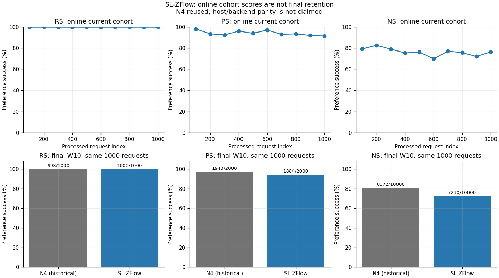
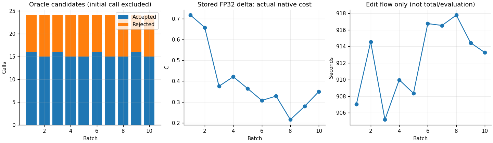

# SL-ZFlow W0→SEQ1000 사실 보고

작성: SH2/server2. scientific_promotion=false. 이 문서는 관측·산술·기술 검증만 보고한다. 품질·보존·비용의 과학적 해석은 별도 GH review 범위다.

## 1. 실제 완료 범위와 같은 분모의 비교

신규 MAIN 1 chain, B100×10, unique/attempted 1,000개가 완료됐다. Accepted 154, rejected 86, oracle 250이며 각 batch의 `1+accepted+rejected`를 검산했다. History append 10, no-update batch 0. 기술 실행은 과학 분모 밖이며 기존 N4는 재사용했다. 신규 N4/Adam/barrier/다른 order 실행은 0이다.

| 지표 | 기존 N4 W10 | SL-ZFlow W10 | SL−N4 (pp) |
| --- | --- | --- | --- |
| RS | 998/1000 (99.80%) | 1000/1000 (100.00%) | 0.2 |
| PS | 1943/2000 (97.15%) | 1884/2000 (94.20%) | -2.95 |
| NS | 8072/10000 (80.72%) | 7230/10000 (72.30%) | -8.42 |

RS/PS는 target-new mean-token NLL < target-true, NS는 반대이며 tie는 실패다. TF strict는 모든 target token의 teacher-forced top-1 일치이고 token 지표는 correct/total token으로, 자유 생성 정확도가 아닌 별도 보조 지표다. 위 N4는 동일 case/prompt/target/order의 기존 관측이며 새 측정이 아니다. N4 cudnn TF32=True와 MAIN False 차이, host 차이가 있어 bitwise-equivalent execution을 주장하지 않는다.

고정 MAIN: Llama-3-8B-Instruct revision `8afb486c1db24fe5011ec46dfbe5b5dccdb575c2`, 실제 모델/write FP32/eager, seed20260907, 물리 weight `model.layers.4.mlp.down_proj.weight` 하나다. 매 batch 자기 W_entry/M_entry에서 X=0 및 W=W_entry+XB, native nonsymmetric LU로 B/S를 한 번 준비한다. lambda_write=1, lambda_flow=1, beta=.0625, barrier=off/budget=null, eta_initial=max=1, max_oracle_calls=25다. lambda_flow=1은 미튜닝 초기값이며 최적 trade-off 설정으로 주장하지 않는다. Native key clean1/2·generated각1/10과 edit loss 6contexts각1/6은 서로 다르다. 완성 native z/endpoint warm start나 normalization은 사용하지 않았다.

## 2. batch별 actual 상태와 current 관측

| Batch | 종료 | Accept | Reject | Oracle | Append | C | F | 실제 저장 Δ cost |
| --- | --- | --- | --- | --- | --- | --- | --- | --- |
| B001 | RESOURCE_STOP | 16 | 8 | 25 | 1 | 0.7168558835983276 | 0.7413297242490475 | 0.7168214832596178 |
| B002 | RESOURCE_STOP | 15 | 9 | 25 | 1 | 0.6577742695808411 | 0.701206287386422 | 0.6577439276646282 |
| B003 | RESOURCE_STOP | 16 | 8 | 25 | 1 | 0.37545710802078247 | 0.39385679618808306 | 0.3754396096767402 |
| B004 | RESOURCE_STOP | 15 | 9 | 25 | 1 | 0.42119109630584717 | 0.4583952293868149 | 0.4211720498699012 |
| B005 | RESOURCE_STOP | 15 | 9 | 25 | 1 | 0.3649170398712158 | 0.3981069018095128 | 0.3648996704406076 |
| B006 | RESOURCE_STOP | 16 | 8 | 25 | 1 | 0.3074605464935303 | 0.3238968936260187 | 0.30744645220156525 |
| B007 | RESOURCE_STOP | 15 | 9 | 25 | 1 | 0.3282364308834076 | 0.3639965343470862 | 0.32822154322648023 |
| B008 | RESOURCE_STOP | 15 | 9 | 25 | 1 | 0.21546274423599243 | 0.24964978459548248 | 0.2154528263191397 |
| B009 | RESOURCE_STOP | 16 | 8 | 25 | 1 | 0.27897533774375916 | 0.3211156058906737 | 0.278962496637317 |
| B010 | RESOURCE_STOP | 15 | 9 | 25 | 1 | 0.35050928592681885 | 0.37539686965020336 | 0.3504938028253299 |

| Batch | 지표 | n | d | % | new strict n | strict d |
| --- | --- | --- | --- | --- | --- | --- |
| B001 | RS | 100 | 100 | 100.0 | 100 | 100 |
| B001 | PS | 196 | 200 | 98.0 | 144 | 200 |
| B001 | NS | 792 | 1000 | 79.2 | 24 | 1000 |
| B002 | RS | 100 | 100 | 100.0 | 100 | 100 |
| B002 | PS | 187 | 200 | 93.5 | 128 | 200 |
| B002 | NS | 827 | 1000 | 82.7 | 25 | 1000 |
| B003 | RS | 100 | 100 | 100.0 | 100 | 100 |
| B003 | PS | 185 | 200 | 92.5 | 123 | 200 |
| B003 | NS | 790 | 1000 | 79.0 | 35 | 1000 |
| B004 | RS | 100 | 100 | 100.0 | 99 | 100 |
| B004 | PS | 192 | 200 | 96.0 | 146 | 200 |
| B004 | NS | 754 | 1000 | 75.4 | 44 | 1000 |
| B005 | RS | 100 | 100 | 100.0 | 100 | 100 |
| B005 | PS | 188 | 200 | 94.0 | 127 | 200 |
| B005 | NS | 763 | 1000 | 76.3 | 35 | 1000 |
| B006 | RS | 100 | 100 | 100.0 | 100 | 100 |
| B006 | PS | 194 | 200 | 97.0 | 129 | 200 |
| B006 | NS | 698 | 1000 | 69.8 | 53 | 1000 |
| B007 | RS | 100 | 100 | 100.0 | 99 | 100 |
| B007 | PS | 186 | 200 | 93.0 | 139 | 200 |
| B007 | NS | 771 | 1000 | 77.1 | 47 | 1000 |
| B008 | RS | 100 | 100 | 100.0 | 100 | 100 |
| B008 | PS | 187 | 200 | 93.5 | 124 | 200 |
| B008 | NS | 757 | 1000 | 75.7 | 80 | 1000 |
| B009 | RS | 100 | 100 | 100.0 | 99 | 100 |
| B009 | PS | 184 | 200 | 92.0 | 137 | 200 |
| B009 | NS | 721 | 1000 | 72.1 | 75 | 1000 |
| B010 | RS | 100 | 100 | 100.0 | 100 | 100 |
| B010 | PS | 183 | 200 | 91.5 | 140 | 200 |
| B010 | NS | 764 | 1000 | 76.4 | 61 | 1000 |

RESOURCE_STOP은 계산 한도 종료이며 최적성·성과 인증이 아니다. FIRST_ORDER_STATIONARY는 reduced-space 1차 조건만 뜻한다. 유효 finite/no-update 요청도 원분모에서 제외하지 않았다. At-write/current 합계를 final retention으로 부르지 않는다.

## 3. 동일 문항 유지·손실·회복과 NLL tail

| 비교 | 지표 | d | 이전 성공 | 이후 성공 | 성공→실패 | 실패→성공 | Δpp |
| --- | --- | --- | --- | --- | --- | --- | --- |
| SL_ZFLOW_ATWRITE_TO_W10 | RS | 1000 | 1000 | 1000 | 0 | 0 | 0.0 |
| SL_ZFLOW_ATWRITE_TO_W10 | PS | 2000 | 1882 | 1884 | 18 | 20 | 0.1 |
| SL_ZFLOW_ATWRITE_TO_W10 | NS | 10000 | 7637 | 7230 | 660 | 253 | -4.07 |
| SL_ZFLOW_W5_TO_W10_SAME_FIRST500 | RS | 500 | 500 | 500 | 0 | 0 | 0.0 |
| SL_ZFLOW_W5_TO_W10_SAME_FIRST500 | PS | 1000 | 951 | 949 | 10 | 8 | -0.2 |
| SL_ZFLOW_W5_TO_W10_SAME_FIRST500 | NS | 5000 | 3801 | 3556 | 400 | 155 | -4.9 |
| N4_W10_TO_SL_ZFLOW_W10 | RS | 1000 | 998 | 1000 | 0 | 2 | 0.2 |
| N4_W10_TO_SL_ZFLOW_W10 | PS | 2000 | 1943 | 1884 | 86 | 27 | -2.95 |
| N4_W10_TO_SL_ZFLOW_W10 | NS | 10000 | 8072 | 7230 | 1252 | 410 | -8.42 |

Lost/gained는 exact item identity/order join이다. W10 first500은 W10 full1000의 동일 raw rows를 CPU로 잘랐고 중복 forward가 없다. 반복 관측 수를 독립 표본 수로 세지 않는다. Input-only superseded 후보/동일 batch 충돌/미확정 그룹은 paired.csv에 따로 남겼으며 canonical 분모를 삭제하지 않는다.

실제 관측 inventory: `{'derived_no_forward_prompt_pairs': 6500, 'historical_n4_reused_prompt_pairs': 13000, 'new_forward_prompt_pairs': 32500, 'new_forward_target_sequences': 65000, 'repeated_observations_are_independent_samples': False, 'unique_scientific_requests': 1000}`.

입력 population: `{'ACTIVE_NO_LATER_DIFFERENT_TARGET': 999, 'SUPERSEDED_CANDIDATE_LATER_BATCH': 1, 'UNRESOLVED_MISSING_RELATION': 0, 'WITHIN_BATCH_TARGET_CONFLICT': 0}`.

| 상태 | 범위 | 지표 | new NLL median | new NLL p95 | new NLL p99 | true NLL median | 성공방향 margin p05 |
| --- | --- | --- | --- | --- | --- | --- | --- |
| B005 | seen-full | RS | 0.0037187248235568404 | 0.03457970302551967 | 0.6830707573890678 | 12.550059795379639 | 6.520683581521735 |
| B005 | seen-full | PS | 0.34649111330509186 | 6.075242733955382 | 9.682737264633177 | 8.79233980178833 | 0.19080748558044447 |
| B005 | seen-full | NS | 8.001022100448608 | 14.675352954864502 | 17.58032424926758 | 4.05442214012146 | -4.838833200931549 |
| B010 | seen-full | RS | 0.003713677288033068 | 0.06125557124614708 | 0.6113502252101893 | 12.180621147155762 | 6.267126099020243 |
| B010 | seen-full | PS | 0.27696385979652405 | 5.942101812362666 | 10.106271181106568 | 8.568422317504883 | -0.4886601641774177 |
| B010 | seen-full | NS | 7.511090278625488 | 14.534885740280147 | 17.346570682525634 | 3.9617245197296143 | -6.099107667803764 |
| B010 | first500 | RS | 0.0030064639868214726 | 0.09944624938070733 | 0.6651409840583797 | 12.376940727233887 | 6.218265184271149 |
| B010 | first500 | PS | 0.2104450911283493 | 5.48817818164825 | 9.691385030746456 | 8.898995399475098 | -0.09176893234252916 |
| B010 | first500 | NS | 7.442908525466919 | 14.531327247619629 | 17.34908115386965 | 4.28975510597229 | -6.321990025043488 |
| N4_W10 | historical-n4 | RS | 0.0011623300379142165 | 0.008037822926416992 | 0.08885138154029744 | 14.464827537536621 | 7.985488017741591 |
| N4_W10 | historical-n4 | PS | 0.2932027131319046 | 6.975954914093017 | 10.035090398788451 | 9.962728500366211 | 1.2939382791519165 |
| N4_W10 | historical-n4 | NS | 9.268556594848633 | 15.48057951927185 | 18.127093658447265 | 4.844059705734253 | -3.856557440757751 |

전체 strict/token·new/true NLL quantile은 metrics.csv, exact-paired NLL 변화 quantile은 paired.csv에 있다. NS를 전체 pretrained capability 보존으로 확대하지 않는다.

## 4. 실제 Llama·state·resume 검증

기술 gate `fa2d020259fb899ed60b4c500bd0cb345e4dc01b99362644633824d4cfc8545c`: full-write↔all-token suffix logits/NLL/X-gradient와 global microbatch weight, actual FP32 Δ cost, entry rollback/nonselected guard, inner append0/terminal append1을 확인했다. 별도 Python process에서 W/M/context/RNG를 복원한 다음 batch 첫 request logits max-abs=0.0; exact-same=True. 동일 commit 재시도는 no-op였다.

범위: native source compute_ks replay는 실제 첫 2개 요청, gradient calibration/독립 고정 perturbation 검사는 첫 2개 요청의 7개 packed caches(모든 token), microbatch partition 검사는 같은 2개 요청의 microbatch1/2였다. Writer 좌표는 B100의 100개를 유지했다. 이후 terminal physical parity/cost와 flow는 전체 기술 B100에서 수행했다. 모든 1,000개 요청마다 full-write X-gradient를 별도 재검증했다고 주장하지 않는다.

10개 MAIN checkpoint는 W/M/X/B/S/K/config/context/RNG/ledger/parent/next-index/cache-binding을 담고 있으며 CPU에서 full file/tensor/RNG SHA와 chain continuity를 재검산했다. 저장된 W와 이전 W의 FP64 차이로 실제 cost를 다시 계산하고, 저장 M이 이전 M+CPU FP32 K@K.T 한 번의 결과와 정확히 일치하는지도 확인했다. 이는 saved end-state 검증이며 단독으로 모든 중간 연산을 계수했다는 주장은 아니다. Actual model resume 실험은 기술 checkpoint에서 수행했으며 모든 MAIN checkpoint를 별도 GPU replay했다고 주장하지 않는다. 완성 manifest 없는 partial bundle은 resume 대상이 아니다.

수치 threshold는 품질 평가 전에 fixed calibration으로 봉인했으며 chain 중 변경하지 않았다. Tokenizer는 source-native add_bos attribute=False 대입을 보존했으나 Fast tokenizer의 실제 backend BOS 제거와 같지 않다. 실제 token IDs와 source key 경로를 확인했으며 속성값만으로 BOS 부재를 주장하지 않는다.

## 5. 비용·오류와 자원

| Job | 범위 | 상태 | Exit | 할당 GPU-sec | Slurm sampled CPU MaxRSS |
| --- | --- | --- | --- | --- | --- |
| 48294 | TECHNICAL_FAILED_METADATA | FAILED | 1:0 | 31 | 14504360K |
| 48297 | TECHNICAL_VALID | COMPLETED | 0:0 | 1064 | 34362540K |
| 48303 | MAIN_SEQ1000 | COMPLETED | 0:0 | 11191 | 17508700K |

마지막 MAIN process wall=11181.086256s. 할당 GPU 시간은 위 scheduler ledger이며 pure compute와 다르다. 초기 기술 metadata 실패도 비용에 포함한다. Plan의 4.74h/15h wall은 추정/요청값이지 actual elapsed가 아니다.

기존 N4 job38997의 기록된 process 시간은 3654.882133s이며 과거 비용이다. 새 기술+MAIN 할당 합계는 12286 GPU-sec다. N4와 MAIN의 observer 일정·구성요소 및 host/backend가 동일한 시간 실험으로 검증된 것은 아니므로 이 두 process 시간만으로 순수 optimizer speedup을 계산하지 않는다.

| Batch | 준비s | flow s | commit s | 평가s | batch s | peak allocated B |
| --- | --- | --- | --- | --- | --- | --- |
| B001 | 27.875590609386563 | 907.0304166032001 | 62.998756028711796 | 44.19417635630816 | 1046.5778965866193 | 36245733888 |
| B002 | 28.386180887930095 | 914.5614239545539 | 66.70972688216716 | 41.66951890941709 | 1055.756257649511 | 36254253568 |
| B003 | 27.85612234286964 | 905.1805309718475 | 66.23424975760281 | 42.61866397969425 | 1046.4471591012552 | 36254253568 |
| B004 | 28.098145610652864 | 909.9743790589273 | 66.6126476880163 | 43.25128889456391 | 1052.4465879881755 | 36254253568 |
| B005 | 28.164712194353342 | 908.3528786040843 | 66.04410223197192 | 249.87748732045293 | 1256.9864692799747 | 36254253568 |
| B006 | 28.22466574329883 | 916.7523205848411 | 66.73407495580614 | 43.31871070899069 | 1059.5548833794892 | 36254253568 |
| B007 | 28.24504366889596 | 916.5342645915225 | 66.79100978560746 | 43.77763430029154 | 1060.170857252553 | 36254253568 |
| B008 | 28.650231522507966 | 917.7800021478906 | 66.8659075954929 | 43.25158819742501 | 1061.0901255458593 | 36254253568 |
| B009 | 28.061517043039203 | 914.4428536798805 | 66.38167571742088 | 41.70155347045511 | 1054.909618254751 | 36254253568 |
| B010 | 28.11956561729312 | 913.264995998703 | 66.86497681587934 | 462.4514600383118 | 1475.4631037646905 | 36254253568 |

compute.csv는 prefix+teacher 합산 준비, native keys/LU, initial/accepted/rejected suffix F+B, terminal parity, 실제 cost, durable prepare, 평가를 구분한다. Prefix와 teacher 각각의 독립 wall timer는 없으며 prefix_teacher_combined로 보고한다. 중첩 timer를 더하지 않는다. 새 25 whole-batch sweep를 native max25 forward/24 backward 및 요청별 early-stop과 같은 단위로 취급하지 않는다. 기존 N4 비용은 새 allocation으로 청구하지 않았다.

순수 filesystem I/O 시간은 별도로 계측하지 않았으며 commit timer에 포함된다. 별도 기록된 parity/cost/prepare 시간을 뺀 나머지는 publication·hash·전송·기타를 포함하는 nonexclusive remainder이지 순수 I/O 시간이 아니다. Batch별 checkpoint_bundle_bytes는 실제 저장량이다. CPU MaxRSS는 Slurm의 sampled 값이다. Torch GPU peak는 batch마다 reset하지 않은 해당 process 시작 이후 누적 최대값이며 batch-local peak나 CPU RSS와 같지 않다.

## 6. source·재현·artifact

실행 HEAD `5d149fec254a7a53b6d91790d186880f248676e6`, tree `0202db9aee30ba5103c52e21d0647c66e1428567`, input lock `79e69eee91a7c60e57351f9253c5ee6768dbea4557c71f8957f3b4020017d911`. 분석 source는 verification.json의 analysis_source에 별도 기록했다. Source/hash 검증은 실제 model parity의 대체물이 아니다.

원 reference JSON의 llama_adapter_implemented=false/durable_commit_implemented=false는 원 CPU publication 당시 상태로 byte-preserving 유지했다. 이 필드를 새 실제 구현 완료표시로 수정하지 않았으며, 실제 adapter/durable 구현 및 검증은 위 별도 실행 source와 TECHNICAL_VALID/checkpoint receipt로 결속한다.

- 집계: `aggregates/{node,batch,metrics,paired,compute}.csv`, verification.json 및 manifest.json.
- 기술: `/mnt/raid5/janghj/ODE-edit/local/single-layer-zflow/20260916-v1/technical/attempt-r2`.
- N4 재사용 근거: `/mnt/raid5/janghj/ODE-edit/local/single-layer-zflow/20260916-v1/inputs/n4-reuse-manifest-r1.json`.
- MAIN raw/checkpoint 경로는 allocation-receipt.json의 main_output에 있다. Raw/model/teacher/prompt/checkpoint/full log는 Git 밖 local-only 보존, NO_BROADCAST_NOT_REQUIRED.

재현 명령은 package README와 figures/plot-receipt.json에 있다. 분석은 sealed input lock+MAIN root+N4 exact raw SHA를 요구하며 모델/evaluator를 호출하지 않는다.

## 7. 코드 생성 그림과 미실행 경계

그림은 집계 CSV와 Python matplotlib 코드에서 생성했다. 입력·코드·PNG SHA 및 재현 명령을 결속하고 같은 입력의 PNG byte 재현을 검증한다. 수동 수정이나 이미지 생성 도구를 사용하지 않았다.

Adam(same actual-write objective) 및 fixed/exponential barrier ablation은 NOT_RUN이다. 후속에는 objective/entry/sample/계산예산을 맞추어 optimizer 차이와 constraint 차이를 분리해야 하지만 이 보고로 추가 실행하지 않는다. 단일 MAIN으로 integrator 고유 기여를 인증하지 않으며 C 감소를 output locality 보장으로 부르지 않는다.
