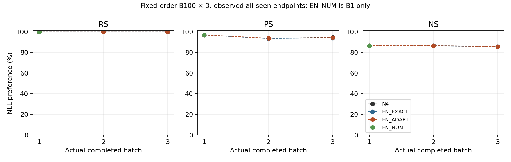
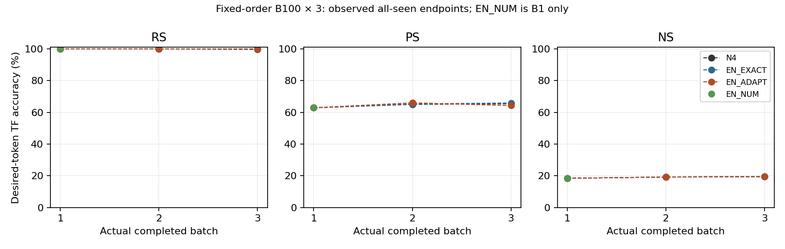

# EN adaptive nullspace B300 · SH3 완료 리뷰

Job **51290**이 COMPLETED/exit0으로 끝났고 승인된 B300 endpoint **10/10**, history commit **10회**, own W/M 다음-entry 연결 **6/6**을 저장된 결과로 확인했다.
**이번 단일 실행에서 EN_ADAPT의 전반적 성능 향상은 확인되지 않았다.** 최종 RS는 모두100%, EN_ADAPT PS/NS는 N4보다 각각0.333/0.033 percentage point 낮다.
Rewrite TF strict는1문항 높지만 rephrase strict는7prompt, neighborhood strict는4prompt 낮다. NLL과 accuracy는 따로 해석해야 한다.
T0 finite/identity PASS와 **precision NOT_ESTABLISHED**를 함께 유지한다. 학습·평가를 다시 실행하지 않은 CPU 리뷰이며 신규 GPU 제출0이다.

## 완료 범위와 재현 identity

- 실제 실행 source `5d452221288f3b924e1737578f11aaa654594422`, tree `5cf4c8d709cce99b64236f76e739f6ea9d0e90fc`.
- 실행 lock SHA `bcecbff09e251b937f93175f86974b868505a78738c82dc77aea640bddf97d7e`; archive SHA `ba6910244e339b40798cc93a0d04063d85c083a1aa2ea1bf9127322265eef5bc`.
- S4 실패 실행 `b6e86234`의 controller/curvature/actual Armijo를 보존하고 strict scalar JSON 저장만 수리했다. 분석 코드 `1bb93e1d`는 S4 실행 source와 구분한다.
- Fixed10k JSON SHA `3d7f5e31db47b23f3a281bb6fb447c2fb1776e3d4721cdfb5fe5c6f998f10ae1`, ordered root `5b01356928ad2e2e46effad5a2c5621c87746b610992b7b92bf3ace16b6f5729`; 정확 first300/B100, fresh W0/zeroM4.
- Llama revision `8afb486c1db24fe5011ec46dfbe5b5dccdb575c2`, L4 down_proj 단일 편집, FP32/eager/TF32off, 원nativeL2=1/context/tokenizer 유지.
- B1 N4/EN_EXACT/EN_NUM/EN_ADAPT 공유 계산; B2/B3 N4/EN_EXACT/EN_ADAPT 각 own trajectory. EN_NUM sequential0.
- 저장된 scalar/token flags 재집계, full reference position coverage, 후보 acceptance/minJ replay, 세 trajectory의 상태 SHA 연결 검산. 원 weight가 없어 독립 tensor 재구성이나 exact resume을 검증한 것은 아니다.

## B3 전체 300문항 결과

RS/PS는 new NLL < true NLL, NS는 true NLL < new NLL이며 ties failure. 분모는 R300/P600/N3000 prompt다.

| Arm | RS % | PS % | NS % |
|---|---|---|---|
| N4 | 100.000 | 94.667 | 85.800 |
| EN_EXACT | 100.000 | 94.167 | 85.700 |
| EN_ADAPT | 100.000 | 94.333 | 85.767 |

B1 및 B2 all-seen 관측은 다음과 같다. B1 네 arm의 성공 총점은 같아도 weight/후보 identity가 같은 alias는 아니었다.

| Batch | Arm | RS % | PS % | NS % |
|---|---|---|---|---|
| 1 | N4 | 100.000 | 97.000 | 86.500 |
| 1 | EN_EXACT | 100.000 | 97.000 | 86.500 |
| 1 | EN_NUM | 100.000 | 97.000 | 86.500 |
| 1 | EN_ADAPT | 100.000 | 97.000 | 86.500 |
| 2 | N4 | 100.000 | 93.500 | 86.500 |
| 2 | EN_EXACT | 100.000 | 93.500 | 86.450 |
| 2 | EN_ADAPT | 100.000 | 93.750 | 86.500 |



## 추가 정확도와 NLL

아래 값은 teacher-forced desired target 정확도이며 자유생성 정확도가 아니다. R/P desired=new, N desired=true.
Token-micro는 모든 valid token의 정답률, prompt-macro는 prompt별 token 정답률 평균, strict는 target 전체 token 일치다.
기존 NLL 선호율 alias를 새 독립 정확도로 중복 해석하지 않았다.

| Arm | Family | Token micro % | Prompt macro % | Strict % | Correct/valid token | Strict/total prompt |
|---|---|---|---|---|---|---|
| N4 | RS | 99.672 | 99.667 | 99.667 | 304/305 | 299/300 |
| N4 | PS | 65.410 | 65.333 | 64.833 | 399/610 | 389/600 |
| N4 | NS | 19.577 | 18.867 | 17.700 | 601/3070 | 531/3000 |
| EN_EXACT | RS | 100.000 | 100.000 | 100.000 | 305/305 | 300/300 |
| EN_EXACT | PS | 65.902 | 65.917 | 65.333 | 402/610 | 392/600 |
| EN_EXACT | NS | 19.414 | 18.700 | 17.533 | 596/3070 | 526/3000 |
| EN_ADAPT | RS | 100.000 | 100.000 | 100.000 | 305/305 | 300/300 |
| EN_ADAPT | PS | 64.262 | 64.250 | 63.667 | 392/610 | 382/600 |
| EN_ADAPT | NS | 19.446 | 18.733 | 17.567 | 597/3070 | 527/3000 |

NLL은 target token 평균 후 prompt 평균이다. Margin은 R/P에서 true−new, N에서 new−true이며 양수가 desired 선호다.

| Arm | Family | new NLL | true NLL | desired NLL | desired margin |
|---|---|---|---|---|---|
| N4 | RS | 0.00519918 | 14.95806403 | 0.00519918 | 14.95286485 |
| N4 | PS | 1.68738124 | 10.01107042 | 1.68738124 | 8.32368919 |
| N4 | NS | 10.34818492 | 5.15858138 | 5.15858138 | 5.18960354 |
| EN_EXACT | RS | 0.00350160 | 15.02743563 | 0.00350160 | 15.02393403 |
| EN_EXACT | PS | 1.68225382 | 10.05078164 | 1.68225382 | 8.36852782 |
| EN_EXACT | NS | 10.33190379 | 5.16581419 | 5.16581419 | 5.16608961 |
| EN_ADAPT | RS | 0.00279537 | 15.01308743 | 0.00279537 | 15.01029206 |
| EN_ADAPT | PS | 1.67444158 | 10.06040434 | 1.67444158 | 8.38596276 |
| EN_ADAPT | NS | 10.35135823 | 5.17339568 | 5.17339568 | 5.17796255 |



EN_ADAPT의 rephrase new NLL은 N4보다0.01294 낮으나 TF strict는1.167pp 낮다. Neighborhood true NLL은0.01481 높다.
따라서 더 낮은 평균 NLL을 모든 prompt의 argmax 정확도 향상으로 해석할 수 없다.

## Paired 차이와 사례 이동

차이는 EN_ADAPT−N4, B3 all-seen 기준이다. Request cluster bootstrap10000/seed20260920, percentile95%; 이웃 prompt를 독립 표본으로 세지 않는다.
동일 성공 총점도 lost/gained 사례가 다를 수 있다. 완전한 case/prompt ID 목록과 true/new/desired NLL CI는 [official-paired.csv](official-paired.csv)에 있다.

| Family | Preference Δpp | 95% CI pp | Lost | Gained | Strict Δpp | 95% CI pp | Strict lost | Strict gained |
|---|---|---|---|---|---|---|---|---|
| RS | +0.000 | [0.000, 0.000] | 0 | 0 | +0.333 | [0.000, 1.000] | 0 | 1 |
| PS | -0.333 | [-0.833, 0.000] | 2 | 0 | -1.167 | [-2.833, 0.333] | 13 | 6 |
| NS | -0.033 | [-0.433, 0.300] | 10 | 9 | -0.133 | [-0.333, 0.033] | 6 | 2 |

PS 선호율 차이는2prompt 감소, NS는10lost/9gained로1prompt 감소다. 많은 CI가0을 포함하거나 경계가0에 닿으며, 다중 비교 보정 없는 단일 순서/단일 실행이다.
EN_ADAPT R+twoP joint strict는 N4 대비8lost/3gained, 순−5request(-1.667pp); 별도 [independent-joint.csv](independent-joint.csv)에 각 endpoint의 joint 분모를 보존했다.

## 순차 유지: current / active past / first100

B3 current는 마지막100, active past는 이전200, first100은 같은 B1문항이다. 모두 원순서 유지.

| Arm | Scope | RS % | PS % | NS % |
|---|---|---|---|---|
| N4 | current | 100.000 | 94.500 | 86.000 |
| N4 | active_past | 100.000 | 94.750 | 85.700 |
| N4 | first100 | 100.000 | 97.500 | 85.300 |
| EN_EXACT | current | 100.000 | 94.000 | 85.700 |
| EN_EXACT | active_past | 100.000 | 94.250 | 85.700 |
| EN_EXACT | first100 | 100.000 | 97.000 | 85.300 |
| EN_ADAPT | current | 100.000 | 94.000 | 85.500 |
| EN_ADAPT | active_past | 100.000 | 94.500 | 85.900 |
| EN_ADAPT | first100 | 100.000 | 97.500 | 85.600 |

EN_ADAPT first100 PS는 B1 97.0%→B3 97.5%, NS는86.5%→85.6%다. PS strict는62.5%→65.5%, NS strict는16.0%→15.3%다.
EN_ADAPT 전체 at-write→B3에서 NS는31lost/13gained(-0.6pp, request CI[-1.1,-0.133]pp), strict는25lost/29gained다.
따라서 선호율과 argmax 유지의 변화 방향도 같지 않다. W0-correct neighborhood 선호율 유지분모는2658개로,
N4 2547/2658, EN_EXACT2543/2658, EN_ADAPT2544/2658이다. W0-strict528개, W0-token597개는 별도 분모다.
전체 유지 자료는 [sequential-retention.csv](sequential-retention.csv), [endpoint-metrics.csv](endpoint-metrics.csv), [independent-metrics.csv](independent-metrics.csv)에 있다.

## Controller / geometry / reference-history

| Batch | Arm | 선택 결과 | 최종 trial | Observer alias |
|---|---|---|---|---|
| 1 | N4 | NATIVE_BASELINE | — | — |
| 1 | EN_EXACT | ACCEPTED | candidate2 | — |
| 1 | EN_NUM | ACCEPTED | candidate2 | — |
| 1 | EN_ADAPT | ACCEPTED | candidate2 | — |
| 2 | N4 | NATIVE_BASELINE | — | — |
| 2 | EN_EXACT | SEARCH_LIMIT_NO_ACCEPTED_CANDIDATE | — | — |
| 2 | EN_ADAPT | ACCEPTED | candidate1 | — |
| 3 | N4 | NATIVE_BASELINE | — | — |
| 3 | EN_EXACT | ACCEPTED | candidate2 | — |
| 3 | EN_ADAPT | ACCEPTED | candidate2 | — |

B2 EN_EXACT는 두 후보 미수용 후 정상 native fallback이며 기술오류·재시도 사유가 아니다. 나머지 EN controller6개는 수용됐고,14개 candidate의 저장 acceptance를 CPU replay와 모두 일치시켰다.
EN_ADAPT의 선택 released modes는 B1 4483/4483, B2 4703/4703, B3 4425/4425로 이번 trajectory에서는 전체 resolved mode를 허용했다.
Primaryε=.05에서 active cap은 linear_zero_loss다. 저장 spectrum에서ε=.01/.1 algebra-only 재계산도 같은 adaptive rank를 선택했으며 새 실험은 하지 않았다.
Raw native P와 adaptive allowed subspace를 구분한다. 전체 mode 허용 선택은 raw P를 없앴다는 뜻이 아니다.
Exact projection의 이상적 current response는 거의0이나 실제 FP32 materialization에는 rounding response가 남는다.
예컨대 B1 EN_EXACT 선택 후보의 ideal response≈1.68e−18, actual response≈4.22e−8이다. 이를 DK=0의 실물 보장으로 부르지 않는다.
[selected-frontier.csv](selected-frontier.csv), [candidate-geometry.csv](candidate-geometry.csv), [candidate-ledger.csv](candidate-ledger.csv)에 eta/활성 cap/ideal→actual norm·response·rounding을 결속했다.
[reference-paired.csv](reference-paired.csv)는 L_R/L_H를 분리한다. Full R512는512문서/130235valid positions, history는 각 arm의 최종 at-write 분포와 active past 전부(0/100/200)다.
Dev128는 B1 N4/EN_ADAPT observer만이며 선택에 쓰이지 않았다. 공식 P/N·TF 정확도도 선택 후 observer다.

## 기술 한계와 비용

S3 T0 current cached/physical logits 최대차=0, reference 최대차=0.000295997,
AD gradient 상대차=0.00027932775, directional finite-difference 상대잔차=0.0011008461다.
고정4reference/4current의 제한된 관측이다. S4 reference 재사용이 S3에서 bitwise parity를 보장하지 않으며,
z batching 수치동등성까지 확립한 PASS로 확대하지 않는다. **precision NOT_ESTABLISHED / exploratory**를 유지한다.

실제 allocation은5743초×1GPU = **1.595278GPUh**(95분43초). 8CPU/119GiB, ubuntu, exportNONE/Requeue0.
Slurm batch MaxRSS72744516KiB≈69.375GiB. Python self maxRSS34754368KiB와 측정 범위가 달라 합산하지 않는다.
GPU peak allocated는53.983GiB. CPU process wall은5736.758초, T0 218.056초는 allocation에 이미 포함됐다.
과학 native7batch/700request, SVD5, R-gradient5/R-candidate14. B1 공유 native와 teacher 준비비용을 중복 가산하지 않았다.
S4 실패6218GPU-sec(1.727222GPUh)는 별도 sunk cost다. 두 시도를 합친 actual allocation은11961GPU-sec(3.3225GPUh)이며 두 완료 실험으로 세지 않는다.
원재료 teacher101519959223B/2560files는 S3 local재사용, 이번 run 전송·재생성0. 원 결과 JSON 총242839345B.
Standalone core 재구성은 EN_ADAPT B1/B2/B3 약657.25/670.93/672.72초이며 teacher/T0/observer/전체 allocation을 제외한 부분비용이다.
[costs.csv](costs.csv)에 실제공유/standalone core/분리된 기술비용을 명시했고 전체 속도향상을 주장하지 않는다.

save_checkpoints=false, edited W/M/delta/optimizer/resume dump0. 원 output은 모두 JSON이고 종료 시 W0 복원 guard 이후 TASK_EXECUTION_COMPLETE를 확인했다.
History teacher600request/312431616B는 process RAM에 있었으며 영속 checkpoint로 저장하지 않았다. Exact crash-resume=NOT_AVAILABLE.

## 후처리와 산출물 위치

기존 report.py는 저장 frontier row에도 있는 epsilon을 중복 keyword로 전달해 보고서 생성만 실패했다.
실제 값 불일치를 거부하면서 필드를 한 번만 전달하도록 수리했고 report 회귀5개 PASS. 원 frozen 실행 source/raw는 변경0이다.
독립 reducer는 별도 저장된 new/true NLL과 token flags를 읽어 선호/정확도/분모를 재검산했다. Source는 이번 보고 commit에 포함한다.
23.8MB full frontier와11.9MB per-prompt paired CSV는 local에 보존하고 Git에는 compact CSV/manifest/한국어 report/그림만 게시한다.

- 원 실행 `/data/janghj/ODE-edit/local/en-adaptive-nullspace/20260920-v1/server3-repair-r1/attempt-v1`
- 전체 CPU reducer `/data/janghj/ODE-edit/local/en-adaptive-nullspace/20260920-v1/server3-repair-r1/completion-review-r1`
- 결과·코드·cost·input SHA: [completion-audit.json](completion-audit.json), [report-manifest.json](report-manifest.json), [independent-reducer.json](independent-reducer.json).

CPU 재현(새 destination을 지정):

```bash
cd /data/janghj/ODE-edit/local/en-adaptive-nullspace/20260920-v1/server3-repair-r1/worktree
/data/janghj/ODE-edit/local/runtime/server3-experiment-ready-v1/venv/bin/python -m project.run_scripts.en_adaptive_nullspace.report \
  --output /data/janghj/ODE-edit/local/en-adaptive-nullspace/20260920-v1/server3-repair-r1/attempt-v1/output --destination /tmp/sh3-b300-review-reproduce
```

이번 완료 리뷰 후 자동 과학 제출·lifelong 시작·모니터링 재개0. Lifelong 지시는 별도 범위이며 이 B300 완료 보고에 합치지 않는다.
