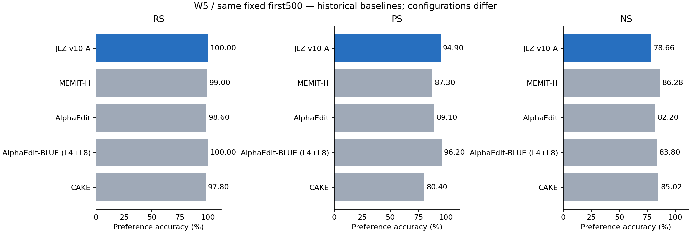
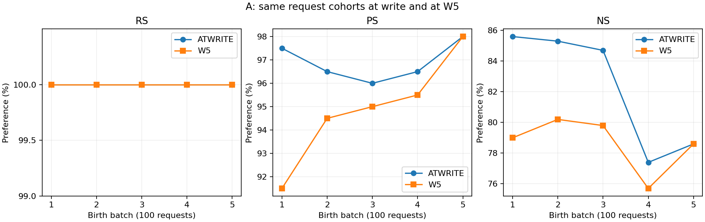
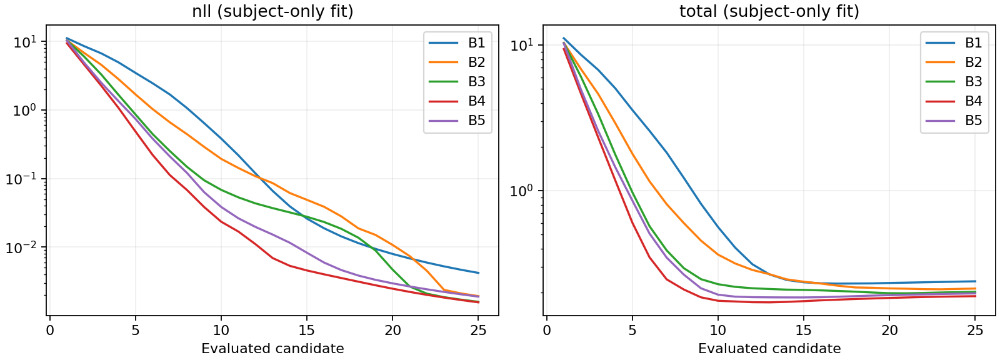

# JLZ v10 T′ A500 완료 CPU 리뷰 및 기존 baseline 비교

**A500_COMPLETE_REVIEWED** — job57699의 B100×5가 COMPLETED/0:0이고, 5 commit·125 candidate·120 Adam update·층별 history 25 append·W5 R500/P1000/N5000을 확인했다. 이 문서는 A arm 완료본이다. B arm과 후속 collector는 이번 리뷰에서 조회하지 않았다.

사용자 recall: “A 부분 결과 나왔으니 리뷰하고 산출물과 코드 main에 push해. baseline들 (memit-h, alphaedit, alphaedit-blue, CAKE)도 비교에 넣어라.” 부모 instruction은 `ODEEDIT-USER-GH-SH3-JLZ-V10-TPRIME-500-20261003-R1`이다.

## 1. 동일 W5 / fixed first500 비교

R/P는 new NLL<true NLL, N은 true NLL<new NLL이며 tie는 실패다. 모든 행의 분모는 R500/P1000/N5000이다. 기존 네 방법은 저장된 **역사 baseline 집계**를 재사용했으며 새 matched 대조 실행이 아니다.

| 방법 | RS n/500 (%) | PS n/1000 (%) | NS n/5000 (%) |
|---|---|---|---|
| JLZ-v10-A | 500/500 (100.00) | 949/1000 (94.90) | 3933/5000 (78.66) |
| MEMIT-H | 495/500 (99.00) | 873/1000 (87.30) | 4314/5000 (86.28) |
| AlphaEdit | 493/500 (98.60) | 891/1000 (89.10) | 4110/5000 (82.20) |
| AlphaEdit-BLUE (L4+L8) | 500/500 (100.00) | 962/1000 (96.20) | 4190/5000 (83.80) |
| CAKE | 489/500 (97.80) | 804/1000 (80.40) | 4251/5000 (85.02) |



A−baseline의 산술 차이(pp):

| 기준 | ΔRS | ΔPS | ΔNS |
|---|---|---|---|
| MEMIT-H | +1.00 | +7.60 | -7.62 |
| AlphaEdit | +1.40 | +5.80 | -3.54 |
| AlphaEdit-BLUE (L4+L8) | +0.00 | -1.30 | -5.14 |
| CAKE | +2.20 | +14.50 | -6.36 |

A와 AlphaEdit-BLUE는 W5 RS가 모두500/500이다. PS/NS의 baseline 대비 개별 lost/gained는 aggregate만으로 계산할 수 없어 `NOT_AVAILABLE_AGGREGATE_ONLY`로 기록했다. A 내부의 at-write/W0 pairing은 원 ID로 검산했다.

### 비교 조건과 출처

| 방법 / job | 층·writer | 설정·실행 차이 |
|---|---|---|
| JLZ v10 A / 57699 | L4–L8, ridge 15000C0+H+KKᵀ; T′, allocation=sum c | seed20261002, norm.5/allocation.1, 25후보24update, active clamp 없음, H200 |
| MEMIT-H / 54007 | BLUE311b076 MEMIT_seq, blue=false, L4–L8; residual5/4/3/2/1 | native L8 z, decay.5/clamp.75, seed20260907, H200 |
| AlphaEdit / 42657 | BASE_ALPHAEDIT, blue=false, L4–L8, projected writer L2=10 | native decay.5/clamp.75, seed20260907, RTX PRO6000 Blackwell |
| AlphaEdit-BLUE / 39283_1 | AlphaEdit_ORIGINAL, blue=true, **L4+L8**, L2=1 | selected-layer native z, decay.5/clamp.75, seed20260907, RTX PRO6000 Blackwell |
| CAKE / 48101 | CAKE_NATIVE L4–L8, projected writer L2=10, native causal weights | upstream c8243e1 / wrapper7884aeb; decay.4/clamp.5/temperature.1, seed20260907, server4 |

모두 Llama3-8B-Instruct revision `8afb486c1db24fe5011ec46dfbe5b5dccdb575c2`, 같은 fixed10k 앞500과 canonical R/P/N 정의를 사용했다는 기존 source/config 증거에 결속했다. 실제 torch2.9.1+cu128 / transformers4.44.2 / FP32 eager / matmulTF32=false다. A는 cuDNNTF32=false, 역사 baseline은 true다. Fit MB2·observer MB16인 A와 native fitting 방법을 동일 알고리즘으로 취급하지 않는다.

과거 BLUE 데이터 파일 자체 SHA는 원 전체파일 식별자일 수 있어 현재 fixed10k JSON SHA와 다르다. 과거 비교의 ordered root 및 batch request-order 검산을 재사용했다. Canonical context digest `cf14b857…`와 context 파일 bytes SHA `33cec0ee…`는 서로 다른 해시 정의다. 이 리뷰는 cross-host full-model bitwise parity를 새로 측정하지 않았다.

- [MEMIT-H W5 원표](../../memit-history-fixed10k-20260928-v1/completion-review-r1/all-seen-metrics.csv) / [조건](../historical/historical-manifest.json)
- [AlphaEdit / AlphaEdit-BLUE 원표](../../../server4/blue-native-lifelong-comprehensive-review-2026-09-11-v1/cumulative-metrics.csv)
- [CAKE W5 원표](../../../server4/cake-native-lifelong-b100x100-2026-09-15-v1/completed-review-v2/seen-prefix.csv) / [기존 검산](../../../server4/cake-native-lifelong-b100x100-2026-09-15-v1/completed-review-v2/diagnostic-report-ko.md)

## 2. TF 정확도와 NLL

TF는 teacher-forced 정확도이며 자유생성 정확도가 아니다. R/P desired=new, N desired=true. token-micro는 정답 target token 합/valid token 합, prompt-macro는 각 prompt token 비율의 평균, strict는 target 전체 token 일치다. Preference와 별개 지표다.

| 방법 | R TF micro / strict % | P TF micro / strict % | N TF micro / strict % |
|---|---|---|---|
| JLZ-v10-A | 100.00 / 100.00 | 67.75 / 67.40 | 19.27 / 18.14 |
| MEMIT-H | 98.22 / 98.20 | 59.07 / 58.50 | 22.50 / 21.42 |
| AlphaEdit | 97.04 / 97.00 | 62.52 / 62.00 | 22.76 / 21.70 |
| AlphaEdit-BLUE (L4+L8) | 100.00 / 100.00 | 67.36 / 66.90 | 19.92 / 18.80 |
| CAKE | 96.65 / 96.60 | 51.97 / 51.30 | 23.04 / 21.98 |

A의 정확 분모 및 prompt-macro:

| Family | token correct/valid | prompt-macro % | strict n/d | true NLL | new NLL | desired margin |
|---|---|---|---|---|---|---|
| R | 507/507 | 100.00 | 500/500 | 15.122140 | 0.009501 | 15.112639 |
| P | 687/1014 | 67.70 | 674/1000 | 12.198107 | 1.967308 | 10.230799 |
| N | 977/5070 | 18.81 | 907/5000 | 5.339798 | 9.526238 | 4.186439 |

Margin은 R/P=true−new, N=new−true로 양수가 preference 성공 방향이다. A W5 ties는 R/P/N 모두0. Baseline TF prompt-macro는 원 집계에 있는 MEMIT-H만 표에 보존하고, 다른 세 방법은 `NOT_RECORDED_IN_SELECTED_AGGREGATE`로 둔다.

평균 true/new/desired NLL 전체 비교는 [W5-baseline-comparison.csv](W5-baseline-comparison.csv), A의 median/p90/p95/p99/min/max는 [W5-NLL-distributions.csv](W5-NLL-distributions.csv)다. 원하는 target의 tail:

| Family | 평균 | median | p95 | p99 | max |
|---|---|---|---|---|---|
| R | 0.009501 | 0.002182 | 0.018897 | 0.096486 | 1.487689 |
| P | 1.967308 | 0.140893 | 9.818479 | 14.232505 | 21.492382 |
| N | 5.339798 | 4.827605 | 12.526729 | 16.206840 | 23.819031 |

## 3. 작성 직후→W5 및 W0 retention

At-write는 각 요청이 속한 batch 직후의 서로 다른 endpoint다. 하나의 W0 또는 W5 상태로 부르지 않는다. B5 current100은 W5 전체500 raw의 부분집합이며 추가 평가로 중복 계산하지 않았다.

| 비교 | family / 정의 | before→after | lost | gained | retained | 분모 |
|---|---|---|---|---|---|---|
| W0_TO_W5 | R/PREFERENCE | 35→500 | 0 | 465 | 35 | 500 |
| W0_TO_W5 | R/TF_STRICT | 3→500 | 0 | 497 | 3 | 500 |
| W0_TO_W5 | P/PREFERENCE | 112→949 | 3 | 840 | 109 | 1000 |
| W0_TO_W5 | P/TF_STRICT | 1→674 | 0 | 673 | 1 | 1000 |
| W0_TO_W5 | N/PREFERENCE | 4392→3933 | 586 | 127 | 3806 | 5000 |
| W0_TO_W5 | N/TF_STRICT | 973→907 | 386 | 320 | 587 | 5000 |
| ATWRITE_TO_W5 | R/PREFERENCE | 500→500 | 0 | 0 | 500 | 500 |
| ATWRITE_TO_W5 | R/TF_STRICT | 500→500 | 0 | 0 | 500 | 500 |
| ATWRITE_TO_W5 | P/PREFERENCE | 969→949 | 28 | 8 | 941 | 1000 |
| ATWRITE_TO_W5 | P/TF_STRICT | 757→674 | 101 | 18 | 656 | 1000 |
| ATWRITE_TO_W5 | N/PREFERENCE | 4116→3933 | 257 | 74 | 3859 | 5000 |
| ATWRITE_TO_W5 | N/TF_STRICT | 936→907 | 176 | 147 | 760 | 5000 |

W0-correct neighborhood 보존은 3806/4392=86.66%다. W0 대비 NS 총점 변화와 조건부 retention 분모는 구분한다. R+twoP joint TF strict는 at-write 312/500 → W5 255/500이다.

각 birth cohort의 W5 수치(모든 cohort는 R100/P200/N1000):

| Birth batch | W5 RS% | W5 PS% | W5 NS% |
|---|---|---|---|
| 1 | 100.00 | 91.50 | 79.00 |
| 2 | 100.00 | 94.50 | 80.20 |
| 3 | 100.00 | 95.00 | 79.80 |
| 4 | 100.00 | 95.50 | 75.70 |
| 5 | 100.00 | 98.00 | 78.60 |



First100은 birth B1, first500은 전체다. W5까지 재계산한 active 요청은 500, superseded는 0이다. 미래 W20 등의 active mask를 상속하지 않았다. 빈 superseded 층은 NA_EMPTY다. Paired 변화 ID와 case/prompt-index는 local `analysis/paired-IDs-local.json`에 보존했고 Git에는 집계만 게시한다. 사전 계약에 없는 유의성 기준·bootstrap CI를 새로 추가하지 않았다.

## 4. 실제 실행·입력·상태 검산

고정 snapshot UTC 2026-10-03T11:05:52.278073+00:00: A 및 source/config/제출 receipt 181개, 43,750,554B. 완료 JSON의 stat 전후 동일성과 size/SHA를 봉인했다. Scheduler는 job57699만 한 번 조회했고 이후 반복 polling을 하지 않았다.

Execution source `c2d5fb107a0435491d8b4705b43b75f6177bbb5c`, execution lock `cf03a94ccf873d93f36bdfe3c0a378998bc2340ffbb4cda4d5b18914c31cbe23`, config bytes SHA `8ee78d89d798535929b0f6e4c44612e1e516cb8697a3e018a97151f8fd510d6d`. 실제 import와 frozen source/참조 파일은 [source-verification.csv](source-verification.csv)로 검산했다. 원 production source와 기존 CPU collector는 변경하지 않았다. 새 리뷰 코드는 `project/run_scripts/jlz_realized_subject/review_A.py` 및 `test_review_A.py`다.

Dataset SHA `3d7f5e31db47b23f3a281bb6fb447c2fb1776e3d4721cdfb5fe5c6f998f10ae1`, ordered root `5b01356928ad2e2e46effad5a2c5621c87746b610992b7b92bf3ace16b6f5729`, first500 case-ID SHA `0be7d88c759e7f65a690514035f40a18c5c19d8591ddd33f97b2fa6187b64a95`. W0 reuse SHA `6b2d25f39f751937e1b6f797e98e8c4117d539d86fdddc21e4ebabc385a97836`. 원 model/C0를 재해시·전송하지 않았다.

| 검산 | 결과 / 증거 경계 |
|---|---|
| case/order/prompt-target hash/token ID | 5 native packed identity, W1–W4 각1300행/W5 6500행, 요청별1R/2P/10N 및 W0 token identity PASS |
| 저장 집계와 독립 CPU reducer | integer counts 동일; rate/micro/macro/NLL 평균 차 ≤1e−10 |
| 실제 동일 terminal weight commit | 5 accepted_weight_copy_exact, evaluated payload 그대로 복사 source 및 receipt |
| history keys와 append | terminal actual key hash와 commit key hash 25개 일치, 층별 batch당1회, CPUFP32 Gram |
| W/H/context/RNG/ledger 연속 | 초기 state→B1 및 인접 B1→B2→B3→B4→B5 hash 일치 |
| Observer 비변이 | 저장 no_mutation 및 W/H hash; frozen source의 guard/hooks/RNG/context 검사와 next-entry aux 연결 |
| 25후보/24update / 계수 | 5batch 전125후보·120update, terminal25 component backward 수행/update0, .5/.1/.0625 불변 |
| allocation / upper gradient | A sum(c)와 total loss 산술 일치; upper L5–8 K/P gradient-enabled receipt; Q1 actual gradient 증거는 별도 |
| excluded feature / noCP | clamp/pulse/E/replay와 복원 payload 저장 false; B6 없음 |

W/H 텐서는 noCP로 저장되지 않았다. 저장 hash·source·receipt 검산을 사후 tensor 재실행 또는 exact resume로 확대하지 않는다. `exact_resume=NOT_AVAILABLE`. W0 selected weights는 실행 setup에서 기존 bound W0와 비교했다.

독립 reducer는 production observer/collector 및 torch를 import하지 않는다. CPU synthetic 7검사는 tie/NS 방향, micro≠macro, strict/finite/중복 rejection, family-major W0와 case-major actual 순서, token mismatch, 총점이 같은 lost/gained ID, active mask와 quantile을 검사했다. Owner audit이며 별도 독립 agent review는 수행하지 않았다.

## 5. T′ 수치·fit/actual·계산량 관측

Frozen causal_builder의 whole-B ridge, RW-only K, lower actual all-token write, 두 linear input VJP, terminal materialized weight 재사용에 대해 이전 Q1 실제 qualification 및 이번 source/telemetry 결속을 구분한다. Q1 job57698의 dense gradient RMS 최대차8.103e−9, reversed MB1 최대2.949e−7, 고정허용오차 내였다는 [기존 기록](../Q1-ko.md)을 재사용한다. 이 값은 다른 host·모든 입력의 bitwise certification이 아니다.

A 저장 solve residual 최대 1.37723e-14 ≤1e−8. Same-A LU fallback 0회. 후보2/9/25의 coefficient-weighted gradient 합 RMS 최대 2.8344e-09; 각 기록의 기존 RMS limit 이내다. Upper K/P gradient flag는 실제 graph 수학의 새 독립 GPU 증명과 구분한다.

Terminal25의 subject-only fit loss와 actual all-token forward는 다음과 같다. Actual NLL은 native RW6 context 평균이며 canonical R/P/N 평가 NLL과 다른 입력이다.

| Batch | fit NLL | actual RW NLL | fit KL | actual KL | ideal Q | effective Q |
|---|---|---|---|---|---|---|
| 1 | 0.004214 | 0.109425 | 0.377972 | 0.380484 | 318.492883 | 318.492883 |
| 2 | 0.001934 | 0.088723 | 0.377913 | 0.381694 | 235.861547 | 235.861547 |
| 3 | 0.001597 | 0.021347 | 0.413213 | 0.415859 | 214.503358 | 214.503358 |
| 4 | 0.001568 | 0.022274 | 0.327655 | 0.334743 | 194.594390 | 194.594390 |
| 5 | 0.001900 | 0.079775 | 0.463076 | 0.475907 | 203.571800 | 203.571800 |

fit/actual gap은 record-only이며 0을 요구하는 gate가 아니다. Ideal Q와 actual effective Q, layer norm share와 인과 기여를 같은 값으로 부르지 않는다. 세부값은 [terminal-fit-actual.csv](terminal-fit-actual.csv), [terminal-decomposition.csv](terminal-decomposition.csv), [component-gradients.csv](component-gradients.csv)에 보존했다.

- rewrite: 전125후보×5층의 관측 375,000 request/context/layer/candidate 값 중 v/a>.75는 0, 최대 0.458109. 이는 서로 독립인 요청 수가 아니다.
- kl: 전125후보×5층의 관측 62,500 request/context/layer/candidate 값 중 v/a>.75는 0, 최대 0.388921. 이는 서로 독립인 요청 수가 아니다.



## 6. 비용과 자원

| 항목 | 실측 / 구분 |
|---|---|
| Slurm A parent allocation | 6155 GPU-sec = 1.709722 GPUh; 1GPU/8CPU/59GiB |
| scheduler 시간 | 2026-10-03T18:19:10 → 2026-10-03T20:01:45 (scheduler 표기) |
| program wall | 6152.583s; allocation 안에 포함 |
| 5batch fitting/commit | 5909.333s |
| canonical observer | 193.614s; W1–4 current100 + W5 all500 |
| candidate timer 합 | 5576.367s; batch 내부, terminal observation도 내부 |
| terminal actual observation | 118.366s; candidate25 내부라 별도 가산0 |
| Torch GPU peak | 50,204,745,728B = 46.757GiB (allocated peak, reserved/device전체 아님) |
| process ru_maxrss | 34,445,440KiB = 32.850GiB |
| sacct batch MaxRSS | 20,830,504KiB = 19.866GiB; sampling/정의가 달라 ru_maxrss와 구분 |
| logical ridge builds | 505 = (1+25×4)×5; kernel/linear solve 총호출 수와 다름 |
| masked backward calls | 54250 |
| component builder backwards / optimizer bridge | 60 /125; component 진단은 추가비용 |
| Q1 공유 준비비용 | 425 GPU-sec, A allocation6155에 미포함; B에 다시 독립 준비비용으로 중복 청구하지 않음 |

Prediction-position count는 [cost-by-batch.csv](cost-by-batch.csv)에 원 계측 의미대로 저장했다. 모든 repeated forward/backward의 token FLOPs·kernel profiler·history/IO/metadata별 wall 분해는 NOT_SEPARATED다. 기존 baseline의 100batch 전체 allocation과 A의5batch allocation을 동일500 throughput으로 비교하지 않았다.

## 7. 재현·산출물·종료

실행은 아래 CPU 명령으로 같은 고정 snapshot에서 재현한다. 원본/실행 작업을 쓰거나 scheduler를 조회하는 코드가 없다.

```bash
PY=/data/janghj/ODE-edit/local/runtime/server3-experiment-ready-v1/venv/bin/python
REVIEW=/data/janghj/ODE-edit/local/jlz-realized-subject-v10/20261003-v1/review-A-20261003-v1
OMP_NUM_THREADS=8 OPENBLAS_NUM_THREADS=8 "$PY" -m unittest project.run_scripts.jlz_realized_subject.test_review_A -v
OMP_NUM_THREADS=8 OPENBLAS_NUM_THREADS=8 "$PY" -m project.run_scripts.jlz_realized_subject.review_A \
  --snapshot "$REVIEW/snapshot" --repository . \
  --out "$REVIEW/reproduction-report" --local-out "$REVIEW/reproduction-local"
```

Source, raw snapshot, comparison input의 size/SHA 및 산출물은 [manifest.json](manifest.json)에 있다. Raw·prompt·tensor·fullstdout·paired ID 목록은 Git에 넣지 않았다. 표/그림/source와 작은 manifest만 main 게시한다. 원 실행 코드 c2d5fb10은 이미 main ancestry에 포함되어 있고 이번 commit은 CPU 리뷰 코드와 결과물을 추가한다.

이 리뷰의 확인 범위는 A500이다. B 진행/종료, 원 collector/수리 collector의 결과는 NOT_OBSERVED_THIS_REVIEW이며 변경하지 않았다. 새 GPU forward/fit, baseline rerun, job 제출·취소·수리·resume, checkpoint 저장·삭제 모두0. 게시 후 REVIEW_COMPLETE_STOP; 자동 polling/heartbeat/recall0. 과학적 원인·우열·promotion 판정은 하지 않았다.
