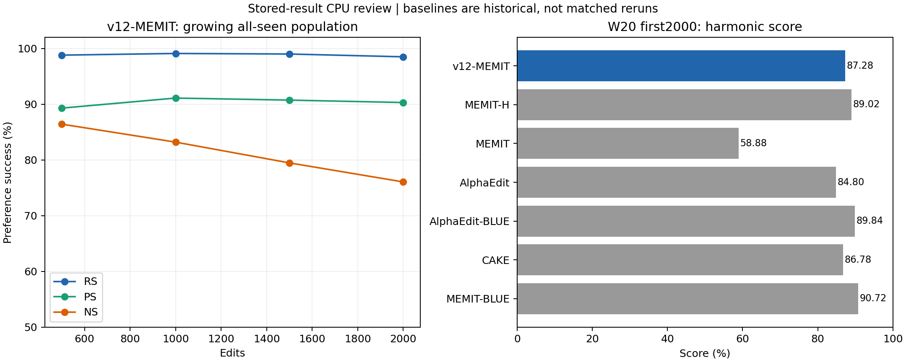
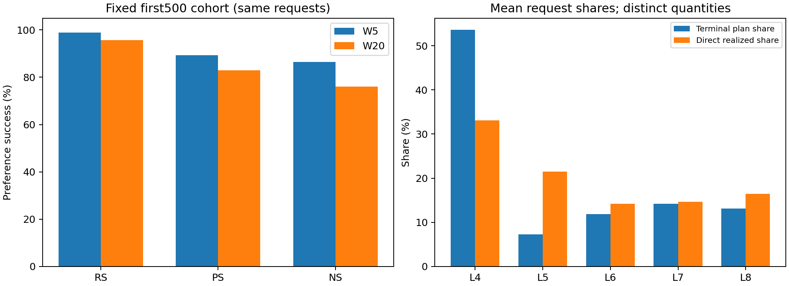

# JLZ v12-MEMIT W20 / first2000 완료 CPU 리뷰

사용자 recall: “v12-memit 리뷰해봐”, “baseline들도 표에 넣어라”, “score(조화평균) 도 넣어”. 검토일 2026-10-05 KST. SH3 owner CPU 감사이며 별도 독립 agent 검토는 수행하지 않았다. production collector와 분리한 새 CPU reducer로 저장 raw를 검산했다. 새 GPU/모델 forward/평가/Slurm write는 0이다.

**20 batch·2,000 edit의 완료와 저장 집계를 확인했다. W20 RS/PS/NS=98.50/90.30/76.06%, score=87.2753%.** 이 보고서에서 v12-MEMIT은 JLZ v12 planner + MEMIT-H 계열 ridge/history target-tracking writer를 뜻한다. 원 native MEMIT 또는 MEMIT-H baseline과 같은 방법이라는 뜻은 아니다.

## 동일 W20 비교 및 score

모두 각 방법의 BS100×20 이후 첫2,000개 all-seen 결과다. 분모 R=2,000 / P=4,000 / N=20,000. 과거 W100 값이나 current B20 값으로 대체하지 않았다. CAKE도 저장된 W20 전체 평가가 있어 같은 표에 넣었다.

| 방법 | RS % | PS % | NS % | Score % |
|---|---|---|---|---|
| v12-MEMIT | 98.500 | 90.300 | 76.060 | 87.275 |
| MEMIT-H | 99.400 | 91.000 | 79.045 | 89.020 |
| MEMIT | 64.750 | 61.700 | 51.825 | 58.885 |
| AlphaEdit | 99.300 | 93.225 | 68.590 | 84.802 |
| AlphaEdit-BLUE | 99.600 | 97.150 | 76.585 | 89.845 |
| CAKE | 99.150 | 87.750 | 76.405 | 86.781 |
| MEMIT-BLUE | 99.400 | 95.575 | 79.715 | 90.722 |

`Score = 100 × 3 / (1/RS + 1/PS + 1/NS)`에서 RS/PS/NS는 정수 분자·분모로 얻은 0–1 rate다. 세 family에 같은 가중치를 주고, 반올림 전 수치로 계산했다. 어느 하나가 0이면 score=0으로 정의한다. TF accuracy의 조화평균 또는 prompt 전체 micro success가 아니다.

산술상 v12 score는 MEMIT-H 대비 −1.744pp, AlphaEdit 대비 +2.473pp, AlphaEdit-BLUE 대비 −2.570pp, CAKE 대비 +0.495pp다. RS/PS/NS를 따로 보면 MEMIT-H 대비 −0.900/−0.700/−2.985pp다. **조건이 완전히 일치하는 신규 대조실험이 아니므로 이 차이를 writer 단독 효과나 유의한 개선으로 판정하지 않는다.** Cross-run paired raw는 이번 범위에 없어 baseline 간 lost/gained는 NOT_AVAILABLE이다. CI/유의성 기준을 새로 만들지 않았다.

[기계 판독 비교표](baseline-comparison.csv), [TF·NLL 상세표](baseline-metrics-long.csv), [입력 SHA manifest](baseline-manifest.json).



## 비교 조건과 baseline의 실제 의미

|방법|실제 기준|이번 v12와 주요 차이|
|---|---|---|
|v12-MEMIT|S3 job58179, L4–L8, λ15000 C0+H, own actual K/h target tracking, divisor 없음|v12 EfficiencyAdam/shared .75 budget, 모든층 virtual target, seed20261002|
|MEMIT-H|S3 job54007, pinned BLUE MEMIT_seq blue=false, L4–L8/H|native L8 z·residual divisor5..1, seed20260907|
|MEMIT|BASE_MEMIT job42658, L4–L8, history 없음|native z 및 divisor, S4 과거 실행|
|AlphaEdit|BASE_ALPHAEDIT job42657, L4–L8, L2=10, native P/H|projection writer·native z, S4 과거 실행|
|AlphaEdit-BLUE|AlphaEdit_ORIGINAL, L4+L8, blue=true/L2=1|기본 5층 AlphaEdit과 다름; S4 과거 실행|
|MEMIT-BLUE|MEMIT_ORIGINAL, L4+L8, blue=true|기본 5층 MEMIT과 다름; S4 과거 실행|
|CAKE|job48101, L4–L8/P/H, L2=10, 원 causal allocation|clamp .5, decay .4, temperature .1; v12 planner와 다름|

기존 보고가 결속한 동일 Llama revision `8afb486c1db24fe5011ec46dfbe5b5dccdb575c2`, fixed10k 앞순서·canonical 평가·동일 endpoint 분모를 재사용했다. 이번 v12는 H200 NVL / torch2.9.1+cu128 / transformers4.57.1 / FP32 eager / autocast off / matmul·cuDNN TF32 off다. MEMIT-H 및 과거 baseline들은 transformers4.44.2/seed20260907/cuDNN TF32=true이며 S4 baseline은 RTX PRO6000 Blackwell 환경이다. 따라서 전부 HISTORICAL_REFERENCE로 표시한다. 공통 context SHA는 `33cec0eef9ec130f26c2f0e17f7c8be39e93c717ebb47eaa5e9f1c88b263524e`; tokenizer의 BOS 속성 부재/설정값을 실제 token IDs의 동등성 증명으로 쓰지 않았다. baseline source/config 호환 자료는 [추가 감사 manifest](supplemental-audit.json)에 결속했다.

## Preference와 TF accuracy / NLL

| family/desired | preference 분자/분모 | TF token-micro % | TF prompt-macro % | TF strict % | true NLL | new NLL |
|---|---|---|---|---|---|---|
| R/new | 1970/2000 | 95.553 | 95.550 | 95.500 | 13.055794 | 0.241263 |
| P/new | 3612/4000 | 61.018 | 61.025 | 60.650 | 10.227975 | 2.265328 |
| N/true | 15212/20000 | 19.369 | 18.930 | 18.285 | 5.479937 | 9.227193 |

R/P는 new target, N은 원 true target이 desired다. preference는 desired NLL이 반대 target보다 작아야 성공하며 tie는 실패다. W20 ties와 |margin|<1e−4는 모두0. **TF는 teacher forcing accuracy이며 자유생성 정확도가 아니다.** Strict는 target 전체 token 일치, token-micro는 correct/valid token, prompt-macro는 각 prompt accuracy 평균이다. 실제 desired token 분모는 R2,024/P4,048/N20,270이다. NLL은 prompt별 target-token 평균의 prompt 평균이며 token-micro NLL이라고 부르지 않는다. margin CSV는 true−new 부호를 유지한다.

| 방법 | R strict % | P strict % | N strict % |
|---|---|---|---|
| v12-MEMIT | 95.500 | 60.650 | 18.285 |
| MEMIT-H | 98.450 | 65.575 | 20.415 |
| MEMIT | 15.700 | 7.400 | 1.990 |
| AlphaEdit | 96.650 | 70.400 | 16.155 |
| AlphaEdit-BLUE | 98.900 | 69.775 | 15.380 |
| CAKE | 97.200 | 59.725 | 19.955 |
| MEMIT-BLUE | 97.300 | 68.800 | 18.120 |

과거 표에 없는 prompt-macro는 NOT_RECORDED이며 token-micro로 대체하지 않았다. W20 desired NLL의 median / p90 / p99는 R .002623/.134062/6.887813, P .446183/7.455736/14.139758, N 5.049636/10.999486/15.798594다. [true/new 분포 전체](nll-distributions.csv)의 분위수는 저장값을 정렬한 nearest index(round((n−1)p)) 방식이다.

## 누적 경향과 동일 cohort 유지

| 편집 수 | RS % | PS % | NS % | Score % |
|---|---|---|---|---|
| 500 | 98.800 | 89.300 | 86.420 | 91.210 |
| 1000 | 99.100 | 91.100 | 83.200 | 90.670 |
| 1500 | 99.000 | 90.733 | 79.473 | 89.007 |
| 2000 | 98.500 | 90.300 | 76.060 | 87.275 |

위 표는 시점마다 평가 대상이 늘어난다. 따라서 그 감소만으로 동일 요청의 망각량을 정하지 않는다. 같은 first500만 고정하면 W5→W20 RS 98.8→95.6%, PS 89.3→83.0%, NS 86.42→76.10%다. TF strict도 R97.4→90.4%, P57.1→44.3%, N19.66→16.98%다. first100의 W20은 RS95.0/PS77.0/NS76.6%, strict83.0/38.5/16.3%다.

| 기준→W20 | family | 이전 성공 | 이후 성공 | lost | gained | retained |
|---|---|---|---|---|---|---|
| W0_to_W20 | R | 164 | 1970 | 1 | 1807 | 163 |
| W0_to_W20 | P | 438 | 3612 | 18 | 3192 | 420 |
| W0_to_W20 | N | 17711 | 15212 | 3122 | 623 | 14589 |
| atwrite_to_W20 | R | 1983 | 1970 | 21 | 8 | 1962 |
| atwrite_to_W20 | P | 3711 | 3612 | 157 | 58 | 3554 |
| atwrite_to_W20 | N | 16500 | 15212 | 1790 | 502 | 14710 |
| first500_W5_to_W20 | R | 494 | 478 | 19 | 3 | 475 |
| first500_W5_to_W20 | P | 893 | 830 | 90 | 27 | 803 |
| first500_W5_to_W20 | N | 4321 | 3805 | 667 | 151 | 3654 |

W0 NS는 17,711/20,000=88.555%, W20은76.06%로 −12.495pp. W0-correct N 17,711개 중 14,589개가 남아 retention82.3725%이며 lost3,122/gained623이다. W0→W20 N desired true NLL은5.147224→5.479937(+.332713), new NLL은10.946939→9.227193(−1.719746)이다. N strict의 W0-correct retention은2,087/4,146=50.3377%이며 preference retention과 구별한다.

At-write 결과와 마지막 평가를 identity로 연결했으며 failed edit도 분모에서 제외하지 않았다. [paired 표](paired-transitions.csv), [firstN 및 birth1..20](cohorts.csv), [active/superseded](active-strata.csv)를 제공한다. 원 observer의 fact-version invalidation 의미를 독립 역순 검사한 active1984/superseded16 occurrence를 유지했다. 전체 W20의 분모를 active만으로 축소하지 않았다. Request ID/hash별 lost/gained 목록은 local 분석 경로에 보존하고 Git에는 집계만 게시한다.



## 실행 의미와 저장된 기술 근거

- **완료 범위:** pilot58178(BS2×2) 및 main58179(BS100×20), CPUcollector58180은 모두 COMPLETED/exit0:0. main20 commit과 H100 layer append, 19 W/H·RNG/context 인접 연결, raw identity·유한성·분모·terminal/collector 일치를 확인했다. Pilot와 main의 초기 W0/H0 hash가 같고 edited pilot state 전달은 없다.
- **실제 실행 source:** `1d27a830274aaee49a713bd07e463b0513591c9e`. `writer.py:33–40`의 FP64 `solve(15000*C0+H+KKᵀ,K)`, `:43–100`의 하층 write 후 새 K/h와 `R=z_terminal−h_current`, `:103–111`의 모든 write 이후 final mean K의 CPUFP32 H append를 정적 확인했다. 상층 stale key/remaining divisor/AlphaEdit projector를 이 경로에서 쓰지 않는다. 누적100 solve의 최대 relative residual은3.32791e−14(원1e−8 이내), effective weight rounding relative error 최대1.07235e−6이다.
- **Planner:** actual `optimize.py`의 independent request stop/EfficiencyAdam 및 마지막 평가 target capture를 확인했다. 49,275 request evaluation,47,275 update/backward로 각각 상한50,000/48,000 이내다. 1,935개는 EVALUATION_BUDGET,65개는 OBJECTIVE_THRESHOLD에서 종료했다. ZERO_STEP은0. Terminal에서 추가 backward/forward 없이 마지막 평가값을 사용하므로 terminal KKT/gradient는 `NO_BACKWARD_TERMINAL`; 수렴 PASS로 해석하지 않는다.
- **예산·반올림:** terminal shared norm 평균 .74999353, 최대 .7500000729. 최대 candidate primal 초과7.2876e−8/postcast 초과2.1391e−8을 그대로 기록했다. raw KL 최솟값−3.4450e−7도 FP32 관측으로 남겼으며 0으로 잘라 기록하거나 threshold를 바꾸지 않았다.
- **실모델 pilot 범위:** 고정 scale0/.025의 cached/full loss·gradient와 request-complete group 역순 비교의 기록 오차0. Native key 최대절대차3.33786e−6, 사전 atol2e−5+rtol2e−4 이내. anchor single-step 비교 최대2.23517e−8. RAM rollback probe의 W/H/RNG exact=true. 이 제한된 pilot을 모든 B100·다른 host·bitwise 수치동등성의 증명으로 확대하지 않는다.
- **검산 수준:** 원 commit의 observer no-mutation assertion, W/H/context/RNG hash 연결 및 source/telemetry를 CPU로 대조했다. 저장 tensor가 없어 W/H를 다시 load해서 independently reforward한 검증은 NOT_AVAILABLE이다. 7개 synthetic 회귀는 ties/N direction, strict/token 분모, paired ID 결손/중복, NaN/Inf, harmonic score/0 처리를 검증했다.
- **저장:** noCP 및 exact_resume=NOT_AVAILABLE. 실행source의 저장 경로는 compact receipts/raw metrics이며 checkpoint_saved=false, main output에 .pt/.safetensors 없음. hash/scalar telemetry는 복원 checkpoint가 아니다. 어떤 원 raw/source/model/C0/다른 job도 변경하지 않았다.

| 층 | 평균 terminal plan share % | 평균 direct realized share % | direct/residual norm 중앙값 | inherited mismatch norm 평균 |
|---|---|---|---|---|
| 4 | 53.579 | 33.054 | 0.632 | 0.000 |
| 5 | 7.252 | 21.512 | 0.653 | 0.773 |
| 6 | 11.851 | 14.242 | 0.611 | 0.448 |
| 7 | 14.209 | 14.695 | 0.577 | 0.496 |
| 8 | 13.108 | 16.497 | 0.565 | 0.652 |

Plan share는 virtual 계획, direct realized share는 각층 canonical 직접 action/entry anchor의 정규화로 서로 다른 양이다. L4의 평균 share는53.579→33.054%, L5는7.252→21.512%다. 이 차이나 inherited mismatch를 인과적 층 기여로 바꾸지 않는다. 작은/0 plan 때문에 direct/plan ratio의 평균은 불안정해, 보고 표에는 residual 기준 중앙값을 별도로 사용했다. Canonical local additivity error 최대는9.28923e−6이며 실제 FP32 rounding 관측이다.

## 비용과 실행 식별

한정 scheduler snapshot의 parent elapsed만 사용했다. main58179=14,723 GPU-sec(4.08972h), pilot58178=231 GPU-sec(.06417h), 합계 **4.15389 GPUh**. batch/extern row를 중복 합산하지 않았다. CPUcollector58180=258 elapsed-sec/GPU0. main은 scheduler시각2026-10-04 19:54:55→2026-10-05 00:00:18에 완료했다. Snapshot 이후 추가 scheduler polling은 없다.

프로그램 main14,719.212s, batch합13,832.447s. fit7,788.995s, writer1,841.462s, pre observer814.710s, post observer2,685.244s, batch 내 나머지702.035s. W0 관측797.085s는 batch합 밖이다. 세부 key/solve/Gram 비용은 writer의 nested 구간이며 별도 더하지 않았다. Writer capture forward12,000회, fit forward49,275/backward47,275회. 빠진 observer token F/B·개별 solve 시간·IO만의 시간은 NOT_SEPARATED이며 추정하지 않는다.

Process ru_maxrss33.097GiB, torch peak allocated VRAM35.786GiB. Scheduler sampled batch MaxRSS13.555GiB와 측정방식/샘플링이 달라 동일 peak로 주장하지 않는다. resource 요청1GPU/8CPU/59392MiB, checkpoint IO0. Baseline W100 전체 비용과 이2k 비용을 비교해 속도향상으로 계산하지 않았다.

- Source archive SHA: `32901e2a1011a1488c722afdcb2941d7203078c44c59f90572393608cafe04b8`.
- Execution lock SHA: `959ce59d104713869bccfa8db20ad88c2e9d4de3d9e39215d1cae9bd0996b244`.
- Config file SHA: `b09cfae0d6a8a29071818c114017b9f350ec9c58ec3143ac211b42179145458b`.
- Dataset SHA: `3d7f5e31db47b23f3a281bb6fb447c2fb1776e3d4721cdfb5fe5c6f998f10ae1`; ordered first2000 SHA `0b912d11659eb087ee71a391b7bea1e02ecc9d999a48254eb8559434965640f4`.
- Raw root: `/data/janghj/ODE-edit/local/jlz-v12-shared-budget/20261004-v1/attempt-s3-r1/`.
- Review local: `/data/janghj/ODE-edit/local/jlz-v12-shared-budget/20261004-v1/review-20261005-v1/`.

실행 metadata의 parent nonce가 SH4 envelope를 유지하는 것은 migration source lineage다. 실제 S3 node/runtime/jobs/config/lock과 migration nonce를 함께 결속했으며 S4 pilot을 S3 pilot로 사용하지 않았다. 분석 source는 새 `review_20261005.py`, `review_20261005_tables.py`, `review_20261005_audit.py`이며 frozen production에 hotpatch하지 않았다.

## CPU 재현과 보존

아래 명령은 원 raw를 읽고 별도 출력만 생성한다. 큰 model/C0를 다시 hash/load하지 않으며 GPU/Slurm을 호출하지 않는다. Python 표준 라이브러리로 reducer/tests가 실행되며 그림만 matplotlib3.10.7이 필요하다.

```bash
python3 -m unittest discover -s project/run_scripts/jlz_shared_budget -p test_review_20261005.py -v
python3 project/run_scripts/jlz_shared_budget/review_20261005.py \
  --attempt /data/janghj/ODE-edit/local/jlz-v12-shared-budget/20261004-v1/attempt-s3-r1 \
  --local /data/janghj/ODE-edit/local/jlz-v12-shared-budget/20261004-v1/review-20261005-v1 \
  --out /tmp/v12-memit-cpu-review
python3 project/run_scripts/jlz_shared_budget/review_20261005_tables.py \
  --out /tmp/v12-memit-cpu-review --plots
python3 project/run_scripts/jlz_shared_budget/review_20261005_audit.py \
  --out /tmp/v12-memit-cpu-review
```

[검산 결과](checks.json), [raw 파일 SHA/size inventory](raw-manifest.json), [state link 표](state-links.csv), [비용 표](batch-cost.csv), [추가 source/pilot 검산](supplemental-audit.json), [전체 산출물 manifest](artifact-manifest.json). Baseline CSV는 기존 CPU리뷰 결과를 재사용했으며 새 remote raw pull/모델 재평가가 없다. 리뷰 완료 후 모니터링·실험 재개 없이 REVIEW_COMPLETE_STOP.
