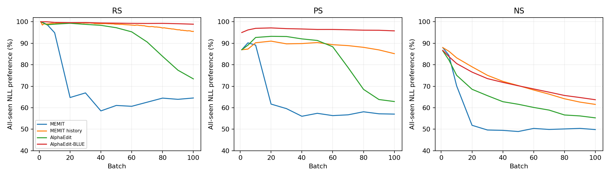

# MEMIT history / MEMIT / AlphaEdit / AlphaEdit-BLUE 완료 비교

사용자 추가지시: “alphaedit, alphaedit-blue도 비교에 넣어봐”. 기존 완료자료의 W100/동일fixed10k만 재사용. 새 실험·GPU평가0.

|방법|job|층|blue|L2|
|---|---|---|---|---|
|MEMIT|42658|[4, 5, 6, 7, 8]|False|해당없음|
|MEMIT history|54007|[4, 5, 6, 7, 8]|False|해당없음|
|AlphaEdit|42657|[4, 5, 6, 7, 8]|False|10|
|AlphaEdit-BLUE|39283_1|[4, 8]|True|1|

과거 arm ID `AlphaEdit_ORIGINAL`은 실제 blue=true L4+L8이며 표시명 **AlphaEdit-BLUE**로 결속한다. `BASE_ALPHAEDIT`는 blue=false L4–L8/L2=10이다. 두 AlphaEdit 모두 history를 사용하지만 MEMIT history의 15000C0+H writer와 식이 다르다. AlphaEdit projector/threshold0.02 및 L2, BLUE의 층/target 정책을 동일 조건으로 취급하지 않는다.

|방법|RS % (n=10000)|PS % (n=20000)|NS % (n=100000)|
|---|---|---|---|
|MEMIT|64.530|57.035|49.838|
|MEMIT history|95.520|85.170|61.553|
|AlphaEdit|73.430|62.885|55.285|
|AlphaEdit-BLUE|98.880|95.775|63.726|

MEMIT history에서 각 비교값을 뺀 산술차(%p):

|비교 대상|RS|PS|NS|
|---|---|---|---|
|MEMIT|+30.990|+28.135|+11.715|
|AlphaEdit|+22.090|+22.285|+6.268|
|AlphaEdit-BLUE|-3.360|-10.605|-2.173|

## Teacher-forced accuracy와 NLL

Rewrite/rephrase desired=new, neighborhood desired=true. Token-micro와 full-target strict를 분리했다. NS에 과거 new-target accuracy를 대입하지 않았다. TF는 자유생성 정확도가 아니다. 원 게시표에 prompt-macro가 없는 과거방법은 NOT_RECORDED로 남겼다.

|방법|family|TF token correct/count (%)|TF strict correct/count (%)|true NLL|new NLL|desired NLL|
|---|---|---|---|---|---|---|
|MEMIT|RS|1094/10163 (10.765)|1093/10000 (10.930)|10.970891|9.250712|9.250712|
|MEMIT|PS|863/20326 (4.246)|861/20000 (4.305)|11.470762|10.713187|10.713187|
|MEMIT|NS|2630/101270 (2.597)|2630/100000 (2.630)|11.025573|10.967428|11.025573|
|MEMIT history|RS|8651/10163 (85.123)|8497/10000 (84.970)|9.887237|0.822302|0.822302|
|MEMIT history|PS|11505/20326 (56.602)|11219/20000 (56.095)|8.326515|2.622191|2.622191|
|MEMIT history|NS|11788/101270 (11.640)|11032/100000 (11.032)|5.969444|7.254502|5.969444|
|AlphaEdit|RS|3565/10163 (35.078)|3500/10000 (35.000)|8.533927|5.073627|5.073627|
|AlphaEdit|PS|2986/20326 (14.691)|2922/20000 (14.610)|8.695828|7.186610|7.186610|
|AlphaEdit|NS|6465/101270 (6.384)|6447/100000 (6.447)|7.932231|8.527091|7.932231|
|AlphaEdit-BLUE|RS|9626/10163 (94.716)|9465/10000 (94.650)|12.803856|0.385338|0.385338|
|AlphaEdit-BLUE|PS|13540/20326 (66.614)|13229/20000 (66.145)|9.863999|1.689226|1.689226|
|AlphaEdit-BLUE|NS|9061/101270 (8.947)|8026/100000 (8.026)|6.901761|8.385391|6.901761|

## 누적곡선

PS/NS는 실제 full-observer batch 지점 사이를 선으로 연결했다. 모든방법의 curve 차이는 다른 denominator의 시간점 차이가 아니라 각 대응 batch의 동일prefix 관측이다. 원 CSV의 source/hash/분모는 manifest에 결속했다.

## 비교 경계

- 같은 model revision/seed20260907/fixed10k ordered root/최종분모를 확인했다. 실행시점·host·GPU는 동일하지 않다: history는S3H200NVL, 과거방법은S4PRO6000.
- L4–8 vs L4+L8, projector/L2/BLUE target 정책 등 복수 차이가 있어 history 단독효과나 BLUE 단독효과의 인과 분해를 하지 않는다.
- 각 run 사이 paired lost/gained는 로컬에 호환raw가 없어 NOT_AVAILABLE. 평균/총점 차이를 동일ID의 성공집합이라고 주장하지 않는다. 기존 history run 내부 paired유지 분석은 원보고서에 별도로 유지한다.
- 과거표에는 TF/NLL이 존재해 재사용했으며 저장하지 않은 값·새GPU 재평가를 채우지 않았다. 교차host numerical certification은 NOT_ESTABLISHED.

원상세보고: [job54007 완료리뷰](report-ko.md). 재현: `python project/run_scripts/memit_history_lifelong/compare_completed_baselines.py --report <completion-review-r1> --baseline experiment-reports/servers/server4/blue-native-lifelong-comprehensive-review-2026-09-11-v1`.
