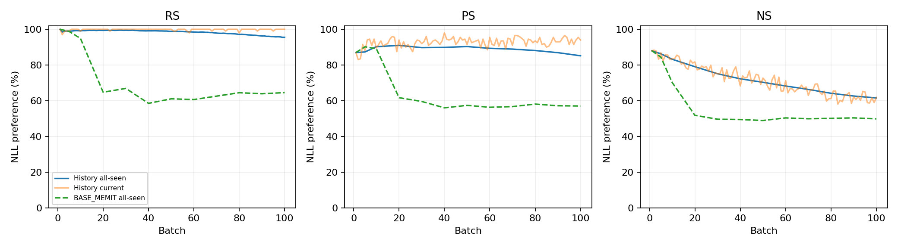

# MEMIT history fixed10k — job54007 완료 상세 리뷰

사용자 recall: “실험 결과 자세히 리뷰하고 report 만들고 GH에게 보고해”. 원 task `ODEEDIT-GH-SH3-MEMIT-HISTORY-FIXED10K-20260928-R1` 및 repair `ODEEDIT-GH-SH3-MEMIT-HISTORY-REPAIR-INITIAL-GATE-20260928-R1`의 동일 실행 결과다.

**COMPLETED 0:0 / B100 / 10,000 requests.** 2026-09-28 09:52:06–22:18:28 KST, 1GPU 할당 12:26:22(12.439444 GPUh). 이번 recall은 CPU 결과 리뷰만 수행했고 새 GPU 실행·재평가·재제출은 없다.

## 1. 최종 W100 전체 분모

RS/PS는 new NLL < true NLL, NS는 true NLL < new NLL이며 tie는 실패다. Desired target은 rewrite/rephrase=new, neighborhood=true. 아래 TF는 teacher-forced target token accuracy이며 자유생성 평가가 아니다.

|Family|Preference 성공/분모 (%)|TF token correct/count (%)|TF prompt-macro (%)|TF strict 성공/분모 (%)|
|---|---|---|---|---|
|RS|9552/10000 (95.520)|8651/10163 (85.123)|85.110|8497/10000 (84.970)|
|PS|17034/20000 (85.170)|11505/20326 (56.602)|56.470|11219/20000 (56.095)|
|NS|61553/100000 (61.553)|11788/101270 (11.640)|11.402|11032/100000 (11.032)|

|Family|true NLL|new NLL|desired NLL|true−new margin|ties / |margin|<1e-4|
|---|---|---|---|---|---|
|RS|9.887237|0.822302|0.822302|9.064935|0 / 0|
|PS|8.326515|2.622191|2.622191|5.704324|0 / 0|
|NS|5.969444|7.254502|5.969444|-1.285058|0 / 1|

NLL은 prompt별 target-token 평균 NLL의 prompt 평균이다. NS의 true−new margin은 음수가 preference 성공 방향이다. Preference NS 61.553%와 TF strict 11.032%는 서로 다른 지표다. 작은 margin은 진단 집계이며 성공 threshold를 변경하지 않았다.

## 2. 동일 endpoint baseline 수치 비교

최신 사용자 추가지시로 **AlphaEdit·AlphaEdit-BLUE까지 포함한 [4방법 비교표·TF/NLL·그래프](four-method-comparison-ko.md)**를 추가했다. 아래 원 MEMIT 비교와 실패/완료 근거는 보존한다.

기존 BASE_MEMIT job42658의 게시 CSV 중 W100/동일 10k 분모만 가져왔다. 아래는 산술 차이이며 host/kernel/source 실행환경이 동일하다는 검증은 아니다. 과거 결과를 교체하거나 history-off chain을 새로 실행하지 않았다.

|Family|BASE_MEMIT preference %|history preference %|차이 %p|BASE TF micro %|history TF micro %|BASE TF strict %|history TF strict %|
|---|---|---|---|---|---|---|---|
|RS|64.530|95.520|+30.990|10.765|85.123|10.930|84.970|
|PS|57.035|85.170|+28.135|4.246|56.602|4.305|56.095|
|NS|49.838|61.553|+11.715|2.597|11.640|2.630|11.032|

BASE NS TF는 `MEMIT-cumulative-metrics.csv`의 **true-target** 열을 사용했다. 과거 `MEMIT-final-summary.csv`의 NS new-target TF를 neighborhood desired accuracy로 잘못 가져오지 않았다. Baseline prompt-macro TF 및 두 run 사이 case별 paired lost/gained는 호환 raw가 로컬에 없어 NOT_RECORDED/NOT_AVAILABLE이다. 다른 비교의 lost/gained를 대입하지 않았다.

## 3. 전체 stream의 current / 누적 관측



Current R/P/N은 매 batch100개, all-seen rewrite는 매 batch, full all-seen R/P/N은 B1/5/10/20/30/40/50/60/70/80/90/100이다. 곡선의 평가점 사이 연결선은 중간 PS/NS 실측을 뜻하지 않는다. current subset은 all-seen에 다시 forward하지 않고 재사용한다.

|batch / seen requests|RS %|PS %|NS %|
|---|---|---|---|
|1 / 100|100.000|87.000|88.000|
|5 / 500|99.000|87.300|86.280|
|10 / 1000|99.100|90.250|83.220|
|20 / 2000|99.400|91.000|79.045|
|30 / 3000|99.467|89.733|75.087|
|40 / 4000|99.150|89.862|72.272|
|50 / 5000|98.840|90.330|70.308|
|60 / 6000|98.467|89.342|68.238|
|70 / 7000|97.871|88.907|66.320|
|80 / 8000|97.112|88.106|64.166|
|90 / 9000|96.278|86.911|62.623|
|100 / 10000|95.520|85.170|61.553|

각 점의 all-seen 분모가 늘어나므로 이 표의 차이만으로 동일 cohort의 forgetting을 계산하지 않는다. 아래 별도 paired 표가 동일 identity의 유지 변화를 나타낸다.

## 4. At-write → W100 및 W5 first500 유지

At-write는 각 요청이 속한 batch의 commit endpoint에서 측정한 current metric이다. 동일 case/prompt/target 해시로 W100과 pair했다. Request occurrence를 분모에 남기고 superseded를 제거하지 않았다.

|범위|Family|기준|분모|이전 성공|W100 성공|lost|gained|
|---|---|---|---|---|---|---|---|
|at_write|RS|preference|10000|9981|9552|432|3|
|at_write|RS|TF_strict|10000|9952|8497|1461|6|
|first500_W5_to_W100|RS|preference|500|495|417|78|0|
|first500_W5_to_W100|RS|TF_strict|500|491|295|196|0|
|at_write|PS|preference|20000|18544|17034|1956|446|
|at_write|PS|TF_strict|20000|14316|11219|3931|834|
|first500_W5_to_W100|PS|preference|1000|873|704|225|56|
|first500_W5_to_W100|PS|TF_strict|1000|585|269|364|48|
|at_write|NS|preference|100000|71537|61553|15564|5580|
|at_write|NS|TF_strict|100000|16480|11032|9911|4463|
|first500_W5_to_W100|NS|preference|5000|4314|2990|1491|167|
|first500_W5_to_W100|NS|TF_strict|5000|1071|507|864|300|

Lost/gained ID 전체는 local `completion-review-r1/paired-identities.json`에 보존하며 Git CSV에는 수량과 각 ordered ID list SHA만 남겼다. At-write와 W5 baseline은 서로 다른 상태이며 섞어 계산하지 않았다.

## 5. Latest active / superseded와 age cohort

평가용 active는 전체 first10k에서 `(subject, relation_id)`의 마지막 target_new와 같은 occurrence다. 같은 target 반복 occurrence는 모두 유지한다. Native H는 이 평가 stratum으로 선택/제거/감쇠되지 않는다. Active9,791 / superseded209 requests다.

|stratum|family|성공/분모|preference %|TF strict %|desired NLL|
|---|---|---|---|---|---|
|active|RS|9382/9791|95.823|86.232|0.746166|
|superseded|RS|170/209|81.340|25.837|4.389028|
|active|PS|16792/19582|85.752|57.170|2.535810|
|superseded|PS|242/418|57.895|5.742|6.668834|
|active|NS|60342/97910|61.630|11.169|5.950391|
|superseded|NS|1211/2090|57.943|4.593|6.862038|

Birth batch별 W100 지표와 age=100−birth_batch는 `final-cohorts.csv`의 300행으로 분리했다. W0 endpoint는 이번 run에서 평가하지 않았으므로 W0-correct retention은 NOT_RECORDED다. Superseded209 요청도 최종 공식 분모10,000에 포함된다.

## 6. 입력·source·실제 상태 연속성 CPU 검산

- Dataset JSON SHA `3d7f5e31db47b23f3a281bb6fb447c2fb1776e3d4721cdfb5fe5c6f998f10ae1`; ordered root `5b01356928ad2e2e46effad5a2c5621c87746b610992b7b92bf3ace16b6f5729`. first10k를 정확100×100 분할, 100 batch request IDs/request hashes 재검산.
- 실제 실행source `3a904be9261d162239c6b780a62c52f3e59a9142`; lock SHA `3a52b977631959f055b4ed2d6c8e8250cba4506f53b9c0d22d551af0b70a6230`. 이번 CPU 리뷰 source는 별도 후속 commit이며 실행 당시 code로 소급하지 않는다.
- Pinned BLUE `311b076a92e4ed0f14f5c8b4909732da781bc5f7`, 실제 `memit.memit_seq_main.apply_memit_seq_to_model`, native file SHA `f84fcf4b388ff1e5c5c9d520202d926e5b16314b8269063b57d8d25243bc716a`. 별도 history writer 재구현0.
- Model revision `8afb486c1db24fe5011ec46dfbe5b5dccdb575c2`; seed20260907, FP32/eager/autocastoff, matmulTF32false/cuDNNtrue, torch2.9.1+cu128/transformers4.44.2. layers4–8/bluefalse/updateweight15000.
- Source 식: `solve(15000*C0_i + H_prior_i + K_i K_i.T, K_i)`; coefficient1, FP64 solve/FP32 materialization. 각batch L8 z100개; residual 분배5,4,3,2,1. 5층 temporary write 뒤 post-all-layer key로 층별 H append1회. C0 static/H distinct.
- 완료100 commits, 99개 W/H·context/RNG/ledger 연결, history reset0, 반환 cache_c identity, observer 전후 W/H/context/RNG 동일, C0 pointer/version guard, native temporary restore exact 및 nonselected pointer/version guard 기록 확인.
- 실측 총10,000 native z /500 solves/500 layer history append. 100×10 key phase ordering 및 solve FP64 확인. 모든 batch finite/observer_mutation0; rollback/failure artifact0.
- terminal manifest505개 size/SHA 전부 일치, 파일목록 누락/추가 없음(terminal 자체 제외). 1,302,200개 저장 metric row의 순서·identity·finite·strict preference·TF correct/count·strict consistency를 재집계했다. 이는 중복 저장 포함 row수이며 독립 요청수는10,000이다.
- 100 commit의 actual W/H는 해시·norm receipt로 연결했다. 저장 tensor가 없으므로 현재 CPU에서 writer 수식을 행렬로 재실행하거나 완전 weight rollback을 새로 검증했다고 하지 않는다. H append 횟수는 native call/phase/source와 runtime counter 근거이며 GPU 독립 parity 실험은 아니다.
- 모든층 H norm 양수·증가, terminal W0/H0 RAM restore assertiontrue. noCP: output은 JSON/Markdown506개만 있고 edited W/H/delta/resume artifact0, exact_resume NOT_AVAILABLE.
- 독립 CPU 집계코드는 실행 reducer를 import하지 않고 stdlib/NumPy로 계산했다. 독립 red agent 미사용. 교차host bitwise/numerical certification은 NOT_ESTABLISHED.

|Layer|B1 H norm|B100 H norm|
|---|---|---|
|4|93.69580078125|5375.01806640625|
|5|143.72132873535156|9861.609375|
|6|210.7111053466797|16390.50390625|
|7|242.60125732421875|21827.380859375|
|8|211.4960174560547|18603.939453125|

## 7. 실행비용·실패 attempt·예상시간 대조

|항목|초|시간|
|---|---|---|
|allocated_GPU_seconds|44782.000|12.439444|
|runtime_seconds|44779.141|12.438650|
|edit_seconds|25241.746|7.011596|
|target_seconds|19112.377|5.308994|
|key_seconds|5027.424|1.396507|
|solve_seconds|57.677|0.016021|
|edit_other_seconds|1044.267|0.290074|
|evaluation_seconds|18636.813|5.176893|
|load_hash_io_reducer_unseparated_seconds|900.582|0.250162|

Edit는 target/key/solve/기타를 포함하므로 서로 더해 총비용을 만들지 않는다. GPU allocation은 parent만 계산하고 batch/extern을 추가하지 않는다. solve timer는 선행 matrix구성·dtype복사 전체를 포함하지 않는다. History 순수누적 비용은 별도 timer가 없어 NOT_RECORDED다.
Peak allocated CUDA tensor 36.904084 GiB; scheduler batch MaxRSS21,949MiB(약21.435GiB). reserved memory/full GPU utilization은 미측정이다. Output 447,885,143B(약427.14MiB). 체크포인트 비용0.

원53996의 가상 `_classes.py` provenance hash 실패는451GPU-sec/commit0이며 원source/raw 보존. CPU 최소수리 후 fresh W0/H0의54007로 시작했고 실패state를 이어붙이지 않았다. 총두 attempt 비용45,233GPU-sec=12.564722GPUh. 준비CPU/agent wall은 GPUh에 포함하지 않는다.

기존 BASE_MEMIT42658 할당12.213333GPUh 대비 이번12.439444GPUh는 +0.226111h(약13분34초). S4 PRO6000과 S3 H200 NVL, 기존 checkpoint 저장과 신규 noCP, timer/guard 차이가 있어 같은 hardware throughput 또는 history 순수비용 차이라고 쓰지 않는다.

초기 gate 이후 예상종료는9/29 04:00–10:00KST였으나 실제9/28 22:18:28KST로 5시간41분32초–11시간41분32초 빨랐다. 기존 B1시간 외삽 추정은 완료실측으로 대체하며 과거 ETA 기록은 보존한다.

## 8. 범위·미검증·인계

- 최초 리뷰는 BASE_MEMIT42658을 사용했고, 최신 사용자 지시로 BASE_ALPHAEDIT42657 및 AlphaEdit-BLUE39283_1 비교를 별도 문서에 추가했다. 동일revision/순서/seed/layers/hparams/FP32/eager/TF32정책과 정본evaluator kernel을 결속했지만 source archive와 실제runtime receipt는 별개 identity다. BLUE저장소 사용은 blue=true를 뜻하지 않는다.
- BASE_MEMIT와 새run의 pair별 lost/gained는 NOT_AVAILABLE. 이번run 내부 at-write 및 W5→W100 pair는 검산했다. 기존 요약값을 raw pair처럼 꾸미지 않았다.
- 현재 결과에서 과학적 인과·기전·promotion/새arm 권고는 이 SH 보고의 범위 밖이다. GH가 본 수치와 제한을 바탕으로 별도 해석한다.
- 원 source/raw 유지, checkpoint 저장/삭제0, C4 복구0, EN/GSS 재개0, 별도 GPU평가0. 완료 후 task STOP, 추가실험은 새 사용자지시가 필요하다.

## 9. 산출물과 재현

`summary.json`, `current-metrics.csv`, `all-seen-metrics.csv`, `paired-retention.csv`, `final-cohorts.csv`, `active-superseded.csv`, `nll-distributions.csv`, `baseline-comparison.csv`, `batch-cost.csv`, `history-layer.csv`, `chain-checks.csv`, `trajectory.png`.

원결과 `/data/janghj/ODE-edit/local/memit-history-fixed10k/20260928-v1/attempt-repair-r1/output/`; terminal SHA `bfea49152e35f0cf3bb14e298220925e07c2b55849e5848a2f6b27b4b1dc483f`. Local paired IDs `/data/janghj/ODE-edit/local/memit-history-fixed10k/20260928-v1/completion-review-r1/paired-identities.json`. Audit는 `audits/servers/server3/memit-history-fixed10k-20260928-v1/completion-review-r1/`.

CPU 재현(출력은 새로운 빈 directory를 사용하고 accounting.txt를 새 audit directory에 복사):

```bash
/data/janghj/ODE-edit/local/runtime/server3-experiment-ready-v1/venv/bin/python project/run_scripts/memit_history_lifelong/review_completed.py \
  --attempt /data/janghj/ODE-edit/local/memit-history-fixed10k/20260928-v1/attempt-repair-r1 \
  --dataset /data/janghj/ODE-edit/local/datasets/counterfact-fixed-10k-v1/counterfact.json \
  --report <new-report-dir> --audit <new-audit-dir> --local <new-local-dir> \
  --baseline experiment-reports/servers/server4/blue-native-lifelong-comprehensive-review-2026-09-11-v1
```
