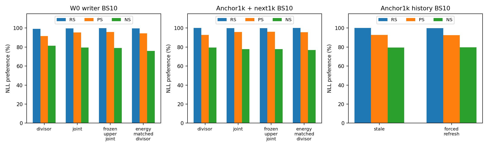
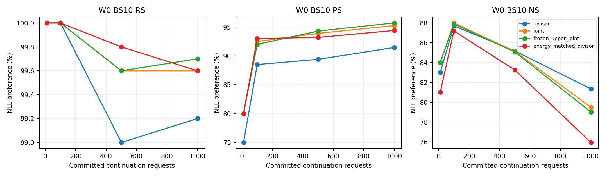
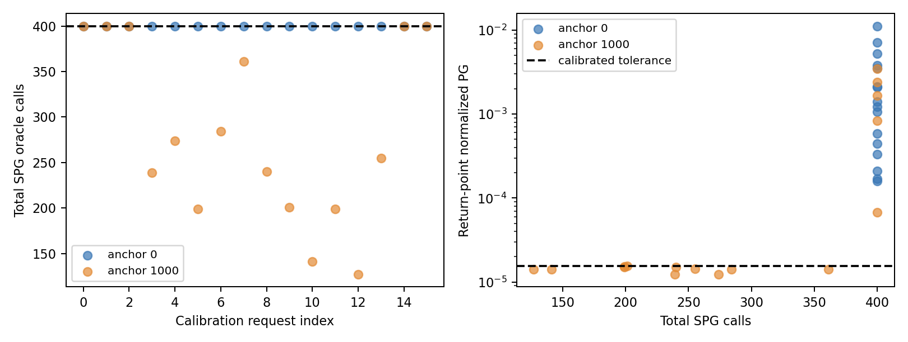

# MEMIT-HJ 완료 1k 구간 CPU 상세 리뷰 — 2026-10-02

**완료 범위:** main000 BS100 첫 1k(10 batch commit)와 BS10 추가 1k 진단 10개(각100 step)의 저장자료를 검산했다. 전체28cell 또는 본체10k 완료 보고가 아니다. 새 GPU/모델 forward/Slurm write/CP 접근·변경은0이다. 보고 상태는 `REVIEW_COMPLETE_STOP`이며 실험 수집기 상태는 별도로 `TECHNICAL_INCOMPLETE`다.

권한 nonce: `ODEEDIT-GH-SH3-MEMIT-HJ-1K-COMPLETED-REVIEW-20261002-R1`. 정본 main `1482a5a667225b95e0b0af5f5654efe8cec774bc`, envelope SHA `7d6d3c1a79859223952534079698f8ea4c5e5cd2380d699e9a76eded22ba2d22`. 사용자 “main에 결과물 올리라고 해”에 따라 own-scope branch와 main 게시 대상이다. 이 보고서는 사실·수치·계약상 기계적 판정만 기록하며 과학적 해석은 GH 소관이다.

## 1. 관측 경계와 실제 완료 범위

2026-10-02 **01:12:14.891–01:12:16.350 KST**에 지정6job의 accounting/state를 한 번 확인하고 완료commit 목록을 고정했다. `sacct`1회와 exact job별 `scontrol show job` 각1회이며, terminal job의 scontrol 제거 여부는 로컬 receipt에 남겼다. 이후 scheduler/log/후속 endpoint polling은0이다. Immutable commit의 이미 확정된 파일만 읽었다. 처음 절대cursor≤1000 필터에 빠진 anchor1000 진단의 C01010…C02000 평가·writer 파일은 **이미 snapshot에 있던100개 commit 목록**에 의해서만 보완했다. 이는 새 완료범위 관찰이 아니다.

Snapshot 파일4,225개, 406,635,225B. 각파일 path/size/SHA/관측시각은 [raw inventory](../../../../../audits/servers/server3/memit-hj-20260930-v2/review-1k-20261002-v1/raw-inventory.csv)에 있다. 원source/raw를 수정·복원·삭제하지 않았다. Collector와 역사54007의 작은 완료자료는 별도 SHA manifest로 결속했다.

|job/group|snapshot 상태|parent 배정GPU초|범위|
|---|---|---|---|
|56007/P|COMPLETED 0:0|2738|T0a/W0 전체10k 공통 준비|
|56033/A|CANCELLED by 1025|92224|아래11개 완료구간; group terminal 없음|
|56034/B|CANCELLED by 1025|0|실행·배정 없음|
|56035/C|CANCELLED by 1025|0|실행·배정 없음; Z교정 BLOCKED|
|56036/D|CANCELLED by 1025|0|실행·배정 없음; Z교정 BLOCKED|
|56037/CPU|COMPLETED 0:0|0|CPU1초; 수집결과 TECHNICAL_INCOMPLETE|

취소 기록은 이번 조회 당시 존재한 사실이며 **이 리뷰가 취소한 것이 아니다**. `CANCELLED by 1025` 이상의 취소 주체·의도·원인은 여기서 추정하지 않는다. 후속 job을 변경하거나 새 등록을 만들지 않았다. Scheduler CPU job 성공과 과학계획 완료는 다르다. Collector는 원 terminal에 `result=null`, `TECHNICAL_INCOMPLETE` 및 미완료18cell을 남겼다.

28개 전량 상태는 [coverage.csv](coverage.csv). Main000은 C01000까지 COMMITTED이나10k cell terminal은 없다. Main001은 첫1k trigger가 빈 목록이어서 자식 실행이 없고 **최종 NOT_FIRED alias도 아직 게시되지 않았다**. 이를 완료 alias나 독립1k 실행으로 계수하지 않는다. Main100/101은 미실행,010/011/110/111은 미실행 및 calibration BLOCKED를 함께 표시했다. Writer anchor5000의4개와 history anchor3000/5000/7000의6개는 미도달이다.

|분류|BS|입력 ordinal (0-based)|완료 요청/실제 write|완료 의미|
|---|---:|---|---:|---|
|main000 첫1k|100|[0:1000]|1000/10|본체10k의 완료 prefix|
|W0 writer4|10|각[0:1000]|4000/400|4개 별도1k diagnostic|
|anchor1000 writer4|10|각[1000:2000]|4000/400|같은main0001k entry에서 추가1k|
|anchor1000 history2|10|각[1000:2000]|2000/200|stale/forced-refresh 별도1k|
|합계|혼합하지 않음|동일입력을 여러경로에서 소비|11000/1010|고유10000요청 완료가 아님|

## 2. 실행과 분석 provenance

- P execution `a8126eb65cbe9a1814b381007798d857003555ed`, lock `1aa28cb09de1cae5c00824bdafb86eb2a7f83dda24422cf5cf11906a055d43c5`.
- A/B/C/D/collector source `f1d7a995460e2fce8fb10134f723ba4680303a31`, lock `023d92c47d33e7d57b7eb4eee98d4f37ffe561c46b06e3ae5b6657d7102ed9f1`.
- 원raw: `/data/janghj/ODE-edit/local/memit-hj/20260930-v2/attempt-v1/output/`.
- 리뷰snapshot: `/data/janghj/ODE-edit/local/memit-hj/20260930-v2/review-1k-20261002-v1/snapshot/`.
- 분석은 신규 `review_1k_completed.py`/test이며 원 실행 source로 소급 인증하지 않는다. 분석 source SHA와 입력·산출물 SHA는 [artifact manifest](artifact-manifest.json) 및 [authority-read](../../../../../audits/servers/server3/memit-hj-20260930-v2/review-1k-20261002-v1/authority-read.json).
- 정본9member는 SHA/size가 이전 FULL_READ와 동일함을 확인했다. P와 후속 source lock에서 .py/.sh/.sbatch **540개 결속항목**을 재검산했다(두 lock 사이 중복 포함). 대형 모델/C0 재해시는0.
- P 실제 import closure는 저장목록을 재검산했다. A runtime은 pinned entrypoint SHA를 기록했지만 A의 terminal import manifest는 미게시다. A의 lock-bound source byte 확인과 완전한 실제 import 추적을 동일하다고 하지 않는다.

Llama3-8B-Instruct revision `8afb486c1db24fe5011ec46dfbe5b5dccdb575c2`, seed20260907, torch2.9.1+cu128/transformers4.44.2, H200 NVL, FP32/eager/autocast off, matmul TF32=false/cuDNN TF32=true. BLUE311b076의 `memit.memit_seq_main.apply_memit_seq_to_model`, blue=false, layers4–8, λ15000·Wiki100k C0·H계수1. Native L8 z25loop/lr.1/decay.5/clamp.75/KL.0625/losslayer31. Canonical MB16/explicit-left observer와 실제BOS를 runtime receipt에 결속했다.

Dataset SHA `3d7f5e31db47b23f3a281bb6fb447c2fb1776e3d4721cdfb5fe5c6f998f10ae1`, orderedroot `5b01356928ad2e2e46effad5a2c5621c87746b610992b7b92bf3ace16b6f5729`, context SHA `33cec0eef9ec130f26c2f0e17f7c8be39e93c717ebb47eaa5e9f1c88b263524e`. 모든순서는 fixed10k의 같은앞N/다음N이다. [실행 provenance](../../../../../audits/servers/server3/memit-hj-20260930-v2/review-1k-20261002-v1/execution-provenance.json)에 실제절대경로·버전·hparams·resource가 있다.

## 3. 평가 정의와 독립 CPU 검산

RS/PS는 new NLL < true NLL, NS는 true NLL < new NLL이며 tie는실패다. NLL은 target-token 평균값이다. TF token-micro는 correct target tokens/valid target tokens, prompt-macro는 문항별 token accuracy의 평균, strict는 target 전체 token이맞은 prompt 비율이다. RS/PS desired=new, NS desired=true. **TF는 자유생성 정확도가 아니다.** Margin `true−new`와 desired 방향 advantage(NS에서 부호반전)를 함께 제공한다.

원 production reducer를 import하지 않은 별도 CPU 구현으로 저장분자/분모/평균·strict·bitorder·NLL을 재계산했다. Metric group6690, 행검산1825800회(동일 raw에 대한 중복 검산 포함), observer파일2133회, commit1010개가 통과했다. 고유 family/prompt identity130000개, target-token count 일관성도 확인했다. 실제 per-prompt token IDs/logits는 raw에 없어 `NOT_RECORDED`다. Source/runtime tokenizer·입력hash·token count 결속을 token ID 전체재현 PASS로 확대하지 않는다.

합성오류주입14개 PASS: duplicate/NaN/잘못된 preference·strict/token0/저장집계오류/짝identity불일치 거부, tie실패, NS true방향, micro≠macro, 같은총점의lost/gained, past4004분위, Unicode canonical hash를 확인했다. Owner audit이며 독립 agent reviewer는 사용하지 않았다. CPU 검산은 새 모델 수치검증이 아니다.

## 4. 동일 first1k endpoint — BS100과 BS10 분리

### BS100 main 첫1k

|cell|RS|PS|NS|
|---|---|---|---|
|main_000|991/1000 (99.100%)|1805/2000 (90.250%)|8322/10000 (83.220%)|

Main100의 같은BS100 first1k 자료는없다. 따라서 본체 joint−divisor matched1k 및 설계 primary인 **final10k main100−000 PS(+2pp)/RS·NS(각−1pp 이내)** 판정은 `NOT_AVAILABLE`다. 아래BS10값을 대입하지 않는다.

### W0 BS10 ×100step: writer4의 추가1k

|cell|RS|PS|NS|
|---|---|---|---|
|writer_0_divisor|992/1000 (99.200%)|1829/2000 (91.450%)|8135/10000 (81.350%)|
|writer_0_joint|996/1000 (99.600%)|1905/2000 (95.250%)|7949/10000 (79.490%)|
|writer_0_frozen_upper_joint|997/1000 (99.700%)|1914/2000 (95.700%)|7901/10000 (79.010%)|
|writer_0_energy_matched_divisor|996/1000 (99.600%)|1888/2000 (94.400%)|7593/10000 (75.930%)|

### Main000 1k anchor 뒤 BS10 ×100step: ordinal[1000:2000]

|cell|RS|PS|NS|
|---|---|---|---|
|writer_1000_divisor|1000/1000 (100.000%)|1855/2000 (92.750%)|7947/10000 (79.470%)|
|writer_1000_joint|999/1000 (99.900%)|1914/2000 (95.700%)|7777/10000 (77.770%)|
|writer_1000_frozen_upper_joint|999/1000 (99.900%)|1919/2000 (95.950%)|7769/10000 (77.690%)|
|writer_1000_energy_matched_divisor|1000/1000 (100.000%)|1913/2000 (95.650%)|7683/10000 (76.830%)|
|history_1000_stale|1000/1000 (100.000%)|1855/2000 (92.750%)|7947/10000 (79.470%)|
|history_1000_forced_refresh|999/1000 (99.900%)|1849/2000 (92.450%)|7967/10000 (79.670%)|

위anchor1000 행은 first1k가 아닌 **추가1k**다. `history_1000_stale`와 `writer_1000_divisor`는 두 개의 실제 실행이다. 저장된endpoint 평가행은 동일하나 비용을alias로 제거하지 않는다.



## 5. TF 정확도와 NLL

아래는 주요first1k의 TF %다. 전체51개 population/family의 micro/macro/strict·token분자/분모·true/new/desired NLL 및q05/median/q90/q95/q99/max/q95이상tail평균은 [endpoint-metrics.csv](endpoint-metrics.csv). Past400도 별도행이다.

|cell|family|TF micro%|TF macro%|TF strict%|token correct/count|new NLL|true NLL|
|---|---|---|---|---|---|---|---|
|main_000|NS|23.333|23.025|22.490|2359/10110|9.402965|4.734060|
|main_000|PS|62.906|62.925|62.400|1277/2030|1.936845|8.669067|
|main_000|RS|98.325|98.300|98.300|998/1015|0.106740|12.451651|
|writer_0_divisor|NS|22.700|22.375|21.850|2295/10110|9.021907|4.682949|
|writer_0_divisor|PS|64.631|64.575|64.100|1312/2030|1.803458|8.799437|
|writer_0_divisor|RS|98.030|98.050|98.000|995/1015|0.102323|12.502964|
|writer_0_joint|NS|22.710|22.390|21.860|2296/10110|8.643485|4.686275|
|writer_0_joint|PS|72.118|72.100|71.700|1464/2030|1.374286|9.892710|
|writer_0_joint|RS|99.113|99.100|99.100|1006/1015|0.073884|13.742636|
|writer_0_frozen_upper_joint|NS|22.324|22.005|21.470|2257/10110|8.580140|4.709557|
|writer_0_frozen_upper_joint|PS|71.675|71.700|71.250|1455/2030|1.331390|9.920656|
|writer_0_frozen_upper_joint|RS|99.113|99.100|99.100|1006/1015|0.064452|13.814451|
|writer_0_energy_matched_divisor|NS|22.285|21.940|21.430|2253/10110|8.257334|4.755745|
|writer_0_energy_matched_divisor|PS|71.281|71.225|70.850|1447/2030|1.479920|9.815751|
|writer_0_energy_matched_divisor|RS|99.015|99.000|99.000|1005/1015|0.067919|13.819489|

NS preference가높은것과 true-target TF strict가높은것은 별개 수치다. 예를들어 main000 NS preference83.22%와 TFstrict22.49%를 동일한정확도로해석하지않는다. 모든1k endpoint에서 RS/PS target-token수는 cohort별로달라 1000/2000 prompt분모와분리했다.

## 6. Matched paired 전이와 평가항목 구간

비교대상은 같은entry identity·같은BS10·같은요청순서다. 모든 writer pair 및 history pair와 common-atwrite-success 조건부 전이는 [paired.csv](paired.csv). 아래는 대표비교이며 부호는 오른쪽방법−왼쪽기준이다.

|비교|family|분모|lost|gained|retained|차이pp|조건부95%구간pp|
|---|---|---|---|---|---|---|---|
|writer_0_joint minus writer_0_divisor|RS|1000|1|5|991|+0.400|[0.000, 0.900]|
|writer_0_joint minus writer_0_divisor|PS|2000|13|89|1816|+3.800|[2.800, 4.855]|
|writer_0_joint minus writer_0_divisor|NS|10000|419|233|7716|-1.860|[-2.452, -1.290]|
|writer_1000_joint minus writer_1000_divisor|RS|1000|1|0|999|-0.100|[-0.301, 0.000]|
|writer_1000_joint minus writer_1000_divisor|PS|2000|9|68|1846|+2.950|[2.111, 3.850]|
|writer_1000_joint minus writer_1000_divisor|NS|10000|323|153|7624|-1.700|[-2.196, -1.226]|
|history_1000_forced_refresh minus history_1000_stale|RS|1000|1|0|999|-0.100|[-0.301, 0.000]|
|history_1000_forced_refresh minus history_1000_stale|PS|2000|17|11|1838|-0.300|[-0.894, 0.249]|
|history_1000_forced_refresh minus history_1000_stale|NS|10000|61|81|7886|+0.200|[-0.030, 0.441]|

설계§5의 선택적 paired bootstrap 정의를 사용했다: (subject,relation_id) fact cluster에 모든paraphrase/neighborhood/occurrence를 묶고10000회 재표집, 분석seed20260930. W0구간999cluster, 다음1k995cluster이며 neighbor를독립표본으로늘리지않았다. 이 seed는 분석 난수이며 과학실행 seed20260907과다르다. 고정모델·trajectory를조건으로한 평가항목구성의구간일뿐, 다른편집순서/독립재학습의불확실성이나 보편적유의성 판정이아니다. 새유의성threshold는추가하지않았다.

Lost/gained/retained/both-failed의 정확prompt hash목록은 로컬 `analysis/paired-ids.json`, case_id/prompt_index/ordinal 대응은 `analysis/identity-to-request.json`이다. Prompt나 대량case raw를 Git에 넣지않았다. 요청cluster별 자료와TF strict전이는 scalar raw에서재계산가능하다.

## 7. At-write, first100/500, birth와 active/superseded

Main000 at-write→1k preference:

|family|분모|lost|gained|retained|변화pp|
|---|---|---|---|---|---|
|NS|10000|325|102|8220|-2.23|
|PS|2000|18|30|1775|0.6|
|RS|1000|3|1|990|-0.2|

Main000의W0-correct neighborhood는8820개이며1k에서8130개retained/690개lost,조건부retention92.1769%다. W0-failed에서newly-correct된것은전체W0→1k paired전이에분리했다. 같은 W0 full10k raw를모든방법에서read-only로재사용했으며새평가0이다.

Main000 first100의 RS는99/100, first500은493/500. 최신target을기준으로한active RS는991/999, superseded는0/1이며 superseded도전체평가분모에서제거하지않았다. 각cell의first100/first500·BS별birthbatch·active/superseded와true/newNLL/TF는 [cohorts.csv](cohorts.csv). BS10의birth는10요청 단위다. Main W500→W1000의같은first500 전이와각diagnostic500→1000 전이는 paired의 `first500_at500_to1000`으로분리했다.



## 8. Past400: continuation1k와 다른 모집단

Anchor1000의원래[0:1000]을시간4분위로나누고namespace/order/requesthash로각100개를고정했다. 원설계hash규칙·400개의ordinal과4분위 cardinality를검산했다. W0 diagnostic의past는 `NA_NO_PAST`이며0점으로두지않았다.

|cell|RS|PS|NS|
|---|---|---|---|
|writer_1000_divisor|396/400 (99.000%)|728/800 (91.000%)|3140/4000 (78.500%)|
|writer_1000_joint|395/400 (98.750%)|720/800 (90.000%)|3129/4000 (78.225%)|
|writer_1000_frozen_upper_joint|395/400 (98.750%)|725/800 (90.625%)|3138/4000 (78.450%)|
|writer_1000_energy_matched_divisor|395/400 (98.750%)|716/800 (89.500%)|3094/4000 (77.350%)|
|history_1000_stale|396/400 (99.000%)|728/800 (91.000%)|3140/4000 (78.500%)|
|history_1000_forced_refresh|396/400 (99.000%)|725/800 (90.625%)|3160/4000 (79.000%)|

위분모는R400/P800/N4000으로 continuation1k R1000/P2000/N10000과별도다. Entry→endpoint전이와방법간동일panel pair는 paired에보존했다. 분모를합치거나완료되지않은5k/3k/7k anchor를채우지않았다.

## 9. Writer·history·fork·observer source-backed 점검

[상세 source 점검](../../../../../audits/servers/server3/memit-hj-20260930-v2/review-1k-20261002-v1/source-audit-ko.md)과 [층별 telemetry](layer-telemetry.csv)를대조했다.

- `joint_residual`: `R @ solve(I+ΣG, I+Gi)`의순서이며 noncommuting 행렬의곱을교환하지않는다. L8은len(gs)==1이면R을직접반환한다. 저장된 denseG는없어이번CPU리뷰에서행렬자체를새로복원·재계산하지않았다.
- Fulljoint는현재층nativewrite 사이에상위key/Gram을재측정하며BS10 write당lookahead10회. Frozen-upper는entry에서4회만계산한상위G를고정한다. Source와calls/timers를결속했고두경로를동일하게표기하지않았다.
- 실제layer는4…8,priorH solve 후all-five-writes 완료시점의postkey로5회append. Commit1010개에서H/cache반환identity·finite·observer불변·ledger연속성을확인했다. 원W/Htensor재로드는하지않았다.
- Stored native solve residual 최대7.915658e−14, adj identity error최대3.176593e−14, directG 비교오차최대2.069103e−15. 기록된directfallback0. 추가직접검사는원source의entry0/1k등조건에서만수행된것이며매batch새검증을추가하지않았다.
- 실제FP32 displacement와ideal update의상대차이는일반writer최대2.459915e−6,energy materialization최대1.985634e−6. 이를bitwise수치동등PASS로바꾸지않았다.
- Energy-matched는**자기entry/nativez**의divisor/joint shadow에서공통entryA energy비sqrt(Ejoint/Ediv)를얻고각shadow후RAM복원한다. 저장scale식을검산했다. 최종누적joint trajectory energy와같다는주장은하지않는다. Capacity trace, entry/current/anchorA energy, DK norm,실제residual관측·α·cosine·q를별도열로보존했다.
- 각diagnostic의공통fork identity·independent CPU clone receipt,entryH·W·RNG/context/ledger를확인했다. 이전diagnostic복원은뒤의동일anchor entry가증거다. 마지막diagnostic후parent복원과아직기록되지않은다음mainentry는`NOT_RECORDED`로둔다. Python객체주소전체는저장되지않아새pointer검사는없다.
- 첫1k 자동trigger는L5…8모두false. Drift median/dispersion median은L5 .028364/.250793, L6 .042810/.322890, L7 .062746/.373351, L8 .103127/.417884. L4는observer-only다. 따라서현재구간에서자동refresh개입실행0이다.
- 강제refresh 진단만L5…8에원committed occurrence1000개전체를사용했다. Membershiphash는ledger와같고,FP64accumulation→FP32cast의4probe 상대오차최대8.807828e−9≤1e−5. W/output불변·reference reset·write-origin보존receipt가있다. Duplicate/superseded occurrence를rebuild분모에서제외하지않는다.

## 10. T0a/T0b·SPG 교정과 미실행 Z

P의T0a BS100 native/adapter z/key/W/H/context/RNG/ledger/평가행,임시CPreload/output등의기존PASS증거를보존했다. Cached/native초기loss는같았으나gradientrelative1.019400315e−5/bitwisefalse로`NOT_ESTABLISHED_AT_ORIGIN`이었다. 이경계를지우지않는다.

T0b는W0와main0001k에서각16요청×(0,.5nativeδ,nativeδ)=96점. `FP64-adapter.json`과소스는고정FP32값/cache승격뒤실제FP64suffix forward/backward를기록한다. g만cast한검사로대체하지않았다. Q95 normalizedPGerror는W0 2.540918e−6,1k 3.087956e−6로tol=1.543978179e−5. FP64경로/state복원assertion과기존precision표시는별도증거다.

|anchor|요청|CONVERGED|NOT_CONVERGED|SPGcalls|median calls|수락step|거부trial|
|---|---|---|---|---|---|---|---|
|0|16|0|16|6400|400.0|4641|1727|
|1000|16|11|5|4520|264.5|3256|1232|
|pooled|32|11|21|10920|400.0|7897|2959|

POLICY_ZERO_STEP/STALLED_AT_PRECISION/LINESEARCH_FAILED/NONFINITE는이32요청에서각0. 전요청의반환점재평가와calls≤400을확인했다. W0와pooled median400,1k median264.5는사전200조건초과. 미수렴21개를제외하지않은proposedcap500은400을초과하므로productioncap=null이다. Lock의`CENSORED_OR_FAILED`, `MEDIAN_GT_200`, `PRODUCTION_CAP_GT_400` 및`BLOCKED`를독립재계산했다. cap을clip하거나다른task의record-only/waiver를가져오지않았다.

SPG교정total10920calls/상한12800,수락7897/거부2959,tokenF/B각1397074. 여기에nativefit32요청·FP32/FP64probe·directional8calls·matchedAdam1968calls는별도이며총상한12800에모두포함됐다고하지않는다. Native/Adam/SPG의저장loss평균은 [calibration-summary.json](calibration-summary.json). 총objective와NLL성분을혼동하지않는다. 이번실행원source의SPGplateau는initialpoint를제외한6실제수락점조건이다. 이측정에서STALLED발생0이므로그모델경로의실제plateau성공증거는없다.



Z의존4cell은교정상BLOCKED이고실제C/D도취소미실행이다. 본체Z성능이나fallback성능을0점으로채우지않았다. Non-Z추가본체/anchor의미완료를Z차단으로설명하지않고job상태·실제도달범위로남겼다. Runtime/threshold/job/rerun수정0.

## 11. 비용과 checkpoint 상태

|cell|requests/writes|write초|observer초|step전체초|별도 entry RAM snapshot초|
|---|---|---|---|---|---|
|main_000|1000/10|3633.479|713.502|4512.299|62.167|
|writer_0_divisor|1000/100|4394.208|1979.297|6461.006|606.023|
|writer_0_joint|1000/100|4699.177|1946.548|6729.318|567.046|
|writer_0_frozen_upper_joint|1000/100|4393.102|1957.048|6436.151|563.271|
|writer_0_energy_matched_divisor|1000/100|8256.253|1959.867|10311.966|578.543|
|writer_1000_divisor|1000/100|4114.723|2306.903|6515.361|601.530|
|writer_1000_joint|1000/100|4668.956|2314.712|7074.059|610.970|
|writer_1000_frozen_upper_joint|1000/100|4319.081|2318.476|6730.550|608.487|
|writer_1000_energy_matched_divisor|1000/100|8291.837|2327.195|10719.287|606.983|
|history_1000_stale|1000/100|4129.156|2319.882|6541.758|625.995|
|history_1000_forced_refresh|1000/100|4140.783|2299.870|6540.174|621.196|

완료science commit합계 write55040.755초,observer22443.300초,step78571.931초와step진입전RAM snapshot6052.211초다. Write는nativez/key/solve/shadow등을포함하고step은write/observer/기타를포함하므로이를더해wall로쓰지않는다. Gram timer내부에도directsolve가포함된다. Energy경로의shadow calls는별도열이며final수동materialization의key/forward횟수는별도counter미기록이다. 추정값으로채우지않았다.

배정비용은parent행만P2738초+A92224초=**94962GPU초/26.378333GPUh**. Batch/extern은중복가산0. A에는W0/모델load,4개W0진단,본체1k,교정,anchor진단6개,observer/CP/복원/IO/종료가포함된다. 이를“main1k전용비용”으로쓰지않는다. A배정에서완료step+entryRAM을제외한7599.858초는여러준비/교정/관측/중단성분이섞여`NOT_SEPARATED`이며순수overhead가아니다. B/C/D GPU초0,CPUcollector1초. 이번리뷰GPU초0.

[비용CSV](cost.csv)에nativez/loss/backward/tokenF/B/key/solve/factor/Gram/lookahead/realization/history및shadow를분리했다. A group terminal미게시로전체observertoken 및마지막전체프로세스peak의phase귀속은`NOT_RECORDED`다. Accounting A batchMaxRSS37484880KiB(35.748GiB),P31662116KiB(30.195GiB). 완료commit이기록한최대GPUalloc66510914560B는누적high-water mark이며개별방법독립peak가아니다.

임시CP는기존metadata만읽었다. 기술W0CP5,284,843,077B는원T0에서reload후삭제된tombstone이있다. Main0001k CP5,313,662,767B는원manifest에SHA/reload_state_output=true가있고원terminal의remaining목록에있다. **리뷰는파일tensor를열거나재해시·복원·생성·삭제하지않았다.** 현재물리상태를추가검사했다고하지않으며rolling정책을바꾸지않았다. 장기CP예외를다른task에확대하지않았다.

## 12. 기존1k 역사참고 — matched 대조와 분리

|역사method|RS%|PS%|NS%|GPU|layers|
|---|---|---|---|---|---|
|BASE_MEMIT|94.900|89.150|70.180|S4 RTX PRO 6000 Blackwell|4,5,6,7,8|
|AlphaEdit_ORIGINAL|99.700|96.950|80.570|S4 RTX PRO 6000 Blackwell|4,8|
|BASE_ALPHAEDIT|98.900|92.700|75.100|S4 RTX PRO 6000 Blackwell|4,5,6,7,8|
|MEMIT_H_54007|99.100|90.250|83.220|S3 H200 NVL|4,5,6,7,8|

기존 MEMIT-H54007의B010과이번main000C01000의13000평가행은prompt identity·true/newNLL값·preference·TFstrict가모두동일하다. Lost/gained0 및NLL최대차0을 [historical-paired.csv](historical-paired.csv)에기록했다. 같은입력·같은host·같은seed의두trajectory 관측이며다른순서강건성증거가아니다.

BASE_MEMIT42658/BASE_ALPHAEDIT42657/AlphaEdit_ORIGINAL39283_1은기존로컬reviewed같은1k표를재사용했다. 마지막것의표시명은AlphaEdit-BLUE(L4+L8),L2=1이고BASE_ALPHAEDIT은L4–8/L2=10이다. Nullspace threshold.02와method차이·S4Blackwell/S3H200차이를유지한다. 원fixed10k/동일R1000P2000N10000/평가scope가일치하는행만사용했다. 이세방법의per-ID localraw는이번범위에없어paired는NOT_AVAILABLE,TFpromptmacro는재사용표에없어NOT_RECORDED다. 신규baseline실행/remote raw pull/CP전송/추가평가0.

## 13. 재현·산출물·검증 한계

CPU분석기: [review_1k_completed.py](../../../../../project/run_scripts/memit_hj/review_1k_completed.py), [합성회귀](../../../../../project/run_scripts/memit_hj/test_review_1k_completed.py). 원production runner/collector는변경하지않았다. Localraw·snapshot·hash manifest와기존frozen소스가있는SH3에서아래명령으로표/그림/source검산을재현한다. Markdown사실보고는해당표를owner가대조해작성했다.

```bash
export OMP_NUM_THREADS=1 OPENBLAS_NUM_THREADS=1 MKL_NUM_THREADS=1 CUDA_VISIBLE_DEVICES=''
R=/data/janghj/ODE-edit/local/memit-hj/20260930-v2/review-1k-20261002-v1
PY=/data/janghj/ODE-edit/local/runtime/server3-experiment-ready-v1/venv/bin/python
cd "$R/worktree"
"$PY" -m unittest project.run_scripts.memit_hj.test_review_1k_completed -v
"$PY" project/run_scripts/memit_hj/review_1k_completed.py   --snapshot "$R/snapshot" --local "$R/analysis"   --manifest "$R/snapshot-manifest.json"   --manifest "$R/snapshot-input-completion.json"   --dataset /data/janghj/ODE-edit/local/datasets/counterfact-fixed-10k-v1/counterfact.json   --cells plans/global/2026-09-30-memit-hj-experiment-design-v1/cells.csv   --out experiment-reports/servers/server3/memit-hj-20260930-v2/review-1k-20261002-v1   --audit audits/servers/server3/memit-hj-20260930-v2/review-1k-20261002-v1
```

리뷰분석은1thread로실행했고CPU raw reducer peak약0.83GiB로32GiB목표이내다. Source hash/assertions·synthetic tests·CSV분모·그림·Markdown링크·Git소유경로와manifest를검산한다. 실제tokenID/denseG/W/H tensor전체·마지막parent복원·미실행cell·새host수치parity는검사하지않았다. 모든확인수준과미기록은 [CPU검산](../../../../../audits/servers/server3/memit-hj-20260930-v2/review-1k-20261002-v1/cpu-review-checks.json),sourceaudit,manifest에명시한다.

Raw/prompt/tensor/CP/fullstdout Git0, broadcast0. Git에는새CPU분석기·test,compact CSV/그림·한국어보고·manifest·ACK만게시한다. 보고완료후jobpolling/자동recall/후속실험은하지않는다. Main/remote exact SHA는같은task 최종인계와publication receipt에기록한다.
