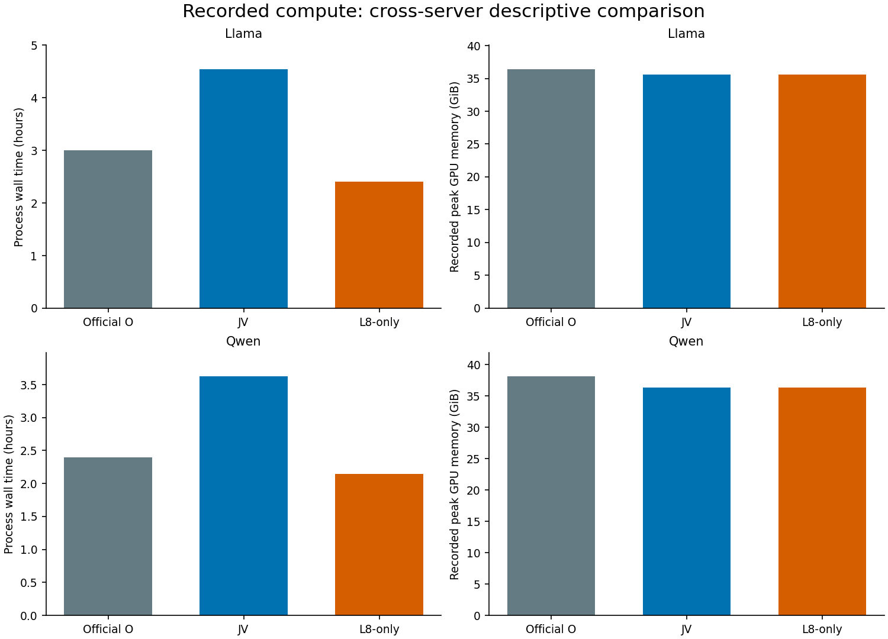
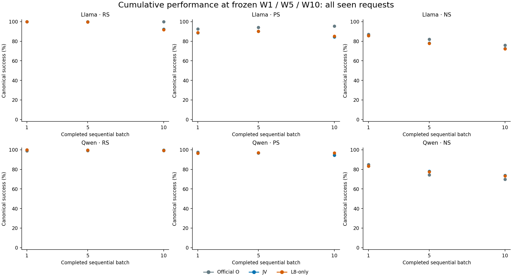
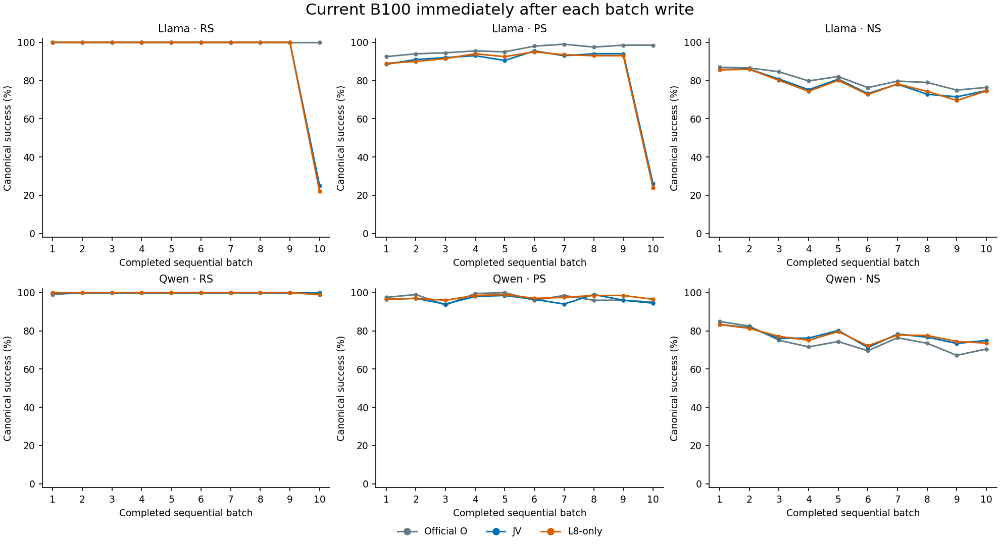
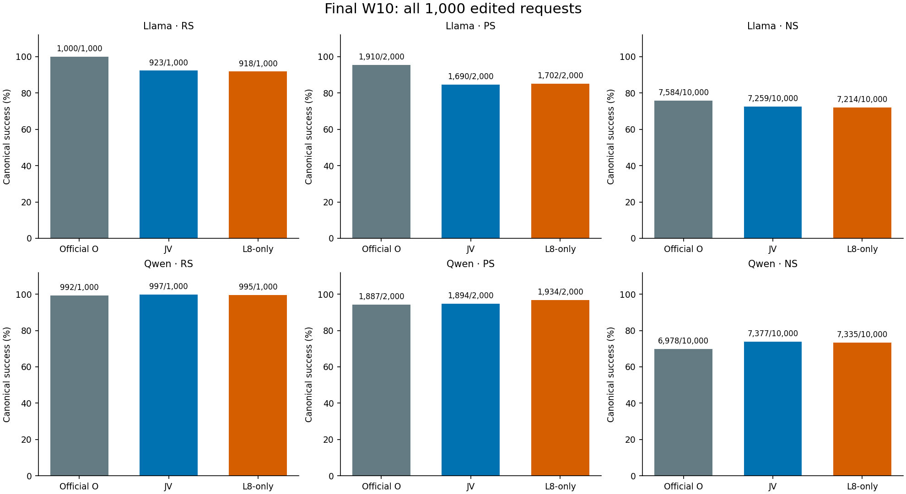
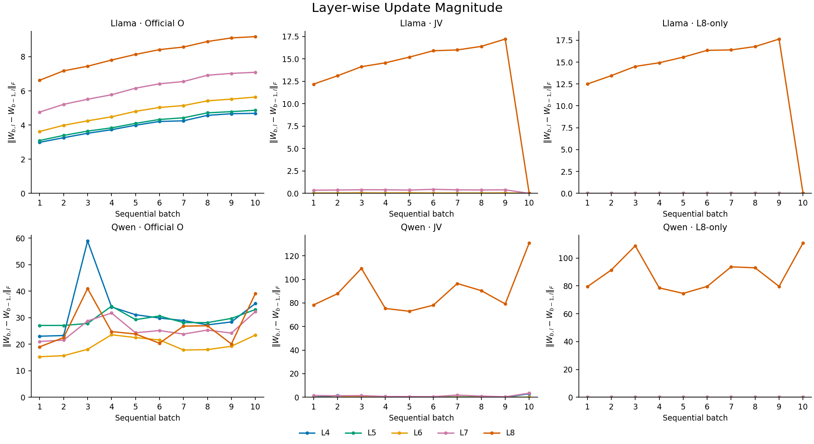
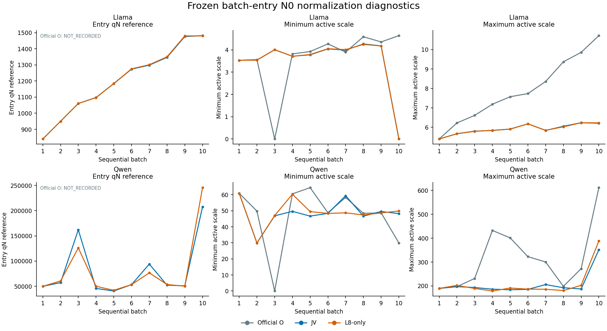
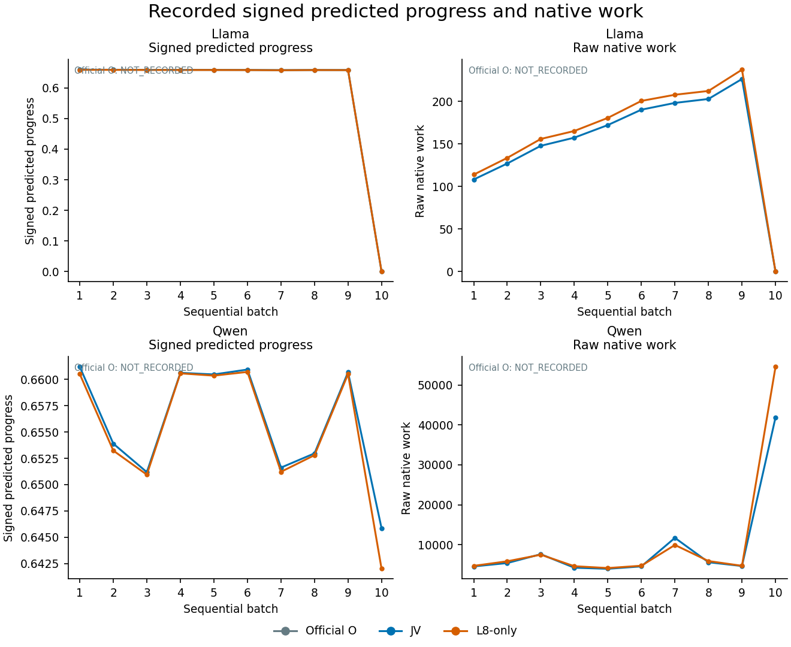
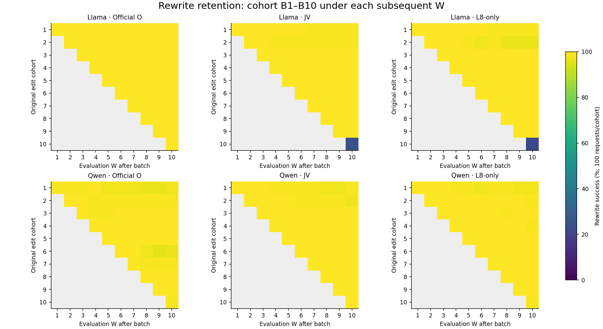
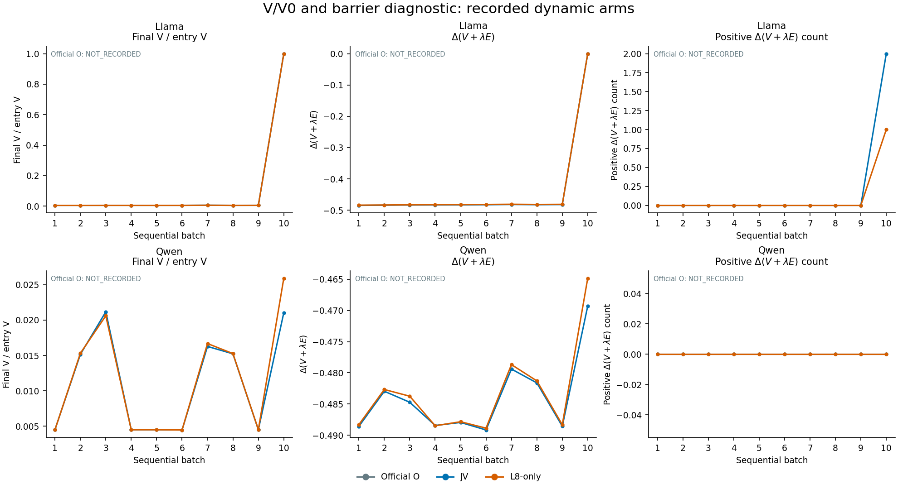

# AlphaEdit sequential 1,000 — Official/JV/L8-only 양모델 결과 검토

Canonical review v1 / 2026-09-07. **B1→B10 cumulative W/M sequential, batch당100, 총1,000 requests/arm.** 아래 대표 성능은 각 arm의 최종 W10 하나에서 전체1,000개를 재평가한 값이다. Current B100 또는 online-at-write 합계가 아니다. 기존 O/JV4 chain과 Server4 fresh L8 replacement2 chain만 포함한다.

|모델|arm|RS|PS|strict PS|NS|
|---|---|---|---|---|---|
|llama3-8b-inst|O_NATIVE|1000/1000 (100.00%)|1910/2000 (95.50%)|927/1000|7584/10000 (75.84%)|
|llama3-8b-inst|JV_NATIVE|923/1000 (92.30%)|1690/2000 (84.50%)|786/1000|7259/10000 (72.59%)|
|llama3-8b-inst|L8_ONLY_NATIVE|918/1000 (91.80%)|1702/2000 (85.10%)|797/1000|7214/10000 (72.14%)|
|qwen2.5-7b-inst|O_NATIVE|992/1000 (99.20%)|1887/2000 (94.35%)|900/1000|6978/10000 (69.78%)|
|qwen2.5-7b-inst|JV_NATIVE|997/1000 (99.70%)|1894/2000 (94.70%)|910/1000|7377/10000 (73.77%)|
|qwen2.5-7b-inst|L8_ONLY_NATIVE|995/1000 (99.50%)|1934/2000 (96.70%)|939/1000|7335/10000 (73.35%)|

각 셀에서 RS 분모1,000 rewrite prompts, PS2,000 rephrase prompts, NS10,000 neighborhood prompts; strict PS 분모1,000 requests. Missing arm을0으로 채우지 않았다. 상세 표: [main_six_arm_table.csv](main_six_arm_table.csv).

## 1. Executive FACT / 해석 경계

Llama: L8-only는 JV 대비 RS −0.50pp, PS +0.60pp, NS −0.45pp이다. Official 대비 세 primary 지표 모두 낮다. L8-only의 최종 rewrite 실패82건 중78건은 처음부터 실패했고, 성공 후 소실은4/922이다. JV는 각각75건과2/925이다. 두 chain 모두 B10에서 신규 acquisition 실패가 주된 문제이며, 모든 과거 edit의 forgetting으로 부르면 안 된다.

Qwen: L8-only는 Official 대비 RS +0.30pp, PS +2.35pp, NS +3.57pp이다. JV 대비 RS −0.20pp, PS +2.00pp, NS −0.42pp이다. 따라서 이 stream에서 JV locality 이득의 큰 부분과 비슷한 현상이 early-layer write가 정확히0인 support-restricted controller에서도 관측된다. 이는 다층 mixing의 필수성을 지지하지 않지만, 동일 prompt가 보존되었다는 paired causal 증거 또는 endpoint equivalence 검정은 아니다.

핵심 confound: O/JV는 Server2 RTX A6000, L8-only는 Server4 RTX PRO 6000 Blackwell에서 실행했다. Model revision·pinned assets·scientific kernel은 결속하지만 backend/library 전체 bitwise parity는 보증하지 않는다. 이후 W/M/z도 arm별로 달라진다. Single stream·모델별 descriptive evidence이며 promotion=false, 신규 sweep/lifelong release 없음.

## 2. Metric reading guide

|기호/지표|정의·단위|해석|
|---|---|---|
|RS / PS|rewrite / 각 rephrase prompt에서 length-normalized target-new NLL < target-true NLL|높을수록 좋음. Tie 실패; PS는 request 평균 NLL 비교가 아님|
|NS|각 neighborhood prompt에서 true NLL < new NLL|높을수록 좋음. Teacher-forced true-token accuracy와 다름|
|strict PS / strict NS|request의2/10 prompts 모두 canonical preference 성공|request 단위, 각각 분모1,000|
|rewrite/rephrase acc|teacher-forcing에서 해당 target의 모든 token top1이 맞는 prompt 수|free-generation accuracy 아님; token accuracy는 별도 correct tokens/target tokens|
|NLL|−mean target-token log probability, nat/token|각 target likelihood는 낮을수록 높음. New와true를 분리|
|preference margin|RS/PS=true NLL−new NLL, NS=new NLL−true NLL|양수 성공. 높을수록 preference가 강함|
|mean / median / p90 / max|동일 category의 prompt-level 분포|request-strict와 혼합 금지. NR는 미기록이며0이 아님|
|N0, e, V|entry residual scale s_i 고정; source weighted residual e; V=½‖e‖²|양의 tiny scale을 사후 floor/삭제하지 않음|
|g,H,G,c|weighted response의 residual inner product, response Gram, native Gram, nonnegative coefficient|signed g_l c_l은 예측 진행량; 실제 ΔV와 별도|
|F, ΔW|node velocity와 실제 FP32 materialized weight difference|Layer-wise Update Magnitude=‖ΔW_l‖F. share의 제곱norm 기준 여부를 명시|
|Qraw, Q, work|native M_entry+L2I quadratic; Q=Qraw/qref; work=ΣhQ(F)|Frobenius magnitude/net action과 다른 단위. Net은 batch entry→endpoint|
|B, b|B=V+λ∑hQ, reserve b=V0−B|CSV barrier_increment=ΔB; 양수는 reserve 감소. Continuous KKT≠finite-step guarantee|
|finite defect|ΔV+h(‖Ψc‖²+λcᵀGc)−½h²‖Ψc‖²|실제 ΔB와 다름. 부호를 성공/실패로 새 gate화하지 않음|
|model error / materialization mismatch|예측 response 대비 실제 activation 차이 / virtual→materialized normalized discrepancy|functional NLL·NS와 동일량이 아님|

## 3. Provenance, terminal 및 무결성

한 번의 bounded scheduler 확인: 38433_4(child38434) COMPLETED0, 02:24:36; 38433_5(child38433) COMPLETED0, 02:08:39. task-owned active0. 이후 scheduler polling0. Submitted/executed source44602a1a80554c67da0ef9646b43d843104785f2/tree cdb089a139f180c822d1e6bf44fe3d27b858c1ce; source parent77358b1546d1baf83b3e251afcce663b08d7bfd7/tree b64e84f2af7c708405dd6a8a9f018d3ece985c58.

O/JV는 job37980의 sealed publication0d0a0131e4a6a2a645dfa6530377d420a084d136를 재사용했다. Original report SHA b9b7fd9b7f37f782ee5fe81608d1b80e942e701ccf01b9896d4d79401d2617ad. Server2 raw/checkpoint 재해시는 미수행이며 Git publication48members 검증과 구분한다.

공통 sample root40fe1afb318a4a5da9630425213644a729a1e85fb4e78c18e9a4dcd2870eefdd; 각 arm10×B100, final1,000 unique requests. Pinned EasyEdit14cea8245f06715684592ab55184939b99d70784/tree9c52aadbc0883da422badf0a730fff21aaa3a8a7. Raw prompt/logit/generation은 이 package에 포함하지 않는다.

L8 raw 두 terminal/20 batch, W/M inter-batch18 links, target request2,000/recompute0, history append20, actual W/M checkpoints6개 및 final W0/M0 restore를 별도 integrity receipt로 결속했다. Target once는 batch target_count와 pinned source 경로의 결합이며 별도 compute_z invocation counter는 미기록이다. FULL-FP32 model/storage, controller/native scalar FP64는 기존 source 계약이다. Autocast/BF16/FP16/quantization0; runtime right-padding은 accepted NativeDictionary path 그대로이며 과거 다른 실험의 left-padding 규칙으로 바꾸지 않았다. 기록 없는 tokenizer token IDs/version을 추정하지 않는다.

전체 raw member SHA/bytes와 source/runtime/state 검증 범위는 integrity JSON/CSV에 있다. 현재/seen-prefix 평가는 committed selected W에 결속되며 final-W10과 B10 current를 구분한다. M0 cold-init은 각 arm 최초1회만; 이후 M/W를 누적한다. Source-inspected assertions와 이번 CPU tensor rehash를 같은 보증으로 합치지 않는다.

## 4. Final W10 상세 NLL / margin / secondary accuracy

모든 NLL/paired-margin 분포는 prompt-level이다. O/JV publication은 marginal NLL 분포를 제공하지만 prompt-pair 원본이 없으므로 margin median/p90/max는 NR로 표시한다. Mean margin만 paired means의 차로 정확히 계산 가능하다. 서로 다른 marginal quantile을 빼서 margin quantile을 만들지 않았다. W0는 reference이며 새 run이 아니다.

### rewrite NLL (nat/token; prompt 단위)

|모델|arm|target|n|mean|median|p90|max|
|---|---|---|---|---|---|---|---|
|llama3-8b-inst|PRE_EDIT_ORIGINAL_W0|new|1000|11.04576|10.93041|16.04884|21.28955|
|llama3-8b-inst|PRE_EDIT_ORIGINAL_W0|true|1000|4.696078|4.298316|9.975605|17.28694|
|llama3-8b-inst|O_NATIVE|new|1000|0.03170146|0.001249427|0.007245384|11.81663|
|llama3-8b-inst|O_NATIVE|true|1000|14.20104|13.99494|19.62692|27.83514|
|llama3-8b-inst|JV_NATIVE|new|1000|0.893713|0.002297322|1.286343|20.85808|
|llama3-8b-inst|JV_NATIVE|true|1000|12.48172|12.50519|18.58858|26.33828|
|llama3-8b-inst|L8_ONLY_NATIVE|new|1000|0.9086904|0.002256349|2.067641|19.46284|
|llama3-8b-inst|L8_ONLY_NATIVE|true|1000|12.4763|12.54571|18.35753|27.04124|
|qwen2.5-7b-inst|PRE_EDIT_ORIGINAL_W0|new|1000|10.33144|10.29725|14.81754|20.70167|
|qwen2.5-7b-inst|PRE_EDIT_ORIGINAL_W0|true|1000|5.242665|4.782503|9.880699|17.76458|
|qwen2.5-7b-inst|O_NATIVE|new|1000|0.3453855|0.02403636|0.3699072|14.61011|
|qwen2.5-7b-inst|O_NATIVE|true|1000|13.38041|13.30027|19.0138|30.11075|
|qwen2.5-7b-inst|JV_NATIVE|new|1000|0.2369696|0.03128639|0.3235889|10.83815|
|qwen2.5-7b-inst|JV_NATIVE|true|1000|13.10269|13.0778|19.05375|27.74451|
|qwen2.5-7b-inst|L8_ONLY_NATIVE|new|1000|0.223348|0.02836591|0.2898968|14.52713|
|qwen2.5-7b-inst|L8_ONLY_NATIVE|true|1000|13.22357|12.98263|18.9373|32.29478|

### rewrite canonical preference margin (nat/token)

|모델|arm|n|mean|median|p90|max|
|---|---|---|---|---|---|---|
|llama3-8b-inst|PRE_EDIT_ORIGINAL_W0|1000|-6.349681|NR|NR|NR|
|llama3-8b-inst|O_NATIVE|1000|14.16934|NR|NR|NR|
|llama3-8b-inst|JV_NATIVE|1000|11.588|NR|NR|NR|
|llama3-8b-inst|L8_ONLY_NATIVE|1000|11.56761|12.43957|18.35696|27.04112|
|qwen2.5-7b-inst|PRE_EDIT_ORIGINAL_W0|1000|-5.088775|NR|NR|NR|
|qwen2.5-7b-inst|O_NATIVE|1000|13.03502|NR|NR|NR|
|qwen2.5-7b-inst|JV_NATIVE|1000|12.86572|NR|NR|NR|
|qwen2.5-7b-inst|L8_ONLY_NATIVE|1000|13.00022|12.8911|18.92677|32.29473|

### rephrase NLL (nat/token; prompt 단위)

|모델|arm|target|n|mean|median|p90|max|
|---|---|---|---|---|---|---|---|
|llama3-8b-inst|PRE_EDIT_ORIGINAL_W0|new|2000|10.05519|10.06771|14.31331|21.19083|
|llama3-8b-inst|PRE_EDIT_ORIGINAL_W0|true|2000|4.853643|4.44422|9.920339|18.12644|
|llama3-8b-inst|O_NATIVE|new|2000|1.357996|0.172285|4.794528|15.36272|
|llama3-8b-inst|O_NATIVE|true|2000|9.999398|9.964792|15.14653|25.22059|
|llama3-8b-inst|JV_NATIVE|new|2000|2.547644|0.7576644|7.986994|22.70988|
|llama3-8b-inst|JV_NATIVE|true|2000|8.474601|8.323458|13.64985|24.67165|
|llama3-8b-inst|L8_ONLY_NATIVE|new|2000|2.51488|0.6681797|8.024741|22.73523|
|llama3-8b-inst|L8_ONLY_NATIVE|true|2000|8.600962|8.441244|14.00723|24.02577|
|qwen2.5-7b-inst|PRE_EDIT_ORIGINAL_W0|new|2000|10.2863|10.21439|14.81791|22.47981|
|qwen2.5-7b-inst|PRE_EDIT_ORIGINAL_W0|true|2000|5.809111|5.338697|11.58283|18.59583|
|qwen2.5-7b-inst|O_NATIVE|new|2000|2.180005|0.6043303|6.388785|17.53153|
|qwen2.5-7b-inst|O_NATIVE|true|2000|11.17797|11.08947|16.93827|29.51901|
|qwen2.5-7b-inst|JV_NATIVE|new|2000|2.283015|0.5850567|7.372859|20.51218|
|qwen2.5-7b-inst|JV_NATIVE|true|2000|11.2856|11.28953|16.66059|26.77632|
|qwen2.5-7b-inst|L8_ONLY_NATIVE|new|2000|1.991036|0.5645818|6.256386|19.55659|
|qwen2.5-7b-inst|L8_ONLY_NATIVE|true|2000|11.2034|11.24063|16.43579|26.35654|

### rephrase canonical preference margin (nat/token)

|모델|arm|n|mean|median|p90|max|
|---|---|---|---|---|---|---|
|llama3-8b-inst|PRE_EDIT_ORIGINAL_W0|2000|-5.201551|NR|NR|NR|
|llama3-8b-inst|O_NATIVE|2000|8.641403|NR|NR|NR|
|llama3-8b-inst|JV_NATIVE|2000|5.926957|NR|NR|NR|
|llama3-8b-inst|L8_ONLY_NATIVE|2000|6.086082|6.569868|13.28705|24.02267|
|qwen2.5-7b-inst|PRE_EDIT_ORIGINAL_W0|2000|-4.477192|NR|NR|NR|
|qwen2.5-7b-inst|O_NATIVE|2000|8.997963|NR|NR|NR|
|qwen2.5-7b-inst|JV_NATIVE|2000|9.002588|NR|NR|NR|
|qwen2.5-7b-inst|L8_ONLY_NATIVE|2000|9.212363|9.200439|15.65404|25.71173|

### locality NLL (nat/token; prompt 단위)

|모델|arm|target|n|mean|median|p90|max|
|---|---|---|---|---|---|---|---|
|llama3-8b-inst|PRE_EDIT_ORIGINAL_W0|new|10000|10.99934|10.91933|15.78904|25.89015|
|llama3-8b-inst|PRE_EDIT_ORIGINAL_W0|true|10000|5.243948|4.722671|10.86212|20.75478|
|llama3-8b-inst|O_NATIVE|new|10000|8.428053|8.494887|13.61425|24.01745|
|llama3-8b-inst|O_NATIVE|true|10000|5.026849|4.499041|10.20343|24.01927|
|llama3-8b-inst|JV_NATIVE|new|10000|8.341745|8.282455|13.53987|24.45393|
|llama3-8b-inst|JV_NATIVE|true|10000|5.455996|5.004107|10.59319|20.52129|
|llama3-8b-inst|L8_ONLY_NATIVE|new|10000|8.308193|8.266045|13.51105|26.15916|
|llama3-8b-inst|L8_ONLY_NATIVE|true|10000|5.47574|5.046898|10.6055|20.01473|
|qwen2.5-7b-inst|PRE_EDIT_ORIGINAL_W0|new|10000|10.49865|10.44567|15.01163|25.18035|
|qwen2.5-7b-inst|PRE_EDIT_ORIGINAL_W0|true|10000|5.64012|5.074674|10.8638|25.69028|
|qwen2.5-7b-inst|O_NATIVE|new|10000|9.033091|9.060527|13.88123|24.33414|
|qwen2.5-7b-inst|O_NATIVE|true|10000|6.835014|6.504759|12.15693|27.55434|
|qwen2.5-7b-inst|JV_NATIVE|new|10000|9.046259|9.083672|13.67166|26.01735|
|qwen2.5-7b-inst|JV_NATIVE|true|10000|6.331188|5.909853|11.54314|23.96075|
|qwen2.5-7b-inst|L8_ONLY_NATIVE|new|10000|8.91812|8.889335|13.53033|24.77576|
|qwen2.5-7b-inst|L8_ONLY_NATIVE|true|10000|6.237373|5.895018|11.21593|24.59201|

### locality canonical preference margin (nat/token)

|모델|arm|n|mean|median|p90|max|
|---|---|---|---|---|---|---|
|llama3-8b-inst|PRE_EDIT_ORIGINAL_W0|10000|5.755392|NR|NR|NR|
|llama3-8b-inst|O_NATIVE|10000|3.401204|NR|NR|NR|
|llama3-8b-inst|JV_NATIVE|10000|2.885749|NR|NR|NR|
|llama3-8b-inst|L8_ONLY_NATIVE|10000|2.832454|2.813248|9.12033|19.81016|
|qwen2.5-7b-inst|PRE_EDIT_ORIGINAL_W0|10000|4.858534|NR|NR|NR|
|qwen2.5-7b-inst|O_NATIVE|10000|2.198076|NR|NR|NR|
|qwen2.5-7b-inst|JV_NATIVE|10000|2.71507|NR|NR|NR|
|qwen2.5-7b-inst|L8_ONLY_NATIVE|10000|2.680748|2.697242|8.549808|19.25853|

### Teacher-forced secondary accuracy

|모델|arm|rewrite all-token prompt acc|rephrase all-token prompt acc|rewrite token acc|rephrase token acc|
|---|---|---|---|---|---|
|llama3-8b-inst|O_NATIVE|996/1000|1436/2000|1011/1015|1465/2030|
|llama3-8b-inst|JV_NATIVE|899/1000|1121/2000|914/1015|1150/2030|
|llama3-8b-inst|L8_ONLY_NATIVE|897/1000|1148/2000|912/1015|1177/2030|
|qwen2.5-7b-inst|O_NATIVE|945/1000|1191/2000|959/1015|1219/2030|
|qwen2.5-7b-inst|JV_NATIVE|966/1000|1227/2000|981/1015|1255/2030|
|qwen2.5-7b-inst|L8_ONLY_NATIVE|965/1000|1251/2000|980/1015|1278/2030|

Qwen L8-only rephrase-new mean은 JV보다0.29198 nat 낮고 PS는+2.00pp이다. Llama L8-only rephrase-new mean은0.03276 낮지만 p90은 약0.03775 높아 tail과중심이 같은 방향은 아니다. 분포 전체와 binary preference를 하나의 성능 개선으로 뭉치지 않는다.

## 5. 누적 성능과 모든 current B100: 서로 다른 W/분모

전체 seen-prefix RS/PS/NS는 W1(100), W5(500), W10(1,000)에서만 기록했다. 중간 B2–B4/B6–B9 PS/NS는 NOT_RECORDED이며 보간/재평가0. Seen rewrite retention은 모든 B에 기록했다. 아래 current 표는 그 B의 새로운100개만 평가한 acquisition이다.

### All-seen cumulative checkpoints (18행)

|모델|arm|W checkpoint|seen requests|RS|PS|strict PS|NS|
|---|---|---|---|---|---|---|---|
|llama3-8b-inst|O_NATIVE|1|100|100/100 (100.00%)|185/200 (92.50%)|88/100|869/1000 (86.90%)|
|llama3-8b-inst|O_NATIVE|5|500|500/500 (100.00%)|942/1000 (94.20%)|455/500|4100/5000 (82.00%)|
|llama3-8b-inst|O_NATIVE|10|1000|1000/1000 (100.00%)|1910/2000 (95.50%)|927/1000|7584/10000 (75.84%)|
|qwen2.5-7b-inst|O_NATIVE|1|100|99/100 (99.00%)|195/200 (97.50%)|96/100|849/1000 (84.90%)|
|qwen2.5-7b-inst|O_NATIVE|5|500|496/500 (99.20%)|969/1000 (96.90%)|474/500|3716/5000 (74.32%)|
|qwen2.5-7b-inst|O_NATIVE|10|1000|992/1000 (99.20%)|1887/2000 (94.35%)|900/1000|6978/10000 (69.78%)|
|llama3-8b-inst|JV_NATIVE|1|100|100/100 (100.00%)|177/200 (88.50%)|81/100|858/1000 (85.80%)|
|llama3-8b-inst|JV_NATIVE|5|500|499/500 (99.80%)|902/1000 (90.20%)|418/500|3909/5000 (78.18%)|
|llama3-8b-inst|JV_NATIVE|10|1000|923/1000 (92.30%)|1690/2000 (84.50%)|786/1000|7259/10000 (72.59%)|
|qwen2.5-7b-inst|JV_NATIVE|1|100|100/100 (100.00%)|193/200 (96.50%)|94/100|833/1000 (83.30%)|
|qwen2.5-7b-inst|JV_NATIVE|5|500|499/500 (99.80%)|967/1000 (96.70%)|472/500|3907/5000 (78.14%)|
|qwen2.5-7b-inst|JV_NATIVE|10|1000|997/1000 (99.70%)|1894/2000 (94.70%)|910/1000|7377/10000 (73.77%)|
|llama3-8b-inst|L8_ONLY_NATIVE|1|100|100/100 (100.00%)|178/200 (89.00%)|82/100|856/1000 (85.60%)|
|llama3-8b-inst|L8_ONLY_NATIVE|5|500|499/500 (99.80%)|902/1000 (90.20%)|418/500|3892/5000 (77.84%)|
|llama3-8b-inst|L8_ONLY_NATIVE|10|1000|918/1000 (91.80%)|1702/2000 (85.10%)|797/1000|7214/10000 (72.14%)|
|qwen2.5-7b-inst|L8_ONLY_NATIVE|1|100|100/100 (100.00%)|193/200 (96.50%)|94/100|833/1000 (83.30%)|
|qwen2.5-7b-inst|L8_ONLY_NATIVE|5|500|499/500 (99.80%)|971/1000 (97.10%)|474/500|3876/5000 (77.52%)|
|qwen2.5-7b-inst|L8_ONLY_NATIVE|10|1000|995/1000 (99.50%)|1934/2000 (96.70%)|939/1000|7335/10000 (73.35%)|

### llama3-8b-inst: current B100 전체30행

|arm|B|RS|PS|NS|RW-new mean|RP-new mean|
|---|---|---|---|---|---|---|
|O_NATIVE|1|100/100 (100.00%)|185/200 (92.50%)|869/1000 (86.90%)|0.001945174|1.566582|
|O_NATIVE|2|100/100 (100.00%)|188/200 (94.00%)|866/1000 (86.60%)|0.00158496|1.788353|
|O_NATIVE|3|100/100 (100.00%)|189/200 (94.50%)|846/1000 (84.60%)|0.001221774|1.594405|
|O_NATIVE|4|100/100 (100.00%)|191/200 (95.50%)|798/1000 (79.80%)|0.001363474|1.203142|
|O_NATIVE|5|100/100 (100.00%)|190/200 (95.00%)|821/1000 (82.10%)|0.002263763|1.216037|
|O_NATIVE|6|100/100 (100.00%)|196/200 (98.00%)|763/1000 (76.30%)|0.002382003|1.109015|
|O_NATIVE|7|100/100 (100.00%)|198/200 (99.00%)|797/1000 (79.70%)|0.001962038|1.214938|
|O_NATIVE|8|100/100 (100.00%)|195/200 (97.50%)|790/1000 (79.00%)|0.002384661|1.149284|
|O_NATIVE|9|100/100 (100.00%)|197/200 (98.50%)|750/1000 (75.00%)|0.002808409|1.082073|
|O_NATIVE|10|100/100 (100.00%)|197/200 (98.50%)|764/1000 (76.40%)|0.002946568|1.143127|
|JV_NATIVE|1|100/100 (100.00%)|177/200 (88.50%)|858/1000 (85.80%)|0.002587332|2.095719|
|JV_NATIVE|2|100/100 (100.00%)|182/200 (91.00%)|860/1000 (86.00%)|0.01666989|2.029146|
|JV_NATIVE|3|100/100 (100.00%)|184/200 (92.00%)|808/1000 (80.80%)|0.001662392|1.958562|
|JV_NATIVE|4|100/100 (100.00%)|186/200 (93.00%)|752/1000 (75.20%)|0.002623551|1.547573|
|JV_NATIVE|5|100/100 (100.00%)|181/200 (90.50%)|807/1000 (80.70%)|0.00209483|1.867765|
|JV_NATIVE|6|100/100 (100.00%)|191/200 (95.50%)|732/1000 (73.20%)|0.002701094|1.898694|
|JV_NATIVE|7|100/100 (100.00%)|186/200 (93.00%)|781/1000 (78.10%)|0.002527974|1.823982|
|JV_NATIVE|8|100/100 (100.00%)|188/200 (94.00%)|728/1000 (72.80%)|0.00212275|1.816402|
|JV_NATIVE|9|100/100 (100.00%)|188/200 (94.00%)|715/1000 (71.50%)|0.002660971|1.539749|
|JV_NATIVE|10|25/100 (25.00%)|52/200 (26.00%)|747/1000 (74.70%)|8.584166|8.129705|
|L8_ONLY_NATIVE|1|100/100 (100.00%)|178/200 (89.00%)|856/1000 (85.60%)|0.002592859|2.101068|
|L8_ONLY_NATIVE|2|100/100 (100.00%)|180/200 (90.00%)|859/1000 (85.90%)|0.03021661|2.067536|
|L8_ONLY_NATIVE|3|100/100 (100.00%)|183/200 (91.50%)|801/1000 (80.10%)|0.001466959|1.941152|
|L8_ONLY_NATIVE|4|100/100 (100.00%)|188/200 (94.00%)|744/1000 (74.40%)|0.002535483|1.544306|
|L8_ONLY_NATIVE|5|100/100 (100.00%)|185/200 (92.50%)|801/1000 (80.10%)|0.002123902|1.763238|
|L8_ONLY_NATIVE|6|100/100 (100.00%)|190/200 (95.00%)|727/1000 (72.70%)|0.002695695|1.841004|
|L8_ONLY_NATIVE|7|100/100 (100.00%)|187/200 (93.50%)|782/1000 (78.20%)|0.002160428|1.759083|
|L8_ONLY_NATIVE|8|100/100 (100.00%)|186/200 (93.00%)|743/1000 (74.30%)|0.002119459|1.732918|
|L8_ONLY_NATIVE|9|100/100 (100.00%)|186/200 (93.00%)|696/1000 (69.60%)|0.002295864|1.580304|
|L8_ONLY_NATIVE|10|22/100 (22.00%)|48/200 (24.00%)|746/1000 (74.60%)|8.605109|8.207518|

### qwen2.5-7b-inst: current B100 전체30행

|arm|B|RS|PS|NS|RW-new mean|RP-new mean|
|---|---|---|---|---|---|---|
|O_NATIVE|1|99/100 (99.00%)|195/200 (97.50%)|849/1000 (84.90%)|0.03622027|1.798563|
|O_NATIVE|2|100/100 (100.00%)|198/200 (99.00%)|825/1000 (82.50%)|0.03378993|1.574984|
|O_NATIVE|3|100/100 (100.00%)|187/200 (93.50%)|751/1000 (75.10%)|0.139811|2.655579|
|O_NATIVE|4|100/100 (100.00%)|199/200 (99.50%)|716/1000 (71.60%)|0.02629094|0.7259638|
|O_NATIVE|5|100/100 (100.00%)|200/200 (100.00%)|744/1000 (74.40%)|0.01404237|0.7478268|
|O_NATIVE|6|100/100 (100.00%)|192/200 (96.00%)|696/1000 (69.60%)|0.01851719|1.509367|
|O_NATIVE|7|100/100 (100.00%)|197/200 (98.50%)|764/1000 (76.40%)|0.08824624|1.429388|
|O_NATIVE|8|100/100 (100.00%)|192/200 (96.00%)|735/1000 (73.50%)|0.4383956|1.952392|
|O_NATIVE|9|100/100 (100.00%)|192/200 (96.00%)|672/1000 (67.20%)|0.09604669|1.566299|
|O_NATIVE|10|99/100 (99.00%)|190/200 (95.00%)|705/1000 (70.50%)|0.3018281|2.247826|
|JV_NATIVE|1|100/100 (100.00%)|193/200 (96.50%)|833/1000 (83.30%)|0.02001926|1.874253|
|JV_NATIVE|2|100/100 (100.00%)|194/200 (97.00%)|817/1000 (81.70%)|0.02674877|1.687284|
|JV_NATIVE|3|100/100 (100.00%)|188/200 (94.00%)|761/1000 (76.10%)|0.107765|2.02555|
|JV_NATIVE|4|100/100 (100.00%)|196/200 (98.00%)|762/1000 (76.20%)|0.02328138|1.344948|
|JV_NATIVE|5|100/100 (100.00%)|197/200 (98.50%)|802/1000 (80.20%)|0.02327616|1.400415|
|JV_NATIVE|6|100/100 (100.00%)|193/200 (96.50%)|713/1000 (71.30%)|0.02467163|2.058395|
|JV_NATIVE|7|100/100 (100.00%)|188/200 (94.00%)|783/1000 (78.30%)|0.04090077|2.24072|
|JV_NATIVE|8|100/100 (100.00%)|198/200 (99.00%)|767/1000 (76.70%)|0.0608381|1.732284|
|JV_NATIVE|9|100/100 (100.00%)|192/200 (96.00%)|734/1000 (73.40%)|0.03103326|2.005781|
|JV_NATIVE|10|100/100 (100.00%)|189/200 (94.50%)|750/1000 (75.00%)|0.07230086|2.201474|
|L8_ONLY_NATIVE|1|100/100 (100.00%)|193/200 (96.50%)|833/1000 (83.30%)|0.02003636|1.876809|
|L8_ONLY_NATIVE|2|100/100 (100.00%)|194/200 (97.00%)|813/1000 (81.30%)|0.02644277|1.599064|
|L8_ONLY_NATIVE|3|100/100 (100.00%)|192/200 (96.00%)|771/1000 (77.10%)|0.04307432|1.923305|
|L8_ONLY_NATIVE|4|100/100 (100.00%)|197/200 (98.50%)|751/1000 (75.10%)|0.03234713|1.578155|
|L8_ONLY_NATIVE|5|100/100 (100.00%)|198/200 (99.00%)|796/1000 (79.60%)|0.02363065|1.503314|
|L8_ONLY_NATIVE|6|100/100 (100.00%)|194/200 (97.00%)|722/1000 (72.20%)|0.02737905|1.915126|
|L8_ONLY_NATIVE|7|100/100 (100.00%)|195/200 (97.50%)|778/1000 (77.80%)|0.03201404|1.819152|
|L8_ONLY_NATIVE|8|100/100 (100.00%)|197/200 (98.50%)|776/1000 (77.60%)|0.048385|1.564877|
|L8_ONLY_NATIVE|9|100/100 (100.00%)|197/200 (98.50%)|744/1000 (74.40%)|0.03429984|1.681093|
|L8_ONLY_NATIVE|10|99/100 (99.00%)|193/200 (96.50%)|736/1000 (73.60%)|0.09355983|2.084039|

## 6. Acquisition / forgetting / recovery / overwrite

Final failure를 처음부터 실패한 request와 성공 후 소실한 request로 분리했다. 조건부 forgetting 분모는 at-write 성공 request이고, 전체 canonical 분모1,000도 유지한다. 동일 subject/relation의 later target change1건은 declared overwrite 후보일 뿐 원인 확정이 아니며 primary에서 제외하지 않았다.

|모델|arm|at-write 성공 /1000|처음 실패 /1000|성공→실패|조건부 n|처음실패→회복|final RS|nonoverwrite 소실|overwrite 후보|
|---|---|---|---|---|---|---|---|---|---|
|llama3-8b-inst|O_NATIVE|1000|0|0|1000|0|1000|0|1|
|qwen2.5-7b-inst|O_NATIVE|998|2|6|998|0|992|6|1|
|llama3-8b-inst|JV_NATIVE|925|75|2|925|0|923|1|1|
|qwen2.5-7b-inst|JV_NATIVE|1000|0|3|1000|0|997|3|1|
|llama3-8b-inst|L8_ONLY_NATIVE|922|78|4|922|0|918|3|1|
|qwen2.5-7b-inst|L8_ONLY_NATIVE|999|1|4|999|0|995|4|1|

Llama JV B10 current RS25/100, L8-only22/100이며, 앞9 batches는 각각900/900 at-write 성공이었다. Final에서는898/900과896/900이다. 따라서 near-stall과 신규 target realization 문제는 L8-only에서도 관측되며, 작은 early-layer mixture를 없앴다고 사라지지 않았다. Qwen L8-only는999/1000 at-write 성공, 이후4/999 소실; JV는1000/1000과3/1000이다.

### Final cohort retention: cohort마다100 requests

|모델|arm|편집 B|final RS /100|at-write /100|소실|최초실패|overwrite 후보|
|---|---|---|---|---|---|---|---|
|llama3-8b-inst|O_NATIVE|1|100|100|0|0|1|
|llama3-8b-inst|O_NATIVE|2|100|100|0|0|0|
|llama3-8b-inst|O_NATIVE|3|100|100|0|0|0|
|llama3-8b-inst|O_NATIVE|4|100|100|0|0|0|
|llama3-8b-inst|O_NATIVE|5|100|100|0|0|0|
|llama3-8b-inst|O_NATIVE|6|100|100|0|0|0|
|llama3-8b-inst|O_NATIVE|7|100|100|0|0|0|
|llama3-8b-inst|O_NATIVE|8|100|100|0|0|0|
|llama3-8b-inst|O_NATIVE|9|100|100|0|0|0|
|llama3-8b-inst|O_NATIVE|10|100|100|0|0|0|
|qwen2.5-7b-inst|O_NATIVE|1|98|99|1|1|1|
|qwen2.5-7b-inst|O_NATIVE|2|99|100|1|0|0|
|qwen2.5-7b-inst|O_NATIVE|3|100|100|0|0|0|
|qwen2.5-7b-inst|O_NATIVE|4|100|100|0|0|0|
|qwen2.5-7b-inst|O_NATIVE|5|100|100|0|0|0|
|qwen2.5-7b-inst|O_NATIVE|6|97|100|3|0|0|
|qwen2.5-7b-inst|O_NATIVE|7|99|100|1|0|0|
|qwen2.5-7b-inst|O_NATIVE|8|100|100|0|0|0|
|qwen2.5-7b-inst|O_NATIVE|9|100|100|0|0|0|
|qwen2.5-7b-inst|O_NATIVE|10|99|99|0|1|0|
|llama3-8b-inst|JV_NATIVE|1|99|100|1|0|1|
|llama3-8b-inst|JV_NATIVE|2|99|100|1|0|0|
|llama3-8b-inst|JV_NATIVE|3|100|100|0|0|0|
|llama3-8b-inst|JV_NATIVE|4|100|100|0|0|0|
|llama3-8b-inst|JV_NATIVE|5|100|100|0|0|0|
|llama3-8b-inst|JV_NATIVE|6|100|100|0|0|0|
|llama3-8b-inst|JV_NATIVE|7|100|100|0|0|0|
|llama3-8b-inst|JV_NATIVE|8|100|100|0|0|0|
|llama3-8b-inst|JV_NATIVE|9|100|100|0|0|0|
|llama3-8b-inst|JV_NATIVE|10|25|25|0|75|0|
|qwen2.5-7b-inst|JV_NATIVE|1|99|100|1|0|1|
|qwen2.5-7b-inst|JV_NATIVE|2|98|100|2|0|0|
|qwen2.5-7b-inst|JV_NATIVE|3|100|100|0|0|0|
|qwen2.5-7b-inst|JV_NATIVE|4|100|100|0|0|0|
|qwen2.5-7b-inst|JV_NATIVE|5|100|100|0|0|0|
|qwen2.5-7b-inst|JV_NATIVE|6|100|100|0|0|0|
|qwen2.5-7b-inst|JV_NATIVE|7|100|100|0|0|0|
|qwen2.5-7b-inst|JV_NATIVE|8|100|100|0|0|0|
|qwen2.5-7b-inst|JV_NATIVE|9|100|100|0|0|0|
|qwen2.5-7b-inst|JV_NATIVE|10|100|100|0|0|0|
|llama3-8b-inst|L8_ONLY_NATIVE|1|99|100|1|0|1|
|llama3-8b-inst|L8_ONLY_NATIVE|2|97|100|3|0|0|
|llama3-8b-inst|L8_ONLY_NATIVE|3|100|100|0|0|0|
|llama3-8b-inst|L8_ONLY_NATIVE|4|100|100|0|0|0|
|llama3-8b-inst|L8_ONLY_NATIVE|5|100|100|0|0|0|
|llama3-8b-inst|L8_ONLY_NATIVE|6|100|100|0|0|0|
|llama3-8b-inst|L8_ONLY_NATIVE|7|100|100|0|0|0|
|llama3-8b-inst|L8_ONLY_NATIVE|8|100|100|0|0|0|
|llama3-8b-inst|L8_ONLY_NATIVE|9|100|100|0|0|0|
|llama3-8b-inst|L8_ONLY_NATIVE|10|22|22|0|78|0|
|qwen2.5-7b-inst|L8_ONLY_NATIVE|1|98|100|2|0|1|
|qwen2.5-7b-inst|L8_ONLY_NATIVE|2|99|100|1|0|0|
|qwen2.5-7b-inst|L8_ONLY_NATIVE|3|100|100|0|0|0|
|qwen2.5-7b-inst|L8_ONLY_NATIVE|4|99|100|1|0|0|
|qwen2.5-7b-inst|L8_ONLY_NATIVE|5|100|100|0|0|0|
|qwen2.5-7b-inst|L8_ONLY_NATIVE|6|100|100|0|0|0|
|qwen2.5-7b-inst|L8_ONLY_NATIVE|7|100|100|0|0|0|
|qwen2.5-7b-inst|L8_ONLY_NATIVE|8|100|100|0|0|0|
|qwen2.5-7b-inst|L8_ONLY_NATIVE|9|100|100|0|0|0|
|qwen2.5-7b-inst|L8_ONLY_NATIVE|10|99|99|0|1|0|

모든330 cohort×evaluation-B 행은 retention_cohort_metrics.csv; heatmap은 각 request가 편집된 B와 재평가 W를 구분한다. L8 request-level11,000 scalar records는 로컬-only 외부 입력으로 hash/경로를 봉인했다. B별 평균을 독립 반복실험처럼 취급하지 않았다.

### L8 cumulative age strata (18행)

Age bins는 매 checkpoint의 seen-prefix 내 early20%, middle60%, recent20%의 상대 위치다. 고정 cohort의 인과적 age effect가 아니며 case composition이 달라진다.

|모델|W|stratum|requests|RS num|RS den|PS num|PS den|NS num|NS den|
|---|---|---|---|---|---|---|---|---|---|
|llama3-8b-inst|1|early|20|20|20|37|40|148|200|
|llama3-8b-inst|1|middle|60|60|60|107|120|542|600|
|llama3-8b-inst|1|recent|20|20|20|34|40|166|200|
|llama3-8b-inst|5|early|100|100|100|172|200|805|1000|
|llama3-8b-inst|5|middle|300|299|300|545|600|2286|3000|
|llama3-8b-inst|5|recent|100|100|100|185|200|801|1000|
|llama3-8b-inst|10|early|200|196|200|349|400|1466|2000|
|llama3-8b-inst|10|middle|600|600|600|1119|1200|4306|6000|
|llama3-8b-inst|10|recent|200|122|200|234|400|1442|2000|
|qwen2.5-7b-inst|1|early|20|20|20|39|40|158|200|
|qwen2.5-7b-inst|1|middle|60|60|60|114|120|518|600|
|qwen2.5-7b-inst|1|recent|20|20|20|40|40|157|200|
|qwen2.5-7b-inst|5|early|100|99|100|188|200|788|1000|
|qwen2.5-7b-inst|5|middle|300|300|300|585|600|2292|3000|
|qwen2.5-7b-inst|5|recent|100|100|100|198|200|796|1000|
|qwen2.5-7b-inst|10|early|200|197|200|376|400|1541|2000|
|qwen2.5-7b-inst|10|middle|600|599|600|1168|1200|4319|6000|
|qwen2.5-7b-inst|10|recent|200|199|200|390|400|1475|2000|

## 7. Neighborhood 보존 및 paired availability

L8-only−Official NS는 Llama−370/10,000, Qwen+357/10,000이다. JV 대비는 각각−45,−42이다. W0 대비 L8-only NS는 Llama−16.06pp, Qwen−11.28pp이므로 원래 지식을 완전히 보존한 것은 아니다.

Qwen L8-only의 neighborhood true NLL mean은 Official보다0.59764 nat 낮고 JV보다0.09382 낮다. 그럼에도 JV보다 NS가0.42pp 낮으므로 NLL 평균과 paired preference는 동일한 정보가 아니다. Llama true NLL은 Official보다0.44889 높다. Full shifts는 final_deltas.csv에 new/true·mean/median/p90/max 모두 기록했다.

**L8↔W0/O/JV의 동일 prompt success→loss/recovery는 NOT_RECORDED_PUBLISHED_PROMPT_PAIRS.** Server2가 공개한 paired summary는 O↔JV 및 W0→O/JV용이며 L8 bit와 join할 prompt 원본이 없다. 기존 O/JV transition summaries는 reference_*.csv로 보존했지만 L8 loss/recovery를 aggregate gain에서 역산하지 않았다. Server2 raw 복구를 기다리거나 새 evaluator를 실행하지 않았다.

|모델|L8−reference|RS Δpp|PS Δpp|NS Δpp|NS true NLL Δmean|NS new NLL Δmean|
|---|---|---|---|---|---|---|
|llama3-8b-inst|PRE_EDIT_ORIGINAL_W0|84.7|73.75|-16.06|0.2317921|-2.691146|
|llama3-8b-inst|O_NATIVE|-8.2|-10.4|-3.7|0.448891|-0.1198597|
|llama3-8b-inst|JV_NATIVE|-0.5|0.6|-0.45|0.01974385|-0.03355196|
|qwen2.5-7b-inst|PRE_EDIT_ORIGINAL_W0|86.4|79.5|-11.28|0.5972522|-1.580534|
|qwen2.5-7b-inst|O_NATIVE|0.3|2.35|3.57|-0.5976418|-0.1149703|
|qwen2.5-7b-inst|JV_NATIVE|-0.2|2|-0.42|-0.09381541|-0.1281381|

## 8. 물리적 layer write / native work / signed progress

L8_ONLY_NATIVE는 Official hparams.layers=[8]이 아니다. 원래 L4–8 inventory/P indexing과 모든 entry direction의 qref를 유지하고, 매 node current-state L8 JVP와 nonnegative1변수 solve만 실제 support로 쓴다. Full5-layer post-endpoint history finalization은 유지된다. L4–7 actual materialized write는 L8의80/80nodes에서 정확히0이다.

Magnitude=‖ΔW_l‖F; squared magnitude=‖ΔW_l‖F². 아래 L8 share는 **제곱norm 비중**이다. Native raw work는 M_entry+L2 metric이며 h를1회 곱한 velocity work, net native action은 batch entry→materialized endpoint이다. Signed h∑g_lc_l은 예측 진행량이다. W0→W10 dense net은 공개 비교표에 미기록이며 batch-net 합으로 대체하지 않는다.

### llama3-8b-inst: 모든30 batch 물리량

|arm|B|‖ΔW‖F|L8 squared share|L4–7 squared|signed hΣgc|raw work|work/qref|net native raw|history work|L2 work|V/V0|
|---|---|---|---|---|---|---|---|---|---|---|---|
|O_NATIVE|1|9.908168|0.4468824|54.30054|NR|NR|NR|98.17179|NR|NR|NR|
|O_NATIVE|2|10.80092|0.4411407|65.19647|NR|NR|NR|117.3698|NR|NR|NR|
|O_NATIVE|3|11.37647|0.4280412|74.02529|NR|NR|NR|130.5828|NR|NR|NR|
|O_NATIVE|4|11.95701|0.4262137|82.03422|NR|NR|NR|144.6949|NR|NR|NR|
|O_NATIVE|5|12.64497|0.413958|93.70528|NR|NR|NR|162.1179|NR|NR|NR|
|O_NATIVE|6|13.17984|0.4077811|102.8732|NR|NR|NR|176.5995|NR|NR|NR|
|O_NATIVE|7|13.42828|0.4070683|106.9167|NR|NR|NR|184.5813|NR|NR|NR|
|O_NATIVE|8|14.1176|0.3966186|120.2579|NR|NR|NR|203.3913|NR|NR|NR|
|O_NATIVE|9|14.3969|0.3996096|124.4433|NR|NR|NR|212.6324|NR|NR|NR|
|O_NATIVE|10|14.55637|0.3974264|127.6781|NR|NR|NR|218.5353|NR|NR|NR|
|JV_NATIVE|1|12.18529|0.9991558|0.1253459|0.6593279|108.3346|0.1289367|148.4813|0|108.3346|0.004851642|
|JV_NATIVE|2|13.11535|0.999185|0.1401828|0.6590248|127.1319|0.1337793|173.4725|1.07188|126.06|0.004887845|
|JV_NATIVE|3|14.13152|0.9991814|0.1634715|0.6588427|147.9241|0.1394872|203.4139|2.612612|145.3115|0.004980662|
|JV_NATIVE|4|14.56558|0.9992442|0.1603484|0.6587632|157.5032|0.1434996|216.0952|2.839463|154.6637|0.004958695|
|JV_NATIVE|5|15.19803|0.9994037|0.1377307|0.658641|172.3149|0.1455611|236.0927|3.687946|168.6269|0.004939746|
|JV_NATIVE|6|15.91181|0.9991991|0.2027886|0.6584569|190.3906|0.1494582|260.4906|5.248787|185.1419|0.004954375|
|JV_NATIVE|7|15.99877|0.9993903|0.1560568|0.6578579|198.3372|0.1527432|274.6414|11.40477|186.9324|0.005675964|
|JV_NATIVE|8|16.39516|0.9994626|0.1444634|0.6583282|202.9819|0.1506824|277.6351|6.373977|196.608|0.004949834|
|JV_NATIVE|9|17.21195|0.9994649|0.1585111|0.6581764|226.4553|0.1534158|312.3366|10.93852|215.5168|0.005130431|
|JV_NATIVE|10|5.212198e-05|8.841587e-05|2.716461e-09|4.95554e-06|1.983141e-09|1.338527e-12|2.889979e-09|1.093599e-10|1.873781e-09|0.9999472|
|L8_ONLY_NATIVE|1|12.4941|1|0|0.6589062|114.0595|0.13575|156.1026|0|114.0595|0.004853381|
|L8_ONLY_NATIVE|2|13.45199|1|0|0.6587072|133.7447|0.1407446|182.4921|1.127555|132.6171|0.004902055|
|L8_ONLY_NATIVE|3|14.50701|1|0|0.6584407|155.98|0.147024|214.3308|2.738947|153.241|0.004987828|
|L8_ONLY_NATIVE|4|14.92312|1|0|0.658332|165.3496|0.1507368|226.8434|2.989736|162.3599|0.004965249|
|L8_ONLY_NATIVE|5|15.56766|1|0|0.6582779|180.7534|0.1525989|247.7283|3.87507|176.8783|0.004953468|
|L8_ONLY_NATIVE|6|16.34187|1|0|0.6581054|200.7021|0.1573402|274.7988|5.557598|195.1445|0.004974908|
|L8_ONLY_NATIVE|7|16.39164|1|0|0.657536|207.939|0.1597989|288.3195|11.97294|195.9661|0.005706152|
|L8_ONLY_NATIVE|8|16.77324|1|0|0.6581123|212.3976|0.1573037|290.6513|6.712894|205.6847|0.00496659|
|L8_ONLY_NATIVE|9|17.63202|1|0|0.6578877|237.4|0.1604234|327.7337|11.44308|225.957|0.00514735|
|L8_ONLY_NATIVE|10|7.90996e-06|1|0|2.360749e-07|4.151138e-11|2.804199e-14|9.66198e-11|2.338761e-12|3.917262e-11|0.999999|

### qwen2.5-7b-inst: 모든30 batch 물리량

|arm|B|‖ΔW‖F|L8 squared share|L4–7 squared|signed hΣgc|raw work|work/qref|net native raw|history work|L2 work|V/V0|
|---|---|---|---|---|---|---|---|---|---|---|---|
|O_NATIVE|1|47.99819|0.1571823|1941.706|NR|NR|NR|2303.827|NR|NR|NR|
|O_NATIVE|2|49.93085|0.2031562|1986.603|NR|NR|NR|2493.547|NR|NR|NR|
|O_NATIVE|3|84.1655|0.2373066|5402.791|NR|NR|NR|7092.799|NR|NR|NR|
|O_NATIVE|4|67.22564|0.1357254|3905.904|NR|NR|NR|4524.218|NR|NR|NR|
|O_NATIVE|5|59.12512|0.1630233|2925.886|NR|NR|NR|3513.383|NR|NR|NR|
|O_NATIVE|6|57.86835|0.1239583|2933.64|NR|NR|NR|3357.363|NR|NR|NR|
|O_NATIVE|7|56.89554|0.2224087|2517.143|NR|NR|NR|3600.089|NR|NR|NR|
|O_NATIVE|8|56.84743|0.2252325|2503.762|NR|NR|NR|3238.478|NR|NR|NR|
|O_NATIVE|9|55.23855|0.1324195|2647.246|NR|NR|NR|3058.782|NR|NR|NR|
|O_NATIVE|10|73.96527|0.2799034|3939.548|NR|NR|NR|9085.858|NR|NR|NR|
|JV_NATIVE|1|78.32091|0.9996361|2.232077|0.6611925|4573.143|0.09165533|6134.164|0|4573.143|0.004529144|
|JV_NATIVE|2|87.87406|0.9994832|3.990292|0.6538908|5418.069|0.09471698|7722.631|0.5511943|5417.517|0.01516124|
|JV_NATIVE|3|109.3265|0.9997711|2.736467|0.6511841|7633.893|0.04708513|11960.12|4.537984|7629.355|0.02116718|
|JV_NATIVE|4|75.34106|0.9999264|0.4175365|0.6606226|4250.14|0.0931112|5678.392|1.647296|4248.492|0.004521347|
|JV_NATIVE|5|72.97067|0.9999308|0.3683519|0.6604689|3977.453|0.09800164|5327.328|1.980853|3975.473|0.004515637|
|JV_NATIVE|6|78.1334|0.999957|0.2626031|0.6609337|4583.067|0.08614298|6109.617|3.677353|4579.39|0.004482143|
|JV_NATIVE|7|96.53082|0.9996068|3.663556|0.6516148|11727.21|0.1246811|18616.62|5357.147|6370.063|0.01627757|
|JV_NATIVE|8|90.47289|0.9998827|0.9597583|0.6529681|5620.137|0.1077758|8191.39|4.197374|5615.94|0.01523389|
|JV_NATIVE|9|79.20205|0.9999745|0.1597302|0.6606774|4669.767|0.09192653|6280.868|6.058039|4663.709|0.004511517|
|JV_NATIVE|10|130.9681|0.9987592|21.28241|0.6458497|41875.2|0.2017457|66118.82|29224.09|12651.1|0.0210311|
|L8_ONLY_NATIVE|1|79.42046|1|0|0.660507|4719.07|0.09458655|6307.61|0|4719.07|0.004510121|
|L8_ONLY_NATIVE|2|91.41536|1|0|0.6532299|5860.371|0.09678357|8357.594|0.5851412|5859.786|0.01531605|
|L8_ONLY_NATIVE|3|108.7794|1|0|0.650944|7511.004|0.05956629|11839.65|3.681737|7507.322|0.02060565|
|L8_ONLY_NATIVE|4|78.54115|1|0|0.6605706|4627.386|0.09273548|6171.071|1.829539|4625.557|0.004507427|
|L8_ONLY_NATIVE|5|74.60491|1|0|0.6603554|4166.57|0.09917431|5568.967|2.332389|4164.237|0.004508253|
|L8_ONLY_NATIVE|6|79.5965|1|0|0.6607092|4749.912|0.08903414|6340.379|3.662383|4746.25|0.004484559|
|L8_ONLY_NATIVE|7|93.65919|1|0|0.6512172|9943.856|0.1297869|16030.02|4022.894|5920.962|0.0166849|
|L8_ONLY_NATIVE|8|92.95826|1|0|0.6527969|5921.771|0.1107942|8651.91|7.539092|5914.232|0.01526506|
|L8_ONLY_NATIVE|9|79.61637|1|0|0.6605086|4729.471|0.09430395|6349.609|8.391267|4721.079|0.004521861|
|L8_ONLY_NATIVE|10|110.7995|1|0|0.6419991|54554.68|0.2219909|103321.4|46679.79|7874.892|0.02590197|

## 9. Barrier/N0/finite-step와 Llama B10

동일 recorded matrix로 재계산한 continuous KKT/dissipation, finite-step defect, 실제 ΔB는 서로 다른 주장이다. ΔB>0(=reserve b 감소)은 Llama JV2/40, L8-only1/40이고 Qwen 두 arm은0/40이다. 새 결과 거절 threshold는 추가하지 않았으며 모든 finite endpoint를 유지했다. Full node160행과 node-layer800행을 CSV로 보존한다.

Llama B10 JV와 L8-only 모두 case4228에서 tiny positive N0를 보이지만 W/M/z가 다른 chain이다. L8-only의 100% L8 share는 절대 write가 거의0일 때의 비중이므로 유용한 write 집중의 증거가 아니다. 같은-state causal N0 ablation이나 floor repair는 하지 않았다. λ/sweep/normalization 후속 선택은 이 보고서 권한 밖이다.

|모델|arm|N0 min|case IDs|node0 Hdiag max|‖ΔW‖F|V/V0|materialization mismatch|current RS /100|
|---|---|---|---|---|---|---|---|---|
|llama3-8b-inst|O_NATIVE|4.636271|[2746]|NR|14.55637|NR|NR|100|
|llama3-8b-inst|JV_NATIVE|3.574713e-05|[4228]|4402281|5.212198e-05|0.9999472|0.01418036|25|
|llama3-8b-inst|L8_ONLY_NATIVE|1.651213e-05|[4228]|8418624|7.90996e-06|0.999999|0.006536883|22|
|qwen2.5-7b-inst|O_NATIVE|29.93292|[13097]|NR|73.96527|NR|NR|99|
|qwen2.5-7b-inst|JV_NATIVE|48.22535|[21886]|22.63674|130.9681|0.0210311|1.923607e-06|100|
|qwen2.5-7b-inst|L8_ONLY_NATIVE|49.85659|[13097]|5.887613|110.7995|0.02590197|2.738534e-06|99|

Llama JV/L8 B10 norm=5.21220e−5/7.90996e−6, V/V0=.99994719/.99999903, N0 min=3.57471e−5/1.65121e−5다. H88/최대diag는4.40228e6/8.41862e6. 이것은 공유되는 qualitative near-stall이며 정확한 동일 state failure 재현은 아니다. Qwen B10 L8는 V/V0=.025902, current RS99/100이고 정상적인 비영 write를 유지했다.

## 10. 시간·연산량: JVP만 5→1

L8-only는 main JVP20→4/B100(전체200→40)지만, native dictionary는 entry5 + node마다5×4 =25 builds/B100, 전체250을 유지한다. Key/history/target 최적화/evaluator는 사라지지 않는다. 따라서 whole-runtime1/5라고 주장하지 않는다. Terminal forward/backward count는 호출 수이며 FLOPs가 아니다.

Server4 L8 process_seconds는 Llama8671.4393, Qwen7712.1008이다. JV 대비 비율약.52968/.59074는 하드웨어/동시성/원래 target optimizer 차이가 섞인 wall ratio일 뿐 통제된 speedup은 아니다. Model-load·target·writer(endpoint 포함/제외)·seen eval·history/snapshot bracket·checkpoint·commit을 분리한다. History bracket에는 snapshot/restore가 포함되어 순수 append 시간이라고 부르지 않는다.

|모델|arm|process s|forward|backward|main JVP|keys|solve calls|target s|writer+eval s|endpoint s|seen s|history bracket s|checkpoint s|commit s|peak GPU bytes|
|---|---|---|---|---|---|---|---|---|---|---|---|---|---|---|---|
|llama3-8b-inst|O_NATIVE|10814.55|26895|21025|0|100|50|6914.258|2428.347|795.1885|690.8451|886.3024|95.41972|360.6825|39115080192|
|llama3-8b-inst|JV_NATIVE|16371.13|31075|23955|200|300|1583|7920.062|6259.73|801.9853|694.2632|1089.096|99.37473|376.2284|38191523328|
|llama3-8b-inst|L8_ONLY_NATIVE|8671.439|30910|23950|40|300|290|4315.782|2739.637|507.2074|307.8703|599.7903|82.27148|523.5071|38191523328|
|qwen2.5-7b-inst|O_NATIVE|8627.022|19178|13307|0|100|50|4067.909|2570.565|931.8712|631.409|885.084|196.1228|632.161|40953551360|
|qwen2.5-7b-inst|JV_NATIVE|13055.05|18842|11721|200|300|1583|3595.738|6742.239|917.8695|631.3042|1257.552|202.2264|625.0464|39044651520|
|qwen2.5-7b-inst|L8_ONLY_NATIVE|7712.101|18702|11741|40|300|290|1935.638|3399.659|637.436|291.9767|789.9618|159.9325|888.1982|39044651520|

## 11. Figures / 재현

각 figure는 저장된 CSV만 읽는 headless Python plotting code로 생성한다. 모델순서 Llama→Qwen, arm순서 O→JV→L8를 고정했다. 미기록 cumulative PS/NS를 보간하지 않는다. Weight title은 Layer-wise Update Magnitude이며 equal-share/ideal line 또는 bars: footer가 없다. Code/input/output SHA와 재생성 명령은 plot receipt에 결속한다.

`compute_comparison.png`: current는 batch당100/200/1000, cumulative는 해당 W의 seen100/500/1000과×2/×10 prompts, retention은 cohort당100이다. 물리량은 batch 또는 node/layer 단위이며 prompt 수로 복제하지 않는다. 구체 축/단위는 figure와 plot receipt 참조.

`cumulative_seen_prefix_performance.png`: current는 batch당100/200/1000, cumulative는 해당 W의 seen100/500/1000과×2/×10 prompts, retention은 cohort당100이다. 물리량은 batch 또는 node/layer 단위이며 prompt 수로 복제하지 않는다. 구체 축/단위는 figure와 plot receipt 참조.

`current_batch_performance.png`: current는 batch당100/200/1000, cumulative는 해당 W의 seen100/500/1000과×2/×10 prompts, retention은 cohort당100이다. 물리량은 batch 또는 node/layer 단위이며 prompt 수로 복제하지 않는다. 구체 축/단위는 figure와 plot receipt 참조.

`final_six_arm_performance.png`: current는 batch당100/200/1000, cumulative는 해당 W의 seen100/500/1000과×2/×10 prompts, retention은 cohort당100이다. 물리량은 batch 또는 node/layer 단위이며 prompt 수로 복제하지 않는다. 구체 축/단위는 figure와 plot receipt 참조.

`layer_wise_update_magnitude.png`: current는 batch당100/200/1000, cumulative는 해당 W의 seen100/500/1000과×2/×10 prompts, retention은 cohort당100이다. 물리량은 batch 또는 node/layer 단위이며 prompt 수로 복제하지 않는다. 구체 축/단위는 figure와 plot receipt 참조.

`n0_normalization.png`: current는 batch당100/200/1000, cumulative는 해당 W의 seen100/500/1000과×2/×10 prompts, retention은 cohort당100이다. 물리량은 batch 또는 node/layer 단위이며 prompt 수로 복제하지 않는다. 구체 축/단위는 figure와 plot receipt 참조.

`signed_progress_and_native_work.png`: current는 batch당100/200/1000, cumulative는 해당 W의 seen100/500/1000과×2/×10 prompts, retention은 cohort당100이다. 물리량은 batch 또는 node/layer 단위이며 prompt 수로 복제하지 않는다. 구체 축/단위는 figure와 plot receipt 참조.

`six_arm_rewrite_retention.png`: current는 batch당100/200/1000, cumulative는 해당 W의 seen100/500/1000과×2/×10 prompts, retention은 cohort당100이다. 물리량은 batch 또는 node/layer 단위이며 prompt 수로 복제하지 않는다. 구체 축/단위는 figure와 plot receipt 참조.

`v_and_barrier_diagnostics.png`: current는 batch당100/200/1000, cumulative는 해당 W의 seen100/500/1000과×2/×10 prompts, retention은 cohort당100이다. 물리량은 batch 또는 node/layer 단위이며 prompt 수로 복제하지 않는다. 구체 축/단위는 figure와 plot receipt 참조.

## 12. Exclusions / missing / FACT–INFERENCE–DECISION

Old Server2 38306_4/5는 takeover를 위한 user-directed external termination이다. GH/SH2 전달상 각각 B1=100 후 B2_TARGET에서 취소, W1/M1만 있고 finalW10은 없다. 이 prefix의 consumption0, final scientific denominator0이며 새38433에 합치지 않았다. 새38433의 completed2 chains는 partial이 아니다. 기존O/JV37980 네 chain은 재실행0.

미기록: Server2 remote raw/checkpoint 재해시, L8-vs-reference prompt loss/recovery, O/JV margin quantiles, runtime library/driver version 일부, 별도 per-request H/JVP 원인분해, W0→W10 dense net displacement, current/seen을 넘어선 lifelong10k. NR를0 또는 PASS로 채우지 않았다. Full library version inventory가 없으므로 hardware간 exact trajectory parity도 주장하지 않는다.

**FACT:** L8-only에서도 Qwen의 Official 대비 locality 이득과 Llama의 B10 near-stall이 관측된다. Full JV는 L8보다 양모델 NS가각각45/42 prompts 높지만 PS는 낮고 RS 차이는5/2 requests다. **INFERENCE:** early-layer avoidance·반복 response feedback·amplitude/native geometry가 다층 mixing 없이도 이 결과와 양립한다. 작은 full-JV mixture의 추가 이득은 일부 지표에서 가능하지만 같은-state/같은backend 비교와 paired prompt 원본이 없어 원인을 확정할 수 없다. 작은 share 자체는 성공도 실패도 아니다. **DECISION:** REVIEW_READY_FOR_GH, promotion=false, 새 하이퍼파라미터 선택/production patch/lifelong release 없음. 이 task는 analysis-only이며 main 통합은 GH 검토 후다.

## 13. Artifact inventory / source identity

분석 코드: `project/run_scripts/alpha_native_response_ode_v31_sequential/l8_takeover_analysis/`. Executed source와 analysis source를 분리하며 report commit은 Git HEAD로 별도 전달한다. 모든 small package members 및 외부 local-only scalar tables는 analysis-manifest/rooted receipt로 결속한다. 원본 source/result/log/checkpoint는 변경하지 않았다. Models/GPU/evaluator/Slurm new actions0; main_push0.

|파일|rows|bytes|SHA256|
|---|---|---|---|
|batch-integrity.json|NR|12295|6438d9b757462858ab2c03c895a616cc6ff8104c4e2c9242a96442b0cad7c2e6|
|batch_layer_actions.csv|300|84046|9bdcecddf35efdd6d01b53d0b5980e9463fdd8d1df15ee61c0bbb0067d13dd17|
|batch_mechanism.csv|60|36704|c198d5a492552c1ea1d1599edfab8d9a594ad1eca53c5e7b6a66dccb10b6ad12|
|checkpoint-integrity.json|NR|11086|99c2e7927f7fbe6caef1e2c6b61dee8531e0a5c72c1acbf44da05431a3f22f30|
|compute_comparison.png|NR|78773|c2fe7477e3f1e74aa4b10ab0a6162a66fcae48aea824ad06e421b0e11297642b|
|cost_by_arm.csv|6|3484|cf40bd65215516cd302fbdc8f4679a267de7fae936a8723e7bd9c471dbb151ce|
|cost_by_batch.csv|60|30474|10e5796e4e4ed991daaf409f916d7b1ecc9cf1a3b64f0efa4575b8f78b90421e|
|cumulative_seen_prefix_performance.png|NR|85118|8aa7c371d2475a58bd08bb6492f5e9cf052c587ae8c0ff3d6066baf7f6e1c94c|
|current_batch_metrics.csv|60|70432|21a967c1e9f9c0fd0eec0eb9a8fe4261f497adcb4aa083604fb44d24440e7f0c|
|current_batch_performance.png|NR|138806|fe426bb4338609d8984dd58d4be6a99b9a9a79d95195bee5ed84e9a949cc7114|
|endpoint_partitions.csv|6|692|6cf22316d904c16b641abd0ca7fc51f631c7b42f7566ca70dc0dfb23becca6d7|
|external-scalar-table-identities.json|NR|687|f7abb37824d090a6424e923df75a4bac1cc6de2b62b1475ba9f37e2a10a4b689|
|final_deltas.csv|6|5304|e8285441b3cf9b2d50975043bf302fcd2957d934dddb1f5fe16c2f8100881e17|
|final_metrics.csv|8|12311|4da127b57460866925c997af5e18fcc0fe06123aa2345f44f402121912850dd2|
|final_six_arm_performance.png|NR|96269|cfbbc85e52fc54d25cbe86a82ccd2ee5b8431821dec83cdd7bea6236842d79fc|
|first-six-arm-table-ko.md|NR|1221|480fd7e9f44d080a385a0fac21ce3e37c196f137a6e87bb0466b87b664f6ef2c|
|focused-tests.json|NR|586|f8dbbf4e2d0f660c9a2221dda26c3b5f8314d11b50761c5c031a888fa149af3b|
|integrity-receipt.json|NR|5447|6362b0617e87d90c5adfc907886012bb5968d9194dbd4d088ab577cb519ddec5|
|l8_age_strata.csv|18|2929|b0ad3e679884394237aadc0d35dfc51a4523b669636923919ced97bf96d9ac63|
|layer_wise_update_magnitude.png|NR|186116|a3786fdd3287c9b1eb0fe61adfa402ec28c2820ea3495220165f79f743b90e81|
|main_six_arm_table.csv|6|9978|240b9d3d5c06b6f163148136893e64acf8c8805a46edc7aaaec9ccda2c0e8902|
|mechanism-summary.json|NR|77240|47221c49de5f55bf84441e9912caba4acb25df8d50cd2d93386b7078d62bb6fd|
|n0_normalization.png|NR|255998|fe02feb985bf79e5d181a2ecb26ef5f2d4cff52ef1a790c2f9e3693cea773b2b|
|node_layer_actions.csv|800|463724|feb61a077298215840dd4cf341de94c58b2d8cd5664d88dcf11f12fedd599a54|
|node_mechanism.csv|160|140958|85bcc7b0956848d2e0453fb1c131e21b687651fec14f1f52796be7c40440bc3c|
|normalization.csv|60|20213|e99f31117731086ad8b2a5965981f48639df866481fd648610ed4cd8b66aa560|
|normalization_scales.csv|6000|1067198|9bba6a49451292efb475c9791ce653f9db7fc74bc7cef7b473f367bfd9a5d961|
|performance-summary.json|NR|22011|282e2a73de0218017a2cb6b7563a24723147c0a43fa2cb237733537c20ebb63e|
|plot-manifest.json|NR|32730|8337d75b49aa365073d4d4cf86dcea1ca8e53e7b4dfd5a49f5cc8db594dfa91b|
|raw-member-inventory.csv|306|52616|02361877726b42d8acca1b6170999b34ef010b0773a15203cb50f3821416403a|
|raw-member-inventory.json|NR|92384|b5536f63078a9aebd67173e927f83255d8314f1e4abbcb19252a4cc970361513|
|reference_failure_registry.csv|0|1|01ba4719c80b6fe911b091a7c05124b64eeece964e09c058ef8f9805daca546b|
|reference_neighborhood_transition_summary.csv|12|725|9a18642d3f35062cb40b077af147cc28f4f8c318decb89222b0cd547a5782a33|
|reference_paired_seen_endpoint_metrics.csv|18|2643|7992ee9e55f5a7fb19c82e86863a2d8dc5516bca2987cace568d994de9bcf37b|
|reference_run_registry.csv|4|2479|19496c0fb9d843c6d180af0394afc293185a3a2e634428162cd545da7b57baf3|
|retention_cohort_metrics.csv|330|49627|4c1790fd7c015a06e80f382fe6dcbd823a3da049467a8d041a3385a3e8e0d9a8|
|runtime-comparison.json|NR|13843|e404f5c51f3bf3b48f70582146ae2652d13ebbff9fffc784cb37252302d089c8|
|scheduler-once.json|NR|750|5fcfa9f26f14bd135cef86930c651d352aff174150e33c22afb5eb632c6dc8da|
|seen_prefix_metrics.csv|18|23760|eee4e83d222c51b1bf8612fc436a438b962b475dbdb4f5f2d6d04cd0ab84b2cb|
|signed_progress_and_native_work.png|NR|182716|e1adbeb427104b4884761fbff2dae502597d231d305212f8c55da2193b5bc904|
|six_arm_rewrite_retention.png|NR|93165|acc01e2c8482d06b3e0837dc50e9ccd390820c7a09ba9683ca0599a561ab2c7b|
|v_and_barrier_diagnostics.png|NR|194547|a6f4a9d364ca1bee23d3f608d76beea30498d240ac86b28b7f166f434deab555|
