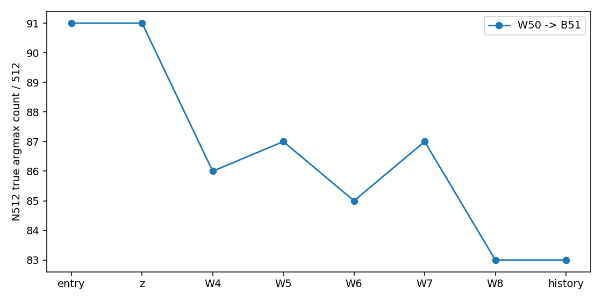

# AlphaEdit key E0–E4 factual report

실제 상태: `TECHNICAL_FAILED_OR_PARTIAL`. 실행 source `f9fbd56f31b0c520763ec9026e660a76cb3074ff`.

본 문서는 등록된 CPU reducer가 저장된 실제 관측만 집계했다. 미실행 dependent 단계는 완료로 세지 않는다.
원본 N4가 아니라 BASE_ALPHAEDIT L4–L8/L2=10 대조이며 N512/P는 observer-only다.
Allocation은 program wall과 다르며 아직 회수하지 않은 scheduler 완료 정보는 추정하지 않았다.

| Endpoint | Metric | Count | Denominator | Percent |
|---|---|---:|---:|---:|
| W050/NATIVE/history | RS | 100 | 100 | 100.000000 |
| W050/NATIVE/history | PS | 190 | 200 | 95.000000 |
| W050/NATIVE/history | NS | 620 | 1000 | 62.000000 |
| W050/SHAM/history | RS | 100 | 100 | 100.000000 |
| W050/SHAM/history | PS | 190 | 200 | 95.000000 |
| W050/SHAM/history | NS | 620 | 1000 | 62.000000 |

N512 기존 실패와 신규 loss/recovery는 [전이표](protection_transitions.csv)에 분리했다.
[Stage](operator_stage.csv), [same-entry](same_entry_effects.csv), [비용](cost_breakdown.json), [출처](source-state-receipt.json).

성능 우열·인과 귀속·새 방법 채택은 이 reducer의 판정 범위가 아니다. SEQ/ORDER/FUTURE 미제출.
원 input CP12는 보존; 새 W/M/optimizer resume checkpoint는 생성하지 않았다.
NO_BROADCAST_NOT_REQUIRED. 실제 detailed review 및 scheduler 후속 회수는 사용자 recall 후에만 수행한다.

완료 family `48/94`; 필수 표의 누락은 성공으로 대체하지 않는다.
[Writer](writer_modes.csv), [H penalty](history_penalty_mismatch.csv), [component](component_interchange.csv), [K/R](kr_operand_effects.csv).

자동 코드 생성 그림이며 agent 육안 검토는 아직 하지 않았다.
