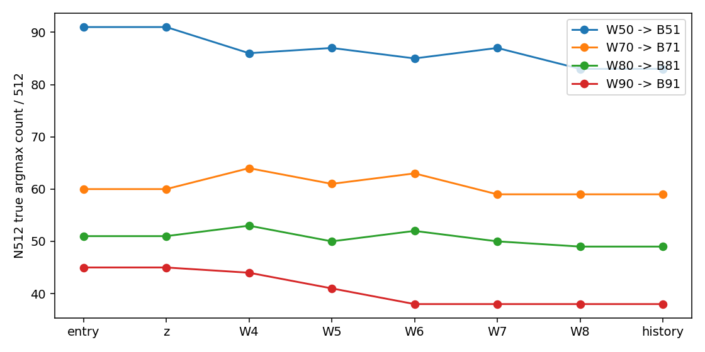

# AlphaEdit key E0–E4 factual report

실제 상태: `COMPLETED`. 실행 source `a21cffa08d4cf86ed258acabdb786fba778f4dfb`.

본 문서는 등록된 CPU reducer가 저장된 실제 관측만 집계했다. 미실행 dependent 단계는 완료로 세지 않는다.
원본 N4가 아니라 BASE_ALPHAEDIT L4–L8/L2=10 대조이며 N512/P는 observer-only다.
Allocation은 program wall과 다르며 아직 회수하지 않은 scheduler 완료 정보는 추정하지 않았다.

| Endpoint | Metric | Count | Denominator | Percent |
|---|---|---:|---:|---:|
| W050/H5/history | RS | 100 | 100 | 100.000000 |
| W050/H5/history | PS | 190 | 200 | 95.000000 |
| W050/H5/history | NS | 619 | 1000 | 61.900000 |
| W050/H56/history | RS | 100 | 100 | 100.000000 |
| W050/H56/history | PS | 190 | 200 | 95.000000 |
| W050/H56/history | NS | 620 | 1000 | 62.000000 |
| W050/H6/history | RS | 100 | 100 | 100.000000 |
| W050/H6/history | PS | 190 | 200 | 95.000000 |
| W050/H6/history | NS | 620 | 1000 | 62.000000 |
| W050/MASS56/history | RS | 100 | 100 | 100.000000 |
| W050/MASS56/history | PS | 190 | 200 | 95.000000 |
| W050/MASS56/history | NS | 620 | 1000 | 62.000000 |
| W050/NATIVE/history | RS | 100 | 100 | 100.000000 |
| W050/NATIVE/history | PS | 190 | 200 | 95.000000 |
| W050/NATIVE/history | NS | 620 | 1000 | 62.000000 |
| W050/SHAM/history | RS | 100 | 100 | 100.000000 |
| W050/SHAM/history | PS | 190 | 200 | 95.000000 |
| W050/SHAM/history | NS | 620 | 1000 | 62.000000 |
| W070/H5/history | RS | 100 | 100 | 100.000000 |
| W070/H5/history | PS | 190 | 200 | 95.000000 |
| W070/H5/history | NS | 546 | 1000 | 54.600000 |
| W070/H56/history | RS | 100 | 100 | 100.000000 |
| W070/H56/history | PS | 190 | 200 | 95.000000 |
| W070/H56/history | NS | 546 | 1000 | 54.600000 |
| W070/H6/history | RS | 100 | 100 | 100.000000 |
| W070/H6/history | PS | 190 | 200 | 95.000000 |
| W070/H6/history | NS | 547 | 1000 | 54.700000 |
| W070/MASS56/history | RS | 100 | 100 | 100.000000 |
| W070/MASS56/history | PS | 190 | 200 | 95.000000 |
| W070/MASS56/history | NS | 547 | 1000 | 54.700000 |
| W070/NATIVE/history | RS | 100 | 100 | 100.000000 |
| W070/NATIVE/history | PS | 190 | 200 | 95.000000 |
| W070/NATIVE/history | NS | 547 | 1000 | 54.700000 |
| W070/SHAM/history | RS | 100 | 100 | 100.000000 |
| W070/SHAM/history | PS | 190 | 200 | 95.000000 |
| W070/SHAM/history | NS | 547 | 1000 | 54.700000 |
| W080/H5/history | RS | 100 | 100 | 100.000000 |
| W080/H5/history | PS | 180 | 200 | 90.000000 |
| W080/H5/history | NS | 550 | 1000 | 55.000000 |
| W080/H56/history | RS | 100 | 100 | 100.000000 |
| W080/H56/history | PS | 180 | 200 | 90.000000 |
| W080/H56/history | NS | 550 | 1000 | 55.000000 |
| W080/H6/history | RS | 100 | 100 | 100.000000 |
| W080/H6/history | PS | 180 | 200 | 90.000000 |
| W080/H6/history | NS | 550 | 1000 | 55.000000 |
| W080/MASS56/history | RS | 100 | 100 | 100.000000 |
| W080/MASS56/history | PS | 180 | 200 | 90.000000 |
| W080/MASS56/history | NS | 550 | 1000 | 55.000000 |
| W080/NATIVE/history | RS | 100 | 100 | 100.000000 |
| W080/NATIVE/history | PS | 180 | 200 | 90.000000 |
| W080/NATIVE/history | NS | 550 | 1000 | 55.000000 |
| W080/SHAM/history | RS | 100 | 100 | 100.000000 |
| W080/SHAM/history | PS | 180 | 200 | 90.000000 |
| W080/SHAM/history | NS | 551 | 1000 | 55.100000 |
| W090/H5/history | RS | 100 | 100 | 100.000000 |
| W090/H5/history | PS | 186 | 200 | 93.000000 |
| W090/H5/history | NS | 524 | 1000 | 52.400000 |
| W090/H56/history | RS | 100 | 100 | 100.000000 |
| W090/H56/history | PS | 186 | 200 | 93.000000 |
| W090/H56/history | NS | 527 | 1000 | 52.700000 |
| W090/H6/history | RS | 100 | 100 | 100.000000 |
| W090/H6/history | PS | 186 | 200 | 93.000000 |
| W090/H6/history | NS | 526 | 1000 | 52.600000 |
| W090/MASS56/history | RS | 100 | 100 | 100.000000 |
| W090/MASS56/history | PS | 186 | 200 | 93.000000 |
| W090/MASS56/history | NS | 523 | 1000 | 52.300000 |
| W090/NATIVE/history | RS | 100 | 100 | 100.000000 |
| W090/NATIVE/history | PS | 186 | 200 | 93.000000 |
| W090/NATIVE/history | NS | 523 | 1000 | 52.300000 |
| W090/SHAM/history | RS | 100 | 100 | 100.000000 |
| W090/SHAM/history | PS | 186 | 200 | 93.000000 |
| W090/SHAM/history | NS | 523 | 1000 | 52.300000 |

N512 기존 실패와 신규 loss/recovery는 [전이표](protection_transitions.csv)에 분리했다.
[Stage](operator_stage.csv), [same-entry](same_entry_effects.csv), [비용](cost_breakdown.json), [출처](source-state-receipt.json).

성능 우열·인과 귀속·새 방법 채택은 이 reducer의 판정 범위가 아니다. SEQ/ORDER/FUTURE 미제출.
원 input CP12는 보존; 새 W/M/optimizer resume checkpoint는 생성하지 않았다.
NO_BROADCAST_NOT_REQUIRED. 실제 detailed review 및 scheduler 후속 회수는 사용자 recall 후에만 수행한다.

## 최신 사용자 수치 비교 관찰 정책

SHAM 및 hook/physical 수치 차이는 `OBSERVATION_ONLY_USER_DIRECTED`로 보존한다. 미일치를 PASS로 바꾸지 않았고, 원 FP32 연산식/관측집합은 변경하지 않았다.
실행 완료와 수치 동등성은 별개이며 `full_numerical_equivalence=NOT_ESTABLISHED`이다. NaN/shape/입력/상태/저장 무결성 검사는 계속 차단 조건이다.
[수치 비교 검산 범위](numerical-comparison-coverage.json).

완료 family `94/94`; 필수 표의 누락은 성공으로 대체하지 않는다.
[Writer](writer_modes.csv), [H penalty](history_penalty_mismatch.csv), [component](component_interchange.csv), [K/R](kr_operand_effects.csv).

자동 코드 생성 그림이며 agent 육안 검토는 아직 하지 않았다.
