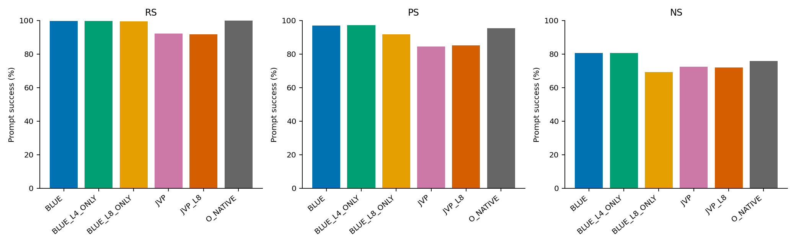
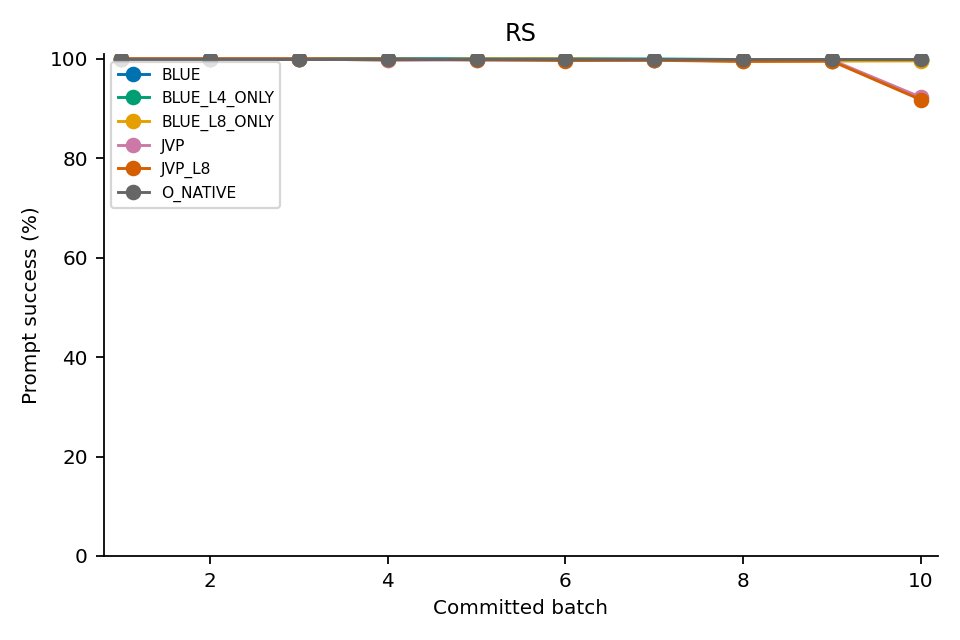
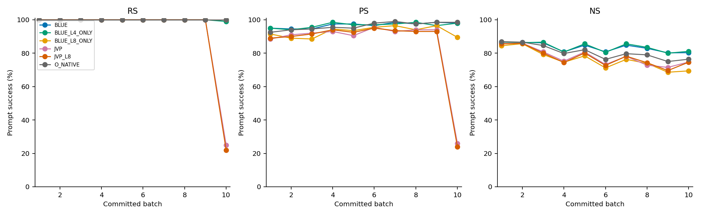
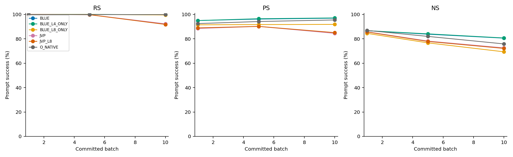
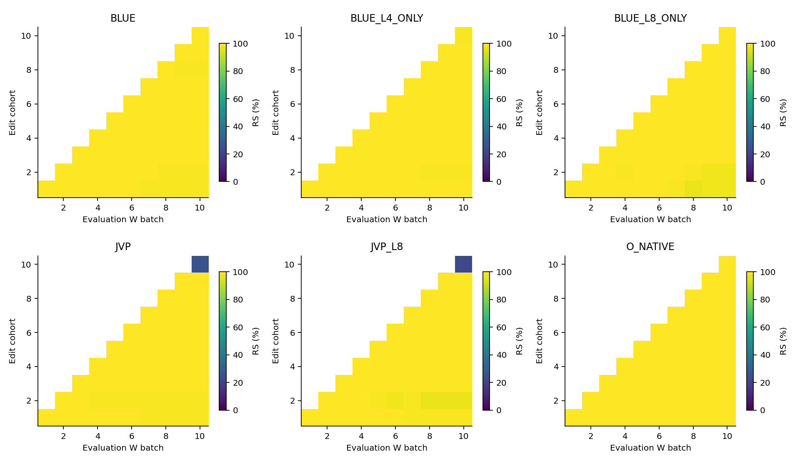
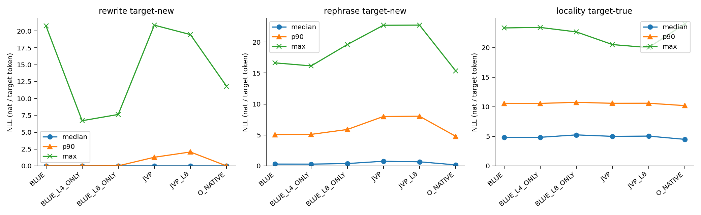
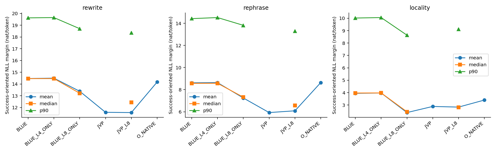
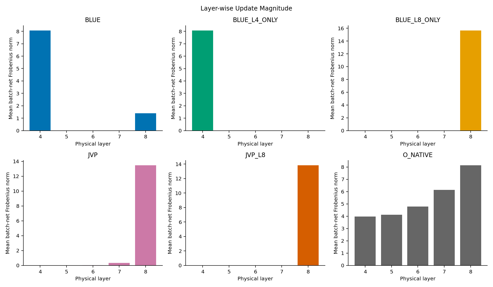
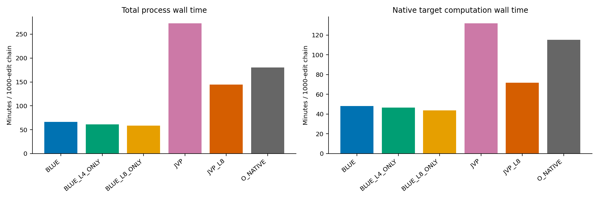

# BLUE / L4-only / L8-only / JVP / JVP-L8 — Llama sequential 1,000 상세 비교

Canonical review v1. **B100×10 cumulative W/history sequential**. 첫 표는 각 arm의 실제 최종 W10 하나에서 같은1,000 requests 전체를 평가한 값이며, current B100 또는 online-at-write 합계가 아니다. 5개 요청 arm과 별도 Official reference를 모두 유지한다. Qwen BLUE는 원본 모델별 config 미지원으로 미실행이며 이 Llama 분모에 넣지 않는다.

|arm|state|RS|PS|NS|rewrite_acc|rephrase_acc|
|---|---|---|---|---|---|---|
|BLUE|FINAL_W10_ALL1000|997/1000 (99.70%)|1939/2000 (96.95%)|8057/10000 (80.57%)|997/1000|1347/2000|
|BLUE_L4_ONLY|FINAL_W10_ALL1000|998/1000 (99.80%)|1943/2000 (97.15%)|8072/10000 (80.72%)|995/1000|1347/2000|
|BLUE_L8_ONLY|FINAL_W10_ALL1000|996/1000 (99.60%)|1837/2000 (91.85%)|6936/10000 (69.36%)|991/1000|1291/2000|
|JVP|FINAL_W10_ALL1000|923/1000 (92.30%)|1690/2000 (84.50%)|7259/10000 (72.59%)|899/1000|1121/2000|
|JVP_L8|FINAL_W10_ALL1000|918/1000 (91.80%)|1702/2000 (85.10%)|7214/10000 (72.14%)|897/1000|1148/2000|
|O_NATIVE|FINAL_W10_ALL1000|1000/1000 (100.00%)|1910/2000 (95.50%)|7584/10000 (75.84%)|996/1000|1436/2000|

RS=1,000 rewrite prompts, PS=2,000 rephrase prompts, NS=10,000 neighborhood prompts/arm. Acc는 teacher-forced all-target-token prompt accuracy이다. L4 사전 CPU/smoke/fidelity 검증은 **SKIPPED_USER_DIRECTED**이며 사후 무결성 검산으로 이를 PASS로 바꾸지 않는다.

## 1. 주요 수치와 비교 경계

BLUE_L4_ONLY − BLUE: RS +0.10pp, PS +0.20pp, NS +0.15pp. 동일 request inventory의 서로 다른 최종 endpoint를 비교한 산술 차이다.

BLUE_L8_ONLY − BLUE: RS -0.10pp, PS -5.10pp, NS -11.21pp. 동일 request inventory의 서로 다른 최종 endpoint를 비교한 산술 차이다.

BLUE − JVP: RS +7.40pp, PS +12.45pp, NS +7.98pp. 동일 request inventory의 서로 다른 최종 endpoint를 비교한 산술 차이다.

BLUE_L8_ONLY − JVP_L8: RS +7.80pp, PS +6.75pp, NS -2.78pp. 동일 request inventory의 서로 다른 최종 endpoint를 비교한 산술 차이다.

JVP_L8 − JVP: RS -0.50pp, PS +0.60pp, NS -0.45pp. 동일 request inventory의 서로 다른 최종 endpoint를 비교한 산술 차이다.

원본 BLUE first+last [4,8]은 L4-only 대비 이 최종 표에서 세 primary 점수가 모두 높지는 않다. L4-only와 L8-only는 editable layer뿐 아니라 z 최적화·관측 위치도 다르다. BLUE와 JVP는 sample은 같지만 target policy, contexts, seed, tokenizer writer 설정, controller와 환경이 달라 method-only 인과효과로 분리할 수 없다. BLUE 성공이 기존 JV 실패의 원인을 입증하지 않는다. 본 사용자 instruction은 상세 비교 해석을 허용하지만 보고는 관측과 산술 차이에 한정하며 scientific_promotion=false이다.

## 2. 지표와 읽는 법

|지표|정의|분모/단위|
|---|---|---|
|RS / PS|각 rewrite / rephrase prompt에서 new NLL < true NLL|request당1 / 2 prompt; 높을수록 성공률 큼|
|NS|각 neighborhood prompt에서 true NLL < new NLL|request당10 prompt; 높을수록 성공률 큼; tie 실패|
|strict PS|동일 request의 rephrase2개 모두 canonical preference 성공|request; teacher-forced exact와 다름|
|new/true NLL|−mean(target token log probability), teacher-forced|nat/token; 각 target likelihood는 낮을수록 높음|
|margin|RS/PS=true−new NLL, NS=new−true NLL|nat/token; 양수일 때 canonical 성공|
|rewrite/rephrase acc|해당 target 모든 token의 top-1 정답인 prompt 비율|prompt; free generation 아님; new/true 분리|
|token acc|정답 target tokens / 전체 target tokens|token; prompt accuracy와 혼합하지 않음|
|mean/median/IQR/p90/max|동일 category prompt별 스칼라의 평균/중앙/중간50%/90백분위/최댓값|prompt; request cluster 독립성을 가정한 유의성검정 없음|
|Layer-wise Update Magnitude|실제 저장 FP32 W_exit−W_entry의 Frobenius norm|layer×joint B100; request100번으로 복제하지 않음|
|magnitude share|각 layer norm / 모든 selected layer norm의 합|batch; squared share와 구분|
|JV residual e / V|N0 entry scales로 정규화한 fixed-L8 target residual / ½//e//²|JV 정의; BLUE native layer-local residual과 직접 동치 비교불가|
|JV native work|history+L2 metric의 source quadratic, qref로 정규화|Frobenius 아님; BLUE에서는 미기록|
|at-write loss / recovery|처음 성공→나중 실패 / 처음 실패→나중 성공|동일 request identity; acquisition 실패와 forgetting 분리|

NA / NOT_AVAILABLE는 미기록 또는 이 실행에서 확인할 수 없는 항목이며 0이 아니다. PS는 request별 평균 NLL의 선호 비교가 아니라 개별 prompt 비교다. Marginal NLL quantile 차이로 margin quantile을 만들지 않았다.

## 3. Source/config/계산 의미와 provenance

BLUE 원본 HEAD311b076a92e4ed0f14f5c8b4909732da781bc5f7/tree f3c933c31cba2fe979c5c34546a99a72e6beb763. BLUE helper HEAD1075540b45c29269e690ac63aae44758d8d63174/tree172b6b9b5c0de4e3aa9e94a05920edaa84a2b323. L4/L8 adapter는 사용자 지시대로 local-only archive를 보존했고 tracked runtime으로 옮기지 않았다. 실행·분석 source는 서로 다른 identity다.

|arm|job|source_head|source_tree|layers|target_policy|seed|context_hash|config_sha|archive_sha|
|---|---|---|---|---|---|---|---|---|---|
|BLUE|38940|1075540b45c29269e690ac63aae44758d8d63174|172b6b9b5c0de4e3aa9e94a05920edaa84a2b323|[4, 8]|native selected-layer current W; one z/request/layer|2.02609e+07|cf14b8571136b0413ded1ea8aa283a004ecbddbd818a6a8744b0296b63f72191|c4186ff61c11daaf6f5f6ad3cdc3dbc3b94aec42b4874c4cee9af3648f428275|172b6b9b5c0de4e3aa9e94a05920edaa84a2b323|
|BLUE_L4_ONLY|38997|1075540b45c29269e690ac63aae44758d8d63174|172b6b9b5c0de4e3aa9e94a05920edaa84a2b323|[4]|native selected-layer current W; one z/request/layer|2.02609e+07|cf14b8571136b0413ded1ea8aa283a004ecbddbd818a6a8744b0296b63f72191|2392ab8392476ed019985e4292a8c0aa2a3957f36a06a704eb7590e8e8c99c5d|a64a7d35bb70136259611ddd79859ef396957d592c3be2e24a93dfa7f9ad3608|
|BLUE_L8_ONLY|38988|1075540b45c29269e690ac63aae44758d8d63174|172b6b9b5c0de4e3aa9e94a05920edaa84a2b323|[8]|native selected-layer current W; one z/request/layer|2.02609e+07|cf14b8571136b0413ded1ea8aa283a004ecbddbd818a6a8744b0296b63f72191|753a762b333edaf770585b6ebbeea7ca71f4bc881683ac7aa00950fe7a23f55d|80c8c4396484d31fe5353a377dd8fd3e28707d36241074c92ee0ce0c8667c83a|
|O_NATIVE|37981|77358b1546d1baf83b3e251afcce663b08d7bfd7|b64e84f2af7c708405dd6a8a9f018d3ece985c58|[4,5,6,7,8]|fixed batch-entry L8 z, once/request, no inner recompute|2.02609e+07|bef722a3c30990f06084570a55a8e2056f5d38d7b4d5bd303e7d48de70920611|63239e48ea8faf78dfcc40d7d4f5aff3ff0832eb4208384d11f4a812819765c3|NA|
|JVP|37983|77358b1546d1baf83b3e251afcce663b08d7bfd7|b64e84f2af7c708405dd6a8a9f018d3ece985c58|[4,5,6,7,8]|fixed batch-entry L8 z, once/request, no inner recompute|2.02609e+07|bef722a3c30990f06084570a55a8e2056f5d38d7b4d5bd303e7d48de70920611|63239e48ea8faf78dfcc40d7d4f5aff3ff0832eb4208384d11f4a812819765c3|NA|
|JVP_L8|38434|44602a1a80554c67da0ef9646b43d843104785f2|cdb089a139f180c822d1e6bf44fe3d27b858c1ce|[8] support / [4,5,6,7,8] dictionary/history|fixed batch-entry L8 z, once/request, no inner recompute|2.02609e+07|bef722a3c30990f06084570a55a8e2056f5d38d7b4d5bd303e7d48de70920611|63239e48ea8faf78dfcc40d7d4f5aff3ff0832eb4208384d11f4a812819765c3|NA|

**실제 Llama 설정 확인:** pinned JVP/O YAML도 v_weight_decay=0.5, L2=1이다. Qwen의0.001을 Llama에 복사해 차이라고 서술하지 않는다. BLUE variants는 layers 외 optimizer 기본값 동일: v_num_grad_steps25, v_lr0.1, clamp0.75, loss layer31, decay0.5, KL0.0625, nullspace threshold0.02. Native optimizer의 early loss stop은 원본 그대로다. Full config·tokenizer·asset SHA는 source-config-compatibility.csv 및 source-asset-inventory.csv에 있다.

|arm|model_revision|z_decay|L2|v_num_grad_steps|v_loss_layer|dtype|attention|tf32_matmul|tf32_cudnn|gpu|torch|transformers|
|---|---|---|---|---|---|---|---|---|---|---|---|---|
|BLUE|8afb486c1db24fe5011ec46dfbe5b5dccdb575c2|0.5|1|25|31|torch.float32|eager|False|True|NVIDIA RTX PRO 6000 Blackwell Server Edition|2.9.1+cu128|4.44.2|
|BLUE_L4_ONLY|8afb486c1db24fe5011ec46dfbe5b5dccdb575c2|0.5|1|25|31|torch.float32|eager|False|True|NVIDIA RTX PRO 6000 Blackwell Server Edition|2.9.1+cu128|4.44.2|
|BLUE_L8_ONLY|8afb486c1db24fe5011ec46dfbe5b5dccdb575c2|0.5|1|25|31|torch.float32|eager|False|True|NVIDIA RTX PRO 6000 Blackwell Server Edition|2.9.1+cu128|4.44.2|
|O_NATIVE|8afb486c1db24fe5011ec46dfbe5b5dccdb575c2|0.5|1|25|31|model FP32; controller/native metric FP64|eager|False|False|NVIDIA RTX A6000|NA|NA|
|JVP|8afb486c1db24fe5011ec46dfbe5b5dccdb575c2|0.5|1|25|31|model FP32; controller/native metric FP64|eager|False|False|NVIDIA RTX A6000|NA|NA|
|JVP_L8|8afb486c1db24fe5011ec46dfbe5b5dccdb575c2|0.5|1|25|31|model FP32; controller/native metric FP64|eager|False|False|NVIDIA RTX PRO 6000 Blackwell Server Edition|NA|NA|

공통 Llama revision8afb486c1db24fe5011ec46dfbe5b5dccdb575c2, model parameter8,030,261,248 FP32. BLUE는 transformers4.44.2/torch2.9.1+cu128 및 eager attention; original README-era 의존성 대신 Llama3/tuple-hook 지원 환경을 쓰는 portability 차이를 봉인했다. Writer tokenizer add_bos=False/right/pad=eos, evaluator는 별도 default tokenizer/right. JVP writer/evaluator는 같은 default tokenizer이며 use_cache=False; BLUE는 model config 기본값을 유지한다. TF32 matmul은 모두False, BLUE cudnn=True와 JVPFalse는 차이로 남긴다. dtype가 같다는 이유로 cross-host bitwise parity를 주장하지 않는다.

### 알고리즘 차이: L8 one-shot ≠ JVP-L8

|arm|target|write|history|
|---|---|---|---|
|BLUE|각 L4→L8 진입 current W에서 z_l*=compute_z(W,l)|[P_l(KKᵀ+M_l)+L2 I] X_l=P_l K (z_l*−h_l)ᵀ; ΔW_l=orient(X_l)|선택2 layer에 native final key pass, batch append1|
|BLUE_L4_ONLY|batch entry의 native L4 z*|같은 closed-form, L4 1solve/batch; full local residual|L4 history1; other layer update0|
|BLUE_L8_ONLY|batch entry의 native L8 z*|같은 closed-form, L8 1solve/batch; full local residual|L8 history1; other layer update0|
|JVP|batch entry L8 z* 고정, N0 scale 고정|N=4,h=.5,T=2; refreshed native directions+JVP; c≥0 response NNLS; ΔW=Σnode h c_l D_l/√q_l|원본5 layer finalization/history, terminal materialization commit|
|JVP_L8|JVP와 같은 fixed-L8 policy|full5 entry qref와 dictionary, L8 support만 적용; 4 refreshed steps와 JVP|5 layer history inventory 유지; nonL8 physical write0|
|O_NATIVE|entry fixed L8 z*|stock AlphaEdit ordered5 layer/remaining-layer allocation|stock5 layer history|

JVP node의 L8 비중이 높더라도 coefficient 선택, native metric 정규화, repeated steps/current keys, target-context, history inventory가 달라 one-shot과 같은 연산이 아니다. Source expression별 line/SHA는 source-findings.csv에 제공한다. 다른 실험의 stopped ORBODE correctness 감사는 재개하지 않았다.

## 4. 무결성, 분모, 저장 상태

단발 scheduler:38940 COMPLETED0 01:06:20;38988 COMPLETED0 00:58:30;38997 COMPLETED0 01:01:01. 세 task 모두10/10 B100와1000/1000 requests, 27/27 interbatch W/M hash links,30 history append,9 selected-W/dense-M checkpoints(1/5/10)의 CPU reload/hash 확인. Terminal flags W0/cache bytes·pointer restore True, nonfinite/failure0. Version counter는 copy_ 때문에 복원되지 않으며 source도 NOT_CLAIMED로 명시한다. Evaluation 동안 before/after signature exact를 별도로 검증한다.

Raw/publication members478개를 SHA/size로 재해시했다. 별도 source/asset/dependency1,804 unique members도 재해시했다. O/JVP는 Server2 Git publication 재해시 수준이며 원격 raw/checkpoint를 검증했다고 하지 않는다. Local JVP-L8는 기존 inventory의 Llama chain raw를 재해시하고 최종 NLL pair를 독립 집계했다. BLUE finalW10은 checkpoint W10과 same endpoint로 확인했으며 terminal 후 W0 복원된 모델을 final로 평가한 것이 아니다.

**L4 기록 오류:** native-observation의 projector_asset_index=4는 observer 상수 오류다. execution.lock와 runtime은 allp[[0]]이고, 원본 P tensor에서 index0을 CPU로 추출한 SHA가 실제 runtime projector_sha256와 정확히 일치한다. 따라서 실제 P 선택은 L4용0이며 이 field의 provenance만 잘못됐다. 기존 source/raw는 변경하지 않았다. 사전 검증 생략 사실은 그대로 유지한다.

|arm|batch|weights|cache_shape|status|sha256|
|---|---|---|---|---|---|
|BLUE|1|2|[2, 14336, 14336]|CPU_RELOAD_HASH_PASS|7ea7865e81a3e0a8f7e352348bdd852739684f79bc75572545f3d6928a000a29|
|BLUE|5|2|[2, 14336, 14336]|CPU_RELOAD_HASH_PASS|ceb0cb6a494ec88f1fbaeb011d1af12be99b8a09aa0d3abfe2a504ecbb0e1265|
|BLUE|10|2|[2, 14336, 14336]|CPU_RELOAD_HASH_PASS|ea3fb736254435b0c283a97a889cc296490f4470fd5df2dcf070d640c08b5eba|
|BLUE_L4_ONLY|1|1|[1, 14336, 14336]|CPU_RELOAD_HASH_PASS|5220d6a0a284d3c337707fcd7302b6c96bdc666b4b6ed0f1dff5040516cdddc3|
|BLUE_L4_ONLY|5|1|[1, 14336, 14336]|CPU_RELOAD_HASH_PASS|d12f7085ac02330b056bd8f29063ca6ebb09f2cfb0bfb2c9ddb81f34c7e49776|
|BLUE_L4_ONLY|10|1|[1, 14336, 14336]|CPU_RELOAD_HASH_PASS|97b0e57995aa4b324965a5f7fbdc93611d5500e2524832136c47fe4e7d66e8c9|
|BLUE_L8_ONLY|1|1|[1, 14336, 14336]|CPU_RELOAD_HASH_PASS|b223c10ccb46706aa25a9726bc1d44c1b390c27fda370a2768123d98886121b0|
|BLUE_L8_ONLY|5|1|[1, 14336, 14336]|CPU_RELOAD_HASH_PASS|cd7a91e39b2486feda3943e8f0dfe564472eab8796bdcd3f1f88f6af2cdf402e|
|BLUE_L8_ONLY|10|1|[1, 14336, 14336]|CPU_RELOAD_HASH_PASS|d046c83292785990454e7026a19bb7e70cfc9813f14d9a15e4b7fb29c169239e|

Checkpoint는 선택 weight와 실제 dense cache 및 context/request metadata이며 full-model standalone 저장본이 아니다. Pinned immutable base model과 결합해야 복원 가능하다. 단일-layer main의 비편집 weight 검사는 pointer/version/shape/dtype이며 full bytes는 smoke에서만 수행했다(L4 smoke 미수행). Original BLUE는 source selected-write 경로와 selected state 확인 범위다. 해시 PASS를 전체 model-level observer on/off parity PASS로 확대하지 않는다.

공통 sample ordered_root=40fe1afb318a4a5da9630425213644a729a1e85fb4e78c18e9a4dcd2870eefdd. 동일 IDs/order/B100 경계, dataset raw-record/request hash 및 target bytes를 독립 대조했다. BLUE끼리 final prompt identity/order도 정확히 맞는다. BLUE↔JVP의 per-prompt identity scheme에는 token IDs 포함 여부 차이가 있어 이번 cross-family prompt-loss pairing은 하지 않고 publication/request-cohort 범위로 제한했다. Duplicate/imputation/exclusion으로 표본을 바꾸지 않았다.

### 원본 W0 reference

|arm|W0_RS|W0_PS|W0_NS|reference_RS|reference_PS|reference_NS|
|---|---|---|---|---|---|---|
|BLUE|71|227|8820|71|227|8820|
|BLUE_L4_ONLY|71|227|8820|71|227|8820|
|BLUE_L8_ONLY|71|227|8820|71|227|8820|

동일 sample에서 W0의 RS71/1000, PS227/2000, NS8820/10000이 기록됐다. 일치하는 aggregate 자체를 환경 bitwise equality로 간주하지 않는다.

## 5. 최종 NLL/margin 및 secondary accuracy

### rewrite — final W10 prompt-level 분포

|arm|quantity|n|mean|median|p90|max|
|---|---|---|---|---|---|---|
|BLUE|new|1000|0.0463548|0.00124966|0.0047865|20.7349|
|BLUE|true|1000|14.5116|14.4632|19.6308|28.954|
|BLUE|margin|1000|14.4652|14.4573|19.6303|28.9535|
|BLUE_L4_ONLY|new|1000|0.0319048|0.00116233|0.00479136|6.69973|
|BLUE_L4_ONLY|true|1000|14.5288|14.4648|19.6581|26.5463|
|BLUE_L4_ONLY|margin|1000|14.4969|14.4635|19.656|26.5462|
|BLUE_L8_ONLY|new|1000|0.0540843|0.00189423|0.0145463|7.62643|
|BLUE_L8_ONLY|true|1000|13.4352|13.2194|18.7103|27.3656|
|BLUE_L8_ONLY|margin|1000|13.3811|13.212|18.7089|27.3655|
|JVP_L8|new|1000|0.90869|0.00225635|2.06764|19.4628|
|JVP_L8|true|1000|12.4763|12.5457|18.3575|27.0412|
|JVP_L8|margin|1000|11.5676|12.4396|18.357|27.0411|
|O_NATIVE|new|1000|0.0317015|0.00124943|0.00724538|11.8166|
|O_NATIVE|true|1000|14.201|13.9949|19.6269|27.8351|
|O_NATIVE|margin|1000|14.1693|NA|NA|NA|
|JVP|new|1000|0.893713|0.00229732|1.28634|20.8581|
|JVP|true|1000|12.4817|12.5052|18.5886|26.3383|
|JVP|margin|1000|11.588|NA|NA|NA|

### rephrase — final W10 prompt-level 분포

|arm|quantity|n|mean|median|p90|max|
|---|---|---|---|---|---|---|
|BLUE|new|2000|1.52754|0.300677|5.06355|16.6375|
|BLUE|true|2000|10.1439|10.0294|15.0488|24.8002|
|BLUE|margin|2000|8.61634|8.56841|14.4221|24.7789|
|BLUE_L4_ONLY|new|2000|1.54366|0.293203|5.09909|16.153|
|BLUE_L4_ONLY|true|2000|10.1812|9.96273|15.2787|24.812|
|BLUE_L4_ONLY|margin|2000|8.63749|8.57443|14.5189|24.8108|
|BLUE_L8_ONLY|new|2000|1.79197|0.384973|5.88258|19.598|
|BLUE_L8_ONLY|true|2000|9.03728|8.86474|14.0734|23.924|
|BLUE_L8_ONLY|margin|2000|7.24531|7.31895|13.8174|23.9199|
|JVP_L8|new|2000|2.51488|0.66818|8.02474|22.7352|
|JVP_L8|true|2000|8.60096|8.44124|14.0072|24.0258|
|JVP_L8|margin|2000|6.08608|6.56987|13.2871|24.0227|
|O_NATIVE|new|2000|1.358|0.172285|4.79453|15.3627|
|O_NATIVE|true|2000|9.9994|9.96479|15.1465|25.2206|
|O_NATIVE|margin|2000|8.6414|NA|NA|NA|
|JVP|new|2000|2.54764|0.757664|7.98699|22.7099|
|JVP|true|2000|8.4746|8.32346|13.6498|24.6716|
|JVP|margin|2000|5.92696|NA|NA|NA|

### locality — final W10 prompt-level 분포

|arm|quantity|n|mean|median|p90|max|
|---|---|---|---|---|---|---|
|BLUE|new|10000|9.26618|9.2781|14.1649|25.826|
|BLUE|true|10000|5.32223|4.8367|10.585|23.3359|
|BLUE|margin|10000|3.94395|3.96843|10.0176|19.8308|
|BLUE_L4_ONLY|new|10000|9.27297|9.26856|14.1563|24.5815|
|BLUE_L4_ONLY|true|10000|5.30216|4.84406|10.5759|23.4192|
|BLUE_L4_ONLY|margin|10000|3.97082|3.97594|10.056|19.2991|
|BLUE_L8_ONLY|new|10000|8.0451|8.0365|13.2837|24.6826|
|BLUE_L8_ONLY|true|10000|5.65373|5.25211|10.7572|22.6625|
|BLUE_L8_ONLY|margin|10000|2.39136|2.45598|8.63703|21.9668|
|JVP_L8|new|10000|8.30819|8.26605|13.5111|26.1592|
|JVP_L8|true|10000|5.47574|5.0469|10.6055|20.0147|
|JVP_L8|margin|10000|2.83245|2.81325|9.12033|19.8102|
|O_NATIVE|new|10000|8.42805|8.49489|13.6143|24.0174|
|O_NATIVE|true|10000|5.02685|4.49904|10.2034|24.0193|
|O_NATIVE|margin|10000|3.4012|NA|NA|NA|
|JVP|new|10000|8.34175|8.28245|13.5399|24.4539|
|JVP|true|10000|5.456|5.00411|10.5932|20.5213|
|JVP|margin|10000|2.88575|NA|NA|NA|

|arm|rewrite_prompt_acc|rewrite_token_acc|rephrase_prompt_acc|rephrase_token_acc|locality_prompt_acc|locality_token_acc|
|---|---|---|---|---|---|---|
|BLUE|997/1000|1012/1015|1347/2000|1376/2030|1814/10000|1924/10110|
|BLUE_L4_ONLY|995/1000|1010/1015|1347/2000|1376/2030|1813/10000|1923/10110|
|BLUE_L8_ONLY|991/1000|1006/1015|1291/2000|1320/2030|1415/10000|1524/10110|
|JVP|899/1000|914/1015|1121/2000|1150/2030|1548/10000|1658/10110|
|JVP_L8|897/1000|912/1015|1148/2000|1177/2030|1490/10000|1600/10110|
|O_NATIVE|996/1000|1011/1015|1436/2000|1465/2030|1967/10000|2077/10110|

Locality acc는 target-true teacher-forced diagnostic이며 NS가 아니다. NLL tail의 극단값은 포함하며 nonfinite를 제외해 성능을 보정하지 않았다. Prompt marginal quantiles와 paired margin quantiles는 표의 quantity로 분리한다.

## 6. Sequential current와 cumulative: 모든 batch

current는 W_k에서 새 cohort100만, all-seen rewrite는 W_k에서 과거를 포함한100k, full checkpoint는 W1/W5/W10의 전체 seen RS/PS/NS다. Intermediate PS/NS는 미기록이며 보간·새 평가0. Final W10은 seen checkpoint10과 동일 평가 member이므로 별도 표에 재사용해도 독립 측정으로 중복 계산하지 않는다.

### Full seen-prefix checkpoint 전체18행

|arm|batch|requests|RS|PS|PS_all2|NS|
|---|---|---|---|---|---|---|
|O_NATIVE|1|100|100/100 (100.00%)|185/200 (92.50%)|88/100|869/1000 (86.90%)|
|O_NATIVE|5|500|500/500 (100.00%)|942/1000 (94.20%)|455/500|4100/5000 (82.00%)|
|O_NATIVE|10|1000|1000/1000 (100.00%)|1910/2000 (95.50%)|927/1000|7584/10000 (75.84%)|
|JVP|1|100|100/100 (100.00%)|177/200 (88.50%)|81/100|858/1000 (85.80%)|
|JVP|5|500|499/500 (99.80%)|902/1000 (90.20%)|418/500|3909/5000 (78.18%)|
|JVP|10|1000|923/1000 (92.30%)|1690/2000 (84.50%)|786/1000|7259/10000 (72.59%)|
|JVP_L8|1|100|100/100 (100.00%)|178/200 (89.00%)|82/100|856/1000 (85.60%)|
|JVP_L8|5|500|499/500 (99.80%)|902/1000 (90.20%)|418/500|3892/5000 (77.84%)|
|JVP_L8|10|1000|918/1000 (91.80%)|1702/2000 (85.10%)|797/1000|7214/10000 (72.14%)|
|BLUE|1|100|100/100 (100.00%)|190/200 (95.00%)|92/100|867/1000 (86.70%)|
|BLUE|5|500|500/500 (100.00%)|962/1000 (96.20%)|469/500|4190/5000 (83.80%)|
|BLUE|10|1000|997/1000 (99.70%)|1939/2000 (96.95%)|952/1000|8057/10000 (80.57%)|
|BLUE_L4_ONLY|1|100|100/100 (100.00%)|190/200 (95.00%)|92/100|867/1000 (86.70%)|
|BLUE_L4_ONLY|5|500|500/500 (100.00%)|965/1000 (96.50%)|470/500|4205/5000 (84.10%)|
|BLUE_L4_ONLY|10|1000|998/1000 (99.80%)|1943/2000 (97.15%)|954/1000|8072/10000 (80.72%)|
|BLUE_L8_ONLY|1|100|100/100 (100.00%)|183/200 (91.50%)|86/100|845/1000 (84.50%)|
|BLUE_L8_ONLY|5|500|500/500 (100.00%)|917/1000 (91.70%)|432/500|3835/5000 (76.70%)|
|BLUE_L8_ONLY|10|1000|996/1000 (99.60%)|1837/2000 (91.85%)|868/1000|6936/10000 (69.36%)|

### BLUE — current B100와 seen rewrite

|B|current_RS|current_PS|current_NS|seen_RS|current_new_NLL_mean|seen_new_NLL_mean|seen_margin_mean|
|---|---|---|---|---|---|---|---|
|1|100/100|190/200|867/1000|100/100|0.00220643|0.00220643|14.7884|
|2|100/100|189/200|865/1000|200/200|0.00167065|0.00213319|14.5312|
|3|100/100|189/200|862/1000|300/300|0.00171966|0.00225543|14.4449|
|4|100/100|195/200|808/1000|400/400|0.00175411|0.00287989|14.5558|
|5|100/100|195/200|848/1000|500/500|0.00162415|0.00537816|14.5482|
|6|100/100|193/200|808/1000|600/600|0.00225755|0.0101581|14.574|
|7|100/100|197/200|848/1000|699/700|0.00155188|0.037554|14.5442|
|8|100/100|195/200|829/1000|798/800|0.00163756|0.0342427|14.5369|
|9|100/100|197/200|802/1000|897/900|0.00194632|0.0485654|14.4788|
|10|100/100|196/200|803/1000|997/1000|0.00191873|0.0463548|14.4652|

BLUE B10 신규 cohort RS=100/100, PS=196/200, NS=803/1000. 최종 전체 RS=997/1000과 다른 분모다.

### BLUE_L4_ONLY — current B100와 seen rewrite

|B|current_RS|current_PS|current_NS|seen_RS|current_new_NLL_mean|seen_new_NLL_mean|seen_margin_mean|
|---|---|---|---|---|---|---|---|
|1|100/100|190/200|867/1000|100/100|0.00228767|0.00228767|14.6897|
|2|100/100|188/200|863/1000|200/200|0.00510343|0.00385406|14.3294|
|3|100/100|191/200|866/1000|300/300|0.0014238|0.0043631|14.4545|
|4|100/100|197/200|807/1000|400/400|0.00160589|0.00495142|14.6407|
|5|100/100|194/200|856/1000|500/500|0.00187704|0.00876877|14.6179|
|6|100/100|194/200|805/1000|600/600|0.0108463|0.0123124|14.6331|
|7|100/100|195/200|856/1000|700/700|0.00241827|0.0173872|14.6111|
|8|100/100|197/200|835/1000|799/800|0.00185722|0.0170925|14.6021|
|9|100/100|193/200|800/1000|899/900|0.00248144|0.0221565|14.5577|
|10|99/100|196/200|811/1000|998/1000|0.031947|0.0319048|14.4969|

BLUE_L4_ONLY B10 신규 cohort RS=99/100, PS=196/200, NS=811/1000. 최종 전체 RS=998/1000과 다른 분모다.

### BLUE_L8_ONLY — current B100와 seen rewrite

|B|current_RS|current_PS|current_NS|seen_RS|current_new_NLL_mean|seen_new_NLL_mean|seen_margin_mean|
|---|---|---|---|---|---|---|---|
|1|100/100|183/200|845/1000|100/100|0.00156727|0.00156727|14.1181|
|2|100/100|178/200|857/1000|200/200|0.00202027|0.00221183|13.6948|
|3|100/100|177/200|792/1000|300/300|0.00150172|0.00400149|13.5742|
|4|100/100|189/200|746/1000|399/400|0.0018275|0.0133032|13.5838|
|5|100/100|187/200|784/1000|500/500|0.00202437|0.0115772|13.6324|
|6|100/100|191/200|712/1000|600/600|0.00254544|0.0133482|13.5889|
|7|100/100|193/200|763/1000|699/700|0.00724668|0.0296728|13.4715|
|8|100/100|188/200|739/1000|796/800|0.00210997|0.038785|13.4706|
|9|100/100|193/200|686/1000|896/900|0.00251186|0.0426857|13.4088|
|10|100/100|179/200|694/1000|996/1000|0.00497828|0.0540843|13.3811|

BLUE_L8_ONLY B10 신규 cohort RS=100/100, PS=179/200, NS=694/1000. 최종 전체 RS=996/1000과 다른 분모다.

### JVP — current B100와 seen rewrite

|B|current_RS|current_PS|current_NS|seen_RS|current_new_NLL_mean|seen_new_NLL_mean|seen_margin_mean|
|---|---|---|---|---|---|---|---|
|1|100/100|177/200|858/1000|100/100|0.00258733|NA|13.8439|
|2|100/100|182/200|860/1000|200/200|0.0166699|NA|13.598|
|3|100/100|184/200|808/1000|300/300|0.00166239|NA|13.4014|
|4|100/100|186/200|752/1000|399/400|0.00262355|NA|13.4153|
|5|100/100|181/200|807/1000|499/500|0.00209483|NA|13.4587|
|6|100/100|191/200|732/1000|599/600|0.00270109|NA|13.3792|
|7|100/100|186/200|781/1000|698/700|0.00252797|NA|13.3311|
|8|100/100|188/200|728/1000|798/800|0.00212275|NA|13.3688|
|9|100/100|188/200|715/1000|898/900|0.00266097|NA|13.3041|
|10|25/100|52/200|747/1000|923/1000|8.58417|NA|11.588|

JVP B10 신규 cohort RS=25/100, PS=52/200, NS=747/1000. 최종 전체 RS=923/1000과 다른 분모다.

### JVP_L8 — current B100와 seen rewrite

|B|current_RS|current_PS|current_NS|seen_RS|current_new_NLL_mean|seen_new_NLL_mean|seen_margin_mean|
|---|---|---|---|---|---|---|---|
|1|100/100|178/200|856/1000|100/100|0.00259286|0.00259286|13.8367|
|2|100/100|180/200|859/1000|200/200|0.0302166|0.0182356|13.4866|
|3|100/100|183/200|801/1000|300/300|0.00146696|0.0243562|13.4001|
|4|100/100|188/200|744/1000|400/400|0.00253548|0.0349136|13.4656|
|5|100/100|185/200|801/1000|499/500|0.0021239|0.0377629|13.5038|
|6|100/100|190/200|727/1000|598/600|0.0026957|0.0432773|13.4101|
|7|100/100|187/200|782/1000|698/700|0.00216043|0.0548634|13.3551|
|8|100/100|186/200|743/1000|796/800|0.00211946|0.0557821|13.3037|
|9|100/100|186/200|696/1000|896/900|0.00229586|0.0535328|13.2867|
|10|22/100|48/200|746/1000|918/1000|8.60511|0.90869|11.5676|

JVP_L8 B10 신규 cohort RS=22/100, PS=48/200, NS=746/1000. 최종 전체 RS=918/1000과 다른 분모다.

### O_NATIVE — current B100와 seen rewrite

|B|current_RS|current_PS|current_NS|seen_RS|current_new_NLL_mean|seen_new_NLL_mean|seen_margin_mean|
|---|---|---|---|---|---|---|---|
|1|100/100|185/200|869/1000|100/100|0.00194517|NA|14.4039|
|2|100/100|188/200|866/1000|200/200|0.00158496|NA|14.6426|
|3|100/100|189/200|846/1000|300/300|0.00122177|NA|14.5533|
|4|100/100|191/200|798/1000|400/400|0.00136347|NA|14.5363|
|5|100/100|190/200|821/1000|500/500|0.00226376|NA|14.353|
|6|100/100|196/200|763/1000|600/600|0.002382|NA|14.3536|
|7|100/100|198/200|797/1000|700/700|0.00196204|NA|14.3016|
|8|100/100|195/200|790/1000|800/800|0.00238466|NA|14.2736|
|9|100/100|197/200|750/1000|900/900|0.00280841|NA|14.1978|
|10|100/100|197/200|764/1000|1000/1000|0.00294657|NA|14.1693|

O_NATIVE B10 신규 cohort RS=100/100, PS=197/200, NS=764/1000. 최종 전체 RS=1000/1000과 다른 분모다.

### 각 checkpoint의 상세 분포

#### BLUE seen-prefix NLL / success-oriented margin

|batch|category|quantity|n|mean|median|p90|max|
|---|---|---|---|---|---|---|---|
|1|rewrite|new|100|0.00220643|0.00143282|0.00405177|0.0184964|
|1|rewrite|true|100|14.7906|14.8489|19.7932|25.4068|
|1|rewrite|margin|100|14.7884|14.8485|19.793|25.4065|
|1|rephrase|new|200|1.59814|0.3347|4.73913|11.4642|
|1|rephrase|true|200|10.0447|9.67558|15.1111|22.2693|
|1|rephrase|margin|200|8.44657|8.67866|14.3806|22.2671|
|1|locality|new|1000|11.1459|11.1619|15.9763|23.5474|
|1|locality|true|1000|5.51718|5.28455|10.6871|18.8354|
|1|locality|margin|1000|5.6287|5.58217|12.3193|19.7541|
|5|rewrite|new|500|0.00537816|0.00120228|0.00392218|1.00614|
|5|rewrite|true|500|14.5535|14.4744|19.6472|25.9597|
|5|rewrite|margin|500|14.5482|14.4738|19.6407|25.9595|
|5|rephrase|new|1000|1.54661|0.303524|5.31722|13.1021|
|5|rephrase|true|1000|10.1023|9.97279|15.1972|25.147|
|5|rephrase|margin|1000|8.5557|8.61663|14.8154|25.1239|
|5|locality|new|5000|9.88348|9.79801|14.6653|24.7553|
|5|locality|true|5000|5.18045|4.77593|10.3573|19.4357|
|5|locality|margin|5000|4.70303|4.61176|10.7836|20.5287|
|10|rewrite|new|1000|0.0463548|0.00124966|0.0047865|20.7349|
|10|rewrite|true|1000|14.5116|14.4632|19.6308|28.954|
|10|rewrite|margin|1000|14.4652|14.4573|19.6303|28.9535|
|10|rephrase|new|2000|1.52754|0.300677|5.06355|16.6375|
|10|rephrase|true|2000|10.1439|10.0294|15.0488|24.8002|
|10|rephrase|margin|2000|8.61634|8.56841|14.4221|24.7789|
|10|locality|new|10000|9.26618|9.2781|14.1649|25.826|
|10|locality|true|10000|5.32223|4.8367|10.585|23.3359|
|10|locality|margin|10000|3.94395|3.96843|10.0176|19.8308|

#### BLUE_L4_ONLY seen-prefix NLL / success-oriented margin

|batch|category|quantity|n|mean|median|p90|max|
|---|---|---|---|---|---|---|---|
|1|rewrite|new|100|0.00228767|0.00149805|0.00448586|0.0185424|
|1|rewrite|true|100|14.692|14.731|19.8001|25.3984|
|1|rewrite|margin|100|14.6897|14.7306|19.7974|25.3982|
|1|rephrase|new|200|1.61108|0.336595|4.73111|11.4638|
|1|rephrase|true|200|9.99057|9.71437|15.0092|22.2644|
|1|rephrase|margin|200|8.37949|8.67899|14.1804|22.2621|
|1|locality|new|1000|11.1466|11.1628|15.985|23.5408|
|1|locality|true|1000|5.51762|5.28481|10.6771|18.8336|
|1|locality|margin|1000|5.62894|5.58998|12.3083|19.7744|
|5|rewrite|new|500|0.00876877|0.00115977|0.00450426|2.15125|
|5|rewrite|true|500|14.6266|14.5303|19.9172|26.4665|
|5|rewrite|margin|500|14.6179|14.5231|19.9164|26.466|
|5|rephrase|new|1000|1.57842|0.29894|5.29067|13.6114|
|5|rephrase|true|1000|10.0575|9.80443|15.1197|24.6379|
|5|rephrase|margin|1000|8.47903|8.43537|14.3336|24.6177|
|5|locality|new|5000|9.89211|9.79151|14.6791|24.6622|
|5|locality|true|5000|5.17336|4.74482|10.3679|21.494|
|5|locality|margin|5000|4.71875|4.64211|10.8288|20.1087|
|10|rewrite|new|1000|0.0319048|0.00116233|0.00479136|6.69973|
|10|rewrite|true|1000|14.5288|14.4648|19.6581|26.5463|
|10|rewrite|margin|1000|14.4969|14.4635|19.656|26.5462|
|10|rephrase|new|2000|1.54366|0.293203|5.09909|16.153|
|10|rephrase|true|2000|10.1812|9.96273|15.2787|24.812|
|10|rephrase|margin|2000|8.63749|8.57443|14.5189|24.8108|
|10|locality|new|10000|9.27297|9.26856|14.1563|24.5815|
|10|locality|true|10000|5.30216|4.84406|10.5759|23.4192|
|10|locality|margin|10000|3.97082|3.97594|10.056|19.2991|

#### BLUE_L8_ONLY seen-prefix NLL / success-oriented margin

|batch|category|quantity|n|mean|median|p90|max|
|---|---|---|---|---|---|---|---|
|1|rewrite|new|100|0.00156727|0.00092017|0.00292086|0.0237229|
|1|rewrite|true|100|14.1196|13.9771|18.8101|21.5696|
|1|rewrite|margin|100|14.1181|13.9753|18.8093|21.5689|
|1|rephrase|new|200|1.85167|0.376892|6.42978|10.8894|
|1|rephrase|true|200|8.45981|8.39196|13.6828|18.3128|
|1|rephrase|margin|200|6.60814|6.64779|13.08|18.2671|
|1|locality|new|1000|10.5787|10.6949|15.5906|23.8183|
|1|locality|true|1000|5.34707|5.13495|10.3522|17.3537|
|1|locality|margin|1000|5.23159|5.21942|11.6611|20.0601|
|5|rewrite|new|500|0.0115772|0.00134241|0.00626359|1.75671|
|5|rewrite|true|500|13.644|13.3986|18.6277|26.0406|
|5|rewrite|margin|500|13.6324|13.3915|18.627|26.0405|
|5|rephrase|new|1000|1.82446|0.340483|5.9189|16.5899|
|5|rephrase|true|1000|8.96009|8.82547|13.988|22.9808|
|5|rephrase|margin|1000|7.13563|7.45534|13.5139|22.9773|
|5|locality|new|5000|8.65763|8.61019|13.579|23.953|
|5|locality|true|5000|5.1809|4.84403|10.1981|17.7223|
|5|locality|margin|5000|3.47673|3.43542|9.68646|19.6888|
|10|rewrite|new|1000|0.0540843|0.00189423|0.0145463|7.62643|
|10|rewrite|true|1000|13.4352|13.2194|18.7103|27.3656|
|10|rewrite|margin|1000|13.3811|13.212|18.7089|27.3655|
|10|rephrase|new|2000|1.79197|0.384973|5.88258|19.598|
|10|rephrase|true|2000|9.03728|8.86474|14.0734|23.924|
|10|rephrase|margin|2000|7.24531|7.31895|13.8174|23.9199|
|10|locality|new|10000|8.0451|8.0365|13.2837|24.6826|
|10|locality|true|10000|5.65373|5.25211|10.7572|22.6625|
|10|locality|margin|10000|2.39136|2.45598|8.63703|21.9668|

#### JVP seen-prefix NLL / success-oriented margin

|batch|category|quantity|n|mean|median|p90|max|
|---|---|---|---|---|---|---|---|
|1|rewrite|new|100|0.00258733|0.00121049|0.00518738|0.045194|
|1|rewrite|true|100|13.8465|13.6124|18.6728|21.4276|
|1|rewrite|margin|100|13.8439|NA|NA|NA|
|1|rephrase|new|200|2.09572|0.64232|6.23157|12.8233|
|1|rephrase|true|200|8.34|8.0986|13.3021|18.9837|
|1|rephrase|margin|200|6.24429|NA|NA|NA|
|1|locality|new|1000|10.7145|10.7751|15.7337|23.8623|
|1|locality|true|1000|5.34222|5.04741|10.411|17.8808|
|1|locality|margin|1000|5.37232|NA|NA|NA|
|5|rewrite|new|500|0.0220128|0.00148782|0.00690471|7.60806|
|5|rewrite|true|500|13.4807|12.9076|18.778|26.1494|
|5|rewrite|margin|500|13.4587|NA|NA|NA|
|5|rephrase|new|1000|1.92963|0.446162|6.32677|15.942|
|5|rephrase|true|1000|8.85243|8.66396|14.0923|25.0739|
|5|rephrase|margin|1000|6.9228|NA|NA|NA|
|5|locality|new|5000|8.8772|8.74091|13.7999|23.8841|
|5|locality|true|5000|5.14496|4.75441|10.3638|18.943|
|5|locality|margin|5000|3.73225|NA|NA|NA|
|10|rewrite|new|1000|0.893713|0.00229732|1.28634|20.8581|
|10|rewrite|true|1000|12.4817|12.5052|18.5886|26.3383|
|10|rewrite|margin|1000|11.588|NA|NA|NA|
|10|rephrase|new|2000|2.54764|0.757664|7.98699|22.7099|
|10|rephrase|true|2000|8.4746|8.32346|13.6498|24.6716|
|10|rephrase|margin|2000|5.92696|NA|NA|NA|
|10|locality|new|10000|8.34175|8.28245|13.5399|24.4539|
|10|locality|true|10000|5.456|5.00411|10.5932|20.5213|
|10|locality|margin|10000|2.88575|NA|NA|NA|

#### JVP_L8 seen-prefix NLL / success-oriented margin

|batch|category|quantity|n|mean|median|p90|max|
|---|---|---|---|---|---|---|---|
|1|rewrite|new|100|0.00259286|0.00124907|0.00528419|0.0447877|
|1|rewrite|true|100|13.8393|13.6317|18.6657|21.4291|
|1|rewrite|margin|100|13.8367|13.6314|18.6653|21.4281|
|1|rephrase|new|200|2.10107|0.644349|6.24418|12.7848|
|1|rephrase|true|200|8.32801|8.05967|13.3104|18.9836|
|1|rephrase|margin|200|6.22695|6.21819|12.9859|18.9796|
|1|locality|new|1000|10.7057|10.7693|15.7397|23.8493|
|1|locality|true|1000|5.34389|5.05216|10.4422|17.8794|
|1|locality|margin|1000|5.36185|5.15847|12.0105|20.0616|
|5|rewrite|new|500|0.0377629|0.00147895|0.00720615|7.02752|
|5|rewrite|true|500|13.5416|13.1669|19.1002|27.3222|
|5|rewrite|margin|500|13.5038|13.1655|19.0974|27.322|
|5|rephrase|new|1000|1.92638|0.423127|6.55222|15.7296|
|5|rephrase|true|1000|8.85002|8.66898|14.11|23.8629|
|5|rephrase|margin|1000|6.92364|7.13063|13.3715|23.8596|
|5|locality|new|5000|8.84393|8.74352|13.7688|23.5458|
|5|locality|true|5000|5.14983|4.72772|10.2735|18.6474|
|5|locality|margin|5000|3.6941|3.6419|9.7866|19.6191|
|10|rewrite|new|1000|0.90869|0.00225635|2.06764|19.4628|
|10|rewrite|true|1000|12.4763|12.5457|18.3575|27.0412|
|10|rewrite|margin|1000|11.5676|12.4396|18.357|27.0411|
|10|rephrase|new|2000|2.51488|0.66818|8.02474|22.7352|
|10|rephrase|true|2000|8.60096|8.44124|14.0072|24.0258|
|10|rephrase|margin|2000|6.08608|6.56987|13.2871|24.0227|
|10|locality|new|10000|8.30819|8.26605|13.5111|26.1592|
|10|locality|true|10000|5.47574|5.0469|10.6055|20.0147|
|10|locality|margin|10000|2.83245|2.81325|9.12033|19.8102|

#### O_NATIVE seen-prefix NLL / success-oriented margin

|batch|category|quantity|n|mean|median|p90|max|
|---|---|---|---|---|---|---|---|
|1|rewrite|new|100|0.00194517|0.000813153|0.00386901|0.0251943|
|1|rewrite|true|100|14.4058|14.2684|19.3482|22.1484|
|1|rewrite|margin|100|14.4039|NA|NA|NA|
|1|rephrase|new|200|1.56658|0.269554|5.33656|12.6899|
|1|rephrase|true|200|9.24537|9.0643|14.265|20.3247|
|1|rephrase|margin|200|7.67879|NA|NA|NA|
|1|locality|new|1000|10.9764|11.0218|15.873|23.8066|
|1|locality|true|1000|5.30477|5.01405|10.2996|17.697|
|1|locality|margin|1000|5.67161|NA|NA|NA|
|5|rewrite|new|500|0.00418801|0.000956495|0.00461443|0.483772|
|5|rewrite|true|500|14.3572|14.1274|19.4695|29.0873|
|5|rewrite|margin|500|14.353|NA|NA|NA|
|5|rephrase|new|1000|1.49729|0.206023|4.9432|15.2338|
|5|rephrase|true|1000|9.7509|9.60719|15.1056|24.2998|
|5|rephrase|margin|1000|8.25361|NA|NA|NA|
|5|locality|new|5000|9.19007|9.10979|14.0912|23.5881|
|5|locality|true|5000|4.77375|4.31407|9.87989|18.6453|
|5|locality|margin|5000|4.41632|NA|NA|NA|
|10|rewrite|new|1000|0.0317015|0.00124943|0.00724538|11.8166|
|10|rewrite|true|1000|14.201|13.9949|19.6269|27.8351|
|10|rewrite|margin|1000|14.1693|NA|NA|NA|
|10|rephrase|new|2000|1.358|0.172285|4.79453|15.3627|
|10|rephrase|true|2000|9.9994|9.96479|15.1465|25.2206|
|10|rephrase|margin|2000|8.6414|NA|NA|NA|
|10|locality|new|10000|8.42805|8.49489|13.6143|24.0174|
|10|locality|true|10000|5.02685|4.49904|10.2034|24.0193|
|10|locality|margin|10000|3.4012|NA|NA|NA|

## 7. Acquisition 실패, 이후 forgetting/recovery, cohort retention

### Online own-batch 합계와 final W10: 동일 request, 다른 평가 state

|arm|RS_num|RS_den|RS_final_num|RS_final_minus_online_pp|PS_num|PS_den|PS_final_num|PS_final_minus_online_pp|NS_num|NS_den|NS_final_num|NS_final_minus_online_pp|
|---|---|---|---|---|---|---|---|---|---|---|---|---|
|BLUE|1000|1000|997|-0.3|1936|2000|1939|0.15|8340|10000|8057|-2.83|
|BLUE_L4_ONLY|999|1000|998|-0.1|1935|2000|1943|0.4|8366|10000|8072|-2.94|
|BLUE_L8_ONLY|1000|1000|996|-0.4|1858|2000|1837|-1.05|7618|10000|6936|-6.82|
|JVP|925|1000|923|-0.2|1715|2000|1690|-1.25|7788|10000|7259|-5.29|
|JVP_L8|922|1000|918|-0.4|1711|2000|1702|-0.45|7755|10000|7214|-5.41|
|O_NATIVE|1000|1000|1000|0|1926|2000|1910|-0.8|8064|10000|7584|-4.8|

online 열은 각 cohort 편집 직후 서로 다른 W에서 평가한 값의 합이다. final 열은 단일 W10이다. Δ는 final−online percentage point이며 최종 headline은 항상 final이다.

|arm|all_denominator|at_write_success|initially_failed|at_write_success_to_final_failure|initially_failed_to_final_recovery|final_RS|overwrite_candidates|
|---|---|---|---|---|---|---|---|
|O_NATIVE|1000|1000|0|0|0|1000|1|
|JVP|1000|925|75|2|0|923|1|
|JVP_L8|1000|922|78|4|0|918|1|
|BLUE|1000|1000|0|3|0|997|1|
|BLUE_L4_ONLY|1000|999|1|1|0|998|1|
|BLUE_L8_ONLY|1000|1000|0|4|0|996|1|

BLUE: 처음 실패 0/1000, 처음 성공 후 final 실패 3/1000, 처음 실패 후 final 회복 0/0. 처음 성공−소실+회복=997/1000.

BLUE_L4_ONLY: 처음 실패 1/1000, 처음 성공 후 final 실패 1/999, 처음 실패 후 final 회복 0/1. 처음 성공−소실+회복=998/1000.

BLUE_L8_ONLY: 처음 실패 0/1000, 처음 성공 후 final 실패 4/1000, 처음 실패 후 final 회복 0/0. 처음 성공−소실+회복=996/1000.

JVP: 처음 실패 75/1000, 처음 성공 후 final 실패 2/925, 처음 실패 후 final 회복 0/75. 처음 성공−소실+회복=923/1000.

JVP_L8: 처음 실패 78/1000, 처음 성공 후 final 실패 4/922, 처음 실패 후 final 회복 0/78. 처음 성공−소실+회복=918/1000.

O_NATIVE: 처음 실패 0/1000, 처음 성공 후 final 실패 0/1000, 처음 실패 후 final 회복 0/0. 처음 성공−소실+회복=1000/1000.

JVP의75개 at-write 실패와 JVP-L8의78개 at-write 실패는 B10 current에서 발생했다. 이후 소실2/4건과 합쳐 최종실패77/82건이다. BLUE/L8 one-shot은 online RS1000, L4 one-shot은999로 측정됐다. 이 차이는 신규 acquisition과 이전 edit 소실을 분리해 보아야 하며 tiny residual 등 미기록 원인을 확정하지 않는다.

### Final W10의 edit-age cohort: 각 cohort 분모100

|arm|cohort|age|current_success|at_write_success|initially_failed|at_write_success_now_failure|prior_failure_now_recovery|margin_mean|
|---|---|---|---|---|---|---|---|---|
|O_NATIVE|1|9|100|100|0|0|0|12.6421|
|O_NATIVE|2|8|100|100|0|0|0|13.8963|
|O_NATIVE|3|7|100|100|0|0|0|13.977|
|O_NATIVE|4|6|100|100|0|0|0|14.4515|
|O_NATIVE|5|5|100|100|0|0|0|14.0102|
|O_NATIVE|6|4|100|100|0|0|0|14.6301|
|O_NATIVE|7|3|100|100|0|0|0|14.4608|
|O_NATIVE|8|2|100|100|0|0|0|14.4546|
|O_NATIVE|9|1|100|100|0|0|0|14.6718|
|O_NATIVE|10|0|100|100|0|0|0|14.4992|
|JVP|1|9|99|100|0|1|0|11.9241|
|JVP|2|8|99|100|0|1|0|12.3822|
|JVP|3|7|100|100|0|0|0|13.2822|
|JVP|4|6|100|100|0|0|0|13.4056|
|JVP|5|5|100|100|0|0|0|13.1919|
|JVP|6|4|100|100|0|0|0|13.6829|
|JVP|7|3|100|100|0|0|0|13.7829|
|JVP|8|2|100|100|0|0|0|14.0882|
|JVP|9|1|100|100|0|0|0|13.9974|
|JVP|10|0|25|25|75|0|0|-3.85731|
|JVP_L8|1|9|99|100|0|1|0|11.9958|
|JVP_L8|2|8|97|100|0|3|0|11.9943|
|JVP_L8|3|7|100|100|0|0|0|13.3403|
|JVP_L8|4|6|100|100|0|0|0|13.426|
|JVP_L8|5|5|100|100|0|0|0|13.1891|
|JVP_L8|6|4|100|100|0|0|0|13.7126|
|JVP_L8|7|3|100|100|0|0|0|13.6197|
|JVP_L8|8|2|100|100|0|0|0|14.2102|
|JVP_L8|9|1|100|100|0|0|0|14.0921|
|JVP_L8|10|0|22|22|78|0|0|-3.90402|
|BLUE|1|9|99|100|0|1|0|14.0026|
|BLUE|2|8|99|100|0|1|0|14.0667|
|BLUE|3|7|100|100|0|0|0|14.2151|
|BLUE|4|6|100|100|0|0|0|14.8673|
|BLUE|5|5|100|100|0|0|0|14.5527|
|BLUE|6|4|100|100|0|0|0|14.7321|
|BLUE|7|3|100|100|0|0|0|14.6297|
|BLUE|8|2|99|100|0|1|0|14.3144|
|BLUE|9|1|100|100|0|0|0|14.6187|
|BLUE|10|0|100|100|0|0|0|14.6526|
|BLUE_L4_ONLY|1|9|100|100|0|0|0|14.0521|
|BLUE_L4_ONLY|2|8|99|100|0|1|0|13.8008|
|BLUE_L4_ONLY|3|7|100|100|0|0|0|14.4447|
|BLUE_L4_ONLY|4|6|100|100|0|0|0|15.2225|
|BLUE_L4_ONLY|5|5|100|100|0|0|0|14.6683|
|BLUE_L4_ONLY|6|4|100|100|0|0|0|14.7303|
|BLUE_L4_ONLY|7|3|100|100|0|0|0|14.5312|
|BLUE_L4_ONLY|8|2|100|100|0|0|0|14.5612|
|BLUE_L4_ONLY|9|1|100|100|0|0|0|14.6299|
|BLUE_L4_ONLY|10|0|99|99|1|0|0|14.3276|
|BLUE_L8_ONLY|1|9|98|100|0|2|0|11.7234|
|BLUE_L8_ONLY|2|8|98|100|0|2|0|11.668|
|BLUE_L8_ONLY|3|7|100|100|0|0|0|13.1378|
|BLUE_L8_ONLY|4|6|100|100|0|0|0|13.8213|
|BLUE_L8_ONLY|5|5|100|100|0|0|0|13.1938|
|BLUE_L8_ONLY|6|4|100|100|0|0|0|13.8554|
|BLUE_L8_ONLY|7|3|100|100|0|0|0|13.5866|
|BLUE_L8_ONLY|8|2|100|100|0|0|0|14.337|
|BLUE_L8_ONLY|9|1|100|100|0|0|0|14.142|
|BLUE_L8_ONLY|10|0|100|100|0|0|0|14.346|

cohort1이 가장 오래된 편집,cohort10이 가장 최근 편집이다. 모든 W_k×cohort 삼각행렬330행은 retention_cohort.csv와 heatmap에 완전 제공한다. 각 BLUE request group/target hash에서 overwrite candidate1개가 있으며 같은 raw 표본에 유지했다. 의도된 overwrite의 인과적 확정이 아니라 metadata candidate다. Candidate를 빼서 보고 점수를 올리지 않았다.

### 동일 prompt의 loss/recovery — 확인 가능한 BLUE pair만

|arm|reference|metric|batch|denominator|reference_success|arm_success|success_to_loss|failure_to_recovery|stable_success|stable_failure|
|---|---|---|---|---|---|---|---|---|---|---|
|BLUE|OWN_W0|RS|1|100|5|100|0|95|5|0|
|BLUE|OWN_W0|PS|1|200|20|190|0|170|20|10|
|BLUE|OWN_W0|NS|1|1000|886|867|22|3|864|111|
|BLUE|OWN_W0|RS|5|500|35|500|0|465|35|0|
|BLUE|OWN_W0|PS|5|1000|112|962|1|851|111|37|
|BLUE|OWN_W0|NS|5|5000|4392|4190|275|73|4117|535|
|BLUE|OWN_W0|RS|10|1000|71|997|0|926|71|3|
|BLUE|OWN_W0|PS|10|2000|227|1939|1|1713|226|60|
|BLUE|OWN_W0|NS|10|10000|8820|8057|952|189|7868|991|
|BLUE_L4_ONLY|OWN_W0|RS|1|100|5|100|0|95|5|0|
|BLUE_L4_ONLY|OWN_W0|PS|1|200|20|190|0|170|20|10|
|BLUE_L4_ONLY|OWN_W0|NS|1|1000|886|867|21|2|865|112|
|BLUE_L4_ONLY|OWN_W0|RS|5|500|35|500|0|465|35|0|
|BLUE_L4_ONLY|OWN_W0|PS|5|1000|112|965|1|854|111|34|
|BLUE_L4_ONLY|OWN_W0|NS|5|5000|4392|4205|255|68|4137|540|
|BLUE_L4_ONLY|OWN_W0|RS|10|1000|71|998|0|927|71|2|
|BLUE_L4_ONLY|OWN_W0|PS|10|2000|227|1943|1|1717|226|56|
|BLUE_L4_ONLY|OWN_W0|NS|10|10000|8820|8072|934|186|7886|994|
|BLUE_L8_ONLY|OWN_W0|RS|1|100|5|100|0|95|5|0|
|BLUE_L8_ONLY|OWN_W0|PS|1|200|20|183|0|163|20|17|
|BLUE_L8_ONLY|OWN_W0|NS|1|1000|886|845|50|9|836|105|
|BLUE_L8_ONLY|OWN_W0|RS|5|500|35|500|0|465|35|0|
|BLUE_L8_ONLY|OWN_W0|PS|5|1000|112|917|1|806|111|82|
|BLUE_L8_ONLY|OWN_W0|NS|5|5000|4392|3835|666|109|3726|499|
|BLUE_L8_ONLY|OWN_W0|RS|10|1000|71|996|0|925|71|4|
|BLUE_L8_ONLY|OWN_W0|PS|10|2000|227|1837|5|1615|222|158|
|BLUE_L8_ONLY|OWN_W0|NS|10|10000|8820|6936|2106|222|6714|958|
|BLUE_L4_ONLY|BLUE|RS|10|1000|997|998|1|2|996|1|
|BLUE_L4_ONLY|BLUE|PS|10|2000|1939|1943|23|27|1916|34|
|BLUE_L4_ONLY|BLUE|NS|10|10000|8057|8072|150|165|7907|1778|
|BLUE_L8_ONLY|BLUE|RS|10|1000|997|996|2|1|995|2|
|BLUE_L8_ONLY|BLUE|PS|10|2000|1939|1837|134|32|1805|29|
|BLUE_L8_ONLY|BLUE|NS|10|10000|8057|6936|1528|407|6529|1536|
|BLUE_L8_ONLY|BLUE_L4_ONLY|RS|10|1000|998|996|3|1|995|1|
|BLUE_L8_ONLY|BLUE_L4_ONLY|PS|10|2000|1943|1837|126|20|1817|37|
|BLUE_L8_ONLY|BLUE_L4_ONLY|NS|10|10000|8072|6936|1535|399|6537|1529|

NS 총점이 같거나 비슷해도 loss와 recovery가 상쇄될 수 있다. 이 표는 각 exact hash prompt pair의 변화이며 prompt들을 독립 관측으로 간주한 p-value나 우월성 주장을 하지 않는다. JVP/O의 기존 NS transition summary는 reference_neighborhood_transition_summary.csv에 original scope로 보존한다.

### BLUE own-at-write → final: 동일 prompt의 변화

|arm|metric|denominator|reference_success|arm_success|success_to_loss|failure_to_recovery|stable_success|stable_failure|
|---|---|---|---|---|---|---|---|---|
|BLUE|RS|1000|1000|997|3|0|997|0|
|BLUE|PS|2000|1936|1939|8|11|1928|53|
|BLUE|NS|10000|8340|8057|413|130|7927|1530|
|BLUE_L4_ONLY|RS|1000|999|998|1|0|998|1|
|BLUE_L4_ONLY|PS|2000|1935|1943|5|13|1930|52|
|BLUE_L4_ONLY|NS|10000|8366|8072|418|124|7948|1510|
|BLUE_L8_ONLY|RS|1000|1000|996|4|0|996|0|
|BLUE_L8_ONLY|PS|2000|1858|1837|42|21|1816|121|
|BLUE_L8_ONLY|NS|10000|7618|6936|901|219|6717|2163|

## 8. 실제 layer update, controller와 residual 측정 범위

|arm|layer|batches|mean_magnitude|sum_batch_magnitude|mean_share|B1_norm|B10_norm|
|---|---|---|---|---|---|---|---|
|BLUE|4|10|8.06512|80.6512|0.861953|7.61019|8.60529|
|BLUE|8|10|1.40138|14.0138|0.138047|1.20209|2.67838|
|BLUE_L4_ONLY|4|10|8.06646|80.6646|1|7.61019|8.61027|
|BLUE_L8_ONLY|8|10|15.6474|156.474|1|12.7427|17.4615|
|JVP|4|10|0.000924916|0.00924916|6.42844e-05|0.00218001|0|
|JVP|5|10|0.00608612|0.0608612|0.000398977|0.0124555|0|
|JVP|6|10|0.0345379|0.345379|0.00225125|0.0286046|0|
|JVP|7|10|0.350916|3.50916|0.122016|0.352658|5.21197e-05|
|JVP|8|10|13.4667|134.667|0.87527|12.1801|4.90101e-07|
|JVP_L8|4|10|0|0|0|0|0|
|JVP_L8|5|10|0|0|0|0|0|
|JVP_L8|6|10|0|0|0|0|0|
|JVP_L8|7|10|0|0|0|0|0|
|JVP_L8|8|10|13.8083|138.083|1|12.4941|7.90996e-06|
|O_NATIVE|4|10|3.98527|39.8527|0.146349|2.98739|4.68655|
|O_NATIVE|5|10|4.11841|41.1841|0.151267|3.09718|4.86597|
|O_NATIVE|6|10|4.78853|47.8853|0.175998|3.62329|5.63901|
|O_NATIVE|7|10|6.14053|61.4053|0.226033|4.75976|7.08789|
|O_NATIVE|8|10|8.13346|81.3346|0.300353|6.62354|9.17659|

Magnitude는 실제 batch entry→endpoint FP32 차이이고,10개 batch norm 합은 전체 W0→W10 net norm이 아니다. BLUE의 각 selected layer는 batch당1write이나 별도 substep path telemetry는 없으므로 JVP node path work와 동일 척도로 합치지 않는다. 비선택 layer update0은 known support다. BLUE native history/L2 action은 미기록이며 Frobenius를 native라고 이름 붙이지 않았다. BLUE layer-local target residual과 JVP fixed-L8 normalized V는 target/time/정규화가 달라 직접 pooling하지 않는다.

JVP/JVP-L8의 source-sealed node mechanism, batch mechanism, normalization을 각각 node_mechanism.csv, batch_mechanism.csv, normalization.csv로 보존했다. 이들 수치가 없는 BLUE 행을0으로 생성하지 않았다. 새로운 공통 activation forward, residual 재측정, mechanism replay는 하지 않았다. 성능 차이와 update norm·target/config·시간 차이가 동반된 사실만 제시하며 원인 분리는 하지 않는다.

## 9. 계산량과 시간: 서로 다른 source/hardware

|arm|process_seconds|scheduler_elapsed_seconds|allocated_gpu_hours|target_seconds|edit_seconds|evaluation_seconds|key_seconds|compute_z|solve_instrumented|source_expected_solves|main_JVP|peak_gpu_bytes|local_storage_bytes|
|---|---|---|---|---|---|---|---|---|---|---|---|---|---|
|O_NATIVE|10814.6|NA|NA|6914.26|NA|NA|NA|NA|50|NA|0|3.91151e+10|NA|
|JVP|16371.1|NA|NA|7920.06|NA|NA|NA|NA|1583|NA|200|3.81915e+10|NA|
|JVP_L8|8671.44|NA|NA|4315.78|NA|NA|NA|NA|290|NA|40|3.81915e+10|NA|
|BLUE|3969.54|3980|1.10556|2883.05|3072.76|525.711|149.393|2000|NA|20|0|3.80811e+10|6.40465e+09|
|BLUE_L4_ONLY|3654.88|3661|1.01694|2789.56|2908.13|464.99|74.506|1000|10|10|0|3.78448e+10|3.21681e+09|
|BLUE_L8_ONLY|3502.48|3510|0.975|2625.06|2750.39|471.904|74.8143|1000|10|10|0|3.78446e+10|3.21681e+09|

BLUE original은 native compute_z2000 calls/1000 edits(두 selected layer), L4/L8는각1000 calls. z call은 optimizer iteration과 다르며 내부25-step maximum/원본 early stop은 그대로다. Single-layer solve counter10, original BLUE solve20은 source의1/layer/batch에서 정해지는 count로 별도 표시하며 measured counter로 위장하지 않았다. Original key calls40,single-layer20. History append는각10batch commit이다.

BLUE edit_seconds에는 target/key/native solve/finalization 및 observer overhead가 들어 있다. target_seconds와key_seconds는 그 부분집합이므로 total에 다시 더하지 않는다. 기타 edit 시간을 solver-only라고 부르지 않는다. Process에는 load,W0 evaluation,checkpoint/hash와terminal restore도 포함된다. Solver/history/materialization-only 시간 및 전체 forward/backward수는 BLUE schema 미기록으로 NA다. 실제 GPU utilization 미기록; allocated GPU-hours는 Slurm dedicated1GPU elapsed다.

O/JVP는 Server2 RTX A6000, BLUE/JVP-L8는 Server4 RTX PRO6000. JVP200 main JVP calls, JVP-L840 calls를 publication에서 재사용했다. Total solve counter는 auxiliary/observer 경로를 포함할 수 있어 원본BLUE20closed-form과 같은 정의라고 단정하지 않는다. Full detailed recorded counters와batch timing은 compute.csv/compute_by_batch.csv, 기존 서브단계 정의를 그대로 보존했다. Cross-hardware wall-time ratio는 통제된 algorithm speedup이 아니다.

### 기술 실패 lineage(과학 분모0)

|job|classification|denominator|prior_batches|stage|error|process_seconds|scheduler_gpu_elapsed|
|---|---|---|---|---|---|---|---|
|38929|PURE_TECHNICAL_PRE_EDIT|0|0|MODEL_LOAD|AttributeError("'PreTrainedTokenizerFast' object has no attribute 'add_bos_token'")|43.6235|NA|
|38932|PURE_TECHNICAL_PRE_EDIT|0|0|PRE_EDIT|ModuleNotFoundError("No module named 'easyeditor'")|49.1639|NA|

38929는 tokenizer optional attribute,38932는 evaluator import binding 실패로 편집 전 종료됐다. 해당 원본 실패 root/log는 불변. 이번에는 기술 실패의 scheduler를 재조회하지 않았고 process seconds만 파일에 기록된 값으로 제공한다. 이전 JVP/L8 technical exclusions는 reference_failure_registry.csv 및 historical report에서 별도 유지한다. 새 GPU/rescue/retry0.

## 10. Figures / 재현 / 누락

### final_full1000_performance.png

Each arm final W10; RS1000/PS2000/NS10000 prompts. O_NATIVE is reference, not a fifth experimental arm. Five experimental arms + one reference.

출력 SHA `5b213d4b54f37816cb936e6116856ed37962763d24ca9b1efb040b8f3c3687e2`. Missing 처리: No imputation; missing points omitted; lines connect recorded checkpoints only.

### allseen_rewrite_trajectory.png

Current:100/200/1000 prompts per batch; all-seen rewrite:100k requests at Wk; checkpoint full:only k=1,5,10, denominators100k/200k/1000k. No unrecorded PS/NS interpolation.

출력 SHA `39236a13545f208bac8c5ae0afdc79a72e85598d2449d1af49bf7f2aedd456fd`. Missing 처리: No imputation; missing points omitted; lines connect recorded checkpoints only.

### current_batch_trajectory.png

Current:100/200/1000 prompts per batch; all-seen rewrite:100k requests at Wk; checkpoint full:only k=1,5,10, denominators100k/200k/1000k. No unrecorded PS/NS interpolation.

출력 SHA `d92ac6acf0242eb9ca637930c631e7d882cdc7749ffb53d53ea617a97aaab058`. Missing 처리: No imputation; missing points omitted; lines connect recorded checkpoints only.

### checkpoint_seen_prefix.png

Current:100/200/1000 prompts per batch; all-seen rewrite:100k requests at Wk; checkpoint full:only k=1,5,10, denominators100k/200k/1000k. No unrecorded PS/NS interpolation.

출력 SHA `e92266c3a00af4258b5ed5e4122528fd441f82ac6af0f5938e2afedf5d411164`. Missing 처리: No imputation; missing points omitted; lines connect recorded checkpoints only.

### rewrite_retention_heatmap.png

Every observed cohort cell n=100 requests; triangular future-cohort cells missing, not zero. Diagonal=current; off-diagonal=historical retention.

출력 SHA `378c9f0535f5738ca3f08853bae36c2692f4013722b9935a6b32f1abaf5a020b`. Missing 처리: No imputation; missing points omitted; lines connect recorded checkpoints only.

### final_nll_tails.png

Prompt-level NLL median/p90/max at final W10. n=1000 rewrite,2000 rephrase,10000 locality per arm; not request-cluster quantiles.

출력 SHA `9cdadd5ee89f35eb7205847e60672062f63df9464ac38babb75b6e7dccee715a`. Missing 처리: No imputation; missing points omitted; lines connect recorded checkpoints only.

### final_margin_distributions.png

Margin positive means canonical preference success. O/JVP prompt-pair quantiles unavailable, omitted; marginal quantiles never subtracted.

출력 SHA `4dcba56952d4b8468abb1603f43bea7e433c921e82635a89e9fc48f0f8407196`. Missing 처리: No imputation; missing points omitted; lines connect recorded checkpoints only.

### layer_wise_update_magnitude.png

Actual batch-entry to endpoint update norm, mean over10 sequential batches, each batch joint100 requests. Known noneditable layers are zero support, not missing-value imputation. No equal-allocation reference line.

출력 SHA `e7f533a6e033ff1347c4df00b97fd7b982693ee54d4f6771095a14c996be62bd`. Missing 처리: No imputation; missing points omitted; lines connect recorded checkpoints only.

### compute_wall_time.png

Recorded process/target wall time; O/JVP Server2 A6000, others Server4 RTX PRO6000. Includes different instrumentation/evaluation overhead; not controlled speedup or actual utilization.

출력 SHA `ac65b264759d13b47e721735acb2ee5959f18507be1a4b88f677e39c90dc5524`. Missing 처리: No imputation; missing points omitted; lines connect recorded checkpoints only.

Figure는 repository Python+Agg backend/고정style·DPI160·seed0로 생성했다. 입력 CSV SHA/source SHA/실행 명령은 figures/plot-manifest.json에 있다. 재생성 PNG byte-stability 검사는 focused-tests.json에 결속한다. Codex visualization/imagegen/manual edit0. Weight figure title은 정확히 Layer-wise Update Magnitude이며 균등분배선/하단 bars 문구가 없다.

|item|status|
|---|---|
|Qwen BLUE|ORIGINAL_QWEN_CONFIG_UNAVAILABLE_NOT_RUN|
|L4 pre-run tests/smoke|SKIPPED_USER_DIRECTED|
|JVP/O server2 raw|NA|
|cross BLUE vs JVP prompt-pair transitions|NA|
|PS/NS B2-4 B6-9 seen-prefix|NA|
|common terminal activation / residual across BLUE and JVP|NA|
|BLUE native metric action/path/JVP counters|NA|
|GPU utilization / solver-only/history-only BLUE time|NA|
|L4 observer projector_asset_index|METADATA_MISMATCH_4; actual runtime selects0; see CPU hash audit|

## 11. FACT / 제한 / 종료

FACT:5개 requested arms와Official reference의 final actualW10×전체1000을 비교했다. BLUE3는 정상 scheduler exit/terminal 및 raw 재해시,selected-W/M CPU hash 연결을 확인했다. L4의 P index receipt 오류는 source·actual P tensor hash 대조로 실제0/label4로 구분했다. L4 사전 검증 생략은 유지한다. 모든 낮은 성능과 at-write 실패를 분모에 포함했다.

제한: 단일1000stream, cross-repository/context/tokenizer/backend/controller 차이, 일부 비용·공통residual 미기록, O/JVP remote raw 부재. 같은 aggregate나source 검사로 model-level observer parity/causal equivalence를 확정하지 않는다. Qwen 미지원은 이번Llama성능으로 대신하지 않는다. Scientific promotion=false. 신규 실험·후속모니터링 없음; report/main통합 후 TASK_COMPLETE_STOP.

## 12. Artifact inventory와 실행 명령

Local raw roots와각source/assetmember는 raw-member-inventory.csv/source-asset-inventory.csv에 절대경로·size·SHA로 결속했다. Raw model/weights/cache/checkpoint/prompts/log는 Git에 포함하지 않는다. BLUE original/source 및 local L4/L8 archive는 그대로 보존하며 이 package에는 분석 코드만 새로 추가했다. 기존 O/JV publication0d0a0131과 JVP-L8 report SHA a7b07d16ea36e0aefe7aa16fb2c259275ee1879d486f084a469f9f94dd414732를 immutable reference로 쓴다.

재현 순서(새 빈 output namespace에서): metrics → audit → details → provenance → plots → report → tests/package. 모델이나evaluator를 import/실행하지 않는다. 분석 source 경로: project/run_scripts/blue_fivearm_analysis/. 결과는 create-once 파일을 사용한다. 전체 SHA/root는 analysis-manifest.json 및 rooted-receipt.json에 기록한다.

|file|rows|bytes|sha256|
|---|---|---|---|
|W0-reference-comparison.csv|3|469|4b297c38ee3287cb2d2587f7f63cd8963d30c642bf13a5b3723125af3f99162d|
|allseen_rewrite.csv|60|23015|509f0ba0e0b05b48ac6c21e567f81c6488b0ec7272465ed6657498433dcd05a8|
|atwrite-final-prompt-transitions.csv|9|1837|194cd4e41a71af3937c0f28e286d6493484479bcd61a086f8457dd5697831401|
|availability.csv|9|695|fe0f1a93eabec6a3cc9b65ed82fee6d279992c1b6907ced8dce5cc8c08156c43|
|batch-integrity.csv|30|6119|fb5624fc07fd8bc954d91ade81c1a2616faa963ccd63f182223714ce56aebc9e|
|batch_mechanism.csv|30|18672|db08110ebeff3228e98735cabd2b8a2fa73dea9f82d86a80c45b1c6360c6203d|
|blue-source-config-compatibility.csv|3|6579|100420545706e8ff65ff3b3e273d4466db3f18b37729b1fc92eacc792ba5a22b|
|blue-technical-exclusions.csv|2|780|ad17adf9bf2209eeab29e5a94e889a8efd80bc8daac23e3479d00c5688eec076|
|checkpoint-integrity.csv|9|2680|8ab61992b820e51fc45f05010ee47b536f68098788c58820407fcd881a5d1b30|
|compute.csv|6|3685|ab664fb38058002d5a7e9e82f2ea7526ab2289195146200f2520ef02a817d505|
|compute_by_batch.csv|60|21617|26795c6a54239967de10d0d0018f01beee2b1f32de8469cc79dfe352b7bd6cc7|
|current_batch.csv|60|82625|e980d6006c88853bb36234c09063ca75c9c4094763b84aa92abda195a0c61954|
|endpoint_partitions.csv|6|603|af3d8f02e0aa8ca4bcfd7afab1564419d81b6dda989e56d6456aeee5c73b3f44|
|figures/allseen_rewrite_trajectory.png|NA|37272|39236a13545f208bac8c5ae0afdc79a72e85598d2449d1af49bf7f2aedd456fd|
|figures/checkpoint_seen_prefix.png|NA|72532|e92266c3a00af4258b5ed5e4122528fd441f82ac6af0f5938e2afedf5d411164|
|figures/compute_wall_time.png|NA|53293|ac65b264759d13b47e721735acb2ee5959f18507be1a4b88f677e39c90dc5524|
|figures/current_batch_trajectory.png|NA|106550|d92ac6acf0242eb9ca637930c631e7d882cdc7749ffb53d53ea617a97aaab058|
|figures/final_full1000_performance.png|NA|42490|5b213d4b54f37816cb936e6116856ed37962763d24ca9b1efb040b8f3c3687e2|
|figures/final_margin_distributions.png|NA|100582|4dcba56952d4b8468abb1603f43bea7e433c921e82635a89e9fc48f0f8407196|
|figures/final_nll_tails.png|NA|114687|9cdadd5ee89f35eb7205847e60672062f63df9464ac38babb75b6e7dccee715a|
|figures/layer_wise_update_magnitude.png|NA|74450|e7f533a6e033ff1347c4df00b97fd7b982693ee54d4f6771095a14c996be62bd|
|figures/plot-manifest.json|NA|13780|17979e89983cd9829ba9445cde4fa7bed6db750dd3cd034d09bc42763a5d6de1|
|figures/rewrite_retention_heatmap.png|NA|66702|378c9f0535f5738ca3f08853bae36c2692f4013722b9935a6b32f1abaf5a020b|
|final_age_cohort.csv|60|6707|335f71033d29d8e911082e07c3b4f9db6c36b9967a6cc4afe20b97c499f2c5a2|
|final_deltas.csv|15|1756|97fdf538934fbf0630acde5ea83d0b3006131919a3203af5bf21dbb821b5b080|
|final_metrics.csv|6|12178|4c6f33b109d23d18866264c576fd0dc52db9084c8f1eeb5d1fe055d7bc63e271|
|first-fivearm-table-ko.md|NA|1203|33e9bfe5e7e7e5b3727e2eeed97b3a89e3df6fd1593a07395d4933f05ad06fcd|
|first-table-receipt.json|NA|315|0a54c35250cd4cfa0897a33b2ad878c58ae0e80fdbc0113f424cfeb4ad7e53b4|
|focused-tests.json|NA|378|d3fbdab8265e1a025cf930a04cbdcb5bd02cf612855df1dc8f4f37956db1fa53|
|integrity-receipt.json|NA|749|ec6370c68679112c164e5be8f435f42de22fe82a9c5492a06d327c81f0231b22|
|layer-action-summary.csv|19|1751|6141f91b576c682ccbbc88f22d94eaf4da9482f4e005c82383131c6ea0081992|
|layer_action.csv|190|49673|e0cf5ef0d590eb73736b0a82e90ddfb6cffcdc2d2b050eed59209a1c736acd62|
|nll_margin_distributions.csv|792|119641|4119a27006b85938fc2631765f7544a03114d77cb0bc7fdaa82ae00c79082ef4|
|node_mechanism.csv|80|70432|4ce1921a98982607879f5565f310e2d7ae43026e0f0cb977d14bad9ee80b1fc1|
|normalization.csv|30|10118|4029b40d7ac05024fa814fb1bd2c86198821d83256b7788a00522485a8c419d7|
|online-final-comparison.csv|6|1284|54499a228543f1206aaa37402fb0daef61d8a52c12d3d0a66657ef2fb3627635|
|online_pool.csv|5|7883|398dadfd1d59991fec6fabf8404f1f54bc4460de433ea831cf01db264bbba7fd|
|overwrite_candidates.csv|4|1072|03455204dbc9af39a84d482c0f66a7a495946283e9f97d75d00aca6c38b4203d|
|preedit.csv|4|9198|86d7039bce28a1f8e47036ba0b1a8b17e2491ce758705802018a28feb90d8d9c|
|prompt_transitions.csv|36|6436|4fd43d70898479d61de58703d8efe1595370f4fc8615e5c37a1354d9678d1924|
|raw-member-inventory.csv|478|127252|fa3a3bee394516168961e3f88f8fba1880fb57bb37ae0acd8531301399781cfb|
|reference_failure_registry.csv|0|2|7eb70257593da06f682a3ddda54a9d260d4fc514f645237f5ca74b08f8da61a6|
|reference_neighborhood_transition_summary.csv|6|416|7614c977921786dfd6b0ba5cd8ff41cd1b18c59a83dd9e9b6c6bc1ab8575ac1f|
|reference_run_registry.csv|2|1357|d4ce0cf8797999858b5d1c2263e24e6969eed40e2bbc61a161a423651dea6457|
|retention_cohort.csv|330|35223|051fb1c07ce53343a88b905c3ca5ac415b8151217b31609c276abf407522fc02|
|seen_prefix.csv|18|27789|e6de828c89e02eeda24449680c3b0d3b0e5953449798e57aecf313fb75b01260|
|source-asset-inventory.csv|1804|445070|5211ff8ef8bd3f76fd2d1589346b937f1dcd41df234253434b74b93e2b268370|
|source-audit-notes.json|NA|741|29948734364d1080f6360202a9a92e9a28bc86595694c17d817b9f48add75628|
|source-config-compatibility.csv|6|12220|9763dffc07a36279a114a309024d03c0453c6c09d3d22a31cd220cc7447f26d5|
|source-findings.csv|26|7190|6167d78466f80abb560f8c5c24d3b7ddb7971c1e999dd8255126dc682c372814|
|supplement-receipt.json|NA|141|f86363de794f6f8a48946b836954b6832d9488054b2e68ff8eb9115137bc6a48|

