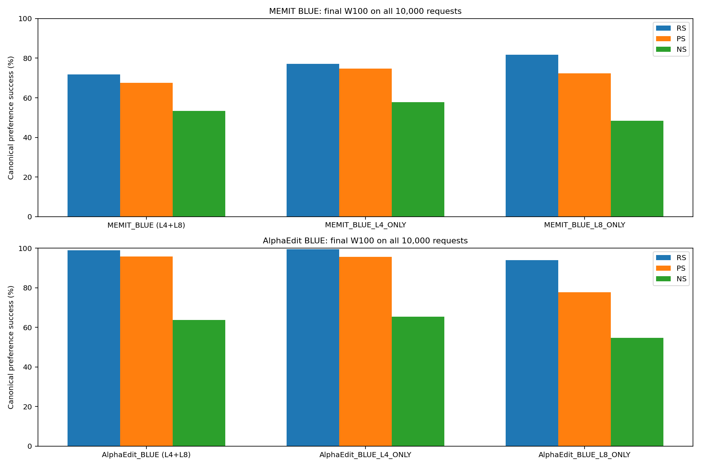
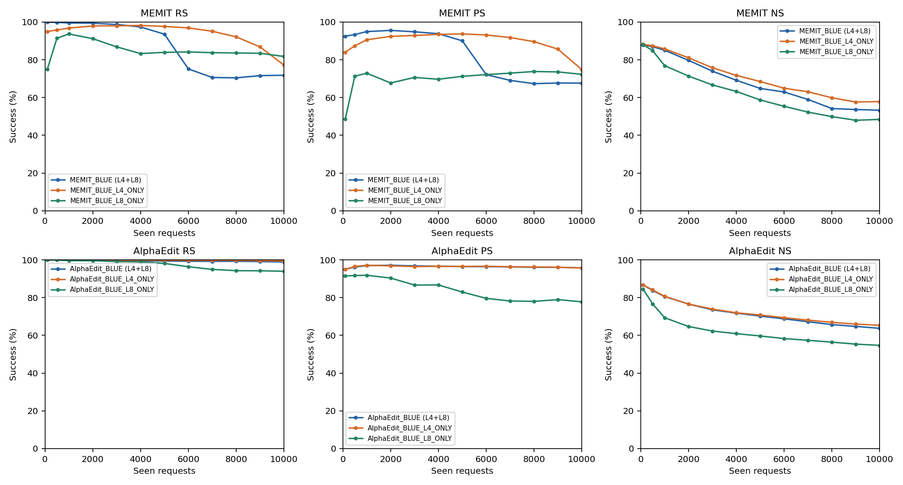
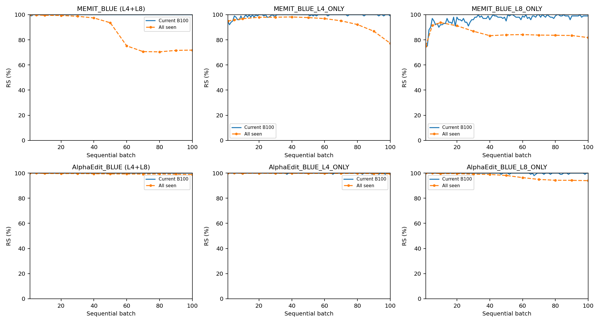
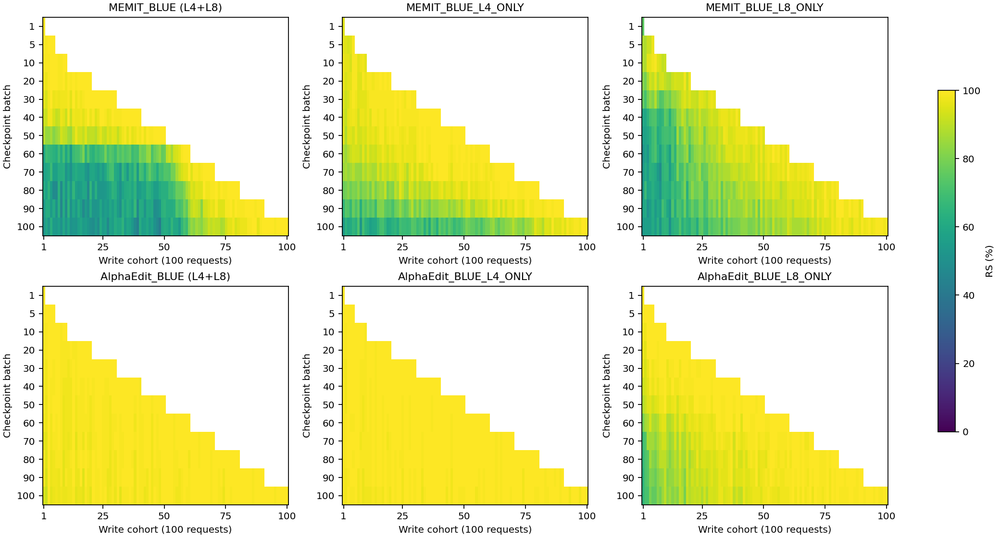
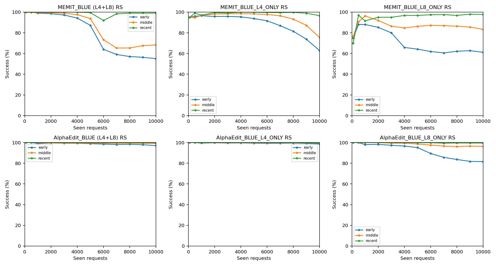
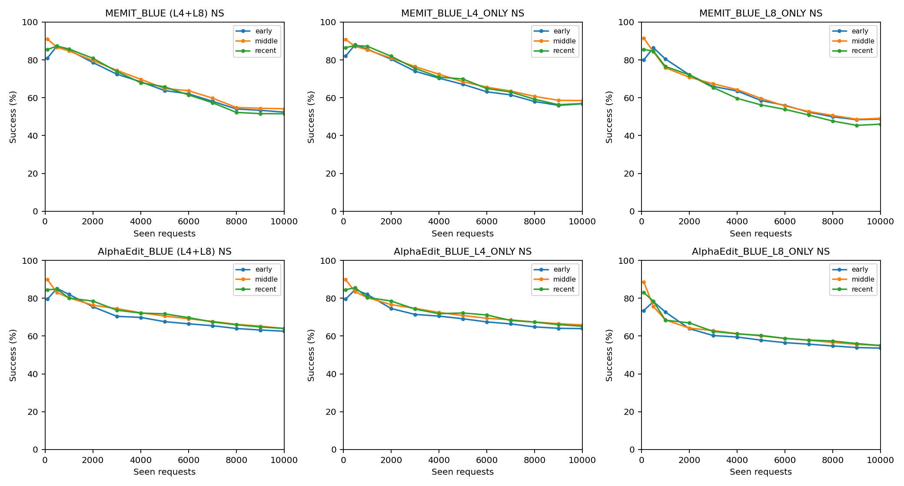
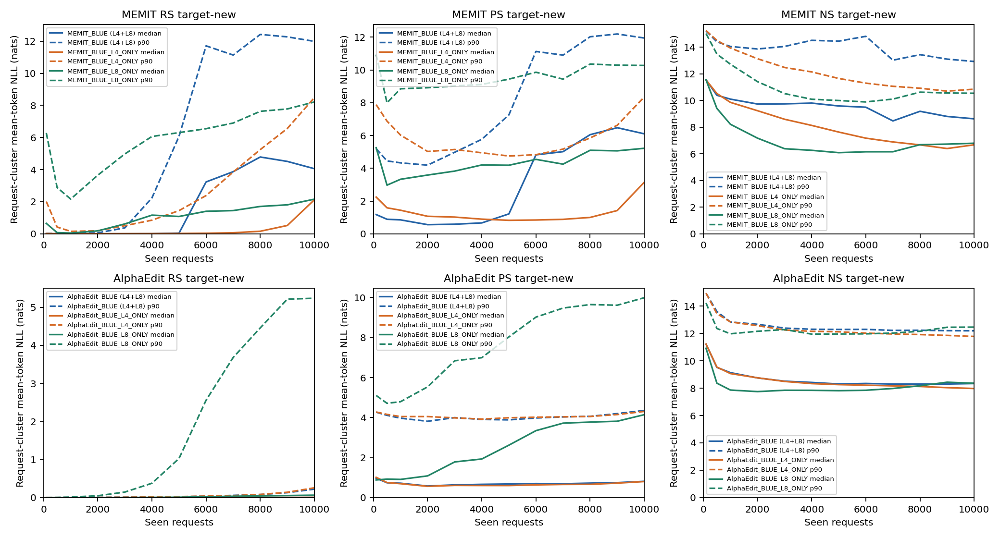
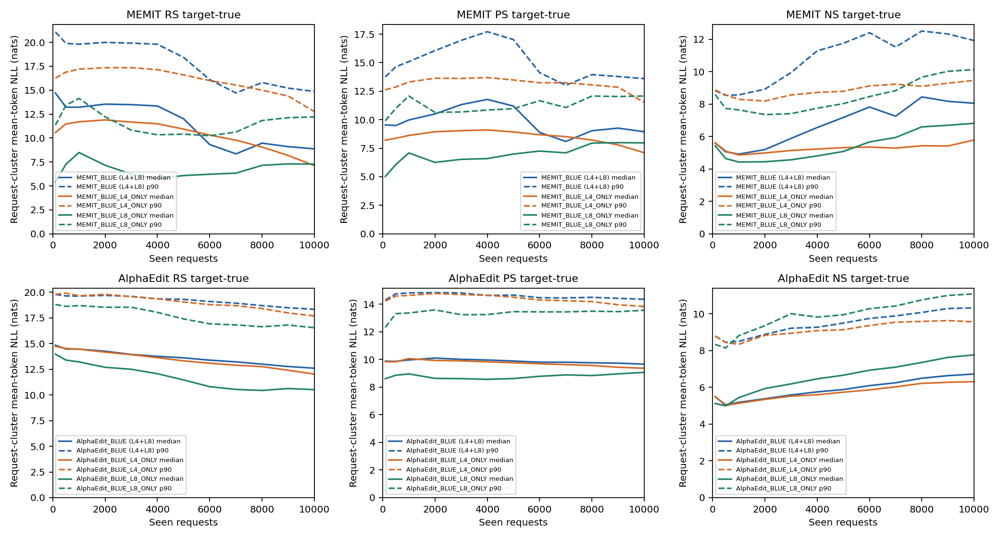
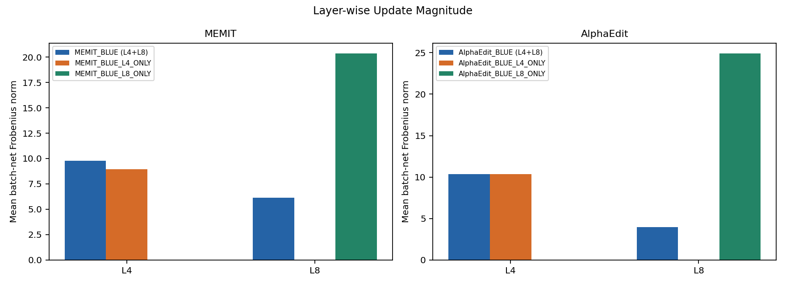
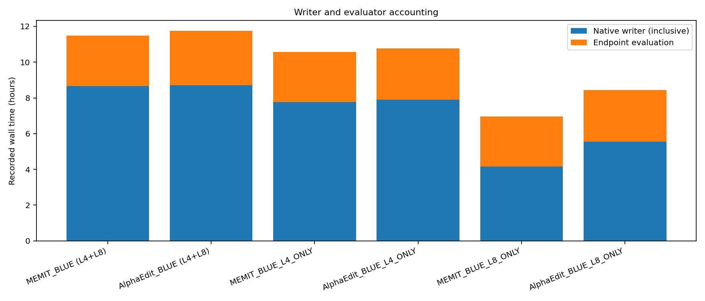

# Llama3 BLUE / L4-only / L8-only lifelong 상세 리뷰 v2 — B100×100

본 v2는 v1의 명칭·계열별 표·base/pre-edit reference 보강본이다. v1 봉인 report SHA `9c2a520d26e3bab27ebac3a6eab01653f5825e2294fd5194a74fe8df3b6bc38d` 및 원본bytes는 보존한다. 모든6chain 측정값·분모·미측정 상태는 불변이며 통계/evaluator 재평가0. scientific_promotion=false.

## 1. 최종 actual W100 full10000 — 계열별 주표
### MEMIT 계열: 최종 W100 full10000

|display_label|status|job|batches|requests|RS|PS|NS|rewrite_TF_exact|rephrase_TF_exact|
|---|---|---|---|---|---|---|---|---|---|
|MEMIT_BLUE (L4+L8)|TERMINAL_VALID|39307|100|10000|7183/10000 (71.830%)|13530/20000 (67.650%)|53287/100000 (53.287%)|3603/10000|4817/20000|
|MEMIT_BLUE_L4_ONLY|TERMINAL_VALID|39283_2|100|10000|7722/10000 (77.220%)|14966/20000 (74.830%)|57848/100000 (57.848%)|4265/10000|7129/20000|
|MEMIT_BLUE_L8_ONLY|TERMINAL_VALID|39283_4|100|10000|8177/10000 (81.770%)|14460/20000 (72.300%)|48425/100000 (48.425%)|4448/10000|4859/20000|
|Base MEMIT|NOT_AVAILABLE|—|—|未測定|NOT_MEASURED|NOT_MEASURED|NOT_MEASURED|NOT_MEASURED|NOT_MEASURED|
|Pre-edit W0 (full10000)|NOT_RECORDED|—|—|未測定|NOT_MEASURED|NOT_MEASURED|NOT_MEASURED|NOT_MEASURED|NOT_MEASURED|

측정된 여섯 arm은 모두 blue=True이며 stock/base MEMIT·AlphaEdit가 아니다. Raw arm ID는 provenance로만 유지한다. RS/PS/NS 단위는 prompt, 분모는 실측10,000/20,000/100,000. Base/W0 공란은 실패0점이 아니라 동일10k 측정 부재다.

#### MEMIT 최종 NLL/secondary reading table

|display_label|category|prompt_n|new_NLL_mean/median/p90/max|true_NLL_mean/median/p90/max|margin_mean/median/p90/max|
|---|---|---|---|---|---|
|MEMIT_BLUE (L4+L8)|RS|10000|5.0508/4.05719/11.9903/29.0823|9.06331/8.87457/14.8672/31.0517|4.0125/3.71554/12.8488/31.0517|
|MEMIT_BLUE (L4+L8)|PS|20000|6.20982/5.983/12.4627/28.9849|9.03751/8.94431/14.1157/29.8303|2.82769/2.47968/10.4091/29.8303|
|MEMIT_BLUE (L4+L8)|NS|100000|8.5205/8.50974/14.3269/36.2497|8.14784/8.03474/13.5529/36.8177|-0.372662/-0.405181/6.06006/25.9879|
|MEMIT_BLUE_L4_ONLY|RS|10000|3.30416/2.12258/8.48914/24.2457|7.50123/7.11726/12.7596/29.375|4.19707/3.8359/11.6723/29.3747|
|MEMIT_BLUE_L4_ONLY|PS|20000|3.80962/2.94023/8.93196/21.1506|7.2699/7.06053/11.9886/26.742|3.46028/3.26195/10.1039/26.7419|
|MEMIT_BLUE_L4_ONLY|NS|100000|6.82351/6.70393/11.8209/29.3549|6.02475/5.75732/10.6537/27.5817|-0.798766/-0.821531/4.89714/20.1218|
|MEMIT_BLUE_L8_ONLY|RS|10000|3.23708/2.15951/8.21431/22.7667|7.59032/7.27881/12.2082/26.5916|4.35324/4.15285/10.584/26.5911|
|MEMIT_BLUE_L8_ONLY|PS|20000|5.42683/5.03125/11.1224/25.395|8.11541/7.87038/12.7632/24.914|2.68858/2.37663/8.58039/23.0926|
|MEMIT_BLUE_L8_ONLY|NS|100000|6.78384/6.68153/11.7236/27.2823|6.99666/6.73831/11.4179/25.9815|0.212819/0.140279/5.21544/18.3067|

NLL은 target token 평균(nats/token), 위 분포는 prompt 단위다. Margin=true−new, NS 성공은 음수. Request-cluster 분포와 모든 strict/token numerator/denominator는 해당 family CSV 및 §7에 별도 보존한다.

### AlphaEdit 계열: 최종 W100 full10000

|display_label|status|job|batches|requests|RS|PS|NS|rewrite_TF_exact|rephrase_TF_exact|
|---|---|---|---|---|---|---|---|---|---|
|AlphaEdit_BLUE (L4+L8)|TERMINAL_VALID|39283_1|100|10000|9888/10000 (98.880%)|19155/20000 (95.775%)|63726/100000 (63.726%)|9465/10000|13229/20000|
|AlphaEdit_BLUE_L4_ONLY|TERMINAL_VALID|39283_3|100|10000|9939/10000 (99.390%)|19136/20000 (95.680%)|65348/100000 (65.348%)|9529/10000|13362/20000|
|AlphaEdit_BLUE_L8_ONLY|TERMINAL_VALID|39283_5|100|10000|9396/10000 (93.960%)|15556/20000 (77.780%)|54703/100000 (54.703%)|7694/10000|6822/20000|
|Official AlphaEdit|NOT_AVAILABLE|—|—|未測定|NOT_MEASURED|NOT_MEASURED|NOT_MEASURED|NOT_MEASURED|NOT_MEASURED|
|Pre-edit W0 (full10000)|NOT_RECORDED|—|—|未測定|NOT_MEASURED|NOT_MEASURED|NOT_MEASURED|NOT_MEASURED|NOT_MEASURED|

측정된 여섯 arm은 모두 blue=True이며 stock/base MEMIT·AlphaEdit가 아니다. Raw arm ID는 provenance로만 유지한다. RS/PS/NS 단위는 prompt, 분모는 실측10,000/20,000/100,000. Base/W0 공란은 실패0점이 아니라 동일10k 측정 부재다.

#### AlphaEdit 최종 NLL/secondary reading table

|display_label|category|prompt_n|new_NLL_mean/median/p90/max|true_NLL_mean/median/p90/max|margin_mean/median/p90/max|
|---|---|---|---|---|---|
|AlphaEdit_BLUE (L4+L8)|RS|10000|0.385338/0.00603726/0.223511/25.8112|12.8039/12.6056/18.3456/30.7008|12.4185/12.4168/18.2815/30.7008|
|AlphaEdit_BLUE (L4+L8)|PS|20000|1.68923/0.42387/5.14432/26.0383|9.864/9.65411/14.8663/29.4422|8.17477/8.16485/14.2573/29.4422|
|AlphaEdit_BLUE (L4+L8)|NS|100000|8.38539/8.38193/13.5949/28.2488|6.90176/6.67822/11.996/30.5053|-1.48363/-1.53331/4.44601/25.0763|
|AlphaEdit_BLUE_L4_ONLY|RS|10000|0.230527/0.00709715/0.258103/15.9023|12.2384/12.0325/17.6988/28.2957|12.0079/11.9627/17.6825/28.2955|
|AlphaEdit_BLUE_L4_ONLY|PS|20000|1.58923/0.41793/5.0549/19.7328|9.50584/9.30126/14.3515/26.3626|7.91661/7.90979/13.8087/26.3548|
|AlphaEdit_BLUE_L4_ONLY|NS|100000|8.0201/8.03193/12.9623/26.5748|6.45812/6.24417/11.2407/26.5519|-1.56198/-1.60519/4.06624/24.5234|
|AlphaEdit_BLUE_L8_ONLY|RS|10000|1.41678/0.0642434/5.2373/22.0135|10.7576/10.5185/16.5481/30.226|9.34086/9.6006/16.324/30.2258|
|AlphaEdit_BLUE_L8_ONLY|PS|20000|4.74138/3.58401/11.3398/26.1894|9.16481/9.0339/14.5012/28.0784|4.42343/4.16052/11.881/28.0782|
|AlphaEdit_BLUE_L8_ONLY|NS|100000|8.36237/8.41576/13.9832/30.6733|7.9222/7.86535/12.9931/28.2488|-0.440169/-0.494811/5.54225/23.4016|

NLL은 target token 평균(nats/token), 위 분포는 prompt 단위다. Margin=true−new, NS 성공은 음수. Request-cluster 분포와 모든 strict/token numerator/denominator는 해당 family CSV 및 §7에 별도 보존한다.
### 기존 base baseline 및 pre-edit 가용성

동일 BLUE10k sample/order에서 측정된 **base MEMIT/Official AlphaEdit final W100**은 감사 범위의 자료에서 찾지 못했다. 동일 full10000 pre-edit도 기록되지 않았다. 이는 전체 서버의 측정 부재를 증명하는 전역 검색 주장이 아니다. 새 evaluator/backfill/replay0.

#### 동일 prefix1k reference — not final10k

|reference|scope|RS|PS|NS|
|---|---|---|---|---|
|Pre-edit W0 (1k)|1k matched-prefix reference; not final10k|71/1000 (7.100%)|227/2000 (11.350%)|8820/10000 (88.200%)|
|Official AlphaEdit (1k)|1k matched-prefix reference; not final10k|1000/1000 (100.000%)|1910/2000 (95.500%)|7584/10000 (75.840%)|
|MEMIT_BLUE (L4+L8)|Lifelong W10 on first1000|995/1000 (99.500%)|1899/2000 (94.950%)|8507/10000 (85.070%)|
|MEMIT_BLUE_L4_ONLY|Lifelong W10 on first1000|968/1000 (96.800%)|1812/2000 (90.600%)|8582/10000 (85.820%)|
|MEMIT_BLUE_L8_ONLY|Lifelong W10 on first1000|937/1000 (93.700%)|1458/2000 (72.900%)|7692/10000 (76.920%)|
|AlphaEdit_BLUE (L4+L8)|Lifelong W10 on first1000|997/1000 (99.700%)|1939/2000 (96.950%)|8057/10000 (80.570%)|
|AlphaEdit_BLUE_L4_ONLY|Lifelong W10 on first1000|998/1000 (99.800%)|1943/2000 (97.150%)|8072/10000 (80.720%)|
|AlphaEdit_BLUE_L8_ONLY|Lifelong W10 on first1000|996/1000 (99.600%)|1837/2000 (91.850%)|6936/10000 (69.360%)|

Pre-edit W0는 편집방법이 아니다. 기존 BLUE 세1k run과 JVP publication의 W0 네행 모두 RS71/1000, PS227/2000, NS8820/10000을 기록했다. 여기서는 중복분모로 합산하지 않고 한 reference행으로 표시한다. 이는 **full1000** 평가이며 full10000 W0로 확대하지 않는다. Official AlphaEdit O_NATIVE는 source77358b1546d1baf83b3e251afcce663b08d7bfd7의 stock5layer reference이며 JVP controller arm이 아니다.

첫1k IDs/order/record·target hashes는 exact다. 그러나 Official vs BLUE의 layer/target 정책, contexts hash, seed(20260906 vs20260907), GPU(A6000 vsBlackwell), tokenizer/backend 정책이 달라 method-only causal comparison이 아니다. 숫자 차이의 원인 또는 모델 byte parity를 주장하지 않는다. Prefix t1000 BLUE 값은 이번lifelong W10이지 final W100의첫cohort평가가 아니다.

#### Historical base10k — 다른 stream / non-paired

|reference|scope|RS|PS|NS|
|---|---|---|---|---|
|Base MEMIT (historical)|HISTORICAL_DIFFERENT_STREAM_NOT_PAIRED|6021/10000 (60.210%)|10981/20000 (54.905%)|49895/100000 (49.895%)|
|Official AlphaEdit (historical)|HISTORICAL_DIFFERENT_STREAM_NOT_PAIRED|6785/10000 (67.850%)|12285/20000 (61.425%)|50918/100000 (50.918%)|

Historical v6는 native MEMIT/AlphaEdit의 다른10000 stream `2951b86dfa829ef38b2fb03551a81dc9ce4f11c779af3f0f0c027224ed65cf7d` / order `f86dfc97f50614d8fe3d7ed929326485ea0b1237151f93d7ed7339bae8979c43`의 **실제 final W100 all10000 canonical NLL pair**다. BLUE10000과 case 교집합4324개지만 order/stream은 다르며 duplicate/collision selection policy도 다르다. 교집합만 골라 성능을 추정하거나 paired Δpp를 만들지 않았다.

과거종단 current-B100/teacher-forced Loc를 재명명한 값이 아니라 v6 보충평가 후 확정된 RS/PS/NS다. Historical LM/LA edit source85a05d0a831db667fc68c27e634302eb30cc7d79, jobs32424/32380; 후속 frozen-state evaluation jobs33306/33539. 이번에는 봉인publication과 작은source/config/sample metadata만 재해시했으며 과거 raw 전체나 GPU state를 다시 검증했다고 주장하지 않는다.

#### Reference compatibility / 검증 수준

|reference|source_head|model_revision|sample_root|config_sha|layers|context_hash|seed|dtype|gpu|comparison|validation|
|---|---|---|---|---|---|---|---|---|---|---|---|
|BLUE pre-edit prefix1k|1075540b45c29269e690ac63aae44758d8d63174|8afb486c1db24fe5011ec46dfbe5b5dccdb575c2|40fe1afb318a4a5da9630425213644a729a1e85fb4e78c18e9a4dcd2870eefdd|c4186ff61c11daaf6f5f6ad3cdc3dbc3b94aec42b4874c4cee9af3648f428275|[4, 8]|cf14b8571136b0413ded1ea8aa283a004ecbddbd818a6a8744b0296b63f72191|20260907|torch.float32|NVIDIA RTX PRO 6000 Blackwell Server Edition|SAME_PREFIX; different context/seed/source/GPU; no method-only causal delta|Published source lock hashes; remote raw not rehashed|
|Official AlphaEdit prefix1k|77358b1546d1baf83b3e251afcce663b08d7bfd7|8afb486c1db24fe5011ec46dfbe5b5dccdb575c2|40fe1afb318a4a5da9630425213644a729a1e85fb4e78c18e9a4dcd2870eefdd|63239e48ea8faf78dfcc40d7d4f5aff3ff0832eb4208384d11f4a812819765c3|[4,5,6,7,8]|bef722a3c30990f06084570a55a8e2056f5d38d7b4d5bd303e7d48de70920611|20260906|model FP32; controller/native metric FP64|NVIDIA RTX A6000|SAME_PREFIX; different context/seed/source/GPU; no method-only causal delta|Published source lock hashes; remote raw not rehashed|
|Historical memit|85a05d0a831db667fc68c27e634302eb30cc7d79|8afb486c1db24fe5011ec46dfbe5b5dccdb575c2|2951b86dfa829ef38b2fb03551a81dc9ce4f11c779af3f0f0c027224ed65cf7d|1c5bccc160493c078de3066313443fe8cc6bc53ec2c61865d64851a10cb80444|[4,5,6,7,8]|NOT_REVERIFIED_FOR_HISTORICAL_REFERENCE|order_seed_index=1; RNG equality NOT_ESTABLISHED|FULL_FP32 model; FP64 scalar reduction|historical runtime backend NOT_REVERIFIED|DIFFERENT_STREAM/ORDER/COLLISION_POLICY/CONFIG; NON_PAIRED; no causal delta|v3/v6 publication + preflight/hparams rehash; no new raw/GPU parity|
|Historical alphaedit|85a05d0a831db667fc68c27e634302eb30cc7d79|8afb486c1db24fe5011ec46dfbe5b5dccdb575c2|2951b86dfa829ef38b2fb03551a81dc9ce4f11c779af3f0f0c027224ed65cf7d|63239e48ea8faf78dfcc40d7d4f5aff3ff0832eb4208384d11f4a812819765c3|[4,5,6,7,8]|NOT_REVERIFIED_FOR_HISTORICAL_REFERENCE|order_seed_index=1; RNG equality NOT_ESTABLISHED|FULL_FP32 model; FP64 scalar reduction|historical runtime backend NOT_REVERIFIED|DIFFERENT_STREAM/ORDER/COLLISION_POLICY/CONFIG; NON_PAIRED; no causal delta|v3/v6 publication + preflight/hparams rehash; no new raw/GPU parity|

상세 source/input path·SHA는 reference-input-inventory.csv, search 범위와 미측정 상태는 baseline-availability-audit.json 및 baseline-availability.csv. 원본v1의 raw/state audit는 그대로 계승하되 이번 revision의 검증 수준과 구분한다.


## 2. Metric glossary / 읽는 방법

|지표|정의·집계·방향|
|---|---|
|RS|rewrite prompt에서 target-new의 평균 target-token NLL < target-true NLL. 1 prompt/request. 높을수록 해당 요청의 새 target 선호가 많다.|
|PS|각 rephrase prompt의 new NLL < true NLL. 2 prompts/request의 prompt별 판정; 두 prompt NLL을 먼저 평균한 판정 아님.|
|NS|각 neighborhood prompt의 true NLL < new NLL. 10 prompts/request. target-true top-1 보존 정확도와 다르다.|
|Tie|strict <만 성공. 두 NLL이 같으면 실패. tie 횟수는 metric CSV에 보존.|
|NLL|target token의 −log p를 token 길이로 평균, 단위 nats/token. 낮으면 해당 target의 예측확률이 높다. new/true를 분리하며 true NLL 저하가 편집 성공을 의미하지 않는다.|
|Margin|모든 category에서 true NLL−new NLL. 양수는 new 선호(RS/PS 성공), 음수는 true 선호(NS 성공). NS도 임의 부호 반전하지 않았다.|
|TF exact / strict|teacher forcing하에서 모든 target token이 top-1로 맞으면 해당 prompt true. primary success가 아님. `new_strict_num/den`, `true_strict_num/den`.|
|Token accuracy|teacher-forced correct token count / actual target-token count. prompt exact와 집계단위가 다름.|
|Request pair-strict|한 request의 모든 해당 category prompt가 canonical preference 성공. PS는2개, NS는10개. Primary prompt PS/NS와 구분.|
|Prompt vs request-cluster|prompt-level은 각 prompt NLL; request-cluster는 request 내 prompt NLL부터 평균하고 request별 분포를 계산. 모든 분포의 n, mean, median, q25/q75(IQR), p90, max는 CSV에 있다.|
|Current B100|편집 직후 W_k에서 그 batch100개만 평가. 누적 seen-prefix 성능과 다름.|
|All-seen cumulative|고정된 W_k에서 first100*k 요청 전체를 평가. k={1,5,10,20,...,100}만 저장. 연결선은 미기록시점 추정치가 아님.|
|Online-at-write|각 request가 처음 쓰인 서로 다른 W의 결과를 합친 것. 최종 W 성능 아님.|
|Loss/recovery|동일 prompt identity의 before 성공→after 실패 / before 실패→after 성공. conditional loss의 분모는 before 성공 수. 평가 사이 중간 경로는 모름.|
|Layer-wise Update Magnitude|실제 batch-entry 대비 endpoint의 ||ΔW_l||_F. 단위 weight norm. Share=해당 norm/선택 layer norm 합. squared norm과 다름.|
|Path/net|Σbatch ||ΔW_l,b||는 batch-net 길이 합이지 native 내부 trajectory 길이나 ||W100−W0||와 같지 않다. checkpoint interval net은 실제 저장된 두 checkpoint 차이.|
|Native z/residual|BLUE는 선택 layer마다 current W에서 z를 재최적화. log의 z error는 해당 layer write 전 ||z−h|| 평균(반올림 scalar). post-write realization ratio/rho/tau나 JVP fixed-L8 potential로 부를 수 없다.|
|History/state|AlphaEdit은 선택 layer별 dense cache M 누적. MEMIT은 static covariance computation cache만 있고 임의 lifelong history는 없다.|

현재6chain의 W0 전체10k 성능은 NOT_RECORDED다. 이전1k W0 점수를 이번10k의 W0 reference로 대입하지 않는다. Fixed sentinel 별도패널도 기록되지 않았다.

## 3. Provenance / 설정 / 실행 의미

**MEMIT 계열**

|arm|job|source_archive_sha256|config_sha256|model_revision|layers|z_steps|z_lr|z_decay|loss_layer|clamp|native_regularizer|
|---|---|---|---|---|---|---|---|---|---|---|---|
|MEMIT_BLUE (L4+L8)|39307|cc834a23144f6ac23d2e3f23841405194485e4f4536c0911315676ff06ff4f48|d6fe2d318b5ce5d5ac7040d2dbc9196dfeae3a596ad4c3886e10990e56eddf7b|8afb486c1db24fe5011ec46dfbe5b5dccdb575c2|[4, 8]|25|0.1|0.5|31|0.75|15000|
|MEMIT_BLUE_L4_ONLY|39283_2|6cb448801ae2136f627a7c5390e2d042b2dd8456eb01e183d064f1bd5eeed2af|15908e0ff7233e9895376d87eddc36dcd116749b1800a399aa9b65e2b1f07a7f|8afb486c1db24fe5011ec46dfbe5b5dccdb575c2|[4]|25|0.1|0.5|31|0.75|15000|
|MEMIT_BLUE_L8_ONLY|39283_4|6cb448801ae2136f627a7c5390e2d042b2dd8456eb01e183d064f1bd5eeed2af|9007d4ffdb14376dab8ef4388e2b6bdaf35053cbc9f55725641fb10c33a0f1d1|8afb486c1db24fe5011ec46dfbe5b5dccdb575c2|[8]|25|0.1|0.5|31|0.75|15000|

측정된 여섯 arm은 모두 blue=True이며 stock/base MEMIT·AlphaEdit가 아니다. Raw arm ID는 provenance로만 유지한다.

**AlphaEdit 계열**

|arm|job|source_archive_sha256|config_sha256|model_revision|layers|z_steps|z_lr|z_decay|loss_layer|clamp|native_regularizer|
|---|---|---|---|---|---|---|---|---|---|---|---|
|AlphaEdit_BLUE (L4+L8)|39283_1|6cb448801ae2136f627a7c5390e2d042b2dd8456eb01e183d064f1bd5eeed2af|588603990aa1234e62dd9c47f8449be60ba396358d9c0930c2ea3453606b24c4|8afb486c1db24fe5011ec46dfbe5b5dccdb575c2|[4, 8]|25|0.1|0.5|31|0.75|1|
|AlphaEdit_BLUE_L4_ONLY|39283_3|6cb448801ae2136f627a7c5390e2d042b2dd8456eb01e183d064f1bd5eeed2af|2392ab8392476ed019985e4292a8c0aa2a3957f36a06a704eb7590e8e8c99c5d|8afb486c1db24fe5011ec46dfbe5b5dccdb575c2|[4]|25|0.1|0.5|31|0.75|1|
|AlphaEdit_BLUE_L8_ONLY|39283_5|6cb448801ae2136f627a7c5390e2d042b2dd8456eb01e183d064f1bd5eeed2af|753a762b333edaf770585b6ebbeea7ca71f4bc881683ac7aa00950fe7a23f55d|8afb486c1db24fe5011ec46dfbe5b5dccdb575c2|[8]|25|0.1|0.5|31|0.75|1|

측정된 여섯 arm은 모두 blue=True이며 stock/base MEMIT·AlphaEdit가 아니다. Raw arm ID는 provenance로만 유지한다.

BLUE source HEAD311b076a92e4ed0f14f5c8b4909732da781bc5f7/tree f3c933c31cba2fe979c5c34546a99a72e6beb763. ODE helper1075540b45c29269e690ac63aae44758d8d63174/tree172b6b9b5c0de4e3aa9e94a05920edaa84a2b323. 실제 실행은 별도 local lifelong modules+archive이며 tracked BLUE 또는 예전 L4/L8 local hook을 변경하지 않았다. 동일 method내 layers 외 config 차이0을 원본 JSON과 대조했다. Source/member/path 전체는 source-member-inventory.csv, source-config-compatibility.csv, source-findings.csv에 있다.

모든 run은 Llama3-8B-Instruct revision8afb486c1db24fe5011ec46dfbe5b5dccdb575c2, NVIDIA RTX PRO6000 Blackwell Server Edition, torch2.9.1+cu128, transformers4.44.2, eager attention. Model parameters FP32 inventory8,030,261,248 elements/291 tensors, autocast=False, TF32 matmul=False, cudnn=True. MEMIT native solve FP64와 AlphaEdit native FP32 정책을 구분한다. 저장 FP32 및 runtime assertion을 확인했으며 GPU 내부 모든 연산을 새로 추적하지 않았다. Writer/evaluator의 tokenizer.padding_side 속성은 **right**, pad=eos128009지만 실제 evaluator는 tensor를 **수동 left padding**하고 attention_mask/target offset을 구성한다. position_ids는 명시 인자로 전달하지 않아 native model 기본 경로를 쓴다. Writer add_bos_token=False, evaluator 해당 속성 NOT_EXPOSED. 이번 감사에서 새 GPU padding/parity 검사는 실행하지 않았다. Dataset의 prompt/target string→실제 scalar row identity를 672개 current/full 평가 파일에 대해 독립 대조했다.

|method|계산·state 의미|
|---|---|
|MEMIT_BLUE|각 layer에서 current-W native z, K, residual R를 계산. B=(λ C+KKᵀ)^−1K, ΔW=R Bᵀ(물리 shape [4096,14336]). BLUE는 full residual(divisor1). execute에서 일시 적용→entry 복원 후 apply가 ΔW를 실제 materialize; runner는 반환된 actual endpoint를 평가·commit.|
|AlphaEdit_BLUE|각 layer마다 native z와 R 재계산. physical P로 projected closed-form solve [P(KKᵀ+M)+L2 I]X=PKRᵀ, transpose orientation 적용. terminal selected-layer key로 M append1 pass/batch. Pstack L4..L8에서 BLUE (L4+L8)[0,4], L4[0], L8[4] 추출을 CPU tensor hash로 확인.|
|Single layer|layers만[4] 또는[8]; z target/optimization layer도 해당 layer로 바뀐다. 반복 JV/Euler/controller/substep0. 단순히 같은 target에서 support만 바꾼 비교가 아님.|

표본은 unique10,000, sample root `5b01356928ad2e2e46effad5a2c5621c87746b610992b7b92bf3ace16b6f5729`. 첫1,000 root `40fe1afb318a4a5da9630425213644a729a1e85fb4e78c18e9a4dcd2870eefdd`를 보존했고 이후9,000은 metadata SHA-order selection이다. 125개 repeated subject-relation group은 교체·삭제하지 않았다. 상충 target의 후속 요청 여부는 overwrite-strata.csv에 따로 표시하되 관측된 망각의 원인으로 확정하지 않는다.

### 3.1 상태/저장 검산

**MEMIT 계열**

|arm|batches|requests|checkpoints|W_links|history_links|compute_z|solve_calls|history_append_passes|context_sha256|
|---|---|---|---|---|---|---|---|---|---|
|MEMIT_BLUE (L4+L8)|100|10000|12|99|NOT_APPLICABLE_STATIC_COV|20000|200|0|cf14b8571136b0413ded1ea8aa283a004ecbddbd818a6a8744b0296b63f72191|
|MEMIT_BLUE_L4_ONLY|100|10000|12|99|NOT_APPLICABLE_STATIC_COV|10000|100|0|cf14b8571136b0413ded1ea8aa283a004ecbddbd818a6a8744b0296b63f72191|
|MEMIT_BLUE_L8_ONLY|100|10000|12|99|NOT_APPLICABLE_STATIC_COV|10000|100|0|cf14b8571136b0413ded1ea8aa283a004ecbddbd818a6a8744b0296b63f72191|

측정된 여섯 arm은 모두 blue=True이며 stock/base MEMIT·AlphaEdit가 아니다. Raw arm ID는 provenance로만 유지한다.

**AlphaEdit 계열**

|arm|batches|requests|checkpoints|W_links|history_links|compute_z|solve_calls|history_append_passes|context_sha256|
|---|---|---|---|---|---|---|---|---|---|
|AlphaEdit_BLUE (L4+L8)|100|10000|12|99|99|20000|200|100|cf14b8571136b0413ded1ea8aa283a004ecbddbd818a6a8744b0296b63f72191|
|AlphaEdit_BLUE_L4_ONLY|100|10000|12|99|99|10000|100|100|cf14b8571136b0413ded1ea8aa283a004ecbddbd818a6a8744b0296b63f72191|
|AlphaEdit_BLUE_L8_ONLY|100|10000|12|99|99|10000|100|100|cf14b8571136b0413ded1ea8aa283a004ecbddbd818a6a8744b0296b63f72191|

측정된 여섯 arm은 모두 blue=True이며 stock/base MEMIT·AlphaEdit가 아니다. Raw arm ID는 provenance로만 유지한다.

선택 W와 Alpha history의 entry→commit→next-entry99 links/cell. BLUE (L4+L8) compute_z20,000/solve200, single10,000/100. Alpha append100, MEMIT0. Chain cold reset1, runtime terminal W0/cache byte·pointer restore assertion true. **nonselected weight는 pointer/version 보존을 기록했으나 전체 byte 해시는 기록하지 않았다.** 최종 version restore는 주장하지 않으며 evaluator 전후 version exact와 혼동하지 않는다. Hash/shape PASS를 방법의 과학적 정상성 또는 효과 증명으로 사용하지 않는다.

12 checkpoints는 BLUE (L4+L8)에서 L4+L8 두 weight, single에서 한 weight를 실제 저장했다. Alpha는 모든 selected M tensor, MEMIT은 empty sentinel+static NPZ identity. Context/RNG(Python/NumPy/torch/CUDA)/base/config/sample binding 존재, CPU weights_only reload/hash/finite 확인. Full base model 중복저장0. GPU continuation replay0이며 비선택 base tensor의 immutable 참조가 필요하다. 구체 key/shape/SHA는 checkpoint-tensors.csv의96 layer-checkpoint행에 있다.

## 4. Checkpoint actual-W all-seen 누적 성능




### MEMIT 계열
#### MEMIT_BLUE (L4+L8)

|batch|seen_requests|RS|PS|NS|
|---|---|---|---|---|
|1|100|100/100 (100.000%)|185/200 (92.500%)|879/1000 (87.900%)|
|5|500|499/500 (99.800%)|934/1000 (93.400%)|4347/5000 (86.940%)|
|10|1000|995/1000 (99.500%)|1899/2000 (94.950%)|8507/10000 (85.070%)|
|20|2000|1988/2000 (99.400%)|3823/4000 (95.575%)|15943/20000 (79.715%)|
|30|3000|2962/3000 (98.733%)|5690/6000 (94.833%)|22196/30000 (73.987%)|
|40|4000|3896/4000 (97.400%)|7506/8000 (93.825%)|27664/40000 (69.160%)|
|50|5000|4679/5000 (93.580%)|9005/10000 (90.050%)|32416/50000 (64.832%)|
|60|6000|4511/6000 (75.183%)|8656/12000 (72.133%)|37773/60000 (62.955%)|
|70|7000|4944/7000 (70.629%)|9673/14000 (69.093%)|41283/70000 (58.976%)|
|80|8000|5635/8000 (70.438%)|10777/16000 (67.356%)|43342/80000 (54.178%)|
|90|9000|6444/9000 (71.600%)|12186/18000 (67.700%)|48285/90000 (53.650%)|
|100|10000|7183/10000 (71.830%)|13530/20000 (67.650%)|53287/100000 (53.287%)|

RS: 1k→10k 99.500%→71.830% (-27.670pp). 저장된 연속 checkpoint 중 최대 감소는 B50→B60 -18.397pp, 최대 변화(증가가 없으면 가장 작은 감소)는 B80→B90 +1.162pp. Seen-prefix 분모도 함께 증가하므로 동일 고정 cohort의 인과효과가 아니다.

PS: 1k→10k 94.950%→67.650% (-27.300pp). 저장된 연속 checkpoint 중 최대 감소는 B50→B60 -17.917pp, 최대 변화(증가가 없으면 가장 작은 감소)는 B5→B10 +1.550pp. Seen-prefix 분모도 함께 증가하므로 동일 고정 cohort의 인과효과가 아니다.

NS: 1k→10k 85.070%→53.287% (-31.783pp). 저장된 연속 checkpoint 중 최대 감소는 B20→B30 -5.728pp, 최대 변화(증가가 없으면 가장 작은 감소)는 B90→B100 -0.363pp. Seen-prefix 분모도 함께 증가하므로 동일 고정 cohort의 인과효과가 아니다.

#### MEMIT_BLUE_L4_ONLY

|batch|seen_requests|RS|PS|NS|
|---|---|---|---|---|
|1|100|95/100 (95.000%)|168/200 (84.000%)|882/1000 (88.200%)|
|5|500|479/500 (95.800%)|874/1000 (87.400%)|4371/5000 (87.420%)|
|10|1000|968/1000 (96.800%)|1812/2000 (90.600%)|8582/10000 (85.820%)|
|20|2000|1959/2000 (97.950%)|3696/4000 (92.400%)|16213/20000 (81.065%)|
|30|3000|2940/3000 (98.000%)|5574/6000 (92.900%)|22742/30000 (75.807%)|
|40|4000|3928/4000 (98.200%)|7477/8000 (93.463%)|28696/40000 (71.740%)|
|50|5000|4885/5000 (97.700%)|9371/10000 (93.710%)|34251/50000 (68.502%)|
|60|6000|5814/6000 (96.900%)|11179/12000 (93.158%)|38977/60000 (64.962%)|
|70|7000|6659/7000 (95.129%)|12854/14000 (91.814%)|44139/70000 (63.056%)|
|80|8000|7372/8000 (92.150%)|14338/16000 (89.612%)|47897/80000 (59.871%)|
|90|9000|7814/9000 (86.822%)|15419/18000 (85.661%)|51877/90000 (57.641%)|
|100|10000|7722/10000 (77.220%)|14966/20000 (74.830%)|57848/100000 (57.848%)|

RS: 1k→10k 96.800%→77.220% (-19.580pp). 저장된 연속 checkpoint 중 최대 감소는 B90→B100 -9.602pp, 최대 변화(증가가 없으면 가장 작은 감소)는 B10→B20 +1.150pp. Seen-prefix 분모도 함께 증가하므로 동일 고정 cohort의 인과효과가 아니다.

PS: 1k→10k 90.600%→74.830% (-15.770pp). 저장된 연속 checkpoint 중 최대 감소는 B90→B100 -10.831pp, 최대 변화(증가가 없으면 가장 작은 감소)는 B1→B5 +3.400pp. Seen-prefix 분모도 함께 증가하므로 동일 고정 cohort의 인과효과가 아니다.

NS: 1k→10k 85.820%→57.848% (-27.972pp). 저장된 연속 checkpoint 중 최대 감소는 B20→B30 -5.258pp, 최대 변화(증가가 없으면 가장 작은 감소)는 B90→B100 +0.207pp. Seen-prefix 분모도 함께 증가하므로 동일 고정 cohort의 인과효과가 아니다.

#### MEMIT_BLUE_L8_ONLY

|batch|seen_requests|RS|PS|NS|
|---|---|---|---|---|
|1|100|75/100 (75.000%)|97/200 (48.500%)|880/1000 (88.000%)|
|5|500|457/500 (91.400%)|713/1000 (71.300%)|4242/5000 (84.840%)|
|10|1000|937/1000 (93.700%)|1458/2000 (72.900%)|7692/10000 (76.920%)|
|20|2000|1824/2000 (91.200%)|2709/4000 (67.725%)|14275/20000 (71.375%)|
|30|3000|2606/3000 (86.867%)|4240/6000 (70.667%)|20011/30000 (66.703%)|
|40|4000|3332/4000 (83.300%)|5575/8000 (69.688%)|25294/40000 (63.235%)|
|50|5000|4198/5000 (83.960%)|7125/10000 (71.250%)|29364/50000 (58.728%)|
|60|6000|5050/6000 (84.167%)|8657/12000 (72.142%)|33218/60000 (55.363%)|
|70|7000|5865/7000 (83.786%)|10211/14000 (72.936%)|36600/70000 (52.286%)|
|80|8000|6690/8000 (83.625%)|11808/16000 (73.800%)|39917/80000 (49.896%)|
|90|9000|7511/9000 (83.456%)|13246/18000 (73.589%)|43157/90000 (47.952%)|
|100|10000|8177/10000 (81.770%)|14460/20000 (72.300%)|48425/100000 (48.425%)|

RS: 1k→10k 93.700%→81.770% (-11.930pp). 저장된 연속 checkpoint 중 최대 감소는 B20→B30 -4.333pp, 최대 변화(증가가 없으면 가장 작은 감소)는 B1→B5 +16.400pp. Seen-prefix 분모도 함께 증가하므로 동일 고정 cohort의 인과효과가 아니다.

PS: 1k→10k 72.900%→72.300% (-0.600pp). 저장된 연속 checkpoint 중 최대 감소는 B10→B20 -5.175pp, 최대 변화(증가가 없으면 가장 작은 감소)는 B1→B5 +22.800pp. Seen-prefix 분모도 함께 증가하므로 동일 고정 cohort의 인과효과가 아니다.

NS: 1k→10k 76.920%→48.425% (-28.495pp). 저장된 연속 checkpoint 중 최대 감소는 B5→B10 -7.920pp, 최대 변화(증가가 없으면 가장 작은 감소)는 B90→B100 +0.473pp. Seen-prefix 분모도 함께 증가하므로 동일 고정 cohort의 인과효과가 아니다.


### AlphaEdit 계열
#### AlphaEdit_BLUE (L4+L8)

|batch|seen_requests|RS|PS|NS|
|---|---|---|---|---|
|1|100|100/100 (100.000%)|190/200 (95.000%)|867/1000 (86.700%)|
|5|500|500/500 (100.000%)|962/1000 (96.200%)|4190/5000 (83.800%)|
|10|1000|997/1000 (99.700%)|1939/2000 (96.950%)|8057/10000 (80.570%)|
|20|2000|1992/2000 (99.600%)|3886/4000 (97.150%)|15317/20000 (76.585%)|
|30|3000|2989/3000 (99.633%)|5809/6000 (96.817%)|22066/30000 (73.553%)|
|40|4000|3978/4000 (99.450%)|7732/8000 (96.650%)|28720/40000 (71.800%)|
|50|5000|4968/5000 (99.360%)|9643/10000 (96.430%)|35110/50000 (70.220%)|
|60|6000|5956/6000 (99.267%)|11572/12000 (96.433%)|41244/60000 (68.740%)|
|70|7000|6945/7000 (99.214%)|13478/14000 (96.271%)|47073/70000 (67.247%)|
|80|8000|7941/8000 (99.263%)|15375/16000 (96.094%)|52563/80000 (65.704%)|
|90|9000|8919/9000 (99.100%)|17290/18000 (96.056%)|58275/90000 (64.750%)|
|100|10000|9888/10000 (98.880%)|19155/20000 (95.775%)|63726/100000 (63.726%)|

RS: 1k→10k 99.700%→98.880% (-0.820pp). 저장된 연속 checkpoint 중 최대 감소는 B5→B10 -0.300pp, 최대 변화(증가가 없으면 가장 작은 감소)는 B70→B80 +0.048pp. Seen-prefix 분모도 함께 증가하므로 동일 고정 cohort의 인과효과가 아니다.

PS: 1k→10k 96.950%→95.775% (-1.175pp). 저장된 연속 checkpoint 중 최대 감소는 B20→B30 -0.333pp, 최대 변화(증가가 없으면 가장 작은 감소)는 B1→B5 +1.200pp. Seen-prefix 분모도 함께 증가하므로 동일 고정 cohort의 인과효과가 아니다.

NS: 1k→10k 80.570%→63.726% (-16.844pp). 저장된 연속 checkpoint 중 최대 감소는 B10→B20 -3.985pp, 최대 변화(증가가 없으면 가장 작은 감소)는 B80→B90 -0.954pp. Seen-prefix 분모도 함께 증가하므로 동일 고정 cohort의 인과효과가 아니다.

#### AlphaEdit_BLUE_L4_ONLY

|batch|seen_requests|RS|PS|NS|
|---|---|---|---|---|
|1|100|100/100 (100.000%)|190/200 (95.000%)|867/1000 (86.700%)|
|5|500|500/500 (100.000%)|965/1000 (96.500%)|4205/5000 (84.100%)|
|10|1000|998/1000 (99.800%)|1943/2000 (97.150%)|8072/10000 (80.720%)|
|20|2000|1997/2000 (99.850%)|3873/4000 (96.825%)|15318/20000 (76.590%)|
|30|3000|2993/3000 (99.767%)|5787/6000 (96.450%)|22181/30000 (73.937%)|
|40|4000|3993/4000 (99.825%)|7728/8000 (96.600%)|28784/40000 (71.960%)|
|50|5000|4988/5000 (99.760%)|9654/10000 (96.540%)|35406/50000 (70.812%)|
|60|6000|5984/6000 (99.733%)|11596/12000 (96.633%)|41621/60000 (69.368%)|
|70|7000|6981/7000 (99.729%)|13492/14000 (96.371%)|47659/70000 (68.084%)|
|80|8000|7981/8000 (99.763%)|15406/16000 (96.288%)|53521/80000 (66.901%)|
|90|9000|8964/9000 (99.600%)|17301/18000 (96.117%)|59364/90000 (65.960%)|
|100|10000|9939/10000 (99.390%)|19136/20000 (95.680%)|65348/100000 (65.348%)|

RS: 1k→10k 99.800%→99.390% (-0.410pp). 저장된 연속 checkpoint 중 최대 감소는 B90→B100 -0.210pp, 최대 변화(증가가 없으면 가장 작은 감소)는 B30→B40 +0.058pp. Seen-prefix 분모도 함께 증가하므로 동일 고정 cohort의 인과효과가 아니다.

PS: 1k→10k 97.150%→95.680% (-1.470pp). 저장된 연속 checkpoint 중 최대 감소는 B90→B100 -0.437pp, 최대 변화(증가가 없으면 가장 작은 감소)는 B1→B5 +1.500pp. Seen-prefix 분모도 함께 증가하므로 동일 고정 cohort의 인과효과가 아니다.

NS: 1k→10k 80.720%→65.348% (-15.372pp). 저장된 연속 checkpoint 중 최대 감소는 B10→B20 -4.130pp, 최대 변화(증가가 없으면 가장 작은 감소)는 B90→B100 -0.612pp. Seen-prefix 분모도 함께 증가하므로 동일 고정 cohort의 인과효과가 아니다.

#### AlphaEdit_BLUE_L8_ONLY

|batch|seen_requests|RS|PS|NS|
|---|---|---|---|---|
|1|100|100/100 (100.000%)|183/200 (91.500%)|845/1000 (84.500%)|
|5|500|500/500 (100.000%)|917/1000 (91.700%)|3835/5000 (76.700%)|
|10|1000|996/1000 (99.600%)|1837/2000 (91.850%)|6936/10000 (69.360%)|
|20|2000|1992/2000 (99.600%)|3615/4000 (90.375%)|12941/20000 (64.705%)|
|30|3000|2973/3000 (99.100%)|5200/6000 (86.667%)|18684/30000 (62.280%)|
|40|4000|3957/4000 (98.925%)|6937/8000 (86.713%)|24364/40000 (60.910%)|
|50|5000|4906/5000 (98.120%)|8296/10000 (82.960%)|29844/50000 (59.688%)|
|60|6000|5783/6000 (96.383%)|9554/12000 (79.617%)|34984/60000 (58.307%)|
|70|7000|6646/7000 (94.943%)|10950/14000 (78.214%)|40177/70000 (57.396%)|
|80|8000|7543/8000 (94.288%)|12484/16000 (78.025%)|45121/80000 (56.401%)|
|90|9000|8480/9000 (94.222%)|14212/18000 (78.956%)|49834/90000 (55.371%)|
|100|10000|9396/10000 (93.960%)|15556/20000 (77.780%)|54703/100000 (54.703%)|

RS: 1k→10k 99.600%→93.960% (-5.640pp). 저장된 연속 checkpoint 중 최대 감소는 B50→B60 -1.737pp, 최대 변화(증가가 없으면 가장 작은 감소)는 B1→B5 +0.000pp. Seen-prefix 분모도 함께 증가하므로 동일 고정 cohort의 인과효과가 아니다.

PS: 1k→10k 91.850%→77.780% (-14.070pp). 저장된 연속 checkpoint 중 최대 감소는 B40→B50 -3.753pp, 최대 변화(증가가 없으면 가장 작은 감소)는 B80→B90 +0.931pp. Seen-prefix 분모도 함께 증가하므로 동일 고정 cohort의 인과효과가 아니다.

NS: 1k→10k 69.360%→54.703% (-14.657pp). 저장된 연속 checkpoint 중 최대 감소는 B1→B5 -7.800pp, 최대 변화(증가가 없으면 가장 작은 감소)는 B90→B100 -0.668pp. Seen-prefix 분모도 함께 증가하므로 동일 고정 cohort의 인과효과가 아니다.

## 5. Current efficacy와 과거 요청의 loss/recovery 분리






### MEMIT 계열
#### MEMIT_BLUE (L4+L8)

|metric|denominator|before_num|retained|lost|gained|both_failed|after_num|conditional_loss_den|conditional_loss_rate|
|---|---|---|---|---|---|---|---|---|---|
|RS|10000|9999|7183|2816|0|1|7183|9999|0.2816281628162816|
|PS|20000|19327|13285|6042|245|428|13530|19327|0.3126196512650696|
|NS|100000|64861|42503|22358|10784|24355|53287|64861|0.3447063720880036|

RS at-write 9999/10000에서 final 7183/10000. 처음 성공했다가 최종 실패한 요청 2816, 처음 실패했으나 최종 회복한 요청 0. Current RS 최저 batch B2=99/100 (99.000%); 첫 current failure 관측은 B2=99/100 (99.000%). 이것은 사전 scientific failure threshold가 아닌 기술적 표산술이다.

#### MEMIT_BLUE_L4_ONLY

|metric|denominator|before_num|retained|lost|gained|both_failed|after_num|conditional_loss_den|conditional_loss_rate|
|---|---|---|---|---|---|---|---|---|---|
|RS|10000|9934|7701|2233|21|45|7722|9934|0.2247835715723777|
|PS|20000|18959|14665|4294|301|740|14966|18959|0.22648873885753468|
|NS|100000|69438|49615|19823|8233|22329|57848|69438|0.2854776923298482|

RS at-write 9934/10000에서 final 7722/10000. 처음 성공했다가 최종 실패한 요청 2233, 처음 실패했으나 최종 회복한 요청 21. Current RS 최저 batch B2=92/100 (92.000%); 첫 current failure 관측은 B1=95/100 (95.000%). 이것은 사전 scientific failure threshold가 아닌 기술적 표산술이다.

#### MEMIT_BLUE_L8_ONLY

|metric|denominator|before_num|retained|lost|gained|both_failed|after_num|conditional_loss_den|conditional_loss_rate|
|---|---|---|---|---|---|---|---|---|---|
|RS|10000|9676|8034|1642|143|181|8177|9676|0.16969822240595286|
|PS|20000|17427|13486|3941|974|1599|14460|17427|0.2261433407930223|
|NS|100000|56990|37348|19642|11077|31933|48425|56990|0.34465695736094054|

RS at-write 9676/10000에서 final 8177/10000. 처음 성공했다가 최종 실패한 요청 1642, 처음 실패했으나 최종 회복한 요청 143. Current RS 최저 batch B1=75/100 (75.000%); 첫 current failure 관측은 B1=75/100 (75.000%). 이것은 사전 scientific failure threshold가 아닌 기술적 표산술이다.


### AlphaEdit 계열
#### AlphaEdit_BLUE (L4+L8)

|metric|denominator|before_num|retained|lost|gained|both_failed|after_num|conditional_loss_den|conditional_loss_rate|
|---|---|---|---|---|---|---|---|---|---|
|RS|10000|9999|9888|111|0|1|9888|9999|0.0111011101110111|
|PS|20000|19529|19013|516|142|329|19155|19529|0.026422243842490655|
|NS|100000|71762|59169|12593|4557|23681|63726|71762|0.17548284607452413|

RS at-write 9999/10000에서 final 9888/10000. 처음 성공했다가 최종 실패한 요청 111, 처음 실패했으나 최종 회복한 요청 0. Current RS 최저 batch B40=99/100 (99.000%); 첫 current failure 관측은 B40=99/100 (99.000%). 이것은 사전 scientific failure threshold가 아닌 기술적 표산술이다.

#### AlphaEdit_BLUE_L4_ONLY

|metric|denominator|before_num|retained|lost|gained|both_failed|after_num|conditional_loss_den|conditional_loss_rate|
|---|---|---|---|---|---|---|---|---|---|
|RS|10000|9993|9938|55|1|6|9939|9993|0.005503852696887822|
|PS|20000|19403|18980|423|156|441|19136|19403|0.021800752460959645|
|NS|100000|72505|60958|11547|4390|23105|65348|72505|0.15925798220812357|

RS at-write 9993/10000에서 final 9939/10000. 처음 성공했다가 최종 실패한 요청 55, 처음 실패했으나 최종 회복한 요청 1. Current RS 최저 batch B10=99/100 (99.000%); 첫 current failure 관측은 B10=99/100 (99.000%). 이것은 사전 scientific failure threshold가 아닌 기술적 표산술이다.

#### AlphaEdit_BLUE_L8_ONLY

|metric|denominator|before_num|retained|lost|gained|both_failed|after_num|conditional_loss_den|conditional_loss_rate|
|---|---|---|---|---|---|---|---|---|---|
|RS|10000|9988|9393|595|3|9|9396|9988|0.059571485782939526|
|PS|20000|17838|14929|2909|627|1535|15556|17838|0.16307882049557126|
|NS|100000|62104|46340|15764|8363|29533|54703|62104|0.2538322813345356|

RS at-write 9988/10000에서 final 9396/10000. 처음 성공했다가 최종 실패한 요청 595, 처음 실패했으나 최종 회복한 요청 3. Current RS 최저 batch B67=98/100 (98.000%); 첫 current failure 관측은 B47=99/100 (99.000%). 이것은 사전 scientific failure threshold가 아닌 기술적 표산술이다.

전체100 current batch×6arm×3metric=1,800행은 current-metrics.csv; checkpoint×write-cohort×metric10,008행은 cohort-retention.csv. 저장되지 않은 checkpoint 사이의 개별 loss→recovery 경로는 알 수 없으며 100×100 dense retention matrix를 채우지 않았다. 이전 checkpoint 동일 old-prefix 비교는 prompt-transitions.csv에 별도로 있다.

### 5.1 Final 같은 prompt의 arm간 변화

**MEMIT 계열**

|arm_before|arm_after|metric|denominator|before_num|after_num|retained|lost|gained|paired_rate_delta|
|---|---|---|---|---|---|---|---|---|---|
|MEMIT_BLUE (L4+L8)|MEMIT_BLUE_L4_ONLY|RS|10000|7183|7722|6370|813|1352|0.05389999999999995|
|MEMIT_BLUE (L4+L8)|MEMIT_BLUE_L4_ONLY|PS|20000|13530|14966|11611|1919|3355|0.07179999999999997|
|MEMIT_BLUE (L4+L8)|MEMIT_BLUE_L4_ONLY|NS|100000|53287|57848|41547|11740|16301|0.04561000000000004|
|MEMIT_BLUE (L4+L8)|MEMIT_BLUE_L8_ONLY|RS|10000|7183|8177|6451|732|1726|0.09939999999999993|
|MEMIT_BLUE (L4+L8)|MEMIT_BLUE_L8_ONLY|PS|20000|13530|14460|10905|2625|3555|0.046499999999999986|
|MEMIT_BLUE (L4+L8)|MEMIT_BLUE_L8_ONLY|NS|100000|53287|48425|34093|19194|14332|-0.04861999999999994|
|MEMIT_BLUE_L4_ONLY|MEMIT_BLUE_L8_ONLY|RS|10000|7722|8177|6833|889|1344|0.045499999999999985|
|MEMIT_BLUE_L4_ONLY|MEMIT_BLUE_L8_ONLY|PS|20000|14966|14460|11930|3036|2530|-0.02529999999999999|
|MEMIT_BLUE_L4_ONLY|MEMIT_BLUE_L8_ONLY|NS|100000|57848|48425|36933|20915|11492|-0.09422999999999998|

측정된 여섯 arm은 모두 blue=True이며 stock/base MEMIT·AlphaEdit가 아니다. Raw arm ID는 provenance로만 유지한다.

**AlphaEdit 계열**

|arm_before|arm_after|metric|denominator|before_num|after_num|retained|lost|gained|paired_rate_delta|
|---|---|---|---|---|---|---|---|---|---|
|AlphaEdit_BLUE (L4+L8)|AlphaEdit_BLUE_L4_ONLY|RS|10000|9888|9939|9860|28|79|0.005099999999999993|
|AlphaEdit_BLUE (L4+L8)|AlphaEdit_BLUE_L4_ONLY|PS|20000|19155|19136|18686|469|450|-0.0009500000000000064|
|AlphaEdit_BLUE (L4+L8)|AlphaEdit_BLUE_L4_ONLY|NS|100000|63726|65348|55758|7968|9590|0.0162199999999999|
|AlphaEdit_BLUE (L4+L8)|AlphaEdit_BLUE_L8_ONLY|RS|10000|9888|9396|9317|571|79|-0.04920000000000002|
|AlphaEdit_BLUE (L4+L8)|AlphaEdit_BLUE_L8_ONLY|PS|20000|19155|15556|15152|4003|404|-0.17994999999999994|
|AlphaEdit_BLUE (L4+L8)|AlphaEdit_BLUE_L8_ONLY|NS|100000|63726|54703|42407|21319|12296|-0.09023000000000003|
|AlphaEdit_BLUE_L4_ONLY|AlphaEdit_BLUE_L8_ONLY|RS|10000|9939|9396|9354|585|42|-0.054300000000000015|
|AlphaEdit_BLUE_L4_ONLY|AlphaEdit_BLUE_L8_ONLY|PS|20000|19136|15556|15166|3970|390|-0.17899999999999994|
|AlphaEdit_BLUE_L4_ONLY|AlphaEdit_BLUE_L8_ONLY|NS|100000|65348|54703|43179|22169|11524|-0.10644999999999993|

측정된 여섯 arm은 모두 blue=True이며 stock/base MEMIT·AlphaEdit가 아니다. Raw arm ID는 provenance로만 유지한다.

NS 총점이 같거나 비슷해도 retained/lost/gained 항목은 다를 수 있다. 같은 case/prompt지만 각 arm은 서로 다른 W/history/target 경로다. 100,000 neighborhood prompt를 독립 실험 반복으로 취급한 p-value는 계산하지 않았다.

### 5.2 후속 동일 subject/relation 요청 존재 여부

**MEMIT 계열**

|arm|category|denominator|before_num|after_num|lost|gained|
|---|---|---|---|---|---|---|
|MEMIT_BLUE (L4+L8)|no_later_same_subject_relation|9783|9782|7060|2722|0|
|MEMIT_BLUE (L4+L8)|later_different_target_same_subject_relation|212|212|118|94|0|
|MEMIT_BLUE (L4+L8)|later_same_target_only|5|5|5|0|0|
|MEMIT_BLUE_L4_ONLY|no_later_same_subject_relation|9783|9718|7589|2150|21|
|MEMIT_BLUE_L4_ONLY|later_different_target_same_subject_relation|212|211|128|83|0|
|MEMIT_BLUE_L4_ONLY|later_same_target_only|5|5|5|0|0|
|MEMIT_BLUE_L8_ONLY|no_later_same_subject_relation|9783|9466|8047|1562|143|
|MEMIT_BLUE_L8_ONLY|later_different_target_same_subject_relation|212|205|125|80|0|
|MEMIT_BLUE_L8_ONLY|later_same_target_only|5|5|5|0|0|

측정된 여섯 arm은 모두 blue=True이며 stock/base MEMIT·AlphaEdit가 아니다. Raw arm ID는 provenance로만 유지한다.

**AlphaEdit 계열**

|arm|category|denominator|before_num|after_num|lost|gained|
|---|---|---|---|---|---|---|
|AlphaEdit_BLUE (L4+L8)|no_later_same_subject_relation|9783|9783|9720|63|0|
|AlphaEdit_BLUE (L4+L8)|later_different_target_same_subject_relation|212|211|163|48|0|
|AlphaEdit_BLUE (L4+L8)|later_same_target_only|5|5|5|0|0|
|AlphaEdit_BLUE_L4_ONLY|no_later_same_subject_relation|9783|9778|9743|36|1|
|AlphaEdit_BLUE_L4_ONLY|later_different_target_same_subject_relation|212|210|191|19|0|
|AlphaEdit_BLUE_L4_ONLY|later_same_target_only|5|5|5|0|0|
|AlphaEdit_BLUE_L8_ONLY|no_later_same_subject_relation|9783|9772|9204|570|2|
|AlphaEdit_BLUE_L8_ONLY|later_different_target_same_subject_relation|212|211|187|25|1|
|AlphaEdit_BLUE_L8_ONLY|later_same_target_only|5|5|5|0|0|

측정된 여섯 arm은 모두 blue=True이며 stock/base MEMIT·AlphaEdit가 아니다. Raw arm ID는 provenance로만 유지한다.

이 분할은 후속 canonical request의 target hash가 같은지/다른지로 정의한다. 의도된 overwrite와 독립 forgetting을 인과적으로 분리했다고 주장하지 않는다. 원래 분모에서 어떤 요청도 제외하지 않았다.

## 6. Edit-age별 유지 성능 — 모든 저장 checkpoint





Early는 당시 seen-prefix 첫20%, middle 다음60%, recent 마지막20%다. 각 checkpoint에서 상대 bin이 달라진다. 동일한 고정 sentinel longitudinal cohort와 다르다. 각 metric 실제 prompt 분모를 아래에 표시한다.


### MEMIT 계열
#### MEMIT_BLUE (L4+L8)

|batch|stratum|requests|RS|PS|NS|
|---|---|---|---|---|---|
|1|early|20|20/20 (100.000%)|39/40 (97.500%)|162/200 (81.000%)|
|1|middle|60|60/60 (100.000%)|111/120 (92.500%)|546/600 (91.000%)|
|1|recent|20|20/20 (100.000%)|35/40 (87.500%)|171/200 (85.500%)|
|5|early|100|100/100 (100.000%)|191/200 (95.500%)|873/1000 (87.300%)|
|5|middle|300|299/300 (99.667%)|560/600 (93.333%)|2601/3000 (86.700%)|
|5|recent|100|100/100 (100.000%)|183/200 (91.500%)|873/1000 (87.300%)|
|10|early|200|198/200 (99.000%)|385/400 (96.250%)|1705/2000 (85.250%)|
|10|middle|600|597/600 (99.500%)|1137/1200 (94.750%)|5086/6000 (84.767%)|
|10|recent|200|200/200 (100.000%)|377/400 (94.250%)|1716/2000 (85.800%)|
|20|early|400|394/400 (98.500%)|765/800 (95.625%)|3145/4000 (78.625%)|
|20|middle|1200|1194/1200 (99.500%)|2290/2400 (95.417%)|9563/12000 (79.692%)|
|20|recent|400|400/400 (100.000%)|768/800 (96.000%)|3235/4000 (80.875%)|
|30|early|600|583/600 (97.167%)|1122/1200 (93.500%)|4349/6000 (72.483%)|
|30|middle|1800|1779/1800 (98.833%)|3416/3600 (94.889%)|13412/18000 (74.511%)|
|30|recent|600|600/600 (100.000%)|1152/1200 (96.000%)|4435/6000 (73.917%)|
|40|early|800|754/800 (94.250%)|1452/1600 (90.750%)|5477/8000 (68.463%)|
|40|middle|2400|2342/2400 (97.583%)|4503/4800 (93.812%)|16751/24000 (69.796%)|
|40|recent|800|800/800 (100.000%)|1551/1600 (96.938%)|5436/8000 (67.950%)|
|50|early|1000|872/1000 (87.200%)|1668/2000 (83.400%)|6380/10000 (63.800%)|
|50|middle|3000|2812/3000 (93.733%)|5386/6000 (89.767%)|19460/30000 (64.867%)|
|50|recent|1000|995/1000 (99.500%)|1951/2000 (97.550%)|6576/10000 (65.760%)|
|60|early|1200|768/1200 (64.000%)|1539/2400 (64.125%)|7450/12000 (62.083%)|
|60|middle|3600|2640/3600 (73.333%)|4991/7200 (69.319%)|22943/36000 (63.731%)|
|60|recent|1200|1103/1200 (91.917%)|2126/2400 (88.583%)|7380/12000 (61.500%)|
|70|early|1400|827/1400 (59.071%)|1660/2800 (59.286%)|8137/14000 (58.121%)|
|70|middle|4200|2741/4200 (65.262%)|5370/8400 (63.929%)|25111/42000 (59.788%)|
|70|recent|1400|1376/1400 (98.286%)|2643/2800 (94.393%)|8035/14000 (57.393%)|
|80|early|1600|913/1600 (57.063%)|1769/3200 (55.281%)|8650/16000 (54.062%)|
|80|middle|4800|3137/4800 (65.354%)|5972/9600 (62.208%)|26332/48000 (54.858%)|
|80|recent|1600|1585/1600 (99.062%)|3036/3200 (94.875%)|8360/16000 (52.250%)|
|90|early|1800|1014/1800 (56.333%)|1945/3600 (54.028%)|9605/18000 (53.361%)|
|90|middle|5400|3648/5400 (67.556%)|6855/10800 (63.472%)|29391/54000 (54.428%)|
|90|recent|1800|1782/1800 (99.000%)|3386/3600 (94.056%)|9289/18000 (51.606%)|
|100|early|2000|1100/2000 (55.000%)|2168/4000 (54.200%)|10475/20000 (52.375%)|
|100|middle|6000|4100/6000 (68.333%)|7611/12000 (63.425%)|32506/60000 (54.177%)|
|100|recent|2000|1983/2000 (99.150%)|3751/4000 (93.775%)|10306/20000 (51.530%)|

Final RS early 1100/2000 (55.000%), recent 1983/2000 (99.150%), recent−early 44.150pp. 이는 final state에서 서로 다른 age-cohort 간 산술 차이다.

#### MEMIT_BLUE_L4_ONLY

|batch|stratum|requests|RS|PS|NS|
|---|---|---|---|---|---|
|1|early|20|19/20 (95.000%)|32/40 (80.000%)|164/200 (82.000%)|
|1|middle|60|57/60 (95.000%)|103/120 (85.833%)|545/600 (90.833%)|
|1|recent|20|19/20 (95.000%)|33/40 (82.500%)|173/200 (86.500%)|
|5|early|100|96/100 (96.000%)|177/200 (88.500%)|881/1000 (88.100%)|
|5|middle|300|284/300 (94.667%)|517/600 (86.167%)|2614/3000 (87.133%)|
|5|recent|100|99/100 (99.000%)|180/200 (90.000%)|876/1000 (87.600%)|
|10|early|200|193/200 (96.500%)|363/400 (90.750%)|1714/2000 (85.700%)|
|10|middle|600|581/600 (96.833%)|1083/1200 (90.250%)|5123/6000 (85.383%)|
|10|recent|200|194/200 (97.000%)|366/400 (91.500%)|1745/2000 (87.250%)|
|20|early|400|383/400 (95.750%)|730/800 (91.250%)|3216/4000 (80.400%)|
|20|middle|1200|1178/1200 (98.167%)|2212/2400 (92.167%)|9718/12000 (80.983%)|
|20|recent|400|398/400 (99.500%)|754/800 (94.250%)|3279/4000 (81.975%)|
|30|early|600|575/600 (95.833%)|1099/1200 (91.583%)|4443/6000 (74.050%)|
|30|middle|1800|1770/1800 (98.333%)|3348/3600 (93.000%)|13767/18000 (76.483%)|
|30|recent|600|595/600 (99.167%)|1127/1200 (93.917%)|4532/6000 (75.533%)|
|40|early|800|763/800 (95.375%)|1454/1600 (90.875%)|5629/8000 (70.362%)|
|40|middle|2400|2365/2400 (98.542%)|4490/4800 (93.542%)|17392/24000 (72.467%)|
|40|recent|800|800/800 (100.000%)|1533/1600 (95.812%)|5675/8000 (70.938%)|
|50|early|1000|938/1000 (93.800%)|1794/2000 (89.700%)|6710/10000 (67.100%)|
|50|middle|3000|2948/3000 (98.267%)|5651/6000 (94.183%)|20549/30000 (68.497%)|
|50|recent|1000|999/1000 (99.900%)|1926/2000 (96.300%)|6992/10000 (69.920%)|
|60|early|1200|1099/1200 (91.583%)|2113/2400 (88.042%)|7579/12000 (63.158%)|
|60|middle|3600|3519/3600 (97.750%)|6763/7200 (93.931%)|23612/36000 (65.589%)|
|60|recent|1200|1196/1200 (99.667%)|2303/2400 (95.958%)|7786/12000 (64.883%)|
|70|early|1400|1216/1400 (86.857%)|2382/2800 (85.071%)|8612/14000 (61.514%)|
|70|middle|4200|4050/4200 (96.429%)|7770/8400 (92.500%)|26700/42000 (63.571%)|
|70|recent|1400|1393/1400 (99.500%)|2702/2800 (96.500%)|8827/14000 (63.050%)|
|80|early|1600|1303/1600 (81.438%)|2584/3200 (80.750%)|9281/16000 (58.006%)|
|80|middle|4800|4473/4800 (93.188%)|8640/9600 (90.000%)|29144/48000 (60.717%)|
|80|recent|1600|1596/1600 (99.750%)|3114/3200 (97.312%)|9472/16000 (59.200%)|
|90|early|1800|1328/1800 (73.778%)|2696/3600 (74.889%)|10076/18000 (55.978%)|
|90|middle|5400|4706/5400 (87.148%)|9277/10800 (85.898%)|31666/54000 (58.641%)|
|90|recent|1800|1780/1800 (98.889%)|3446/3600 (95.722%)|10135/18000 (56.306%)|
|100|early|2000|1257/2000 (62.850%)|2574/4000 (64.350%)|11362/20000 (56.810%)|
|100|middle|6000|4534/6000 (75.567%)|8768/12000 (73.067%)|35095/60000 (58.492%)|
|100|recent|2000|1931/2000 (96.550%)|3624/4000 (90.600%)|11391/20000 (56.955%)|

Final RS early 1257/2000 (62.850%), recent 1931/2000 (96.550%), recent−early 33.700pp. 이는 final state에서 서로 다른 age-cohort 간 산술 차이다.

#### MEMIT_BLUE_L8_ONLY

|batch|stratum|requests|RS|PS|NS|
|---|---|---|---|---|---|
|1|early|20|15/20 (75.000%)|21/40 (52.500%)|160/200 (80.000%)|
|1|middle|60|46/60 (76.667%)|56/120 (46.667%)|549/600 (91.500%)|
|1|recent|20|14/20 (70.000%)|20/40 (50.000%)|171/200 (85.500%)|
|5|early|100|88/100 (88.000%)|128/200 (64.000%)|865/1000 (86.500%)|
|5|middle|300|272/300 (90.667%)|429/600 (71.500%)|2530/3000 (84.333%)|
|5|recent|100|97/100 (97.000%)|156/200 (78.000%)|847/1000 (84.700%)|
|10|early|200|176/200 (88.000%)|246/400 (61.500%)|1610/2000 (80.500%)|
|10|middle|600|578/600 (96.333%)|895/1200 (74.583%)|4551/6000 (75.850%)|
|10|recent|200|183/200 (91.500%)|317/400 (79.250%)|1531/2000 (76.550%)|
|20|early|400|341/400 (85.250%)|455/800 (56.875%)|2887/4000 (72.175%)|
|20|middle|1200|1103/1200 (91.917%)|1592/2400 (66.333%)|8504/12000 (70.867%)|
|20|recent|400|380/400 (95.000%)|662/800 (82.750%)|2884/4000 (72.100%)|
|30|early|600|480/600 (80.000%)|708/1200 (59.000%)|3959/6000 (65.983%)|
|30|middle|1800|1556/1800 (86.444%)|2501/3600 (69.472%)|12129/18000 (67.383%)|
|30|recent|600|570/600 (95.000%)|1031/1200 (85.917%)|3923/6000 (65.383%)|
|40|early|800|527/800 (65.875%)|864/1600 (54.000%)|5087/8000 (63.587%)|
|40|middle|2400|2031/2400 (84.625%)|3351/4800 (69.812%)|15432/24000 (64.300%)|
|40|recent|800|774/800 (96.750%)|1360/1600 (85.000%)|4775/8000 (59.688%)|
|50|early|1000|642/1000 (64.200%)|1087/2000 (54.350%)|5854/10000 (58.540%)|
|50|middle|3000|2588/3000 (86.267%)|4328/6000 (72.133%)|17889/30000 (59.630%)|
|50|recent|1000|968/1000 (96.800%)|1710/2000 (85.500%)|5621/10000 (56.210%)|
|60|early|1200|743/1200 (61.917%)|1303/2400 (54.292%)|6718/12000 (55.983%)|
|60|middle|3600|3138/3600 (87.167%)|5308/7200 (73.722%)|20037/36000 (55.658%)|
|60|recent|1200|1169/1200 (97.417%)|2046/2400 (85.250%)|6463/12000 (53.858%)|
|70|early|1400|848/1400 (60.571%)|1574/2800 (56.214%)|7331/14000 (52.364%)|
|70|middle|4200|3651/4200 (86.929%)|6229/8400 (74.155%)|22147/42000 (52.731%)|
|70|recent|1400|1366/1400 (97.571%)|2408/2800 (86.000%)|7122/14000 (50.871%)|
|80|early|1600|995/1600 (62.187%)|1807/3200 (56.469%)|7986/16000 (49.913%)|
|80|middle|4800|4146/4800 (86.375%)|7196/9600 (74.958%)|24304/48000 (50.633%)|
|80|recent|1600|1549/1600 (96.812%)|2805/3200 (87.656%)|7627/16000 (47.669%)|
|90|early|1800|1129/1800 (62.722%)|2048/3600 (56.889%)|8711/18000 (48.394%)|
|90|middle|5400|4619/5400 (85.537%)|8018/10800 (74.241%)|26272/54000 (48.652%)|
|90|recent|1800|1763/1800 (97.944%)|3180/3600 (88.333%)|8174/18000 (45.411%)|
|100|early|2000|1223/2000 (61.150%)|2260/4000 (56.500%)|9743/20000 (48.715%)|
|100|middle|6000|4999/6000 (83.317%)|8655/12000 (72.125%)|29477/60000 (49.128%)|
|100|recent|2000|1955/2000 (97.750%)|3545/4000 (88.625%)|9205/20000 (46.025%)|

Final RS early 1223/2000 (61.150%), recent 1955/2000 (97.750%), recent−early 36.600pp. 이는 final state에서 서로 다른 age-cohort 간 산술 차이다.


### AlphaEdit 계열
#### AlphaEdit_BLUE (L4+L8)

|batch|stratum|requests|RS|PS|NS|
|---|---|---|---|---|---|
|1|early|20|20/20 (100.000%)|39/40 (97.500%)|159/200 (79.500%)|
|1|middle|60|60/60 (100.000%)|115/120 (95.833%)|539/600 (89.833%)|
|1|recent|20|20/20 (100.000%)|36/40 (90.000%)|169/200 (84.500%)|
|5|early|100|100/100 (100.000%)|193/200 (96.500%)|852/1000 (85.200%)|
|5|middle|300|300/300 (100.000%)|574/600 (95.667%)|2490/3000 (83.000%)|
|5|recent|100|100/100 (100.000%)|195/200 (97.500%)|848/1000 (84.800%)|
|10|early|200|198/200 (99.000%)|386/400 (96.500%)|1641/2000 (82.050%)|
|10|middle|600|599/600 (99.833%)|1160/1200 (96.667%)|4814/6000 (80.233%)|
|10|recent|200|200/200 (100.000%)|393/400 (98.250%)|1602/2000 (80.100%)|
|20|early|400|398/400 (99.500%)|771/800 (96.375%)|3020/4000 (75.500%)|
|20|middle|1200|1194/1200 (99.500%)|2328/2400 (97.000%)|9157/12000 (76.308%)|
|20|recent|400|400/400 (100.000%)|787/800 (98.375%)|3140/4000 (78.500%)|
|30|early|600|596/600 (99.333%)|1159/1200 (96.583%)|4227/6000 (70.450%)|
|30|middle|1800|1793/1800 (99.611%)|3483/3600 (96.750%)|13417/18000 (74.539%)|
|30|recent|600|600/600 (100.000%)|1167/1200 (97.250%)|4422/6000 (73.700%)|
|40|early|800|794/800 (99.250%)|1530/1600 (95.625%)|5588/8000 (69.850%)|
|40|middle|2400|2385/2400 (99.375%)|4636/4800 (96.583%)|17360/24000 (72.333%)|
|40|recent|800|799/800 (99.875%)|1566/1600 (97.875%)|5772/8000 (72.150%)|
|50|early|1000|989/1000 (98.900%)|1900/2000 (95.000%)|6762/10000 (67.620%)|
|50|middle|3000|2980/3000 (99.333%)|5798/6000 (96.633%)|21173/30000 (70.577%)|
|50|recent|1000|999/1000 (99.900%)|1945/2000 (97.250%)|7175/10000 (71.750%)|
|60|early|1200|1182/1200 (98.500%)|2280/2400 (95.000%)|7979/12000 (66.492%)|
|60|middle|3600|3575/3600 (99.306%)|6956/7200 (96.611%)|24895/36000 (69.153%)|
|60|recent|1200|1199/1200 (99.917%)|2336/2400 (97.333%)|8370/12000 (69.750%)|
|70|early|1400|1373/1400 (98.071%)|2649/2800 (94.607%)|9166/14000 (65.471%)|
|70|middle|4200|4173/4200 (99.357%)|8089/8400 (96.298%)|28464/42000 (67.771%)|
|70|recent|1400|1399/1400 (99.929%)|2740/2800 (97.857%)|9443/14000 (67.450%)|
|80|early|1600|1573/1600 (98.312%)|3024/3200 (94.500%)|10239/16000 (63.994%)|
|80|middle|4800|4769/4800 (99.354%)|9226/9600 (96.104%)|31767/48000 (66.181%)|
|80|recent|1600|1599/1600 (99.938%)|3125/3200 (97.656%)|10557/16000 (65.981%)|
|90|early|1800|1762/1800 (97.889%)|3397/3600 (94.361%)|11376/18000 (63.200%)|
|90|middle|5400|5360/5400 (99.259%)|10374/10800 (96.056%)|35235/54000 (65.250%)|
|90|recent|1800|1797/1800 (99.833%)|3519/3600 (97.750%)|11664/18000 (64.800%)|
|100|early|2000|1940/2000 (97.000%)|3740/4000 (93.500%)|12511/20000 (62.555%)|
|100|middle|6000|5950/6000 (99.167%)|11500/12000 (95.833%)|38411/60000 (64.018%)|
|100|recent|2000|1998/2000 (99.900%)|3915/4000 (97.875%)|12804/20000 (64.020%)|

Final RS early 1940/2000 (97.000%), recent 1998/2000 (99.900%), recent−early 2.900pp. 이는 final state에서 서로 다른 age-cohort 간 산술 차이다.

#### AlphaEdit_BLUE_L4_ONLY

|batch|stratum|requests|RS|PS|NS|
|---|---|---|---|---|---|
|1|early|20|20/20 (100.000%)|39/40 (97.500%)|159/200 (79.500%)|
|1|middle|60|60/60 (100.000%)|115/120 (95.833%)|539/600 (89.833%)|
|1|recent|20|20/20 (100.000%)|36/40 (90.000%)|169/200 (84.500%)|
|5|early|100|100/100 (100.000%)|193/200 (96.500%)|846/1000 (84.600%)|
|5|middle|300|300/300 (100.000%)|578/600 (96.333%)|2503/3000 (83.433%)|
|5|recent|100|100/100 (100.000%)|194/200 (97.000%)|856/1000 (85.600%)|
|10|early|200|199/200 (99.500%)|385/400 (96.250%)|1641/2000 (82.050%)|
|10|middle|600|600/600 (100.000%)|1168/1200 (97.333%)|4822/6000 (80.367%)|
|10|recent|200|199/200 (99.500%)|390/400 (97.500%)|1609/2000 (80.450%)|
|20|early|400|399/400 (99.750%)|772/800 (96.500%)|2983/4000 (74.575%)|
|20|middle|1200|1198/1200 (99.833%)|2319/2400 (96.625%)|9194/12000 (76.617%)|
|20|recent|400|400/400 (100.000%)|782/800 (97.750%)|3141/4000 (78.525%)|
|30|early|600|597/600 (99.500%)|1151/1200 (95.917%)|4286/6000 (71.433%)|
|30|middle|1800|1796/1800 (99.778%)|3479/3600 (96.639%)|13439/18000 (74.661%)|
|30|recent|600|600/600 (100.000%)|1157/1200 (96.417%)|4456/6000 (74.267%)|
|40|early|800|797/800 (99.625%)|1537/1600 (96.062%)|5645/8000 (70.562%)|
|40|middle|2400|2396/2400 (99.833%)|4631/4800 (96.479%)|17392/24000 (72.467%)|
|40|recent|800|800/800 (100.000%)|1560/1600 (97.500%)|5747/8000 (71.838%)|
|50|early|1000|994/1000 (99.400%)|1910/2000 (95.500%)|6914/10000 (69.140%)|
|50|middle|3000|2994/3000 (99.800%)|5806/6000 (96.767%)|21271/30000 (70.903%)|
|50|recent|1000|1000/1000 (100.000%)|1938/2000 (96.900%)|7221/10000 (72.210%)|
|60|early|1200|1191/1200 (99.250%)|2302/2400 (95.917%)|8098/12000 (67.483%)|
|60|middle|3600|3593/3600 (99.806%)|6966/7200 (96.750%)|24985/36000 (69.403%)|
|60|recent|1200|1200/1200 (100.000%)|2328/2400 (97.000%)|8538/12000 (71.150%)|
|70|early|1400|1391/1400 (99.357%)|2665/2800 (95.179%)|9299/14000 (66.421%)|
|70|middle|4200|4192/4200 (99.810%)|8112/8400 (96.571%)|28803/42000 (68.579%)|
|70|recent|1400|1398/1400 (99.857%)|2715/2800 (96.964%)|9557/14000 (68.264%)|
|80|early|1600|1591/1600 (99.438%)|3048/3200 (95.250%)|10376/16000 (64.850%)|
|80|middle|4800|4791/4800 (99.812%)|9249/9600 (96.344%)|32367/48000 (67.431%)|
|80|recent|1600|1599/1600 (99.938%)|3109/3200 (97.156%)|10778/16000 (67.362%)|
|90|early|1800|1785/1800 (99.167%)|3410/3600 (94.722%)|11538/18000 (64.100%)|
|90|middle|5400|5384/5400 (99.704%)|10405/10800 (96.343%)|35936/54000 (66.548%)|
|90|recent|1800|1795/1800 (99.722%)|3486/3600 (96.833%)|11890/18000 (66.056%)|
|100|early|2000|1973/2000 (98.650%)|3771/4000 (94.275%)|12788/20000 (63.940%)|
|100|middle|6000|5973/6000 (99.550%)|11502/12000 (95.850%)|39521/60000 (65.868%)|
|100|recent|2000|1993/2000 (99.650%)|3863/4000 (96.575%)|13039/20000 (65.195%)|

Final RS early 1973/2000 (98.650%), recent 1993/2000 (99.650%), recent−early 1.000pp. 이는 final state에서 서로 다른 age-cohort 간 산술 차이다.

#### AlphaEdit_BLUE_L8_ONLY

|batch|stratum|requests|RS|PS|NS|
|---|---|---|---|---|---|
|1|early|20|20/20 (100.000%)|38/40 (95.000%)|147/200 (73.500%)|
|1|middle|60|60/60 (100.000%)|110/120 (91.667%)|532/600 (88.667%)|
|1|recent|20|20/20 (100.000%)|35/40 (87.500%)|166/200 (83.000%)|
|5|early|100|100/100 (100.000%)|179/200 (89.500%)|782/1000 (78.200%)|
|5|middle|300|300/300 (100.000%)|551/600 (91.833%)|2269/3000 (75.633%)|
|5|recent|100|100/100 (100.000%)|187/200 (93.500%)|784/1000 (78.400%)|
|10|early|200|196/200 (98.000%)|348/400 (87.000%)|1455/2000 (72.750%)|
|10|middle|600|600/600 (100.000%)|1120/1200 (93.333%)|4113/6000 (68.550%)|
|10|recent|200|200/200 (100.000%)|369/400 (92.250%)|1368/2000 (68.400%)|
|20|early|400|393/400 (98.250%)|668/800 (83.500%)|2557/4000 (63.925%)|
|20|middle|1200|1199/1200 (99.917%)|2194/2400 (91.417%)|7705/12000 (64.208%)|
|20|recent|400|400/400 (100.000%)|753/800 (94.125%)|2679/4000 (66.975%)|
|30|early|600|584/600 (97.333%)|931/1200 (77.583%)|3616/6000 (60.267%)|
|30|middle|1800|1789/1800 (99.389%)|3175/3600 (88.194%)|11321/18000 (62.894%)|
|30|recent|600|600/600 (100.000%)|1094/1200 (91.167%)|3747/6000 (62.450%)|
|40|early|800|773/800 (96.625%)|1245/1600 (77.812%)|4759/8000 (59.488%)|
|40|middle|2400|2384/2400 (99.333%)|4247/4800 (88.479%)|14710/24000 (61.292%)|
|40|recent|800|800/800 (100.000%)|1445/1600 (90.312%)|4895/8000 (61.187%)|
|50|early|1000|951/1000 (95.100%)|1468/2000 (73.400%)|5783/10000 (57.830%)|
|50|middle|3000|2957/3000 (98.567%)|5038/6000 (83.967%)|18027/30000 (60.090%)|
|50|recent|1000|998/1000 (99.800%)|1790/2000 (89.500%)|6034/10000 (60.340%)|
|60|early|1200|1073/1200 (89.417%)|1659/2400 (69.125%)|6782/12000 (56.517%)|
|60|middle|3600|3512/3600 (97.556%)|5826/7200 (80.917%)|21149/36000 (58.747%)|
|60|recent|1200|1198/1200 (99.833%)|2069/2400 (86.208%)|7053/12000 (58.775%)|
|70|early|1400|1199/1400 (85.643%)|1879/2800 (67.107%)|7798/14000 (55.700%)|
|70|middle|4200|4056/4200 (96.571%)|6676/8400 (79.476%)|24277/42000 (57.802%)|
|70|recent|1400|1391/1400 (99.357%)|2395/2800 (85.536%)|8102/14000 (57.871%)|
|80|early|1600|1338/1600 (83.625%)|2143/3200 (66.969%)|8764/16000 (54.775%)|
|80|middle|4800|4612/4800 (96.083%)|7620/9600 (79.375%)|27176/48000 (56.617%)|
|80|recent|1600|1593/1600 (99.562%)|2721/3200 (85.031%)|9181/16000 (57.381%)|
|90|early|1800|1472/1800 (81.778%)|2456/3600 (68.222%)|9707/18000 (53.928%)|
|90|middle|5400|5216/5400 (96.593%)|8646/10800 (80.056%)|30041/54000 (55.631%)|
|90|recent|1800|1792/1800 (99.556%)|3110/3600 (86.389%)|10086/18000 (56.033%)|
|100|early|2000|1631/2000 (81.550%)|2668/4000 (66.700%)|10724/20000 (53.620%)|
|100|middle|6000|5775/6000 (96.250%)|9523/12000 (79.358%)|32980/60000 (54.967%)|
|100|recent|2000|1990/2000 (99.500%)|3365/4000 (84.125%)|10999/20000 (54.995%)|

Final RS early 1631/2000 (81.550%), recent 1990/2000 (99.500%), recent−early 17.950pp. 이는 final state에서 서로 다른 age-cohort 간 산술 차이다.

## 7. NLL·margin 분포와 tail — checkpoint별 상세





다음 표의 각 분포 셀은 **mean / median / p90 / max**, 단위 nats/token이다. Prompt 집계와 request-cluster(요청내 prompt 평균 후 분포)를 별도 행으로 제공한다. q25/q75 및 모든 age-bin NLL/margin/strict/token 분포648행은 age-strata-metrics.csv, 전체 prompt/request 분포216행은 cumulative-metrics.csv에 완전 수록한다.


### MEMIT 계열
#### MEMIT_BLUE (L4+L8)

##### RS

|batch|unit|n|new_NLL|true_NLL|margin|TF_new|token_new|
|---|---|---|---|---|---|---|---|
|1|prompt|100|0.0071492/0.0033123/0.018044/0.055614|14.452/14.705/21.078/25.468|14.445/14.702/21.077/25.468|100/100|101/101|
|1|request|100|0.0071492/0.0033123/0.018044/0.055614|14.452/14.705/21.078/25.468|14.445/14.702/21.077/25.468|100/100|101/101|
|5|prompt|500|0.021252/0.0029674/0.020028/4.3775|13.753/13.228/19.891/29.877|13.732/13.225/19.89/29.877|498/500|505/507|
|5|request|500|0.021252/0.0029674/0.020028/4.3775|13.753/13.228/19.891/29.877|13.732/13.225/19.89/29.877|498/500|505/507|
|10|prompt|1000|0.12003/0.0029639/0.025696/20.27|13.651/13.218/19.804/30.552|13.531/13.121/19.801/30.552|987/1000|1002/1015|
|10|request|1000|0.12003/0.0029639/0.025696/20.27|13.651/13.218/19.804/30.552|13.531/13.121/19.801/30.552|987/1000|1002/1015|
|20|prompt|2000|0.19421/0.0039235/0.060555/17.614|13.709/13.54/19.986/32.372|13.514/13.467/19.982/32.372|1946/2000|1970/2024|
|20|request|2000|0.19421/0.0039235/0.060555/17.614|13.709/13.54/19.986/32.372|13.514/13.467/19.982/32.372|1946/2000|1970/2024|
|30|prompt|3000|0.42473/0.0051886/0.37152/23.442|13.694/13.492/19.914/32.71|13.269/13.318/19.788/32.71|2784/3000|2824/3040|
|30|request|3000|0.42473/0.0051886/0.37152/23.442|13.694/13.492/19.914/32.71|13.269/13.318/19.788/32.71|2784/3000|2824/3040|
|40|prompt|4000|0.81757/0.0082231/2.2345/23.306|13.444/13.349/19.794/30.722|12.627/12.839/19.689/30.722|3443/4000|3496/4053|
|40|request|4000|0.81757/0.0082231/2.2345/23.306|13.444/13.349/19.794/30.722|12.627/12.839/19.689/30.722|3443/4000|3496/4053|
|50|prompt|5000|1.5999/0.041359/6.0701/23.627|12.078/12.007/18.418/31.846|10.478/10.897/18.123/31.846|3663/5000|3730/5069|
|50|request|5000|1.5999/0.041359/6.0701/23.627|12.078/12.007/18.418/31.846|10.478/10.897/18.123/31.846|3663/5000|3730/5069|
|60|prompt|6000|4.6667/3.2325/11.711/27.002|9.5624/9.3188/16.099/39.041|4.8957/4.8846/13.974/39.041|2157/6000|2218/6085|
|60|request|6000|4.6667/3.2325/11.711/27.002|9.5624/9.3188/16.099/39.041|4.8957/4.8846/13.974/39.041|2157/6000|2218/6085|
|70|prompt|7000|4.7918/3.8708/11.138/28.746|8.6505/8.352/14.708/40.127|3.8586/3.311/12.619/40.127|2350/7000|2413/7106|
|70|request|7000|4.7918/3.8708/11.138/28.746|8.6505/8.352/14.708/40.127|3.8586/3.311/12.619/40.127|2350/7000|2413/7106|
|80|prompt|8000|5.4586/4.7865/12.422/26.372|9.6155/9.4656/15.793/30.316|4.1569/3.4921/13.9/30.316|2621/8000|2689/8127|
|80|request|8000|5.4586/4.7865/12.422/26.372|9.6155/9.4656/15.793/30.316|4.1569/3.4921/13.9/30.316|2621/8000|2689/8127|
|90|prompt|9000|5.2765/4.5102/12.271/28.048|9.3692/9.1022/15.211/27.123|4.0927/3.5838/12.975/27.123|3038/9000|3122/9145|
|90|request|9000|5.2765/4.5102/12.271/28.048|9.3692/9.1022/15.211/27.123|4.0927/3.5838/12.975/27.123|3038/9000|3122/9145|
|100|prompt|10000|5.0508/4.0572/11.99/29.082|9.0633/8.8746/14.867/31.052|4.0125/3.7155/12.849/31.052|3603/10000|3702/10163|
|100|request|10000|5.0508/4.0572/11.99/29.082|9.0633/8.8746/14.867/31.052|4.0125/3.7155/12.849/31.052|3603/10000|3702/10163|

새 target NLL median과 p90 방향이 다른 구간: B1→B5 medianΔ-0.000345/p90Δ+0.001984; B5→B10 medianΔ-3.446e-06/p90Δ+0.005669; B60→B70 medianΔ+0.6382/p90Δ-0.5725. Max/outlier identity는 outlier-ledger.csv에 raw prompt 없이 hash로 기록했다.

##### PS

|batch|unit|n|new_NLL|true_NLL|margin|TF_new|token_new|
|---|---|---|---|---|---|---|---|
|1|prompt|200|1.9502/0.56843/6.0612/14.641|9.7531/9.6717/14.641/22.35|7.8029/7.9592/14.324/22.347|120/200|122/202|
|1|request|100|1.9502/1.1746/5.1925/9.7469|9.7531/9.5424/13.745/19.866|7.8029/7.953/12.631/19.849|120/200|122/202|
|5|prompt|1000|1.7807/0.35194/5.9047/18.258|9.9005/9.6118/15.344/24.726|8.1198/8.2257/14.595/24.725|642/1000|656/1014|
|5|request|500|1.7807/0.88838/4.4485/15.826|9.9005/9.4897/14.635/21.797|8.1198/8.1074/13.744/21.73|642/1000|656/1014|
|10|prompt|2000|1.6882/0.33924/5.3954/16.689|10.183/9.9747/15.751/27.557|8.4945/8.5262/15.281/27.555|1302/2000|1331/2030|
|10|request|1000|1.6882/0.85093/4.3305/14.708|10.183/9.9734/15.088/24.293|8.4945/8.4542/14.406/24.291|1302/2000|1331/2030|
|20|prompt|4000|1.5424/0.20936/5.152/19.775|10.807/10.576/16.746/28.077|9.2645/9.2691/16.242/28.074|2752/4000|2797/4048|
|20|request|2000|1.5424/0.55846/4.1909/14.4|10.807/10.506/16.055/27.428|9.2645/9.1469/15.405/27.427|2752/4000|2797/4048|
|30|prompt|6000|1.7716/0.22225/6.0626/22.648|11.409/11.298/17.572/30.025|9.6374/9.7843/17.094/30.025|4011/6000|4086/6080|
|30|request|3000|1.7716/0.58552/4.977/20.57|11.409/11.322/16.946/27.158|9.6374/9.7375/16.357/27.158|4011/6000|4086/6080|
|40|prompt|8000|1.9589/0.22216/6.6912/25.758|11.795/11.78/18.17/31.254|9.8365/10.086/17.62/31.254|5165/8000|5265/8106|
|40|request|4000|1.9589/0.66546/5.7679/21.886|11.795/11.777/17.71/29.772|9.8365/10.061/16.871/29.772|5165/8000|5265/8106|
|50|prompt|10000|2.5768/0.54512/8.2008/24.25|11.289/11.231/17.679/32.068|8.712/8.9502/16.873/32.068|5706/10000|5832/10138|
|50|request|5000|2.5768/1.2146/7.2562/22.805|11.289/11.192/17.019/29.848|8.712/8.89/16.009/29.848|5706/10000|5832/10138|
|60|prompt|12000|5.3533/4.6805/11.912/29.862|9.0196/8.9119/14.717/28.647|3.6663/3.4054/11.496/28.645|3242/12000|3361/12170|
|60|request|6000|5.3533/4.82/11.129/27.45|9.0196/8.887/14.122/24.261|3.6663/3.4494/10.754/24.261|3242/12000|3361/12170|
|70|prompt|14000|5.4093/4.9382/11.299/25.292|8.3259/8.1114/13.542/29.416|2.9166/2.6434/10.249/25.664|3536/14000|3682/14212|
|70|request|7000|5.4093/5.0143/10.906/22.317|8.3259/8.095/13.016/21.551|2.9166/2.6574/9.7715/20.925|3536/14000|3682/14212|
|80|prompt|16000|6.1823/6.0049/12.599/24.107|9.1704/9.0442/14.559/32.577|2.9881/2.5408/11.085/30.019|3822/16000|3953/16254|
|80|request|8000|6.1823/6.0506/12.026/22.121|9.1704/9.0352/13.951/26.759|2.9881/2.4959/10.619/26.759|3822/16000|3953/16254|
|90|prompt|18000|6.5097/6.4534/12.883/27.473|9.3569/9.2156/14.401/28.217|2.8473/2.4094/10.403/28.046|3997/18000|4147/18290|
|90|request|9000|6.5097/6.4756/12.194/24.795|9.3569/9.2619/13.785/25.493|2.8473/2.3748/9.8285/25.492|3997/18000|4147/18290|
|100|prompt|20000|6.2098/5.983/12.463/28.985|9.0375/8.9443/14.116/29.83|2.8277/2.4797/10.409/29.83|4817/20000|4986/20326|
|100|request|10000|6.2098/6.1027/11.948/22.167|9.0375/8.9434/13.598/24.331|2.8277/2.4665/9.9674/24.331|4817/20000|4986/20326|

새 target NLL median과 p90 방향이 다른 구간: B60→B70 medianΔ+0.1943/p90Δ-0.2226. Max/outlier identity는 outlier-ledger.csv에 raw prompt 없이 hash로 기록했다.

##### NS

|batch|unit|n|new_NLL|true_NLL|margin|TF_new|token_new|
|---|---|---|---|---|---|---|---|
|1|prompt|1000|11.459/11.511/16.288/23.745|5.4981/5.2645/10.747/19.165|-5.9611/-5.974/0.57387/7.4482|3/1000|5/1010|
|1|request|100|11.459/11.557/15.22/20.383|5.4981/5.6087/8.8378/12.214|-5.9611/-5.8304/-0.88263/4.7021|3/1000|5/1010|
|5|prompt|5000|10.626/10.518/15.391/27.156|5.1903/4.7066/10.583/25.695|-5.4353/-5.4156/0.81671/19.557|37/5000|100/5070|
|5|request|500|10.626/10.396/14.41/21.55|5.1903/5.0645/8.5398/12.22|-5.4353/-5.4979/-0.79561/4.847|37/5000|100/5070|
|10|prompt|10000|10.192/10.19/15.159/27.937|5.1568/4.5723/10.645/25.372|-5.0355/-5.0278/1.1931/23.097|152/10000|295/10150|
|10|request|1000|10.192/10.105/14.055/21.56|5.1568/4.9177/8.5702/16.682|-5.0355/-4.9934/-0.39646/6.8938|152/10000|295/10150|
|20|prompt|20000|9.7302/9.7652/15.11/29.052|5.488/4.9403/11.14/28.172|-4.2421/-4.1712/2.38/24.584|615/20000|830/20240|
|20|request|2000|9.7302/9.7371/13.867/21.755|5.488/5.1972/8.9213/18.793|-4.2421/-4.1042/0.50794/8.4513|615/20000|830/20240|
|30|prompt|30000|9.7253/9.7261/15.534/30.289|6.1514/5.675/12.275/32.057|-3.5739/-3.5418/3.6705/25.902|1228/30000|1603/30400|
|30|request|3000|9.7253/9.7496/14.056/22.656|6.1514/5.8853/9.9497/18.917|-3.5739/-3.5156/1.6183/13.213|1228/30000|1603/30400|
|40|prompt|40000|9.8716/9.8758/16.085/34.328|7.0024/6.6178/13.533/33.735|-2.8692/-2.8382/4.8469/24.965|1771/40000|2248/40530|
|40|request|4000|9.8716/9.8061/14.515/22.645|7.0024/6.5578/11.288/20.836|-2.8692/-2.9892/2.5451/11.519|1771/40000|2248/40530|
|50|prompt|50000|9.6302/9.5983/15.992/31.647|7.5387/7.2881/13.911/30.724|-2.0915/-2.0498/5.4567/30.724|2518/50000|3070/50690|
|50|request|5000|9.6302/9.5918/14.456/23.718|7.5387/7.1791/11.756/20.65|-2.0915/-2.1732/3.1817/13.635|2518/50000|3070/50690|
|60|prompt|60000|9.6684/9.5404/16.129/34.017|7.9693/7.7653/14.393/30.978|-1.6991/-1.6689/5.4334/27.848|2960/60000|3368/60850|
|60|request|6000|9.6684/9.4983/14.818/23.829|7.9693/7.8224/12.406/21.91|-1.6991/-1.7897/3.8692/21.59|2960/60000|3368/60850|
|70|prompt|70000|8.5006/8.3535/14.312/33.757|7.4566/7.2528/13.015/31.59|-1.044/-1.0654/5.2109/22.422|4073/70000|4369/71060|
|70|request|7000|8.5006/8.4702/13.026/21.31|7.4566/7.2563/11.524/19.29|-1.044/-1.1115/3.7493/13.634|4073/70000|4369/71060|
|80|prompt|80000|9.0064/9.0758/14.891/33.748|8.5688/8.4747/14.176/33.191|-0.43762/-0.5127/6.186/22.957|5460/80000|5601/81270|
|80|request|8000|9.0064/9.1912/13.441/22.732|8.5688/8.4474/12.513/20.189|-0.43762/-0.58331/4.503/15.424|5460/80000|5601/81270|
|90|prompt|90000|8.7827/8.7834/14.643/32.633|8.4181/8.2178/14.02/32.141|-0.36461/-0.40543/5.8504/26.494|5583/90000|5802/91450|
|90|request|9000|8.7827/8.8057/13.106/25.899|8.4181/8.1751/12.329/20.937|-0.36461/-0.46519/4.1278/13.682|5583/90000|5802/91450|
|100|prompt|100000|8.5205/8.5097/14.327/36.25|8.1478/8.0347/13.553/36.818|-0.37266/-0.40518/6.0601/25.988|7442/100000|7787/101630|
|100|request|10000|8.5205/8.6292/12.929/24.866|8.1478/8.0562/11.923/19.844|-0.37266/-0.38452/4.6221/14.476|7442/100000|7787/101630|

새 target NLL median과 p90 방향이 다른 구간: B50→B60 medianΔ-0.09354/p90Δ+0.3621. Max/outlier identity는 outlier-ledger.csv에 raw prompt 없이 hash로 기록했다.

#### MEMIT_BLUE_L4_ONLY

##### RS

|batch|unit|n|new_NLL|true_NLL|margin|TF_new|token_new|
|---|---|---|---|---|---|---|---|
|1|prompt|100|0.63107/0.018452/2.0121/10.699|10.633/10.573/16.258/22.81|10.002/10.362/16.231/22.809|90/100|91/101|
|1|request|100|0.63107/0.018452/2.0121/10.699|10.633/10.573/16.258/22.81|10.002/10.362/16.231/22.809|90/100|91/101|
|5|prompt|500|0.4683/0.0086727/0.42059/16.566|11.307/11.47/16.886/24.172|10.839/11.416/16.881/24.171|469/500|476/507|
|5|request|500|0.4683/0.0086727/0.42059/16.566|11.307/11.47/16.886/24.172|10.839/11.416/16.881/24.171|469/500|476/507|
|10|prompt|1000|0.31055/0.0067013/0.15355/14.973|11.724/11.694/17.195/25.004|11.413/11.62/17.174/25.004|947/1000|962/1015|
|10|request|1000|0.31055/0.0067013/0.15355/14.973|11.724/11.694/17.195/25.004|11.413/11.62/17.174/25.004|947/1000|962/1015|
|20|prompt|2000|0.30615/0.0076628/0.18946/14.127|11.91/11.897/17.345/25.044|11.604/11.83/17.307/25.043|1896/2000|1920/2024|
|20|request|2000|0.30615/0.0076628/0.18946/14.127|11.91/11.897/17.345/25.044|11.604/11.83/17.307/25.043|1896/2000|1920/2024|
|30|prompt|3000|0.39355/0.011142/0.50714/15.342|11.768/11.667/17.349/29.402|11.374/11.553/17.335/29.402|2793/3000|2833/3040|
|30|request|3000|0.39355/0.011142/0.50714/15.342|11.768/11.667/17.349/29.402|11.374/11.553/17.335/29.402|2793/3000|2833/3040|
|40|prompt|4000|0.48132/0.013732/0.84946/15.702|11.622/11.489/17.142/27.991|11.141/11.255/17.12/27.991|3652/4000|3705/4053|
|40|request|4000|0.48132/0.013732/0.84946/15.702|11.622/11.489/17.142/27.991|11.141/11.255/17.12/27.991|3652/4000|3705/4053|
|50|prompt|5000|0.5891/0.021533/1.4453/17.651|11.085/10.939/16.594/29.233|10.496/10.61/16.514/29.232|4456/5000|4525/5069|
|50|request|5000|0.5891/0.021533/1.4453/17.651|11.085/10.939/16.594/29.233|10.496/10.61/16.514/29.232|4456/5000|4525/5069|
|60|prompt|6000|0.75374/0.034283/2.3837/16.677|10.494/10.305/15.997/28.13|9.7401/9.8878/15.896/28.13|5135/6000|5220/6085|
|60|request|6000|0.75374/0.034283/2.3837/16.677|10.494/10.305/15.997/28.13|9.7401/9.8878/15.896/28.13|5135/6000|5220/6085|
|70|prompt|7000|1.0913/0.065978/3.8472/23.683|9.9588/9.78/15.538/26.307|8.8675/9.0297/15.288/26.307|5577/7000|5682/7106|
|70|request|7000|1.0913/0.065978/3.8472/23.683|9.9588/9.78/15.538/26.307|8.8675/9.0297/15.288/26.307|5577/7000|5682/7106|
|80|prompt|8000|1.4925/0.16004/5.2464/23.318|9.277/9.06/15/30.844|7.7844/7.9269/14.691/30.844|5764/8000|5889/8127|
|80|request|8000|1.4925/0.16004/5.2464/23.318|9.277/9.06/15/30.844|7.7844/7.9269/14.691/30.844|5764/8000|5889/8127|
|90|prompt|9000|2.1031/0.51976/6.5635/26.394|8.5618/8.1801/14.379/32.184|6.4587/6.3681/13.965/32.184|5488/9000|5628/9145|
|90|request|9000|2.1031/0.51976/6.5635/26.394|8.5618/8.1801/14.379/32.184|6.4587/6.3681/13.965/32.184|5488/9000|5628/9145|
|100|prompt|10000|3.3042/2.1226/8.4891/24.246|7.5012/7.1173/12.76/29.375|4.1971/3.8359/11.672/29.375|4265/10000|4389/10163|
|100|request|10000|3.3042/2.1226/8.4891/24.246|7.5012/7.1173/12.76/29.375|4.1971/3.8359/11.672/29.375|4265/10000|4389/10163|

새 target NLL median과 p90 방향이 다른 구간: 저장된 연속 checkpoint에서 없음. Max/outlier identity는 outlier-ledger.csv에 raw prompt 없이 hash로 기록했다.

##### PS

|batch|unit|n|new_NLL|true_NLL|margin|TF_new|token_new|
|---|---|---|---|---|---|---|---|
|1|prompt|200|3.0032/1.4886/8.4969/12.499|8.1783/8.09/13.146/20.743|5.175/5.8443/10.858/20.739|97/200|99/202|
|1|request|100|3.0032/2.2421/7.8819/11.325|8.1783/8.2042/12.62/19.225|5.175/5.739/10.91/15.478|97/200|99/202|
|5|prompt|1000|2.6374/1.0589/7.8572/17.849|8.4392/8.3207/13.306/22.165|5.8017/6.4769/12.084/22.112|531/1000|545/1014|
|5|request|500|2.6374/1.5866/6.8775/16.159|8.4392/8.3756/12.87/21.007|5.8017/6.4558/11.557/20.959|531/1000|545/1014|
|10|prompt|2000|2.3579/0.84192/7.193/17.864|8.7725/8.7002/13.837/22.602|6.4146/6.6586/12.65/22.553|1113/2000|1142/2030|
|10|request|1000|2.3579/1.4387/6.0235/17.401|8.7725/8.6185/13.304/21.885|6.4146/6.6734/12.195/21.845|1113/2000|1142/2030|
|20|prompt|4000|1.983/0.586/6.1301/17.596|8.9996/8.9316/14.089/22.526|7.0166/7.2224/13.182/22.472|2442/4000|2487/4048|
|20|request|2000|1.983/1.0693/5.0235/16.099|8.9996/8.9432/13.633/22.004|7.0166/7.1745/12.629/21.919|2442/4000|2487/4048|
|30|prompt|6000|1.9264/0.57894/5.8544/22.113|9.1146/9.0433/14.11/24.92|7.1882/7.387/13.374/24.908|3697/6000|3773/6080|
|30|request|3000|1.9264/1.021/5.1454/17.503|9.1146/9.0395/13.617/21.94|7.1882/7.3461/12.749/21.823|3697/6000|3773/6080|
|40|prompt|8000|1.7947/0.51176/5.5832/21.247|9.1594/9.096/14.097/24.901|7.3647/7.5435/13.289/24.9|5106/8000|5211/8106|
|40|request|4000|1.7947/0.89554/4.9437/19.006|9.1594/9.1029/13.689/22.981|7.3647/7.5545/12.887/22.979|5106/8000|5211/8106|
|50|prompt|10000|1.7193/0.49124/5.3599/20.928|9.0044/8.8762/13.878/29.736|7.2851/7.3853/13.22/29.735|6503/10000|6641/10138|
|50|request|5000|1.7193/0.82419/4.7478/18.664|9.0044/8.9264/13.482/27.67|7.2851/7.3855/12.687/27.668|6503/10000|6641/10138|
|60|prompt|12000|1.7438/0.52767/5.3129/19.518|8.82/8.6683/13.661/26.734|7.0763/7.1773/13.014/26.734|7735/12000|7904/12170|
|60|request|6000|1.7438/0.84282/4.8282/18.723|8.82/8.6871/13.24/24.648|7.0763/7.1651/12.54/24.646|7735/12000|7904/12170|
|70|prompt|14000|1.8733/0.57539/5.6915/26.53|8.6352/8.4685/13.61/25.383|6.7619/6.8272/12.921/25.383|8848/14000|9059/14212|
|70|request|7000|1.8733/0.88363/5.1694/24.047|8.6352/8.5186/13.235/24.356|6.7619/6.8704/12.523/23.022|8848/14000|9059/14212|
|80|prompt|16000|2.0883/0.72528/6.286/23.092|8.4075/8.2055/13.469/29.999|6.3192/6.3453/12.785/29.999|9633/16000|9884/16254|
|80|request|8000|2.0883/1.0005/5.8507/19.826|8.4075/8.2179/13.054/27.998|6.3192/6.3904/12.29/27.997|9633/16000|9884/16254|
|90|prompt|18000|2.5121/1.1439/7.0601/26.861|8.0788/7.774/13.294/26.75|5.5667/5.4829/12.376/26.75|9639/18000|9920/18290|
|90|request|9000|2.5121/1.4195/6.6221/25.061|8.0788/7.7943/12.845/23.977|5.5667/5.4838/11.967/23.976|9639/18000|9920/18290|
|100|prompt|20000|3.8096/2.9402/8.932/21.151|7.2699/7.0605/11.989/26.742|3.4603/3.2619/10.104/26.742|7129/20000|7406/20326|
|100|request|10000|3.8096/3.1485/8.3538/18.722|7.2699/7.0991/11.51/25.347|3.4603/3.3195/9.4582/25.347|7129/20000|7406/20326|

새 target NLL median과 p90 방향이 다른 구간: B20→B30 medianΔ-0.04835/p90Δ+0.1219. Max/outlier identity는 outlier-ledger.csv에 raw prompt 없이 hash로 기록했다.

##### NS

|batch|unit|n|new_NLL|true_NLL|margin|TF_new|token_new|
|---|---|---|---|---|---|---|---|
|1|prompt|1000|11.507/11.529/16.326/23.766|5.5262/5.3125/10.752/19.294|-5.9812/-5.9943/0.48533/7.3913|3/1000|5/1010|
|1|request|100|11.507/11.54/15.248/20.408|5.5262/5.6235/8.8762/12.215|-5.9812/-5.8971/-0.79804/4.7016|3/1000|5/1010|
|5|prompt|5000|10.674/10.563/15.552/25.151|5.1551/4.7243/10.46/18.757|-5.5191/-5.5005/0.6737/9.3341|24/5000|87/5070|
|5|request|500|10.674/10.528/14.512/21.502|5.1551/5.1051/8.5683/12.289|-5.5191/-5.6545/-0.8179/4.8265|24/5000|87/5070|
|10|prompt|10000|10.137/10.052/15.017/24.738|5.0529/4.5849/10.363/21.188|-5.0845/-5.02/0.90338/14.866|110/10000|251/10150|
|10|request|1000|10.137/9.8608/13.939/21.424|5.0529/4.8642/8.2967/12.433|-5.0845/-5.0623/-0.64775/5.062|110/10000|251/10150|
|20|prompt|20000|9.2665/9.2523/14.257/25.54|5.1334/4.6397/10.25/21.421|-4.133/-4.0718/1.9291/18.456|474/20000|686/20240|
|20|request|2000|9.2665/9.2363/13.137/21.229|5.1334/4.9886/8.1922/14.139|-4.133/-4.0198/0.3659/7.8008|474/20000|686/20240|
|30|prompt|30000|8.6423/8.622/13.609/26.852|5.3883/4.9351/10.528/21.059|-3.254/-3.211/2.7916/19.495|1061/30000|1439/30400|
|30|request|3000|8.6423/8.5951/12.479/20.941|5.3883/5.1421/8.5693/15.895|-3.254/-3.3036/1.3565/8.9831|1061/30000|1439/30400|
|40|prompt|40000|8.1813/8.1423/13.246/28.391|5.5191/5.1221/10.607/24.048|-2.6622/-2.6555/3.4804/19.177|1707/40000|2191/40530|
|40|request|4000|8.1813/8.1329/12.147/20.556|5.5191/5.2304/8.7207/16.255|-2.6622/-2.7664/2.1884/9.229|1707/40000|2191/40530|
|50|prompt|50000|7.6931/7.6287/12.71/26.585|5.5561/5.1703/10.478/24.325|-2.137/-2.1788/3.9486/20.095|2756/50000|3397/50690|
|50|request|5000|7.6931/7.6342/11.654/19.924|5.5561/5.3193/8.7952/17.42|-2.137/-2.2604/2.6491/10.303|2756/50000|3397/50690|
|60|prompt|60000|7.3166/7.2/12.328/27.382|5.6531/5.2607/10.532/23.044|-1.6634/-1.7073/4.2621/19.544|3922/60000|4723/60850|
|60|request|6000|7.3166/7.1763/11.304/19.18|5.6531/5.3523/9.1253/15.82|-1.6634/-1.7798/2.9941/10.485|3922/60000|4723/60850|
|70|prompt|70000|7.0471/6.941/12.022/26.461|5.7027/5.3017/10.564/24.07|-1.3444/-1.4338/4.5185/22.753|5054/70000|6065/71060|
|70|request|7000|7.0471/6.8918/11.068/19.263|5.7027/5.29/9.2346/16.591|-1.3444/-1.489/3.3334/11.683|5054/70000|6065/71060|
|80|prompt|80000|6.8191/6.6556/11.913/27.211|5.7892/5.4879/10.547/33.552|-1.0299/-1.0821/4.8843/22.796|6681/80000|7889/81270|
|80|request|8000|6.8191/6.6713/10.923/21.529|5.7892/5.4322/9.1029/16.813|-1.0299/-1.1398/3.7005/11.832|6681/80000|7889/81270|
|90|prompt|90000|6.6042/6.3771/11.648/32.927|5.8639/5.4276/10.577/26.383|-0.74027/-0.79744/4.9095/23.613|7574/90000|8857/91450|
|90|request|9000|6.6042/6.3967/10.706/22.747|5.8639/5.4196/9.2961/17.726|-0.74027/-0.84216/3.8356/14.923|7574/90000|8857/91450|
|100|prompt|100000|6.8235/6.7039/11.821/29.355|6.0247/5.7573/10.654/27.582|-0.79877/-0.82153/4.8971/20.122|8447/100000|9412/101630|
|100|request|10000|6.8235/6.6799/10.851/19.999|6.0247/5.7884/9.4677/18.631|-0.79877/-0.83932/3.8397/12.938|8447/100000|9412/101630|

새 target NLL median과 p90 방향이 다른 구간: 저장된 연속 checkpoint에서 없음. Max/outlier identity는 outlier-ledger.csv에 raw prompt 없이 hash로 기록했다.

#### MEMIT_BLUE_L8_ONLY

##### RS

|batch|unit|n|new_NLL|true_NLL|margin|TF_new|token_new|
|---|---|---|---|---|---|---|---|
|1|prompt|100|2.1949/0.64869/6.2861/15.105|6.0095/5.4119/11.344/13.907|3.8146/3.4796/10.004/13.516|63/100|64/101|
|1|request|100|2.1949/0.64869/6.2861/15.105|6.0095/5.4119/11.344/13.907|3.8146/3.4796/10.004/13.516|63/100|64/101|
|5|prompt|500|0.96289/0.07438/2.8801/14.927|7.7635/7.2545/13.423/23.173|6.8006/6.8227/13.384/23.17|411/500|418/507|
|5|request|500|0.96289/0.07438/2.8801/14.927|7.7635/7.2545/13.423/23.173|6.8006/6.8227/13.384/23.17|411/500|418/507|
|10|prompt|1000|0.72489/0.047861/2.1659/14.634|8.6246/8.4926/14.139/22.644|7.8997/7.9896/14.034/22.633|847/1000|862/1015|
|10|request|1000|0.72489/0.047861/2.1659/14.634|8.6246/8.4926/14.139/22.644|7.8997/7.9896/14.034/22.633|847/1000|862/1015|
|20|prompt|2000|1.1185/0.1836/3.6513/14.171|7.4019/7.1577/12.219/21.493|6.2834/6.5207/11.857/21.491|1537/2000|1561/2024|
|20|request|2000|1.1185/0.1836/3.6513/14.171|7.4019/7.1577/12.219/21.493|6.2834/6.5207/11.857/21.491|1537/2000|1561/2024|
|30|prompt|3000|1.7052/0.61597/4.9761/16.094|6.5016/6.2357/10.825/19.839|4.7964/5.0098/10.233/19.837|1950/3000|1989/3040|
|30|request|3000|1.7052/0.61597/4.9761/16.094|6.5016/6.2357/10.825/19.839|4.7964/5.0098/10.233/19.837|1950/3000|1989/3040|
|40|prompt|4000|2.2398/1.1632/6.0647/16.881|6.1336/5.7738/10.342/19.062|3.8937/3.9058/9.0687/19.047|2269/4000|2317/4053|
|40|request|4000|2.2398/1.1632/6.0647/16.881|6.1336/5.7738/10.342/19.062|3.8937/3.9058/9.0687/19.047|2269/4000|2317/4053|
|50|prompt|5000|2.259/1.0804/6.3048/14.726|6.3459/6.0842/10.406/21.45|4.0869/4.2524/9.2817/21.378|2835/5000|2896/5069|
|50|request|5000|2.259/1.0804/6.3048/14.726|6.3459/6.0842/10.406/21.45|4.0869/4.2524/9.2817/21.378|2835/5000|2896/5069|
|60|prompt|6000|2.4742/1.4033/6.5498/16.208|6.4169/6.2221/10.241/19.349|3.9427/3.9867/8.9569/19.333|3223/6000|3290/6085|
|60|request|6000|2.4742/1.4033/6.5498/16.208|6.4169/6.2221/10.241/19.349|3.9427/3.9867/8.9569/19.333|3223/6000|3290/6085|
|70|prompt|7000|2.5917/1.4471/6.9014/19.011|6.6199/6.3359/10.627/21.806|4.0281/4.0964/9.3168/20.173|3652/7000|3732/7106|
|70|request|7000|2.5917/1.4471/6.9014/19.011|6.6199/6.3359/10.627/21.806|4.0281/4.0964/9.3168/20.173|3652/7000|3732/7106|
|80|prompt|8000|2.9128/1.7059/7.6326/22.626|7.3981/7.1508/11.832/23.265|4.4852/4.4246/10.436/23.265|3876/8000|3947/8127|
|80|request|8000|2.9128/1.7059/7.6326/22.626|7.3981/7.1508/11.832/23.265|4.4852/4.4246/10.436/23.265|3876/8000|3947/8127|
|90|prompt|9000|3.0044/1.8062/7.7799/23.144|7.605/7.303/12.124/26.168|4.6006/4.5006/10.803/26.167|4255/9000|4339/9145|
|90|request|9000|3.0044/1.8062/7.7799/23.144|7.605/7.303/12.124/26.168|4.6006/4.5006/10.803/26.167|4255/9000|4339/9145|
|100|prompt|10000|3.2371/2.1595/8.2143/22.767|7.5903/7.2788/12.208/26.592|4.3532/4.1528/10.584/26.591|4448/10000|4540/10163|
|100|request|10000|3.2371/2.1595/8.2143/22.767|7.5903/7.2788/12.208/26.592|4.3532/4.1528/10.584/26.591|4448/10000|4540/10163|

새 target NLL median과 p90 방향이 다른 구간: B40→B50 medianΔ-0.08273/p90Δ+0.2402. Max/outlier identity는 outlier-ledger.csv에 raw prompt 없이 hash로 기록했다.

##### PS

|batch|unit|n|new_NLL|true_NLL|margin|TF_new|token_new|
|---|---|---|---|---|---|---|---|
|1|prompt|200|5.3564/4.9397/11.278/15.497|5.4418/5.1174/9.9223/16.443|0.08544/-0.082188/6.6772/11.312|44/200|46/202|
|1|request|100|5.3564/5.252/10.94/12.832|5.4418/5.0173/9.9069/14.038|0.08544/0.014106/5.8145/10.317|44/200|46/202|
|5|prompt|1000|3.55/2.2825/9.2196/21.945|6.5223/6.1513/11.677/21.869|2.9723/3.0337/10.179/21.788|400/1000|414/1014|
|5|request|500|3.55/2.969/7.9928/20.43|6.5223/6.0637/10.985/20.09|2.9723/3.1666/9.2951/20.025|400/1000|414/1014|
|10|prompt|2000|3.9909/2.7353/10.033/25.857|7.4448/7.1483/13.072/27.894|3.4539/3.3468/10.749/22.402|745/2000|770/2030|
|10|request|1000|3.9909/3.3291/8.8511/18.502|7.4448/7.0811/12.073/18.81|3.4539/3.5381/9.8146/17.468|745/2000|770/2030|
|20|prompt|4000|4.1696/3.3837/9.5998/20.104|6.5066/6.2162/11.357/22.088|2.337/2.2699/9.0413/20.641|1341/4000|1368/4048|
|20|request|2000|4.1696/3.5856/8.916/18.125|6.5066/6.2595/10.642/18.74|2.337/2.3122/8.2547/18.702|1341/4000|1368/4048|
|30|prompt|6000|4.299/3.55/9.7055/19.958|6.7979/6.5193/11.35/22.147|2.4989/2.4474/8.5674/22.13|1941/6000|1996/6080|
|30|request|3000|4.299/3.8274/9.021/17.591|6.7979/6.5272/10.68/21.808|2.4989/2.4765/7.9233/21.612|1941/6000|1996/6080|
|40|prompt|8000|4.5636/4.0272/9.7865/19.417|6.8636/6.531/11.493/22.48|2.3001/2.1076/8.1748/16.951|2347/8000|2395/8106|
|40|request|4000|4.5636/4.2022/9.1146/15.612|6.8636/6.5906/10.843/18.758|2.3001/2.1401/7.6394/15.712|2347/8000|2395/8106|
|50|prompt|10000|4.6698/4.0327/10.237/23.635|7.1513/6.8944/11.597/25.822|2.4815/2.3279/8.259/20.217|2908/10000|2974/10138|
|50|request|5000|4.6698/4.1844/9.4385/17.661|7.1513/6.9907/10.969/19.03|2.4815/2.328/7.6988/18.432|2908/10000|2974/10138|
|60|prompt|12000|4.951/4.2884/10.593/29.094|7.5142/7.1523/12.218/29.863|2.5631/2.3502/8.3037/21.136|3386/12000|3445/12170|
|60|request|6000|4.951/4.5428/9.861/20.534|7.5142/7.2533/11.664/20.358|2.5631/2.3665/7.7518/17.723|3386/12000|3445/12170|
|70|prompt|14000|4.688/4.0266/10.082/24.239|7.2751/6.9892/11.709/26.694|2.5871/2.3734/8.1836/26.692|4064/14000|4136/14212|
|70|request|7000|4.688/4.2515/9.4388/17.809|7.2751/7.0928/11.065/23.024|2.5871/2.3824/7.7198/22.981|4064/14000|4136/14212|
|80|prompt|16000|5.3399/4.8485/11.158/25.918|8.1415/7.8962/12.799/24.833|2.8017/2.4651/8.6272/22.819|3998/16000|4054/16254|
|80|request|8000|5.3399/5.0973/10.359/19.778|8.1415/7.9488/12.074/21.137|2.8017/2.4812/8.1344/21.137|3998/16000|4054/16254|
|90|prompt|18000|5.302/4.8177/11.096/22.862|8.1555/7.9079/12.735/24.335|2.8534/2.4959/8.6394/23.642|4603/18000|4693/18290|
|90|request|9000|5.302/5.0641/10.292/19.329|8.1555/7.9894/12.031/21.6|2.8534/2.5236/8.1301/21.6|4603/18000|4693/18290|
|100|prompt|20000|5.4268/5.0312/11.122/25.395|8.1154/7.8704/12.763/24.914|2.6886/2.3766/8.5804/23.093|4859/20000|4948/20326|
|100|request|10000|5.4268/5.2192/10.273/23.556|8.1154/7.97/12.076/22.312|2.6886/2.3987/8.0325/20.226|4859/20000|4948/20326|

새 target NLL median과 p90 방향이 다른 구간: B40→B50 medianΔ-0.01778/p90Δ+0.3239; B90→B100 medianΔ+0.1551/p90Δ-0.01876. Max/outlier identity는 outlier-ledger.csv에 raw prompt 없이 hash로 기록했다.

##### NS

|batch|unit|n|new_NLL|true_NLL|margin|TF_new|token_new|
|---|---|---|---|---|---|---|---|
|1|prompt|1000|11.371/11.387/16.127/23.795|5.3993/5.1589/10.463/18.826|-5.9714/-5.9827/0.53314/8.1666|2/1000|4/1010|
|1|request|100|11.371/11.547/15.022/20.095|5.3993/5.4361/8.5945/12.028|-5.9714/-5.9866/-0.76756/4.6813|2/1000|4/1010|
|5|prompt|5000|9.7098/9.6074/14.652/24.079|4.8146/4.3436/9.8424/18.613|-4.8951/-4.8399/1.2318/12.961|66/5000|128/5070|
|5|request|500|9.7098/9.4092/13.488/21.373|4.8146/4.6469/7.738/12.201|-4.8951/-4.8235/-0.49556/5.5972|66/5000|128/5070|
|10|prompt|10000|8.4229/8.4249/13.729/24.254|4.7613/4.1778/9.7709/18.946|-3.6616/-3.651/2.5581/18.285|470/10000|609/10150|
|10|request|1000|8.4229/8.2177/12.724/20.944|4.7613/4.431/7.6469/13.736|-3.6616/-3.6854/1.1243/7.767|470/10000|609/10150|
|20|prompt|20000|7.2912/7.2771/12.283/24.399|4.6677/4.226/9.1096/17.873|-2.6235/-2.5413/3.1268/13.902|1425/20000|1638/20240|
|20|request|2000|7.2912/7.1775/11.416/20.451|4.6677/4.4463/7.3553/14.363|-2.6235/-2.5009/1.8512/7.9385|1425/20000|1638/20240|
|30|prompt|30000|6.6053/6.4389/11.411/22.58|4.8179/4.4187/8.9784/20.526|-1.7874/-1.663/3.4024/14.406|2305/30000|2678/30400|
|30|request|3000|6.6053/6.3849/10.521/19.281|4.8179/4.565/7.4117/14.677|-1.7874/-1.645/2.2147/7.7153|2305/30000|2678/30400|
|40|prompt|40000|6.3772/6.226/10.977/22.729|5.0933/4.7048/9.0705/18.856|-1.284/-1.1607/3.4405/13.806|3218/40000|3636/40530|
|40|request|4000|6.3772/6.2639/10.096/18.255|5.0933/4.8063/7.7511/14.536|-1.284/-1.2197/2.5823/8.1082|3218/40000|3636/40530|
|50|prompt|50000|6.2666/6.0486/10.881/23.236|5.3468/5.0189/9.3149/23.386|-0.91986/-0.7879/3.7727/14.54|4265/50000|4776/50690|
|50|request|5000|6.2666/6.089/10/17.788|5.3468/5.0821/8.031/15.967|-0.91986/-0.70602/2.6707/9.0144|4265/50000|4776/50690|
|60|prompt|60000|6.2723/6.0799/10.785/21.017|5.7433/5.5406/9.737/21.071|-0.52897/-0.45692/4.028/15.948|4952/60000|5472/60850|
|60|request|6000|6.2723/6.1556/9.8949/16.364|5.7433/5.67/8.4695/15.942|-0.52897/-0.52711/2.9884/11.464|4952/60000|5472/60850|
|70|prompt|70000|6.3051/6.1133/11.018/24.574|6.0402/5.8312/10.114/22.642|-0.26494/-0.20886/4.4569/16.743|6235/70000|6742/71060|
|70|request|7000|6.3051/6.1576/10.108/17.091|6.0402/5.9445/8.8374/15.792|-0.26494/-0.15717/3.4742/11.654|6235/70000|6742/71060|
|80|prompt|80000|6.6984/6.5681/11.653/26.61|6.6944/6.4859/10.97/23.221|-0.0040002/0.0073891/5.0361/18.7|7021/80000|7450/81270|
|80|request|8000|6.6984/6.6873/10.627/17.637|6.6944/6.5984/9.6651/16.256|-0.0040002/-0.017599/4.0414/12.518|7021/80000|7450/81270|
|90|prompt|90000|6.7396/6.6216/11.722/25.801|6.9396/6.717/11.27/23.562|0.20001/0.1889/5.1357/20.743|7538/90000|8043/91450|
|90|request|9000|6.7396/6.7299/10.565/19.719|6.9396/6.6972/10.03/16.403|0.20001/0.15721/3.8596/13.449|7538/90000|8043/91450|
|100|prompt|100000|6.7838/6.6815/11.724/27.282|6.9967/6.7383/11.418/25.982|0.21282/0.14028/5.2154/18.307|8914/100000|9337/101630|
|100|request|10000|6.7838/6.796/10.544/18.554|6.9967/6.8197/10.132/18.175|0.21282/0.15293/4.117/12.167|8914/100000|9337/101630|

새 target NLL median과 p90 방향이 다른 구간: B50→B60 medianΔ+0.0666/p90Δ-0.1055; B80→B90 medianΔ+0.04258/p90Δ-0.06176; B90→B100 medianΔ+0.06611/p90Δ-0.02161. Max/outlier identity는 outlier-ledger.csv에 raw prompt 없이 hash로 기록했다.


### AlphaEdit 계열
#### AlphaEdit_BLUE (L4+L8)

##### RS

|batch|unit|n|new_NLL|true_NLL|margin|TF_new|token_new|
|---|---|---|---|---|---|---|---|
|1|prompt|100|0.0022064/0.0014328/0.0040518/0.018496|14.791/14.849/19.793/25.407|14.788/14.849/19.793/25.407|100/100|101/101|
|1|request|100|0.0022064/0.0014328/0.0040518/0.018496|14.791/14.849/19.793/25.407|14.788/14.849/19.793/25.407|100/100|101/101|
|5|prompt|500|0.0053782/0.0012023/0.0039222/1.0061|14.554/14.474/19.647/25.96|14.548/14.474/19.641/25.959|500/500|507/507|
|5|request|500|0.0053782/0.0012023/0.0039222/1.0061|14.554/14.474/19.647/25.96|14.548/14.474/19.641/25.959|500/500|507/507|
|10|prompt|1000|0.046355/0.0012497/0.0047865/20.735|14.512/14.463/19.631/28.954|14.465/14.457/19.63/28.954|997/1000|1012/1015|
|10|request|1000|0.046355/0.0012497/0.0047865/20.735|14.512/14.463/19.631/28.954|14.465/14.457/19.63/28.954|997/1000|1012/1015|
|20|prompt|2000|0.1136/0.0014036/0.0069587/21.092|14.409/14.26/19.696/29.057|14.295/14.224/19.681/29.056|1978/2000|2002/2024|
|20|request|2000|0.1136/0.0014036/0.0069587/21.092|14.409/14.26/19.696/29.057|14.295/14.224/19.681/29.056|1978/2000|2002/2024|
|30|prompt|3000|0.15012/0.0018214/0.011678/22.825|14.164/13.95/19.603/28.137|14.014/13.87/19.543/28.136|2957/3000|2997/3040|
|30|request|3000|0.15012/0.0018214/0.011678/22.825|14.164/13.95/19.603/28.137|14.014/13.87/19.543/28.136|2957/3000|2997/3040|
|40|prompt|4000|0.1994/0.0020579/0.017864/25.992|13.988/13.766/19.359/29.669|13.788/13.684/19.337/29.669|3912/4000|3965/4053|
|40|request|4000|0.1994/0.0020579/0.017864/25.992|13.988/13.766/19.359/29.669|13.788/13.684/19.337/29.669|3912/4000|3965/4053|
|50|prompt|5000|0.21589/0.0023631/0.022824/26.819|13.824/13.613/19.313/31.622|13.608/13.518/19.252/31.622|4878/5000|4947/5069|
|50|request|5000|0.21589/0.0023631/0.022824/26.819|13.824/13.613/19.313/31.622|13.608/13.518/19.252/31.622|4878/5000|4947/5069|
|60|prompt|6000|0.24071/0.0029987/0.039009/26.479|13.582/13.39/19.102/33.704|13.341/13.284/19.031/33.704|5837/6000|5922/6085|
|60|request|6000|0.24071/0.0029987/0.039009/26.479|13.582/13.39/19.102/33.704|13.341/13.284/19.031/33.704|5837/6000|5922/6085|
|70|prompt|7000|0.25656/0.0035506/0.058509/27.567|13.414/13.224/18.941/31.17|13.158/13.117/18.873/31.17|6791/7000|6897/7106|
|70|request|7000|0.25656/0.0035506/0.058509/27.567|13.414/13.224/18.941/31.17|13.158/13.117/18.873/31.17|6791/7000|6897/7106|
|80|prompt|8000|0.28622/0.0041288/0.08179/27.28|13.244/13/18.702/29.904|12.958/12.882/18.647/29.904|7707/8000|7834/8127|
|80|request|8000|0.28622/0.0041288/0.08179/27.28|13.244/13/18.702/29.904|12.958/12.882/18.647/29.904|7707/8000|7834/8127|
|90|prompt|9000|0.33414/0.0050614/0.13047/25.529|13.012/12.77/18.494/30.878|12.678/12.612/18.431/30.877|8601/9000|8746/9145|
|90|request|9000|0.33414/0.0050614/0.13047/25.529|13.012/12.77/18.494/30.878|12.678/12.612/18.431/30.877|8601/9000|8746/9145|
|100|prompt|10000|0.38534/0.0060373/0.22351/25.811|12.804/12.606/18.346/30.701|12.419/12.417/18.282/30.701|9465/10000|9626/10163|
|100|request|10000|0.38534/0.0060373/0.22351/25.811|12.804/12.606/18.346/30.701|12.419/12.417/18.282/30.701|9465/10000|9626/10163|

새 target NLL median과 p90 방향이 다른 구간: 저장된 연속 checkpoint에서 없음. Max/outlier identity는 outlier-ledger.csv에 raw prompt 없이 hash로 기록했다.

##### PS

|batch|unit|n|new_NLL|true_NLL|margin|TF_new|token_new|
|---|---|---|---|---|---|---|---|
|1|prompt|200|1.5981/0.3347/4.7391/11.464|10.045/9.6756/15.111/22.269|8.4466/8.6787/14.381/22.267|130/200|132/202|
|1|request|100|1.5981/0.97223/4.2703/8.3244|10.045/9.8811/14.305/20.901|8.4466/8.7534/13.849/17.82|130/200|132/202|
|5|prompt|1000|1.5466/0.30352/5.3172/13.102|10.102/9.9728/15.197/25.147|8.5557/8.6166/14.815/25.124|669/1000|683/1014|
|5|request|500|1.5466/0.74264/4.1147/10.421|10.102/9.8666/14.756/24.008|8.5557/8.5546/14.021/24.005|669/1000|683/1014|
|10|prompt|2000|1.5275/0.30068/5.0636/16.637|10.144/10.029/15.049/24.8|8.6163/8.5684/14.422/24.779|1347/2000|1376/2030|
|10|request|1000|1.5275/0.71996/3.9694/12.223|10.144/9.9714/14.827/24.259|8.6163/8.6405/13.849/24.257|1347/2000|1376/2030|
|20|prompt|4000|1.429/0.23195/4.6406/20.878|10.236/10.074/15.316/25.351|8.807/8.7396/14.848/25.351|2791/4000|2837/4048|
|20|request|2000|1.429/0.5794/3.816/17.249|10.236/10.104/14.846/23.864|8.807/8.7639/14.228/23.864|2791/4000|2837/4048|
|30|prompt|6000|1.4904/0.27691/4.8118/21.637|10.177/9.9942/15.3/25.342|8.6862/8.6043/14.828/25.34|4127/6000|4205/6080|
|30|request|3000|1.4904/0.63723/3.9993/21.025|10.177/10.014/14.82/24.08|8.6862/8.6694/14.21/24.072|4127/6000|4205/6080|
|40|prompt|8000|1.5125/0.29502/4.8576/26.914|10.148/9.9594/15.26/26.124|8.6357/8.6302/14.69/26.124|5477/8000|5582/8106|
|40|request|4000|1.5125/0.66418/3.9075/22.918|10.148/9.9673/14.644/24.248|8.6357/8.6309/14.065/24.246|5477/8000|5582/8106|
|50|prompt|10000|1.5185/0.31545/4.8564/26.598|10.071/9.9184/15.168/29.096|8.5527/8.5364/14.594/29.096|6822/10000|6959/10138|
|50|request|5000|1.5185/0.68146/3.8867/22.542|10.071/9.8923/14.668/28.228|8.5527/8.5148/14.019/28.228|6822/10000|6959/10138|
|60|prompt|12000|1.5444/0.33085/4.8667/27.168|9.9878/9.7896/15.008/30.138|8.4434/8.4411/14.454/30.138|8143/12000|8311/12170|
|60|request|6000|1.5444/0.7051/3.9805/22.853|9.9878/9.8072/14.478/27.96|8.4434/8.4179/13.846/27.96|8143/12000|8311/12170|
|70|prompt|14000|1.5496/0.33136/4.8858/25.72|9.9802/9.8118/15.001/31.588|8.4306/8.4248/14.438/31.588|9515/14000|9726/14212|
|70|request|7000|1.5496/0.69423/4.0344/22.394|9.9802/9.8063/14.458/28.948|8.4306/8.4157/13.787/28.948|9515/14000|9726/14212|
|80|prompt|16000|1.5681/0.34374/4.8703/24.795|9.9623/9.7525/15.002/28.737|8.3941/8.3969/14.426/28.737|10830/16000|11079/16254|
|80|request|8000|1.5681/0.72423/4.0627/21.965|9.9623/9.7636/14.504/28.217|8.3941/8.3746/13.796/28.217|10830/16000|11079/16254|
|90|prompt|18000|1.6246/0.38452/5.0213/23.88|9.9151/9.7173/14.932/28.575|8.2906/8.2832/14.29/28.574|12068/18000|12350/18290|
|90|request|9000|1.6246/0.75015/4.1993/21.741|9.9151/9.7381/14.431/27.676|8.2906/8.2386/13.675/27.676|12068/18000|12350/18290|
|100|prompt|20000|1.6892/0.42387/5.1443/26.038|9.864/9.6541/14.866/29.442|8.1748/8.1649/14.257/29.442|13229/20000|13540/20326|
|100|request|10000|1.6892/0.81432/4.3578/21.675|9.864/9.6624/14.363/26.815|8.1748/8.1729/13.669/26.815|13229/20000|13540/20326|

새 target NLL median과 p90 방향이 다른 구간: B30→B40 medianΔ+0.02695/p90Δ-0.09174; B40→B50 medianΔ+0.01728/p90Δ-0.02081; B60→B70 medianΔ-0.01087/p90Δ+0.05391. Max/outlier identity는 outlier-ledger.csv에 raw prompt 없이 hash로 기록했다.

##### NS

|batch|unit|n|new_NLL|true_NLL|margin|TF_new|token_new|
|---|---|---|---|---|---|---|---|
|1|prompt|1000|11.146/11.162/15.976/23.547|5.5172/5.2846/10.687/18.835|-5.6287/-5.5822/0.92506/10.146|7/1000|9/1010|
|1|request|100|11.146/11.214/14.932/20.21|5.5172/5.49/8.7962/12.25|-5.6287/-5.6773/-0.46916/4.7789|7/1000|9/1010|
|5|prompt|5000|9.8835/9.798/14.665/24.755|5.1805/4.7759/10.357/19.436|-4.703/-4.6118/1.234/14.917|61/5000|124/5070|
|5|request|500|9.8835/9.517/13.602/21.776|5.1805/5.0552/8.4568/12.391|-4.703/-4.713/-0.23363/6.245|61/5000|124/5070|
|10|prompt|10000|9.2662/9.2781/14.165/25.826|5.3222/4.8367/10.585/23.336|-3.944/-3.9684/2.0596/19.028|246/10000|389/10150|
|10|request|1000|9.2662/9.1321/12.836/21.614|5.3222/5.1885/8.5024/12.692|-3.944/-3.8604/0.34545/6.9335|246/10000|389/10150|
|20|prompt|20000|8.8066/8.8004/13.874/27.754|5.5651/5.1091/10.846/27.979|-3.2416/-3.2645/2.7155/23.374|681/20000|900/20240|
|20|request|2000|8.8066/8.7475/12.665/20.107|5.5651/5.3818/8.8832/14.676|-3.2416/-3.1938/1.1555/8.7461|681/20000|900/20240|
|30|prompt|30000|8.5978/8.6018/13.59/25.923|5.8174/5.4361/11.052/26.021|-2.7804/-2.8466/3.1824/22.702|1161/30000|1534/30400|
|30|request|3000|8.5978/8.5084/12.387/19.964|5.8174/5.5885/9.222/17.605|-2.7804/-2.8388/1.6418/9.8226|1161/30000|1534/30400|
|40|prompt|40000|8.4888/8.4989/13.53/25.232|5.9454/5.5604/11.098/29.473|-2.5434/-2.6176/3.3602/23.528|1590/40000|2063/40530|
|40|request|4000|8.4888/8.4176/12.303/19.854|5.9454/5.7542/9.2717/18.293|-2.5434/-2.6259/1.9399/10.467|1590/40000|2063/40530|
|50|prompt|50000|8.4211/8.3941/13.533/29.92|6.1181/5.7565/11.287/33.441|-2.303/-2.3311/3.5667/22.744|2179/50000|2813/50690|
|50|request|5000|8.4211/8.3046/12.29/19.923|6.1181/5.8831/9.5009/18.126|-2.303/-2.308/2.084/10.472|2179/50000|2813/50690|
|60|prompt|60000|8.4147/8.4002/13.494/30.194|6.3006/6.0101/11.462/33.42|-2.1141/-2.1586/3.7461/22.811|2727/60000|3517/60850|
|60|request|6000|8.4147/8.343/12.296/19.737|6.3006/6.0963/9.7542/18.232|-2.1141/-2.2075/2.2266/13.128|2727/60000|3517/60850|
|70|prompt|70000|8.3599/8.3562/13.464/29.846|6.4614/6.1896/11.547/32.201|-1.8985/-1.9335/4.0214/21.691|3336/70000|4314/71060|
|70|request|7000|8.3599/8.2983/12.22/19.698|6.4614/6.2521/9.8912/18.742|-1.8985/-1.9752/2.4955/12.778|3336/70000|4314/71060|
|80|prompt|80000|8.3598/8.3569/13.487/29.295|6.6558/6.3999/11.78/30.057|-1.704/-1.7493/4.222/22.985|3877/80000|5037/81270|
|80|request|8000|8.3598/8.2984/12.23/19.494|6.6558/6.4997/10.08/18.379|-1.704/-1.7814/2.7591/11.858|3877/80000|5037/81270|
|90|prompt|90000|8.3566/8.3513/13.478/29.396|6.8035/6.549/11.95/31.178|-1.5531/-1.6178/4.3574/27.351|4429/90000|5725/91450|
|90|request|9000|8.3566/8.3019/12.2/20.224|6.8035/6.6404/10.293/19.675|-1.5531/-1.6573/2.8449/11.613|4429/90000|5725/91450|
|100|prompt|100000|8.3854/8.3819/13.595/28.249|6.9018/6.6782/11.996/30.505|-1.4836/-1.5333/4.446/25.076|4992/100000|6419/101630|
|100|request|10000|8.3854/8.3366/12.19/20.907|6.9018/6.7274/10.329/21.133|-1.4836/-1.5862/2.8812/11.616|4992/100000|6419/101630|

새 target NLL median과 p90 방향이 다른 구간: B80→B90 medianΔ+0.003538/p90Δ-0.03012; B90→B100 medianΔ+0.03471/p90Δ-0.009482. Max/outlier identity는 outlier-ledger.csv에 raw prompt 없이 hash로 기록했다.

#### AlphaEdit_BLUE_L4_ONLY

##### RS

|batch|unit|n|new_NLL|true_NLL|margin|TF_new|token_new|
|---|---|---|---|---|---|---|---|
|1|prompt|100|0.0022877/0.0014981/0.0044859/0.018542|14.692/14.731/19.8/25.398|14.69/14.731/19.797/25.398|100/100|101/101|
|1|request|100|0.0022877/0.0014981/0.0044859/0.018542|14.692/14.731/19.8/25.398|14.69/14.731/19.797/25.398|100/100|101/101|
|5|prompt|500|0.0087688/0.0011598/0.0045043/2.1513|14.627/14.53/19.917/26.466|14.618/14.523/19.916/26.466|499/500|506/507|
|5|request|500|0.0087688/0.0011598/0.0045043/2.1513|14.627/14.53/19.917/26.466|14.618/14.523/19.916/26.466|499/500|506/507|
|10|prompt|1000|0.031905/0.0011623/0.0047914/6.6997|14.529/14.465/19.658/26.546|14.497/14.463/19.656/26.546|995/1000|1010/1015|
|10|request|1000|0.031905/0.0011623/0.0047914/6.6997|14.529/14.465/19.658/26.546|14.497/14.463/19.656/26.546|995/1000|1010/1015|
|20|prompt|2000|0.04551/0.0013474/0.0066949/10.476|14.295/14.165/19.806/27.795|14.249/14.158/19.805/27.795|1982/2000|2006/2024|
|20|request|2000|0.04551/0.0013474/0.0066949/10.476|14.295/14.165/19.806/27.795|14.249/14.158/19.805/27.795|1982/2000|2006/2024|
|30|prompt|3000|0.056847/0.0017122/0.01143/9.4403|14.086/13.924/19.576/28.176|14.029/13.916/19.573/28.176|2960/3000|3000/3040|
|30|request|3000|0.056847/0.0017122/0.01143/9.4403|14.086/13.924/19.576/28.176|14.029/13.916/19.573/28.176|2960/3000|3000/3040|
|40|prompt|4000|0.079665/0.0020191/0.017189/14.09|13.838/13.634/19.36/28.448|13.759/13.614/19.358/28.448|3933/4000|3986/4053|
|40|request|4000|0.079665/0.0020191/0.017189/14.09|13.838/13.634/19.36/28.448|13.759/13.614/19.358/28.448|3933/4000|3986/4053|
|50|prompt|5000|0.094421/0.0024704/0.026428/13.9|13.573/13.32/19.055/27.815|13.479/13.288/19.054/27.815|4905/5000|4974/5069|
|50|request|5000|0.094421/0.0024704/0.026428/13.9|13.573/13.32/19.055/27.815|13.479/13.288/19.054/27.815|4905/5000|4974/5069|
|60|prompt|6000|0.11292/0.0030876/0.040681/13.452|13.309/13.094/18.792/27.847|13.196/13.061/18.791/27.846|5860/6000|5945/6085|
|60|request|6000|0.11292/0.0030876/0.040681/13.452|13.309/13.094/18.792/27.847|13.196/13.061/18.791/27.846|5860/6000|5945/6085|
|70|prompt|7000|0.12777/0.0034829/0.053262/13.629|13.153/12.898/18.702/28.499|13.026/12.853/18.699/28.498|6818/7000|6923/7106|
|70|request|7000|0.12777/0.0034829/0.053262/13.629|13.153/12.898/18.702/28.499|13.026/12.853/18.699/28.498|6818/7000|6923/7106|
|80|prompt|8000|0.14987/0.0041825/0.083052/13.775|12.954/12.762/18.416/28.715|12.805/12.712/18.415/28.713|7763/8000|7888/8127|
|80|request|8000|0.14987/0.0041825/0.083052/13.775|12.954/12.762/18.416/28.715|12.805/12.712/18.415/28.713|7763/8000|7888/8127|
|90|prompt|9000|0.18504/0.005308/0.14075/13.957|12.599/12.405/17.987/29.32|12.414/12.34/17.97/29.32|8662/9000|8803/9145|
|90|request|9000|0.18504/0.005308/0.14075/13.957|12.599/12.405/17.987/29.32|12.414/12.34/17.97/29.32|8662/9000|8803/9145|
|100|prompt|10000|0.23053/0.0070972/0.2581/15.902|12.238/12.032/17.699/28.296|12.008/11.963/17.682/28.296|9529/10000|9688/10163|
|100|request|10000|0.23053/0.0070972/0.2581/15.902|12.238/12.032/17.699/28.296|12.008/11.963/17.682/28.296|9529/10000|9688/10163|

새 target NLL median과 p90 방향이 다른 구간: B1→B5 medianΔ-0.0003383/p90Δ+1.84e-05. Max/outlier identity는 outlier-ledger.csv에 raw prompt 없이 hash로 기록했다.

##### PS

|batch|unit|n|new_NLL|true_NLL|margin|TF_new|token_new|
|---|---|---|---|---|---|---|---|
|1|prompt|200|1.6111/0.3366/4.7311/11.464|9.9906/9.7144/15.009/22.264|8.3795/8.679/14.18/22.262|129/200|131/202|
|1|request|100|1.6111/1.0133/4.2781/8.3082|9.9906/9.8446/14.226/20.9|8.3795/8.7027/13.069/17.823|129/200|131/202|
|5|prompt|1000|1.5784/0.29894/5.2907/13.611|10.057/9.8044/15.12/24.638|8.479/8.4354/14.334/24.618|658/1000|672/1014|
|5|request|500|1.5784/0.75343/4.16/10.948|10.057/9.8351/14.599/23.799|8.479/8.5226/13.638/23.796|658/1000|672/1014|
|10|prompt|2000|1.5437/0.2932/5.0991/16.153|10.181/9.9627/15.279/24.812|8.6375/8.5744/14.519/24.811|1347/2000|1376/2030|
|10|request|1000|1.5437/0.69618/4.0504/10.256|10.181/10.071/14.642/24.722|8.6375/8.6173/13.954/24.721|1347/2000|1376/2030|
|20|prompt|4000|1.4175/0.24463/4.7389/17.51|10.147/9.9287/15.22/24.829|8.7296/8.7079/14.767/24.829|2781/4000|2826/4048|
|20|request|2000|1.4175/0.56361/4.0509/13.151|10.147/9.9306/14.783/24.586|8.7296/8.6363/14.066/24.585|2781/4000|2826/4048|
|30|prompt|6000|1.4396/0.25501/4.7158/22.269|10.066/9.9165/15.215/24.63|8.6261/8.6838/14.695/24.629|4161/6000|4238/6080|
|30|request|3000|1.4396/0.61112/3.9867/15.037|10.066/9.9037/14.703/23.703|8.6261/8.6287/14.176/23.702|4161/6000|4238/6080|
|40|prompt|8000|1.4164/0.26227/4.6457/20.344|10.007/9.8681/15.144/24.414|8.5907/8.5939/14.655/24.394|5533/8000|5637/8106|
|40|request|4000|1.4164/0.60565/3.925/15.671|10.007/9.8332/14.658/22.944|8.5907/8.5725/14.085/22.942|5533/8000|5637/8106|
|50|prompt|10000|1.4255/0.27977/4.6795/20.022|9.9609/9.7968/14.979/25.978|8.5354/8.5696/14.494/25.978|6949/10000|7084/10138|
|50|request|5000|1.4255/0.60379/3.9914/15.523|9.9609/9.768/14.51/22.253|8.5354/8.4826/13.969/22.217|6949/10000|7084/10138|
|60|prompt|12000|1.4458/0.30343/4.7389/20.761|9.8767/9.7134/14.831/25.729|8.4309/8.4065/14.312/25.716|8286/12000|8452/12170|
|60|request|6000|1.4458/0.63702/4.0186/16.298|9.8767/9.6927/14.312/22.255|8.4309/8.3643/13.7/22.232|8286/12000|8452/12170|
|70|prompt|14000|1.4583/0.32115/4.6983/20.358|9.7849/9.6071/14.739/25.181|8.3265/8.3057/14.196/25.167|9671/14000|9878/14212|
|70|request|7000|1.4583/0.65832/4.0383/16.54|9.7849/9.6314/14.262/22.43|8.3265/8.3019/13.685/22.42|9671/14000|9878/14212|
|80|prompt|16000|1.4869/0.3334/4.8261/20.962|9.7334/9.5554/14.693/24.921|8.2464/8.2043/14.207/24.912|11005/16000|11245/16254|
|80|request|8000|1.4869/0.66356/4.0574/16.713|9.7334/9.5717/14.194/23.232|8.2464/8.1851/13.565/23.226|11005/16000|11245/16254|
|90|prompt|18000|1.5302/0.37768/4.9367/20.563|9.615/9.4138/14.494/25.705|8.0848/8.0462/14.008/25.702|12220/18000|12490/18290|
|90|request|9000|1.5302/0.72414/4.1521/16.269|9.615/9.4417/13.965/22.967|8.0848/8.0439/13.277/22.965|12220/18000|12490/18290|
|100|prompt|20000|1.5892/0.41793/5.0549/19.733|9.5058/9.3013/14.352/26.363|7.9166/7.9098/13.809/26.355|13362/20000|13658/20326|
|100|request|10000|1.5892/0.80456/4.3088/16.669|9.5058/9.3683/13.847/23.069|7.9166/7.9062/13.135/23.065|13362/20000|13658/20326|

새 target NLL median과 p90 방향이 다른 구간: B10→B20 medianΔ-0.1326/p90Δ+0.0005158; B20→B30 medianΔ+0.04751/p90Δ-0.06421; B40→B50 medianΔ-0.001858/p90Δ+0.06637. Max/outlier identity는 outlier-ledger.csv에 raw prompt 없이 hash로 기록했다.

##### NS

|batch|unit|n|new_NLL|true_NLL|margin|TF_new|token_new|
|---|---|---|---|---|---|---|---|
|1|prompt|1000|11.147/11.163/15.985/23.541|5.5176/5.2848/10.677/18.834|-5.6289/-5.59/0.94401/10.172|8/1000|10/1010|
|1|request|100|11.147/11.218/14.938/20.212|5.5176/5.498/8.7949/12.253|-5.6289/-5.675/-0.4752/4.7759|8/1000|10/1010|
|5|prompt|5000|9.8921/9.7915/14.679/24.662|5.1734/4.7448/10.368/21.494|-4.7187/-4.6421/1.2265/21.494|61/5000|124/5070|
|5|request|500|9.8921/9.5421/13.441/21.74|5.1734/5.0103/8.4455/12.473|-4.7187/-4.8055/-0.19386/6.6051|61/5000|124/5070|
|10|prompt|10000|9.273/9.2686/14.156/24.582|5.3022/4.8441/10.576/23.419|-3.9708/-3.9759/2.0437/20.789|246/10000|389/10150|
|10|request|1000|9.273/9.0642/12.838/21.482|5.3022/5.1353/8.3454/12.664|-3.9708/-3.9032/0.23855/8.2974|246/10000|389/10150|
|20|prompt|20000|8.7775/8.8234/13.741/23.406|5.5223/5.0641/10.663/23.08|-3.2552/-3.2736/2.6891/19.542|724/20000|939/20240|
|20|request|2000|8.7775/8.7553/12.566/20.376|5.5223/5.3457/8.8336/14.603|-3.2552/-3.2096/1.1212/8.7306|724/20000|939/20240|
|30|prompt|30000|8.5129/8.5642/13.44/24.056|5.7144/5.3383/10.82/26.733|-2.7985/-2.8238/3.1296/19.828|1176/30000|1547/30400|
|30|request|3000|8.5129/8.4896/12.251/19.804|5.7144/5.5237/8.9478/17.209|-2.7985/-2.8637/1.5923/10.584|1176/30000|1547/30400|
|40|prompt|40000|8.364/8.3839/13.355/27.424|5.8264/5.5057/10.816/26.179|-2.5376/-2.574/3.3217/20.544|1641/40000|2115/40530|
|40|request|4000|8.364/8.3319/12.153/19.94|5.8264/5.5988/9.0882/17.252|-2.5376/-2.6125/1.8504/9.7053|1641/40000|2115/40530|
|50|prompt|50000|8.2721/8.257/13.259/27.207|5.9393/5.5929/10.891/26.507|-2.3328/-2.3951/3.4474/20.236|2213/50000|2849/50690|
|50|request|5000|8.2721/8.2582/12.118/19.154|5.9393/5.7391/9.1386/17.451|-2.3328/-2.3975/2.0785/9.922|2213/50000|2849/50690|
|60|prompt|60000|8.2321/8.2204/13.218/26.826|6.0927/5.782/11.107/27.161|-2.1394/-2.207/3.6419/21.193|2767/60000|3554/60850|
|60|request|6000|8.2321/8.2164/12.02/19.612|6.0927/5.8636/9.3691/18.41|-2.1394/-2.2092/2.1088/11.214|2767/60000|3554/60850|
|70|prompt|70000|8.198/8.1882/13.196/27.356|6.2594/5.9642/11.212/28.3|-1.9386/-2.0179/3.8578/22.314|3300/70000|4252/71060|
|70|request|7000|8.198/8.1657/11.96/19.56|6.2594/6.0326/9.5494/18.28|-1.9386/-2.039/2.3297/11.722|3300/70000|4252/71060|
|80|prompt|80000|8.1481/8.164/13.126/28.321|6.3688/6.1297/11.312/27.525|-1.7792/-1.8542/4.0094/23.311|3971/80000|5063/81270|
|80|request|8000|8.1481/8.1216/11.915/19.324|6.3688/6.2193/9.5917/18.306|-1.7792/-1.8373/2.4821/11.245|3971/80000|5063/81270|
|90|prompt|90000|8.0756/8.0831/13.029/27.072|6.4361/6.2256/11.297/27.119|-1.6395/-1.7199/4.0428/22.466|4525/90000|5734/91450|
|90|request|9000|8.0756/8.0368/11.852/19.517|6.4361/6.278/9.6364/18.341|-1.6395/-1.712/2.5652/11.612|4525/90000|5734/91450|
|100|prompt|100000|8.0201/8.0319/12.962/26.575|6.4581/6.2442/11.241/26.552|-1.562/-1.6052/4.0662/24.523|5116/100000|6448/101630|
|100|request|10000|8.0201/7.9742/11.777/18.659|6.4581/6.3132/9.5665/18.407|-1.562/-1.6093/2.547/10.347|5116/100000|6448/101630|

새 target NLL median과 p90 방향이 다른 구간: 저장된 연속 checkpoint에서 없음. Max/outlier identity는 outlier-ledger.csv에 raw prompt 없이 hash로 기록했다.

#### AlphaEdit_BLUE_L8_ONLY

##### RS

|batch|unit|n|new_NLL|true_NLL|margin|TF_new|token_new|
|---|---|---|---|---|---|---|---|
|1|prompt|100|0.0015673/0.00092017/0.0029209/0.023723|14.12/13.977/18.81/21.57|14.118/13.975/18.809/21.569|100/100|101/101|
|1|request|100|0.0015673/0.00092017/0.0029209/0.023723|14.12/13.977/18.81/21.57|14.118/13.975/18.809/21.569|100/100|101/101|
|5|prompt|500|0.011577/0.0013424/0.0062636/1.7567|13.644/13.399/18.628/26.041|13.632/13.391/18.627/26.041|500/500|507/507|
|5|request|500|0.011577/0.0013424/0.0062636/1.7567|13.644/13.399/18.628/26.041|13.632/13.391/18.627/26.041|500/500|507/507|
|10|prompt|1000|0.054084/0.0018942/0.014546/7.6264|13.435/13.219/18.71/27.366|13.381/13.212/18.709/27.365|991/1000|1006/1015|
|10|request|1000|0.054084/0.0018942/0.014546/7.6264|13.435/13.219/18.71/27.366|13.381/13.212/18.709/27.365|991/1000|1006/1015|
|20|prompt|2000|0.11206/0.003132/0.049002/14.135|12.921/12.697/18.542/28.866|12.809/12.655/18.533/28.866|1961/2000|1984/2024|
|20|request|2000|0.11206/0.003132/0.049002/14.135|12.921/12.697/18.542/28.866|12.809/12.655/18.533/28.866|1961/2000|1984/2024|
|30|prompt|3000|0.30468/0.004021/0.14574/17.463|12.75/12.501/18.546/31.503|12.446/12.334/18.503/31.502|2865/3000|2904/3040|
|30|request|3000|0.30468/0.004021/0.14574/17.463|12.75/12.501/18.546/31.503|12.446/12.334/18.503/31.502|2865/3000|2904/3040|
|40|prompt|4000|0.32931/0.0064944/0.37752/19.871|12.259/12.068/18.044/31.358|11.929/11.932/18.042/31.357|3760/4000|3812/4053|
|40|request|4000|0.32931/0.0064944/0.37752/19.871|12.259/12.068/18.044/31.358|11.929/11.932/18.042/31.357|3760/4000|3812/4053|
|50|prompt|5000|0.46639/0.010613/1.0279/16.847|11.706/11.462/17.405/29.256|11.24/11.275/17.371/29.256|4558/5000|4626/5069|
|50|request|5000|0.46639/0.010613/1.0279/16.847|11.706/11.462/17.405/29.256|11.24/11.275/17.371/29.256|4558/5000|4626/5069|
|60|prompt|6000|0.77321/0.023442/2.5596/18.825|11.003/10.807/16.925/31.147|10.23/10.417/16.857/31.146|5116/6000|5193/6085|
|60|request|6000|0.77321/0.023442/2.5596/18.825|11.003/10.807/16.925/31.147|10.23/10.417/16.857/31.146|5116/6000|5193/6085|
|70|prompt|7000|1.0082/0.035814/3.6811/23.173|10.764/10.541/16.825/26.702|9.7554/9.9991/16.734/26.702|5687/7000|5784/7106|
|70|request|7000|1.0082/0.035814/3.6811/23.173|10.764/10.541/16.825/26.702|9.7554/9.9991/16.734/26.702|5687/7000|5784/7106|
|80|prompt|8000|1.2147/0.046012/4.4593/22.76|10.703/10.439/16.644/29.981|9.4886/9.76/16.474/29.981|6315/8000|6427/8127|
|80|request|8000|1.2147/0.046012/4.4593/22.76|10.703/10.439/16.644/29.981|9.4886/9.76/16.474/29.981|6315/8000|6427/8127|
|90|prompt|9000|1.3744/0.054392/5.2136/24.307|10.876/10.628/16.812/30.297|9.5015/9.717/16.586/30.297|6919/9000|7043/9145|
|90|request|9000|1.3744/0.054392/5.2136/24.307|10.876/10.628/16.812/30.297|9.5015/9.717/16.586/30.297|6919/9000|7043/9145|
|100|prompt|10000|1.4168/0.064243/5.2373/22.014|10.758/10.518/16.548/30.226|9.3409/9.6006/16.324/30.226|7694/10000|7830/10163|
|100|request|10000|1.4168/0.064243/5.2373/22.014|10.758/10.518/16.548/30.226|9.3409/9.6006/16.324/30.226|7694/10000|7830/10163|

새 target NLL median과 p90 방향이 다른 구간: 저장된 연속 checkpoint에서 없음. Max/outlier identity는 outlier-ledger.csv에 raw prompt 없이 hash로 기록했다.

##### PS

|batch|unit|n|new_NLL|true_NLL|margin|TF_new|token_new|
|---|---|---|---|---|---|---|---|
|1|prompt|200|1.8517/0.37689/6.4298/10.889|8.4598/8.392/13.683/18.313|6.6081/6.6478/13.08/18.267|126/200|128/202|
|1|request|100|1.8517/0.88442/5.1057/9.5868|8.4598/8.6112/12.328/18.022|6.6081/6.5254/11.795/17.96|126/200|128/202|
|5|prompt|1000|1.8245/0.34048/5.9189/16.59|8.9601/8.8255/13.988/22.981|7.1356/7.4553/13.514/22.977|642/1000|656/1014|
|5|request|500|1.8245/0.92498/4.7146/15.261|8.9601/8.8632/13.323/22.154|7.1356/7.1975/12.738/22.139|642/1000|656/1014|
|10|prompt|2000|1.792/0.38497/5.8826/19.598|9.0373/8.8647/14.073/23.924|7.2453/7.319/13.817/23.92|1291/2000|1320/2030|
|10|request|1000|1.792/0.91054/4.7945/17.219|9.0373/8.9583/13.369/23.082|7.2453/7.3435/12.934/23.074|1291/2000|1320/2030|
|20|prompt|4000|2.0187/0.52766/6.3471/19.723|8.8871/8.7492/14.078/26.165|6.8683/6.8815/13.692/26.164|2452/4000|2494/4048|
|20|request|2000|2.0187/1.0867/5.537/16.603|8.8871/8.6354/13.595/22.586|6.8683/6.8231/12.927/22.566|2452/4000|2494/4048|
|30|prompt|6000|2.7236/1.0789/7.8874/21.496|8.7454/8.576/13.949/25.977|6.0218/6.1004/12.892/25.968|3151/6000|3223/6080|
|30|request|3000|2.7236/1.7845/6.8396/17.908|8.7454/8.6172/13.247/23.106|6.0218/5.9486/12.032/23.102|3151/6000|3223/6080|
|40|prompt|8000|2.7947/1.2051/8.1902/18.913|8.7699/8.5716/13.978/26.733|5.9753/5.9969/12.941/26.732|4117/8000|4206/8106|
|40|request|4000|2.7947/1.9309/6.9942/16.028|8.7699/8.5651/13.255/22.182|5.9753/5.8825/12.029/22.132|4117/8000|4206/8106|
|50|prompt|10000|3.4026/1.8454/9.3299/24.217|8.8809/8.6875/14.153/28.324|5.4783/5.4018/12.8/28.324|4517/10000|4630/10138|
|50|request|5000|3.4026/2.6219/8.0317/19.845|8.8809/8.6231/13.467/22.428|5.4783/5.3354/11.734/22.428|4517/10000|4630/10138|
|60|prompt|12000|4.0673/2.6887/10.456/24.272|8.935/8.7865/14.263/27.777|4.8677/4.7049/12.231/27.776|4650/12000|4770/12170|
|60|request|6000|4.0673/3.3475/9.0218/18.957|8.935/8.7859/13.453/24.431|4.8677/4.7061/11.235/24.431|4650/12000|4770/12170|
|70|prompt|14000|4.3622/3.0514/10.879/22.121|9.0069/8.8941/14.398/25.724|4.6447/4.4696/12.183/25.679|5233/14000|5357/14212|
|70|request|7000|4.3622/3.7218/9.4737/18.632|9.0069/8.8873/13.449/22.469|4.6447/4.4542/11.038/22.458|5233/14000|5357/14212|
|80|prompt|16000|4.4122/3.1481/10.934/24.827|8.9874/8.8304/14.371/26.996|4.5752/4.3745/12.17/26.996|5843/16000|5969/16254|
|80|request|8000|4.4122/3.7748/9.6492/19.8|8.9874/8.8407/13.5/22.986|4.5752/4.3027/11.071/22.98|5843/16000|5969/16254|
|90|prompt|18000|4.468/3.2477/11.032/23.798|9.0845/8.9406/14.307/27.922|4.6165/4.3821/12.008/27.922|6476/18000|6630/18290|
|90|request|9000|4.468/3.8174/9.6165/20.526|9.0845/8.9615/13.469/24.26|4.6165/4.4267/10.945/24.256|6476/18000|6630/18290|
|100|prompt|20000|4.7414/3.584/11.34/26.189|9.1648/9.0339/14.501/28.078|4.4234/4.1605/11.881/28.078|6822/20000|6970/20326|
|100|request|10000|4.7414/4.1461/9.9913/23.485|9.1648/9.0727/13.563/25.942|4.4234/4.1679/10.793/25.94|6822/20000|6970/20326|

새 target NLL median과 p90 방향이 다른 구간: B1→B5 medianΔ+0.04056/p90Δ-0.3911; B5→B10 medianΔ-0.01444/p90Δ+0.07995; B80→B90 medianΔ+0.04256/p90Δ-0.03278. Max/outlier identity는 outlier-ledger.csv에 raw prompt 없이 hash로 기록했다.

##### NS

|batch|unit|n|new_NLL|true_NLL|margin|TF_new|token_new|
|---|---|---|---|---|---|---|---|
|1|prompt|1000|10.579/10.695/15.591/23.818|5.3471/5.1349/10.352/17.354|-5.2316/-5.2194/1.3802/12.101|16/1000|18/1010|
|1|request|100|10.579/10.911/14.217/18.703|5.3471/5.1255/8.3413/11.874|-5.2316/-5.481/-0.10715/4.7945|16/1000|18/1010|
|5|prompt|5000|8.6576/8.6102/13.579/23.953|5.1809/4.844/10.198/17.722|-3.4767/-3.4354/2.5481/14.696|143/5000|203/5070|
|5|request|500|8.6576/8.3634/12.36/21.169|5.1809/4.9943/8.1448/13.468|-3.4767/-3.5135/0.83864/8.1842|143/5000|203/5070|
|10|prompt|10000|8.0451/8.0365/13.284/24.683|5.6537/5.2521/10.757/22.663|-2.3914/-2.456/3.9436/19.333|613/10000|753/10150|
|10|request|1000|8.0451/7.8612/11.972/19.91|5.6537/5.443/8.8118/15.716|-2.3914/-2.4768/2.0984/10.405|613/10000|753/10150|
|20|prompt|20000|7.928/7.9351/13.39/24.404|6.163/5.8489/11.272/25.266|-1.765/-1.7729/4.4519/20.868|1473/20000|1689/20240|
|20|request|2000|7.928/7.748/12.156/19.641|6.163/5.9365/9.3591/16.316|-1.765/-1.6188/2.8289/11.119|1473/20000|1689/20240|
|30|prompt|30000|7.9365/7.9344/13.459/25.608|6.5169/6.259/11.651/27.107|-1.4196/-1.3932/4.6207/21.505|2162/30000|2536/30400|
|30|request|3000|7.9365/7.8461/12.281/18.745|6.5169/6.1904/10.009/19.52|-1.4196/-1.3079/3.0494/11.667|2162/30000|2536/30400|
|40|prompt|40000|7.9024/7.9655/13.286/25.421|6.6818/6.4919/11.71/24.203|-1.2206/-1.2386/4.7737/22.854|2858/40000|3296/40530|
|40|request|4000|7.9024/7.8424/11.949/17.765|6.6818/6.465/9.8273/16.959|-1.2206/-1.1519/3.0519/11.223|2858/40000|3296/40530|
|50|prompt|50000|7.8939/7.9535/13.219/26.283|6.8366/6.7078/11.719/24.103|-1.0573/-1.0831/4.8478/23.004|3525/50000|4072/50690|
|50|request|5000|7.8939/7.8145/11.959/17.236|6.8366/6.6633/9.9523/17.85|-1.0573/-0.99259/3.1656/13.174|3525/50000|4072/50690|
|60|prompt|60000|7.9462/7.9734/13.299/26.213|7.0467/6.908/12.014/24.239|-0.89947/-0.9271/4.8782/21.014|4175/60000|4662/60850|
|60|request|6000|7.9462/7.8456/11.968/17.876|7.0467/6.9356/10.284/17.397|-0.89947/-0.94146/3.2973/12.232|4175/60000|4662/60850|
|70|prompt|70000|7.9974/8.0086/13.43/27.925|7.2329/7.1271/12.22/29.645|-0.76445/-0.80809/5.105/20.943|4857/70000|5383/71060|
|70|request|7000|7.9974/7.9756/12.024/17.896|7.2329/7.103/10.432/17.029|-0.76445/-0.8059/3.567/11.345|4857/70000|5383/71060|
|80|prompt|80000|8.151/8.1764/13.667/27.891|7.5056/7.4054/12.583/24.635|-0.64543/-0.69462/5.2741/24.634|5528/80000|6009/81270|
|80|request|8000|8.151/8.173/12.157/18.924|7.5056/7.3584/10.762/17.475|-0.64543/-0.71805/3.6303/11.307|5528/80000|6009/81270|
|90|prompt|90000|8.3666/8.4413/13.979/26.822|7.8396/7.7554/12.911/29.431|-0.52695/-0.58997/5.5228/25.558|6181/90000|6757/91450|
|90|request|9000|8.3666/8.4334/12.449/19.136|7.8396/7.633/11.007/16.706|-0.52695/-0.53564/3.6585/11.143|6181/90000|6757/91450|
|100|prompt|100000|8.3624/8.4158/13.983/30.673|7.9222/7.8654/12.993/28.249|-0.44017/-0.49481/5.5423/23.402|6949/100000|7505/101630|
|100|request|10000|8.3624/8.3564/12.459/19.898|7.9222/7.7711/11.09/17.465|-0.44017/-0.4402/3.7979/10.387|6949/100000|7505/101630|

새 target NLL median과 p90 방향이 다른 구간: B10→B20 medianΔ-0.1132/p90Δ+0.1848; B40→B50 medianΔ-0.02788/p90Δ+0.00912; B90→B100 medianΔ-0.07701/p90Δ+0.01028. Max/outlier identity는 outlier-ledger.csv에 raw prompt 없이 hash로 기록했다.

## 8. Layer별 실제 update·native target·history



막대는 100 sequential batch의 관측 batch-net Frobenius norm 평균이다. Uniform/ideal 배분선은 없으며 native covariance action으로 표기하지 않는다. BLUE (L4+L8)의 L4/L8 current-layer z와 single-layer native z는 target 정의가 달라 raw residual을 공통 realized efficacy로 직접 비교하지 않는다.

**MEMIT 계열**

|arm|layer|batches|update_norm_mean|update_norm_median|update_norm_p90|update_norm_max|magnitude_share_mean|sum_batch_net_lengths|native_prewrite_z_error_printed_mean|
|---|---|---|---|---|---|---|---|---|---|
|MEMIT_BLUE (L4+L8)|4|100|9.78038|8.61997|14.3446|16.8787|0.626839|978.0380772956892|3.32472|
|MEMIT_BLUE (L4+L8)|8|100|6.12786|5.69036|9.65603|13.5908|0.373161|612.7858351352636|1.24198|
|MEMIT_BLUE_L4_ONLY|4|100|8.96453|8.43025|11.8876|13.976|1|896.4528855548913|3.04666|
|MEMIT_BLUE_L8_ONLY|8|100|20.3686|19.7746|31.2368|36.634|1|2036.8551463004515|9.76335|

측정된 여섯 arm은 모두 blue=True이며 stock/base MEMIT·AlphaEdit가 아니다. Raw arm ID는 provenance로만 유지한다.

**AlphaEdit 계열**

|arm|layer|batches|update_norm_mean|update_norm_median|update_norm_p90|update_norm_max|magnitude_share_mean|sum_batch_net_lengths|native_prewrite_z_error_printed_mean|
|---|---|---|---|---|---|---|---|---|---|
|AlphaEdit_BLUE (L4+L8)|4|100|10.3723|10.6922|11.7476|12.239|0.738031|1037.2295350174334|2.77687|
|AlphaEdit_BLUE (L4+L8)|8|100|3.95142|4.18948|6.00434|7.15999|0.261969|395.14180628713876|0.230708|
|AlphaEdit_BLUE_L4_ONLY|4|100|10.3814|10.7199|11.7497|12.2547|1|1038.1360576667964|2.77944|
|AlphaEdit_BLUE_L8_ONLY|8|100|24.9258|26.1867|29.9961|30.9088|1|2492.580691212951|6.71405|

측정된 여섯 arm은 모두 blue=True이며 stock/base MEMIT·AlphaEdit가 아니다. Raw arm ID는 provenance로만 유지한다.

각100 batch별 target norm mean/median/p90/max, prewrite stdout residual scalar, 실제 update/relative/share는 layer-updates.csv 800행. Z tensor600파일의 layer/request 순서·hash·finite를 CPU 검산했다. Post-write activation vector/Y/E/rho/tau/realization ratio는 NOT_RECORDED. stdout residual은 낮은 자릿수로 반올림된 native write 전 scalar일 뿐이며 원인을 판별하는 충분한 관측이 아니다. Key tensor 실물은 없고 hash/shape/count만 기록됐다. Native covariance/history action, 내부 경로 길이 또는 full W0-net action을 Frobenius 합으로 대체하지 않는다.

### 8.1 성능과 mechanism의 기술적 연관

**MEMIT 계열**

|arm|metric|feature|n_checkpoints_or_batches|spearman|
|---|---|---|---|---|
|MEMIT_BLUE (L4+L8)|RS|update_norm|12|-0.7972027972027973|
|MEMIT_BLUE (L4+L8)|RS|sum_batch_net_lengths|12|-0.9370629370629372|
|MEMIT_BLUE (L4+L8)|RS|native_prewrite_z_error_printed|12|-0.7552447552447553|
|MEMIT_BLUE_L4_ONLY|RS|update_norm|12|-0.4825174825174825|
|MEMIT_BLUE_L4_ONLY|RS|sum_batch_net_lengths|12|-0.4685314685314686|
|MEMIT_BLUE_L4_ONLY|RS|native_prewrite_z_error_printed|12|-0.4825174825174825|
|MEMIT_BLUE_L8_ONLY|RS|update_norm|12|-0.41958041958041964|
|MEMIT_BLUE_L8_ONLY|RS|sum_batch_net_lengths|12|-0.41958041958041964|
|MEMIT_BLUE_L8_ONLY|RS|native_prewrite_z_error_printed|12|-0.41958041958041964|

측정된 여섯 arm은 모두 blue=True이며 stock/base MEMIT·AlphaEdit가 아니다. Raw arm ID는 provenance로만 유지한다.

**AlphaEdit 계열**

|arm|metric|feature|n_checkpoints_or_batches|spearman|
|---|---|---|---|---|
|AlphaEdit_BLUE (L4+L8)|RS|update_norm|12|-0.9632238939652261|
|AlphaEdit_BLUE (L4+L8)|RS|sum_batch_net_lengths|12|-0.9842396880153765|
|AlphaEdit_BLUE (L4+L8)|RS|native_prewrite_z_error_printed|12|-0.9772344233319931|
|AlphaEdit_BLUE_L4_ONLY|RS|update_norm|12|-0.9352028352316923|
|AlphaEdit_BLUE_L4_ONLY|RS|sum_batch_net_lengths|12|-0.9211923058649254|
|AlphaEdit_BLUE_L4_ONLY|RS|native_prewrite_z_error_printed|12|-0.9211923058649254|
|AlphaEdit_BLUE_L8_ONLY|RS|update_norm|12|-0.9964973622679556|
|AlphaEdit_BLUE_L8_ONLY|RS|sum_batch_net_lengths|12|-0.9964973622679556|
|AlphaEdit_BLUE_L8_ONLY|RS|native_prewrite_z_error_printed|12|-0.9964973622679556|

측정된 여섯 arm은 모두 blue=True이며 stock/base MEMIT·AlphaEdit가 아니다. Raw arm ID는 provenance로만 유지한다.

Cumulative n=12 checkpoint/arm, current n=100 batch/arm이며 시간적으로 종속된다. Spearman은 방향/순위의 기술통계다. P-value·causal claim0. Feature는 선택 layer scalar 합이며 shared-z 반사실 비교가 아니다. 전체 RS/PS/NS/current/cumulative 계수는 mechanism-performance-associations.csv.

## 9. Compute / 저장 / 측정 누락



**MEMIT 계열**

|arm|allocated_GPU_hours|runtime_hours|raw_GiB|peak_GPU_GiB|checkpoint_GiB|edit_hours|target_hours|key_hours|solve_hours|evaluation_hours|runtime_other_hours|
|---|---|---|---|---|---|---|---|---|---|---|---|
|MEMIT_BLUE (L4+L8)|11.6208|11.6177|5.97448|36.2028|5.2504|8.65854|8.29326|0.205719|0.0792373|2.83619|0.122999|
|MEMIT_BLUE_L4_ONLY|10.6289|10.6268|3.19146|35.5307|2.6254|7.76921|7.58429|0.10283|0.039621|2.79198|0.0656129|
|MEMIT_BLUE_L8_ONLY|7.02333|7.02183|3.19141|35.5307|2.6254|4.16558|3.98212|0.10306|0.0396224|2.79127|0.0649897|

측정된 여섯 arm은 모두 blue=True이며 stock/base MEMIT·AlphaEdit가 아니다. Raw arm ID는 provenance로만 유지한다.

**AlphaEdit 계열**

|arm|allocated_GPU_hours|runtime_hours|raw_GiB|peak_GPU_GiB|checkpoint_GiB|edit_hours|target_hours|key_hours|solve_hours|evaluation_hours|runtime_other_hours|
|---|---|---|---|---|---|---|---|---|---|---|---|
|AlphaEdit_BLUE (L4+L8)|12.045|12.0358|24.3494|35.4667|23.6254|8.7126|8.19768|0.413583|0.00669317|3.03704|0.286157|
|AlphaEdit_BLUE_L4_ONLY|10.9336|10.9294|12.379|35.2464|11.8129|7.90462|7.64799|0.205443|0.00333244|2.87344|0.151306|
|AlphaEdit_BLUE_L8_ONLY|8.59306|8.589|12.379|35.2464|11.8129|5.5576|5.30114|0.205576|0.00333308|2.88065|0.15075|

측정된 여섯 arm은 모두 blue=True이며 stock/base MEMIT·AlphaEdit가 아니다. Raw arm ID는 provenance로만 유지한다.

Allocated GPUh는 scheduler 경과시간×할당1GPU이며 GPU busy occupancy 샘플은 NOT_RECORDED. Target/key/solve는 native writer 내부 부분합이고 edit에 중복 포함된다. Evaluation은 current 및 checkpoint all-seen을 포함. Runtime other에는 model load/source rehash/checkpoint I/O/restore 등 분리 계측되지 않은 비용이 있다. 별도 snapshot/history/storage stopwatch, forward/backward/JVP 횟수는 NOT_RECORDED. Native 원본 코드에 JVP controller 없음은 source 사실이나 계측 count=0으로 꾸미지 않는다.

## 10. 기존1k 결과·기술 제외·availability

|arm|metric|prior_1k_num|lifelong_1k_num|denominator|NLL_pair_rows_exact|
|---|---|---|---|---|---|
|AlphaEdit_BLUE (L4+L8)|RS|997|997|1000|True|
|AlphaEdit_BLUE (L4+L8)|PS|1939|1939|2000|True|
|AlphaEdit_BLUE (L4+L8)|NS|8057|8057|10000|True|
|AlphaEdit_BLUE_L4_ONLY|RS|998|998|1000|True|
|AlphaEdit_BLUE_L4_ONLY|PS|1943|1943|2000|True|
|AlphaEdit_BLUE_L4_ONLY|NS|8072|8072|10000|True|
|AlphaEdit_BLUE_L8_ONLY|RS|996|996|1000|True|
|AlphaEdit_BLUE_L8_ONLY|PS|1837|1837|2000|True|
|AlphaEdit_BLUE_L8_ONLY|NS|6936|6936|10000|True|

기존 BLUE1k report bytes와 package members를 재해시했으며 이번 t1000과 prompt identity·NLL/strict/token rows를 비교했다. 같은 모델·seed·context·환경 lock도 source compatibility 파일에 있다. 종전 JV/JVP-L8은 이번6chain 분모가 아니며 새로 실행하지 않았다. Qwen도 이번 범위 아님.

|job|status|canonical_denominator|committed_prefix_requests|allocated_seconds|
|---|---|---|---|---|
|39183_0/39218|OLD_SCHEDULE_USER_SUPERSEDED|0|600|2766|
|39183_1|PENDING_CANCEL_REPLACED_BY_CHECKPOINT_AMENDMENT|0|0|0|
|39183_2|PENDING_CANCEL_REPLACED_BY_CHECKPOINT_AMENDMENT|0|0|0|
|39183_3|PENDING_CANCEL_REPLACED_BY_CHECKPOINT_AMENDMENT|0|0|0|
|39183_4|PENDING_CANCEL_REPLACED_BY_CHECKPOINT_AMENDMENT|0|0|0|
|39183_5|PENDING_CANCEL_REPLACED_BY_CHECKPOINT_AMENDMENT|0|0|0|
|39172|SMOKE_SKIPPED_USER_DIRECTED_PENDING_CANCELLED|0|0|0|

39183_0/child39218는 OLD_SCHEDULE_USER_SUPERSEDED: committed600 requests, B7 uncommitted, allocated2766s(0.768333GPUh). 새39307에 old prefix carry0. 39183_1..5는 미시작 schedule replacement, smoke39172는 사용자 waiver로 SKIPPED_USER_DIRECTED/취소되었으며 PASS가 아니다. 초기 operational receipt를 operational-receipt-inputs.json 및 supplemental-control-receipt.json으로 별도 보존했다. 기존1k의 technical attempts 비용은 본10k canonical denominator와 합치지 않는다.

|미측정/제한|처리|
|---|---|
|W0 전체10k RS/PS/NS|NOT_RECORDED; 이전1k 점수로 대입0|
|12checkpoint 밖 all-seen 성능|NOT_RECORDED; current100은 별도보존; 보간0|
|Fixed sentinel longitudinal|NOT_RECORDED|
|Nonselected 전체 byte preservation|pointer/version evidence만; full bytes 주장0|
|GPU continuation restore|CPU checkpoint reload/hash만 확인, replay0|
|Native action/실현률|관련metric/forward미기록, Frobenius/printed pre-residual로 대체0|
|원인/보편성|단일 Llama/order/cross-method config 차이; causal/promotion claim0|
|초기 첫표 job 표기|historical formatter가 underscore를 숫자로 읽어 표시한 오류. final-summary.csv의 exact39283_N는 맞음; 본문표/최종manifest는 문자열 보존. 최초전달본hash는불변.|

## 12. FACT / INFERENCE / DECISION

**FACT:** 6개 run scheduler COMPLETED0, raw600 batches/72checkpoint 검산, final/cumulative NLL preference와 token-secondary를 분리했다. MEMIT BLUE (L4+L8)의 at-write RS9999 중2816은 final에 실패, AlphaEdit BLUE (L4+L8)은9999 중111이 final 실패다. 이는 저장된 동일 request의 endpoint 비교다.

**INFERENCE 제한:** Current 성공과 final loss는 구분되지만, posterior loss의 원인을 history geometry/특정 layer/residual만으로 확정하지 않는다. Layers-only 변경도 native target layer를 함께 바꾸며 method별 regularizer가 다르다.

**DECISION:** 요청된6chain CPU exhaustive review 완료, scientific_promotion=false. 새 experiment/rescue/evaluator/GPU0. 본 새 raw-free analysis/report scope만 main 통합하고 GH 보고 후 STOP. L567/중지된 audit는 그대로 둔다.

## 13. Display mapping / raw provenance
측정된 여섯 arm은 모두 blue=True이며 stock/base MEMIT·AlphaEdit가 아니다. Raw arm ID는 provenance로만 유지한다. raw ORIGINAL은 식별자만 보존하며 base 방법을 뜻하지 않는다.
|raw_arm_id|display_label|blue|
|---|---|---|
|MEMIT_ORIGINAL|MEMIT_BLUE (L4+L8)|True|
|MEMIT_L4_ONLY|MEMIT_BLUE_L4_ONLY|True|
|MEMIT_L8_ONLY|MEMIT_BLUE_L8_ONLY|True|
|AlphaEdit_ORIGINAL|AlphaEdit_BLUE (L4+L8)|True|
|AlphaEdit_L4_ONLY|AlphaEdit_BLUE_L4_ONLY|True|
|AlphaEdit_L8_ONLY|AlphaEdit_BLUE_L8_ONLY|True|

## 14. Revision inventory / reproducibility
|file|rows|sha256|
|---|---|---|
|AlphaEdit-compute-summary.csv|3|84a62ee8e44686f33435a4f2d50eb888b38a39869bf4e73d6e6db9b08d2a00a9|
|AlphaEdit-cumulative-metrics.csv|108|1af96972228f0890b2718188bc0796dec975a5aca9ecf9d1c3f020532b5af8b0|
|AlphaEdit-current-metrics.csv|900|11a8c3b1e99fd2f42bb6c7c43fca9fbe4e732cc0b6595bff2379d7ab5f2ded4f|
|AlphaEdit-prompt-transitions.csv|207|3e68e67c55de5b511666828d89c80fddae895b869812ed48d4975180aa14e251|
|MEMIT-compute-summary.csv|3|1cb8da95f33071133f80749235cc8ba023283fa4204159fa55f79d26f717f3fb|
|MEMIT-cumulative-metrics.csv|108|ab0b1d91c10240467bb8d82c4ff58f8382857b00d651f8d3b59899aa8007599e|
|MEMIT-current-metrics.csv|900|cdd0b0aa6b39b7212a01af820db063c764bf00b2d0abee911be5fd0dfd01f6af|
|MEMIT-prompt-transitions.csv|207|c4a0b87c24d6c566649dab3495b55beba9fee57ec7f7a487fcb2a7db80824c94|
|age-strata-metrics.csv|648|15d26683b3c7352f4c5ffa4d9060b030935a0168747898cf14426654dcc86d10|
|baseline-availability.csv|3|568f3c8c2d8d2ee95a1ac1e1fc409a2bb7a9c711371ab8673020188119277394|
|batch-cost.csv|600|4ce3821d2de0463f8a11a33f8a07ece855f6059b3b33f9370323bc9b4f30c518|
|chain-integrity.csv|6|4feb465383d46e205b6d747ae0c66664ede325f32d0c894dedb65cefa2bfd299|
|checkpoint-deltas.csv|216|1eb972558c0e6357feacbc221161f9e47f25bff37841311ab27cef09c35fa4b9|
|checkpoint-recovery-metadata.csv|72|347212c0b9866137f872c1a31321a2e028cb3fcb1a2ea3c665f3ed4c77a9a53a|
|checkpoint-tensors.csv|96|3e5b1ba527ede86c7497214514db833e5f03cbd06b9e82e513aa46fd5cdc8f90|
|cohort-retention.csv|10008|9488e8aeeb449d381d6d572d1383f486d2ca4f29325879a9141e8940c101f1d4|
|compute-summary.csv|6|d532a3884876d7d035ffce4f82fb835231ff1e05875d7829c991f48c64853e78|
|cumulative-metrics.csv|216|c385fee9a99e894eee0870841d8b29bfc7ac738317b4d669b0e323fdb9486fae|
|current-metrics.csv|1800|96299f2a0d03e5d73078a2c95aa0c28333aca42fdb4c7ae4bf75fa01ba8c2cdc|
|dataset-evaluator-identity.csv|672|f3a6de63c005a2b7c030ccd4090c2570c29603424941da061edf27b039205a22|
|display-labels.csv|6|c73d81c542bdc2722709f37bbb4ce3b1da40abf66da5bc8367bfc3eaab58391f|
|final-AlphaEdit-family.csv|3|03445ce12e7994ed1fcdfc0e43a74f87527ba076eb4893d439e81b83d499194f|
|final-MEMIT-family.csv|3|13a43b24537513ebef281a55e3a836b8a2be38c6cd640f20cfa61c87fc0a2ba1|
|final-distributions.csv|18|75308b81906a9e7e9c8e4b77378aa4cb79e8bdcbbfc4c382c9f67328ff237621|
|final-summary.csv|6|b6ccaf9c8f66753750137cc5b935536b4dc4bc9f1f137d1bf37189fc1ffe9bce|
|historical-base-references.csv|2|5048af66b7b55ea3f3b308c1db44d6c3e11873dbf08dc3f3de1df6690b892e46|
|layer-summary.csv|8|987a00efbc449a2620abe0c72544490e69a417efbe112d52e47676350622bacd|
|layer-updates.csv|800|64acb0791bf4576200497d99b61c3ad86b524e9c3c1c0d52f1d9fb216fe8d95b|
|mechanism-performance-associations.csv|108|4472cafa35d876dbcf412b6e801703a30b0c831f23e4e3a44446080e88f521c0|
|online-at-write.csv|216|9d46fa437057d7ccade50d23bde9dff7c0fa69e2179e581d6141a4d0b0855c4d|
|outlier-ledger.csv|2160|14806ed210badce19dbde06d104a0bac7d71a823b4ce7165097bec843b06707a|
|overwrite-strata.csv|18|1cd82acaf824a2b07f988270985f3ce8a3930c02c020de1fed36be81693e9386|
|paired-checkpoint-deltas.csv|216|95a4bae524b758cbc46ca7cb35181fae4bca7ab3afb0bbf4857efdd90d555b54|
|paired-final-transitions.csv|18|0c8857c5305ebd3afcaa7b9a457d7c02f0a9c1f6b18184653952432d5b138779|
|prefix1000-references.csv|8|fc7cbf68ef0d08584d750bb1cce603ff8c3317cc2296621c245b3ad620733ea6|
|prior-1k-comparison.csv|9|476ddae22b58b5705274a4932f5e4351a048f9cf314ff6dea1a97fdb2afe75bb|
|prompt-transitions.csv|414|2a4f0654a7b4449d18b82d6ca8b1e41168facd6e35954a67745a7604efc5689c|
|raw-member-inventory.csv|3762|e13e24059487037d7a839121a404ebf006266b1cc18551168092efa890aa15cd|
|reference-compatibility.csv|4|26c228923319b50521cd6f6c85f11b5d38fc8d04524c7ad91e6ea1c4770d9954|
|reference-input-inventory.csv|139|33938b242ca9e9cdfa1203e5a874a45a10f00d6d2b1caecc41d6d57767d2a275|
|reference-source-dispatch.csv|5|d3f6ba949e618f50996ba8762afbbc82064f652c37d8371428f008b105896fb6|
|sample-hash-inventory.csv|10000|0cd0873af58ce39bbd0f03d3b062520a24ebf93ec7bc0b537a4d9f1d8cb953ad|
|source-config-compatibility.csv|6|394f99cbbd791204172345487ccf421bb4114e6b739aba90a969073fafe8ff6a|
|source-findings.csv|38|2622641e9db9f38a04c1856c80d24c6247dbf66c6f8d91892eaf9ff9f0cf65e6|
|source-member-inventory.csv|1826|36d30542b820aa0da2072369400af75a3ed4b467b6d2e3cd874bbd4d8cd65c47|
|target-tensor-audit.csv|600|2fc588955ab7e899aeba17cdf4940d36727dbfc1d662486bc9335046c7fdc15d|
|technical-exclusions.csv|7|84b8ff4be056700f5719126ee9ceefb51b7480b4e58bce7406b6a61b3a0c971c|

- `figures/final-full10000.png` SHA `36d1427865f93eedbd67d11aecfe2c556217356b048cf507e97f43d9bf5e01da`; 6 arms; RS 10000/PS 20000/NS 100000 prompts per arm, strict inequality; no missing/imputation; final endpoint only. All measured arms are blue=True; base methods are not plotted.

- `figures/cumulative-seen-prefix.png` SHA `8626214040904bcd5612b2b67802a39b6c47e30477222f888dbec1d928f285ac`; 12 exact stored states per arm (100,500,1000..10000); denominators t/2t/10t. Connecting lines are guides, not evaluated missing states. All measured arms are blue=True; base methods are not plotted.

- `figures/current-vs-cumulative.png` SHA `f15a1aebe7a2edd7cc5fc3c571cace5707634880920d5f49740c99a3a86db0b9`; Current denominator100 at each of100 batches versus all-seen denominator100*b at12 checkpoints. Distinct states/cohorts; no online pooling as final. All measured arms are blue=True; base methods are not plotted.

- `figures/cohort-retention-heatmap.png` SHA `c440c125de5388fc43c43cac9bdb4db7f4e72a85aae7e5b3f1b68599fec3c9e5`; Each occupied cell100 requests; rows12 frozen checkpoints; future/unseen cohorts masked, no interpolation/imputation. Panel rows MEMIT/AlphaEdit, columns BLUE(L4+L8)/BLUE_L4_ONLY/BLUE_L8_ONLY. All measured arms are blue=True; base methods are not plotted.

- `figures/cumulative-nll-new.png` SHA `a84956fdccbc0ee94f105bf33a8980a4f8a7d724ed1aea717c026db8fccb95cc`; Each request first averages own prompts; then median/p90 across t requests. Rewrite1/rephrase2/neighborhood10 prompts; target-new/true kept separate; no imputation. All measured arms are blue=True; base methods are not plotted.

- `figures/cumulative-nll-true.png` SHA `6ce7431bcc57e305fa85f0381bcc201aa99d1dac85868012ccdeef1eecbbdac4`; Each request first averages own prompts; then median/p90 across t requests. Rewrite1/rephrase2/neighborhood10 prompts; target-new/true kept separate; no imputation. All measured arms are blue=True; base methods are not plotted.

- `figures/age-retention-RS.png` SHA `9dede104142e4a092f7c44e064bdb84648bc79afc647c2d45e84083f2a1f6a6b`; Relative seen-prefix first20%, middle60%, last20%; prompt denominators per CSV; bins change with checkpoint, not longitudinal fixed individuals. All measured arms are blue=True; base methods are not plotted.

- `figures/age-retention-NS.png` SHA `77b76136c32b79e62785355169c5f9c45e3b3ea95dcfa70807927566b7891065`; Relative seen-prefix first20%, middle60%, last20%; prompt denominators per CSV; bins change with checkpoint, not longitudinal fixed individuals. All measured arms are blue=True; base methods are not plotted.

- `figures/layer-wise-update-magnitude.png` SHA `a7797413a47289c43cf86e74e5561ae18cad69b42723db62d3a489077ea2165e`; Each value averages100 observed batch-net update norms; unselected layer zero by support definition. Magnitude not squared norm/native action; no uniform reference line. All measured arms are blue=True; base methods are not plotted.

- `figures/compute-accounting.png` SHA `2f3e9699bb1bfd77e2c1135a8d8ddeead9795ff45f1b971fc876a29097bcf9f9`; 100 batches/arm. Writer includes targets/keys/solve; evaluation includescurrent+12 seen-prefix scopes. Snapshot/hash/restore residual not attributed to writer/evaluator; not controlled speedup. All measured arms are blue=True; base methods are not plotted.

```bash
python -m project.run_scripts.blue_lifelong_analysis.revision build --repo REPO --out NEW_PACKAGE
python -m project.run_scripts.blue_lifelong_analysis.revision plots --out PACKAGE --dest NEW_DIRECTORY
```
PNG는 Python/Agg 코드만으로 생성한다. 기존 집계값 불변, 명칭/계열/기준선 범위 검사, PNG byte 재현과 package full rehash를 이번 receipt에 기록한다. inherited-evidence는 과거 검산 receipt이며 이번 revision 검증과 구분한다.
