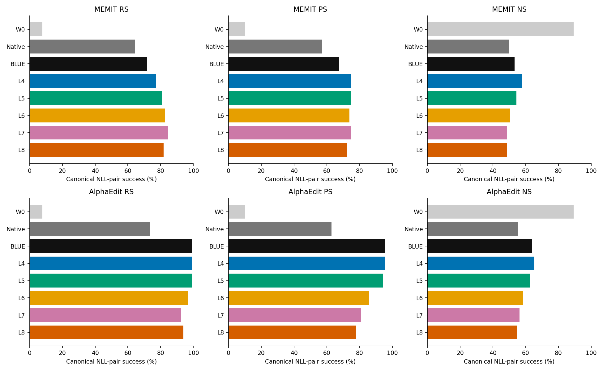
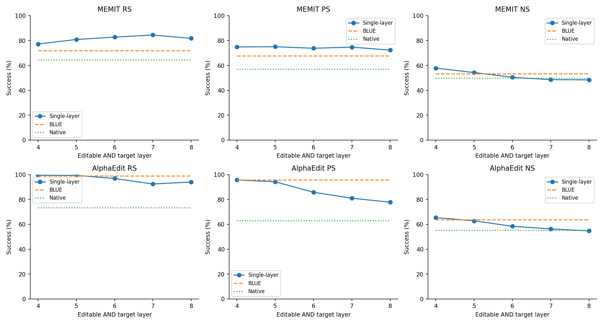
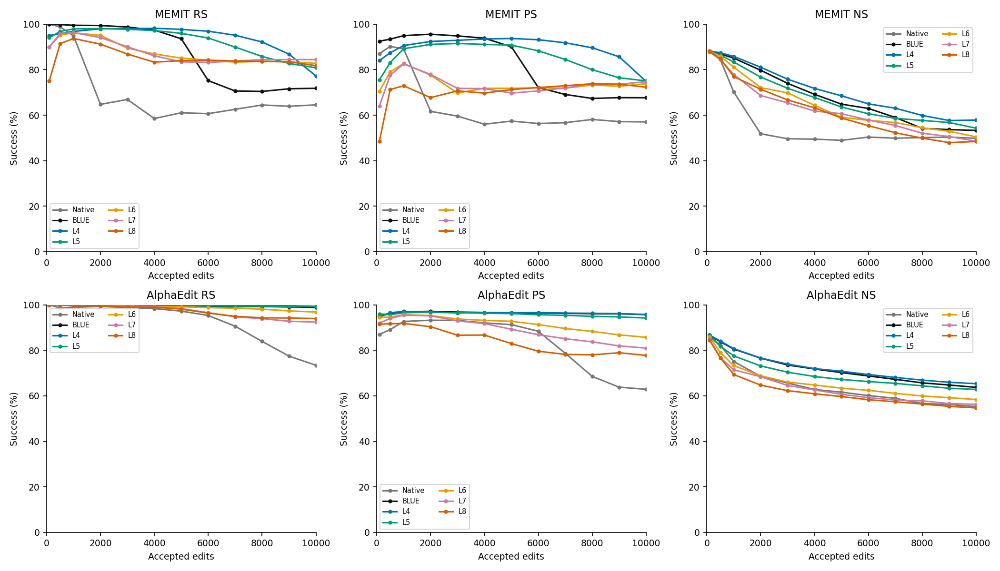
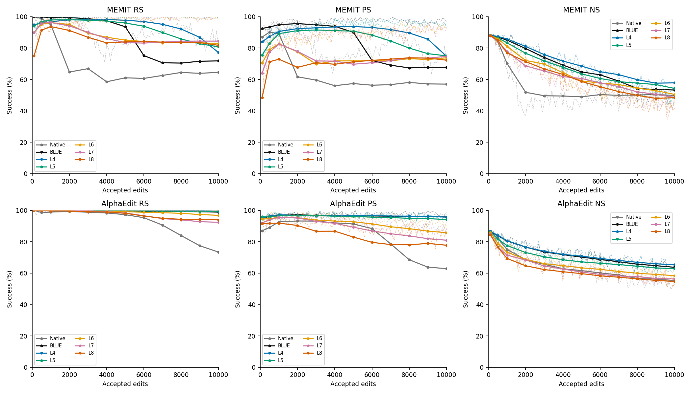
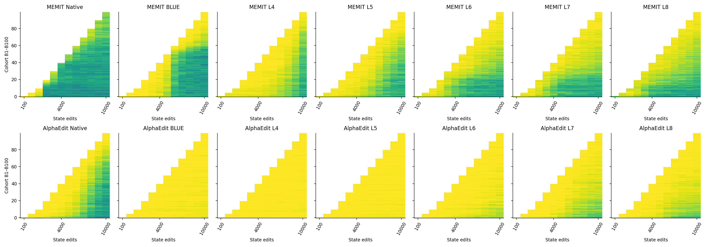
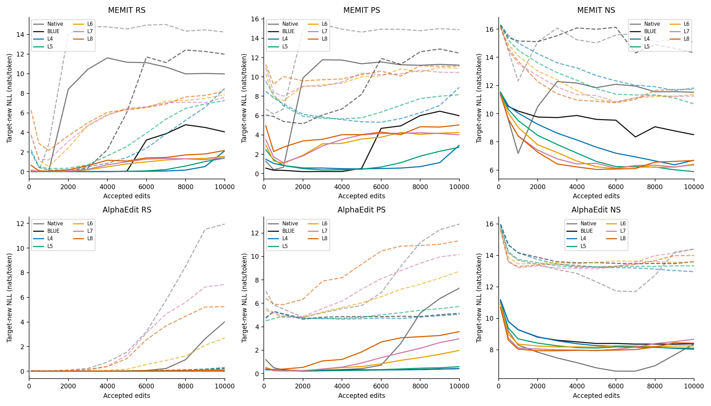
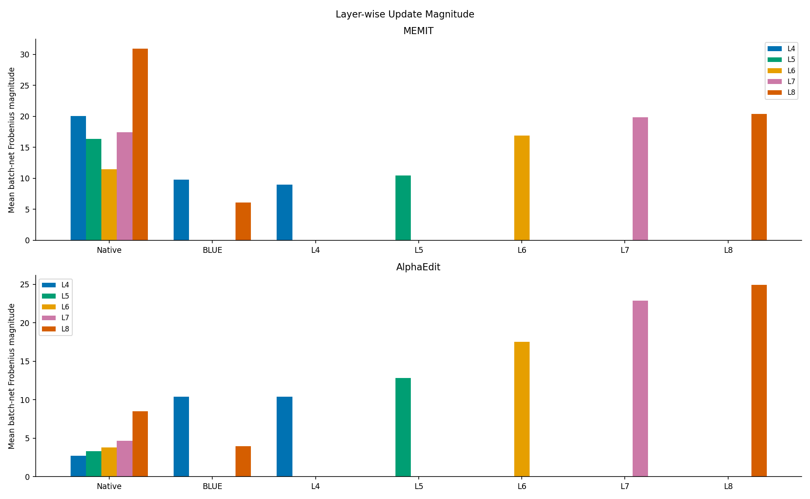
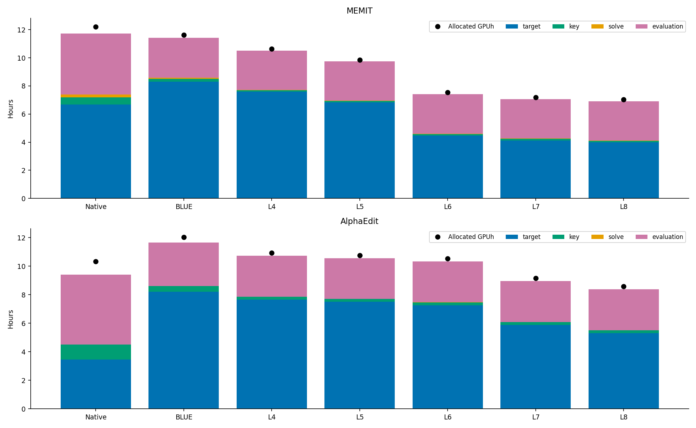

# Server4 Llama fixed10k lifelong 상세 통합 리뷰 — native · BLUE · L4–L8

instruction_id: ODEEDIT-S06-SERVER4-COMPLETED-EXPERIMENTS-DETAILED-REVIEW-SH4-V1

2026-09-11. 기존 BLUE6+W0 v3의 후속 **독립 보고서**이며 기존 bytes를 수정하지 않았다. 사용자 “자세히 리뷰” 및 단일-layer/BLUE/원본 양계열 비교 지시에 따라 FACT와 가능한 설명을 분리한다. 모든 수치는 **최종 실제 W100 전체10,000 재평가**가 우선이다. current100 또는 online 합계로 대체하지 않았다. 과학 promotion=false, 새 GPU/model/forward/evaluator/edit/Slurm 변경0.

## 1. 최종 성능 — 두 계열 각각의 주표

14 scheduler COMPLETED0, 신규8 raw/selected CP CPU 검산 및 기존6 봉인 검증 재사용을 구분했다. 14 chains×10,000=140,000 arm-request 관측, 고유 요청10,000; W0는 SH2의 공통1회이며 두 표에 표시해도 두 실험으로 계수하지 않는다.

### MEMIT

|arm|status|job|RS|PS|NS|
|---|---|---|---|---|---|
|PRE_EDIT W0 (공통 1회)|REUSED_SEALED_PUBLICATION|42673 (SH2)|791/10000 (7.910%)|1997/20000 (9.985%)|89212/100000 (89.212%)|
|BASE_MEMIT (blue=False; L4–L8)|TERMINAL_VALID_EVIDENCE_VERIFIED|42658|6453/10000 (64.530%)|11407/20000 (57.035%)|49838/100000 (49.838%)|
|MEMIT_BLUE (L4+L8)|TERMINAL_VALID_EVIDENCE_VERIFIED|39307|7183/10000 (71.830%)|13530/20000 (67.650%)|53287/100000 (53.287%)|
|MEMIT_BLUE_L4_ONLY|TERMINAL_VALID_EVIDENCE_VERIFIED|39283_2|7722/10000 (77.220%)|14966/20000 (74.830%)|57848/100000 (57.848%)|
|MEMIT_BLUE_L5_ONLY|TERMINAL_VALID_EVIDENCE_VERIFIED|40441|8084/10000 (80.840%)|15008/20000 (75.040%)|54285/100000 (54.285%)|
|MEMIT_BLUE_L6_ONLY|TERMINAL_VALID_EVIDENCE_VERIFIED|40443|8277/10000 (82.770%)|14761/20000 (73.805%)|50488/100000 (50.488%)|
|MEMIT_BLUE_L7_ONLY|TERMINAL_VALID_EVIDENCE_VERIFIED|40445|8444/10000 (84.440%)|14941/20000 (74.705%)|48547/100000 (48.547%)|
|MEMIT_BLUE_L8_ONLY|TERMINAL_VALID_EVIDENCE_VERIFIED|39283_4|8177/10000 (81.770%)|14460/20000 (72.300%)|48425/100000 (48.425%)|

### AlphaEdit

|arm|status|job|RS|PS|NS|
|---|---|---|---|---|---|
|PRE_EDIT W0 (공통 1회)|REUSED_SEALED_PUBLICATION|42673 (SH2)|791/10000 (7.910%)|1997/20000 (9.985%)|89212/100000 (89.212%)|
|BASE_ALPHAEDIT (blue=False; L4–L8)|TERMINAL_VALID_EVIDENCE_VERIFIED|42657|7343/10000 (73.430%)|12577/20000 (62.885%)|55285/100000 (55.285%)|
|AlphaEdit_BLUE (L4+L8)|TERMINAL_VALID_EVIDENCE_VERIFIED|39283_1|9888/10000 (98.880%)|19155/20000 (95.775%)|63726/100000 (63.726%)|
|AlphaEdit_BLUE_L4_ONLY|TERMINAL_VALID_EVIDENCE_VERIFIED|39283_3|9939/10000 (99.390%)|19136/20000 (95.680%)|65348/100000 (65.348%)|
|AlphaEdit_BLUE_L5_ONLY|TERMINAL_VALID_EVIDENCE_VERIFIED|40442|9934/10000 (99.340%)|18839/20000 (94.195%)|62822/100000 (62.822%)|
|AlphaEdit_BLUE_L6_ONLY|TERMINAL_VALID_EVIDENCE_VERIFIED|40444|9683/10000 (96.830%)|17148/20000 (85.740%)|58396/100000 (58.396%)|
|AlphaEdit_BLUE_L7_ONLY|TERMINAL_VALID_EVIDENCE_VERIFIED|40446|9240/10000 (92.400%)|16194/20000 (80.970%)|56277/100000 (56.277%)|
|AlphaEdit_BLUE_L8_ONLY|TERMINAL_VALID_EVIDENCE_VERIFIED|39283_5|9396/10000 (93.960%)|15556/20000 (77.780%)|54703/100000 (54.703%)|

분모는 각 arm RS10,000 / PS20,000 / NS100,000이다. 같은 sample이지만 **native와 BLUE는 layers·target 정책·regularization이 달라** method-only 인과효과를 주장하지 않는다. W0 NS89.212%보다 모든 편집 arm NS가 낮다. W0 RS7.910%는 편집 전 새 target 선호율이므로 pretrained 전체 능력 저하가 아니다.

### 핵심 관측과 해석 경계

- **FACT — MEMIT:** 단일-layer 최고 RS는 MEMIT_BLUE_L7_ONLY 84.440%, 최고 PS는 MEMIT_BLUE_L5_ONLY 75.040%, 최고 NS는 MEMIT_BLUE_L4_ONLY 57.848%다. 하나의 layer가 모든 지표를 동시에 대표한다고 가정하지 않았다.
- **FACT — BASE_MEMIT (blue=False; L4–L8):** at-write RS 9004/10000 → final 6453/10000. 이후 lost 2728 / at-write 성공 9004, recovery 177; 최초 실패와 후속 forgetting을 분리했다.
- **FACT — MEMIT_BLUE (L4+L8):** at-write RS 9999/10000 → final 7183/10000. 이후 lost 2816 / at-write 성공 9999, recovery 0; 최초 실패와 후속 forgetting을 분리했다.
- **FACT — MEMIT_BLUE_L7_ONLY:** at-write RS 9842/10000 → final 8444/10000. 이후 lost 1451 / at-write 성공 9842, recovery 53; 최초 실패와 후속 forgetting을 분리했다.
- **FACT — AlphaEdit:** 단일-layer 최고 RS는 AlphaEdit_BLUE_L4_ONLY 99.390%, 최고 PS는 AlphaEdit_BLUE_L4_ONLY 95.680%, 최고 NS는 AlphaEdit_BLUE_L4_ONLY 65.348%다. 하나의 layer가 모든 지표를 동시에 대표한다고 가정하지 않았다.
- **FACT — BASE_ALPHAEDIT (blue=False; L4–L8):** at-write RS 9990/10000 → final 7343/10000. 이후 lost 2649 / at-write 성공 9990, recovery 2; 최초 실패와 후속 forgetting을 분리했다.
- **FACT — AlphaEdit_BLUE (L4+L8):** at-write RS 9999/10000 → final 9888/10000. 이후 lost 111 / at-write 성공 9999, recovery 0; 최초 실패와 후속 forgetting을 분리했다.
- **FACT — AlphaEdit_BLUE_L4_ONLY:** at-write RS 9993/10000 → final 9939/10000. 이후 lost 55 / at-write 성공 9993, recovery 1; 최초 실패와 후속 forgetting을 분리했다.
- **설명 가능 범위:** current batch에서는 쓰기 성공했으나 final에서 실패한 항목은 이 순서의 후속 editing에 따른 유지 손실로 기술할 수 있다. 다만 parameter 위치·local target·정규화·history의 개별 원인 효과는 분리하지 못했다. BLUE가 native보다 높다고 그 이유가 layer 수 감소 하나라고 결론내리지 않는다.
- **DECISION:** 보고 및 코드/표 공개만 수행한다. 후속 실험·promotion·중단 ORBODE 감사 재개는 하지 않는다.

## 2. 지표 읽는 법과 분모

|지표|정의|단위|
|---|---|---|
|RS|rewrite 1/request: new 평균-token NLL < true 평균-token NLL|prompt 10000; 높을수록 새 edit 목표 선호|
|PS|rephrase 2/request 각각 new NLL < true NLL; request평균 비교 아님|prompt 20000; 높을수록 선호 일반화|
|NS|neighborhood 10/request 각각 true NLL < new NLL|prompt 100000; 높을수록 기존 true 선호|
|NLL|teacher-forced target token −log p 평균; new와true 각각|nats/token; 해당 target에는 낮을수록 높은확률|
|margin|true NLL − new NLL (NS에서도 부호 그대로)|nats/token; RS/PS 양수성공, NS 음수성공|
|TF strict / token accuracy|모든 target token top1 일치 / 정확 token 합÷실제 token수|secondary; 자유 생성 정확도·primary선호와 다름|
|request pair-strict|한 request의 해당 category 모든 prompt 선호 성공|request 10000; TF strict와 다름|
|mean/median/IQR/p90/p99/max|산술평균/중앙값/q75−q25/상위분위/최댓값|prompt와 request-cluster 평균 후 분포를 별도column|
|Layer-wise Update Magnitude|‖W_l after batch − W_l entry‖_F|stored-weight 실제 batch-net Frobenius norm; native action 아님|
|share / path|layer magnitude÷같은batch selected합 / 100 batch-net norms의 합|비중 / 경로길이 proxy; W100−W0 net 또는 원소별누적벡터와 다름|
|lost / gained|동일 prompt identity 성공→실패 / 실패→성공|conditional loss 분모는 이전 성공; 전체전이합은 원분모|

모든 부등식은 strict `<`, tie는 failure. RS와 NS는 요구 선호 방향이 반대다. NS가 높아져도 같은 문항을 유지했다는 뜻이 아니므로 전이를 별도로 센다. 통계는 단일 고정 order 기술통계이며 100k neighborhood prompt를 독립 실험 반복처럼 취급하지 않는다. p-value/확증적 유의성 주장0.

## 3. 실행 inventory · availability · source/config

|arm|job|scheduler|batches|requests|checkpoints|검증|
|---|---|---|---|---|---|---|
|MEMIT_BLUE (L4+L8)|39307|COMPLETED 0:0|100|10000|12|기존v3/72CP transfer검증 재사용|
|AlphaEdit_BLUE (L4+L8)|39283_1|COMPLETED 0:0|100|10000|12|기존v3/72CP transfer검증 재사용|
|MEMIT_BLUE_L4_ONLY|39283_2|COMPLETED 0:0|100|10000|12|기존v3/72CP transfer검증 재사용|
|AlphaEdit_BLUE_L4_ONLY|39283_3|COMPLETED 0:0|100|10000|12|기존v3/72CP transfer검증 재사용|
|MEMIT_BLUE_L8_ONLY|39283_4|COMPLETED 0:0|100|10000|12|기존v3/72CP transfer검증 재사용|
|AlphaEdit_BLUE_L8_ONLY|39283_5|COMPLETED 0:0|100|10000|12|기존v3/72CP transfer검증 재사용|
|MEMIT_BLUE_L5_ONLY|40441|COMPLETED 0:0|100|10000|12|이번 full file SHA+CPU selected/target/state 검사|
|AlphaEdit_BLUE_L5_ONLY|40442|COMPLETED 0:0|100|10000|12|이번 full file SHA+CPU selected/target/state 검사|
|MEMIT_BLUE_L6_ONLY|40443|COMPLETED 0:0|100|10000|12|이번 full file SHA+CPU selected/target/state 검사|
|AlphaEdit_BLUE_L6_ONLY|40444|COMPLETED 0:0|100|10000|12|이번 full file SHA+CPU selected/target/state 검사|
|MEMIT_BLUE_L7_ONLY|40445|COMPLETED 0:0|100|10000|12|이번 full file SHA+CPU selected/target/state 검사|
|AlphaEdit_BLUE_L7_ONLY|40446|COMPLETED 0:0|100|10000|12|이번 full file SHA+CPU selected/target/state 검사|
|BASE_ALPHAEDIT (blue=False; L4–L8)|42657|COMPLETED 0:0|100|10000|12|이번 full file SHA+CPU selected/target/state 검사|
|BASE_MEMIT (blue=False; L4–L8)|42658|COMPLETED 0:0|100|10000|12|이번 full file SHA+CPU selected/target/state 검사|

현재 core14에 미완료/결측 arm은 없지만 과거 superseded/미실행은 별도 제외표에 남겼다. Scheduler만으로 이 판단을 내리지 않았다. CPU reload는 GPU continuation replay가 아니다. source/edit equation correctness 전체를 file hash 하나로 증명한다는 뜻도 아니다.

|arm|blue|layers|L2|mom2_update_weight|v_weight_decay|v_lr|v_num_grad_steps|v_loss_layer|target_policy|divisor|
|---|---|---|---|---|---|---|---|---|---|---|
|MEMIT_BLUE (L4+L8)|True|[4, 8]|NA|15000|0.5|0.1|25|31|current W at each selected layer, once/request/layer|1|
|AlphaEdit_BLUE (L4+L8)|True|[4, 8]|1|15000|0.5|0.1|25|31|current W at each selected layer, once/request/layer|1|
|MEMIT_BLUE_L4_ONLY|True|[4]|NA|15000|0.5|0.1|25|31|current W at each selected layer, once/request/layer|1|
|AlphaEdit_BLUE_L4_ONLY|True|[4]|1|15000|0.5|0.1|25|31|current W at each selected layer, once/request/layer|1|
|MEMIT_BLUE_L8_ONLY|True|[8]|NA|15000|0.5|0.1|25|31|current W at each selected layer, once/request/layer|1|
|AlphaEdit_BLUE_L8_ONLY|True|[8]|1|15000|0.5|0.1|25|31|current W at each selected layer, once/request/layer|1|
|MEMIT_BLUE_L5_ONLY|True|[5]|NA|15000|0.5|0.1|25|31|current W at each selected layer, once/request/layer|1|
|AlphaEdit_BLUE_L5_ONLY|True|[5]|1|15000|0.5|0.1|25|31|current W at each selected layer, once/request/layer|1|
|MEMIT_BLUE_L6_ONLY|True|[6]|NA|15000|0.5|0.1|25|31|current W at each selected layer, once/request/layer|1|
|AlphaEdit_BLUE_L6_ONLY|True|[6]|1|15000|0.5|0.1|25|31|current W at each selected layer, once/request/layer|1|
|MEMIT_BLUE_L7_ONLY|True|[7]|NA|15000|0.5|0.1|25|31|current W at each selected layer, once/request/layer|1|
|AlphaEdit_BLUE_L7_ONLY|True|[7]|1|15000|0.5|0.1|25|31|current W at each selected layer, once/request/layer|1|
|BASE_ALPHAEDIT (blue=False; L4–L8)|False|[4, 5, 6, 7, 8]|10|15000|0.5|0.1|25|31|batch entry fixed L8, once/request|5,4,3,2,1|
|BASE_MEMIT (blue=False; L4–L8)|False|[4, 5, 6, 7, 8]|NA|15000|0.5|0.1|25|31|batch entry fixed L8, once/request|5,4,3,2,1|

Base는 BLUE repository 원본 `blue=False` entrypoint이며 JVP controller가 아니다. BLUE는 current-W의 각 선택 layer에서 native z를 다시 계산하고 전체 residual로 solve한다. Single-layer는 native layer 자체가 target/readout이다. `v_loss_layer=31`은 loss/readout head 경로 설정으로 activation target layer를 L31로 교체했다는 뜻이 아니다.

MEMIT은 `(λC + KKᵀ)⁻¹K`를 FP64 solve 후 residual과 곱하고 FP32 weight에 materialize한다. Base는 남은 layer 수5/4/3/2/1로 residual을 나누고 BLUE는 divisor1. MEMIT 내부 temporary apply→entry restore→returned deltas materialize를 wrapper의 실제 endpoint에서 평가한 증거를 확인했다. AlphaEdit은 `P(KKᵀ+M)+L2 I` 선형계와 `PKRᵀ`를 사용하며 끝에 선택 layer의 실제 key로 M을 append한다. Blue L2=1, native L2=10 차이를 제거하지 않았다.

### 호환성 / 불변성

모든14 모델은 Llama3-8B-Instruct revision8afb486c1db24fe5011ec46dfbe5b5dccdb575c2, FP32 parameter, eager, torch2.9.1+cu128/transformers4.44.2, TF32matmulFalse/cudnnTrue다. Native MEMIT solve FP64 예외는 원본정책이며 전부FP32 연산이라고 쓰지 않는다. selectedW0는 five-layer native reference와 key별 SHA 일치; 미선택 전체parameter는 runtime pointer/version guard로, full byte parity는 미측정이다. evaluator wrapper는 explicit left padding과 source-default position 경로, microbatch16을 유지한다. 원문 source/config/archive, tokenizer property, context hash는 `source-config-compatibility.csv`, `configured-policy-comparison.csv`, `compatibility.csv`에 각각 결속한다.

|arm|source_HEAD|archive_SHA|runtime_SHA|
|---|---|---|---|
|MEMIT_BLUE (L4+L8)|1075540b45c29269e690ac63aae44758d8d63174|cc834a23144f6ac23d2e3f23841405194485e4f4536c0911315676ff06ff4f48|6a1a193c7fc1a171de2a85a51a0261e9209d1bcae40aa004a8dad929fd721a5e|
|AlphaEdit_BLUE (L4+L8)|1075540b45c29269e690ac63aae44758d8d63174|6cb448801ae2136f627a7c5390e2d042b2dd8456eb01e183d064f1bd5eeed2af|850ed7ce290c8d6d26c82912b6a8b5d91a0ee3d86394a279aa2aca83db6a2d08|
|MEMIT_BLUE_L4_ONLY|1075540b45c29269e690ac63aae44758d8d63174|6cb448801ae2136f627a7c5390e2d042b2dd8456eb01e183d064f1bd5eeed2af|92c8e1714f364261adf3f6c38bd888da1f31266e3b21690fdeddc6ff86c952f2|
|AlphaEdit_BLUE_L4_ONLY|1075540b45c29269e690ac63aae44758d8d63174|6cb448801ae2136f627a7c5390e2d042b2dd8456eb01e183d064f1bd5eeed2af|807ec8afd3aef1ad5ec20ad535f265527010711b4435629964c505fdc28e16d4|
|MEMIT_BLUE_L8_ONLY|1075540b45c29269e690ac63aae44758d8d63174|6cb448801ae2136f627a7c5390e2d042b2dd8456eb01e183d064f1bd5eeed2af|8e08629d2ba3f9e9a34a5bbad1caf7e8065031eac8164be0881901a0a626587e|
|AlphaEdit_BLUE_L8_ONLY|1075540b45c29269e690ac63aae44758d8d63174|6cb448801ae2136f627a7c5390e2d042b2dd8456eb01e183d064f1bd5eeed2af|dfe1781baf1a0656628e2425df3683ce20f7ea507d7e1f5da30ef99f75ff5ec6|
|MEMIT_BLUE_L5_ONLY|1075540b45c29269e690ac63aae44758d8d63174|c12a3b5d8b1ea1dd50351cb8a0d4e49914b76beef449580c16e17e7dc42f76c3|e7d7647757f2b3cf2c86391bdc3937fbf4dc65ef8b175f701d231a6eb8e4b517|
|AlphaEdit_BLUE_L5_ONLY|1075540b45c29269e690ac63aae44758d8d63174|c12a3b5d8b1ea1dd50351cb8a0d4e49914b76beef449580c16e17e7dc42f76c3|b45fe20089b8e9946e7d757f520043da18a66e6bf0720d16e724d1da62331714|
|MEMIT_BLUE_L6_ONLY|1075540b45c29269e690ac63aae44758d8d63174|c12a3b5d8b1ea1dd50351cb8a0d4e49914b76beef449580c16e17e7dc42f76c3|ea012220bc59cce3b28ecfef55ba3c447e9043a760ba6e8c17388dc666b5bf11|
|AlphaEdit_BLUE_L6_ONLY|1075540b45c29269e690ac63aae44758d8d63174|c12a3b5d8b1ea1dd50351cb8a0d4e49914b76beef449580c16e17e7dc42f76c3|9c54f1ba3e45a8bfcf538b892d5ef3cfb423c50e9f1369c5fbb7dcb469c96232|
|MEMIT_BLUE_L7_ONLY|1075540b45c29269e690ac63aae44758d8d63174|c12a3b5d8b1ea1dd50351cb8a0d4e49914b76beef449580c16e17e7dc42f76c3|cd7edce77b229a1489e9530a0cd607aaa96a6b32a46424d5d76a551fda219857|
|AlphaEdit_BLUE_L7_ONLY|1075540b45c29269e690ac63aae44758d8d63174|c12a3b5d8b1ea1dd50351cb8a0d4e49914b76beef449580c16e17e7dc42f76c3|5b9968ddfaa8d07ac4c67065bf94130701ebb8938eb5caffdcbc6ed0239bf991|
|BASE_ALPHAEDIT (blue=False; L4–L8)|1075540b45c29269e690ac63aae44758d8d63174|582a378906fbcc3304de92011d67d54f28840d76cfb59ee1f6fa00166bda0560|ca21536f4c5e6acbb473991e121e5dc89fa9408e90fe7322ea9f5cc2c71c7b45|
|BASE_MEMIT (blue=False; L4–L8)|1075540b45c29269e690ac63aae44758d8d63174|582a378906fbcc3304de92011d67d54f28840d76cfb59ee1f6fa00166bda0560|cef9e07b785225f1d1fc1f0b116e7b9c2f0bb7e23deeecd5e5e81417874a5064|

동일 fixed10k root5b013569…5729 및 dataset SHA3d7f5e31…10ae1를 검증했다. BLUE historical full-dataset selector와 native dedicated subset 파일의 **파일SHA는 다르지만 실제10000 record/order/targets는 동일**하며 원본fullCounterFact SHA와 subset SHA를 억지 동일시하지 않는다. contexts의 동일성/차이는 table의 hash로 판단한다. 단일-layer도 target 위치가 달라 layer-only 원인분리 실험이 아니다.

Alpha projector physical L4..L8→indices0..4→local index를 새L567 및 native 실제 CPU tensor SHA로 검증했다(`new-projector-binding.csv`). Native는5weights+5M, BLUE(L4+L8)는2weights+2M, singleton은1weight+1M. MEMIT cache는 empty sentinel/static covariance이며 Alpha history가 아니다. 기존 L4 observer metadata 오표기는 이전v3 evidence대로 보존하고 physical P0 binding과 구분한다. 14×99 W-links, 각Alpha99 history-links, coldreset1/chain과 terminalW0restore assertion을 확인/재사용했다. 12CP/chain 실제 selected tensors와 contexts/RNG를 CPU검사했지만 모델전체를 매번저장한 checkpoint 또는 GPU복원성공이라고 하지 않는다.

## 4. 핵심 비교 I — 각 단일 layer ↔ BLUE ↔ native

### MEMIT

|arm|RS_%|RS_ΔBLUE_pp|RS_Δnative_pp|PS_%|PS_ΔBLUE_pp|PS_Δnative_pp|NS_%|NS_ΔBLUE_pp|NS_Δnative_pp|
|---|---|---|---|---|---|---|---|---|---|
|BASE_MEMIT (blue=False; L4–L8)|64.53|-7.3|0|57.035|-10.615|0|49.838|-3.449|0|
|MEMIT_BLUE (L4+L8)|71.83|0|7.3|67.65|0|10.615|53.287|0|3.449|
|MEMIT_BLUE_L4_ONLY|77.22|5.39|12.69|74.83|7.18|17.795|57.848|4.561|8.01|
|MEMIT_BLUE_L5_ONLY|80.84|9.01|16.31|75.04|7.39|18.005|54.285|0.998|4.447|
|MEMIT_BLUE_L6_ONLY|82.77|10.94|18.24|73.805|6.155|16.77|50.488|-2.799|0.65|
|MEMIT_BLUE_L7_ONLY|84.44|12.61|19.91|74.705|7.055|17.67|48.547|-4.74|-1.291|
|MEMIT_BLUE_L8_ONLY|81.77|9.94|17.24|72.3|4.65|15.265|48.425|-4.862|-1.413|

같은10000/20000/100000 prompt 분모, Δ는 행arm−reference. 이 표는 각자 다른W/target에서 나온 end-to-end 차이다.

L4→L8 final 차이: RS +4.550pp, PS -2.530pp, NS -9.423pp. 중간L5/L6/L7을 포함했으므로 양끝만 보고 단조 변화를 가정하지 않는다. 각 지표 최고 layer가 같지 않으면 trade-off로 남긴다.

### AlphaEdit

|arm|RS_%|RS_ΔBLUE_pp|RS_Δnative_pp|PS_%|PS_ΔBLUE_pp|PS_Δnative_pp|NS_%|NS_ΔBLUE_pp|NS_Δnative_pp|
|---|---|---|---|---|---|---|---|---|---|
|BASE_ALPHAEDIT (blue=False; L4–L8)|73.43|-25.45|0|62.885|-32.89|0|55.285|-8.441|0|
|AlphaEdit_BLUE (L4+L8)|98.88|0|25.45|95.775|0|32.89|63.726|0|8.441|
|AlphaEdit_BLUE_L4_ONLY|99.39|0.51|25.96|95.68|-0.095|32.795|65.348|1.622|10.063|
|AlphaEdit_BLUE_L5_ONLY|99.34|0.46|25.91|94.195|-1.58|31.31|62.822|-0.904|7.537|
|AlphaEdit_BLUE_L6_ONLY|96.83|-2.05|23.4|85.74|-10.035|22.855|58.396|-5.33|3.111|
|AlphaEdit_BLUE_L7_ONLY|92.4|-6.48|18.97|80.97|-14.805|18.085|56.277|-7.449|0.992|
|AlphaEdit_BLUE_L8_ONLY|93.96|-4.92|20.53|77.78|-17.995|14.895|54.703|-9.023|-0.582|

같은10000/20000/100000 prompt 분모, Δ는 행arm−reference. 이 표는 각자 다른W/target에서 나온 end-to-end 차이다.

L4→L8 final 차이: RS -5.430pp, PS -17.900pp, NS -10.645pp. 중간L5/L6/L7을 포함했으므로 양끝만 보고 단조 변화를 가정하지 않는다. 각 지표 최고 layer가 같지 않으면 trade-off로 남긴다.

### 원본 AlphaEdit ↔ 원본 MEMIT 및 같은 variant의 두 family

|variant|MEMIT_RS|Alpha_RS|RS_Alpha_minus_MEMIT_pp|MEMIT_PS|Alpha_PS|PS_Alpha_minus_MEMIT_pp|MEMIT_NS|Alpha_NS|NS_Alpha_minus_MEMIT_pp|
|---|---|---|---|---|---|---|---|---|---|
|Native|6453/10000 (64.530%)|7343/10000 (73.430%)|8.9|11407/20000 (57.035%)|12577/20000 (62.885%)|5.85|49838/100000 (49.838%)|55285/100000 (55.285%)|5.447|
|BLUE|7183/10000 (71.830%)|9888/10000 (98.880%)|27.05|13530/20000 (67.650%)|19155/20000 (95.775%)|28.125|53287/100000 (53.287%)|63726/100000 (63.726%)|10.439|
|L4|7722/10000 (77.220%)|9939/10000 (99.390%)|22.17|14966/20000 (74.830%)|19136/20000 (95.680%)|20.85|57848/100000 (57.848%)|65348/100000 (65.348%)|7.5|
|L5|8084/10000 (80.840%)|9934/10000 (99.340%)|18.5|15008/20000 (75.040%)|18839/20000 (94.195%)|19.155|54285/100000 (54.285%)|62822/100000 (62.822%)|8.537|
|L6|8277/10000 (82.770%)|9683/10000 (96.830%)|14.06|14761/20000 (73.805%)|17148/20000 (85.740%)|11.935|50488/100000 (50.488%)|58396/100000 (58.396%)|7.908|
|L7|8444/10000 (84.440%)|9240/10000 (92.400%)|7.96|14941/20000 (74.705%)|16194/20000 (80.970%)|6.265|48547/100000 (48.547%)|56277/100000 (56.277%)|7.73|
|L8|8177/10000 (81.770%)|9396/10000 (93.960%)|12.19|14460/20000 (72.300%)|15556/20000 (77.780%)|5.48|48425/100000 (48.425%)|54703/100000 (54.703%)|6.278|

History-projected AlphaEdit과 covariance-weighted MEMIT의 equation·regularization이 다르다. 같은 variant 또는 같은sample만으로 그 차이를 history 하나의 효과로 해석하지 않는다.

## 5. 전체 checkpoint cumulative seen-prefix · current · online

12개 기록checkpoint에서 Wk에 첫 100×k개 requests 전체를 평가했다. full PS/NS는 그12시점에서만 존재하며 임의 중간값을 만들지 않았다. Native는 `seen-rewrite.json`이100batch 모두 있어 별도 `native-all-batches-seen-rewrite.csv`와 cohort표에 반영했다. BLUE full noncheckpoint 평가가 있는 것처럼 표시하지 않는다. 같은current100은 checkpoint full의 마지막100으로 재사용되므로 중복분모로 합산하지 않는다.

### MEMIT — 7arm ×12 실제 checkpoint

#### BASE_MEMIT (blue=False; L4–L8)

|edits|RS|current_RS|PS|current_PS|NS|current_NS|RS_new_NLL_mean|PS_new_NLL_p90|NS_margin_mean|
|---|---|---|---|---|---|---|---|---|---|
|100|100/100 (100.000%)|100/100 (100.000%)|174/200 (87.000%)|174/200 (87.000%)|880/1000 (88.000%)|880/1000 (88.000%)|0.1120|6.6746|-5.9784|
|500|494/500 (98.800%)|99/100 (99.000%)|902/1000 (90.200%)|182/200 (91.000%)|4220/5000 (84.400%)|841/1000 (84.100%)|0.1775|6.1695|-4.8664|
|1000|949/1000 (94.900%)|100/100 (100.000%)|1783/2000 (89.150%)|189/200 (94.500%)|7018/10000 (70.180%)|664/1000 (66.400%)|0.7580|6.6814|-2.5082|
|2000|1295/2000 (64.750%)|100/100 (100.000%)|2468/4000 (61.700%)|195/200 (97.500%)|10365/20000 (51.825%)|369/1000 (36.900%)|8.0214|14.8331|-0.1243|
|3000|2007/3000 (66.900%)|92/100 (92.000%)|3575/6000 (59.583%)|147/200 (73.500%)|14890/30000 (49.633%)|455/1000 (45.500%)|10.0989|15.4148|0.0261|
|4000|2341/4000 (58.525%)|82/100 (82.000%)|4482/8000 (56.025%)|150/200 (75.000%)|19785/40000 (49.462%)|432/1000 (43.200%)|11.3145|14.9327|0.0455|
|5000|3053/5000 (61.060%)|84/100 (84.000%)|5740/10000 (57.400%)|152/200 (76.000%)|24466/50000 (48.932%)|462/1000 (46.200%)|10.5071|14.6313|0.0356|
|6000|3640/6000 (60.667%)|88/100 (88.000%)|6760/12000 (56.333%)|147/200 (73.500%)|30221/60000 (50.368%)|526/1000 (52.600%)|10.5570|14.9344|0.0087|
|7000|4380/7000 (62.571%)|93/100 (93.000%)|7938/14000 (56.700%)|183/200 (91.500%)|34924/70000 (49.891%)|397/1000 (39.700%)|10.0992|14.9202|0.0228|
|8000|5158/8000 (64.475%)|94/100 (94.000%)|9298/16000 (58.112%)|159/200 (79.500%)|40101/80000 (50.126%)|469/1000 (46.900%)|9.3504|14.7806|-0.0446|
|9000|5752/9000 (63.911%)|87/100 (87.000%)|10292/18000 (57.178%)|154/200 (77.000%)|45344/90000 (50.382%)|435/1000 (43.500%)|9.4048|14.9923|-0.0435|
|10000|6453/10000 (64.530%)|81/100 (81.000%)|11407/20000 (57.035%)|143/200 (71.500%)|49838/100000 (49.838%)|495/1000 (49.500%)|9.2507|14.8837|0.0581|

RS: 1k→10k 94.900%→64.530% (-30.370pp). 기록점 간 최소 Δ는 1000→2000: -30.150pp, 최대 Δ는 4000→5000: +2.535pp. PS: 1k→10k 89.150%→57.035% (-32.115pp). 기록점 간 최소 Δ는 1000→2000: -27.450pp, 최대 Δ는 100→500: +3.200pp. NS: 1k→10k 70.180%→49.838% (-20.342pp). 기록점 간 최소 Δ는 1000→2000: -18.355pp, 최대 Δ는 5000→6000: +1.436pp. 이 변화에는 seen-prefix 구성이 커지는 효과가 포함된다. 같은 옛cohort의 손실/회복은 아래 전이와 heatmap에서 별도 확인한다.

RS target-new NLL 1k→10k median 0.0306→9.9783, p90 2.7784→14.2520 nats/token. PS target-new NLL 1k→10k median 0.6586→11.2160, p90 6.6814→14.8837 nats/token. NS target-new NLL 1k→10k median 7.1897→11.5234, p90 12.3337→15.0716 nats/token. NS의new NLL상승은 competing새target약화방향이므로 RS/PS의new NLL악화와같이읽지않는다.

#### MEMIT_BLUE (L4+L8)

|edits|RS|current_RS|PS|current_PS|NS|current_NS|RS_new_NLL_mean|PS_new_NLL_p90|NS_margin_mean|
|---|---|---|---|---|---|---|---|---|---|
|100|100/100 (100.000%)|100/100 (100.000%)|185/200 (92.500%)|185/200 (92.500%)|879/1000 (87.900%)|879/1000 (87.900%)|0.0071|6.0612|-5.9611|
|500|499/500 (99.800%)|100/100 (100.000%)|934/1000 (93.400%)|183/200 (91.500%)|4347/5000 (86.940%)|873/1000 (87.300%)|0.0213|5.9047|-5.4353|
|1000|995/1000 (99.500%)|100/100 (100.000%)|1899/2000 (94.950%)|182/200 (91.000%)|8507/10000 (85.070%)|856/1000 (85.600%)|0.1200|5.3954|-5.0355|
|2000|1988/2000 (99.400%)|100/100 (100.000%)|3823/4000 (95.575%)|194/200 (97.000%)|15943/20000 (79.715%)|795/1000 (79.500%)|0.1942|5.1520|-4.2421|
|3000|2962/3000 (98.733%)|100/100 (100.000%)|5690/6000 (94.833%)|190/200 (95.000%)|22196/30000 (73.987%)|706/1000 (70.600%)|0.4247|6.0626|-3.5739|
|4000|3896/4000 (97.400%)|100/100 (100.000%)|7506/8000 (93.825%)|196/200 (98.000%)|27664/40000 (69.160%)|646/1000 (64.600%)|0.8176|6.6912|-2.8692|
|5000|4679/5000 (93.580%)|100/100 (100.000%)|9005/10000 (90.050%)|192/200 (96.000%)|32416/50000 (64.832%)|624/1000 (62.400%)|1.5999|8.2008|-2.0915|
|6000|4511/6000 (75.183%)|100/100 (100.000%)|8656/12000 (72.133%)|198/200 (99.000%)|37773/60000 (62.955%)|615/1000 (61.500%)|4.6667|11.9123|-1.6991|
|7000|4944/7000 (70.629%)|100/100 (100.000%)|9673/14000 (69.093%)|198/200 (99.000%)|41283/70000 (58.976%)|543/1000 (54.300%)|4.7918|11.2990|-1.0440|
|8000|5635/8000 (70.438%)|100/100 (100.000%)|10777/16000 (67.356%)|197/200 (98.500%)|43342/80000 (54.178%)|457/1000 (45.700%)|5.4586|12.5994|-0.4376|
|9000|6444/9000 (71.600%)|100/100 (100.000%)|12186/18000 (67.700%)|191/200 (95.500%)|48285/90000 (53.650%)|524/1000 (52.400%)|5.2765|12.8834|-0.3646|
|10000|7183/10000 (71.830%)|100/100 (100.000%)|13530/20000 (67.650%)|194/200 (97.000%)|53287/100000 (53.287%)|506/1000 (50.600%)|5.0508|12.4627|-0.3727|

RS: 1k→10k 99.500%→71.830% (-27.670pp). 기록점 간 최소 Δ는 5000→6000: -18.397pp, 최대 Δ는 8000→9000: +1.162pp. PS: 1k→10k 94.950%→67.650% (-27.300pp). 기록점 간 최소 Δ는 5000→6000: -17.917pp, 최대 Δ는 500→1000: +1.550pp. NS: 1k→10k 85.070%→53.287% (-31.783pp). 기록점 간 최소 Δ는 2000→3000: -5.728pp, 최대 Δ는 9000→10000: -0.363pp. 이 변화에는 seen-prefix 구성이 커지는 효과가 포함된다. 같은 옛cohort의 손실/회복은 아래 전이와 heatmap에서 별도 확인한다.

RS target-new NLL 1k→10k median 0.0030→4.0572, p90 0.0257→11.9903 nats/token. PS target-new NLL 1k→10k median 0.3392→5.9830, p90 5.3954→12.4627 nats/token. NS target-new NLL 1k→10k median 10.1904→8.5097, p90 15.1594→14.3269 nats/token. NS의new NLL상승은 competing새target약화방향이므로 RS/PS의new NLL악화와같이읽지않는다.

#### MEMIT_BLUE_L4_ONLY

|edits|RS|current_RS|PS|current_PS|NS|current_NS|RS_new_NLL_mean|PS_new_NLL_p90|NS_margin_mean|
|---|---|---|---|---|---|---|---|---|---|
|100|95/100 (95.000%)|95/100 (95.000%)|168/200 (84.000%)|168/200 (84.000%)|882/1000 (88.200%)|882/1000 (88.200%)|0.6311|8.4969|-5.9812|
|500|479/500 (95.800%)|99/100 (99.000%)|874/1000 (87.400%)|180/200 (90.000%)|4371/5000 (87.420%)|876/1000 (87.600%)|0.4683|7.8572|-5.5191|
|1000|968/1000 (96.800%)|96/100 (96.000%)|1812/2000 (90.600%)|176/200 (88.000%)|8582/10000 (85.820%)|869/1000 (86.900%)|0.3106|7.1930|-5.0845|
|2000|1959/2000 (97.950%)|100/100 (100.000%)|3696/4000 (92.400%)|191/200 (95.500%)|16213/20000 (81.065%)|823/1000 (82.300%)|0.3062|6.1301|-4.1330|
|3000|2940/3000 (98.000%)|99/100 (99.000%)|5574/6000 (92.900%)|180/200 (90.000%)|22742/30000 (75.807%)|712/1000 (71.200%)|0.3936|5.8544|-3.2540|
|4000|3928/4000 (98.200%)|100/100 (100.000%)|7477/8000 (93.463%)|198/200 (99.000%)|28696/40000 (71.740%)|660/1000 (66.000%)|0.4813|5.5832|-2.6622|
|5000|4885/5000 (97.700%)|100/100 (100.000%)|9371/10000 (93.710%)|189/200 (94.500%)|34251/50000 (68.502%)|692/1000 (69.200%)|0.5891|5.3599|-2.1370|
|6000|5814/6000 (96.900%)|100/100 (100.000%)|11179/12000 (93.158%)|195/200 (97.500%)|38977/60000 (64.962%)|656/1000 (65.600%)|0.7537|5.3129|-1.6634|
|7000|6659/7000 (95.129%)|100/100 (100.000%)|12854/14000 (91.814%)|192/200 (96.000%)|44139/70000 (63.056%)|594/1000 (59.400%)|1.0913|5.6915|-1.3444|
|8000|7372/8000 (92.150%)|100/100 (100.000%)|14338/16000 (89.612%)|196/200 (98.000%)|47897/80000 (59.871%)|542/1000 (54.200%)|1.4925|6.2860|-1.0299|
|9000|7814/9000 (86.822%)|100/100 (100.000%)|15419/18000 (85.661%)|192/200 (96.000%)|51877/90000 (57.641%)|567/1000 (56.700%)|2.1031|7.0601|-0.7403|
|10000|7722/10000 (77.220%)|99/100 (99.000%)|14966/20000 (74.830%)|185/200 (92.500%)|57848/100000 (57.848%)|559/1000 (55.900%)|3.3042|8.9320|-0.7988|

RS: 1k→10k 96.800%→77.220% (-19.580pp). 기록점 간 최소 Δ는 9000→10000: -9.602pp, 최대 Δ는 1000→2000: +1.150pp. PS: 1k→10k 90.600%→74.830% (-15.770pp). 기록점 간 최소 Δ는 9000→10000: -10.831pp, 최대 Δ는 100→500: +3.400pp. NS: 1k→10k 85.820%→57.848% (-27.972pp). 기록점 간 최소 Δ는 2000→3000: -5.258pp, 최대 Δ는 9000→10000: +0.207pp. 이 변화에는 seen-prefix 구성이 커지는 효과가 포함된다. 같은 옛cohort의 손실/회복은 아래 전이와 heatmap에서 별도 확인한다.

RS target-new NLL 1k→10k median 0.0067→2.1226, p90 0.1536→8.4891 nats/token. PS target-new NLL 1k→10k median 0.8419→2.9402, p90 7.1930→8.9320 nats/token. NS target-new NLL 1k→10k median 10.0517→6.7039, p90 15.0172→11.8209 nats/token. NS의new NLL상승은 competing새target약화방향이므로 RS/PS의new NLL악화와같이읽지않는다.

#### MEMIT_BLUE_L5_ONLY

|edits|RS|current_RS|PS|current_PS|NS|current_NS|RS_new_NLL_mean|PS_new_NLL_p90|NS_margin_mean|
|---|---|---|---|---|---|---|---|---|---|
|100|94/100 (94.000%)|94/100 (94.000%)|151/200 (75.500%)|151/200 (75.500%)|880/1000 (88.000%)|880/1000 (88.000%)|0.7231|9.5341|-5.9718|
|500|484/500 (96.800%)|99/100 (99.000%)|831/1000 (83.100%)|167/200 (83.500%)|4324/5000 (86.480%)|863/1000 (86.300%)|0.4226|8.1513|-5.3263|
|1000|979/1000 (97.900%)|98/100 (98.000%)|1784/2000 (89.200%)|172/200 (86.000%)|8336/10000 (83.360%)|833/1000 (83.300%)|0.2936|7.0205|-4.6009|
|2000|1961/2000 (98.050%)|100/100 (100.000%)|3644/4000 (91.100%)|185/200 (92.500%)|15343/20000 (76.715%)|781/1000 (78.100%)|0.3132|5.9421|-3.4328|
|3000|2932/3000 (97.733%)|99/100 (99.000%)|5491/6000 (91.517%)|190/200 (95.000%)|21547/30000 (71.823%)|679/1000 (67.900%)|0.4125|5.7161|-2.7060|
|4000|3888/4000 (97.200%)|99/100 (99.000%)|7288/8000 (91.100%)|196/200 (98.000%)|27103/40000 (67.757%)|598/1000 (59.800%)|0.5858|5.6613|-2.0715|
|5000|4798/5000 (95.960%)|99/100 (99.000%)|9078/10000 (90.780%)|190/200 (95.000%)|31793/50000 (63.586%)|596/1000 (59.600%)|0.7667|5.7739|-1.4915|
|6000|5635/6000 (93.917%)|100/100 (100.000%)|10594/12000 (88.283%)|199/200 (99.500%)|36371/60000 (60.618%)|596/1000 (59.600%)|1.0727|6.3651|-1.0920|
|7000|6294/7000 (89.914%)|100/100 (100.000%)|11827/14000 (84.479%)|192/200 (96.000%)|41023/70000 (58.604%)|526/1000 (52.600%)|1.5800|7.0621|-0.8711|
|8000|6864/8000 (85.800%)|100/100 (100.000%)|12798/16000 (79.987%)|194/200 (97.000%)|46150/80000 (57.688%)|543/1000 (54.300%)|2.1278|7.7579|-0.7873|
|9000|7445/9000 (82.722%)|100/100 (100.000%)|13760/18000 (76.444%)|190/200 (95.000%)|51090/90000 (56.767%)|540/1000 (54.000%)|2.4446|8.0074|-0.6325|
|10000|8084/10000 (80.840%)|100/100 (100.000%)|15008/20000 (75.040%)|189/200 (94.500%)|54285/100000 (54.285%)|474/1000 (47.400%)|2.6539|8.1588|-0.3704|

RS: 1k→10k 97.900%→80.840% (-17.060pp). 기록점 간 최소 Δ는 7000→8000: -4.114pp, 최대 Δ는 100→500: +2.800pp. PS: 1k→10k 89.200%→75.040% (-14.160pp). 기록점 간 최소 Δ는 7000→8000: -4.491pp, 최대 Δ는 100→500: +7.600pp. NS: 1k→10k 83.360%→54.285% (-29.075pp). 기록점 간 최소 Δ는 1000→2000: -6.645pp, 최대 Δ는 7000→8000: -0.917pp. 이 변화에는 seen-prefix 구성이 커지는 효과가 포함된다. 같은 옛cohort의 손실/회복은 아래 전이와 heatmap에서 별도 확인한다.

RS target-new NLL 1k→10k median 0.0083→1.3867, p90 0.3106→7.2642 nats/token. PS target-new NLL 1k→10k median 0.8372→2.7233, p90 7.0205→8.1588 nats/token. NS target-new NLL 1k→10k median 9.5191→5.8951, p90 14.5177→10.6965 nats/token. NS의new NLL상승은 competing새target약화방향이므로 RS/PS의new NLL악화와같이읽지않는다.

#### MEMIT_BLUE_L6_ONLY

|edits|RS|current_RS|PS|current_PS|NS|current_NS|RS_new_NLL_mean|PS_new_NLL_p90|NS_margin_mean|
|---|---|---|---|---|---|---|---|---|---|
|100|90/100 (90.000%)|90/100 (90.000%)|141/200 (70.500%)|141/200 (70.500%)|881/1000 (88.100%)|881/1000 (88.100%)|1.1880|10.3220|-5.9393|
|500|476/500 (95.200%)|98/100 (98.000%)|790/1000 (79.000%)|161/200 (80.500%)|4298/5000 (85.960%)|858/1000 (85.800%)|0.5773|7.8064|-5.1984|
|1000|962/1000 (96.200%)|95/100 (95.000%)|1654/2000 (82.700%)|163/200 (81.500%)|8111/10000 (81.110%)|808/1000 (80.800%)|0.4330|7.5539|-4.3425|
|2000|1901/2000 (95.050%)|99/100 (99.000%)|3104/4000 (77.600%)|179/200 (89.500%)|14423/20000 (72.115%)|744/1000 (74.400%)|0.7479|8.9957|-2.9109|
|3000|2684/3000 (89.467%)|98/100 (98.000%)|4184/6000 (69.733%)|174/200 (87.000%)|20940/30000 (69.800%)|672/1000 (67.200%)|1.3388|9.1777|-2.3893|
|4000|3476/4000 (86.900%)|98/100 (98.000%)|5745/8000 (71.812%)|191/200 (95.500%)|25733/40000 (64.332%)|568/1000 (56.800%)|1.8489|9.3429|-1.5169|
|5000|4254/5000 (85.080%)|99/100 (99.000%)|7182/10000 (71.820%)|185/200 (92.500%)|29539/50000 (59.078%)|544/1000 (54.400%)|2.1477|10.0208|-0.8974|
|6000|5051/6000 (84.183%)|100/100 (100.000%)|8641/12000 (72.008%)|190/200 (95.000%)|34635/60000 (57.725%)|553/1000 (55.300%)|2.2998|10.1147|-0.7483|
|7000|5832/7000 (83.314%)|100/100 (100.000%)|10062/14000 (71.871%)|184/200 (92.000%)|39734/70000 (56.763%)|488/1000 (48.800%)|2.5393|10.8250|-0.6915|
|8000|6690/8000 (83.625%)|100/100 (100.000%)|11721/16000 (73.256%)|188/200 (94.000%)|43576/80000 (54.470%)|454/1000 (45.400%)|2.6315|10.5121|-0.4476|
|9000|7510/9000 (83.444%)|100/100 (100.000%)|13086/18000 (72.700%)|186/200 (93.000%)|47596/90000 (52.884%)|514/1000 (51.400%)|2.6946|10.9592|-0.2639|
|10000|8277/10000 (82.770%)|100/100 (100.000%)|14761/20000 (73.805%)|185/200 (92.500%)|50488/100000 (50.488%)|459/1000 (45.900%)|2.8965|10.8953|0.0270|

RS: 1k→10k 96.200%→82.770% (-13.430pp). 기록점 간 최소 Δ는 2000→3000: -5.583pp, 최대 Δ는 100→500: +5.200pp. PS: 1k→10k 82.700%→73.805% (-8.895pp). 기록점 간 최소 Δ는 2000→3000: -7.867pp, 최대 Δ는 100→500: +8.500pp. NS: 1k→10k 81.110%→50.488% (-30.622pp). 기록점 간 최소 Δ는 1000→2000: -8.995pp, 최대 Δ는 6000→7000: -0.962pp. 이 변화에는 seen-prefix 구성이 커지는 효과가 포함된다. 같은 옛cohort의 손실/회복은 아래 전이와 heatmap에서 별도 확인한다.

RS target-new NLL 1k→10k median 0.0112→1.5649, p90 0.5297→7.8525 nats/token. PS target-new NLL 1k→10k median 1.0576→4.2511, p90 7.5539→10.8953 nats/token. NS target-new NLL 1k→10k median 9.0352→6.4234, p90 14.1108→11.3554 nats/token. NS의new NLL상승은 competing새target약화방향이므로 RS/PS의new NLL악화와같이읽지않는다.

#### MEMIT_BLUE_L7_ONLY

|edits|RS|current_RS|PS|current_PS|NS|current_NS|RS_new_NLL_mean|PS_new_NLL_p90|NS_margin_mean|
|---|---|---|---|---|---|---|---|---|---|
|100|90/100 (90.000%)|90/100 (90.000%)|128/200 (64.000%)|128/200 (64.000%)|878/1000 (87.800%)|878/1000 (87.800%)|1.3373|10.9221|-5.9012|
|500|479/500 (95.800%)|99/100 (99.000%)|775/1000 (77.500%)|168/200 (84.000%)|4223/5000 (84.460%)|840/1000 (84.000%)|0.6192|8.4120|-4.8522|
|1000|963/1000 (96.300%)|94/100 (94.000%)|1651/2000 (82.550%)|163/200 (81.500%)|7784/10000 (77.840%)|769/1000 (76.900%)|0.4571|8.0096|-3.6770|
|2000|1882/2000 (94.100%)|96/100 (96.000%)|3116/4000 (77.900%)|185/200 (92.500%)|13730/20000 (68.650%)|680/1000 (68.000%)|0.8960|9.0423|-2.2625|
|3000|2702/3000 (90.067%)|99/100 (99.000%)|4307/6000 (71.783%)|172/200 (86.000%)|19619/30000 (65.397%)|614/1000 (61.400%)|1.3871|9.0356|-1.7005|
|4000|3443/4000 (86.075%)|98/100 (98.000%)|5734/8000 (71.675%)|187/200 (93.500%)|24724/40000 (61.810%)|526/1000 (52.600%)|1.9416|9.4817|-1.2596|
|5000|4172/5000 (83.440%)|98/100 (98.000%)|6971/10000 (69.710%)|180/200 (90.000%)|30320/50000 (60.640%)|565/1000 (56.500%)|2.3024|10.3781|-1.1263|
|6000|4991/6000 (83.183%)|99/100 (99.000%)|8478/12000 (70.650%)|186/200 (93.000%)|34708/60000 (57.847%)|545/1000 (54.500%)|2.4536|10.2213|-0.7401|
|7000|5865/7000 (83.786%)|99/100 (99.000%)|10079/14000 (71.993%)|187/200 (93.500%)|38819/70000 (55.456%)|485/1000 (48.500%)|2.5598|10.3121|-0.5689|
|8000|6751/8000 (84.388%)|99/100 (99.000%)|11809/16000 (73.806%)|187/200 (93.500%)|41651/80000 (52.064%)|442/1000 (44.200%)|2.5979|10.6786|-0.2126|
|9000|7598/9000 (84.422%)|98/100 (98.000%)|13246/18000 (73.589%)|178/200 (89.000%)|45536/90000 (50.596%)|504/1000 (50.400%)|2.5275|10.4833|-0.0553|
|10000|8444/10000 (84.440%)|100/100 (100.000%)|14941/20000 (74.705%)|182/200 (91.000%)|48547/100000 (48.547%)|467/1000 (46.700%)|2.7537|10.4468|0.1627|

RS: 1k→10k 96.300%→84.440% (-11.860pp). 기록점 간 최소 Δ는 2000→3000: -4.033pp, 최대 Δ는 100→500: +5.800pp. PS: 1k→10k 82.550%→74.705% (-7.845pp). 기록점 간 최소 Δ는 2000→3000: -6.117pp, 최대 Δ는 100→500: +13.500pp. NS: 1k→10k 77.840%→48.547% (-29.293pp). 기록점 간 최소 Δ는 1000→2000: -9.190pp, 최대 Δ는 4000→5000: -1.170pp. 이 변화에는 seen-prefix 구성이 커지는 효과가 포함된다. 같은 옛cohort의 손실/회복은 아래 전이와 heatmap에서 별도 확인한다.

RS target-new NLL 1k→10k median 0.0168→1.4247, p90 1.1997→7.5880 nats/token. PS target-new NLL 1k→10k median 1.1376→4.0089, p90 8.0096→10.4468 nats/token. NS target-new NLL 1k→10k median 8.4246→6.3737, p90 13.5475→11.2510 nats/token. NS의new NLL상승은 competing새target약화방향이므로 RS/PS의new NLL악화와같이읽지않는다.

#### MEMIT_BLUE_L8_ONLY

|edits|RS|current_RS|PS|current_PS|NS|current_NS|RS_new_NLL_mean|PS_new_NLL_p90|NS_margin_mean|
|---|---|---|---|---|---|---|---|---|---|
|100|75/100 (75.000%)|75/100 (75.000%)|97/200 (48.500%)|97/200 (48.500%)|880/1000 (88.000%)|880/1000 (88.000%)|2.1949|11.2777|-5.9714|
|500|457/500 (91.400%)|97/100 (97.000%)|713/1000 (71.300%)|156/200 (78.000%)|4242/5000 (84.840%)|847/1000 (84.700%)|0.9629|9.2196|-4.8951|
|1000|937/1000 (93.700%)|92/100 (92.000%)|1458/2000 (72.900%)|156/200 (78.000%)|7692/10000 (76.920%)|767/1000 (76.700%)|0.7249|10.0327|-3.6616|
|2000|1824/2000 (91.200%)|98/100 (98.000%)|2709/4000 (67.725%)|173/200 (86.500%)|14275/20000 (71.375%)|741/1000 (74.100%)|1.1185|9.5998|-2.6235|
|3000|2606/3000 (86.867%)|96/100 (96.000%)|4240/6000 (70.667%)|175/200 (87.500%)|20011/30000 (66.703%)|632/1000 (63.200%)|1.7052|9.7055|-1.7874|
|4000|3332/4000 (83.300%)|96/100 (96.000%)|5575/8000 (69.688%)|180/200 (90.000%)|25294/40000 (63.235%)|525/1000 (52.500%)|2.2398|9.7865|-1.2840|
|5000|4198/5000 (83.960%)|95/100 (95.000%)|7125/10000 (71.250%)|183/200 (91.500%)|29364/50000 (58.728%)|522/1000 (52.200%)|2.2590|10.2372|-0.9199|
|6000|5050/6000 (84.167%)|99/100 (99.000%)|8657/12000 (72.142%)|184/200 (92.000%)|33218/60000 (55.363%)|512/1000 (51.200%)|2.4742|10.5930|-0.5290|
|7000|5865/7000 (83.786%)|100/100 (100.000%)|10211/14000 (72.936%)|180/200 (90.000%)|36600/70000 (52.286%)|478/1000 (47.800%)|2.5917|10.0819|-0.2649|
|8000|6690/8000 (83.625%)|99/100 (99.000%)|11808/16000 (73.800%)|184/200 (92.000%)|39917/80000 (49.896%)|419/1000 (41.900%)|2.9128|11.1576|-0.0040|
|9000|7511/9000 (83.456%)|99/100 (99.000%)|13246/18000 (73.589%)|189/200 (94.500%)|43157/90000 (47.952%)|484/1000 (48.400%)|3.0044|11.0955|0.2000|
|10000|8177/10000 (81.770%)|99/100 (99.000%)|14460/20000 (72.300%)|185/200 (92.500%)|48425/100000 (48.425%)|417/1000 (41.700%)|3.2371|11.1224|0.2128|

RS: 1k→10k 93.700%→81.770% (-11.930pp). 기록점 간 최소 Δ는 2000→3000: -4.333pp, 최대 Δ는 100→500: +16.400pp. PS: 1k→10k 72.900%→72.300% (-0.600pp). 기록점 간 최소 Δ는 1000→2000: -5.175pp, 최대 Δ는 100→500: +22.800pp. NS: 1k→10k 76.920%→48.425% (-28.495pp). 기록점 간 최소 Δ는 500→1000: -7.920pp, 최대 Δ는 9000→10000: +0.473pp. 이 변화에는 seen-prefix 구성이 커지는 효과가 포함된다. 같은 옛cohort의 손실/회복은 아래 전이와 heatmap에서 별도 확인한다.

RS target-new NLL 1k→10k median 0.0479→2.1595, p90 2.1659→8.2143 nats/token. PS target-new NLL 1k→10k median 2.7353→5.0312, p90 10.0327→11.1224 nats/token. NS target-new NLL 1k→10k median 8.4249→6.6815, p90 13.7292→11.7236 nats/token. NS의new NLL상승은 competing새target약화방향이므로 RS/PS의new NLL악화와같이읽지않는다.

### AlphaEdit — 7arm ×12 실제 checkpoint

#### BASE_ALPHAEDIT (blue=False; L4–L8)

|edits|RS|current_RS|PS|current_PS|NS|current_NS|RS_new_NLL_mean|PS_new_NLL_p90|NS_margin_mean|
|---|---|---|---|---|---|---|---|---|---|
|100|100/100 (100.000%)|100/100 (100.000%)|174/200 (87.000%)|174/200 (87.000%)|865/1000 (86.500%)|865/1000 (86.500%)|0.1196|7.0461|-5.7966|
|500|493/500 (98.600%)|99/100 (99.000%)|891/1000 (89.100%)|183/200 (91.500%)|4110/5000 (82.200%)|826/1000 (82.600%)|0.1601|5.8890|-4.4969|
|1000|989/1000 (98.900%)|100/100 (100.000%)|1854/2000 (92.700%)|181/200 (90.500%)|7510/10000 (75.100%)|763/1000 (76.300%)|0.1480|5.5076|-3.3591|
|2000|1986/2000 (99.300%)|100/100 (100.000%)|3729/4000 (93.225%)|191/200 (95.500%)|13718/20000 (68.590%)|727/1000 (72.700%)|0.1840|4.8097|-2.4656|
|3000|2964/3000 (98.800%)|100/100 (100.000%)|5589/6000 (93.150%)|188/200 (94.000%)|19685/30000 (65.617%)|664/1000 (66.400%)|0.2639|5.1887|-1.9667|
|4000|3934/4000 (98.350%)|100/100 (100.000%)|7363/8000 (92.037%)|196/200 (98.000%)|25123/40000 (62.807%)|571/1000 (57.100%)|0.4105|5.5351|-1.5871|
|5000|4862/5000 (97.240%)|100/100 (100.000%)|9131/10000 (91.310%)|191/200 (95.500%)|30804/50000 (61.608%)|612/1000 (61.200%)|0.5691|5.8092|-1.3129|
|6000|5719/6000 (95.317%)|100/100 (100.000%)|10606/12000 (88.383%)|195/200 (97.500%)|36081/60000 (60.135%)|580/1000 (58.000%)|0.8993|6.8962|-1.0069|
|7000|6342/7000 (90.600%)|100/100 (100.000%)|11016/14000 (78.686%)|194/200 (97.000%)|41230/70000 (58.900%)|530/1000 (53.000%)|1.6762|9.1430|-0.8275|
|8000|6714/8000 (83.925%)|100/100 (100.000%)|10968/16000 (68.550%)|179/200 (89.500%)|45300/80000 (56.625%)|526/1000 (52.600%)|2.8557|11.1825|-0.6413|
|9000|6972/9000 (77.467%)|100/100 (100.000%)|11487/18000 (63.817%)|179/200 (89.500%)|50568/90000 (56.187%)|582/1000 (58.200%)|4.3679|12.2784|-0.6181|
|10000|7343/10000 (73.430%)|100/100 (100.000%)|12577/20000 (62.885%)|173/200 (86.500%)|55285/100000 (55.285%)|553/1000 (55.300%)|5.0736|12.7576|-0.5949|

RS: 1k→10k 98.900%→73.430% (-25.470pp). 기록점 간 최소 Δ는 7000→8000: -6.675pp, 최대 Δ는 1000→2000: +0.400pp. PS: 1k→10k 92.700%→62.885% (-29.815pp). 기록점 간 최소 Δ는 7000→8000: -10.136pp, 최대 Δ는 500→1000: +3.600pp. NS: 1k→10k 75.100%→55.285% (-19.815pp). 기록점 간 최소 Δ는 500→1000: -7.100pp, 최대 Δ는 8000→9000: -0.438pp. 이 변화에는 seen-prefix 구성이 커지는 효과가 포함된다. 같은 옛cohort의 손실/회복은 아래 전이와 heatmap에서 별도 확인한다.

RS target-new NLL 1k→10k median 0.0035→4.0095, p90 0.0392→11.9447 nats/token. PS target-new NLL 1k→10k median 0.3083→7.2916, p90 5.5076→12.7576 nats/token. NS target-new NLL 1k→10k median 8.3008→8.3740, p90 13.6788→14.3921 nats/token. NS의new NLL상승은 competing새target약화방향이므로 RS/PS의new NLL악화와같이읽지않는다.

#### AlphaEdit_BLUE (L4+L8)

|edits|RS|current_RS|PS|current_PS|NS|current_NS|RS_new_NLL_mean|PS_new_NLL_p90|NS_margin_mean|
|---|---|---|---|---|---|---|---|---|---|
|100|100/100 (100.000%)|100/100 (100.000%)|190/200 (95.000%)|190/200 (95.000%)|867/1000 (86.700%)|867/1000 (86.700%)|0.0022|4.7391|-5.6287|
|500|500/500 (100.000%)|100/100 (100.000%)|962/1000 (96.200%)|195/200 (97.500%)|4190/5000 (83.800%)|848/1000 (84.800%)|0.0054|5.3172|-4.7030|
|1000|997/1000 (99.700%)|100/100 (100.000%)|1939/2000 (96.950%)|196/200 (98.000%)|8057/10000 (80.570%)|803/1000 (80.300%)|0.0464|5.0636|-3.9440|
|2000|1992/2000 (99.600%)|100/100 (100.000%)|3886/4000 (97.150%)|194/200 (97.000%)|15317/20000 (76.585%)|811/1000 (81.100%)|0.1136|4.6406|-3.2416|
|3000|2989/3000 (99.633%)|100/100 (100.000%)|5809/6000 (96.817%)|193/200 (96.500%)|22066/30000 (73.553%)|710/1000 (71.000%)|0.1501|4.8118|-2.7804|
|4000|3978/4000 (99.450%)|99/100 (99.000%)|7732/8000 (96.650%)|195/200 (97.500%)|28720/40000 (71.800%)|677/1000 (67.700%)|0.1994|4.8576|-2.5434|
|5000|4968/5000 (99.360%)|100/100 (100.000%)|9643/10000 (96.430%)|196/200 (98.000%)|35110/50000 (70.220%)|729/1000 (72.900%)|0.2159|4.8564|-2.3030|
|6000|5956/6000 (99.267%)|100/100 (100.000%)|11572/12000 (96.433%)|195/200 (97.500%)|41244/60000 (68.740%)|720/1000 (72.000%)|0.2407|4.8667|-2.1141|
|7000|6945/7000 (99.214%)|100/100 (100.000%)|13478/14000 (96.271%)|195/200 (97.500%)|47073/70000 (67.247%)|657/1000 (65.700%)|0.2566|4.8858|-1.8985|
|8000|7941/8000 (99.263%)|100/100 (100.000%)|15375/16000 (96.094%)|197/200 (98.500%)|52563/80000 (65.704%)|629/1000 (62.900%)|0.2862|4.8703|-1.7040|
|9000|8919/9000 (99.100%)|100/100 (100.000%)|17290/18000 (96.056%)|199/200 (99.500%)|58275/90000 (64.750%)|658/1000 (65.800%)|0.3341|5.0213|-1.5531|
|10000|9888/10000 (98.880%)|100/100 (100.000%)|19155/20000 (95.775%)|197/200 (98.500%)|63726/100000 (63.726%)|621/1000 (62.100%)|0.3853|5.1443|-1.4836|

RS: 1k→10k 99.700%→98.880% (-0.820pp). 기록점 간 최소 Δ는 500→1000: -0.300pp, 최대 Δ는 7000→8000: +0.048pp. PS: 1k→10k 96.950%→95.775% (-1.175pp). 기록점 간 최소 Δ는 2000→3000: -0.333pp, 최대 Δ는 100→500: +1.200pp. NS: 1k→10k 80.570%→63.726% (-16.844pp). 기록점 간 최소 Δ는 1000→2000: -3.985pp, 최대 Δ는 8000→9000: -0.954pp. 이 변화에는 seen-prefix 구성이 커지는 효과가 포함된다. 같은 옛cohort의 손실/회복은 아래 전이와 heatmap에서 별도 확인한다.

RS target-new NLL 1k→10k median 0.0012→0.0060, p90 0.0048→0.2235 nats/token. PS target-new NLL 1k→10k median 0.3007→0.4239, p90 5.0636→5.1443 nats/token. NS target-new NLL 1k→10k median 9.2781→8.3819, p90 14.1649→13.5949 nats/token. NS의new NLL상승은 competing새target약화방향이므로 RS/PS의new NLL악화와같이읽지않는다.

#### AlphaEdit_BLUE_L4_ONLY

|edits|RS|current_RS|PS|current_PS|NS|current_NS|RS_new_NLL_mean|PS_new_NLL_p90|NS_margin_mean|
|---|---|---|---|---|---|---|---|---|---|
|100|100/100 (100.000%)|100/100 (100.000%)|190/200 (95.000%)|190/200 (95.000%)|867/1000 (86.700%)|867/1000 (86.700%)|0.0023|4.7311|-5.6289|
|500|500/500 (100.000%)|100/100 (100.000%)|965/1000 (96.500%)|194/200 (97.000%)|4205/5000 (84.100%)|856/1000 (85.600%)|0.0088|5.2907|-4.7187|
|1000|998/1000 (99.800%)|99/100 (99.000%)|1943/2000 (97.150%)|196/200 (98.000%)|8072/10000 (80.720%)|811/1000 (81.100%)|0.0319|5.0991|-3.9708|
|2000|1997/2000 (99.850%)|100/100 (100.000%)|3873/4000 (96.825%)|195/200 (97.500%)|15318/20000 (76.590%)|800/1000 (80.000%)|0.0455|4.7389|-3.2552|
|3000|2993/3000 (99.767%)|100/100 (100.000%)|5787/6000 (96.450%)|190/200 (95.000%)|22181/30000 (73.937%)|717/1000 (71.700%)|0.0568|4.7158|-2.7985|
|4000|3993/4000 (99.825%)|100/100 (100.000%)|7728/8000 (96.600%)|198/200 (99.000%)|28784/40000 (71.960%)|665/1000 (66.500%)|0.0797|4.6457|-2.5376|
|5000|4988/5000 (99.760%)|100/100 (100.000%)|9654/10000 (96.540%)|193/200 (96.500%)|35406/50000 (70.812%)|747/1000 (74.700%)|0.0944|4.6795|-2.3328|
|6000|5984/6000 (99.733%)|100/100 (100.000%)|11596/12000 (96.633%)|195/200 (97.500%)|41621/60000 (69.368%)|734/1000 (73.400%)|0.1129|4.7389|-2.1394|
|7000|6981/7000 (99.729%)|100/100 (100.000%)|13492/14000 (96.371%)|196/200 (98.000%)|47659/70000 (68.084%)|671/1000 (67.100%)|0.1278|4.6983|-1.9386|
|8000|7981/8000 (99.763%)|100/100 (100.000%)|15406/16000 (96.287%)|195/200 (97.500%)|53521/80000 (66.901%)|640/1000 (64.000%)|0.1499|4.8261|-1.7792|
|9000|8964/9000 (99.600%)|100/100 (100.000%)|17301/18000 (96.117%)|195/200 (97.500%)|59364/90000 (65.960%)|646/1000 (64.600%)|0.1850|4.9367|-1.6395|
|10000|9939/10000 (99.390%)|100/100 (100.000%)|19136/20000 (95.680%)|194/200 (97.000%)|65348/100000 (65.348%)|655/1000 (65.500%)|0.2305|5.0549|-1.5620|

RS: 1k→10k 99.800%→99.390% (-0.410pp). 기록점 간 최소 Δ는 9000→10000: -0.210pp, 최대 Δ는 3000→4000: +0.058pp. PS: 1k→10k 97.150%→95.680% (-1.470pp). 기록점 간 최소 Δ는 9000→10000: -0.437pp, 최대 Δ는 100→500: +1.500pp. NS: 1k→10k 80.720%→65.348% (-15.372pp). 기록점 간 최소 Δ는 1000→2000: -4.130pp, 최대 Δ는 9000→10000: -0.612pp. 이 변화에는 seen-prefix 구성이 커지는 효과가 포함된다. 같은 옛cohort의 손실/회복은 아래 전이와 heatmap에서 별도 확인한다.

RS target-new NLL 1k→10k median 0.0012→0.0071, p90 0.0048→0.2581 nats/token. PS target-new NLL 1k→10k median 0.2932→0.4179, p90 5.0991→5.0549 nats/token. 중앙부와tail 변화 방향이 반대이므로 하나의악화/개선으로축약하지않는다. NS target-new NLL 1k→10k median 9.2686→8.0319, p90 14.1563→12.9623 nats/token. NS의new NLL상승은 competing새target약화방향이므로 RS/PS의new NLL악화와같이읽지않는다.

#### AlphaEdit_BLUE_L5_ONLY

|edits|RS|current_RS|PS|current_PS|NS|current_NS|RS_new_NLL_mean|PS_new_NLL_p90|NS_margin_mean|
|---|---|---|---|---|---|---|---|---|---|
|100|100/100 (100.000%)|100/100 (100.000%)|192/200 (96.000%)|192/200 (96.000%)|864/1000 (86.400%)|864/1000 (86.400%)|0.0018|4.5057|-5.5346|
|500|499/500 (99.800%)|100/100 (100.000%)|957/1000 (95.700%)|193/200 (96.500%)|4089/5000 (81.780%)|828/1000 (82.800%)|0.0053|4.6802|-4.3007|
|1000|998/1000 (99.800%)|100/100 (100.000%)|1930/2000 (96.500%)|192/200 (96.000%)|7757/10000 (77.570%)|783/1000 (78.300%)|0.0404|4.9177|-3.4307|
|2000|1997/2000 (99.850%)|100/100 (100.000%)|3872/4000 (96.800%)|195/200 (97.500%)|14630/20000 (73.150%)|764/1000 (76.400%)|0.0423|4.7261|-2.7910|
|3000|2993/3000 (99.767%)|100/100 (100.000%)|5797/6000 (96.617%)|196/200 (98.000%)|21121/30000 (70.403%)|688/1000 (68.800%)|0.0676|4.6771|-2.4175|
|4000|3987/4000 (99.675%)|99/100 (99.000%)|7703/8000 (96.287%)|196/200 (98.000%)|27399/40000 (68.498%)|603/1000 (60.300%)|0.1001|4.7103|-2.1659|
|5000|4979/5000 (99.580%)|100/100 (100.000%)|9616/10000 (96.160%)|194/200 (97.000%)|33602/50000 (67.204%)|678/1000 (67.800%)|0.1093|4.7969|-1.9898|
|6000|5971/6000 (99.517%)|100/100 (100.000%)|11478/12000 (95.650%)|193/200 (96.500%)|39768/60000 (66.280%)|683/1000 (68.300%)|0.1298|5.0164|-1.8373|
|7000|6963/7000 (99.471%)|100/100 (100.000%)|13355/14000 (95.393%)|196/200 (98.000%)|45843/70000 (65.490%)|654/1000 (65.400%)|0.1472|5.1954|-1.6892|
|8000|7955/8000 (99.438%)|100/100 (100.000%)|15188/16000 (94.925%)|191/200 (95.500%)|51512/80000 (64.390%)|621/1000 (62.100%)|0.1722|5.3995|-1.5514|
|9000|8945/9000 (99.389%)|100/100 (100.000%)|17047/18000 (94.706%)|190/200 (95.000%)|57019/90000 (63.354%)|659/1000 (65.900%)|0.2080|5.5381|-1.4238|
|10000|9934/10000 (99.340%)|100/100 (100.000%)|18839/20000 (94.195%)|195/200 (97.500%)|62822/100000 (62.822%)|641/1000 (64.100%)|0.2475|5.7247|-1.3640|

RS: 1k→10k 99.800%→99.340% (-0.460pp). 기록점 간 최소 Δ는 100→500: -0.200pp, 최대 Δ는 1000→2000: +0.050pp. PS: 1k→10k 96.500%→94.195% (-2.305pp). 기록점 간 최소 Δ는 9000→10000: -0.511pp, 최대 Δ는 500→1000: +0.800pp. NS: 1k→10k 77.570%→62.822% (-14.748pp). 기록점 간 최소 Δ는 100→500: -4.620pp, 최대 Δ는 9000→10000: -0.532pp. 이 변화에는 seen-prefix 구성이 커지는 효과가 포함된다. 같은 옛cohort의 손실/회복은 아래 전이와 heatmap에서 별도 확인한다.

RS target-new NLL 1k→10k median 0.0012→0.0073, p90 0.0047→0.3022 nats/token. PS target-new NLL 1k→10k median 0.2519→0.5875, p90 4.9177→5.7247 nats/token. NS target-new NLL 1k→10k median 8.6892→8.0986, p90 13.7372→13.3308 nats/token. NS의new NLL상승은 competing새target약화방향이므로 RS/PS의new NLL악화와같이읽지않는다.

#### AlphaEdit_BLUE_L6_ONLY

|edits|RS|current_RS|PS|current_PS|NS|current_NS|RS_new_NLL_mean|PS_new_NLL_p90|NS_margin_mean|
|---|---|---|---|---|---|---|---|---|---|
|100|100/100 (100.000%)|100/100 (100.000%)|189/200 (94.500%)|189/200 (94.500%)|860/1000 (86.000%)|860/1000 (86.000%)|0.0014|5.4040|-5.4363|
|500|500/500 (100.000%)|100/100 (100.000%)|946/1000 (94.600%)|194/200 (97.000%)|3954/5000 (79.080%)|785/1000 (78.500%)|0.0101|5.1155|-3.9185|
|1000|997/1000 (99.700%)|100/100 (100.000%)|1913/2000 (95.650%)|191/200 (95.500%)|7331/10000 (73.310%)|729/1000 (72.900%)|0.0336|4.7809|-3.0078|
|2000|1992/2000 (99.600%)|100/100 (100.000%)|3812/4000 (95.300%)|198/200 (99.000%)|13761/20000 (68.805%)|723/1000 (72.300%)|0.0577|4.7989|-2.3548|
|3000|2981/3000 (99.367%)|100/100 (100.000%)|5626/6000 (93.767%)|192/200 (96.000%)|19810/30000 (66.033%)|658/1000 (65.800%)|0.1239|5.2567|-2.0355|
|4000|3969/4000 (99.225%)|100/100 (100.000%)|7453/8000 (93.162%)|195/200 (97.500%)|25912/40000 (64.780%)|593/1000 (59.300%)|0.1337|5.6412|-1.7996|
|5000|4956/5000 (99.120%)|100/100 (100.000%)|9276/10000 (92.760%)|191/200 (95.500%)|31691/50000 (63.382%)|642/1000 (64.200%)|0.1943|6.0350|-1.5421|
|6000|5927/6000 (98.783%)|100/100 (100.000%)|10961/12000 (91.342%)|193/200 (96.500%)|37448/60000 (62.413%)|662/1000 (66.200%)|0.3076|6.5591|-1.3875|
|7000|6895/7000 (98.500%)|100/100 (100.000%)|12541/14000 (89.579%)|189/200 (94.500%)|42771/70000 (61.101%)|600/1000 (60.000%)|0.3965|7.1943|-1.2165|
|8000|7848/8000 (98.100%)|100/100 (100.000%)|14131/16000 (88.319%)|181/200 (90.500%)|47948/80000 (59.935%)|611/1000 (61.100%)|0.5039|7.6219|-1.1082|
|9000|8759/9000 (97.322%)|100/100 (100.000%)|15624/18000 (86.800%)|183/200 (91.500%)|53270/90000 (59.189%)|580/1000 (58.000%)|0.6565|8.1497|-0.9952|
|10000|9683/10000 (96.830%)|100/100 (100.000%)|17148/20000 (85.740%)|186/200 (93.000%)|58396/100000 (58.396%)|594/1000 (59.400%)|0.7840|8.7288|-0.8779|

RS: 1k→10k 99.700%→96.830% (-2.870pp). 기록점 간 최소 Δ는 8000→9000: -0.778pp, 최대 Δ는 100→500: +0.000pp. PS: 1k→10k 95.650%→85.740% (-9.910pp). 기록점 간 최소 Δ는 6000→7000: -1.763pp, 최대 Δ는 500→1000: +1.050pp. NS: 1k→10k 73.310%→58.396% (-14.914pp). 기록점 간 최소 Δ는 100→500: -6.920pp, 최대 Δ는 8000→9000: -0.746pp. 이 변화에는 seen-prefix 구성이 커지는 효과가 포함된다. 같은 옛cohort의 손실/회복은 아래 전이와 heatmap에서 별도 확인한다.

RS target-new NLL 1k→10k median 0.0010→0.0199, p90 0.0046→2.7021 nats/token. PS target-new NLL 1k→10k median 0.2412→1.9773, p90 4.7809→8.7288 nats/token. NS target-new NLL 1k→10k median 8.3624→8.2513, p90 13.4542→13.5738 nats/token. 중앙부와tail 변화 방향이 반대이므로 하나의악화/개선으로축약하지않는다. NS의new NLL상승은 competing새target약화방향이므로 RS/PS의new NLL악화와같이읽지않는다.

#### AlphaEdit_BLUE_L7_ONLY

|edits|RS|current_RS|PS|current_PS|NS|current_NS|RS_new_NLL_mean|PS_new_NLL_p90|NS_margin_mean|
|---|---|---|---|---|---|---|---|---|---|
|100|100/100 (100.000%)|100/100 (100.000%)|184/200 (92.000%)|184/200 (92.000%)|848/1000 (84.800%)|848/1000 (84.800%)|0.0020|5.5588|-5.2984|
|500|499/500 (99.800%)|100/100 (100.000%)|940/1000 (94.000%)|193/200 (96.500%)|3838/5000 (76.760%)|774/1000 (77.400%)|0.0203|5.2278|-3.6262|
|1000|997/1000 (99.700%)|100/100 (100.000%)|1910/2000 (95.500%)|195/200 (97.500%)|7147/10000 (71.470%)|712/1000 (71.200%)|0.0521|4.8403|-2.6946|
|2000|1994/2000 (99.700%)|100/100 (100.000%)|3806/4000 (95.150%)|196/200 (98.000%)|13680/20000 (68.400%)|744/1000 (74.400%)|0.0710|4.8668|-2.1312|
|3000|2990/3000 (99.667%)|100/100 (100.000%)|5577/6000 (92.950%)|191/200 (95.500%)|19371/30000 (64.570%)|630/1000 (63.000%)|0.1607|5.5467|-1.6613|
|4000|3964/4000 (99.100%)|100/100 (100.000%)|7340/8000 (91.750%)|193/200 (96.500%)|25039/40000 (62.597%)|574/1000 (57.400%)|0.2997|6.1879|-1.3842|
|5000|4917/5000 (98.340%)|100/100 (100.000%)|8927/10000 (89.270%)|185/200 (92.500%)|30342/50000 (60.684%)|636/1000 (63.600%)|0.5072|7.2000|-1.1682|
|6000|5793/6000 (96.550%)|100/100 (100.000%)|10426/12000 (86.883%)|189/200 (94.500%)|35529/60000 (59.215%)|622/1000 (62.200%)|0.9055|8.0920|-0.9405|
|7000|6632/7000 (94.743%)|100/100 (100.000%)|11915/14000 (85.107%)|183/200 (91.500%)|40720/70000 (58.171%)|552/1000 (55.200%)|1.2455|8.7804|-0.8107|
|8000|7515/8000 (93.938%)|100/100 (100.000%)|13397/16000 (83.731%)|182/200 (91.000%)|46231/80000 (57.789%)|570/1000 (57.000%)|1.5143|9.4167|-0.7720|
|9000|8350/9000 (92.778%)|100/100 (100.000%)|14752/18000 (81.956%)|179/200 (89.500%)|50964/90000 (56.627%)|593/1000 (59.300%)|1.8629|9.9599|-0.6564|
|10000|9240/10000 (92.400%)|100/100 (100.000%)|16194/20000 (80.970%)|176/200 (88.000%)|56277/100000 (56.277%)|567/1000 (56.700%)|1.9047|10.1567|-0.6263|

RS: 1k→10k 99.700%→92.400% (-7.300pp). 기록점 간 최소 Δ는 6000→7000: -1.807pp, 최대 Δ는 1000→2000: +0.000pp. PS: 1k→10k 95.500%→80.970% (-14.530pp). 기록점 간 최소 Δ는 4000→5000: -2.480pp, 최대 Δ는 100→500: +2.000pp. NS: 1k→10k 71.470%→56.277% (-15.193pp). 기록점 간 최소 Δ는 100→500: -8.040pp, 최대 Δ는 9000→10000: -0.350pp. 이 변화에는 seen-prefix 구성이 커지는 효과가 포함된다. 같은 옛cohort의 손실/회복은 아래 전이와 heatmap에서 별도 확인한다.

RS target-new NLL 1k→10k median 0.0012→0.1069, p90 0.0058→7.0356 nats/token. PS target-new NLL 1k→10k median 0.2135→2.9680, p90 4.8403→10.1567 nats/token. NS target-new NLL 1k→10k median 8.1154→8.6662, p90 13.2133→14.4168 nats/token. NS의new NLL상승은 competing새target약화방향이므로 RS/PS의new NLL악화와같이읽지않는다.

#### AlphaEdit_BLUE_L8_ONLY

|edits|RS|current_RS|PS|current_PS|NS|current_NS|RS_new_NLL_mean|PS_new_NLL_p90|NS_margin_mean|
|---|---|---|---|---|---|---|---|---|---|
|100|100/100 (100.000%)|100/100 (100.000%)|183/200 (91.500%)|183/200 (91.500%)|845/1000 (84.500%)|845/1000 (84.500%)|0.0016|6.4298|-5.2316|
|500|500/500 (100.000%)|100/100 (100.000%)|917/1000 (91.700%)|187/200 (93.500%)|3835/5000 (76.700%)|784/1000 (78.400%)|0.0116|5.9189|-3.4767|
|1000|996/1000 (99.600%)|100/100 (100.000%)|1837/2000 (91.850%)|179/200 (89.500%)|6936/10000 (69.360%)|694/1000 (69.400%)|0.0541|5.8826|-2.3914|
|2000|1992/2000 (99.600%)|100/100 (100.000%)|3615/4000 (90.375%)|192/200 (96.000%)|12941/20000 (64.705%)|695/1000 (69.500%)|0.1121|6.3471|-1.7650|
|3000|2973/3000 (99.100%)|100/100 (100.000%)|5200/6000 (86.667%)|183/200 (91.500%)|18684/30000 (62.280%)|613/1000 (61.300%)|0.3047|7.8874|-1.4196|
|4000|3957/4000 (98.925%)|100/100 (100.000%)|6937/8000 (86.713%)|187/200 (93.500%)|24364/40000 (60.910%)|549/1000 (54.900%)|0.3293|8.1902|-1.2206|
|5000|4906/5000 (98.120%)|100/100 (100.000%)|8296/10000 (82.960%)|180/200 (90.000%)|29844/50000 (59.688%)|585/1000 (58.500%)|0.4664|9.3299|-1.0573|
|6000|5783/6000 (96.383%)|100/100 (100.000%)|9554/12000 (79.617%)|173/200 (86.500%)|34984/60000 (58.307%)|619/1000 (61.900%)|0.7732|10.4560|-0.8995|
|7000|6646/7000 (94.943%)|100/100 (100.000%)|10950/14000 (78.214%)|174/200 (87.000%)|40177/70000 (57.396%)|547/1000 (54.700%)|1.0082|10.8785|-0.7645|
|8000|7543/8000 (94.287%)|100/100 (100.000%)|12484/16000 (78.025%)|176/200 (88.000%)|45121/80000 (56.401%)|574/1000 (57.400%)|1.2147|10.9342|-0.6454|
|9000|8480/9000 (94.222%)|100/100 (100.000%)|14212/18000 (78.956%)|171/200 (85.500%)|49834/90000 (55.371%)|552/1000 (55.200%)|1.3744|11.0316|-0.5269|
|10000|9396/10000 (93.960%)|100/100 (100.000%)|15556/20000 (77.780%)|177/200 (88.500%)|54703/100000 (54.703%)|528/1000 (52.800%)|1.4168|11.3398|-0.4402|

RS: 1k→10k 99.600%→93.960% (-5.640pp). 기록점 간 최소 Δ는 5000→6000: -1.737pp, 최대 Δ는 100→500: +0.000pp. PS: 1k→10k 91.850%→77.780% (-14.070pp). 기록점 간 최소 Δ는 4000→5000: -3.753pp, 최대 Δ는 8000→9000: +0.931pp. NS: 1k→10k 69.360%→54.703% (-14.657pp). 기록점 간 최소 Δ는 100→500: -7.800pp, 최대 Δ는 9000→10000: -0.668pp. 이 변화에는 seen-prefix 구성이 커지는 효과가 포함된다. 같은 옛cohort의 손실/회복은 아래 전이와 heatmap에서 별도 확인한다.

RS target-new NLL 1k→10k median 0.0019→0.0642, p90 0.0145→5.2373 nats/token. PS target-new NLL 1k→10k median 0.3850→3.5840, p90 5.8826→11.3398 nats/token. NS target-new NLL 1k→10k median 8.0365→8.4158, p90 13.2837→13.9832 nats/token. NS의new NLL상승은 competing새target약화방향이므로 RS/PS의new NLL악화와같이읽지않는다.

## 6. At-write 실패와 후속 forgetting/recovery · age

### MEMIT

|arm|metric|online|final|den|initial_failure|retained|lost|recovery|both_failed|conditional_loss|
|---|---|---|---|---|---|---|---|---|---|---|
|BASE_MEMIT (blue=False; L4–L8)|RS|9004|6453|10000|996|6276|2728|177|819|2728/9004 (30.298%)|
|BASE_MEMIT (blue=False; L4–L8)|PS|16319|11407|20000|3681|10666|5653|741|2940|5653/16319 (34.641%)|
|BASE_MEMIT (blue=False; L4–L8)|NS|50286|49838|100000|49714|35686|14600|14152|35562|14600/50286 (29.034%)|
|MEMIT_BLUE (L4+L8)|RS|9999|7183|10000|1|7183|2816|0|1|2816/9999 (28.163%)|
|MEMIT_BLUE (L4+L8)|PS|19327|13530|20000|673|13285|6042|245|428|6042/19327 (31.262%)|
|MEMIT_BLUE (L4+L8)|NS|64861|53287|100000|35139|42503|22358|10784|24355|22358/64861 (34.471%)|
|MEMIT_BLUE_L4_ONLY|RS|9934|7722|10000|66|7701|2233|21|45|2233/9934 (22.478%)|
|MEMIT_BLUE_L4_ONLY|PS|18959|14966|20000|1041|14665|4294|301|740|4294/18959 (22.649%)|
|MEMIT_BLUE_L4_ONLY|NS|69438|57848|100000|30562|49615|19823|8233|22329|19823/69438 (28.548%)|
|MEMIT_BLUE_L5_ONLY|RS|9923|8084|10000|77|8060|1863|24|53|1863/9923 (18.775%)|
|MEMIT_BLUE_L5_ONLY|PS|18724|15008|20000|1276|14576|4148|432|844|4148/18724 (22.153%)|
|MEMIT_BLUE_L5_ONLY|NS|64858|54285|100000|35142|45638|19220|8647|26495|19220/64858 (29.634%)|
|MEMIT_BLUE_L6_ONLY|RS|9836|8277|10000|164|8224|1612|53|111|1612/9836 (16.389%)|
|MEMIT_BLUE_L6_ONLY|PS|17880|14761|20000|2120|13899|3981|862|1258|3981/17880 (22.265%)|
|MEMIT_BLUE_L6_ONLY|NS|60468|50488|100000|39532|40464|20004|10024|29508|20004/60468 (33.082%)|
|MEMIT_BLUE_L7_ONLY|RS|9842|8444|10000|158|8391|1451|53|105|1451/9842 (14.743%)|
|MEMIT_BLUE_L7_ONLY|PS|17840|14941|20000|2160|14068|3772|873|1287|3772/17840 (21.143%)|
|MEMIT_BLUE_L7_ONLY|NS|58058|48547|100000|41942|38522|19536|10025|31917|19536/58058 (33.649%)|
|MEMIT_BLUE_L8_ONLY|RS|9676|8177|10000|324|8034|1642|143|181|1642/9676 (16.970%)|
|MEMIT_BLUE_L8_ONLY|PS|17427|14460|20000|2573|13486|3941|974|1599|3941/17427 (22.614%)|
|MEMIT_BLUE_L8_ONLY|NS|56990|48425|100000|43010|37348|19642|11077|31933|19642/56990 (34.466%)|

NS at-write 전이는 각 문항이 속한 batch endpoint를 시작점으로 쓴 것으로 W0 NS preservation과 다르다. initial failure 중 회복되지 않은 것은 both_failed에 남는다.

|arm|cohort|RS|PS|NS|
|---|---|---|---|---|
|BASE_MEMIT (blue=False; L4–L8)|first100|54/100 (54.000%)|101/200 (50.500%)|486/1000 (48.600%)|
|BASE_MEMIT (blue=False; L4–L8)|first500|250/500 (50.000%)|504/1000 (50.400%)|2522/5000 (50.440%)|
|BASE_MEMIT (blue=False; L4–L8)|first1000|513/1000 (51.300%)|1009/2000 (50.450%)|5024/10000 (50.240%)|
|BASE_MEMIT (blue=False; L4–L8)|early|1089/2000 (54.450%)|2062/4000 (51.550%)|9996/20000 (49.980%)|
|BASE_MEMIT (blue=False; L4–L8)|middle|3771/6000 (62.850%)|6647/12000 (55.392%)|29996/60000 (49.993%)|
|BASE_MEMIT (blue=False; L4–L8)|recent|1593/2000 (79.650%)|2698/4000 (67.450%)|9846/20000 (49.230%)|
|BASE_MEMIT (blue=False; L4–L8)|last1000|812/1000 (81.200%)|1378/2000 (68.900%)|4846/10000 (48.460%)|
|MEMIT_BLUE (L4+L8)|first100|51/100 (51.000%)|107/200 (53.500%)|523/1000 (52.300%)|
|MEMIT_BLUE (L4+L8)|first500|281/500 (56.200%)|552/1000 (55.200%)|2504/5000 (50.080%)|
|MEMIT_BLUE (L4+L8)|first1000|555/1000 (55.500%)|1099/2000 (54.950%)|5102/10000 (51.020%)|
|MEMIT_BLUE (L4+L8)|early|1100/2000 (55.000%)|2168/4000 (54.200%)|10475/20000 (52.375%)|
|MEMIT_BLUE (L4+L8)|middle|4100/6000 (68.333%)|7611/12000 (63.425%)|32506/60000 (54.177%)|
|MEMIT_BLUE (L4+L8)|recent|1983/2000 (99.150%)|3751/4000 (93.775%)|10306/20000 (51.530%)|
|MEMIT_BLUE (L4+L8)|last1000|999/1000 (99.900%)|1911/2000 (95.550%)|5089/10000 (50.890%)|
|MEMIT_BLUE_L4_ONLY|first100|53/100 (53.000%)|118/200 (59.000%)|580/1000 (58.000%)|
|MEMIT_BLUE_L4_ONLY|first500|304/500 (60.800%)|618/1000 (61.800%)|2694/5000 (53.880%)|
|MEMIT_BLUE_L4_ONLY|first1000|626/1000 (62.600%)|1271/2000 (63.550%)|5502/10000 (55.020%)|
|MEMIT_BLUE_L4_ONLY|early|1257/2000 (62.850%)|2574/4000 (64.350%)|11362/20000 (56.810%)|
|MEMIT_BLUE_L4_ONLY|middle|4534/6000 (75.567%)|8768/12000 (73.067%)|35095/60000 (58.492%)|
|MEMIT_BLUE_L4_ONLY|recent|1931/2000 (96.550%)|3624/4000 (90.600%)|11391/20000 (56.955%)|
|MEMIT_BLUE_L4_ONLY|last1000|984/1000 (98.400%)|1864/2000 (93.200%)|5593/10000 (55.930%)|
|MEMIT_BLUE_L5_ONLY|first100|55/100 (55.000%)|115/200 (57.500%)|548/1000 (54.800%)|
|MEMIT_BLUE_L5_ONLY|first500|312/500 (62.400%)|604/1000 (60.400%)|2614/5000 (52.280%)|
|MEMIT_BLUE_L5_ONLY|first1000|642/1000 (64.200%)|1255/2000 (62.750%)|5238/10000 (52.380%)|
|MEMIT_BLUE_L5_ONLY|early|1278/2000 (63.900%)|2470/4000 (61.750%)|10804/20000 (54.020%)|
|MEMIT_BLUE_L5_ONLY|middle|4821/6000 (80.350%)|8798/12000 (73.317%)|33063/60000 (55.105%)|
|MEMIT_BLUE_L5_ONLY|recent|1985/2000 (99.250%)|3740/4000 (93.500%)|10418/20000 (52.090%)|
|MEMIT_BLUE_L5_ONLY|last1000|994/1000 (99.400%)|1888/2000 (94.400%)|5059/10000 (50.590%)|
|MEMIT_BLUE_L6_ONLY|first100|55/100 (55.000%)|98/200 (49.000%)|552/1000 (55.200%)|
|MEMIT_BLUE_L6_ONLY|first500|288/500 (57.600%)|551/1000 (55.100%)|2527/5000 (50.540%)|
|MEMIT_BLUE_L6_ONLY|first1000|580/1000 (58.000%)|1154/2000 (57.700%)|4968/10000 (49.680%)|
|MEMIT_BLUE_L6_ONLY|early|1175/2000 (58.750%)|2246/4000 (56.150%)|10117/20000 (50.585%)|
|MEMIT_BLUE_L6_ONLY|middle|5136/6000 (85.600%)|8884/12000 (74.033%)|30897/60000 (51.495%)|
|MEMIT_BLUE_L6_ONLY|recent|1966/2000 (98.300%)|3631/4000 (90.775%)|9474/20000 (47.370%)|
|MEMIT_BLUE_L6_ONLY|last1000|987/1000 (98.700%)|1841/2000 (92.050%)|4644/10000 (46.440%)|
|MEMIT_BLUE_L7_ONLY|first100|55/100 (55.000%)|105/200 (52.500%)|527/1000 (52.700%)|
|MEMIT_BLUE_L7_ONLY|first500|294/500 (58.800%)|556/1000 (55.600%)|2413/5000 (48.260%)|
|MEMIT_BLUE_L7_ONLY|first1000|601/1000 (60.100%)|1142/2000 (57.100%)|4771/10000 (47.710%)|
|MEMIT_BLUE_L7_ONLY|early|1234/2000 (61.700%)|2286/4000 (57.150%)|9924/20000 (49.620%)|
|MEMIT_BLUE_L7_ONLY|middle|5233/6000 (87.217%)|9066/12000 (75.550%)|29519/60000 (49.198%)|
|MEMIT_BLUE_L7_ONLY|recent|1977/2000 (98.850%)|3589/4000 (89.725%)|9104/20000 (45.520%)|
|MEMIT_BLUE_L7_ONLY|last1000|988/1000 (98.800%)|1812/2000 (90.600%)|4462/10000 (44.620%)|
|MEMIT_BLUE_L8_ONLY|first100|53/100 (53.000%)|107/200 (53.500%)|495/1000 (49.500%)|
|MEMIT_BLUE_L8_ONLY|first500|283/500 (56.600%)|532/1000 (53.200%)|2358/5000 (47.160%)|
|MEMIT_BLUE_L8_ONLY|first1000|584/1000 (58.400%)|1079/2000 (53.950%)|4692/10000 (46.920%)|
|MEMIT_BLUE_L8_ONLY|early|1223/2000 (61.150%)|2260/4000 (56.500%)|9743/20000 (48.715%)|
|MEMIT_BLUE_L8_ONLY|middle|4999/6000 (83.317%)|8655/12000 (72.125%)|29477/60000 (49.128%)|
|MEMIT_BLUE_L8_ONLY|recent|1955/2000 (97.750%)|3545/4000 (88.625%)|9205/20000 (46.025%)|
|MEMIT_BLUE_L8_ONLY|last1000|983/1000 (98.300%)|1827/2000 (91.350%)|4508/10000 (45.080%)|

first100/500/1000은 중첩 참조이며 합산하지 않는다. early first20%, middle60%, recent last20%는 W100의 고정10000내 분할이다. 체크포인트별 relative bins는 `age-strata-metrics.csv`에 완전수록했다.

### AlphaEdit

|arm|metric|online|final|den|initial_failure|retained|lost|recovery|both_failed|conditional_loss|
|---|---|---|---|---|---|---|---|---|---|---|
|BASE_ALPHAEDIT (blue=False; L4–L8)|RS|9990|7343|10000|10|7341|2649|2|8|2649/9990 (26.517%)|
|BASE_ALPHAEDIT (blue=False; L4–L8)|PS|18741|12577|20000|1259|12184|6557|393|866|6557/18741 (34.987%)|
|BASE_ALPHAEDIT (blue=False; L4–L8)|NS|62926|55285|100000|37074|43164|19762|12121|24953|19762/62926 (31.405%)|
|AlphaEdit_BLUE (L4+L8)|RS|9999|9888|10000|1|9888|111|0|1|111/9999 (1.110%)|
|AlphaEdit_BLUE (L4+L8)|PS|19529|19155|20000|471|19013|516|142|329|516/19529 (2.642%)|
|AlphaEdit_BLUE (L4+L8)|NS|71762|63726|100000|28238|59169|12593|4557|23681|12593/71762 (17.548%)|
|AlphaEdit_BLUE_L4_ONLY|RS|9993|9939|10000|7|9938|55|1|6|55/9993 (0.550%)|
|AlphaEdit_BLUE_L4_ONLY|PS|19403|19136|20000|597|18980|423|156|441|423/19403 (2.180%)|
|AlphaEdit_BLUE_L4_ONLY|NS|72505|65348|100000|27495|60958|11547|4390|23105|11547/72505 (15.926%)|
|AlphaEdit_BLUE_L5_ONLY|RS|9989|9934|10000|11|9932|57|2|9|57/9989 (0.571%)|
|AlphaEdit_BLUE_L5_ONLY|PS|19303|18839|20000|697|18673|630|166|531|630/19303 (3.264%)|
|AlphaEdit_BLUE_L5_ONLY|NS|69452|62822|100000|30548|57530|11922|5292|25256|11922/69452 (17.166%)|
|AlphaEdit_BLUE_L6_ONLY|RS|9987|9683|10000|13|9680|307|3|10|307/9987 (3.074%)|
|AlphaEdit_BLUE_L6_ONLY|PS|18957|17148|20000|1043|16881|2076|267|776|2076/18957 (10.951%)|
|AlphaEdit_BLUE_L6_ONLY|NS|65726|58396|100000|34274|51657|14069|6739|27535|14069/65726 (21.406%)|
|AlphaEdit_BLUE_L7_ONLY|RS|9984|9240|10000|16|9238|746|2|14|746/9984 (7.472%)|
|AlphaEdit_BLUE_L7_ONLY|PS|18525|16194|20000|1475|15799|2726|395|1080|2726/18525 (14.715%)|
|AlphaEdit_BLUE_L7_ONLY|NS|63523|56277|100000|36477|47654|15869|8623|27854|15869/63523 (24.982%)|
|AlphaEdit_BLUE_L8_ONLY|RS|9988|9396|10000|12|9393|595|3|9|595/9988 (5.957%)|
|AlphaEdit_BLUE_L8_ONLY|PS|17838|15556|20000|2162|14929|2909|627|1535|2909/17838 (16.308%)|
|AlphaEdit_BLUE_L8_ONLY|NS|62104|54703|100000|37896|46340|15764|8363|29533|15764/62104 (25.383%)|

NS at-write 전이는 각 문항이 속한 batch endpoint를 시작점으로 쓴 것으로 W0 NS preservation과 다르다. initial failure 중 회복되지 않은 것은 both_failed에 남는다.

|arm|cohort|RS|PS|NS|
|---|---|---|---|---|
|BASE_ALPHAEDIT (blue=False; L4–L8)|first100|56/100 (56.000%)|98/200 (49.000%)|512/1000 (51.200%)|
|BASE_ALPHAEDIT (blue=False; L4–L8)|first500|272/500 (54.400%)|496/1000 (49.600%)|2686/5000 (53.720%)|
|BASE_ALPHAEDIT (blue=False; L4–L8)|first1000|554/1000 (55.400%)|1045/2000 (52.250%)|5412/10000 (54.120%)|
|BASE_ALPHAEDIT (blue=False; L4–L8)|early|1110/2000 (55.500%)|2044/4000 (51.100%)|11031/20000 (55.155%)|
|BASE_ALPHAEDIT (blue=False; L4–L8)|middle|4271/6000 (71.183%)|7155/12000 (59.625%)|33573/60000 (55.955%)|
|BASE_ALPHAEDIT (blue=False; L4–L8)|recent|1962/2000 (98.100%)|3378/4000 (84.450%)|10681/20000 (53.405%)|
|BASE_ALPHAEDIT (blue=False; L4–L8)|last1000|995/1000 (99.500%)|1761/2000 (88.050%)|5333/10000 (53.330%)|
|AlphaEdit_BLUE (L4+L8)|first100|94/100 (94.000%)|185/200 (92.500%)|642/1000 (64.200%)|
|AlphaEdit_BLUE (L4+L8)|first500|479/500 (95.800%)|922/1000 (92.200%)|3026/5000 (60.520%)|
|AlphaEdit_BLUE (L4+L8)|first1000|966/1000 (96.600%)|1853/2000 (92.650%)|6095/10000 (60.950%)|
|AlphaEdit_BLUE (L4+L8)|early|1940/2000 (97.000%)|3740/4000 (93.500%)|12511/20000 (62.555%)|
|AlphaEdit_BLUE (L4+L8)|middle|5950/6000 (99.167%)|11500/12000 (95.833%)|38411/60000 (64.018%)|
|AlphaEdit_BLUE (L4+L8)|recent|1998/2000 (99.900%)|3915/4000 (97.875%)|12804/20000 (64.020%)|
|AlphaEdit_BLUE (L4+L8)|last1000|999/1000 (99.900%)|1958/2000 (97.900%)|6394/10000 (63.940%)|
|AlphaEdit_BLUE_L4_ONLY|first100|99/100 (99.000%)|187/200 (93.500%)|662/1000 (66.200%)|
|AlphaEdit_BLUE_L4_ONLY|first500|495/500 (99.000%)|940/1000 (94.000%)|3082/5000 (61.640%)|
|AlphaEdit_BLUE_L4_ONLY|first1000|987/1000 (98.700%)|1883/2000 (94.150%)|6258/10000 (62.580%)|
|AlphaEdit_BLUE_L4_ONLY|early|1973/2000 (98.650%)|3771/4000 (94.275%)|12788/20000 (63.940%)|
|AlphaEdit_BLUE_L4_ONLY|middle|5973/6000 (99.550%)|11502/12000 (95.850%)|39521/60000 (65.868%)|
|AlphaEdit_BLUE_L4_ONLY|recent|1993/2000 (99.650%)|3863/4000 (96.575%)|13039/20000 (65.195%)|
|AlphaEdit_BLUE_L4_ONLY|last1000|996/1000 (99.600%)|1922/2000 (96.100%)|6540/10000 (65.400%)|
|AlphaEdit_BLUE_L5_ONLY|first100|96/100 (96.000%)|180/200 (90.000%)|636/1000 (63.600%)|
|AlphaEdit_BLUE_L5_ONLY|first500|486/500 (97.200%)|909/1000 (90.900%)|2952/5000 (59.040%)|
|AlphaEdit_BLUE_L5_ONLY|first1000|980/1000 (98.000%)|1835/2000 (91.750%)|6009/10000 (60.090%)|
|AlphaEdit_BLUE_L5_ONLY|early|1968/2000 (98.400%)|3700/4000 (92.500%)|12374/20000 (61.870%)|
|AlphaEdit_BLUE_L5_ONLY|middle|5970/6000 (99.500%)|11319/12000 (94.325%)|37929/60000 (63.215%)|
|AlphaEdit_BLUE_L5_ONLY|recent|1996/2000 (99.800%)|3820/4000 (95.500%)|12519/20000 (62.595%)|
|AlphaEdit_BLUE_L5_ONLY|last1000|998/1000 (99.800%)|1910/2000 (95.500%)|6250/10000 (62.500%)|
|AlphaEdit_BLUE_L6_ONLY|first100|79/100 (79.000%)|136/200 (68.000%)|599/1000 (59.900%)|
|AlphaEdit_BLUE_L6_ONLY|first500|425/500 (85.000%)|705/1000 (70.500%)|2715/5000 (54.300%)|
|AlphaEdit_BLUE_L6_ONLY|first1000|866/1000 (86.600%)|1441/2000 (72.050%)|5502/10000 (55.020%)|
|AlphaEdit_BLUE_L6_ONLY|early|1798/2000 (89.900%)|2983/4000 (74.575%)|11431/20000 (57.155%)|
|AlphaEdit_BLUE_L6_ONLY|middle|5893/6000 (98.217%)|10506/12000 (87.550%)|35363/60000 (58.938%)|
|AlphaEdit_BLUE_L6_ONLY|recent|1992/2000 (99.600%)|3659/4000 (91.475%)|11602/20000 (58.010%)|
|AlphaEdit_BLUE_L6_ONLY|last1000|997/1000 (99.700%)|1844/2000 (92.200%)|5773/10000 (57.730%)|
|AlphaEdit_BLUE_L7_ONLY|first100|58/100 (58.000%)|118/200 (59.000%)|565/1000 (56.500%)|
|AlphaEdit_BLUE_L7_ONLY|first500|350/500 (70.000%)|625/1000 (62.500%)|2666/5000 (53.320%)|
|AlphaEdit_BLUE_L7_ONLY|first1000|757/1000 (75.700%)|1307/2000 (65.350%)|5431/10000 (54.310%)|
|AlphaEdit_BLUE_L7_ONLY|early|1563/2000 (78.150%)|2761/4000 (69.025%)|11089/20000 (55.445%)|
|AlphaEdit_BLUE_L7_ONLY|middle|5689/6000 (94.817%)|9975/12000 (83.125%)|33906/60000 (56.510%)|
|AlphaEdit_BLUE_L7_ONLY|recent|1988/2000 (99.400%)|3458/4000 (86.450%)|11282/20000 (56.410%)|
|AlphaEdit_BLUE_L7_ONLY|last1000|997/1000 (99.700%)|1718/2000 (85.900%)|5557/10000 (55.570%)|
|AlphaEdit_BLUE_L8_ONLY|first100|65/100 (65.000%)|106/200 (53.000%)|546/1000 (54.600%)|
|AlphaEdit_BLUE_L8_ONLY|first500|363/500 (72.600%)|598/1000 (59.800%)|2663/5000 (53.260%)|
|AlphaEdit_BLUE_L8_ONLY|first1000|775/1000 (77.500%)|1276/2000 (63.800%)|5200/10000 (52.000%)|
|AlphaEdit_BLUE_L8_ONLY|early|1631/2000 (81.550%)|2668/4000 (66.700%)|10724/20000 (53.620%)|
|AlphaEdit_BLUE_L8_ONLY|middle|5775/6000 (96.250%)|9523/12000 (79.358%)|32980/60000 (54.967%)|
|AlphaEdit_BLUE_L8_ONLY|recent|1990/2000 (99.500%)|3365/4000 (84.125%)|10999/20000 (54.995%)|
|AlphaEdit_BLUE_L8_ONLY|last1000|996/1000 (99.600%)|1658/2000 (82.900%)|5478/10000 (54.780%)|

first100/500/1000은 중첩 참조이며 합산하지 않는다. early first20%, middle60%, recent last20%는 W100의 고정10000내 분할이다. 체크포인트별 relative bins는 `age-strata-metrics.csv`에 완전수록했다.

동일 subject/relation에 이후 다른 target을 쓰는 annotation도 원래sample에서 유지했다. `overwrite-strata.csv`는 의도된 overwrite 가능성/같은target/무후속을 구분하되 실제 실패원인으로 확정하거나 요청을 제외하지 않는다. `cohort-retention.csv`는 각기록state×고정cohort×metric 전체와 lost/recovery 분모를 제공한다.

## 7. Locality 총점과 같은 문항 loss/recovery · NLL 분해

W0→기존6 final 전이는 SH2 봉인v3의18rows를 재사용한다(`w0-final-paired-transitions.csv`). 신규8 W0 pair는 **NOT_AVAILABLE_LOCAL_W0_PROMPT_ROWS**: 원격W0 raw 탐색/추가전송을 하지 않아 총점만으로 전이를 역산하지 않았다. 새8의 W0대비 점수 차이는 계산 가능하지만 문항전이와 구분한다.

이번14 final 사이에는 case_id/prompt_index/prompt+target identity를 직접대조했으므로 family별21쌍×3metric=126 paired rows를 계산했다. Native와 BLUE를 포함한 모든쌍은 `paired-final-transitions.csv`; 아래는 NS다.

### MEMIT NS 동일prompt 전이

|before|after|n|retained|loss|recovery|both_failed|delta_pp|
|---|---|---|---|---|---|---|---|
|MEMIT_BLUE (L4+L8)|MEMIT_BLUE_L4_ONLY|100000|41547|11740|16301|30412|4.561|
|MEMIT_BLUE (L4+L8)|MEMIT_BLUE_L8_ONLY|100000|34093|19194|14332|32381|-4.862|
|MEMIT_BLUE (L4+L8)|MEMIT_BLUE_L5_ONLY|100000|37941|15346|16344|30369|0.998|
|MEMIT_BLUE (L4+L8)|MEMIT_BLUE_L6_ONLY|100000|35998|17289|14490|32223|-2.799|
|MEMIT_BLUE (L4+L8)|MEMIT_BLUE_L7_ONLY|100000|34543|18744|14004|32709|-4.74|
|MEMIT_BLUE (L4+L8)|BASE_MEMIT (blue=False; L4–L8)|100000|32745|20542|17093|29620|-3.449|
|MEMIT_BLUE_L4_ONLY|MEMIT_BLUE_L8_ONLY|100000|36933|20915|11492|30660|-9.423|
|MEMIT_BLUE_L4_ONLY|MEMIT_BLUE_L5_ONLY|100000|42955|14893|11330|30822|-3.563|
|MEMIT_BLUE_L4_ONLY|MEMIT_BLUE_L6_ONLY|100000|38997|18851|11491|30661|-7.36|
|MEMIT_BLUE_L4_ONLY|MEMIT_BLUE_L7_ONLY|100000|37395|20453|11152|31000|-9.301|
|MEMIT_BLUE_L4_ONLY|BASE_MEMIT (blue=False; L4–L8)|100000|35480|22368|14358|27794|-8.01|
|MEMIT_BLUE_L8_ONLY|MEMIT_BLUE_L5_ONLY|100000|36153|12272|18132|33443|5.86|
|MEMIT_BLUE_L8_ONLY|MEMIT_BLUE_L6_ONLY|100000|35792|12633|14696|36879|2.063|
|MEMIT_BLUE_L8_ONLY|MEMIT_BLUE_L7_ONLY|100000|35716|12709|12831|38744|0.122|
|MEMIT_BLUE_L8_ONLY|BASE_MEMIT (blue=False; L4–L8)|100000|29960|18465|19878|31697|1.413|
|MEMIT_BLUE_L5_ONLY|MEMIT_BLUE_L6_ONLY|100000|38451|15834|12037|33678|-3.797|
|MEMIT_BLUE_L5_ONLY|MEMIT_BLUE_L7_ONLY|100000|36948|17337|11599|34116|-5.738|
|MEMIT_BLUE_L5_ONLY|BASE_MEMIT (blue=False; L4–L8)|100000|32656|21629|17182|28533|-4.447|
|MEMIT_BLUE_L6_ONLY|MEMIT_BLUE_L7_ONLY|100000|37268|13220|11279|38233|-1.941|
|MEMIT_BLUE_L6_ONLY|BASE_MEMIT (blue=False; L4–L8)|100000|31479|19009|18359|31153|-0.65|
|MEMIT_BLUE_L7_ONLY|BASE_MEMIT (blue=False; L4–L8)|100000|30243|18304|19595|31858|1.291|

### AlphaEdit NS 동일prompt 전이

|before|after|n|retained|loss|recovery|both_failed|delta_pp|
|---|---|---|---|---|---|---|---|
|AlphaEdit_BLUE (L4+L8)|AlphaEdit_BLUE_L4_ONLY|100000|55758|7968|9590|26684|1.622|
|AlphaEdit_BLUE (L4+L8)|AlphaEdit_BLUE_L8_ONLY|100000|42407|21319|12296|23978|-9.023|
|AlphaEdit_BLUE (L4+L8)|AlphaEdit_BLUE_L5_ONLY|100000|50779|12947|12043|24231|-0.904|
|AlphaEdit_BLUE (L4+L8)|AlphaEdit_BLUE_L6_ONLY|100000|46339|17387|12057|24217|-5.33|
|AlphaEdit_BLUE (L4+L8)|AlphaEdit_BLUE_L7_ONLY|100000|43803|19923|12474|23800|-7.449|
|AlphaEdit_BLUE (L4+L8)|BASE_ALPHAEDIT (blue=False; L4–L8)|100000|41609|22117|13676|22598|-8.441|
|AlphaEdit_BLUE_L4_ONLY|AlphaEdit_BLUE_L8_ONLY|100000|43179|22169|11524|23128|-10.645|
|AlphaEdit_BLUE_L4_ONLY|AlphaEdit_BLUE_L5_ONLY|100000|51951|13397|10871|23781|-2.526|
|AlphaEdit_BLUE_L4_ONLY|AlphaEdit_BLUE_L6_ONLY|100000|47420|17928|10976|23676|-6.952|
|AlphaEdit_BLUE_L4_ONLY|AlphaEdit_BLUE_L7_ONLY|100000|44744|20604|11533|23119|-9.071|
|AlphaEdit_BLUE_L4_ONLY|BASE_ALPHAEDIT (blue=False; L4–L8)|100000|42467|22881|12818|21834|-10.063|
|AlphaEdit_BLUE_L8_ONLY|AlphaEdit_BLUE_L5_ONLY|100000|42221|12482|20601|24696|8.119|
|AlphaEdit_BLUE_L8_ONLY|AlphaEdit_BLUE_L6_ONLY|100000|40090|14613|18306|26991|3.693|
|AlphaEdit_BLUE_L8_ONLY|AlphaEdit_BLUE_L7_ONLY|100000|38965|15738|17312|27985|1.574|
|AlphaEdit_BLUE_L8_ONLY|BASE_ALPHAEDIT (blue=False; L4–L8)|100000|35827|18876|19458|25839|0.582|
|AlphaEdit_BLUE_L5_ONLY|AlphaEdit_BLUE_L6_ONLY|100000|46416|16406|11980|25198|-4.426|
|AlphaEdit_BLUE_L5_ONLY|AlphaEdit_BLUE_L7_ONLY|100000|43763|19059|12514|24664|-6.545|
|AlphaEdit_BLUE_L5_ONLY|BASE_ALPHAEDIT (blue=False; L4–L8)|100000|41099|21723|14186|22992|-7.537|
|AlphaEdit_BLUE_L6_ONLY|AlphaEdit_BLUE_L7_ONLY|100000|41429|16967|14848|26756|-2.119|
|AlphaEdit_BLUE_L6_ONLY|BASE_ALPHAEDIT (blue=False; L4–L8)|100000|38091|20305|17194|24410|-3.111|
|AlphaEdit_BLUE_L7_ONLY|BASE_ALPHAEDIT (blue=False; L4–L8)|100000|36870|19407|18415|25308|-0.992|

`paired-locality-nll-changes.csv`에서 전체/loss/recovery 각각에 true NLL 변화(기존 사실 약화와 연관) 및 competing-new NLL 변화(새target 강화와 연관)를 별도로 저장한다. 방향의 관측이지 직접 causal mechanism 증명이 아니다. 차이는 after−before이고 new NLL 하락은 competing new의 확률상승이다.

|before|after|n|new_delta_mean|true_delta_mean|new_increased|true_increased|
|---|---|---|---|---|---|---|
|MEMIT_BLUE (L4+L8)|MEMIT_BLUE_L4_ONLY|100000|-1.6970|-2.1231|31748|27998|
|MEMIT_BLUE (L4+L8)|MEMIT_BLUE_L8_ONLY|100000|-1.7367|-1.1512|33616|39246|
|MEMIT_BLUE (L4+L8)|MEMIT_BLUE_L5_ONLY|100000|-2.4878|-2.4855|25230|25389|
|MEMIT_BLUE (L4+L8)|MEMIT_BLUE_L6_ONLY|100000|-1.9467|-1.5471|30601|34510|
|MEMIT_BLUE (L4+L8)|MEMIT_BLUE_L7_ONLY|100000|-2.0576|-1.5223|29865|35692|
|MEMIT_BLUE (L4+L8)|BASE_MEMIT (blue=False; L4–L8)|100000|2.4469|2.8777|71365|74504|
|MEMIT_BLUE_L4_ONLY|BASE_MEMIT (blue=False; L4–L8)|100000|4.1439|5.0008|84933|88349|
|MEMIT_BLUE_L8_ONLY|BASE_MEMIT (blue=False; L4–L8)|100000|4.1836|4.0289|84028|83697|
|MEMIT_BLUE_L5_ONLY|BASE_MEMIT (blue=False; L4–L8)|100000|4.9347|5.3632|89011|90467|
|MEMIT_BLUE_L6_ONLY|BASE_MEMIT (blue=False; L4–L8)|100000|4.3937|4.4248|85983|86352|
|MEMIT_BLUE_L7_ONLY|BASE_MEMIT (blue=False; L4–L8)|100000|4.5046|4.4000|86574|86421|
|AlphaEdit_BLUE (L4+L8)|AlphaEdit_BLUE_L4_ONLY|100000|-0.3653|-0.4436|44759|44110|
|AlphaEdit_BLUE (L4+L8)|AlphaEdit_BLUE_L8_ONLY|100000|-0.0230|1.0204|49641|59762|
|AlphaEdit_BLUE (L4+L8)|AlphaEdit_BLUE_L5_ONLY|100000|-0.2676|-0.1480|47012|48969|
|AlphaEdit_BLUE (L4+L8)|AlphaEdit_BLUE_L6_ONLY|100000|-0.1582|0.4475|48945|55714|
|AlphaEdit_BLUE (L4+L8)|AlphaEdit_BLUE_L7_ONLY|100000|0.2869|1.1443|52456|60588|
|AlphaEdit_BLUE (L4+L8)|BASE_ALPHAEDIT (blue=False; L4–L8)|100000|0.1417|1.0305|48866|56485|
|AlphaEdit_BLUE_L4_ONLY|BASE_ALPHAEDIT (blue=False; L4–L8)|100000|0.5070|1.4741|51744|59462|
|AlphaEdit_BLUE_L8_ONLY|BASE_ALPHAEDIT (blue=False; L4–L8)|100000|0.1647|0.0100|49587|47784|
|AlphaEdit_BLUE_L5_ONLY|BASE_ALPHAEDIT (blue=False; L4–L8)|100000|0.4093|1.1785|50904|57494|
|AlphaEdit_BLUE_L6_ONLY|BASE_ALPHAEDIT (blue=False; L4–L8)|100000|0.2999|0.5830|50281|52262|
|AlphaEdit_BLUE_L7_ONLY|BASE_ALPHAEDIT (blue=False; L4–L8)|100000|-0.1452|-0.1138|46696|46918|

## 8. NLL 분포·tail·strict/token secondary

### MEMIT final prompt-level 분포

|arm|metric|n|new_nll_mean_med_p90_p99_max|true_nll_mean_med_p90_p99_max|margin_mean_med_p90_p99_max|new_TF_strict|new_token_accuracy|
|---|---|---|---|---|---|---|---|
|BASE_MEMIT (blue=False; L4–L8)|RS|10000|9.2507 / 9.9783 / 14.2520 / 16.9814 / 21.4690|10.9709 / 11.3754 / 14.9589 / 17.6748 / 23.7034|1.7202 / 1.3279 / 7.3880 / 14.1206 / 23.7028|1093/10000 (10.930%)|1094/10163 (10.765%)|
|BASE_MEMIT (blue=False; L4–L8)|PS|20000|10.7132 / 11.2160 / 14.8837 / 17.3144 / 22.6752|11.4708 / 11.7621 / 15.1529 / 17.5010 / 24.1406|0.7576 / 0.5484 / 5.2064 / 11.1197 / 17.6016|861/20000 (4.305%)|863/20326 (4.246%)|
|BASE_MEMIT (blue=False; L4–L8)|NS|100000|10.9674 / 11.5234 / 15.0716 / 17.7717 / 26.9437|11.0256 / 11.4716 / 15.0829 / 17.7219 / 24.4268|0.0581 / 0.0125 / 4.5112 / 10.0906 / 22.9161|3590/100000 (3.590%)|3590/101630 (3.532%)|
|MEMIT_BLUE (L4+L8)|RS|10000|5.0508 / 4.0572 / 11.9903 / 17.7876 / 29.0823|9.0633 / 8.8746 / 14.8672 / 20.8394 / 31.0517|4.0125 / 3.7155 / 12.8488 / 19.4562 / 31.0517|3603/10000 (36.030%)|3702/10163 (36.426%)|
|MEMIT_BLUE (L4+L8)|PS|20000|6.2098 / 5.9830 / 12.4627 / 17.4765 / 28.9849|9.0375 / 8.9443 / 14.1157 / 19.0629 / 29.8303|2.8277 / 2.4797 / 10.4091 / 16.8077 / 29.8303|4817/20000 (24.085%)|4986/20326 (24.530%)|
|MEMIT_BLUE (L4+L8)|NS|100000|8.5205 / 8.5097 / 14.3269 / 19.8150 / 36.2497|8.1478 / 8.0347 / 13.5529 / 19.2615 / 36.8177|-0.3727 / -0.4052 / 6.0601 / 11.8057 / 25.9879|7442/100000 (7.442%)|7787/101630 (7.662%)|
|MEMIT_BLUE_L4_ONLY|RS|10000|3.3042 / 2.1226 / 8.4891 / 13.6782 / 24.2457|7.5012 / 7.1173 / 12.7596 / 18.2928 / 29.3750|4.1971 / 3.8359 / 11.6723 / 18.0747 / 29.3747|4265/10000 (42.650%)|4389/10163 (43.186%)|
|MEMIT_BLUE_L4_ONLY|PS|20000|3.8096 / 2.9402 / 8.9320 / 13.4472 / 21.1506|7.2699 / 7.0605 / 11.9886 / 16.6466 / 26.7420|3.4603 / 3.2619 / 10.1039 / 15.9513 / 26.7419|7129/20000 (35.645%)|7406/20326 (36.436%)|
|MEMIT_BLUE_L4_ONLY|NS|100000|6.8235 / 6.7039 / 11.8209 / 16.5387 / 29.3549|6.0247 / 5.7573 / 10.6537 / 15.6249 / 27.5817|-0.7988 / -0.8215 / 4.8971 / 10.5988 / 20.1218|8447/100000 (8.447%)|9412/101630 (9.261%)|
|MEMIT_BLUE_L5_ONLY|RS|10000|2.6539 / 1.3867 / 7.2642 / 11.7434 / 18.6343|7.1986 / 6.8553 / 11.9520 / 17.3866 / 26.5226|4.5447 / 4.2769 / 11.4228 / 17.2946 / 26.5223|5147/10000 (51.470%)|5275/10163 (51.904%)|
|MEMIT_BLUE_L5_ONLY|PS|20000|3.5143 / 2.7233 / 8.1588 / 12.8584 / 23.7984|6.5628 / 6.2747 / 10.8257 / 15.1803 / 25.6492|3.0485 / 2.9208 / 8.9820 / 14.2007 / 25.6490|7675/20000 (38.375%)|7918/20326 (38.955%)|
|MEMIT_BLUE_L5_ONLY|NS|100000|6.0327 / 5.8951 / 10.6965 / 14.7573 / 26.7500|5.6624 / 5.4089 / 9.7473 / 14.0992 / 22.6843|-0.3704 / -0.3930 / 4.6575 / 9.4855 / 19.5900|10336/100000 (10.336%)|11407/101630 (11.224%)|
|MEMIT_BLUE_L6_ONLY|RS|10000|2.8965 / 1.5649 / 7.8525 / 13.2586 / 23.2331|7.5499 / 7.1825 / 12.2904 / 17.3814 / 28.9545|4.6533 / 4.3975 / 11.1745 / 17.1373 / 28.9545|5091/10000 (50.910%)|5192/10163 (51.087%)|
|MEMIT_BLUE_L6_ONLY|PS|20000|4.9849 / 4.2511 / 10.8953 / 18.5140 / 34.7780|8.0268 / 7.5816 / 12.9724 / 19.8154 / 37.8830|3.0419 / 2.7132 / 9.4604 / 15.4305 / 24.9907|6206/20000 (31.030%)|6344/20326 (31.211%)|
|MEMIT_BLUE_L6_ONLY|NS|100000|6.5738 / 6.4234 / 11.3554 / 16.0940 / 36.2141|6.6007 / 6.3132 / 10.7928 / 15.8220 / 37.1041|0.0270 / -0.0431 / 4.9500 / 9.6675 / 24.4218|9130/100000 (9.130%)|9677/101630 (9.522%)|
|MEMIT_BLUE_L7_ONLY|RS|10000|2.7537 / 1.4247 / 7.5880 / 12.5410 / 25.1705|7.4727 / 7.2425 / 11.7621 / 16.4830 / 27.7837|4.7191 / 4.6977 / 10.7341 / 15.7677 / 27.7835|5190/10000 (51.900%)|5292/10163 (52.071%)|
|MEMIT_BLUE_L7_ONLY|PS|20000|4.7088 / 4.0089 / 10.4468 / 15.8984 / 28.3761|7.9597 / 7.7133 / 12.6581 / 17.5966 / 25.9624|3.2509 / 2.9866 / 9.6038 / 15.3756 / 25.3413|6289/20000 (31.445%)|6422/20326 (31.595%)|
|MEMIT_BLUE_L7_ONLY|NS|100000|6.4629 / 6.3737 / 11.2510 / 15.6688 / 27.9500|6.6256 / 6.4083 / 10.7979 / 15.0209 / 28.7568|0.1627 / 0.1229 / 5.0864 / 9.7075 / 18.0029|9811/100000 (9.811%)|10341/101630 (10.175%)|
|MEMIT_BLUE_L8_ONLY|RS|10000|3.2371 / 2.1595 / 8.2143 / 13.4537 / 22.7667|7.5903 / 7.2788 / 12.2082 / 17.1466 / 26.5916|4.3532 / 4.1528 / 10.5840 / 16.7044 / 26.5911|4448/10000 (44.480%)|4540/10163 (44.672%)|
|MEMIT_BLUE_L8_ONLY|PS|20000|5.4268 / 5.0312 / 11.1224 / 15.7855 / 25.3950|8.1154 / 7.8704 / 12.7632 / 17.0279 / 24.9140|2.6886 / 2.3766 / 8.5804 / 14.4346 / 23.0926|4859/20000 (24.295%)|4948/20326 (24.343%)|
|MEMIT_BLUE_L8_ONLY|NS|100000|6.7838 / 6.6815 / 11.7236 / 16.2392 / 27.2823|6.9967 / 6.7383 / 11.4179 / 15.6417 / 25.9815|0.2128 / 0.1403 / 5.2154 / 9.8213 / 18.3067|8914/100000 (8.914%)|9337/101630 (9.187%)|

모든 target-true strict/token 및 request-cluster NLL/margin 분포는 `final-distributions.csv`에 있음. Median과p99가 다른 방향이면 평균하나로 tail을 감추지 않는다. 구v3의 중간CP p99는 당시 aggregate 미기록으로 빈칸/NOT_RECORDED, 신규8 CP와14final p99는 원시pair에서 계산했다. p99가 p90대신 기존표에 몰래 들어가지 않는다.

### AlphaEdit final prompt-level 분포

|arm|metric|n|new_nll_mean_med_p90_p99_max|true_nll_mean_med_p90_p99_max|margin_mean_med_p90_p99_max|new_TF_strict|new_token_accuracy|
|---|---|---|---|---|---|---|---|
|BASE_ALPHAEDIT (blue=False; L4–L8)|RS|10000|5.0736 / 4.0095 / 11.9447 / 18.9407 / 27.1741|8.5339 / 8.2557 / 14.0714 / 20.0901 / 27.9617|3.4603 / 3.0655 / 10.5113 / 16.5467 / 26.2140|3500/10000 (35.000%)|3565/10163 (35.078%)|
|BASE_ALPHAEDIT (blue=False; L4–L8)|PS|20000|7.1866 / 7.2916 / 12.7576 / 16.9586 / 23.9072|8.6958 / 8.6580 / 13.4122 / 17.5125 / 24.6414|1.5092 / 1.2695 / 7.1722 / 12.8788 / 20.3132|2922/20000 (14.610%)|2986/20326 (14.691%)|
|BASE_ALPHAEDIT (blue=False; L4–L8)|NS|100000|8.5271 / 8.3740 / 14.3921 / 20.8289 / 32.8477|7.9322 / 7.5869 / 13.8048 / 20.3846 / 35.2071|-0.5949 / -0.5095 / 4.3868 / 9.2434 / 21.7237|5992/100000 (5.992%)|6227/101630 (6.127%)|
|AlphaEdit_BLUE (L4+L8)|RS|10000|0.3853 / 0.0060 / 0.2235 / 11.2464 / 25.8112|12.8039 / 12.6056 / 18.3456 / 23.2150 / 30.7008|12.4185 / 12.4168 / 18.2815 / 23.1601 / 30.7008|9465/10000 (94.650%)|9626/10163 (94.716%)|
|AlphaEdit_BLUE (L4+L8)|PS|20000|1.6892 / 0.4239 / 5.1443 / 12.1121 / 26.0383|9.8640 / 9.6541 / 14.8663 / 19.8266 / 29.4422|8.1748 / 8.1649 / 14.2573 / 19.5950 / 29.4422|13229/20000 (66.145%)|13540/20326 (66.614%)|
|AlphaEdit_BLUE (L4+L8)|NS|100000|8.3854 / 8.3819 / 13.5949 / 18.2552 / 28.2488|6.9018 / 6.6782 / 11.9960 / 17.2877 / 30.5053|-1.4836 / -1.5333 / 4.4460 / 11.1059 / 25.0763|4992/100000 (4.992%)|6419/101630 (6.316%)|
|AlphaEdit_BLUE_L4_ONLY|RS|10000|0.2305 / 0.0071 / 0.2581 / 5.4497 / 15.9023|12.2384 / 12.0325 / 17.6988 / 22.3593 / 28.2957|12.0079 / 11.9627 / 17.6825 / 22.3589 / 28.2955|9529/10000 (95.290%)|9688/10163 (95.326%)|
|AlphaEdit_BLUE_L4_ONLY|PS|20000|1.5892 / 0.4179 / 5.0549 / 10.0466 / 19.7328|9.5058 / 9.3013 / 14.3515 / 18.9896 / 26.3626|7.9166 / 7.9098 / 13.8087 / 18.8549 / 26.3548|13362/20000 (66.810%)|13658/20326 (67.195%)|
|AlphaEdit_BLUE_L4_ONLY|NS|100000|8.0201 / 8.0319 / 12.9623 / 17.2555 / 26.5748|6.4581 / 6.2442 / 11.2407 / 15.7813 / 26.5519|-1.5620 / -1.6052 / 4.0662 / 10.1640 / 24.5234|5116/100000 (5.116%)|6448/101630 (6.345%)|
|AlphaEdit_BLUE_L5_ONLY|RS|10000|0.2475 / 0.0073 / 0.3022 / 5.5299 / 15.5274|12.2380 / 12.0694 / 17.8127 / 22.9579 / 33.6828|11.9905 / 11.9848 / 17.8015 / 22.9553 / 33.6814|9503/10000 (95.030%)|9666/10163 (95.110%)|
|AlphaEdit_BLUE_L5_ONLY|PS|20000|1.8662 / 0.5875 / 5.7247 / 10.9593 / 20.7752|9.1609 / 8.9134 / 13.9054 / 18.7427 / 30.9233|7.2947 / 7.2532 / 13.3506 / 18.6238 / 30.9228|12655/20000 (63.275%)|12959/20326 (63.756%)|
|AlphaEdit_BLUE_L5_ONLY|NS|100000|8.1178 / 8.0986 / 13.3308 / 17.6476 / 28.3086|6.7537 / 6.5461 / 11.7184 / 16.2993 / 27.0605|-1.3640 / -1.3891 / 4.4371 / 10.8509 / 24.2772|5755/100000 (5.755%)|7199/101630 (7.084%)|
|AlphaEdit_BLUE_L6_ONLY|RS|10000|0.7840 / 0.0199 / 2.7021 / 9.7117 / 16.4943|11.4616 / 11.2384 / 17.5020 / 22.8774 / 31.7688|10.6776 / 10.8747 / 17.4540 / 22.8742 / 31.7687|8527/10000 (85.270%)|8677/10163 (85.378%)|
|AlphaEdit_BLUE_L6_ONLY|PS|20000|3.3161 / 1.9773 / 8.7288 / 14.3519 / 24.2197|8.8358 / 8.6533 / 13.7966 / 18.4477 / 29.2170|5.5197 / 5.4132 / 12.3155 / 18.0271 / 29.2167|8970/20000 (44.850%)|9199/20326 (45.257%)|
|AlphaEdit_BLUE_L6_ONLY|NS|100000|8.2272 / 8.2513 / 13.5738 / 17.9312 / 27.8941|7.3492 / 7.1647 / 12.3310 / 16.7287 / 28.4022|-0.8779 / -0.8771 / 4.9451 / 11.0861 / 24.1018|6197/100000 (6.197%)|6916/101630 (6.805%)|
|AlphaEdit_BLUE_L7_ONLY|RS|10000|1.9047 / 0.1069 / 7.0356 / 14.7461 / 20.6127|10.8250 / 10.6277 / 16.6591 / 22.2756 / 28.9997|8.9203 / 9.1737 / 16.3532 / 22.2375 / 28.9991|6980/10000 (69.800%)|7105/10163 (69.910%)|
|AlphaEdit_BLUE_L7_ONLY|PS|20000|4.1333 / 2.9680 / 10.1567 / 15.6639 / 23.9605|8.9141 / 8.8039 / 13.9643 / 18.8477 / 25.8690|4.7808 / 4.6242 / 11.9426 / 17.8808 / 25.8550|7457/20000 (37.285%)|7623/20326 (37.504%)|
|AlphaEdit_BLUE_L7_ONLY|NS|100000|8.6723 / 8.6662 / 14.4168 / 19.1594 / 28.2191|8.0461 / 7.8721 / 13.4851 / 18.0973 / 28.6605|-0.6263 / -0.6692 / 5.2896 / 11.2035 / 23.2249|5801/100000 (5.801%)|6254/101630 (6.154%)|
|AlphaEdit_BLUE_L8_ONLY|RS|10000|1.4168 / 0.0642 / 5.2373 / 13.3265 / 22.0135|10.7576 / 10.5185 / 16.5481 / 21.7296 / 30.2260|9.3409 / 9.6006 / 16.3240 / 21.6478 / 30.2258|7694/10000 (76.940%)|7830/10163 (77.044%)|
|AlphaEdit_BLUE_L8_ONLY|PS|20000|4.7414 / 3.5840 / 11.3398 / 17.1573 / 26.1894|9.1648 / 9.0339 / 14.5012 / 19.3916 / 28.0784|4.4234 / 4.1605 / 11.8810 / 18.1758 / 28.0782|6822/20000 (34.110%)|6970/20326 (34.291%)|
|AlphaEdit_BLUE_L8_ONLY|NS|100000|8.3624 / 8.4158 / 13.9832 / 18.9685 / 30.6733|7.9222 / 7.8654 / 12.9931 / 17.8664 / 28.2488|-0.4402 / -0.4948 / 5.5423 / 11.4212 / 23.4016|6949/100000 (6.949%)|7505/101630 (7.385%)|

모든 target-true strict/token 및 request-cluster NLL/margin 분포는 `final-distributions.csv`에 있음. Median과p99가 다른 방향이면 평균하나로 tail을 감추지 않는다. 구v3의 중간CP p99는 당시 aggregate 미기록으로 빈칸/NOT_RECORDED, 신규8 CP와14final p99는 원시pair에서 계산했다. p99가 p90대신 기존표에 몰래 들어가지 않는다.

## 9. 실제 layer별 업데이트 · state · 비용

### MEMIT — 각 selected layer 100 batch 관측

|arm|layer|mean|median|p90|max|mean_share|sum_batch_net_lengths|
|---|---|---|---|---|---|---|---|
|MEMIT_BLUE (L4+L8)|4|9.7804|8.6200|14.3446|16.8787|0.6268|978.0381|
|MEMIT_BLUE (L4+L8)|8|6.1279|5.6904|9.6560|13.5908|0.3732|612.7858|
|MEMIT_BLUE_L4_ONLY|4|8.9645|8.4303|11.8876|13.9760|1.0000|896.4529|
|MEMIT_BLUE_L8_ONLY|8|20.3686|19.7746|31.2368|36.6340|1.0000|2036.8551|
|MEMIT_BLUE_L5_ONLY|5|10.4275|9.6347|14.7745|16.3279|1.0000|1042.7545|
|MEMIT_BLUE_L6_ONLY|6|16.9199|16.0132|26.1176|29.6913|1.0000|1691.9907|
|MEMIT_BLUE_L7_ONLY|7|19.8502|19.7164|29.3981|30.7346|1.0000|1985.0156|
|BASE_MEMIT (blue=False; L4–L8)|4|20.0591|21.8490|28.1242|29.2695|0.2026|2005.9088|
|BASE_MEMIT (blue=False; L4–L8)|5|16.3260|17.4191|22.8002|27.2434|0.1677|1632.5958|
|BASE_MEMIT (blue=False; L4–L8)|6|11.4466|11.7842|16.2836|23.0685|0.1249|1144.6591|
|BASE_MEMIT (blue=False; L4–L8)|7|17.4012|18.5623|23.4658|26.2037|0.1841|1740.1199|
|BASE_MEMIT (blue=False; L4–L8)|8|30.9068|32.3927|42.3844|44.6652|0.3207|3090.6775|

### AlphaEdit — 각 selected layer 100 batch 관측

|arm|layer|mean|median|p90|max|mean_share|sum_batch_net_lengths|
|---|---|---|---|---|---|---|---|
|AlphaEdit_BLUE (L4+L8)|4|10.3723|10.6922|11.7476|12.2390|0.7380|1037.2295|
|AlphaEdit_BLUE (L4+L8)|8|3.9514|4.1895|6.0043|7.1600|0.2620|395.1418|
|AlphaEdit_BLUE_L4_ONLY|4|10.3814|10.7199|11.7497|12.2547|1.0000|1038.1361|
|AlphaEdit_BLUE_L8_ONLY|8|24.9258|26.1867|29.9961|30.9088|1.0000|2492.5807|
|AlphaEdit_BLUE_L5_ONLY|5|12.8021|13.2513|15.1873|15.8773|1.0000|1280.2149|
|AlphaEdit_BLUE_L6_ONLY|6|17.5379|18.3169|21.3533|22.3345|1.0000|1753.7882|
|AlphaEdit_BLUE_L7_ONLY|7|22.8636|24.0853|27.6518|28.5341|1.0000|2286.3557|
|BASE_ALPHAEDIT (blue=False; L4–L8)|4|2.7327|2.7077|3.8005|4.1772|0.1179|273.2696|
|BASE_ALPHAEDIT (blue=False; L4–L8)|5|3.3317|3.1558|4.9024|5.2281|0.1428|333.1734|
|BASE_ALPHAEDIT (blue=False; L4–L8)|6|3.8050|3.7864|4.9676|5.2925|0.1655|380.5004|
|BASE_ALPHAEDIT (blue=False; L4–L8)|7|4.6872|4.8142|5.8399|6.2345|0.2074|468.7198|
|BASE_ALPHAEDIT (blue=False; L4–L8)|8|8.5106|8.0839|12.1336|12.8661|0.3664|851.0602|

BLUE두layer의 실제write는 각weight에 기록되며 singleton은지정layer만이다. 비selected는pointer/version guard까지이다. 합산 batch-net lengths는 실제 batch endpoint 간 길이 합이고 intra-solve 경로작업량 또는 W100−W0 net과 같지 않다. checkpoint간 net차는 `checkpoint-tensors.csv`에 있다. Native covariance/history action 또는 공통 fixed-z post-write realization은 **NOT_RECORDED**이므로 Frobenius에 native 명칭을 붙이지 않는다. BLUE layer별 z가 달라 JVP fixed-z potential과 직접 pooling하지 않는다.

업데이트 magnitude/path와 current 성능100점 또는 cumulative12점의 Spearman은 `mechanism-performance-associations.csv`에 n·부호·계수로 보존한다. 시계열상관과 누적구성변화가 있으므로 기전인과 또는 독립반복 유의성을 주장하지 않는다. 표본수가 같은10000이라고 checkpoint별 관측을 독립request로 과대계수하지 않는다.

### MEMIT

|arm|GPUh|wall_h|edit_seconds_h|target_seconds_h|key_seconds_h|solve_seconds_h|evaluation_seconds_h|checkpoint_GiB|raw_GiB|peak_GiB|
|---|---|---|---|---|---|---|---|---|---|---|
|MEMIT_BLUE (L4+L8)|11.6208|11.6177|8.6585|8.2933|0.2057|0.0792|2.8362|5.2504|5.9745|36.2028|
|MEMIT_BLUE_L4_ONLY|10.6289|10.6268|7.7692|7.5843|0.1028|0.0396|2.7920|2.6254|3.1915|35.5307|
|MEMIT_BLUE_L8_ONLY|7.0233|7.0218|4.1656|3.9821|0.1031|0.0396|2.7913|2.6254|3.1914|35.5307|
|MEMIT_BLUE_L5_ONLY|9.8478|9.8462|7.0030|6.8197|0.1028|0.0396|2.7801|2.6254|3.1914|35.5307|
|MEMIT_BLUE_L6_ONLY|7.5394|7.5377|4.6510|4.4657|0.1031|0.0396|2.8177|2.6254|3.1913|35.5307|
|MEMIT_BLUE_L7_ONLY|7.1803|7.1788|4.3193|4.1294|0.1027|0.0396|2.7897|2.6254|3.1913|35.5307|
|BASE_MEMIT (blue=False; L4–L8)|12.2133|12.2086|7.5970|6.6797|0.5155|0.1982|4.3368|13.1254|13.9337|36.8582|

### AlphaEdit

|arm|GPUh|wall_h|edit_seconds_h|target_seconds_h|key_seconds_h|solve_seconds_h|evaluation_seconds_h|checkpoint_GiB|raw_GiB|peak_GiB|
|---|---|---|---|---|---|---|---|---|---|---|
|AlphaEdit_BLUE (L4+L8)|12.0450|12.0358|8.7126|8.1977|0.4136|0.0067|3.0370|23.6254|24.3494|35.4667|
|AlphaEdit_BLUE_L4_ONLY|10.9336|10.9294|7.9046|7.6480|0.2054|0.0033|2.8734|11.8129|12.3790|35.2464|
|AlphaEdit_BLUE_L8_ONLY|8.5931|8.5890|5.5576|5.3011|0.2056|0.0033|2.8806|11.8129|12.3790|35.2464|
|AlphaEdit_BLUE_L5_ONLY|10.7503|10.7462|7.7628|7.5069|0.2054|0.0033|2.8480|11.8129|12.3789|35.2457|
|AlphaEdit_BLUE_L6_ONLY|10.5331|10.5284|7.5202|7.2641|0.2054|0.0033|2.8629|11.8129|12.3789|35.2464|
|AlphaEdit_BLUE_L7_ONLY|9.1644|9.1597|6.1415|5.8851|0.2056|0.0033|2.8705|11.8129|12.3789|35.2457|
|BASE_ALPHAEDIT (blue=False; L4–L8)|10.3244|10.3048|4.7375|3.4675|1.0295|0.0167|4.8950|59.0629|59.8706|36.1234|

Native는 every-batch seen-rewrite를 추가 수행하므로 evaluator 부하가BLUE와 완전히 같지 않다. writer/edit시간과evaluation을 분리해 읽는다. edit에는target/key/solve가포함되어 합산시중복금지. snapshot/history별 순수wall/forward/backward/JVP카운트는없는경우NOT_RECORDED. Slurm GPUh는할당시간이며직접utilization측정이아니다. W0는Server2 A6000, 편집은Server4 PRO6000이므로crosshardware속도효과주장0.

## 10. 이전 실험 인덱스 · technical exclusions

|experiment|job|path|status|boundary|
|---|---|---|---|---|
|BLUE 1k + JVP/JVP-L8/O|NOT_RECORDED|experiment-reports/servers/server4/blue-alphaedit-fivearm-sequential1000-review-2026-09-07-v1/factual-report-ko.md|SEALED_PUBLICATION_REUSED_NO_RAW_REAUDIT|38940/38997/38988; same1kprefix, final1k와final10k합산0|
|JVP L8 takeover|NOT_RECORDED|experiment-reports/servers/server4/alpha-jv-l8-only-sequential1000-review-2026-09-07-v1/factual-report-ko.md|SEALED_PUBLICATION_REUSED_NO_RAW_REAUDIT|38433_4/5; Qwen은Llama14core에포함0|
|JVP/O primary publication|NOT_RECORDED|experiment-reports/servers/server2/alpha-native-response-v31-sequential-routing-2026-09-06-v1/main-four-terminal-v1|SEALED_PUBLICATION_REUSED_NO_RAW_REAUDIT|sealed publication only; remote raw/再監査0|
|ORBODE cumulative|NOT_RECORDED|experiment-reports/servers/server4/orbode-cumulative-b100x10-exhaustive-2026-09-07-v1/|SEALED_PUBLICATION_REUSED_NO_RAW_REAUDIT|37649; raw사용자삭제, STOPPED_USER_REVIEW correctness 감사 재개0|
|BLUE6+W0 v3|NOT_RECORDED|experiment-reports/servers/server4/blue-l4-l8-lifelong-b100x100-review-2026-09-09-v3/factual-report-ko.md|SEALED_PUBLICATION_REUSED_NO_RAW_REAUDIT|본보고서의재사용source; v3원문불변|
|MEMIT_BLUE (L4+L8)|39307|/data/janghj/ODE-edit/local/blue-lifelong-b100x100/attempt-cell0-checkpoint-r3/output/main-cell-0|TERMINAL_VALID_EVIDENCE_VERIFIED|core fixed10k; raw local only|
|AlphaEdit_BLUE (L4+L8)|39283_1|/data/janghj/ODE-edit/local/blue-lifelong-b100x100/attempt-checkpoint-r2/output/main-cell-1|TERMINAL_VALID_EVIDENCE_VERIFIED|core fixed10k; raw local only|
|MEMIT_BLUE_L4_ONLY|39283_2|/data/janghj/ODE-edit/local/blue-lifelong-b100x100/attempt-checkpoint-r2/output/main-cell-2|TERMINAL_VALID_EVIDENCE_VERIFIED|core fixed10k; raw local only|
|AlphaEdit_BLUE_L4_ONLY|39283_3|/data/janghj/ODE-edit/local/blue-lifelong-b100x100/attempt-checkpoint-r2/output/main-cell-3|TERMINAL_VALID_EVIDENCE_VERIFIED|core fixed10k; raw local only|
|MEMIT_BLUE_L8_ONLY|39283_4|/data/janghj/ODE-edit/local/blue-lifelong-b100x100/attempt-checkpoint-r2/output/main-cell-4|TERMINAL_VALID_EVIDENCE_VERIFIED|core fixed10k; raw local only|
|AlphaEdit_BLUE_L8_ONLY|39283_5|/data/janghj/ODE-edit/local/blue-lifelong-b100x100/attempt-checkpoint-r2/output/main-cell-5|TERMINAL_VALID_EVIDENCE_VERIFIED|core fixed10k; raw local only|
|MEMIT_BLUE_L5_ONLY|40441|/data/janghj/ODE-edit/local/blue-lifelong-b100x100-l567/attempt-v1/output/main-cell-0|TERMINAL_VALID_EVIDENCE_VERIFIED|core fixed10k; raw local only|
|AlphaEdit_BLUE_L5_ONLY|40442|/data/janghj/ODE-edit/local/blue-lifelong-b100x100-l567/attempt-v1/output/main-cell-1|TERMINAL_VALID_EVIDENCE_VERIFIED|core fixed10k; raw local only|
|MEMIT_BLUE_L6_ONLY|40443|/data/janghj/ODE-edit/local/blue-lifelong-b100x100-l567/attempt-v1/output/main-cell-2|TERMINAL_VALID_EVIDENCE_VERIFIED|core fixed10k; raw local only|
|AlphaEdit_BLUE_L6_ONLY|40444|/data/janghj/ODE-edit/local/blue-lifelong-b100x100-l567/attempt-v1/output/main-cell-3|TERMINAL_VALID_EVIDENCE_VERIFIED|core fixed10k; raw local only|
|MEMIT_BLUE_L7_ONLY|40445|/data/janghj/ODE-edit/local/blue-lifelong-b100x100-l567/attempt-v1/output/main-cell-4|TERMINAL_VALID_EVIDENCE_VERIFIED|core fixed10k; raw local only|
|AlphaEdit_BLUE_L7_ONLY|40446|/data/janghj/ODE-edit/local/blue-lifelong-b100x100-l567/attempt-v1/output/main-cell-5|TERMINAL_VALID_EVIDENCE_VERIFIED|core fixed10k; raw local only|
|BASE_ALPHAEDIT (blue=False; L4–L8)|42657|/data/janghj/ODE-edit/local/fixed10k-native-baselines/attempt-v1/output/main-cell-1|TERMINAL_VALID_EVIDENCE_VERIFIED|core fixed10k; raw local only|
|BASE_MEMIT (blue=False; L4–L8)|42658|/data/janghj/ODE-edit/local/fixed10k-native-baselines/attempt-v1/output/main-cell-2|TERMINAL_VALID_EVIDENCE_VERIFIED|core fixed10k; raw local only|

1k matched-prefix 과거결과는 `prior-1k-comparison.csv`의 기존봉인비교를참조하며새원시재감사0. native10k 완성으로v3 NOT_AVAILABLE을이번버전에서만채웠다. 다른오래된Server4결과와SH1/SH2진단은원publication링크범위이며범용재감사하지않는다.

|job|status|canonical_denominator|committed_prefix_requests|allocated_seconds|evidence|
|---|---|---|---|---|---|
|39183_0/39218|OLD_SCHEDULE_USER_SUPERSEDED|0|600|2766||
|39183_1|PENDING_CANCEL_REPLACED_BY_CHECKPOINT_AMENDMENT|0|0|0|/data/janghj/ODE-edit/local/blue-lifelong-b100x100/attempt-checkpoint-r2/amendment.json|
|39183_2|PENDING_CANCEL_REPLACED_BY_CHECKPOINT_AMENDMENT|0|0|0|/data/janghj/ODE-edit/local/blue-lifelong-b100x100/attempt-checkpoint-r2/amendment.json|
|39183_3|PENDING_CANCEL_REPLACED_BY_CHECKPOINT_AMENDMENT|0|0|0|/data/janghj/ODE-edit/local/blue-lifelong-b100x100/attempt-checkpoint-r2/amendment.json|
|39183_4|PENDING_CANCEL_REPLACED_BY_CHECKPOINT_AMENDMENT|0|0|0|/data/janghj/ODE-edit/local/blue-lifelong-b100x100/attempt-checkpoint-r2/amendment.json|
|39183_5|PENDING_CANCEL_REPLACED_BY_CHECKPOINT_AMENDMENT|0|0|0|/data/janghj/ODE-edit/local/blue-lifelong-b100x100/attempt-checkpoint-r2/amendment.json|
|39172|SMOKE_SKIPPED_USER_DIRECTED_PENDING_CANCELLED|0|0|0|/data/janghj/ODE-edit/local/blue-lifelong-b100x100/attempt-v1/main-submission.json|
|42656|PRE_EDIT_PENDING_CANCELLED_USER_TRANSFER_TO_SH2|0|0||local/fixed10k-native-baselines/attempt-v1/preedit-transfer-receipt.json|

39183_0의600prefix/B7미commit은새canonical분모0, 기존receipt2766GPU초를재사용했다. smoke39172와old pending취소를PASS로승격하지않았다. 42656preedit이관취소와SH2실측42673을분리한다.

## 11. 근거 한계 · 미측정 · FACT/INFERENCE/DECISION

|type|boundary|
|---|---|
|FACT|14 terminal/file/metric, new96CP CPU 검산+old72CP 재사용, 140000 final observations / unique10000, source equations/native mappings 확인|
|INFERENCE|같은항목의atwrite→final손실은이순서에서유지손실로기술. 다만적용layer/target/L2/history/환경의개별원인은분리되지않음|
|NOT_MEASURED|full model nonselected byte parity; GPU checkpoint continuation; raw W0→new8 prompt transitions; common postwrite activation realization/native action; purehistory/snapshot시간|
|MISSING_POLICY|새 평가/보간/nearby CP 치환/성공기반제외0. finite poor 결과도전체표유지|
|DECISION|analysis/report ownscope mainpush만,scientific_promotion=false,후속run없음, 완료후STOP|

단일“전부정상”은사용하지않는다. runtime assertions와독립file/CPU검증,scientific explanation,미실행검증을구분한다. 낮은 성능은무결성실패가아니다.

## 12. 완전 산출물·재현

- `AlphaEdit-compute-summary.csv` — 7 rows, SHA256 `ea4f349b9d7595379363347d60d2276aad035e0d1907e56e4eb594fff64c29fd`.
- `AlphaEdit-cumulative-metrics.csv` — 252 rows, SHA256 `19ddace1472b89b23acb43ffed0450924c7342c12fd3fdedf277ebca5cd9ab07`.
- `AlphaEdit-current-metrics.csv` — 2100 rows, SHA256 `90b153763a6aeab3a55b64e9f4818588cadf5304ed4168d61fe927499f6324a0`.
- `AlphaEdit-final-blue-native-deltas.csv` — 7 rows, SHA256 `d507a879c0ede3eb19b7c7979559bd823bbe40a73e94512efbff79c72ece8033`.
- `AlphaEdit-final-summary.csv` — 7 rows, SHA256 `175eff1e2a6c95ef35a0f1f1ab80ebc40e296e56dedadc3bfeab39e6ab7938a9`.
- `AlphaEdit-layer-summary.csv` — 12 rows, SHA256 `2d9cd1a4385b6a9a7b770e498923d4a0af2b4c8b9add61f88d16d4ee086132fe`.
- `AlphaEdit-prompt-transitions.csv` — 483 rows, SHA256 `29fdb98e34bdbf418126cf9a3ad99fea9c39cf829d70dbf892a9216baa2fa057`.
- `MEMIT-compute-summary.csv` — 7 rows, SHA256 `22f3a6cf5227da63d8b925f73b2ff547791b147535aefeafd4fdda293ca2b640`.
- `MEMIT-cumulative-metrics.csv` — 252 rows, SHA256 `5f405e36e3bd0b4785fd3d2b9466fea4ea7af51db1370bdef608c206cf3dae0e`.
- `MEMIT-current-metrics.csv` — 2100 rows, SHA256 `9b781536f624b5184238198b04f7f6dcc35eedd3ae1529f9225e22fa5ddb649d`.
- `MEMIT-final-blue-native-deltas.csv` — 7 rows, SHA256 `2fff2fdb912c6bbd3a350c2bf924eceda3d292b05fa66ad748b6976c50a4bc9f`.
- `MEMIT-final-summary.csv` — 7 rows, SHA256 `54eba18c84cc3c6fc69d2098ca2a8ccb891b5a454809e7683d761184d2a3680e`.
- `MEMIT-layer-summary.csv` — 12 rows, SHA256 `db11fbacbb7a7f7161d56662c1cd7d558ec3988f96b392e012fdd87cf65033f1`.
- `MEMIT-prompt-transitions.csv` — 483 rows, SHA256 `f7285501ce857946dea0461df5f3e67ece2ab759f8244b78b6d60d30a09d6951`.
- `age-strata-metrics.csv` — 1512 rows, SHA256 `79c28dddaf9fe951f33357ef725810969a5c37f2ec17155de43c911189c45961`.
- `batch-cost.csv` — 1400 rows, SHA256 `ce88aa89efa5787040f188223fb06cd488b10665a0bccedb2309f2bbb890e8cf`.
- `chain-integrity.csv` — 14 rows, SHA256 `473ffe546c1af66f1665611c42cc8cd6757351e692a1b183980cbef96b5e7d88`.
- `checkpoint-deltas.csv` — 504 rows, SHA256 `80fd238a2bb26a98ca369652c4e912273444406a3e78e3ffe3064d2568741625`.
- `checkpoint-tensors.csv` — 288 rows, SHA256 `dcea81a0d45b55d1456219ad2f3136c5e7e6010b9c74b539278a438a8ba1ae4b`.
- `cohort-retention.csv` — 23352 rows, SHA256 `53594ce9155fa9774e8872101d4bea0986d307661ba24916b7baad8fadc7caeb`.
- `compatibility.csv` — 14 rows, SHA256 `3e38c7d14c9656dde01f90dca89dd96bdf186cd9f3050009f9efae0d4ab8b12a`.
- `compute-summary.csv` — 14 rows, SHA256 `3b7c6574d67c0dfd30140af9f3e391fcd5504bb740afd67b4a6f46f6cca67fe3`.
- `configured-policy-comparison.csv` — 14 rows, SHA256 `d91317f84ae99726c0660de76bf24ee5db26188de4c52ec8584944c0104f3e40`.
- `cross-family-final.csv` — 7 rows, SHA256 `568c7be73ece21d833b22610fc8e0a6ed11182373b5289d2176226f7e591aefb`.
- `cumulative-metrics.csv` — 504 rows, SHA256 `8c9dc14240111ab6b3a28576c8d98101728c89c5423e3f96d025c32834a7970b`.
- `current-metrics.csv` — 4200 rows, SHA256 `06faeb07c49743014ff8130be17eb0e92bbb4cb636c06446b356b4ddaa29c765`.
- `experiment-inventory.csv` — 19 rows, SHA256 `3a645e33334e2105f6e6ea01b64626af708ee6ac7532070e99b30cad9008d5f3`.
- `final-distributions.csv` — 42 rows, SHA256 `4aff067c6278ed888759f0fc62371b27ce62503dbfb82387616cf80b10c7e7fa`.
- `final-fixed-cohorts.csv` — 294 rows, SHA256 `1ecdbf9152b34cb4c570e63d877ab4d0725944caaa47e7fd758d4a9ba431fdc5`.
- `final-summary.csv` — 14 rows, SHA256 `f98bd3ff9bf0bac6b636c3518a4fba82ddba8ec956f8f913ec1975364b0259c0`.
- `first-final-summary.csv` — 14 rows, SHA256 `66b4c3f3bc8af945d530fe182633a2504bb51e9971a7873340a7ae6610e78ddd`.
- `layer-summary.csv` — 24 rows, SHA256 `3cd8c4dde58e48041f4015141f7bc6011819c4ebc2cb4063185a97259d8a614e`.
- `layer-updates.csv` — 2400 rows, SHA256 `f26245d6ff52baf45e40ec52331730d38647d3ad4bb1680524a085ddb989674d`.
- `mechanism-performance-associations.csv` — 168 rows, SHA256 `78def61db8bba72c17d05fde9e63e7feb8aec9c102728d23036c49c041480be3`.
- `native-all-batches-cohort-retention.csv` — 10100 rows, SHA256 `891aa29ddb301b389b02e5035d4610c3ca199b588bbb68e96cb3d80591573894`.
- `native-all-batches-seen-rewrite.csv` — 200 rows, SHA256 `ef757ec0ce6ef6677c4459b88eb11e859f5d6d448226703619462965624342f2`.
- `new-chain-integrity.csv` — 8 rows, SHA256 `bf691eee5cc57da316d9bfaec1a1dcd9e603b4bbe44fe38b40c998a3f8c88703`.
- `new-checkpoint-tensors.csv` — 192 rows, SHA256 `90d696be10496e260069b3c63c1edbdd898772c46bdf94909704c201edcac8fb`.
- `new-final-distributions.csv` — 24 rows, SHA256 `0ec5fe6db32cd344cef5030f94ef6e954a1974ee26a4922c38b623ca79eca992`.
- `new-projector-binding.csv` — 4 rows, SHA256 `68b82aa45e56a5a141a8f8303302aa0aa6783daebcdd0ce801db4ad02b36ea21`.
- `new-raw-member-inventory.csv` — 5216 rows, SHA256 `9655f8f50c1af70acb78b7476cf1144992df7d890414deb840149efe153fe175`.
- `new-source-config-compatibility.csv` — 8 rows, SHA256 `34f9d6ac602df26e2a00696a252cbf8a189fe361a10570a4afa6ae718abe0c61`.
- `new-source-member-inventory.csv` — 14542 rows, SHA256 `3101abb2d3253556c7e6512dcc0f4a7a9eeb783b903cb20bd2e9971ff0364aca`.
- `new-target-tensor-audit.csv` — 800 rows, SHA256 `9f27bc91138cf32548e5c146a0ad66f24073eaf5ab6d578af3ef51b3609b31f5`.
- `online-at-write.csv` — 504 rows, SHA256 `55a4643e80044490da3ef95fc75553b35729c34acc52195562470c599ae72d44`.
- `outlier-ledger.csv` — 5040 rows, SHA256 `d736d4b629a03a560fe7772f14e1e68b85940e0b9b16432980ab9e903872472f`.
- `overwrite-strata.csv` — 42 rows, SHA256 `1d21541e3c18c7481d3f1340f664ac9a42cbe52646cb27e34e565962ebf68466`.
- `paired-checkpoint-deltas.csv` — 1764 rows, SHA256 `d3e23202fe559fdca4bc3e886ef4c95e17cac1f47da954a4e6fa6a447b6f71d5`.
- `paired-final-transitions.csv` — 126 rows, SHA256 `dda7796ce74da8dd1b5e04be339296fc69bd25700e3e5babf7bfa7f490b941d6`.
- `paired-locality-nll-changes.csv` — 126 rows, SHA256 `b2958a051466dce77ba41301156c265665782f2eecb9984be08dfe085f17ed15`.
- `preedit-compute.csv` — 1 rows, SHA256 `6d270a5887d20a4649adcc17ac4f49e82aff14303240434b541255a55c2d8d4c`.
- `prompt-transitions.csv` — 966 rows, SHA256 `0cb7d21d6167612fe46255cf2a8283a918d65690225e617b2eeb5f99e3ab7f17`.
- `source-config-compatibility.csv` — 14 rows, SHA256 `7ca66f950c6a2ccf18557e3822765b08ae330b7c26caf543b6b365dd2ed2e2d0`.
- `source-findings.csv` — 44 rows, SHA256 `965a418055c82f5d6ad82afa43fa9674b9a7ccb76898ebed1d8fd92986182097`.
- `technical-exclusions.csv` — 8 rows, SHA256 `f7d73a7bb54a772c1d48a65cac9708f2a333ddcf66ee900af341914f7c87e038`.
- `w0-distributions.csv` — 9 rows, SHA256 `b2b9ba7c0fca5857832140acf5dfaead26f268762d7c214e4445a5ed17a3bbe7`.
- `w0-final-paired-cohorts.csv` — 1800 rows, SHA256 `568bc484b15ba3af256a2af15d15b91fd9f443c40e2d3a56b93712f0c0bbcf8e`.
- `w0-final-paired-transitions.csv` — 18 rows, SHA256 `16561bac8231eea182e6a25ba333707749e5abf248f3f609ded92fc56035d9de`.

코드: `project/run_scripts/server4_experiments_review/`. 실행순서 first→audit 및 aggregate→supplement→plots→report→package. Python `/data/janghj/EasyEdit/.venv/bin/python`, CPU threads1/2. 신규CP/hash만audit; 기존6은sealed재사용이다. 최초scheduler 관측을 재실행하지 않으며 `initial.json`에 단발 결과가 남아 있다. raw file 경로/size/SHA는new-raw-member-inventory와oldpublication원래inventory로결속한다. 원raw/weights/cache/log/prompts는Git0, broadcast는analysis-only/local-only보존사유로생략(새대형전송0).

- PNG `final-family-rspsns.png` SHA `2316a51b6d0d856afd2aad3e44a82dcb1e7ca8a678895ae7e0f3aaee9090aadb`: Final W100 full10000: per arm RS10000/PS20000/NS100000. W0 shared once, displayed twice. No imputation.
- PNG `single-layer-vs-blue-native.png` SHA `7607d1630464fe3e5ecc89a958d59a32095f79347cce025f2e07e7cb69579db5`: Same final10000 requests. Layer-local target changes with layer; BLUE/native references not causal controls. RS/PS/NS denominators10000/20000/100000.
- PNG `cumulative-rspsns.png` SHA `b0e018ce31f80578abfd04e9e705a9f252e8240d2aeb2bf4a3a69e7136bb86ef`: Solid: actual Wk all-seen prefix at12 stored checkpoints, denominator t/2t/10t; dashed if present: current B100 denominator100/200/1000. Lines connect observations, no fabricated intermediate values.
- PNG `current-vs-cumulative.png` SHA `147bef73e85f22ccf1cbc97d5499f64f0a07839ec5d542dab30c83e3ca143025`: Solid: actual Wk all-seen prefix at12 stored checkpoints, denominator t/2t/10t; dashed if present: current B100 denominator100/200/1000. Lines connect observations, no fabricated intermediate values.
- PNG `nll-median-tail.png` SHA `844109e85f56b4630dfca52cb408f0937f7b269b926c83ab4da67420243caaf3`: Solid median, dashed p90 of prompt-level mean-token NLL; all-seen t/2t/10t prompts, not request-cluster quantiles. p99 and true/margin in tables.
- PNG `cohort-retention-heatmap.png` SHA `9a4f6194f2f3a72db388140d1f3d554ad549222d6d9e21fc4956105dac12c559`: Each pixel RS success/100 of a fixed edit cohort at recorded Wk; color0–100%. Future cohorts masked (not evaluated), no imputation.12 columns,100 rows/arm.
- PNG `layer-wise-update-magnitude.png` SHA `8b4a30312f3d0054d3b30f59a53a1c54219915b8b25f1feb80d38ceb53aac873`: 100 batch-net stored-weight updates per selected layer, arithmetic mean Frobenius norm. Missing layers unedited, no uniform/ideal line. Magnitude is not native metric action or post-write activation realization.
- PNG `cost-breakdown.png` SHA `d939c9df31a3c062acd98342c894f5afec3daebc43aa1dc2c53c1aa2ee3dc481`: Source-recorded target/key/solve/evaluation wall subsets vs Slurm allocated GPUh. Unseparated load/snapshot/guards excluded from stack; not controlled speedup.

재현명령: `OPENBLAS_NUM_THREADS=1 /data/janghj/EasyEdit/.venv/bin/python -m project.run_scripts.server4_experiments_review.plots --out <새빈경로>`. source/input/outputSHA는 `figures/plot-receipt.json`, 독립재실행 byte비교는 `plot-reproduction.json`. 모든PNG는코드생성, imagegen/visualization/manualedit0. 보고서/CSV의missing은미기록으로표시하고plot에서는mask; 보간값을표에생성하지않는다. package검산은analysis-manifest.json/rooted-receipt.json에있다.
