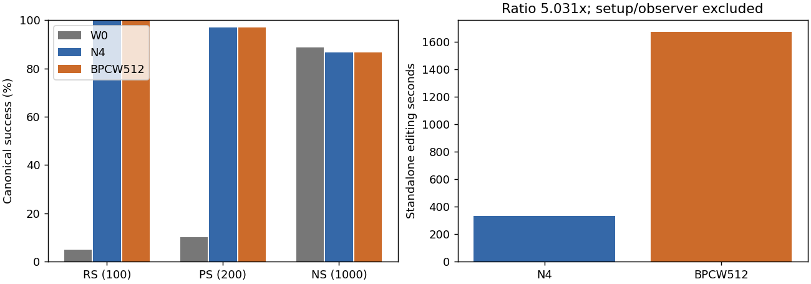

# BPCW512 v2 — cold B1 상세 사실 보고

상태: **B1_GATE_FAIL / B1 한 batch만 완료 / WAITING_USER_APPROVAL_FOR_SEQUENTIAL**.
N4/BPCW512는 Server4 동일 GPU/runtime의 W0/zeroM4에서 새로 계산한 native100 한 번을 공유했다.
사용자 별도 승인 전 B2–B10은 제출·예약·실행하지 않았다. 여섯 gate가 모두 통과하더라도 sequential 권한은 발생하지 않는다.
모델 revision `8afb486c1db24fe5011ec46dfbe5b5dccdb575c2`, method seed20260916, FP32/eager 및 matmul/cuDNN TF32off,
physical L4 down_proj [4096,14336] 하나다. Native L2=1/lr=.1/decay=.5/clamp=.75/KL=.0625,
최대25 loss·24 Adam과 원 early-stop 수식을 유지했다. Canonical evaluator MB16과 choice MB1을 구분한다.
공통 context의 실제 token/RNG/P4 binding은 실행 lock 및 runtime-load.json에 결속했다. 같은 source라는 사실을 다른 hardware bitwise 동등성으로 확대하지 않는다.

## 1. 범위와 원분모

고정 O0 first100(100 unique requests), R100/P200/N1000. RS/PS는 new NLL < true NLL,
NS는 true NLL < new NLL이며 tie=failure다. 모든 요청과 fallback을 분모에 유지했다.
아래 값은 저장된 원 new/true NLL 쌍에서 별도 CPU reducer로 재집계했으며 실제 endpoint/state 및 case/prompt/target/order와 결속했다.

| arm | metric | numerator | denominator | percent | delta_N4_pp | ties |
| --- | --- | --- | --- | --- | --- | --- |
| W0 | RS | 5 | 100 | 5 | -95 | 0 |
| W0 | PS | 20 | 200 | 10 | -87 | 0 |
| W0 | NS | 886 | 1000 | 88.6 | 2.1 | 0 |
| N4 | RS | 100 | 100 | 100 | 0 | 0 |
| N4 | PS | 194 | 200 | 97 | 0 | 0 |
| N4 | NS | 865 | 1000 | 86.5 | 0 | 0 |
| BPCW512 | RS | 100 | 100 | 100 | 0 | 0 |
| BPCW512 | PS | 194 | 200 | 97 | 0 | 0 |
| BPCW512 | NS | 865 | 1000 | 86.5 | 0 | 0 |



R/P/NS의 반대 방향 변화를 상쇄한 단일 성공 점수는 만들지 않았다.
N4는 이번 새 native endpoint이며, 과거 EN/cold7 또는 own-trajectory shadow를 독립 대조로 대신 쓰지 않았다.

## 2. 요청별 paired 변화, strict와 W0-correct N

아래는 N4→BPCW512의 같은 문항 전이다. 동일 총점이 동일 성공 ID 집합을 뜻하지 않는다.
전체 identity별 전이는 paired-RS/PS/NS.csv, NLL 평균/분위수/tail은 NLL-distributions.csv에 보존했다.

| metric | denominator | lost | gained | net_gain | mean_new_NLL_delta | maximum_new_NLL_increase |
| --- | --- | --- | --- | --- | --- | --- |
| RS | 100 | 0 | 0 | 0 | 0 | 0 |
| PS | 200 | 0 | 0 | 0 | 0 | 0 |
| NS | 1000 | 0 | 0 | 0 | 0 | 0 |

TF-strict와 pair-NLL 성공은 별도다. two-P는 두 paraphrase 모두 성공해야 하며 joint는 rewrite도 포함한다.

| arm | denominator | rewrite_strict | two_P_strict | R_two_P_strict | R_two_P_NLL_joint |
| --- | --- | --- | --- | --- | --- |
| W0 | 100 | 0 | 0 | 0 | 5 |
| N4 | 100 | 100 | 44 | 44 | 96 |
| BPCW512 | 100 | 100 | 44 | 44 | 96 |

Greedy32는 canonical TF와 별도로 관측했다. `target_over32_censored`와 실제 max32 도달은 다른 항목이다.

| arm | denominator | target_prefix_match | stopped_on_original_EOS | reached_max32 | target_over32_censored |
| --- | --- | --- | --- | --- | --- |
| N4 | 100 | 100 | 0 | 100 | 0 |
| BPCW512 | 100 | 100 | 0 | 100 | 0 |

W0-correct N은 같은 actual W0 관측에서 성공한 neighborhood만 조건부 분모로 사용한다.

| arm | W0_correct_N | retained | lost | retention_percent |
| --- | --- | --- | --- | --- |
| W0 | 886 | 886 | 0 | 100 |
| N4 | 886 | 862 | 24 | 97.2912 |
| BPCW512 | 886 | 862 | 24 | 97.2912 |

## 3. Reference512와 Dev128의 실제 choice

R512=S64+Reserve320+사전봉인 추가 train128, Dev128은 별도 observer다. 입력SHA `507b202108acc90e10810455f57da60df14e9e9e31ba567c8c75f51cf76afaeb`.
추가 입력 선정의 legacy overlap 검사에 있던 미래 CounterFact/공식 P/N 경로를 모델 실행 전에 제거했다.
v1/v2 입력 bytes는 같았으나 정책·receipt는 분리 보존했다. 기존384의 역사적 sampler provenance를 지우지 않았다.
Report256는 중복 제외용 기존 입력 fingerprint만 사용했으며 답변 capsule/모델평가를 열지 않았다.

W0 deterministic raw argmax(max16), 모델 설정 EOS, 동일 W0-generated prefix의 모든 보호 위치/full vocabulary를 사용한다.
Top8은 provenance일 뿐 competitor 제한이 아니다. W0 답변을 사실 정답으로 주장하지 않는다.
실제 생성 EOS는 보호 label에 포함하며, 길이16 censor이면 가짜 EOS를 추가하지 않는다.
이번 W0 640개는 모두 censored/EOS0이므로 actual EOS 종료 branch를 관측했다고 쓰지 않는다. candidate_TF_EOS는 고정 prefix에서 EOS를 예측한 횟수이지 자유생성 종료 측정이 아니다.
아래 main metric은 fixed-prefix teacher forcing이며 자유생성 전체 유지 보장이 아니다. fixed8 greedy는 사전봉인 별도 observer다.

| arm | split | documents | positions | retained_sequences | token_flips | base_EOS_sequences | base_censored_sequences | candidate_TF_EOS_choices | mean_d |
| --- | --- | --- | --- | --- | --- | --- | --- | --- | --- |
| N4 | R512 | 512 | 8192 | 398 | 137 | 0 | 512 | 0 | 0.00165802 |
| BPCW512 | R512 | 512 | 8192 | 398 | 137 | 0 | 512 | 0 | 0.00165802 |
| N4 | Dev128 | 128 | 2048 | 104 | 28 | 0 | 128 | 0 | 0.00481756 |
| BPCW512 | Dev128 | 128 | 2048 | 104 | 28 | 0 | 128 | 0 | 0.00481756 |

확률 감쇠 d=logp_W0(base token)−logp_current(base token)는 진단량이다. d threshold/평균KL을 목적이나 선택 기준으로 추가하지 않았다.
Dev flip은 독립 observer이며 R512 조건 충족과 구별한다.
Reference와 current의 의미상 직접 fact 충돌을 전수 판정하는 semantic audit는 미측정이다.
입력·중복·split 검사는 의미상 양립성 증명이 아니며, 이번 reference 미충족을 특정 원인의 증거로 해석하지 않는다.

## 4. 실제 보정 경로와 최소거리 문제

선택 상태 `REFERENCE_BUDGET_NATIVE_FALLBACK`, nonlinear round 2, pair-scalar backward 1046,
candidate full-bank scan 2, final current guard 0.
actual correction norm=0, ideal norm=0.
native update norm=7.61165279867; actual correction/native ratio=0.
selected SHA `3d33f44b13688fb3c18db8eb4d8be5cc6509aea161c96bed254e89240f265015`; native SHA `3d33f44b13688fb3c18db8eb4d8be5cc6509aea161c96bed254e89240f265015`.

교정공간은 Q=V(I−JJ†)Vᵀ, J=VᵀK_E이며 D=DQ, DK_E=0이다.
K_E는 current native/canonical old+new의 전체 valid token에서 얻었다. 임의 CA/output-span 제한을 추가하지 않았다.
P_raw는 native 그대로 사용하며 P_star는 봉인된 native allowed-range provenance로 결속한다.
space status `RESOLVED`, allowed rank=14326, blocked rank=4596, q=9730, actual distinct K columns=4596.
rank/spectrum/ambiguity와 실제 검사는 geometry-summary.json 및 원 기술 receipt를 참조한다.
원 geometry helper의 `kind=EN-F`는 null-space 생성자의 내부 라벨이며 이번 optimizer가 EN-F라는 뜻이 아니다. 선택은 BPCW minimum-norm QP다.

각 local row는 해당 reference의 worst protected position/competitor다. Round2는 이전 pair를 유지하고 새 worst pair를 추가하며,
전체 exposed gradient를 실제 FP32 center에서 다시 계산한다. RHS는 −mu+〈raw gradient,W_center−W_N〉,
해는 **양의** dual 합 D=+Σalpha_i h_i다. Native W_N에서 FP32 materialize한다.
목적은 native로부터 Frobenius 최소 이동이며 평균KL·확률floor·새 normcap/ridge는 없다.
GSS는 full local QP의 working-set 순서이지 reference/gradient bank 축소가 아니다.
저장된 같은 local 문제의 full/most-violation CPU audit은 모델 재실험이나 nonlinear 전역 최적성 증명이 아니다.

| round | rows | candidate_scanned | all_choices | token_flips | ideal_norm | actual_norm | CPU_same_problem_order_audit |
| --- | --- | --- | --- | --- | --- | --- | --- |
| 1 | 512 | True | False | 54 | 0.03381565559897504 | 0.03381565589315327 | PASS_CPU_SAME_PROBLEM_ONLY |
| 2 | 534 | True | False | 13 | 0.0361599139046637 | 0.03615991385760219 | PASS_CPU_SAME_PROBLEM_ONLY |

전체 factor row의 원 RHS 산술·이전 pair 유지·실제 호출 수는 mechanism-audit.json/factor-row-ledger.csv로 독립 확인했다.
QP-independent-arithmetic.csv는 저장 G/b/alpha의 raw-unit slack·dual·complementarity를 다시 계산한다.
이는 동일 solver의 row-scaled KKT certificate와 구별하며 전체 factor/D의 독립 재구성으로 확대하지 않는다.

Native 모든 choice가 안전하면 D=0으로 gradient/QP를 생략한다. 처음 reference-safe 후보에 current guard를 한 번 적용하며 실패하면 native fallback이다.
Reference 위반이 있는 fallback은 reference PASS가 아니다. Budget 종료는 전체 비선형 infeasibility 증명이 아니다.
Past는 B1 이전 요청이 없으므로 N/A0이다. 후보 중 history append0, 각 arm committed endpoint에서 native history1이다.

## 5. 설계 → 실행 코드 → 저장 증거

실행 `ae3237f12c70b77fcea6c5fae7bdb8538c6310a1` / tree `1d62c423601196cbeb4272ee09f2f9ea149682c3`. 표의 source 확인과 실제 검증 수준을 구별한다.
전체 file SHA는 design-conformance.csv에 있으며 line은 frozen source 기준이다.

| requirement | file | function | line | evidence | verification_level |
| --- | --- | --- | --- | --- | --- |
| B1 only / sequential fail closed | config.py | require_scope | 17 | execution-entry.json; two commits | SOURCE_CONFIRMED_AND_RUNTIME_SCOPE |
| fresh native W0/M0 once, hparams fixed | model.py | native | 75 | native/native-binding.json; terminal.native_actual_executions | SOURCE_AND_STORED_RECEIPT |
| W0 raw argmax, configured EOS, 16 tokens | choice.py | raw_greedy | 13 | capsule-manifest.json; technical/base-R512/generation-TF.json | ACTUAL_BOUNDED_PARITY_AND_FULL_TF_BINDING |
| all positions/full vocab; top8 diagnostic only | choice.py | scan | 73 | controller/native-reference.json; round*/reference.json | STORED_COMPLETE_POSITION_COUNTS |
| two-row fresh all-token scalar gradient factors | choice.py | pair_factor | 103 | technical/pair-*-AD.json; controller/round*/factors/rows.json | ACTUAL_REFERENCE4_AD_CHECK_PLUS_RUNTIME |
| actual center raw gradient RHS, positive sum | factors.py | build | 24 | round*/qp-problem.pt; factor row b/mu/raw_center_inner | CPU_FORMULA_REPLAY_AVAILABLE |
| full Gram, no row subsampling | factors.py | gram | 61 | technical/actual-factor-Gram.json; round*/qp-problem.pt | ACTUAL_REFERENCE4_GRAM_AND_FULL_LOCAL_CPU_AUDIT |
| minimum-norm QP / full-bank GSS, no ridge | qp.py | solve | 386 | round*/qp-solution.json; ordering-audit.json | KKT_AND_SAME_LOCAL_PROBLEM_CPU_AUDIT |
| all512 exposed / retain old pairs / max2 rounds | controller.py | run | 20 | controller/selection.json; round/factor receipts | STORED_COUNTERS_AND_SOURCE |
| FP32 from immutable WN; one current guard | checks.py | current_guard | 26 | current-invariant.json or exact selected=native hash | ACTUAL_RECORDED_PATH_ONLY |
| official P/N, Dev after both selection seals | runner.py | run | 30 | endpoint-seals.json; arm/current.json observer receipt | SOURCE_AND_RUNTIME_NONMUTATION |
| wholebatch native history exactly once / atomic CP | transaction.py | commit | 12 | arms/*/checkpoint.pt; commit.json; reload-forward.json | CPU_W_M_HASH_AND_RUNTIME_PHYSICAL_RELOAD |

## 6. 여섯 B1 gate

| gate | name | passed | evidence |
| --- | --- | --- | --- |
| 1 | technical/source/state | True | INTEGRATED_MODEL_CHECKS_PASS |
| 2 | all reference choices/current/Past | False | token_flips=137;Past=N/A0 |
| 3 | RS/PS additional lost IDs zero | True | RS=0;PS=0 |
| 4 | NS net/W0-correct N no additional loss | True | NSnet=0;W0loss=0 |
| 5 | Dev choice flips no increase | True | flip_delta=0 |
| 6 | standalone editing <=2x matched N4 | False | ratio=5.03147716 |

현재 gate 결과는 `B1_GATE_FAIL`이다. 비용만 실패하면 B1_BUDGET_FAIL로 구분한다.
이 표는 한 cold B100의 관측이며 일반적 비열화/장기성능/우월성의 증명이 아니다. 효능 해석·후속정책 선택은 GH 영역이다.

## 7. 기술 수리와 검증 한계

최초 source dd21a22/job50291은 CPU/source 감사에서 QP near-singular 반례가 확인되어 중단했다.
이는 실제 모델 QP 실패 관측이 아니라 QP 본계산에 들어가기 전 CPU 감사에서 발견한 구현 오류다. 첫 job은 capsule 준비만 수행했고 nativefit0/endpoint0, 267 allocated GPU-sec였다.
완결 W0 capsule151개를 input/model/source identity로 확인해 새 attempt에서 재사용했다. 원로그·부분자료·source는 보존했다.
수정은 false infeasible 분류, zero-direction FD의 거짓 PASS 집계, actual factor/Gram 조건 누락에 한정했다.
QP 상수·수식·arm·quality ceiling을 바꾸지 않았다. 불확실한 작은 고유방향은 typed technical uncertainty이며 정상 fallback으로 숨기지 않는다.

CPU35 checks와 bounded 별도 solver 구현/감사를 수행했다. 전체 실제 모델 검증 상태는 `INTEGRATED_MODEL_CHECKS_PASS`이며
reference4/current prefix의 direct AD/FD/cache·physical/Gram 검사 범위다. 광범위 모델 미분 검증 또는 모든 reference의 direct-gradient parity로 확대하지 않는다.
0방향·미해결 rank는 FD PASS와 구별한다. B1 CP는 CPU weights_only/schema/finite/hash 및 실제 물리 weight reload와 제한된 forward parity를 확인한다.

| check | status | value | ceiling | scope |
| --- | --- | --- | --- | --- |
| pair-0-AD | PASS | 1.4582818596661715e-07 | 0.0001 | one actual scalar pair |
| pair-1-AD | PASS | 1.1274870633843512e-07 | 0.0001 | one actual scalar pair |
| pair-2-AD | PASS | 1.0972844336492437e-07 | 0.0001 | one actual scalar pair |
| pair-3-AD | PASS | 9.34173564592831e-08 | 0.0001 | one actual scalar pair |
| factor-Gram | PASS | 1.0401118611686931e-14 | 1e-10 | actual reference4 if resolved; otherwise N/A |

FD-fixed-grid.csv는 두 방향의 사전 고정12scale 전체를 포함한다. 큰 scale의 불일치를 숨기지 않았으며,
통과는 사전 규약의 인접2scale 기준이다. fixed competitor pair 미분이며 tie에서 변화하는 max-margin 미분과 다르다.
**B2 GPU continuation은 실행하지 않았다.** CPU 재적재/receipt를 새 sequential continuation PASS로 쓰지 않는다.
저장된 native WN+ideal correction의 FP32 materialization과 BPCW checkpoint의 byte equality는 CPU-endpoint-reconstruction.json으로 별도 확인했다.
이는 모든 factor에서 selected D를 독립 재계산하거나 모델 전체 forward를 replay한 검증은 아니다.
보고용 reducer에는 별도 독립 source/schema 감사와 synthetic CPU8 회귀검사를 수행했다. 보고의 endpoint/capsule 연결·KKT 판정 누락을 보완했으며 실행 runtime·원자료·수치 결과는 변경하지 않았다.

## 8. 비용·메모리·보존

| component | seconds | aggregation |
| --- | --- | --- |
| answer_capsule_setup | 541.576 | EXCLUSIVE_TOP_LEVEL_PROGRAM_PHASE |
| native_shared_once | 297.308 | EXCLUSIVE_TOP_LEVEL_PROGRAM_PHASE |
| fixed_reference_key_cache_setup | 18.2428 | EXCLUSIVE_TOP_LEVEL_PROGRAM_PHASE |
| base_capsule_validation | 123.828 | EXCLUSIVE_TOP_LEVEL_PROGRAM_PHASE |
| current_keys_geometry | 118.032 | EXCLUSIVE_TOP_LEVEL_PROGRAM_PHASE |
| integrated_technical | 408.296 | EXCLUSIVE_TOP_LEVEL_PROGRAM_PHASE |
| current_anchor | 102.912 | EXCLUSIVE_TOP_LEVEL_PROGRAM_PHASE |
| controller | 1117.96 | EXCLUSIVE_TOP_LEVEL_PROGRAM_PHASE |
| official_dev_generation_observers | 294.082 | EXCLUSIVE_TOP_LEVEL_PROGRAM_PHASE |
| CPU_QP_order_audit | 0.288296 | EXCLUSIVE_TOP_LEVEL_PROGRAM_PHASE |
| N4_commit | 35.4847 | EXCLUSIVE_TOP_LEVEL_COMMIT |
| BPCW512_commit | 38.2269 | EXCLUSIVE_TOP_LEVEL_COMMIT |
| N4_history_seconds | 13.4027 | NESTED_IN_COMMIT_DO_NOT_SUM |
| N4_checkpoint_io_seconds | 7.19809 | NESTED_IN_COMMIT_DO_NOT_SUM |
| BPCW512_history_seconds | 13.8835 | NESTED_IN_COMMIT_DO_NOT_SUM |
| BPCW512_checkpoint_io_seconds | 8.01043 | NESTED_IN_COMMIT_DO_NOT_SUM |
| N4_standalone_editing | 332.793 | COMPARISON_VIEW_NATIVE_INCLUDED |
| BPCW512_standalone_editing | 1674.44 | COMPARISON_VIEW_NATIVE_INCLUDED |
| program_wall | 3308.38 | TOTAL_NOT_ADD_TO_PHASES |

실제 shared native fit은 1회다. standalone 비교에는 같은 native 비용을 각 arm에 포함하지만 실제 연구 총비용에는 중복 청구하지 않는다.
표의 standalone view/전체wall/nested component를 서로 합산하지 않는다. Setup W0 capsule/cache와 통합기술/observer는 2× gate의 editing과 분리했다.
반면 BPCW current K/Q·native anchor·controller·전체 commit(atomic 저장·재적재 포함)은 editing에 포함했다. History/I-O는 commit 내부 timer이므로 다시 합산하지 않는다. 순수 writer는 native inclusive에서 NOT_SEPARATED다.
GPU allocated seconds는 accounting.json 원job행 기준이며 extern/batch 중복합산0; utilization으로 부르지 않는다.
peak GPU allocated=36129717248 bytes, peak host=34566276 KiB.
실제 완료 attempt의 parent GPU allocation은 아래와 같다. 첫 취소267초와 별도이며 이미 합산한 값이 아니다.

| job | state | exit | start | end | allocated_GPU_seconds | GPU_hours |
| --- | --- | --- | --- | --- | --- | --- |
| 50305 | COMPLETED | 0:0 | 2026-09-18T21:40:57 | 2026-09-18T22:36:10 | 3313 | 0.920278 |

Start/end는 Slurm이 반환한 서버 로컬 시각 문자열이고, receipt 수집 시각은 별도 UTC다.
Forward/token/교사강제/두-logit backward의 실제 계수는 runtime-work-counters.json에 보존했다. 이 계수에는 명시된 기술·관측 경로가 포함될 수 있어 phase별 timer와 중복 합산하지 않는다.
두 W/M/RNG/context/ledger/registry atomic B1 checkpoint를 보존한다. 원자료 actual bytes와 SHA는 raw-inventory.json, CPU tensor 검산은 checkpoint-inventory.csv에 있다.
전체 pretrained/Jacobian/512개 dense W-gradient를 저장하지 않았다. Gradient는 pair activation/projected-key factors와 bounded 기술4개 dense 증거로 구분했다.

## 9. 기존 EN 정리와 권한 경계

새 제출 전에 EN50071_0/_2/_3을 exact ID로 취소하고 terminal/resource release를 확인했다. 완료된 EN-F50071_1은 재취소하지 않았다.
사용자 지시에 따라 EN checkpoint52개(29,480,834,368 logical bytes)를 원위치 영구삭제했다.
공용 model/tokenizer/dataset/P/stats/context/reference/teacher/native target·key·공용 capsule 및 평가·생성·로그·source·receipt는 보존했다.
삭제 파일의 별도 복구사본은 확인하지 않았으며 기존 EN exact checkpoint resume은 불가하다.
새 BPCW 두 checkpoint는 삭제 대상이 아니다. 공유filesystem free delta를 독점 해제량으로 주장하지 않았다.

## 10. 재현·종료

원 scientific output: `/data/janghj/ODE-edit/local/bpcw512/20260918-v2/B1/attempt-r1/output`. Lock SHA `1e70d880d4d77883300891089fbebd8ab7500be90a33060a74632d16920a5a3a`.
아래는 이미 완료된 원자료의 CPU 재집계 명령이다. 새 GPU 실행 명령이 아니다.

```bash
python -B -m project.run_scripts.base_choice_constrained_write.review --output /data/janghj/ODE-edit/local/bpcw512/20260918-v2/B1/attempt-r1/output --accounting <saved-accounting.json> --report <new-empty-review-directory>
python -B -m project.run_scripts.base_choice_constrained_write.publication --output /data/janghj/ODE-edit/local/bpcw512/20260918-v2/B1/attempt-r1/output --report <review-directory> --repo <analysis-worktree>
```

Report256 미개봉, 새로운 arm/order/후속job0. `max_batches=1`, `sequential_authorized=false` 유지.
최종 상태 **WAITING_USER_APPROVAL_FOR_SEQUENTIAL**, monitoring_active=false, automatic_resume=false.
