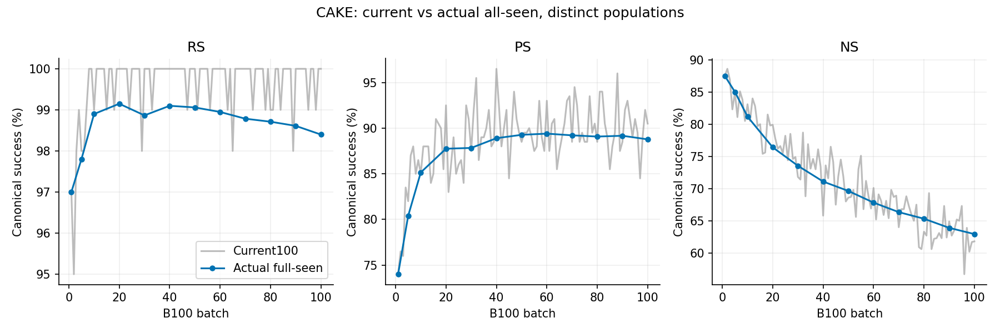
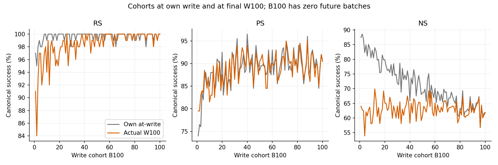
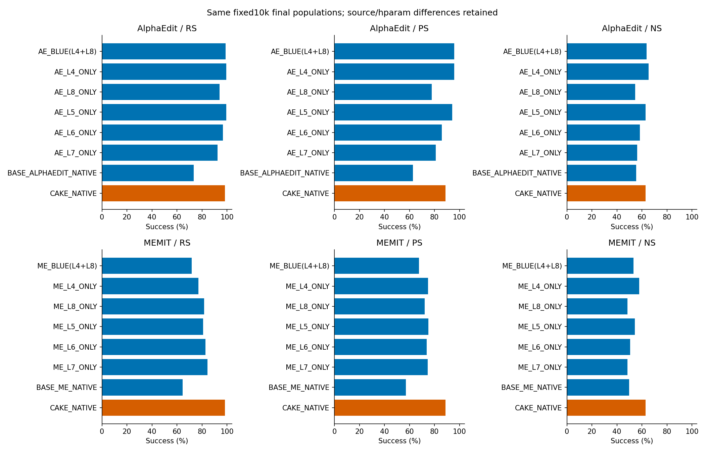

# CAKE_NATIVE — fixed10k B100×100 완료 사실 리뷰

Instruction `ODEEDIT-S06-SERVER4-COMPLETED-CAKE-CAP-DETAILED-REVIEW-SH4-V1`. Job48101은 scheduler COMPLETED0:0이며 실제 terminal/100commit/99기록연결/10000요청을 별도 확인했다. 제출 당시 PENDING을 과거 initial PASS로 바꾸지 않는다. 새GPU/모델/평가0.

## 1. actual W100/full10000 최종값

| metric | n/d | % | desired strict | NLL new mean/p99 | NLL true mean/p99 |
| --- | --- | --- | --- | --- | --- |
| RS | 9840/10000 | 98.4 | 9170/10000 | 0.4027635672873366/6.872569804191594 | 9.950044960516202/20.089672260284424 |
| PS | 17755/20000 | 88.775 | 12266/20000 | 1.9879314977940237/11.707587938308711 | 7.807592159361718/17.384306812286376 |
| NS | 62935/100000 | 62.935 | 12525/100000 | 7.334778914400568/17.751606292724595 | 5.75052846182981/15.763511657714844 |

RS/PS newNLL<trueNLL, NS trueNLL<newNLL, tie=failure. 全分모10000/20000/100000, ties0. R strict9170/10000, P strict12266/20000, two-P strict4550/10000은 canonical 순위 성공과 별도다. Native target의 prefix-space/token 규약과 canonical observer는 원 source를 따른다.

## 2. 동일10k family별 baseline 비교

W0 pre-edit RS791/10000, PS1997/20000, NS89212/100000은 기존42673 publication에서 재사용한다. 아래14개 기존chain 결과는 봉인 정본 재사용이며 이번새실험이 아니다. BASE_*_NATIVE는 five-layer blue=False, *_BLUE(L4+L8)는 BLUE pair, singleton은 명시 layer다. Legacy ORIGINAL은 BLUE를 뜻하므로 그 단독표기를 쓰지 않는다.

### AlphaEdit family + CAKE reference

| method | RS n/10000 | PS n/20000 | NS n/100000 | allocated GPU-sec |
| --- | --- | --- | --- | --- |
| AlphaEdit_BLUE(L4+L8) | 9888 | 19155 | 63726 | 43362 |
| AlphaEdit_L4_ONLY | 9939 | 19136 | 65348 | 39361 |
| AlphaEdit_L8_ONLY | 9396 | 15556 | 54703 | 30935 |
| AlphaEdit_L5_ONLY | 9934 | 18839 | 62822 | 38701 |
| AlphaEdit_L6_ONLY | 9683 | 17148 | 58396 | 37919 |
| AlphaEdit_L7_ONLY | 9240 | 16194 | 56277 | 32992 |
| BASE_ALPHAEDIT_NATIVE | 7343 | 12577 | 55285 | 37168 |
| CAKE_NATIVE | 9840 | 17755 | 62935 | 32194 |

### MEMIT family + CAKE reference

| method | RS n/10000 | PS n/20000 | NS n/100000 | allocated GPU-sec |
| --- | --- | --- | --- | --- |
| MEMIT_BLUE(L4+L8) | 7183 | 13530 | 53287 | 41835 |
| MEMIT_L4_ONLY | 7722 | 14966 | 57848 | 38264 |
| MEMIT_L8_ONLY | 8177 | 14460 | 48425 | 25284 |
| MEMIT_L5_ONLY | 8084 | 15008 | 54285 | 35452 |
| MEMIT_L6_ONLY | 8277 | 14761 | 50488 | 27142 |
| MEMIT_L7_ONLY | 8444 | 14941 | 48547 | 25849 |
| BASE_MEMIT_NATIVE | 6453 | 11407 | 49838 | 43968 |
| CAKE_NATIVE | 9840 | 17755 | 62935 | 32194 |

CAKE 대비 BASE_ALPHAEDIT_NATIVE 및 BLUE/L4-only 등의 paired loss/gain은 baseline-paired.csv에 local case/prompt/target identity가 일치한 범위만 집계했다. Aggregate와 paired 검증은 구별한다. 환경·hparam 차이가 있어 layer allocation만의 인과효과나 우열을 판정하지 않는다.

## 3. 12개 actual fullseen과 순차 retention

| batch/seen | RS | PS | NS |
| --- | --- | --- | --- |
| 1/100 | 97/100 | 148/200 | 875/1000 |
| 5/500 | 489/500 | 804/1000 | 4251/5000 |
| 10/1000 | 989/1000 | 1703/2000 | 8118/10000 |
| 20/2000 | 1983/2000 | 3510/4000 | 15281/20000 |
| 30/3000 | 2966/3000 | 5270/6000 | 22062/30000 |
| 40/4000 | 3964/4000 | 7112/8000 | 28437/40000 |
| 50/5000 | 4953/5000 | 8927/10000 | 34815/50000 |
| 60/6000 | 5937/6000 | 10728/12000 | 40693/60000 |
| 70/7000 | 6915/7000 | 12490/14000 | 46440/70000 |
| 80/8000 | 7897/8000 | 14253/16000 | 52254/80000 |
| 90/9000 | 8875/9000 | 16050/18000 | 57510/90000 |
| 100/10000 | 9840/10000 | 17755/20000 | 62935/100000 |

매 batch Current100과 all-seen RS는100시점; full R/P/N은12시점이다. 동일 endpoint current를 fullseen에서 재사용했음을 모든12시점 원 rows로 확인했다. 이 rows를 독립 추가평가/표본으로 합산하지 않는다. B10 actual first1000은989/1703/8118이며 W100의first1000과도 다른 상태다.

| 대조/population | metric | before→after | lost/gained | 조건부 loss/recovery 분모 | desired NLL harm p95/p99 |
| --- | --- | --- | --- | --- | --- |
| ATWRITE_TO_W100/ALL_REQUESTED | RS | 9962→9840 | 138/16 | 9962/38 | 2.0951619783416313/6.138369655795419 |
| ATWRITE_TO_W100/ACTIVE_TARGET | RS | 9754→9654 | 116/16 | 9754/37 | 1.5943628922104836/5.254629162279906 |
| ATWRITE_TO_W100/SUPERSEDED | RS | 208→186 | 22/0 | 208/1 | 7.550914482399821/10.788037991523735 |
| W5_TO_W100/SAME_FIRST500 | RS | 489→462 | 34/7 | 489/11 | 5.365939203416908/9.848349389794745 |
| W10_TO_W100/SAME_FIRST1000 | RS | 989→937 | 57/5 | 989/11 | 4.940703731402751/9.630845114775001 |
| W50_TO_W100/SAME_FIRST5000 | RS | 4953→4859 | 103/9 | 4953/47 | 2.5405452169477942/5.850492154965198 |
| ATWRITE_TO_W100/ALL_REQUESTED | PS | 17767→17755 | 651/639 | 17767/2233 | 2.6358247190713873/5.7915330696105825 |
| ATWRITE_TO_W100/ACTIVE_TARGET | PS | 17482→17508 | 587/613 | 17482/2100 | 2.5051933169364955/5.600352082252496 |
| ATWRITE_TO_W100/SUPERSEDED | PS | 285→247 | 64/26 | 285/133 | 5.913918375968932/8.404932876527297 |
| W5_TO_W100/SAME_FIRST500 | PS | 804→819 | 89/104 | 804/196 | 4.60468502119183/7.3218531820876525 |
| W10_TO_W100/SAME_FIRST1000 | PS | 1703→1675 | 158/130 | 1703/297 | 4.640455132722854/7.705416175872086 |
| W50_TO_W100/SAME_FIRST5000 | PS | 8927→8770 | 413/256 | 8927/1073 | 2.8405892103910397/5.655918829292059 |
| ATWRITE_TO_W100/ALL_REQUESTED | NS | 71388→62935 | 12107/3654 | 71388/28612 | 5.2060564815998065/8.687294243201604 |
| ATWRITE_TO_W100/ACTIVE_TARGET | NS | 70031→61689 | 11833/3491 | 70031/27879 | 5.211917006969453/8.710314793586733 |
| ATWRITE_TO_W100/SUPERSEDED | NS | 1357→1246 | 274/163 | 1357/733 | 4.933136129379273/7.644603692889223 |
| W5_TO_W100/SAME_FIRST500 | NS | 4251→3053 | 1376/178 | 4251/749 | 8.228599905967714/11.309831127009826 |
| W10_TO_W100/SAME_FIRST1000 | NS | 8118→6087 | 2404/373 | 8118/1882 | 7.755427291709922/10.608260371983054 |
| W50_TO_W100/SAME_FIRST5000 | NS | 34815→31395 | 5654/2234 | 34815/15185 | 4.480193328857422/7.7371215796470665 |

At-write pooled RS9962→W1009840은138 loss/16 recovery를 포함한다. 서로 다른 at-write W를 하나의W0/endpoint로 부르지 않는다. ACTIVE_TARGET/SUPERSEDED는 전체10000 requested event의 exact subject/relation 최신target문자열로 분리하며 same-target 재발행을 active로 둔다. Active9791/superseded209이며 CAKE에는 EP accepted-only ledger가 없다. Superseded 실패를 모두 순수 forgetting으로 치환하지 않는다.

cohort-retention.csv는100개B100 cohort마다 ALL atwrite→W100/conditional분모와NLLtail, rewrite-trajectories.csv는실제저장된매batch RS 실패·회복 event를 담는다. 관측시점 사이의 정확한 실패시간은 추정하지 않는다. B100 cohort는future batch0이다. 초기100/500/1000·중간/후반 차이는그림과CSV의실제값으로제시한다.

## 4. 원본 CAKE가 실제 어떻게 호출됐는가

원본c8243e1/tree4f59249(MIT), 실행wrapper7884aeb/tree4dabdb1. 실제native복사본은 미사용 notebooks.util import1줄 제거와EOF LF 외동일AST이며 compute_z/compute_ks bytes도동일하다. 원본CLI 대신wrapper를쓴것은fixed sample·canonical평가·user no-CP 연결때문이다. 원본의compute_optimal_deltas를사용하지않고apply_Cake_to_model을100회직접호출했다.

| 요구 | executed source:line | 근거 | 검증수준 |
| --- | --- | --- | --- |
| original apply once B100 | runtime.py:119 | 100 native-observation/commit | SOURCE_AND_STORED_TELEMETRY |
| last L8 target once per request | Cake_main.py:95 | z[100] per batch, layer8 and case order | SOURCE_AND_STORED_TELEMETRY |
| current-state residual | Cake_main.py:131 | keys[4..8], solves5; residual tensor NOT_SAVED | SOURCE_CONFIRMED_PARTIAL_TELEMETRY |
| remaining causal-weight allocation | Cake_main.py:144 | layer-weights CPU source formula; log six decimals | SOURCE_AND_LOG_AGGREGATE |
| native projected direct solve | Cake_main.py:151 | 500 solve shape/dtype records | SOURCE_AND_STORED_TELEMETRY |
| history only original apply final pass | Cake_main.py:176 | 100 final passes /500 layer histories | SOURCE_AND_STORED_TELEMETRY |
| observer/current+allseen; no controller feedback | runtime.py:132 | current and fullseen state hashes | SOURCE_AND_REDUCED_ROWS |
| no saved W/M | runtime.py:156 | 0 pt files, metadata links99 | USER_DIRECTED_NO_CP_NOT_REPLAY |

각batch entry에서 최종L8 target100개를한번만만든다. 이후physicalL4..8을순서대로돌며현재state의K와L8readout을다시읽고 R=Z−Y, effective_ratio=w_i/sum(w_i..w_4), residual=effective_ratio·R를원native projected directsolve에넣는다. 앞층write후다음층의residual은현재edited state다. 마지막에모든층현재keys를다시읽어cache_c각1append한다. wrapper추가finalize0이다.

| physical/P index | causal score | normalized weight FP32 | remaining ratio FP32 |
| --- | --- | --- | --- |
| 4/0 | 0.4812439084 | 0.24395132064819336 | 0.24395132064819336 |
| 5/1 | 0.4743820429 | 0.22777311503887177 | 0.3012678027153015 |
| 6/2 | 0.4656370878 | 0.20870055258274078 | 0.3950599730014801 |
| 7/3 | 0.4440660179 | 0.16820606589317322 | 0.5263429880142212 |
| 8/4 | 0.4335190654 | 0.15136894583702087 | 1.0 |

위 ratio는원score/temperature.1의CPU산술도출이며raw GPU bit-parity가아니다. 따라서L8 normalized weight약.1514라도마지막remaining ratio는1이다. 10000개target z의layer8/order/hash/norm,500solve shape/dtype,1000key calls(5write+5history/batch),100history pass/500layerupdate가저장telemetry와일치한다. 원Residual/K/solve tensor 자체는미저장이므로이후독립tensor재현은불가하다.

원layers4..8/L2=10/decay=.4/clamp=.5/temperature=.1/원causal score0..4 유지. P physical4..8→asset0..4→local0..4. 기존BASE_ALPHAEDIT는decay=.5/clamp=.75로다르다. 모델revision8afb486c,FP32/eager/seed20260907·고정context·matmulTF32false/cudnnTF32true와canonicalMB16을재사용했다. Writer right-padding/BOSfalse, canonical helper는manual left-padding이다. 원README torch2.6/transformers4.51.3과실제2.9.1+cu128/4.44.2 차이를공개한다. 전체환경/수치동일성을주장하지않는다.

## 5. 실제 write·history·비개입의 근거 경계

100commit은W5개/cache hash와직전entry를연결하고RNG/context도99인접점에서일치한다. 평가before_after_exact와nonselected pointer/version guards,원본context/P최종assert기록을확인했다. 이는저장tensor재해시가아닌metadata/source/telemetry검산이다. layer-actions.csv의increment norm합(path length)은L4..8 각각 132.8843, 155.3918, 185, 213.0715, 334.448이며net endpoint delta는NOT_RECORDED다. 경로길이를누적net변화로부르지않는다.

사용자 “weight 저장하지말라” 지시에따라현재W/M tensor checkpoint0. Hash/RNG/context만으로복원가능checkpoint·exactrestart·GPUcontinuationPASS라고쓰지않는다. 저장하지않은CP의누락을오류로분류하거나재생성하지않았다. 원본raw·실행source·다른CP변경0.

## 6. 비용·조기종료·저장

| 항목 | 실측 또는 근거값 |
| --- | --- |
| Slurm allocated GPU-sec/h | 32194 / 8.942778 |
| program seconds | 32189.62 |
| load/setup seconds | 39.6427 |
| compute_z | 10000 |
| solve_calls | 500 |
| history_append_passes | 100 |
| layer_history_updates | 500 |
| key_calls | 1000 |
| edit_seconds | 12478.57 |
| target_seconds | 7746.184 |
| key_seconds | 3706.024 |
| solve_seconds | 59.85702 |
| evaluation_seconds | 17949.8 |
| GPU peak allocated bytes | 37612267520 |
| 현재 output files/bytes | 515 / 714442408 |
| native loss evaluations (log-derived) | 76952 |
| Adam updates (log-derived) | 66952 |
| early-stop requests / zero-update | 9623 / 16 |

Log의각Computing-right-vector→Init/Delta/Target boundary10000개와loss line을원compute_z break/step순서에대조해76952loss/66952Adam을도출했다. 이는native정수counter가아닌로그복원이며377개는25loss/24step,9623개는earlystop,16개는0update다. 0target-Adam도batchwrite0을뜻하지않는다. Request별prompt/log원문은local-only며보고에는집계만둔다.

target/key/solve는edit_seconds안의nestedtimer다. evaluation_seconds와program총시간사이남은overhead를purewriter라고추정하지않는다. Purewriter/readout/별도JSONI-O는NOT_SEPARATED/NOT_RECORDED,checkpoint I-O는user no-tensor다. SchedulerMaxRSS32046396K와GPUpeak는다른지표다. Utilization·통제된speedup은미측정이다. 이CPU리뷰새GPU시간0.

## 7. Coverage와 재현

원NLL/분모/identity/finite/ties/strict·100commit·99metadata links·12fullseen·원source/호출routing·actualcost는확인했다. 저장W/M/전체모델off-on/derivative/GPUcontinuation은미측정. W0재평가·GLUE/MMLU/새downstream·baseline rerun0. CSV raw-inventory/source-inventory/analysis-manifest와rooted-receipt에입출력SHA를결속한다. PNG는CSV기반직접코드생성. README의CPU재현명령에서출력은새namespace를사용하고scheduler조회는기존receipt를재사용한다. 최종효능/우열/원인및후속선택은GH소유다.

## 8. 저장 CSV로 생성한 그림

그림의 AE/ME는 AlphaEdit/MEMIT 약칭이다. 원 hparam·layer 차이를 보존하며, CAKE를 두 family에 표시한 것은 같은 CAKE 측정값의 참고 표시이지 두 번 실행한 것이 아니다.
