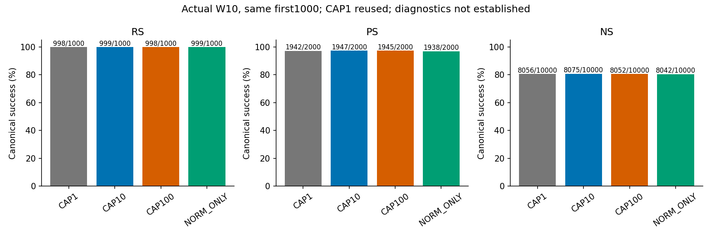
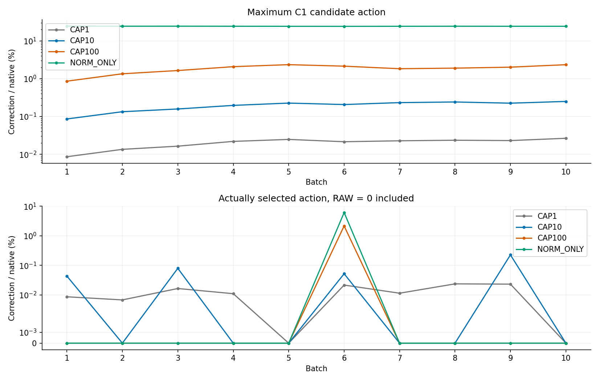
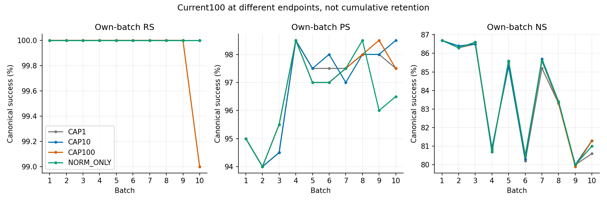
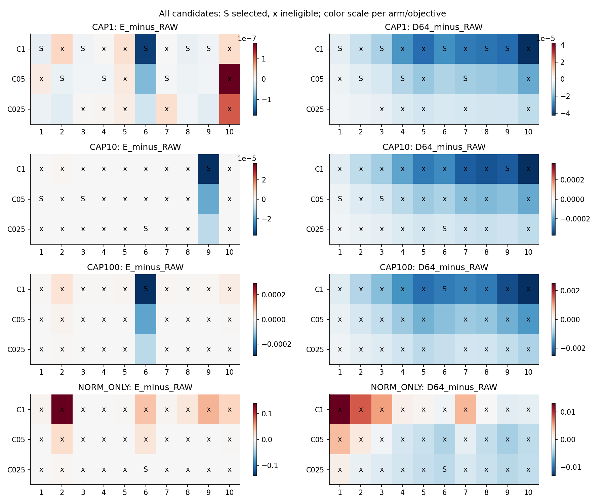
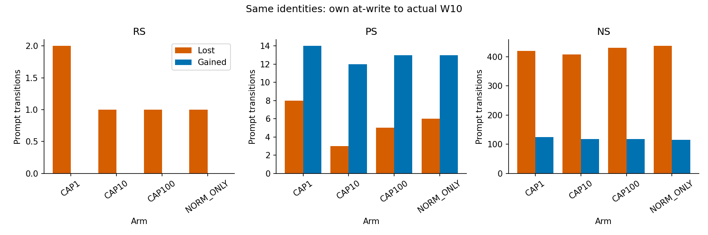
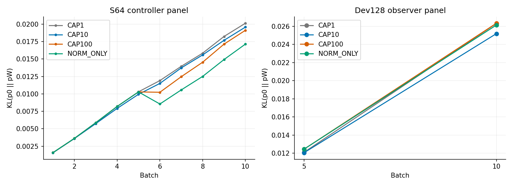

# EP-TW-1 alpha-cap sweep — W0→first1000 독립 정본 v2

보고 재구성 지시와 source는 analysis-manifest.json에 결속했다. 본 정본은 네 alpha-cap 정책의 완료 결과만 재구성한다. 현재 scheduler·raw tensor·모델 재평가 없이 완료리뷰 v1의 표와 검증 근거를 재사용한다. 수치·분모·선택 arm·검증 수준은 불변이다.

기존 과학 실행 Instruction `ODEEDIT-S06-EP-TW1-ALPHA-CAP-SWEEP-SH4-V1`. 이 보고서는 실행 조건·저장 값·CPU 산술·오류/한계만 기록한다. 과학적 우열·인과 해석·후속 선택은 GH 소유다.

## 목차

- [1. 범위와 완료 상태](#section-1)
- [2. Actual W10 원분모와 strict](#section-2)
- [3. 실제 action과 후보 선택](#section-3)
- [4. 설계 → 실제 동작과 검증 수준](#section-4)
- [5. 순차 유지·문항 전이·accepted ledger](#section-5)
- [6. Generic와 baseline 비교 경계](#section-6)
- [7. 비용과 저장](#section-7)
- [8. Coverage·미실행·산출물](#section-8)
- [9. 저장 근거로 확인한 설계-실행 상세](#section-9)
- [10. 독립 sweep 그림과 재현](#section-10)

## 1. 범위와 완료 상태

CAP1/job47962는 완료 reference 재사용. CAP10/CAP100/NORM_ONLY 각각 fresh pretrained W0/coldM0에서 같은 첫1000을 B100×10으로 처리했다. 신규3chains/30batches/3000 arm-request observations, unique1000이다. 비교 전체는4정책/40 logical batches이며 새4000 unique 편집이 아니다. CAP1 재실행0. 신규3arm의 당시10CP/arm 및 W10 보존 계약을 유지한다. 기존 monitoring 중지 이력과 완료리뷰 때의 한정 terminal 확인을 재사용하며, 이번 보고 재구성에서는 scheduler를 조회하지 않았다.

정확 신규jobs48148/48149/48150. Scheduler terminal은 별도 `scheduler-summary.csv` (기존 terminal 기록의 표)에 보존했고 scientific terminal과10commit/arm을 독립 확인했다. 전체 완료 확인 전의 PENDING 기록을 initial PASS로 소급하지 않는다. 신규 source8c64366c2314f188e034e5f4403fe89f0eaad873/tree76ef5072b70134bf4bc1f9d3659a056041922bde, archive304be4f3de58ce2f9457f63324646525000191609ba64e1bb1e290253e59ea21. 분석 source와 publication HEAD는 manifest에 별도 pin한다.

## 2. Actual W10 원분모와 strict

| Arm | RS n/1000 (%) | PS n/2000 (%) | NS n/10000 (%) | CAP1 대비 ΔR/ΔP/ΔN |
| --- | --- | --- | --- | --- |
| CAP1 | 998/1000 (99.800) | 1942/2000 (97.100) | 8056/10000 (80.560) | 0/0/0 |
| CAP10 | 999/1000 (99.900) | 1947/2000 (97.350) | 8075/10000 (80.750) | 1/5/19 |
| CAP100 | 998/1000 (99.800) | 1945/2000 (97.250) | 8052/10000 (80.520) | 0/3/-4 |
| NORM_ONLY | 999/1000 (99.900) | 1938/2000 (96.900) | 8042/10000 (80.420) | 1/-4/-14 |

RS/PS는 new NLL<true NLL, NS는 true NLL<new NLL, ties=failure다. Current100·whole1000·first500을 합쳐 분모를 늘리지 않았다. At-write는 각자 다른 W1..10의 관측이며 W10 retention과 별도다.

| Arm | R TF-strict | P TF-strict /2000 | two-P strict /1000 | NS true NLL mean/p99 |
| --- | --- | --- | --- | --- |
| CAP1 | 996 | 1341 | 503 | 5.302484/15.08606 |
| CAP10 | 995 | 1336 | 504 | 5.317979/14.92148 |
| CAP100 | 995 | 1355 | 515 | 5.31117/15.02922 |
| NORM_ONLY | 995 | 1333 | 502 | 5.298298/14.84717 |

Ranking PS와 teacher-forced strict 및 두 rephrase 모두 strict는 다른 지표다. NLL mean/median/p90/p95/p99·signed desired margin·token counts는 first-final-table/batch-current-metrics/whole-prefix-metrics에 보존했다.

## 3. 실제 action과 후보 선택

| Arm | C1/native % min–max | selected/RAW0 포함 % mean | nonzero selected % min–max | RAW/C1/C05/C025 |
| --- | --- | --- | --- | --- |
| CAP1 | 0.00860828–0.0264895 | 0.01221583 | 0.006750936787496524–0.02354931811673049 | 2/5/3/0 |
| CAP10 | 0.0860825–0.250572 | 0.03990265 | 0.04304123123070523–0.22514791400045825 | 6/1/2/1 |
| CAP100 | 0.860824–2.35815 | 0.2148917 | 2.148916752547561–2.148916752547561 | 9/1/0/0 |
| NORM_ONLY | 24.3467–24.6277 | 0.6086663 | 6.086662923943838–6.086662923943838 | 9/0/0/1 |

C1은 최대 후보이며 실제 선택과 다르다. RAW의 실행 보정은0이지만 native edit 자체는 commit된다. NORM_ONLY는 숫자 cap만 없앴으며 target ball·25% executable trust·E/strict finite screen은 유지했다. cap 간 후보 메뉴는 포함관계가 아니며 검사하지 않은 중간 action은 평가하지 않았다.

| Arm | B | 선택 | alpha_norm / alpha | C1/native % | selected/native % | ball hit | trust scale | RAW→selected E / D |
| --- | --- | --- | --- | --- | --- | --- | --- | --- |
| CAP1 | 1 | C1 | 2904.19/1 | 0.008608283 | 0.008608283 | 0 | 1.0 | -1.397e-08 / -4.0463e-06 |
| CAP1 | 2 | C05 | 1851.6/1 | 0.0135018 | 0.006750937 | 7 | 1.0 | -1.1062e-08 / -4.7879e-06 |
| CAP1 | 3 | C1 | 1524.85/1 | 0.01639489 | 0.01639489 | 5 | 1.0 | -6.2624e-09 / -1.3907e-05 |
| CAP1 | 4 | C05 | 1140.11/1 | 0.02192751 | 0.01096379 | 9 | 1.0 | -4.6183e-09 / -1.2438e-05 |
| CAP1 | 5 | RAW | 1010.48/1 | 0.02474053 | 0 | 12 | 1.0 | +0 / +0 |
| CAP1 | 6 | C1 | 1164.59/1 | 0.02146642 | 0.02146642 | 19 | 1.0 | -1.6606e-07 / -2.5728e-05 |
| CAP1 | 7 | C05 | 1099.03/1 | 0.022747 | 0.01137352 | 15 | 1.0 | -3.4611e-09 / -1.4826e-05 |
| CAP1 | 8 | C1 | 1061.59/1 | 0.02354932 | 0.02354932 | 16 | 1.0 | -1.3561e-08 / -3.1042e-05 |
| CAP1 | 9 | C1 | 1084.54/1 | 0.02305113 | 0.02305113 | 10 | 1.0 | -5.747e-09 / -3.2669e-05 |
| CAP1 | 10 | RAW | 943.757/1 | 0.02648952 | 0 | 18 | 1.0 | +0 / +0 |
| CAP10 | 1 | C05 | 2904.19/10 | 0.08608245 | 0.04304123 | 0 | 1.0 | -9.4784e-09 / -2.0008e-05 |
| CAP10 | 2 | RAW | 1868.61/10 | 0.1337887 | 0 | 7 | 1.0 | +0 / +0 |
| CAP10 | 3 | C05 | 1581.17/10 | 0.1581089 | 0.07905445 | 4 | 1.0 | -4.0279e-09 / -6.4388e-05 |
| CAP10 | 4 | RAW | 1269.96/10 | 0.1968554 | 0 | 6 | 1.0 | +0 / +0 |
| CAP10 | 5 | RAW | 1104.48/10 | 0.2263488 | 0 | 11 | 1.0 | +0 / +0 |
| CAP10 | 6 | C025 | 1206.94/10 | 0.2071314 | 0.05178287 | 16 | 1.0 | -8.1256e-09 / -5.9366e-05 |
| CAP10 | 7 | RAW | 1072.56/10 | 0.2330826 | 0 | 14 | 1.0 | +0 / +0 |
| CAP10 | 8 | RAW | 1030.81/10 | 0.2425227 | 0 | 21 | 1.0 | +0 / +0 |
| CAP10 | 9 | C1 | 1110.37/10 | 0.2251479 | 0.2251479 | 11 | 1.0 | -3.6969e-05 / -0.00030697 |
| CAP10 | 10 | RAW | 997.705/10 | 0.2505721 | 0 | 22 | 1.0 | +0 / +0 |
| CAP100 | 1 | RAW | 2904.19/100 | 0.8608245 | 0 | 0 | 1.0 | +0 / +0 |
| CAP100 | 2 | RAW | 1850.84/100 | 1.350718 | 0 | 8 | 1.0 | +0 / +0 |
| CAP100 | 3 | RAW | 1517.67/100 | 1.647216 | 0 | 9 | 1.0 | +0 / +0 |
| CAP100 | 4 | RAW | 1200.02/100 | 2.083208 | 0 | 16 | 1.0 | +0 / +0 |
| CAP100 | 5 | RAW | 1060.04/100 | 2.358149 | 0 | 21 | 1.0 | +0 / +0 |
| CAP100 | 6 | C1 | 1163.24/100 | 2.148917 | 2.148917 | 23 | 1.0 | -0.00029185 / -0.0017483 |
| CAP100 | 7 | RAW | 1359.11/100 | 1.839378 | 0 | 16 | 1.0 | +0 / +0 |
| CAP100 | 8 | RAW | 1311.16/100 | 1.906603 | 0 | 21 | 1.0 | +0 / +0 |
| CAP100 | 9 | RAW | 1235.25/100 | 2.023811 | 0 | 14 | 1.0 | +0 / +0 |
| CAP100 | 10 | RAW | 1063.4/100 | 2.350758 | 0 | 28 | 1.0 | +0 / +0 |
| NORM_ONLY | 1 | RAW | 2904.19/2904.19 | 24.62769 | 0 | 87 | 1.0 | +0 / +0 |
| NORM_ONLY | 2 | RAW | 1850.84/1850.84 | 24.5426 | 0 | 98 | 1.0 | +0 / +0 |
| NORM_ONLY | 3 | RAW | 1517.67/1517.67 | 24.5856 | 0 | 100 | 1.0 | +0 / +0 |
| NORM_ONLY | 4 | RAW | 1200.02/1200.02 | 24.50036 | 0 | 99 | 1.0 | +0 / +0 |
| NORM_ONLY | 5 | RAW | 1060.04/1060.04 | 24.39677 | 0 | 99 | 1.0 | +0 / +0 |
| NORM_ONLY | 6 | C025 | 1163.24/1163.24 | 24.34665 | 6.086663 | 99 | 1.0 | -2.2203e-06 / -0.003433 |
| NORM_ONLY | 7 | RAW | 1747.53/1747.53 | 24.42741 | 0 | 100 | 1.0 | +0 / +0 |
| NORM_ONLY | 8 | RAW | 1637.77/1637.77 | 24.52355 | 0 | 100 | 1.0 | +0 / +0 |
| NORM_ONLY | 9 | RAW | 1560.65/1560.65 | 24.45701 | 0 | 98 | 1.0 | +0 / +0 |
| NORM_ONLY | 10 | RAW | 1211/1211 | 24.42397 | 0 | 100 | 1.0 | +0 / +0 |

모든 RAW/C1/C05/C025 후보의 E/D64/RAW대비 변화·strict lost IDs 수·finite/trust/feasible/선택/사유는 candidate-details.csv에 공개했다. Feasible minD·RAW우선 numerical tie·작은 actual correction norm·고정ID 순서를 저장 scalar와 exact strict ID 집합으로 독립 재계산했다. 같은 strict count를 같은 성공 ID로 간주하지 않았다. 추가 quality allowance/조기후보종료/후속튜닝0.

## 4. 설계 → 실제 동작과 검증 수준

실행은 자기 entry의 native fit/target100과 raw FP32 Vp를 만든 뒤 fixed A에서 E와 S64 D gradient를 각각1회 계산한다. C0=actual Vp이고 factorized native endpoint로 바꾸지 않았다. `alpha_norm=.25||Vp-Wentry||/(||dA||+1e-12)`, bounded는 `min(cap,alpha_norm)`, disabled는 alpha_norm. Target-ball 후 C만 trust-retract하며 후보는 Vp+beta(CA)다. 새 metadata 계산은 RNG/state를 쓰거나 바꾸지 않는다. Legacy CAP1 CPU C/alpha/candidate bytes 일치 및 고정 RNG fixture를 확인했으므로 reference 재사용을 유지했다.

반공간 d, q/gradient norms/coefficient/inner products와 ball/trust/actual selected norm은 per-batch-actions.csv에 있다. 새3arm은 저장 gE/gD/C/A/selectedCP로 CPU scalar와 실제 raw-to-selected norm을 다시 계산했다. CPU로 재도출한 d와 matmul은 원 GPU에 저장된 tensor라고 쓰지 않았고, CPU 반올림 차이도 기록했다. 원 native/fitter/model_adapter/ledger/selector source는 cap 외 의미를 바꾸지 않았다.

각batch 최종 selected endpoint에서 history1, innerappend0, 다음entry는 자기 W/M/RNG/ledger다. Observer는 Current P/N/accepted-old/Dev이고 controller에는 canonical Current E/strict 및 S64만 전달된다. Current 평균 E·strict 보호는 모든 요청 NLL·PS·old retention 보장이 아니다.

Numerical gate는 사용자 지시로 생략했다. `SKIPPED_USER_DIRECTED / numerical_validation=NOT_ESTABLISHED`를 유지하며 CPU source/산술/hash를 model-level derivative PASS로 바꾸지 않는다. 기존47942 saved episode E direct PASS도 그 범위뿐이다. 이번 새 GPU FD/ULP/jitter/selfKL/gradient 검사0.

Method observer/canonical evaluator 비교 80패널 중 warning0, 최대 NLL 차이 0. 추가 forward 없이 이미 계산된 rows를 비교했으며 기록을 제거하거나 numerical PASS로 승격하지 않았다.

## 5. 순차 유지·문항 전이·accepted ledger

| 대조 | metric | lost/gained | Δpp | request-cluster 95% CI |
| --- | --- | --- | --- | --- |
| CAP1_TO_CAP10 | RS | 0/1 | 0.1 | [0, 0.3] |
| CAP1_TO_CAP10 | PS | 6/11 | 0.25 | [-0.1, 0.65] |
| CAP1_TO_CAP10 | NS | 96/115 | 0.19 | [-0.14, 0.52] |
| CAP1_TO_CAP100 | RS | 1/1 | 0 | [-0.3, 0.3] |
| CAP1_TO_CAP100 | PS | 10/13 | 0.15 | [-0.3, 0.65] |
| CAP1_TO_CAP100 | NS | 105/101 | -0.04 | [-0.36, 0.26] |
| CAP1_TO_NORM_ONLY | RS | 0/1 | 0.1 | [0, 0.3] |
| CAP1_TO_NORM_ONLY | PS | 16/12 | -0.2 | [-0.75, 0.4] |
| CAP1_TO_NORM_ONLY | NS | 107/93 | -0.14 | [-0.41, 0.1402] |
| CAP10_TO_CAP100 | RS | 1/0 | -0.1 | [-0.3, 0] |
| CAP10_TO_CAP100 | PS | 13/11 | -0.1 | [-0.6, 0.4] |
| CAP10_TO_CAP100 | NS | 119/96 | -0.23 | [-0.5603, 0.09] |
| CAP100_TO_NORM_ONLY | RS | 0/1 | 0.1 | [0, 0.3] |
| CAP100_TO_NORM_ONLY | PS | 10/3 | -0.35 | [-0.75, 0] |
| CAP100_TO_NORM_ONLY | NS | 56/46 | -0.1 | [-0.31, 0.13] |

CI는 같은 fixed single order의 request-cluster bootstrap2000draws/seed20260915다. P2/N10 prompts를 독립 표본으로 늘리지 않았고 batch10을 독립 replicate로 보지 않는다. CI로 arm 탈락/선택0. B2이후 대조에는 서로 다른 trajectory가 누적되어 same-state 단일인자 인과효과가 아니다.

At-write→W10, first500W5→W10, cohort별lost/gained·conditional denominators·desired NLL harm p95/p99는 paired-transitions/cohort-retention에 있다. B10은 future exposure0으로 구분한다. 관측되지 않은 중간 최초 실패·회복 시점을 추정하지 않는다. Accepted-only와 전체requested1000의 분모는 별도다.

| Arm | requested | accepted | distinct subject/relation | ACTIVE/SUPERSEDED/UNKNOWN | accepted overwrites |
| --- | --- | --- | --- | --- | --- |
| CAP1 | 1000 | 1000 | 999 | 999/1/0 | 1 |
| CAP10 | 1000 | 1000 | 999 | 999/1/0 | 1 |
| CAP100 | 1000 | 999 | 998 | 998/1/1 | 1 |
| NORM_ONLY | 1000 | 999 | 998 | 998/1/1 | 1 |

ACTIVE_TARGET/SUPERSEDED/UNKNOWN은 accepted exact subject/relation latest target 규약이다. Unaccepted 요청으로 과거 accepted label을 덮어쓰지 않는 코드 및 저장 ledger 규칙을 확인했다. Requested intent와 accepted-only를 섞지 않았다. Legitimate target overwrite와 canonical 실패를 동일하게 처리하지 않는다.

## 6. Generic와 baseline 비교 경계

S64는 매batch controller/selector panel, Dev128은 W5/W10 observer다. 고정 W0 full-vocabulary FP32 teacher192/24shards를 재사용했다. 자연256+BOS1, logits128:256의128positions, vocabulary합→position평균→document평균을 저장 rows와 identity로 확인했다. S64와 Dev ID는 disjoint이며 새 문서/token/teacher 선정0. S64 D 감소를 NS 성공 증가와 동일시하지 않는다. Generic-panel tables와 figure에 두 population을 분리했다.

| Reference | metric | n/d | % | 검증/비교 범위 |
| --- | --- | --- | --- | --- |
| AlphaEdit_BLUE_L4_ONLY | RS | 998/1000 | 99.8 | NEW_LOCAL_JSON_REDUCTION_PLUS_SEALED_PUBLICATION |
| AlphaEdit_BLUE_L4_ONLY | PS | 1943/2000 | 97.15 | NEW_LOCAL_JSON_REDUCTION_PLUS_SEALED_PUBLICATION |
| AlphaEdit_BLUE_L4_ONLY | NS | 8072/10000 | 80.72 | NEW_LOCAL_JSON_REDUCTION_PLUS_SEALED_PUBLICATION |
| AlphaEdit_BLUE (L4+L8) | RS | 997/1000 | 99.7 | NEW_LOCAL_JSON_REDUCTION_PLUS_SEALED_PUBLICATION |
| AlphaEdit_BLUE (L4+L8) | PS | 1939/2000 | 96.95 | NEW_LOCAL_JSON_REDUCTION_PLUS_SEALED_PUBLICATION |
| AlphaEdit_BLUE (L4+L8) | NS | 8057/10000 | 80.57 | NEW_LOCAL_JSON_REDUCTION_PLUS_SEALED_PUBLICATION |
| MEMIT_BLUE (L4+L8) | RS | 995/1000 | 99.5 | NEW_LOCAL_JSON_REDUCTION_PLUS_SEALED_PUBLICATION |
| MEMIT_BLUE (L4+L8) | PS | 1899/2000 | 94.95 | NEW_LOCAL_JSON_REDUCTION_PLUS_SEALED_PUBLICATION |
| MEMIT_BLUE (L4+L8) | NS | 8507/10000 | 85.07 | NEW_LOCAL_JSON_REDUCTION_PLUS_SEALED_PUBLICATION |
| BASE_ALPHAEDIT (blue=False L4-L8) | RS | 989/1000 | 98.9 | NEW_LOCAL_JSON_REDUCTION_PLUS_SEALED_PUBLICATION |
| BASE_ALPHAEDIT (blue=False L4-L8) | PS | 1854/2000 | 92.7 | NEW_LOCAL_JSON_REDUCTION_PLUS_SEALED_PUBLICATION |
| BASE_ALPHAEDIT (blue=False L4-L8) | NS | 7510/10000 | 75.1 | NEW_LOCAL_JSON_REDUCTION_PLUS_SEALED_PUBLICATION |
| BASE_MEMIT (blue=False L4-L8) | RS | 949/1000 | 94.9 | NEW_LOCAL_JSON_REDUCTION_PLUS_SEALED_PUBLICATION |
| BASE_MEMIT (blue=False L4-L8) | PS | 1783/2000 | 89.15 | NEW_LOCAL_JSON_REDUCTION_PLUS_SEALED_PUBLICATION |
| BASE_MEMIT (blue=False L4-L8) | NS | 7018/10000 | 70.18 | NEW_LOCAL_JSON_REDUCTION_PLUS_SEALED_PUBLICATION |
| PRE_EDIT W0 (SH2 common reference) | RS | 71/1000 | 7.1 | SEALED_AGGREGATE_REUSED_NO_PROMPT_RECONSTRUCTION |
| PRE_EDIT W0 (SH2 common reference) | PS | 227/2000 | 11.35 | SEALED_AGGREGATE_REUSED_NO_PROMPT_RECONSTRUCTION |
| PRE_EDIT W0 (SH2 common reference) | NS | 8820/10000 | 88.2 | SEALED_AGGREGATE_REUSED_NO_PROMPT_RECONSTRUCTION |

표는 기존 동일 first1000의 actual W10 또는 W0 reference 재사용이다. Hparams/layers/seed/wrapper 환경 차이는 compatibility.csv에 원값을 유지했다. N4는 AlphaEdit-BLUE L4-only가 가장 가까우며 기존 독립 감사의 B001 native target·NLL 일치는 해당 최초 상태 범위로만 재사용한다. EP 자기 trajectory RAW는 별도 native sequential chain이 아니다. W50 suffix/full6000 또는 W100 full10k와 직접 혼합하지 않았다. Baseline paired는 로컬 저장 case/prompt/target identity가 일치한 문항으로만 계산하고 W0 aggregate를 per-case로 역복원하지 않았다.

## 7. 비용과 저장

| Arm/job | state/exit | start/end (KST) | queue sec | allocated GPU-sec | MaxRSS |
| --- | --- | --- | --- | --- | --- |
| CAP10/48148 | COMPLETED/0:0 | 2026-09-15T21:35:01 / 2026-09-15T23:41:00 | 6112 | 7559 | 48148.batch:37559500K |
| CAP100/48149 | COMPLETED/0:0 | 2026-09-15T23:41:05 / 2026-09-16T01:50:00 | 13676 | 7735 | 48149.batch:33457856K |
| NORM_ONLY/48150 | COMPLETED/0:0 | 2026-09-16T01:50:05 / 2026-09-16T03:57:24 | 21416 | 7639 | 48150.batch:33459300K |

| Arm | 분류 | allocated GPU-sec | program sec | native / map / Egrad / Dgrad / screen / history sec |
| --- | --- | --- | --- | --- |
| CAP1 | REUSED_NOT_NEW_EXPENSE | 7694 | 7688.08 | 2956.77 / 3.31 / 10.17 / 169.44 / 743.84 / 141.90 |
| CAP10 | NEW_ALLOCATION | 7559 | 7553.915 | 2958.08 / 3.66 / 9.92 / 149.01 / 716.17 / 132.55 |
| CAP100 | NEW_ALLOCATION | 7735 | 7730.469 | 2980.00 / 3.76 / 9.99 / 177.66 / 775.22 / 145.73 |
| NORM_ONLY | NEW_ALLOCATION | 7639 | 7634.345 | 2968.56 / 3.46 / 9.98 / 150.13 / 744.69 / 137.43 |

신규 allocation 총 22933 GPU-sec = 6.370278 GPUh. 신규 추정6.411667GPUh는 선형 예상이었으며 실측/hardbudget이 아니었다. CAP1재사용7694초, teacher재사용98초, 기존실패47884/47942의473+69초는 신규지출에 중복합산하지 않았다. 286.5445 nativefit초는473초 안의 component다.

각native z/key/readout/solve는 native time 내부, S64 F/B와 teacher read는 generic total 내부이므로 단순합산0. Native RHS solve10/arm 외 fixed A 구성 solve10/arm은 별개다. 별도 purewriter/CP-I-O 전체 breakdown은 NOT_SEPARATED/NOT_RECORDED이며 임의 추정하지 않았다. Actual Adam/loss/earlystop/target counts와70current/640S64 backward 등 실제 단위는 cost-by-batch/target-counters를 참조한다. Cap마다 policy trajectory/earlystop/I-O/queue가 달라 비용비를 통제된 speedup으로 부르지 않는다.

| Arm | raw files / bytes | CP / bytes | 인접links | inner/final history | GPU replay |
| --- | --- | --- | --- | --- | --- |
| CAP10 | 116 / 13407786148 | 10 / 10570873586 | 9 | 0 / 10 | NOT_TESTED |
| CAP100 | 116 / 13407782193 | 10 / 10570873458 | 9 | 0 / 10 | NOT_TESTED |
| NORM_ONLY | 116 / 13407783935 | 10 / 10570873522 | 9 | 0 / 10 | NOT_TESTED |

신규 각arm W10 L4 weight, M4/history/context/RNG/ledger/model/P/order/nextordinal을 실제 보존한다. 30개 checkpoint fullSHA/weights_only/finite/shape/hash bridge와27개인접links를 확인했다. Full-model GPU continuation/replay는 NOT_TESTED다. CAP1의 과거10CP는 현재부재이며 남은native/route selectedW 복원에 대한 봉인 감사만 재사용한다. 현재 없는CP로 fullresume을 주장하지 않는다. 원자료 이동·삭제·원격전송0, raw tensors/prompts/teacher/fullstdout은 local-only다.

## 8. Coverage·미실행·산출물

| 요구 | 상태 | 한계 |
| --- | --- | --- |
| fixed W0/M0, sample1000/order/model/P/context/RNG | SOURCE_AND_INPUT_LOCK_CONFIRMED | 새3arm 동일10B100; CAP1 과거execution 별도 |
| cap-only mode/null/finite/legacy arithmetic | SOURCE_AND_CPU_FIXTURE_CONFIRMED | 새GPU derivative correctness 검증 아님 |
| full terminal/current/accepted-old/first500/NLL/strict | STORED_ROWS_CPU_REDUCED | 분모별 CSV; atwrite pool을 동일W0 평가로 부르지 않음 |
| all40 logical batches/all160 candidates | SOURCE_AND_STORED_CANDIDATE_RECORDS | CAP1 10batch 재사용+신규30batch; duplicate는 추가forward 아님 |
| M/RNG/ledger/selected W checkpoint | CPU_RELOAD_HASH_BRIDGE | 신규30CP; CAP1 현재10CP 부재, 과거 JSON/tensor감사 재사용 |
| S64/Dev128 | STORED_ROWS_CPU_REDUCED | S64 controller; Dev W5/W10 observer; independent Report 아님 |
| raw byte SHA vs tensor header hashes | CPU_FILE_AND_TENSOR_BRIDGE | full model/GPU continuation이나kernel parity 아님 |
| FD/direct-gradient/ULP/jitter/selfKL | SKIPPED_USER_DIRECTED | numerical_validation=NOT_ESTABLISHED; 사후GPU 재검증0 |
| pure writer / checkpoint I-O component | NOT_SEPARATED | native instrumentation 또는 미분리 overhead; 임의시간 추정0 |
| request Adam/m/v/local-teacher full payload | PARTIAL_OBSERVATION | native counter/target/anchor는 저장; fulloptimizer payload NOT_SAVED |
| Report256/Audit128/MMLU68/FutureN | NOT_MEASURED | 본scope 미실행; loss/selection에 사용0 |
| new baseline editing/teacher generation/remote raw | NOT_RUN | 기존localasset·publication 재사용 |
| full10k/다른order/다른layer/후속method | NOT_RUN | 추가cap/후속chain 자동제출0 |

PNG는 이 package의 CSV로만 Matplotlib 생성했으며 source/input/output SHA와 재현명령은 analysis-manifest/figure manifest에 있다. 원문 기하 예측은 CAP1 저장episode CPU 계산이고 이번 새 sequential model 실측과 구분한다. 결과가 유한하나 낮거나 RAW가 많아도 제외하지 않았다. 새 방법/추가cap/후속chain은 실행하지 않았으며 이 보고 후 task STOP한다.

## 9. 저장 근거로 확인한 설계-실행 상세

아래는 기존 완료리뷰의 source-backed 동작 감사다. 당시 pause와 실행 lock을 결속한 근거를 그대로 재사용하며, 이번 v2에서는 신규 source/상태/미분 검사를 수행하지 않았다.

실행 lock의 `numerical_rationale.alpha_cap=1`은 CAP1에서 복사된 **구형 설명 metadata**다. 실제 runner가 읽은 `numerical_policy.alpha_cap_mode/alpha_cap` 및 저장 correction receipt는 각각10/100/disabled-null로 일치한다. 이 metadata 차이를 숨기거나 lock을 수정하지 않았다. `after_gate`의 과거 RUN_THROUGH 문자열도 이후 user pause/현재 review-only 권한을 대체하지 않는다.

| Arm | cap-bound/norm-bound | halfspace active | ball hit | trust retractions | post-ball <gE,C> >0 | CPU W diff max |
| --- | --- | --- | --- | --- | --- | --- |
| CAP10 | 10/0 | 9 | 112 | 0 | 7 | 0 |
| CAP100 | 10/0 | 9 | 156 | 0 | 7 | 0 |
| NORM_ONLY | 0/10 | 9 | 980 | 0 | 9 | 0 |

30개 batch의 q/gradient norm/cos/coefficient·KKT·direction/C inner product·pre/post ball·actual selected geometry는 mechanism-observed-details.csv에 전부 있다. 반공간의 1차 조건은 ball/FP32 materialization 이후 개별 요청/PS/old 보존 보장이 아니다. 양의 post-ball 내적도 제외하지 않았다. CPU 재구성 일치는 해당 저장 selected W4 범위이며 GPU derivative/전체 모델 replay가 아니다.

### 실제 동작 사례 — 모든 batch 자료는 별도 CSV로 유지

#### CAP10 B001

자기 batch-entry→native Vp의 action norm=7.6101871. q=-2.1026344e-07, alpha_norm=2904.1925, used alpha=10. Ball hit=0, trust scale=1.0. 최대 C1/native=0.0860825%, 실제 selected=C05 / 0.0430412%다.

| 후보 | E−RAW | D−RAW | strict lost | feasible | 선택 | 사유 |
| --- | --- | --- | --- | --- | --- | --- |
| RAW | 0.0 | 0.0 | 0 | True | False | FINITE_EXACT_QUALITY_FEASIBLE |
| C1 | 1.6535341273299364e-09 | -3.945859043597011e-05 | 0 | False | False | E_EXCEEDS_OWN_RAW_NO_ALLOWANCE |
| C05 | -9.478389983910013e-09 | -2.000844040139782e-05 | 0 | True | True | FINITE_EXACT_QUALITY_FEASIBLE |
| C025 | 8.541101124102946e-09 | -1.0081025152430811e-05 | 0 | False | False | E_EXCEEDS_OWN_RAW_NO_ALLOWANCE |

선택 후 E 0.00228766615→0.00228765667, D 0.00157817869→0.00155817025. 선택된 실제 weight에서 finalizer1회, history_count=1, next_ordinal=100. 다음 batch가 있으면 저장 W/M/RNG/ledger 일치가 연결된다. RAW도 native write를 commit한다.

#### CAP10 B002

자기 batch-entry→native Vp의 action norm=7.7166246. q=-8.4953136e-06, alpha_norm=1868.6117, used alpha=10. Ball hit=7, trust scale=1.0. 최대 C1/native=0.133789%, 실제 selected=RAW / 0%다.

| 후보 | E−RAW | D−RAW | strict lost | feasible | 선택 | 사유 |
| --- | --- | --- | --- | --- | --- | --- |
| RAW | 0.0 | 0.0 | 0 | True | True | FINITE_EXACT_QUALITY_FEASIBLE |
| C1 | 7.077650661813789e-07 | -9.216162590064414e-05 | 0 | False | False | E_EXCEEDS_OWN_RAW_NO_ALLOWANCE |
| C05 | 2.202715404563474e-07 | -4.6619110975143485e-05 | 0 | False | False | E_EXCEEDS_OWN_RAW_NO_ALLOWANCE |
| C025 | 1.6247904568479632e-07 | -2.3447515104635386e-05 | 0 | False | False | E_EXCEEDS_OWN_RAW_NO_ALLOWANCE |

선택 후 E 0.00647821125→0.00647821125, D 0.00359200933→0.00359200933. 선택된 실제 weight에서 finalizer1회, history_count=2, next_ordinal=200. 다음 batch가 있으면 저장 W/M/RNG/ledger 일치가 연결된다. RAW도 native write를 commit한다.

#### CAP100 B001

자기 batch-entry→native Vp의 action norm=7.6101871. q=-2.1026344e-07, alpha_norm=2904.1925, used alpha=100. Ball hit=0, trust scale=1.0. 최대 C1/native=0.860824%, 실제 selected=RAW / 0%다.

| 후보 | E−RAW | D−RAW | strict lost | feasible | 선택 | 사유 |
| --- | --- | --- | --- | --- | --- | --- |
| RAW | 0.0 | 0.0 | 0 | True | True | FINITE_EXACT_QUALITY_FEASIBLE |
| C1 | 2.3970894108059186e-06 | -0.0002940843290275552 | 0 | False | False | E_EXCEEDS_OWN_RAW_NO_ALLOWANCE |
| C05 | 6.013517122481146e-07 | -0.00017481506762351273 | 0 | False | False | E_EXCEEDS_OWN_RAW_NO_ALLOWANCE |
| C025 | 1.3301854778552044e-07 | -9.444457793961192e-05 | 0 | False | False | E_EXCEEDS_OWN_RAW_NO_ALLOWANCE |

선택 후 E 0.00228766615→0.00228766615, D 0.00157817869→0.00157817869. 선택된 실제 weight에서 finalizer1회, history_count=1, next_ordinal=100. 다음 batch가 있으면 저장 W/M/RNG/ledger 일치가 연결된다. RAW도 native write를 commit한다.

#### CAP100 B006

자기 batch-entry→native Vp의 action norm=8.2248681. q=3.2415373e-06, alpha_norm=1163.2412, used alpha=100. Ball hit=23, trust scale=1.0. 최대 C1/native=2.14892%, 실제 selected=C1 / 2.14892%다.

| 후보 | E−RAW | D−RAW | strict lost | feasible | 선택 | 사유 |
| --- | --- | --- | --- | --- | --- | --- |
| RAW | 0.0 | 0.0 | 0 | True | False | FINITE_EXACT_QUALITY_FEASIBLE |
| C1 | -0.00029184903985879015 | -0.0017483460464973177 | 0 | True | True | FINITE_EXACT_QUALITY_FEASIBLE |
| C05 | -0.00015369911459856694 | -0.0010451435015284005 | 0 | True | False | FINITE_EXACT_QUALITY_FEASIBLE |
| C025 | -7.860029763833223e-05 | -0.0005809785318433569 | 0 | True | False | FINITE_EXACT_QUALITY_FEASIBLE |

선택 후 E 0.0108463245→0.0105544755, D 0.0119846758→0.0102363297. 선택된 실제 weight에서 finalizer1회, history_count=6, next_ordinal=600. 다음 batch가 있으면 저장 W/M/RNG/ledger 일치가 연결된다. RAW도 native write를 commit한다.

#### NORM_ONLY B001

자기 batch-entry→native Vp의 action norm=7.6101871. q=-2.1026344e-07, alpha_norm=2904.1925, used alpha=2904.1925. Ball hit=87, trust scale=1.0. 최대 C1/native=24.6277%, 실제 selected=RAW / 0%다.

| 후보 | E−RAW | D−RAW | strict lost | feasible | 선택 | 사유 |
| --- | --- | --- | --- | --- | --- | --- |
| RAW | 0.0 | 0.0 | 0 | True | True | FINITE_EXACT_QUALITY_FEASIBLE |
| C1 | 0.005133288893994177 | 0.013120430364040203 | 0 | False | False | E_EXCEEDS_OWN_RAW_NO_ALLOWANCE |
| C05 | 0.0006519769231817917 | 0.004028800840387703 | 0 | False | False | E_EXCEEDS_OWN_RAW_NO_ALLOWANCE |
| C025 | 0.00019013664270460138 | 0.0007232002194541565 | 0 | False | False | E_EXCEEDS_OWN_RAW_NO_ALLOWANCE |

선택 후 E 0.00228766615→0.00228766615, D 0.00157817869→0.00157817869. 선택된 실제 weight에서 finalizer1회, history_count=1, next_ordinal=100. 다음 batch가 있으면 저장 W/M/RNG/ledger 일치가 연결된다. RAW도 native write를 commit한다.

#### NORM_ONLY B006

자기 batch-entry→native Vp의 action norm=8.2248681. q=3.2415373e-06, alpha_norm=1163.2412, used alpha=1163.2412. Ball hit=99, trust scale=1.0. 최대 C1/native=24.3467%, 실제 selected=C025 / 6.08666%다.

| 후보 | E−RAW | D−RAW | strict lost | feasible | 선택 | 사유 |
| --- | --- | --- | --- | --- | --- | --- |
| RAW | 0.0 | 0.0 | 0 | True | False | FINITE_EXACT_QUALITY_FEASIBLE |
| C1 | 0.03958804184898326 | -0.00046222184329280935 | 1 | False | False | E_EXCEEDS_OWN_RAW_NO_ALLOWANCE\|RAW_STRICT_IDS_LOST |
| C05 | 0.017125567936964216 | -0.003915852488717064 | 1 | False | False | E_EXCEEDS_OWN_RAW_NO_ALLOWANCE\|RAW_STRICT_IDS_LOST |
| C025 | -2.22026566916618e-06 | -0.0034329745079730856 | 0 | True | True | FINITE_EXACT_QUALITY_FEASIBLE |

선택 후 E 0.0108463245→0.0108441042, D 0.0119846758→0.00855170125. 선택된 실제 weight에서 finalizer1회, history_count=6, next_ordinal=600. 다음 batch가 있으면 저장 W/M/RNG/ledger 일치가 연결된다. RAW도 native write를 commit한다.

### Source-backed 매핑

| 요구 | 함수 source:line | 실물 근거 | 확인수준 |
| --- | --- | --- | --- |
| actual RAW Vp; own native fit1 | runner.py:194 | 30 native-targets-map; commit native100/solve1 | SOURCE_AND_CPU_TENSOR_BINDING |
| C0 copies Vp; gC=gW A^T | model_adapter.py:166 | gE/gD/RAW header bridge; derivative FD skipped | SOURCE_CONFIRMED_NUMERICAL_NOT_ESTABLISHED |
| E desired token mean then request mean | model_adapter.py:388 | current rows denominator100;7 microbatches | SOURCE_AND_STORED_ROWS |
| D W0 full-vocab KL S64 | model_adapter.py:432 | 64doc128positions; S64 teacher ID | SOURCE_AND_STORED_ROWS |
| E/D separate sweep, only S64 gradient | model_adapter.py:411 | 70current+640S64 backward/arm | SOURCE_AND_COUNTERS |
| halfspace d and zero branch | policy.py:159 | per-batch-actions CPU q/dot vs stored | SOURCE_AND_STORED_TENSORS |
| bounded/disabled cap only | policy.py:263 | alpha norm/used/mode/cap receipt | SOURCE_AND_CPU_SCALARS |
| ball then C-only trust | policy.py:277 | ball hit/trust/inner products | SOURCE_AND_CPU_SCALARS |
| RAW/C1/C05/C025 actual materialization | policy.py:349 | 160 candidate receipts incl reused10batch | SOURCE_AND_CPU_TENSORS |
| exact E and strict ID set; minD tieRAW | policy.py:424 | candidate-details arithmetic; no tolerance relaxation | SOURCE_AND_STORED_ROWS |
| final history1 and accepted-only ledger | runner.py:278 | 30CP/27links/ledger summaries | SOURCE_AND_CPU_TENSORS |
| FD/ULP/selfKL/direct diagnostic skip | runner.py:219 | technical JSON SKIPPED_USER_DIRECTED | SKIPPED_USER_DIRECTED |

원 수치 검증은 SKIPPED_USER_DIRECTED/NOT_ESTABLISHED. 이번 source/CPU 산술·actual tensor 확인은 FD/direct/selfKL 재검증이 아니다. Strict lost ID의 숫자/문자열 정렬 차이는 reviewer만 exact set으로 보완했고, runtime의 [12179,18415,9763]은 동일3개 ID였다. 과학적 screen 오류로 오인하지 않았다.

## 10. 독립 sweep 그림과 재현

그림6개와 sweep 수치 CSV는 v1 bytes를 그대로 재사용했다. 필요한 동일 first1000 N4/native/BLUE/W0 비교는 baseline-first1000.csv 및 별도 비교절에만 유지한다. source-to-v2.json과 analysis-manifest.json은 원출처·검증 재사용·새 보고 source를 구분한다.
