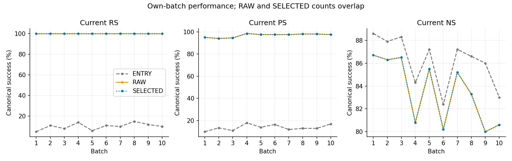
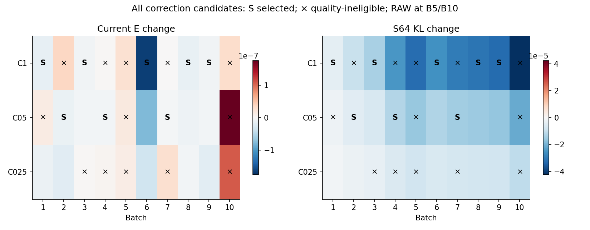
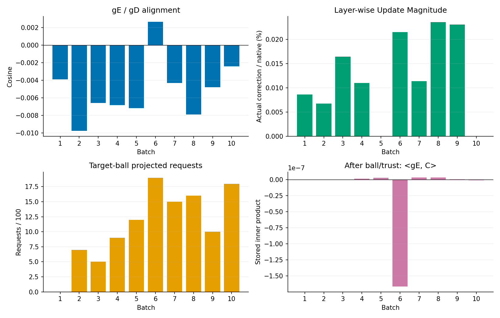
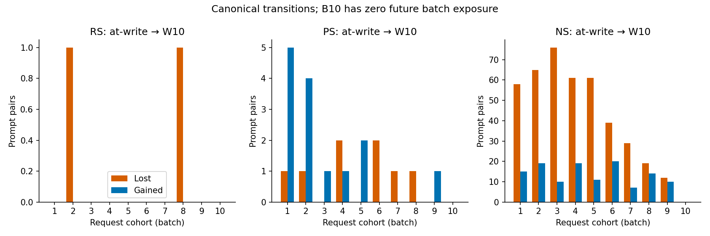
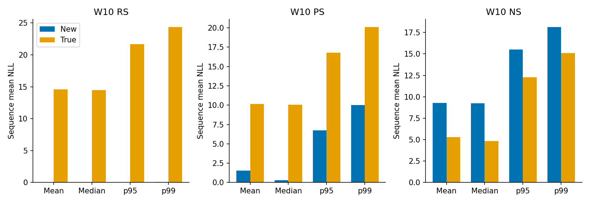
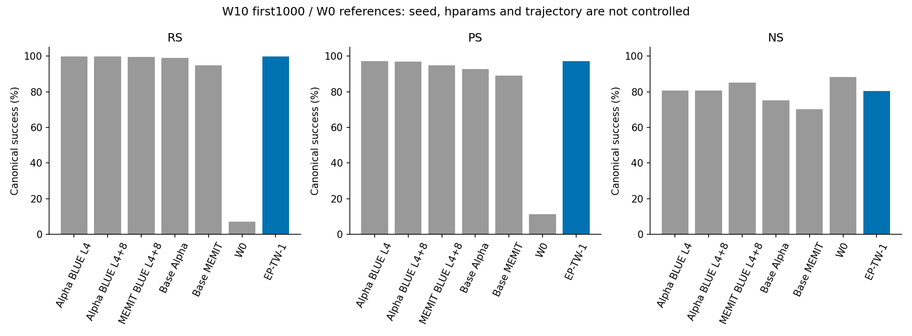

# EP-TW-1 job47962 완료 리뷰와 설계 대비 실제 동작

본 보고는 사용자 완료 recall과 design-conformance addendum에 따른 **CPU-only 사실 검산**이다. 실행 source·기존 실패·raw·teacher·다른 task를 수정하지 않았다. Scientific promotion=false, claim/후속 선택은 GH 소유다.

## 1. 요약과 검증 경계

Job47962는 scheduler COMPLETED 0:0이며 실제 W0→B1–B10, 1000요청, 10commit을 저장했다. 최종 W10의 canonical RS/PS/NS는 아래와 같다. 이 수치는 원 new/true NLL pairs를 독립 집계하고 원 보고값과 대조했다.

| 상태/범위 | 지표 | n/d (%) | desired TF-strict n/d | desired token correct/d |
| --- | --- | --- | --- | --- |
| W10 / first1000 | RS | 998/1000 (99.80%) | 996/1000 | 1011/1015 |
| W10 / first1000 | PS | 1942/2000 (97.10%) | 1341/2000 | 1370/2030 |
| W10 / first1000 | NS | 8056/10000 (80.56%) | 1820/10000 | 1930/10110 |

RS는 new NLL<true NLL, PS도 같은 부등식, NS는 true NLL<new NLL이다. Tie는 실패이며 최종 세 지표 tie=0이다. Strict는 teacher-forced argmax token 전체 일치, token 점수는 별도 분모다. PS 두 paraphrase 모두 TF-strict인 요청은 **503/1000**이다. Canonical PS1942/2000과 strict1341/2000 또는 two-P strict503/1000은 같은 지표가 아니다.

핵심 관측은 다음과 같다.

- C1 5회, C05 3회, RAW 2회, C025 0회. 모든 후보는 실제 finite/trust를 통과했고 corrected 후보13/30개는 E 조건으로 부적격이었다. RAW2회는 native write를 수행한 것이며 zero-write가 아니다.
- Halfspace 방향 보정9/10회, alpha cap1은10/10회, ball projection은 누적111 request-events, trust retraction은0회였다. 저장된 최종 C의 〈gE,C〉는8/10회 양수였다. 따라서 방향 단계의 일차 보호를 ball/trust 뒤 finite-step 보장으로 읽을 수 없다.
- 선택된 nonzero correction은 native action norm의 약0.00675–0.02355%였다. 같은 batch RAW→selected에서 canonical RS/PS/NS와 TF-strict 성공 ID의 loss/gain은 모두0이지만 NLL 자체는 달랐다.
- At-write→W10 NS는8351→8056/10000, lost420/gained125였다. Current 보호와 전체 trajectory retention은 다른 관측이다.
- 실행·selector·저장 algebra에 대해 아래의 source/증거 일치 판정을 제공한다. **numerical_validation=NOT_ESTABLISHED**는 그대로다. FD/direct gradient/self-KL/model-level parity는 사용자 지시로 생략됐으며 CPU검산으로 PASS로 바꾸지 않았다.

## 2. 종료·source·입력 provenance

실행 source와 분석 publication은 별개다.

| 항목 | identity/관측 |
| --- | --- |
| 실행 commit | 6d317bdb2660d7e9919bc3a9fb878564e9729e37 |
| 실행 tree | 6db14423a207eaccad195ce291c40bb8ce93cc8d |
| 실행 archive SHA | 2dec619e12f72e1cf6fce843c61adc68726ddc025a6b09cff326bb4b6229124a |
| execution.lock SHA | 5a19c2be919362d08b2ea80e69a406d7b6de569aade8de639036f69db5d5d8f9 |
| 분석 코드 commit (publication 전) | 744365629d13205d4b2f6d89eec82f8ed57abdf9 |
| 분석 코드 tree | f126ccc1d32047e8e9803bc999762b2a203bc683 |
| 출발 main | 833e6396522924b8bbb26eedadf763e2d3ebd4d4 |
| 추가 지시 수신 main | 0043108edc25bd6173e4e1995713b9a7ea79840b |
| 원 raw 절대경로 | /data/janghj/ODE-edit/local/ep-tw1-c4/20260915-v1/gate-skip-r1/scientific-v1 |
| terminal SHA | bccb8198e9d9a09f6c00186c283877719c82181326b1154ea5642a845debd794 |
| 시간(KST) | 2026-09-15 14:32:06–16:40:20 |
| scheduler elapsed/GPU allocation | 7694 s / 1GPU =2.137222 GPUh |
| program wall | 7688.0804 |
| 실제 initial marker | INITIAL_EXECUTION_OBSERVED_WITH_VALIDATION_SKIPPED |
| 제출 당시 agent 관측 | PENDING only; 현재 저장 marker를 과거 관측으로 소급하지 않음 |
| G0_PASS marker | 없음; 진단검증 G0 PASS 주장 없음 |

최초 bounded fetch는 GitHub443 timeout이었다. 지정main으로 격리 분석을 시작했고, 후속 bounded fetch 성공 후0043108의 GH추가문서를 fast-forward로 포함했다. 공유 main/dirty·다른 worktree는 보존했다. 정확47962 scheduler 조회는 한 번만 수행했다. 과거47884/47942는 봉인 비용/보고만 재사용했고 다시 조회하지 않았다.

Llama-3-8B-Instruct revision `8afb486c1db24fe5011ec46dfbe5b5dccdb575c2`, FP32/eager, torch2.9.1+cu128, transformers4.44.2, TF32 matmul=false/cudnn=true, seed20260915, canonical MB16이다. BLUE311b076 native AlphaEdit singleton L4 down_proj, L2=1이며 P physical4→asset0→local0이다. 선택 P의 source/selected tensor hash는 모두 `24a654cc0f8cc56f7f0a6b1bc93e0e4c27b072bd68c58127659d87751eee292c`이다. Model/tokenizer/P heavy payload는 기존 fullSHA 검증을 재사용했고 다시 전량 읽지 않았다. 이번에는 source-root164members와 archive·소형 manifest를 새로 hash했다.

공식 `scripts.fixed_counterfact.load_prefix(root,1000)`를 CPU에서 실행하여 fixed10000 bytes/hash/order를 검증한 뒤 first1000이10batch lock의 case order와 일치함을 확인했다. datasetSHA `3d7f5e31db47b23f3a281bb6fb447c2fb1776e3d4721cdfb5fe5c6f998f10ae1`, whole orderroot `5b01356928ad2e2e46effad5a2c5621c87746b610992b7b92bf3ace16b6f5729`이다. W0/coldM0에서 시작했으며 warmW50/M50, old5000/full6000, 새샘플을 반입하지 않았다. 1000unique requests,13000canonical prompt observations이지13000독립 실험이 아니다.

Teacher192는 기존47592 결과를 재사용한다. manifestSHA `f81b798f44ce626ac1e2e402ca7438363b1dd60f5681ec0ac17b9e92d096761a`, reference768 identity `f5791dd3c986261a252796bd5d7293ece46339d261609449dcfe674970bbfde0`이다. Teacher payload 재생성·전량 rehash·baseline calibration은0이다. 소형 identity와 실행 당시 reuse evidence는 [evidence-reuse-manifest.json](evidence-reuse-manifest.json)에 결속했다.

## 3. 모든 batch Current와 actual whole-prefix

아래는 각 batch의 **새 Current100**이다. batch 간 서로 다른100요청을 평가한 값으로 누적 retention 곡선이 아니다. ENTRY/RAW/SELECTED는 같은 batch 안의 세 상태다. 모든 batch selected RS=100/100이지만 PS/NS는 별도다.

| B | state | RS | PS | NS | R strict | P strict |
| --- | --- | --- | --- | --- | --- | --- |
| 1 | ENTRY | 5/100 (5.00%) | 20/200 (10.00%) | 886/1000 (88.60%) | 0/100 | 0/200 |
| 1 | RAW | 100/100 (100.00%) | 190/200 (95.00%) | 867/1000 (86.70%) | 100/100 | 129/200 |
| 1 | SELECTED | 100/100 (100.00%) | 190/200 (95.00%) | 867/1000 (86.70%) | 100/100 | 129/200 |
| 2 | ENTRY | 11/100 (11.00%) | 27/200 (13.50%) | 879/1000 (87.90%) | 0/100 | 1/200 |
| 2 | RAW | 100/100 (100.00%) | 188/200 (94.00%) | 863/1000 (86.30%) | 100/100 | 129/200 |
| 2 | SELECTED | 100/100 (100.00%) | 188/200 (94.00%) | 863/1000 (86.30%) | 100/100 | 129/200 |
| 3 | ENTRY | 8/100 (8.00%) | 22/200 (11.00%) | 883/1000 (88.30%) | 0/100 | 2/200 |
| 3 | RAW | 100/100 (100.00%) | 189/200 (94.50%) | 865/1000 (86.50%) | 100/100 | 119/200 |
| 3 | SELECTED | 100/100 (100.00%) | 189/200 (94.50%) | 865/1000 (86.50%) | 100/100 | 119/200 |
| 4 | ENTRY | 14/100 (14.00%) | 36/200 (18.00%) | 843/1000 (84.30%) | 1/100 | 2/200 |
| 4 | RAW | 100/100 (100.00%) | 197/200 (98.50%) | 808/1000 (80.80%) | 100/100 | 151/200 |
| 4 | SELECTED | 100/100 (100.00%) | 197/200 (98.50%) | 808/1000 (80.80%) | 100/100 | 151/200 |
| 5 | ENTRY | 6/100 (6.00%) | 28/200 (14.00%) | 872/1000 (87.20%) | 2/100 | 2/200 |
| 5 | RAW | 100/100 (100.00%) | 195/200 (97.50%) | 855/1000 (85.50%) | 100/100 | 128/200 |
| 5 | SELECTED | 100/100 (100.00%) | 195/200 (97.50%) | 855/1000 (85.50%) | 100/100 | 128/200 |
| 6 | ENTRY | 11/100 (11.00%) | 33/200 (16.50%) | 824/1000 (82.40%) | 0/100 | 0/200 |
| 6 | RAW | 100/100 (100.00%) | 195/200 (97.50%) | 802/1000 (80.20%) | 100/100 | 124/200 |
| 6 | SELECTED | 100/100 (100.00%) | 195/200 (97.50%) | 802/1000 (80.20%) | 100/100 | 124/200 |
| 7 | ENTRY | 10/100 (10.00%) | 24/200 (12.00%) | 872/1000 (87.20%) | 1/100 | 2/200 |
| 7 | RAW | 100/100 (100.00%) | 195/200 (97.50%) | 852/1000 (85.20%) | 100/100 | 146/200 |
| 7 | SELECTED | 100/100 (100.00%) | 195/200 (97.50%) | 852/1000 (85.20%) | 100/100 | 146/200 |
| 8 | ENTRY | 15/100 (15.00%) | 26/200 (13.00%) | 866/1000 (86.60%) | 2/100 | 3/200 |
| 8 | RAW | 100/100 (100.00%) | 196/200 (98.00%) | 833/1000 (83.30%) | 100/100 | 130/200 |
| 8 | SELECTED | 100/100 (100.00%) | 196/200 (98.00%) | 833/1000 (83.30%) | 100/100 | 130/200 |
| 9 | ENTRY | 12/100 (12.00%) | 26/200 (13.00%) | 860/1000 (86.00%) | 1/100 | 3/200 |
| 9 | RAW | 100/100 (100.00%) | 196/200 (98.00%) | 800/1000 (80.00%) | 100/100 | 140/200 |
| 9 | SELECTED | 100/100 (100.00%) | 196/200 (98.00%) | 800/1000 (80.00%) | 100/100 | 140/200 |
| 10 | ENTRY | 10/100 (10.00%) | 34/200 (17.00%) | 830/1000 (83.00%) | 2/100 | 2/200 |
| 10 | RAW | 100/100 (100.00%) | 195/200 (97.50%) | 806/1000 (80.60%) | 100/100 | 134/200 |
| 10 | SELECTED | 100/100 (100.00%) | 195/200 (97.50%) | 806/1000 (80.60%) | 100/100 | 134/200 |

Whole-prefix 값은 다음과 같다. Online pooled는 각 요청이 쓰인 시점의 서로 다른 W를 합한 값이며 하나의 W10 평가로 세지 않는다. W5/W10 또는 current/full reuse rows는 중복 분모로 더하지 않는다.

| state/population | metric | n/d (%) |
| --- | --- | --- |
| 5 / FULL_SEEN | RS | 500/500 (100.00%) |
| 5 / FULL_SEEN | PS | 964/1000 (96.40%) |
| 5 / FULL_SEEN | NS | 4202/5000 (84.04%) |
| 10 / FULL_SEEN | RS | 998/1000 (99.80%) |
| 10 / FULL_SEEN | PS | 1942/2000 (97.10%) |
| 10 / FULL_SEEN | NS | 8056/10000 (80.56%) |
| 10 / FIRST500 | RS | 499/500 (99.80%) |
| 10 / FIRST500 | PS | 968/1000 (96.80%) |
| 10 / FIRST500 | NS | 4011/5000 (80.22%) |
| mixed1-10 / ONLINE_OWN_BATCH_NOT_RETENTION | RS | 1000/1000 (100.00%) |
| mixed1-10 / ONLINE_OWN_BATCH_NOT_RETENTION | PS | 1936/2000 (96.80%) |
| mixed1-10 / ONLINE_OWN_BATCH_NOT_RETENTION | NS | 8351/10000 (83.51%) |

## 4. EP-TW-1 설계 대비 실제 동작

이 장의 기준은 v3설계/계약 **및 사용자 gate-skip override**다. 실제 실행6d317bd의 파일을 읽었으며 최신 함수라는 이유로 소급 적용하지 않았다. [design-conformance.csv](design-conformance.csv)는 requirement/식/실제 file·function·line·SHA/artifact/확인수준/한계를15행으로 연결한다. SOURCE_CONFIRMED는 코드 경로 확인, STORED_EVIDENCE_CONSISTENT는 저장된 실행관측과 CPU산술이 그 규칙에 부합한다는 뜻이다. 두 상태 모두 독립 neural derivative 검증 완료라는 뜻은 아니다.

### 4.1 Native proposal과 episode 출발점

각 batch는 이전 selectedW/M/contexts/RNG/ledger에서 자기 native target100개를 만들고 native RHS solve1회를 실행했다. 원 fitter의 fit/finalize 분리가 유지되어 fit 중 current history append=0, candidate선택 후 finalizer=1이다. 총1000targets,1000×24=24000actualAdam,25000loss evaluations,10nativeRHS solves다. 이번 target1000은 모두24step까지 수행했다. 이 기록을 이전 실패100targets와 합하지 않았다.

Map A 구성에는 `solve(G,PK).T`라는 **별도 map solve가 source상 batch당1회** 있다. 따라서 native fitter의 solve10counter를 전체 linear-solve 호출10으로 오인하지 않는다: nativeRHS10+mapA10이다. 중복 native comparison RHS는 사용자 skip으로 호출하지 않았다. G=P(KKᵀ+M)+I, singletonL2=1, fixed K/P/M이며 inverse/Cholesky/SPD 대체는 없다. Native target(Z)·K/H·A·Vp는 저장되고 A의 native/map/route identity를 대조했다. Native local teacher는 hash/counter만 저장된 부분이 있어 완전 optimizer continuation payload라고 하지 않는다.

`_RawAnchoredWeight.forward`의 C0는 저장 actual Vp를 직접 clone한다. Wentry+RpA 근사로 RAW를 교체하지 않는다. 후보식은 `Vp + beta*(C@A)`로 beta∈{{1,.5,.25}}가 **correction에만** 적용된다. Native전체 update를 줄이는 S75정책을 재사용하지 않았다. 각 batch의 Wentry=이전 checkpoint selectedW이므로 원W0로 매번 reset하거나 다른 arm state를 들여온 흔적은 없다(9adjacent links).

### 4.2 E/D, 미분 경로와 입력 차단

E는 canonical desired answer의 token NLL평균→100request평균이다. Native augmented-context targetloss와 별개다. `_current`는 MB16×6+4의7groups에 sum/100으로 backward한다. 독립 rowmean으로 candidate40개의 저장 E를 검산했다.

D는 고정W0 teacher의 full128256vocabulary KL(p0||pV), vocabulary sum→128scored-position평균→S64문서평균이다. 자연256+BOS1 input257, logits[128:256]가 target input[129:257]을 점수화한다. `_generic`는 문서당loss/64로 누적한다. C4 40candidate-S64 panels와2Dev panels의 저장문서KL 평균을 새로 검산했다. S64동일64ID/order, Dev동일128ID/order, 둘의 exactID overlap0을 확인했다. Teacher normalization residual은 저장관측만 집계했고 self-KL threshold를 재실행하지 않았다.

gE와gD는 동일 actualVp/C0에서 별도 sweep: current70backwardgroups와 S64640document backward다. Custom residual backward는 gW Aᵀ를 반환하고 A/parent/Vp/native ingredients는 detach/fixed이다. 이것은 source-backed 연결 설명이며, **gC가 실제 neural derivative임을 새 FD나 directgW로 입증하지 않았다**. 과거47942 saved-episode E direct PASS도 이번10episode 전체에 확장하지 않는다.

Controller로 전달되는 것은 Current E/strict 및 S64 D다. 공식 P/N, accepted-old, Dev128, 미래batch, Report/Audit/MMLU는 selector 인자로 들어가지 않는다. Old/P/N은 gradient·선택 이후 observer 경로이며 Dev는 W5/W10만 관측했다. Source/dataflow 확인과 저장 `controller_access=False` 경계를 결속했지만 독립 모든GPU연산trace를 새로 만들지는 않았다.

### 4.3 진척 보호 방향: 실제 9/10 개입

식은 q=〈gE,gD〉, d=−gD+min(q,0)/||gE||²·gE이며 gE=0이면−gD다. 실제 gE=0분기는0회다. 저장 gE/gD로 FP64 dot/norm과 FP32 d를 CPU재계산했다. q의 저장GPUscalar와CPU최대절대차이는1.06e−22였다. 아래 수치는 충분한 표시자리로만 반올림하며 전체정밀값·gradientSHA·KKT는 CSV에 있다.

| B | q | ||gE|| | ||gD|| | cos | projection coeff | 〈gE,d〉 | 〈gD,d〉 |
| --- | --- | --- | --- | --- | --- | --- | --- |
| 1 | -2.1026344e-07 | 0.02677069 | 0.0020146166 | -0.003898628 | -0.00029338956 | 7.32639e-15 | -4.0586184e-06 |
| 2 | -4.5444658e-06 | 0.15033149 | 0.0030998449 | -0.0097519822 | -0.00020108649 | -9.1092865e-14 | -9.6081247e-06 |
| 3 | -3.2221317e-07 | 0.013135167 | 0.0037355143 | -0.0065668526 | -0.0018675493 | -1.6813963e-15 | -1.3953465e-05 |
| 4 | -2.732106e-07 | 0.0080206761 | 0.0049930043 | -0.0068222028 | -0.0042469348 | -2.0780496e-15 | -2.4928932e-05 |
| 5 | -2.2974052e-07 | 0.0056252729 | 0.0056943263 | -0.0071721877 | -0.0072602304 | 4.8473597e-16 | -3.2423684e-05 |
| 6 | 1.7034183e-07 | 0.012587776 | 0.0050785662 | 0.0026645947 | 0 | -1.7034183e-07 | -2.5791835e-05 |
| 7 | -3.553634e-07 | 0.015143093 | 0.0054560306 | -0.0043011177 | -0.0015496854 | 6.8438327e-15 | -2.9767719e-05 |
| 8 | -2.8142681e-07 | 0.0063964128 | 0.005581314 | -0.0078830183 | -0.0068784804 | 3.7630336e-15 | -3.114913e-05 |
| 9 | -2.4872322e-07 | 0.0090712846 | 0.0057164351 | -0.0047964759 | -0.0030225866 | 8.208441e-15 | -3.2676878e-05 |
| 10 | -2.3800366e-06 | 0.15086006 | 0.0065207582 | -0.00241942 | -0.00010457673 | -1.2173771e-14 | -4.2520038e-05 |

9회 q<0여서 반공간 경계로 보정했고 B6만 q>0여서−gD 그대로였다. 경계에서 〈gE,d〉가 FP32잔여수준으로0근처인 것은 기록된 연산 결과이지 per-request/PS/old retention 보장이 아니다. KKT residual도 같은 연산/저장gradient에서 나온 수치로 neuralFD검증과 다르다.

### 4.4 Step→target ball→C-only trust

alpha=min(1,.25||actualVp−Wentry||/(||dA||+1e−12)), 이후 Zp+alpha·d를 원 request anchor/radius ball로 projection, C=Zprojected−Zp, 필요시C만 줄여||CA||≤.25||actual native delta|| 순이다. alpha_cap=1은10회 모두 bind했다. Ball projection은111events, trustretraction은항상1이었다. Zero/near-zero 기준을 사후 조정하지 않았다.

| B | alpha | ball requests | post ball excess | retraction | ||C|| | ||CA|| | 〈gE,C〉 | 〈gD,C〉 |
| --- | --- | --- | --- | --- | --- | --- | --- | --- |
| 1 | 1 | 0 | -2.7154571e-06 | 1 | 0.0020146006 | 0.00065510344 | 1.1114909e-11 | -4.0586165e-06 |
| 2 | 1 | 7 | 7.6582139e-08 | 1 | 0.0030996913 | 0.0010418295 | 2.8504075e-11 | -9.6080805e-06 |
| 3 | 1 | 5 | 6.0260606e-08 | 1 | 0.0037353864 | 0.0012853777 | 1.0184676e-10 | -1.3953111e-05 |
| 4 | 1 | 9 | 6.4401232e-08 | 1 | 0.0049928631 | 0.0017108092 | 1.4573489e-09 | -2.4928688e-05 |
| 5 | 1 | 12 | 4.2147212e-08 | 1 | 0.0056941154 | 0.0019399468 | 2.7778437e-09 | -3.2422993e-05 |
| 6 | 1 | 19 | 4.5905742e-08 | 1 | 0.0050784489 | 0.0017657628 | -1.6637206e-07 | -2.5790629e-05 |
| 7 | 1 | 15 | 5.2744632e-08 | 1 | 0.0054558895 | 0.0018714188 | 3.2954272e-09 | -2.976673e-05 |
| 8 | 1 | 16 | 6.4134271e-08 | 1 | 0.005581093 | 0.0019190601 | 3.4120505e-09 | -3.114863e-05 |
| 9 | 1 | 10 | 4.7831483e-08 | 1 | 0.0057163354 | 0.0019918766 | 4.1982111e-10 | -3.2676497e-05 |
| 10 | 1 | 18 | 8.0704887e-08 | 1 | 0.0065206409 | 0.0022789969 | -8.599151e-10 | -4.2518763e-05 |

Postprojection 〈gE,C〉는8/10회 양수다. Direction의 일차 반공간 조건을 target ball 뒤에도 부호 그대로 유지한다고 가정해서는 안 된다. 원 temporaryZ/pretrustC tensor는 미저장이다. 최종C·anchor/radius로 after-excess를 재계산하고 원 scalar와 함께 제공했지만 미저장 intermediate를 실제 관측처럼 만들지 않았다. Ball/trust의8FP32eps relative representational tolerance와 E의positiveallowance0은 별개다.

### 4.5 네 후보의 finite screen과 선택

모든40개 후보는 실제 호출됐고 duplicate bytes0/nonfinite0/trust-invalid0이다. RAWstrict는모든batch100이며 모든corrected도같은100ID를 보존했다. 따라서 이번 실제 quality탈락13개는 E>Ep만이었다. E≤Ep를 허용량 없이 적용한 뒤 feasible중 D최소, D numericaltie시 RAW→작은actualcorrectionnorm→고정ID순을 CPU로 재계산하여10개선택과 일치했다. Samecount만 보존검사로 쓰지 않았다.

| B | candidate | ΔE vsRAW | ΔD64 vsRAW | strict IDs lost | feasible | selected | reason |
| --- | --- | --- | --- | --- | --- | --- | --- |
| 1 | RAW | 0 | 0 | 0 | True | False | FINITE_EXACT_QUALITY_FEASIBLE |
| 1 | C1 | -1.3970421e-08 | -4.0463202e-06 | 0 | True | True | FINITE_EXACT_QUALITY_FEASIBLE |
| 1 | C05 | 1.4824036e-08 | -2.0282034e-06 | 0 | False | False | E_EXCEEDS_OWN_RAW_NO_ALLOWANCE |
| 1 | C025 | -1.0884251e-08 | -1.0089032e-06 | 0 | True | False | FINITE_EXACT_QUALITY_FEASIBLE |
| 2 | RAW | 0 | 0 | 0 | True | False | FINITE_EXACT_QUALITY_FEASIBLE |
| 2 | C1 | 3.5926205e-08 | -9.5730426e-06 | 0 | False | False | E_EXCEEDS_OWN_RAW_NO_ALLOWANCE |
| 2 | C05 | -1.1061929e-08 | -4.7879321e-06 | 0 | True | True | FINITE_EXACT_QUALITY_FEASIBLE |
| 2 | C025 | -1.9367872e-08 | -2.397757e-06 | 0 | True | False | FINITE_EXACT_QUALITY_FEASIBLE |
| 3 | RAW | 0 | 0 | 0 | True | False | FINITE_EXACT_QUALITY_FEASIBLE |
| 3 | C1 | -6.2624167e-09 | -1.3906999e-05 | 0 | True | True | FINITE_EXACT_QUALITY_FEASIBLE |
| 3 | C05 | -4.3489126e-09 | -6.9555422e-06 | 0 | True | False | FINITE_EXACT_QUALITY_FEASIBLE |
| 3 | C025 | 2.2073073e-09 | -3.4755479e-06 | 0 | False | False | E_EXCEEDS_OWN_RAW_NO_ALLOWANCE |
| 4 | RAW | 0 | 0 | 0 | True | False | FINITE_EXACT_QUALITY_FEASIBLE |
| 4 | C1 | 2.6366615e-09 | -2.4829545e-05 | 0 | False | False | E_EXCEEDS_OWN_RAW_NO_ALLOWANCE |
| 4 | C05 | -4.6183413e-09 | -1.24377e-05 | 0 | True | True | FINITE_EXACT_QUALITY_FEASIBLE |
| 4 | C025 | 5.4486736e-09 | -6.2474143e-06 | 0 | False | False | E_EXCEEDS_OWN_RAW_NO_ALLOWANCE |
| 5 | RAW | 0 | 0 | 0 | True | True | FINITE_EXACT_QUALITY_FEASIBLE |
| 5 | C1 | 2.6713824e-08 | -3.2277932e-05 | 0 | False | False | E_EXCEEDS_OWN_RAW_NO_ALLOWANCE |
| 5 | C05 | 1.7193088e-08 | -1.61514e-05 | 0 | False | False | E_EXCEEDS_OWN_RAW_NO_ALLOWANCE |
| 5 | C025 | 1.2474484e-08 | -8.0730825e-06 | 0 | False | False | E_EXCEEDS_OWN_RAW_NO_ALLOWANCE |
| 6 | RAW | 0 | 0 | 0 | True | False | FINITE_EXACT_QUALITY_FEASIBLE |
| 6 | C1 | -1.6605874e-07 | -2.5728272e-05 | 0 | True | True | FINITE_EXACT_QUALITY_FEASIBLE |
| 6 | C05 | -7.7313744e-08 | -1.290265e-05 | 0 | True | False | FINITE_EXACT_QUALITY_FEASIBLE |
| 6 | C025 | -3.4515688e-08 | -6.4549049e-06 | 0 | True | False | FINITE_EXACT_QUALITY_FEASIBLE |
| 7 | RAW | 0 | 0 | 0 | True | False | FINITE_EXACT_QUALITY_FEASIBLE |
| 7 | C1 | 4.5874913e-11 | -2.96778e-05 | 0 | False | False | E_EXCEEDS_OWN_RAW_NO_ALLOWANCE |
| 7 | C05 | -3.4611367e-09 | -1.4826215e-05 | 0 | True | True | FINITE_EXACT_QUALITY_FEASIBLE |
| 7 | C025 | 2.8285031e-08 | -7.4112986e-06 | 0 | False | False | E_EXCEEDS_OWN_RAW_NO_ALLOWANCE |
| 8 | RAW | 0 | 0 | 0 | True | False | FINITE_EXACT_QUALITY_FEASIBLE |
| 8 | C1 | -1.3561366e-08 | -3.1041901e-05 | 0 | True | True | FINITE_EXACT_QUALITY_FEASIBLE |
| 8 | C05 | -8.8459637e-09 | -1.5554225e-05 | 0 | True | False | FINITE_EXACT_QUALITY_FEASIBLE |
| 8 | C025 | -4.7276262e-09 | -7.7838176e-06 | 0 | True | False | FINITE_EXACT_QUALITY_FEASIBLE |
| 9 | RAW | 0 | 0 | 0 | True | False | FINITE_EXACT_QUALITY_FEASIBLE |
| 9 | C1 | -5.7469879e-09 | -3.2669324e-05 | 0 | True | True | FINITE_EXACT_QUALITY_FEASIBLE |
| 9 | C05 | -4.680478e-09 | -1.6306486e-05 | 0 | True | False | FINITE_EXACT_QUALITY_FEASIBLE |
| 9 | C025 | -1.8401188e-08 | -8.1551898e-06 | 0 | True | False | FINITE_EXACT_QUALITY_FEASIBLE |
| 10 | RAW | 0 | 0 | 0 | True | True | FINITE_EXACT_QUALITY_FEASIBLE |
| 10 | C1 | 3.1264208e-08 | -4.2409294e-05 | 0 | False | False | E_EXCEEDS_OWN_RAW_NO_ALLOWANCE |
| 10 | C05 | 1.7646467e-07 | -2.1257919e-05 | 0 | False | False | E_EXCEEDS_OWN_RAW_NO_ALLOWANCE |
| 10 | C025 | 1.086609e-07 | -1.0612016e-05 | 0 | False | False | E_EXCEEDS_OWN_RAW_NO_ALLOWANCE |

RAW B5/B10은 feasiblecorrected가0개였다. NumericalD tie, duplicatebytes, trust손실, nonfinite, parentfallback이 원인이 아니다. 이두batch도 actualnative를commit했다. 작은양수 ΔE는 저장FP32관측값이다. Numerical validation 미확립인 상태에서 이를 실제모델의 정밀quality차이까지 검증됐다고 확대하지 않는다. 결과에 맞춰 Eallowance/tie를 늘리지 않았다.

### 4.6 실제 selected weight와 native 방향 성분

저장Vp/C/A/selectedcheckpoint를 CPU로 `Vp+beta(C@A)` 재구성했을 때10/10 selectedW byte가 일치했다(maxabs0). 이는 저장tensoralgebra의 일치이며 모델forward/functional parity/GPUcontinuation 증거가 아니다. 파일SHA/fixtureheaderSHA/policyheaderSHA가 서로 다른 convention임을 같은 tensorbytes로 bridge했다.

| B | selected | ||Vp−We|| recorded | ||Wsel−Vp|| | correction/native % | ||Wsel−We|| CPU | correction/native cos | orthogonal norm |
| --- | --- | --- | --- | --- | --- | --- | --- |
| 1 | C1 | 7.6101871 | 0.00065510641 | 0.0086082826 | NA | NA | NA |
| 2 | C05 | 7.716241 | 0.00052091855 | 0.0067509368 | 7.716215511535217 | -0.04888514407629815 | 0.0005202957427571399 |
| 3 | C1 | 7.8401227 | 0.0012853797 | 0.016394893 | 7.84006729527573 | -0.04320674849104256 | 0.0012841793917142523 |
| 4 | C05 | 7.8021162 | 0.00085540737 | 0.010963787 | 7.802087432593621 | -0.033654778809458614 | 0.0008549227992908544 |
| 5 | RAW | 7.8411754 | 0 | 0 | 7.841175442863769 | NA | 0.0 |
| 6 | C1 | 8.2257045 | 0.0017657641 | 0.021466418 | 8.225654958578348 | -0.028155871262496874 | 0.001765064061781692 |
| 7 | C05 | 8.2271094 | 0.00093571201 | 0.011373521 | 8.227081515830665 | -0.029819799888543018 | 0.0009352958940017372 |
| 8 | C1 | 8.149115 | 0.001919061 | 0.023549318 | 8.14906310324276 | -0.027157130240576234 | 0.0019183532199373186 |
| 9 | C1 | 8.6411269 | 0.0019918772 | 0.023051127 | 8.641064013729858 | -0.03169584872822838 | 0.0019908763822911275 |
| 10 | RAW | 8.6033905 | 0 | 0 | 8.603390473928195 | NA | 0.0 |

B2–B10은 이전selectedCP를entry로 삼아 geometric분해했다. Nonzero 보정의cos는약−.0489..−.0272로 작고음수이며 직교성분이존재한다. 따라서 이 저장write는 단순 native scalar-shrink와 같은vector가 아니다. 이것을 성능기여의 원인분해라고 해석하지 않는다. B1은 pretrainedW0tensor를 새로load하지 않았으므로 recordnorm/entryhash만 재사용하고 parallel/orthogonal분해는NA다. Increment(path)와 W0대비net은다르며 전체W0tensor 미load로 새globalnet을 만들어내지 않았다.

### 4.7 Commit/history/ledger/다음 entry

10selected W4/M4 CP가모두실재하고 Wshape4096×14336, Mshape1×14336×14336, FP32/finite다. CP의context/RNG/ledger/seenIDs/nextordinal/modelrevision/Pmapping을commitmetadata와 대조했다. Entry→commit→다음entry9개는W/M/P/context/RNG/ledger모두연결됐다. Innerhistory0, endpointselected최종keys로history1/batch, total10이다. Candidate평가 transaction은parameter/hook/RNG nonmutation기록을 남기고 복원한뒤 selected를commit한다. Non-L4는runtimepointer/version/grad/hook/bufferguard와finalbasehashassert가 근거이며 CPU검토가 전체baseweight를 다시읽은것은아니다.

Acceptedledger는 selectedTFstrict request만 추가한다. 이번모든1000이atwrite strict성공하여accepted1000, distinctsubject/relation999, targetoverwrite1, reissue0이다. 최종999ACTIVE/1SUPERSEDED/0UNKNOWN이다. 실패한현재요청이이전acceptedlabel을대체하지않는코드는확인했지만이번데이터에서unaccepted분기가실행되지않아실제negative경로검증이라고쓰지않는다. Accepted1000은W10에도모두성공한다는뜻이아니다.

### 4.8 실제 동작 사례: corrected B1과 RAW B5

**B1 (C1).** Coldentry→native100/solve1, nativeactionnorm7.6101871. q=−2.1026344e−7, gEnorm.02677069, gDnorm.002014617, coefficient−.0002933896로direction을project했다. alpha1, ballclamp0, trustretraction1, ||CA||=.0006551034, actualcorrection=.0006551064다. RAW E=.002287666152→C1 .002287652182(−1.3970e−8), D=.001578178694→.001574132374(−4.0463e−6), strict100ID보존. C05는E부적격, C1/C025는feasible이고C1의D가낮아선택됐다. 〈gE,C〉=+1.1115e−11인데도actualE는낮았다는것은firstorder부호와finite관측을구분해야함을보인다. CurrentR/P/N success변화는0이다. SelectedW/M저장→history1→nextordinal100→B2entry exactlink가남았다.

**B5 (RAW).** Nativeactionnorm7.8411754, q<0projection, alpha1, ball12requests, trustretraction1. RAW E=.00154476258569,D=.0103005246997. C1/C05/C025의ΔE는각각+2.6714e−8/+1.7193e−8/+1.2474e−8으로모두E조건탈락했다. 세D는각각−3.2278e−5/−1.6151e−5/−8.0731e−6으로낮았지만D만으로선택하지않았다. RAW actualcorrection0, **nativewrite7.8411754는유지**, history1과nextordinal500을저장하고B6으로이어졌다. Parentrejection/zero-write가아니다. 전10batch자료를표/CSV에유지했으며대표사례선택이성과선별은아니다.

### 4.9 설계 준수 판정과 남은 경계

이번 저장 자료에서 actual Vp anchor, correction-only scale, 별도 E/D sweep, halfspace 식, ball/trust 순서, strict ID subset+E 무악화 screen, min-D selector, selected commit/history1/연속 state는 **SOURCE_CONFIRMED 및 STORED_EVIDENCE_CONSISTENT**다. 이 검토 범위에서 새 DEVIATION은 발견되지 않았다. 다만 ball 뒤 일차 부호는 보장되지 않았으며 그 사실을 함께 남긴다. SKIPPED 진단을 조용한 구현 누락으로 재분류하지 않고, FD/direct/self-KL 정확성은 NOT_ESTABLISHED로 유지한다. 따라서 “설계된 분기·선택·저장 규칙을 실제 적용했는가”에는 근거 범위 안에서 일치한다고 답할 수 있지만, “미분을 검증했고 방법의 효능을 입증했는가”에는 답할 수 없다.

## 5. Paired 변화·retention·NLL tail

같은batch의RAW는해당EPtrajectoryentry에서만든one-stepnative reference다. 독립native10batchbaseline이아니다. Current10panels와accepted-old9panels에서RAW→selected의RS/PS/NS성공/strictlost/gained는모두0이지만individualNLL변화는존재했다. CurrentdesiredNLLharm최대는RS4.69014e−5,PS.00152659,NS.00152874이며accepted-old에서도RS.00010157/PS.00116825/NS.00154018까지관측됐다. 평균E보호는각request·PS·NSNLL무악화보장이아니다.

| comparison | metric | before→after | lost/conditional d | gained/conditional d | strict lost/gained | harm p95 | harm p99 |
| --- | --- | --- | --- | --- | --- | --- | --- |
| ATWRITE_TO_W10 | RS | 1000→998 | 2/1000 | 0/0 | 4/0 | 0.002758612 | 0.024113751 |
| W5_TO_W10_FIRST500 | RS | 500→499 | 1/500 | 0/0 | 2/0 | 0.0040986288 | 0.042267524 |
| ATWRITE_TO_W10 | PS | 1936→1942 | 8/1936 | 14/64 | 22/33 | 0.3469857 | 0.89779128 |
| W5_TO_W10_FIRST500 | PS | 964→968 | 4/964 | 8/36 | 11/24 | 0.38652282 | 0.90556728 |
| ATWRITE_TO_W10 | NS | 8351→8056 | 420/8351 | 125/1649 | 325/201 | 2.1499333 | 5.9554176 |
| W5_TO_W10_FIRST500 | NS | 4202→4011 | 256/4202 | 65/798 | 198/113 | 2.4849074 | 6.9670424 |

AtwriteNS8351→8056은lost420/gained125의양방향전이다. W5first500NS4202→4011은lost256/gained65이다. 전체1000/first500/accepted-only를섞지않고각conditionaldenominator를그대로남겼다. 최종superseded1요청은RS1/1,PS0/2,NS7/10; 요청된예전target의교체표시와단순forgetting을분리한다. 다른5000oldpopulation은이번coldstart실험에없다.

B10은futurebatchexposure0이다. Current100과full1000는같은actualW이지만batchlayout/reuse계약에따라tinyNLL차이가가능하여그차이를추가editing에의한forgetting이라고명명하지않았다. 관측사이의최초loss/recovery시점은추정하지않았다. Currentpooling/first500/전체1000은같은요청을다시관측한것이지독립replicate가아니다. 이번보고는정확효과크기/원분모를우선하고독립실험CI/p-value를만들지않았다.

최종true/newNLL tail은다음과같다. Desiredmargin=RS/PS(true−new),NS(new−true)로양수가canonical성공이다. 원raw의NSmargin부호표기와혼동하지않는다. 분포는prompt단위기술통계이며PS2개/NS10개를독립request증가로해석하지않는다.

| metric | NLL | mean | median | p90 | p95 | p99 | max |
| --- | --- | --- | --- | --- | --- | --- | --- |
| RS | new | 0.027483013 | 0.0011282157 | 0.004549854 | 0.0074080215 | 0.077413185 | 9.1146498 |
| RS | true | 14.584891 | 14.492329 | 19.978232 | 21.682047 | 24.359062 | 32.713837 |
| PS | new | 1.5436726 | 0.30248521 | 5.125007 | 6.7589452 | 10.000019 | 16.69068 |
| PS | true | 10.152038 | 10.046596 | 14.990616 | 16.763718 | 20.105521 | 24.705818 |
| NS | new | 9.2836793 | 9.2599006 | 14.148305 | 15.506479 | 18.136944 | 24.481256 |
| NS | true | 5.3024843 | 4.8546 | 10.575319 | 12.288322 | 15.086059 | 22.64629 |

| metric | desiredmargin mean | median | p95 | p99 | min |
| --- | --- | --- | --- | --- | --- |
| RS | 14.557408 | 14.491419 | 21.681457 | 24.358352 | -6.1859542 |
| PS | 8.6083655 | 8.6572767 | 16.368883 | 19.987846 | -8.9323449 |
| NS | 3.981195 | 4.0229045 | 11.648484 | 14.96179 | -17.753727 |

## 6. S64 controller와 Dev 관측

S64는보존loss선택에직접쓰인개발/controller집합이다. SelectedD64는B1 .00157413에서B10 .02013259까지증가했다. 국소RAW보다D를줄인batch가있다는것과trajectory전체가W0에가까워졌다는것은다르다. Dev128은W5 .0121012162/W10 .0263104169로기록됐으며online선택입력은아니다. S64D와CounterFactNS는문서/목적/분모가다르므로동일지표로치환하지않는다. 고정768중Reserve320/Report256 teacher/loss와Audit/MMLU/FutureN은이번에평가하지않았다.

## 7. 기존 first1000 reference: family별 분리

아래는동일case/prompt/targetidentity의실제B010 W10 fullfirst1000을기존local봉인raw에서재집계한것이다. W100final10k나warmB51–60을혼합하지않았다. W0는SH2기존publication의first1000aggregate만재사용했다. Alpha/MEMIT source/config/layers/history/seed차이가있어controlledmethodeffect/paired동일state비교는아니다. BLUE는blue=True이고base는blue=False다.

### AlphaEdit reference

| reference / W10 (W0별도) | RS | PS | NS |
| --- | --- | --- | --- |
| AlphaEdit_BLUE_L4_ONLY | 998/1000 (99.80%) | 1943/2000 (97.15%) | 8072/10000 (80.72%) |
| AlphaEdit_BLUE (L4+L8) | 997/1000 (99.70%) | 1939/2000 (96.95%) | 8057/10000 (80.57%) |
| BASE_ALPHAEDIT (blue=False L4-L8) | 989/1000 (98.90%) | 1854/2000 (92.70%) | 7510/10000 (75.10%) |
| EP-TW-1 | 998/1000 (99.80%) | 1942/2000 (97.10%) | 8056/10000 (80.56%) |

### MEMIT reference

| reference / W10 (W0별도) | RS | PS | NS |
| --- | --- | --- | --- |
| MEMIT_BLUE (L4+L8) | 995/1000 (99.50%) | 1899/2000 (94.95%) | 8507/10000 (85.07%) |
| BASE_MEMIT (blue=False L4-L8) | 949/1000 (94.90%) | 1783/2000 (89.15%) | 7018/10000 (70.18%) |

### PRE_EDIT reference

| reference / W10 (W0별도) | RS | PS | NS |
| --- | --- | --- | --- |
| PRE_EDIT W0 (SH2 common reference) | 71/1000 (7.10%) | 227/2000 (11.35%) | 8820/10000 (88.20%) |

NativeAlphaEdit는five-layerL4..8/L2=10,BLUEsingletonL4는L2=1이다. EP와AlphaBLUE L4는hparams/parsedcontexts가같지만seed20260915vs20260907이며다른trajectory다. MEMITstaticcov/precision예외와AlphaP+Mhistory차이도유지한다. 실제modelrevision/FP32/eager/GPU/TF32/tokenizer/sourcearchives/configdiff는 [compatibility.csv](compatibility.csv)에있다. W0는aggregateonly여서새per-casepair를복원하지않았다. BaselineC4D는NOT_AVAILABLE이며새forward를하지않았다.

AlphaEdit_BLUE_L4_ONLY→EP의finalRS는둘다998이지만lost1/gained1;PS는1943→1942(lost13/gained12);NS8072→8056(lost109/gained93)이다. 같거나근접한합계가같은문항보존이라는뜻이아니다. 이차이를EP단일요소의인과효과로말하지않는다. 나머지5reference의정확pairedcounts/NLLharm은 [baseline-paired.csv](baseline-paired.csv)에전부있다.

## 8. 실측 비용과 저장량

신규47962 allocated7694GPU-sec, programwall7688.080407s. SchedulerMaxRSS33459184KiB와processru_maxrss36157092KiB는수집경로/시점이다르므로같은값으로강제하지않는다. GPUpeakallocated38208243200B/reserved44157632512B이다. sourceestimate2–8GPUh/32GiBreserve를실측으로표시하지않는다.

| component | seconds | nesting/meaning |
| --- | --- | --- |
| model/load | 16.754229 | program component |
| native instrumented fit | 2956.7696 | parent timer |
| compute_z | 2798.6438 | nested in native |
| native keys | 37.57557 | nested in native |
| canonical readout | 4.5423283 | nested in native |
| native RHS solve | 1.2294135 | nested in native |
| mapA setup | 3.3118603 | separate map solve+setup |
| current gradient | 10.165237 | total; FB not separate |
| S64 gradient | 169.43805 | parent incl. FB/read |
| S64 forward/backward | 123.45991 | nested |
| S64 teacher read | 45.434529 | nested |
| candidate screen | 743.84105 | scoring+policy |
| final history | 141.89782 | selected endpoint |
| selected evaluation | 1262.0593 | observer; other eval gaps remain |

Nativefit/z/key/readout/solve나S64total/FB/teacherread를단순합산하지않는다. Entry/RAWobserver전체·restore/diagnostic·checkpointIO·purewriter는완전히분리계측되지않았으므로잔여wall을purewriter라고추정하지않는다. MethodmapA source상10solve는nativecounter10과별도지만그solve만의time은mapsetuptotal에서분리되지않았다.

Currentgradient70F/70Bgroups, 총input8892/scored1015tokens; S64gradient640F/640Bdocuments,input164480/scored81920positions이다. Corrected30candidate는Current210forwardgroups와S641920docforward/scored245760positions를추가로사용했다. RAWgradient의forward결과를RAWscreen에재사용한다. Dev2회는256docforward/scored32768positions의observer다. 이것을“current1+S641 호출”로만표현하거나모든canonicalevalforward가여기에포함됐다고하지않는다.

Raw새산출물116files/13407776774B, 이중checkpoint10files/10570873202B. selectedweights/history만저장한checkpoint이며fullpretrainedmodel10copy가아니다. 나머지native-targets/route/evaluation/receipts를모두inventory에남겼다. Rawweights/gradient/prompt/teacher/fullstdout은Git0이다.

과거실패비용47884=473s,47942=69s,기존teacher=98s는별도reuseledger다. 기존nativefit286.5445s는473s내부라추가하지않는다. 신규main7694+기존실패542=8236GPU-sec이고기존teacher까지별도합계8334s다. 이합계는historicalstudyledger이지이번새할당8334s라는뜻이아니다. 진단skip으로속도가개선됐다는controlled비교도하지않는다.

## 9. 무결성·누락·검증 수준

새raw116members전체SHA/size/stablestat와65내부reference,10CP sequentialCPUweights_only/finite/hash,9links,모든candidateNLL/IDset/selector,42genericrowreductions를검산했다. Canonicalmethod관측NLLwarning은20panels중0,최대차이0,strictIDmismatch0이었다. 이는이미계산된rows대조이며새modelparitytest가아니다. Raw/policy선택전후endpointstate·ledgerhash는연결됐고denominator누락/중복/imputation은발견되지않았다.

원칙적제한:

- FD/E-Ddirect/selfKL/functional-materialized진단은사용자지시생략이며numerical_validation=NOT_ESTABLISHED. 이번CSV산술·CPUtensor재구성은대체검증이아니다.
- 일부sourceguard의성공은성공종료/저장receipt에근거한다. Fullbasemodel새hash/GPUreplay/off-oncontinuation은없다. 저장CP는selectedW/M+context/RNG/ledgerclosure이며실제GPUcontinuation시험은NOT_TESTED다.
- Preprojectiontemporary/pretrusttensor,fullAdam/localteacherpayload,전체componenttimer는미저장범위를그대로표시했다. B1W0tensorgeometry도새load하지않았다.
- 단일seed/order,고정S64선택/Dev재관측,baselineseed/config차이때문에우월성/인과기여/full10k안정성/다른entry일반화는여기서결론내리지않는다.
- Report256/Audit/MMLU/FutureN,baselineC4forward,N4calibration,CAKE·추가정책은이번scope밖이다.

| required coverage | status | evidence / limitation |
| --- | --- | --- |
| Terminal and actual population | COMPLETE_CPU_VERIFIED | COMPLETED0:0; 10commit/1000unique; independent13000prompt pairs |
| Entry/RAW/selected and finite selector | COMPLETE_CPU_VERIFIED | 30current panels;40candidate receipts;10deterministic selections |
| New raw byte inventory | COMPLETE_FULL_SHA | 116members/13407776774B;65 internal file references |
| Selected W/M CP and9links | COMPLETE_CPU_WEIGHTS_ONLY | 10CP/10570873202B; three hash conventions bridged |
| Design/source/runtime evidence | SOURCE_AND_STORED_EVIDENCE | 15requirements; executed source rather than newer implementation |
| Halfspace/ball/trust/action | CPU_SCALAR_AND_SAVED_TENSOR | all10; pretrust temporary tensor not stored; B1 full native geometry not reloaded |
| General reduction and leakage boundary | SOURCE_AND_STORED_EVIDENCE | 40S64+2Dev panels; disjoint192document IDs; no observer input to selector |
| Ledger/retention/cohorts | COMPLETE_FOR_SAVED_ROWS | 1000atwrite accepted; all-request vsaccepted definitions; first500 W5/W10 |
| Prior five W10 references | MATCHED_PROMPT_IDS_NOT_CONTROLLED | source/config/seed differences exposed; only local completedJSON |
| W0 reference | SEALED_AGGREGATE_REUSE | 71/227/8820 first1000; no new prompt-level W0 pairing |
| Independent numerical FD/direct/selfKL | SKIPPED_USER_DIRECTED | numerical_validation=NOT_ESTABLISHED; CPU arithmetic is not replacement |
| GPU continuation/off-on parity | NOT_TESTED | no GPU/model/forward in this review |
| Teacher/model/P full payload | PRIOR_FULL_SHA_REUSED | small manifest newly hashed; heavy payload not duplicated |
| Original target optimizer/local teacher | NOT_SAVED_FULL_PAYLOAD | anchor/radius/target+teacher hash/counters saved; no complete optimizer resume claim |
| Intermediate first failure/recovery times | NOT_RECORDED | only observed endpoints, no interpolation |
| Report256/Audit/MMLU/FutureN | NOT_MEASURED | no new loss, teacher, calibration, baseline forward |
| Pure writer / all evaluator / checkpoint IO timing | NOT_SEPARATED | nested timers not summed; component gaps remain |
| Statistical replication/causal effect | NOT_ESTABLISHED | one fixed order andseed; no independent10batch replication claim |
| Scientific promotion/CAKE/next policy | NOT_AUTHORIZED | GH claim/next dispatch separate; no clone/run now |

## 10. 재현·파일 안내

전체표는 `first-final-table.csv`, `batch-current-metrics.csv`, `whole-prefix-metrics.csv`, `candidate-details.csv`, `batch-policy.csv`, `paired-transitions.csv`, `cohort-retention.csv`, `ledger-summary.csv`, `generic-reduction.csv`, `baseline-first1000.csv`, `baseline-paired.csv`, `compatibility.csv`, `cost-by-batch.csv`, `compute-summary.csv`, `design-conformance.csv`, `per-batch-mechanism.csv`에있다. Source/raw/statehash는 `executed-source-inventory.csv`, `raw-member-inventory.csv`, `checkpoint-inventory.csv`, `checkpoint-tensor-hashes.csv`, `state-links.csv`, `write-actions.csv`, `target-counters.csv`, `evidence-reuse-manifest.json`에있다. 수치CSV에prompt/target문자열은없다.

분석코드는 `project/run_scripts/bg_tw_reference/ep_tw/review_nogate.py`, `review_nogate/{state_audit,mechanism,baselines,evidence,build_publication}.py`, `plot_nogate_review.py`, `test_review_nogate.py`이다. Runtime/policy/native/evaluator는수정하지않았다. 명령은분석README에있으며모든출력은새create-once경로여야한다. Fullrawhash는이번한번검증을재사용해보고서때마다14GB를다시읽지않았다.

PNG6개는CSV입력만으로Matplotlib/Agg를직접실행해생성했다. Imagegen/visualize/수동수치수정은0이다. `figures/plot-manifest.json`이입력CSV·plotcode·출력PNGhash를결속한다. 별도새output재실행의byte동일성과CPUtest결과는 `verification-receipt.json`에기록한다. Packageclosure는 `analysis-manifest.json`과 `rooted-receipt.json`을사용하며최종GitHEAD/tree는completionhandoff에기록한다(자기참조SHA순환회피).

원시broadcast는NO_BROADCAST_NOT_REQUIRED:local보존+Gitraw-freepublication이며원격payload전송/삭제0. 이번확장review완료후TASK_COMPLETE_STOP,automatic_resume=false. 다른pausedtask/GPUjob상태는변경하지않는다.
