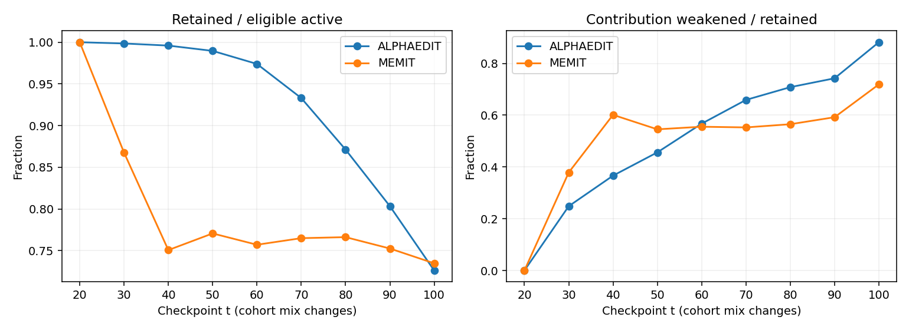
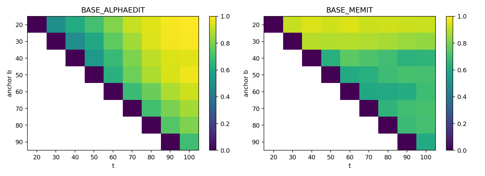
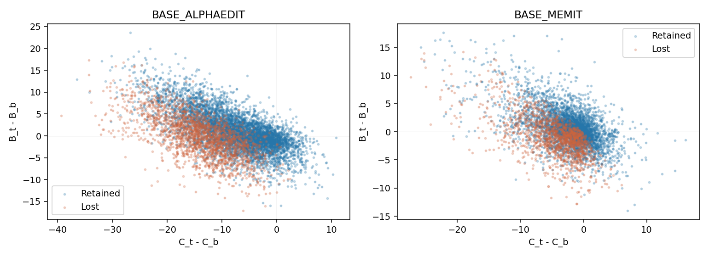
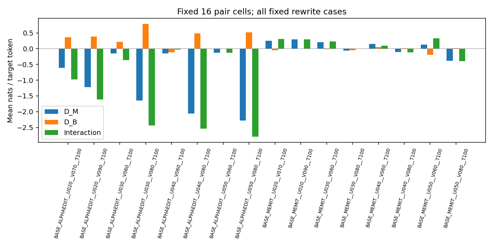
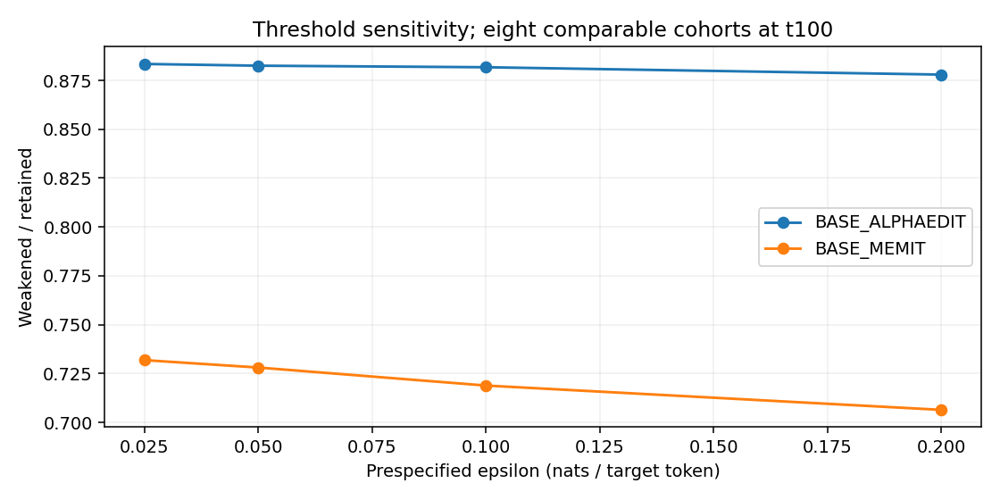

# Historical update timeaxis 완료 상세 리뷰

2026-09-26 · server4 · 사용자 호출 “실험 끝난거 자세히 리뷰하고 main에 push해”

## 1. 완료 사실과 리뷰 범위

**53283/53284/53285 모두 scheduler COMPLETED/exit 0:0이며, 두 family의 T1→T2P→T2F→T3B 및 collector T3A/T4 산출물이 존재한다.** 별도 CPU 구현으로 원 score-cache부터 재집계한 main 156셀/333,600 prompt×time 행, pair 16셀/48,000 행, primary 7,488개 집계가 원 collector와 일치했다. 원시 row의 case/prompt/target/token/order, 유한성, 분모, 중복, state·evaluator·layout 결속을 함께 확인했다.

최종 scientific terminal은 `COMPLETED_WITH_NUMERICAL_WARNINGS`이다. MEMIT 수치 경고 5건은 보존되며, `numerical_certification=NOT_ESTABLISHED`를 유지한다. 완료는 계산·구조 완결성을 뜻하고 원 수치 허용치 전체 PASS를 뜻하지 않는다.

이번 리뷰는 CPU-only다. 신규 GPU/model load/forward/evaluator/Slurm write/재제출/삭제/전송은 없었다. 원 실행·실패·waiver·이전 pause 기록을 변경하지 않았다. 별도 agent 감사가 아니라 **owner source 검토 + 원 reducer와 분리된 CPU 재집계**다.

관련 정본: [설계와 motivation](../../../../../plans/global/2026-09-24-historical-update-timeaxis-v1/design-ko.md), [실행 계약](../../../../../plans/global/2026-09-24-historical-update-timeaxis-v1/runner-contract-ko.md), [실험 계약](../../../../../plans/global/2026-09-24-historical-update-timeaxis-v1/experiment-contract.json), [수치 기록전용 override](../../../../../messages/head/2026-09-25-historical-timeaxis-numerical-record-only-sh4.md).

## 2. 정확 실행 identity와 lineage

| 항목 | 결속 |
|---|---|
| 원 task | GH-SH4-HISTORICAL-UPDATE-TIMEAXIS-20260924-V1 |
| 최신 실행 정책 | ODEEDIT-GH-SH4-HISTORICAL-TIMEAXIS-RECORD-ONLY-20260925-R1 |
| 실행 commit | b856babbca101c096d72a38a3ec9c936a85a4cf3 |
| lock SHA256 | f99939e6edda921c6320110c44a4a0b03e5c8911e2937c8955ea5e98d9ba7ebc |
| archive SHA256 | 78275ea84fbc2756a3f3d9ee47ac17c31159bbb8469f50f5a1cab8d385b17712 |
| closure source SHA256 | 86cc670e282039cf1332ca32bf0c7ee00b8cf91767e47bcce1b22fccd4542209 |
| 정책 SHA256 | d77fb902ec8b26e2122513e6a5a396e60501d1b8e43ac56491a8c3f21833c0b9 |
| waiver SHA256 | 9d2cebee7da6d70ceb69f55aca4a15ef81acfbb653b9027af0f76989acfc6240 |
| tokenizer/token manifest | ad01864cf485e2c57ae0f979be029198d8ed227d4fd90140c2a86458395dca19 |
| 모델 | Llama-3-8B-Instruct / revision 8afb486c1db24fe5011ec46dfbe5b5dccdb575c2 |
| baseline lineage | BASE_ALPHAEDIT 42657 / BASE_MEMIT 42658, blue=False |
| 데이터 | counterfact-fixed-10k-v1, SHA 3d7f5e31db47b23f3a281bb6fb447c2fb1776e3d4721cdfb5fe5c6f998f10ae1 |
| ordered root | 5b01356928ad2e2e46effad5a2c5621c87746b610992b7b92bf3ace16b6f5729 |
| 저장·새 편집 | save_checkpoints=false / native fitting=0 / history append=0 |

원 attempt는 `/data/janghj/ODE-edit/local/historical-update-timeaxis/20260924-v1/attempt-r3-record-only/`다. 원 checkpoint24개는 입력으로 읽으며 새 edited-state checkpoint를 만들지 않는다. 원 CP fullSHA/T0 tensor 검산을 현재 stat와 결속해 재사용했다. 이번 CPU 리뷰가 모델/CP 전체를 새로 해시하거나 제거 weight를 독립 tensor 재구성한 것은 아니다.

이전 `730a4a97`/53182·53183·53184 실행은 별도 실패 lineage다. MEMIT W100 MB16↔MB1 차이 0.0005242824554443359에서 중단됐고, 당시 해당 실패의 per-case raw는 미저장이었다. 원 기록을 고치지 않았다. 새 source는 수치 근접성을 비차단 진단으로 전환했으며, 완료된 fidelity9개와 Alpha diagonal12개의 명시 reuse bridge를 사용했다. 해당 재사용을 이번 신규 GPU 측정으로 계상하지 않는다. low-level 차이 원인은 계속 `NOT_ESTABLISHED`다.

## 3. Scheduler / DAG / coverage

시간은 Slurm 표시 KST. 이번 호출에서 지정 parent3개만 한 번 확인했으며 종료 대기나 반복 모니터링은 하지 않았다.

| Job | 역할 | 시작 → 끝 (2026-09-25) | 상태 | parent 시간 | 할당 |
|---|---|---|---|---:|---|
| 53283 | Alpha worker | 07:10:22 → 09:50:15 | COMPLETED 0:0 | 9,593초 | GPU1/CPU8/59GiB |
| 53284 | MEMIT worker | 07:10:22 → 09:50:02 | COMPLETED 0:0 | 9,580초 | GPU1/CPU8/59GiB |
| 53285 | afterany:53283:53284 collector | 09:50:34 → 09:52:27 | COMPLETED 0:0 | 113초 | GPU0/CPU8/24GiB |

두 worker의 matching identity/atomic structural PASS를 검산했다. collector는 afterany이지만 두 worker terminal 확인 없이 science를 성공으로 처리하는 방식이 아니다. collector exit0와 scientific terminal을 별도로 확인했다. 이 task의 최대 동시 GPU는 2이며, allocation은 실제 utilization이 아니다. 다른 task의 현재 상태는 조회하지 않았다.

| 단계 / 대상 | 실제 보존 증거와 검산 |
|---|---|
| T0 | 원 공통 binding 재사용: 설계29member/토큰/데이터/24CP/model; 새로운 GPU T0 실행 아님 |
| T1 | family별 structural PASS, 원 numerical certification 미확립 유지; fidelity·diagonal 재사용/신규 구분 |
| T2P | 고정 pilot32 logical cells에 필요한 score task32개/family 처리; pilot task는 main과 중복 참조 가능 |
| T2F | main156 logical cells, 최종 join333,600행; 성능 부호에 의한 셀 제외 없음 |
| T3B | pair16 logical cells, 48,000행; minus-V의 과거-U panel 포함 |
| T3A/T4 | scalar/분모/TF/primary7,488행/cluster CI 독립 일치; report·inventory·terminal 존재 |
| state bank | 173 unique recipe/state: actual25 + single removal132 + pair 추가16 |
| score task | 설계 unique383; family별 receipt192개씩=384개. 공통 W0 task1개의 family sidecar 중복이며 384개 독립 state가 아님 |
| 실제 raw | whole-cohort score381,600/family + pilot subset6,000/family; cache97,392개, unique target-sequence raw1,549,800행 |
| counterfactual sentinel | family별74개 × fixed8case, 총148개; 실제 task/state hash·repeat·restore receipt 결속 |

Pilot/full이 참조하는 score task 수, logical cell 수, prompt×time 행 수, new/true target sequence 수와 forward 호출 수는 서로 다르다. W0를 family당 별도 논리 모델로 두 번 세지 않았다. 상세: [coverage](score-coverage.csv), [stage receipts](stage-coverage.csv), [sentinels](state-sentinel-coverage.csv), [endpoint 재사용](endpoint-fidelity-coverage.csv).

## 4. 무엇을 계산했는가

전체 다섯 편집 weight L4–L8 down_proj의 구간 순변화 `U=θb−θa`를 사용한다. `U64=float64(Wb)−float64(Wa)`, `Wcf=float32(float64(Wt)−U64[−V64])`이며, 해당 모델의 full forward를 계산한다. E3의 L8 성분/activation patch나 linear proxy가 아니다.

`m = meanNLL_true − meanNLL_new`, `M_t=m(θt)`, `B_t=m(θt−U)`, `C_t=M_t−B_t`. 따라서 `ΔM=ΔB+ΔC`. 양의 margin은 new completion의 NLL이 더 작다는 뜻이다. tie는 실패다. U 제거는 **이미 실현된 이후 update를 고정한 parameter 제거**이며, 처음부터 U가 없었던 학습 trajectory나 한 fact만의 update 제거가 아니다. 이 문서의 C는 이 정의의 조건부 수치이며 독립 지식량/망각 원인 비율로 명명하지 않는다.

Primary는 같은 크기의 8구간(anchor20…90, 각1,000fact)이다. `E_b={anchor-active, M_b>0, C_b>0.1}`에서 t별 active 검열을 적용한다. 마지막90→100은 anchor-only이며 시간 변화 주표에 섞지 않았다. birth batch j와 cohort anchor b를 구분하고 C_j를 관측했다고 쓰지 않는다.

총10,000 요청의 anchor-active는9,966, t100-active는9,784다. 같은 batch의 상충 version은 active 제외하지만 raw는 보존하고, 최초 후속 다른 target부터 영구 검열한다. 동일 target 재반복은 redundancy로 남긴다. 최종 active 집합을 과거에 소급 적용하지 않았다. subject–relation group9,783개, 반복 group125개, 다중target group120개, 동일batch 상충 group-batch5개/요청10개다.

TF 지표는 고정 target의 teacher-forced token prediction이다. token-micro는 정답 token 합/target token 합, prompt-macro는 prompt별 token 정확도 평균, strict는 target 모든 token 일치다. 선호 성공과도 다르고 자유생성 정확도가 아니다. neighborhood/locality/free-generation은 이번 측정 범위가 아니다.

## 5. 실제 W100 endpoint

전체10,000fact 각각 rewrite1/P0/P1. 검열하지 않은 원 panel이며 아래 지표에 tie0. W100 실제 endpoint끼리만 비교한다.

| Family | Panel | 선호 성공 /10,000 | new NLL 평균 | true NLL 평균 | margin 평균 | TF strict /10,000 | TF token 정답/분모 |
|---|---|---:|---:|---:|---:|---:|---:|
| AlphaEdit | R | 7,343 | 5.073627 | 8.533927 | 3.460300 | 3,500 | 3,565/10,163 |
| AlphaEdit | P0 | 6,289 | 7.170843 | 8.711240 | 1.540397 | 1,461 | 1,491/10,163 |
| AlphaEdit | P1 | 6,288 | 7.202377 | 8.680417 | 1.478040 | 1,461 | 1,495/10,163 |
| MEMIT | R | 6,453 | 9.250712 | 10.970891 | 1.720179 | 1,093 | 1,094/10,163 |
| MEMIT | P0 | 5,691 | 10.707577 | 11.459082 | 0.751505 | 431 | 431/10,163 |
| MEMIT | P1 | 5,716 | 10.718796 | 11.482442 | 0.763646 | 430 | 432/10,163 |

Active9,784 기준 R 성공은 Alpha7,212, MEMIT6,329다. P0/P1은 Alpha6,184/6,186, MEMIT5,578/5,595다. 정확한 token-micro/prompt-macro/strict와 true 쪽 지표는 [endpoint table](first-endpoint-table.csv)에 함께 있다. 처음 전달한 예비 table은 저장 score 산술 수준이었고, 이번 최종 검산에서 underlying raw/token/layout까지 연결했다.

W100 R 성공집합은 공통5,191, Alpha-only2,152, MEMIT-only1,262, 둘 다 실패1,395다. 순차 baseline 두 개의 실제 차이이며 동일 entry shadow와 혼합하지 않는다. P0/P1 및 active 조건의 paired counts는 [family paired](family-paired-t100.csv) 참조.

| Family | W100 R+P0+P1 모두 선호 성공 | P0+P1 모두 선호 성공 | R+P0+P1 모두 TF strict |
|---|---:|---:|---:|
| AlphaEdit | 4,400/10,000 | 4,840/10,000 | 561/10,000 |
| MEMIT | 3,886/10,000 | 4,369/10,000 | 103/10,000 |

[전체 endpoint trajectory](endpoint-trajectory.csv), [request joint](request-joint.csv). 시점별 all-seen 분모는 증가하므로 서로 다른 시점의 aggregate 차이를 동일 문항 망각량으로 쓰지 않는다. 같은 문항 anchor→final lost/gained는 [별도 pairing](anchor-final-transitions.csv)으로 제공한다.

## 6. 초기 유효 사실의 유지와 기여 변화

ε=0.1, anchor20…90 8구간, t100. 각 family의 초기 E_b가 다르므로 두 행의 유지율만으로 같은 문항 대조라고 부를 수 없다.

| Family/panel | 초기 E_b | 검열 후 분모 | 유지 | lost | 유지 중 ΔC<−.1 | lost 중 ΔC≥−.1 | 유지 중 C_t<−.1 |
|---|---:|---:|---:|---:|---:|---:|---:|
| Alpha R | 7,917 | 7,766 | 5,639 | 2,127 | 4,972/5,639 (88.17%) | 15/2,127 (0.71%) | 315/5,639 (5.59%) |
| MEMIT R | 5,989 | 5,877 | 4,318 | 1,559 | 3,104/4,318 (71.89%) | 123/1,559 (7.89%) | 570/4,318 (13.20%) |
| Alpha P0 | 7,273 | 7,162 | 4,509 | 2,653 | 3,940/4,509 | 45/2,653 | 588/4,509 |
| Alpha P1 | 7,300 | 7,197 | 4,547 | 2,650 | 3,957/4,547 | 40/2,650 | 582/4,547 |
| MEMIT P0 | 4,929 | 4,838 | 3,291 | 1,547 | 2,506/3,291 | 130/1,547 | 647/3,291 |
| MEMIT P1 | 4,882 | 4,801 | 3,300 | 1,501 | 2,472/3,300 | 123/1,501 | 659/3,300 |

R의 micro 유지율은 Alpha72.6114%, MEMIT73.4729%; cohort별 macro는72.5647%,72.7009%다. **두 family 모두 초기 유효한 같은 문항만** 취하면 공통 active분모5,833, 유지 Alpha4,417/5,833(75.7243%), MEMIT4,279/5,833(73.3585%)다. all-anchor-success, all-facts, both-arm-eligible 및4개 ε는 [분리 표](primary-t100-eight-cohorts.csv)에 모두 보존했다. 0분모는 NA다.

Primary R의 signed 평균은 아래와 같다. 각 family 자기 E_b/active 분모이며 서로 다른 초기 집합이다.

| Family | n | ΔM | ΔB | ΔC | C_t | ΔC p05 / p95 |
|---|---:|---:|---:|---:|---:|---:|
| Alpha | 7,766 | −8.491459 | +0.710516 | −9.201975 | 4.429173 | −21.756200 / +1.226053 |
| MEMIT | 5,877 | −2.641871 | +0.219687 | −2.861558 | 2.400045 | −11.142190 / +2.636677 |

유지하면서 ΔC<−.1인 문항 중 ΔB>0은 Alpha3,049/4,972, MEMIT2,008/3,104다. ΔB가 −ΔC 이상인 경우는163/4,972,605/3,104다. 이는 signed 산술 조건의 동시 발생 수이며 인과적 보상 메커니즘의 증명으로 이름 붙이지 않는다. [분포·tail](continuous-tails.csv), [signed 조건](signed-movements.csv).



위 집계 곡선의 t별 cohort 구성이 달라진다. 같은 cohort 비교는 아래 heatmap과 [fixed-age10/50/t100](fixed-age-primary.csv)를 사용한다.

### Cohort별 R at t100와 문항 cluster CI

| Family | anchor | active E_b | 유지 | 유지 중 감소 | 평균 ΔC | 95% cluster CI(평균 ΔC) |
|---|---:|---:|---:|---:|---:|---|
| Alpha | 20 | 960 | 536 | 534 | −15.0932 | [−15.4889, −14.7198] |
| Alpha | 30 | 969 | 562 | 558 | −13.3237 | [−13.7102, −12.9413] |
| Alpha | 40 | 974 | 584 | 557 | −11.9087 | [−12.2969, −11.5394] |
| Alpha | 50 | 977 | 668 | 652 | −10.6514 | [−11.0217, −10.2909] |
| Alpha | 60 | 963 | 688 | 635 | −9.2006 | [−9.6000, −8.8344] |
| Alpha | 70 | 973 | 788 | 682 | −7.0356 | [−7.4116, −6.6476] |
| Alpha | 80 | 972 | 866 | 698 | −4.5497 | [−4.8602, −4.2391] |
| Alpha | 90 | 978 | 947 | 656 | −1.9721 | [−2.1914, −1.7466] |
| MEMIT | 20 | 721 | 446 | 408 | −8.4545 | [−8.8824, −8.0471] |
| MEMIT | 30 | 743 | 455 | 381 | −4.3361 | [−4.6126, −4.0401] |
| MEMIT | 40 | 504 | 337 | 220 | −1.6678 | [−1.9893, −1.3459] |
| MEMIT | 50 | 685 | 480 | 338 | −2.0177 | [−2.2939, −1.7376] |
| MEMIT | 60 | 747 | 519 | 358 | −2.0342 | [−2.2855, −1.7969] |
| MEMIT | 70 | 808 | 624 | 442 | −2.1048 | [−2.3356, −1.8723] |
| MEMIT | 80 | 861 | 716 | 503 | −1.7488 | [−1.9528, −1.5457] |
| MEMIT | 90 | 808 | 741 | 454 | −0.6823 | [−0.8041, −0.5556] |

Subject–relation cluster bootstrap2,000회/seed20260924의 원 CI를 독립 재생성했다. 같은 고정 chain의 문항 구성 불확실성이며 새로운 edit order/seed/hardware 반복의 신뢰구간이 아니다. [전체 CI](bootstrap-recomputed.csv). rewrite+P0+P1 세 prompt를 함께 쓴 fact별 RMS drift도 [별도 집계](fact-rms-drift.csv)로 남겼다.



### Worked examples

사전에 코드에 명시한 선택 규칙: 각 family primary R에서 (a) 유지 중 가장 작은 ΔC, (b) lost 중 가장 큰 ΔC, (c) 유지 중 가장 작은 C_t; 동률은 case ID. 일반적 빈도를 대표하는 표본이 아니다. 원 문항 텍스트는 Git에 넣지 않았다.

| Family/case | 선택 | M_b→M_t | C_b→C_t | ΔB | ΔC |
|---|---|---|---|---:|---:|
| Alpha/15768 | 유지·최소 ΔC | 26.0808→2.4467 | 37.9051→1.3904 | +12.8805 | −36.5147 |
| Alpha/6904 | lost·최대 ΔC | 7.4356→−0.0257 | 4.5957→7.0359 | −9.9016 | +2.4402 |
| Alpha/19202 | 유지·최소 C_t | 14.7255→2.9266 | 16.9938→−9.9420 | +15.1370 | −26.9358 |
| MEMIT/2863 | 유지·최소 ΔC | 11.5442→0.7436 | 25.9178→0.1267 | +14.9905 | −25.7911 |
| MEMIT/427 | lost·최대 ΔC | 1.2613→−2.1851 | 5.1017→11.1125 | −9.4572 | +6.0108 |
| MEMIT/14314 | 유지·최소 C_t | 13.9250→0.3732 | 14.9809→−6.3550 | +7.7841 | −21.3359 |

[정밀 값](worked-examples.csv). 연속 관측점 사이 회복/newly-lost 및 signed increment는 [chronological summary](chronological-summary.csv)와 local per-case 파일로 구분 보존했다. 최종 성공과 전 기간 무중단 성공은 같지 않다.



## 7. 고정 U/V pair16셀

`D_M=m(θ)−m(θ−V)`, `D_B=m(θ−U)−m(θ−U−V)`, `I=D_M−D_B`. 아래는 각 fixed U-cohort의 rewrite1,000개 전부, t100이다. U/V 이름은 끝점 anchor이며 각 구간 전체5weight를 사용한다. high/low는 outcome 전에 고정한 competitor-exposure metadata 순위이지 무작위 처리다.

| Family | U/V anchor | 선택 | D_M 평균 | D_B 평균 | I 평균 | V제거 gained/lost |
|---|---|---|---:|---:|---:|---:|
| Alpha | 20/70 | high | −0.612969 | +0.361240 | −0.974209 | 156/97 |
| Alpha | 20/90 | low | −1.221751 | +0.387120 | −1.608871 | 161/60 |
| Alpha | 30/60 | low | −0.148001 | +0.216128 | −0.364129 | 84/64 |
| Alpha | 30/80 | high | −1.651440 | +0.781484 | −2.432924 | 205/78 |
| Alpha | 40/60 | low | −0.147671 | −0.118114 | −0.029556 | 94/71 |
| Alpha | 40/80 | high | −2.061408 | +0.480555 | −2.541963 | 207/59 |
| Alpha | 50/60 | low | −0.123964 | +0.009175 | −0.133140 | 69/56 |
| Alpha | 50/80 | high | −2.277745 | +0.520399 | −2.798144 | 172/48 |
| MEMIT | 20/70 | high | +0.251345 | −0.054856 | +0.306201 | 87/122 |
| MEMIT | 20/90 | low | +0.299232 | +0.007213 | +0.292019 | 74/94 |
| MEMIT | 30/60 | low | +0.202982 | −0.021214 | +0.224196 | 90/101 |
| MEMIT | 30/80 | high | −0.064495 | −0.054728 | −0.009767 | 114/85 |
| MEMIT | 40/60 | low | +0.143863 | +0.045783 | +0.098080 | 85/101 |
| MEMIT | 40/80 | high | −0.105023 | +0.013624 | −0.118647 | 101/87 |
| MEMIT | 50/60 | low | +0.130456 | −0.200078 | +0.330533 | 80/86 |
| MEMIT | 50/80 | high | −0.384775 | +0.014304 | −0.399079 | 108/74 |

P0/P1, active-only, 분포/q05/q50/q95, 양/음/0개수는 [전체 pair table](pair-effects-recomputed.csv)에 있다. 같은 cohort가 서로 다른 V에 반복 사용되므로 16,000개를 서로 독립인 fact 수로 합산하지 않는다. 여러 V의 I 합을 전체 망각 기여율로 계산하지 않았으며 high/low 노출양의 무작위 인과효과도 주장하지 않는다. 원 collector의 pair별 CI는 NOT_RECORDED; 주 시간축 cohort CI와 혼동하지 않는다.



## 8. 수치 경고, 허용 정책과 경계

원 수치 기준 NLL≤0.00025, margin≤0.0005를 그대로 기록하되 사용자 승인으로 수치 근접성만 `RECORD_ONLY_USER_DIRECTED`다. identity/finite/weight/restore/I-O 검사는 비차단화하지 않았다.

386개 diagnostic 비교 receipt와 raw endpoint 비교를 재검산했다. 경고5개는 모두 **MEMIT case20832/P0**다.

| 비교 | 항목 | 절대 차이 | 원 기준 초과량 |
|---|---|---:|---:|
| W90 MB16↔MB1 | new NLL | 0.0005271434783935547 | 0.0002771434783935547 |
| W90 MB16↔MB1 | true NLL | 0.00027561187744140625 | 0.000025611877441406245 |
| W100 MB16↔MB1 | new NLL | 0.0005242824554443359 | 0.0002742824554443359 |
| W90 과거↔현재 평가 | max new/true NLL | 0.0004239082336425781 | 0.00017390823364257812 |
| W100 과거↔현재 평가 | max new/true NLL | 0.0004544258117675781 | 0.00020442581176757812 |

해당 저장 비교에서 preference flip0. 기록된 diagnostic 최대 margin 차이 `e_m=0.0004394054412841797`. 같은 오차가 각 평가에 적용된다고 가정한 보수적 산술 범위는 C에2e_m=0.0008788108825683594, ΔC에4e_m=0.0017576217651367188이다. **이는 제한된 실제 panel에서 관측한 차이로 만든 산술값이며 전체 모델/문항 오차 상한 증명이 아니다.** low-level 원인, 전체 GPU bitwise 동일성은 미확립이다.

Primary R에서 anchor/final margin 절대값≤0.0005를 제외하면 Alpha 분모는 그대로7,766, MEMIT은5,877→5,876(유지4,318→4,317)이다. P1은 각1개 제외된다. [경계 민감도](boundary-exclusion.csv). 사전 ε .025/.05/.10/.20의 결과는 모두 보존하며 threshold를 결과에 맞춰 변경하지 않았다.



## 9. 설계 → frozen source → 실물 evidence

아래 line은 실행 commit b856babb의 파일 기준이다. 현재 리뷰 code를 runtime으로 표기하지 않는다.

| 요구 | 실행 파일/함수/줄 | 실제 evidence / 검산 범위 |
|---|---|---|
| 고정 전체 U,5weight,FP64→FP32 | backend.py `state` L50–78 | task173state의 recipe·removed index·5hash·digest·entry binding. 이번 독립 tensor 재구성은 NOT_TESTED |
| copy_ exact restore, RNG/나머지 state | backend.py `copy/unchanged/state` L38–78 | task restore=EXACT_BYTES 및148 sentinel 결속. 나머지 parameter는 runtime pointer/version 검사이며 전state fullmodel bytehash라고 확대하지 않음 |
| FP32/eager/autocast off/TF32 | backend.py L11–28,80–90 | frozen import/config와 원 runtime receipt; 새 GPU precision 시험 없음 |
| 원 tokenization/BOS·UNK/leftpad/MB16 | source-evidence evaluator.py `_encode_pair/evaluate_pairs` | 원 prompt/target별 encode, target token/prediction/TF score와 정확 layout 해시. tokenizer의 padding_side 표기와 무관하게 evaluator 수동 leftpadding |
| score reuse의 정확 조건 | worker.py `cached_raw` L153–172 | weightHash+encoded layout+evaluatorSignature,97,392cache 신규SHA/rowSHA. retained-mask만으로 재사용하지 않음 |
| 전체 task/문항·순서 | worker.py `score_task/phase` L174–227 | task384sidecar/unique383,whole381,600+pilot6,000/family; case/order SHA 독립 일치 |
| structural gate vs 수치 warning | fidelity.py `policy/check_gate/compare_raw`; worker.py L37–70 | matching policy/waiver hash,386diagnostics/5warning; old PASS 재명명 없음 |
| noCP/noediting | backend.py `state`,worker.py `run` L230–237 | runtime fitting/history0,output inventory에 새edited weight/delta/resume 없음. 원 입력으로 state 재구성하고 score는 재사용 가능 |
| M/B/C·U/V join | reduce.py L12–87 | main333,600/pair48,000 모든 scalar 독립 일치,Δaccounting 최대0.0 |
| eligibility/censor/분모/TF | reduce.py L89–124 | primary7,488행,순서·target·finite·tie·TF를 raw에서 재집계 |
| bootstrap/고정age/분포 | reduce.py L125–154 | 별도 CPU cluster sufficient statistics로 CI2,000회 재현; RMS3prompt 일치 |
| 두 family join/terminal last | reduce.py L186–230 | worker terminal둘/소스·policy일치, report/index 후terminal; afterany 자체를 PASS근거로 쓰지 않음 |

[CPU review source](../../../../../project/run_scripts/historical_update_timeaxis/completed_review_20260926.py), [회귀 tests](../../../../../project/run_scripts/historical_update_timeaxis/test_completed_review_20260926.py). CPU tests10/10은 실제 모델 수치 인증이 아니다.

## 10. 비용과 저장

이번 parent GPU allocation은 **19,173초=5.325833 GPUh**. CPU collector113초는 GPU 비용에 넣지 않는다. 과거 실패1,569 GPU초는 별도이며 둘을 명시 합산하면20,742초=5.761667GPUh다. 원 baseline42657/42658 fitting,24CP/teacher 생성이나 원 T0 준비비용은 이번 allocation에 다시 청구하지 않는다.

| 측정 | Alpha | MEMIT |
|---|---:|---:|
| 프로그램 wall (초) | 9,589.712 | 9,576.426 |
| model load (초) | 14.465 | 18.188 |
| forward (초) | 6,346.904 | 6,388.696 |
| materialization (초) | 1,071.642 | 1,274.945 |
| restore (초) | 569.758 | 744.212 |
| forward call | 50,476 | 50,726 |
| target sequences(기술검사 포함) | 788,328 | 790,464 |
| nonpadding / padded token | 12,837,279 / 19,411,976 | 12,872,558 / 19,465,610 |
| selected H2D bytes(counter) | 856,141,332,480 | 931,303,260,160 |
| host peak MiB | 33,835.488 | 33,835.922 |
| GPU allocated peak bytes(PyTorch) | 34,512,537,088 | 34,512,537,088 |

Host peak는 process `ru_maxrss`, GPU peak는 PyTorch max_memory_allocated이며 scheduler cgroup 전체/보드 전체 소비가 아니다. 각각59GiB request 안에서 보고된 값이다. 별도 total board VRAM peak/utilization은 NOT_RECORDED.

[단계별 counter 차분](compute.csv)은 누적 snapshot의 차이를 명시했다. T1 Alpha forward0은 원 fidelity/diagonal 재사용 때문이며 전체 기술검사가 신규0이라는 뜻이 아니다. T2P/T2F/T3B에는 해당 시점 endpoint/sentinel 검사 비용이 섞인다. load/materialize/restore/hash/I-O/대기 경계가 완전히 분리되지 않고 `timers_nested=true`이므로 timer를 합산해 wall을 재구성하지 않는다. 순수 I/O·hash·peer-wait·개별 cache hit 비용은 NOT_SEPARATED. 동일 조건 별도 timing 대조가 없어 일반적 speedup을 주장하지 않는다.

출력 전체는2,629,367,048 logical bytes다. Alpha549,917,206B(1,687file), MEMIT548,151,942B(1,812file), T4724,481,139B(19file), cache806,816,761B(194,784file; 이 중 zero-byte lock97,392개 포함). filesystem allocated blocks/free-space와는 다른 logical 합계다. 큰 per-case/raw/로그는 local-only다. [compact inventory](../../../../../audits/servers/server4/historical-update-timeaxis-20260924-v1/completed-review-20260926-v1/artifact-inventory-summary.json).

## 11. 검산 수준·한계·재현

확인한 것: 원 raw와 독립 score 산술, 원문·token·state·layout identity, 전체 분모/유한성/중복, 같은 문항 pairing, active 시점, M/B/C·pair accounting, 원집계/CI/그림 재현, code-only PNG/Markdown/link/manifest 검산.

확인하지 않은 것: 새로운 GPU continuation/bitwise model parity, CPU에서 모든 제거 weight의 독립 tensor 재구성, 다른 order/seed/hardware, 개별fact만의 고립 update, U가 처음부터 없었던 재학습, neighborhood/locality/generalization/free generation, 미계측 low-level 오차 원인. 모델 backward/편집/추가 실험은 수행하지 않았다. 과학적 원인·방법 선택·우월성 판단은 이 사실보고에 포함하지 않는다.

분석은 `completed_review_20260926.py`로 새 출력 root에 재현할 수 있다. 기존 출력은 create-once이며 다음 명령의 destination은 존재하지 않는 경로여야 한다. 실행 위치는 이 보고의 review source를 포함한 저장소 root다.

```bash
CUDA_VISIBLE_DEVICES='' PYTHONDONTWRITEBYTECODE=1 /data/janghj/EasyEdit/.venv/bin/python \
  -m project.run_scripts.historical_update_timeaxis.completed_review_20260926 \
  --review-output-root /data/janghj/ODE-edit/local/historical-update-timeaxis/20260924-v1/review-reproduction-new
CUDA_VISIBLE_DEVICES='' PYTHONDONTWRITEBYTECODE=1 /data/janghj/EasyEdit/.venv/bin/python \
  -m unittest project.run_scripts.historical_update_timeaxis.test_completed_review_20260926 -v
```

최종 분석 source/package member SHA와 원시 inventory root는 [package manifest](package-manifest.json), [rooted receipt](rooted-receipt.json), [audit 검사](../../../../../audits/servers/server4/historical-update-timeaxis-20260924-v1/completed-review-20260926-v1/publication-checks.json)에 남긴다. Git에는 집계·보고·코드만 올린다. `NO_BROADCAST_NOT_REQUIRED`: 동일 host 보존 자료 CPU 검산이며 새 원격 raw 전송이 없다.

완료 인계 후 `TASK_COMPLETE_STOP`, monitoring_active=false, automatic_resume=false. 추가 실험/후속 scientific submission은 없다.
