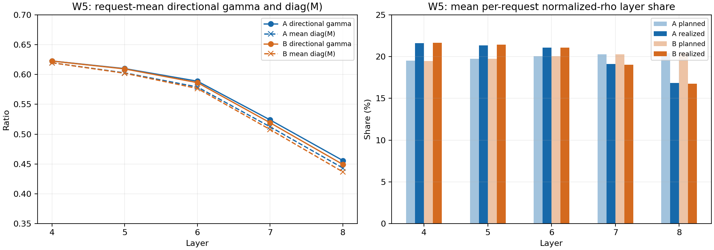
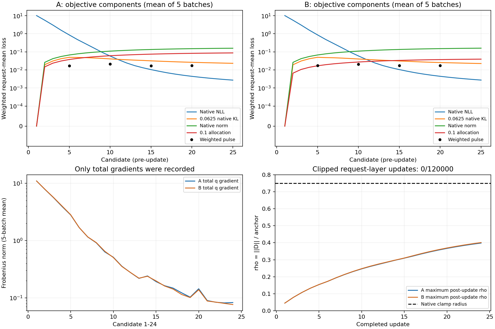
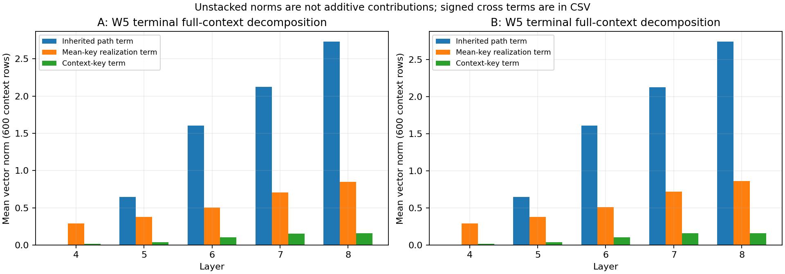

# JLZ v9 실현과 배분 계측 산출물

사용자의 “산출물도 push해” 요청으로 기존 main A/B의 local 계측을 공개용 CSV와 그림으로 추가 정리했다. 원 실행 source는 `b8c4c96fef79d3ad6ba37b1f6f4055bd58343e66`이며, 이 디렉터리는 그 실행을 바꾸지 않는 CPU 분석 산출물이다. 모델 forward, GPU job, baseline, 재학습은 모두 0이다. [W5 성능과 완료 요약](../report-ko.md)은 그대로 구분한다.

두 arm의 5 batch × 25후보 = 250개 candidate JSON을 모두 읽었다. 임의 후보나 층을 선별하지 않았다. Candidate 1의 zero D 비율과 share는 null을 유지하고, candidate 25의 미측정 gradient도 null이다. 유효한 음수 또는 1 초과 γ를 제외하는 필터는 없다.

## 공개한 표

| 파일 | 행 | 내용 |
|---|---:|---|
| [terminal 층별 실현](terminal-layer-realization.csv) | 50 | γ·norm 비율·M diagonal·self/cross·계획/실현 share의 평균·분위수·분모 |
| [후보별 층 궤적](candidate-layer-trajectory.csv) | 1250 | 모든 후보의 ρ·γ·share·energy·총 D/q gradient norm |
| [후보별 목적값](candidate-objectives.csv) | 250 | NLL·KL·native norm·policy·pulse의 계수 적용 값, mean/SUM 단위와 timer |
| [clamp 궤적](clamp-trajectory.csv) | 1200 | 모든 24 update의 층별 clip 수, 전후 ρ, radial scale, projection 손실 |
| [terminal context 분해](terminal-context-decomposition.csv) | 150 | 전체 native 600/정준 100/증강 500 context별 세 벡터의 norm과 signed 교차내적 |
| [terminal native 관측](terminal-native-observations.csv) | 10 | virtual/actual context NLL과 KL 분포 |
| [Q2 frozen operator](Q2-frozen-operator.csv) | 10 | 동일 ridge K에서 ridge/exact의 γ·M diagonal·energy·write norm |
| [A와 B terminal 차이](AB-terminal-differences.csv) | 25 | 같은 offered 순서에서 γ·ρ·share·M diagonal 차이, 각 arm은 별도 trajectory |
| [hardware 기록](hardware.csv) | 2 | 저장 runtime의 GPU 종류와 package version, 기록되지 않은 GPU별 정보 |

γ는 요청별 `D·Y / ||D||²`, norm 비율은 `||Y||/||D||`, `Y=D M`이다. 기본 요약은 요청별 값의 산술 평균이다. `gamma_D_energy_weighted`는 별도로 `Σ(D·Y)/Σ||D||²`를 기록한다. `M_diagonal_mean`은 trace/B로, D 방향 γ와 같은 지표가 아니다.

계획 layer share는 각 요청의 `ρ_l=||D_l||/a_l`를 층 합으로 나눈 값이며, 실현 share는 `||Y_l||/a_l`에 같은 정규화를 적용한다. D 에너지 비율이나 최종 NLL의 인과 기여율이 아니다. q05/q50/q95/q99는 정렬 후 `(n−1)p` 위치의 선형 보간이며, 각 열에 valid/null 분모를 남겼다.

## terminal 실현 수치

아래는 각 batch terminal의 요청 평균 γ다. 같은 고정 trajectory 안의 시점이며 독립 실험 반복으로 세지 않는다.

| Arm | Batch | L4 | L5 | L6 | L7 | L8 |
|---|---:|---:|---:|---:|---:|---:|
| A | 1 | 0.6132 | 0.6050 | 0.6290 | 0.6337 | 0.6237 |
| A | 2 | 0.6106 | 0.6017 | 0.6143 | 0.6131 | 0.5945 |
| A | 3 | 0.6024 | 0.5926 | 0.5987 | 0.5797 | 0.5454 |
| A | 4 | 0.6137 | 0.6091 | 0.5974 | 0.5539 | 0.5037 |
| A | 5 | 0.6226 | 0.6099 | 0.5888 | 0.5238 | 0.4557 |
| B | 1 | 0.6131 | 0.6043 | 0.6278 | 0.6316 | 0.6209 |
| B | 2 | 0.6105 | 0.6008 | 0.6126 | 0.6099 | 0.5903 |
| B | 3 | 0.6024 | 0.5918 | 0.5968 | 0.5762 | 0.5404 |
| B | 4 | 0.6137 | 0.6083 | 0.5957 | 0.5500 | 0.4974 |
| B | 5 | 0.6226 | 0.6093 | 0.5863 | 0.5190 | 0.4492 |

W5 L8의 계획→실현 평균 share는 A 20.4210%→16.8590%, B 20.4493%→16.7382%다. 모든 terminal 5000개 request-layer 항목에서 zero D, 음수 γ, γ>1은 각각 0개였다. Q2 B1의 frozen ridge K에서 exact γ 평균은 층별 FP64 반올림 범위 내 1이지만, 이는 exact 500-edit trajectory의 관측이 아니다. Causal exact의 별도 qualification은 [기존 Q2 요약](../completed-recall-r1/q2-summary.json)에 있다.



## 목적값과 clamp

전체 main의 `post_update_clamp.clipped` 합은 **0/120000 request-layer-update**다. 이 분모는 2 arm × 5 batch × 24 update × 5 layer × 100요청이다. 저장된 최대 pre/post-update ρ는 모두 **0.401198864**이며 clamp 반경 0.75에 도달하지 않았다. 따라서 이번 기록에는 “약 17 step에서 재포화” 관측이 없다.

아래는 candidate 25에서 5 batch를 평균한 목적 성분이다. Terminal은 forward-only이므로 gradient를 측정하지 않았고 pulse도 호출되지 않았다.

| Arm | Native NLL | 가중 native KL | 가중 native norm | 가중 allocation |
|---|---:|---:|---:|---:|
| A | 0.0027272 | 0.0232338 | 0.1589127 | 0.0873143 |
| B | 0.0027443 | 0.0226215 | 0.1601128 | 0.0395261 |

NLL은 요청·context·target token 평균, KL은 원 평균 ×0.0625, native norm은 기존 0.5 계수를 포함한 요청 평균이다. `policy_mean`에는 λ=0.1이 이미 포함돼 있다. Pulse의 subject/distillation/current KL 계수는 각각 0.1/0.1/0.0625이며 전체 batch B로 나눠 같은 mean 단위로 표기했다. 학습 SUM 목적은 이 합에 actual B를 한 번 곱한다. 비pulse 후보의 pulse 값은 목적 항 미호출에 따른 0이며 결측치를 채운 값이 아니다.

**성분별 gradient norm은 저장되지 않았다.** `gradient_norm`은 모든 항을 합친 뒤의 D/q norm과 radial 성분뿐이다. 목적값의 크기를 gradient 크기로 바꿔 해석하지 않는다. 기존 데이터만으로 native 대 policy gradient 비율 또는 A/B 차이의 원인을 확정하지 않았다. λ=0 대조도 새로 실행하지 않았다.



목적값 그림은 A/B 동일 symlog 축으로 1e-4 부근만 선형 표시한다. 이는 시각화 축이며 목적식에 epsilon/smoothing을 추가한 것이 아니다. 0과 작은 음수 KL 원값도 CSV에 그대로 남아 있다. 다른 plot의 총 gradient는 24개의 backward 후보만 사용한다.

## terminal 차이 분해와 비용 기록의 한계

저장 source의 세 항은 `gap−D`, `D−mean`, `mean−own_ideal`이다. 각각 상속 경로 항, 평균 key 실현 오차 항, context key 차이 항으로 표시했다. 벡터 합과 교차내적을 구분하며 norm을 단순 더하거나 인과 기여율로 환산하지 않았다. 원 runtime의 최대 성분별 합 항등식 잔차는 **4.4408921e-16**이다. `sum_parts_ideal_gap_RMSnorm`은 세 squared norm과 signed cross dot으로 계산하고, 실제 FP32 virtual-to-actual gap norm은 별도로 보존했다.



두 main은 동일 server4이며 runtime에 기록된 GPU 종류는 모두 NVIDIA RTX PRO 6000 Blackwell Server Edition이다. 해당 runtime receipt에 물리 GPU UUID와 개별 clock/utilization은 없어 비용 차이의 원인은 NOT_ESTABLISHED다. Candidate timer는 native/builder/aux/계측/일부 terminal Q2를 포함하므로 내부 timer를 단순 합산하지 않는다. [기존 parent allocation](../../../../../audits/servers/server4/jlz-realization-v9-ridge-bs100x5-with-exact-probe/completed-recall-r1/accounting.json)과 구분한다.

## 검산과 원자료 보존

Scalar JSON을 읽을 때 기존 collector inventory의 SHA와 대조했다. 목적값과 pulse reduction, layer share 합, 25후보/24업데이트, 4 pulse의 전체 current coverage, clamp 분모, terminal의 600 context membership·중복을 확인했다. Null/비유한/분위수/교차내적 단위검사 4개를 통과했다.

사전 지정 sentinel은 각 arm B1 L4와 B5 L8의 terminal tensor, 총4개다. CPU에서 `D M=Y`, γ, M diagonal을 독립 재계산했으며 γ 최대 절대 차이는 **7.66054e-15**였다. 나머지 tensor는 기존 SHA와 현재 size/mtime 결속으로 구분했고, model/CP 전체 재해시는 하지 않았다. [입력 inventory](input-manifest.json), [검산 결과](validation.json), [분석 코드](../../../../../audits/servers/server4/jlz-realization-v9-ridge-bs100x5-with-exact-probe/telemetry-publication-r1/reduce_telemetry.py), [그림 코드](../../../../../audits/servers/server4/jlz-realization-v9-ridge-bs100x5-with-exact-probe/telemetry-publication-r1/plot_telemetry.py)를 함께 게시한다.

Owner의 별도 CPU reducer 검산이며 독립 red reviewer 또는 새 actual GPU parity PASS로 표기하지 않는다. 원 candidate JSON·NPZ·prompt·full stdout은 local KEEP/Git0다. 원 실행코드·source archive·기존 raw는 수정하지 않았다. 신규 checkpoint/평가/job/monitoring/automatic resume 모두 0이다. `NO_BROADCAST_NOT_REQUIRED`: 소형 집계와 그림만 Git으로 게시했다.

재현 명령은 repo root에서 실행하며 출력은 새로운 경로여야 한다.

```bash
python3 -B -m unittest discover \
  -s audits/servers/server4/jlz-realization-v9-ridge-bs100x5-with-exact-probe/telemetry-publication-r1 \
  -p 'test_*.py' -v
OPENBLAS_NUM_THREADS=1 OMP_NUM_THREADS=1 CUDA_VISIBLE_DEVICES='' \
  /data/janghj/EasyEdit/.venv/bin/python -B \
  audits/servers/server4/jlz-realization-v9-ridge-bs100x5-with-exact-probe/telemetry-publication-r1/reduce_telemetry.py \
  --attempt /data/janghj/ODE-edit/local/jlz-realization-v9/20261003-v1/attempt-r2 \
  --out /EXACT/NEW/TELEMETRY/OUTPUT
MPLCONFIGDIR=/data/janghj/ODE-edit/local/jlz-realization-v9/20261003-v1/telemetry-publication-r1/matplotlib \
  OPENBLAS_NUM_THREADS=1 OMP_NUM_THREADS=1 CUDA_VISIBLE_DEVICES='' \
  /data/janghj/EasyEdit/.venv/bin/python -B \
  audits/servers/server4/jlz-realization-v9-ridge-bs100x5-with-exact-probe/telemetry-publication-r1/plot_telemetry.py \
  --data /EXACT/NEW/TELEMETRY/OUTPUT --out /EXACT/NEW/TELEMETRY/OUTPUT/figures
```
