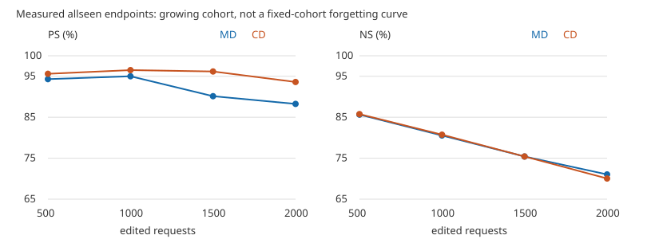

# V13 MD/CD sequential 2k — CPU 상세 완료 리뷰

상태: `COMPLETE_RAW_CPU_VERIFIED / REVIEW_COMPLETE_STOP`.
권한: `ODEEDIT-GH-SH4-V13-MDCD-REVIEW-20261005-R1`.

MD/CD 모두 cold W0/H0에서 BS100×20을 완료했다. 원 raw를 독립 CPU reducer로 재집계한
W20 결과는 MD **RS 98.40 / PS 88.25 / NS 71.035%**, CD **98.60 / 93.60 / 70.045%**다.
CD는 MD보다 PS +5.35pp, NS −0.99pp다. CD의 rewrite local action은 방향·오차까지
계획에 거의 일치하지만, 이를 전체 경로 실현이나 locality 보존과 동일시할 수 없다.

이번 검산 범위에서 확정된 production 기술 불일치는 발견하지 않았다. 이는 신규 LM parity
검증이나 RAM W/H tensor 재구축 결과가 아니라, 보존된 raw/identity/state receipt/source를
CPU로 검산한 결과다. GPU/model load/forward/새 평가/Slurm write/전송은 모두 0이다.
원 submission 인계 보고는 상위 보고서와 main `57e7b02b`에 보존되어 있다.

## 1. 완료·source·identity

정확한 세 job에 대해 **2026-10-05 05:13:32 UTC**에 accounting/status snapshot을 한 번 조회했다.
MD58442/CD58443/CPU58444 모두 `COMPLETED`, exit `0:0`이었다. 이후 scheduler polling은 하지 않았다.
COMPLETED나 기존 `comparison-W20.csv` 파일명만으로 전체 측정을 판단하지 않고 원 rows를 검산했다.

| 항목 | MD | CD |
|---|---:|---:|
| 성공 fit / commit | 20 / 20 | 20 / 20 |
| 요청 occurrences | 2,000 | 2,000 |
| 다음 own-entry state joins | 19 | 19 |
| rewrite-only final H append | 100 | 100 |
| request candidate 평가 / update | 48,726 / 46,726 | 48,414 / 46,414 |
| 평가 / update 승인 상한 | 50,000 / 48,000 | 50,000 / 48,000 |
| terminal request | 2,000 | 2,000 |
| 추가 terminal forward / backward | 0 / 0 | 0 / 0 |

같은 2,000 cohort에 두 arm 합 4,000 request applications다. 각 arm은 자기 W/H/teacher/anchor/RNG와
계획을 이어 갔으며, 배치 간 D/z/upper key를 공유한 실험이 아니다. B21, baseline fit, 추가 fit, CP는 없다.

| identity | 값 |
|---|---|
| 실제 GPU execution source | `2ff0ecc63dda2c830fbd68e6a2d76f3317a446f7` |
| execution source tree | `70773af2808e0fd15ece2fb1dcce3f1e9d59218c` |
| 등록 로직만 최소 수리한 source | `21024d4b1760e017c4f49af8acfd0709be9fac1d` |
| readonly B1 core | `082300955e21a2c29218d66d98c5d2c37bc53a20` |
| config 파일 byte SHA256 | `b2745b667e011f2a27e81b5f5f275cb731b9f418342b20cf741855c2149fd429` |
| decoded canonical config digest | `2121d41b2d772b0bf5fa03f25809d0f5c12657fa877d45560ab4eb6160e194d7` |
| execution lock SHA256 | `a399d80257c38182cb67498d4aef8be12729f0e8fffe118f8d7f1e8b2701351c` |
| first2000 ordered case IDs SHA256 | `0b912d11659eb087ee71a391b7bea1e02ecc9d999a48254eb8559434965640f4` |

Model revision `8afb486c1db24fe5011ec46dfbe5b5dccdb575c2`, L4–L8, FP32 model/activation/plan,
FP64 geometry, eager/autocast off/matmul·cuDNN TF32 off다. 양 arm은 S4 NVIDIA RTX PRO6000
Blackwell Server Edition, torch2.9.1+cu128, transformers4.57.1로 실행했다.
source148/runtime11/dependency53/native21/launcher3/archive+hparams2/input·prior receipt42/
actual import37 per arm을 byte SHA로 재결속했다. large asset17은 과거 full SHA와 이번
size/inode/mtime을 비교했으며 모델 전체를 재hash하지 않았다. 20 pack×100 및 관측 identity26,000행을 확인했다.

## 2. W20 지표

RS/PS는 `new_nll < true_nll`, NS는 `true_nll < new_nll`, ties는 실패다.
TF strict는 teacher-forced 전체 target token 정답이며 free generation이 아니다.
R/P의 desired는 new, N의 desired는 true다. token-micro와 prompt-macro를 구분한다.

| arm | RS | PS | NS | RS/PS/NS 조화평균 |
|---|---:|---:|---:|---:|
| MD | 1968/2000 = 98.40% | 3530/4000 = 88.25% | 14207/20000 = 71.035% | 84.3369% |
| CD | 1972/2000 = 98.60% | 3744/4000 = 93.60% | 14009/20000 = 70.045% | 85.4645% |

조화평균은 세 family 동중량의 기술 통계 `3/(1/RS+1/PS+1/NS)`이며 새 선택 gate가 아니다.
반올림 전 rate로 계산했다. 아래 TF strict와 혼용하지 않는다.

| arm / family | TF strict | token-micro | prompt-macro | mean true NLL | mean new NLL |
|---|---:|---:|---:|---:|---:|
| MD R | 1898/2000 = 94.900% | 1922/2024 = 94.960% | 94.950% | 13.56671 | 0.31953 |
| CD R | 1891/2000 = 94.550% | 1915/2024 = 94.615% | 94.600% | 13.93682 | 0.31388 |
| MD P | 2300/4000 = 57.500% | 2344/4048 = 57.905% | 57.825% | 10.21638 | 2.68323 |
| CD P | 2759/4000 = 68.975% | 2802/4048 = 69.219% | 69.225% | 10.50618 | 1.64441 |
| MD N | 3179/20000 = 15.895% | 3449/20270 = 17.015% | 16.538% | 5.84761 | 8.71043 |
| CD N | 2758/20000 = 13.790% | 3028/20270 = 14.938% | 14.438% | 5.98874 | 8.62319 |

N의 **new target TF strict**는 MD1103/20000(5.515%), CD1083/20000(5.415%)이며 desired-true
정확도와 별도로 기록한다. W0는80/20000(0.4%)다. NLL은 각 target-token mean을 prompt 단위
평균한 값이다. `true_minus_new`와 `new_minus_true`를 각각 저장했다. 전자는 R/P 성공 시 양수,
N 성공 시 음수다. NLL/margin의 min/p01/p05/p50/p95/p99/max는 원 prompt 표본의 선형 보간
quantile이며 [NLL-tails.csv](NLL-tails.csv)에 모두 남겼다.

## 3. 누적·같은 cohort retention·paired

아래 allseen은 분모가 늘어나므로 동일 cohort의 망각 곡선으로 해석하지 않는다.

| endpoint | MD RS / PS / NS (%) | CD RS / PS / NS (%) |
|---|---:|---:|
| W5 / first500 | 100.00 / 94.30 / 85.640 | 100.00 / 95.60 / 85.760 |
| W10 / first1000 | 99.70 / 95.00 / 80.540 | 99.60 / 96.50 / 80.740 |
| W15 / first1500 | 99.27 / 90.13 / 75.413 | 99.67 / 96.17 / 75.413 |
| W20 / first2000 | 98.40 / 88.25 / 71.035 | 98.60 / 93.60 / 70.045 |

**같은 first500을 W20에서 보면**, MD RS95.4/PS76.2/NS71.26%, CD96.2/88.1/69.78%다.
W5의 first500과 같은 분모의 유지 평가이며 W20 전체2000과 혼용하지 않는다.
first100/500/1000/1500, 20 birth cohort, active/superseded를
[fixed-prefix.csv](fixed-prefix.csv), [birthcohort.csv](birthcohort.csv),
[active-superseded.csv](active-superseded.csv)에 저장했다. W20 active는1984 occurrences,
superseded는16이다. primary는 원2000 그대로이고 성공 filtering은 없다.
중간 active 판정은 해당 seen prefix만 사용하며 미래2000을 참조하지 않는다.

| transition / N preference | before→after | lost / gained | before-correct retained |
|---|---:|---:|---:|
| MD W0→W20 | 17711→14207 | 4097 / 593 | 13614/17711 = 76.867% |
| CD W0→W20 | 17711→14009 | 4317 / 615 | 13394/17711 = 75.625% |
| MD atwrite→W20 | 15989→14207 | 2419 / 637 | 13570/15989 |
| CD atwrite→W20 | 15914→14009 | 2548 / 643 | 13366/15914 |

W0 NS88.555% 대비 MD−17.520pp, CD−18.510pp다. W0 N TF-strict correct4146의 유지율은
MD1662/4146=40.087%, CD1518/4146=36.614%다. P의 atwrite→W20은 MD3856→3530
(lost359/gained33), CD3883→3744(lost172/gained33), R은2000→1968/1972(lost32/28, gained0)다.
동일 W20의 MD→CD paired는 R lost18/gained22(+4), P114/328(+214), N1913/1715(−198)다.
같은 row identity를 연결해 계산했다. 전체 pre/postcurrent 및 milestone preference/TF paired는
[paired-retention.csv](paired-retention.csv), [metrics-all-endpoints.csv](metrics-all-endpoints.csv)에 있다.

## 4. 실현: local action과 전체 경로를 분리

아래는 모든 batch/layer의 actual local action을 target-energy 가중 집계한 값이다.
directional ratio는 `sum(Y·D)/sum(||D||²)`, norm ratio는 `sqrt(sum||Y||²/sum||D||²)`,
cosine과 error도 같은 energy 기준이다. norm ratio 하나로 성공/exactness를 주장하지 않는다.

| scope | MD 방향률 / norm ratio / cosine / 상대오차 | CD 방향률 / norm ratio / cosine / 상대오차 |
|---|---:|---:|
| mean rewrite key | 1.0000 / 1.0000 / 1.0000 / 1.25e−6 | 1.0000 / 1.0000 / 1.0000 / 1.27e−6 |
| canonical | 1.0624 / 1.0661 / 0.9965 / 0.10861 | ≈1 / ≈1 / ≈1 / 2.32e−6 |
| rewrite contexts | 0.9584 / 0.9683 / 0.9897 / 0.14467 | ≈1 / ≈1 / ≈1 / 2.32e−6 |
| KL context | 0.9702 / 0.9947 / 0.9754 / 0.22128 | 0.99983 / 0.99992 / 0.99992 / 0.01293 |

MD는 mean equality지만 개별 context equality가 아니다. CD는 rewrite/KL owner D constraints를
사용한다. 두 arm의 planner 수식은 같아도 각 ownentry에서 다시 fit하므로 배치별 D는 동일하지 않다.

energy 가중 요약은 **작은 계획 D의 ratio tails를 숨기지 않는다**. MD rewrite nonzero-row
normratio 최대약1.04e6, directional ratio−38808〜81879는 매우 작은 D로 정규화한 tail이다.
mean absolute error median1.32e−6/max4.74e−6와 함께 읽어야 한다. MD mean zero-target2752/10000,
CD2709/10000은 ratio 분모에 넣지 않고 null reason/zero leakage를 분리했다. zero target local
leakage/anchor 최대는 MD mean7.46e−7/canonical0.05588/rewrite0.11607/KL0.10505,
CD mean8.69e−7/KL1.327e−4다. 임의 epsilon으로0 또는 안정된 ratio를 만들지 않았다.

계획 대비 local share L1의 context 평균은 MD0.080136, CD1.040e−7(max0.0004065)다.
계획 L4–L8 평균 share는 MD[0.5740,0.1047,0.1106,0.1412,0.0695],
CD[0.5376,0.1122,0.1287,0.1588,0.0627]다.

rewrite direct error / inherited gap / final virtual gap의 평균 vector norm은
MD **0.08475 / 0.18714 / 0.22696**, CD **2.43e−6 / 0.09745 / 0.09745**다.
이는 norm을 더한 항등식이 아니며 교차내적을 별도 검산했다. CD local equality가 거의 맞아도
하층 경로가 만든 inherited gap은 남는다. **net entry displacement**는 rewrite 기준 MD
normratio3.9276/cosine0.3249, CD3.9713/0.3477로 local action과 다른 양이다.
계획 relative budget .75를 weight drift/전체 actual displacement bound로 해석하지 않는다.
전체 실현/tails/share/zero/층별 compact 요약은 [telemetry-summary.json](telemetry-summary.json),
[realization-summary.csv](realization-summary.csv), [gap-decomposition.csv](gap-decomposition.csv)에 있다.

### Rank/range·수치 검산

MD100 solves는 rank100 compatible, CD100 중98 compatible/2 verified range-LS다.
CD700 constraints는 duplicate/zero columns를 유지했고 rank615〜629였다. **B14 L4/L5**는
`RANGE_PROJECTED_WEIGHTED_LEAST_SQUARES`로 기록했다. L4 target incompatibility norm0.0524742와
projected numerical residual6.997e−13은 다른 양이다. 후자는 사전 tolerance1.561e−8 이내다.
큰 KL 오차는 case2448/9106에 집중된다. 이는 finite range-incompatible target 관측이지 numerical
failure/재실행 사유가 아니다. jitter/ridge fallback/cutoff 변경은 없다.

ideal U/FP32 cast U/실제 Wafter−Wbefore/실제 local hidden action을 분리했다.
저장된 local-additivity/materialization parity failed elements는0, projection 검산 모두 통과했다.
140,000 action identity/order tuples, 40 immutable row-role hashes, mean/canonical각20,000 slots,
정확5층 coverage와 standalone parity scalar400개를 검산했다. parity element cardinality
1,146,880,000은 **저장된 scalar/metadata 검산**이지 이번 tensor replay 수가 아니다.
W1/W5/W10/W15/W20 effective Q/update norm은 [Q-update-milestones.csv](Q-update-milestones.csv)에 있다.
이 Q는 **해당 batch update**이며 누적 W0→Wn endpoint Q로 바꾸어 부르지 않는다.

## 5. 기존 baseline 및 V12-MEMIT 비교

MD/CD만 이 task의 matched 비교다. baseline/V12는 기존 게시 CSV의 size/SHA와 자기
**W20/first2000 allseen R2000/P4000/N20000**를 확인한 `HISTORICAL_REFERENCE`다.
최종W100 수치를 first2k로 바꾸지 않았다. 새 baseline fit/평가/원격 raw 전송은 없다.

| 방법 / scope | RS% | PS% | NS% | 조화평균% |
|---|---:|---:|---:|---:|
| V13 MD / MATCHED | 98.400 | 88.250 | 71.035 | 84.337 |
| V13 CD / MATCHED | 98.600 | 93.600 | 70.045 | 85.465 |
| V12-MEMIT / HISTORICAL | 98.500 | 90.300 | 76.060 | 87.275 |
| MEMIT-H / HISTORICAL | 99.400 | 91.000 | 79.045 | 89.020 |
| AlphaEdit / HISTORICAL | 99.300 | 93.225 | 68.590 | 84.802 |
| AlphaEdit-BLUE / HISTORICAL | 99.600 | 97.150 | 76.585 | 89.845 |
| CAKE / HISTORICAL | 99.150 | 87.750 | 76.405 | 86.781 |

CD의 aggregate 차이는 다음과 같다. baseline 원 raw와 cross-run paired 비교를 했다는 뜻은 아니다.

| CD − reference, pp | RS | PS | NS | score |
|---|---:|---:|---:|---:|
| V12-MEMIT | +0.100 | +3.300 | −6.015 | −1.811 |
| MEMIT-H | −0.800 | +2.600 | −9.000 | −3.555 |
| AlphaEdit | −0.700 | +0.375 | +1.455 | +0.663 |
| AlphaEdit-BLUE | −1.000 | −3.550 | −6.540 | −4.380 |
| CAKE | −0.550 | +5.850 | −6.360 | −1.316 |

관측 operating point에서 CD는 V12-MEMIT/MEMIT-H 대비 PS를 얻고 NS를 잃었다.
AlphaEdit보다 PS/NS는 높고 RS는 낮다. BLUE에는 세 preference가 모두 낮다.
여기서 동일조건 우월성/유의성/원인/후속 method 선정은 판정하지 않는다.

**조건 차이:** V12-MEMIT은 JLZ v12 planner＋ridge target-tracking writer이며 native MEMIT-H와
별개 방법이다. S3 H200 NVL, V13은 S4 Blackwell이다. 두 run의 torch/transformers/FP32 eager/
TF32-off는 같지만 writer/own trajectory/hardware는 다르다. 과거 MEMIT-H/Alpha/BLUE/CAKE는
seed20260907, transformers4.44.2/cuDNN TF32=true 조건이다. MEMIT-H는 native singleton-z/
remaining-layer residual divisor, Alpha는 L4–L8/L2=10, BLUE는 L4+L8/L2=1,
CAKE는 clamp.5/decay.4/temperature.1이다. cross-run paired raw는 `NOT_AVAILABLE`이다.
이번 재사용 baseline-comparison.csv에 없는 prompt-macro는 `NOT_INCLUDED_IN_REUSED_SUMMARY`로
남기며 token-micro로 대체하지 않았다. MEMIT-H 원 집계처럼 해당 값을 저장한 원자료도 있으므로
모든 역사 실험에서 prompt-macro를 측정하지 않았다는 주장이 아니다.
원 V13 B1도 fit한 번을 five branches로 관측한 역사 실험이지 새 trajectory를 resume한 결과가 아니다.

[baseline-W20.csv](baseline-W20.csv)는 기존 MEMIT/MEMIT-BLUE도 함께 보존하며,
[baseline-differences.csv](baseline-differences.csv)는 MD/CD 각각의 산술 차이다.
원 비교자료는 [S3 V12 상세 리뷰](../../../server3/jlz-v12-shared-budget-bs100x20-20261004-v1/review-20261005-v1/report-ko.md)를 참조한다.

## 6. 비용·memory·storage

| 계측 / seconds | MD | CD |
|---|---:|---:|
| parent allocated GPU-sec | 15831 | 15823 |
| runner execution | 15824.794 | 15818.370 |
| fit | 7552.101 | 7706.113 |
| writer | 1889.606 | 1945.823 |
| entry capture | 132.844 | 132.654 |
| pre-current observer | 956.910 | 939.435 |
| post/current＋allseen observer | 3066.995 | 3063.362 |
| W0 observer | 899.001 | 904.459 |
| batch 내부 미분리 | 1164.923 | 998.741 |
| batch 외부 W0 제외 미분리 | 162.414 | 127.783 |
| nested solve (writer 포함) | 176.700 | 310.226 |
| nested A factor (writer 포함) | 65.700 | 66.261 |

부모 GPU 합 **31654초 = 8.79278 GPUh**다. batch/extern step이나 nested 시간을 다시 더하지 않았다.
각 arm 약4.40GPUh, 1GPU/CPU8/59392MiB였다. CD pending 경과시간은 allocated GPU-sec에 넣지 않았다.
CPU collector GPU0/CPU8/24576MiB, elapsed628초, TotalCPU628.092초(allocatedCPU5024초)다.
기존 collector cost.json의 RUNNING/626초는 작성 중 역사 snapshot이며 단발 terminal accounting과 구분한다.

VRAM peak MD36.899/CD36.917GiB, Python RSS peak33.109/33.111GiB다.
Slurm batch MaxRSS31934416/31932140KiB는 다른 sampler의 측정이며 같은 항목으로 덮어쓰지 않는다.
원 output MD633,739,388B/CD638,329,809B/CPU report47,666,652B, 합1,319,735,849B(local KEEP)다.
pure H/transfer/head 등 timer가 분리되지 않은 항목은 `NOT_MEASURED`다.
request evaluation 수를 physical F/B 또는 FLOP로 해석하지 않는다.
기존 B1 parent1695GPU-sec는 fit1＋five-writer probe 비용이며 이번2k 비용에 섞지 않았다.

## 7. 리뷰 증거·한계·게시

독립 CPU reducer가 원 파일712개의 SHA/size를 결속하고 exact row set **및 순서**, token hash/
count 관계, chunk W/H state, W0_B1 pre subset 재사용, finite NLL/분모/ties/paired conservation/
terminal freeze를 검사했다. 원 collector 집계/paired와 일치한다. 원 collector의 row-order/empty
layer-list 방어 검증 한계는 이번 검산으로 보완했다. 별도 binding audit가 전체40 history list의
길이5/unique L4–L8/append_count1 및 terminal source/job을 확인하여 reducer의 layer-set-only 한계를 보완했다.

성공 batch Transaction.finish 지속, 실패 current-entry rollback 경로, last_virtual reset,
H 뒤 metric factor invalidation, fresh own teacher/anchor/upper actual keys, final rewrite-only H once를
source와19 joins/arm으로 검토했다. rollback marker는0이며 실행되지 않은 예외 경로의 실제 GPU
복원을 통과했다고 주장하지 않는다.

종료 사유는 MD budget1885/threshold114/zero-step1, CD1859/140/1이다. terminal J 중앙값은
MD0.06616/CD0.06526, 최대0.66722/0.35950이다. terminal KKT/gradient는 null이며 직전
backward candidate의 KKT만 보존했다. moment 유지/zero-layer reentry가 기록되어 있고 최대
postcast budget violation은2.445e−8(허용1e−6)이다. 대부분 요청의 budget 소진과 높은 KKT,
share 집중, 낮은 quality는 기록했으며 중단·재튜닝 gate로 사용하지 않았다.

review reader 개발 중 B1_PRE reused-W0 schema의 KeyError(row_count)를 발견했다.
정확한 재사용 schema/token/state/scalar 연결을 추가하고11 synthetic CPU tests 후 재집계했다.
publisher에서는 빈 superseded population(null)을 숫자0으로 넣지 않고 제외하도록 처리했다.
둘 다 신규 리뷰 도구 개발 오류이며 production 오류/GPU 재시도/수식·tolerance 수정이 아니다.
원 reader failure receipt를 audit에 보존했다.

검토 수준을 구분한다.

- owner: session/repo/authority, source/runtime/asset SHA/stat, exact accounting binding, 보고 table/link/cost.
- 별도 source reviewer: bounded source/state 및 독립 reducer 검토, baseline4 source CSV SHA/endpoint 확인.
- 별도 CPU implementation worker: stdlib-only 원 raw 재집계와11 synthetic tests.
- 별도 telemetry reviewer: 기존 scalar/action/event/rank/cost 재집계와 identity/cardinality 검산.

별도 agent가 실제 수행한 CPU/source 리뷰이며 blind scientific replication 또는 신규 GPU red PASS가 아니다.
tokenizer 재실행, W/H/weight tensor replay, 모델 재로드는 하지 않았다. noCP/exact_resume=NOT_AVAILABLE,
원 source/raw/teacher/config/log KEEP다. 재실행/solver 목적 수리/미완료 backfill은 없고 scientific promotion도 없다.

[독립 reducer](../../../../../project/run_scripts/jlz_realized_writer_sequential/review_completed.py),
[tests](../../../../../project/run_scripts/jlz_realized_writer_sequential/test_review_completed.py),
[binding 검산](../../../../../audits/servers/server4/jlz-v13-mdcd-sequential-2k-20261005-v1/review-20261005-r1/binding-verification.json),
[accounting 단발 snapshot](../../../../../audits/servers/server4/jlz-v13-mdcd-sequential-2k-20261005-v1/review-20261005-r1/accounting-snapshot.json),
[raw-read manifest](../../../../../audits/servers/server4/jlz-v13-mdcd-sequential-2k-20261005-v1/review-20261005-r1/raw-read-manifest.json),
[게시 manifest](../../../../../audits/servers/server4/jlz-v13-mdcd-sequential-2k-20261005-v1/review-20261005-r1/publication-manifest.json).

원자료: `/data/janghj/ODE-edit/local/jlz-v13-mdcd-sequential-2k/20261005-v1/attempt-r1/`.
Git에는 source/compact 집계/CSV/그림/hash/보고만 게시하며 raw rows/model/tensor/prompt/fullstdout는 제외했다.
`NO_BROADCAST_NOT_REQUIRED`: 같은 S4 자료에 대한 CPU 리뷰로 새 전송이 필요 없다.
`monitoring_active=false / automatic_resume=false`, 리뷰 종료 후 `REVIEW_COMPLETE_STOP`.
