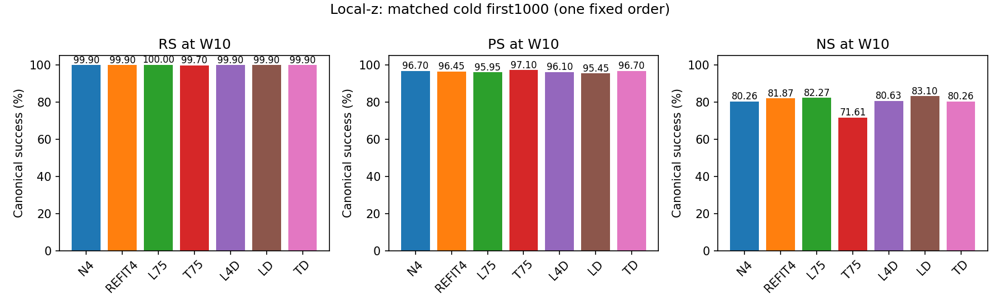
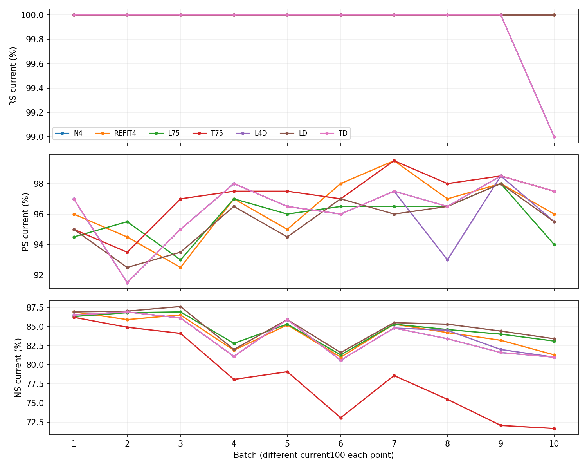
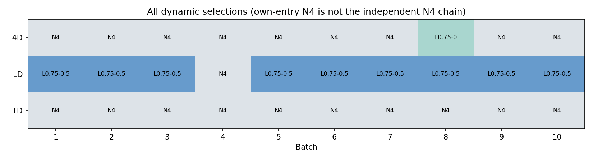
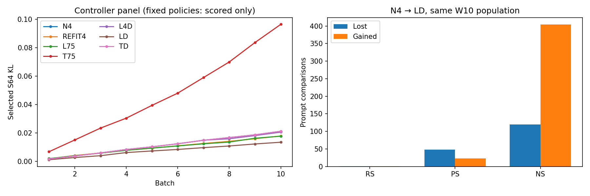

# Local-z adaptive allocation: 신규 cold 7-arm 상세 사실 리뷰

상태: **7/7 완료 산출물의 CPU 리뷰 완료 — 운영 cap1 이탈 별도 확인**. 신규 GPU/모델/evaluator 실행 0.

Instruction `ODEEDIT-S06-LOCAL-Z-SEVENARM-DETAILED-REVIEW-SH4-V1`; 2026-09-17 SH4. 과학적 우월성·인과 기여율·후속 선택은 본 보고의 판정 범위가 아니다.

## 1. 먼저 확인한 사실과 검증 경계

준비48679와 array48680_[0–6] 모두 scheduler COMPLETED/exit0:0이다. 원 NLL pair를 독립 재집계해 7개 actual W10의 RS1000/PS2000/NS10000을 확인했다. 70commit,63인접 W/M/context/RNG/received 연결,110history append 기록,21CP가 존재한다. Scheduler 완료와 아래 CPU 산출물 검산은 별개의 확인이다.

원 agent의 2026-09-16T11:36:50.122707+00:00 PENDING/actual gate NOT_OBSERVED 기록은 불변이다. initial-gate 파일과 terminal을 이번 recall에서 사후 확인한 것이며 과거 GPU PASS로 소급하지 않는다. 준비 단계의 실제 GPU 검사 기록을 재사용하지만 이번 CPU 검산을 model-level 재실행·GPU off/on continuation PASS로 부르지 않는다.

**운영 이탈:** 봉인된 제출은 cap1/array%1이지만 지정 job interval의 최대 동시 GPU 할당은2, cap1 초과19,428초(5.3967시간)였다. 원인/행위자/변경 시점은 보존 증거에 없다. 이번에는 정확 job들만 한 번 조회했고 job/정책을 수정하지 않았다. 수치 결과는 보존하되 cap 준수 또는 통제된 속도 비교가 확인됐다고 쓰지 않는다.

| Arm | Job | Scheduler | GPU초 | GPUh | commit/요청 |
| --- | --- | --- | --- | --- | --- |
| PREPARATION | 48679 | COMPLETED | 2895 | 0.804167 | 준비 only |
| LD | 48680_0 | COMPLETED | 15214 | 4.22611 | 10 / 1000 |
| N4 | 48680_1 | COMPLETED | 6004 | 1.66778 | 10 / 1000 |
| REFIT4 | 48680_2 | COMPLETED | 7379 | 2.04972 | 10 / 1000 |
| L75 | 48680_3 | COMPLETED | 6750 | 1.875 | 10 / 1000 |
| T75 | 48680_4 | COMPLETED | 7097 | 1.97139 | 10 / 1000 |
| L4D | 48680_5 | COMPLETED | 6691 | 1.85861 | 10 / 1000 |
| TD | 48680_6 | COMPLETED | 18502 | 5.13944 | 10 / 1000 |

## 2. actual W10 / first1000 주표

RS/PS는 new NLL < true NLL, NS는 true NLL < new NLL이며 ties는 실패다. TF-strict/argmax token은 별도다. 분모를 accepted-only로 바꾸지 않았고 동일1000을 7arm에 공유한 **7000 arm-request observations / unique1000**, 새70batch다. 과거 warm N4/REFIT4 재사용이 아니다.

| Arm | RS /1000 (%) | PS /2000 (%) | NS /10000 (%) | ΔRS pp | ΔPS pp | ΔNS pp |
| --- | --- | --- | --- | --- | --- | --- |
| N4 | 999 (99.90) | 1934 (96.70) | 8026 (80.26) | 0 | 0 | 0 |
| REFIT4 | 999 (99.90) | 1929 (96.45) | 8187 (81.87) | 0 | -0.25 | 1.61 |
| L75 | 1000 (100.00) | 1919 (95.95) | 8227 (82.27) | 0.1 | -0.75 | 2.01 |
| T75 | 997 (99.70) | 1942 (97.10) | 7161 (71.61) | -0.2 | 0.4 | -8.65 |
| L4D | 999 (99.90) | 1922 (96.10) | 8063 (80.63) | 0 | -0.6 | 0.37 |
| LD | 999 (99.90) | 1909 (95.45) | 8310 (83.10) | 0 | -1.25 | 2.84 |
| TD | 999 (99.90) | 1934 (96.70) | 8026 (80.26) | 0 | 0 | 0 |

첫 전달 표 [first-final-table.csv](first-final-table.csv)는 그 시점의 STATE_AUDIT_PENDING 라벨까지 보존했다. 전체 검산 후 표는 [final-seven-arm.csv](final-seven-arm.csv)다. N4와TD는 단순 동점이 아니라 전10batch W4/W8/M4 hash 및 최종 원 NLL 행이 같았다. M8은 달랐다: N4는 미사용 zero, TD는 선택 N4일 때도 매batch append했다. 이를 terminal 제안의 선택 성공이나 추가 capacity의 효능으로 해석하지 않는다.

### TF-strict/token 정의를 분리한 최종표

R/P는 desired=new, N은 desired=true token을 사용했다. Two-P strict는 2개 paraphrase 모두 strict인 요청 수/1000이지 PS 분모2000과 다르다. 아래 strict는 저장된 token-correct/count의 일관성 검산이며 새 forward는 아니다.

| Arm | R strict/1000 | P strict/2000 | two-P strict/1000 | N true strict/10000 | R token correct/total | P token correct/total |
| --- | --- | --- | --- | --- | --- | --- |
| N4 | 993 | 1354 | 513 | 1761 | 1008/1015 | 1383/2030 |
| REFIT4 | 998 | 1307 | 476 | 1916 | 1013/1015 | 1336/2030 |
| L75 | 998 | 1336 | 498 | 1927 | 1013/1015 | 1365/2030 |
| T75 | 991 | 1465 | 590 | 1456 | 1006/1015 | 1495/2030 |
| L4D | 993 | 1346 | 508 | 1786 | 1008/1015 | 1375/2030 |
| LD | 997 | 1309 | 479 | 1918 | 1012/1015 | 1338/2030 |
| TD | 993 | 1354 | 513 | 1761 | 1008/1015 | 1383/2030 |

## 3. 핵심 paired 비교: 증가와 손실을 함께

아래는 왼쪽 treatment−reference의 같은 W10 요청/prompt/target 비교다. Lost는 reference 성공→treatment 실패, gained는 반대다. RS/PS/NS 원분모는 각각1000/2000/10000. 95% CI는 같은 request 안의 P2/N10을 묶어 1000request cluster를 2000회 bootstrap(seed20260917)한 기술적 구간이다. 10batch를 독립 반복실험으로 취급하지 않았고 fixed order/요청 간 공유 사실·학습 의존성이 남는다. CI를 arm 탈락·선택 또는 인과확증에 사용하지 않는다.

| 대조 | 지표 | Δpp | lost | gained | 95% request-cluster CI |
| --- | --- | --- | --- | --- | --- |
| LD−N4 | RS | 0 | 1 | 1 | [-0.300, 0.300] |
| LD−N4 | PS | -1.25 | 48 | 23 | [-2.200, -0.350] |
| LD−N4 | NS | 2.84 | 120 | 404 | [2.320, 3.400] |
| LD−L4D | RS | 0 | 1 | 1 | [-0.300, 0.300] |
| LD−L4D | PS | -0.65 | 47 | 34 | [-1.650, 0.350] |
| LD−L4D | NS | 2.47 | 128 | 375 | [1.940, 3.020] |
| LD−L75 | RS | -0.1 | 1 | 0 | [-0.300, 0.000] |
| LD−L75 | PS | -0.5 | 41 | 31 | [-1.400, 0.350] |
| LD−L75 | NS | 0.83 | 189 | 272 | [0.300, 1.390] |
| LD−REFIT4 | RS | 0 | 1 | 1 | [-0.300, 0.300] |
| LD−REFIT4 | PS | -1 | 49 | 29 | [-1.900, -0.050] |
| LD−REFIT4 | NS | 1.23 | 181 | 304 | [0.740, 1.780] |
| LD−TD | RS | 0 | 1 | 1 | [-0.300, 0.300] |
| LD−TD | PS | -1.25 | 48 | 23 | [-2.200, -0.350] |
| LD−TD | NS | 2.84 | 120 | 404 | [2.320, 3.400] |
| T75−L75 | RS | -0.3 | 3 | 0 | [-0.700, 0.000] |
| T75−L75 | PS | 1.15 | 34 | 57 | [0.050, 2.250] |
| T75−L75 | NS | -10.66 | 1353 | 287 | [-11.760, -9.540] |

LD−N4: PS는 −25/2000(48 lost,23 gained), NS는 +284/10000(120 lost,404 gained)다. RS 총999는 같지만 lost1/gained1로 보존 문항은 다르다. T75−L75는 PS +23/2000과 NS −1066/10000, RS −3/1000이 함께 관측된다. 어느 하나로 전체 정책을 우월/열등하게 승격하지 않는다. 모든 arm−새N4 및 strict/two-P 전이는 [paired-policy-comparisons.csv](paired-policy-comparisons.csv), [strict-transitions.csv](strict-transitions.csv)에 있다.

### 요청 손실의 NLL 꼬리

아래 p95/p99는 treatment−reference의 원 signed NLL 차이 분포다. 양수는 해당 label likelihood 악화이며 NS의 desired는 true, RS/PS desired는 new다. new/true를 혼합하지 않는다. 각 요청의 원 pairs는 local-only 원 artifact에 유지했다. 평균/중앙/p90/p95/p99와 margin 변화·양방향 전이는 CSV 전부에 남겼다.

| 대조 | 지표 | Δnew mean | Δnew p95 | Δnew p99 | Δtrue p95 | Δtrue p99 | desired NLL 악화행 |
| --- | --- | --- | --- | --- | --- | --- | --- |
| LD−N4 | RS | 0.00435052 | 0.022592 | 0.0834489 | 5.34379 | 9.61461 | 789 |
| LD−N4 | PS | 0.178581 | 2.16426 | 4.40275 | 4.29675 | 8.4486 | 1308 |
| LD−N4 | NS | 0.428746 | 2.42975 | 4.45831 | 1.27131 | 2.73488 | 4625 |
| LD−L75 | RS | -0.0111566 | 0.0160067 | 0.0594698 | 5.35186 | 9.0018 | 498 |
| LD−L75 | PS | 0.0804112 | 2.03533 | 5.59051 | 3.96201 | 6.80338 | 1126 |
| LD−L75 | NS | -0.138967 | 1.46301 | 2.98275 | 1.26296 | 2.64528 | 4965 |
| T75−L75 | RS | 0.024134 | 0.00632744 | 0.346753 | 7.64564 | 10.4569 | 315 |
| T75−L75 | PS | -0.358452 | 2.41238 | 5.6886 | 6.89675 | 10.4951 | 627 |
| T75−L75 | NS | -1.28092 | 2.78015 | 5.16702 | 5.21848 | 8.43451 | 5425 |

## 4. Current, at-write, retention, overwrite

매batch current100은 서로 다른 모집단이다. pooled at-write1000은 10개 다른 endpoint에서 얻은 관측이며 W0나 final W10 평가가 아니다. Entry→at-write는 동일batch의 쓰기 전후, at-write→W10은 이후 trajectory 변화다. B10은 future exposure0이며 동일 endpoint 재사용 행의 대조이다. 중간 실패/회복 최초 시점은 관측하지 않은 구간에서 보간하지 않는다.

전140개 entry/selected Current panel의 mean/median/p90/p95/p99 new/true NLL, signed margin, strict/token은 [batch-metrics.csv](batch-metrics.csv). cohort별 at-write→W10은 [cohorts.csv](cohorts.csv)에 있고 early B1–3 / middle B4–7 / late B8–10 등은 그 관측 행에서만 집계할 수 있다.

### W5 first500 → W10 같은500

| Arm | 지표 | before | after | lost | gained | before성공 분모 | before실패 분모 |
| --- | --- | --- | --- | --- | --- | --- | --- |
| N4 | RS | 500 | 500 | 0 | 0 | 500 | 0 |
| N4 | PS | 961 | 958 | 8 | 5 | 961 | 39 |
| N4 | NS | 4203 | 3981 | 275 | 53 | 4203 | 797 |
| REFIT4 | RS | 500 | 499 | 1 | 0 | 500 | 0 |
| REFIT4 | PS | 951 | 949 | 10 | 8 | 951 | 49 |
| REFIT4 | NS | 4229 | 4071 | 212 | 54 | 4229 | 771 |
| L75 | RS | 500 | 500 | 0 | 0 | 500 | 0 |
| L75 | PS | 952 | 951 | 6 | 5 | 952 | 48 |
| L75 | NS | 4253 | 4084 | 218 | 49 | 4253 | 747 |
| T75 | RS | 500 | 497 | 3 | 0 | 500 | 0 |
| T75 | PS | 959 | 962 | 7 | 10 | 959 | 41 |
| T75 | NS | 4007 | 3601 | 551 | 145 | 4007 | 993 |
| L4D | RS | 500 | 500 | 0 | 0 | 500 | 0 |
| L4D | PS | 961 | 959 | 8 | 6 | 961 | 39 |
| L4D | NS | 4203 | 4000 | 259 | 56 | 4203 | 797 |
| LD | RS | 500 | 499 | 1 | 0 | 500 | 0 |
| LD | PS | 945 | 945 | 4 | 4 | 945 | 55 |
| LD | NS | 4262 | 4138 | 178 | 54 | 4262 | 738 |
| TD | RS | 500 | 500 | 0 | 0 | 500 | 0 |
| TD | PS | 961 | 958 | 8 | 5 | 961 | 39 |
| TD | NS | 4203 | 3981 | 275 | 53 | 4203 | 797 |

### 각 요청 at-write → W10 전체1000

| Arm | 지표 | before | after | lost | gained | before성공 분모 | before실패 분모 |
| --- | --- | --- | --- | --- | --- | --- | --- |
| N4 | RS | 999 | 999 | 0 | 0 | 999 | 1 |
| N4 | PS | 1928 | 1934 | 8 | 14 | 1928 | 72 |
| N4 | NS | 8379 | 8026 | 470 | 117 | 8379 | 1621 |
| REFIT4 | RS | 1000 | 999 | 1 | 0 | 1000 | 0 |
| REFIT4 | PS | 1927 | 1929 | 10 | 12 | 1927 | 73 |
| REFIT4 | NS | 8414 | 8187 | 333 | 106 | 8414 | 1586 |
| L75 | RS | 1000 | 1000 | 0 | 0 | 1000 | 0 |
| L75 | PS | 1915 | 1919 | 8 | 12 | 1915 | 85 |
| L75 | NS | 8464 | 8227 | 351 | 114 | 8464 | 1536 |
| T75 | RS | 1000 | 997 | 3 | 0 | 1000 | 0 |
| T75 | PS | 1942 | 1942 | 13 | 13 | 1942 | 58 |
| T75 | NS | 7834 | 7161 | 890 | 217 | 7834 | 2166 |
| L4D | RS | 999 | 999 | 0 | 0 | 999 | 1 |
| L4D | PS | 1917 | 1922 | 8 | 13 | 1917 | 83 |
| L4D | NS | 8394 | 8063 | 445 | 114 | 8394 | 1606 |
| LD | RS | 1000 | 999 | 1 | 0 | 1000 | 0 |
| LD | PS | 1910 | 1909 | 7 | 6 | 1910 | 90 |
| LD | NS | 8496 | 8310 | 292 | 106 | 8496 | 1504 |
| TD | RS | 999 | 999 | 0 | 0 | 999 | 1 |
| TD | PS | 1928 | 1934 | 8 | 14 | 1928 | 72 |
| TD | NS | 8379 | 8026 | 470 | 117 | 8379 | 1621 |

W5→W10 first500에서 LD의 PS는945로 같지만 lost4/gained4, N4는961→958이지만 lost8/gained5다. T75의 pooled at-write PS1942→1942도 lost13/gained13이다. 같은 총점은 같은 문항 유지가 아니다. NS에서는 neighborhood prompt의 true/new 상대 likelihood 비교가 변하므로 NLL true/new 양쪽을 함께 본다.

Raw(subject,relation)의 최종 target 문자열 기준 ACTIVE999/SUPERSEDED1이며 ALL1000을 유지했다. 같은 target 재발행은 ACTIVE다. received ledger는 strict 성공 여부와 무관하게 모든 도착 event를 포함한다. 교체된1요청은 [population-metrics.csv](population-metrics.csv)의 별도 SUPERSEDED 분모와 [paired-transitions.csv](paired-transitions.csv)의 ACTIVE/SUPERSEDED 전이로 분리했다. superseded target의 손실을 모두 오류나 forgetting으로 단정하지 않는다. W0 관측은 공통 준비에서 이미 저장된 first1000만 한 번 재사용했다. W10 first500/last500은 같은 full1000 행을 exact subset으로 재사용했으므로 분모를 중복 합산하지 않는다.

### 모집단별 최종 수준

다음 표는 상태·population을 명시한다. W5 first500과 W10 first500은 같은 요청의 다른 state이며 last500은 별도 cohort다.

| Arm | state/population | RS count/d | PS count/d | NS count/d |
| --- | --- | --- | --- | --- |
| N4 | W5_FIRST500 | 500/500 | 961/1000 | 4203/5000 |
| N4 | W10_FIRST500 | 500/500 | 958/1000 | 3981/5000 |
| N4 | W10_LAST500 | 499/500 | 976/1000 | 4045/5000 |
| REFIT4 | W5_FIRST500 | 500/500 | 951/1000 | 4229/5000 |
| REFIT4 | W10_FIRST500 | 499/500 | 949/1000 | 4071/5000 |
| REFIT4 | W10_LAST500 | 500/500 | 980/1000 | 4116/5000 |
| L75 | W5_FIRST500 | 500/500 | 952/1000 | 4253/5000 |
| L75 | W10_FIRST500 | 500/500 | 951/1000 | 4084/5000 |
| L75 | W10_LAST500 | 500/500 | 968/1000 | 4143/5000 |
| T75 | W5_FIRST500 | 500/500 | 959/1000 | 4007/5000 |
| T75 | W10_FIRST500 | 497/500 | 962/1000 | 3601/5000 |
| T75 | W10_LAST500 | 500/500 | 980/1000 | 3560/5000 |
| L4D | W5_FIRST500 | 500/500 | 961/1000 | 4203/5000 |
| L4D | W10_FIRST500 | 500/500 | 959/1000 | 4000/5000 |
| L4D | W10_LAST500 | 499/500 | 963/1000 | 4063/5000 |
| LD | W5_FIRST500 | 500/500 | 945/1000 | 4262/5000 |
| LD | W10_FIRST500 | 499/500 | 945/1000 | 4138/5000 |
| LD | W10_LAST500 | 500/500 | 964/1000 | 4172/5000 |
| TD | W5_FIRST500 | 500/500 | 961/1000 | 4203/5000 |
| TD | W10_FIRST500 | 500/500 | 958/1000 | 3981/5000 |
| TD | W10_LAST500 | 499/500 | 976/1000 | 4045/5000 |

## 5. 설계 → frozen 코드 → 실제 저장 증거

실행 source는 `32a92ad6f3fff2f258d8778f3936d152e975ac1b` / tree `75a96b2e2122d2be6b096af12c22df8a4365a8e1`이며 이번 분석 코드는 별개다. 아래 source 링크는 파일 탐색용이며 exact frozen SHA/함수 시작·끝 줄은 [source-functions.csv](source-functions.csv)에 봉인했다. 함수명이나 문서 선언만으로 실행 PASS를 대신하지 않는다.

공통 capsule은 Llama3-8B-Instruct revision8afb486c1db24fe5011ec46dfbe5b5dccdb575c2, torch2.9.1+cu128 / transformers4.44.2, FP32/eager, matmul·cuDNN TF32off, seed20260916이다. Native L2=1, decay=.5, clamp=.75, lr=.1, max25loss/24Adam, KLfactor=.0625, loss layer31을 유지했다. Writer tokenizer는 add_bos_token=False, pad=eos/right padding이며 evaluator tokenizer는 별도 원 설정을 사용했다. canonical evaluator MB16은 재사용했다. Context text SHA aa169bc574115e932462517a4e9e8aa4e183017721c74b5a99e6e2a4b6fa7a09, actual token IDs SHA cfb6efea82ae828342f13fdd24c015dacf0275f93d47839043f907d6115cfc6f, common RNG SHA e458c35c6067bf08f8d196fc391febe29beb5177d5f5be7235c00033431c2a67을 모든 arm에 결속했다. Native editor SHA79da927aad5ab817fd008c5958768adcd00556989a8efbaa2c4bdc80d8fc842e는 원본 그대로다.

| 요구사항 | 실제 함수/줄 | 설계/식 | 저장 관측 | 판정 | 한계 |
| --- | --- | --- | --- | --- | --- |
| Cold/input/seed | [model.py:53](../../../../../project/run_scripts/local_z_adaptive_allocation/model.py#L53) | W0; M4/M8=0; FP32/eager; TF32off; seed20260916 | 7 start+capsule+63links; same first1000 identity | SOURCE_CONFIRMED + STORED_EVIDENCE_CONSISTENT | Full pretrained tensor rehash/GPU reload not repeated |
| P mapping | [model.py:84](../../../../../project/run_scripts/local_z_adaptive_allocation/model.py#L84) | physical4→asset0/local0; physical8→asset4/local0 | P4 24a654cc…; P8 3a4c524e…; all state bindings | REUSED_IDENTITY + STORED_EVIDENCE_CONSISTENT | Large P payload prior fullSHA+current stable stat |
| LOCAL | [engine.py:13](../../../../../project/run_scripts/local_z_adaptive_allocation/engine.py#L13) | own N4 then fresh L8 for each a4; a8 variants share same fit | saved native fits, target captures, cache/input states; B2–10 candidate CPU hashes | SOURCE_CONFIRMED + STORED_EVIDENCE_CONSISTENT | B1 all candidate materialization not independently reconstructed from W0 |
| TERMINAL | [model.py:26](../../../../../project/run_scripts/local_z_adaptive_allocation/model.py#L26) | fixed entry Z8; writer4/8 key; residual Z8−H8 at current state | 50 saved R exactly equal Z8−H8 on CPU | SOURCE_CONFIRMED + CPU_TENSOR_EXACT | No new neural forward or directsolve replay |
| REFIT4 | [engine.py:33](../../../../../project/run_scripts/local_z_adaptive_allocation/engine.py#L33) | .75 actual L4 partial then fresh same-layer fit | 20 fits/2000targets; M4 final append10 | SOURCE_CONFIRMED + STORED_EVIDENCE_CONSISTENT | Not I2/I4 carry; no warm entry |
| FP32 gate/all-token | [policy.py:5](../../../../../project/run_scripts/local_z_adaptive_allocation/policy.py#L5) | 0/1 exactcopy; .5/.75 U+g(V−U); physical parameter.copy_ | materialization CPU fixtures; saved endpoints/hash reconstruction | SOURCE_CONFIRMED + CPU_TENSOR_EXACT | FP32 delta alone not claimed exact replay |
| E/S_cur | [model.py:189](../../../../../project/run_scripts/local_z_adaptive_allocation/model.py#L189) | new token mean→rewrite context mean→100request mean; canonical strict set separately | 190 E means and strict sets independently reduced | SOURCE_CONFIRMED + STORED_EVIDENCE_CONSISTENT | Not RS/PS/NS and not every request non-worsening |
| H/S_past | [model.py:223](../../../../../project/run_scripts/local_z_adaptive_allocation/model.py#L223) | Past64 canonical rewrite new-NLL and exact strict IDs | 190 candidate Past means/sets; B1 empty | SOURCE_CONFIRMED + STORED_EVIDENCE_CONSISTENT | Past64 is not all old requests |
| D/teacher | [model.py:103](../../../../../project/run_scripts/local_z_adaptive_allocation/model.py#L103) | fixed W0 full vocab KL p0&#124;&#124;pW; positions128; S64 mean | teacher reused; technical W0 D=0; all190 D means | SOURCE_CONFIRMED + REUSED_GPU_EVIDENCE | Review performs no teacher/model recomputation |
| Selector | [policy.py:37](../../../../../project/run_scripts/local_z_adaptive_allocation/policy.py#L37) | E plateau+1e-4; strict subset; Past H+1e-4; D tie1e-6 | 30 dynamic selections/constraints/shadows independently identical | CPU_ARITHMETIC_CONFIRMED | Fixed4arms do not apply dynamic screen |
| Received Past | [policy.py:26](../../../../../project/run_scripts/local_z_adaptive_allocation/policy.py#L26) | latest raw fact event; current overwrite excluded; SHA priority≤64 | 70 Past lists independently exact; arm-invariant input IDs | CPU_ARITHMETIC_CONFIRMED | Not EP accepted-only ledger |
| Branch/cache/RNG | [engine.py:13](../../../../../project/run_scripts/local_z_adaptive_allocation/engine.py#L13) | episode-local source/state/context/layer-bound fits; reset batch-entry RNG | 63 state links; input-state M/P/context/RNG; stored order test exact | SOURCE_CONFIRMED + STORED_EVIDENCE_CONSISTENT | No full backbone bit audit |
| Observer isolation | [model.py:118](../../../../../project/run_scripts/local_z_adaptive_allocation/model.py#L118) | nonselected version/pointer/hooks/grad/mode guards; observe state equality | 190 scores and 70completed commits; no failure artifact | RUNTIME_GUARD_EVIDENCE | Pointer/version guard is not independent full-parameter byte equality |
| Commit/history | [runner.py:60](../../../../../project/run_scripts/local_z_adaptive_allocation/runner.py#L60) | selected endpoint; inner0; one append per eligible layer | 70commits;110 append receipts; TD/N4 choice still M8 append | SOURCE_CONFIRMED + STORED_EVIDENCE_CONSISTENT | Finalizer keys not saved: Gram append not independently rederived |
| Snapshots | [runner.py:69](../../../../../project/run_scripts/local_z_adaptive_allocation/runner.py#L69) | B1/B5/B10 W4/W8/M4/M8/context/RNG/received/next | 21CP;84 selected tensors CPU finite/shape/hash | CPU_WEIGHTS_ONLY_CONFIRMED | Independent GPU off/on continuation NOT_TESTED |
| Evaluation/reuse | [runner.py:51](../../../../../project/run_scripts/local_z_adaptive_allocation/runner.py#L51) | actual selected W; B5/B10 full population and exact current subset | W5/10 cardinality; current/first500/last500 rows identical to full | CPU_IDENTITY_CONFIRMED | Other candidate R/P/N NOT_RECORDED |
| Technical preparation | [technical.py:65](../../../../../project/run_scripts/local_z_adaptive_allocation/technical.py#L65) | teacher/local/terminal/order/history bounded checks | 48679 TECHNICAL_READY; same-process restoration; original targets replay disclosed | REUSED_ACTUAL_GPU_CHECKS | Not every future endpoint or independent restart parity |
| Cap1 admission | [control.py:181](../../../../../project/run_scripts/local_z_adaptive_allocation/control.py#L181) | technical afterok then seven-arm array%1 | held inspect ArrayTaskThrottle=1; actual max2 /19428sec overlap | DEVIATION | Cause/actor/change time NOT_RECORDED; no scheduler mutation in review |
| Nonfinite/errors | [policy.py:39](../../../../../project/run_scripts/local_z_adaptive_allocation/policy.py#L39) | NaN/Inf technical error, not quality skip | 190finite scores;70terminal commits; no failure.json | SOURCE_CONFIRMED + STORED_EVIDENCE_CONSISTENT | Not proof against unlogged external faults |

### LOCAL/TERMINAL과 state의 실제 의미

LOCAL은 자기 batch entry의 L4 native target/solve로 N4 endpoint를 만들고 actual FP32 a4 partial을 적용한 뒤, a4=.75와1 상태마다 L8 target을 각각 fresh 계산한다. a8=.5/1 사이에는 동일 a4의 fit만 공유한다. REFIT4는 L4 .75partial에서 같은 L4를 다시 fresh fit한다. cache는 batch 생성 내부에만 있고 state/layer/source/hparams/context/RNG를 결속한다.

TERMINAL은 자기 entry에서 Z8을 요청별 한 번 계산하고 고정한다. writer4의 residual도 Z8−h8(entry), writer8은 Z8−h8(partial)이다. Z8−h4가 아니다. frozen native BLUE의 key/readout/repeat/directsolve/add AST를 추출하고 readout8을 명시했다. inverse·Cholesky·대칭화로 바꾸지 않았다. 저장50개 residual의 정확 CPU 차이가 이 연결을 지지하나 neural forward나 solve를 새로 재현한 검산은 아니다.

물리 W4/W8 전체 parameter copy를 통해 모든 token에 update가 적용된다. gate는0/1 exactcopy, .5/.75는 CPU FP32 U+g(V−U)다. gate합1 제약은 없고 native RHS divisor와 bit-exact라고 가정하지 않았다. TD는 terminal 제안6개+own-entry commonN4의 controller이며 pure-terminal 정책이 아니다. 고정 L75/T75는 각각 (.75,1) endpoint를 그대로 commit하고 dynamic 품질 screen을 적용하지 않는다.

### E/H/D와 online 입력 분리

E는 native rewrite training mask의 desired token평균→contexts평균→100request평균이다. canonical rewrite strict는 별도로 기록한다. H는 Past64 canonical rewrite의 mean desired NLL이다. D는 고정 W0 full-vocabulary teacher에 대한 KL(p0||pW), vocab sum→128 scored position평균→64문서평균이다. 자연256+BOS1, logit[128,256), scored input[129,257), vocab128256을 기존 C4 계약 그대로 재사용했다.

선택 함수에는 candidate E/H/D와 current/Past strict ID만 들어간다. official P/N은 entry/selected observer, Dev128은 B5/B10 observer이며 후보·target·Past 선정에 쓰지 않는다. no-plateau/strict-only shadow는 이미 얻은 점수의 같은-state 재선택이며 commit하지 않았다. 기존 EP gradient route/alpha/quality screen을 local-z 정책으로 호출하지 않았다.

## 6. selector 전 후보와 실제 선택

Feasible은 E(c)≤max(E(ownN4),.05)+1e-4 및 ownN4 current strict ID subset이다. Past가 있으면 H(c)≤H(ownN4)+1e-4와 Past strict subset도 필요하다. Feasible 중 Dmin+1e-6 이내 후보를 ownN4→actual L8delta0→작은 concat(ΔW4,ΔW8) Frobenius norm→ID 순으로 선택한다. 190declared 후보는190distinct materialization이고 실제 score reuse0이었다. dynamic150후보의 조건·재선택은 모두 저장selected와 일치했다. 같은 strict count만을 ID 보존으로 대체하지 않았다.

| Arm | 실제선택 10회 | no-plateau 선택차이 | strict-only 선택차이 |
| --- | --- | --- | --- |
| N4 | N4×10 | 0 | 0 |
| REFIT4 | REFIT4×10 | 0 | 0 |
| L75 | L0.75-1×10 | 0 | 0 |
| T75 | T0.75-1×10 | 0 | 0 |
| L4D | N4×9; L0.75-0×1 | 1 | 2 |
| LD | L0.75-0.5×9; N4×1 | 4 | 2 |
| TD | N4×10 | 0 | 0 |

L4D는 B8만 .75L4를 선택했고 나머지9회N4, LD는 B4만N4와 나머지9회(.75,.5), TD는10회모두N4다. LD no-plateau shadow의 차이는 현재 trajectory에서의 점수 재선택일 뿐, 그 정책을10batch 실행한 결과가 아니다.

| 동적arm | 선언후보 | feasible | 부적격 | Current mean | Current strict | Past mean | Past strict |
| --- | --- | --- | --- | --- | --- | --- | --- |
| L4D | 20 | 11 | 9 | 9 | 7 | 0 | 0 |
| LD | 60 | 48 | 12 | 10 | 8 | 2 | 0 |
| TD | 70 | 17 | 53 | 32 | 29 | 40 | 2 |

탈락 사유는 중복 가능하므로 사유별 수를 총부적격 수로 합산하지 않는다. TD의60 terminal 제안 중7개는 조건을 통과했지만 실제선택은N4였다. 전190후보의 gate/E/H/D/strict집합 손실수/실제norm/feasibility/reason/선택을 [candidate-metrics.csv](candidate-metrics.csv), [constraints.csv](constraints.csv), [selection.csv](selection.csv)에 공개한다. 원 strict ID집합과 요청별 NLL은 local candidate JSON에 유지되며 reducer가 exact subset을 확인했다. NaN/Inf를 단순 부적격으로 버리는 toy 분기는 production choose에 없고, 유효한 finite 품질탈락과 기술오류를 구분한다.

### Worked examples: 실제 변수와 선택 근거

#### LD B001

| 후보 | a4/a8 | E | H | D64 | strict current/Past | 실제 concat norm | 조건 | 선택 |
| --- | --- | --- | --- | --- | --- | --- | --- | --- |
| L0.75-0.5 | 0.75/0.5 | 0.0124145 | NA | 0.00125266 | 100/0 | 6.80241 | feasible | True |
| L0.75-0 | 0.75/0.0 | 0.1828 | NA | 0.000951336 | 99/0 | 5.70874 | CURRENT_MEAN;CURRENT_STRICT_IDS | False |
| L0.75-1 | 0.75/1.0 | 0.0102809 | NA | 0.0020327 | 100/0 | 9.34463 | feasible | False |
| L1-0.5 | 1.0/0.5 | 0.00340462 | NA | 0.0017209 | 100/0 | 7.61165 | feasible | False |
| L1-1 | 1.0/1.0 | 0.00340461 | NA | 0.00172091 | 100/0 | 7.61165 | feasible | False |
| N4 | 1.0/0.0 | 0.00340461 | NA | 0.00172091 | 100/0 | 7.61165 | feasible | False |

#### LD B004

| 후보 | a4/a8 | E | H | D64 | strict current/Past | 실제 concat norm | 조건 | 선택 |
| --- | --- | --- | --- | --- | --- | --- | --- | --- |
| L0.75-0.5 | 0.75/0.5 | 0.0109461 | 0.00659907 | 0.00555263 | 100/64 | 6.26418 | PAST_MEAN | False |
| L0.75-0 | 0.75/0.0 | 0.0957697 | 0.0065337 | 0.00545036 | 100/64 | 5.78187 | CURRENT_MEAN | False |
| L0.75-1 | 0.75/1.0 | 0.00939137 | 0.0067383 | 0.00583851 | 100/64 | 7.52791 | PAST_MEAN | False |
| L1-0.5 | 1.0/0.5 | 0.00359717 | 0.00646084 | 0.00630587 | 100/64 | 7.76189 | feasible | False |
| L1-1 | 1.0/1.0 | 0.00272105 | 0.00645896 | 0.00636475 | 100/64 | 7.91794 | feasible | False |
| N4 | 1.0/0.0 | 0.00534049 | 0.00646465 | 0.00627345 | 100/64 | 7.70917 | feasible | True |

#### TD B001

| 후보 | a4/a8 | E | H | D64 | strict current/Past | 실제 concat norm | 조건 | 선택 |
| --- | --- | --- | --- | --- | --- | --- | --- | --- |
| N4 | 1.0/0.0 | 0.00340461 | NA | 0.00172091 | 100/0 | 7.61165 | feasible | True |
| T0.75-0.5 | 0.75/0.5 | 0.253532 | NA | 0.0038474 | 97/0 | 13.4549 | CURRENT_MEAN;CURRENT_STRICT_IDS | False |
| T0.75-0 | 0.75/0.0 | 1.69389 | NA | 0.00279796 | 76/0 | 11.2158 | CURRENT_MEAN;CURRENT_STRICT_IDS | False |
| T0.75-1 | 0.75/1.0 | 0.0373074 | NA | 0.00685662 | 100/0 | 18.6214 | feasible | False |
| T1-0.5 | 1.0/0.5 | 0.104681 | NA | 0.0061283 | 99/0 | 16.858 | CURRENT_MEAN;CURRENT_STRICT_IDS | False |
| T1-0 | 1.0/0.0 | 0.72569 | NA | 0.00512494 | 88/0 | 14.9544 | CURRENT_MEAN;CURRENT_STRICT_IDS | False |
| T1-1 | 1.0/1.0 | 0.026864 | NA | 0.00939062 | 100/0 | 21.5841 | feasible | False |

#### L75 B001

| 후보 | a4/a8 | E | H | D64 | strict current/Past | 실제 concat norm | 조건 | 선택 |
| --- | --- | --- | --- | --- | --- | --- | --- | --- |
| L0.75-1 | 0.75/1.0 | 0.0102809 | NA | 0.0020327 | 100/0 | 9.34463 | fixed/no screen | True |

#### T75 B001

| 후보 | a4/a8 | E | H | D64 | strict current/Past | 실제 concat norm | 조건 | 선택 |
| --- | --- | --- | --- | --- | --- | --- | --- | --- |
| T0.75-1 | 0.75/1.0 | 0.0373074 | NA | 0.00685662 | 100/0 | 18.6214 | fixed/no screen | True |

LD B1은 공통 W0/M0에서 시작하고 Past가 비어 있다. ownN4 E≈.0034046이므로 plateau ceiling은.0501이며 선택 (.75,.5)의 E≈.0124145는 N4보다 크지만 규정 ceiling 이내다. selectedD≈.00125266은 ownN4D≈.00172091보다 작았다. 평균 E 또는 각 요청 NLL 무악화를 보장하는 설계가 아님을 이 사례가 보여준다. 선택 후 M4/M8 각1회 append하고 actual B1CP→B2entry hash가 연결된다.

LD B4의 N4 선택은 score/constraint 표의 그대로다. 더 작은 D를 갖는 후보의 부적격 사유도 표에 남겼다. TD B1 역시 같은W0에서 출발하지만 terminal 제안이 아니라 commonN4를 선택했고 M8까지 append했다. L75/T75 B1은 같은gate(.75,1)이나 local versus terminal target/readout 경로가 다르다. B2 이후에는 각자의 누적 state까지 달라지므로 동일state 단일인자 인과효과로 확대하지 않는다.

선택된 actual endpoint에서 mean E/strict/Past를 보호했다는 사실과 PS·NS·모든 old 요청 보존은 별개다. 후보별 canonical rewrite desired NLL의 p95/p99 및 ownN4 대비 악화 요청 수는 candidate CSV에 있다. 다른 후보의 official R/P/N true/new pairs는 저장되지 않아 same-state N4→selected R/P/N 전체를 추정하지 않았다.

### Past64/received ledger

raw(subject,relation)별 최신 event 하나를 남긴 뒤 현batch가 overwrite할 fact를 제외하고, `LZ-ALLOC-v1|20260916|past|`+stable_event_id의 UTF-8 SHA256 우선순위로64개를 고른다. stable ID는 ordinal/case_id/subject/relation/target의 canonical ASCII JSON SHA다. 모든70list를 독립 재생성했고 B1은0, B2–10은64이며 각arm 입력목록은 같았다. target 성공여부·미래score·과거Historical128·공식P/N은 이 선정에 들어가지 않는다. received1000과 accepted/strict-success 수는 다른 개념이다.

## 7. S64 선택지표와 Dev128/NS 관측 분리

| Arm | W5 S64 | W10 S64 | W5 Dev128 | W10 Dev128 | W10 Dev naturalNLL | W10 NS% |
| --- | --- | --- | --- | --- | --- | --- |
| N4 | 0.0103144 | 0.0212809 | 0.0108708 | 0.0226519 | 2.5267 | 80.26 |
| REFIT4 | 0.00937088 | 0.0179392 | 0.0119647 | 0.0203948 | 2.52498 | 81.87 |
| L75 | 0.0094375 | 0.0178195 | 0.0103923 | 0.0194076 | 2.52592 | 82.27 |
| T75 | 0.0395088 | 0.0965277 | 0.0504419 | 0.110859 | 2.57538 | 71.61 |
| L4D | 0.0103144 | 0.0206506 | 0.0108708 | 0.0218638 | 2.52599 | 80.63 |
| LD | 0.00740425 | 0.0135409 | 0.00705647 | 0.0138628 | 2.52032 | 83.1 |
| TD | 0.0103144 | 0.0212809 | 0.0108708 | 0.0226519 | 2.5267 | 80.26 |

S64는 동적 선택에 사용된 개발 패널이다. Dev128은 고정 별도 observer이지만 한 번의 fixed order 개발 실행이며 대규모 blind test가 아니다. KL 감소와 NS 성공률 증가는 정의부터 다르다. Report256/Audit/MMLU/FutureN 독립평가는 NOT_MEASURED, 기존정본 밖 추가 teacher/reference/평가는 수행하지 않았다.

## 8. checkpoint·history·native counter 실물 검산

21CP의84개 W/M tensor를 CPU weights_only로 읽어 FP32/shape/finite/원 raw-byte SHA를 대조했다. W4/W8 shape[4096,14336], M4/M8 shape[1,14336,14336]. dtype/shape-header+bytes SHA를 별도로 남겨 두 convention을 혼동하지 않았다. checkpoint는 source/model/P/common/context/RNG/received/nextordinal까지 연결됐다.

B1actual selectedCP에서 출발해 B2–B10 저장native weight와 FP32 gate로171후보 endpoint를 재구성했고 기록된actual weightSHA와 일치했다. B5/B10selectedCP와도 정확히 일치했다. B1 전체 후보는 독립W0weight파일이 없어 역산하지 않았으며 B1selectedCP검산만 했다. FP32 delta 차분만의 exact replay, 미저장 finalizer keys로부터 Gram history 재생성, 독립 GPU off/on restart는 주장하지 않는다.

| 항목 | 관측 |
| --- | --- |
| CP | 21 |
| CP tensors | 84 |
| 재구성 candidate B2–10 | 171 |
| 원 target captures | 12000 |
| actual Adam | 203663 |
| actual loss eval | 215663 |
| 준비+과학 raw members | 1201 |
| 검토 inventory bytes | 118609441932 |
| inventory GiB | 110.464 |

각 CP의 tensor norm/hash/bytes와 M diagonal 비감소 검사는 [checkpoint-tensors.csv](checkpoint-tensors.csv), actual gate reconstruction norm의 CPU scalar 반올림 차이는 [candidate-reconstruction.csv](candidate-reconstruction.csv), native layer/readout/target inventory는 [native-fit-tensors.csv](native-fit-tensors.csv), terminal R/H8/Z8 norm은 [terminal-residual.csv](terminal-residual.csv)에 있다. source와 receipt가 지지하는110append는 L4총70 + L8총40이다. REFIT4는두fit이지만 M4append10이며 LD/TD의a8=0/N4선택도M8append한다.

비선택 parameter는 runtime pointer/version/hooks/buffers/gradient/mode guard를 사용했다. 이는 모델전체 bytes를 독립 hash한 검증과 다르다. 모든190score가finite이고 failure.json/미완료prefix가 없다는 사실을 기록하되 미저장 내부 tensor까지 검증했다고 확대하지 않는다.

## 9. 실측 비용: 계획 quota와 분리

과학7chain allocation합 67637GPU초(18.788056GPUh), 준비 2895초(0.804167GPUh)다. 합계 70532GPU초이며 새 review GPU는0이다. 원teacher47592의98초는 과거 재사용 비용으로 이번합에 다시 더하지 않았다. teacher는 재생성되지 않았다. 준비700fresh target+400saved target replay/13solve는 과학12000target/150solve와 구분한다. 준비source target replay는 write 연결검사용이며 과학분모에 포함하지 않았다.

| Arm | target calls | actual Adam | loss eval | early-stop requests | 0-step | solve | history | distinct후보 |
| --- | --- | --- | --- | --- | --- | --- | --- | --- |
| N4 | 1000 | 24000 | 25000 | 0 | 0 | 10 | 10 | 10 |
| REFIT4 | 2000 | 27864 | 29864 | 839 | 839 | 20 | 10 | 10 |
| L75 | 2000 | 27756 | 29756 | 845 | 843 | 20 | 20 | 10 |
| T75 | 1000 | 23459 | 24459 | 62 | 0 | 20 | 20 | 10 |
| L4D | 1000 | 24000 | 25000 | 0 | 0 | 10 | 10 | 20 |
| LD | 3000 | 28584 | 31584 | 1809 | 1809 | 30 | 20 | 60 |
| TD | 2000 | 48000 | 50000 | 0 | 0 | 40 | 20 | 70 |

12000target request-calls는 unique12000이 아니다. 최대288000Adam/300000loss/150solve/190후보는 계획이며 위 저장counter가 실측이다. early-stop은 native actualupdates<24이고 0Adam도 이후 writer action0을 뜻하지 않는다. iteration별 clamp-hit, 전체 model-forward/backward/FLOPs/copy operation 수는 NOT_RECORDED이며 최종 anchor/radius에서 추정하지 않았다. candidate E forward는100request groups/후보, S64는64doc forward/후보, canonical current는MB16의7groups/후보다. 단위를 혼합해 단일forward수로 합치지 않는다.

| Arm | program초 | nativefit(local)포함초 | proposal포함초 | candidate scoring포함초 | history포함초 | entry/selected evaluator초 | state I/O포함초 | peak GPU allocated GiB | peak host process GiB |
| --- | --- | --- | --- | --- | --- | --- | --- | --- | --- |
| N4 | 5999.35 | 2940.59 | 3344.33 | 1129.46 | 141.195 | 352.027/643.618 | 47.2877 | 33.4817 | 32.949 |
| REFIT4 | 7375.14 | 3657.81 | 4303.71 | 1264.92 | 146.682 | 364.003/888.008 | 48.7542 | 33.4817 | 32.9471 |
| L75 | 6745.86 | 3563.89 | 4125.64 | 1038.46 | 270.248 | 340.752/611.786 | 43.7507 | 33.4817 | 32.9475 |
| T75 | 7093.61 | NA | 3792.55 | 1436.85 | 329.877 | 355.446/751.651 | 61.196 | 33.2597 | 32.9463 |
| L4D | 6685.78 | 2936.54 | 3336.58 | 1906.36 | 133.483 | 339.356/619.521 | 44.6227 | 33.4817 | 32.9478 |
| LD | 15210.3 | 3940.88 | 4978.86 | 8419.78 | 318.929 | 355.443/709.465 | 63.5366 | 33.4817 | 32.9459 |
| TD | 18497.8 | 2961.41 | 7630.13 | 8900.25 | 280.579 | 357.073/916.109 | 66.7245 | 33.4817 | 32.9465 |

Timer들은 nested이며 위 열을 총비용으로 합산하지 않는다. proposal에는native target/solve/restore/hash/native-fit파일 I/O가 포함되고 candidate_scoring에는E/H/D 외 snapshot/hash/restore/JSON I/O가 포함된다. state_IO는selected-delta/CP/hash/CPUreload의 포함시간으로 순수disk latency가 아니다. terminal key/readout/solve는 receipt의combined seconds만 있어 PURE_WRITER=NOT_SEPARATED; compute-components의 local_* 및 native compute_z_seconds는 LOCAL receipt만의 값이며 T75의0을 target계산0으로 읽으면 안 된다. TERMINAL target시간과 실제Adam/loss는 [terminal-target-cost.csv](terminal-target-cost.csv), combined writer시간은 [terminal-residual.csv](terminal-residual.csv)로 별도 보완했다.

S64 timer의 teacher streaming은 nested subcomponent다. LD/TD의 teacher-read와 scoring 시간이 커도 원인을 I/O contention 등으로 확정하지 않는다. 실제overlap이 있어 samehost라도 controlledspeedup비교가 아니다. GPU allocated/reserved와 hostprocesspeak, Slurm MaxRSS는 서로측정범위가 다르며 allocation은 utilization이 아니다. 실제 disk는 raw manifest에서 준비/arm·CP/source단위를 구분하고 fullmodel/teacher기존 bytes를 새산출물로 중복가산하지 않았다.

### cap1 위반 구간 — 과학 성능 gate와 별도

제출 held receipt는 ArrayTaskThrottle=1, afterok48679였고 공개source도%1이다. 이후실제두할당의겹침은 아래와 같다. scheduler row만으로 throttle 변경자·사유를 추정하지 않으며 권한 밖 전체audit나새query를 하지 않았다.

| Start KST | End KST | 동시arm | GPU | 초 |
| --- | --- | --- | --- | --- |
| 2026-09-17T00:29:34 | 2026-09-17T01:39:01 | LD,N4 | 2 | 4167.0 |
| 2026-09-17T01:39:02 | 2026-09-17T02:09:38 | N4,REFIT4 | 2 | 1836.0 |
| 2026-09-17T02:10:05 | 2026-09-17T03:42:01 | L75,REFIT4 | 2 | 5516.0 |
| 2026-09-17T03:42:04 | 2026-09-17T04:02:35 | L75,T75 | 2 | 1231.0 |
| 2026-09-17T04:02:36 | 2026-09-17T05:40:21 | L4D,T75 | 2 | 5865.0 |
| 2026-09-17T05:40:34 | 2026-09-17T05:54:07 | L4D,TD | 2 | 813.0 |

## 10. 남은 한계·반대 결과·검증 coverage

전7arm의 유효한 낮은PS/높은NS손실/많은N4선택을 삭제하지 않았다. 고정T75는선택screen이없는정책이며낮은NS를technicalfailure로표기하지않는다. LD의S64/Dev 감소와PS손실, TD의N4동일결과·추가비용을 함께 보존했다. 각gate·norm은실제행동크기이며 기능기여율 또는 capacity증명이 아니다.

이번 데이터는한fixedorder·하나의seed20260916이며 per-batch policy차이가누적된다. historicalN4/REFIT4/warmW50 결과로이번새coldchain을대체하지않았다. 과거baseline을별도재감사하거나새first1000행을합성하지않았다. 기존 [CAKE/baseline 정본](../../cake-native-lifelong-b100x100-2026-09-15-v1/completed-review-v2/diagnostic-report-ko.md), [cap sweep 정본](../../ep-tw1-alpha-cap-sweep-2026-09-15-v1/completed-review-v2/diagnostic-report-ko.md)은다른seed/hparams/controller/평가범위의보존참고이며이번주표와혼합하지않는다.

| 항목 | 확인수준 | 범위/미측정 |
| --- | --- | --- |
| W10/full1000 and all Current | COMPLETE_CPU_REDUCED | 7×1000/2000/10000;140 entry/selected panels |
| W5→W10 samefirst500; cohorts/atwrite | COMPLETE_CPU_REDUCED | Exact identities; all-request and active/superseded separate |
| Candidate E/H/D/strict/selection | COMPLETE_CPU_REDUCED | 190declared=190unique;30dynamic;4fixedpolicies unscreened |
| Candidate official RS/PS/NS | NOT_RECORDED | Only entry and selected canonical pairs; no new forward to fill |
| Snapshots/state | PARTIAL_VERIFICATION | 21CP CPU tensors;63hash links; no GPU restart |
| B2–B10 all candidate endpoint materialization | CPU_EXACT_HASH | 171weight candidates; starting actual B1CP |
| B1 all candidate reconstruction | NOT_TESTED | No independent W0 selected tensor file; selected CP verified |
| Final history K/Gram | NOT_RECORDED | Append source/receipt/M hash verified; K not saved |
| Target/Adam/loss | SAVED_NATIVE_COUNTERS | 12000target observations; exact totals below |
| Clamp hits/total F-B/copy ops | NOT_RECORDED | No inference of iteration hits or total FLOPs from quota |
| S64/Dev128 | COMPLETE_STORED_REDUCED | Controller vs observer split; one reused W0 teacher |
| GPU allocation | COMPLETE_EXACT_JOB_AUDIT_WITH_DEVIATION | 8targets once; cap1 exceeded by recorded max2 |
| Pure writer/utilization | NOT_SEPARATED_OR_NOT_MEASURED | Inclusive timers not additive; allocation not utilization |
| Report256/Audit/MMLU/FutureN | NOT_MEASURED_NOT_REQUESTED | No backfill; future content never selected online |
| FD/ULP/KKT/backbone/off-on | NOT_TESTED_THIS_REVIEW | Local-z design does not require EP gradient diagnostics |
| Historical arms | NOT_REAUDITED | No old N4/REFIT4 substitution; prior reports preserved |

## 11. 재현·identity·publication

원 source/실행/실패/pause/기존보고bytes는 read-only로 보존했다. 실행 archiveSHA `6378df3a237d5a6c489b87c90f6d99c0221b409857632852916f2f5bffa7f901`, lockSHA `093bb13dd6b42b8f2f8b8478248b067add1d94533547afa8ca9af416e6f14629`. 분석기준 main `31c02006affc2f94f64ff43539c8892206ca4b17`; 분석source HEAD/tree는 analysis-manifest에 별도 봉인한다.

공통 C4 reference `f5791dd3c986261a252796bd5d7293ece46339d261609449dcfe674970bbfde0`, teacher manifest `f81b798f44ce626ac1e2e402ca7438363b1dd60f5681ec0ac17b9e92d096761a`는 아래 input-manifest의 exact 실제값을 정본으로 한다. C4sample seed20260915와method seed20260916은다르다. modelrevision `8afb486c1db24fe5011ec46dfbe5b5dccdb575c2`, datasetSHA `3d7f5e31db47b23f3a281bb6fb447c2fb1776e3d4721cdfb5fe5c6f998f10ae1`, wholeorder `5b01356928ad2e2e46effad5a2c5621c87746b610992b7b92bf3ace16b6f5729`, first1000root `40fe1afb318a4a5da9630425213644a729a1e85fb4e78c18e9a4dcd2870eefdd`.

[REPRODUCE.md](REPRODUCE.md)의CPU명령은새reviewattempt에쓴다. scheduler-once는저장receipt를재사용하며재현시재조회하지않는다. PNG는저장CSV로직접생성하고재생성SHA를검산했다. 원raw/prompt/teacher/gradient/tensor/fullstdout은local-only, Git에는source·집계·path/SHA/size만게시한다. 자체분석및원runtime과독립구현한reducer검산이며별도reviewer agent를사용했다고주장하지않는다.

**TASK_COMPLETE_STOP / automatic_resume=false / monitoring_active=false.** 추가실험·repair·selector변경·GPU검산·다른pausedtask재개없음.
