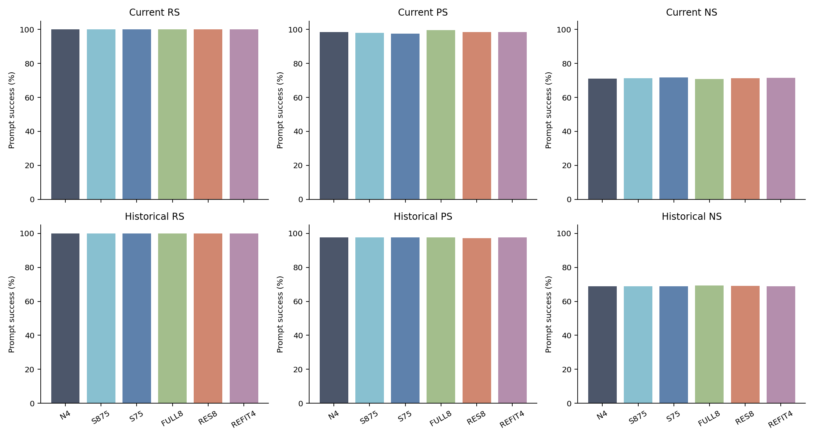
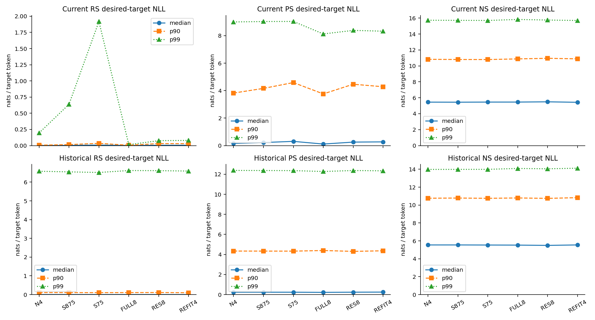
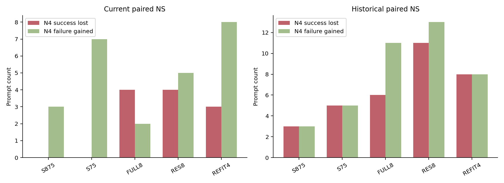
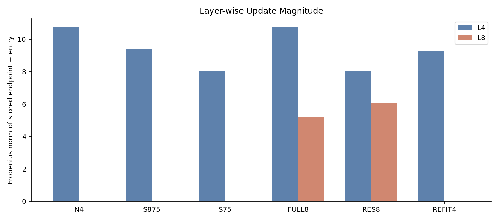
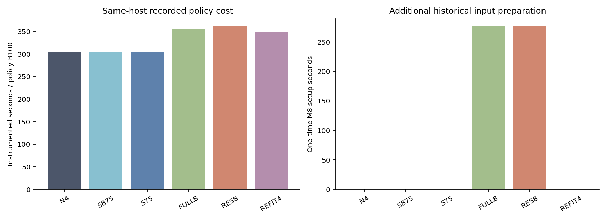

# Low-cost write/donor core — Server4 상세 사실 보고

이 보고서는 job **46451**의 여섯 정적 endpoint를 다룬다. 전체 pilot 완료·후보 채택 보고가 아니다.
Instruction: ODEEDIT-S06-LOW-COST-WRITE-DONOR-CORE-DETAILED-REVIEW-SH4-V1.
claim-decision=`PENDING_GH_REVIEW`, scientific_promotion=false. Audit·5-batch suffix 미실행.

## 1. 첫 실제 성능표

모두 같은 Server4 Llama-3-8B-Instruct, 공통 L4 W50/M50, B051(고정10k ordinal5000–5099)의 실제 저장 endpoint다.
Current와 Historical은 다른 고정 패널이다. 아래 수치는 full-seen5100 또는 lifelong final10k가 아니다.
RS/PS/NS는 prompt-level strict NLL 선호이고 tie는 실패다. Wiki는 sequence 평균, MMLU는32문항 alternative 정수 정답이다.

| arm | current RS | current PS | current NS | historical RS | historical PS | historical NS | Wiki NLL | MMLU correct | MMLU invalid |
| --- | --- | --- | --- | --- | --- | --- | --- | --- | --- |
| N4 | 100/100 (100.0000%) | 197/200 (98.5000%) | 711/1000 (71.1000%) | 128/128 (100.0000%) | 250/256 (97.6562%) | 883/1280 (68.9844%) | 2.3038732 | 19/32 | 0 |
| S875 | 100/100 (100.0000%) | 196/200 (98.0000%) | 714/1000 (71.4000%) | 128/128 (100.0000%) | 250/256 (97.6562%) | 883/1280 (68.9844%) | 2.3036067 | 19/32 | 0 |
| S75 | 100/100 (100.0000%) | 195/200 (97.5000%) | 718/1000 (71.8000%) | 128/128 (100.0000%) | 250/256 (97.6562%) | 883/1280 (68.9844%) | 2.303432 | 18/32 | 0 |
| FULL8 | 100/100 (100.0000%) | 199/200 (99.5000%) | 709/1000 (70.9000%) | 128/128 (100.0000%) | 250/256 (97.6562%) | 888/1280 (69.3750%) | 2.3036067 | 19/32 | 0 |
| RES8 | 100/100 (100.0000%) | 197/200 (98.5000%) | 712/1000 (71.2000%) | 128/128 (100.0000%) | 249/256 (97.2656%) | 885/1280 (69.1406%) | 2.3032684 | 18/32 | 0 |
| REFIT4 | 100/100 (100.0000%) | 197/200 (98.5000%) | 716/1000 (71.6000%) | 128/128 (100.0000%) | 250/256 (97.6562%) | 883/1280 (68.9844%) | 2.3038683 | 19/32 | 0 |

N4 대비 S875는 Current PS −1/200, NS +3/1000이다. S75는 PS −2/200, NS +7/1000이다.
FULL8은 PS +2/200, Current NS −2/1000, Historical NS +5/1280이다.
RES8은 Current PS 순변화0, NS +1/1000, Historical PS −1/256, NS +2/1280이다.
REFIT4는 Current PS 순변화0, NS +5/1000, Historical NS 순변화0이다.
MMLU는 S75·RES8에서 N4보다 정답1개 적고 나머지는 순변화0이다. 모든 arm Current RS100/100이다.
총점 유지가 같은 문항 유지라는 뜻은 아니다. RES8/N4 Historical NS는 loss11/gain13,
S75/N4는 loss5/gain5, REFIT4/N4는 loss8/gain8이다. RES8/N4 Current PS도 loss1/gain1이다.
이는 원시 수치와 산술 차이이며 원인·우열·후속 선택 판단은 GH 소유다.

## 2. 지표 읽는 법

- 각 prompt target의 NLL은 teacher forcing의 target-token 평균 음의 log probability이며 단위는 nats/token, 낮을수록 그 target likelihood가 높다.
- RS=rewrite에서 new NLL < true NLL; PS=paraphrase 각각에서 new < true; NS=neighbor 각각에서 true < new. 성공률은 성공 prompt 수/해당 prompt 수, 높을수록 정의된 선호가 많다. tie는 모두 실패다.
- Desired signed margin은 R/P에서 true−new, N에서 new−true이다. 양수일 때 성공이며 클수록 두 target 간 해당 방향 차이가 크다. true/new NLL 자체와 margin을 별도로 제공한다.
- `new_strict`/`true_strict`는 모든 target token의 top-1이 정답인 prompt의 수다. `token_accuracy`는 맞은 target token/전체 target token이다. NLL pair 선호와 다른 secondary이며 NS로 대체하지 않는다. request-all-success는 해당 request의 모든 prompt 성공을 요구하는 별도 secondary다.
- Prompt 분포와 request-cluster mean 분포를 분리한다. 후자는 같은 request의 P2/N10 값을 먼저 평균한다. mean/median/IQR/p90/p95/p99/max는 기술통계다. Quantile은 정렬 배열의 (n−1)p 선형보간으로 계산한다. 이는 누락값 imputation이 아니다.
- Lost는 기준 성공→후보 실패, gained는 기준 실패→후보 성공이다. net=gained−lost. Conditional loss denominator는 기준 성공 수, recovery denominator는 기준 실패 수다. 같은 request 내 prompt 상관이 있어1000/1280 independent trials라는 유의성 주장을 하지 않는다.
- Wiki128은 기존 고정 input_ids의 모든 다음-token 위치24999개를 평가하되 primary는128개 sequence 평균 NLL의 산술평균이다. token-weighted 평균은 별도 CSV다. Full-vocabulary teacher KL 또는 perplexity 평가로 부르지 않는다.
- MMLUdev32는 기존100문항의 outcome-independent hash subset이다. BLUE alternative branch에서 네 suffix의 exp(−NLL) unique maximum을 선택하며 tie/underflow 동률은 invalid. Generation/weighted F1/full57subject benchmark가 아니다.
- D4=WN4−We; Sα=FP32(We+α FP32(D4)). Layer-wise Update Magnitude는 실제 저장 endpoint−We의 Frobenius norm이다. Share는 두 norm의 합으로 나눈 비율이며 energy/native metric이 아니다. REFIT4 net norm은 두 write path length 합이 아니다.

## 3. 실행·입력·상태 provenance

Scheduler 단발 확인: COMPLETED/0:0, 2026-09-13 19:22:12–19:57:44,2132초,
Server4 1GPU/8CPU/60416M. 이전 agent 마지막 관측은 PENDING/initial NOT_YET_RUN이었다.
이번 recall에서만 저장된 INITIAL_VALID를 검증했다. 초기 receipt는 RES8까지5endpoint와 partial second-fit 후 entry 복원이며 core_complete=false; 후속 core-terminal은6endpoint 완료다.

실행 source7ece056c33fbb4246245c15f5f7c2a678315c05c/tree352cdd8ca3f3d7b6f2b15f3ed6a6f775fb478443.
Archive d6cf34ab416ee313a01c8491ac0ab9d15a0f39d88a5ea8f7ead43b439dbe4312,
lock a672a782c20543b66add9ed83dc5cf04432e9f98f6cc2646e40b68e3627a9317.
분석 시작main ddb70506d90d2c53642251e4683759a4ee0d9bfd와 실행 source를 구분한다.
원본 실행 코드는 수식 변경 없이 own-scope 그대로 게시하며 runtime 재실행은 없다.
BLUE311b076a, adapter b51dcf5, schema repair58f50a를 frozen closure에 결속했다.
모델 revision8afb486c1db24fe5011ec46dfbe5b5dccdb575c2; dataset SHA3d7f5e31db47b23f3a281bb6fb447c2fb1776e3d4721cdfb5fe5c6f998f10ae1,
ordered root5b01356928ad2e2e46effad5a2c5621c87746b610992b7b92bf3ace16b6f5729.
FP32/eager, torch2.9.1+cu128, transformers4.44.2, TF32 matmul=false/cudnn=true.
원본 singleton BLUE L2=1·native layer-local z이며 native five-layer blue=False L2=10 baseline이 아니다.
모든 실제 config key/value와 source/hashes는 source-config-compatibility.json 및 execution-member-identities.csv에 있다.

S2에서 필요한 정확 W50/M50 한 CP만 선택 수신했고 S1의 Historical/Wiki 완료 패널 identity를 재사용했다.
S1 native WN을 matched reference로 사용하지 않았다. Original-target replay0/same-host target-replay0,
Server4 same-host fresh-native1이다. 원 model/P/stats 대형자산의 과거 검산은 실행lock 및 성공한 job의 선행 fullSHA 검사에 결속 재사용했다.
신규 output34파일 전체14,853,827,915 bytes를 새 fullSHA/size/stable-stat 검사했다. 누락/실패endpoint0; 평가중복/비유한/imputation0은 독립 reducer 범위에서 확인했다.

### 3.1 분기·history·snapshot

7개 CPU mmap weights_only snapshot(prepared+6endpoint)의 selected W4/W8/M4/M8를 FP32/finite/tensorSHA로 확인했다.
공통 entry W/M/RNG/context 복원과 endpoint→평가 state exact 결속을 저장 receipt/소스 assertion/실제 tensor로 대조했다.
S875/S75 CPU FP32 materialization은 actual D4 기준으로 byte 일치한다. α1은 N4 snapshot copy;
α0은 source/기존 synthetic 검사만 있으며 실행 core endpoint가 아니다.
두 번째 fit은 FULL8 actualN4, RES8 actualS75, REFIT4 actualS75에서 각각 새 z/K/R을 계산했다.
4개 captured z-order roots는 서로 다르며 fits400z/4solve와 일치한다.

M8은 공통 We에서50×B100=5000 과거 event/context를 한 번 재인코딩한 FP32 CPU Gram이다.
Physical L4→Passet0→singleton0, L8→Passet4→singleton0이다. 같은 M8를 FULL8/RES8의 fit-entry에 썼다.
각 fit의 current history append0; 최종 N4/S875/S75/REFIT4 각L4 once,
FULL8/RES8 각L4+L8 once로 총8append다. REFIT4 두 fitting을 두 번 append하지 않았다.
M8 과거 K는 hash만 저장되어 CPU만으로 재인코딩 numerical replay는 하지 않았다.
M4 endpoint hashes가 여섯 endpoint에서 같은 사실은 raw에 보존한다.
이를 history 누락 또는 model-level parity 증명으로 단정하지 않는다.

종료 process-restore는 selected W0 exact와 RNG 복원, method-state process discard다. parameter version 원복이나 entry M으로 process 종료했다고 하지 않는다.
비선택 parameter 보존은 runtime pointer/version 및 full-byte assertion에 근거한다. 새 full model GPU 재검증0.
모든 checkpoint는 selected W/M/context/RNG + pinned pretrained/P/source closure로 복원하는 snapshot이며 full standalone pretrained model이 아니다.
GPU continuation replay 및 비계측 native와 model-level parity는 NOT_TESTED. AST history-loop 분리 동등성 검사는 이보다 좁은 소스 검사다.

### 3.2 실제 layer action

| arm | layer | norm | share |
| --- | --- | --- | --- |
| N4 | 4 | 10.744017 | 1 |
| N4 | 8 | 0 | 0 |
| S875 | 4 | 9.4010147 | 1 |
| S875 | 8 | 0 | 0 |
| S75 | 4 | 8.0580126 | 1 |
| S75 | 8 | 0 | 0 |
| FULL8 | 4 | 10.744017 | 0.67323832 |
| FULL8 | 8 | 5.2146958 | 0.32676168 |
| RES8 | 4 | 8.0580126 | 0.57138624 |
| RES8 | 8 | 6.0445542 | 0.42861376 |
| REFIT4 | 4 | 9.28566 | 1 |
| REFIT4 | 8 | 0 | 0 |

## 4. Current/Historical 및 W0/entry 상세

W0와 ENTRY는 같은 고정 패널의 준비 reference이며 전10k W0가 아니다. 모든 표는 원분모를 유지한다.

### current 전체 prompt 성능·secondary

| state | metric | numerator | prompt_denominator | rate | ties | new_strict_numerator | true_strict_numerator | new_token_correct | new_token_denominator | true_token_correct | true_token_denominator | request_all_success_numerator | request_denominator |
| --- | --- | --- | --- | --- | --- | --- | --- | --- | --- | --- | --- | --- | --- |
| W0 | RS | 12 | 100 | 0.12 | 0 | 0 | 18 | 1 | 101 | 21 | 103 | 12 | 100 |
| W0 | PS | 23 | 200 | 0.115 | 0 | 0 | 39 | 1 | 202 | 44 | 206 | 7 | 100 |
| W0 | NS | 888 | 1000 | 0.888 | 0 | 5 | 172 | 15 | 1010 | 202 | 1030 | 62 | 100 |
| ENTRY | RS | 30 | 100 | 0.3 | 0 | 3 | 7 | 4 | 101 | 9 | 103 | 30 | 100 |
| ENTRY | PS | 53 | 200 | 0.265 | 0 | 4 | 17 | 5 | 202 | 22 | 206 | 21 | 100 |
| ENTRY | NS | 724 | 1000 | 0.724 | 0 | 46 | 103 | 56 | 1010 | 133 | 1030 | 33 | 100 |
| N4 | RS | 100 | 100 | 1.0 | 0 | 99 | 0 | 100 | 101 | 3 | 103 | 100 | 100 |
| N4 | PS | 197 | 200 | 0.985 | 0 | 149 | 0 | 150 | 202 | 6 | 206 | 97 | 100 |
| N4 | NS | 711 | 1000 | 0.711 | 0 | 50 | 101 | 59 | 1010 | 131 | 1030 | 34 | 100 |
| S875 | RS | 100 | 100 | 1.0 | 0 | 99 | 0 | 100 | 101 | 3 | 103 | 100 | 100 |
| S875 | PS | 196 | 200 | 0.98 | 0 | 147 | 0 | 148 | 202 | 6 | 206 | 96 | 100 |
| S875 | NS | 714 | 1000 | 0.714 | 0 | 49 | 103 | 58 | 1010 | 133 | 1030 | 34 | 100 |
| S75 | RS | 100 | 100 | 1.0 | 0 | 97 | 0 | 98 | 101 | 3 | 103 | 100 | 100 |
| S75 | PS | 195 | 200 | 0.975 | 0 | 138 | 0 | 139 | 202 | 6 | 206 | 95 | 100 |
| S75 | NS | 718 | 1000 | 0.718 | 0 | 49 | 103 | 59 | 1010 | 133 | 1030 | 34 | 100 |
| FULL8 | RS | 100 | 100 | 1.0 | 0 | 100 | 0 | 101 | 101 | 3 | 103 | 100 | 100 |
| FULL8 | PS | 199 | 200 | 0.995 | 0 | 153 | 0 | 154 | 202 | 6 | 206 | 99 | 100 |
| FULL8 | NS | 709 | 1000 | 0.709 | 0 | 54 | 102 | 64 | 1010 | 132 | 1030 | 34 | 100 |
| RES8 | RS | 100 | 100 | 1.0 | 0 | 100 | 0 | 101 | 101 | 3 | 103 | 100 | 100 |
| RES8 | PS | 197 | 200 | 0.985 | 0 | 146 | 0 | 147 | 202 | 6 | 206 | 97 | 100 |
| RES8 | NS | 712 | 1000 | 0.712 | 0 | 55 | 102 | 64 | 1010 | 132 | 1030 | 35 | 100 |
| REFIT4 | RS | 100 | 100 | 1.0 | 0 | 100 | 0 | 101 | 101 | 3 | 103 | 100 | 100 |
| REFIT4 | PS | 197 | 200 | 0.985 | 0 | 146 | 0 | 147 | 202 | 6 | 206 | 97 | 100 |
| REFIT4 | NS | 716 | 1000 | 0.716 | 0 | 55 | 104 | 64 | 1010 | 134 | 1030 | 34 | 100 |

### historical 전체 prompt 성능·secondary

| state | metric | numerator | prompt_denominator | rate | ties | new_strict_numerator | true_strict_numerator | new_token_correct | new_token_denominator | true_token_correct | true_token_denominator | request_all_success_numerator | request_denominator |
| --- | --- | --- | --- | --- | --- | --- | --- | --- | --- | --- | --- | --- | --- |
| W0 | RS | 12 | 128 | 0.09375 | 0 | 1 | 33 | 1 | 128 | 33 | 128 | 12 | 128 |
| W0 | PS | 25 | 256 | 0.09765625 | 0 | 1 | 64 | 1 | 256 | 64 | 256 | 6 | 128 |
| W0 | NS | 1149 | 1280 | 0.89765625 | 0 | 10 | 303 | 10 | 1280 | 303 | 1280 | 81 | 128 |
| ENTRY | RS | 128 | 128 | 1.0 | 0 | 125 | 0 | 125 | 128 | 0 | 128 | 128 | 128 |
| ENTRY | PS | 249 | 256 | 0.97265625 | 0 | 176 | 0 | 176 | 256 | 0 | 256 | 121 | 128 |
| ENTRY | NS | 885 | 1280 | 0.69140625 | 0 | 76 | 155 | 76 | 1280 | 155 | 1280 | 35 | 128 |
| N4 | RS | 128 | 128 | 1.0 | 0 | 125 | 0 | 125 | 128 | 0 | 128 | 128 | 128 |
| N4 | PS | 250 | 256 | 0.9765625 | 0 | 175 | 0 | 175 | 256 | 0 | 256 | 122 | 128 |
| N4 | NS | 883 | 1280 | 0.68984375 | 0 | 73 | 159 | 73 | 1280 | 159 | 1280 | 36 | 128 |
| S875 | RS | 128 | 128 | 1.0 | 0 | 125 | 0 | 125 | 128 | 0 | 128 | 128 | 128 |
| S875 | PS | 250 | 256 | 0.9765625 | 0 | 175 | 0 | 175 | 256 | 0 | 256 | 122 | 128 |
| S875 | NS | 883 | 1280 | 0.68984375 | 0 | 72 | 159 | 72 | 1280 | 159 | 1280 | 35 | 128 |
| S75 | RS | 128 | 128 | 1.0 | 0 | 125 | 0 | 125 | 128 | 0 | 128 | 128 | 128 |
| S75 | PS | 250 | 256 | 0.9765625 | 0 | 175 | 0 | 175 | 256 | 0 | 256 | 122 | 128 |
| S75 | NS | 883 | 1280 | 0.68984375 | 0 | 75 | 161 | 75 | 1280 | 161 | 1280 | 34 | 128 |
| FULL8 | RS | 128 | 128 | 1.0 | 0 | 125 | 0 | 125 | 128 | 0 | 128 | 128 | 128 |
| FULL8 | PS | 250 | 256 | 0.9765625 | 0 | 174 | 0 | 174 | 256 | 0 | 256 | 122 | 128 |
| FULL8 | NS | 888 | 1280 | 0.69375 | 0 | 75 | 159 | 75 | 1280 | 159 | 1280 | 36 | 128 |
| RES8 | RS | 128 | 128 | 1.0 | 0 | 125 | 0 | 125 | 128 | 0 | 128 | 128 | 128 |
| RES8 | PS | 249 | 256 | 0.97265625 | 0 | 175 | 0 | 175 | 256 | 0 | 256 | 121 | 128 |
| RES8 | NS | 885 | 1280 | 0.69140625 | 0 | 76 | 157 | 76 | 1280 | 157 | 1280 | 35 | 128 |
| REFIT4 | RS | 128 | 128 | 1.0 | 0 | 125 | 0 | 125 | 128 | 0 | 128 | 128 | 128 |
| REFIT4 | PS | 250 | 256 | 0.9765625 | 0 | 176 | 0 | 176 | 256 | 0 | 256 | 122 | 128 |
| REFIT4 | NS | 883 | 1280 | 0.68984375 | 0 | 72 | 163 | 72 | 1280 | 163 | 1280 | 34 | 128 |

### Historical active/superseded

124 active-target /4 superseded requests다. status는 entry5000 이전 exact subject/relation의 최신 target 기준이다. 새로운 동의어/semantic collision을 검출했다고 주장하지 않는다. 원 ALL 분모와 보조 집단을 분리한다.

| state | population | metric | numerator | prompt_denominator | request_denominator | new_strict_numerator | true_strict_numerator |
| --- | --- | --- | --- | --- | --- | --- | --- |
| N4 | ACTIVE_TARGET | RS | 124 | 124 | 124 | 123 | 0 |
| N4 | SUPERSEDED | RS | 4 | 4 | 4 | 2 | 0 |
| N4 | ACTIVE_TARGET | PS | 245 | 248 | 124 | 175 | 0 |
| N4 | SUPERSEDED | PS | 5 | 8 | 4 | 0 | 0 |
| N4 | ACTIVE_TARGET | NS | 859 | 1240 | 124 | 73 | 159 |
| N4 | SUPERSEDED | NS | 24 | 40 | 4 | 0 | 0 |
| S875 | ACTIVE_TARGET | RS | 124 | 124 | 124 | 123 | 0 |
| S875 | SUPERSEDED | RS | 4 | 4 | 4 | 2 | 0 |
| S875 | ACTIVE_TARGET | PS | 245 | 248 | 124 | 175 | 0 |
| S875 | SUPERSEDED | PS | 5 | 8 | 4 | 0 | 0 |
| S875 | ACTIVE_TARGET | NS | 858 | 1240 | 124 | 72 | 159 |
| S875 | SUPERSEDED | NS | 25 | 40 | 4 | 0 | 0 |
| S75 | ACTIVE_TARGET | RS | 124 | 124 | 124 | 123 | 0 |
| S75 | SUPERSEDED | RS | 4 | 4 | 4 | 2 | 0 |
| S75 | ACTIVE_TARGET | PS | 245 | 248 | 124 | 175 | 0 |
| S75 | SUPERSEDED | PS | 5 | 8 | 4 | 0 | 0 |
| S75 | ACTIVE_TARGET | NS | 858 | 1240 | 124 | 75 | 161 |
| S75 | SUPERSEDED | NS | 25 | 40 | 4 | 0 | 0 |
| FULL8 | ACTIVE_TARGET | RS | 124 | 124 | 124 | 123 | 0 |
| FULL8 | SUPERSEDED | RS | 4 | 4 | 4 | 2 | 0 |
| FULL8 | ACTIVE_TARGET | PS | 245 | 248 | 124 | 174 | 0 |
| FULL8 | SUPERSEDED | PS | 5 | 8 | 4 | 0 | 0 |
| FULL8 | ACTIVE_TARGET | NS | 863 | 1240 | 124 | 75 | 159 |
| FULL8 | SUPERSEDED | NS | 25 | 40 | 4 | 0 | 0 |
| RES8 | ACTIVE_TARGET | RS | 124 | 124 | 124 | 123 | 0 |
| RES8 | SUPERSEDED | RS | 4 | 4 | 4 | 2 | 0 |
| RES8 | ACTIVE_TARGET | PS | 244 | 248 | 124 | 175 | 0 |
| RES8 | SUPERSEDED | PS | 5 | 8 | 4 | 0 | 0 |
| RES8 | ACTIVE_TARGET | NS | 860 | 1240 | 124 | 75 | 157 |
| RES8 | SUPERSEDED | NS | 25 | 40 | 4 | 1 | 0 |
| REFIT4 | ACTIVE_TARGET | RS | 124 | 124 | 124 | 123 | 0 |
| REFIT4 | SUPERSEDED | RS | 4 | 4 | 4 | 2 | 0 |
| REFIT4 | ACTIVE_TARGET | PS | 245 | 248 | 124 | 176 | 0 |
| REFIT4 | SUPERSEDED | PS | 5 | 8 | 4 | 0 | 0 |
| REFIT4 | ACTIVE_TARGET | NS | 858 | 1240 | 124 | 72 | 163 |
| REFIT4 | SUPERSEDED | NS | 25 | 40 | 4 | 0 | 0 |

## 5. NLL 및 margin 전체 분포

아래는 각 core의 prompt-level 완전표다. Request-cluster mean의 mean/median/IQR/p90/p95/p99/max는 같은 nll-distributions.csv의 별도 aggregation_unit 행에 모두 제공한다. 0개 집단은 n0, 통계 NOT_RECORDED이며 보간하지 않는다.

### N4 NLL/desired margin (nats/token)

| panel | metric | field | n | mean | median | iqr | p90 | p95 | p99 | max |
| --- | --- | --- | --- | --- | --- | --- | --- | --- | --- | --- |
| current | RS | new_nll | 100 | 0.026668974810672808 | 0.0013931221910752356 | 0.003579840325983241 | 0.006594723602756865 | 0.01496555432677267 | 0.19543291285635014 | 2.0812087059020996 |
| current | RS | true_nll | 100 | 14.25408718109131 | 14.046898365020752 | 4.96343731880188 | 19.951498985290527 | 21.14013786315918 | 22.2813425064087 | 23.32017707824707 |
| current | RS | desired_margin | 100 | 14.227418206280635 | 14.046267173747765 | 4.962925179155718 | 19.950037480564788 | 21.13947051543582 | 22.279394653871428 | 23.319139780360274 |
| current | PS | new_nll | 200 | 1.1944203835295049 | 0.15750379860401154 | 1.4441699124872684 | 3.8236852884292576 | 6.361820340156552 | 9.00049101829528 | 9.980753898620605 |
| current | PS | true_nll | 200 | 10.573926992416382 | 10.447765350341797 | 5.155162453651428 | 15.138758945465089 | 16.33977136611938 | 20.40692026138305 | 22.599929809570312 |
| current | PS | desired_margin | 200 | 9.379506608886878 | 9.451734725385904 | 6.438306382857263 | 15.077803825121373 | 16.271347151789815 | 20.40563624324509 | 22.587824477814138 |
| current | NS | new_nll | 1000 | 8.478977541178464 | 8.530216693878174 | 5.884044885635376 | 13.88793649673462 | 15.334273815155026 | 17.44063642501831 | 21.45707130432129 |
| current | NS | true_nll | 1000 | 5.960385535078124 | 5.453323602676392 | 5.125856399536133 | 10.82564926147461 | 12.417059278488159 | 15.7279812335968 | 21.415830612182617 |
| current | NS | desired_margin | 1000 | 2.5185920061003415 | 2.7384570837020874 | 6.646938651800156 | 8.75967152118683 | 10.200558774173258 | 14.002574082612991 | 17.050587236881256 |
| historical | RS | new_nll | 128 | 0.2323517794548593 | 0.002506151795387268 | 0.007209428586065769 | 0.10876782163977605 | 0.5210265547037116 | 6.579598098993327 | 13.910602569580078 |
| historical | RS | true_nll | 128 | 12.81493541970849 | 12.253590106964111 | 5.584067344665527 | 17.578415870666504 | 18.629217243194578 | 22.229232692718508 | 23.541820526123047 |
| historical | RS | desired_margin | 128 | 12.582583640253631 | 12.223286935826764 | 5.645333822001703 | 17.577318693487904 | 18.627929957292505 | 22.22846978510919 | 23.53831239696592 |
| historical | PS | new_nll | 256 | 1.519728416739781 | 0.23767512291669846 | 1.703958511352539 | 4.342031478881836 | 6.783138036727905 | 12.37994070053099 | 15.797654151916504 |
| historical | PS | true_nll | 256 | 9.714681752026081 | 9.159221172332764 | 4.959078669548035 | 14.103091716766357 | 15.93384575843811 | 20.26284170150757 | 21.45576286315918 |
| historical | PS | desired_margin | 256 | 8.1949533352863 | 7.857655793428421 | 5.702305864542723 | 13.707009818404913 | 15.650191274937242 | 20.180517788475846 | 21.449192934203893 |
| historical | NS | new_nll | 1280 | 8.02043007699308 | 7.9179770946502686 | 5.575563549995422 | 13.520577239990235 | 15.19818663597107 | 18.341244564056407 | 21.32379722595215 |
| historical | NS | true_nll | 1280 | 5.866765133322042 | 5.5464208126068115 | 5.120167970657349 | 10.765612697601327 | 12.208933210372921 | 13.98306945800783 | 18.902942657470703 |
| historical | NS | desired_margin | 1280 | 2.153664943671038 | 2.144567370414734 | 5.615264445543289 | 8.080521535873418 | 10.446472322940823 | 14.530033164024362 | 16.512583076953888 |

### S875 NLL/desired margin (nats/token)

| panel | metric | field | n | mean | median | iqr | p90 | p95 | p99 | max |
| --- | --- | --- | --- | --- | --- | --- | --- | --- | --- | --- |
| current | RS | new_nll | 100 | 0.05778689134094748 | 0.0030682632932439446 | 0.007223068998428062 | 0.015356511529535058 | 0.029692245926707883 | 0.6385370516777216 | 4.067821979522705 |
| current | RS | true_nll | 100 | 13.506934480667114 | 13.468998908996582 | 4.824321746826172 | 19.50630130767822 | 20.628199291229247 | 21.788233432769776 | 21.955219268798828 |
| current | RS | desired_margin | 100 | 13.449147589326166 | 13.463674951926805 | 4.823579166055424 | 19.503764882683754 | 20.623264679079874 | 21.786800025185805 | 21.9530326211825 |
| current | PS | new_nll | 200 | 1.321036658702651 | 0.22279299795627594 | 1.8545730859041214 | 4.163514232635496 | 6.996810698509215 | 9.0309084701538 | 10.547284126281738 |
| current | PS | true_nll | 200 | 10.244305750727653 | 10.334671020507812 | 5.1522074937820435 | 14.825956439971923 | 16.071557044982907 | 20.129157600402824 | 21.6749210357666 |
| current | PS | desired_margin | 200 | 8.923269092025002 | 8.87042394746095 | 6.259303629398346 | 14.739449730329214 | 15.97001648234436 | 20.12730650552548 | 21.66627212241292 |
| current | NS | new_nll | 1000 | 8.497426052032038 | 8.54236125946045 | 5.866637229919434 | 13.895535564422607 | 15.38297505378723 | 17.4340576171875 | 21.487760543823242 |
| current | NS | true_nll | 1000 | 5.950677468022332 | 5.445899486541748 | 5.113257884979248 | 10.800764179229736 | 12.411034202575681 | 15.714527225494384 | 21.4215145111084 |
| current | NS | desired_margin | 1000 | 2.546748584009707 | 2.7178330421447754 | 6.67151452600956 | 8.767321157455445 | 10.237059223651885 | 14.057856400907038 | 17.006772130727768 |
| historical | RS | new_nll | 128 | 0.23278650113343247 | 0.0025140587240457535 | 0.007157094762078486 | 0.10644158348441105 | 0.5316396445035929 | 6.546983385086085 | 13.907676696777344 |
| historical | RS | true_nll | 128 | 12.818971421569586 | 12.234408378601074 | 5.581859350204468 | 17.560779190063478 | 18.64863882064819 | 22.226250171661377 | 23.536102294921875 |
| historical | RS | desired_margin | 128 | 12.586184920436153 | 12.21197869576281 | 5.6771309119067155 | 17.559668931941268 | 18.64735505901917 | 22.22549761309958 | 23.53262968524359 |
| historical | PS | new_nll | 256 | 1.5177116878923016 | 0.23971593379974365 | 1.7162698972970247 | 4.337734937667847 | 6.772306561470032 | 12.371113252639754 | 15.775421142578125 |
| historical | PS | true_nll | 256 | 9.716022115200758 | 9.17228889465332 | 4.972360014915466 | 14.108597755432129 | 15.939153671264648 | 20.269684314727783 | 21.437007904052734 |
| historical | PS | desired_margin | 256 | 8.198310427308456 | 7.846972227096558 | 5.692516485694796 | 13.697791684418917 | 15.68113225698471 | 20.200817525046293 | 21.43042696127668 |
| historical | NS | new_nll | 1280 | 8.022889871786266 | 7.912545919418335 | 5.588540434837341 | 13.50383863449097 | 15.189736318588254 | 18.339219017028817 | 21.311798095703125 |
| historical | NS | true_nll | 1280 | 5.863148202008597 | 5.546988487243652 | 5.135327219963074 | 10.784674644470215 | 12.227975845336912 | 13.988440713882463 | 18.91696548461914 |
| historical | NS | desired_margin | 1280 | 2.159741669777668 | 2.126641273498535 | 5.60856306552887 | 8.069482135772706 | 10.45409798622131 | 14.5217199420929 | 16.474648237228394 |

### S75 NLL/desired margin (nats/token)

| panel | metric | field | n | mean | median | iqr | p90 | p95 | p99 | max |
| --- | --- | --- | --- | --- | --- | --- | --- | --- | --- | --- |
| current | RS | new_nll | 100 | 0.11508265619082522 | 0.007918857969343662 | 0.0173527441220358 | 0.034509984776377706 | 0.08608783446252312 | 1.9185683465004197 | 6.382448196411133 |
| current | RS | true_nll | 100 | 12.54534154176712 | 12.429634094238281 | 5.049555778503418 | 18.54860324859619 | 19.50895195007324 | 21.113926219940186 | 21.278423309326172 |
| current | RS | desired_margin | 100 | 12.430258885576295 | 12.423417665297166 | 5.062774195510428 | 18.54331413670443 | 19.506348158454056 | 21.112925416452345 | 21.27519948943518 |
| current | PS | new_nll | 200 | 1.5216781071329024 | 0.3075401037931442 | 2.1830857498571277 | 4.58808512687683 | 7.167050671577447 | 9.037286224365225 | 11.01869010925293 |
| current | PS | true_nll | 200 | 9.825820414423942 | 9.782357692718506 | 5.04313325881958 | 14.494364070892333 | 15.595345449447631 | 19.353892040252685 | 19.924198150634766 |
| current | PS | desired_margin | 200 | 8.30414230729104 | 8.243843823671341 | 6.173379629850388 | 14.212853542901573 | 15.55844600845594 | 19.343569177803584 | 19.921050738543272 |
| current | NS | new_nll | 1000 | 8.515065994713455 | 8.542992115020752 | 5.801813244819641 | 13.89385175704956 | 15.430702209472656 | 17.4405885887146 | 21.517009735107422 |
| current | NS | true_nll | 1000 | 5.940792204659433 | 5.459062099456787 | 5.134191393852234 | 10.795512008666993 | 12.405743503570555 | 15.70064769744873 | 21.425994873046875 |
| current | NS | desired_margin | 1000 | 2.5742737900540233 | 2.7308108806610107 | 6.743144989013672 | 8.80071349143982 | 10.296164929866789 | 14.112881443500518 | 16.96069970726967 |
| historical | RS | new_nll | 128 | 0.23328146173980713 | 0.002485045464709401 | 0.007055032197968103 | 0.10425759106874447 | 0.5431079536676403 | 6.514623496532465 | 13.90523910522461 |
| historical | RS | true_nll | 128 | 12.822522025555372 | 12.220771312713623 | 5.67920446395874 | 17.542304611206056 | 18.668349456787105 | 22.22236343383789 | 23.529478073120117 |
| historical | RS | desired_margin | 128 | 12.589240563815565 | 12.20266449439805 | 5.67276870412752 | 17.54118070102995 | 18.66714928821311 | 22.221620409836177 | 23.526041815523058 |
| historical | PS | new_nll | 256 | 1.515842519363332 | 0.23915045708417892 | 1.728279372677207 | 4.333601474761963 | 6.7611143589019775 | 12.360174751281722 | 15.752362251281738 |
| historical | PS | true_nll | 256 | 9.71710966527462 | 9.176278114318848 | 4.964488625526428 | 14.147826194763184 | 15.943928003311157 | 20.275580883026123 | 21.418941497802734 |
| historical | PS | desired_margin | 256 | 8.201267145911288 | 7.851959764957428 | 5.6988636527676135 | 13.700600575190037 | 15.705228425562382 | 20.220574565931745 | 21.412353804334998 |
| historical | NS | new_nll | 1280 | 8.025460431697457 | 7.91347336769104 | 5.58550226688385 | 13.52137441635132 | 15.193559837341304 | 18.337341995239264 | 21.297500610351562 |
| historical | NS | true_nll | 1280 | 5.85983508664358 | 5.537590026855469 | 5.147469401359558 | 10.755715560913087 | 12.203462648391724 | 13.992428035736102 | 18.930461883544922 |
| historical | NS | desired_margin | 1280 | 2.165625345053877 | 2.1198806762695312 | 5.626989275217056 | 8.025996541976935 | 10.459767575562 | 14.50547245681286 | 16.500109791755676 |

### FULL8 NLL/desired margin (nats/token)

| panel | metric | field | n | mean | median | iqr | p90 | p95 | p99 | max |
| --- | --- | --- | --- | --- | --- | --- | --- | --- | --- | --- |
| current | RS | new_nll | 100 | 0.0024656325837895563 | 0.0013107407721690834 | 0.0031630539160687476 | 0.00585286980494857 | 0.0068962453864514816 | 0.014769186573103095 | 0.01937815733253956 |
| current | RS | true_nll | 100 | 14.750487179756165 | 14.232162475585938 | 4.412905931472778 | 20.37694778442383 | 21.696442127227783 | 22.414387149810796 | 23.458642959594727 |
| current | RS | desired_margin | 100 | 14.748021547172375 | 14.231380425553652 | 4.411516692620353 | 20.376656268927036 | 21.696404696215268 | 22.412524525494668 | 23.457671041891444 |
| current | PS | new_nll | 200 | 1.0751901517908846 | 0.11157064512372017 | 1.191940285731107 | 3.7621458292007444 | 4.760592484474178 | 8.1271468925476 | 9.147446632385254 |
| current | PS | true_nll | 200 | 10.770316265821457 | 10.649258136749268 | 5.008011102676392 | 15.237362098693847 | 16.77345876693725 | 20.930387268066408 | 22.723594665527344 |
| current | PS | desired_margin | 200 | 9.695126114030572 | 9.689533330500126 | 6.317883704323322 | 15.213973585050553 | 16.740279529243704 | 20.930073366780707 | 22.712663296610117 |
| current | NS | new_nll | 1000 | 8.446174103123486 | 8.487210273742676 | 5.826690912246704 | 13.881246566772461 | 15.380477809906006 | 17.53409889221191 | 21.41274070739746 |
| current | NS | true_nll | 1000 | 5.9778614546656605 | 5.460423231124878 | 5.159843146800995 | 10.877838611602783 | 12.47443857192993 | 15.826129598617554 | 21.26267433166504 |
| current | NS | desired_margin | 1000 | 2.4683126484578244 | 2.7071309089660645 | 6.638092964887619 | 8.769387066364292 | 10.163632762432098 | 14.067503515537828 | 17.05875191092491 |
| historical | RS | new_nll | 128 | 0.23437753924912386 | 0.0025291615165770054 | 0.007191408600192517 | 0.10746814608573899 | 0.4400576561689374 | 6.618109111785913 | 13.950508117675781 |
| historical | RS | true_nll | 128 | 12.845471113920212 | 12.328753471374512 | 5.567724943161011 | 17.59528694152832 | 18.66730403900146 | 22.24800157546997 | 23.557889938354492 |
| historical | RS | desired_margin | 128 | 12.611093574671088 | 12.273127311374992 | 5.7037094091647305 | 17.595143940988784 | 18.61165690773341 | 22.247603906650184 | 23.554361971095204 |
| historical | PS | new_nll | 256 | 1.5231060107021221 | 0.2225450873374939 | 1.701264870353043 | 4.3954222202301025 | 6.78381085395813 | 12.274606513977036 | 15.66052532196045 |
| historical | PS | true_nll | 256 | 9.717936811037362 | 9.160308361053467 | 5.024678587913513 | 14.034164905548096 | 15.950686693191528 | 20.25352506637573 | 21.537817001342773 |
| historical | PS | desired_margin | 256 | 8.19483080033524 | 7.912665277719498 | 5.882561998208985 | 13.670764265116304 | 15.700225925538689 | 20.112256101035744 | 21.53143764194101 |
| historical | NS | new_nll | 1280 | 8.027388316716406 | 7.95292329788208 | 5.612012505531311 | 13.464871120452884 | 15.249119472503661 | 18.367210826873794 | 21.328203201293945 |
| historical | NS | true_nll | 1280 | 5.869963908365025 | 5.5283167362213135 | 5.161560952663422 | 10.794250202178956 | 12.227371168136596 | 14.089739036560077 | 18.944732666015625 |
| historical | NS | desired_margin | 1280 | 2.1574244083513805 | 2.1223350018262863 | 5.633852392435074 | 8.13145492076874 | 10.460361099243162 | 14.461211673617367 | 16.60105788707733 |

### RES8 NLL/desired margin (nats/token)

| panel | metric | field | n | mean | median | iqr | p90 | p95 | p99 | max |
| --- | --- | --- | --- | --- | --- | --- | --- | --- | --- | --- |
| current | RS | new_nll | 100 | 0.011580593005564879 | 0.005233154632151127 | 0.013035692478297278 | 0.030985238216817382 | 0.03708783201873301 | 0.0760434609651566 | 0.08507218956947327 |
| current | RS | true_nll | 100 | 13.25048816204071 | 12.948678016662598 | 5.593291997909546 | 18.808694458007814 | 19.901788997650147 | 21.076171741485595 | 21.27801513671875 |
| current | RS | desired_margin | 100 | 13.238907569035145 | 12.93605319827293 | 5.607312667416409 | 18.807899259246188 | 19.900101085023923 | 21.075113879436394 | 21.274367318022996 |
| current | PS | new_nll | 200 | 1.3514726489626627 | 0.25397543609142303 | 1.8123905332759023 | 4.4665271759033205 | 6.233568692207335 | 8.385672121047968 | 9.922391891479492 |
| current | PS | true_nll | 200 | 10.192449815273285 | 10.120477199554443 | 5.100411295890808 | 14.914697551727294 | 16.09116840362548 | 19.5801229095459 | 22.47995376586914 |
| current | PS | desired_margin | 200 | 8.840977166310623 | 8.468670943751931 | 6.571410461328924 | 14.87442932408303 | 16.04555656947195 | 19.57654890684411 | 22.479901434358908 |
| current | NS | new_nll | 1000 | 8.469381428731605 | 8.473042011260986 | 5.850623607635498 | 13.879580307006837 | 15.371740198135376 | 17.510819301605224 | 21.385730743408203 |
| current | NS | true_nll | 1000 | 5.968197553480976 | 5.491685628890991 | 5.180981695652008 | 10.951379489898683 | 12.482838773727417 | 15.753422536849975 | 21.241270065307617 |
| current | NS | desired_margin | 1000 | 2.50118387525063 | 2.7181689739227295 | 6.604800581932068 | 8.757226181030276 | 10.238507866859432 | 14.034879137277603 | 17.06515285372734 |
| historical | RS | new_nll | 128 | 0.2361971290655447 | 0.002436111564747989 | 0.006999202829319984 | 0.11107514202594741 | 0.5319804757833473 | 6.6109216403961435 | 13.912384033203125 |
| historical | RS | true_nll | 128 | 12.850654508918524 | 12.309191703796387 | 5.67768931388855 | 17.52187576293945 | 18.748093891143792 | 22.359246578216553 | 23.618730545043945 |
| historical | RS | desired_margin | 128 | 12.614457379852979 | 12.252665179723408 | 5.651682748342864 | 17.521728626376717 | 18.73062760754837 | 22.358870343605957 | 23.615577072370797 |
| historical | PS | new_nll | 256 | 1.5196316029636137 | 0.241280697286129 | 1.7155779777094722 | 4.310168743133545 | 6.841895699501038 | 12.36971497535704 | 15.62861442565918 |
| historical | PS | true_nll | 256 | 9.714068042114377 | 9.189818859100342 | 5.15886127948761 | 14.106215476989746 | 15.957074165344238 | 20.18102464675903 | 21.598234176635742 |
| historical | PS | desired_margin | 256 | 8.194436439150763 | 7.898900017142296 | 5.768085510004312 | 13.730486182961613 | 15.714795787702315 | 20.076065116901006 | 21.59279350982979 |
| historical | NS | new_nll | 1280 | 8.027796090065886 | 7.931741714477539 | 5.574957728385925 | 13.455115985870364 | 15.107575893402098 | 18.379946594238287 | 21.17835235595703 |
| historical | NS | true_nll | 1280 | 5.861854149317514 | 5.496659755706787 | 5.202904224395752 | 10.748855590820314 | 12.195573711395264 | 14.051237268447899 | 18.986038208007812 |
| historical | NS | desired_margin | 1280 | 2.165941940748371 | 2.1144614219665527 | 5.613705337047577 | 8.096022862195971 | 10.450458457693458 | 14.295355734825138 | 16.63722538948059 |

### REFIT4 NLL/desired margin (nats/token)

| panel | metric | field | n | mean | median | iqr | p90 | p95 | p99 | max |
| --- | --- | --- | --- | --- | --- | --- | --- | --- | --- | --- |
| current | RS | new_nll | 100 | 0.013840942334300053 | 0.005464315181598067 | 0.01264987388276495 | 0.029358677379786976 | 0.03644207529723641 | 0.08016618020832644 | 0.28385764360427856 |
| current | RS | true_nll | 100 | 13.176105818748475 | 12.906182765960693 | 5.759605646133423 | 18.666104316711426 | 19.969367885589598 | 21.155979022979736 | 21.38331413269043 |
| current | RS | desired_margin | 100 | 13.162264876414174 | 12.886964458972216 | 5.788292625715258 | 18.664334711973787 | 19.96735761516611 | 21.15500230153848 | 21.38019940070808 |
| current | PS | new_nll | 200 | 1.3314119159366238 | 0.27031056582927704 | 1.6874335464090109 | 4.284719133377075 | 6.111426186561583 | 8.328020915985102 | 9.724790573120117 |
| current | PS | true_nll | 200 | 10.085192205905914 | 10.012608051300049 | 5.152028322219849 | 14.692932033538817 | 15.828334569931025 | 19.47530860900879 | 19.944467544555664 |
| current | PS | desired_margin | 200 | 8.75378028996929 | 8.476866245269775 | 6.373432956635952 | 14.55260743596591 | 15.824374060542318 | 19.465988365963568 | 19.941284007392824 |
| current | NS | new_nll | 1000 | 8.475828631661832 | 8.579268455505371 | 5.987612724304199 | 13.824235630035401 | 15.418411302566527 | 17.459931354522706 | 21.41968536376953 |
| current | NS | true_nll | 1000 | 5.948565918871202 | 5.432502508163452 | 5.133995532989502 | 10.884672737121583 | 12.478566455841063 | 15.695514354705809 | 21.188358306884766 |
| current | NS | desired_margin | 1000 | 2.527262712790631 | 2.760293960571289 | 6.774031043052673 | 8.781693840026858 | 10.296103230118751 | 13.887917635440825 | 16.925367385149002 |
| historical | RS | new_nll | 128 | 0.23343521848823912 | 0.002390386420302093 | 0.006924592991708778 | 0.09885157942771892 | 0.557917968928813 | 6.589749028682734 | 13.879898071289062 |
| historical | RS | true_nll | 128 | 12.833272632211447 | 12.206848621368408 | 5.772502660751343 | 17.554430198669433 | 18.73500747680664 | 22.431431941986084 | 23.482107162475586 |
| historical | RS | desired_margin | 128 | 12.599837413723208 | 12.179327415244188 | 5.772532610979397 | 17.553775722059072 | 18.683460950638977 | 22.430718521114322 | 23.478588817175478 |
| historical | PS | new_nll | 256 | 1.5134958123103388 | 0.2501290664076805 | 1.6703400956466794 | 4.367841720581055 | 6.623252749443054 | 12.338902950286851 | 15.763310432434082 |
| historical | PS | true_nll | 256 | 9.723211362026632 | 9.225995540618896 | 4.968263149261475 | 14.090104103088379 | 15.891658306121826 | 20.290623569488524 | 21.457416534423828 |
| historical | PS | desired_margin | 256 | 8.209715549716293 | 7.862814962863922 | 5.735125696286559 | 13.768996123690158 | 15.675093968166038 | 20.211021930071 | 21.45102450111881 |
| historical | NS | new_nll | 1280 | 8.01883160779371 | 7.883772850036621 | 5.651457905769348 | 13.466263198852543 | 15.255450916290282 | 18.114798927307145 | 21.0653076171875 |
| historical | NS | true_nll | 1280 | 5.857322878930427 | 5.549118757247925 | 5.120306193828583 | 10.828535461425783 | 12.248902845382688 | 14.119608144760146 | 18.93317222595215 |
| historical | NS | desired_margin | 1280 | 2.161508728863282 | 2.10677383095026 | 5.706162333488464 | 8.05354660749436 | 10.404675939306616 | 14.449598270058631 | 16.726407885551453 |

## 6. Matched 대비·양방향 전이

각 대비는 동일 prompt/target identity와 순서로 join했다. 순차 trajectory의 장기 효과가 아닌 같은 entry의 1-batch 정적 대비다. 각 true/new NLL 변화와 request-cluster paired 분포 전체는 paired-transitions.csv 및 paired-request-distributions.csv에 있다.

| before | after | panel | metric | prompt_denominator | lost | gained | retained | failed_both | delta_pp | new_nll_delta_mean | true_nll_delta_mean | desired_margin_delta_mean |
| --- | --- | --- | --- | --- | --- | --- | --- | --- | --- | --- | --- | --- |
| N4 | S875 | current | RS | 100 | 0 | 0 | 100 | 0 | 0.0 | 0.03111791653027467 | -0.7471527004241943 | -0.778270616954469 |
| N4 | S875 | current | PS | 200 | 1 | 0 | 196 | 3 | -0.5 | 0.12661627517314628 | -0.3296212416887283 | -0.45623751686187464 |
| N4 | S875 | current | NS | 1000 | 0 | 3 | 711 | 286 | 0.3 | 0.01844851085357368 | -0.009708067055791617 | 0.028156577909365297 |
| N4 | S875 | historical | RS | 128 | 0 | 0 | 128 | 0 | 0.0 | 0.0004347216785731689 | 0.0040360018610954285 | 0.0036012801825222596 |
| N4 | S875 | historical | PS | 256 | 0 | 0 | 250 | 6 | 0.0 | -0.0020167288474794987 | 0.0013403631746768951 | 0.003357092022156394 |
| N4 | S875 | historical | NS | 1280 | 3 | 3 | 880 | 394 | 0.0 | 0.0024597947931852106 | -0.003616931313445093 | 0.006076726106630304 |
| N4 | S75 | current | RS | 100 | 0 | 0 | 100 | 0 | 0.0 | 0.08841368138015242 | -1.7087456393241882 | -1.7971593207043406 |
| N4 | S75 | current | PS | 200 | 2 | 0 | 195 | 3 | -1.0 | 0.3272577236033976 | -0.7481065779924393 | -1.075364301595837 |
| N4 | S75 | current | NS | 1000 | 0 | 7 | 711 | 282 | 0.7 | 0.03608845353499055 | -0.01959333041869104 | 0.05568178395368159 |
| N4 | S75 | historical | RS | 128 | 0 | 0 | 128 | 0 | 0.0 | 0.0009296822849478303 | 0.0075866058468818665 | 0.006656923561934036 |
| N4 | S75 | historical | PS | 256 | 0 | 0 | 250 | 6 | 0.0 | -0.0038858973764490656 | 0.002427913248538971 | 0.006313810624988037 |
| N4 | S75 | historical | NS | 1280 | 5 | 5 | 878 | 392 | 0.0 | 0.005030354704376805 | -0.006930046678462531 | 0.011960401382839336 |
| N4 | FULL8 | current | RS | 100 | 0 | 0 | 100 | 0 | 0.0 | -0.02420334222688325 | 0.49639999866485596 | 0.5206033408917392 |
| N4 | FULL8 | current | PS | 200 | 0 | 2 | 197 | 1 | 1.0 | -0.1192302317386202 | 0.19638927340507506 | 0.3156195051436953 |
| N4 | FULL8 | current | NS | 1000 | 4 | 2 | 707 | 287 | -0.2 | -0.03280343805497978 | 0.017475919587537646 | -0.050279357642517425 |
| N4 | FULL8 | historical | RS | 128 | 0 | 0 | 128 | 0 | 0.0 | 0.002025759794264559 | 0.03053569421172142 | 0.02850993441745686 |
| N4 | FULL8 | historical | PS | 256 | 0 | 0 | 250 | 6 | 0.0 | 0.0033775939623410522 | 0.0032550590112805367 | -0.0001225349510605156 |
| N4 | FULL8 | historical | NS | 1280 | 6 | 11 | 877 | 386 | 0.390625 | 0.006958239723326187 | 0.0031987750429834706 | 0.0037594646803427167 |
| N4 | RES8 | current | RS | 100 | 0 | 0 | 100 | 0 | 0.0 | -0.01508838180510793 | -1.0035990190505981 | -0.9885106372454903 |
| N4 | RES8 | current | PS | 200 | 1 | 1 | 196 | 2 | 0.0 | 0.15705226543315803 | -0.3814771771430969 | -0.5385294425762549 |
| N4 | RES8 | current | NS | 1000 | 4 | 5 | 707 | 284 | 0.1 | -0.009596112446859479 | 0.007812018402852118 | -0.017408130849711597 |
| N4 | RES8 | historical | RS | 128 | 0 | 0 | 128 | 0 | 0.0 | 0.003845349610685389 | 0.03571908921003342 | 0.03187373959934803 |
| N4 | RES8 | historical | PS | 256 | 1 | 0 | 249 | 6 | -0.390625 | -9.681377616743703e-05 | -0.0006137099117040634 | -0.0005168961355366264 |
| N4 | RES8 | historical | NS | 1280 | 11 | 13 | 872 | 384 | 0.15625 | 0.007366013072805799 | -0.004910984004527563 | 0.012276997077333363 |
| N4 | REFIT4 | current | RS | 100 | 0 | 0 | 100 | 0 | 0.0 | -0.012828032476372755 | -1.0779813623428345 | -1.0651533298664617 |
| N4 | REFIT4 | current | PS | 200 | 1 | 1 | 196 | 2 | 0.0 | 0.13699153240711895 | -0.48873478651046753 | -0.6257263189175865 |
| N4 | REFIT4 | current | NS | 1000 | 3 | 8 | 708 | 281 | 0.5 | -0.003148909516632557 | -0.011819616206921638 | 0.00867070669028908 |
| N4 | REFIT4 | historical | RS | 128 | 0 | 0 | 128 | 0 | 0.0 | 0.0010834390333798183 | 0.01833721250295639 | 0.017253773469576572 |
| N4 | REFIT4 | historical | PS | 256 | 0 | 0 | 250 | 6 | 0.0 | -0.00623260442944229 | 0.008529610000550747 | 0.014762214429993037 |
| N4 | REFIT4 | historical | NS | 1280 | 8 | 8 | 875 | 389 | 0.0 | -0.001598469199370811 | -0.009442254391615279 | 0.007843785192244468 |
| S75 | RES8 | current | RS | 100 | 0 | 0 | 100 | 0 | 0.0 | -0.10350206318526034 | 0.7051466202735901 | 0.8086486834588504 |
| S75 | RES8 | current | PS | 200 | 0 | 2 | 195 | 3 | 1.0 | -0.17020545817023958 | 0.36662940084934237 | 0.536834859019582 |
| S75 | RES8 | current | NS | 1000 | 7 | 1 | 711 | 281 | -0.6 | -0.04568456598185003 | 0.027405348821543156 | -0.07308991480339319 |
| S75 | RES8 | historical | RS | 128 | 0 | 0 | 128 | 0 | 0.0 | 0.0029156673257375587 | 0.02813248336315155 | 0.02521681603741399 |
| S75 | RES8 | historical | PS | 256 | 1 | 0 | 249 | 6 | -0.390625 | 0.0037890836002816286 | -0.0030416231602430344 | -0.006830706760524663 |
| S75 | RES8 | historical | NS | 1280 | 8 | 10 | 875 | 387 | 0.15625 | 0.0023356583684289943 | 0.002019062673934968 | 0.0003165956944940262 |
| REFIT4 | RES8 | current | RS | 100 | 0 | 0 | 100 | 0 | 0.0 | -0.002260349328735174 | 0.07438234329223632 | 0.07664269262097151 |
| REFIT4 | RES8 | current | PS | 200 | 1 | 1 | 196 | 2 | 0.0 | 0.02006073302603909 | 0.10725760936737061 | 0.08719687634133151 |
| REFIT4 | RES8 | current | NS | 1000 | 5 | 1 | 711 | 283 | -0.4 | -0.006447202930226922 | 0.019631634609773754 | -0.026078837540000677 |
| REFIT4 | RES8 | historical | RS | 128 | 0 | 0 | 128 | 0 | 0.0 | 0.0027619105773055708 | 0.017381876707077026 | 0.014619966129771456 |
| REFIT4 | RES8 | historical | PS | 256 | 1 | 0 | 249 | 6 | -0.390625 | 0.006135790653274853 | -0.00914331991225481 | -0.015279110565529663 |
| REFIT4 | RES8 | historical | NS | 1280 | 9 | 11 | 874 | 386 | 0.15625 | 0.00896448227217661 | 0.004531270387087716 | 0.004433211885088895 |
| FULL8 | RES8 | current | RS | 100 | 0 | 0 | 100 | 0 | 0.0 | 0.009114960421775321 | -1.499999017715454 | -1.5091139781372294 |
| FULL8 | RES8 | current | PS | 200 | 2 | 0 | 197 | 1 | -1.0 | 0.2762824971717782 | -0.577866450548172 | -0.8541489477199502 |
| FULL8 | RES8 | current | NS | 1000 | 2 | 5 | 707 | 286 | 0.3 | 0.0232073256081203 | -0.009663901184685528 | 0.03287122679280583 |
| FULL8 | RES8 | historical | RS | 128 | 0 | 0 | 128 | 0 | 0.0 | 0.0018195898164208302 | 0.0051833949983119965 | 0.0033638051818911663 |
| FULL8 | RES8 | historical | PS | 256 | 1 | 0 | 249 | 6 | -0.390625 | -0.0034744077385084893 | -0.0038687689229846 | -0.0003943611844761108 |
| FULL8 | RES8 | historical | NS | 1280 | 10 | 7 | 878 | 385 | -0.234375 | 0.0004077733494796121 | -0.008109759047511034 | 0.008517532396990646 |

RES8−S75 Current PS는 +2/200, NS는 −6/1000이다. RES8−REFIT4 Current PS는 같고 NS −4/1000, Historical NS +2/1280, PS −1/256이다. RES8−FULL8 Current PS −2/200, NS +3/1000, Historical NS −3/1280이다. MMLU RES8은 REFIT4/FULL8보다1개 적다. 이 반대방향들을 단일 우월성 판정으로 합치지 않는다.

### W0/entry→endpoint 전이

| before | after | panel | prompt_denominator | before_numerator | after_numerator | lost | gained | conditional_loss_rate | conditional_gain_rate |
| --- | --- | --- | --- | --- | --- | --- | --- | --- | --- |
| W0 | N4 | current | 1000 | 888 | 711 | 204 | 27 | 0.22972972972972974 | 0.24107142857142858 |
| W0 | N4 | historical | 1280 | 1149 | 883 | 307 | 41 | 0.26718885987815494 | 0.31297709923664124 |
| W0 | S875 | current | 1000 | 888 | 714 | 201 | 27 | 0.22635135135135134 | 0.24107142857142858 |
| W0 | S875 | historical | 1280 | 1149 | 883 | 307 | 41 | 0.26718885987815494 | 0.31297709923664124 |
| W0 | S75 | current | 1000 | 888 | 718 | 198 | 28 | 0.22297297297297297 | 0.25 |
| W0 | S75 | historical | 1280 | 1149 | 883 | 309 | 43 | 0.2689295039164491 | 0.3282442748091603 |
| W0 | FULL8 | current | 1000 | 888 | 709 | 206 | 27 | 0.23198198198198197 | 0.24107142857142858 |
| W0 | FULL8 | historical | 1280 | 1149 | 888 | 304 | 43 | 0.26457789382071367 | 0.3282442748091603 |
| W0 | RES8 | current | 1000 | 888 | 712 | 203 | 27 | 0.2286036036036036 | 0.24107142857142858 |
| W0 | RES8 | historical | 1280 | 1149 | 885 | 307 | 43 | 0.26718885987815494 | 0.3282442748091603 |
| W0 | REFIT4 | current | 1000 | 888 | 716 | 199 | 27 | 0.22409909909909909 | 0.24107142857142858 |
| W0 | REFIT4 | historical | 1280 | 1149 | 883 | 309 | 43 | 0.2689295039164491 | 0.3282442748091603 |
| ENTRY | N4 | current | 1000 | 724 | 711 | 19 | 6 | 0.026243093922651933 | 0.021739130434782608 |
| ENTRY | N4 | historical | 1280 | 885 | 883 | 18 | 16 | 0.020338983050847456 | 0.04050632911392405 |
| ENTRY | S875 | current | 1000 | 724 | 714 | 16 | 6 | 0.022099447513812154 | 0.021739130434782608 |
| ENTRY | S875 | historical | 1280 | 885 | 883 | 15 | 13 | 0.01694915254237288 | 0.03291139240506329 |
| ENTRY | S75 | current | 1000 | 724 | 718 | 12 | 6 | 0.016574585635359115 | 0.021739130434782608 |
| ENTRY | S75 | historical | 1280 | 885 | 883 | 13 | 11 | 0.014689265536723164 | 0.027848101265822784 |
| ENTRY | FULL8 | current | 1000 | 724 | 709 | 22 | 7 | 0.03038674033149171 | 0.025362318840579712 |
| ENTRY | FULL8 | historical | 1280 | 885 | 888 | 18 | 21 | 0.020338983050847456 | 0.053164556962025315 |
| ENTRY | RES8 | current | 1000 | 724 | 712 | 18 | 6 | 0.024861878453038673 | 0.021739130434782608 |
| ENTRY | RES8 | historical | 1280 | 885 | 885 | 15 | 15 | 0.01694915254237288 | 0.0379746835443038 |
| ENTRY | REFIT4 | current | 1000 | 724 | 716 | 16 | 8 | 0.022099447513812154 | 0.028985507246376812 |
| ENTRY | REFIT4 | historical | 1280 | 885 | 883 | 12 | 10 | 0.013559322033898305 | 0.02531645569620253 |
| W0 | ENTRY | current | 1000 | 888 | 724 | 191 | 27 | 0.21509009009009009 | 0.24107142857142858 |
| W0 | ENTRY | historical | 1280 | 1149 | 885 | 308 | 44 | 0.268059181897302 | 0.33587786259541985 |

## 7. General sentinel·참고선

| before | after | panel | denominator | lost | gained | delta_correct | worse | better | mean | p95 | max |
| --- | --- | --- | --- | --- | --- | --- | --- | --- | --- | --- | --- |
| W0 | N4 | wiki | 128 | NOT_RECORDED | NOT_RECORDED | NOT_RECORDED | 120 | 8 | 0.24403603607788682 | 0.7695566773414606 | 1.5888930559158325 |
| W0 | N4 | mmlu | 32 | 5 | 2 | -3 | NOT_RECORDED | NOT_RECORDED | NOT_RECORDED | NOT_RECORDED | NOT_RECORDED |
| W0 | S875 | wiki | 128 | NOT_RECORDED | NOT_RECORDED | NOT_RECORDED | 120 | 8 | 0.24376950785517693 | 0.7702708125114435 | 1.591204047203064 |
| W0 | S875 | mmlu | 32 | 5 | 2 | -3 | NOT_RECORDED | NOT_RECORDED | NOT_RECORDED | NOT_RECORDED | NOT_RECORDED |
| W0 | S75 | wiki | 128 | NOT_RECORDED | NOT_RECORDED | NOT_RECORDED | 120 | 8 | 0.2435948457568884 | 0.7710367679595941 | 1.5935763120651245 |
| W0 | S75 | mmlu | 32 | 6 | 2 | -4 | NOT_RECORDED | NOT_RECORDED | NOT_RECORDED | NOT_RECORDED | NOT_RECORDED |
| W0 | FULL8 | wiki | 128 | NOT_RECORDED | NOT_RECORDED | NOT_RECORDED | 120 | 8 | 0.24376950319856405 | 0.765466427803039 | 1.580828070640564 |
| W0 | FULL8 | mmlu | 32 | 5 | 2 | -3 | NOT_RECORDED | NOT_RECORDED | NOT_RECORDED | NOT_RECORDED | NOT_RECORDED |
| W0 | RES8 | wiki | 128 | NOT_RECORDED | NOT_RECORDED | NOT_RECORDED | 120 | 8 | 0.24343124218285084 | 0.7612092494964593 | 1.5794025659561157 |
| W0 | RES8 | mmlu | 32 | 6 | 2 | -4 | NOT_RECORDED | NOT_RECORDED | NOT_RECORDED | NOT_RECORDED | NOT_RECORDED |
| W0 | REFIT4 | wiki | 128 | NOT_RECORDED | NOT_RECORDED | NOT_RECORDED | 120 | 8 | 0.24403114803135395 | 0.77087835073471 | 1.588436484336853 |
| W0 | REFIT4 | mmlu | 32 | 5 | 2 | -3 | NOT_RECORDED | NOT_RECORDED | NOT_RECORDED | NOT_RECORDED | NOT_RECORDED |
| ENTRY | N4 | wiki | 128 | NOT_RECORDED | NOT_RECORDED | NOT_RECORDED | 70 | 58 | -0.00026524579152464867 | 0.021028560400009156 | 0.03342580795288086 |
| ENTRY | N4 | mmlu | 32 | 0 | 2 | 2 | NOT_RECORDED | NOT_RECORDED | NOT_RECORDED | NOT_RECORDED | NOT_RECORDED |
| ENTRY | S875 | wiki | 128 | NOT_RECORDED | NOT_RECORDED | NOT_RECORDED | 69 | 59 | -0.0005317740142345428 | 0.01778382658958435 | 0.028666019439697266 |
| ENTRY | S875 | mmlu | 32 | 0 | 2 | 2 | NOT_RECORDED | NOT_RECORDED | NOT_RECORDED | NOT_RECORDED | NOT_RECORDED |
| ENTRY | S75 | wiki | 128 | NOT_RECORDED | NOT_RECORDED | NOT_RECORDED | 68 | 60 | -0.0007064361125230789 | 0.01541416645050048 | 0.023823261260986328 |
| ENTRY | S75 | mmlu | 32 | 0 | 1 | 1 | NOT_RECORDED | NOT_RECORDED | NOT_RECORDED | NOT_RECORDED | NOT_RECORDED |
| ENTRY | FULL8 | wiki | 128 | NOT_RECORDED | NOT_RECORDED | NOT_RECORDED | 70 | 58 | -0.0005317786708474159 | 0.02428510785102842 | 0.038898468017578125 |
| ENTRY | FULL8 | mmlu | 32 | 0 | 2 | 2 | NOT_RECORDED | NOT_RECORDED | NOT_RECORDED | NOT_RECORDED | NOT_RECORDED |
| ENTRY | RES8 | wiki | 128 | NOT_RECORDED | NOT_RECORDED | NOT_RECORDED | 66 | 62 | -0.0008700396865606308 | 0.016955268383026124 | 0.03736424446105957 |
| ENTRY | RES8 | mmlu | 32 | 0 | 1 | 1 | NOT_RECORDED | NOT_RECORDED | NOT_RECORDED | NOT_RECORDED | NOT_RECORDED |
| ENTRY | REFIT4 | wiki | 128 | NOT_RECORDED | NOT_RECORDED | NOT_RECORDED | 69 | 59 | -0.000270133838057518 | 0.018014216423034655 | 0.031023263931274414 |
| ENTRY | REFIT4 | mmlu | 32 | 0 | 2 | 2 | NOT_RECORDED | NOT_RECORDED | NOT_RECORDED | NOT_RECORDED | NOT_RECORDED |
| N4 | S875 | wiki | 128 | NOT_RECORDED | NOT_RECORDED | NOT_RECORDED | 49 | 79 | -0.0002665282227098942 | 0.00261675119400024 | 0.00614166259765625 |
| N4 | S875 | mmlu | 32 | 0 | 0 | 0 | NOT_RECORDED | NOT_RECORDED | NOT_RECORDED | NOT_RECORDED | NOT_RECORDED |
| N4 | S75 | wiki | 128 | NOT_RECORDED | NOT_RECORDED | NOT_RECORDED | 49 | 79 | -0.00044119032099843025 | 0.0052669882774352954 | 0.012943506240844727 |
| N4 | S75 | mmlu | 32 | 1 | 0 | -1 | NOT_RECORDED | NOT_RECORDED | NOT_RECORDED | NOT_RECORDED | NOT_RECORDED |
| N4 | FULL8 | wiki | 128 | NOT_RECORDED | NOT_RECORDED | NOT_RECORDED | 63 | 65 | -0.00026653287932276726 | 0.008056092262268043 | 0.02385091781616211 |
| N4 | FULL8 | mmlu | 32 | 0 | 0 | 0 | NOT_RECORDED | NOT_RECORDED | NOT_RECORDED | NOT_RECORDED | NOT_RECORDED |
| N4 | RES8 | wiki | 128 | NOT_RECORDED | NOT_RECORDED | NOT_RECORDED | 61 | 67 | -0.0006047938950359821 | 0.009426844120025634 | 0.032137274742126465 |
| N4 | RES8 | mmlu | 32 | 1 | 0 | -1 | NOT_RECORDED | NOT_RECORDED | NOT_RECORDED | NOT_RECORDED | NOT_RECORDED |
| N4 | REFIT4 | wiki | 128 | NOT_RECORDED | NOT_RECORDED | NOT_RECORDED | 61 | 67 | -4.888046532869339e-06 | 0.010744947195053091 | 0.025279760360717773 |
| N4 | REFIT4 | mmlu | 32 | 0 | 0 | 0 | NOT_RECORDED | NOT_RECORDED | NOT_RECORDED | NOT_RECORDED | NOT_RECORDED |
| S75 | RES8 | wiki | 128 | NOT_RECORDED | NOT_RECORDED | NOT_RECORDED | 64 | 64 | -0.00016360357403755188 | 0.008280211687088012 | 0.03190207481384277 |
| S75 | RES8 | mmlu | 32 | 0 | 0 | 0 | NOT_RECORDED | NOT_RECORDED | NOT_RECORDED | NOT_RECORDED | NOT_RECORDED |
| REFIT4 | RES8 | wiki | 128 | NOT_RECORDED | NOT_RECORDED | NOT_RECORDED | 58 | 70 | -0.0005999058485031128 | 0.010078823566436766 | 0.034392476081848145 |
| REFIT4 | RES8 | mmlu | 32 | 1 | 0 | -1 | NOT_RECORDED | NOT_RECORDED | NOT_RECORDED | NOT_RECORDED | NOT_RECORDED |
| FULL8 | RES8 | wiki | 128 | NOT_RECORDED | NOT_RECORDED | NOT_RECORDED | 60 | 68 | -0.0003382610157132149 | 0.00963357686996459 | 0.02040839195251465 |
| FULL8 | RES8 | mmlu | 32 | 1 | 0 | -1 | NOT_RECORDED | NOT_RECORDED | NOT_RECORDED | NOT_RECORDED | NOT_RECORDED |
| W0 | ENTRY | wiki | 128 | NOT_RECORDED | NOT_RECORDED | NOT_RECORDED | 120 | 8 | 0.24430128186941147 | 0.7874645233154292 | 1.6094809770584106 |
| W0 | ENTRY | mmlu | 32 | 6 | 1 | -5 | NOT_RECORDED | NOT_RECORDED | NOT_RECORDED | NOT_RECORDED | NOT_RECORDED |

Confidence interval은 이번 package에서 계산하지 않았다(NOT_RECORDED). 한 entry/order의 paired 기술통계이며 checkpoint 반복이나 N prompt를 독립 반복으로 다루지 않는다. 아래 참고선은 기계적 WITHIN/EXCEEDS/NOT_RECORDED이고 AND gate/후보 탈락 규칙이 아니다.

| state | reference | metric | value | threshold | status | unit | denominator |
| --- | --- | --- | --- | --- | --- | --- | --- |
| N4 | current_R_new_failures_among_native_success_max | NOT_APPLICABLE | 0 | 0 | WITHIN | PROMPT_COUNT | 100 |
| N4 | current_P_net_loss_max_count | NOT_APPLICABLE | 0 | 2 | WITHIN | PROMPT_COUNT | 200 |
| N4 | current_RP_mean_new_NLL_increase_max_nats | RS | 0.0 | 0.1 | WITHIN | PROMPT_NLL_NATS | 100 |
| N4 | current_RP_paired_NLL_harm_q95_max_nats | RS | 0.0 | 0.5 | WITHIN | PROMPT_PAIRED_NEW_NLL_DELTA_NATS | 100 |
| N4 | current_RP_mean_new_NLL_increase_max_nats | PS | 0.0 | 0.1 | WITHIN | PROMPT_NLL_NATS | 200 |
| N4 | current_RP_paired_NLL_harm_q95_max_nats | PS | 0.0 | 0.5 | WITHIN | PROMPT_PAIRED_NEW_NLL_DELTA_NATS | 200 |
| N4 | current_R_strict_net_loss_max_count | NOT_APPLICABLE | 0 | 1 | WITHIN | PROMPT_ALL_TARGET_TOKEN_COUNT | 100 |
| N4 | current_P_strict_net_loss_max_count | NOT_APPLICABLE | 0 | 4 | WITHIN | PROMPT_ALL_TARGET_TOKEN_COUNT | 200 |
| N4 | active_historical_R_new_failures_max | NOT_APPLICABLE | 0 | 0 | WITHIN | ACTIVE_PROMPT_COUNT | 124 |
| N4 | active_historical_P_net_loss_max_pp | NOT_APPLICABLE | -0.0 | 1.0 | WITHIN | PP | 248 |
| N4 | active_historical_P_mean_new_NLL_increase_max_nats | NOT_APPLICABLE | 0.0 | 0.1 | WITHIN | PROMPT_NLL_NATS | 248 |
| N4 | wiki128_mean_NLL_increase_max_nats | NOT_APPLICABLE | 0.0 | 0.05 | WITHIN | NATS_PER_TOKEN_THEN_SEQUENCE_MEAN | 128 |
| N4 | mmlu32_warning_net_accuracy_loss_count_at_least | NOT_APPLICABLE | 0 | 2 | WITHIN | INTEGER_CORRECT_COUNT | 32 |
| S875 | current_R_new_failures_among_native_success_max | NOT_APPLICABLE | 0 | 0 | WITHIN | PROMPT_COUNT | 100 |
| S875 | current_P_net_loss_max_count | NOT_APPLICABLE | 1 | 2 | WITHIN | PROMPT_COUNT | 200 |
| S875 | current_RP_mean_new_NLL_increase_max_nats | RS | 0.03111791653027467 | 0.1 | WITHIN | PROMPT_NLL_NATS | 100 |
| S875 | current_RP_paired_NLL_harm_q95_max_nats | RS | 0.014726691599935213 | 0.5 | WITHIN | PROMPT_PAIRED_NEW_NLL_DELTA_NATS | 100 |
| S875 | current_RP_mean_new_NLL_increase_max_nats | PS | 0.12661627517314628 | 0.1 | EXCEEDS | PROMPT_NLL_NATS | 200 |
| S875 | current_RP_paired_NLL_harm_q95_max_nats | PS | 0.608816611766815 | 0.5 | EXCEEDS | PROMPT_PAIRED_NEW_NLL_DELTA_NATS | 200 |
| S875 | current_R_strict_net_loss_max_count | NOT_APPLICABLE | 0 | 1 | WITHIN | PROMPT_ALL_TARGET_TOKEN_COUNT | 100 |
| S875 | current_P_strict_net_loss_max_count | NOT_APPLICABLE | 2 | 4 | WITHIN | PROMPT_ALL_TARGET_TOKEN_COUNT | 200 |
| S875 | active_historical_R_new_failures_max | NOT_APPLICABLE | 0 | 0 | WITHIN | ACTIVE_PROMPT_COUNT | 124 |
| S875 | active_historical_P_net_loss_max_pp | NOT_APPLICABLE | -0.0 | 1.0 | WITHIN | PP | 248 |
| S875 | active_historical_P_mean_new_NLL_increase_max_nats | NOT_APPLICABLE | -0.0019718395233212505 | 0.1 | WITHIN | PROMPT_NLL_NATS | 248 |
| S875 | wiki128_mean_NLL_increase_max_nats | NOT_APPLICABLE | -0.0002665282227098942 | 0.05 | WITHIN | NATS_PER_TOKEN_THEN_SEQUENCE_MEAN | 128 |
| S875 | mmlu32_warning_net_accuracy_loss_count_at_least | NOT_APPLICABLE | 0 | 2 | WITHIN | INTEGER_CORRECT_COUNT | 32 |
| S75 | current_R_new_failures_among_native_success_max | NOT_APPLICABLE | 0 | 0 | WITHIN | PROMPT_COUNT | 100 |
| S75 | current_P_net_loss_max_count | NOT_APPLICABLE | 2 | 2 | WITHIN | PROMPT_COUNT | 200 |
| S75 | current_RP_mean_new_NLL_increase_max_nats | RS | 0.08841368138015242 | 0.1 | WITHIN | PROMPT_NLL_NATS | 100 |
| S75 | current_RP_paired_NLL_harm_q95_max_nats | RS | 0.08096755612641544 | 0.5 | WITHIN | PROMPT_PAIRED_NEW_NLL_DELTA_NATS | 100 |
| S75 | current_RP_mean_new_NLL_increase_max_nats | PS | 0.3272577236033976 | 0.1 | EXCEEDS | PROMPT_NLL_NATS | 200 |
| S75 | current_RP_paired_NLL_harm_q95_max_nats | PS | 1.6481244474649417 | 0.5 | EXCEEDS | PROMPT_PAIRED_NEW_NLL_DELTA_NATS | 200 |
| S75 | current_R_strict_net_loss_max_count | NOT_APPLICABLE | 2 | 1 | EXCEEDS | PROMPT_ALL_TARGET_TOKEN_COUNT | 100 |
| S75 | current_P_strict_net_loss_max_count | NOT_APPLICABLE | 11 | 4 | EXCEEDS | PROMPT_ALL_TARGET_TOKEN_COUNT | 200 |
| S75 | active_historical_R_new_failures_max | NOT_APPLICABLE | 0 | 0 | WITHIN | ACTIVE_PROMPT_COUNT | 124 |
| S75 | active_historical_P_net_loss_max_pp | NOT_APPLICABLE | -0.0 | 1.0 | WITHIN | PP | 248 |
| S75 | active_historical_P_mean_new_NLL_increase_max_nats | NOT_APPLICABLE | -0.0037960468154426873 | 0.1 | WITHIN | PROMPT_NLL_NATS | 248 |
| S75 | wiki128_mean_NLL_increase_max_nats | NOT_APPLICABLE | -0.00044119032099843025 | 0.05 | WITHIN | NATS_PER_TOKEN_THEN_SEQUENCE_MEAN | 128 |
| S75 | mmlu32_warning_net_accuracy_loss_count_at_least | NOT_APPLICABLE | 1 | 2 | WITHIN | INTEGER_CORRECT_COUNT | 32 |
| FULL8 | current_R_new_failures_among_native_success_max | NOT_APPLICABLE | 0 | 0 | WITHIN | PROMPT_COUNT | 100 |
| FULL8 | current_P_net_loss_max_count | NOT_APPLICABLE | -2 | 2 | WITHIN | PROMPT_COUNT | 200 |
| FULL8 | current_RP_mean_new_NLL_increase_max_nats | RS | -0.02420334222688325 | 0.1 | WITHIN | PROMPT_NLL_NATS | 100 |
| FULL8 | current_RP_paired_NLL_harm_q95_max_nats | RS | 0.0003673707484267651 | 0.5 | WITHIN | PROMPT_PAIRED_NEW_NLL_DELTA_NATS | 100 |
| FULL8 | current_RP_mean_new_NLL_increase_max_nats | PS | -0.1192302317386202 | 0.1 | WITHIN | PROMPT_NLL_NATS | 200 |
| FULL8 | current_RP_paired_NLL_harm_q95_max_nats | PS | 0.06362884044647195 | 0.5 | WITHIN | PROMPT_PAIRED_NEW_NLL_DELTA_NATS | 200 |
| FULL8 | current_R_strict_net_loss_max_count | NOT_APPLICABLE | -1 | 1 | WITHIN | PROMPT_ALL_TARGET_TOKEN_COUNT | 100 |
| FULL8 | current_P_strict_net_loss_max_count | NOT_APPLICABLE | -4 | 4 | WITHIN | PROMPT_ALL_TARGET_TOKEN_COUNT | 200 |
| FULL8 | active_historical_R_new_failures_max | NOT_APPLICABLE | 0 | 0 | WITHIN | ACTIVE_PROMPT_COUNT | 124 |
| FULL8 | active_historical_P_net_loss_max_pp | NOT_APPLICABLE | -0.0 | 1.0 | WITHIN | PP | 248 |
| FULL8 | active_historical_P_mean_new_NLL_increase_max_nats | NOT_APPLICABLE | 0.004545628449470256 | 0.1 | WITHIN | PROMPT_NLL_NATS | 248 |
| FULL8 | wiki128_mean_NLL_increase_max_nats | NOT_APPLICABLE | -0.00026653287932276726 | 0.05 | WITHIN | NATS_PER_TOKEN_THEN_SEQUENCE_MEAN | 128 |
| FULL8 | mmlu32_warning_net_accuracy_loss_count_at_least | NOT_APPLICABLE | 0 | 2 | WITHIN | INTEGER_CORRECT_COUNT | 32 |
| RES8 | current_R_new_failures_among_native_success_max | NOT_APPLICABLE | 0 | 0 | WITHIN | PROMPT_COUNT | 100 |
| RES8 | current_P_net_loss_max_count | NOT_APPLICABLE | 0 | 2 | WITHIN | PROMPT_COUNT | 200 |
| RES8 | current_RP_mean_new_NLL_increase_max_nats | RS | -0.01508838180510793 | 0.1 | WITHIN | PROMPT_NLL_NATS | 100 |
| RES8 | current_RP_paired_NLL_harm_q95_max_nats | RS | 0.0327009534696117 | 0.5 | WITHIN | PROMPT_PAIRED_NEW_NLL_DELTA_NATS | 100 |
| RES8 | current_RP_mean_new_NLL_increase_max_nats | PS | 0.15705226543315803 | 0.1 | EXCEEDS | PROMPT_NLL_NATS | 200 |
| RES8 | current_RP_paired_NLL_harm_q95_max_nats | PS | 1.3745530486106872 | 0.5 | EXCEEDS | PROMPT_PAIRED_NEW_NLL_DELTA_NATS | 200 |
| RES8 | current_R_strict_net_loss_max_count | NOT_APPLICABLE | -1 | 1 | WITHIN | PROMPT_ALL_TARGET_TOKEN_COUNT | 100 |
| RES8 | current_P_strict_net_loss_max_count | NOT_APPLICABLE | 3 | 4 | WITHIN | PROMPT_ALL_TARGET_TOKEN_COUNT | 200 |
| RES8 | active_historical_R_new_failures_max | NOT_APPLICABLE | 0 | 0 | WITHIN | ACTIVE_PROMPT_COUNT | 124 |
| RES8 | active_historical_P_net_loss_max_pp | NOT_APPLICABLE | 0.4032258064516129 | 1.0 | WITHIN | PP | 248 |
| RES8 | active_historical_P_mean_new_NLL_increase_max_nats | NOT_APPLICABLE | -0.0007584474746357544 | 0.1 | WITHIN | PROMPT_NLL_NATS | 248 |
| RES8 | wiki128_mean_NLL_increase_max_nats | NOT_APPLICABLE | -0.0006047938950359821 | 0.05 | WITHIN | NATS_PER_TOKEN_THEN_SEQUENCE_MEAN | 128 |
| RES8 | mmlu32_warning_net_accuracy_loss_count_at_least | NOT_APPLICABLE | 1 | 2 | WITHIN | INTEGER_CORRECT_COUNT | 32 |
| REFIT4 | current_R_new_failures_among_native_success_max | NOT_APPLICABLE | 0 | 0 | WITHIN | PROMPT_COUNT | 100 |
| REFIT4 | current_P_net_loss_max_count | NOT_APPLICABLE | 0 | 2 | WITHIN | PROMPT_COUNT | 200 |
| REFIT4 | current_RP_mean_new_NLL_increase_max_nats | RS | -0.012828032476372755 | 0.1 | WITHIN | PROMPT_NLL_NATS | 100 |
| REFIT4 | current_RP_paired_NLL_harm_q95_max_nats | RS | 0.02757166835945099 | 0.5 | WITHIN | PROMPT_PAIRED_NEW_NLL_DELTA_NATS | 100 |
| REFIT4 | current_RP_mean_new_NLL_increase_max_nats | PS | 0.13699153240711895 | 0.1 | EXCEEDS | PROMPT_NLL_NATS | 200 |
| REFIT4 | current_RP_paired_NLL_harm_q95_max_nats | PS | 1.2241066217422476 | 0.5 | EXCEEDS | PROMPT_PAIRED_NEW_NLL_DELTA_NATS | 200 |
| REFIT4 | current_R_strict_net_loss_max_count | NOT_APPLICABLE | -1 | 1 | WITHIN | PROMPT_ALL_TARGET_TOKEN_COUNT | 100 |
| REFIT4 | current_P_strict_net_loss_max_count | NOT_APPLICABLE | 3 | 4 | WITHIN | PROMPT_ALL_TARGET_TOKEN_COUNT | 200 |
| REFIT4 | active_historical_R_new_failures_max | NOT_APPLICABLE | 0 | 0 | WITHIN | ACTIVE_PROMPT_COUNT | 124 |
| REFIT4 | active_historical_P_net_loss_max_pp | NOT_APPLICABLE | -0.0 | 1.0 | WITHIN | PP | 248 |
| REFIT4 | active_historical_P_mean_new_NLL_increase_max_nats | NOT_APPLICABLE | -0.005975772342700962 | 0.1 | WITHIN | PROMPT_NLL_NATS | 248 |
| REFIT4 | wiki128_mean_NLL_increase_max_nats | NOT_APPLICABLE | -4.888046532869339e-06 | 0.05 | WITHIN | NATS_PER_TOKEN_THEN_SEQUENCE_MEAN | 128 |
| REFIT4 | mmlu32_warning_net_accuracy_loss_count_at_least | NOT_APPLICABLE | 0 | 2 | WITHIN | INTEGER_CORRECT_COUNT | 32 |

품질 참고선78행 중 초과10행: S875/S75/RES8/REFIT4의 Current PS newNLL 평균 및 paired q95가 각각 참고선을 초과한다. S75 Current R strict 순손실2와 P strict 순손실11은 각각1/4개 참고선을 초과한다. 원시값은 위 표에 모두 있다. 아래 Historical NS의1pp 참고선은 shortfall=1−gain을 사용하여 양수일 때 EXCEEDS로 표기하며, 이득 양수 여부·허용 여부와 동일하지 않다.

| arm | reference | value | threshold | status | unit |
| --- | --- | --- | --- | --- | --- |
| N4 | historical_NS_gain_shortfall_to_1pp | 1 | 0 | EXCEEDS | pp shortfall |
| N4 | current_NS_degradation | -0 | 0 | WITHIN | pp loss |
| N4 | online_ratio_1_5 | 1 | 1.5 | WITHIN | instrumented ratio |
| N4 | online_ratio_2 | 1 | 2 | WITHIN | instrumented ratio |
| S875 | historical_NS_gain_shortfall_to_1pp | 1 | 0 | EXCEEDS | pp shortfall |
| S875 | current_NS_degradation | -0.3 | 0 | WITHIN | pp loss |
| S875 | online_ratio_1_5 | 1.0008841 | 1.5 | WITHIN | instrumented ratio |
| S875 | online_ratio_2 | 1.0008841 | 2 | WITHIN | instrumented ratio |
| S75 | historical_NS_gain_shortfall_to_1pp | 1 | 0 | EXCEEDS | pp shortfall |
| S75 | current_NS_degradation | -0.7 | 0 | WITHIN | pp loss |
| S75 | online_ratio_1_5 | 1.000973 | 1.5 | WITHIN | instrumented ratio |
| S75 | online_ratio_2 | 1.000973 | 2 | WITHIN | instrumented ratio |
| FULL8 | historical_NS_gain_shortfall_to_1pp | 0.609375 | 0 | EXCEEDS | pp shortfall |
| FULL8 | current_NS_degradation | 0.2 | 0 | EXCEEDS | pp loss |
| FULL8 | online_ratio_1_5 | 1.1698421 | 1.5 | WITHIN | instrumented ratio |
| FULL8 | online_ratio_2 | 1.1698421 | 2 | WITHIN | instrumented ratio |
| RES8 | historical_NS_gain_shortfall_to_1pp | 0.84375 | 0 | EXCEEDS | pp shortfall |
| RES8 | current_NS_degradation | -0.1 | 0 | WITHIN | pp loss |
| RES8 | online_ratio_1_5 | 1.1886739 | 1.5 | WITHIN | instrumented ratio |
| RES8 | online_ratio_2 | 1.1886739 | 2 | WITHIN | instrumented ratio |
| REFIT4 | historical_NS_gain_shortfall_to_1pp | 1 | 0 | EXCEEDS | pp shortfall |
| REFIT4 | current_NS_degradation | -0.5 | 0 | WITHIN | pp loss |
| REFIT4 | online_ratio_1_5 | 1.1480291 | 1.5 | WITHIN | instrumented ratio |
| REFIT4 | online_ratio_2 | 1.1480291 | 2 | WITHIN | instrumented ratio |

## 8. 비용·저장량

| arm | policy_instrumented_online_seconds | online_ratio_to_N4 | second_fit_seconds | materialization_seconds | finalization_seconds | evaluation_seconds | policy_M8_setup_seconds |
| --- | --- | --- | --- | --- | --- | --- | --- |
| N4 | 303.5528205567971 | 1.0 | 0 | 0.7508098483085632 | 14.23669034987688 | 66.9158085770905 | 0 |
| S875 | 303.82119396701455 | 1.000884107779744 | 0 | 0.9291244996711612 | 14.326749108731747 | 66.73643813934177 | 0 |
| S75 | 303.84816637355834 | 1.000972963506712 | 0 | 0.9464423358440399 | 14.33640367910266 | 66.87983380630612 | 0 |
| FULL8 | 355.10888242535293 | 1.169842144026164 | 36.03324491903186 | 0.8357672402635217 | 29.674549907445908 | 66.92392335645854 | 276.1305243931711 |
| RES8 | 360.8253273861483 | 1.1886739405823938 | 43.20577656943351 | 0.7918170383200049 | 28.262413419783115 | 66.90229945164174 | 276.1305243931711 |
| REFIT4 | 348.48746259789914 | 1.1480290710482608 | 44.415901745669544 | 0.9909928357228637 | 14.515247657895088 | 66.27288289181888 | 0 |

### Fit별 실제 호출/로그 복원

| arm | compute_z | loss_evaluations | adam_updates | compute_z_seconds | compute_ks_seconds | solve_seconds | seconds | actual_delta_norm |
| --- | --- | --- | --- | --- | --- | --- | --- | --- |
| N4 | 100 | 2500 | 2400 | 273.090305573307 | 3.4988490445539355 | 0.17958347965031862 | 282.2609647894278 | 10.7440168052634 |
| FULL8 | 100 | 244 | 144 | 20.936462690122426 | 3.4985421374440193 | 0.1199530940502882 | 29.743674470111728 | 5.214695775869617 |
| RES8 | 100 | 316 | 216 | 27.54312888532877 | 3.4976233346387744 | 0.11983242817223072 | 36.65511925984174 | 6.044554162789381 |
| REFIT4 | 100 | 316 | 216 | 28.73531248793006 | 3.5023700958117843 | 0.11981556285172701 | 37.96990618575364 | 3.9992305881176295 |

총 scheduler allocated GPUh=0.592222222, elapsed2132초. 프로그램 계측총 2069.933355초, model load 19.334943초, 공통 M8준비 276.130524초다.
N4 loss2500/update2400, FULL8 244/144, RES8 316/216, REFIT4 316/216; 총400z/3376loss/2976updates.
이는 stdout 400개 순차 segment와 원본 break-before-Adam source에 근거한 사후 CPU 복원이며 raw structured fit의 iteration counter로 오인하지 않는다.
원본 최대25loss/max24Adam budget은 유지됐지만 모든 z가 최대횟수를 소비한 것은 아니다.
Peak allocated GPU bytes=35702145536, reserved=42880466944; Slurm hostMaxRSS52.27G와 다른 지표다.
출력14,853,827,915 bytes는 experiment output만이며 input/model cache까지 포함한 disk consumption이 아니다.
기존2–8GPUh/20–40GiB는 제출 전 추정으로 실측과 구분한다.

Policy 원가에는 첫 native fit을 각 policy에 포함한다. 연구 총지출에서는 native fit 한 번, M8준비 한 번이다.
FULL8/RES8에 표시한 같은 M8setup을 두 번 실제 실행비용으로 합산하지 않는다. Setup을5개 batch에 균등 상각하면 donor 추가55.226105초/B100이라는 단순 산술이며 실제 suffix timing이 아니다.
Online 비율1.5x/2x reference는 모든 후보에서 이내지만 diagnostics/hash/capture 포함 계측이다. Pure writer cost는 NOT_SEPARATED이고 cross-host controlled speedup이나 저비용 claim을 확정하지 않는다.
P/load/restore/I-O/diagnostic 각각의 별도 총시간은 NOT_RECORDED; 총시간에서 차감한 나머지를 특정 항목으로 이름붙이지 않는다. Technical failure receipt0, 이 지정attempt의 취소/재시작0이다.

## 9. Audit·후속 범위와 미검증

사전 seal audit128/N1280은 개발228case와 알려진 exact subject/relation disjoint를 CPU 확인했다. MMLU32/68 row hash disjoint다. 이번 검토에서 audit identity metadata는 읽었지만 audit 성능은 평가·열람하지 않았다. 이미 본 fixed10k/기존MMLU100 corpus이므로 globally blind라고 부르지 않는다. Unknown semantic overlap은 제외되지 않았다. Audit/선택/FutureN/suffix 실행0; fullseen5500은 evaluator 연결만 준비됐고 측정0이다.

새forward/replay/nativewrite 없이 저장자료만 분석했다. 모델 수준 off/on parity, GPU continuation, full-vocabulary teacher, causal mechanism attribution, 5-batch 지속성, full10k안정성, 파라미터버전 복원, 미기록 native metric/JVP는 모두 미검증 또는 NOT_RECORDED다. Finite poor outcome을 제외하지 않았으며 임의 후보 선택도 하지 않았다.

## 10. 재현·artifact inventory

원문: project/proposals/2026-09-13-low-cost-write-donor-pilot-gh-instruction.md 및 plans/global/2026-09-13-low-cost-write-donor-pilot-design.md. 상세 상태 감사는 audits/servers/server4/2026-09-13-lowcost-core-detailed-review/state-audit.md를 참조한다.

모든 CSV는 원시 prompt 없이 집계/hash만 저장했다. 원본 tensor/log/평가row는 local-only에 그대로 있다. Raw broadcast는 NO_BROADCAST_NOT_REQUIRED.

```bash
python3 -m project.run_scripts.low_cost_write_donor_pilot.review_metrics --root <attempt>/output --out <package> --dataset <fixed10k>/counterfact.json --panel-lock <attempt>/panel-lock.json --contract plans/global/2026-09-13-low-cost-write-donor-pilot-contract.json
python3 -m project.run_scripts.low_cost_write_donor_pilot.review_provenance --attempt <attempt> --out <package>
python3 -m project.run_scripts.low_cost_write_donor_pilot.review_panels --attempt <attempt> --out <package>
python3 -m project.run_scripts.low_cost_write_donor_pilot.review_report --root <package> --attempt <attempt> --state <state-cpu-review-v1.json>
python3 -m project.run_scripts.low_cost_write_donor_pilot.review_plots --root <package>
```



Six frozen endpoints. Current R100/P200/N1000; Historical R128/P256/N1280. Strict NLL preference; ties fail. No pooled current/history denominator.



Prompt-level desired-target NLL, length-normalized. Current100/200/1000 and Historical128/256/1280. Median/p90/p99 are different summaries, not uncertainty intervals. Arms categorical, connected lines only visual guide.



Identity-matched N4→candidate loss/gain counts. Current N1000 and Historical N1280, within100/128 request clusters. Opposing transitions not netted away.



CPU FP64 norm of actual stored FP32 endpoint minus common We, one batch endpoint per arm/layer. REFIT4 net action is not summed path work. No equal-allocation reference.



Policy accounting includes shared native fit per policy; study total counts native once. M8 setup shared once by FULL8/RES8 in study, not two actual executions. Diagnostics included; pure writer cost NOT_SEPARATED.

각 figure의 exact denominator/missing policy/소스·입력·출력SHA는 plot-receipt.json에 봉인한다. 코드 고정Agg/seed20260913/DPI160/size/색상/ordering; 재실행byte동일 검증을 기록한다.

### 전체 CSV 및 검증 JSON

| file | rows | bytes | sha256 |
| --- | --- | --- | --- |
| accounting.json | JSON | 1486 | a2ef13a847d23332e1efafeb1bedcf8c34c48548e7b1a84ec57c57a0856c7194 |
| comparison-capsule.json | JSON | 3267 | 8f358dfedd02bcfaf4bd8971729524c0c8a8e9c5e1a0cfd36297fa65f188d6c1 |
| compute-ledger.csv | 6 | 1134 | d7826d85282d4879d0b3d523d9f02bbbc0762db3b821db89e91f18d50942d8c6 |
| endpoint-metrics.csv | 96 | 25054 | ab85584b2e7e4503e78d4284d37c602ad4bad9a6da4d074838451ed0ab8dad05 |
| evidence-reuse-manifest.json | JSON | 1088 | 1e0a92366f429a94c5ef4f56b5738b53b80f831499ae7573de7037edc678b850 |
| execution-member-identities.csv | 1940 | 511560 | bf9b0cde5ca6bf099245dfb67c01bebab35976e1370da6e05e8bf8fb3bf82efa |
| first-core-table.csv | 6 | 1936 | 37f363629c0eb30706312a8c3cf37a8866f8b8519d8e4a3146c9ab6ee26aebd1 |
| fit-cost.csv | 4 | 625 | 1fac2bb75eaf46466c2519960f241046321231538d6dd8ef0abf03ecc3476257 |
| history-provenance.json | JSON | 13922 | dfa353cfe94ce3f6c902a7e987318fe9ad78fc78289b6ae1276aef96e3f13afd |
| independent-metric-receipt.json | JSON | 5985 | b7b0125ef1a746cf78358140782a0435c5ee92028c63a4772c31608cf8e915fc |
| input-manifest.json | JSON | 1939 | 508678d0cac8c5e8f860b6205cd2226dde54078e99e5b088d36dde5cca69d743 |
| layer-action.csv | 12 | 1726 | 3f21df10e28f6b0a788b4933c67a2f55555090c0087a0882c564a68fcee24825 |
| metric-integrity.csv | 48 | 2305 | 1b3fc50e0211ff4fc4c8dd18432b74c9627263a556e2ddf10fc28d311521875c |
| metric-raw-inputs.csv | 8 | 1509 | 3056805c6644006102028530e38eed0708bfe8d66424ab673ec55dd10d506fd9 |
| nll-distributions.csv | 576 | 139813 | 2ce51c0bbad3d021712e2e5b1311c29ea4c288b9ef55f873df0912556493ba8b |
| nll-outliers.csv | 288 | 56648 | 1e2ac8ed10ad4afbbe6c8c15ba5b9a322ca8fd5ee2139a2d17a47b935e29878a |
| paired-request-distributions.csv | 756 | 210537 | a635c358f43243296ff6d2dad4ac87a3b5bf67adbe25aef6cdf7a55e57178c72 |
| paired-sentinels.csv | 42 | 6302 | dfb6ac5ef1620f355fb7816a6c1fe339835990b4413702cee264f80da45937d4 |
| paired-transitions.csv | 252 | 209799 | 12f152a86de223dd563f499d522fefa2fcad2359bc3ef1b051228fdbf42169f1 |
| panel-verification.json | JSON | 1469 | b90d8ba7659ad299059670b659333928e7e334405139075e9aff25fff9a0ee33 |
| plot-receipt.json | JSON | 5231 | 5d0931fc41320f1522b3e3d100b85be97908bb1949169ec48f1a5dfae2c5c4e8 |
| practical-references.csv | 24 | 2241 | aee25d66fabf978fd65782ec91eb15c811dabfc6700e65ce62dfed513a389dec |
| quality-frontier.csv | 78 | 10688 | 690b252ca5bdbe35bd65f57d0d3957c00bd148e0bcc579c1373ab9771bdb0fe1 |
| raw-member-inventory.csv | 34 | 7812 | 8c61f5451d25068c68c16d3e12eecfbaa3bda9a00301d296e3c73d5ee7e0bebf |
| reference-and-core-table.csv | 8 | 2413 | 16a73ca73765b8b6161a4ad4fdbcfbcb842ee41ffeaa382b7390cbfc34590056 |
| reproduction-receipt.json | JSON | 901 | adf1f25f90f94ca86231761de7a065e1ad94daa75ad10df808ee28ef948ab1de |
| sentinel-metrics.csv | 96 | 7650 | 0025537cd7e4ec9ad3655659c05e16f96e998a69d8e7c094971f787b92792189 |
| source-config-compatibility.json | JSON | 2859 | a6525418fdc157bd6737dd442b31dc3bbec6608f87451c6d9b06a696fd1e9d26 |
| state-verification.json | JSON | 8508 | 03818dae35257d4a383616596bec00e2f6e4379de48eb7d273aa787e0a17aa64 |
| z-iterations.csv | 400 | 5560 | 2db43ac10e66e6d1985564eba9a5abf972c54e84c14ab71f5e1e12b6b7c3a2c6 |
