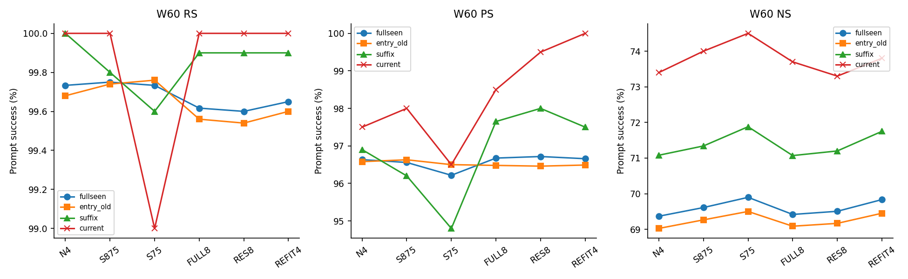
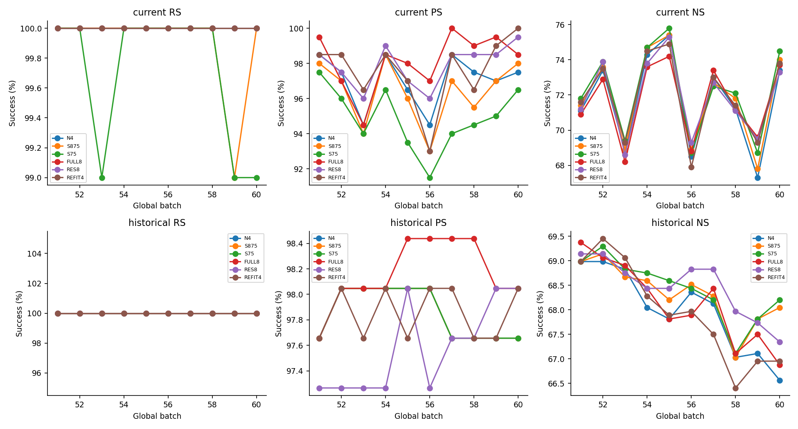
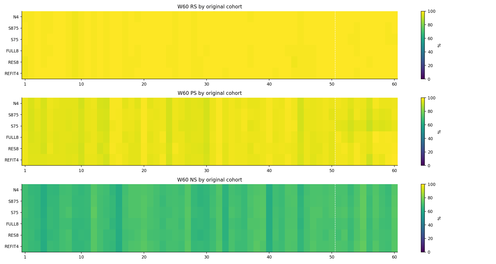
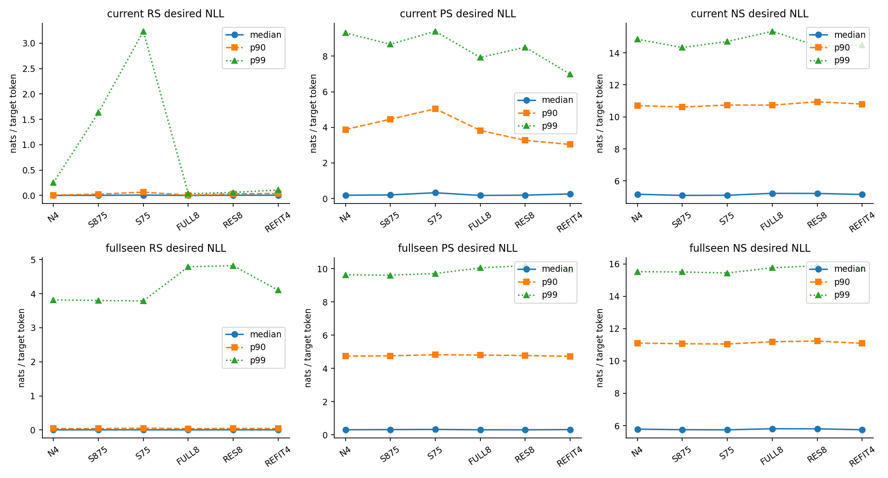
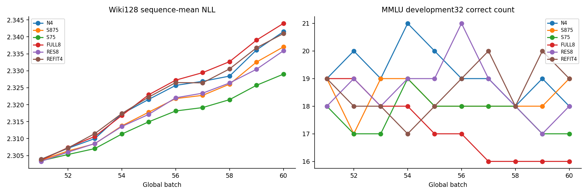
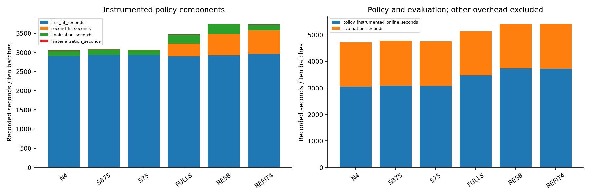
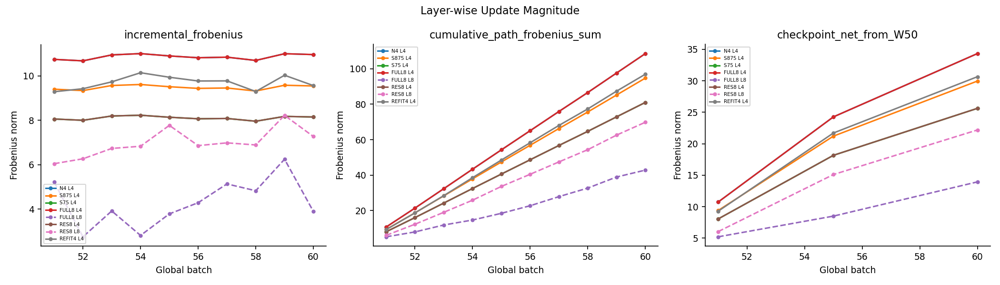

# Low-cost six-arm B100×10 순차 편집 완료 사실 보고

Instruction: ODEEDIT-S06-LOWCOST-SEQ10-COMPLETED-DETAILED-REPORT-SH4-V1. 실행46475_[0–5], B51–B60. 공통 L4 W50/M50에서 각자 새 1,000요청을 처리한 6개 독립 경로다. 기존 5,000+신규 1,000의 **actual W60 전체 seen6000**가 첫 표의 평가 대상이다. 새 6,000 edits 또는 full10k 실험이 아니다. 후보 선택·인과 해석·claim 판정은 GH 소유이며 scientific_promotion=false. 원본 core/report/raw는 변경하지 않았다. 아래 PASS는 적시된 검산만 뜻한다.

| arm | RS | PS | NS | RS Δpp | PS Δpp | NS Δpp |
|---|---|---|---|---|---|---|
| N4 | 5984/6000 (99.733333%) | 11596/12000 (96.633333%) | 41621/60000 (69.368333%) | 0 | 0 | 0 |
| S875 | 5985/6000 (99.750000%) | 11587/12000 (96.558333%) | 41767/60000 (69.611667%) | 0.016666667 | -0.075 | 0.24333333 |
| S75 | 5984/6000 (99.733333%) | 11546/12000 (96.216667%) | 41939/60000 (69.898333%) | 0 | -0.41666667 | 0.53 |
| FULL8 | 5977/6000 (99.616667%) | 11601/12000 (96.675000%) | 41651/60000 (69.418333%) | -0.11666667 | 0.041666667 | 0.05 |
| RES8 | 5976/6000 (99.600000%) | 11606/12000 (96.716667%) | 41704/60000 (69.506667%) | -0.13333333 | 0.083333333 | 0.13833333 |
| REFIT4 | 5979/6000 (99.650000%) | 11599/12000 (96.658333%) | 41901/60000 (69.835000%) | -0.083333333 | 0.025 | 0.46666667 |

분모·부등식·prompt/target/order/hash는 원시 NLL에서 독립 재산출했다. 위의 수치 차이는 같은 평가문항을 서로 다른 최종 모델에서 비교한 산술 차이다. Fullseen에서 잘라낸 old/suffix/current를 별도 독립 시행으로 합산하지 않는다. 원자료 identity와 검산 수준은 metric-reduction-receipt.json 및 state-verification.json 참조.

## 1. 지표 사전과 모집단 경계

| 지표 | 정의 | 분모/단위 | 방향 |
|---|---|---|---|
| RS | rewrite prompt에서 평균 target-new NLL < target-true NLL | prompt 1/request; W60 6000 | 높음 |
| PS | 각 rephrase prompt에서 new NLL < true NLL; 두 prompt 모두 성공은 별도 request-strict | prompt 2/request; W60 12000 | 높음 |
| NS | 각 neighborhood prompt에서 true NLL < new NLL; token preservation이 아님 | prompt 10/request; W60 60000 | 높음 |
| NLL | −Σ log p(target token / prefix와 이전 정답 token) / target token수 | nats/target-token; prompt 평균 또는 request-cluster 평균을 구분 | 원하는 target NLL 낮음; 경쟁 target 단독 방향은 해석 주의 |
| desired margin | R/P=true NLL−new NLL, N=new NLL−true NLL | nats/target-token 차이; 양수 성공, 0 tie 실패 | 높음 |
| strict/token secondary | strict는 모든 target token top1 정답 prompt; token은 정답 token 합/전체 target token 합 | strict prompt, token 실제 token수; canonical 선호와 별개 | 높음 |
| mean/median/p90/p95/p99/max | 평균/50/90/95/99백분위/최대, 선형 quantile; IQR=q75−q25 | PROMPT 또는 REQUEST_CLUSTER_MEAN 명시; 분위수는 CI 아님 | NLL tail은 낮음, margin은 높음 |
| loss/gain | 동일 identity에서 성공→실패 / 실패→성공; net=gained−lost | ALL와 before-success/before-failure 조건부 분모 구분 | loss 낮음/gain 높음 |
| Wiki128 | 고정 sequence별 valid next-token NLL의 단순평균 | 128 sequence, 24999 predicted tokens; token pooled 평균 아님 | 낮음 |
| MMLUdev32 | 고정32문항 BLUE alternative 확률의 유일 최대 선택; tie/underflow invalid | correct/32와 invalid 정수; generation parser/F1 아님 | correct 높음/invalid 낮음 |
| Layer-wise Update Magnitude | 실제 저장 FP32 weight 차이의 Frobenius norm; CPU FP64로 norm 집계 | parameter 좌표 norm; layer share=norm/선택 layer norm 합 | 기술량; 높음/낮음 자체 우월성 없음 |
| path vs net | path=Σ ∥Wb−Wb−1∥F; net=∥W60−W50∥F | 실제 batch increment; subfit path와 같지 않음 | 방향 없음 |
| M4/M8 | native key Gram history; 최종 endpoint keys로 선택 layer당 batch append1 | 행렬 norm/bytes/hash, residual realization ratio 아님 | 방향 없음 |

Current B51…B60는 매번 다른 100개를 쓰므로 곡선 및 online 합계는 누적 retention이 아니다. Historical128은 고정 old 표본일 뿐 old5000 전체가 아니다. B55 suffix500와 B60 suffix1000/fullseen6000만 해당 actual W에서 재평가한 누적 모집단이다. 미저장 중간 fullseen을 보간하지 않았다. B60 Current/suffix/old/Historical은 fullseen의 동일 NLL rows 재사용이다.

## 2. 실행·입력·설정 provenance

실행 source `5e96dcb3745977b1f273e3f5afbee61167248d49`, tree `6e9f8bdb432392fd5f0d7d0937ff7058666944c0`; control tip93c3e4f와 구분. Archive `3dadca9463ab131846bff5227fe1bbbb540dd5b8f238bfad53b15b121ed0eb42`; execution.lock `695a2d985d5abb8fae1cc6f0b1933022895a47a71142aa032a9da3b6be1bbb28`. 분석 시작 main83ca22bd/tree38a6318d. analysis source identity는 최종 manifest에 별도 기록한다.

데이터 `/data/janghj/ODE-edit/local/datasets/counterfact-fixed-10k-v1/counterfact.json`, SHA `3d7f5e31db47b23f3a281bb6fb447c2fb1776e3d4721cdfb5fe5c6f998f10ae1`; ordered root `5b01356928ad2e2e46effad5a2c5621c87746b610992b7b92bf3ace16b6f5729`. B51=[5000,5100), … B60=[5900,6000). 새 unique1000, arm-request6000, 총60batch; order/resample/replacement 변경0.

Llama-3-8B-Instruct revision `8afb486c1db24fe5011ec46dfbe5b5dccdb575c2`, 모든 모델 parameter FP32/eager. Torch2.9.1+cu128/Transformers4.44.2, writer tokenizer add_bos=False·pad=EOS·right; evaluator 원 tokenizer BOS 정책·수동 left padding·MB16을 유지. BLUE311b076a, singleton blue=True/L2=1, physical L4/P asset0→local0 및 L8/asset4→local0. base five-layer blue=False/L2=10과 다른 방법이다. 원 optimizer 최대25 loss 평가/24 Adam update, source-exact clamp/context를 유지했다. Source/member·실제 config 및 공통 prepared 참조는 execution-member-identities.csv에 모두 결속한다.

공통 prepared SHA `4ea9e5a7733725ab513571845691a28e4ed321884d749156e256fb992a55f933`는 W4/W8/M4/M8/context/RNG를 포함한다. M8은 공통 We에서 과거5000 event를 B100 FP32 순서로 한 번 재인코딩한 기존 준비물을 재사용했다. 이번6chain M8 전수 재구성0. FULL8/RES8는 이후 자기 endpoint M8만 append; scalar/refit의 미사용 M8/W8은 고정한다. Historical BLUE 원 chain 재현으로 부르지 않는다.

| arm | alpha | second | append |
|---|---|---|---|
| N4 | 1 | 없음 | M4=1 |
| S875 | 0.875 | 없음 | M4=1 |
| S75 | 0.75 | 없음 | M4=1 |
| FULL8 | 1 | 현재 state L8 fresh z/K/solve | M4/M8 각1 |
| RES8 | 0.75 | 현재 partial L8 fresh z/K/solve | M4/M8 각1 |
| REFIT4 | 0.75 | 현재 partial L4 fresh z/K/solve | M4=1, 두 번 아님 |

매 arm·batch에서 자기 entry로 fresh native D4=WN4−Wentry를 얻으며 이전/다른 arm D4를 재사용하지 않는다. 첫 fit 뒤 임시 W4를 entry로 돌리고 alpha1은 native snapshot exact copy, .875/.75는 FP32(entry+alpha×FP32(native−entry)). 두 fit 사이 current M append0. 평가는 최종 materialized W에서 하고 이후 같은 W/M/RNG로 이어진다. 평가 점수는 controller/fallback/alpha선택에 입력되지 않았다.

## 3. 종료 상태와 state/checkpoint 검산

| job | arm | state | exit_code | start | end | elapsed_seconds | allocated_gpus | mem_MiB |
|---|---|---|---|---|---|---|---|---|
| 46475_0 | N4 | COMPLETED | 0:0 | 2026-09-13T21:06:30 | 2026-09-13T22:33:47 | 5237 | 1 | 60416 |
| 46475_1 | RES8 | COMPLETED | 0:0 | 2026-09-13T21:06:30 | 2026-09-13T22:45:43 | 5953 | 1 | 60416 |
| 46475_2 | S875 | COMPLETED | 0:0 | 2026-09-13T22:33:51 | 2026-09-14T00:02:38 | 5327 | 1 | 60416 |
| 46475_3 | S75 | COMPLETED | 0:0 | 2026-09-13T22:45:58 | 2026-09-14T00:13:53 | 5275 | 1 | 60416 |
| 46475_4 | FULL8 | COMPLETED | 0:0 | 2026-09-14T00:02:39 | 2026-09-14T01:36:55 | 5656 | 1 | 60416 |
| 46475_5 | REFIT4 | COMPLETED | 0:0 | 2026-09-14T00:13:58 | 2026-09-14T01:54:25 | 6027 | 1 | 60416 |

6/6 scheduler COMPLETED0과 scientific record 검산을 구분했다. 당시 agent가 직접 관측한 초기 gate는 N4 B51→B52뿐이다. 이번 recall에서 나머지 저장 receipt를 사후 확인하며 과거 관측으로 소급하지 않는다. 신규 GPU/forward/Slurm 변경0. 입력 재사용 검증·신규 full SHA·CPU tensor 검증을 각각 manifest에 구분했다.

state-verification.json의 scalar 결과:

| field | value |
|---|---|
| status | STORED_STATE_AND_CPU_TENSOR_CHECKS_PASS |
| batches | 60 |
| checkpoints | 18 |
| links | 54 |
| request_z | 9000 |
| fit_solve | 90 |
| history_append | 80 |
| L4_history_append | 60 |
| L8_history_append | 20 |
| full_sha_members | 462 |
| bytes | 45736205134 |
| full_sha_tensor_finite | True |
| GPU_continuation_replay | NOT_TESTED |
| model_level_observer_off_on_parity | NOT_TESTED |
| incremental_exact_replay | NOT_TESTED |
| state_nonmutation | RECORDED_RUNTIME_GUARDS_AND_CPU_BOUND_SNAPSHOTS_NOT_NEW_GPU_TEST |
| capture_freshness | PER_BATCH_DISTINCT_CAPTURE_PATH_AND_SOURCE_COUNTER_BOUND_NOT_NEW_FORWARD |
| nonselected_preservation | RUNTIME_TERMINAL_FULL_PARAMETER_GUARD_NOT_NEW_FULL_MODEL_LOAD |
| intermediate_alpha_reconstruction | SOURCE_AND_RECORDED_MATERIALIZATION_BOUND_NOT_NEW_NATIVE_CANDIDATE_RECOMPUTATION |

metric-reduction-receipt.json의 scalar 결과:

| field | value |
|---|---|
| batch_evaluations | 60 |
| checks | 432 |
| dataset_sha256 | 3d7f5e31db47b23f3a281bb6fb447c2fb1776e3d4721cdfb5fe5c6f998f10ae1 |
| duplicate | 0 |
| imputation | 0 |
| new_forward | 0 |
| nonfinite | 0 |
| overwrite | EXACT_KNOWN_SUBJECT_RELATION_TARGET_ONLY_NOT_SEMANTIC_EQUIVALENCE |
| quantiles | LINEAR_(N-1)*P |
| raw_broadcast | NO_BROADCAST_NOT_REQUIRED |
| reused_subsets | SAME_ENDPOINT_EXACT_ROWS_NOT_ADDITIONAL_EVALUATIONS |
| scope | METRIC_IDENTITY_COUNTS_ONLY; CPU_STATE_AND_GPU_PARITY_SEPARATE |
| status | INDEPENDENT_METRIC_REDUCTION_PASS |

예상 범위는60commits/54 이전commit→nextentry links/18CP(B51/55/60)/90fit·solve/9000request-z/L4append60/L8append20. 실제 체크 목록·member SHA·크기·dtype·shape·finite·선택 tensor hash·history counters는 state-history.csv/checkpoint-inventory.csv/raw-member-inventory에 있다. 증분 journal이 존재해도 GPU continuation replay 또는 bitwise 재실행 성공으로 부르지 않는다. Shared base/P/stats/context와 공통 prepared가 복원 closure의 일부다. 새 full-model load·GPU off/on parity는 NOT_TESTED. Parameter pointer/version 및 선택 W/M/P/context/RNG를 감시했지만 module buffers 전체별 byte parity는 별도 미검증이다.

6개 output directory의462파일/45,736,205,134 bytes를 새 full SHA/size/stable-stat 검산했다. 이는 attempt 전체 control/stdout/source를 뜻하지 않으며 별도 inventory로 결속한다. CP/increments/evaluation/commit은 기존 runtime member SHA와 대조했다. Target-key-readout capture는 기존 commit에 이전 file SHA가 없어 현재 full SHA/finite/cardinality를 봉인한 수준이다. .75/.875 중간 native 후보 전체 weight는 저장되지 않아 alpha 검산은 source와 기록된 materialization에 결속하고 새 native solve 재구성은 하지 않았다. Alpha1 endpoint-copy SHA 및 B51 실제 increment=CP−prepared FP32는 직접 검산했다.

## 4. 최종 모집단별 성능과 고정 패널

### W60 entry_old

| arm | RS | PS | NS |
|---|---|---|---|
| N4 | 4984/5000 (99.68000%) | 9658/10000 (96.58000%) | 34513/50000 (69.02600%) |
| S875 | 4987/5000 (99.74000%) | 9663/10000 (96.63000%) | 34633/50000 (69.26600%) |
| S75 | 4988/5000 (99.76000%) | 9650/10000 (96.50000%) | 34751/50000 (69.50200%) |
| FULL8 | 4978/5000 (99.56000%) | 9648/10000 (96.48000%) | 34544/50000 (69.08800%) |
| RES8 | 4977/5000 (99.54000%) | 9646/10000 (96.46000%) | 34584/50000 (69.16800%) |
| REFIT4 | 4980/5000 (99.60000%) | 9649/10000 (96.49000%) | 34726/50000 (69.45200%) |

### W60 suffix

| arm | RS | PS | NS |
|---|---|---|---|
| N4 | 1000/1000 (100.00000%) | 1938/2000 (96.90000%) | 7108/10000 (71.08000%) |
| S875 | 998/1000 (99.80000%) | 1924/2000 (96.20000%) | 7134/10000 (71.34000%) |
| S75 | 996/1000 (99.60000%) | 1896/2000 (94.80000%) | 7188/10000 (71.88000%) |
| FULL8 | 999/1000 (99.90000%) | 1953/2000 (97.65000%) | 7107/10000 (71.07000%) |
| RES8 | 999/1000 (99.90000%) | 1960/2000 (98.00000%) | 7120/10000 (71.20000%) |
| REFIT4 | 999/1000 (99.90000%) | 1950/2000 (97.50000%) | 7175/10000 (71.75000%) |

### W60 current

| arm | RS | PS | NS |
|---|---|---|---|
| N4 | 100/100 (100.00000%) | 195/200 (97.50000%) | 734/1000 (73.40000%) |
| S875 | 100/100 (100.00000%) | 196/200 (98.00000%) | 740/1000 (74.00000%) |
| S75 | 99/100 (99.00000%) | 193/200 (96.50000%) | 745/1000 (74.50000%) |
| FULL8 | 100/100 (100.00000%) | 197/200 (98.50000%) | 737/1000 (73.70000%) |
| RES8 | 100/100 (100.00000%) | 199/200 (99.50000%) | 733/1000 (73.30000%) |
| REFIT4 | 100/100 (100.00000%) | 200/200 (100.00000%) | 738/1000 (73.80000%) |

### W60 historical

| arm | RS | PS | NS |
|---|---|---|---|
| N4 | 128/128 (100.00000%) | 250/256 (97.65625%) | 852/1280 (66.56250%) |
| S875 | 128/128 (100.00000%) | 250/256 (97.65625%) | 871/1280 (68.04688%) |
| S75 | 128/128 (100.00000%) | 250/256 (97.65625%) | 873/1280 (68.20312%) |
| FULL8 | 128/128 (100.00000%) | 251/256 (98.04688%) | 856/1280 (66.87500%) |
| RES8 | 128/128 (100.00000%) | 251/256 (98.04688%) | 862/1280 (67.34375%) |
| REFIT4 | 128/128 (100.00000%) | 251/256 (98.04688%) | 857/1280 (66.95312%) |

### W60 general

| arm | wiki_nll | wiki_sequences | wiki_tokens | mmlu_correct | mmlu_denominator | mmlu_invalid |
|---|---|---|---|---|---|---|
| N4 | 2.3415367626585066 | 128 | 24999 | 18 | 32 | 0 |
| RES8 | 2.3358981595374644 | 128 | 24999 | 18 | 32 | 0 |
| S875 | 2.337035255972296 | 128 | 24999 | 19 | 32 | 0 |
| S75 | 2.329002153594047 | 128 | 24999 | 17 | 32 | 0 |
| FULL8 | 2.343966987915337 | 128 | 24999 | 16 | 32 | 0 |
| REFIT4 | 2.340970307122916 | 128 | 24999 | 19 | 32 | 0 |

전 arm Wiki128/24999 token, MMLU32이다. 고정32 개발 반복·known corpus 한계가 있으며 전체 MMLU 또는 general 능력 동등성으로 읽지 않는다. Audit128/N1280 및 MMLU68/FutureN 별도 성능조회·평가0.

## 5. 모든60batch current·historical·general 곡선

### N4

| B | current RS | current PS | current NS | historical RS | historical PS | historical NS | Wiki | MMLU |
|---|---|---|---|---|---|---|---|---|
| 51 | 100/100 | 197/200 | 711/1000 | 128/128 | 250/256 | 883/1280 | 2.303873211145401 | 19/32 |
| 52 | 100/100 | 195/200 | 734/1000 | 128/128 | 251/256 | 883/1280 | 2.3071295977570117 | 20/32 |
| 53 | 100/100 | 189/200 | 688/1000 | 128/128 | 251/256 | 881/1280 | 2.3100108080543578 | 19/32 |
| 54 | 100/100 | 197/200 | 743/1000 | 128/128 | 251/256 | 871/1280 | 2.3172869994305074 | 21/32 |
| 55 | 100/100 | 193/200 | 754/1000 | 128/128 | 251/256 | 868/1280 | 2.3215633393265307 | 20/32 |
| 56 | 100/100 | 189/200 | 685/1000 | 128/128 | 251/256 | 875/1280 | 2.3256866736337543 | 19/32 |
| 57 | 100/100 | 197/200 | 730/1000 | 128/128 | 250/256 | 872/1280 | 2.326885655056685 | 19/32 |
| 58 | 100/100 | 195/200 | 712/1000 | 128/128 | 250/256 | 858/1280 | 2.3284293320029974 | 18/32 |
| 59 | 100/100 | 194/200 | 673/1000 | 128/128 | 250/256 | 859/1280 | 2.3361343019641936 | 19/32 |
| 60 | 100/100 | 195/200 | 734/1000 | 128/128 | 250/256 | 852/1280 | 2.3415367626585066 | 18/32 |

### S875

| B | current RS | current PS | current NS | historical RS | historical PS | historical NS | Wiki | MMLU |
|---|---|---|---|---|---|---|---|---|
| 51 | 100/100 | 196/200 | 714/1000 | 128/128 | 250/256 | 883/1280 | 2.303606682922691 | 19/32 |
| 52 | 100/100 | 194/200 | 736/1000 | 128/128 | 251/256 | 885/1280 | 2.306341100949794 | 17/32 |
| 53 | 100/100 | 188/200 | 689/1000 | 128/128 | 251/256 | 879/1280 | 2.308482094667852 | 19/32 |
| 54 | 100/100 | 197/200 | 747/1000 | 128/128 | 251/256 | 878/1280 | 2.313746909145266 | 19/32 |
| 55 | 100/100 | 192/200 | 754/1000 | 128/128 | 251/256 | 873/1280 | 2.3178007509559393 | 18/32 |
| 56 | 100/100 | 186/200 | 689/1000 | 128/128 | 251/256 | 877/1280 | 2.3217946481890976 | 18/32 |
| 57 | 100/100 | 194/200 | 727/1000 | 128/128 | 250/256 | 874/1280 | 2.322741497308016 | 18/32 |
| 58 | 100/100 | 191/200 | 718/1000 | 128/128 | 250/256 | 858/1280 | 2.326045776717365 | 18/32 |
| 59 | 99/100 | 194/200 | 678/1000 | 128/128 | 250/256 | 868/1280 | 2.332568990532309 | 18/32 |
| 60 | 100/100 | 196/200 | 740/1000 | 128/128 | 250/256 | 871/1280 | 2.337035255972296 | 19/32 |

### S75

| B | current RS | current PS | current NS | historical RS | historical PS | historical NS | Wiki | MMLU |
|---|---|---|---|---|---|---|---|---|
| 51 | 100/100 | 195/200 | 718/1000 | 128/128 | 250/256 | 883/1280 | 2.3034320208244026 | 18/32 |
| 52 | 100/100 | 192/200 | 739/1000 | 128/128 | 251/256 | 887/1280 | 2.3053002478554845 | 17/32 |
| 53 | 99/100 | 188/200 | 694/1000 | 128/128 | 251/256 | 881/1280 | 2.307051295414567 | 17/32 |
| 54 | 100/100 | 193/200 | 747/1000 | 128/128 | 251/256 | 880/1280 | 2.3113376912660897 | 19/32 |
| 55 | 100/100 | 187/200 | 758/1000 | 128/128 | 251/256 | 878/1280 | 2.314948651473969 | 18/32 |
| 56 | 100/100 | 183/200 | 687/1000 | 128/128 | 251/256 | 876/1280 | 2.3181435321457684 | 18/32 |
| 57 | 100/100 | 188/200 | 725/1000 | 128/128 | 250/256 | 873/1280 | 2.3191393772140145 | 18/32 |
| 58 | 100/100 | 189/200 | 721/1000 | 128/128 | 250/256 | 859/1280 | 2.3214782900176942 | 18/32 |
| 59 | 99/100 | 190/200 | 687/1000 | 128/128 | 250/256 | 868/1280 | 2.325715981423855 | 17/32 |
| 60 | 99/100 | 193/200 | 745/1000 | 128/128 | 250/256 | 873/1280 | 2.329002153594047 | 17/32 |

### FULL8

| B | current RS | current PS | current NS | historical RS | historical PS | historical NS | Wiki | MMLU |
|---|---|---|---|---|---|---|---|---|
| 51 | 100/100 | 199/200 | 709/1000 | 128/128 | 250/256 | 888/1280 | 2.3036066782660782 | 19/32 |
| 52 | 100/100 | 194/200 | 729/1000 | 128/128 | 251/256 | 884/1280 | 2.3073418103158474 | 19/32 |
| 53 | 100/100 | 189/200 | 682/1000 | 128/128 | 251/256 | 882/1280 | 2.3106437656097114 | 18/32 |
| 54 | 100/100 | 197/200 | 736/1000 | 128/128 | 251/256 | 876/1280 | 2.3168289815075696 | 18/32 |
| 55 | 100/100 | 196/200 | 742/1000 | 128/128 | 252/256 | 868/1280 | 2.322927945293486 | 17/32 |
| 56 | 100/100 | 194/200 | 688/1000 | 128/128 | 252/256 | 869/1280 | 2.32723044231534 | 17/32 |
| 57 | 100/100 | 200/200 | 734/1000 | 128/128 | 252/256 | 876/1280 | 2.3294461793266237 | 16/32 |
| 58 | 100/100 | 198/200 | 712/1000 | 128/128 | 252/256 | 859/1280 | 2.332685806322843 | 16/32 |
| 59 | 100/100 | 199/200 | 696/1000 | 128/128 | 251/256 | 864/1280 | 2.3390364325605333 | 16/32 |
| 60 | 100/100 | 197/200 | 737/1000 | 128/128 | 251/256 | 856/1280 | 2.343966987915337 | 16/32 |

### RES8

| B | current RS | current PS | current NS | historical RS | historical PS | historical NS | Wiki | MMLU |
|---|---|---|---|---|---|---|---|---|
| 51 | 100/100 | 197/200 | 712/1000 | 128/128 | 249/256 | 885/1280 | 2.303268417250365 | 18/32 |
| 52 | 100/100 | 195/200 | 739/1000 | 128/128 | 249/256 | 885/1280 | 2.305996128823608 | 19/32 |
| 53 | 100/100 | 192/200 | 686/1000 | 128/128 | 249/256 | 880/1280 | 2.308546398766339 | 18/32 |
| 54 | 100/100 | 198/200 | 738/1000 | 128/128 | 249/256 | 876/1280 | 2.3135496475733817 | 19/32 |
| 55 | 100/100 | 194/200 | 753/1000 | 128/128 | 251/256 | 876/1280 | 2.3171439697034657 | 19/32 |
| 56 | 100/100 | 192/200 | 693/1000 | 128/128 | 249/256 | 881/1280 | 2.3220302811823785 | 21/32 |
| 57 | 100/100 | 197/200 | 727/1000 | 128/128 | 250/256 | 881/1280 | 2.32338644657284 | 19/32 |
| 58 | 100/100 | 197/200 | 711/1000 | 128/128 | 250/256 | 870/1280 | 2.3263992718420923 | 18/32 |
| 59 | 100/100 | 197/200 | 695/1000 | 128/128 | 251/256 | 867/1280 | 2.33044167002663 | 17/32 |
| 60 | 100/100 | 199/200 | 733/1000 | 128/128 | 251/256 | 862/1280 | 2.3358981595374644 | 18/32 |

### REFIT4

| B | current RS | current PS | current NS | historical RS | historical PS | historical NS | Wiki | MMLU |
|---|---|---|---|---|---|---|---|---|
| 51 | 100/100 | 197/200 | 716/1000 | 128/128 | 250/256 | 883/1280 | 2.303868323098868 | 19/32 |
| 52 | 100/100 | 197/200 | 735/1000 | 128/128 | 251/256 | 889/1280 | 2.3072265149094164 | 18/32 |
| 53 | 100/100 | 193/200 | 693/1000 | 128/128 | 250/256 | 884/1280 | 2.3114821729250252 | 18/32 |
| 54 | 100/100 | 197/200 | 745/1000 | 128/128 | 251/256 | 874/1280 | 2.3173896190710366 | 17/32 |
| 55 | 100/100 | 194/200 | 749/1000 | 128/128 | 250/256 | 869/1280 | 2.3222440844401717 | 18/32 |
| 56 | 100/100 | 186/200 | 679/1000 | 128/128 | 251/256 | 870/1280 | 2.326514506712556 | 19/32 |
| 57 | 100/100 | 197/200 | 730/1000 | 128/128 | 251/256 | 864/1280 | 2.3264306229539216 | 20/32 |
| 58 | 100/100 | 193/200 | 714/1000 | 128/128 | 250/256 | 850/1280 | 2.330549319740385 | 18/32 |
| 59 | 100/100 | 198/200 | 693/1000 | 128/128 | 250/256 | 857/1280 | 2.3367692534811795 | 20/32 |
| 60 | 100/100 | 200/200 | 738/1000 | 128/128 | 251/256 | 857/1280 | 2.340970307122916 | 19/32 |

## 6. Suffix 누적 retention·문항별 loss/recovery

| after | batch | metric | prompt_denominator | before_numerator | after_numerator | lost | gained | retained | failed_both | conditional_loss_rate |
|---|---|---|---|---|---|---|---|---|---|---|
| N4 | 55 | RS | 500 | 500 | 500 | 0 | 0 | 500 | 0 | 0.0 |
| N4 | 55 | PS | 1000 | 971 | 971 | 1 | 1 | 970 | 28 | 0.0010298661174047373 |
| N4 | 55 | NS | 5000 | 3630 | 3616 | 70 | 56 | 3560 | 1314 | 0.01928374655647383 |
| N4 | 60 | RS | 1000 | 1000 | 1000 | 0 | 0 | 1000 | 0 | 0.0 |
| N4 | 60 | PS | 2000 | 1941 | 1938 | 8 | 5 | 1933 | 54 | 0.004121586810922205 |
| N4 | 60 | NS | 10000 | 7164 | 7108 | 249 | 193 | 6915 | 2643 | 0.0347571189279732 |
| RES8 | 55 | RS | 500 | 500 | 500 | 0 | 0 | 500 | 0 | 0.0 |
| RES8 | 55 | PS | 1000 | 976 | 979 | 0 | 3 | 976 | 21 | 0.0 |
| RES8 | 55 | NS | 5000 | 3628 | 3611 | 70 | 53 | 3558 | 1319 | 0.019294377067254686 |
| RES8 | 60 | RS | 1000 | 1000 | 999 | 1 | 0 | 999 | 0 | 0.001 |
| RES8 | 60 | PS | 2000 | 1958 | 1960 | 5 | 7 | 1953 | 35 | 0.002553626149131767 |
| RES8 | 60 | NS | 10000 | 7187 | 7120 | 229 | 162 | 6958 | 2651 | 0.031863086127730623 |
| S875 | 55 | RS | 500 | 500 | 500 | 0 | 0 | 500 | 0 | 0.0 |
| S875 | 55 | PS | 1000 | 967 | 966 | 3 | 2 | 964 | 31 | 0.0031023784901758012 |
| S875 | 55 | NS | 5000 | 3640 | 3632 | 66 | 58 | 3574 | 1302 | 0.018131868131868133 |
| S875 | 60 | RS | 1000 | 999 | 998 | 1 | 0 | 998 | 1 | 0.001001001001001001 |
| S875 | 60 | PS | 2000 | 1928 | 1924 | 9 | 5 | 1919 | 67 | 0.00466804979253112 |
| S875 | 60 | NS | 10000 | 7192 | 7134 | 227 | 169 | 6965 | 2639 | 0.03156284760845384 |
| S75 | 55 | RS | 500 | 499 | 499 | 0 | 0 | 499 | 1 | 0.0 |
| S75 | 55 | PS | 1000 | 955 | 951 | 4 | 0 | 951 | 45 | 0.004188481675392671 |
| S75 | 55 | NS | 5000 | 3656 | 3644 | 63 | 51 | 3593 | 1293 | 0.01723194748358862 |
| S75 | 60 | RS | 1000 | 997 | 996 | 1 | 0 | 996 | 3 | 0.0010030090270812437 |
| S75 | 60 | PS | 2000 | 1898 | 1896 | 12 | 10 | 1886 | 92 | 0.006322444678609062 |
| S75 | 60 | NS | 10000 | 7221 | 7188 | 196 | 163 | 7025 | 2616 | 0.02714305497853483 |
| FULL8 | 55 | RS | 500 | 500 | 500 | 0 | 0 | 500 | 0 | 0.0 |
| FULL8 | 55 | PS | 1000 | 975 | 974 | 1 | 0 | 974 | 25 | 0.0010256410256410256 |
| FULL8 | 55 | NS | 5000 | 3598 | 3590 | 78 | 70 | 3520 | 1332 | 0.0216787103946637 |
| FULL8 | 60 | RS | 1000 | 1000 | 999 | 1 | 0 | 999 | 0 | 0.001 |
| FULL8 | 60 | PS | 2000 | 1963 | 1953 | 11 | 1 | 1952 | 36 | 0.0056036678553234845 |
| FULL8 | 60 | NS | 10000 | 7165 | 7107 | 263 | 205 | 6902 | 2630 | 0.03670621074668528 |
| REFIT4 | 55 | RS | 500 | 500 | 500 | 0 | 0 | 500 | 0 | 0.0 |
| REFIT4 | 55 | PS | 1000 | 978 | 978 | 0 | 0 | 978 | 22 | 0.0 |
| REFIT4 | 55 | NS | 5000 | 3638 | 3626 | 75 | 63 | 3563 | 1299 | 0.02061572292468389 |
| REFIT4 | 60 | RS | 1000 | 1000 | 999 | 1 | 0 | 999 | 0 | 0.001 |
| REFIT4 | 60 | PS | 2000 | 1952 | 1950 | 5 | 3 | 1947 | 45 | 0.0025614754098360654 |
| REFIT4 | 60 | NS | 10000 | 7192 | 7175 | 189 | 172 | 7003 | 2636 | 0.02627919911012236 |

before는 각 문항의 자기 at-write W에서의 성공이며 한 모델 상태가 아니다. after는 W55/W60 단일 실제 상태다. lost 조건부 분모는 before-success, gained 조건부 분모는 before-failure. 매 시점 모든 old 문항을 평가하지 않았으므로 정확한 최초 forgetting/recovery 시점은 NOT_RECORDED. At-write pooling은 batchmetrics.csv의 ONLINE_AT_WRITE_1000_DIFFERENT_STATES 행으로 별도 제공한다. Case별 subject/relation/target 최종 event 비교로 ACTIVE_TARGET/SUPERSEDED/UNKNOWN을 나누고 원 ALL분모는 보존한다. 의도 추정이나 성능 기반 제외는 하지 않았다.

60개 원 cohort의 W60 RS/PS/NS와 strict/token은 cohort-final.csv(1080rows), old/new/early/middle/recent 및 active 보조집계는 finalpopulationmetrics.csv에 있다. 전체 10×60 checkpoint-cohort matrix는 평가되지 않았으므로 존재한다고 주장하지 않는다.

## 7. 고정 대비의 양방향 전이와 NLL 손실

| before | after | metric | prompt_denominator | lost | gained | delta_numerator | delta_pp | new_nll_delta_mean | new_nll_delta_p95 | true_nll_delta_mean | desired_margin_delta_mean |
|---|---|---|---|---|---|---|---|---|---|---|---|
| N4 | RES8 | RS | 6000 | 11 | 3 | -8 | -0.13333333333333333 | 0.03794339576585435 | 0.03178613306954504 | 0.029023438572262725 | -0.008919957193591623 |
| N4 | RES8 | PS | 12000 | 72 | 82 | 10 | 0.08333333333333333 | 0.01813896294380417 | 0.729719007015227 | 0.04574644471790331 | 0.027607481774099142 |
| N4 | RES8 | NS | 60000 | 1472 | 1555 | 83 | 0.13833333333333334 | 0.12662251124362597 | 1.3822000026702876 | 0.06022090793385869 | 0.0664016033097673 |
| N4 | S875 | RS | 6000 | 2 | 3 | 1 | 0.016666666666666666 | -0.0017403276181791323 | 0.009254382271319639 | -0.05235398068837822 | -0.050613653070199084 |
| N4 | S875 | PS | 12000 | 41 | 32 | -9 | -0.075 | 0.007784512657259256 | 0.31672540009021727 | -0.03286655459180474 | -0.040651067249064 |
| N4 | S875 | NS | 60000 | 574 | 720 | 146 | 0.24333333333333335 | 0.011729416610555382 | 0.5278366327285765 | -0.015419471991079627 | 0.02714888860163501 |
| N4 | S75 | RS | 6000 | 4 | 4 | 0 | 0.0 | 0.005115008417441307 | 0.02495403811335568 | -0.18026244209644696 | -0.18537745051388826 |
| N4 | S75 | PS | 12000 | 79 | 29 | -50 | -0.4166666666666667 | 0.03528880019363654 | 0.5404255270957941 | -0.09276276309710617 | -0.12805156329074271 |
| N4 | S75 | NS | 60000 | 742 | 1060 | 318 | 0.53 | 0.012369955474563297 | 0.7014628708362578 | -0.05021743360624338 | 0.06258738908080667 |
| N4 | FULL8 | RS | 6000 | 8 | 1 | -7 | -0.11666666666666667 | 0.036792494230497144 | 0.012527274712920228 | 0.12024765452370048 | 0.08345516029320334 |
| N4 | FULL8 | PS | 12000 | 49 | 54 | 5 | 0.041666666666666664 | 0.02341923917507241 | 0.5084476709365842 | 0.06534916919252524 | 0.041929930017452835 |
| N4 | FULL8 | NS | 60000 | 1067 | 1097 | 30 | 0.05 | 0.052757628495541754 | 0.9007770061492917 | 0.05173177178857925 | 0.0010258567069625012 |
| N4 | REFIT4 | RS | 6000 | 10 | 5 | -5 | -0.08333333333333333 | 0.021765234623726124 | 0.02480618944391611 | -0.04746134561765939 | -0.06922658024138552 |
| N4 | REFIT4 | PS | 12000 | 71 | 74 | 3 | 0.025 | 0.010024294273438499 | 0.6417780280113218 | -0.056607351195891775 | -0.06663164546933027 |
| N4 | REFIT4 | NS | 60000 | 1154 | 1434 | 280 | 0.4666666666666667 | 0.04593897442658878 | 1.0850028038024888 | -0.014874855577441243 | 0.060813830004030026 |
| S75 | RES8 | RS | 6000 | 12 | 4 | -8 | -0.13333333333333333 | 0.03282838734841304 | 0.025068391021341094 | 0.20928588066870968 | 0.17645749332029664 |
| S75 | RES8 | PS | 12000 | 60 | 120 | 60 | 0.5 | -0.017149837249832368 | 0.5850012063980099 | 0.13850920781500947 | 0.15565904506484185 |
| S75 | RES8 | NS | 60000 | 1409 | 1174 | -235 | -0.39166666666666666 | 0.11425255576906268 | 1.2316440105438218 | 0.11043834154010207 | 0.003814214228960615 |
| REFIT4 | RES8 | RS | 6000 | 6 | 3 | -3 | -0.05 | 0.016178161142128222 | 0.02503652591258288 | 0.07648478418992212 | 0.06030662304779389 |
| REFIT4 | RES8 | PS | 12000 | 63 | 70 | 7 | 0.058333333333333334 | 0.00811466867036567 | 0.6967394250212237 | 0.10235379591379509 | 0.09423912724342942 |
| REFIT4 | RES8 | NS | 60000 | 1629 | 1432 | -197 | -0.3283333333333333 | 0.0806835368170372 | 1.375091028213501 | 0.07509576351129993 | 0.0055877733057372704 |
| FULL8 | RES8 | RS | 6000 | 6 | 5 | -1 | -0.016666666666666666 | 0.0011509015353572067 | 0.026603987297858126 | -0.09122421595143775 | -0.09237511748679496 |
| FULL8 | RES8 | PS | 12000 | 66 | 71 | 5 | 0.041666666666666664 | -0.005280276231268241 | 0.6579437851905816 | -0.019602724474621937 | -0.014322448243353695 |
| FULL8 | RES8 | NS | 60000 | 1383 | 1436 | 53 | 0.08833333333333333 | 0.07386488274808423 | 1.2771338939666739 | 0.008489136145279432 | 0.06537574660280479 |

최종 NS에서 N4→RES8 lost1472/gained1555, S875574/720, S75742/1060, FULL81067/1097, REFIT41154/1434다. 따라서 총점의 증가가 모든 기존 성공 문항 보존을 뜻하지 않는다. S75는 N4 대비 fullseen NS +318, PS −50; RES8은 NS +83, PS +10, RS −8이다. 원인·우월성 선택은 이 표만으로 확정하지 않는다. RES8−S75는 추가 fitting, RES8−REFIT4는 같은 추가 target-call 예산의 layer 차이, RES8−FULL8은 첫 write 축소 차이를 포함하며 각 trajectory의 W/z가 달라진다.

## 8. NLL와 signed margin 분포 및 secondary accuracy

### W60 fullseen PROMPT 분포

| arm | metric | field | n | mean | median | p90 | p95 | p99 | max |
|---|---|---|---|---|---|---|---|---|---|
| N4 | RS | new_nll | 6000 | 0.11292289705360721 | 0.0030875771772116423 | 0.04068063534796238 | 0.19168670997023593 | 3.8169206690788324 | 13.452467918395996 |
| N4 | RS | true_nll | 6000 | 13.308732119401917 | 13.093970775604248 | 18.79238033294678 | 20.378165149688723 | 23.40176643371584 | 27.846921920776367 |
| N4 | RS | desired_margin | 6000 | 13.195809222348311 | 13.061018160311505 | 18.790712202689612 | 20.36437421906303 | 23.39964930877266 | 27.845882955705747 |
| N4 | PS | new_nll | 12000 | 1.4457917253949866 | 0.3034280389547348 | 4.738873147964478 | 6.548985290527334 | 9.637249708175661 | 20.760717391967773 |
| N4 | PS | true_nll | 12000 | 9.876687516976148 | 9.713360786437988 | 14.830547523498536 | 16.406126689910888 | 19.59146158218384 | 25.72938346862793 |
| N4 | PS | desired_margin | 12000 | 8.430895791581161 | 8.406476717442274 | 14.311724657937885 | 16.06449530280661 | 19.45869203250158 | 25.715954281389713 |
| N4 | NS | new_nll | 60000 | 8.232115713608353 | 8.220359802246094 | 13.218298435211182 | 14.654604768753051 | 17.564633083343512 | 26.826120376586914 |
| N4 | NS | true_nll | 60000 | 6.09268642317638 | 5.7819952964782715 | 11.107137203216551 | 12.479630851745602 | 15.528373460769656 | 27.160511016845703 |
| N4 | NS | desired_margin | 60000 | 2.139429290431974 | 2.206989288330078 | 7.947459405660627 | 9.58194615244865 | 12.824000992774964 | 20.641544997692108 |
| RES8 | RS | new_nll | 6000 | 0.15086629281946157 | 0.0033116282429546118 | 0.04259826242923741 | 0.16478989273309805 | 4.822354197502147 | 22.797679901123047 |
| RES8 | RS | true_nll | 6000 | 13.33775555797418 | 13.097969055175781 | 18.864704132080078 | 20.490549564361576 | 23.886101188659687 | 31.45125961303711 |
| RES8 | RS | desired_margin | 6000 | 13.186889265154718 | 13.05675432368298 | 18.838915140135217 | 20.486421844959114 | 23.88533404408636 | 31.45123565225731 |
| RES8 | PS | new_nll | 12000 | 1.4639306883387908 | 0.2985755354166031 | 4.773704195022586 | 6.639737558364868 | 10.18233602523804 | 26.035995483398438 |
| RES8 | PS | true_nll | 12000 | 9.92243396169405 | 9.78126049041748 | 14.936343765258789 | 16.542691516876218 | 19.45537706375123 | 25.26230812072754 |
| RES8 | PS | desired_margin | 12000 | 8.45850327335526 | 8.4239750111592 | 14.441283123590983 | 16.199962450983 | 19.32891266770661 | 25.261932443623664 |
| RES8 | NS | new_nll | 60000 | 8.35873822485198 | 8.352934837341309 | 13.42029981613159 | 14.880043840408325 | 17.79566631317139 | 28.776199340820312 |
| RES8 | NS | true_nll | 60000 | 6.152907331110239 | 5.804879188537598 | 11.23361587524414 | 12.717599821090694 | 15.894730005264291 | 27.126916885375977 |
| RES8 | NS | desired_margin | 60000 | 2.2058308937417412 | 2.2843332290649414 | 8.122629046440125 | 9.83765233531594 | 13.18025781363251 | 22.58165231347084 |
| S875 | RS | new_nll | 6000 | 0.11118256943542808 | 0.0032533477060496807 | 0.03878811486065395 | 0.19092084988951727 | 3.8004854631424076 | 13.66426944732666 |
| S875 | RS | true_nll | 6000 | 13.256378138713538 | 13.010542869567871 | 18.73114395141602 | 20.29102478027344 | 23.563651676177987 | 27.678375244140625 |
| S875 | RS | desired_margin | 6000 | 13.14519556927811 | 12.972632160177454 | 18.7255726672709 | 20.28955330337049 | 23.561674313374397 | 27.677158738370053 |
| S875 | PS | new_nll | 12000 | 1.453576238052246 | 0.31228823959827423 | 4.755543565750122 | 6.49701561927795 | 9.609704303741456 | 21.389978408813477 |
| S875 | PS | true_nll | 12000 | 9.843820962384344 | 9.699265956878662 | 14.782808303833008 | 16.383659172058103 | 19.450292930603037 | 25.44796371459961 |
| S875 | PS | desired_margin | 12000 | 8.390244724332097 | 8.376126408576965 | 14.232396906893701 | 16.04234420036664 | 19.387472812449563 | 25.434015844017267 |
| S875 | NS | new_nll | 60000 | 8.24384513021891 | 8.236604690551758 | 13.206606864929197 | 14.648987054824826 | 17.525184688568114 | 26.724225997924805 |
| S875 | NS | true_nll | 60000 | 6.0772669511853 | 5.751024961471558 | 11.068477630615234 | 12.474211215972899 | 15.506112318038944 | 26.84359359741211 |
| S875 | NS | desired_margin | 60000 | 2.166578179033609 | 2.2215328216552734 | 7.966297411918639 | 9.63859973698854 | 12.86305883852765 | 20.31226921081543 |
| S75 | RS | new_nll | 6000 | 0.11803790547104852 | 0.0035405588569119573 | 0.04988618753850501 | 0.21698463782668173 | 3.787172164916994 | 13.785027503967285 |
| S75 | RS | true_nll | 6000 | 13.12846967730547 | 12.886302947998047 | 18.57289161682129 | 20.16209945678711 | 23.458710098266604 | 27.831937789916992 |
| S75 | RS | desired_margin | 6000 | 13.010431771834423 | 12.857374355196953 | 18.56797566539608 | 20.15631377687678 | 23.45609709114186 | 27.831054243491963 |
| S75 | PS | new_nll | 12000 | 1.4810805255886232 | 0.3220868557691574 | 4.821748685836792 | 6.614271211624145 | 9.713323554992678 | 21.502588272094727 |
| S75 | PS | true_nll | 12000 | 9.783924753879042 | 9.626205444335938 | 14.712238597869874 | 16.348258876800532 | 19.4037321472168 | 25.291624069213867 |
| S75 | PS | desired_margin | 12000 | 8.30284422829042 | 8.2816345525207 | 14.157687293132769 | 15.9943036971963 | 19.308208243891134 | 25.276761662214994 |
| S75 | NS | new_nll | 60000 | 8.244485669082916 | 8.238179683685303 | 13.219626426696777 | 14.645484256744385 | 17.507986927032476 | 26.7579402923584 |
| S75 | NS | true_nll | 60000 | 6.0424689895701365 | 5.74219012260437 | 11.050148391723631 | 12.41989607810974 | 15.447004947662354 | 26.56683921813965 |
| S75 | NS | desired_margin | 60000 | 2.2020166795127807 | 2.2549551725387573 | 8.012074774503708 | 9.6879373550415 | 12.98579631090166 | 20.45080006122589 |
| FULL8 | RS | new_nll | 6000 | 0.14971539128410435 | 0.00297651335131377 | 0.0380020745098591 | 0.15616464540362365 | 4.790382485389711 | 22.183265686035156 |
| FULL8 | RS | true_nll | 6000 | 13.428979773925617 | 13.219631671905518 | 18.91135520935059 | 20.580099582672123 | 23.574877643585207 | 30.81827735900879 |
| FULL8 | RS | desired_margin | 6000 | 13.279264382641513 | 13.164239061065018 | 18.890037438482977 | 20.55273343207664 | 23.56348214994243 | 30.8182585241193 |
| FULL8 | PS | new_nll | 12000 | 1.469210964570059 | 0.30149058997631073 | 4.798821353912354 | 6.5710396528244015 | 10.050024766922013 | 22.330968856811523 |
| FULL8 | PS | true_nll | 12000 | 9.942036686168674 | 9.791950225830078 | 14.875080490112305 | 16.47907590866089 | 19.56562856674195 | 28.981536865234375 |
| FULL8 | PS | desired_margin | 12000 | 8.472825721598614 | 8.459934383630753 | 14.343324053142714 | 16.15795165784657 | 19.459320000956073 | 28.981193243904272 |
| FULL8 | NS | new_nll | 60000 | 8.284873342103895 | 8.272302150726318 | 13.290137672424315 | 14.776113414764398 | 17.74408687591553 | 30.352069854736328 |
| FULL8 | NS | true_nll | 60000 | 6.144418194964959 | 5.809735536575317 | 11.193097782135009 | 12.61803956031799 | 15.7642240524292 | 26.762561798095703 |
| FULL8 | NS | desired_margin | 60000 | 2.1404551471389364 | 2.2018070220947266 | 7.974331235885619 | 9.677452301979061 | 12.916563870906833 | 21.343863308429718 |
| REFIT4 | RS | new_nll | 6000 | 0.13468813167733334 | 0.003364558913744986 | 0.04090426899492741 | 0.14499965980649032 | 4.103543601036082 | 20.593870162963867 |
| REFIT4 | RS | true_nll | 6000 | 13.261270773784258 | 12.991758823394775 | 18.748751640319824 | 20.333065509796143 | 23.64651082992554 | 29.684160232543945 |
| REFIT4 | RS | desired_margin | 6000 | 13.126582642106923 | 12.948532663780497 | 18.738763766529157 | 20.328770253038964 | 23.64568497334549 | 29.684074286342366 |
| REFIT4 | PS | new_nll | 12000 | 1.455816019668425 | 0.31325696408748627 | 4.7238698482513435 | 6.519022035598754 | 9.923684349060059 | 21.92864990234375 |
| REFIT4 | PS | true_nll | 12000 | 9.820080165780256 | 9.611979484558105 | 14.777110195159914 | 16.39449472427368 | 19.44704034805298 | 28.073810577392578 |
| REFIT4 | PS | desired_margin | 12000 | 8.36426414611183 | 8.318991377018392 | 14.309581366926432 | 16.093781163054516 | 19.36493142482825 | 28.073506639892003 |
| REFIT4 | NS | new_nll | 60000 | 8.278054688034942 | 8.24735689163208 | 13.284970474243163 | 14.79181623458862 | 17.707297000885013 | 27.49859046936035 |
| REFIT4 | NS | true_nll | 60000 | 6.077811567598938 | 5.7458202838897705 | 11.091070556640622 | 12.54354109764099 | 15.736872959136964 | 29.896602630615234 |
| REFIT4 | NS | desired_margin | 60000 | 2.200243120436004 | 2.261715888977051 | 8.013610744476317 | 9.715583539009087 | 13.003945133686067 | 21.507947206497192 |

### W60 entry_old PROMPT 분포

| arm | metric | field | n | mean | median | p90 | p95 | p99 | max |
|---|---|---|---|---|---|---|---|---|---|
| N4 | RS | new_nll | 5000 | 0.127261299879527 | 0.003295825677923858 | 0.049976041540503724 | 0.24878512248396872 | 4.153271012306227 | 13.452467918395996 |
| N4 | RS | true_nll | 5000 | 13.215183661509306 | 12.989662647247314 | 18.67851314544678 | 20.28706932067871 | 23.50372119903565 | 27.846921920776367 |
| N4 | RS | desired_margin | 5000 | 13.087922361629778 | 12.957620132365264 | 18.67786878063125 | 20.278973269357813 | 23.500177268639966 | 27.845882955705747 |
| N4 | PS | new_nll | 10000 | 1.4582595343495675 | 0.31691212952136993 | 4.750409412384035 | 6.572585463523862 | 9.619597339630127 | 20.760717391967773 |
| N4 | PS | true_nll | 10000 | 9.83521330961436 | 9.680267333984375 | 14.787534046173096 | 16.37941513061523 | 19.65167512893677 | 25.72938346862793 |
| N4 | PS | desired_margin | 10000 | 8.376953775264793 | 8.349601536989212 | 14.203878670930864 | 16.065926374704574 | 19.45887086063625 | 25.715954281389713 |
| N4 | NS | new_nll | 50000 | 8.202851265227844 | 8.186290264129639 | 13.200689315795898 | 14.61409163475036 | 17.49879373550416 | 26.009923934936523 |
| N4 | NS | true_nll | 50000 | 6.10910748056225 | 5.793926239013672 | 11.12567720413208 | 12.48746933937072 | 15.553362808227543 | 27.160511016845703 |
| N4 | NS | desired_margin | 50000 | 2.0937437846655933 | 2.159365653991699 | 7.899111366271972 | 9.52216393947601 | 12.719469738006598 | 20.641544997692108 |
| RES8 | RS | new_nll | 5000 | 0.17511996373285219 | 0.003026847029104829 | 0.04637794643640521 | 0.2525229364633574 | 5.0716486930847475 | 22.797679901123047 |
| RES8 | RS | true_nll | 5000 | 13.372731700193881 | 13.17979621887207 | 18.85028705596924 | 20.48187017440796 | 23.694639892578152 | 27.56226921081543 |
| RES8 | RS | desired_margin | 5000 | 13.197611736461031 | 13.12295007740613 | 18.81372793244664 | 20.468283524555957 | 23.694192427558033 | 27.562188509386033 |
| RES8 | PS | new_nll | 10000 | 1.4802558020603493 | 0.297534242272377 | 4.807662057876587 | 6.656135320663447 | 10.19498306274415 | 21.082401275634766 |
| RES8 | PS | true_nll | 10000 | 9.941202437713928 | 9.788621425628662 | 14.988213062286377 | 16.59153871536255 | 19.629520664215093 | 24.722021102905273 |
| RES8 | PS | desired_margin | 10000 | 8.46094663565358 | 8.452156444545835 | 14.463752542831937 | 16.252284673252134 | 19.417389263177757 | 24.71647586952895 |
| RES8 | NS | new_nll | 50000 | 8.328734232804372 | 8.316459655761719 | 13.397413635253907 | 14.853630256652828 | 17.748417282104505 | 28.776199340820312 |
| RES8 | NS | true_nll | 50000 | 6.166242878148607 | 5.817061185836792 | 11.255444240570068 | 12.72278118133545 | 15.868155317306533 | 27.126916885375977 |
| RES8 | NS | desired_margin | 50000 | 2.162491354655765 | 2.2373275756835938 | 8.076467514038086 | 9.766715657711025 | 13.1098562678695 | 22.58165231347084 |
| S875 | RS | new_nll | 5000 | 0.11976495492609938 | 0.003096311935223639 | 0.04220583513379103 | 0.21233317032456508 | 3.966248543262493 | 13.66426944732666 |
| S875 | RS | true_nll | 5000 | 13.297688226214051 | 13.05853271484375 | 18.73608455657959 | 20.324945640563964 | 23.605410671234132 | 27.678375244140625 |
| S875 | RS | desired_margin | 5000 | 13.177923271287952 | 13.026703348015872 | 18.725758972205224 | 20.32271832342958 | 23.604454732880114 | 27.677158738370053 |
| S875 | PS | new_nll | 10000 | 1.4486095696184165 | 0.3096826672554016 | 4.722912788391115 | 6.489552974700927 | 9.567563552856445 | 21.389978408813477 |
| S875 | PS | true_nll | 10000 | 9.868189815825223 | 9.725412845611572 | 14.808105182647706 | 16.435047912597657 | 19.56002122879029 | 25.44796371459961 |
| S875 | PS | desired_margin | 10000 | 8.419580246206806 | 8.409472543746233 | 14.255657721683384 | 16.109322346933183 | 19.50948841136415 | 25.434015844017267 |
| S875 | NS | new_nll | 50000 | 8.211614881694096 | 8.194456577301025 | 13.186547088623046 | 14.614349842071533 | 17.47381452560425 | 26.423446655273438 |
| S875 | NS | true_nll | 50000 | 6.092839369503346 | 5.769301414489746 | 11.091741180419922 | 12.48867688179016 | 15.490416574478159 | 26.84359359741211 |
| S875 | NS | desired_margin | 50000 | 2.1187755121907497 | 2.1712740659713745 | 7.917955839633942 | 9.55680231451988 | 12.798976202011108 | 20.31226921081543 |
| S75 | RS | new_nll | 5000 | 0.11472318415099161 | 0.0029377659084275365 | 0.03958609886467462 | 0.19622584208846122 | 3.787172164916994 | 13.785027503967285 |
| S75 | RS | true_nll | 5000 | 13.348918088383973 | 13.08653736114502 | 18.80216312408448 | 20.371934700012208 | 23.616865634918213 | 27.831937789916992 |
| S75 | RS | desired_margin | 5000 | 13.23419490423298 | 13.066546166082844 | 18.80154816942523 | 20.359868487663334 | 23.615045166452767 | 27.831054243491963 |
| S75 | PS | new_nll | 10000 | 1.4449365841319965 | 0.3029346913099289 | 4.717019987106324 | 6.4844994544982875 | 9.657549524307251 | 21.502588272094727 |
| S75 | PS | true_nll | 10000 | 9.892055279644765 | 9.74069356918335 | 14.874038410186767 | 16.47821683883667 | 19.64086181640625 | 25.291624069213867 |
| S75 | PS | desired_margin | 10000 | 8.447118695512769 | 8.414247393608093 | 14.320911443326624 | 16.141338288364924 | 19.50510914169253 | 25.276761662214994 |
| S75 | NS | new_nll | 50000 | 8.210277718762484 | 8.201062202453613 | 13.193292808532714 | 14.610143756866455 | 17.452787170410158 | 26.72198486328125 |
| S75 | NS | true_nll | 50000 | 6.0597382571598 | 5.758785963058472 | 11.074631309509277 | 12.437401533126828 | 15.44026596069337 | 26.56683921813965 |
| S75 | NS | desired_margin | 50000 | 2.1505394616026834 | 2.2065906524658203 | 7.961179876327514 | 9.610632002353666 | 12.902228569984437 | 20.45080006122589 |
| FULL8 | RS | new_nll | 5000 | 0.17343602600530067 | 0.003278894000686705 | 0.05097941048443325 | 0.2578626558184626 | 5.167287812232981 | 22.183265686035156 |
| FULL8 | RS | true_nll | 5000 | 13.269588012798875 | 13.044687271118164 | 18.721275329589847 | 20.30238275527954 | 23.562768478393554 | 28.414011001586914 |
| FULL8 | RS | desired_margin | 5000 | 13.096151986793574 | 12.97685915697366 | 18.680446658947048 | 20.296647773543373 | 23.542359872044038 | 28.41324728098698 |
| FULL8 | PS | new_nll | 10000 | 1.5008129554419924 | 0.32442958652973175 | 4.842076539993288 | 6.696036458015436 | 10.044648389816285 | 21.709150314331055 |
| FULL8 | PS | true_nll | 10000 | 9.861810434182361 | 9.70778751373291 | 14.787560367584229 | 16.37191648483276 | 19.486558990478517 | 25.273983001708984 |
| FULL8 | PS | desired_margin | 10000 | 8.360997478740368 | 8.367417216300964 | 14.250719012785705 | 16.046086539607494 | 19.39388932551374 | 25.26204221509397 |
| FULL8 | NS | new_nll | 50000 | 8.25653932314051 | 8.241415977478027 | 13.270267295837403 | 14.745065736770625 | 17.667401790618904 | 30.352069854736328 |
| FULL8 | NS | true_nll | 50000 | 6.159116661029933 | 5.828213691711426 | 11.213576698303221 | 12.631523132324219 | 15.729926681518565 | 26.762561798095703 |
| FULL8 | NS | desired_margin | 50000 | 2.097422662110578 | 2.1522083282470703 | 7.929164481163025 | 9.604432103037828 | 12.82404058188202 | 21.343863308429718 |
| REFIT4 | RS | new_nll | 5000 | 0.15533977470221544 | 0.0030307691777125 | 0.04702045023441325 | 0.24062059968709984 | 4.684899096488968 | 20.593870162963867 |
| REFIT4 | RS | true_nll | 5000 | 13.330107890005037 | 13.111887454986572 | 18.79629783630371 | 20.379956912994388 | 23.649496135711672 | 27.0561580657959 |
| REFIT4 | RS | desired_margin | 5000 | 13.174768115302822 | 13.046989022026537 | 18.7766796455835 | 20.368369824912225 | 23.648843654747473 | 27.05599118671671 |
| REFIT4 | PS | new_nll | 10000 | 1.469844176584825 | 0.3055599629878998 | 4.775718164443971 | 6.5568779230117755 | 9.924486379623417 | 21.92864990234375 |
| REFIT4 | PS | true_nll | 10000 | 9.87571875498643 | 9.695532321929932 | 14.831956863403322 | 16.461367034912104 | 19.52850973129273 | 25.562013626098633 |
| REFIT4 | PS | desired_margin | 10000 | 8.405874578401603 | 8.381868304684758 | 14.400695050135255 | 16.17772955140099 | 19.501323915940013 | 25.54894865397364 |
| REFIT4 | NS | new_nll | 50000 | 8.246041315774198 | 8.206570148468018 | 13.259504032135009 | 14.75037097930908 | 17.678271369934087 | 27.457374572753906 |
| REFIT4 | NS | true_nll | 50000 | 6.092105876621727 | 5.769932508468628 | 11.111289501190186 | 12.554894161224363 | 15.697653770446777 | 29.896602630615234 |
| REFIT4 | NS | desired_margin | 50000 | 2.15393543915247 | 2.21535986661911 | 7.956236720085144 | 9.65542841553688 | 12.867357637882273 | 21.507947206497192 |

### W60 suffix PROMPT 분포

| arm | metric | field | n | mean | median | p90 | p95 | p99 | max |
|---|---|---|---|---|---|---|---|---|---|
| N4 | RS | new_nll | 1000 | 0.041230882924008255 | 0.002117060241289437 | 0.011291293241083623 | 0.033267831616103645 | 1.1676026856899244 | 7.531684398651123 |
| N4 | RS | true_nll | 1000 | 13.776474408864974 | 13.673769474029541 | 19.212030601501464 | 20.66080875396728 | 23.11211362838745 | 27.615657806396484 |
| N4 | RS | desired_margin | 1000 | 13.735243525940966 | 13.651315532275476 | 19.209929850773186 | 20.65974355645885 | 23.111174759544664 | 27.615136997424997 |
| N4 | PS | new_nll | 2000 | 1.383452680622082 | 0.234882153570652 | 4.613946199417115 | 6.3911641836166355 | 9.748382053375243 | 15.673696517944336 |
| N4 | PS | true_nll | 2000 | 10.084058553785086 | 9.885467052459717 | 14.978152656555176 | 16.585281372070312 | 19.423845443725586 | 23.961109161376953 |
| N4 | PS | desired_margin | 2000 | 8.700605873163004 | 8.693944239988923 | 14.594737743586304 | 16.062819470115937 | 19.32532584103057 | 23.960776980267838 |
| N4 | NS | new_nll | 10000 | 8.378437955510904 | 8.419597148895264 | 13.309321117401124 | 14.803140115737914 | 17.766216583251953 | 26.826120376586914 |
| N4 | NS | true_nll | 10000 | 6.010581136247027 | 5.6860010623931885 | 10.96899814605713 | 12.425342369079589 | 15.501609687805177 | 25.540390014648438 |
| N4 | NS | desired_margin | 10000 | 2.367856819263878 | 2.420699119567871 | 8.176421666145325 | 9.880031656473873 | 13.350161924362185 | 18.800478398799896 |
| RES8 | RS | new_nll | 1000 | 0.029597938252508355 | 0.005385296419262886 | 0.033731375262141226 | 0.055479990132152976 | 0.14208577230572686 | 6.284773349761963 |
| RES8 | RS | true_nll | 1000 | 13.162874846875667 | 12.774282932281494 | 18.9129358291626 | 20.574461936950676 | 25.35680742263794 | 31.45125961303711 |
| RES8 | RS | desired_margin | 1000 | 13.13327690862316 | 12.741072667995468 | 18.912720000946138 | 20.572157188903653 | 25.356563165375846 | 31.45123565225731 |
| RES8 | PS | new_nll | 2000 | 1.382305119730998 | 0.3025974929332733 | 4.354430246353151 | 6.389735555648803 | 9.872475929260252 | 26.035995483398438 |
| RES8 | PS | true_nll | 2000 | 9.828591581594665 | 9.740944385528564 | 14.698052787780766 | 16.220916175842284 | 18.93071393966675 | 25.26230812072754 |
| RES8 | PS | desired_margin | 2000 | 8.446286461863666 | 8.299405418336391 | 14.37779932084959 | 15.841294786671641 | 18.523177537918087 | 25.261932443623664 |
| RES8 | NS | new_nll | 10000 | 8.508758185090016 | 8.53432559967041 | 13.524959278106692 | 14.99375987052917 | 17.984205036163335 | 26.90044593811035 |
| RES8 | NS | true_nll | 10000 | 6.086229595918395 | 5.748012065887451 | 11.151381492614746 | 12.702509546279904 | 16.02850149154663 | 24.607179641723633 |
| RES8 | NS | desired_margin | 10000 | 2.422528589171623 | 2.5271005630493164 | 8.351802587509157 | 10.159975863993164 | 13.525817449986935 | 20.09899592399597 |
| S875 | RS | new_nll | 1000 | 0.06827064198207154 | 0.003918411443009973 | 0.030493101105093956 | 0.0915878627449273 | 1.9449227702617635 | 7.777371883392334 |
| S875 | RS | true_nll | 1000 | 13.049827701210976 | 12.731411457061768 | 18.723269081115724 | 20.046246242523193 | 21.994485645294187 | 26.415088653564453 |
| S875 | RS | desired_margin | 1000 | 12.981557059228905 | 12.719184590037912 | 18.722894182741584 | 20.04081416372355 | 21.98486150299257 | 26.415040613374003 |
| S875 | PS | new_nll | 2000 | 1.4784095802213923 | 0.3314732164144516 | 4.937154245376588 | 6.506147551536558 | 10.181085004806516 | 15.342168807983398 |
| S875 | PS | true_nll | 2000 | 9.72197669517994 | 9.546132564544678 | 14.572430229187015 | 16.229578018188477 | 18.384002113342284 | 23.321617126464844 |
| S875 | PS | desired_margin | 2000 | 8.243567114958546 | 8.23002452403307 | 14.038840884342793 | 15.714061482064425 | 18.37864489641972 | 23.32121189701138 |
| S875 | NS | new_nll | 10000 | 8.404996372842973 | 8.452648639678955 | 13.329105758666993 | 14.824620723724365 | 17.74787311553955 | 26.724225997924805 |
| S875 | NS | true_nll | 10000 | 5.999404859595071 | 5.651968479156494 | 10.980984973907471 | 12.403050613403318 | 15.611114463806153 | 25.563528060913086 |
| S875 | NS | desired_margin | 10000 | 2.405591513247903 | 2.4449620246887207 | 8.184884130954744 | 9.9555028706789 | 13.466114665865902 | 18.77306827902794 |
| S75 | RS | new_nll | 1000 | 0.13461151207133298 | 0.00917911808937788 | 0.07906422615051274 | 0.3336468964815132 | 3.519826271533963 | 10.046411514282227 |
| S75 | RS | true_nll | 1000 | 12.026227621912955 | 11.820069313049316 | 17.495672988891602 | 18.81096906661987 | 21.491633262634277 | 27.114356994628906 |
| S75 | RS | desired_margin | 1000 | 11.891616109841623 | 11.781119677703828 | 17.49090583389625 | 18.810309202248753 | 21.49000574871694 | 27.11326218000613 |
| S75 | PS | new_nll | 2000 | 1.6618002328717558 | 0.4593658298254013 | 5.41765103340149 | 6.840708088874816 | 10.117444562911986 | 15.491995811462402 |
| S75 | PS | true_nll | 2000 | 9.243272125050426 | 9.055205345153809 | 13.984904861450199 | 15.42651629447937 | 18.094142532348634 | 21.79461097717285 |
| S75 | PS | desired_margin | 2000 | 7.58147189217867 | 7.583657681941986 | 13.390737978368998 | 14.916010953322983 | 17.840079512950034 | 21.793854999239556 |
| S75 | NS | new_nll | 10000 | 8.415525420685082 | 8.45371961593628 | 13.333137035369875 | 14.8139271736145 | 17.714878444671633 | 26.7579402923584 |
| S75 | NS | true_nll | 10000 | 5.956122651621816 | 5.631367206573486 | 10.89787006378174 | 12.33312129974365 | 15.447212829589846 | 25.37761688232422 |
| S75 | NS | desired_margin | 10000 | 2.4594027690632663 | 2.4982457160949707 | 8.265350887179377 | 10.003530287742612 | 13.465920451879507 | 19.078909121453762 |
| FULL8 | RS | new_nll | 1000 | 0.03111221767812276 | 0.0019344442407600582 | 0.00803027180954814 | 0.011442870181053878 | 0.04803868424147363 | 13.662158012390137 |
| FULL8 | RS | true_nll | 1000 | 14.225938579559326 | 13.981234550476074 | 19.777765846252443 | 21.25565013885498 | 23.702560291290283 | 30.81827735900879 |
| FULL8 | RS | desired_margin | 1000 | 14.194826361881203 | 13.970785619225353 | 19.768275140138577 | 21.25502042038715 | 23.69895936415065 | 30.8182585241193 |
| FULL8 | PS | new_nll | 2000 | 1.3112010102103924 | 0.22910907119512558 | 4.388197565078736 | 5.941113257408142 | 10.253466367721556 | 22.330968856811523 |
| FULL8 | PS | true_nll | 2000 | 10.343167946100236 | 10.189724922180176 | 15.412066841125489 | 17.033264255523683 | 19.685050716400145 | 28.981536865234375 |
| FULL8 | PS | desired_margin | 2000 | 9.031966935889843 | 8.998890183866024 | 14.938257642742249 | 16.61417658161372 | 19.68086978426203 | 28.981193243904272 |
| FULL8 | NS | new_nll | 10000 | 8.426543436920818 | 8.423368453979492 | 13.426004314422608 | 14.967809009552 | 17.938015022277835 | 26.403379440307617 |
| FULL8 | NS | true_nll | 10000 | 6.070925864640087 | 5.711436986923218 | 11.077567100524902 | 12.534988975524897 | 15.921073026657105 | 24.371376037597656 |
| FULL8 | NS | desired_margin | 10000 | 2.3556175722807295 | 2.4378061294555664 | 8.20768567174673 | 9.98196079730986 | 13.43581862598658 | 18.95685636997223 |
| REFIT4 | RS | new_nll | 1000 | 0.03142991655292281 | 0.005577810108661652 | 0.03347712084650994 | 0.04861271325498819 | 0.11407432302832601 | 10.28070068359375 |
| REFIT4 | RS | true_nll | 1000 | 12.917085192680359 | 12.58880090713501 | 18.337523841857912 | 20.12800350189209 | 23.528802471160887 | 29.684160232543945 |
| REFIT4 | RS | desired_margin | 1000 | 12.885655276127435 | 12.560249070869759 | 18.33462062480394 | 20.123658207571133 | 23.520582325191935 | 29.684074286342366 |
| REFIT4 | PS | new_nll | 2000 | 1.3856752350864263 | 0.3586418777704239 | 4.37311215400696 | 6.247549009323119 | 9.70887104988098 | 14.504805564880371 |
| REFIT4 | PS | true_nll | 2000 | 9.541887219749391 | 9.246255874633789 | 14.444060993194581 | 15.981253337860107 | 18.669473991394042 | 28.073810577392578 |
| REFIT4 | PS | desired_margin | 2000 | 8.156211984662965 | 7.983369493857026 | 13.92405105903745 | 15.51072847082978 | 18.3634190652892 | 28.073506639892003 |
| REFIT4 | NS | new_nll | 10000 | 8.438121549338668 | 8.447943687438965 | 13.44013833999634 | 14.963081359863278 | 17.816061782836915 | 27.49859046936035 |
| REFIT4 | NS | true_nll | 10000 | 6.006340022484993 | 5.627979278564453 | 11.022962379455567 | 12.498659229278564 | 15.828898429870607 | 28.054075241088867 |
| REFIT4 | NS | desired_margin | 10000 | 2.431781526853674 | 2.504268169403076 | 8.278699636459354 | 10.001150387525554 | 13.602827320694924 | 19.68675109744072 |

### W60 current PROMPT 분포

| arm | metric | field | n | mean | median | p90 | p95 | p99 | max |
|---|---|---|---|---|---|---|---|---|---|
| N4 | RS | new_nll | 100 | 0.011727567637135507 | 0.0016943159862421453 | 0.00845733089372516 | 0.025527137517929056 | 0.251843078732492 | 0.5352774858474731 |
| N4 | RS | true_nll | 100 | 13.536568822860717 | 13.456679821014404 | 18.6119556427002 | 20.047507762908932 | 23.16054611206056 | 25.34139060974121 |
| N4 | RS | desired_margin | 100 | 13.524841255223583 | 13.455322892521508 | 18.610321888572074 | 20.045352833782086 | 23.1591442096769 | 25.340256738010794 |
| N4 | PS | new_nll | 200 | 1.110275832103216 | 0.1822202131152153 | 3.875300884246826 | 5.629287648200985 | 9.300414524078366 | 9.668561935424805 |
| N4 | PS | true_nll | 200 | 9.708151723742485 | 9.544581413269043 | 14.709020900726317 | 15.65287370681762 | 19.32879487991333 | 20.18860626220703 |
| N4 | PS | desired_margin | 200 | 8.59787589163927 | 8.687900483142585 | 14.323046497628093 | 15.404671564698207 | 19.29965327140875 | 20.162562113255262 |
| N4 | NS | new_nll | 1000 | 8.408349471178372 | 8.422019004821777 | 13.845822048187257 | 15.344237327575682 | 18.056936206817625 | 21.42669105529785 |
| N4 | NS | true_nll | 1000 | 5.653519312907011 | 5.164263725280762 | 10.705622673034668 | 12.1254150390625 | 14.84956998825073 | 20.059324264526367 |
| N4 | NS | desired_margin | 1000 | 2.754830158271361 | 2.801861047744751 | 8.813500058650972 | 10.192568212747574 | 13.701468420214951 | 18.02244746685028 |
| RES8 | RS | new_nll | 100 | 0.011288248453492997 | 0.004792119842022657 | 0.032744175195693975 | 0.05104279331862926 | 0.06106725938618186 | 0.0669303610920906 |
| RES8 | RS | true_nll | 100 | 12.791045575141906 | 12.231542587280273 | 18.688519477844242 | 20.471313858032225 | 22.621258525848397 | 24.108348846435547 |
| RES8 | RS | desired_margin | 100 | 12.779757326688413 | 12.222560130059719 | 18.688402766857326 | 20.47089134613634 | 22.621225684356403 | 24.10815669952717 |
| RES8 | PS | new_nll | 200 | 1.0591679162261425 | 0.18732734769582748 | 3.2661759376525876 | 5.003296089172363 | 8.503419580459576 | 15.108880043029785 |
| RES8 | PS | true_nll | 200 | 9.650687066316605 | 9.729522228240967 | 14.632862281799316 | 16.544170379638672 | 19.055505905151346 | 22.227876663208008 |
| RES8 | PS | desired_margin | 200 | 8.591519150090463 | 7.993568992242217 | 14.344976330548525 | 15.732253150036545 | 18.357008581262775 | 21.398687022272497 |
| RES8 | NS | new_nll | 1000 | 8.565993597652414 | 8.597495079040527 | 13.862347507476807 | 15.556607151031494 | 17.80258029937744 | 21.95208168029785 |
| RES8 | NS | true_nll | 1000 | 5.70267556637153 | 5.214748382568359 | 10.943770599365235 | 12.19141879081726 | 14.43432301521301 | 19.28489875793457 |
| RES8 | NS | desired_margin | 1000 | 2.8633180312808837 | 2.826750159263611 | 8.936349296569825 | 10.385866177082058 | 13.749516638480126 | 17.62331199645996 |
| S875 | RS | new_nll | 100 | 0.04957501032855362 | 0.003128158627077937 | 0.02638553529977799 | 0.03465860132127995 | 1.63157266020775 | 1.9439343214035034 |
| S875 | RS | true_nll | 100 | 12.645525104999543 | 12.54721736907959 | 17.94981670379639 | 19.534398460388182 | 21.023665122985857 | 24.322546005249023 |
| S875 | RS | desired_margin | 100 | 12.59595009467099 | 12.545406254706904 | 17.949265443405604 | 19.532114180212375 | 21.016915752010554 | 24.321665555529762 |
| S875 | PS | new_nll | 200 | 1.2384520522019011 | 0.20297012478113174 | 4.455429553985596 | 6.007179307937617 | 8.670037107467648 | 11.644177436828613 |
| S875 | PS | true_nll | 200 | 9.25830205321312 | 8.862216472625732 | 14.040248203277589 | 15.621819448471063 | 18.35831645965576 | 18.742403030395508 |
| S875 | PS | desired_margin | 200 | 8.019850001011218 | 7.862288345582783 | 13.850721788406371 | 15.44947736975736 | 18.326941325850783 | 18.685143917798996 |
| S875 | NS | new_nll | 1000 | 8.433850703533274 | 8.430066585540771 | 13.84591341018677 | 15.37497010231018 | 18.186778125762938 | 21.941797256469727 |
| S875 | NS | true_nll | 1000 | 5.633077064964921 | 5.090624809265137 | 10.61542673110962 | 12.086969900131223 | 14.332171297073359 | 20.29197120666504 |
| S875 | NS | desired_margin | 1000 | 2.800773638568353 | 2.740825653076172 | 8.88330979347229 | 10.344208228588103 | 13.886978530734778 | 17.945664405822754 |
| S75 | RS | new_nll | 100 | 0.11798063067442854 | 0.007837479701265693 | 0.06586430817842485 | 0.13082280755043024 | 3.2327967953682046 | 5.172280311584473 |
| S75 | RS | true_nll | 100 | 11.653521506786346 | 11.740631103515625 | 16.430135154724123 | 18.021466827392576 | 19.757989273071303 | 22.595062255859375 |
| S75 | RS | desired_margin | 100 | 11.535540876111918 | 11.737508004298434 | 16.427854257938453 | 18.009155190779712 | 19.756623521662565 | 22.593666098080575 |
| S75 | PS | new_nll | 200 | 1.4216784422670026 | 0.32305996119976044 | 5.042096328735351 | 6.670064473152157 | 9.395628681182854 | 10.739030838012695 |
| S75 | PS | true_nll | 200 | 8.788822180330753 | 8.44289255142212 | 13.367230796813963 | 15.414470243453977 | 17.5277561378479 | 18.740276336669922 |
| S75 | PS | desired_margin | 200 | 7.367143738063751 | 6.96553198620677 | 13.03655846659094 | 15.380460768705234 | 17.31914770897478 | 18.555345073342323 |
| S75 | NS | new_nll | 1000 | 8.471604965307634 | 8.501810550689697 | 13.917397689819337 | 15.500399541854858 | 17.979928264617918 | 21.634822845458984 |
| S75 | NS | true_nll | 1000 | 5.6006147531941535 | 5.102242708206177 | 10.738300037384034 | 11.976268625259397 | 14.709384412765502 | 20.540834426879883 |
| S75 | NS | desired_margin | 1000 | 2.87099021211348 | 2.92899227142334 | 8.856105315685273 | 10.281082224845886 | 13.878544067740437 | 16.794556617736816 |
| FULL8 | RS | new_nll | 100 | 0.0033924349752487617 | 0.0013458013418130577 | 0.00683766249567271 | 0.009344401862472294 | 0.035640450343489734 | 0.05256984755396843 |
| FULL8 | RS | true_nll | 100 | 13.992780356407165 | 13.968485355377197 | 18.669418716430666 | 19.778224468231198 | 23.40100242614747 | 25.186321258544922 |
| FULL8 | RS | desired_margin | 100 | 13.989387921431916 | 13.964682423742488 | 18.66818928708963 | 19.777658766714737 | 23.40044069472352 | 25.185565280611627 |
| FULL8 | PS | new_nll | 200 | 1.1196490735463158 | 0.17239288240671158 | 3.8244354248046872 | 5.869249534606933 | 7.923379545211768 | 15.05262565612793 |
| FULL8 | PS | true_nll | 200 | 10.109386929869652 | 10.001053810119629 | 15.415661334991455 | 17.097787666320798 | 18.68012239456176 | 20.740137100219727 |
| FULL8 | PS | desired_margin | 200 | 8.989737856323336 | 8.695992726366967 | 15.274380207015202 | 16.806836057931644 | 18.518994710571125 | 20.728774851188064 |
| FULL8 | NS | new_nll | 1000 | 8.454854088405613 | 8.447761535644531 | 13.839677333831789 | 15.469804191589354 | 18.086721477508544 | 21.292110443115234 |
| FULL8 | NS | true_nll | 1000 | 5.725045697338879 | 5.2214860916137695 | 10.733413124084473 | 12.329397630691528 | 15.346224145889282 | 20.526525497436523 |
| FULL8 | NS | desired_margin | 1000 | 2.729808391066734 | 2.6764450073242188 | 8.65402810573578 | 10.268929457664488 | 13.725822273492813 | 18.29645586013794 |
| REFIT4 | RS | new_nll | 100 | 0.015394461194664472 | 0.005640101386234164 | 0.04013893231749542 | 0.06465571038424968 | 0.10801899120211644 | 0.1903563290834427 |
| REFIT4 | RS | true_nll | 100 | 12.363502950668336 | 12.107843399047852 | 17.402174758911134 | 20.12781705856323 | 22.453770179748556 | 26.62615203857422 |
| REFIT4 | RS | desired_margin | 100 | 12.34810848947367 | 12.105237126292195 | 17.397834680195956 | 20.124718855306856 | 22.45288314714448 | 26.62519107753178 |
| REFIT4 | PS | new_nll | 200 | 1.05949433377682 | 0.25731833279132843 | 3.0391682624816894 | 5.136655855178833 | 6.9798984479904105 | 8.126742362976074 |
| REFIT4 | PS | true_nll | 200 | 8.981132872104645 | 8.511324882507324 | 14.451618671417235 | 15.489990711212156 | 19.098848571777342 | 20.676923751831055 |
| REFIT4 | PS | desired_margin | 200 | 7.921638538327825 | 7.5180321633815765 | 14.008012111345305 | 15.48953266153403 | 19.069197776615617 | 20.63934526965022 |
| REFIT4 | NS | new_nll | 1000 | 8.514113323675236 | 8.614571571350098 | 13.89281187057495 | 15.55209412574768 | 17.582452583312985 | 21.252044677734375 |
| REFIT4 | NS | true_nll | 1000 | 5.692989139210432 | 5.15141749382019 | 10.797825717926026 | 12.205262136459348 | 14.478115186691282 | 20.552385330200195 |
| REFIT4 | NS | desired_margin | 1000 | 2.821124184464803 | 2.7707061171531677 | 8.805073022842407 | 10.222975108027455 | 13.60918601751327 | 16.673661202192307 |

전체60batch의 prompt 및 request-cluster 평균 분포는 nll-distributions.csv에 완전 수록했다. Prompt와 cluster를 같은 분모로 섞지 않는다. New/true NLL을 각각 보존하며 NS true 약화와 new 경쟁 강화의 차이는 paired-transitions.csv 두 필드에서 분리한다. 모든 strict/token 정답수와 실제 token분모는 batchmetrics/finalpopulationmetrics의 new_*/true_*열에 있다.

| arm | metric | new_strict_numerator | prompt_denominator | new_token_correct | new_token_denominator | true_strict_numerator | true_token_correct | true_token_denominator |
|---|---|---|---|---|---|---|---|---|
| N4 | RS | 5860 | 6000 | 5945 | 6085 | 5 | 68 | 6073 |
| N4 | PS | 8286 | 12000 | 8452 | 12170 | 64 | 194 | 12146 |
| N4 | NS | 2767 | 60000 | 3554 | 60850 | 6148 | 6834 | 60730 |
| RES8 | RS | 5856 | 6000 | 5941 | 6085 | 6 | 71 | 6073 |
| RES8 | PS | 8315 | 12000 | 8481 | 12170 | 68 | 202 | 12146 |
| RES8 | NS | 2772 | 60000 | 3564 | 60850 | 6205 | 6901 | 60730 |
| S875 | RS | 5859 | 6000 | 5944 | 6085 | 5 | 69 | 6073 |
| S875 | PS | 8286 | 12000 | 8452 | 12170 | 62 | 193 | 12146 |
| S875 | NS | 2735 | 60000 | 3528 | 60850 | 6219 | 6909 | 60730 |
| S75 | RS | 5856 | 6000 | 5941 | 6085 | 5 | 72 | 6073 |
| S75 | PS | 8212 | 12000 | 8378 | 12170 | 69 | 200 | 12146 |
| S75 | NS | 2736 | 60000 | 3530 | 60850 | 6436 | 7122 | 60730 |
| FULL8 | RS | 5851 | 6000 | 5936 | 6085 | 4 | 68 | 6073 |
| FULL8 | PS | 8262 | 12000 | 8428 | 12170 | 68 | 197 | 12146 |
| FULL8 | NS | 2740 | 60000 | 3532 | 60850 | 6113 | 6787 | 60730 |
| REFIT4 | RS | 5859 | 6000 | 5944 | 6085 | 5 | 71 | 6073 |
| REFIT4 | PS | 8289 | 12000 | 8454 | 12170 | 64 | 191 | 12146 |
| REFIT4 | NS | 2768 | 60000 | 3558 | 60850 | 6318 | 6986 | 60730 |

## 9. Static core B51 대조와 source 경계

| arm | population | metric | before_numerator | after_numerator | lost | gained | new_nll_delta_mean | new_nll_delta_max | true_nll_delta_max |
|---|---|---|---|---|---|---|---|---|---|
| N4 | current | RS | 100 | 100 | 0 | 0 | 0.0 | 0.0 | 0.0 |
| N4 | current | PS | 197 | 197 | 0 | 0 | 0.0 | 0.0 | 0.0 |
| N4 | current | NS | 711 | 711 | 0 | 0 | 0.0 | 0.0 | 0.0 |
| N4 | historical | RS | 128 | 128 | 0 | 0 | 0.0 | 0.0 | 0.0 |
| N4 | historical | PS | 250 | 250 | 0 | 0 | 0.0 | 0.0 | 0.0 |
| N4 | historical | NS | 883 | 883 | 0 | 0 | 0.0 | 0.0 | 0.0 |
| RES8 | current | RS | 100 | 100 | 0 | 0 | 0.0 | 0.0 | 0.0 |
| RES8 | current | PS | 197 | 197 | 0 | 0 | 0.0 | 0.0 | 0.0 |
| RES8 | current | NS | 712 | 712 | 0 | 0 | 0.0 | 0.0 | 0.0 |
| RES8 | historical | RS | 128 | 128 | 0 | 0 | 0.0 | 0.0 | 0.0 |
| RES8 | historical | PS | 249 | 249 | 0 | 0 | 0.0 | 0.0 | 0.0 |
| RES8 | historical | NS | 885 | 885 | 0 | 0 | 0.0 | 0.0 | 0.0 |
| S875 | current | RS | 100 | 100 | 0 | 0 | 0.0 | 0.0 | 0.0 |
| S875 | current | PS | 196 | 196 | 0 | 0 | 0.0 | 0.0 | 0.0 |
| S875 | current | NS | 714 | 714 | 0 | 0 | 0.0 | 0.0 | 0.0 |
| S875 | historical | RS | 128 | 128 | 0 | 0 | 0.0 | 0.0 | 0.0 |
| S875 | historical | PS | 250 | 250 | 0 | 0 | 0.0 | 0.0 | 0.0 |
| S875 | historical | NS | 883 | 883 | 0 | 0 | 0.0 | 0.0 | 0.0 |
| S75 | current | RS | 100 | 100 | 0 | 0 | 0.0 | 0.0 | 0.0 |
| S75 | current | PS | 195 | 195 | 0 | 0 | 0.0 | 0.0 | 0.0 |
| S75 | current | NS | 718 | 718 | 0 | 0 | 0.0 | 0.0 | 0.0 |
| S75 | historical | RS | 128 | 128 | 0 | 0 | 0.0 | 0.0 | 0.0 |
| S75 | historical | PS | 250 | 250 | 0 | 0 | 0.0 | 0.0 | 0.0 |
| S75 | historical | NS | 883 | 883 | 0 | 0 | 0.0 | 0.0 | 0.0 |
| FULL8 | current | RS | 100 | 100 | 0 | 0 | 0.0 | 0.0 | 0.0 |
| FULL8 | current | PS | 199 | 199 | 0 | 0 | 0.0 | 0.0 | 0.0 |
| FULL8 | current | NS | 709 | 709 | 0 | 0 | 0.0 | 0.0 | 0.0 |
| FULL8 | historical | RS | 128 | 128 | 0 | 0 | 0.0 | 0.0 | 0.0 |
| FULL8 | historical | PS | 250 | 250 | 0 | 0 | 0.0 | 0.0 | 0.0 |
| FULL8 | historical | NS | 888 | 888 | 0 | 0 | 0.0 | 0.0 | 0.0 |
| REFIT4 | current | RS | 100 | 100 | 0 | 0 | 0.0 | 0.0 | 0.0 |
| REFIT4 | current | PS | 197 | 197 | 0 | 0 | 0.0 | 0.0 | 0.0 |
| REFIT4 | current | NS | 716 | 716 | 0 | 0 | 0.0 | 0.0 | 0.0 |
| REFIT4 | historical | RS | 128 | 128 | 0 | 0 | 0.0 | 0.0 | 0.0 |
| REFIT4 | historical | PS | 250 | 250 | 0 | 0 | 0.0 | 0.0 | 0.0 |
| REFIT4 | historical | NS | 883 | 883 | 0 | 0 | 0.0 | 0.0 | 0.0 |

기존46451 static6와 신규 B51 current/Historical의36개 metric 성공 count 차이는 모두0이다. 수치 분포 차이는 위 표 그대로이며 count equality를 모든 tensor/kernel parity로 확대하지 않는다. 이전 static은 branch-entry RNG reset, 신규 sequential은 first fit 뒤 자체 RNG chronology를 이어간다는 source 차이를 entry receipt에 미리 기록했다. 선택 W/M/context/RNG actual hashes는 state 검산 범위에만 결속한다. Fullseen6000은 static core에 없어 대체 비교0.

## 10. 실제 layer action·history

| arm | batch | layer | incremental_frobenius | cumulative_path_frobenius_sum | checkpoint_net_from_W50 | M_frobenius | M_delta_from_entry |
|---|---|---|---|---|---|---|---|
| N4 | 51 | 4 | 10.744016805221149 | 10.744016805221149 | 10.744016805219271 | 2811.5105773553096 | 95.20870861957903 |
| N4 | 52 | 4 | 10.678217777081876 | 21.422234582303027 | NOT_CHECKPOINT_BATCH | NOT_CHECKPOINT_BATCH | NOT_CHECKPOINT_BATCH |
| N4 | 53 | 4 | 10.945914739374993 | 32.36814932167802 | NOT_CHECKPOINT_BATCH | NOT_CHECKPOINT_BATCH | NOT_CHECKPOINT_BATCH |
| N4 | 54 | 4 | 11.0059445006409 | 43.37409382231892 | NOT_CHECKPOINT_BATCH | NOT_CHECKPOINT_BATCH | NOT_CHECKPOINT_BATCH |
| N4 | 55 | 4 | 10.89964087464689 | 54.27373469696581 | 24.272749420855153 | 3034.7235377216543 | 332.22339095965594 |
| N4 | 56 | 4 | 10.8183808630139 | 65.0921155599797 | NOT_CHECKPOINT_BATCH | NOT_CHECKPOINT_BATCH | NOT_CHECKPOINT_BATCH |
| N4 | 57 | 4 | 10.842677061431976 | 75.93479262141167 | NOT_CHECKPOINT_BATCH | NOT_CHECKPOINT_BATCH | NOT_CHECKPOINT_BATCH |
| N4 | 58 | 4 | 10.695830917650246 | 86.63062353906192 | NOT_CHECKPOINT_BATCH | NOT_CHECKPOINT_BATCH | NOT_CHECKPOINT_BATCH |
| N4 | 59 | 4 | 11.001470865088073 | 97.63209440415 | NOT_CHECKPOINT_BATCH | NOT_CHECKPOINT_BATCH | NOT_CHECKPOINT_BATCH |
| N4 | 60 | 4 | 10.960966344788261 | 108.59306074893826 | 34.3356995615825 | 3303.830984346791 | 603.3442991295902 |
| RES8 | 51 | 4 | 8.058012604245484 | 8.058012604245484 | 8.058012604245485 | 2811.5105773553096 | 95.20870861957903 |
| RES8 | 51 | 8 | 6.044554162755819 | 6.044554162755819 | 6.044554162755788 | 8838.492113107483 | 242.5565567219611 |
| RES8 | 52 | 4 | 7.999518166124014 | 16.057530770369496 | NOT_CHECKPOINT_BATCH | NOT_CHECKPOINT_BATCH | NOT_CHECKPOINT_BATCH |
| RES8 | 52 | 8 | 6.265044650243314 | 12.309598812999134 | NOT_CHECKPOINT_BATCH | NOT_CHECKPOINT_BATCH | NOT_CHECKPOINT_BATCH |
| RES8 | 53 | 4 | 8.193640616887588 | 24.251171387257084 | NOT_CHECKPOINT_BATCH | NOT_CHECKPOINT_BATCH | NOT_CHECKPOINT_BATCH |
| RES8 | 53 | 8 | 6.731512813903217 | 19.04111162690235 | NOT_CHECKPOINT_BATCH | NOT_CHECKPOINT_BATCH | NOT_CHECKPOINT_BATCH |
| RES8 | 54 | 4 | 8.22810100811778 | 32.47927239537486 | NOT_CHECKPOINT_BATCH | NOT_CHECKPOINT_BATCH | NOT_CHECKPOINT_BATCH |
| RES8 | 54 | 8 | 6.829830978848195 | 25.870942605750542 | NOT_CHECKPOINT_BATCH | NOT_CHECKPOINT_BATCH | NOT_CHECKPOINT_BATCH |
| RES8 | 55 | 4 | 8.137117565425966 | 40.61638996080083 | 18.166066483697975 | 3034.7235377216543 | 332.22339095965594 |
| RES8 | 55 | 8 | 7.771001966210413 | 33.641944571960956 | 15.1107564309839 | 9597.003686227228 | 1021.5570323204765 |
| RES8 | 56 | 4 | 8.06817988956899 | 48.68456985036982 | NOT_CHECKPOINT_BATCH | NOT_CHECKPOINT_BATCH | NOT_CHECKPOINT_BATCH |
| RES8 | 56 | 8 | 6.858679348446919 | 40.500623920407875 | NOT_CHECKPOINT_BATCH | NOT_CHECKPOINT_BATCH | NOT_CHECKPOINT_BATCH |
| RES8 | 57 | 4 | 8.081491512457738 | 56.76606136282756 | NOT_CHECKPOINT_BATCH | NOT_CHECKPOINT_BATCH | NOT_CHECKPOINT_BATCH |
| RES8 | 57 | 8 | 6.982936374823105 | 47.48356029523098 | NOT_CHECKPOINT_BATCH | NOT_CHECKPOINT_BATCH | NOT_CHECKPOINT_BATCH |
| RES8 | 58 | 4 | 7.958216008639653 | 64.72427737146721 | NOT_CHECKPOINT_BATCH | NOT_CHECKPOINT_BATCH | NOT_CHECKPOINT_BATCH |
| RES8 | 58 | 8 | 6.888433148984214 | 54.37199344421519 | NOT_CHECKPOINT_BATCH | NOT_CHECKPOINT_BATCH | NOT_CHECKPOINT_BATCH |
| RES8 | 59 | 4 | 8.175350109871559 | 72.89962748133877 | NOT_CHECKPOINT_BATCH | NOT_CHECKPOINT_BATCH | NOT_CHECKPOINT_BATCH |
| RES8 | 59 | 8 | 8.222134818148769 | 62.59412826236396 | NOT_CHECKPOINT_BATCH | NOT_CHECKPOINT_BATCH | NOT_CHECKPOINT_BATCH |
| RES8 | 60 | 4 | 8.149395771113689 | 81.04902325245246 | 25.63065103209079 | 3303.830984346791 | 603.3442991295902 |
| RES8 | 60 | 8 | 7.268491885551769 | 69.86262014791573 | 22.19448570161532 | 10555.652835631243 | 1994.701333225922 |
| S875 | 51 | 4 | 9.401014704139639 | 9.401014704139639 | 9.401014704119193 | 2811.5105773553096 | 95.20870861957903 |
| S875 | 52 | 4 | 9.337712082715793 | 18.73872678685543 | NOT_CHECKPOINT_BATCH | NOT_CHECKPOINT_BATCH | NOT_CHECKPOINT_BATCH |
| S875 | 53 | 4 | 9.567582022461966 | 28.306308809317397 | NOT_CHECKPOINT_BATCH | NOT_CHECKPOINT_BATCH | NOT_CHECKPOINT_BATCH |
| S875 | 54 | 4 | 9.612801657441432 | 37.91911046675883 | NOT_CHECKPOINT_BATCH | NOT_CHECKPOINT_BATCH | NOT_CHECKPOINT_BATCH |
| S875 | 55 | 4 | 9.512371315855018 | 47.43148178261385 | 21.21350893512171 | 3034.7235377216543 | 332.22339095965594 |
| S875 | 56 | 4 | 9.437420943966924 | 56.86890272658077 | NOT_CHECKPOINT_BATCH | NOT_CHECKPOINT_BATCH | NOT_CHECKPOINT_BATCH |
| S875 | 57 | 4 | 9.45498654969782 | 66.32388927627859 | NOT_CHECKPOINT_BATCH | NOT_CHECKPOINT_BATCH | NOT_CHECKPOINT_BATCH |
| S875 | 58 | 4 | 9.319096894525112 | 75.64298617080371 | NOT_CHECKPOINT_BATCH | NOT_CHECKPOINT_BATCH | NOT_CHECKPOINT_BATCH |
| S875 | 59 | 4 | 9.578547294527219 | 85.22153346533094 | NOT_CHECKPOINT_BATCH | NOT_CHECKPOINT_BATCH | NOT_CHECKPOINT_BATCH |
| S875 | 60 | 4 | 9.546548742291307 | 94.76808220762224 | 29.96818313684541 | 3303.830984346791 | 603.3442991295902 |
| S75 | 51 | 4 | 8.058012604245484 | 8.058012604245484 | 8.058012604245485 | 2811.5105773553096 | 95.20870861957903 |
| S75 | 52 | 4 | 7.9995071899784085 | 16.057519794223893 | NOT_CHECKPOINT_BATCH | NOT_CHECKPOINT_BATCH | NOT_CHECKPOINT_BATCH |
| S75 | 53 | 4 | 8.19260460596505 | 24.250124400188945 | NOT_CHECKPOINT_BATCH | NOT_CHECKPOINT_BATCH | NOT_CHECKPOINT_BATCH |
| S75 | 54 | 4 | 8.22693440882726 | 32.47705880901621 | NOT_CHECKPOINT_BATCH | NOT_CHECKPOINT_BATCH | NOT_CHECKPOINT_BATCH |
| S75 | 55 | 4 | 8.136619798993651 | 40.613678608009856 | 18.164376042152334 | 3034.7235377216543 | 332.22339095965594 |
| S75 | 56 | 4 | 8.068523457153226 | 48.68220206516308 | NOT_CHECKPOINT_BATCH | NOT_CHECKPOINT_BATCH | NOT_CHECKPOINT_BATCH |
| S75 | 57 | 4 | 8.081882912331263 | 56.76408497749435 | NOT_CHECKPOINT_BATCH | NOT_CHECKPOINT_BATCH | NOT_CHECKPOINT_BATCH |
| S75 | 58 | 4 | 7.956948956656097 | 64.72103393415044 | NOT_CHECKPOINT_BATCH | NOT_CHECKPOINT_BATCH | NOT_CHECKPOINT_BATCH |
| S75 | 59 | 4 | 8.17426636163951 | 72.89530029578995 | NOT_CHECKPOINT_BATCH | NOT_CHECKPOINT_BATCH | NOT_CHECKPOINT_BATCH |
| S75 | 60 | 4 | 8.147255393212891 | 81.04255568900284 | 25.627612816553604 | 3303.830984346791 | 603.3442991295902 |
| FULL8 | 51 | 4 | 10.744016805221149 | 10.744016805221149 | 10.744016805219271 | 2811.5105773553096 | 95.20870861957903 |
| FULL8 | 51 | 8 | 5.214695775836465 | 5.214695775836465 | 5.214695775836506 | 8830.574849848837 | 234.5442401077212 |
| FULL8 | 52 | 4 | 10.678291871750806 | 21.422308676971955 | NOT_CHECKPOINT_BATCH | NOT_CHECKPOINT_BATCH | NOT_CHECKPOINT_BATCH |
| FULL8 | 52 | 8 | 2.7490280341548163 | 7.963723809991281 | NOT_CHECKPOINT_BATCH | NOT_CHECKPOINT_BATCH | NOT_CHECKPOINT_BATCH |
| FULL8 | 53 | 4 | 10.946397822288105 | 32.36870649926006 | NOT_CHECKPOINT_BATCH | NOT_CHECKPOINT_BATCH | NOT_CHECKPOINT_BATCH |
| FULL8 | 53 | 8 | 3.913603569731109 | 11.87732737972239 | NOT_CHECKPOINT_BATCH | NOT_CHECKPOINT_BATCH | NOT_CHECKPOINT_BATCH |
| FULL8 | 54 | 4 | 11.003858197063494 | 43.37256469632355 | NOT_CHECKPOINT_BATCH | NOT_CHECKPOINT_BATCH | NOT_CHECKPOINT_BATCH |
| FULL8 | 54 | 8 | 2.810720609890837 | 14.688047989613226 | NOT_CHECKPOINT_BATCH | NOT_CHECKPOINT_BATCH | NOT_CHECKPOINT_BATCH |
| FULL8 | 55 | 4 | 10.899972639793043 | 54.27253733611659 | 24.272077098338464 | 3034.7235377216543 | 332.22339095965594 |
| FULL8 | 55 | 8 | 3.781863051856471 | 18.469911041469697 | 8.501963932003154 | 9556.592898024957 | 972.6744153991993 |
| FULL8 | 56 | 4 | 10.817233276775918 | 65.08977061289251 | NOT_CHECKPOINT_BATCH | NOT_CHECKPOINT_BATCH | NOT_CHECKPOINT_BATCH |
| FULL8 | 56 | 8 | 4.28604009942521 | 22.755951140894908 | NOT_CHECKPOINT_BATCH | NOT_CHECKPOINT_BATCH | NOT_CHECKPOINT_BATCH |
| FULL8 | 57 | 4 | 10.844708955719721 | 75.93447956861223 | NOT_CHECKPOINT_BATCH | NOT_CHECKPOINT_BATCH | NOT_CHECKPOINT_BATCH |
| FULL8 | 57 | 8 | 5.1317365362656755 | 27.887687677160585 | NOT_CHECKPOINT_BATCH | NOT_CHECKPOINT_BATCH | NOT_CHECKPOINT_BATCH |
| FULL8 | 58 | 4 | 10.697180477578955 | 86.63166004619119 | NOT_CHECKPOINT_BATCH | NOT_CHECKPOINT_BATCH | NOT_CHECKPOINT_BATCH |
| FULL8 | 58 | 8 | 4.825125436474329 | 32.712813113634915 | NOT_CHECKPOINT_BATCH | NOT_CHECKPOINT_BATCH | NOT_CHECKPOINT_BATCH |
| FULL8 | 59 | 4 | 10.99832762481655 | 97.62998767100774 | NOT_CHECKPOINT_BATCH | NOT_CHECKPOINT_BATCH | NOT_CHECKPOINT_BATCH |
| FULL8 | 59 | 8 | 6.244797530891342 | 38.957610644526255 | NOT_CHECKPOINT_BATCH | NOT_CHECKPOINT_BATCH | NOT_CHECKPOINT_BATCH |
| FULL8 | 60 | 4 | 10.962499452097385 | 108.59248712310513 | 34.33543778939439 | 3303.830984346791 | 603.3442991295902 |
| FULL8 | 60 | 8 | 3.894048560541019 | 42.85165920506727 | 13.943547890531063 | 10478.946651421564 | 1900.0622730068553 |
| REFIT4 | 51 | 4 | 9.285660014744753 | 9.285660014744753 | 9.28566001475208 | 2811.5105773553096 | 95.20870861957903 |
| REFIT4 | 52 | 4 | 9.422667609928832 | 18.708327624673586 | NOT_CHECKPOINT_BATCH | NOT_CHECKPOINT_BATCH | NOT_CHECKPOINT_BATCH |
| REFIT4 | 53 | 4 | 9.731518301985421 | 28.439845926659007 | NOT_CHECKPOINT_BATCH | NOT_CHECKPOINT_BATCH | NOT_CHECKPOINT_BATCH |
| REFIT4 | 54 | 4 | 10.143160539078794 | 38.5830064657378 | NOT_CHECKPOINT_BATCH | NOT_CHECKPOINT_BATCH | NOT_CHECKPOINT_BATCH |
| REFIT4 | 55 | 4 | 9.939748018322836 | 48.52275448406064 | 21.70983971121643 | 3034.7235377216543 | 332.22339095965594 |
| REFIT4 | 56 | 4 | 9.77070907820553 | 58.29346356226617 | NOT_CHECKPOINT_BATCH | NOT_CHECKPOINT_BATCH | NOT_CHECKPOINT_BATCH |
| REFIT4 | 57 | 4 | 9.776056795975142 | 68.0695203582413 | NOT_CHECKPOINT_BATCH | NOT_CHECKPOINT_BATCH | NOT_CHECKPOINT_BATCH |
| REFIT4 | 58 | 4 | 9.296992698682368 | 77.36651305692368 | NOT_CHECKPOINT_BATCH | NOT_CHECKPOINT_BATCH | NOT_CHECKPOINT_BATCH |
| REFIT4 | 59 | 4 | 10.02911099768151 | 87.3956240546052 | NOT_CHECKPOINT_BATCH | NOT_CHECKPOINT_BATCH | NOT_CHECKPOINT_BATCH |
| REFIT4 | 60 | 4 | 9.56403983582822 | 96.95966389043342 | 30.65783595098211 | 3303.830984346791 | 603.3442991295902 |

실제 batch-net delta와 endpoint-net, 그 norm의 합인 path를 구분한다. Finalizer의 key Gram append는 update write가 아니며 residual realization/native metric 또는 intrinsic capacity로 재명명하지 않는다. 저장되지 않은 공통 terminal activation/realization은 NOT_RECORDED. Nonselected weight 보존은 runtime 시작/종료 bytes 및 중간 pointer/version evidence이며 새 GPU replay 검증은 아니다.

## 11. 실측 비용·동시성·미분리 항목

| arm | allocated_GPUh | program_seconds | policy_instrumented_online_seconds | first_fit_seconds | second_fit_seconds | finalization_seconds | evaluation_seconds | online_ratio_N4 | request_z | loss_evaluations | adam_updates | early_stop_requests |
|---|---|---|---|---|---|---|---|---|---|---|---|---|
| N4 | 1.4547222222222222 | 5181.494775203057 | 3048.9109355434775 | 2908.9884499795735 | 0.0 | 133.00292829982936 | 1667.1237003495917 | 1.0 | 1000 | 25000 | 24000 | 0 |
| RES8 | 1.6536111111111111 | 5902.504465969279 | 3745.296138432808 | 2923.464830627665 | 553.94496924337 | 260.0811765966937 | 1660.3159269029275 | 1.2284045738335738 | 2000 | 29366 | 27366 | 863 |
| S875 | 1.4797222222222222 | 5265.334493543021 | 3086.573994213715 | 2936.1872422099113 | 0.0 | 141.9049920514226 | 1685.41962819919 | 1.012352954699716 | 1000 | 25000 | 24000 | 0 |
| S75 | 1.4652777777777777 | 5213.192048221827 | 3072.1348581891507 | 2929.6483683418483 | 0.0 | 134.46372159011662 | 1679.1284754713997 | 1.0076171207151163 | 1000 | 25000 | 24000 | 0 |
| FULL8 | 1.5711111111111111 | 5607.704623479396 | 3469.8964369632304 | 2898.9284563763067 | 321.8787136981264 | 243.1330395443365 | 1658.8502721823752 | 1.1380773365702501 | 2000 | 27122 | 25122 | 955 |
| REFIT4 | 1.6741666666666666 | 5964.451480297372 | 3727.52581872046 | 2955.828556912951 | 614.9083889937028 | 147.91620298661292 | 1694.2562718959525 | 1.2225761583475108 | 2000 | 29525 | 27525 | 854 |

| field | value |
|---|---|
| scheduler_observation | ONE_BOUNDED_SACCT_2026_09_14 |
| allocated_gpu_seconds | 33475 |
| allocated_GPUh | 9.2986111 |
| concurrency_seconds | {'0': 0, '1': 1075.0, '2': 16200.0} |
| peak_project_campaign_concurrency | 2 |
| elapsed_campaign_seconds | 17275 |
| reused_M8_setup_seconds | 276.13052 |
| prior_M8_setup_not_added_to_new_allocation | True |
| prior_estimate_perchain_GPUh | [2, 8] |
| prior_estimate_campaign_GPUh | [12, 48] |
| prior_storage_estimate_GiB | 80 |
| scheduler_walltime_limit_hours | 24 |
| GPU_hour_budget | None |
| actual_request_z | 9000 |
| actual_loss_evaluations | 161013 |
| actual_adam_updates | 152013 |
| IO_restore_P_diagnostic_breakdown | NOT_SEPARATELY_RECORDED |
| same_host_component_ratios_only | True |

총33475 GPU-sec=9.298611 GPUh. 같은 node의 개별1GPU×최대2개 동시 실행이었다. Prepared/M8 기존276.130524초는 이번 allocation에 중복 더하지 않는다. Donor 정책 준비비용을 신규 배포에 상각한다면 별도1회 비용으로 명시해야 한다. Online ratio는 계측 포함 같은 component의 비율이며 순수 writer는 NOT_SEPARATED. 추가 target 단계의 조기 종료로 call수와 loss/Adam횟수가 다르다. 로그에서 request-z segment별 loss count를 source loop와 결속해 Adam=loss−1로 계산했고 이는 native structured Adam counter와 구분한다. Exact loss/clamp event/per-z synchronous GPU시간은 NOT_RECORDED. CPU 분석 도중 python 기본환경 matplotlib 부재는 분석환경 오류였으며 기존 venv 코드 생성으로 처리, 실험 실패/분모 변경0.

## 12. 참고선·누락·검산 한계

모든 arm·batch 참고선 판정은 quality-frontier.csv에 수록한다. 단독 또는 AND gate로 탈락시키지 않았다. 컬럼 및 최종batch 전체:

| state | reference | metric | value | threshold | status | unit | denominator | comparator | enforcement | batch |
|---|---|---|---|---|---|---|---|---|---|---|
| N4 | current_R_new_failures_among_native_success_max | NOT_APPLICABLE | 0 | 0 | WITHIN | PROMPT_COUNT | 100 | N4 | DESCRIPTIVE_ONLY_NO_REJECTION | 60 |
| N4 | current_P_net_loss_max_count | NOT_APPLICABLE | 0 | 2 | WITHIN | PROMPT_COUNT | 200 | N4 | DESCRIPTIVE_ONLY_NO_REJECTION | 60 |
| N4 | current_RP_mean_new_NLL_increase_max_nats | RS | 0.0 | 0.1 | WITHIN | PROMPT_NLL_NATS | 100 | N4 | DESCRIPTIVE_ONLY_NO_REJECTION | 60 |
| N4 | current_RP_paired_NLL_harm_q95_max_nats | RS | 0.0 | 0.5 | WITHIN | PROMPT_PAIRED_NEW_NLL_DELTA_NATS | 100 | N4 | DESCRIPTIVE_ONLY_NO_REJECTION | 60 |
| N4 | current_RP_mean_new_NLL_increase_max_nats | PS | 0.0 | 0.1 | WITHIN | PROMPT_NLL_NATS | 200 | N4 | DESCRIPTIVE_ONLY_NO_REJECTION | 60 |
| N4 | current_RP_paired_NLL_harm_q95_max_nats | PS | 0.0 | 0.5 | WITHIN | PROMPT_PAIRED_NEW_NLL_DELTA_NATS | 200 | N4 | DESCRIPTIVE_ONLY_NO_REJECTION | 60 |
| N4 | current_R_strict_net_loss_max_count | NOT_APPLICABLE | 0 | 1 | WITHIN | PROMPT_ALL_TARGET_TOKEN_COUNT | 100 | N4 | DESCRIPTIVE_ONLY_NO_REJECTION | 60 |
| N4 | current_P_strict_net_loss_max_count | NOT_APPLICABLE | 0 | 4 | WITHIN | PROMPT_ALL_TARGET_TOKEN_COUNT | 200 | N4 | DESCRIPTIVE_ONLY_NO_REJECTION | 60 |
| N4 | active_historical_R_new_failures_max | NOT_APPLICABLE | 0 | 0 | WITHIN | ACTIVE_PROMPT_COUNT | 123 | N4 | DESCRIPTIVE_ONLY_NO_REJECTION | 60 |
| N4 | active_historical_P_net_loss_max_pp | NOT_APPLICABLE | -0.0 | 1.0 | WITHIN | PP | 246 | N4 | DESCRIPTIVE_ONLY_NO_REJECTION | 60 |
| N4 | active_historical_P_mean_new_NLL_increase_max_nats | NOT_APPLICABLE | 0.0 | 0.1 | WITHIN | PROMPT_NLL_NATS | 246 | N4 | DESCRIPTIVE_ONLY_NO_REJECTION | 60 |
| N4 | wiki128_mean_NLL_increase_max_nats | NOT_APPLICABLE | 0.0 | 0.05 | WITHIN | NATS_PER_TOKEN_THEN_SEQUENCE_MEAN | 128 | N4 | DESCRIPTIVE_ONLY_NO_REJECTION | 60 |
| N4 | mmlu32_warning_net_accuracy_loss_count_at_least | NOT_APPLICABLE | 0 | 2 | WITHIN | INTEGER_CORRECT_COUNT | 32 | N4 | DESCRIPTIVE_ONLY_NO_REJECTION | 60 |
| S875 | current_R_new_failures_among_native_success_max | NOT_APPLICABLE | 0 | 0 | WITHIN | PROMPT_COUNT | 100 | N4 | DESCRIPTIVE_ONLY_NO_REJECTION | 60 |
| S875 | current_P_net_loss_max_count | NOT_APPLICABLE | -1 | 2 | WITHIN | PROMPT_COUNT | 200 | N4 | DESCRIPTIVE_ONLY_NO_REJECTION | 60 |
| S875 | current_RP_mean_new_NLL_increase_max_nats | RS | 0.03784744269141811 | 0.1 | WITHIN | PROMPT_NLL_NATS | 100 | N4 | DESCRIPTIVE_ONLY_NO_REJECTION | 60 |
| S875 | current_RP_paired_NLL_harm_q95_max_nats | RS | 0.024863906949758527 | 0.5 | WITHIN | PROMPT_PAIRED_NEW_NLL_DELTA_NATS | 100 | N4 | DESCRIPTIVE_ONLY_NO_REJECTION | 60 |
| S875 | current_RP_mean_new_NLL_increase_max_nats | PS | 0.128176220098685 | 0.1 | EXCEEDS | PROMPT_NLL_NATS | 200 | N4 | DESCRIPTIVE_ONLY_NO_REJECTION | 60 |
| S875 | current_RP_paired_NLL_harm_q95_max_nats | PS | 1.1593140959739616 | 0.5 | EXCEEDS | PROMPT_PAIRED_NEW_NLL_DELTA_NATS | 200 | N4 | DESCRIPTIVE_ONLY_NO_REJECTION | 60 |
| S875 | current_R_strict_net_loss_max_count | NOT_APPLICABLE | 2 | 1 | EXCEEDS | PROMPT_ALL_TARGET_TOKEN_COUNT | 100 | N4 | DESCRIPTIVE_ONLY_NO_REJECTION | 60 |
| S875 | current_P_strict_net_loss_max_count | NOT_APPLICABLE | 3 | 4 | WITHIN | PROMPT_ALL_TARGET_TOKEN_COUNT | 200 | N4 | DESCRIPTIVE_ONLY_NO_REJECTION | 60 |
| S875 | active_historical_R_new_failures_max | NOT_APPLICABLE | 0 | 0 | WITHIN | ACTIVE_PROMPT_COUNT | 123 | N4 | DESCRIPTIVE_ONLY_NO_REJECTION | 60 |
| S875 | active_historical_P_net_loss_max_pp | NOT_APPLICABLE | -0.0 | 1.0 | WITHIN | PP | 246 | N4 | DESCRIPTIVE_ONLY_NO_REJECTION | 60 |
| S875 | active_historical_P_mean_new_NLL_increase_max_nats | NOT_APPLICABLE | -0.0026694242236757182 | 0.1 | WITHIN | PROMPT_NLL_NATS | 246 | N4 | DESCRIPTIVE_ONLY_NO_REJECTION | 60 |
| S875 | wiki128_mean_NLL_increase_max_nats | NOT_APPLICABLE | -0.004501506686210632 | 0.05 | WITHIN | NATS_PER_TOKEN_THEN_SEQUENCE_MEAN | 128 | N4 | DESCRIPTIVE_ONLY_NO_REJECTION | 60 |
| S875 | mmlu32_warning_net_accuracy_loss_count_at_least | NOT_APPLICABLE | -1 | 2 | WITHIN | INTEGER_CORRECT_COUNT | 32 | N4 | DESCRIPTIVE_ONLY_NO_REJECTION | 60 |
| S75 | current_R_new_failures_among_native_success_max | NOT_APPLICABLE | 1 | 0 | EXCEEDS | PROMPT_COUNT | 100 | N4 | DESCRIPTIVE_ONLY_NO_REJECTION | 60 |
| S75 | current_P_net_loss_max_count | NOT_APPLICABLE | 2 | 2 | WITHIN | PROMPT_COUNT | 200 | N4 | DESCRIPTIVE_ONLY_NO_REJECTION | 60 |
| S75 | current_RP_mean_new_NLL_increase_max_nats | RS | 0.10625306303729304 | 0.1 | EXCEEDS | PROMPT_NLL_NATS | 100 | N4 | DESCRIPTIVE_ONLY_NO_REJECTION | 60 |
| S75 | current_RP_paired_NLL_harm_q95_max_nats | RS | 0.12312908889725799 | 0.5 | WITHIN | PROMPT_PAIRED_NEW_NLL_DELTA_NATS | 100 | N4 | DESCRIPTIVE_ONLY_NO_REJECTION | 60 |
| S75 | current_RP_mean_new_NLL_increase_max_nats | PS | 0.31140261016378645 | 0.1 | EXCEEDS | PROMPT_NLL_NATS | 200 | N4 | DESCRIPTIVE_ONLY_NO_REJECTION | 60 |
| S75 | current_RP_paired_NLL_harm_q95_max_nats | PS | 1.8039926946163145 | 0.5 | EXCEEDS | PROMPT_PAIRED_NEW_NLL_DELTA_NATS | 200 | N4 | DESCRIPTIVE_ONLY_NO_REJECTION | 60 |
| S75 | current_R_strict_net_loss_max_count | NOT_APPLICABLE | 3 | 1 | EXCEEDS | PROMPT_ALL_TARGET_TOKEN_COUNT | 100 | N4 | DESCRIPTIVE_ONLY_NO_REJECTION | 60 |
| S75 | current_P_strict_net_loss_max_count | NOT_APPLICABLE | 10 | 4 | EXCEEDS | PROMPT_ALL_TARGET_TOKEN_COUNT | 200 | N4 | DESCRIPTIVE_ONLY_NO_REJECTION | 60 |
| S75 | active_historical_R_new_failures_max | NOT_APPLICABLE | 0 | 0 | WITHIN | ACTIVE_PROMPT_COUNT | 123 | N4 | DESCRIPTIVE_ONLY_NO_REJECTION | 60 |
| S75 | active_historical_P_net_loss_max_pp | NOT_APPLICABLE | -0.0 | 1.0 | WITHIN | PP | 246 | N4 | DESCRIPTIVE_ONLY_NO_REJECTION | 60 |
| S75 | active_historical_P_mean_new_NLL_increase_max_nats | NOT_APPLICABLE | 0.014088955091580377 | 0.1 | WITHIN | PROMPT_NLL_NATS | 246 | N4 | DESCRIPTIVE_ONLY_NO_REJECTION | 60 |
| S75 | wiki128_mean_NLL_increase_max_nats | NOT_APPLICABLE | -0.0125346090644598 | 0.05 | WITHIN | NATS_PER_TOKEN_THEN_SEQUENCE_MEAN | 128 | N4 | DESCRIPTIVE_ONLY_NO_REJECTION | 60 |
| S75 | mmlu32_warning_net_accuracy_loss_count_at_least | NOT_APPLICABLE | 1 | 2 | WITHIN | INTEGER_CORRECT_COUNT | 32 | N4 | DESCRIPTIVE_ONLY_NO_REJECTION | 60 |
| FULL8 | current_R_new_failures_among_native_success_max | NOT_APPLICABLE | 0 | 0 | WITHIN | PROMPT_COUNT | 100 | N4 | DESCRIPTIVE_ONLY_NO_REJECTION | 60 |
| FULL8 | current_P_net_loss_max_count | NOT_APPLICABLE | -2 | 2 | WITHIN | PROMPT_COUNT | 200 | N4 | DESCRIPTIVE_ONLY_NO_REJECTION | 60 |
| FULL8 | current_RP_mean_new_NLL_increase_max_nats | RS | -0.008335132661886745 | 0.1 | WITHIN | PROMPT_NLL_NATS | 100 | N4 | DESCRIPTIVE_ONLY_NO_REJECTION | 60 |
| FULL8 | current_RP_paired_NLL_harm_q95_max_nats | RS | 0.00264350704383105 | 0.5 | WITHIN | PROMPT_PAIRED_NEW_NLL_DELTA_NATS | 100 | N4 | DESCRIPTIVE_ONLY_NO_REJECTION | 60 |
| FULL8 | current_RP_mean_new_NLL_increase_max_nats | PS | 0.009373241443099686 | 0.1 | WITHIN | PROMPT_NLL_NATS | 200 | N4 | DESCRIPTIVE_ONLY_NO_REJECTION | 60 |
| FULL8 | current_RP_paired_NLL_harm_q95_max_nats | PS | 1.1957085967063883 | 0.5 | EXCEEDS | PROMPT_PAIRED_NEW_NLL_DELTA_NATS | 200 | N4 | DESCRIPTIVE_ONLY_NO_REJECTION | 60 |
| FULL8 | current_R_strict_net_loss_max_count | NOT_APPLICABLE | 0 | 1 | WITHIN | PROMPT_ALL_TARGET_TOKEN_COUNT | 100 | N4 | DESCRIPTIVE_ONLY_NO_REJECTION | 60 |
| FULL8 | current_P_strict_net_loss_max_count | NOT_APPLICABLE | 2 | 4 | WITHIN | PROMPT_ALL_TARGET_TOKEN_COUNT | 200 | N4 | DESCRIPTIVE_ONLY_NO_REJECTION | 60 |
| FULL8 | active_historical_R_new_failures_max | NOT_APPLICABLE | 0 | 0 | WITHIN | ACTIVE_PROMPT_COUNT | 123 | N4 | DESCRIPTIVE_ONLY_NO_REJECTION | 60 |
| FULL8 | active_historical_P_net_loss_max_pp | NOT_APPLICABLE | -0.0 | 1.0 | WITHIN | PP | 246 | N4 | DESCRIPTIVE_ONLY_NO_REJECTION | 60 |
| FULL8 | active_historical_P_mean_new_NLL_increase_max_nats | NOT_APPLICABLE | 0.0038828935368389753 | 0.1 | WITHIN | PROMPT_NLL_NATS | 246 | N4 | DESCRIPTIVE_ONLY_NO_REJECTION | 60 |
| FULL8 | wiki128_mean_NLL_increase_max_nats | NOT_APPLICABLE | 0.002430225256830454 | 0.05 | WITHIN | NATS_PER_TOKEN_THEN_SEQUENCE_MEAN | 128 | N4 | DESCRIPTIVE_ONLY_NO_REJECTION | 60 |
| FULL8 | mmlu32_warning_net_accuracy_loss_count_at_least | NOT_APPLICABLE | 2 | 2 | EXCEEDS | INTEGER_CORRECT_COUNT | 32 | N4 | DESCRIPTIVE_ONLY_NO_REJECTION | 60 |
| RES8 | current_R_new_failures_among_native_success_max | NOT_APPLICABLE | 0 | 0 | WITHIN | PROMPT_COUNT | 100 | N4 | DESCRIPTIVE_ONLY_NO_REJECTION | 60 |
| RES8 | current_P_net_loss_max_count | NOT_APPLICABLE | -4 | 2 | WITHIN | PROMPT_COUNT | 200 | N4 | DESCRIPTIVE_ONLY_NO_REJECTION | 60 |
| RES8 | current_RP_mean_new_NLL_increase_max_nats | RS | -0.00043931918364251035 | 0.1 | WITHIN | PROMPT_NLL_NATS | 100 | N4 | DESCRIPTIVE_ONLY_NO_REJECTION | 60 |
| RES8 | current_RP_paired_NLL_harm_q95_max_nats | RS | 0.0412621832685545 | 0.5 | WITHIN | PROMPT_PAIRED_NEW_NLL_DELTA_NATS | 100 | N4 | DESCRIPTIVE_ONLY_NO_REJECTION | 60 |
| RES8 | current_RP_mean_new_NLL_increase_max_nats | PS | -0.051107915877073536 | 0.1 | WITHIN | PROMPT_NLL_NATS | 200 | N4 | DESCRIPTIVE_ONLY_NO_REJECTION | 60 |
| RES8 | current_RP_paired_NLL_harm_q95_max_nats | PS | 1.1550081610679617 | 0.5 | EXCEEDS | PROMPT_PAIRED_NEW_NLL_DELTA_NATS | 200 | N4 | DESCRIPTIVE_ONLY_NO_REJECTION | 60 |
| RES8 | current_R_strict_net_loss_max_count | NOT_APPLICABLE | 0 | 1 | WITHIN | PROMPT_ALL_TARGET_TOKEN_COUNT | 100 | N4 | DESCRIPTIVE_ONLY_NO_REJECTION | 60 |
| RES8 | current_P_strict_net_loss_max_count | NOT_APPLICABLE | -1 | 4 | WITHIN | PROMPT_ALL_TARGET_TOKEN_COUNT | 200 | N4 | DESCRIPTIVE_ONLY_NO_REJECTION | 60 |
| RES8 | active_historical_R_new_failures_max | NOT_APPLICABLE | 0 | 0 | WITHIN | ACTIVE_PROMPT_COUNT | 123 | N4 | DESCRIPTIVE_ONLY_NO_REJECTION | 60 |
| RES8 | active_historical_P_net_loss_max_pp | NOT_APPLICABLE | -0.0 | 1.0 | WITHIN | PP | 246 | N4 | DESCRIPTIVE_ONLY_NO_REJECTION | 60 |
| RES8 | active_historical_P_mean_new_NLL_increase_max_nats | NOT_APPLICABLE | 0.01344022940055418 | 0.1 | WITHIN | PROMPT_NLL_NATS | 246 | N4 | DESCRIPTIVE_ONLY_NO_REJECTION | 60 |
| RES8 | wiki128_mean_NLL_increase_max_nats | NOT_APPLICABLE | -0.005638603121042252 | 0.05 | WITHIN | NATS_PER_TOKEN_THEN_SEQUENCE_MEAN | 128 | N4 | DESCRIPTIVE_ONLY_NO_REJECTION | 60 |
| RES8 | mmlu32_warning_net_accuracy_loss_count_at_least | NOT_APPLICABLE | 0 | 2 | WITHIN | INTEGER_CORRECT_COUNT | 32 | N4 | DESCRIPTIVE_ONLY_NO_REJECTION | 60 |
| REFIT4 | current_R_new_failures_among_native_success_max | NOT_APPLICABLE | 0 | 0 | WITHIN | PROMPT_COUNT | 100 | N4 | DESCRIPTIVE_ONLY_NO_REJECTION | 60 |
| REFIT4 | current_P_net_loss_max_count | NOT_APPLICABLE | -5 | 2 | WITHIN | PROMPT_COUNT | 200 | N4 | DESCRIPTIVE_ONLY_NO_REJECTION | 60 |
| REFIT4 | current_RP_mean_new_NLL_increase_max_nats | RS | 0.0036668935575289653 | 0.1 | WITHIN | PROMPT_NLL_NATS | 100 | N4 | DESCRIPTIVE_ONLY_NO_REJECTION | 60 |
| REFIT4 | current_RP_paired_NLL_harm_q95_max_nats | RS | 0.05669059038627892 | 0.5 | WITHIN | PROMPT_PAIRED_NEW_NLL_DELTA_NATS | 100 | N4 | DESCRIPTIVE_ONLY_NO_REJECTION | 60 |
| REFIT4 | current_RP_mean_new_NLL_increase_max_nats | PS | -0.050781498326396106 | 0.1 | WITHIN | PROMPT_NLL_NATS | 200 | N4 | DESCRIPTIVE_ONLY_NO_REJECTION | 60 |
| REFIT4 | current_RP_paired_NLL_harm_q95_max_nats | PS | 1.3073460578918417 | 0.5 | EXCEEDS | PROMPT_PAIRED_NEW_NLL_DELTA_NATS | 200 | N4 | DESCRIPTIVE_ONLY_NO_REJECTION | 60 |
| REFIT4 | current_R_strict_net_loss_max_count | NOT_APPLICABLE | 0 | 1 | WITHIN | PROMPT_ALL_TARGET_TOKEN_COUNT | 100 | N4 | DESCRIPTIVE_ONLY_NO_REJECTION | 60 |
| REFIT4 | current_P_strict_net_loss_max_count | NOT_APPLICABLE | 2 | 4 | WITHIN | PROMPT_ALL_TARGET_TOKEN_COUNT | 200 | N4 | DESCRIPTIVE_ONLY_NO_REJECTION | 60 |
| REFIT4 | active_historical_R_new_failures_max | NOT_APPLICABLE | 0 | 0 | WITHIN | ACTIVE_PROMPT_COUNT | 123 | N4 | DESCRIPTIVE_ONLY_NO_REJECTION | 60 |
| REFIT4 | active_historical_P_net_loss_max_pp | NOT_APPLICABLE | -0.0 | 1.0 | WITHIN | PP | 246 | N4 | DESCRIPTIVE_ONLY_NO_REJECTION | 60 |
| REFIT4 | active_historical_P_mean_new_NLL_increase_max_nats | NOT_APPLICABLE | 0.008685979409601419 | 0.1 | WITHIN | PROMPT_NLL_NATS | 246 | N4 | DESCRIPTIVE_ONLY_NO_REJECTION | 60 |
| REFIT4 | wiki128_mean_NLL_increase_max_nats | NOT_APPLICABLE | -0.0005664555355906487 | 0.05 | WITHIN | NATS_PER_TOKEN_THEN_SEQUENCE_MEAN | 128 | N4 | DESCRIPTIVE_ONLY_NO_REJECTION | 60 |
| REFIT4 | mmlu32_warning_net_accuracy_loss_count_at_least | NOT_APPLICABLE | -1 | 2 | WITHIN | INTEGER_CORRECT_COUNT | 32 | N4 | DESCRIPTIVE_ONLY_NO_REJECTION | 60 |

감사 N1280/MMLU68 미사용, policy selection 미실행, 다른 entry/full10k/general 확증0. 단일 fixed order의 repeated measurements이며 독립 반복 시행이나 iid neighborhood1000으로 유의성을 주장하지 않는다. Bootstrap CI는 이번 보고에 산출하지 않았다. 상태/hash PASS는 kernel/model-level off-on parity나 과학적 원인 규명을 대신하지 않는다. Finite poor outcome 모두 원분모 포함, imputation/rescue/제외0. 이전 stopped ORBODE 및 타 실험에 접근/재개하지 않았다.

## 13. 재현·산출물 inventory

실행 원본은 frozen source archive 및 executed-source-identities.csv로 추적한다. 본 보고서의 analysis code와 CSV/PNG는 Git에 보존하나 checkpoints/tensors/rawprompt/fullstdout는 local-only이다. Raw root: `/data/janghj/ODE-edit/local/low-cost-write-donor-seq10/20260913-v1/attempt-v1/output`. NO_BROADCAST_NOT_REQUIRED: CPU 분석에 기존 local 자료만 사용하여 신규 전송·삭제0.

실제 재현 명령은 reproduction.md에 기록한다. PNG/report는 `python -m project.run_scripts.low_cost_write_donor_pilot.seq_review_plots --root <package>` 및 `python -m project.run_scripts.low_cost_write_donor_pilot.seq_review_report --root <package>`. 실제 실행 Python과 명령/입력SHA/출력SHA는 plot-receipt.json에 기록한다. 새 model forward는 필요하지 않다. package full rehash와 source binding은 analysis-manifest.json/rooted-receipt.json에서 확인한다. 신규 output 462files/45,736,205,134bytes를 full SHA 검산했으며 198개는 이전 runtime 기록 SHA와도 대조했다. 나머지는 현재 bytes의 신규 inventory이며 이전 봉인 SHA가 있었다고 주장하지 않는다. 18CP selected state 합계25,367,842,794bytes. 중간 alpha의 native candidate weight 자체는 미저장으로 source/materialization 기록 이상 재계산을 주장하지 않는다.

### final-populations.png

W60 full6000/old5000/suffix1000/current100 are distinct populations; overlapping rows are not independent evaluations. SHA256=83db952e474aee613065166422ac545f09602eed3ee8b5d039c3371edf119db4

### batch-trajectories.png

Current changes cohort each batch; fixed Historical128 does not. Neither current pooling nor Historical128 is all-seen retention. SHA256=7cb032655f2247a237568b4b125249210c97cd8f98df8011417a38cc47011b86

### cohort-retention.png

Actual W60 cohort outcomes. Vertical separator is historical entry5000/new suffix1000. Not a full checkpoint-by-cohort matrix. SHA256=0041bdf8a865ca32333be56e636a8fcf88371f91c7af500f073ab85b50dafa0c

### nll-tails.png

Median/p90/p99 are prompt distributions, not confidence intervals; length normalized target NLL. SHA256=f8310be386bd1e4b4b3d9a695032beb62665898a427eecf1ba8f601199b87abd

### general-panels.png

Fixed Wiki128/24999 next-token positions and MMLUdev32; no audit68, no generation F1, no full-benchmark claim. SHA256=1e334538ea9653450901d56650066b2ad85ba90a4e0deb1809d8c78ef8f65abe

### compute-components.png

Recorded synchronous policy stages include instrumentation. Unseparated I/O/restore/setup is not reassigned to pure writer. SHA256=a77a45ace0dd2b3982a420dc1dc00871f92747386fcf501d7285e194e91c1c3f

### layer-update-magnitude.png

Actual stored increments, sum of batch increment norms, and actual checkpoint net from W50 are distinct. Net sampled only at B51/55/60; no uniform-allocation reference. SHA256=a528ebd062aa3e7f18bc79491e5baba22238553be4a67754476375dc868f96a5

| table | rows |
|---|---|
| batch-compute.csv | 60 |
| batchmetrics.csv | 1368 |
| checkpoint-inventory.csv | 18 |
| cohort-final.csv | 1080 |
| compute-summary.csv | 6 |
| executed-source-identities.csv | 28 |
| execution-member-identities.csv | 2041 |
| finalpopulationmetrics.csv | 486 |
| first-final-table.csv | 6 |
| fit-compute.csv | 90 |
| general-paired-transitions.csv | 160 |
| general-panels.csv | 60 |
| layer-action.csv | 80 |
| metric-input-inventory.csv | 60 |
| metric-validation.csv | 432 |
| nll-distributions.csv | 8208 |
| paired-transitions.csv | 1008 |
| quality-frontier.csv | 780 |
| scheduler.csv | 6 |
| state-history.csv | 60 |
| static-core-comparison.csv | 36 |
| stdout-identities.csv | 6 |
| z-iterations.csv | 9000 |

최종 상태: 완료6chain의 CPU 결과 검산·raw-free publication 범위. 전체pilot의 후보/audit/추가suffix 또는 장기 안정성 승인 아님. Claim decision=PENDING_GH_REVIEW. TASK_COMPLETE_STOP은 package/main 검증 후 별도 completion receipt에 기록한다.
