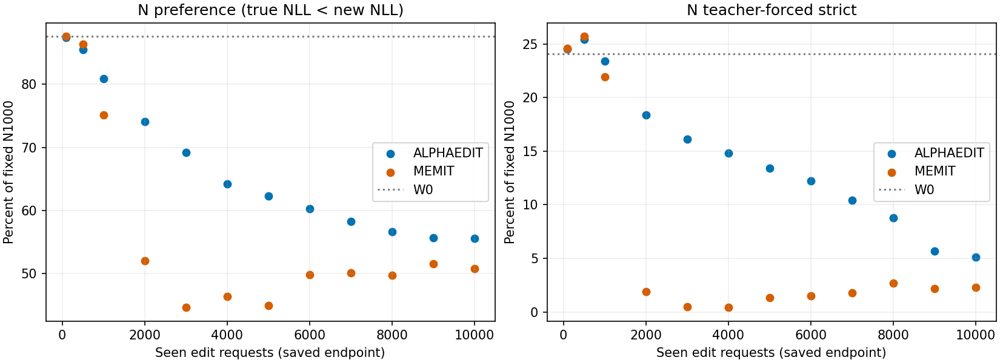
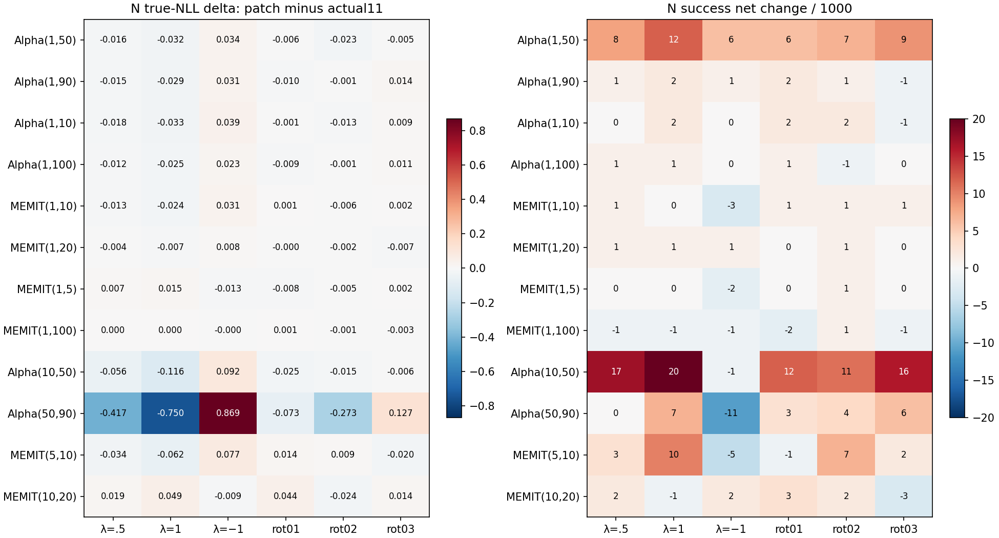

# BASE delayed-write E3 완료 상세 CPU 리뷰

Instruction / nonce: `ODEEDIT-GH-SH4-DELAYED-E3-COMPLETED-REVIEW-20260924-R1`. 실행 GPU **52823**, CPU collector **52824** 모두 `COMPLETED / 0:0`. G00–G70 11개 receipt의 연결과 승인된 **25 endpoint + 12 E3 조합(48 factorial, 72 modified)**을 확인했다. 이는 기술적 완료이며 가설·효능의 통과 판정이 아니다.

이번 리뷰는 원 row에서 독립 CPU 재집계했다. 모델·GPU·evaluator·scheduler write·새 실험·원 raw 수정은 모두 0이다. 원 collector와 별도의 reducer이며 독립 red agent는 사용하지 않았다. 재검산 중 누락/부분/corrupt 결과는 발견되지 않았다.

## 1. 범위·실행 및 이력

| Job | 역할 | 시작–끝 (Asia/Seoul) | Parent allocation | 종료 |
|---|---|---|---|---|
| 52823 | G00–G60, 동일 GPU lane | 09-24 05:37:02–09:01:50 | 1GPU / 8CPU / 59GiB; 12288GPU-sec | COMPLETED 0:0 |
| 52824 | G70; afterany:52823 | 09-24 09:02:04–09:02:29 | 0GPU / 4CPU / 8GiB; 25sec | COMPLETED 0:0 |

정확 두 ID만 2026-09-24T01:15:38.796754Z에 accounting/queue snapshot으로 확인했다. 다른 job 조회·종료대기·반복 polling은 없다. Parent allocation은 utilization이 아니며 batch/extern을 더하지 않았다. 이 task 동시 GPU는 1이다. 프로젝트 전체 다른 job의 동시성은 이번 scope에서 재조회하지 않았다.

Storage block → 사용자 공간 확보 → immutable 제출/held inspection/release → G00/G10 → E1 90/236 chunk 당시 사용자 pause → 이번 명시 완료 recall의 순서다. 과거 PENDING/NOT_OBSERVED 및 pause를 소급 PASS로 바꾸지 않는다. science-terminal의 `SCIENCE_COMPLETED_G70_PENDING_CPU_REDUCER`는 GPU 종료 당시의 명칭이며, 이후 G70 PASS와 collector terminal COMPLETED가 별도로 있다.

실행은 `3ebe0b07078940c2d46f9ea2226ccc20c0446162` / tree `7dece41be8ed2666d05a96cdb8432828c88fb5c0`; 현재 main 또는 이번 분석을 runtime으로 대체하지 않았다. [source-conformance.csv](source-conformance.csv)에 frozen 파일·함수·줄·SHA·근거를 연결했다. 분석 source는 별도 namespace와 [analysis-manifest.json](analysis-manifest.json)에 봉인한다.

| 봉인 | SHA256 |
|---|---|
| Execution archive | b2438bead1d154692ad3292bb7c5e9b98e186165609fa9dec03b35638f392616 |
| Execution lock | ff2c8fd6b685a933b980b2255504200b1744a8827dbae128ee1aa4da38bd3b71 |
| Submission | c6569653df755513837cd0b80a57a1320c12e52c27a038bb2f31c1aa7376054b |
| Panel manifest | 01a45f7fc1be621e3ca142d39f78cca4610b827b506357f5115ef9e6730ffd5d |
| 독립 첫 표 | 48710c928424fe1d96510e52b661adbc33f2eb2b4d8d0d94c3d728d784d1593a |

DAG는 GPU 한 process 내부 `G00→G10→G20→G21→G30→G31→G40→G50→G51→G60`, CPU `afterany`의 G70이다. 단계마다 predecessor의 PASS와 instruction/attempt/source/data/panel 일치를 요구하며 atomic receipt SHA로 연결된다. collector exit0 자체를 science 완료로 쓰지 않고 전 stage/row를 별도 검산했다. 실패 branch는 이번 실행에서 발생하지 않았으며 실제 실패 전파 실험을 새로 했다는 뜻이 아니다.

| Stage | 기능 | 실제 상태 |
|---|---|---|
| G00 | 자산/source/lock | COMPLETED |
| G10 | bounded fidelity/repeat/hook/restore | COMPLETED |
| G20 | E1 25 endpoint | COMPLETED |
| G21 | E1 completeness | COMPLETED |
| G30 | core4 factorial | COMPLETED |
| G31 | core module identity | COMPLETED |
| G40 | core4×6 patch | COMPLETED |
| G50 | extension8 factorial | COMPLETED |
| G51 | extension module identity | COMPLETED |
| G60 | extension8×6 patch | COMPLETED |
| G70 | CPU collector | COMPLETED |

[stage-coverage.csv](stage-coverage.csv)에 exact receipt 경로/SHA가 있다. 새 baseline/native continuation, E2/E4–E6는 NOT_AUTHORIZED이며 실행하지 않았다. 원 243 cells를 완료 분모로 사용하지 않는다.

## 2. 입력·패널·지표 및 검산 수준

BASE_ALPHAEDIT42657 / BASE_MEMIT42658, blue=False, 동일 Llama3-8B-Instruct revision `8afb486c1db24fe5011ec46dfbe5b5dccdb575c2`, FP32/eager, zero-based L4–L8 down_proj만 endpoint/hybrid로 교체했다. matmul TF32=false/cuDNN TF32=true, torch2.9.1+cu128/transformers4.44.2다. Alpha의 P/M/L2=10 및 MEMIT의 15000C0/FP64-solve→FP32는 원 baseline lineage이며 이번에 solve를 다시 수행하지 않았다. MEMIT에 M을 추가하지 않았다.

Fixed10k SHA `3d7f5e31db47b23f3a281bb6fb447c2fb1776e3d4721cdfb5fe5c6f998f10ae1`; order root `5b01356928ad2e2e46effad5a2c5621c87746b610992b7b92bf3ace16b6f5729`. W0+family별 W1/5/10/20/30/40/50/60/70/80/90/100=25 logical endpoint. 이미 존재하는 CP24는 prior fullSHA+현재 size/mtime/inode로 결속했고 이번 CPU 리뷰가 공용 model/CP 전체를 재해시한 것은 아니다. 실행 당시 selected W tensor의 shape/finite/SHA120개와 seen-ID/order는 runtime 검사했다.

| 패널 | 분모 | 정의·한계 |
|---|---|---|
| N_diag1000 | 100 case ×10 prompt=1000 pairs /2000 completions | fixed10k 시간순 5분위 각20case; true/new 별도 TF |
| H original B1 | R100+P200 pairs /600 completions | 원 B1 new target; latest-active와 섞지 않음 |
| BaseEval256 | 256 pairs /512 completions | high86/low85/zero85 object-exposure; subject/fact/prompt 제외 |
| GeneralEval128 | 128 docs ×64=8192 TF positions | natural C4 window, W0 full-vocab KL observer |
| H active supplement | 11 target variants ×3=33 pairs /66 completions | 원 R100/P200에 추가합산하지 않음 |

합계 endpoint당 3306 completion rows(1589 true/new pairs+128 natural docs), 145 score datasets에서 **479370 completion observations**. General/반복 endpoint를 unique case 또는 독립 반복실험으로 세지 않았다. Base의 다른 relation 적합 pool은 0이었고 canonical NFKC/case/punctuation alias 외 entity resolver는 NOT_AVAILABLE다. 이 제한은 결과 전 panel에 기록됐다.

General은 생성256/EOS 실험이 아니다. BOS+128 자연 token의 TF input128, score positions64..127에서 64 target을 점수화했다. 모든 문서 길이가 같은 window이고 조기 EOS/자유생성 정확도는 NOT_MEASURED. 전체 vocabulary W0 FP32 logp를 RAM에 두고 signed FP64 KL(p0||pt)를 계산한 scalar가 저장됐다. W0 top1 보존과 실제 natural target 정확도를 분리한다. 이번 독립 reducer는 token prediction/target/NLL을 재집계했지만 미저장 full teacher에서 KL을 새로 재계산하지 않았다.

m=true NLL−new NLL, g=−m. R/P 성공은 new<true, N/Base 성공은 true<new; tie는 실패다. Desired NLL은 R/P에서 new, N/Base에서 true다. NLL은 completion별 token mean이고 pair의 두 target 길이가 달라도 따로 정렬한다. TF token-micro는 맞은 token/전체 target token, prompt-macro는 문항별 token accuracy의 평균, strict는 문항의 모든 target token 일치다. R+twoP joint는 case당 세 문항 모두 성공/strict. NLL preference를 TF accuracy 또는 생성 정확도라고 부르지 않는다.

독립 reducer는 모든 row의 순서/ID/case/subject/prompt cluster/input-target-position hash/분모/finite/token prediction/strict를 검사했다. 저장 FP32 NLL과 CPU FP64 token 평균의 최대 절대차는 1.430511474609375e-6였고 원 NLL을 교체하지 않았다. 동일 state의 값이라는 이유로 평가를 대입하지 않았으며 factorial11과 E1은 실제 저장된 수치 payload를 비교했다. Row 자체에 full state tensor SHA가 들어 있지는 않아 state identity는 CP/config/path/runtime guard에 결속된 수준이다.

## 3. E1 고정 패널 결과

| Endpoint | R/100 | P/200 | N/1000 | Base/256 | joint/100 |
|---|---|---|---|---|---|
| W0 | 5 | 20 | 876 | 226 | 5 |
| Alpha_W001 | 100 | 174 | 874 | 228 | 79 |
| Alpha_W005 | 99 | 175 | 855 | 219 | 80 |
| Alpha_W010 | 94 | 175 | 809 | 204 | 81 |
| Alpha_W020 | 97 | 175 | 741 | 186 | 80 |
| Alpha_W030 | 94 | 166 | 692 | 163 | 69 |
| Alpha_W040 | 92 | 153 | 642 | 157 | 66 |
| Alpha_W050 | 84 | 147 | 623 | 148 | 63 |
| Alpha_W060 | 81 | 132 | 603 | 142 | 54 |
| Alpha_W070 | 77 | 115 | 583 | 134 | 39 |
| Alpha_W080 | 59 | 104 | 566 | 132 | 33 |
| Alpha_W090 | 50 | 100 | 557 | 123 | 26 |
| Alpha_W100 | 56 | 98 | 556 | 119 | 24 |
| MEMIT_W001 | 100 | 174 | 876 | 229 | 79 |
| MEMIT_W005 | 99 | 184 | 864 | 223 | 88 |
| MEMIT_W010 | 84 | 159 | 751 | 187 | 67 |
| MEMIT_W020 | 53 | 107 | 520 | 109 | 39 |
| MEMIT_W030 | 49 | 97 | 446 | 112 | 36 |
| MEMIT_W040 | 50 | 97 | 464 | 120 | 40 |
| MEMIT_W050 | 54 | 100 | 449 | 115 | 39 |
| MEMIT_W060 | 48 | 101 | 498 | 126 | 37 |
| MEMIT_W070 | 49 | 96 | 501 | 118 | 34 |
| MEMIT_W080 | 54 | 90 | 497 | 116 | 28 |
| MEMIT_W090 | 52 | 93 | 515 | 119 | 31 |
| MEMIT_W100 | 54 | 101 | 508 | 118 | 33 |

전체 true/new/desired NLL 평균·q01/05/50/95/99와 TF 지표는 [first-endpoint-table.csv](first-endpoint-table.csv). 아래 TF 표의 순서는 R / P / N / Base이며 %다. 같은 성공 수라도 성공집합이 같은 것은 아니다.

| Endpoint | TF token-micro % R/P/N/Base | TF prompt-macro % R/P/N/Base | strict count R/P/N/Base | joint strict/100 |
|---|---|---|---|---|
| W0 | 0.00 / 0.00 / 25.49 / 20.69 | 0.00 / 0.00 / 25.05 / 19.73 | 0 / 0 / 241 / 49 | 0 |
| Alpha_W001 | 99.01 / 50.50 / 25.88 / 22.99 | 99.00 / 50.00 / 25.45 / 22.07 | 99 / 100 / 245 / 55 | 32 |
| Alpha_W050 | 50.50 / 33.17 / 14.61 / 7.66 | 50.50 / 32.50 / 14.15 / 6.64 | 50 / 65 / 134 / 15 | 15 |
| Alpha_W090 | 8.91 / 4.95 / 5.59 / 4.60 | 9.00 / 5.00 / 5.70 / 4.49 | 9 / 10 / 57 / 11 | 3 |
| Alpha_W100 | 7.92 / 3.96 / 5.10 / 3.83 | 8.00 / 4.00 / 5.15 / 3.91 | 8 / 8 / 51 / 10 | 1 |
| MEMIT_W001 | 98.02 / 51.49 / 25.98 / 21.07 | 98.00 / 51.25 / 25.55 / 20.12 | 98 / 102 / 246 / 50 | 34 |
| MEMIT_W010 | 47.52 / 40.59 / 23.43 / 16.48 | 47.00 / 40.00 / 22.90 / 15.82 | 47 / 80 / 219 / 38 | 25 |
| MEMIT_W020 | 0.99 / 0.50 / 1.86 / 0.38 | 1.00 / 0.50 / 1.90 / 0.39 | 1 / 1 / 19 / 1 | 0 |
| MEMIT_W100 | 4.95 / 2.97 / 2.25 / 1.15 | 5.00 / 3.00 / 2.30 / 1.17 | 5 / 6 / 23 / 3 | 0 |

원 B1 target의 at-write→later는 own-family W1에서 각 저장 endpoint로 pairing했다. 이는 독립 baseline chain의 endpoint 평가이며 새 history 업데이트를 실행한 것이 아니다. [e1-atwrite-paired.csv](e1-atwrite-paired.csv)는 R/P/N/Base·supplement의 gross gained/lost·strict·NLL tail, [paired-summary.csv](paired-summary.csv)는 W0 및 actual11 대조를 담는다.

| Endpoint | W1→현재 R gained/lost | P gained/lost | N gained/lost | W0-correct N 잔존/876 |
|---|---|---|---|---|
| Alpha_W050 | 0/16 | 9/36 | 42/293 | 585/876 |
| Alpha_W090 | 0/50 | 10/84 | 41/358 | 517/876 |
| Alpha_W100 | 0/44 | 11/87 | 52/370 | 504/876 |
| MEMIT_W010 | 0/16 | 13/28 | 30/155 | 721/876 |
| MEMIT_W020 | 0/47 | 15/82 | 40/396 | 481/876 |
| MEMIT_W100 | 0/46 | 15/88 | 53/421 | 456/876 |

W0-correct N은 W0 preference 성공 876개에 조건화했다. TF-correct와 다른 집합이다. paired ID와 worst-NLL 이동10개 목록은 local-only `paired-transition-ids.json` 및 `atwrite-transition-ids.json`에 보존하고 Git에는 hash/index만 게시한다.

| Endpoint | General natural NLL | W0 KL | TF micro % | W0 top1/8192 |
|---|---|---|---|---|
| W0 | 2.62068 | 0.00000 | 47.62 | 8192 |
| Alpha_W001 | 2.61753 | 0.00273 | 47.53 | 8029 |
| Alpha_W050 | 2.76127 | 0.32276 | 43.97 | 6370 |
| Alpha_W090 | 9.11464 | 7.46918 | 3.05 | 298 |
| Alpha_W100 | 10.20311 | 8.58221 | 0.98 | 87 |
| MEMIT_W001 | 2.61913 | 0.00114 | 47.67 | 8083 |
| MEMIT_W010 | 2.62855 | 0.05250 | 46.61 | 7495 |
| MEMIT_W020 | 12.46380 | 10.87751 | 0.88 | 102 |
| MEMIT_W100 | 12.29747 | 10.68477 | 2.59 | 308 |

### Active / superseded 분리

원 B1 new target의 감소가 모두 부당한 망각이라는 해석은 하지 않는다. prefix registry의 latest-active target에 의한 정당 overwrite를 별도 pairing했다. 아래 superseded 문항의 “current”는 당시 유효 target, “original”은 원 B1 target이다. 같은 11 variant를 새로운 11개 연구 요청으로 세지 않는다.

| Endpoint | 상태 | Kind | 원 target 성공/분모 | 당시 current 성공/분모 |
|---|---|---|---|---|
| Alpha_W050 | SUPERSEDED | R | 1/2 | 1/2 |
| Alpha_W050 | SUPERSEDED | P | 1/4 | 3/4 |
| Alpha_W100 | SUPERSEDED | R | 4/5 | 4/5 |
| Alpha_W100 | SUPERSEDED | P | 3/10 | 8/10 |
| MEMIT_W020 | SUPERSEDED | R | 1/2 | 1/2 |
| MEMIT_W020 | SUPERSEDED | P | 1/4 | 2/4 |
| MEMIT_W100 | SUPERSEDED | R | 2/5 | 4/5 |
| MEMIT_W100 | SUPERSEDED | P | 3/10 | 7/10 |

모든 endpoint의 ACTIVE/SUPERSEDED/NOT_RECEIVED는 [active-overwrite.csv](active-overwrite.csv). W0는 미도착 상태이며 B1 성과 분모로 조용히 변경하지 않았다.

## 4. E1 module drift와 E3 factorial

E1 physical down_proj의 모든 valid TF token을 대상으로 WtKt−W0K0=(Wt−W0)K0+WtδK를 기록했다. 모든 L4 key delta는 0. 396720 layer-row의 최대 mapping relative residual은 2.1964487554387226e-6(분모=max observed norm, W0 output norm,1e-12)이다. 저장된 시간분해는 s=1에 대해 WtKt−W1K1=W0δK+H1δK+F1,tKt이며 norm과 절대 residual이 남았다. 모든 s에 대한 temporal key bank나 full vectors가 보존됐다는 뜻은 아니다.

[layer-drift.csv](layer-drift.csv)는 layer/panel별 key cosine/norm, base/history/future action norm, signed direct×drift contraction 및 음수 행 수를 분리한다. 이 signed contraction은 module 내 norm 교차항이지 최종 NLL의 가산 인과기여율이 아니다. 모든 H/base/future 간 full signed cross-term을 재구성할 tensor는 NOT_RECORDED다.

E3 A는 L8의 Ws−W0, B는 L4–7의 Wt−Ws이며 나머지 weight는 고정. s=1은 B1 L8 성분, s>1은 누적 L8 write다. θref=θt−A−B에서 00/10/01/11을 구성했다. 실제11은 Wt bytes 직접 복사, lower layers는 Ws/Wt 직접 복사, a=0 L8만 FP64 subtract→FP32로 materialize했다.

39672 completion module rows에서 K11=K01 / K10=K00는 runtime exact로 기록되었고, cross=v11−v10−v01+v00와 AδK의 최대 residual/v11 norm은 1.9505194609058857e-6(core), 1.9374010619331366e-6(extension)이다. 사전 ceiling1e-4 안이다. CPU는 저장된 boolean/분모/노름/행coverage를 검산했으며 미보존 K/v를 독립 tensor 재계산하지 않았다. 작은 상대차를 효과 크기나 가설 PASS로 쓰지 않는다.

아래는 최종 **N true-NLL**의 네 corner 평균과 nonlinear interaction f11−f10−f01+f00다. module 항등식 residual과 전혀 다른 양이며 값의 부호로 조합을 제외하지 않았다.

| Pair | phase | 00 | 10 | 01 | 11 | NLL interaction | 95% cluster CI |
|---|---|---|---|---|---|---|---|
| Alpha(1,50) | core | 4.49547 | 4.41088 | 5.37514 | 5.44603 | 0.15548 | [0.11345, 0.19951] |
| Alpha(1,90) | core | 4.48273 | 4.39738 | 7.51442 | 7.57353 | 0.14445 | [0.10814, 0.18021] |
| Alpha(1,10) | extension | 4.50445 | 4.42918 | 4.46308 | 4.55493 | 0.16713 | [0.10842, 0.23070] |
| Alpha(1,100) | extension | 4.44748 | 4.37198 | 8.05310 | 8.10247 | 0.12487 | [0.08710, 0.16406] |
| MEMIT(1,10) | core | 4.50037 | 4.43994 | 4.17573 | 4.20977 | 0.09446 | [0.06202, 0.12953] |
| MEMIT(1,20) | core | 4.43605 | 4.38422 | 9.98865 | 9.99279 | 0.05597 | [0.03411, 0.07692] |
| MEMIT(1,5) | extension | 4.63250 | 4.56861 | 4.37670 | 4.32643 | 0.01362 | [-0.02297, 0.05611] |
| MEMIT(1,100) | extension | 6.39454 | 6.36112 | 10.97947 | 10.97861 | 0.03256 | [0.02311, 0.04170] |
| Alpha(10,50) | extension | 4.25271 | 4.44385 | 5.13679 | 5.44603 | 0.11810 | [-0.05560, 0.29844] |
| Alpha(50,90) | extension | 4.62311 | 5.39755 | 6.50196 | 7.57353 | 0.29713 | [-0.07080, 0.65378] |
| MEMIT(5,10) | extension | 4.20955 | 4.07290 | 4.06456 | 4.20977 | 0.28186 | [0.17246, 0.39214] |
| MEMIT(10,20) | extension | 4.00234 | 4.12655 | 10.03880 | 9.99279 | -0.17021 | [-0.29562, -0.04606] |

전체 panel·true/new/g interaction과 q01/05/50/95/99는 [factorial-summary.csv](factorial-summary.csv), 네 corner 및 각 patch의 TF/strict/분자·분모는 [factorial-patch-metrics.csv](factorial-patch-metrics.csv). 12 조합 모두 고정 실행되었다.

## 5. E3 dose·RMS control 및 반대 증거

실제11의 L8 output에서 v11−λAδK를 적용했다. λ0은 E1 actual endpoint의 exact row identity 재사용, λ=.5/1/−1은 새 forward다. 회전대조는 결과 전 고정된 signed permutation seed2026092401/02/03이며 token별 RMS를 일치시킨다. true/new completion마다 자기 input sequence의 모든 valid TF token K를 사용하고 pad는 0. 단일 subject key/context 평균으로 대체하지 않았다.

236 chunks×12에서 6 variant 전량의 row 순서·valid-position4096배 element count·receiving state·λ0 경로를 확인했다. CPU aggregate norm matching 최대 relative 차이는 3.033292851409309e-16. 이는 chunk scalar 검산이며 실제 per-token RMS는 frozen runtime assertion evidence다. zero-action chunk는 0이지만 zero-action token 수는 NOT_RECORDED여서 0이라고 추정하지 않는다. λ0/actual11 재사용에도 원 실행은 parity용 forward를 따로 했고 비용에서 제외하지 않았다.

다음 N1000 표의 ΔNLL은 patch−actual11 true NLL이다(음수=이 값 감소). preference gained/lost와 TF 정확도 변화는 별도로 보아야 한다. CI는 case/subject/repeated-prompt 연결 cluster, seed20260924, 2000 bootstrap percentile95%; 새 trajectory/order 재현성이나 인과 우월성 CI가 아니다.

| Pair | actual11 N | λ1 N | gained/lost | Δ true NLL | 95% CI | 악화 tail q95/q99 |
|---|---|---|---|---|---|---|
| Alpha(1,50) | 623/1000 | 635/1000 | 15/3 | -0.03237 | [-0.05356, -0.01251] | 0.29321 / 0.52151 |
| Alpha(1,90) | 557/1000 | 559/1000 | 5/3 | -0.02929 | [-0.04259, -0.01648] | 0.15877 / 0.27936 |
| Alpha(1,10) | 809/1000 | 811/1000 | 10/8 | -0.03331 | [-0.05769, -0.00951] | 0.29048 / 0.59678 |
| Alpha(1,100) | 556/1000 | 557/1000 | 4/3 | -0.02454 | [-0.04078, -0.01118] | 0.13962 / 0.24657 |
| MEMIT(1,10) | 751/1000 | 751/1000 | 4/4 | -0.02449 | [-0.04376, -0.00658] | 0.24550 / 0.38898 |
| MEMIT(1,20) | 520/1000 | 521/1000 | 1/0 | -0.00748 | [-0.00975, -0.00521] | 0.02048 / 0.03471 |
| MEMIT(1,5) | 864/1000 | 864/1000 | 3/3 | 0.01521 | [-0.00480, 0.03546] | 0.27550 / 0.48818 |
| MEMIT(1,100) | 508/1000 | 507/1000 | 1/2 | 0.00035 | [-0.00119, 0.00183] | 0.02066 / 0.03863 |
| Alpha(10,50) | 623/1000 | 643/1000 | 32/12 | -0.11553 | [-0.16807, -0.06653] | 0.77752 / 1.21373 |
| Alpha(50,90) | 557/1000 | 564/1000 | 55/48 | -0.74981 | [-0.99543, -0.54219] | 1.31525 / 2.90603 |
| MEMIT(5,10) | 751/1000 | 761/1000 | 15/5 | -0.06177 | [-0.09666, -0.02867] | 0.46459 / 0.69121 |
| MEMIT(10,20) | 520/1000 | 519/1000 | 7/8 | 0.04924 | [0.01755, 0.07923] | 0.49167 / 0.66106 |

대표 설명은 결과를 보고 좋은 사례만 고른 것이 아니다. 원 core Alpha(1→50), 원 horizon MEMIT(1→5), 고정 cumulative Alpha(50→90)와 MEMIT(10→20)를 함께 보인다. Alpha(1→50)는 623→635, gained15/lost3, ΔNLL−0.03237. MEMIT(1→5)는 성공864로 동일하지만 gained3/lost3, ΔNLL+0.01521이다. Alpha(50→90)는 mean ΔNLL−0.74981 및 net+7이나 gained55/lost48, 악화 q99+2.90603이다. MEMIT(10→20)는 ΔNLL+0.04924, 520→519이며 유효한 반대 결과로 보존했다. 유한 패널 결과를 모든 방향의 최적성/불가능성으로 해석하지 않는다.

### 전체 고정 dose/rotation 결과 (N true-NLL Δ)

| Pair | λ.5 | λ1 | λ−1 | rot01 | rot02 | rot03 |
|---|---|---|---|---|---|---|
| Alpha(1,50) | -0.01631 | -0.03237 | 0.03358 | -0.00575 | -0.02279 | -0.00464 |
| Alpha(1,90) | -0.01489 | -0.02929 | 0.03145 | -0.01015 | -0.00113 | 0.01410 |
| Alpha(1,10) | -0.01758 | -0.03331 | 0.03868 | -0.00110 | -0.01281 | 0.00895 |
| Alpha(1,100) | -0.01162 | -0.02454 | 0.02293 | -0.00877 | -0.00051 | 0.01129 |
| MEMIT(1,10) | -0.01328 | -0.02449 | 0.03097 | 0.00077 | -0.00641 | 0.00222 |
| MEMIT(1,20) | -0.00377 | -0.00748 | 0.00769 | -0.00046 | -0.00242 | -0.00750 |
| MEMIT(1,5) | 0.00732 | 0.01521 | -0.01287 | -0.00824 | -0.00455 | 0.00151 |
| MEMIT(1,100) | 0.00016 | 0.00035 | -0.00020 | 0.00109 | -0.00121 | -0.00266 |
| Alpha(10,50) | -0.05598 | -0.11553 | 0.09176 | -0.02462 | -0.01513 | -0.00644 |
| Alpha(50,90) | -0.41681 | -0.74981 | 0.86901 | -0.07271 | -0.27256 | 0.12693 |
| MEMIT(5,10) | -0.03389 | -0.06177 | 0.07695 | 0.01362 | 0.00901 | -0.02049 |
| MEMIT(10,20) | 0.01892 | 0.04924 | -0.00882 | 0.04397 | -0.02406 | 0.01446 |

### λ1의 다른 패널 side-effect

| Pair | R Δcount | P Δcount | Base Δcount | N strict Δcount | General ΔNLL | General ΔKL |
|---|---|---|---|---|---|---|
| Alpha(1,50) | 1 | 5 | 1 | 0 | -0.00859 | -0.01462 |
| Alpha(1,90) | 1 | 3 | -1 | 0 | -0.03643 | -0.03680 |
| Alpha(1,10) | 0 | 0 | 0 | 2 | 0.00044 | -0.00206 |
| Alpha(1,100) | 1 | 1 | -1 | 0 | -0.02391 | -0.02425 |
| MEMIT(1,10) | 3 | 4 | 1 | 3 | -0.00056 | -0.00427 |
| MEMIT(1,20) | 1 | 0 | 0 | 0 | -0.01348 | -0.01378 |
| MEMIT(1,5) | 0 | 0 | 0 | -5 | 0.00028 | -0.00065 |
| MEMIT(1,100) | 1 | 0 | 0 | 1 | 0.00076 | 0.00080 |
| Alpha(10,50) | 2 | 10 | 3 | 12 | -0.02833 | -0.04699 |
| Alpha(50,90) | 5 | 1 | 5 | 25 | -0.47973 | -0.48093 |
| MEMIT(5,10) | 3 | 6 | 2 | 11 | -0.00092 | -0.00837 |
| MEMIT(10,20) | 0 | -1 | 4 | 1 | -0.04525 | -0.04534 |

R/P/Base 성공분모는 각각100/200/256, N strict1000, General128docs/8192tokens. 다른 dose/rotation과 true/new 별도 변화·strict lost/gained·q95/q99는 [paired-summary.csv](paired-summary.csv)에 전량 공개한다. `LOST_ONLY_auxiliary`는 W0 성공→actual11 실패 문항에 한정된 보조분석으로 전체패널 주분석에 대입하지 않는다. Query-specific hook은 배포 가능한 weight repair도 새로운 학습 trajectory도 아니다.

## 6. 설계→source→저장 근거 및 미측정

| 항목 | frozen 함수:줄 | 판정 | 범위/한계 |
|---|---|---|---|
| DAG/source/data/panel binding | stages.py:Run.gate:28 | PASS_STORED_CHAIN | source/input/predecessor SHA and11 receipts; no missing stage |
| afterany collector not science bypass | control.py:submit:23 | PASS_SOURCE_AND_RECEIPT | only two jobs; internal DAG; no invalid downstream GPU job |
| BASE endpoint/FP32/original revision | backend.py:Backend.__init__:34 | PASS_RUNTIME_RECEIPT | current stat+prior SHA; no new CPU fullCP/hash/model load |
| G10 original/repeat/zero-hook | stages.py:Run.g10:74 | PASS_BOUNDED | 16 rewrite prompts per family, true/new; not full-panel/model parity |
| E1 coverage+L4 key invariance | stages.py:Run.e1:143 | PASS_STORED_ROWS | 25 endpoints×3306; L4 keydelta0; physical all-valid-token |
| W0/direct+drift and s1 history split | stages.py:Run.drift:108 | PASS_SCALAR_RECOUNT | mapping relative; s1 split only; full K/v and additional contractions not stored |
| Four corners A=L8 B=L4..7 | backend.py:Backend.hybrid:91 | PASS_SOURCE_BOUND | a0 FP64 subtract thenFP32; actual11 exact original Wt; no independent tensor reconstruction |
| K identities / module cross | stages.py:Run.factorial:173 | PASS_RECORDED_SCOPE | maxrelative1.9505194609058857e-6; nonlinear NLL interaction separately recomputed |
| Alltoken patch/dose/rotation | stages.py:Run.patch:215 | PASS_LEDGER_AND_ROWS | 72modified; per-token RMS runtime assertion; CPU chunk norm and coverage check |
| Allvocab TF/General KL | backend.py:Backend.forward:116 | PASS_TOKEN_RECOUNT_KL_SOURCE_BOUND | KL teacher RAM-only, not independently recomputed; not free generation |
| Restore/nonselected/RNG/CP readonly | backend.py:Backend.restore:171 | PASS_RUNTIME_GUARDS | selected tensor hash runtime; nonselected pointer/version; no CPU continuation |
| Finite failure receipt/propagation | stages.py:Run.run:243 | PASS_SOURCE_ACTUAL_SUCCESS | failure branch not exercised by this valid completed run |
| noCP/noz/nohistory | backend.py:Backend.cost:176 | PASS_SOURCE_AND_INVENTORY | newfit0/write0/history0/CP0; inputCP retained; exact new resume unavailable |
| Independent final collection | reduce.py:report:143 | PASS_INDEPENDENT_RECOUNT | original collector matched; separate fresh reducer/token recount; no independent red agent |

해당 source의 exact SHA는 CSV에 있다. G10은 family별 16 rewrite prompt의 true/new row(총64completion), repeat/key/zero-hook/strict 검사에서 차이0. L4 W0–AlphaW100 두 행 검사와 E1 전량 L4 keydelta0는 범위를 분리했다. CPU toy나 bounded G10을 전 모델/전 상태 bitwise parity로 확대하지 않았다.

Restore는 stage마다 selected W0 tensor SHA, nonselected pointer/version, RNG 및 입력 CP stat guard로 검사했다. full nonselected tensor byte audit, 사후 GPU continuation, 완전 W/M 독립재구성은 NOT_TESTED/NOT_AVAILABLE다. M/context/history는 immutable input 메타데이터로 확인하고 forward에 M을 materialize하지 않았으므로 “M GPU 상태 복원 테스트”로 쓰지 않는다.

## 7. 비용·저장·무결성

| 구간 | forward calls | program increment sec | nested forward sec | selected W H2D bytes |
|---|---|---|---|---|
| G10 | 14 | 68.299 | 1.528 | 5872025600 |
| G20 | 5900 | 3474.030 | 631.123 | 6930164613120 |
| G30 | 3776 | 1498.083 | 407.158 | 4435728138240 |
| G40 | 7552 | 1383.766 | 787.421 | 2218451271680 |
| G50 | 7552 | 3088.734 | 815.668 | 8870281871360 |
| G60 | 15104 | 2770.179 | 1574.219 | 4435728138240 |

G10 increment에는 model load/초기설정이 포함되고 각 행은 직전 cost receipt 이후 차이다. G21/G31/G51/복원 등의 시간이 다음 increment에 포함될 수 있다. forward timer에는 full-logit/log-softmax/출력 CPU화/동기화 등 해당 함수 구간이 포함돼 순수 kernel 시간과 같지 않다. 중첩 forward와 program을 더하지 않았다.

| 실측 | 값 | 주의 |
|---|---|---|
| 52823 GPU parent | 12288 sec =3.413333 GPUh | GPU utilization 아님 |
| 52824 CPU parent | 25 sec / GPU0 | GPU초 합산0 |
| program wall | 12283.092618sec | load 포함; 마지막 receipt까지 |
| forward nested | 4217.118087sec /39898 calls | program에 이미 포함 |
| model load | 63.922934sec | program에 이미 포함 |
| GPU max allocated | 34389915648B (32.028GiB) | reserved/Slurm memory와 다른 계측 |
| host process ru_maxrss | 36980776960B (34.441GiB) | 전체 Slurm step peak로 확대하지 않음 |
| selected-weight H2D counter | 26896226058240B | 전체 PCIe/모든 activation 전송량 아님 |
| new output fullSHA | 45592files /814562794B | 원 collector index와 일치; 모델/CP 중복 재해시0 |

39898 calls = G10 14 + E1 25×236 + factorial 12×4×236 + patch 12×(2 receiving/key forward+6 modified)×236. 25+48+72=145 score datasets 및 2 scheduler jobs와 구별한다. 실제11/λ0의 metric 재사용은 해당 parity forward를 비용0으로 만들지 않는다. 원 baseline 학습/native 비용은 기존 lineage이며 이번12288초에 다시 합산하지 않았다. 이번 attempt의 실패/재실행 GPU비용은0; 이전 storage-block은 제출 전 이력이다.

Endpoint materialization/CPU construction/key capture/geometry/hash/JSON I-O/restore/observer의 독립 wall과 CUDA time은 NOT_SEPARATED다. program−forward 잔여를 “순수 I/O”나 “순수 geometry”로 이름 붙이지 않았다. 새 checkpoint/native/history는0, 기존24CP read-only. 정확한 새 crash-resume bundle은 NOT_AVAILABLE. 반환 가능한 endpoint 입력과 새 resume checkpoint는 다른 개념이다.

새 full output inventory는 [artifact-index-root.json](artifact-index-root.json)의 local manifest SHA로 결속하며 45592개 경로/size/fullSHA는 local-only이다. 원 output bytes814562794B, 공유FS free 변화의 독점 원인은 추정하지 않는다. 원 archive/raw/source/CP/pause/lock을 덮거나 삭제하지 않았다. full-vocab teacher와 전체 K/v는 RAM-only/비영속이므로 scalar hash만으로 tensor가 보존되었다고 주장하지 않는다.

## 8. 재현·품질검사·인계

새 source만 CPU 실행했으며 원 runtime은 변경하지 않았다. [README.md](README.md)의 명령은 새 scratch에 create-once로 첫표/detail을 재생성한다. 별도 regression10개(부등식/tie/token/order/hash/strict/cluster/create-once)를 실행했고 원 collector의 공통 aggregate와 독립 count/평균을 대조했다. 전체 CSV 재생성과 코드 PNG2개 재생성 SHA도 검산한다. 검사는 CPU 저장근거 수준이며 새 GPU 수치검증이 아니다.

GFM table 열수·상대링크·수치·raw-free inventory는 기계 검사했다. markdown/markdown-it/mistune/pandoc renderer가 설치돼 있지 않아 실제 GFM→HTML render는 NOT_RUN_RENDERER_NOT_INSTALLED이며 PASS로 표기하지 않는다. PNG는 repository 코드로 만들고 육안 점검했다. 실행 source/분석 source/package/receipt는 [analysis-manifest.json](analysis-manifest.json), [package-manifest.json](package-manifest.json), [rooted-receipt.json](rooted-receipt.json)에 구분한다.

기술적 완료·coverage·paired 산술·반대 결과만 보고한다. “집중의 원인”, 원인 기여율, 방법 채택/승격, 효능 우월, 후속 E2/E4–E6 선정은 이 보고의 결론이 아니다. `NO_BROADCAST_NOT_REQUIRED`: 동일 host의 기존 입력/완료 raw로 검산했으며 새 원격 payload 전송0. 최종 own-scope main 게시·GH 인계 후 `TASK_COMPLETE_STOP`, monitoring_active=false, automatic_resume=false.
