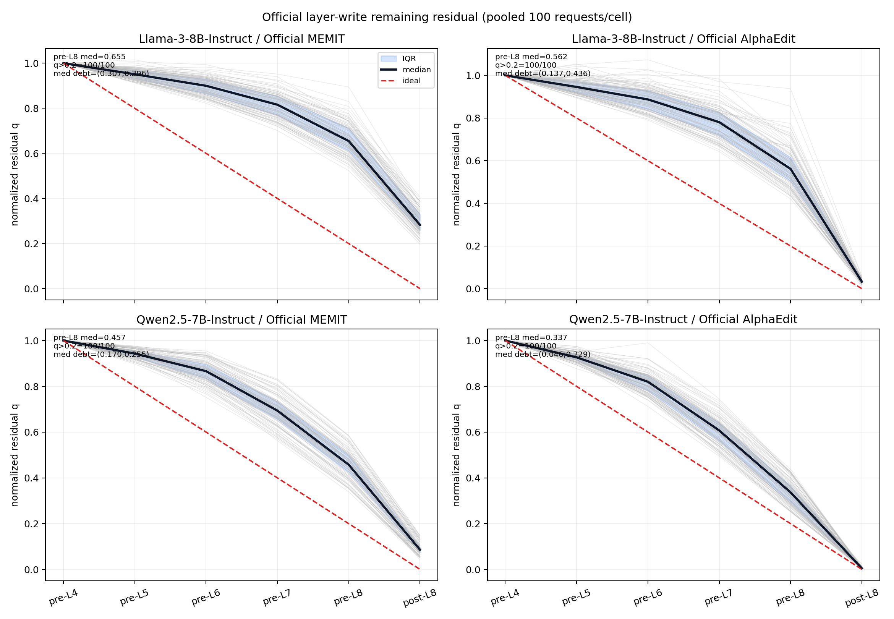
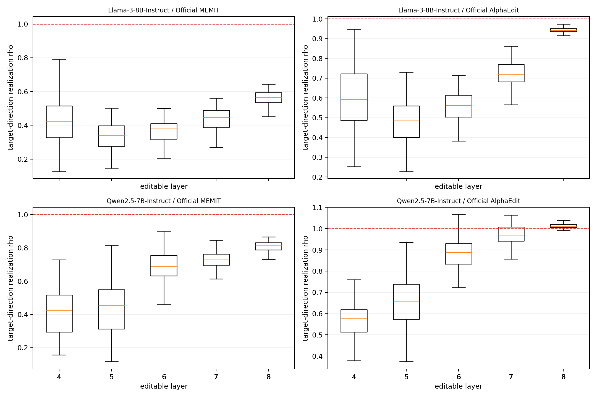
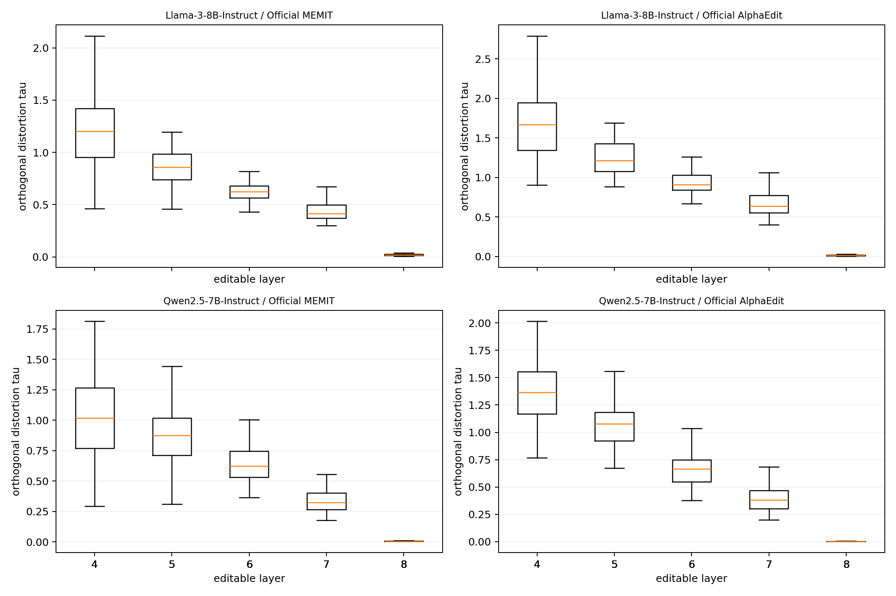
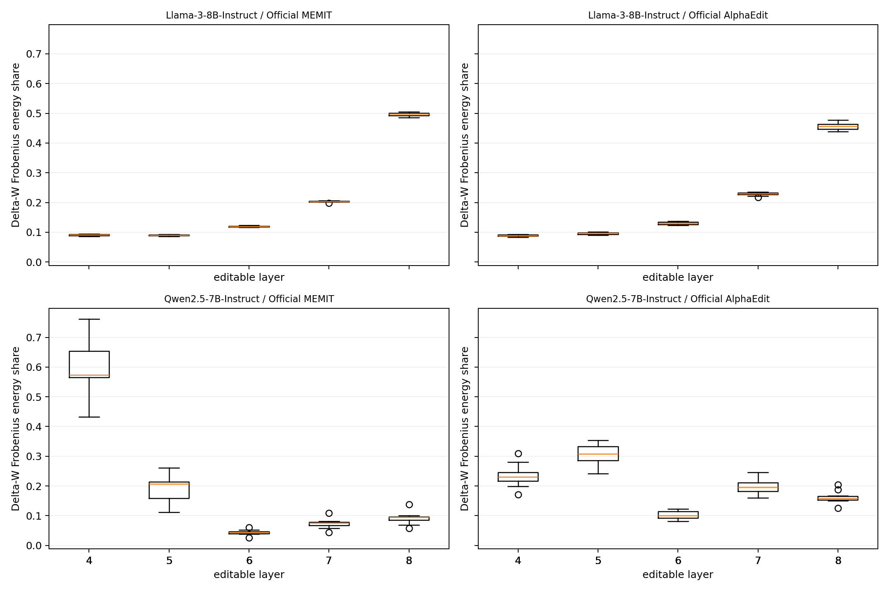

# Official layer-write realization debt — Llama/Qwen B10×10 사실 보고서

상태: **OBSERVATIONAL_STUDY_TERMINAL_VALID**
범위: Official MEMIT/AlphaEdit의 기존 update를 바꾸지 않고 layer 4→8 write 중 activation residual의 실현 양상만 관찰했다. 이 결과는 barrier 효용, ODE 필요성, 또는 보편적 last-layer 병목을 입증하지 않는다. `scientific_promotion=false`다.

## 핵심 결과

각 셀은 서로 독립적인 W0에서 시작한 10개 B10 slice(100 requests)다. 아래 `q>0.2`는 pooled `/100`; batch별 `/10`은 별도 표와 facet 그림에만 썼다.

| 모델 | Official 방법 | pre-L8 q median | post-L8 q median | pre-L8 q>0.2 | d_parallel median | d_perp median | recurrence max |
|---|---:|---:|---:|---:|---:|---:|---:|
| Llama-3-8B-Instruct | Official MEMIT | 0.6548 | 0.2826 | 100/100 | 0.3069 | 0.3959 | 6.314e-18 |
| Llama-3-8B-Instruct | Official AlphaEdit | 0.5615 | 0.0328 | 100/100 | 0.1366 | 0.4356 | 9.386e-18 |
| Qwen2.5-7B-Instruct | Official MEMIT | 0.4574 | 0.0858 | 100/100 | 0.1699 | 0.2554 | 9.075e-18 |
| Qwen2.5-7B-Instruct | Official AlphaEdit | 0.3366 | 0.0042 | 100/100 | 0.0455 | 0.2286 | 1.109e-17 |

`d_parallel`은 L8 진입 시 이상적인 `R1/5` 대비 원래 residual 방향의 debt이며, `d_perp`는 방향 왜곡이다. 절대 residual norm은 모델/방법 간 비교에 사용하지 않았다.

10개 batch 각각의 `/10` trajectory는 [q-by-batch-facets.png](q-by-batch-facets.png)에 보존했다.

## B1 observer on/off replay gate

| 모델 | 방법 | final W SHA | endpoint metric | z SHA | layer calls | terminal call | recurrence max | W0 restore |
|---|---|---:|---:|---:|---:|---:|---:|---:|
| Llama-3-8B-Instruct | Official MEMIT | PASS | PASS | PASS | 5/5 | 1/1 | 3.591e-18 | PASS |
| Llama-3-8B-Instruct | Official AlphaEdit | PASS | PASS | PASS | 5/5 | 1/1 | 6.833e-18 | PASS |
| Qwen2.5-7B-Instruct | Official MEMIT | PASS | PASS | PASS | 5/5 | 1/1 | 4.863e-18 | PASS |
| Qwen2.5-7B-Instruct | Official AlphaEdit | PASS | PASS | PASS | 5/5 | 1/1 | 8.166e-18 | PASS |

네 replay 모두 observer가 backward/key/solver/cache count를 바꾼 횟수 0이고, module-global 함수 객체는 예외 경로를 포함해 `finally`에서 복원됐다. AlphaEdit 양 replay는 `reset_cache=True`; MEMIT covariance는 계산 cache이며 history state가 아니다.

## q trajectory 상세

| 모델 | 방법 | q pre-L4 | pre-L5 | pre-L6 | pre-L7 | pre-L8 | post-L8 |
|---|---|---:|---:|---:|---:|---:|---:|
| Llama-3-8B-Instruct | Official MEMIT | 1.0000 | 0.9510 | 0.8998 | 0.8158 | 0.6548 | 0.2826 |
| Llama-3-8B-Instruct | Official AlphaEdit | 1.0000 | 0.9456 | 0.8871 | 0.7805 | 0.5615 | 0.0328 |
| Qwen2.5-7B-Instruct | Official MEMIT | 1.0000 | 0.9431 | 0.8663 | 0.6937 | 0.4574 | 0.0858 |
| Qwen2.5-7B-Instruct | Official AlphaEdit | 1.0000 | 0.9267 | 0.8199 | 0.6071 | 0.3366 | 0.0042 |

완전 실현 uniform schedule `[1.0, 0.8, 0.6, 0.4, 0.2, 0.0]`은 관측 기준선일 뿐 Official update의 강제 목표로 사용하지 않았다.

## layer별 realization과 방향 왜곡

`rho=1`은 allocation 방향 exact realization, `0<rho<1`은 under-realization, `rho>1`은 overshoot, `rho<0`은 반대 방향이다. `tau`는 allocation에 직교한 실제 activation reduction의 크기다.

수치 표는 [layer-summary.csv](layer-summary.csv)와 request-level [layer-request-metrics.csv](layer-request-metrics.csv)에 있다.

## 실제 weight action

`energy = ||Delta W_l||_F^2`, `share = energy / sum_l energy`다. residual debt와 weight energy는 별도 관측 축이며 causal pooling하지 않았다.

## 실행 완전성·계산 overhead

- 유효 셀 4/4, slice 40/40, request 400/400.
- Official `compute_z` 400회(각 request entry-state 1회), observer 유발 recompute 0.
- 기존 layer-loop activation call 200회(5×40), observation copy 200회, post-L8 추가 forward 40회.
- W0 pointer/bytes restore 40/40, nonfinite 0, failure/imputation 0.
- observer 유발 z optimization/key/solve 추가 횟수는 모두 0.
- 상세 wall-time/counter는 [compute-ledger.csv](compute-ledger.csv). 모델 load/setup이 포함된 cell wall time과 Official edit-core/observer copy 시간을 분리했다.

## endpoint metric (관찰 무결성 보조)

이 metric은 observer on/off parity 및 terminal-valid 확인용이며 layer debt의 원인 판정에 사용하지 않았다.

| 모델 | 방법 | target-new NLL mean/median/p90 | target-true NLL mean/median/p90 | target-new strict |
|---|---|---:|---:|---:|
| Llama-3-8B-Instruct | Official MEMIT | 0.4934/0.0035/0.1682 | 11.6231/11.6801/17.1491 | 93/100 |
| Llama-3-8B-Instruct | Official AlphaEdit | 0.0009/0.0006/0.0018 | 14.9577/14.6717/20.6097 | 100/100 |
| Qwen2.5-7B-Instruct | Official MEMIT | 0.0216/0.0104/0.0469 | 15.2832/14.7177/21.9784 | 100/100 |
| Qwen2.5-7B-Instruct | Official AlphaEdit | 0.0315/0.0135/0.0557 | 14.9684/13.8726/21.8303 | 100/100 |

## 사실 / 해석 경계

**FACT.** 모든 셀에서 앞 layer의 post residual과 다음 layer pre residual이 동일 tensor identity로 연결됐고, 제시된 `R5` recurrence는 `<1e-4` 기준을 큰 폭으로 통과했다. 따라서 L8 진입 debt는 앞 layer의 allocation-realization gap으로 수치적으로 닫힌다.

**INFERENCE.** `d_parallel`과 `d_perp`의 크기·부호 및 rho/tau의 layer별 분포는 model/method-conditioned realization pattern을 기술한다. 공통성이 약하면 architecture/method-conditioned evidence로만 읽어야 한다.

**NON-CLAIM.** 이 observational study만으로 barrier benefit, action-to-go controller의 필요성, ODE necessity, 또는 universal last-layer bottleneck을 주장하지 않는다. `L8 allocation coefficient=1` 자체도 결과로 세지 않았다.

## 봉인 identity

- run source HEAD/tree: `f620c6ff7ab076f7ec3d0a4d4c8e67f198c5fe5f` / `98acbd0b6bf64af186aebfba5164a1391a37d3a1`
- stream/order/evaluator: `74d6896535fe46211e3f11d3d9b420c1ab36f1d503ee81f9eaace23c2fcb89e6` / `abe62c071168789b4a1e5ff57d2645ea16a328946362ea7bff166d6d5c76cd5c` / `72b8ecb737157a42d6a055ffd339dc3f907876a0a98165a00cca49ca9bbed07d`
- model dtype: Llama/Qwen FULL-FP32; raw prompt/logit/generation publish count 0.
- raw roots는 ignored local path에 immutable 보존하며 Git package에는 포함하지 않았다.
- 상세 파일 identity는 `analysis-manifest.json`, rooted binding은 `rooted-analysis-receipt.json`.
