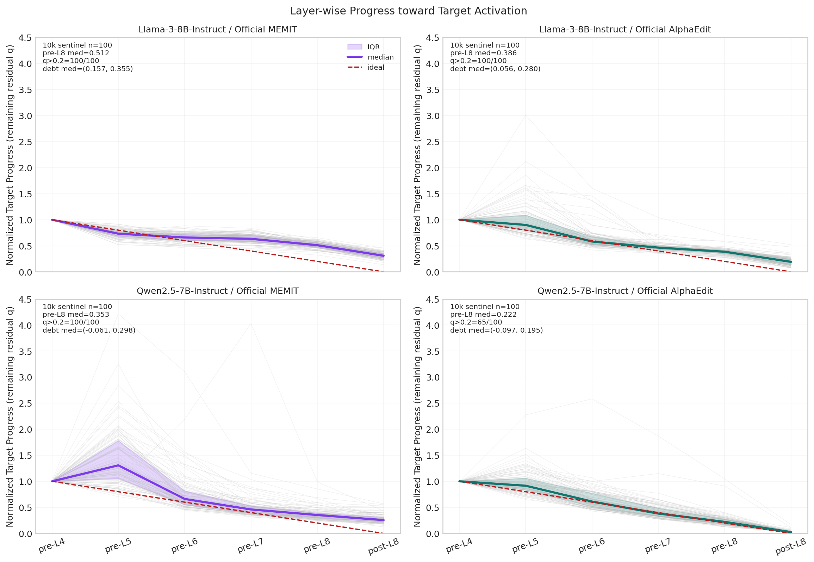
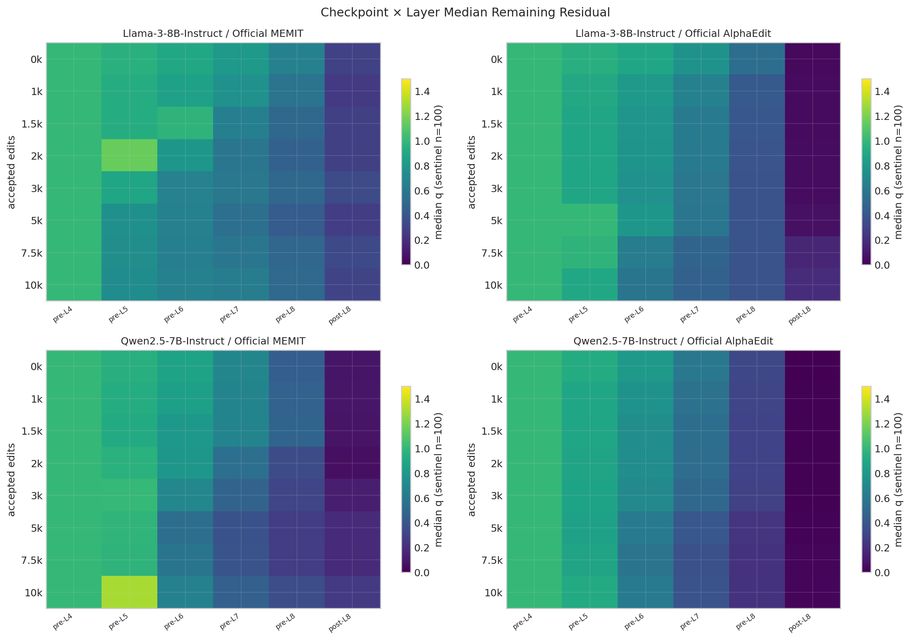
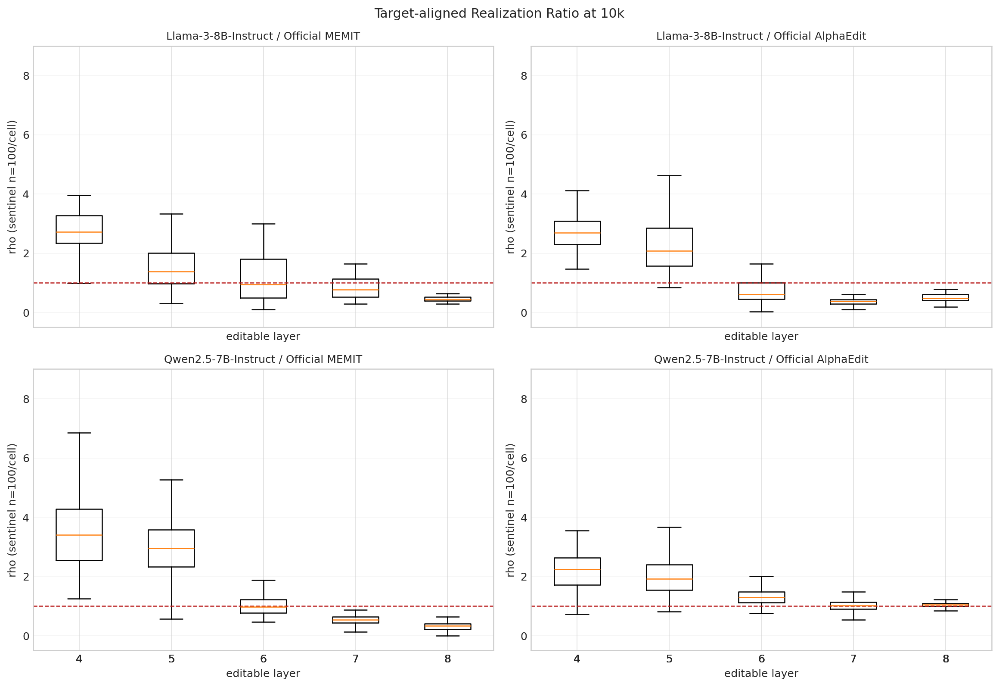
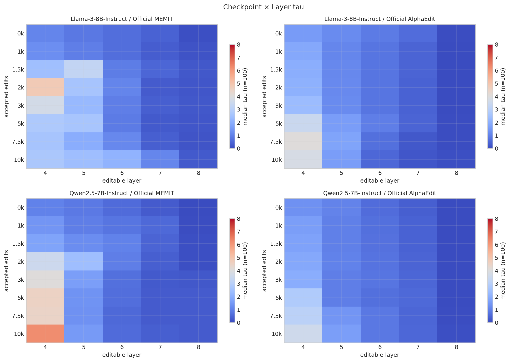

# Official layer-write realization debt — lifelong B100×100 네 arm exhaustive 사실 보고서

상태: **FOUR_ARM_LIFELONG_10K_TERMINAL_VALID**
범위: Llama/Qwen × Official MEMIT/AlphaEdit 네 arm을 모두 동등한 PRIMARY SCIENTIFIC SCOPE로 분석했다. 각 arm은 B100 100개를 누적한 10,000-request sequential trajectory다. `scientific_promotion=false`다.

## 1. Executive factual findings

아래 첫 표의 final-W 성능은 10k checkpoint의 current B100 평가다. NLL은 `mean/median/p90/max`, strict는 `성공 prompt/전체 prompt (율)`이다. q는 고정 sentinel 100개의 10k checkpoint 값이다.

| 모델 | 방법 | final-W Eff strict | final-W Gen strict | final-W Loc strict | Rewrite new NLL mean/med/p90/max | Rephrase new NLL mean/med/p90/max | q pre/post-L8 med |
|---|---|---:|---:|---:|---:|---:|---:|
| Llama-3-8B-Instruct | Official MEMIT | 27/100 (0.270) | 17/200 (0.085) | 5/1000 (0.005) | 5.4301/5.0030/10.8083/13.4911 | 9.5051/10.0216/12.8003/21.1107 | 0.5116/0.3080 |
| Llama-3-8B-Instruct | Official AlphaEdit | 99/100 (0.990) | 103/200 (0.515) | 9/1000 (0.009) | 0.1949/0.0108/0.6664/2.7910 | 3.6938/3.3068/8.3026/14.3747 | 0.3860/0.1918 |
| Qwen2.5-7B-Instruct | Official MEMIT | 0/100 (0.000) | 0/200 (0.000) | 0/1000 (0.000) | 17.9274/16.4052/24.7327/45.4729 | 18.1673/16.9920/25.2341/38.8369 | 0.3534/0.2557 |
| Qwen2.5-7B-Instruct | Official AlphaEdit | 64/100 (0.640) | 34/200 (0.170) | 3/1000 (0.003) | 3.5243/1.1896/9.1265/16.2187 | 7.4472/7.9704/12.3221/15.5665 | 0.2219/0.0255 |

### 핵심 판정

- **FACT — terminal closure:** terminal sentinel post-L8 q 중앙값은 Llama MEMIT/AlphaEdit, Qwen MEMIT/AlphaEdit 순서로 아래 표와 CSV에 기록된다. AlphaEdit가 두 모델에서 MEMIT보다 낮지만 0은 아니다.
- **FACT — 성능과 보존:** 10k에서 AlphaEdit는 MEMIT보다 rewrite/rephrase strict가 높다. 그러나 locality strict는 네 arm 모두 0~9/1000으로 절대적으로 매우 낮고 earliest-edit rewrite strict는 네 arm 모두 0이다. Qwen MEMIT는 terminal current rewrite/rephrase strict도 0이다.
- **FACT — update 위치는 보편적이지 않다:** Llama 두 방법은 10k sentinel에서 L8 update share가 가장 크지만, Qwen은 L4가 가장 크다. 따라서 universal last-layer bottleneck은 관찰되지 않았다.
- **INFERENCE — progressive decoupling은 model-conditioned:** checkpoint D_TV는 Llama에서 t0→10k 증가하지만 Qwen에서는 감소한다. 네 arm 공통의 단조 증가 claim은 성립하지 않는다.
- **INFERENCE — barrier 동기 부여는 미확정:** registered completion geometry는 관찰되었지만 preregistered failure envelope와 독립 onset label이 없어서 T_G/T_A/T_Z/T_F 및 early prediction은 식별할 수 없다.
- **NON-CLAIM:** 이 observational study는 barrier benefit, ODE 필요성, 인과 효과, universal layer bottleneck을 입증하지 않는다.

질문에 대한 한 문장 답: **lifelong editing은 모든 arm에서 update magnitude와 target progress를 동일하게 움직이지 않았지만 그 decoupling의 진행 방향은 모델별로 달랐고, 현재 completion-geometry 기록만으로 failure를 충분히 일찍 예측하거나 completion-reserve barrier를 정당화할 수는 없다.**

그림 분모: 10k sentinel n=100/arm. 회색선은 request, 굵은선은 median, band는 IQR, 점선은 ideal `[1,.8,.6,.4,.2,0]`; missing interpolation/imputation=0.

## 2. Provenance, jobs, denominators, invariants

| 모델 | 방법 | canonical job | source HEAD/tree | batches | requests | checkpoints | raw members/bytes | raw member root |
|---|---|---|---|---:|---:|---:|---:|---|
| Llama-3-8B-Instruct | Official MEMIT | 32424 | `85a05d0a831db667fc68c27e634302eb30cc7d79` / `84113d14cb0427afd871448fd4a5c870c7f31153` | 100 | 10000 | 8 | 117/9470818583 | `961149f2751a3388b348c484bed882158660f0ae85b946c9bb69077a89528a85` |
| Llama-3-8B-Instruct | Official AlphaEdit | 32380 | `85a05d0a831db667fc68c27e634302eb30cc7d79` / `84113d14cb0427afd871448fd4a5c870c7f31153` | 100 | 10000 | 8 | 117/38248437276 | `191a075ab53e77b662ccd82a609a83bbea43b503fa660432c2994bb97e1d2ed5` |
| Qwen2.5-7B-Instruct | Official MEMIT | 31686_1 | `85a05d0a831db667fc68c27e634302eb30cc7d79` / `84113d14cb0427afd871448fd4a5c870c7f31153` | 100 | 10000 | 8 | 117/10938883628 | `02c27c740c26c04430a06549fb58e8739a4eddb032b2adee3b61da0d2c7f791c` |
| Qwen2.5-7B-Instruct | Official AlphaEdit | 31651_0 (JobIDRaw=31652) | `583aaa3f65602c13174ba4426ddb0f6a18ae7e82` / `601d394d77f676cb247aa44f9389c0ccc29a0f54` | 100 | 10000 | 8 | 117/61186136329 | `d5256efd74db14f5b23a5a6ab786aa139844048b040bf4a68096feff5c8c3b5a` |

- Canonical result roots와 모든 journal/checkpoint/state/log/receipt 절대경로·SHA는 `raw-member-inventory.csv`와 `analysis-manifest.json`에 있다.
- 공통 stream/order/sentinel/evaluator identity와 pinned stock EasyEdit HEAD/tree는 manifest 외부 입력에 봉인했다.
- 합계: arm 4/4, B100 400/400, training requests 40,000/40,000, checkpoints 32/32, primary sentinel observations 3,200, AlphaEdit reset-cache observations 1,600, 전체 checkpoint observations 4,800.
- Arm별 compute_z=10,000, recompute=0, layer observation=500, terminal forward=100. W commit→next entry=99/99; W0/cache terminal restore=4/4; nonfinite=0, rollback violation=0, imputation=0.
- AlphaEdit는 성공 B100마다 신규 100개를 append했고, consume width는 그 시점의 전체 prior-history width(0→9,900)였다. Exit cache width는 0→10,000으로 연속 증가했다. MEMIT은 static covariance computation cache만 사용했고 request-history state를 만들지 않았다.
- Edited weight 5/5는 `torch.float32`; BF16/FP16 parameter=0. GPU peak memory, total forward, JVP/VJP/HVP, autocast/quantization/numeric-cast inventory는 schema에 없으므로 추정하지 않았다.

## 3. Residual trajectory와 lifelong drift

### 3.1 10k sentinel q 분포

통계 열은 `mean/median/IQR/p90/max`; 각 셀 n=100이다.

| 모델 | 방법 | pre-L8 q | post-L8 q | q_pre-L8>0.2 | median trajectory pre-L4→post-L8 |
|---|---|---:|---:|---:|---|
| Llama-3-8B-Instruct | Official MEMIT | 0.5120/0.5116/0.0789/0.5862/0.6543 | 0.3100/0.3080/0.0862/0.3896/0.4579 | 100/100 | 1.0000/0.7319/0.6598/0.6337/0.5116/0.3080 |
| Llama-3-8B-Instruct | Official AlphaEdit | 0.3869/0.3860/0.0538/0.4386/0.7066 | 0.1961/0.1918/0.1092/0.2822/0.5220 | 100/100 | 1.0000/0.9008/0.5817/0.4647/0.3860/0.1918 |
| Qwen2.5-7B-Instruct | Official MEMIT | 0.3733/0.3534/0.0914/0.4947/0.9901 | 0.2791/0.2557/0.0880/0.4012/0.5682 | 100/100 | 1.0000/1.3066/0.6617/0.4595/0.3534/0.2557 |
| Qwen2.5-7B-Instruct | Official AlphaEdit | 0.2447/0.2219/0.0910/0.3174/1.0475 | 0.0309/0.0255/0.0201/0.0487/0.1699 | 65/100 | 1.0000/0.9153/0.6122/0.3813/0.2219/0.0255 |

### 3.2 fixed sentinel의 t0→10k paired 변화

동일 request hash n=100/arm의 `10k−t0` median이다.

| 모델 | 방법 | Δpre-L8 q | Δpost-L8 q | Δd∥ | Δd⊥ | Δmean ρ | Δmean τ | ΔD_TV | Δcenter |
|---|---|---:|---:|---:|---:|---:|---:|---:|---:|
| Llama-3-8B-Instruct | Official MEMIT | -0.1424 | 0.0159 | -0.1587 | -0.0277 | 0.9053 | 1.1062 | 0.1361 | -1.1353 |
| Llama-3-8B-Instruct | Official AlphaEdit | -0.1692 | 0.1500 | -0.0932 | -0.1559 | 0.6361 | 0.3722 | 0.2403 | -1.4260 |
| Qwen2.5-7B-Instruct | Official MEMIT | -0.1068 | 0.1709 | -0.2298 | 0.0569 | 1.0172 | 1.2518 | -0.0838 | -1.6967 |
| Qwen2.5-7B-Instruct | Official AlphaEdit | -0.0982 | 0.0201 | -0.1395 | -0.0262 | 0.6685 | 0.6590 | -0.0315 | -1.0161 |

### 3.3 모든 registered checkpoint

Weight total은 sentinel probe의 5개 layer Frobenius magnitude 합이다. Functional strict는 그 checkpoint의 current B100이며 t0에는 PRE_EDIT sentinel을 쓴다.

| 모델/방법 | edits | pre/post-L8 q med | q>0.2 | D_TV med | Δcenter med | update total | V̄/unreachable/min h̄ | rewrite/rephrase/locality strict |
|---|---:|---:|---:|---:|---:|---:|---:|---|
| LM | 0 | 0.6568/0.2923 | 100/100 | 0.1176 | 0.3615 | 18.4125 | 3.4896/0.2672/-2.6304 | 0/100 (0.000)/0/200 (0.000)/281/1000 (0.281) |
| LM | 1000 | 0.5711/0.2564 | 100/100 | 0.0983 | 0.2502 | 39.1237 | 1.4711/0.6431/-0.6874 | 100/100 (1.000)/152/200 (0.760)/201/1000 (0.201) |
| LM | 1500 | 0.5092/0.2832 | 100/100 | 0.2450 | -0.3894 | 90.8305 | 2.9271/0.7196/-5.8631 | 98/100 (0.980)/170/200 (0.850)/158/1000 (0.158) |
| LM | 2000 | 0.4656/0.2842 | 100/100 | 0.3739 | -0.8107 | 139.5007 | 5.9076/0.7769/-5.1925 | 89/100 (0.890)/138/200 (0.690)/38/1000 (0.038) |
| LM | 3000 | 0.5083/0.3416 | 100/100 | 0.3551 | -1.0403 | 78.9746 | 1.4947/0.6901/-1.0246 | 86/100 (0.860)/66/200 (0.330)/37/1000 (0.037) |
| LM | 5000 | 0.4361/0.2719 | 100/100 | 0.3293 | -0.9754 | 138.2773 | 2.3654/0.5926/-1.5082 | 19/100 (0.190)/7/200 (0.035)/1/1000 (0.001) |
| LM | 7500 | 0.4963/0.3318 | 100/100 | 0.3319 | -1.0377 | 114.2469 | 3.7803/0.5535/-2.8510 | 68/100 (0.680)/40/200 (0.200)/15/1000 (0.015) |
| LM | 10000 | 0.5116/0.3080 | 100/100 | 0.2554 | -0.7540 | 136.3196 | 3.2385/0.5224/-2.2385 | 27/100 (0.270)/17/200 (0.085)/5/1000 (0.005) |
| LA | 0 | 0.5401/0.0382 | 100/100 | 0.1317 | 0.3883 | 20.9372 | 1.5437/0.4105/-0.7157 | 0/100 (0.000)/0/200 (0.000)/281/1000 (0.281) |
| LA | 1000 | 0.4261/0.0437 | 100/100 | 0.0607 | 0.0799 | 31.4208 | 2.9493/0.3708/-2.2174 | 100/100 (1.000)/166/200 (0.830)/217/1000 (0.217) |
| LA | 1500 | 0.4079/0.0458 | 100/100 | 0.0583 | -0.0067 | 33.6092 | 3.1732/0.3683/-2.4427 | 100/100 (1.000)/158/200 (0.790)/186/1000 (0.186) |
| LA | 2000 | 0.3963/0.0483 | 100/100 | 0.0693 | -0.0585 | 36.6695 | 3.4812/0.3644/-2.7362 | 100/100 (1.000)/165/200 (0.825)/148/1000 (0.148) |
| LA | 3000 | 0.3835/0.0509 | 100/100 | 0.0722 | -0.1156 | 41.4803 | 3.7123/0.3687/-3.0401 | 100/100 (1.000)/164/200 (0.820)/128/1000 (0.128) |
| LA | 5000 | 0.3926/0.0692 | 100/100 | 0.1444 | -0.3683 | 60.7452 | 4.9702/0.5650/-4.5730 | 99/100 (0.990)/150/200 (0.750)/66/1000 (0.066) |
| LA | 7500 | 0.3890/0.1601 | 100/100 | 0.3265 | -0.8911 | 104.9500 | 8.4321/0.5957/-7.4321 | 100/100 (1.000)/105/200 (0.525)/9/1000 (0.009) |
| LA | 10000 | 0.3860/0.1918 | 100/100 | 0.3763 | -1.0401 | 137.8613 | 13.6264/0.6052/-12.6264 | 99/100 (0.990)/103/200 (0.515)/9/1000 (0.009) |
| QM | 0 | 0.4501/0.0875 | 100/100 | 0.4384 | 1.3317 | 155.3193 | 3.7331/0.6266/-3.2549 | 0/100 (0.000)/0/200 (0.000)/182/1000 (0.182) |
| QM | 1000 | 0.4712/0.0896 | 100/100 | 0.3880 | 1.1820 | 123.2348 | 1.2297/0.5844/-0.6911 | 100/100 (1.000)/147/200 (0.735)/126/1000 (0.126) |
| QM | 1500 | 0.4807/0.0795 | 100/100 | 0.3466 | 1.1160 | 188.7382 | 1.0609/0.6628/-0.3439 | 96/100 (0.960)/113/200 (0.565)/74/1000 (0.074) |
| QM | 2000 | 0.3460/0.0627 | 99/100 | 0.2819 | 0.4225 | 315.9665 | 0.6458/0.8012/-0.3089 | 98/100 (0.980)/152/200 (0.760)/30/1000 (0.030) |
| QM | 3000 | 0.3137/0.1271 | 95/100 | 0.2569 | 0.1682 | 509.4898 | 0.7418/0.8481/-0.9659 | 9/100 (0.090)/4/200 (0.020)/0/1000 (0.000) |
| QM | 5000 | 0.2712/0.1835 | 91/100 | 0.2423 | -0.2201 | 498.1988 | 0.5692/0.6793/-0.1782 | 0/100 (0.000)/0/200 (0.000)/0/1000 (0.000) |
| QM | 7500 | 0.2727/0.1782 | 97/100 | 0.2733 | -0.1311 | 519.0698 | 0.6531/0.5665/-0.1389 | 0/100 (0.000)/0/200 (0.000)/0/1000 (0.000) |
| QM | 10000 | 0.3534/0.2557 | 100/100 | 0.3450 | -0.3753 | 604.1410 | 0.6330/0.6159/-0.2263 | 0/100 (0.000)/0/200 (0.000)/0/1000 (0.000) |
| QA | 0 | 0.3246/0.0047 | 100/100 | 0.2410 | 0.6424 | 109.1978 | 8.4228/0.6918/-7.5113 | 0/100 (0.000)/0/200 (0.000)/182/1000 (0.182) |
| QA | 1000 | 0.3163/0.0074 | 100/100 | 0.2046 | 0.5430 | 104.2912 | 4.2839/0.5605/-3.2994 | 100/100 (1.000)/154/200 (0.770)/99/1000 (0.099) |
| QA | 1500 | 0.3004/0.0081 | 99/100 | 0.1875 | 0.5004 | 113.2183 | 4.3552/0.5553/-3.3659 | 100/100 (1.000)/153/200 (0.765)/88/1000 (0.088) |
| QA | 2000 | 0.3000/0.0093 | 99/100 | 0.1774 | 0.4807 | 117.6864 | 3.7027/0.5505/-2.7752 | 100/100 (1.000)/158/200 (0.790)/61/1000 (0.061) |
| QA | 3000 | 0.2898/0.0103 | 100/100 | 0.1617 | 0.4270 | 156.4622 | 4.9355/0.6082/-3.9355 | 98/100 (0.980)/140/200 (0.700)/48/1000 (0.048) |
| QA | 5000 | 0.2300/0.0132 | 82/100 | 0.1135 | -0.0636 | 243.4389 | 4.1154/0.6028/-3.5159 | 94/100 (0.940)/130/200 (0.650)/10/1000 (0.010) |
| QA | 7500 | 0.2173/0.0187 | 59/100 | 0.1827 | -0.2656 | 385.0033 | 2.9143/0.6491/-2.0676 | 91/100 (0.910)/69/200 (0.345)/3/1000 (0.003) |
| QA | 10000 | 0.2219/0.0255 | 65/100 | 0.2153 | -0.3848 | 613.6856 | 2.1977/0.6185/-1.4843 | 64/100 (0.640)/34/200 (0.170)/3/1000 (0.003) |

분모: sentinel n=100/checkpoint/arm. Heatmap은 고정 schedule 8개 checkpoint의 median이며 보간하지 않았다.

## 4. Allocation–realization: A, Y, E, ρ, τ

A/Y/E full vectors는 publish되지 않았다. 저장된 normalized scalar에서 `Y∥=ρA`, `Y⊥ norm=τA`, `E∥=(1−ρ)A`, `E⊥ norm=τA`만 결정적으로 파생했다. 직교 벡터의 방향은 추정하지 않았다.

아래 값은 10k sentinel n=100/layer/arm이고 각 scalar는 `mean/median/IQR/p90/max`다.

| arm | L | A/R1 | Y/R1 | E/R1 | ρ | τ | Y∥/R1 | Y⊥/R1 | E∥/R1 | E⊥ norm/R1 | under/over/opposite/exact |
|---|---:|---:|---:|---:|---:|---:|---:|---:|---:|---:|---:|
| LM | 4 | 0.2000/0.2000/0.0000/0.2000/0.2000 | 0.7794/0.8010/0.2117/0.9789/1.0555 | 0.6562/0.6761/0.2057/0.8521/0.9207 | 2.7365/2.7226/0.9260/3.5724/3.9551 | 2.7475/2.6999/0.8738/3.4732/4.0470 | 0.5473/0.5445/0.1852/0.7145/0.7910 | 0.5495/0.5400/0.1748/0.6946/0.8094 | -0.3473/-0.3445/0.1852/-0.1699/0.0012 | 0.5495/0.5400/0.1748/0.6946/0.8094 | 1/99/0/0 |
| LM | 5 | 0.1822/0.1830/0.0217/0.2085/0.2289 | 0.5380/0.5038/0.3276/0.8535/1.0542 | 0.4748/0.4397/0.2890/0.7572/0.9118 | 1.5339/1.3873/1.0400/2.7370/3.3407 | 2.4525/2.4150/1.2757/3.6330/4.5604 | 0.2856/0.2547/0.2091/0.5157/0.7416 | 0.4496/0.4348/0.2655/0.7034/0.7912 | -0.1034/-0.0714/0.1888/0.0521/0.1299 | 0.4496/0.4348/0.2655/0.7034/0.7912 | 27/73/0/0 |
| LM | 6 | 0.2201/0.2199/0.0379/0.2560/0.2945 | 0.5203/0.4920/0.5118/0.8897/1.0661 | 0.4761/0.4458/0.3890/0.7809/0.9035 | 1.1500/0.9420/1.3094/2.2611/2.9949 | 1.9667/2.1034/1.3411/3.0059/3.2471 | 0.2654/0.2084/0.3234/0.5511/0.7272 | 0.4405/0.4450/0.3780/0.7135/0.8118 | -0.0453/0.0111/0.3059/0.1549/0.2195 | 0.4405/0.4450/0.3780/0.7135/0.8118 | 53/47/0/0 |
| LM | 7 | 0.3200/0.3168/0.0583/0.3743/0.4171 | 0.4346/0.4347/0.2832/0.6633/0.7667 | 0.3599/0.3536/0.1413/0.4783/0.5439 | 0.8322/0.7708/0.6125/1.2725/1.6464 | 1.0241/1.1143/0.3535/1.3099/1.5392 | 0.2746/0.2385/0.2352/0.4896/0.5924 | 0.3317/0.3425/0.1684/0.4677/0.5362 | 0.0454/0.0684/0.1852/0.1851/0.2273 | 0.3317/0.3425/0.1684/0.4677/0.5362 | 64/36/0/0 |
| LM | 8 | 0.5120/0.5116/0.0789/0.5862/0.6543 | 0.2683/0.2625/0.0567/0.3299/0.4238 | 0.3100/0.3080/0.0862/0.3896/0.4579 | 0.4563/0.4435/0.1268/0.5887/0.6374 | 0.2531/0.2511/0.0884/0.3324/0.4485 | 0.2323/0.2250/0.0635/0.2994/0.3704 | 0.1291/0.1300/0.0393/0.1816/0.2093 | 0.2797/0.2758/0.0980/0.3625/0.4390 | 0.1291/0.1300/0.0393/0.1816/0.2093 | 100/0/0/0 |
| LA | 4 | 0.2000/0.2000/0.0000/0.2000/0.2000 | 1.0329/0.9669/0.3313/1.5895/2.9790 | 0.9386/0.8514/0.3605/1.5301/2.9579 | 2.6806/2.6868/0.7854/3.4336/4.1152 | 4.3295/3.8000/1.8427/7.0511/14.7513 | 0.5361/0.5374/0.1571/0.6867/0.8230 | 0.8659/0.7600/0.3685/1.4102/2.9503 | -0.3361/-0.3374/0.1571/-0.1829/0.0841 | 0.8659/0.7600/0.3685/1.4102/2.9503 | 1/99/0/0 |
| LA | 5 | 0.2512/0.2252/0.0718/0.3564/0.7520 | 0.7858/0.6070/0.4963/1.4521/3.6649 | 0.6089/0.4674/0.4436/1.1572/3.0036 | 2.3124/2.0772/1.2764/3.9241/4.6263 | 1.7046/1.5885/0.7865/2.4000/3.3922 | 0.6346/0.4554/0.4563/1.2415/3.3082 | 0.4445/0.3803/0.2865/0.6864/1.5771 | -0.3835/-0.2389/0.3480/-0.0851/0.0301 | 0.4445/0.3803/0.2865/0.6864/1.5771 | 1/99/0/0 |
| LA | 6 | 0.2120/0.1939/0.0489/0.2482/0.5351 | 0.2700/0.1592/0.1486/0.4965/1.7132 | 0.2126/0.1314/0.0485/0.3345/1.3216 | 0.8648/0.6099/0.5472/1.6703/3.2048 | 0.6317/0.5132/0.4413/1.0714/2.2940 | 0.2208/0.1158/0.1263/0.3958/1.3780 | 0.1502/0.0981/0.0911/0.2759/1.0179 | -0.0088/0.0720/0.1013/0.1171/0.2026 | 0.1502/0.0981/0.0911/0.2759/1.0179 | 74/26/0/0 |
| LA | 7 | 0.2377/0.2323/0.0272/0.2696/0.5215 | 0.1108/0.0987/0.0530/0.1439/0.4938 | 0.1612/0.1599/0.0306/0.1885/0.2824 | 0.3884/0.3743/0.1450/0.5074/1.3185 | 0.2361/0.2062/0.1269/0.3944/0.7083 | 0.0944/0.0863/0.0340/0.1244/0.4350 | 0.0565/0.0472/0.0297/0.0930/0.2337 | 0.1432/0.1461/0.0425/0.1805/0.2812 | 0.0565/0.0472/0.0297/0.0930/0.2337 | 98/2/0/0 |
| LA | 8 | 0.3869/0.3860/0.0538/0.4386/0.7066 | 0.1947/0.1913/0.0572/0.2551/0.3267 | 0.1961/0.1918/0.1092/0.2822/0.5220 | 0.5101/0.4814/0.2052/0.7310/0.7939 | 0.0649/0.0635/0.0300/0.0880/0.1513 | 0.1925/0.1887/0.0595/0.2544/0.3263 | 0.0251/0.0237/0.0135/0.0357/0.0696 | 0.1943/0.1893/0.1099/0.2810/0.5199 | 0.0251/0.0237/0.0135/0.0357/0.0696 | 100/0/0/0 |
| QM | 4 | 0.2000/0.2000/0.0000/0.2000/0.2000 | 1.5633/1.4535/0.8353/2.2340/4.3490 | 1.4803/1.3632/0.8326/2.1771/4.3039 | 3.5456/3.4030/1.7399/5.3149/8.1919 | 6.8605/6.2311/3.8648/10.0601/21.0677 | 0.7091/0.6806/0.3480/1.0630/1.6384 | 1.3721/1.2462/0.7730/2.0120/4.2135 | -0.5091/-0.4806/0.3480/-0.1813/-0.0490 | 1.3721/1.2462/0.7730/2.0120/4.2135 | 0/100/0/0 |
| QM | 5 | 0.3611/0.3266/0.1811/0.5092/1.0536 | 1.3629/1.1879/0.9009/2.3359/6.5173 | 1.0659/0.9157/0.7668/1.9396/5.5618 | 3.0313/2.9536/1.2585/4.2703/5.9850 | 1.7279/1.5238/0.8092/2.4138/8.9638 | 1.1912/1.0071/0.7964/2.0644/6.0042 | 0.6299/0.5347/0.3869/1.0508/2.5347 | -0.8301/-0.6653/0.6784/-0.1868/0.0889 | 0.6299/0.5347/0.3869/1.0508/2.5347 | 1/99/0/0 |
| QM | 6 | 0.2564/0.2206/0.0881/0.3726/1.0343 | 0.3956/0.2508/0.2006/0.6438/5.6991 | 0.2408/0.1241/0.0845/0.3538/5.0989 | 1.1237/0.9692/0.4545/1.6348/6.5642 | 0.6170/0.5627/0.2278/0.8130/4.2062 | 0.3477/0.2130/0.1954/0.5563/4.7985 | 0.1804/0.1178/0.0745/0.2629/3.0748 | -0.0913/0.0062/0.0955/0.0641/0.1401 | 0.1804/0.1178/0.0745/0.2629/3.0748 | 53/47/0/0 |
| QM | 7 | 0.2627/0.2298/0.0697/0.3333/2.0151 | 0.2059/0.1435/0.0675/0.2779/3.7212 | 0.1656/0.1352/0.0457/0.2110/1.8312 | 0.5638/0.5341/0.2001/0.7318/1.7922 | 0.3907/0.3592/0.1532/0.6099/1.0705 | 0.1730/0.1190/0.0673/0.2401/3.6115 | 0.1008/0.0843/0.0391/0.1434/0.8972 | 0.0898/0.1049/0.0466/0.1633/0.2636 | 0.1008/0.0843/0.0391/0.1434/0.8972 | 96/4/0/0 |
| QM | 8 | 0.3733/0.3534/0.0914/0.4947/0.9901 | 0.1733/0.1532/0.0702/0.2499/0.6010 | 0.2791/0.2557/0.0880/0.4012/0.5682 | 0.3215/0.3318/0.1839/0.4970/0.7555 | 0.3141/0.2928/0.1424/0.4515/0.7223 | 0.1216/0.1034/0.0745/0.2070/0.5847 | 0.1123/0.1032/0.0527/0.1622/0.2203 | 0.2517/0.2318/0.0936/0.3776/0.5577 | 0.1123/0.1032/0.0527/0.1622/0.2203 | 100/0/0/0 |
| QA | 4 | 0.2000/0.2000/0.0000/0.2000/0.2000 | 0.8936/0.8477/0.3241/1.2377/2.2498 | 0.8126/0.7579/0.3500/1.1574/2.2191 | 2.1711/2.2340/0.9240/2.9408/3.5506 | 3.8406/3.5682/1.8601/5.7197/11.0291 | 0.4342/0.4468/0.1848/0.5882/0.7101 | 0.7681/0.7136/0.3720/1.1439/2.2058 | -0.2342/-0.2468/0.1848/-0.0662/0.0543 | 0.7681/0.7136/0.3720/1.1439/2.2058 | 5/95/0/0 |
| QA | 5 | 0.2443/0.2288/0.0574/0.3185/0.5688 | 0.6863/0.5838/0.3843/1.0326/4.4590 | 0.5257/0.4404/0.3248/0.8415/3.9508 | 2.0554/1.9209/0.8528/3.0404/7.1049 | 1.6465/1.6219/0.8130/2.3131/3.3131 | 0.5335/0.4457/0.2606/0.8297/4.0412 | 0.4175/0.3794/0.3117/0.6467/1.8844 | -0.2892/-0.2167/0.2318/-0.0624/0.0412 | 0.4175/0.3794/0.3117/0.6467/1.8844 | 2/98/0/0 |
| QA | 6 | 0.2206/0.2041/0.0841/0.2807/0.8609 | 0.4099/0.3098/0.1750/0.5586/4.2791 | 0.2653/0.1769/0.1585/0.4036/3.4480 | 1.4095/1.2981/0.3726/1.7822/4.8325 | 0.9170/0.8359/0.4226/1.3792/3.2190 | 0.3420/0.2630/0.1190/0.4480/4.1602 | 0.2145/0.1664/0.1302/0.3692/1.0703 | -0.1213/-0.0550/0.0867/-0.0086/0.0730 | 0.2145/0.1664/0.1302/0.3692/1.0703 | 7/93/0/0 |
| QA | 7 | 0.2164/0.1906/0.0765/0.2929/0.9344 | 0.2855/0.2130/0.1266/0.4189/2.8263 | 0.1471/0.1034/0.0828/0.2119/1.9156 | 1.0624/1.0209/0.2430/1.2899/3.1434 | 0.5203/0.5126/0.2618/0.8363/1.0950 | 0.2557/0.1892/0.1070/0.3529/2.7781 | 0.1172/0.0980/0.0836/0.1970/0.6291 | -0.0394/-0.0041/0.0490/0.0399/0.0987 | 0.1172/0.0980/0.0836/0.1970/0.6291 | 46/54/0/0 |
| QA | 8 | 0.2447/0.2219/0.0910/0.3174/1.0475 | 0.2572/0.2275/0.1124/0.3275/1.2150 | 0.0309/0.0255/0.0201/0.0487/0.1699 | 1.0446/1.0435/0.1020/1.1853/1.3373 | 0.0821/0.0713/0.0574/0.1547/0.2558 | 0.2564/0.2270/0.1121/0.3271/1.2146 | 0.0183/0.0171/0.0119/0.0322/0.0413 | -0.0117/-0.0098/0.0244/0.0178/0.0868 | 0.0183/0.0171/0.0119/0.0322/0.0413 | 31/69/0/0 |

## 5. Inherited debt와 recurrence closure

| arm | d∥ mean/med/IQR/p90/max | d⊥ mean/med/IQR/p90/max | recurrence mean/med/p90/max | worst request hash | violations/<1e-4 denom |
|---|---:|---:|---:|---|---:|
| LM | 0.1620/0.1568/0.1126/0.2486/0.3420 | 0.3561/0.3549/0.0723/0.4209/0.4703 | 1.081e-17/9.326e-18/1.781e-17/2.279e-17 | `aab746360def8be4469d3c7cf41498cfa56ee2814112798e36b73859f0ad7eb7` | 0/100 |
| LA | 0.0512/0.0558/0.0677/0.1143/0.2455 | 0.2880/0.2802/0.0650/0.3543/0.6935 | 1.455e-17/1.060e-17/2.504e-17/6.408e-17 | `a2504ec4d20467287c8ffe7efb9af95148999619a5259f45d962d45740dae6a2` | 0/100 |
| QM | -0.0454/-0.0613/0.0816/0.0468/0.1992 | 0.3318/0.2982/0.1067/0.4520/0.9892 | 2.166e-17/1.839e-17/3.576e-17/9.350e-17 | `9d8b7f9f68f5c75bd4737fbfe169d23d8e15ba10ba5d2a5acd88d2e0ec68032f` | 0/100 |
| QA | -0.0963/-0.0969/0.0441/-0.0496/-0.0239 | 0.2171/0.1945/0.0942/0.2957/1.0448 | 1.499e-17/1.280e-17/1.986e-17/9.613e-17 | `93ad994356fe678654023901f37f9e27d5f12b5ef412912e01a36c992f7fda44` | 0/100 |

All outliers are finite, identity-valid raw members. Worst identities and top-10 p90/max drivers are in `outlier-ledger.csv`; raw prompts are not published.

## 6. Layer-wise update magnitude/share

Activation progress와 weight action은 서로 다른 축이다. Production 통계의 독립 관측 단위는 B100 batch n=100/layer/arm이며 request 100개로 복제하지 않았다.

| arm | L | production ΔW magnitude mean/med/IQR/p90/max | production share mean/med/IQR/p90/max | 10k sentinel magnitude/share |
|---|---:|---:|---:|---:|
| LM | 4 | 18.8261/20.6004/9.4740/25.7599/27.7523 | 0.1813/0.1859/0.0179/0.2002/0.2092 | 26.9119/0.1974 |
| LM | 5 | 16.3045/17.3538/5.1434/21.6638/26.2385 | 0.1604/0.1559/0.0116/0.1814/0.2091 | 19.9172/0.1461 |
| LM | 6 | 13.4343/14.0628/6.1321/20.0214/25.2477 | 0.1352/0.1287/0.0382/0.1684/0.1951 | 14.5065/0.1064 |
| LM | 7 | 20.2270/22.0727/7.7755/26.7715/29.8233 | 0.2011/0.2002/0.0070/0.2133/0.2147 | 27.5055/0.2018 |
| LM | 8 | 32.7391/36.1053/14.0735/44.8858/47.2559 | 0.3220/0.3248/0.0267/0.3467/0.3544 | 47.4785/0.3483 |
| LA | 4 | 10.2358/8.4708/8.3331/18.3263/21.7898 | 0.1463/0.1475/0.0103/0.1531/0.1597 | 21.9840/0.1595 |
| LA | 5 | 12.5905/10.2881/12.5390/23.1260/28.1115 | 0.1721/0.1689/0.0259/0.1962/0.2044 | 26.9896/0.1958 |
| LA | 6 | 12.5039/11.2416/11.2291/20.6608/24.0187 | 0.1793/0.1807/0.0055/0.1841/0.1870 | 21.9431/0.1592 |
| LA | 7 | 14.0430/13.4921/10.4497/21.7546/25.0409 | 0.2085/0.2201/0.0298/0.2244/0.2273 | 24.4588/0.1774 |
| LA | 8 | 20.7531/17.3935/19.2738/36.8338/43.6171 | 0.2938/0.2943/0.0145/0.3026/0.3173 | 42.4857/0.3082 |
| QM | 4 | 234.9343/265.5902/99.0599/321.1063/422.5914 | 0.4885/0.4906/0.0793/0.5471/0.6052 | 271.2696/0.4490 |
| QM | 5 | 55.5655/53.1529/13.7718/80.4404/99.5414 | 0.1345/0.1062/0.1010/0.2170/0.2395 | 60.9045/0.1008 |
| QM | 6 | 65.0448/65.9591/22.7692/99.8964/146.9477 | 0.1336/0.1302/0.0290/0.1717/0.2245 | 101.1565/0.1674 |
| QM | 7 | 53.6350/58.1161/19.4140/74.0009/101.0963 | 0.1162/0.1159/0.0181/0.1317/0.1429 | 89.7010/0.1485 |
| QM | 8 | 58.3921/65.4837/18.2990/77.2914/94.6252 | 0.1271/0.1264/0.0136/0.1435/0.1586 | 81.1093/0.1343 |
| QA | 4 | 88.0091/74.4665/92.4615/151.3842/533.0186 | 0.2747/0.2647/0.0446/0.3094/0.5981 | 167.2712/0.2726 |
| QA | 5 | 44.1683/44.7923/21.3110/62.4927/76.9345 | 0.1814/0.1649/0.1151/0.2523/0.2769 | 77.3231/0.1260 |
| QA | 6 | 45.5212/40.4554/49.4715/85.3721/98.5385 | 0.1527/0.1526/0.0173/0.1703/0.1935 | 100.5019/0.1638 |
| QA | 7 | 63.8103/58.7891/72.7496/113.0432/142.4894 | 0.2128/0.2172/0.0358/0.2382/0.2556 | 146.7555/0.2391 |
| QA | 8 | 53.4252/46.7589/59.0388/96.4405/127.4659 | 0.1784/0.1761/0.0325/0.2116/0.2314 | 121.8338/0.1985 |

그림 제목은 `Layer-wise Update Magnitude`; n=100 B100 batches/layer/arm. Equal-allocation/ideal line과 `bars:` 문구는 없다.

## 7. Endpoint performance — PRE_EDIT과 terminal final W

### 7.1 PRE_EDIT reference

각 NLL/margin 열은 `mean/median/p90/max`; strict 분모는 실제 prompt 수다.

| 모델 | 방법 cohort | rewrite new NLL | rewrite new margin | rewrite strict | rephrase new NLL | rephrase strict | locality true NLL | locality strict |
|---|---|---:|---:|---:|---:|---:|---:|---:|
| Llama-3-8B-Instruct | Official MEMIT PRE_EDIT | 11.5761/11.7640/16.4094/20.2464 | -11.1748/-11.5588/-5.6046/-1.8011 | 0/100 (0.000) | 10.1912/9.9872/14.3599/17.9728 | 0/200 (0.000) | 4.7884/5.0469/8.6175/12.1227 | 281/1000 (0.281) |
| Llama-3-8B-Instruct | Official AlphaEdit PRE_EDIT | 11.5761/11.7640/16.4094/20.2464 | -11.1748/-11.5588/-5.6046/-1.8011 | 0/100 (0.000) | 10.1912/9.9872/14.3599/17.9728 | 0/200 (0.000) | 4.7884/5.0469/8.6175/12.1227 | 281/1000 (0.281) |
| Qwen2.5-7B-Instruct | Official MEMIT PRE_EDIT | 10.5882/10.3821/15.0318/18.4091 | -9.7410/-9.3683/-5.3664/-0.5653 | 0/100 (0.000) | 10.2340/10.2213/14.2690/18.9477 | 0/200 (0.000) | 5.2254/5.3274/8.5918/10.7814 | 182/1000 (0.182) |
| Qwen2.5-7B-Instruct | Official AlphaEdit PRE_EDIT | 10.5882/10.3821/15.0318/18.4091 | -9.7410/-9.3683/-5.3664/-0.5653 | 0/100 (0.000) | 10.2340/10.2213/14.2690/18.9477 | 0/200 (0.000) | 5.2254/5.3274/8.5918/10.7814 | 182/1000 (0.182) |

### 7.2 10k final-W current B100 detail

| arm | metric | NLL mean/med/p90/max | margin mean/med/p90/max | strict |
|---|---|---:|---:|---:|
| LM | rewrite_target_new | 5.4301/5.0030/10.8083/13.4911 | -2.7091/-2.7099/3.8078/10.7345 | 27/100 (0.270) |
| LM | rewrite_target_true | 11.8147/11.3474/15.8733/21.9046 | -10.0756/-9.3750/-5.6269/-1.3556 | 0/100 (0.000) |
| LM | rephrase_target_new | 9.5051/10.0216/12.8003/21.1107 | -6.8492/-7.0819/-1.2751/3.2965 | 17/200 (0.085) |
| LM | locality_target_true | 12.7149/12.9980/15.5756/20.7855 | -10.8154/-10.8719/-7.2455/-1.9816 | 5/1000 (0.005) |
| LA | rewrite_target_new | 0.1949/0.0108/0.6664/2.7910 | 6.0797/6.1684/9.2369/14.1054 | 99/100 (0.990) |
| LA | rewrite_target_true | 14.5259/14.4404/20.7481/25.3806 | -14.3585/-14.2093/-8.3485/-4.0163 | 0/100 (0.000) |
| LA | rephrase_target_new | 3.6938/3.3068/8.3026/14.3747 | -0.1525/0.2765/5.4713/8.7491 | 103/200 (0.515) |
| LA | locality_target_true | 10.6806/10.4773/14.1168/16.8003 | -8.4927/-8.3754/-5.4449/-3.1692 | 9/1000 (0.009) |
| QM | rewrite_target_new | 17.9274/16.4052/24.7327/45.4729 | -16.5304/-14.7775/-8.8489/-4.2301 | 0/100 (0.000) |
| QM | rewrite_target_true | 18.3685/17.3507/24.0535/48.1942 | -17.0513/-16.6559/-9.4065/-6.2717 | 0/100 (0.000) |
| QM | rephrase_target_new | 18.1673/16.9920/25.2341/38.8369 | -16.8403/-15.9286/-10.5448/-6.4670 | 0/200 (0.000) |
| QM | locality_target_true | 17.7711/16.6738/22.0839/34.1844 | -16.3816/-14.6421/-11.5708/-9.4239 | 0/1000 (0.000) |
| QA | rewrite_target_new | 3.5243/1.1896/9.1265/16.2187 | 0.6994/2.0876/5.4578/10.3995 | 64/100 (0.640) |
| QA | rewrite_target_true | 12.7382/12.5596/16.7625/19.7372 | -10.9876/-10.7975/-7.0254/-4.2639 | 0/100 (0.000) |
| QA | rephrase_target_new | 7.4472/7.9704/12.3221/15.5665 | -4.4589/-4.9739/1.0835/5.5468 | 34/200 (0.170) |
| QA | locality_target_true | 12.3696/12.2035/15.0274/16.6427 | -9.2801/-9.1242/-6.8080/-4.6003 | 3/1000 (0.003) |

### 7.3 Production online B100 endpoints 전체 10k

각 행은 순차 실행 중 각 B100 직후 current request endpoint 10,000개를 합친 값이다. 통계는 `mean/median/p90/max`; strict는 request-level 분자/10,000이다.

| arm | new NLL | true NLL | new margin | true margin | new strict | true strict |
|---|---:|---:|---:|---:|---:|---:|
| LM | 3.1561/0.8715/10.0862/22.4404 | 11.6634/11.6067/15.9163/34.0142 | 1.1813/2.4073/7.1641/18.8108 | -10.2520/-9.8598/-5.5747/5.9792 | 6406/10000 | 17/10000 |
| LA | 0.0718/0.0030/0.0494/16.0287 | 13.9134/13.6079/19.2820/30.8505 | 6.8908/7.0427/9.3742/19.9342 | -13.9169/-13.6261/-8.8952/-1.0372 | 9888/10000 | 0/10000 |
| QM | 10.8821/12.9062/18.1320/45.4729 | 14.4628/14.0974/19.1691/48.1942 | -8.2728/-10.7770/5.8982/15.5088 | -13.2233/-12.7285/-7.8687/0.6506 | 2571/10000 | 2/10000 |
| QA | 0.9052/0.0295/2.7662/18.3518 | 13.2945/13.0329/18.5498/32.1431 | 4.2510/5.0015/7.6875/15.3240 | -12.8812/-12.6860/-7.3787/2.5265 | 8974/10000 | 3/10000 |

### 7.4 Terminal retention

Retention panels record rewrite only; rephrase/locality are `NOT_RECORDED_LOW_COST_BATCH` and are not filled with zero.

| arm | cohort | rewrite new NLL mean/med/p90/max | new strict | rewrite true NLL mean/med/p90/max | true strict |
|---|---|---:|---:|---:|---:|
| LM | retention_earliest | 13.4129/11.9229/18.1379/26.7140 | 0/32 (0.000) | 12.3947/12.4346/16.6091/22.4381 | 0/32 (0.000) |
| LM | retention_recent | 5.2270/4.3172/11.5166/13.4911 | 8/32 (0.250) | 11.9537/11.1507/17.0108/21.9046 | 0/32 (0.000) |
| LM | retention_hash_stratified | 10.2593/10.8319/15.5051/18.6814 | 3/64 (0.047) | 11.7259/11.9966/15.4168/17.1259 | 0/64 (0.000) |
| LA | retention_earliest | 10.0533/9.7546/14.1204/16.0507 | 0/32 (0.000) | 10.0954/10.5791/13.7608/14.6579 | 0/32 (0.000) |
| LA | retention_recent | 0.1739/0.0058/0.3075/2.3217 | 31/32 (0.969) | 15.0873/14.2629/23.4991/25.3806 | 0/32 (0.000) |
| LA | retention_hash_stratified | 7.2346/7.0200/13.3317/15.2843 | 16/64 (0.250) | 10.0289/10.3024/14.4523/16.7529 | 3/64 (0.047) |
| QM | retention_earliest | 17.6107/14.4019/25.4695/38.5881 | 0/32 (0.000) | 17.3905/15.8090/23.9985/35.7321 | 0/32 (0.000) |
| QM | retention_recent | 16.8165/15.2540/22.5361/28.2904 | 0/32 (0.000) | 16.9752/17.0459/22.7745/24.2247 | 0/32 (0.000) |
| QM | retention_hash_stratified | 18.1332/16.3845/25.9730/41.3191 | 0/64 (0.000) | 18.7338/16.6796/29.2842/36.8278 | 0/64 (0.000) |
| QA | retention_earliest | 12.0077/12.4881/16.7111/18.7024 | 0/32 (0.000) | 11.4773/11.6703/16.0311/18.0785 | 1/32 (0.031) |
| QA | retention_recent | 2.8928/0.7933/7.4565/16.2187 | 23/32 (0.719) | 13.1679/13.1961/16.6594/19.7372 | 0/32 (0.000) |
| QA | retention_hash_stratified | 9.0061/9.5058/14.4789/18.5006 | 13/64 (0.203) | 12.1189/11.9515/15.4867/18.6011 | 0/64 (0.000) |

그림 분모: current B100 100 requests/checkpoint/arm; prompt count는 request 안에서만 반영했다. Checkpoint 사이 missing interpolation=0.

## 8. AlphaEdit accumulated-cache vs reset-cache mechanism fork

동일 checkpoint state와 shared sentinel z의 observational clone이다. Production cache policy를 바꾸지 않았으며 probe 후 W/cache exact restore다.

| 모델 | fork | q pre/post-L8 med | D_TV med | update total | V̄ | unreachable |
|---|---|---:|---:|---:|---:|---:|
| Llama-3-8B-Instruct | ACCUMULATED_OR_STATIC | 0.3860/0.1918 | 0.3763 | 137.8613 | 13.6264 | 0.6052 |
| Llama-3-8B-Instruct | RESET_CACHE | 0.2908/0.0459 | 0.3018 | 117.4593 | 1.3712 | 0.6351 |
| Llama-3-8B-Instruct | RESET−ACC paired median | -0.0954/-0.1373 | -0.0719 | N/A | N/A | N/A |
| Qwen2.5-7B-Instruct | ACCUMULATED_OR_STATIC | 0.2219/0.0255 | 0.2153 | 613.6856 | 2.1977 | 0.6185 |
| Qwen2.5-7B-Instruct | RESET_CACHE | 0.2259/0.0261 | 0.2023 | 255.0197 | 1.2429 | 0.6101 |
| Qwen2.5-7B-Instruct | RESET−ACC paired median | 0.0003/0.0010 | -0.0100 | N/A | N/A | N/A |

### 8.1 Ordered vs same-entry layer probe (10k)

Same-entry는 각 layer를 동일 checkpoint-entry W에서 독립 적용한 weight-response probe다. Request-level q/ρ/τ를 기록하지 않았으므로 아래는 layer update/response magnitude 비교이며 target-progress causal estimate가 아니다.

| arm | L | ordered ΔW | same-entry ΔW | same−ordered | same-entry response |
|---|---:|---:|---:|---:|---:|
| LA | 4 | 21.9840 | 21.9840 | 0.0000 | 286.9857 |
| LA | 5 | 26.9896 | 26.9896 | 0.0000 | 92.2843 |
| LA | 6 | 21.9431 | 21.9431 | 0.0000 | 29.5546 |
| LA | 7 | 24.4588 | 24.4588 | 0.0000 | 12.3582 |
| LA | 8 | 42.4857 | 42.4857 | 0.0000 | 20.0329 |
| LM | 4 | 26.9119 | 26.9119 | 0.0000 | 353.2280 |
| LM | 5 | 19.9172 | 19.9172 | 0.0000 | 186.0371 |
| LM | 6 | 14.5065 | 14.5065 | -0.0000 | 224.3964 |
| LM | 7 | 27.5055 | 27.5055 | 0.0000 | 155.5435 |
| LM | 8 | 47.4785 | 47.4785 | 0.0000 | 96.4786 |
| QA | 4 | 167.2712 | 167.2712 | 0.0000 | 3955.2686 |
| QA | 5 | 77.3231 | 77.3231 | 0.0000 | 1781.5029 |
| QA | 6 | 100.5019 | 100.5019 | 0.0000 | 944.4288 |
| QA | 7 | 146.7555 | 146.7555 | 0.0000 | 552.0395 |
| QA | 8 | 121.8338 | 121.8338 | 0.0000 | 470.0931 |
| QM | 4 | 271.2696 | 271.2696 | 0.0000 | 11031.7238 |
| QM | 5 | 60.9045 | 60.9045 | 0.0000 | 6693.2686 |
| QM | 6 | 101.1565 | 101.1565 | 0.0000 | 3534.0101 |
| QM | 7 | 89.7010 | 89.7010 | 0.0000 | 1588.3515 |
| QM | 8 | 81.1093 | 81.1093 | 0.0000 | 1175.1197 |

## 9. Paired model/method comparisons

Production comparisons use exact `(batch_index, request_sha256)` matching, n=10,000 with B100-cluster bootstrap; checkpoint comparisons use fixed sentinel request hash, n=100. Positive is left-minus-right.

| comparison | metric | paired n | mean | median | p90 | 95% bootstrap mean CI | uncertainty unit |
|---|---|---:|---:|---:|---:|---:|---|
| llama3-8b-inst:alphaedit-minus-memit:production | q_pre_L8 | 10000 | 1.1540 | -0.1099 | -0.0010 | -10.5215..9.1675 | PAIRED_BATCH_INDEX_CLUSTER |
| llama3-8b-inst:alphaedit-minus-memit:production | q_post_L8 | 10000 | -0.6145 | -0.2233 | -0.1054 | -11.2804..7.1434 | PAIRED_BATCH_INDEX_CLUSTER |
| llama3-8b-inst:alphaedit-minus-memit:production | d_parallel | 10000 | -0.1742 | -0.1087 | 0.0098 | -0.7802..0.2749 | PAIRED_BATCH_INDEX_CLUSTER |
| llama3-8b-inst:alphaedit-minus-memit:production | d_perp | 10000 | 1.2240 | -0.0360 | 0.0441 | -8.7591..9.3076 | PAIRED_BATCH_INDEX_CLUSTER |
| llama3-8b-inst:alphaedit-minus-memit:production | mean_rho | 10000 | 0.0633 | 0.0997 | 0.5834 | -0.5912..0.6536 | PAIRED_BATCH_INDEX_CLUSTER |
| llama3-8b-inst:alphaedit-minus-memit:production | mean_tau | 10000 | 5.3083 | -0.0267 | 0.6260 | 1.1729..9.7969 | PAIRED_BATCH_INDEX_CLUSTER |
| llama3-8b-inst:alphaedit-minus-memit:production | target_new_nll | 10000 | -3.0843 | -0.8232 | -0.0005 | -3.5975..-2.5907 | PAIRED_BATCH_INDEX_CLUSTER |
| qwen2.5-7b-inst:alphaedit-minus-memit:production | q_pre_L8 | 10000 | 0.4970 | -0.0706 | 0.0524 | -0.0824..1.6469 | PAIRED_BATCH_INDEX_CLUSTER |
| qwen2.5-7b-inst:alphaedit-minus-memit:production | q_post_L8 | 10000 | 0.2503 | -0.1323 | -0.0536 | -0.1560..1.0526 | PAIRED_BATCH_INDEX_CLUSTER |
| qwen2.5-7b-inst:alphaedit-minus-memit:production | d_parallel | 10000 | 0.0075 | -0.0257 | 0.0642 | -0.0438..0.1035 | PAIRED_BATCH_INDEX_CLUSTER |
| qwen2.5-7b-inst:alphaedit-minus-memit:production | d_perp | 10000 | 0.5083 | -0.0554 | 0.0489 | -0.0668..1.6515 | PAIRED_BATCH_INDEX_CLUSTER |
| qwen2.5-7b-inst:alphaedit-minus-memit:production | mean_rho | 10000 | -0.1217 | -0.1035 | 0.4065 | -0.1744..-0.0562 | PAIRED_BATCH_INDEX_CLUSTER |
| qwen2.5-7b-inst:alphaedit-minus-memit:production | mean_tau | 10000 | 0.2917 | -0.3286 | 0.2653 | -0.4570..1.7517 | PAIRED_BATCH_INDEX_CLUSTER |
| qwen2.5-7b-inst:alphaedit-minus-memit:production | target_new_nll | 10000 | -9.9769 | -12.0160 | 0.0003 | -11.1404..-8.8657 | PAIRED_BATCH_INDEX_CLUSTER |
| alphaedit:llama-minus-qwen:production | q_pre_L8 | 10000 | 7.4484 | 0.1457 | 0.2421 | 3.5107..11.9821 | PAIRED_BATCH_INDEX_CLUSTER |
| alphaedit:llama-minus-qwen:production | q_post_L8 | 10000 | 6.2651 | 0.0516 | 0.1793 | 2.8886..10.4058 | PAIRED_BATCH_INDEX_CLUSTER |
| alphaedit:llama-minus-qwen:production | d_parallel | 10000 | 0.0960 | 0.1139 | 0.2032 | -0.0971..0.2761 | PAIRED_BATCH_INDEX_CLUSTER |
| alphaedit:llama-minus-qwen:production | d_perp | 10000 | 7.3932 | 0.0940 | 0.1871 | 3.4275..12.0249 | PAIRED_BATCH_INDEX_CLUSTER |
| alphaedit:llama-minus-qwen:production | mean_rho | 10000 | -0.1869 | -0.1559 | 0.1782 | -0.5983..0.1977 | PAIRED_BATCH_INDEX_CLUSTER |
| alphaedit:llama-minus-qwen:production | mean_tau | 10000 | 6.5668 | 0.1337 | 0.7458 | 2.7307..10.9543 | PAIRED_BATCH_INDEX_CLUSTER |
| alphaedit:llama-minus-qwen:production | target_new_nll | 10000 | -0.8334 | -0.0199 | 0.0079 | -1.0334..-0.6467 | PAIRED_BATCH_INDEX_CLUSTER |
| memit:llama-minus-qwen:production | q_pre_L8 | 10000 | 6.7914 | 0.1804 | 0.3061 | 0.1649..17.5725 | PAIRED_BATCH_INDEX_CLUSTER |
| memit:llama-minus-qwen:production | q_post_L8 | 10000 | 7.1299 | 0.1559 | 0.2724 | 0.1380..18.0000 | PAIRED_BATCH_INDEX_CLUSTER |
| memit:llama-minus-qwen:production | d_parallel | 10000 | 0.2776 | 0.1858 | 0.3145 | -0.2592..0.9097 | PAIRED_BATCH_INDEX_CLUSTER |
| memit:llama-minus-qwen:production | d_perp | 10000 | 6.6775 | 0.0801 | 0.1776 | 0.0634..16.8745 | PAIRED_BATCH_INDEX_CLUSTER |
| memit:llama-minus-qwen:production | mean_rho | 10000 | -0.3719 | -0.3184 | 0.2186 | -0.7411..-0.0155 | PAIRED_BATCH_INDEX_CLUSTER |
| memit:llama-minus-qwen:production | mean_tau | 10000 | 1.5502 | -0.1233 | 0.5079 | -0.2316..4.2268 | PAIRED_BATCH_INDEX_CLUSTER |
| memit:llama-minus-qwen:production | target_new_nll | 10000 | -7.7259 | -8.1061 | 0.0012 | -8.6669..-6.7530 | PAIRED_BATCH_INDEX_CLUSTER |
| llama3-8b-inst:alphaedit-minus-memit:sentinel-10000 | q_pre_L8 | 100 | -0.1251 | -0.1229 | -0.0469 | -0.1412..-0.1086 | PAIRED_REQUEST_HASH |
| llama3-8b-inst:alphaedit-minus-memit:sentinel-10000 | q_post_L8 | 100 | -0.1139 | -0.1282 | 0.0185 | -0.1332..-0.0943 | PAIRED_REQUEST_HASH |
| llama3-8b-inst:alphaedit-minus-memit:sentinel-10000 | d_parallel | 100 | -0.1108 | -0.1077 | 0.0009 | -0.1298..-0.0931 | PAIRED_REQUEST_HASH |
| llama3-8b-inst:alphaedit-minus-memit:sentinel-10000 | d_perp | 100 | -0.0681 | -0.0853 | 0.0341 | -0.0823..-0.0516 | PAIRED_REQUEST_HASH |
| llama3-8b-inst:alphaedit-minus-memit:sentinel-10000 | mean_rho | 100 | 0.0095 | -0.0162 | 0.7596 | -0.1031..0.1250 | PAIRED_REQUEST_HASH |
| llama3-8b-inst:alphaedit-minus-memit:sentinel-10000 | mean_tau | 100 | -0.2954 | -0.3829 | 0.6876 | -0.4327..-0.1527 | PAIRED_REQUEST_HASH |
| llama3-8b-inst:alphaedit-minus-memit:sentinel-10000 | D_TV | 100 | 0.1117 | 0.1326 | 0.1953 | 0.0970..0.1261 | PAIRED_REQUEST_HASH |
| qwen2.5-7b-inst:alphaedit-minus-memit:sentinel-10000 | q_pre_L8 | 100 | -0.1287 | -0.1170 | 0.0026 | -0.1627..-0.0963 | PAIRED_REQUEST_HASH |
| qwen2.5-7b-inst:alphaedit-minus-memit:sentinel-10000 | q_post_L8 | 100 | -0.2482 | -0.2316 | -0.1677 | -0.2650..-0.2324 | PAIRED_REQUEST_HASH |
| qwen2.5-7b-inst:alphaedit-minus-memit:sentinel-10000 | d_parallel | 100 | -0.0509 | -0.0423 | 0.0455 | -0.0680..-0.0339 | PAIRED_REQUEST_HASH |
| qwen2.5-7b-inst:alphaedit-minus-memit:sentinel-10000 | d_perp | 100 | -0.1147 | -0.1081 | 0.0252 | -0.1477..-0.0800 | PAIRED_REQUEST_HASH |
| qwen2.5-7b-inst:alphaedit-minus-memit:sentinel-10000 | mean_rho | 100 | -0.1686 | -0.1208 | 0.5965 | -0.2922..-0.0426 | PAIRED_REQUEST_HASH |
| qwen2.5-7b-inst:alphaedit-minus-memit:sentinel-10000 | mean_tau | 100 | -0.5807 | -0.5281 | 0.4380 | -0.7329..-0.4332 | PAIRED_REQUEST_HASH |
| qwen2.5-7b-inst:alphaedit-minus-memit:sentinel-10000 | D_TV | 100 | -0.1453 | -0.1512 | 0.0152 | -0.1681..-0.1223 | PAIRED_REQUEST_HASH |

## 10. Descriptive associations

Within-B100 request associations and across-B100 chronological associations are separate. The latter is edit-time confounded. Correlation is association only, not causation.

| arm | unit | x→y | estimate/median | IQR | 95% cluster bootstrap CI | n/clusters |
|---|---|---|---:|---:|---:|---:|
| LM | B100_CLUSTERED_REQUEST_DESCRIPTIVE | q_post_L8→target_new_nll | 0.1726 | 0.2223 | 0.1383..0.2004 | 10000/100 |
| LM | B100_CLUSTERED_REQUEST_DESCRIPTIVE | d_parallel→target_new_nll | -0.0345 | 0.2698 | -0.0616..0.0207 | 10000/100 |
| LM | B100_CLUSTERED_REQUEST_DESCRIPTIVE | d_perp→target_new_nll | 0.2139 | 0.2135 | 0.1580..0.2192 | 10000/100 |
| LM | B100_CLUSTERED_REQUEST_DESCRIPTIVE | D_TV→target_new_nll | 0.0872 | 0.2748 | 0.0732..0.1480 | 10000/100 |
| LM | B100_CLUSTERED_REQUEST_DESCRIPTIVE | q_post_L8→target_new_margin | -0.1522 | 0.1949 | -0.1889..-0.1294 | 10000/100 |
| LM | B100_BATCH_TIME_SERIES_DESCRIPTIVE | q_post_L8→batch_median_target_new_nll | 0.2858 | 0.0000 | 0.0708..0.4795 | 10000/100 |
| LM | B100_BATCH_TIME_SERIES_DESCRIPTIVE | D_TV→batch_median_target_new_nll | 0.3273 | 0.0000 | 0.1017..0.5258 | 10000/100 |
| LM | B100_BATCH_TIME_SERIES_DESCRIPTIVE | total_update_magnitude→batch_median_target_new_nll | 0.7134 | 0.0000 | 0.5449..0.8367 | 10000/100 |
| LA | B100_CLUSTERED_REQUEST_DESCRIPTIVE | q_post_L8→target_new_nll | 0.0540 | 0.1197 | 0.0453..0.0871 | 10000/100 |
| LA | B100_CLUSTERED_REQUEST_DESCRIPTIVE | d_parallel→target_new_nll | -0.0925 | 0.2022 | -0.1090..-0.0575 | 10000/100 |
| LA | B100_CLUSTERED_REQUEST_DESCRIPTIVE | d_perp→target_new_nll | 0.0182 | 0.2254 | -0.0101..0.0469 | 10000/100 |
| LA | B100_CLUSTERED_REQUEST_DESCRIPTIVE | D_TV→target_new_nll | 0.0635 | 0.1482 | 0.0367..0.0760 | 10000/100 |
| LA | B100_CLUSTERED_REQUEST_DESCRIPTIVE | q_post_L8→target_new_margin | -0.0636 | 0.1243 | -0.0936..-0.0538 | 10000/100 |
| LA | B100_BATCH_TIME_SERIES_DESCRIPTIVE | q_post_L8→batch_median_target_new_nll | 0.8556 | 0.0000 | 0.7666..0.9159 | 10000/100 |
| LA | B100_BATCH_TIME_SERIES_DESCRIPTIVE | D_TV→batch_median_target_new_nll | 0.7532 | 0.0000 | 0.6570..0.8203 | 10000/100 |
| LA | B100_BATCH_TIME_SERIES_DESCRIPTIVE | total_update_magnitude→batch_median_target_new_nll | 0.8676 | 0.0000 | 0.7823..0.9252 | 10000/100 |
| QM | B100_CLUSTERED_REQUEST_DESCRIPTIVE | q_post_L8→target_new_nll | 0.0529 | 0.1826 | 0.0491..0.1049 | 10000/100 |
| QM | B100_CLUSTERED_REQUEST_DESCRIPTIVE | d_parallel→target_new_nll | -0.0262 | 0.1540 | -0.0406..0.0102 | 10000/100 |
| QM | B100_CLUSTERED_REQUEST_DESCRIPTIVE | d_perp→target_new_nll | 0.0512 | 0.1953 | 0.0268..0.0845 | 10000/100 |
| QM | B100_CLUSTERED_REQUEST_DESCRIPTIVE | D_TV→target_new_nll | 0.0331 | 0.1392 | 0.0131..0.0532 | 10000/100 |
| QM | B100_CLUSTERED_REQUEST_DESCRIPTIVE | q_post_L8→target_new_margin | -0.0750 | 0.1691 | -0.1135..-0.0606 | 10000/100 |
| QM | B100_BATCH_TIME_SERIES_DESCRIPTIVE | q_post_L8→batch_median_target_new_nll | 0.8405 | 0.0000 | 0.7588..0.8910 | 10000/100 |
| QM | B100_BATCH_TIME_SERIES_DESCRIPTIVE | D_TV→batch_median_target_new_nll | -0.0609 | 0.0000 | -0.2970..0.1889 | 10000/100 |
| QM | B100_BATCH_TIME_SERIES_DESCRIPTIVE | total_update_magnitude→batch_median_target_new_nll | 0.7507 | 0.0000 | 0.6095..0.8435 | 10000/100 |
| QA | B100_CLUSTERED_REQUEST_DESCRIPTIVE | q_post_L8→target_new_nll | 0.0656 | 0.1530 | 0.0375..0.0830 | 10000/100 |
| QA | B100_CLUSTERED_REQUEST_DESCRIPTIVE | d_parallel→target_new_nll | 0.0300 | 0.1797 | 0.0183..0.0694 | 10000/100 |
| QA | B100_CLUSTERED_REQUEST_DESCRIPTIVE | d_perp→target_new_nll | 0.0325 | 0.2891 | 0.0198..0.0886 | 10000/100 |
| QA | B100_CLUSTERED_REQUEST_DESCRIPTIVE | D_TV→target_new_nll | 0.1098 | 0.1970 | 0.0945..0.1477 | 10000/100 |
| QA | B100_CLUSTERED_REQUEST_DESCRIPTIVE | q_post_L8→target_new_margin | -0.0623 | 0.1741 | -0.0778..-0.0327 | 10000/100 |
| QA | B100_BATCH_TIME_SERIES_DESCRIPTIVE | q_post_L8→batch_median_target_new_nll | 0.8445 | 0.0000 | 0.7834..0.8880 | 10000/100 |
| QA | B100_BATCH_TIME_SERIES_DESCRIPTIVE | D_TV→batch_median_target_new_nll | 0.3157 | 0.0000 | 0.1015..0.5169 | 10000/100 |
| QA | B100_BATCH_TIME_SERIES_DESCRIPTIVE | total_update_magnitude→batch_median_target_new_nll | 0.9236 | 0.0000 | 0.8802..0.9463 | 10000/100 |

## 11. Completion geometry와 failure-time boundary

| arm | edits | A0 | V_to_go | V̄ | unreachable | min h̄ |
|---|---:|---:|---:|---:|---:|---:|
| LM | 0 | 38.2299 | 133.4074 | 3.4896 | 0.2672 | -2.6304 |
| LM | 1000 | 164.7754 | 242.4058 | 1.4711 | 0.6431 | -0.6874 |
| LM | 1500 | 859.5327 | 2515.9123 | 2.9271 | 0.7196 | -5.8631 |
| LM | 2000 | 2042.5158 | 12066.4274 | 5.9076 | 0.7769 | -5.1925 |
| LM | 3000 | 701.7684 | 1048.9301 | 1.4947 | 0.6901 | -1.0246 |
| LM | 5000 | 2049.0221 | 4846.7521 | 2.3654 | 0.5926 | -1.5082 |
| LM | 7500 | 1473.5171 | 5570.3149 | 3.7803 | 0.5535 | -2.8510 |
| LM | 10000 | 2171.0724 | 7031.0904 | 3.2385 | 0.5224 | -2.2385 |
| LA | 0 | 48.5380 | 74.9268 | 1.5437 | 0.4105 | -0.7157 |
| LA | 1000 | 105.8233 | 312.1059 | 2.9493 | 0.3708 | -2.2174 |
| LA | 1500 | 120.3544 | 381.9032 | 3.1732 | 0.3683 | -2.4427 |
| LA | 2000 | 142.8053 | 497.1354 | 3.4812 | 0.3644 | -2.7362 |
| LA | 3000 | 181.7189 | 674.5953 | 3.7123 | 0.3687 | -3.0401 |
| LA | 5000 | 391.9746 | 1948.2001 | 4.9702 | 0.5650 | -4.5730 |
| LA | 7500 | 1175.9671 | 9915.8270 | 8.4321 | 0.5957 | -7.4321 |
| LA | 10000 | 2048.2521 | 27910.2183 | 13.6264 | 0.6052 | -12.6264 |
| QM | 0 | 3140.5763 | 11724.1352 | 3.7331 | 0.6266 | -3.2549 |
| QM | 1000 | 1976.2971 | 2430.3469 | 1.2297 | 0.5844 | -0.6911 |
| QM | 1500 | 4768.7612 | 5059.0385 | 1.0609 | 0.6628 | -0.3439 |
| QM | 2000 | 13455.8022 | 8689.2975 | 0.6458 | 0.8012 | -0.3089 |
| QM | 3000 | 39505.9632 | 29306.3652 | 0.7418 | 0.8481 | -0.9659 |
| QM | 5000 | 39200.5840 | 22314.6588 | 0.5692 | 0.6793 | -0.1782 |
| QM | 7500 | 45345.6895 | 29613.1195 | 0.6531 | 0.5665 | -0.1389 |
| QM | 10000 | 51077.1053 | 32330.4729 | 0.6330 | 0.6159 | -0.2263 |
| QA | 0 | 1238.6475 | 10432.9337 | 8.4228 | 0.6918 | -7.5113 |
| QA | 1000 | 1131.9121 | 4848.9480 | 4.2839 | 0.5605 | -3.2994 |
| QA | 1500 | 1340.4005 | 5837.7670 | 4.3552 | 0.5553 | -3.3659 |
| QA | 2000 | 1448.4382 | 5363.1067 | 3.7027 | 0.5505 | -2.7752 |
| QA | 3000 | 2587.3667 | 12769.9510 | 4.9355 | 0.6082 | -3.9355 |
| QA | 5000 | 6139.9615 | 25268.3078 | 4.1154 | 0.6028 | -3.5159 |
| QA | 7500 | 15804.3077 | 46058.3322 | 2.9143 | 0.6491 | -2.0676 |
| QA | 10000 | 40219.9147 | 88392.1720 | 2.1977 | 0.6185 | -1.4843 |

### 11.1 Recorded waypoint predictive diagnostic (10k)

| arm | fork | waypoint n | Spearman V_to_go vs actual tail action | boundary | AUROC/AUPRC |
|---|---|---:|---:|---|---|
| LA | ACCUMULATED_OR_STATIC | 5 | 1.0000 | LAYER_ORDINAL_CONFOUNDED_NOT_INDEPENDENT_PREDICTOR_VALIDATION | NOT_IDENTIFIABLE_PREREGISTERED_FAILURE_LABEL_ABSENT/NOT_IDENTIFIABLE_PREREGISTERED_FAILURE_LABEL_ABSENT |
| LM | ACCUMULATED_OR_STATIC | 5 | 1.0000 | LAYER_ORDINAL_CONFOUNDED_NOT_INDEPENDENT_PREDICTOR_VALIDATION | NOT_IDENTIFIABLE_PREREGISTERED_FAILURE_LABEL_ABSENT/NOT_IDENTIFIABLE_PREREGISTERED_FAILURE_LABEL_ABSENT |
| QA | ACCUMULATED_OR_STATIC | 5 | 1.0000 | LAYER_ORDINAL_CONFOUNDED_NOT_INDEPENDENT_PREDICTOR_VALIDATION | NOT_IDENTIFIABLE_PREREGISTERED_FAILURE_LABEL_ABSENT/NOT_IDENTIFIABLE_PREREGISTERED_FAILURE_LABEL_ABSENT |
| QM | ACCUMULATED_OR_STATIC | 5 | 1.0000 | LAYER_ORDINAL_CONFOUNDED_NOT_INDEPENDENT_PREDICTOR_VALIDATION | NOT_IDENTIFIABLE_PREREGISTERED_FAILURE_LABEL_ABSENT/NOT_IDENTIFIABLE_PREREGISTERED_FAILURE_LABEL_ABSENT |

`completion-predictive-boundary.csv`의 waypoint Spearman은 layer ordinal과 remaining-layer count가 함께 변하는 값이므로 independent predictor validation이 아니다. Preregistered calibration envelope와 sustained failure labels가 raw schema에 없어 AUROC/AUPRC 및 T_G/T_A/T_Z/T_F는 `NOT_IDENTIFIABLE_PREREGISTERED_CALIBRATION_ENVELOPE_ABSENT`; 임의 onset/right-censor time을 부여하지 않았다.

## 12. Outlier audit

아래는 각 arm의 terminal sentinel q_post-L8 상위 3개다. 전체 p90/max driver는 `outlier-ledger.csv`에 있다.

| arm | rank | q_post-L8 | request hash | recurrence relerr | identity/nonfinite |
|---|---:|---:|---|---:|---|
| LM | 1 | 0.4579 | `ff8f1ed64a83a42716871a9c789ca191ebaded6293eb288172a1ca113089fe20` | 8.672e-18 | 1/0 |
| LM | 2 | 0.4542 | `7c2f5bb236e96261dc34990b0f0ab573547224b284efdf0ebd8c5cacd29402bf` | 7.237e-18 | 1/0 |
| LM | 3 | 0.4129 | `92b5d8fb0eb032c6bcfab40a91282b71edf9665f7ac35cefba7846e0defb5784` | 1.173e-17 | 1/0 |
| LA | 1 | 0.5220 | `a2504ec4d20467287c8ffe7efb9af95148999619a5259f45d962d45740dae6a2` | 6.408e-17 | 1/0 |
| LA | 2 | 0.4781 | `df087133692c40217f8d97826a6564dfe1b763d39e209caeefff14280905d8bc` | 4.887e-18 | 1/0 |
| LA | 3 | 0.3601 | `be3d4c6f8949cbc57581fa268bb085cbc1c907bebb5792b4fb998f5e7d4f77d2` | 1.685e-17 | 1/0 |
| QM | 1 | 0.5682 | `9d8b7f9f68f5c75bd4737fbfe169d23d8e15ba10ba5d2a5acd88d2e0ec68032f` | 9.350e-17 | 1/0 |
| QM | 2 | 0.5500 | `9703f57f49bbf203498d567f0e02e763aa5c32504aa72bfe18684b00ec8ceb63` | 1.946e-17 | 1/0 |
| QM | 3 | 0.5266 | `8b5aa21f523082755b04230735837462b5d12eeee3ccb02cd41b195921259a3e` | 1.063e-17 | 1/0 |
| QA | 1 | 0.1699 | `93ad994356fe678654023901f37f9e27d5f12b5ef412912e01a36c992f7fda44` | 9.613e-17 | 1/0 |
| QA | 2 | 0.1147 | `187893851b4f593610de601f19bd4e26738468a3e985aa5fb67e84f6d90c8e71` | 2.133e-17 | 1/0 |
| QA | 3 | 0.1141 | `6b0205634dd17cde897260681026947e23997d4fc0ef76c173c778c0942ffc04` | 1.408e-17 | 1/0 |

## 13. Compute/accounting

| arm | cell/edit-core/observer hours | observer share | compute_z/recompute | layer obs/terminal fw | key/solve/backward | checkpoint ordered forks | MaxRSS GiB | GPU peak |
|---|---:|---:|---:|---:|---:|---:|---:|---|
| LM | 9.1620/7.3734/0.2015 | 0.0220 | 10000/0 | 500/100 | 500/500/206763 | 8 | 17.1117 | NOT_RECORDED_SCHEMA |
| LA | 9.4409/5.8051/0.2009 | 0.0213 | 10000/0 | 500/100 | 1000/500/143443 | 16 | 53.9206 | NOT_RECORDED_SCHEMA |
| QM | 9.2753/7.3832/0.2340 | 0.0252 | 10000/0 | 500/100 | 500/500/215707 | 8 | 25.3614 | NOT_RECORDED_SCHEMA |
| QA | 11.9954/6.5866/0.2490 | 0.0208 | 10000/0 | 500/100 | 1000/500/182109 | 16 | 98.2052 | NOT_RECORDED_SCHEMA |

Checkpoint mechanism accounting:

| arm | direct-z optimizer/shared replay/recompute | ordered layer obs/terminal fw/same-entry fw | key/solve/backward | checkpoint edit-core/observer sec |
|---|---:|---:|---:|---:|
| LM | 800/0/0 | 40/8/48 | 40/40/14855 | 1972.8280/64.6769 |
| LA | 800/800/0 | 80/16/96 | 160/80/12897 | 2255.1226/111.8841 |
| QM | 800/0/0 | 40/8/48 | 40/40/15055 | 1924.3172/67.9104 |
| QA | 800/800/0 | 80/16/96 | 160/80/12970 | 2181.6797/141.1560 |

`compute-accounting.csv`는 production과 checkpoint edit-core/observer를 분리한다. Setup/model-load/evaluator를 포함한 cell wall과 edit-core를 같은 값으로 해석하지 않았다.

## 14. Technical exclusions (scientific denominator=0)

| canonical arm | excluded job | classification | reason | denominator |
|---|---|---|---|---:|
| LA | 32374 | PURE_TECHNICAL_PYTHON_SOURCE_PATH_PRECEDENCE | root checkout adapter without observer argument loaded before locked source; T0 pre-B100, denominator0 | 0 |
| QM | 31651_1 | PURE_TECHNICAL_RESOURCE_PENDING_SUPERSEDED | pending resource cell cancelled before execution; elapsed0, model/science endpoint0, denominator0 | 0 |
| QM | 31653_1 | PURE_TECHNICAL_OFFICIAL_INTERFACE_BINDING | MEMIT same-entry probe omitted track=out and received tuple before first B100; denominator0 | 0 |

짧은 external `srun` overlap sidecar는 canonical parent experiment failure가 아니며 parent/array terminal과 raw chain을 기준으로 판정했다.

## 15. NOT_RECORDED와 해석 한계

- `GPU_PEAK_MEMORY`, `TOTAL_FORWARD_COUNT`, `JVP/VJP/HVP`, `AUTOCAST/QUANTIZATION/NUMERIC_CAST_INVENTORY`: `NOT_RECORDED_SCHEMA`.
- Retention rephrase/locality: `NOT_RECORDED_LOW_COST_BATCH`.
- Same-entry probe는 layer weight-response magnitude만 기록했고 request-level q/ρ/τ는 기록하지 않았다. 따라서 ordered-vs-same-entry target progress causal decomposition은 하지 않았다.
- Completion failure onset/AUROC/AUPRC: preregistered threshold/outcome label 부재로 식별 불가. 과학 신호 부재를 임의 right-censor time으로 바꾸지 않았다.
- Raw prompt/logit/generation publish=0. NLL/margin/strict scalar만 사용했다.
- Raw action/norm을 Llama와 Qwen 사이에 pooling하지 않았다. 모델·방법별 absolute와 normalized 값을 분리했다.

## 16. Reproducible code-only figures와 artifact inventory

모든 PNG는 `lifelong_analysis_figures.py`의 headless `Agg` CLI가 sealed CSV만 읽어 생성한다. Seed/style/DPI/size/panel order/color/axis policy가 코드에 고정되며 missing interpolation/imputation=0이다. Plot source SHA, input table SHA, exact command, runtime, output PNG SHA는 `plot-reproduction.json`과 manifest에 기록했다. Codex visualization/imagegen/manual image edit artifact=0.

완전한 request/layer/batch/checkpoint 정보는 deterministic gzip CSV, 요약·비교·compute·exclusion·raw inventory는 plain CSV다. 각 row count/SHA, package member root와 외부 raw roots는 `analysis-manifest.json` 및 `rooted-analysis-receipt.json`에 봉인한다.

### FACT / INFERENCE / DECISION

- **FACT:** four-arm common denominator와 W/cache/hash/recurrence/FULL-FP32 invariants는 모두 valid하다.
- **FACT:** terminal AlphaEdit closure는 MEMIT보다 낮지만 보존 및 earliest retention 손실이 크다. Layer update concentration은 Llama L8, Qwen L4로 갈린다.
- **INFERENCE:** action–realization decoupling drift는 architecture/method-conditioned이며 네 arm 공통 monotonic precursor가 아니다.
- **DECISION:** observational result only; barrier intervention opening condition은 이 분석만으로 충족되었다고 판정하지 않는다. `scientific_promotion=false`.
