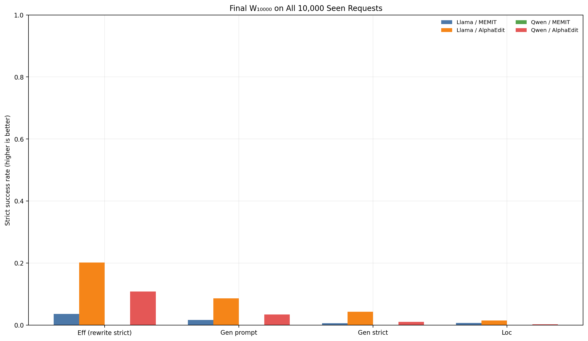
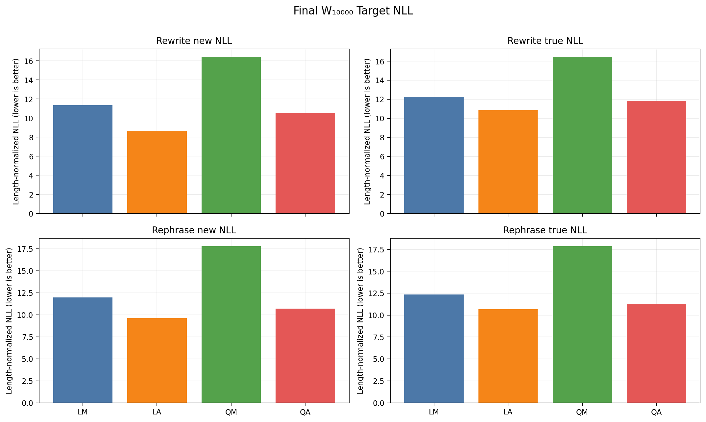
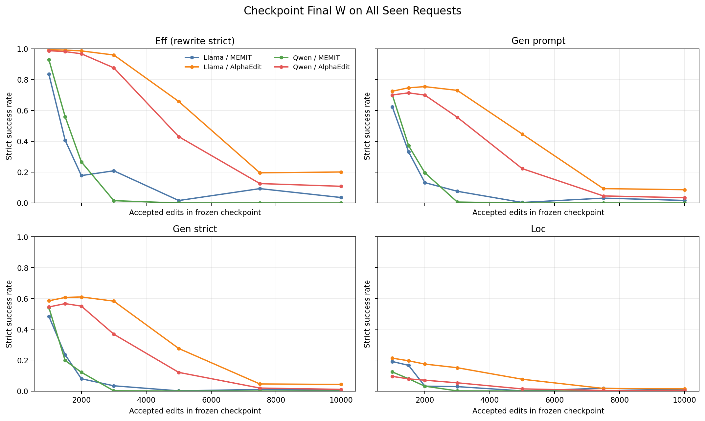
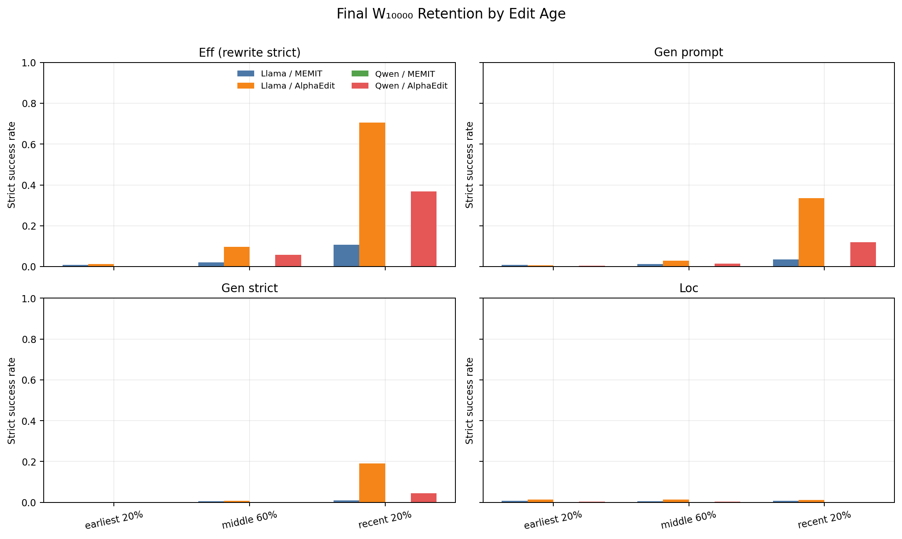

# Official lifelong layer-debt — final W full-10k 및 cumulative seen-prefix v4 사실 보고서

상태: **FOUR_ARM_FINAL_W_FULL10K_EVALUATION_TERMINAL_VALID**
범위: Llama/Qwen × Official MEMIT/AlphaEdit 네 arm, evaluation-only backfill. `scientific_promotion=false`.

## 1. Final W₁₀₀₀₀에서 전체 10,000 request 재평가 — 대표 결과

아래가 이 보고서의 유일한 headline 성능이다. 각 arm의 10,000번째 edit 이후 frozen W 하나에서 sealed 10,000 request 전체를 다시 평가했다. 현재 B100, online-at-write, 소형 retention panel 값이 아니다. NLL 열은 request-cluster `mean/median/p90/max`다.

| 모델/방법 | Eff strict | Gen prompt | Gen strict | Loc | Rewrite new NLL | Rephrase new NLL |
|---|---|---|---|---|---|---|
| Llama-3-8B-Instruct / Official MEMIT | 357/10000 (0.036) | 335/20000 (0.017) | 53/10000 (0.005) | 648/100000 (0.006) | 10.9172/11.3481/15.5948/28.0700 | 11.6303/11.9529/14.9115/23.0916 |
| Llama-3-8B-Instruct / Official AlphaEdit | 2013/10000 (0.201) | 1727/20000 (0.086) | 426/10000 (0.043) | 1413/100000 (0.014) | 7.8485/8.6774/13.6737/24.2509 | 9.1570/9.6252/13.5203/20.4028 |
| Qwen2.5-7B-Instruct / Official MEMIT | 0/10000 (0.000) | 0/20000 (0.000) | 0/10000 (0.000) | 0/100000 (0.000) | 18.1171/16.4310/26.5229/46.7678 | 18.5074/17.8092/25.0185/42.5447 |
| Qwen2.5-7B-Instruct / Official AlphaEdit | 1084/10000 (0.108) | 686/20000 (0.034) | 105/10000 (0.011) | 246/100000 (0.002) | 9.8393/10.5178/15.1599/23.2025 | 10.5130/10.7069/14.5312/21.9783 |





### Final W₁₀₀₀₀ 상세 NLL·margin·strict

NLL과 margin은 request-cluster `mean/median/p90/max` 순서다. Strict 열의 분모는 rewrite 10,000, rephrase 20,000 prompts, locality 100,000 prompts다.

| arm | 평가축 | strict | NLL mean/median/p90/max | margin mean/median/p90/max |
|---|---|---|---|---|
| LM | Rewrite / target-new | 357/10000 (0.036) | 10.9172/11.3481/15.5948/28.0700 | -8.9319/-8.8587/-3.1769/12.2041 |
| LM | Rewrite / target-true | 36/10000 (0.004) | 12.1494/12.2542/16.1612/32.0345 | -10.2235/-9.8578/-5.3974/5.0930 |
| LM | Rephrase / target-new | 335/20000 (0.017) | 11.6303/11.9529/14.9115/23.0916 | -10.6431/-10.3027/-6.1487/3.6708 |
| LM | Rephrase / target-true | 52/20000 (0.003) | 12.1982/12.3425/15.2497/25.9596 | -11.1774/-10.6777/-6.9613/2.0992 |
| LM | Locality / target-true | 648/100000 (0.006) | 12.3682/12.5320/15.5810/24.3893 | -15.8013/-15.6363/-10.7443/-2.7562 |
| LA | Rewrite / target-new | 2013/10000 (0.201) | 7.8485/8.6774/13.6737/24.2509 | -5.1720/-6.1566/4.1804/18.5015 |
| LA | Rewrite / target-true | 59/10000 (0.006) | 10.8313/10.8699/15.0215/32.4774 | -8.9973/-8.7474/-4.3235/4.3608 |
| LA | Rephrase / target-new | 1727/20000 (0.086) | 9.1570/9.6252/13.5203/20.4028 | -8.3923/-8.6704/-3.1992/11.4948 |
| LA | Rephrase / target-true | 113/20000 (0.006) | 10.6277/10.6583/14.0409/22.9689 | -9.9746/-9.8001/-5.9020/0.5545 |
| LA | Locality / target-true | 1413/100000 (0.014) | 10.4065/10.4624/13.3611/19.0954 | -13.0089/-12.8050/-9.1012/-1.2668 |
| QM | Rewrite / target-new | 0/10000 (0.000) | 18.1171/16.4310/26.5229/46.7678 | -16.6843/-15.0777/-9.0509/-3.0657 |
| QM | Rewrite / target-true | 0/10000 (0.000) | 18.1728/16.4660/26.5883/50.3754 | -16.7142/-15.0840/-9.1295/-2.8040 |
| QM | Rephrase / target-new | 0/20000 (0.000) | 18.5074/17.8092/25.0185/42.5447 | -20.4639/-20.1354/-11.8816/-5.7399 |
| QM | Rephrase / target-true | 0/20000 (0.000) | 18.5779/17.8753/24.9780/41.8980 | -20.5042/-20.1426/-11.9737/-5.4730 |
| QM | Locality / target-true | 0/100000 (0.000) | 18.3533/17.5966/23.1626/41.9381 | -26.0963/-25.2095/-18.1922/-10.9744 |
| QA | Rewrite / target-new | 1084/10000 (0.108) | 9.8393/10.5178/15.1599/23.2025 | -6.6431/-7.0507/0.3564/11.1693 |
| QA | Rewrite / target-true | 23/10000 (0.002) | 11.9720/11.8138/16.0878/25.7398 | -9.0739/-8.7133/-4.9812/3.9889 |
| QA | Rephrase / target-new | 686/20000 (0.034) | 10.5130/10.7069/14.5312/21.9783 | -9.3745/-9.2884/-4.6689/7.5479 |
| QA | Rephrase / target-true | 74/20000 (0.004) | 11.2529/11.2416/14.7810/20.3368 | -10.0542/-9.7866/-5.8822/0.3744 |
| QA | Locality / target-true | 246/100000 (0.002) | 11.9771/11.8881/14.3911/18.5072 | -13.6972/-13.8480/-10.0505/-4.8839 |

## 2. Metric glossary / 표 읽는 법

- **Eff (higher is better):** rewrite prompt에서 target-new의 모든 teacher-forced token이 top-1이면 request 성공 1건이다. numerator는 성공 request, denominator는 seen request다.
- **Gen prompt (higher is better):** 각 paraphrase prompt에서 target-new 전체 token이 top-1인 prompt 비율이다. 이 stream은 request당 2개이므로 final denominator는 20,000/arm이다.
- **Gen strict (higher is better):** 한 request의 paraphrase 2개가 모두 strict일 때만 request 성공이다. denominator는 request 수다. Gen prompt와 집계 단위를 섞지 않는다.
- **Loc (higher is better):** neighborhood/locality prompt에서 원래 target-true의 모든 token이 top-1인 prompt 비율이다. request당 10개, final denominator 100,000/arm이다.
- **target-new/target-true NLL (lower is better):** 각각 새 사실/원래 사실 continuation token의 평균 negative log likelihood다. 표의 mean/median/p90/max는 먼저 prompt 내 token 평균, 그 뒤 request 내 prompt 평균을 낸 request-cluster 분포다.
- **margin (higher is better):** 각 continuation token에서 target logit−최고 비-target logit의 prompt 내 최솟값이다. 양수이면 그 prompt의 모든 target token이 top-1이다.
- **preference (higher is better for new):** 동일 prompt에서 target-new NLL < target-true NLL인 request 비율이다. 이는 strict와 다른 비교 지표다.
- **token accuracy:** 기존 canonical evaluator schema가 strict/NLL/margin만 반환하므로 `NOT_RECORDED_EVALUATOR_SCHEMA`; strict를 token accuracy로 대체하지 않았다.
- **mean/median/p90/max:** 산술평균/중앙값/90백분위/최댓값이다. IQR은 p75−p25이며 기존 layer table에서만 사용한다. 누락값 보간·imputation은 0이다.
- **R:** layer write 직전 `z*−activation` residual vector. **A:** Official uniform remaining-layer allocation `R / 남은 layer 수`. **Y:** 실제 write가 줄인 activation residual. **E=A−Y:** allocation-realization gap.
- **q=||R||/||R_entry|| (lower is better for closure):** entry residual로 정규화한 남은 residual. 서로 다른 모델의 절대 norm 대신 무차원 q를 비교한다.
- **rho=<Y,A>/||A||²:** target 방향 realization ratio; 1 exact, 0~1 under-realization, >1 overshoot, <0 opposite progress. **tau=||Y−rho A||/||A||:** 직교 왜곡(낮을수록 작음).
- **d_parallel/d_perp:** L8 진입 residual이 ideal `(1/5)R_entry`에서 벗어난 inherited debt의 entry-target 평행/직교 성분이다. 절대 성능 점수가 아니다.
- **recurrence closure:** `R5=(1/5)R1+(1/4)E1+(1/3)E2+(1/2)E3+E4`의 FP64 상대오차이며 계측 무결성 지표다.
- **D_TV:** layer-wise update-share 분포와 양의 target-progress 분포 사이 total variation 거리(0 동일, 1 최대 분리). Negative progress는 별도 count로 남긴다.
- **Layer-wise Update Magnitude:** 실제 `||ΔW_l||_F`; share는 5개 layer magnitude 합에서의 비중이다. activation progress와 별개 축이며 `weight energy`로 부르지 않는다.

## 3. Checkpoint final W에서 all-seen-prefix 누적 성능

평가 타입은 전부 `CHECKPOINT_FINAL_W_ON_ALL_SEEN_REQUESTS`다. t=10,000은 §1 결과를 재사용했으며 중복 GPU 평가 0이다.

| arm | edits | Eff | Gen prompt | Gen strict | Loc | Rewrite new NLL med | Rephrase new NLL med |
|---|---|---|---|---|---|---|---|
| LM | 1000 | 835/1000 (0.835) | 1245/2000 (0.623) | 484/1000 (0.484) | 1912/10000 (0.191) | 0.0360 | 0.8548 |
| LM | 1500 | 611/1500 (0.407) | 995/3000 (0.332) | 353/1500 (0.235) | 2492/15000 (0.166) | 2.6761 | 3.7264 |
| LM | 2000 | 356/2000 (0.178) | 529/4000 (0.132) | 159/2000 (0.080) | 628/20000 (0.031) | 8.2959 | 8.9330 |
| LM | 3000 | 627/3000 (0.209) | 457/6000 (0.076) | 101/3000 (0.034) | 851/30000 (0.028) | 7.3595 | 9.1836 |
| LM | 5000 | 81/5000 (0.016) | 36/10000 (0.004) | 5/5000 (0.001) | 39/50000 (0.001) | 12.9335 | 13.4673 |
| LM | 7500 | 700/7500 (0.093) | 476/15000 (0.032) | 75/7500 (0.010) | 1332/75000 (0.018) | 9.8615 | 11.1950 |
| LM | 10000 | 357/10000 (0.036) | 335/20000 (0.017) | 53/10000 (0.005) | 648/100000 (0.006) | 11.3481 | 11.9529 |
| LA | 1000 | 994/1000 (0.994) | 1450/2000 (0.725) | 585/1000 (0.585) | 2130/10000 (0.213) | 0.0010 | 0.3614 |
| LA | 1500 | 1488/1500 (0.992) | 2242/3000 (0.747) | 910/1500 (0.607) | 2940/15000 (0.196) | 0.0014 | 0.3345 |
| LA | 2000 | 1973/2000 (0.987) | 3019/4000 (0.755) | 1220/2000 (0.610) | 3491/20000 (0.175) | 0.0020 | 0.3286 |
| LA | 3000 | 2880/3000 (0.960) | 4383/6000 (0.731) | 1748/3000 (0.583) | 4529/30000 (0.151) | 0.0041 | 0.4580 |
| LA | 5000 | 3293/5000 (0.659) | 4476/10000 (0.448) | 1379/5000 (0.276) | 3815/50000 (0.076) | 0.1842 | 2.5985 |
| LA | 7500 | 1468/7500 (0.196) | 1399/15000 (0.093) | 342/7500 (0.046) | 1256/75000 (0.017) | 7.8291 | 8.7881 |
| LA | 10000 | 2013/10000 (0.201) | 1727/20000 (0.086) | 426/10000 (0.043) | 1413/100000 (0.014) | 8.6774 | 9.6252 |
| QM | 1000 | 930/1000 (0.930) | 1400/2000 (0.700) | 541/1000 (0.541) | 1235/10000 (0.123) | 0.0297 | 0.6320 |
| QM | 1500 | 840/1500 (0.560) | 1115/3000 (0.372) | 297/1500 (0.198) | 1192/15000 (0.079) | 1.1242 | 3.5168 |
| QM | 2000 | 534/2000 (0.267) | 786/4000 (0.197) | 243/2000 (0.121) | 624/20000 (0.031) | 5.3834 | 6.5104 |
| QM | 3000 | 46/3000 (0.015) | 38/6000 (0.006) | 3/3000 (0.001) | 19/30000 (0.001) | 12.6881 | 12.9799 |
| QM | 5000 | 1/5000 (0.000) | 1/10000 (0.000) | 0/5000 (0.000) | 0/50000 (0.000) | 15.3791 | 15.8768 |
| QM | 7500 | 1/7500 (0.000) | 1/15000 (0.000) | 0/7500 (0.000) | 0/75000 (0.000) | 14.2866 | 14.2137 |
| QM | 10000 | 0/10000 (0.000) | 0/20000 (0.000) | 0/10000 (0.000) | 0/100000 (0.000) | 16.4310 | 17.8092 |
| QA | 1000 | 988/1000 (0.988) | 1402/2000 (0.701) | 545/1000 (0.545) | 948/10000 (0.095) | 0.0136 | 0.5592 |
| QA | 1500 | 1473/1500 (0.982) | 2143/3000 (0.714) | 850/1500 (0.567) | 1179/15000 (0.079) | 0.0155 | 0.5591 |
| QA | 2000 | 1936/2000 (0.968) | 2800/4000 (0.700) | 1101/2000 (0.550) | 1401/20000 (0.070) | 0.0191 | 0.5873 |
| QA | 3000 | 2630/3000 (0.877) | 3337/6000 (0.556) | 1105/3000 (0.368) | 1592/30000 (0.053) | 0.0296 | 1.8628 |
| QA | 5000 | 2153/5000 (0.431) | 2231/10000 (0.223) | 604/5000 (0.121) | 675/50000 (0.013) | 2.7332 | 6.4062 |
| QA | 7500 | 946/7500 (0.126) | 690/15000 (0.046) | 143/7500 (0.019) | 265/75000 (0.004) | 10.0402 | 9.7813 |
| QA | 10000 | 1084/10000 (0.108) | 686/20000 (0.034) | 105/10000 (0.011) | 246/100000 (0.002) | 10.5178 | 10.7069 |

### 1,000→10,000 edits 누적 변화량

성공률 열은 final−1k(양수 개선), NLL 열도 final−1k이므로 음수일수록 개선이다.

| arm | ΔEff | ΔGen prompt | ΔGen strict | ΔLoc | ΔRewrite new NLL med | ΔRephrase new NLL med |
|---|---|---|---|---|---|---|
| LM | -0.7993 | -0.6058 | -0.4787 | -0.1847 | 11.3121 | 11.0981 |
| LA | -0.7927 | -0.6386 | -0.5424 | -0.1989 | 8.6763 | 9.2639 |
| QM | -0.9300 | -0.7000 | -0.5410 | -0.1235 | 16.4014 | 17.1772 |
| QA | -0.8796 | -0.6667 | -0.5345 | -0.0923 | 10.5042 | 10.1477 |



원래 요청 schedule은 `{100,500,1000,2000,4000,6000,8000,10000}`이었으나 exact frozen state는 `{1000,1500,2000,3000,5000,7500,10000}`에만 존재했다. 이는 outcome을 열기 전 state availability에 따른 amendment다. absent 시점의 replay/reconstruction/interpolation/nearest substitution은 모두 0이며 amendment receipt SHA는 `3684dd72e3a38e8b10544b6071e592a10eafdec881b65f0c87656eb2c662dcc7`다.

## 4. Final W₁₀₀₀₀ edit-age retention

Age bin은 결과 전에 ordinal의 first 20% / middle 60% / last 20%로 고정했다. 각 행의 request denominator와 prompt denominator는 `edit-age-strata-summary.csv`에 있다.

| arm | age stratum | request n | Eff | Gen prompt | Gen strict | Loc |
|---|---|---|---|---|---|---|
| LM | EARLY_FIRST_20PCT | 2000 | 0.0095 | 0.0077 | 0.0020 | 0.0070 |
| LM | MIDDLE_60PCT | 6000 | 0.0208 | 0.0132 | 0.0050 | 0.0062 |
| LM | RECENT_LAST_20PCT | 2000 | 0.1065 | 0.0362 | 0.0095 | 0.0067 |
| LA | EARLY_FIRST_20PCT | 2000 | 0.0130 | 0.0075 | 0.0005 | 0.0142 |
| LA | MIDDLE_60PCT | 6000 | 0.0962 | 0.0298 | 0.0075 | 0.0146 |
| LA | RECENT_LAST_20PCT | 2000 | 0.7050 | 0.3347 | 0.1900 | 0.0126 |
| QM | EARLY_FIRST_20PCT | 2000 | 0.0000 | 0.0000 | 0.0000 | 0.0000 |
| QM | MIDDLE_60PCT | 6000 | 0.0000 | 0.0000 | 0.0000 | 0.0000 |
| QM | RECENT_LAST_20PCT | 2000 | 0.0000 | 0.0000 | 0.0000 | 0.0000 |
| QA | EARLY_FIRST_20PCT | 2000 | 0.0025 | 0.0050 | 0.0005 | 0.0025 |
| QA | MIDDLE_60PCT | 6000 | 0.0572 | 0.0154 | 0.0022 | 0.0025 |
| QA | RECENT_LAST_20PCT | 2000 | 0.3680 | 0.1202 | 0.0455 | 0.0022 |

각 checkpoint×age×target category의 request-cluster NLL와 margin mean/median/p90/max는 `edit-age-strata-summary.csv` 84행에 완전 수록했다.



Fixed sentinel은 동일 probe가 시간에 따라 어떻게 변하는지, online-at-write는 편집 직후 성능, current B100은 당시 최근 100개 성능, cumulative seen-prefix는 frozen W_t가 지금까지 본 모든 request를 얼마나 유지하는지를 답한다. 네 타입은 서로 대체되지 않는다.

## 5. 기존 layer residual/update/action-realization 분석

v3의 layer telemetry bytes는 immutable하게 재사용한다. 아래 q/V̄는 final-W full10k 성능이 아니라 10k checkpoint의 fixed sentinel mechanism probe다.

| arm | sentinel pre-L8 q med | sentinel post-L8 q med | V_to_go/A0 | unreachable fraction |
|---|---|---|---|---|
| LM | 0.5116 | 0.3080 | 3.2385 | 0.5224 |
| LA | 0.3860 | 0.1918 | 13.6264 | 0.6052 |
| QM | 0.3534 | 0.2557 | 0.6330 | 0.6159 |
| QA | 0.2219 | 0.0255 | 2.1977 | 0.6185 |

- Llama 두 방법은 terminal sentinel에서 L8 update share가 가장 컸지만 Qwen은 L4가 가장 컸으므로 universal last-layer concentration claim은 유지하지 않는다.
- D_TV drift 방향은 모델별로 달랐고, observation만으로 barrier benefit·ODE necessity·causal effect를 주장하지 않는다.
- 전체 request/layer rho, tau, debt, recurrence, update magnitude/share, completion geometry는 immutable v3의 `layer-q-summary.csv`, `rho-tau-summary.csv`, `inherited-debt-summary.csv`, `recurrence-summary.csv`, `update-magnitude-share.csv`에 있다.

기존 재현 그림: [residual trajectory](../official-layer-realization-debt-lifelong-b100x100-2026-09-03-v3/primary-residual-trajectory-2x2.png), [rho](../official-layer-realization-debt-lifelong-b100x100-2026-09-03-v3/rho-by-layer-terminal.png), [tau](../official-layer-realization-debt-lifelong-b100x100-2026-09-03-v3/tau-by-layer-terminal.png), [inherited debt](../official-layer-realization-debt-lifelong-b100x100-2026-09-03-v3/inherited-debt-distributions.png), [Layer-wise Update Magnitude](../official-layer-realization-debt-lifelong-b100x100-2026-09-03-v3/layer-wise-update-magnitude.png).

## 6. Evaluation-only compute와 불변식

| arm | wall h | request-state n | forward batches | token examples | peak GPU GiB |
|---|---|---|---|---|---|
| LM | 1.665 | 30000 | 150331 | 485878 | 30.40 |
| LA | 1.654 | 30000 | 150331 | 485878 | 30.40 |
| QM | 1.626 | 30000 | 150331 | 485878 | 28.77 |
| QA | 1.640 | 30000 | 150331 | 485878 | 28.77 |

각 frozen state에서 평가 전후 edited weight pointer/version/byte SHA는 exact했다. `compute_z/writer/key/solve/cache append/cache consume/history append/optimizer/backward/parameter grad/model update during evaluation`은 전부 0이다. Checkpoint load만 7회/arm으로 별도 계수했다. Model parameter는 FULL-FP32, autocast/quantization=false, nonfinite=0, duplicate/imputation=0이다. Alpha cache/MEMIT covariance는 checkpoint container identity에 봉인했지만 forward-only runtime으로 load하지 않았다.

## 7. Current-B100 diagnostic appendix — headline 아님

v3의 첫 표와 `endpoint-checkpoint-strict-rates.png`는 checkpoint 당시 current B100만 평가한다. 이 값은 online/local diagnostic으로만 보존하며 final 10k 또는 cumulative retention 결론에 사용하지 않는다. v3 report SHA `c9daf397b8c9fa679fa89e4f6407d7e03761a11f9ead177e998a97e726e24a8f`는 변경하지 않았다.

## 8. Provenance, limitations, artifact inventory

- Evaluation runtime source HEAD/tree: `c2c44901ea65a470ef3dccf252b3be425711ffa7` / `b94c07afac284ec4e47b7d663d724ffdc3b75d15`; analysis source HEAD/tree: `e357a2932a80367ca77391a0ae43ce416c699836` / `103257034037dac8beb37c03b532be24cb744309`.
- Evaluation result root: `/data/janghj/ODE-edit/local/results/official-layer-realization-debt-lifelong-finalw-full10k-v1/campaign-20260903-tech-r3`.
- Common stream/order/evaluator: `2951b86dfa829ef38b2fb03551a81dc9ce4f11c779af3f0f0c027224ed65cf7d` / `f86dfc97f50614d8fe3d7ed929326485ea0b1237151f93d7ed7339bae8979c43` / `72b8ecb737157a42d6a055ffd339dc3f907876a0a98165a00cca49ca9bbed07d`.
- Four-arm checkpoint denominator 28/28; request-state denominator 120,000; final request denominator 40,000; final rephrase prompt denominator 80,000; final locality prompt denominator 400,000.
- Original unavailable checkpoints `{100,500,4000,6000,8000}` remain `NOT_AVAILABLE_EXACT_STATE`; no reconstruction or estimate.
- Raw prompts/logits/generations publish count 0. Per-request output contains request/case hashes and scalar metrics only.
- Per-request `identity_sha256`는 evaluator가 만든 core row(metrics+ordinal+hashes)에 결속되고, outcome-blind 파생 `age_stratum`은 그 뒤 추가된다. 분석기는 core identity와 age(ordinal, seen-count)를 각각 독립 검증했다.
- Technical exclusions are denominator0: two preflight adapter roots and job33300 canonical-batching parity lineage. Their evidence is preserved separately.
- New figures are deterministic headless Python outputs. No Codex visualization/imagegen/manual image editing was used; missing values were not interpolated.
- Full tables and every row/member SHA are in `analysis-manifest.json`; package root is in `rooted-analysis-receipt.json`.

## 9. Immutable v3 detailed observational appendix

아래는 immutable v3 report의 provenance, residual trajectory, A/Y/E, ρ/τ, inherited debt, recurrence, layer-wise update magnitude/share, cache mechanism fork, paired model/method comparison, association, completion geometry, outlier, compute, technical-exclusion 및 artifact inventory를 그대로 통합한 diagnostic appendix다. v3의 §1 executive와 §7 current-B100 performance는 제외했다. 이 appendix 안의 endpoint/retention 언급은 **current-B100·online·sentinel diagnostic**이며 final-W full-10k 대표 성능은 오직 본 보고서 §1이다.

### v3-2. Provenance, jobs, denominators, invariants

| 모델 | 방법 | canonical job | source HEAD/tree | batches | requests | checkpoints | raw members/bytes | raw member root |
|---|---|---|---|---:|---:|---:|---:|---|
| Llama-3-8B-Instruct | Official MEMIT | 32424 | `85a05d0a831db667fc68c27e634302eb30cc7d79` / `84113d14cb0427afd871448fd4a5c870c7f31153` | 100 | 10000 | 8 | 117/9470818583 | `961149f2751a3388b348c484bed882158660f0ae85b946c9bb69077a89528a85` |
| Llama-3-8B-Instruct | Official AlphaEdit | 32380 | `85a05d0a831db667fc68c27e634302eb30cc7d79` / `84113d14cb0427afd871448fd4a5c870c7f31153` | 100 | 10000 | 8 | 117/38248437276 | `191a075ab53e77b662ccd82a609a83bbea43b503fa660432c2994bb97e1d2ed5` |
| Qwen2.5-7B-Instruct | Official MEMIT | 31686_1 | `85a05d0a831db667fc68c27e634302eb30cc7d79` / `84113d14cb0427afd871448fd4a5c870c7f31153` | 100 | 10000 | 8 | 117/10938883628 | `02c27c740c26c04430a06549fb58e8739a4eddb032b2adee3b61da0d2c7f791c` |
| Qwen2.5-7B-Instruct | Official AlphaEdit | 31651_0 (JobIDRaw=31652) | `583aaa3f65602c13174ba4426ddb0f6a18ae7e82` / `601d394d77f676cb247aa44f9389c0ccc29a0f54` | 100 | 10000 | 8 | 117/61186136329 | `d5256efd74db14f5b23a5a6ab786aa139844048b040bf4a68096feff5c8c3b5a` |

- Canonical result roots와 모든 journal/checkpoint/state/log/receipt 절대경로·SHA는 `raw-member-inventory.csv`와 `analysis-manifest.json`에 있다.
- 공통 stream/order/sentinel/evaluator identity와 pinned stock EasyEdit HEAD/tree는 manifest 외부 입력에 봉인했다.
- 합계: arm 4/4, B100 400/400, training requests 40,000/40,000, checkpoints 32/32, primary sentinel observations 3,200, AlphaEdit reset-cache observations 1,600, 전체 checkpoint observations 4,800.
- Arm별 compute_z=10,000, recompute=0, layer observation=500, terminal forward=100. W commit→next entry=99/99; W0/cache terminal restore=4/4; nonfinite=0, rollback violation=0, imputation=0.
- AlphaEdit는 성공 B100마다 신규 100개를 append했고, consume width는 그 시점의 전체 prior-history width(0→9,900)였다. Exit cache width는 0→10,000으로 연속 증가했다. MEMIT은 static covariance computation cache만 사용했고 request-history state를 만들지 않았다.
- Edited weight 5/5는 `torch.float32`; BF16/FP16 parameter=0. GPU peak memory, total forward, JVP/VJP/HVP, autocast/quantization/numeric-cast inventory는 schema에 없으므로 추정하지 않았다.

#### 2.1 Arm별 실제 실행 command/config/resource

`SubmitLine`은 Slurm accounting에서 read-only로 회수한 실제 제출 문자열이다. Science config는 각 terminal result의 sealed `lock` 객체이며 아래 identity는 canonical JSON SHA-256이다.

| arm | JobIDRaw/name | workdir | launcher SHA | SubmitLine SHA | config SHA | ReqMem / AllocTRES / node |
|---|---|---|---|---|---|---|
| LM | 32424/odeedit_lrd_life_r1_s4 | `/data/janghj/ODE-edit` | `12e7f0c567f67c82110ddb906e42452e2f70013fe45815f92a7d6f818eb9e44c` | `26809643498c886f2f689f317a85b306b4e4bb1ce03b6722fddca186f79adc93` | `9a9be38542356b0fbd3c634fbdff38edcfd540282dece690620198e92044e2c6` | 59G / `billing=8,cpu=8,gres/gpu=1,mem=59G,node=1` / server4 |
| LA | 32380/odeedit_lrd_life_r1_s4 | `/data/janghj/ODE-edit` | `12e7f0c567f67c82110ddb906e42452e2f70013fe45815f92a7d6f818eb9e44c` | `7f4a7b4fad6b4bb8e7fe3ebb35f1217a4fb769ffb38ca3de4770cb39e6fdad83` | `9a9be38542356b0fbd3c634fbdff38edcfd540282dece690620198e92044e2c6` | 59G / `billing=8,cpu=8,gres/gpu=1,mem=59G,node=1` / server4 |
| QM | 31686/off_layer_debt_life_qm_tech_r1_s4 | `/data/janghj/ODE-edit/local/worktrees/official-layer-realization-debt-lifelong-b100-v1-tech-r1` | `01083416f7423996464c7ffed1f0d885edd65a7f82e62487052cf5517dabaa96` | `c0259091335294026d9a9e557b1b6774100ef3fe2de1374f982e63ec50794adb` | `9a9be38542356b0fbd3c634fbdff38edcfd540282dece690620198e92044e2c6` | 62.50G / `billing=8,cpu=8,gres/gpu=1,mem=62.50G,node=1` / server4 |
| QA | 31652/off_layer_debt_life_s4 | `/data/janghj/ODE-edit/local/worktrees/official-layer-realization-debt-lifelong-b100-v1` | `01083416f7423996464c7ffed1f0d885edd65a7f82e62487052cf5517dabaa96` | `cc07a9332c4362440c25b844007fd262dbc9c2960fbbbdccf3e6b00be30b7ae9` | `9a9be38542356b0fbd3c634fbdff38edcfd540282dece690620198e92044e2c6` | 120000M / `billing=8,cpu=8,gres/gpu=1,mem=120000M,node=1` / server4 |

Exact SubmitLine과 sealed science config:

##### LM — Llama-3-8B-Instruct / Official MEMIT

```text
sbatch --parsable --export=ALL,ODE_LRD_LIFE_SOURCE_ROOT=/data/janghj/ODE-edit/local/worktrees/official-layer-realization-debt-lifelong-b100-v1-tech-r1,ODE_LRD_LIFE_EXPECTED_HEAD=85a05d0a831db667fc68c27e634302eb30cc7d79,ODE_LRD_LIFE_RESULT_ROOT=/data/janghj/ODE-edit/local/results/official-layer-realization-debt-lifelong-b100-v1/campaign-20260902-four-arm-completion-tech-r1,ODE_LRD_LIFE_PREFLIGHT_RECEIPT=/data/janghj/ODE-edit/local/state/official-layer-realization-debt-lifelong-b100-v1/campaign-20260901-tech-r1/preflight.json,ODE_LRD_LIFE_EXPECTED_PREFLIGHT_SHA=794c1f8b5792e9cbd09420b79543a76e6884fe1104cb48fe33659758275f60b8,ODE_LRD_LIFE_RESOURCE_RECEIPT=/data/janghj/ODE-edit/local/state/official-layer-realization-debt-lifelong-b100-v1/campaign-20260902-four-arm-completion-tech-r1/resource-seal-llama-memit-tech-r1.json,ODE_LRD_LIFE_EXPECTED_RESOURCE_SHA=dfec118e8520328f69f90a4f065d927e68aaadacec45da2be7ab7ff3bab26b1b,ODE_LRD_LIFE_STREAM_SEAL=/data/janghj/ODE-edit/local/state/official-layer-realization-debt-lifelong-b100-v1/stream-seal-v1.json,ODE_LRD_LIFE_EXPECTED_STREAM_SHA=5848dca7323335483039ec125b644dadfb87b0996133f9825f951088cf3a7861,ODE_LRD_LIFE_CAMPAIGN_ID=official-layer-realization-debt-lifelong-b100-v1-campaign-20260902-four-arm-completion-tech-r1,ODE_LRD_LIFE_MODEL=llama3-8b-inst,ODE_LRD_LIFE_METHOD=memit,ODE_LRD_MEMORY_POLICY_ROOT=/data/janghj/ODE-edit/local/worktrees/slurm-memory-policy-rollout-20260902,ODE_LRD_EXPECTED_POLICY_HEAD=462d9afd8af7edd888281dbc015231042857ba99 /data/janghj/ODE-edit/local/state/official-layer-realization-debt-lifelong-b100-v1/campaign-20260902-four-arm-completion-tech-r1/launcher-server4-resource-tech-r1.sbatch
```

```json
{"accepted_cache_append_per_request":1,"batch_count":100,"batch_size":100,"checkpoint_batches":[0,10,15,20,30,50,75,100],"compact_report_batches":[10,20,50,100],"compute_z_per_request":1,"full_fp32":true,"gpu_cap":2,"layers":[4,5,6,7,8],"observer_layer_calls_per_batch":5,"observer_terminal_calls_per_batch":1,"order_seed_index":1,"recurrence_relative_tolerance":0.0001,"request_count":10000,"sample_duplication_count":0,"scalar_reduction_dtype":"float64","scientific_promotion":false,"sustained_violation_batch_count":3}
```

##### LA — Llama-3-8B-Instruct / Official AlphaEdit

```text
sbatch --parsable --export=ALL,ODE_LRD_LIFE_SOURCE_ROOT=/data/janghj/ODE-edit/local/worktrees/official-layer-realization-debt-lifelong-b100-v1-tech-r1,ODE_LRD_LIFE_EXPECTED_HEAD=85a05d0a831db667fc68c27e634302eb30cc7d79,ODE_LRD_LIFE_RESULT_ROOT=/data/janghj/ODE-edit/local/results/official-layer-realization-debt-lifelong-b100-v1/campaign-20260902-four-arm-completion-tech-r1,ODE_LRD_LIFE_PREFLIGHT_RECEIPT=/data/janghj/ODE-edit/local/state/official-layer-realization-debt-lifelong-b100-v1/campaign-20260901-tech-r1/preflight.json,ODE_LRD_LIFE_EXPECTED_PREFLIGHT_SHA=794c1f8b5792e9cbd09420b79543a76e6884fe1104cb48fe33659758275f60b8,ODE_LRD_LIFE_RESOURCE_RECEIPT=/data/janghj/ODE-edit/local/state/official-layer-realization-debt-lifelong-b100-v1/campaign-20260902-four-arm-completion-tech-r1/resource-seal-llama-alphaedit-tech-r1.json,ODE_LRD_LIFE_EXPECTED_RESOURCE_SHA=0de4e6094d87262e1d19a9cf33e2b09e4eb75a150d1f4c9bf8b2dbb887250a97,ODE_LRD_LIFE_STREAM_SEAL=/data/janghj/ODE-edit/local/state/official-layer-realization-debt-lifelong-b100-v1/stream-seal-v1.json,ODE_LRD_LIFE_EXPECTED_STREAM_SHA=5848dca7323335483039ec125b644dadfb87b0996133f9825f951088cf3a7861,ODE_LRD_LIFE_CAMPAIGN_ID=official-layer-realization-debt-lifelong-b100-v1-campaign-20260902-four-arm-completion-tech-r1,ODE_LRD_LIFE_MODEL=llama3-8b-inst,ODE_LRD_LIFE_METHOD=alphaedit,ODE_LRD_MEMORY_POLICY_ROOT=/data/janghj/ODE-edit/local/worktrees/slurm-memory-policy-rollout-20260902,ODE_LRD_EXPECTED_POLICY_HEAD=462d9afd8af7edd888281dbc015231042857ba99 /data/janghj/ODE-edit/local/state/official-layer-realization-debt-lifelong-b100-v1/campaign-20260902-four-arm-completion-tech-r1/launcher-server4-resource-tech-r1.sbatch
```

```json
{"accepted_cache_append_per_request":1,"batch_count":100,"batch_size":100,"checkpoint_batches":[0,10,15,20,30,50,75,100],"compact_report_batches":[10,20,50,100],"compute_z_per_request":1,"full_fp32":true,"gpu_cap":2,"layers":[4,5,6,7,8],"observer_layer_calls_per_batch":5,"observer_terminal_calls_per_batch":1,"order_seed_index":1,"recurrence_relative_tolerance":0.0001,"request_count":10000,"sample_duplication_count":0,"scalar_reduction_dtype":"float64","scientific_promotion":false,"sustained_violation_batch_count":3}
```

##### QM — Qwen2.5-7B-Instruct / Official MEMIT

```text
sbatch --parsable --array=1-1%1 --mem=64000M --job-name=off_layer_debt_life_qm_tech_r1_s4 --output=/data/janghj/ODE-edit/local/logs/official-layer-realization-debt-lifelong-b100-v1/%x-%A_%a.out --error=/data/janghj/ODE-edit/local/logs/official-layer-realization-debt-lifelong-b100-v1/%x-%A_%a.err --export=ALL project/run_scripts/session06_official_layer_realization_debt_lifelong_server4.sbatch
```

```json
{"accepted_cache_append_per_request":1,"batch_count":100,"batch_size":100,"checkpoint_batches":[0,10,15,20,30,50,75,100],"compact_report_batches":[10,20,50,100],"compute_z_per_request":1,"full_fp32":true,"gpu_cap":2,"layers":[4,5,6,7,8],"observer_layer_calls_per_batch":5,"observer_terminal_calls_per_batch":1,"order_seed_index":1,"recurrence_relative_tolerance":0.0001,"request_count":10000,"sample_duplication_count":0,"scalar_reduction_dtype":"float64","scientific_promotion":false,"sustained_violation_batch_count":3}
```

##### QA — Qwen2.5-7B-Instruct / Official AlphaEdit

```text
sbatch --parsable --export=ALL project/run_scripts/session06_official_layer_realization_debt_lifelong_server4.sbatch
```

```json
{"accepted_cache_append_per_request":1,"batch_count":100,"batch_size":100,"checkpoint_batches":[0,10,15,20,30,50,75,100],"compact_report_batches":[10,20,50,100],"compute_z_per_request":1,"full_fp32":true,"gpu_cap":2,"layers":[4,5,6,7,8],"observer_layer_calls_per_batch":5,"observer_terminal_calls_per_batch":1,"order_seed_index":1,"recurrence_relative_tolerance":0.0001,"request_count":10000,"sample_duplication_count":0,"scalar_reduction_dtype":"float64","scientific_promotion":false,"sustained_violation_batch_count":3}
```

### v3-3. Residual trajectory와 lifelong drift

#### 3.1 10k sentinel q 분포

통계 열은 `mean/median/IQR/p90/max`; 각 셀 n=100이다.

| 모델 | 방법 | pre-L8 q | post-L8 q | q_pre-L8>0.2 | median trajectory pre-L4→post-L8 |
|---|---|---:|---:|---:|---|
| Llama-3-8B-Instruct | Official MEMIT | 0.5120/0.5116/0.0789/0.5862/0.6543 | 0.3100/0.3080/0.0862/0.3896/0.4579 | 100/100 | 1.0000/0.7319/0.6598/0.6337/0.5116/0.3080 |
| Llama-3-8B-Instruct | Official AlphaEdit | 0.3869/0.3860/0.0538/0.4386/0.7066 | 0.1961/0.1918/0.1092/0.2822/0.5220 | 100/100 | 1.0000/0.9008/0.5817/0.4647/0.3860/0.1918 |
| Qwen2.5-7B-Instruct | Official MEMIT | 0.3733/0.3534/0.0914/0.4947/0.9901 | 0.2791/0.2557/0.0880/0.4012/0.5682 | 100/100 | 1.0000/1.3066/0.6617/0.4595/0.3534/0.2557 |
| Qwen2.5-7B-Instruct | Official AlphaEdit | 0.2447/0.2219/0.0910/0.3174/1.0475 | 0.0309/0.0255/0.0201/0.0487/0.1699 | 65/100 | 1.0000/0.9153/0.6122/0.3813/0.2219/0.0255 |

#### 3.2 fixed sentinel의 t0→10k paired 변화

동일 request hash n=100/arm의 `10k−t0` median이다.

| 모델 | 방법 | Δpre-L8 q | Δpost-L8 q | Δd∥ | Δd⊥ | Δmean ρ | Δmean τ | ΔD_TV | Δcenter |
|---|---|---:|---:|---:|---:|---:|---:|---:|---:|
| Llama-3-8B-Instruct | Official MEMIT | -0.1424 | 0.0159 | -0.1587 | -0.0277 | 0.9053 | 1.1062 | 0.1361 | -1.1353 |
| Llama-3-8B-Instruct | Official AlphaEdit | -0.1692 | 0.1500 | -0.0932 | -0.1559 | 0.6361 | 0.3722 | 0.2403 | -1.4260 |
| Qwen2.5-7B-Instruct | Official MEMIT | -0.1068 | 0.1709 | -0.2298 | 0.0569 | 1.0172 | 1.2518 | -0.0838 | -1.6967 |
| Qwen2.5-7B-Instruct | Official AlphaEdit | -0.0982 | 0.0201 | -0.1395 | -0.0262 | 0.6685 | 0.6590 | -0.0315 | -1.0161 |

#### 3.3 모든 registered checkpoint

Weight total은 sentinel probe의 5개 layer Frobenius magnitude 합이다. Functional strict는 그 checkpoint의 current B100이며 t0에는 PRE_EDIT sentinel을 쓴다.

| 모델/방법 | edits | pre/post-L8 q med | q>0.2 | D_TV med | Δcenter med | update total | V̄/unreachable/min h̄ | rewrite/rephrase/locality strict |
|---|---:|---:|---:|---:|---:|---:|---:|---|
| LM | 0 | 0.6568/0.2923 | 100/100 | 0.1176 | 0.3615 | 18.4125 | 3.4896/0.2672/-2.6304 | 0/100 (0.000)/0/200 (0.000)/281/1000 (0.281) |
| LM | 1000 | 0.5711/0.2564 | 100/100 | 0.0983 | 0.2502 | 39.1237 | 1.4711/0.6431/-0.6874 | 100/100 (1.000)/152/200 (0.760)/201/1000 (0.201) |
| LM | 1500 | 0.5092/0.2832 | 100/100 | 0.2450 | -0.3894 | 90.8305 | 2.9271/0.7196/-5.8631 | 98/100 (0.980)/170/200 (0.850)/158/1000 (0.158) |
| LM | 2000 | 0.4656/0.2842 | 100/100 | 0.3739 | -0.8107 | 139.5007 | 5.9076/0.7769/-5.1925 | 89/100 (0.890)/138/200 (0.690)/38/1000 (0.038) |
| LM | 3000 | 0.5083/0.3416 | 100/100 | 0.3551 | -1.0403 | 78.9746 | 1.4947/0.6901/-1.0246 | 86/100 (0.860)/66/200 (0.330)/37/1000 (0.037) |
| LM | 5000 | 0.4361/0.2719 | 100/100 | 0.3293 | -0.9754 | 138.2773 | 2.3654/0.5926/-1.5082 | 19/100 (0.190)/7/200 (0.035)/1/1000 (0.001) |
| LM | 7500 | 0.4963/0.3318 | 100/100 | 0.3319 | -1.0377 | 114.2469 | 3.7803/0.5535/-2.8510 | 68/100 (0.680)/40/200 (0.200)/15/1000 (0.015) |
| LM | 10000 | 0.5116/0.3080 | 100/100 | 0.2554 | -0.7540 | 136.3196 | 3.2385/0.5224/-2.2385 | 27/100 (0.270)/17/200 (0.085)/5/1000 (0.005) |
| LA | 0 | 0.5401/0.0382 | 100/100 | 0.1317 | 0.3883 | 20.9372 | 1.5437/0.4105/-0.7157 | 0/100 (0.000)/0/200 (0.000)/281/1000 (0.281) |
| LA | 1000 | 0.4261/0.0437 | 100/100 | 0.0607 | 0.0799 | 31.4208 | 2.9493/0.3708/-2.2174 | 100/100 (1.000)/166/200 (0.830)/217/1000 (0.217) |
| LA | 1500 | 0.4079/0.0458 | 100/100 | 0.0583 | -0.0067 | 33.6092 | 3.1732/0.3683/-2.4427 | 100/100 (1.000)/158/200 (0.790)/186/1000 (0.186) |
| LA | 2000 | 0.3963/0.0483 | 100/100 | 0.0693 | -0.0585 | 36.6695 | 3.4812/0.3644/-2.7362 | 100/100 (1.000)/165/200 (0.825)/148/1000 (0.148) |
| LA | 3000 | 0.3835/0.0509 | 100/100 | 0.0722 | -0.1156 | 41.4803 | 3.7123/0.3687/-3.0401 | 100/100 (1.000)/164/200 (0.820)/128/1000 (0.128) |
| LA | 5000 | 0.3926/0.0692 | 100/100 | 0.1444 | -0.3683 | 60.7452 | 4.9702/0.5650/-4.5730 | 99/100 (0.990)/150/200 (0.750)/66/1000 (0.066) |
| LA | 7500 | 0.3890/0.1601 | 100/100 | 0.3265 | -0.8911 | 104.9500 | 8.4321/0.5957/-7.4321 | 100/100 (1.000)/105/200 (0.525)/9/1000 (0.009) |
| LA | 10000 | 0.3860/0.1918 | 100/100 | 0.3763 | -1.0401 | 137.8613 | 13.6264/0.6052/-12.6264 | 99/100 (0.990)/103/200 (0.515)/9/1000 (0.009) |
| QM | 0 | 0.4501/0.0875 | 100/100 | 0.4384 | 1.3317 | 155.3193 | 3.7331/0.6266/-3.2549 | 0/100 (0.000)/0/200 (0.000)/182/1000 (0.182) |
| QM | 1000 | 0.4712/0.0896 | 100/100 | 0.3880 | 1.1820 | 123.2348 | 1.2297/0.5844/-0.6911 | 100/100 (1.000)/147/200 (0.735)/126/1000 (0.126) |
| QM | 1500 | 0.4807/0.0795 | 100/100 | 0.3466 | 1.1160 | 188.7382 | 1.0609/0.6628/-0.3439 | 96/100 (0.960)/113/200 (0.565)/74/1000 (0.074) |
| QM | 2000 | 0.3460/0.0627 | 99/100 | 0.2819 | 0.4225 | 315.9665 | 0.6458/0.8012/-0.3089 | 98/100 (0.980)/152/200 (0.760)/30/1000 (0.030) |
| QM | 3000 | 0.3137/0.1271 | 95/100 | 0.2569 | 0.1682 | 509.4898 | 0.7418/0.8481/-0.9659 | 9/100 (0.090)/4/200 (0.020)/0/1000 (0.000) |
| QM | 5000 | 0.2712/0.1835 | 91/100 | 0.2423 | -0.2201 | 498.1988 | 0.5692/0.6793/-0.1782 | 0/100 (0.000)/0/200 (0.000)/0/1000 (0.000) |
| QM | 7500 | 0.2727/0.1782 | 97/100 | 0.2733 | -0.1311 | 519.0698 | 0.6531/0.5665/-0.1389 | 0/100 (0.000)/0/200 (0.000)/0/1000 (0.000) |
| QM | 10000 | 0.3534/0.2557 | 100/100 | 0.3450 | -0.3753 | 604.1410 | 0.6330/0.6159/-0.2263 | 0/100 (0.000)/0/200 (0.000)/0/1000 (0.000) |
| QA | 0 | 0.3246/0.0047 | 100/100 | 0.2410 | 0.6424 | 109.1978 | 8.4228/0.6918/-7.5113 | 0/100 (0.000)/0/200 (0.000)/182/1000 (0.182) |
| QA | 1000 | 0.3163/0.0074 | 100/100 | 0.2046 | 0.5430 | 104.2912 | 4.2839/0.5605/-3.2994 | 100/100 (1.000)/154/200 (0.770)/99/1000 (0.099) |
| QA | 1500 | 0.3004/0.0081 | 99/100 | 0.1875 | 0.5004 | 113.2183 | 4.3552/0.5553/-3.3659 | 100/100 (1.000)/153/200 (0.765)/88/1000 (0.088) |
| QA | 2000 | 0.3000/0.0093 | 99/100 | 0.1774 | 0.4807 | 117.6864 | 3.7027/0.5505/-2.7752 | 100/100 (1.000)/158/200 (0.790)/61/1000 (0.061) |
| QA | 3000 | 0.2898/0.0103 | 100/100 | 0.1617 | 0.4270 | 156.4622 | 4.9355/0.6082/-3.9355 | 98/100 (0.980)/140/200 (0.700)/48/1000 (0.048) |
| QA | 5000 | 0.2300/0.0132 | 82/100 | 0.1135 | -0.0636 | 243.4389 | 4.1154/0.6028/-3.5159 | 94/100 (0.940)/130/200 (0.650)/10/1000 (0.010) |
| QA | 7500 | 0.2173/0.0187 | 59/100 | 0.1827 | -0.2656 | 385.0033 | 2.9143/0.6491/-2.0676 | 91/100 (0.910)/69/200 (0.345)/3/1000 (0.003) |
| QA | 10000 | 0.2219/0.0255 | 65/100 | 0.2153 | -0.3848 | 613.6856 | 2.1977/0.6185/-1.4843 | 64/100 (0.640)/34/200 (0.170)/3/1000 (0.003) |


분모: sentinel n=100/checkpoint/arm. Heatmap은 고정 schedule 8개 checkpoint의 median이며 보간하지 않았다.

### v3-4. Allocation–realization: A, Y, E, ρ, τ

A/Y/E full vectors는 publish되지 않았다. 저장된 normalized scalar에서 `Y∥=ρA`, `Y⊥ norm=τA`, `E∥=(1−ρ)A`, `E⊥ norm=τA`만 결정적으로 파생했다. 직교 벡터의 방향은 추정하지 않았다.

아래 값은 10k sentinel n=100/layer/arm이고 각 scalar는 `mean/median/IQR/p90/max`다.

| arm | L | A/R1 | Y/R1 | E/R1 | ρ | τ | Y∥/R1 | Y⊥/R1 | E∥/R1 | E⊥ norm/R1 | under/over/opposite/exact |
|---|---:|---:|---:|---:|---:|---:|---:|---:|---:|---:|---:|
| LM | 4 | 0.2000/0.2000/0.0000/0.2000/0.2000 | 0.7794/0.8010/0.2117/0.9789/1.0555 | 0.6562/0.6761/0.2057/0.8521/0.9207 | 2.7365/2.7226/0.9260/3.5724/3.9551 | 2.7475/2.6999/0.8738/3.4732/4.0470 | 0.5473/0.5445/0.1852/0.7145/0.7910 | 0.5495/0.5400/0.1748/0.6946/0.8094 | -0.3473/-0.3445/0.1852/-0.1699/0.0012 | 0.5495/0.5400/0.1748/0.6946/0.8094 | 1/99/0/0 |
| LM | 5 | 0.1822/0.1830/0.0217/0.2085/0.2289 | 0.5380/0.5038/0.3276/0.8535/1.0542 | 0.4748/0.4397/0.2890/0.7572/0.9118 | 1.5339/1.3873/1.0400/2.7370/3.3407 | 2.4525/2.4150/1.2757/3.6330/4.5604 | 0.2856/0.2547/0.2091/0.5157/0.7416 | 0.4496/0.4348/0.2655/0.7034/0.7912 | -0.1034/-0.0714/0.1888/0.0521/0.1299 | 0.4496/0.4348/0.2655/0.7034/0.7912 | 27/73/0/0 |
| LM | 6 | 0.2201/0.2199/0.0379/0.2560/0.2945 | 0.5203/0.4920/0.5118/0.8897/1.0661 | 0.4761/0.4458/0.3890/0.7809/0.9035 | 1.1500/0.9420/1.3094/2.2611/2.9949 | 1.9667/2.1034/1.3411/3.0059/3.2471 | 0.2654/0.2084/0.3234/0.5511/0.7272 | 0.4405/0.4450/0.3780/0.7135/0.8118 | -0.0453/0.0111/0.3059/0.1549/0.2195 | 0.4405/0.4450/0.3780/0.7135/0.8118 | 53/47/0/0 |
| LM | 7 | 0.3200/0.3168/0.0583/0.3743/0.4171 | 0.4346/0.4347/0.2832/0.6633/0.7667 | 0.3599/0.3536/0.1413/0.4783/0.5439 | 0.8322/0.7708/0.6125/1.2725/1.6464 | 1.0241/1.1143/0.3535/1.3099/1.5392 | 0.2746/0.2385/0.2352/0.4896/0.5924 | 0.3317/0.3425/0.1684/0.4677/0.5362 | 0.0454/0.0684/0.1852/0.1851/0.2273 | 0.3317/0.3425/0.1684/0.4677/0.5362 | 64/36/0/0 |
| LM | 8 | 0.5120/0.5116/0.0789/0.5862/0.6543 | 0.2683/0.2625/0.0567/0.3299/0.4238 | 0.3100/0.3080/0.0862/0.3896/0.4579 | 0.4563/0.4435/0.1268/0.5887/0.6374 | 0.2531/0.2511/0.0884/0.3324/0.4485 | 0.2323/0.2250/0.0635/0.2994/0.3704 | 0.1291/0.1300/0.0393/0.1816/0.2093 | 0.2797/0.2758/0.0980/0.3625/0.4390 | 0.1291/0.1300/0.0393/0.1816/0.2093 | 100/0/0/0 |
| LA | 4 | 0.2000/0.2000/0.0000/0.2000/0.2000 | 1.0329/0.9669/0.3313/1.5895/2.9790 | 0.9386/0.8514/0.3605/1.5301/2.9579 | 2.6806/2.6868/0.7854/3.4336/4.1152 | 4.3295/3.8000/1.8427/7.0511/14.7513 | 0.5361/0.5374/0.1571/0.6867/0.8230 | 0.8659/0.7600/0.3685/1.4102/2.9503 | -0.3361/-0.3374/0.1571/-0.1829/0.0841 | 0.8659/0.7600/0.3685/1.4102/2.9503 | 1/99/0/0 |
| LA | 5 | 0.2512/0.2252/0.0718/0.3564/0.7520 | 0.7858/0.6070/0.4963/1.4521/3.6649 | 0.6089/0.4674/0.4436/1.1572/3.0036 | 2.3124/2.0772/1.2764/3.9241/4.6263 | 1.7046/1.5885/0.7865/2.4000/3.3922 | 0.6346/0.4554/0.4563/1.2415/3.3082 | 0.4445/0.3803/0.2865/0.6864/1.5771 | -0.3835/-0.2389/0.3480/-0.0851/0.0301 | 0.4445/0.3803/0.2865/0.6864/1.5771 | 1/99/0/0 |
| LA | 6 | 0.2120/0.1939/0.0489/0.2482/0.5351 | 0.2700/0.1592/0.1486/0.4965/1.7132 | 0.2126/0.1314/0.0485/0.3345/1.3216 | 0.8648/0.6099/0.5472/1.6703/3.2048 | 0.6317/0.5132/0.4413/1.0714/2.2940 | 0.2208/0.1158/0.1263/0.3958/1.3780 | 0.1502/0.0981/0.0911/0.2759/1.0179 | -0.0088/0.0720/0.1013/0.1171/0.2026 | 0.1502/0.0981/0.0911/0.2759/1.0179 | 74/26/0/0 |
| LA | 7 | 0.2377/0.2323/0.0272/0.2696/0.5215 | 0.1108/0.0987/0.0530/0.1439/0.4938 | 0.1612/0.1599/0.0306/0.1885/0.2824 | 0.3884/0.3743/0.1450/0.5074/1.3185 | 0.2361/0.2062/0.1269/0.3944/0.7083 | 0.0944/0.0863/0.0340/0.1244/0.4350 | 0.0565/0.0472/0.0297/0.0930/0.2337 | 0.1432/0.1461/0.0425/0.1805/0.2812 | 0.0565/0.0472/0.0297/0.0930/0.2337 | 98/2/0/0 |
| LA | 8 | 0.3869/0.3860/0.0538/0.4386/0.7066 | 0.1947/0.1913/0.0572/0.2551/0.3267 | 0.1961/0.1918/0.1092/0.2822/0.5220 | 0.5101/0.4814/0.2052/0.7310/0.7939 | 0.0649/0.0635/0.0300/0.0880/0.1513 | 0.1925/0.1887/0.0595/0.2544/0.3263 | 0.0251/0.0237/0.0135/0.0357/0.0696 | 0.1943/0.1893/0.1099/0.2810/0.5199 | 0.0251/0.0237/0.0135/0.0357/0.0696 | 100/0/0/0 |
| QM | 4 | 0.2000/0.2000/0.0000/0.2000/0.2000 | 1.5633/1.4535/0.8353/2.2340/4.3490 | 1.4803/1.3632/0.8326/2.1771/4.3039 | 3.5456/3.4030/1.7399/5.3149/8.1919 | 6.8605/6.2311/3.8648/10.0601/21.0677 | 0.7091/0.6806/0.3480/1.0630/1.6384 | 1.3721/1.2462/0.7730/2.0120/4.2135 | -0.5091/-0.4806/0.3480/-0.1813/-0.0490 | 1.3721/1.2462/0.7730/2.0120/4.2135 | 0/100/0/0 |
| QM | 5 | 0.3611/0.3266/0.1811/0.5092/1.0536 | 1.3629/1.1879/0.9009/2.3359/6.5173 | 1.0659/0.9157/0.7668/1.9396/5.5618 | 3.0313/2.9536/1.2585/4.2703/5.9850 | 1.7279/1.5238/0.8092/2.4138/8.9638 | 1.1912/1.0071/0.7964/2.0644/6.0042 | 0.6299/0.5347/0.3869/1.0508/2.5347 | -0.8301/-0.6653/0.6784/-0.1868/0.0889 | 0.6299/0.5347/0.3869/1.0508/2.5347 | 1/99/0/0 |
| QM | 6 | 0.2564/0.2206/0.0881/0.3726/1.0343 | 0.3956/0.2508/0.2006/0.6438/5.6991 | 0.2408/0.1241/0.0845/0.3538/5.0989 | 1.1237/0.9692/0.4545/1.6348/6.5642 | 0.6170/0.5627/0.2278/0.8130/4.2062 | 0.3477/0.2130/0.1954/0.5563/4.7985 | 0.1804/0.1178/0.0745/0.2629/3.0748 | -0.0913/0.0062/0.0955/0.0641/0.1401 | 0.1804/0.1178/0.0745/0.2629/3.0748 | 53/47/0/0 |
| QM | 7 | 0.2627/0.2298/0.0697/0.3333/2.0151 | 0.2059/0.1435/0.0675/0.2779/3.7212 | 0.1656/0.1352/0.0457/0.2110/1.8312 | 0.5638/0.5341/0.2001/0.7318/1.7922 | 0.3907/0.3592/0.1532/0.6099/1.0705 | 0.1730/0.1190/0.0673/0.2401/3.6115 | 0.1008/0.0843/0.0391/0.1434/0.8972 | 0.0898/0.1049/0.0466/0.1633/0.2636 | 0.1008/0.0843/0.0391/0.1434/0.8972 | 96/4/0/0 |
| QM | 8 | 0.3733/0.3534/0.0914/0.4947/0.9901 | 0.1733/0.1532/0.0702/0.2499/0.6010 | 0.2791/0.2557/0.0880/0.4012/0.5682 | 0.3215/0.3318/0.1839/0.4970/0.7555 | 0.3141/0.2928/0.1424/0.4515/0.7223 | 0.1216/0.1034/0.0745/0.2070/0.5847 | 0.1123/0.1032/0.0527/0.1622/0.2203 | 0.2517/0.2318/0.0936/0.3776/0.5577 | 0.1123/0.1032/0.0527/0.1622/0.2203 | 100/0/0/0 |
| QA | 4 | 0.2000/0.2000/0.0000/0.2000/0.2000 | 0.8936/0.8477/0.3241/1.2377/2.2498 | 0.8126/0.7579/0.3500/1.1574/2.2191 | 2.1711/2.2340/0.9240/2.9408/3.5506 | 3.8406/3.5682/1.8601/5.7197/11.0291 | 0.4342/0.4468/0.1848/0.5882/0.7101 | 0.7681/0.7136/0.3720/1.1439/2.2058 | -0.2342/-0.2468/0.1848/-0.0662/0.0543 | 0.7681/0.7136/0.3720/1.1439/2.2058 | 5/95/0/0 |
| QA | 5 | 0.2443/0.2288/0.0574/0.3185/0.5688 | 0.6863/0.5838/0.3843/1.0326/4.4590 | 0.5257/0.4404/0.3248/0.8415/3.9508 | 2.0554/1.9209/0.8528/3.0404/7.1049 | 1.6465/1.6219/0.8130/2.3131/3.3131 | 0.5335/0.4457/0.2606/0.8297/4.0412 | 0.4175/0.3794/0.3117/0.6467/1.8844 | -0.2892/-0.2167/0.2318/-0.0624/0.0412 | 0.4175/0.3794/0.3117/0.6467/1.8844 | 2/98/0/0 |
| QA | 6 | 0.2206/0.2041/0.0841/0.2807/0.8609 | 0.4099/0.3098/0.1750/0.5586/4.2791 | 0.2653/0.1769/0.1585/0.4036/3.4480 | 1.4095/1.2981/0.3726/1.7822/4.8325 | 0.9170/0.8359/0.4226/1.3792/3.2190 | 0.3420/0.2630/0.1190/0.4480/4.1602 | 0.2145/0.1664/0.1302/0.3692/1.0703 | -0.1213/-0.0550/0.0867/-0.0086/0.0730 | 0.2145/0.1664/0.1302/0.3692/1.0703 | 7/93/0/0 |
| QA | 7 | 0.2164/0.1906/0.0765/0.2929/0.9344 | 0.2855/0.2130/0.1266/0.4189/2.8263 | 0.1471/0.1034/0.0828/0.2119/1.9156 | 1.0624/1.0209/0.2430/1.2899/3.1434 | 0.5203/0.5126/0.2618/0.8363/1.0950 | 0.2557/0.1892/0.1070/0.3529/2.7781 | 0.1172/0.0980/0.0836/0.1970/0.6291 | -0.0394/-0.0041/0.0490/0.0399/0.0987 | 0.1172/0.0980/0.0836/0.1970/0.6291 | 46/54/0/0 |
| QA | 8 | 0.2447/0.2219/0.0910/0.3174/1.0475 | 0.2572/0.2275/0.1124/0.3275/1.2150 | 0.0309/0.0255/0.0201/0.0487/0.1699 | 1.0446/1.0435/0.1020/1.1853/1.3373 | 0.0821/0.0713/0.0574/0.1547/0.2558 | 0.2564/0.2270/0.1121/0.3271/1.2146 | 0.0183/0.0171/0.0119/0.0322/0.0413 | -0.0117/-0.0098/0.0244/0.0178/0.0868 | 0.0183/0.0171/0.0119/0.0322/0.0413 | 31/69/0/0 |


### v3-5. Inherited debt와 recurrence closure

| arm | d∥ mean/med/IQR/p90/max | d⊥ mean/med/IQR/p90/max | recurrence mean/med/p90/max | worst request hash | violations/<1e-4 denom |
|---|---:|---:|---:|---|---:|
| LM | 0.1620/0.1568/0.1126/0.2486/0.3420 | 0.3561/0.3549/0.0723/0.4209/0.4703 | 1.081e-17/9.326e-18/1.781e-17/2.279e-17 | `aab746360def8be4469d3c7cf41498cfa56ee2814112798e36b73859f0ad7eb7` | 0/100 |
| LA | 0.0512/0.0558/0.0677/0.1143/0.2455 | 0.2880/0.2802/0.0650/0.3543/0.6935 | 1.455e-17/1.060e-17/2.504e-17/6.408e-17 | `a2504ec4d20467287c8ffe7efb9af95148999619a5259f45d962d45740dae6a2` | 0/100 |
| QM | -0.0454/-0.0613/0.0816/0.0468/0.1992 | 0.3318/0.2982/0.1067/0.4520/0.9892 | 2.166e-17/1.839e-17/3.576e-17/9.350e-17 | `9d8b7f9f68f5c75bd4737fbfe169d23d8e15ba10ba5d2a5acd88d2e0ec68032f` | 0/100 |
| QA | -0.0963/-0.0969/0.0441/-0.0496/-0.0239 | 0.2171/0.1945/0.0942/0.2957/1.0448 | 1.499e-17/1.280e-17/1.986e-17/9.613e-17 | `93ad994356fe678654023901f37f9e27d5f12b5ef412912e01a36c992f7fda44` | 0/100 |


All outliers are finite, identity-valid raw members. Worst identities and top-10 p90/max drivers are in `outlier-ledger.csv`; raw prompts are not published.

### v3-6. Layer-wise update magnitude/share

Activation progress와 weight action은 서로 다른 축이다. Production 통계의 독립 관측 단위는 B100 batch n=100/layer/arm이며 request 100개로 복제하지 않았다.

| arm | L | production ΔW magnitude mean/med/IQR/p90/max | production share mean/med/IQR/p90/max | 10k sentinel magnitude/share |
|---|---:|---:|---:|---:|
| LM | 4 | 18.8261/20.6004/9.4740/25.7599/27.7523 | 0.1813/0.1859/0.0179/0.2002/0.2092 | 26.9119/0.1974 |
| LM | 5 | 16.3045/17.3538/5.1434/21.6638/26.2385 | 0.1604/0.1559/0.0116/0.1814/0.2091 | 19.9172/0.1461 |
| LM | 6 | 13.4343/14.0628/6.1321/20.0214/25.2477 | 0.1352/0.1287/0.0382/0.1684/0.1951 | 14.5065/0.1064 |
| LM | 7 | 20.2270/22.0727/7.7755/26.7715/29.8233 | 0.2011/0.2002/0.0070/0.2133/0.2147 | 27.5055/0.2018 |
| LM | 8 | 32.7391/36.1053/14.0735/44.8858/47.2559 | 0.3220/0.3248/0.0267/0.3467/0.3544 | 47.4785/0.3483 |
| LA | 4 | 10.2358/8.4708/8.3331/18.3263/21.7898 | 0.1463/0.1475/0.0103/0.1531/0.1597 | 21.9840/0.1595 |
| LA | 5 | 12.5905/10.2881/12.5390/23.1260/28.1115 | 0.1721/0.1689/0.0259/0.1962/0.2044 | 26.9896/0.1958 |
| LA | 6 | 12.5039/11.2416/11.2291/20.6608/24.0187 | 0.1793/0.1807/0.0055/0.1841/0.1870 | 21.9431/0.1592 |
| LA | 7 | 14.0430/13.4921/10.4497/21.7546/25.0409 | 0.2085/0.2201/0.0298/0.2244/0.2273 | 24.4588/0.1774 |
| LA | 8 | 20.7531/17.3935/19.2738/36.8338/43.6171 | 0.2938/0.2943/0.0145/0.3026/0.3173 | 42.4857/0.3082 |
| QM | 4 | 234.9343/265.5902/99.0599/321.1063/422.5914 | 0.4885/0.4906/0.0793/0.5471/0.6052 | 271.2696/0.4490 |
| QM | 5 | 55.5655/53.1529/13.7718/80.4404/99.5414 | 0.1345/0.1062/0.1010/0.2170/0.2395 | 60.9045/0.1008 |
| QM | 6 | 65.0448/65.9591/22.7692/99.8964/146.9477 | 0.1336/0.1302/0.0290/0.1717/0.2245 | 101.1565/0.1674 |
| QM | 7 | 53.6350/58.1161/19.4140/74.0009/101.0963 | 0.1162/0.1159/0.0181/0.1317/0.1429 | 89.7010/0.1485 |
| QM | 8 | 58.3921/65.4837/18.2990/77.2914/94.6252 | 0.1271/0.1264/0.0136/0.1435/0.1586 | 81.1093/0.1343 |
| QA | 4 | 88.0091/74.4665/92.4615/151.3842/533.0186 | 0.2747/0.2647/0.0446/0.3094/0.5981 | 167.2712/0.2726 |
| QA | 5 | 44.1683/44.7923/21.3110/62.4927/76.9345 | 0.1814/0.1649/0.1151/0.2523/0.2769 | 77.3231/0.1260 |
| QA | 6 | 45.5212/40.4554/49.4715/85.3721/98.5385 | 0.1527/0.1526/0.0173/0.1703/0.1935 | 100.5019/0.1638 |
| QA | 7 | 63.8103/58.7891/72.7496/113.0432/142.4894 | 0.2128/0.2172/0.0358/0.2382/0.2556 | 146.7555/0.2391 |
| QA | 8 | 53.4252/46.7589/59.0388/96.4405/127.4659 | 0.1784/0.1761/0.0325/0.2116/0.2314 | 121.8338/0.1985 |


그림 제목은 `Layer-wise Update Magnitude`; n=100 B100 batches/layer/arm. Equal-allocation/ideal line과 `bars:` 문구는 없다.


### v3-8. AlphaEdit accumulated-cache vs reset-cache mechanism fork

동일 checkpoint state와 shared sentinel z의 observational clone이다. Production cache policy를 바꾸지 않았으며 probe 후 W/cache exact restore다.

| 모델 | fork | q pre/post-L8 med | D_TV med | update total | V̄ | unreachable |
|---|---|---:|---:|---:|---:|---:|
| Llama-3-8B-Instruct | ACCUMULATED_OR_STATIC | 0.3860/0.1918 | 0.3763 | 137.8613 | 13.6264 | 0.6052 |
| Llama-3-8B-Instruct | RESET_CACHE | 0.2908/0.0459 | 0.3018 | 117.4593 | 1.3712 | 0.6351 |
| Llama-3-8B-Instruct | RESET−ACC paired median | -0.0954/-0.1373 | -0.0719 | N/A | N/A | N/A |
| Qwen2.5-7B-Instruct | ACCUMULATED_OR_STATIC | 0.2219/0.0255 | 0.2153 | 613.6856 | 2.1977 | 0.6185 |
| Qwen2.5-7B-Instruct | RESET_CACHE | 0.2259/0.0261 | 0.2023 | 255.0197 | 1.2429 | 0.6101 |
| Qwen2.5-7B-Instruct | RESET−ACC paired median | 0.0003/0.0010 | -0.0100 | N/A | N/A | N/A |

#### 8.1 Ordered vs same-entry layer probe (10k)

Same-entry는 각 layer를 동일 checkpoint-entry W에서 독립 적용한 weight-response probe다. Request-level q/ρ/τ를 기록하지 않았으므로 아래는 layer update/response magnitude 비교이며 target-progress causal estimate가 아니다.

| arm | L | ordered ΔW | same-entry ΔW | same−ordered | same-entry response |
|---|---:|---:|---:|---:|---:|
| LA | 4 | 21.9840 | 21.9840 | 0.0000 | 286.9857 |
| LA | 5 | 26.9896 | 26.9896 | 0.0000 | 92.2843 |
| LA | 6 | 21.9431 | 21.9431 | 0.0000 | 29.5546 |
| LA | 7 | 24.4588 | 24.4588 | 0.0000 | 12.3582 |
| LA | 8 | 42.4857 | 42.4857 | 0.0000 | 20.0329 |
| LM | 4 | 26.9119 | 26.9119 | 0.0000 | 353.2280 |
| LM | 5 | 19.9172 | 19.9172 | 0.0000 | 186.0371 |
| LM | 6 | 14.5065 | 14.5065 | -0.0000 | 224.3964 |
| LM | 7 | 27.5055 | 27.5055 | 0.0000 | 155.5435 |
| LM | 8 | 47.4785 | 47.4785 | 0.0000 | 96.4786 |
| QA | 4 | 167.2712 | 167.2712 | 0.0000 | 3955.2686 |
| QA | 5 | 77.3231 | 77.3231 | 0.0000 | 1781.5029 |
| QA | 6 | 100.5019 | 100.5019 | 0.0000 | 944.4288 |
| QA | 7 | 146.7555 | 146.7555 | 0.0000 | 552.0395 |
| QA | 8 | 121.8338 | 121.8338 | 0.0000 | 470.0931 |
| QM | 4 | 271.2696 | 271.2696 | 0.0000 | 11031.7238 |
| QM | 5 | 60.9045 | 60.9045 | 0.0000 | 6693.2686 |
| QM | 6 | 101.1565 | 101.1565 | 0.0000 | 3534.0101 |
| QM | 7 | 89.7010 | 89.7010 | 0.0000 | 1588.3515 |
| QM | 8 | 81.1093 | 81.1093 | 0.0000 | 1175.1197 |

### v3-9. Paired model/method comparisons

Production comparisons use exact `(batch_index, request_sha256)` matching, n=10,000 with B100-cluster bootstrap; checkpoint comparisons use fixed sentinel request hash, n=100. Positive is left-minus-right.

| comparison | metric | paired n | mean | median | p90 | 95% bootstrap mean CI | uncertainty unit |
|---|---|---:|---:|---:|---:|---:|---|
| llama3-8b-inst:alphaedit-minus-memit:production | q_pre_L8 | 10000 | 1.1540 | -0.1099 | -0.0010 | -10.5215..9.1675 | PAIRED_BATCH_INDEX_CLUSTER |
| llama3-8b-inst:alphaedit-minus-memit:production | q_post_L8 | 10000 | -0.6145 | -0.2233 | -0.1054 | -11.2804..7.1434 | PAIRED_BATCH_INDEX_CLUSTER |
| llama3-8b-inst:alphaedit-minus-memit:production | d_parallel | 10000 | -0.1742 | -0.1087 | 0.0098 | -0.7802..0.2749 | PAIRED_BATCH_INDEX_CLUSTER |
| llama3-8b-inst:alphaedit-minus-memit:production | d_perp | 10000 | 1.2240 | -0.0360 | 0.0441 | -8.7591..9.3076 | PAIRED_BATCH_INDEX_CLUSTER |
| llama3-8b-inst:alphaedit-minus-memit:production | mean_rho | 10000 | 0.0633 | 0.0997 | 0.5834 | -0.5912..0.6536 | PAIRED_BATCH_INDEX_CLUSTER |
| llama3-8b-inst:alphaedit-minus-memit:production | mean_tau | 10000 | 5.3083 | -0.0267 | 0.6260 | 1.1729..9.7969 | PAIRED_BATCH_INDEX_CLUSTER |
| llama3-8b-inst:alphaedit-minus-memit:production | target_new_nll | 10000 | -3.0843 | -0.8232 | -0.0005 | -3.5975..-2.5907 | PAIRED_BATCH_INDEX_CLUSTER |
| qwen2.5-7b-inst:alphaedit-minus-memit:production | q_pre_L8 | 10000 | 0.4970 | -0.0706 | 0.0524 | -0.0824..1.6469 | PAIRED_BATCH_INDEX_CLUSTER |
| qwen2.5-7b-inst:alphaedit-minus-memit:production | q_post_L8 | 10000 | 0.2503 | -0.1323 | -0.0536 | -0.1560..1.0526 | PAIRED_BATCH_INDEX_CLUSTER |
| qwen2.5-7b-inst:alphaedit-minus-memit:production | d_parallel | 10000 | 0.0075 | -0.0257 | 0.0642 | -0.0438..0.1035 | PAIRED_BATCH_INDEX_CLUSTER |
| qwen2.5-7b-inst:alphaedit-minus-memit:production | d_perp | 10000 | 0.5083 | -0.0554 | 0.0489 | -0.0668..1.6515 | PAIRED_BATCH_INDEX_CLUSTER |
| qwen2.5-7b-inst:alphaedit-minus-memit:production | mean_rho | 10000 | -0.1217 | -0.1035 | 0.4065 | -0.1744..-0.0562 | PAIRED_BATCH_INDEX_CLUSTER |
| qwen2.5-7b-inst:alphaedit-minus-memit:production | mean_tau | 10000 | 0.2917 | -0.3286 | 0.2653 | -0.4570..1.7517 | PAIRED_BATCH_INDEX_CLUSTER |
| qwen2.5-7b-inst:alphaedit-minus-memit:production | target_new_nll | 10000 | -9.9769 | -12.0160 | 0.0003 | -11.1404..-8.8657 | PAIRED_BATCH_INDEX_CLUSTER |
| alphaedit:llama-minus-qwen:production | q_pre_L8 | 10000 | 7.4484 | 0.1457 | 0.2421 | 3.5107..11.9821 | PAIRED_BATCH_INDEX_CLUSTER |
| alphaedit:llama-minus-qwen:production | q_post_L8 | 10000 | 6.2651 | 0.0516 | 0.1793 | 2.8886..10.4058 | PAIRED_BATCH_INDEX_CLUSTER |
| alphaedit:llama-minus-qwen:production | d_parallel | 10000 | 0.0960 | 0.1139 | 0.2032 | -0.0971..0.2761 | PAIRED_BATCH_INDEX_CLUSTER |
| alphaedit:llama-minus-qwen:production | d_perp | 10000 | 7.3932 | 0.0940 | 0.1871 | 3.4275..12.0249 | PAIRED_BATCH_INDEX_CLUSTER |
| alphaedit:llama-minus-qwen:production | mean_rho | 10000 | -0.1869 | -0.1559 | 0.1782 | -0.5983..0.1977 | PAIRED_BATCH_INDEX_CLUSTER |
| alphaedit:llama-minus-qwen:production | mean_tau | 10000 | 6.5668 | 0.1337 | 0.7458 | 2.7307..10.9543 | PAIRED_BATCH_INDEX_CLUSTER |
| alphaedit:llama-minus-qwen:production | target_new_nll | 10000 | -0.8334 | -0.0199 | 0.0079 | -1.0334..-0.6467 | PAIRED_BATCH_INDEX_CLUSTER |
| memit:llama-minus-qwen:production | q_pre_L8 | 10000 | 6.7914 | 0.1804 | 0.3061 | 0.1649..17.5725 | PAIRED_BATCH_INDEX_CLUSTER |
| memit:llama-minus-qwen:production | q_post_L8 | 10000 | 7.1299 | 0.1559 | 0.2724 | 0.1380..18.0000 | PAIRED_BATCH_INDEX_CLUSTER |
| memit:llama-minus-qwen:production | d_parallel | 10000 | 0.2776 | 0.1858 | 0.3145 | -0.2592..0.9097 | PAIRED_BATCH_INDEX_CLUSTER |
| memit:llama-minus-qwen:production | d_perp | 10000 | 6.6775 | 0.0801 | 0.1776 | 0.0634..16.8745 | PAIRED_BATCH_INDEX_CLUSTER |
| memit:llama-minus-qwen:production | mean_rho | 10000 | -0.3719 | -0.3184 | 0.2186 | -0.7411..-0.0155 | PAIRED_BATCH_INDEX_CLUSTER |
| memit:llama-minus-qwen:production | mean_tau | 10000 | 1.5502 | -0.1233 | 0.5079 | -0.2316..4.2268 | PAIRED_BATCH_INDEX_CLUSTER |
| memit:llama-minus-qwen:production | target_new_nll | 10000 | -7.7259 | -8.1061 | 0.0012 | -8.6669..-6.7530 | PAIRED_BATCH_INDEX_CLUSTER |
| llama3-8b-inst:alphaedit-minus-memit:sentinel-10000 | q_pre_L8 | 100 | -0.1251 | -0.1229 | -0.0469 | -0.1412..-0.1086 | PAIRED_REQUEST_HASH |
| llama3-8b-inst:alphaedit-minus-memit:sentinel-10000 | q_post_L8 | 100 | -0.1139 | -0.1282 | 0.0185 | -0.1332..-0.0943 | PAIRED_REQUEST_HASH |
| llama3-8b-inst:alphaedit-minus-memit:sentinel-10000 | d_parallel | 100 | -0.1108 | -0.1077 | 0.0009 | -0.1298..-0.0931 | PAIRED_REQUEST_HASH |
| llama3-8b-inst:alphaedit-minus-memit:sentinel-10000 | d_perp | 100 | -0.0681 | -0.0853 | 0.0341 | -0.0823..-0.0516 | PAIRED_REQUEST_HASH |
| llama3-8b-inst:alphaedit-minus-memit:sentinel-10000 | mean_rho | 100 | 0.0095 | -0.0162 | 0.7596 | -0.1031..0.1250 | PAIRED_REQUEST_HASH |
| llama3-8b-inst:alphaedit-minus-memit:sentinel-10000 | mean_tau | 100 | -0.2954 | -0.3829 | 0.6876 | -0.4327..-0.1527 | PAIRED_REQUEST_HASH |
| llama3-8b-inst:alphaedit-minus-memit:sentinel-10000 | D_TV | 100 | 0.1117 | 0.1326 | 0.1953 | 0.0970..0.1261 | PAIRED_REQUEST_HASH |
| qwen2.5-7b-inst:alphaedit-minus-memit:sentinel-10000 | q_pre_L8 | 100 | -0.1287 | -0.1170 | 0.0026 | -0.1627..-0.0963 | PAIRED_REQUEST_HASH |
| qwen2.5-7b-inst:alphaedit-minus-memit:sentinel-10000 | q_post_L8 | 100 | -0.2482 | -0.2316 | -0.1677 | -0.2650..-0.2324 | PAIRED_REQUEST_HASH |
| qwen2.5-7b-inst:alphaedit-minus-memit:sentinel-10000 | d_parallel | 100 | -0.0509 | -0.0423 | 0.0455 | -0.0680..-0.0339 | PAIRED_REQUEST_HASH |
| qwen2.5-7b-inst:alphaedit-minus-memit:sentinel-10000 | d_perp | 100 | -0.1147 | -0.1081 | 0.0252 | -0.1477..-0.0800 | PAIRED_REQUEST_HASH |
| qwen2.5-7b-inst:alphaedit-minus-memit:sentinel-10000 | mean_rho | 100 | -0.1686 | -0.1208 | 0.5965 | -0.2922..-0.0426 | PAIRED_REQUEST_HASH |
| qwen2.5-7b-inst:alphaedit-minus-memit:sentinel-10000 | mean_tau | 100 | -0.5807 | -0.5281 | 0.4380 | -0.7329..-0.4332 | PAIRED_REQUEST_HASH |
| qwen2.5-7b-inst:alphaedit-minus-memit:sentinel-10000 | D_TV | 100 | -0.1453 | -0.1512 | 0.0152 | -0.1681..-0.1223 | PAIRED_REQUEST_HASH |

### v3-10. Descriptive associations

Within-B100 request associations and across-B100 chronological associations are separate. The latter is edit-time confounded. Correlation is association only, not causation.

| arm | unit | x→y | estimate/median | IQR | 95% cluster bootstrap CI | n/clusters |
|---|---|---|---:|---:|---:|---:|
| LM | B100_CLUSTERED_REQUEST_DESCRIPTIVE | q_post_L8→target_new_nll | 0.1726 | 0.2223 | 0.1383..0.2004 | 10000/100 |
| LM | B100_CLUSTERED_REQUEST_DESCRIPTIVE | d_parallel→target_new_nll | -0.0345 | 0.2698 | -0.0616..0.0207 | 10000/100 |
| LM | B100_CLUSTERED_REQUEST_DESCRIPTIVE | d_perp→target_new_nll | 0.2139 | 0.2135 | 0.1580..0.2192 | 10000/100 |
| LM | B100_CLUSTERED_REQUEST_DESCRIPTIVE | D_TV→target_new_nll | 0.0872 | 0.2748 | 0.0732..0.1480 | 10000/100 |
| LM | B100_CLUSTERED_REQUEST_DESCRIPTIVE | q_post_L8→target_new_margin | -0.1522 | 0.1949 | -0.1889..-0.1294 | 10000/100 |
| LM | B100_BATCH_TIME_SERIES_DESCRIPTIVE | q_post_L8→batch_median_target_new_nll | 0.2858 | 0.0000 | 0.0708..0.4795 | 10000/100 |
| LM | B100_BATCH_TIME_SERIES_DESCRIPTIVE | D_TV→batch_median_target_new_nll | 0.3273 | 0.0000 | 0.1017..0.5258 | 10000/100 |
| LM | B100_BATCH_TIME_SERIES_DESCRIPTIVE | total_update_magnitude→batch_median_target_new_nll | 0.7134 | 0.0000 | 0.5449..0.8367 | 10000/100 |
| LA | B100_CLUSTERED_REQUEST_DESCRIPTIVE | q_post_L8→target_new_nll | 0.0540 | 0.1197 | 0.0453..0.0871 | 10000/100 |
| LA | B100_CLUSTERED_REQUEST_DESCRIPTIVE | d_parallel→target_new_nll | -0.0925 | 0.2022 | -0.1090..-0.0575 | 10000/100 |
| LA | B100_CLUSTERED_REQUEST_DESCRIPTIVE | d_perp→target_new_nll | 0.0182 | 0.2254 | -0.0101..0.0469 | 10000/100 |
| LA | B100_CLUSTERED_REQUEST_DESCRIPTIVE | D_TV→target_new_nll | 0.0635 | 0.1482 | 0.0367..0.0760 | 10000/100 |
| LA | B100_CLUSTERED_REQUEST_DESCRIPTIVE | q_post_L8→target_new_margin | -0.0636 | 0.1243 | -0.0936..-0.0538 | 10000/100 |
| LA | B100_BATCH_TIME_SERIES_DESCRIPTIVE | q_post_L8→batch_median_target_new_nll | 0.8556 | 0.0000 | 0.7666..0.9159 | 10000/100 |
| LA | B100_BATCH_TIME_SERIES_DESCRIPTIVE | D_TV→batch_median_target_new_nll | 0.7532 | 0.0000 | 0.6570..0.8203 | 10000/100 |
| LA | B100_BATCH_TIME_SERIES_DESCRIPTIVE | total_update_magnitude→batch_median_target_new_nll | 0.8676 | 0.0000 | 0.7823..0.9252 | 10000/100 |
| QM | B100_CLUSTERED_REQUEST_DESCRIPTIVE | q_post_L8→target_new_nll | 0.0529 | 0.1826 | 0.0491..0.1049 | 10000/100 |
| QM | B100_CLUSTERED_REQUEST_DESCRIPTIVE | d_parallel→target_new_nll | -0.0262 | 0.1540 | -0.0406..0.0102 | 10000/100 |
| QM | B100_CLUSTERED_REQUEST_DESCRIPTIVE | d_perp→target_new_nll | 0.0512 | 0.1953 | 0.0268..0.0845 | 10000/100 |
| QM | B100_CLUSTERED_REQUEST_DESCRIPTIVE | D_TV→target_new_nll | 0.0331 | 0.1392 | 0.0131..0.0532 | 10000/100 |
| QM | B100_CLUSTERED_REQUEST_DESCRIPTIVE | q_post_L8→target_new_margin | -0.0750 | 0.1691 | -0.1135..-0.0606 | 10000/100 |
| QM | B100_BATCH_TIME_SERIES_DESCRIPTIVE | q_post_L8→batch_median_target_new_nll | 0.8405 | 0.0000 | 0.7588..0.8910 | 10000/100 |
| QM | B100_BATCH_TIME_SERIES_DESCRIPTIVE | D_TV→batch_median_target_new_nll | -0.0609 | 0.0000 | -0.2970..0.1889 | 10000/100 |
| QM | B100_BATCH_TIME_SERIES_DESCRIPTIVE | total_update_magnitude→batch_median_target_new_nll | 0.7507 | 0.0000 | 0.6095..0.8435 | 10000/100 |
| QA | B100_CLUSTERED_REQUEST_DESCRIPTIVE | q_post_L8→target_new_nll | 0.0656 | 0.1530 | 0.0375..0.0830 | 10000/100 |
| QA | B100_CLUSTERED_REQUEST_DESCRIPTIVE | d_parallel→target_new_nll | 0.0300 | 0.1797 | 0.0183..0.0694 | 10000/100 |
| QA | B100_CLUSTERED_REQUEST_DESCRIPTIVE | d_perp→target_new_nll | 0.0325 | 0.2891 | 0.0198..0.0886 | 10000/100 |
| QA | B100_CLUSTERED_REQUEST_DESCRIPTIVE | D_TV→target_new_nll | 0.1098 | 0.1970 | 0.0945..0.1477 | 10000/100 |
| QA | B100_CLUSTERED_REQUEST_DESCRIPTIVE | q_post_L8→target_new_margin | -0.0623 | 0.1741 | -0.0778..-0.0327 | 10000/100 |
| QA | B100_BATCH_TIME_SERIES_DESCRIPTIVE | q_post_L8→batch_median_target_new_nll | 0.8445 | 0.0000 | 0.7834..0.8880 | 10000/100 |
| QA | B100_BATCH_TIME_SERIES_DESCRIPTIVE | D_TV→batch_median_target_new_nll | 0.3157 | 0.0000 | 0.1015..0.5169 | 10000/100 |
| QA | B100_BATCH_TIME_SERIES_DESCRIPTIVE | total_update_magnitude→batch_median_target_new_nll | 0.9236 | 0.0000 | 0.8802..0.9463 | 10000/100 |

### v3-11. Completion geometry와 failure-time boundary

| arm | edits | A0 | V_to_go | V̄ | unreachable | min h̄ |
|---|---:|---:|---:|---:|---:|---:|
| LM | 0 | 38.2299 | 133.4074 | 3.4896 | 0.2672 | -2.6304 |
| LM | 1000 | 164.7754 | 242.4058 | 1.4711 | 0.6431 | -0.6874 |
| LM | 1500 | 859.5327 | 2515.9123 | 2.9271 | 0.7196 | -5.8631 |
| LM | 2000 | 2042.5158 | 12066.4274 | 5.9076 | 0.7769 | -5.1925 |
| LM | 3000 | 701.7684 | 1048.9301 | 1.4947 | 0.6901 | -1.0246 |
| LM | 5000 | 2049.0221 | 4846.7521 | 2.3654 | 0.5926 | -1.5082 |
| LM | 7500 | 1473.5171 | 5570.3149 | 3.7803 | 0.5535 | -2.8510 |
| LM | 10000 | 2171.0724 | 7031.0904 | 3.2385 | 0.5224 | -2.2385 |
| LA | 0 | 48.5380 | 74.9268 | 1.5437 | 0.4105 | -0.7157 |
| LA | 1000 | 105.8233 | 312.1059 | 2.9493 | 0.3708 | -2.2174 |
| LA | 1500 | 120.3544 | 381.9032 | 3.1732 | 0.3683 | -2.4427 |
| LA | 2000 | 142.8053 | 497.1354 | 3.4812 | 0.3644 | -2.7362 |
| LA | 3000 | 181.7189 | 674.5953 | 3.7123 | 0.3687 | -3.0401 |
| LA | 5000 | 391.9746 | 1948.2001 | 4.9702 | 0.5650 | -4.5730 |
| LA | 7500 | 1175.9671 | 9915.8270 | 8.4321 | 0.5957 | -7.4321 |
| LA | 10000 | 2048.2521 | 27910.2183 | 13.6264 | 0.6052 | -12.6264 |
| QM | 0 | 3140.5763 | 11724.1352 | 3.7331 | 0.6266 | -3.2549 |
| QM | 1000 | 1976.2971 | 2430.3469 | 1.2297 | 0.5844 | -0.6911 |
| QM | 1500 | 4768.7612 | 5059.0385 | 1.0609 | 0.6628 | -0.3439 |
| QM | 2000 | 13455.8022 | 8689.2975 | 0.6458 | 0.8012 | -0.3089 |
| QM | 3000 | 39505.9632 | 29306.3652 | 0.7418 | 0.8481 | -0.9659 |
| QM | 5000 | 39200.5840 | 22314.6588 | 0.5692 | 0.6793 | -0.1782 |
| QM | 7500 | 45345.6895 | 29613.1195 | 0.6531 | 0.5665 | -0.1389 |
| QM | 10000 | 51077.1053 | 32330.4729 | 0.6330 | 0.6159 | -0.2263 |
| QA | 0 | 1238.6475 | 10432.9337 | 8.4228 | 0.6918 | -7.5113 |
| QA | 1000 | 1131.9121 | 4848.9480 | 4.2839 | 0.5605 | -3.2994 |
| QA | 1500 | 1340.4005 | 5837.7670 | 4.3552 | 0.5553 | -3.3659 |
| QA | 2000 | 1448.4382 | 5363.1067 | 3.7027 | 0.5505 | -2.7752 |
| QA | 3000 | 2587.3667 | 12769.9510 | 4.9355 | 0.6082 | -3.9355 |
| QA | 5000 | 6139.9615 | 25268.3078 | 4.1154 | 0.6028 | -3.5159 |
| QA | 7500 | 15804.3077 | 46058.3322 | 2.9143 | 0.6491 | -2.0676 |
| QA | 10000 | 40219.9147 | 88392.1720 | 2.1977 | 0.6185 | -1.4843 |

#### 11.1 Recorded waypoint predictive diagnostic (10k)

| arm | fork | waypoint n | Spearman V_to_go vs actual tail action | boundary | AUROC/AUPRC |
|---|---|---:|---:|---|---|
| LA | ACCUMULATED_OR_STATIC | 5 | 1.0000 | LAYER_ORDINAL_CONFOUNDED_NOT_INDEPENDENT_PREDICTOR_VALIDATION | NOT_IDENTIFIABLE_PREREGISTERED_FAILURE_LABEL_ABSENT/NOT_IDENTIFIABLE_PREREGISTERED_FAILURE_LABEL_ABSENT |
| LM | ACCUMULATED_OR_STATIC | 5 | 1.0000 | LAYER_ORDINAL_CONFOUNDED_NOT_INDEPENDENT_PREDICTOR_VALIDATION | NOT_IDENTIFIABLE_PREREGISTERED_FAILURE_LABEL_ABSENT/NOT_IDENTIFIABLE_PREREGISTERED_FAILURE_LABEL_ABSENT |
| QA | ACCUMULATED_OR_STATIC | 5 | 1.0000 | LAYER_ORDINAL_CONFOUNDED_NOT_INDEPENDENT_PREDICTOR_VALIDATION | NOT_IDENTIFIABLE_PREREGISTERED_FAILURE_LABEL_ABSENT/NOT_IDENTIFIABLE_PREREGISTERED_FAILURE_LABEL_ABSENT |
| QM | ACCUMULATED_OR_STATIC | 5 | 1.0000 | LAYER_ORDINAL_CONFOUNDED_NOT_INDEPENDENT_PREDICTOR_VALIDATION | NOT_IDENTIFIABLE_PREREGISTERED_FAILURE_LABEL_ABSENT/NOT_IDENTIFIABLE_PREREGISTERED_FAILURE_LABEL_ABSENT |

`completion-predictive-boundary.csv`의 waypoint Spearman은 layer ordinal과 remaining-layer count가 함께 변하는 값이므로 independent predictor validation이 아니다. Preregistered calibration envelope와 sustained failure labels가 raw schema에 없어 AUROC/AUPRC 및 T_G/T_A/T_Z/T_F는 `NOT_IDENTIFIABLE_PREREGISTERED_CALIBRATION_ENVELOPE_ABSENT`; 임의 onset/right-censor time을 부여하지 않았다.

### v3-12. Outlier audit

아래는 각 arm의 terminal sentinel q_post-L8 상위 3개다. 전체 p90/max driver는 `outlier-ledger.csv`에 있다.

| arm | rank | q_post-L8 | request hash | recurrence relerr | identity/nonfinite |
|---|---:|---:|---|---:|---|
| LM | 1 | 0.4579 | `ff8f1ed64a83a42716871a9c789ca191ebaded6293eb288172a1ca113089fe20` | 8.672e-18 | 1/0 |
| LM | 2 | 0.4542 | `7c2f5bb236e96261dc34990b0f0ab573547224b284efdf0ebd8c5cacd29402bf` | 7.237e-18 | 1/0 |
| LM | 3 | 0.4129 | `92b5d8fb0eb032c6bcfab40a91282b71edf9665f7ac35cefba7846e0defb5784` | 1.173e-17 | 1/0 |
| LA | 1 | 0.5220 | `a2504ec4d20467287c8ffe7efb9af95148999619a5259f45d962d45740dae6a2` | 6.408e-17 | 1/0 |
| LA | 2 | 0.4781 | `df087133692c40217f8d97826a6564dfe1b763d39e209caeefff14280905d8bc` | 4.887e-18 | 1/0 |
| LA | 3 | 0.3601 | `be3d4c6f8949cbc57581fa268bb085cbc1c907bebb5792b4fb998f5e7d4f77d2` | 1.685e-17 | 1/0 |
| QM | 1 | 0.5682 | `9d8b7f9f68f5c75bd4737fbfe169d23d8e15ba10ba5d2a5acd88d2e0ec68032f` | 9.350e-17 | 1/0 |
| QM | 2 | 0.5500 | `9703f57f49bbf203498d567f0e02e763aa5c32504aa72bfe18684b00ec8ceb63` | 1.946e-17 | 1/0 |
| QM | 3 | 0.5266 | `8b5aa21f523082755b04230735837462b5d12eeee3ccb02cd41b195921259a3e` | 1.063e-17 | 1/0 |
| QA | 1 | 0.1699 | `93ad994356fe678654023901f37f9e27d5f12b5ef412912e01a36c992f7fda44` | 9.613e-17 | 1/0 |
| QA | 2 | 0.1147 | `187893851b4f593610de601f19bd4e26738468a3e985aa5fb67e84f6d90c8e71` | 2.133e-17 | 1/0 |
| QA | 3 | 0.1141 | `6b0205634dd17cde897260681026947e23997d4fc0ef76c173c778c0942ffc04` | 1.408e-17 | 1/0 |

### v3-13. Compute/accounting

| arm | cell/edit-core/observer hours | observer share | compute_z/recompute | layer obs/terminal fw | key/solve/backward | checkpoint ordered forks | MaxRSS GiB | GPU peak |
|---|---:|---:|---:|---:|---:|---:|---:|---|
| LM | 9.1620/7.3734/0.2015 | 0.0220 | 10000/0 | 500/100 | 500/500/206763 | 8 | 17.1117 | NOT_RECORDED_SCHEMA |
| LA | 9.4409/5.8051/0.2009 | 0.0213 | 10000/0 | 500/100 | 1000/500/143443 | 16 | 53.9206 | NOT_RECORDED_SCHEMA |
| QM | 9.2753/7.3832/0.2340 | 0.0252 | 10000/0 | 500/100 | 500/500/215707 | 8 | 25.3614 | NOT_RECORDED_SCHEMA |
| QA | 11.9954/6.5866/0.2490 | 0.0208 | 10000/0 | 500/100 | 1000/500/182109 | 16 | 98.2052 | NOT_RECORDED_SCHEMA |

Checkpoint mechanism accounting:

| arm | direct-z optimizer/shared replay/recompute | ordered layer obs/terminal fw/same-entry fw | key/solve/backward | checkpoint edit-core/observer sec |
|---|---:|---:|---:|---:|
| LM | 800/0/0 | 40/8/48 | 40/40/14855 | 1972.8280/64.6769 |
| LA | 800/800/0 | 80/16/96 | 160/80/12897 | 2255.1226/111.8841 |
| QM | 800/0/0 | 40/8/48 | 40/40/15055 | 1924.3172/67.9104 |
| QA | 800/800/0 | 80/16/96 | 160/80/12970 | 2181.6797/141.1560 |


`compute-accounting.csv`는 production과 checkpoint edit-core/observer를 분리한다. Setup/model-load/evaluator를 포함한 cell wall과 edit-core를 같은 값으로 해석하지 않았다.

### v3-14. Technical exclusions (scientific denominator=0)

| canonical arm | excluded job | classification | reason | denominator |
|---|---|---|---|---:|
| LA | 32374 | PURE_TECHNICAL_PYTHON_SOURCE_PATH_PRECEDENCE | root checkout adapter without observer argument loaded before locked source; T0 pre-B100, denominator0 | 0 |
| QM | 31651_1 | PURE_TECHNICAL_RESOURCE_PENDING_SUPERSEDED | pending resource cell cancelled before execution; elapsed0, model/science endpoint0, denominator0 | 0 |
| QM | 31653_1 | PURE_TECHNICAL_OFFICIAL_INTERFACE_BINDING | MEMIT same-entry probe omitted track=out and received tuple before first B100; denominator0 | 0 |

짧은 external `srun` overlap sidecar는 canonical parent experiment failure가 아니며 parent/array terminal과 raw chain을 기준으로 판정했다.

### v3-15. NOT_RECORDED와 해석 한계

- `GPU_PEAK_MEMORY`, `TOTAL_FORWARD_COUNT`, `JVP/VJP/HVP`, `AUTOCAST/QUANTIZATION/NUMERIC_CAST_INVENTORY`: `NOT_RECORDED_SCHEMA`.
- Retention rephrase/locality: `NOT_RECORDED_LOW_COST_BATCH`.
- Same-entry probe는 layer weight-response magnitude만 기록했고 request-level q/ρ/τ는 기록하지 않았다. 따라서 ordered-vs-same-entry target progress causal decomposition은 하지 않았다.
- Completion failure onset/AUROC/AUPRC: preregistered threshold/outcome label 부재로 식별 불가. 과학 신호 부재를 임의 right-censor time으로 바꾸지 않았다.
- Raw prompt/logit/generation publish=0. NLL/margin/strict scalar만 사용했다.
- Raw action/norm을 Llama와 Qwen 사이에 pooling하지 않았다. 모델·방법별 absolute와 normalized 값을 분리했다.

### v3-16. Reproducible code-only figures와 artifact inventory

모든 PNG는 `lifelong_analysis_figures.py`의 headless `Agg` CLI가 sealed CSV만 읽어 생성한다. Seed/style/DPI/size/panel order/color/axis policy가 코드에 고정되며 missing interpolation/imputation=0이다. 아래 exact command는 sealed package를 덮어쓰지 않고 임시 create-once 디렉터리에 11개 PNG를 다시 렌더링한 뒤 byte SHA를 비교한다. Codex visualization/imagegen/manual image edit artifact=0.

```text
env MPLCONFIGDIR=/tmp/odeedit-lifelong-analysis-mpl /data/janghj/EasyEdit/.venv/bin/python3 -m project.run_scripts.official_layer_realization_debt.lifelong_analysis_figures --tables /data/janghj/ODE-edit/local/worktrees/official-layer-debt-lifelong-fourarm-analysis-v1/experiment-reports/servers/server4/official-layer-realization-debt-lifelong-b100x100-2026-09-03-v3 --verify-existing /data/janghj/ODE-edit/local/worktrees/official-layer-debt-lifelong-fourarm-analysis-v1/experiment-reports/servers/server4/official-layer-realization-debt-lifelong-b100x100-2026-09-03-v3
```

#### 16.1 Derived table inventory

완전한 request/layer/batch/checkpoint 정보는 deterministic gzip CSV, 요약·비교·compute·exclusion·raw inventory는 plain CSV다. 아래는 package의 모든 derived table filename, 실제 row count, SHA-256이다.

| table | rows | SHA-256 |
|---|---:|---|
| `allocation-realization-summary.csv` | 2600 | `fc1829d7c1a6cdd98c14d9d989c6df21ffeeeb8ad49c0c3c56fee627b808acf1` |
| `arm-summary.csv` | 4 | `47e451b9497445cf8c59c6e03a3d3738c47b13395e6ecf6d282e32fcccc2abe2` |
| `checkpoint-geometry-complete.csv.gz` | 48 | `e0fad373f9569b96f6f125119448701634406cc75f4ca8710c0160644ae9062d` |
| `checkpoint-layer-complete.csv.gz` | 24000 | `64d3709a3c9184a14d8ad76e89d99bcc33b3f71f77e3dad7008b4eb5e2334fd8` |
| `checkpoint-request-complete.csv.gz` | 4800 | `1b8199001e6244a78b252d98a5b6ad1903890c5201e926e0aaaac1b4692d0ece` |
| `checkpoint-same-entry-complete.csv.gz` | 240 | `57b2c77d978b86a7ecadcfc54e67e5b93ea393dec22e98710e3cf59ca2b56148` |
| `checkpoint-summary.csv` | 864 | `bdf11ba01ccfeb42ee291963461a542cac8fde4ba290e180708a0b90aef63004` |
| `checkpoint-update-magnitude-share.csv` | 960 | `56415bcba19441bcde67aecb3502636b596a3ac6a6ff97e96709c2528cef37e7` |
| `checkpoint-waypoint-complete.csv.gz` | 288 | `5826b141e341faf3b186551420af431cd3bcca332560344a971bc5c95cfe31ca` |
| `checkpoint-weight-complete.csv.gz` | 240 | `3a0a70724b00e51df13df26015095ad14a966996d12d12d956436a6d9a5c26e9` |
| `completion-geometry-summary.csv` | 48 | `30c2fc02b725e35126b6233000170e25b56c2eb656daded08b256153f9b22c6a` |
| `completion-predictive-boundary.csv` | 48 | `20c1ee9c0c9f76d3e5167d99d904848c7f342bb88dd40b5cf64e4cfc05ab509e` |
| `compute-accounting.csv` | 4 | `24e1f3be01f8e2ea4cd240e74aeaa581c07ce58dc58ba3e9d9c1ff110482ee34` |
| `descriptive-associations.csv` | 48 | `9819e8b275594710fd03ef88b0215195097712a4cecbadd71c7157b72d818075` |
| `endpoint-metrics-summary.csv` | 3904 | `015ce5133738540656741b3ad9092c5ccc3baf6a77a96d5cc95b91a41fab2442` |
| `execution-provenance.csv` | 4 | `d20a01c1c1fbfc66df909ea1ae916caca670a0bdd8b9f4c14061efbe2a034716` |
| `failure-time-right-censor-boundary.csv` | 16 | `281c5734cb1dfe8faf5c369602e9b64eef21cbd3f7838a5b9e85dc4c1c41afdd` |
| `functional-endpoint-complete.csv.gz` | 27136 | `5ac0164953884d7f4ff92c36acb6fe116f6466d8d955363c3de3f18533ae5882` |
| `inherited-debt-summary.csv` | 904 | `46d0fd9fd4262d074e366e1c8fe9a555ea26098e1fcc5602d1428c909b39aa7b` |
| `layer-q-summary.csv` | 3164 | `e2c157c271d3bb2bf5ba559d809e64204367ac67c9fa4999fe21942a9bc13f43` |
| `ordered-vs-same-entry-layer-delta.csv` | 240 | `2567a25f9b3647d2e0515cc3928dc4b45d604fdcd75e971f036acc4c901eaf0a` |
| `outlier-ledger.csv` | 480 | `56b0fa104d22c113b3707869a773e572e9d7d79056e13660101aee41a587c8e0` |
| `paired-deltas.csv` | 1336 | `adc01597783f70258cf72881ffb0b56fcae96c13748b1821e6d2590dee148f3d` |
| `production-batch-complete.csv.gz` | 400 | `cadbc0fc66f4b6ddfc2bab5b598aec8dffde38b040824b565c6acb791216808a` |
| `production-compute-by-batch.csv.gz` | 480 | `26bd3fc43633530dda918e55d4e641c9d56777a123094db17ee0d18c7ac3a9b0` |
| `production-layer-complete.csv.gz` | 200000 | `2fa6450eafa2cc9a095b25f1f8009bb2da16084a5eeefdd0287a7b568814359e` |
| `production-request-complete.csv.gz` | 40000 | `4e0d6020e97f8c45f6ad246224a2f581097991fc6ca8d08c621c460e1492dff5` |
| `production-weight-batch-unit-complete.csv.gz` | 2000 | `d3333403c9fd5249d2163e51d3221e356c33e5c3617c1150de729e7294d967a8` |
| `raw-member-inventory.csv` | 468 | `46d30ed27a0dd54309971e1eb9a7e374c6274c9b078d8789c0a0f7339332bf6e` |
| `recurrence-summary.csv` | 52 | `ec08c143d216a4ca8b75c35d27a65bbdaf4ee4dd2fb070b615ceda616a625840` |
| `rho-tau-summary.csv` | 520 | `b5bad6a9a000d34811034104af61f70274f56d75e99a6e3c5772b1abf52742d0` |
| `same-entry-probe-summary.csv` | 720 | `6852a4d2461b92d9a5adff39438d75510059ea477231d5157443efb89be6d2dc` |
| `technical-exclusions.csv` | 3 | `707f002ef0612fa935e782a2520bfdfa6cd320d493a6cf377984f85c54961545` |
| `update-magnitude-share.csv` | 80 | `d57f2e1f430873513c81d9ead23ac902dccee17b626146f7a467aabd7219f3e4` |

#### 16.2 Figure inventory

| figure | bytes | SHA-256 | denominator/missing policy |
|---|---:|---|---|
| `primary-residual-trajectory-2x2.png` | 565691 | `acb560c6183fcfd28fb54004d91766fe3e8a82f3a425c1b45ab34f3c8dec1237` | 10k sentinel n=100/cell; display range q=[0,4.5]; full extrema remain in CSV; missing values are not interpolated or imputed. Missing values are not interpolated or imputed. |
| `checkpoint-layer-q-heatmap.png` | 145875 | `4783f26503162c298522dad103314d004c979aaabc30d48a89f522a89ae6846e` | Sentinel n=100/checkpoint/cell; medians by fixed checkpoint schedule; shared color range q=[0,1.5]. Missing values are not interpolated or imputed. |
| `rho-by-layer-terminal.png` | 101195 | `c4abb86f052ae6fe2b6ef9cf7b366f078a1fa1154d621b99303cd617f4ecbc4b` | 10k sentinel n=100/layer/cell; shared display range rho=[-0.5,9]. Missing values are not interpolated or imputed. |
| `tau-by-layer-terminal.png` | 112214 | `632d6cee48879f47c735d6ffe823833ae6bfd1b6b606ec6b9a6290bbd725daf3` | 10k sentinel n=100/layer/cell; shared display range tau=[0,22]. Missing values are not interpolated or imputed. |
| `inherited-debt-distributions.png` | 125547 | `db5ff41a18f0872c66fce83deca346adb65607c81ec5bbcffba3c412808cac32` | Sentinel n=100/checkpoint/cell at t0,5k,10k; display range [-1,2], full extrema in CSV. Missing values are not interpolated or imputed. |
| `checkpoint-layer-rho-heatmap.png` | 123594 | `b25df72ccbd3d31ee787d5e3f3919782426e160384f94e17d5381720e6d40245` | Sentinel n=100/checkpoint/layer/cell; shared median color range rho=[0,6]. Missing values are not interpolated or imputed. |
| `checkpoint-layer-tau-heatmap.png` | 125359 | `fcc6e50b53eb07b5fc953c19e179d2f91db874b44de3ca7f97c256d824560dba` | Sentinel n=100/checkpoint/layer/cell; shared median color range tau=[0,8]. Missing values are not interpolated or imputed. |
| `layer-wise-update-magnitude.png` | 102983 | `b9e68a2bd0f052f1ece4faf0e314bea30ee59610d5cd4cc4adb837ac497a0c33` | Weight observation unit is one B100 batch; n=100/layer/cell; log display range [1,1000]. Missing values are not interpolated or imputed. |
| `layer-wise-update-magnitude-drift.png` | 146829 | `96f17c1b4fd23624968c01bccedaa67f1ca8b66b3c128fc342b75ac43c11d360` | One observed B100 update per batch/layer/cell; log1p color range [0,6.5]; no interpolation. Missing values are not interpolated or imputed. |
| `endpoint-checkpoint-strict-rates.png` | 247232 | `96c516c8f11410bf9cf8383390e5dc3232d0d2b0c8aa9e6a3796dade20c2baf3` | Current B100 functional panel n=100 requests/checkpoint/cell; prompt-count weighted within request only. Missing values are not interpolated or imputed. |
| `compute-time-comparison.png` | 62344 | `baf5443a7cc9513d985a14a8fbd367e734c5bd340e0c82069625625c7d32ec90` | Recorded edit-core, observer and cell wall time; GPU peak memory is not inferred. Missing values are not interpolated or imputed. |

Package member root와 외부 raw roots는 `analysis-manifest.json` 및 `rooted-analysis-receipt.json`에 봉인한다.

#### FACT / INFERENCE / DECISION

- **FACT:** four-arm common denominator와 W/cache/hash/recurrence/FULL-FP32 invariants는 모두 valid하다.
- **FACT:** terminal AlphaEdit closure는 MEMIT보다 낮지만 보존 및 earliest retention 손실이 크다. Layer update concentration은 Llama L8, Qwen L4로 갈린다.
- **INFERENCE:** action–realization decoupling drift는 architecture/method-conditioned이며 네 arm 공통 monotonic precursor가 아니다.
- **DECISION:** observational result only; barrier intervention opening condition은 이 분석만으로 충족되었다고 판정하지 않는다. `scientific_promotion=false`.

## 10. Factual conclusion

Final W₁₀₀₀₀의 실제 10,000-request 성능은 §1만이 대표값이다. Checkpoint 누적곡선은 seen-prefix retention의 진행을, v3 layer probe는 action–realization mechanism을 각각 별도로 보여준다. 이 backfill은 기존 observational 결론의 성능 분모를 교정하지만 barrier 효용이나 인과성을 새로 주장하지 않는다.
