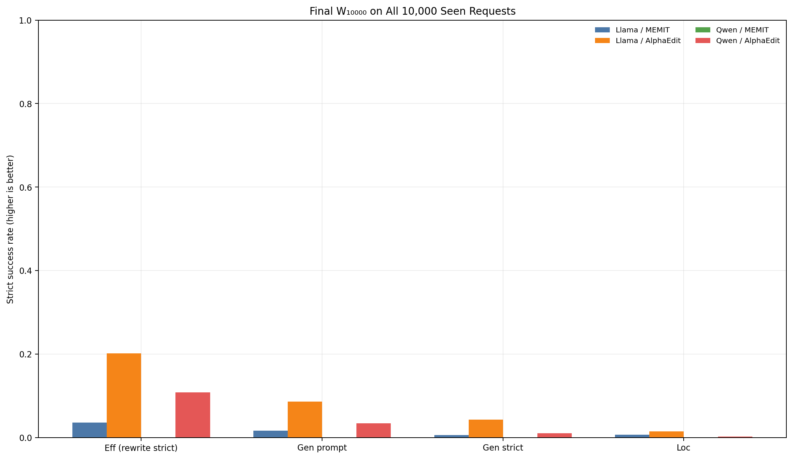
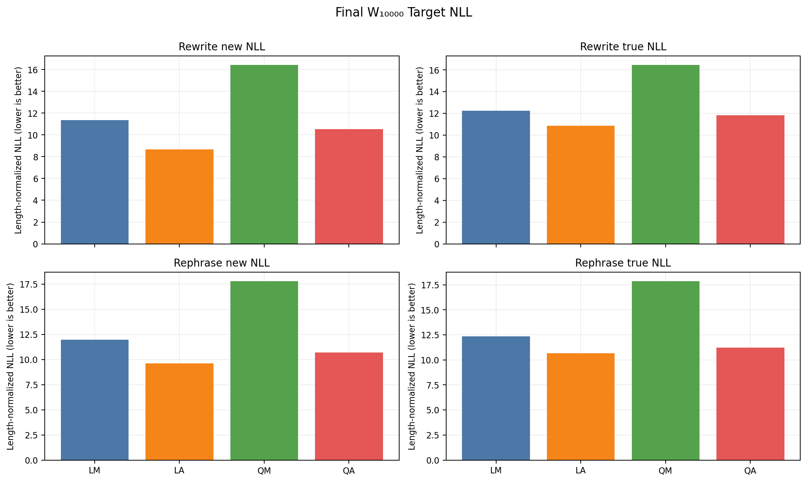
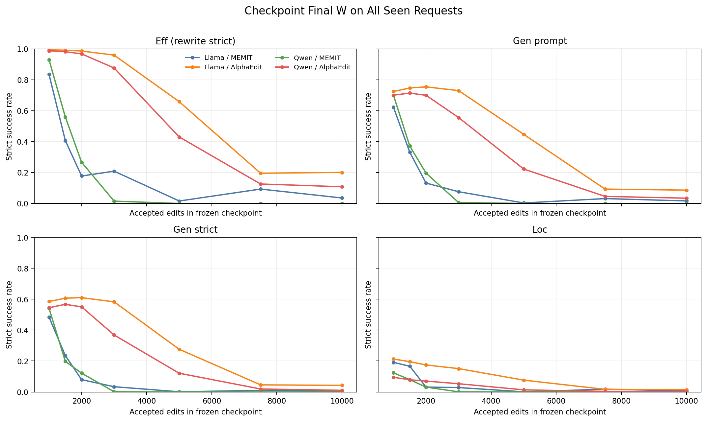
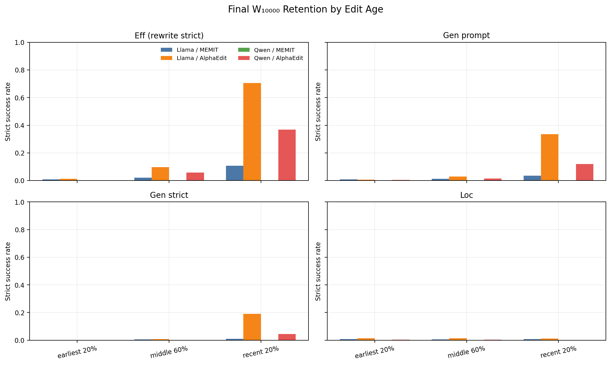

# Official lifelong layer-debt — final W full-10k 및 cumulative seen-prefix v4 사실 보고서

상태: **FOUR_ARM_FINAL_W_FULL10K_EVALUATION_TERMINAL_VALID**  
범위: Llama/Qwen × Official MEMIT/AlphaEdit 네 arm, evaluation-only backfill. `scientific_promotion=false`.

## 1. Final W₁₀₀₀₀에서 전체 10,000 request 재평가 — 대표 결과

아래가 이 보고서의 유일한 headline 성능이다. 각 arm의 10,000번째 edit 이후 frozen W 하나에서 sealed 10,000 request 전체를 다시 평가했다. 현재 B100, online-at-write, 소형 retention panel 값이 아니다. NLL 열은 request-cluster `mean/median/p90/max`다.

| 모델/방법 | Eff strict | Gen prompt | Gen strict | Loc | Rewrite new NLL | Rephrase new NLL |
|---|---|---|---|---|---|---|
| Llama-3-8B-Instruct / Official MEMIT | 357/10000 (0.036) | 335/20000 (0.017) | 53/10000 (0.005) | 648/100000 (0.006) | 10.9172/11.3481/15.5948/28.0700 | 11.6303/11.9529/14.9115/23.0916 |
| Llama-3-8B-Instruct / Official AlphaEdit | 2013/10000 (0.201) | 1727/20000 (0.086) | 426/10000 (0.043) | 1413/100000 (0.014) | 7.8485/8.6774/13.6737/24.2509 | 9.1570/9.6252/13.5203/20.4028 |
| Qwen2.5-7B-Instruct / Official MEMIT | 0/10000 (0.000) | 0/20000 (0.000) | 0/10000 (0.000) | 0/100000 (0.000) | 18.1171/16.4310/26.5229/46.7678 | 18.5074/17.8092/25.0185/42.5447 |
| Qwen2.5-7B-Instruct / Official AlphaEdit | 1084/10000 (0.108) | 686/20000 (0.034) | 105/10000 (0.011) | 246/100000 (0.002) | 9.8393/10.5178/15.1599/23.2025 | 10.5130/10.7069/14.5312/21.9783 |

### Final W₁₀₀₀₀ 상세 NLL·margin·strict

NLL과 margin은 request-cluster `mean/median/p90/max` 순서다. Strict 열의 분모는 rewrite 10,000, rephrase 20,000 prompts, locality 100,000 prompts다.

| arm | 평가축 | strict | NLL mean/median/p90/max | margin mean/median/p90/max |
|---|---|---|---|---|
| LM | Rewrite / target-new | 357/10000 (0.036) | 10.9172/11.3481/15.5948/28.0700 | -8.9319/-8.8587/-3.1769/12.2041 |
| LM | Rewrite / target-true | 36/10000 (0.004) | 12.1494/12.2542/16.1612/32.0345 | -10.2235/-9.8578/-5.3974/5.0930 |
| LM | Rephrase / target-new | 335/20000 (0.017) | 11.6303/11.9529/14.9115/23.0916 | -10.6431/-10.3027/-6.1487/3.6708 |
| LM | Rephrase / target-true | 52/20000 (0.003) | 12.1982/12.3425/15.2497/25.9596 | -11.1774/-10.6777/-6.9613/2.0992 |
| LM | Locality / target-true | 648/100000 (0.006) | 12.3682/12.5320/15.5810/24.3893 | -15.8013/-15.6363/-10.7443/-2.7562 |
| LA | Rewrite / target-new | 2013/10000 (0.201) | 7.8485/8.6774/13.6737/24.2509 | -5.1720/-6.1566/4.1804/18.5015 |
| LA | Rewrite / target-true | 59/10000 (0.006) | 10.8313/10.8699/15.0215/32.4774 | -8.9973/-8.7474/-4.3235/4.3608 |
| LA | Rephrase / target-new | 1727/20000 (0.086) | 9.1570/9.6252/13.5203/20.4028 | -8.3923/-8.6704/-3.1992/11.4948 |
| LA | Rephrase / target-true | 113/20000 (0.006) | 10.6277/10.6583/14.0409/22.9689 | -9.9746/-9.8001/-5.9020/0.5545 |
| LA | Locality / target-true | 1413/100000 (0.014) | 10.4065/10.4624/13.3611/19.0954 | -13.0089/-12.8050/-9.1012/-1.2668 |
| QM | Rewrite / target-new | 0/10000 (0.000) | 18.1171/16.4310/26.5229/46.7678 | -16.6843/-15.0777/-9.0509/-3.0657 |
| QM | Rewrite / target-true | 0/10000 (0.000) | 18.1728/16.4660/26.5883/50.3754 | -16.7142/-15.0840/-9.1295/-2.8040 |
| QM | Rephrase / target-new | 0/20000 (0.000) | 18.5074/17.8092/25.0185/42.5447 | -20.4639/-20.1354/-11.8816/-5.7399 |
| QM | Rephrase / target-true | 0/20000 (0.000) | 18.5779/17.8753/24.9780/41.8980 | -20.5042/-20.1426/-11.9737/-5.4730 |
| QM | Locality / target-true | 0/100000 (0.000) | 18.3533/17.5966/23.1626/41.9381 | -26.0963/-25.2095/-18.1922/-10.9744 |
| QA | Rewrite / target-new | 1084/10000 (0.108) | 9.8393/10.5178/15.1599/23.2025 | -6.6431/-7.0507/0.3564/11.1693 |
| QA | Rewrite / target-true | 23/10000 (0.002) | 11.9720/11.8138/16.0878/25.7398 | -9.0739/-8.7133/-4.9812/3.9889 |
| QA | Rephrase / target-new | 686/20000 (0.034) | 10.5130/10.7069/14.5312/21.9783 | -9.3745/-9.2884/-4.6689/7.5479 |
| QA | Rephrase / target-true | 74/20000 (0.004) | 11.2529/11.2416/14.7810/20.3368 | -10.0542/-9.7866/-5.8822/0.3744 |
| QA | Locality / target-true | 246/100000 (0.002) | 11.9771/11.8881/14.3911/18.5072 | -13.6972/-13.8480/-10.0505/-4.8839 |

## 2. Metric glossary / 표 읽는 법

- **Eff (higher is better):** rewrite prompt에서 target-new의 모든 teacher-forced token이 top-1이면 request 성공 1건이다. numerator는 성공 request, denominator는 seen request다.
- **Gen prompt (higher is better):** 각 paraphrase prompt에서 target-new 전체 token이 top-1인 prompt 비율이다. 이 stream은 request당 2개이므로 final denominator는 20,000/arm이다.
- **Gen strict (higher is better):** 한 request의 paraphrase 2개가 모두 strict일 때만 request 성공이다. denominator는 request 수다. Gen prompt와 집계 단위를 섞지 않는다.
- **Loc (higher is better):** neighborhood/locality prompt에서 원래 target-true의 모든 token이 top-1인 prompt 비율이다. request당 10개, final denominator 100,000/arm이다.
- **target-new/target-true NLL (lower is better):** 각각 새 사실/원래 사실 continuation token의 평균 negative log likelihood다. 표의 mean/median/p90/max는 먼저 prompt 내 token 평균, 그 뒤 request 내 prompt 평균을 낸 request-cluster 분포다.
- **margin (higher is better):** 각 continuation token에서 target logit−최고 비-target logit의 prompt 내 최솟값이다. 양수이면 그 prompt의 모든 target token이 top-1이다.
- **preference (higher is better for new):** 동일 prompt에서 target-new NLL < target-true NLL인 request 비율이다. 이는 strict와 다른 비교 지표다.
- **token accuracy:** 기존 canonical evaluator schema가 strict/NLL/margin만 반환하므로 `NOT_RECORDED_EVALUATOR_SCHEMA`; strict를 token accuracy로 대체하지 않았다.
- **mean/median/p90/max:** 산술평균/중앙값/90백분위/최댓값이다. IQR은 p75−p25이며 기존 layer table에서만 사용한다. 누락값 보간·imputation은 0이다.
- **R:** layer write 직전 `z*−activation` residual vector. **A:** Official uniform remaining-layer allocation `R / 남은 layer 수`. **Y:** 실제 write가 줄인 activation residual. **E=A−Y:** allocation-realization gap.
- **q=||R||/||R_entry|| (lower is better for closure):** entry residual로 정규화한 남은 residual. 서로 다른 모델의 절대 norm 대신 무차원 q를 비교한다.
- **rho=<Y,A>/||A||²:** target 방향 realization ratio; 1 exact, 0~1 under-realization, >1 overshoot, <0 opposite progress. **tau=||Y−rho A||/||A||:** 직교 왜곡(낮을수록 작음).
- **d_parallel/d_perp:** L8 진입 residual이 ideal `(1/5)R_entry`에서 벗어난 inherited debt의 entry-target 평행/직교 성분이다. 절대 성능 점수가 아니다.
- **recurrence closure:** `R5=(1/5)R1+(1/4)E1+(1/3)E2+(1/2)E3+E4`의 FP64 상대오차이며 계측 무결성 지표다.
- **D_TV:** layer-wise update-share 분포와 양의 target-progress 분포 사이 total variation 거리(0 동일, 1 최대 분리). Negative progress는 별도 count로 남긴다.
- **Layer-wise Update Magnitude:** 실제 `||ΔW_l||_F`; share는 5개 layer magnitude 합에서의 비중이다. activation progress와 별개 축이며 `weight energy`로 부르지 않는다.

## 3. Checkpoint final W에서 all-seen-prefix 누적 성능

평가 타입은 전부 `CHECKPOINT_FINAL_W_ON_ALL_SEEN_REQUESTS`다. t=10,000은 §1 결과를 재사용했으며 중복 GPU 평가 0이다.

| arm | edits | Eff | Gen prompt | Gen strict | Loc | Rewrite new NLL med | Rephrase new NLL med |
|---|---|---|---|---|---|---|---|
| LM | 1000 | 835/1000 (0.835) | 1245/2000 (0.623) | 484/1000 (0.484) | 1912/10000 (0.191) | 0.0360 | 0.8548 |
| LM | 1500 | 611/1500 (0.407) | 995/3000 (0.332) | 353/1500 (0.235) | 2492/15000 (0.166) | 2.6761 | 3.7264 |
| LM | 2000 | 356/2000 (0.178) | 529/4000 (0.132) | 159/2000 (0.080) | 628/20000 (0.031) | 8.2959 | 8.9330 |
| LM | 3000 | 627/3000 (0.209) | 457/6000 (0.076) | 101/3000 (0.034) | 851/30000 (0.028) | 7.3595 | 9.1836 |
| LM | 5000 | 81/5000 (0.016) | 36/10000 (0.004) | 5/5000 (0.001) | 39/50000 (0.001) | 12.9335 | 13.4673 |
| LM | 7500 | 700/7500 (0.093) | 476/15000 (0.032) | 75/7500 (0.010) | 1332/75000 (0.018) | 9.8615 | 11.1950 |
| LM | 10000 | 357/10000 (0.036) | 335/20000 (0.017) | 53/10000 (0.005) | 648/100000 (0.006) | 11.3481 | 11.9529 |
| LA | 1000 | 994/1000 (0.994) | 1450/2000 (0.725) | 585/1000 (0.585) | 2130/10000 (0.213) | 0.0010 | 0.3614 |
| LA | 1500 | 1488/1500 (0.992) | 2242/3000 (0.747) | 910/1500 (0.607) | 2940/15000 (0.196) | 0.0014 | 0.3345 |
| LA | 2000 | 1973/2000 (0.987) | 3019/4000 (0.755) | 1220/2000 (0.610) | 3491/20000 (0.175) | 0.0020 | 0.3286 |
| LA | 3000 | 2880/3000 (0.960) | 4383/6000 (0.731) | 1748/3000 (0.583) | 4529/30000 (0.151) | 0.0041 | 0.4580 |
| LA | 5000 | 3293/5000 (0.659) | 4476/10000 (0.448) | 1379/5000 (0.276) | 3815/50000 (0.076) | 0.1842 | 2.5985 |
| LA | 7500 | 1468/7500 (0.196) | 1399/15000 (0.093) | 342/7500 (0.046) | 1256/75000 (0.017) | 7.8291 | 8.7881 |
| LA | 10000 | 2013/10000 (0.201) | 1727/20000 (0.086) | 426/10000 (0.043) | 1413/100000 (0.014) | 8.6774 | 9.6252 |
| QM | 1000 | 930/1000 (0.930) | 1400/2000 (0.700) | 541/1000 (0.541) | 1235/10000 (0.123) | 0.0297 | 0.6320 |
| QM | 1500 | 840/1500 (0.560) | 1115/3000 (0.372) | 297/1500 (0.198) | 1192/15000 (0.079) | 1.1242 | 3.5168 |
| QM | 2000 | 534/2000 (0.267) | 786/4000 (0.197) | 243/2000 (0.121) | 624/20000 (0.031) | 5.3834 | 6.5104 |
| QM | 3000 | 46/3000 (0.015) | 38/6000 (0.006) | 3/3000 (0.001) | 19/30000 (0.001) | 12.6881 | 12.9799 |
| QM | 5000 | 1/5000 (0.000) | 1/10000 (0.000) | 0/5000 (0.000) | 0/50000 (0.000) | 15.3791 | 15.8768 |
| QM | 7500 | 1/7500 (0.000) | 1/15000 (0.000) | 0/7500 (0.000) | 0/75000 (0.000) | 14.2866 | 14.2137 |
| QM | 10000 | 0/10000 (0.000) | 0/20000 (0.000) | 0/10000 (0.000) | 0/100000 (0.000) | 16.4310 | 17.8092 |
| QA | 1000 | 988/1000 (0.988) | 1402/2000 (0.701) | 545/1000 (0.545) | 948/10000 (0.095) | 0.0136 | 0.5592 |
| QA | 1500 | 1473/1500 (0.982) | 2143/3000 (0.714) | 850/1500 (0.567) | 1179/15000 (0.079) | 0.0155 | 0.5591 |
| QA | 2000 | 1936/2000 (0.968) | 2800/4000 (0.700) | 1101/2000 (0.550) | 1401/20000 (0.070) | 0.0191 | 0.5873 |
| QA | 3000 | 2630/3000 (0.877) | 3337/6000 (0.556) | 1105/3000 (0.368) | 1592/30000 (0.053) | 0.0296 | 1.8628 |
| QA | 5000 | 2153/5000 (0.431) | 2231/10000 (0.223) | 604/5000 (0.121) | 675/50000 (0.013) | 2.7332 | 6.4062 |
| QA | 7500 | 946/7500 (0.126) | 690/15000 (0.046) | 143/7500 (0.019) | 265/75000 (0.004) | 10.0402 | 9.7813 |
| QA | 10000 | 1084/10000 (0.108) | 686/20000 (0.034) | 105/10000 (0.011) | 246/100000 (0.002) | 10.5178 | 10.7069 |

### 1,000→10,000 edits 누적 변화량

성공률 열은 final−1k(양수 개선), NLL 열도 final−1k이므로 음수일수록 개선이다.

| arm | ΔEff | ΔGen prompt | ΔGen strict | ΔLoc | ΔRewrite new NLL med | ΔRephrase new NLL med |
|---|---|---|---|---|---|---|
| LM | -0.7993 | -0.6058 | -0.4787 | -0.1847 | 11.3121 | 11.0981 |
| LA | -0.7927 | -0.6386 | -0.5424 | -0.1989 | 8.6763 | 9.2639 |
| QM | -0.9300 | -0.7000 | -0.5410 | -0.1235 | 16.4014 | 17.1772 |
| QA | -0.8796 | -0.6667 | -0.5345 | -0.0923 | 10.5042 | 10.1477 |

원래 요청 schedule은 `{100,500,1000,2000,4000,6000,8000,10000}`이었으나 exact frozen state는 `{1000,1500,2000,3000,5000,7500,10000}`에만 존재했다. 이는 outcome을 열기 전 state availability에 따른 amendment다. absent 시점의 replay/reconstruction/interpolation/nearest substitution은 모두 0이며 amendment receipt SHA는 `3684dd72e3a38e8b10544b6071e592a10eafdec881b65f0c87656eb2c662dcc7`다.

## 4. Final W₁₀₀₀₀ edit-age retention

Age bin은 결과 전에 ordinal의 first 20% / middle 60% / last 20%로 고정했다. 각 행의 request denominator와 prompt denominator는 `edit-age-strata-summary.csv`에 있다.

| arm | age stratum | request n | Eff | Gen prompt | Gen strict | Loc |
|---|---|---|---|---|---|---|
| LM | EARLY_FIRST_20PCT | 2000 | 0.0095 | 0.0077 | 0.0020 | 0.0070 |
| LM | MIDDLE_60PCT | 6000 | 0.0208 | 0.0132 | 0.0050 | 0.0062 |
| LM | RECENT_LAST_20PCT | 2000 | 0.1065 | 0.0362 | 0.0095 | 0.0067 |
| LA | EARLY_FIRST_20PCT | 2000 | 0.0130 | 0.0075 | 0.0005 | 0.0142 |
| LA | MIDDLE_60PCT | 6000 | 0.0962 | 0.0298 | 0.0075 | 0.0146 |
| LA | RECENT_LAST_20PCT | 2000 | 0.7050 | 0.3347 | 0.1900 | 0.0126 |
| QM | EARLY_FIRST_20PCT | 2000 | 0.0000 | 0.0000 | 0.0000 | 0.0000 |
| QM | MIDDLE_60PCT | 6000 | 0.0000 | 0.0000 | 0.0000 | 0.0000 |
| QM | RECENT_LAST_20PCT | 2000 | 0.0000 | 0.0000 | 0.0000 | 0.0000 |
| QA | EARLY_FIRST_20PCT | 2000 | 0.0025 | 0.0050 | 0.0005 | 0.0025 |
| QA | MIDDLE_60PCT | 6000 | 0.0572 | 0.0154 | 0.0022 | 0.0025 |
| QA | RECENT_LAST_20PCT | 2000 | 0.3680 | 0.1202 | 0.0455 | 0.0022 |

각 checkpoint×age×target category의 request-cluster NLL와 margin mean/median/p90/max는 `edit-age-strata-summary.csv` 84행에 완전 수록했다.

Fixed sentinel은 동일 probe가 시간에 따라 어떻게 변하는지, online-at-write는 편집 직후 성능, current B100은 당시 최근 100개 성능, cumulative seen-prefix는 frozen W_t가 지금까지 본 모든 request를 얼마나 유지하는지를 답한다. 네 타입은 서로 대체되지 않는다.

## 5. 기존 layer residual/update/action-realization 분석

v3의 layer telemetry bytes는 immutable하게 재사용한다. 아래 q/V̄는 final-W full10k 성능이 아니라 10k checkpoint의 fixed sentinel mechanism probe다.

| arm | sentinel pre-L8 q med | sentinel post-L8 q med | V_to_go/A0 | unreachable fraction |
|---|---|---|---|---|
| LM | 0.5116 | 0.3080 | 3.2385 | 0.5224 |
| LA | 0.3860 | 0.1918 | 13.6264 | 0.6052 |
| QM | 0.3534 | 0.2557 | 0.6330 | 0.6159 |
| QA | 0.2219 | 0.0255 | 2.1977 | 0.6185 |

- Llama 두 방법은 terminal sentinel에서 L8 update share가 가장 컸지만 Qwen은 L4가 가장 컸으므로 universal last-layer concentration claim은 유지하지 않는다.
- D_TV drift 방향은 모델별로 달랐고, observation만으로 barrier benefit·ODE necessity·causal effect를 주장하지 않는다.
- 전체 request/layer rho, tau, debt, recurrence, update magnitude/share, completion geometry는 immutable v3의 `layer-q-summary.csv`, `rho-tau-summary.csv`, `inherited-debt-summary.csv`, `recurrence-summary.csv`, `update-magnitude-share.csv`에 있다.

기존 재현 그림: [residual trajectory](../official-layer-realization-debt-lifelong-b100x100-2026-09-03-v3/primary-residual-trajectory-2x2.png), [rho](../official-layer-realization-debt-lifelong-b100x100-2026-09-03-v3/rho-by-layer-terminal.png), [tau](../official-layer-realization-debt-lifelong-b100x100-2026-09-03-v3/tau-by-layer-terminal.png), [inherited debt](../official-layer-realization-debt-lifelong-b100x100-2026-09-03-v3/inherited-debt-distributions.png), [Layer-wise Update Magnitude](../official-layer-realization-debt-lifelong-b100x100-2026-09-03-v3/layer-wise-update-magnitude.png).

## 6. Evaluation-only compute와 불변식

| arm | wall h | request-state n | forward batches | token examples | peak GPU GiB |
|---|---|---|---|---|---|
| LM | 1.665 | 30000 | 150331 | 485878 | 30.40 |
| LA | 1.654 | 30000 | 150331 | 485878 | 30.40 |
| QM | 1.626 | 30000 | 150331 | 485878 | 28.77 |
| QA | 1.640 | 30000 | 150331 | 485878 | 28.77 |

각 frozen state에서 평가 전후 edited weight pointer/version/byte SHA는 exact했다. `compute_z/writer/key/solve/cache append/cache consume/history append/optimizer/backward/parameter grad/model update during evaluation`은 전부 0이다. Checkpoint load만 7회/arm으로 별도 계수했다. Model parameter는 FULL-FP32, autocast/quantization=false, nonfinite=0, duplicate/imputation=0이다. Alpha cache/MEMIT covariance는 checkpoint container identity에 봉인했지만 forward-only runtime으로 load하지 않았다.

## 7. Current-B100 diagnostic appendix — headline 아님

v3의 첫 표와 `endpoint-checkpoint-strict-rates.png`는 checkpoint 당시 current B100만 평가한다. 이 값은 online/local diagnostic으로만 보존하며 final 10k 또는 cumulative retention 결론에 사용하지 않는다. v3 report SHA `c9daf397b8c9fa679fa89e4f6407d7e03761a11f9ead177e998a97e726e24a8f`는 변경하지 않았다.

## 8. Provenance, limitations, artifact inventory

- Evaluation runtime source HEAD/tree: `c2c44901ea65a470ef3dccf252b3be425711ffa7` / `b94c07afac284ec4e47b7d663d724ffdc3b75d15`; analysis source HEAD/tree: `7ad261075a4b72c0045aaee303a4c792b5b83810` / `6c25dc86815e0ee59ee0ffd5a555f40e4174c45e`.
- Evaluation result root: `/data/janghj/ODE-edit/local/results/official-layer-realization-debt-lifelong-finalw-full10k-v1/campaign-20260903-tech-r3`.
- Common stream/order/evaluator: `2951b86dfa829ef38b2fb03551a81dc9ce4f11c779af3f0f0c027224ed65cf7d` / `f86dfc97f50614d8fe3d7ed929326485ea0b1237151f93d7ed7339bae8979c43` / `72b8ecb737157a42d6a055ffd339dc3f907876a0a98165a00cca49ca9bbed07d`.
- Four-arm checkpoint denominator 28/28; request-state denominator 120,000; final request denominator 40,000; final rephrase prompt denominator 80,000; final locality prompt denominator 400,000.
- Original unavailable checkpoints `{100,500,4000,6000,8000}` remain `NOT_AVAILABLE_EXACT_STATE`; no reconstruction or estimate.
- Raw prompts/logits/generations publish count 0. Per-request output contains request/case hashes and scalar metrics only.
- Per-request `identity_sha256`는 evaluator가 만든 core row(metrics+ordinal+hashes)에 결속되고, outcome-blind 파생 `age_stratum`은 그 뒤 추가된다. 분석기는 core identity와 age(ordinal, seen-count)를 각각 독립 검증했다.
- Technical exclusions are denominator0: two preflight adapter roots and job33300 canonical-batching parity lineage. Their evidence is preserved separately.
- New figures are deterministic headless Python outputs. No Codex visualization/imagegen/manual image editing was used; missing values were not interpolated.
- Full tables and every row/member SHA are in `analysis-manifest.json`; package root is in `rooted-analysis-receipt.json`.

## 9. Factual conclusion

Final W₁₀₀₀₀의 실제 10,000-request 성능은 §1만이 대표값이다. Checkpoint 누적곡선은 seen-prefix retention의 진행을, v3 layer probe는 action–realization mechanism을 각각 별도로 보여준다. 이 backfill은 기존 observational 결론의 성능 분모를 교정하지만 barrier 효용이나 인과성을 새로 주장하지 않는다.
