# Official layer-write realization debt — CounterFact primary metrics v6 사실 보고서

이 문서는 v3/v4-r2/v5를 수정하지 않고, canonical CounterFact NLL-pair metric을 추가한 successor다. `scientific_promotion=false`.

## 1. Final W₁₀₀₀₀ — canonical CounterFact headline

아래 표는 frozen final W₁₀₀₀₀에서 sealed 10,000 requests 전체를 평가한 결과다. RS/PS/NS가 primary이며 두 accuracy 열은 secondary teacher-forced diagnostic이다.

| model/method | RS | PS | NS | rewrite_acc | rephrase_acc |
| --- | --- | --- | --- | --- | --- |
| Llama-3-8B-Instruct / Official MEMIT | 6021/10000 (0.60210) | 10981/20000 (0.54905) | 49895/100000 (0.49895) | 357/10000 (0.03570) | 335/20000 (0.01675) |
| Llama-3-8B-Instruct / Official AlphaEdit | 6785/10000 (0.67850) | 12285/20000 (0.61425) | 50918/100000 (0.50918) | 2013/10000 (0.20130) | 1727/20000 (0.08635) |
| Qwen2.5-7B-Instruct / Official MEMIT | 5037/10000 (0.50370) | 10206/20000 (0.51030) | 49843/100000 (0.49843) | 0/10000 (0.00000) | 0/20000 (0.00000) |
| Qwen2.5-7B-Instruct / Official AlphaEdit | 6653/10000 (0.66530) | 11291/20000 (0.56455) | 51934/100000 (0.51934) | 1084/10000 (0.10840) | 686/20000 (0.03430) |

### 1.1 핵심 metric 교정 결과

- 1k의 낮은 종전 `Loc`는 실험의 locality 실패율이 아니라 target-true teacher-forced strict accuracy였다. 동일 frozen W₁₀₀₀에서 canonical NS는 LM 7266/10000 (0.7266), LA 7780/10000 (0.7780), QM 6948/10000 (0.6948), QA 7139/10000 (0.7139)이다.
- NS 보충 평가의 기존 locality-target-true 3-request parity는 모든 checkpoint/model/method에서 오차 0이며, 평가 전후 edited-weight pointer/version/bytes가 동일하다. 따라서 현재 증거는 edit trajectory 오류보다 metric-label/schema 불일치를 지지한다.
- RS/PS와 rewrite_acc/rephrase_acc는 성공 조건이 다르므로 값의 크기를 서로 치환하거나 같은 efficacy 정의로 pooling하지 않는다.

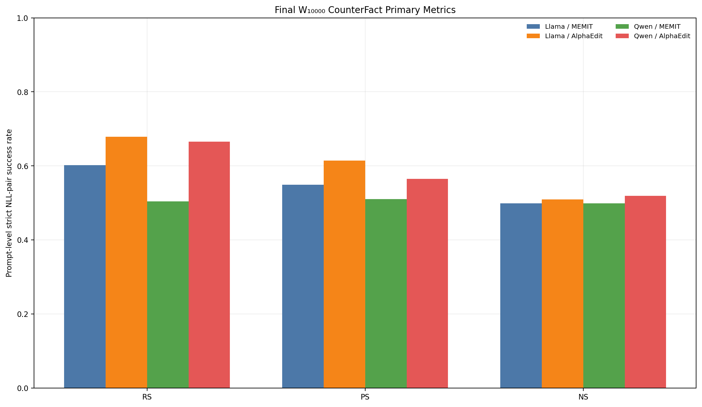

## 2. Metric glossary / 읽는 법

- **RS (Rewrite Success, higher):** request당 rewrite prompt 1개에서 length-normalized `target_new NLL < target_true NLL`. tie는 실패. 분모=t prompts.
- **PS (Paraphrase Success, higher):** request당 rephrase prompt 2개 각각에서 `target_new NLL < target_true NLL`. prompt 단위이며 request-cluster 평균 비교가 아니다. 분모=2t prompts.
- **NS (Neighborhood Success, higher):** request당 neighborhood prompt 10개 각각에서 `target_true NLL < target_new NLL`. 분모=10t prompts. 이것이 canonical locality primary metric이다.
- **rewrite_acc / rephrase_acc (secondary, higher):** target-new teacher-forced continuation의 모든 target token이 top-1인 prompt 비율. generic token-mean accuracy와 다르며 RS/PS가 아니다.
- **rephrase_acc strict-all-2 (secondary):** 한 request의 rephrase prompts 2개가 모두 teacher-forced strict일 때 성공 1건.
- **neighborhood_target_true_teacher_forced_acc (secondary):** target-true continuation이 top-1인 prompt 비율. v5의 `Loc` 숫자는 이 값이었으며 NS로 재명명하지 않았다.
- **NLL (lower):** target continuation token들의 length-normalized mean negative log likelihood. new/true는 같은 request·category·prompt index에서 pair한다. prompt-level과 request 내부 prompts를 먼저 묶은 request-cluster 통계를 분리한다. **desired NLL advantage (higher):** RS/PS는 `true-new`, NS는 `new-true`; 양수일 때만 success다.
- **margin (higher):** 각 target token logit에서 최대 비-target logit을 뺀 뒤 continuation 최소값. 평균 margin과 all-token strict는 같은 통계가 아니다.
- **mean/median/IQR/p90/max:** 산술평균/중앙값/(p75−p25)/90백분위/최댓값. 본 v6 primary 표는 prompt-level NLL pair 분포이며 prompt와 request denominator를 혼합하지 않는다.
- **R=z*−Φ(W):** layer write 직전 activation residual. **A=R/n_remaining:** Official layer allocation. **Y=R_pre−R_post:** 실제 write가 줄인 residual. **E=A−Y:** allocation-realization gap. activation-space vector이며 NLL 단위가 아니다.
- **q=||R||/||R_entry|| (lower):** entry-normalized remaining residual. **rho=<Y,A>/||A||²:** target-aligned realization ratio(1 exact, 0–1 under, >1 overshoot, <0 opposite). **tau=||Y−rho A||/||A||:** orthogonal distortion.
- **d_parallel/d_perp:** L8 entry residual과 ideal `(1/5)R_entry` 차이의 entry-target 평행/직교 정규화 성분. **recurrence closure (lower):** exact residual recurrence의 FP64 relative error.
- **D_TV (lower for profile agreement):** 다섯 layer update-share와 positive target-progress profile의 total variation distance(0 identical, 1 maximally separated). negative progress는 normalization에서 숨기지 않고 별도 센다.
- **Layer-wise Update Magnitude:** `||ΔW_l||_F`; **share:** 다섯 layer magnitude 합 중 해당 layer 비중. activation progress와 별개 축이며 squared Frobenius telemetry와 혼용하지 않는다. 모든 mechanism metric은 관찰 telemetry이고 RS/PS/NS controller input이 아니다.

## 3. Metric/source audit와 실행 provenance

- v6 source HEAD/tree: `9883c6be37280dec2a35a046f5ccc6b2ffa51703` / `8b236f8863a757a99037dd3b44b7eb83fbb395a8`.
- Evaluation-only backfill Slurm job: `33539` array `0-3%2`; LM/LA/QM/QA one GPU each, explicit `--mem=60416M`.
- Common stream/order: `2951b86dfa829ef38b2fb03551a81dc9ce4f11c779af3f0f0c027224ed65cf7d` / `f86dfc97f50614d8fe3d7ed929326485ea0b1237151f93d7ed7339bae8979c43`.
- Canonical CounterFact context/pair construction: `/data/janghj/knowledge-editing-regularization/experiments/py/eval_utils_counterfact.py` lines 43–76, SHA `f2de63e6cc68871cb042f614193294a433c4b76622dd410de515df8cb73416b8`; strict success directions: `/data/janghj/knowledge-editing-regularization/experiments/summarize.py` lines 63–108, SHA `9791812222b151952c16cacf28daf3e8be9645e37321e0aa84be6ab5e24a66f8`.
- Secondary accuracy source: `project/run_scripts/fixed_z_nonuniqueness/evaluation.py` lines 140–170. `nll`은 target-token mean이고 `strict`는 해당 prompt의 모든 target token top-1 exact다.
- Existing final-W raw: 4 terminals, 28 receipts, 120,000 request-state rows full rehash PASS. Rewrite NLL pairs=120,000 prompts; rephrase NLL pairs=240,000 prompts.
- Missing field audit: locality target-new=0/1,200,000 prompts. Evaluation-only backfill produced exactly 1,200,000 prompts; edit replay/compute_z/writer/key/solve/cache-history mutation/backward/gradient/model update/imputation=0.
- Backfill sealed members=60; local prompt-pair table=`/data/janghj/ODE-edit/local/analysis/official-layer-realization-debt-lifelong-counterfact-metrics-v6/campaign-20260903-v1/counterfact-primary-prompt-pairs.jsonl.gz` (1560000 rows, `6455b444fd6a37b30698fd357639ce195d4e544a6d8468ebee4cfa04e24fc128`). Raw prompt/logit/generation publication=0.
- 기존 v5 `Loc` 저값은 `neighborhood_target_true_teacher_forced_acc`였고 NS가 아니었다. 따라서 그 수치를 canonical locality failure rate로 사용하지 않는다.

## 4. Seven-checkpoint cumulative RS/PS/NS

각 W_t는 first t seen requests 전체를 평가한다. current B100나 online-at-write가 아니다.

| arm | t | request n | RS | PS | NS | rewrite_acc | rephrase_acc | neighborhood true TF acc |
| --- | --- | --- | --- | --- | --- | --- | --- | --- |
| LM | 1000 | 1000 | 947/1000 (0.9470) | 1763/2000 (0.8815) | 7266/10000 (0.7266) | 0.8350 | 0.6225 | 0.1912 |
| LM | 1500 | 1500 | 1065/1500 (0.7100) | 2022/3000 (0.6740) | 9761/15000 (0.6507) | 0.4073 | 0.3317 | 0.1661 |
| LM | 2000 | 2000 | 1261/2000 (0.6305) | 2394/4000 (0.5985) | 10312/20000 (0.5156) | 0.1780 | 0.1323 | 0.0314 |
| LM | 3000 | 3000 | 2016/3000 (0.6720) | 3732/6000 (0.6220) | 14820/30000 (0.4940) | 0.2090 | 0.0762 | 0.0284 |
| LM | 5000 | 5000 | 2921/5000 (0.5842) | 5413/10000 (0.5413) | 24172/50000 (0.4834) | 0.0162 | 0.0036 | 0.0008 |
| LM | 7500 | 7500 | 5024/7500 (0.6699) | 8896/15000 (0.5931) | 37689/75000 (0.5025) | 0.0933 | 0.0317 | 0.0178 |
| LM | 10000 | 10000 | 6021/10000 (0.6021) | 10981/20000 (0.5491) | 49895/100000 (0.4990) | 0.0357 | 0.0168 | 0.0065 |
| LA | 1000 | 1000 | 999/1000 (0.9990) | 1913/2000 (0.9565) | 7780/10000 (0.7780) | 0.9940 | 0.7250 | 0.2130 |
| LA | 1500 | 1500 | 1495/1500 (0.9967) | 2867/3000 (0.9557) | 11271/15000 (0.7514) | 0.9920 | 0.7473 | 0.1960 |
| LA | 2000 | 2000 | 1994/2000 (0.9970) | 3822/4000 (0.9555) | 14494/20000 (0.7247) | 0.9865 | 0.7548 | 0.1746 |
| LA | 3000 | 3000 | 2977/3000 (0.9923) | 5697/6000 (0.9495) | 20325/30000 (0.6775) | 0.9600 | 0.7305 | 0.1510 |
| LA | 5000 | 5000 | 4571/5000 (0.9142) | 8417/10000 (0.8417) | 30325/50000 (0.6065) | 0.6586 | 0.4476 | 0.0763 |
| LA | 7500 | 7500 | 5031/7500 (0.6708) | 9096/15000 (0.6064) | 40466/75000 (0.5395) | 0.1957 | 0.0933 | 0.0167 |
| LA | 10000 | 10000 | 6785/10000 (0.6785) | 12285/20000 (0.6142) | 50918/100000 (0.5092) | 0.2013 | 0.0863 | 0.0141 |
| QM | 1000 | 1000 | 985/1000 (0.9850) | 1937/2000 (0.9685) | 6948/10000 (0.6948) | 0.9300 | 0.7000 | 0.1235 |
| QM | 1500 | 1500 | 1294/1500 (0.8627) | 2419/3000 (0.8063) | 9301/15000 (0.6201) | 0.5600 | 0.3717 | 0.0795 |
| QM | 2000 | 2000 | 1413/2000 (0.7065) | 2722/4000 (0.6805) | 10865/20000 (0.5433) | 0.2670 | 0.1965 | 0.0312 |
| QM | 3000 | 3000 | 1695/3000 (0.5650) | 3333/6000 (0.5555) | 14554/30000 (0.4851) | 0.0153 | 0.0063 | 0.0006 |
| QM | 5000 | 5000 | 2696/5000 (0.5392) | 5334/10000 (0.5334) | 23845/50000 (0.4769) | 0.0002 | 0.0001 | 0.0000 |
| QM | 7500 | 7500 | 3967/7500 (0.5289) | 7865/15000 (0.5243) | 36321/75000 (0.4843) | 0.0001 | 0.0001 | 0.0000 |
| QM | 10000 | 10000 | 5037/10000 (0.5037) | 10206/20000 (0.5103) | 49843/100000 (0.4984) | 0.0000 | 0.0000 | 0.0000 |
| QA | 1000 | 1000 | 999/1000 (0.9990) | 1967/2000 (0.9835) | 7139/10000 (0.7139) | 0.9880 | 0.7010 | 0.0948 |
| QA | 1500 | 1500 | 1497/1500 (0.9980) | 2956/3000 (0.9853) | 10113/15000 (0.6742) | 0.9820 | 0.7143 | 0.0786 |
| QA | 2000 | 2000 | 1990/2000 (0.9950) | 3928/4000 (0.9820) | 12901/20000 (0.6451) | 0.9680 | 0.7000 | 0.0701 |
| QA | 3000 | 3000 | 2905/3000 (0.9683) | 5449/6000 (0.9082) | 18064/30000 (0.6021) | 0.8767 | 0.5562 | 0.0531 |
| QA | 5000 | 5000 | 4271/5000 (0.8542) | 7317/10000 (0.7317) | 28070/50000 (0.5614) | 0.4306 | 0.2231 | 0.0135 |
| QA | 7500 | 7500 | 4891/7500 (0.6521) | 8414/15000 (0.5609) | 39002/75000 (0.5200) | 0.1261 | 0.0460 | 0.0035 |
| QA | 10000 | 10000 | 6653/10000 (0.6653) | 11291/20000 (0.5645) | 51934/100000 (0.5193) | 0.1084 | 0.0343 | 0.0025 |

### 4.1 1k→10k primary 변화

- **LM:** RS 0.9470→0.6021 (Δ-0.3449), PS 0.8815→0.5491 (Δ-0.3324), NS 0.7266→0.4990 (Δ-0.2277).
- **LA:** RS 0.9990→0.6785 (Δ-0.3205), PS 0.9565→0.6142 (Δ-0.3423), NS 0.7780→0.5092 (Δ-0.2688).
- **QM:** RS 0.9850→0.5037 (Δ-0.4813), PS 0.9685→0.5103 (Δ-0.4582), NS 0.6948→0.4984 (Δ-0.1964).
- **QA:** RS 0.9990→0.6653 (Δ-0.3337), PS 0.9835→0.5645 (Δ-0.4190), NS 0.7139→0.5193 (Δ-0.1946).

모든 변화는 frozen checkpoint W_t에서 seen-prefix 전체를 다시 평가한 descriptive 값이다. method 효과나 인과로 해석하지 않는다.

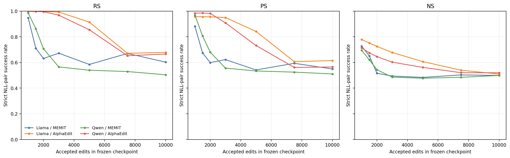

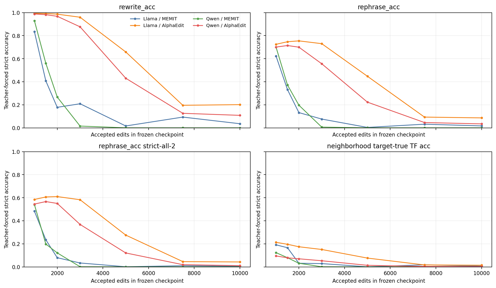

## 5. Prompt-level NLL-pair distributions

각 행은 prompt-level pair다. 열 순서는 mean/median/p90/max다.

| arm | t | metric | success n/d | new NLL | true NLL | desired advantage | ties |
| --- | --- | --- | --- | --- | --- | --- | --- |
| LM | 1000 | RS | 947/1000 (0.9470) | 0.810/0.036/2.712/20.606 | 9.805/9.663/15.673/25.019 | 8.995/9.318/15.415/25.019 | 0 |
| LM | 1000 | PS | 1763/2000 (0.8815) | 1.894/0.530/5.950/20.173 | 8.136/7.844/13.342/23.810 | 6.242/6.286/12.748/23.809 | 0 |
| LM | 1000 | NS | 7266/10000 (0.7266) | 7.307/7.247/12.255/21.858 | 4.564/3.945/9.244/21.192 | 2.743/2.640/8.693/21.691 | 0 |
| LM | 1500 | RS | 1065/1500 (0.7100) | 3.583/2.676/8.695/23.594 | 6.631/5.998/11.872/27.296 | 3.048/2.596/10.200/27.296 | 0 |
| LM | 1500 | PS | 2022/3000 (0.6740) | 4.287/3.473/9.797/22.938 | 6.656/6.142/11.632/25.463 | 2.370/1.956/8.683/25.299 | 0 |
| LM | 1500 | NS | 9761/15000 (0.6507) | 6.410/6.048/11.067/23.497 | 5.028/4.480/9.575/22.155 | 1.381/1.374/6.208/16.991 | 0 |
| LM | 2000 | RS | 1261/2000 (0.6305) | 7.575/8.296/13.005/21.355 | 9.726/9.821/13.974/25.464 | 2.150/1.532/9.516/25.464 | 0 |
| LM | 2000 | PS | 2394/4000 (0.5985) | 8.342/9.049/13.438/23.590 | 9.873/10.096/13.968/28.147 | 1.530/1.023/7.781/28.147 | 0 |
| LM | 2000 | NS | 10312/20000 (0.5156) | 9.540/9.882/13.689/27.128 | 9.319/9.643/13.310/27.437 | 0.222/0.138/5.049/22.586 | 0 |
| LM | 3000 | RS | 2016/3000 (0.6720) | 7.135/7.360/12.652/19.176 | 9.700/9.877/13.655/29.691 | 2.565/2.191/9.231/29.691 | 0 |
| LM | 3000 | PS | 3732/6000 (0.6220) | 8.916/9.267/13.559/20.552 | 10.340/10.518/14.195/22.113 | 1.424/1.298/7.036/22.112 | 0 |
| LM | 3000 | NS | 14820/30000 (0.4940) | 9.650/9.948/13.734/21.709 | 9.810/10.096/13.732/23.089 | -0.161/-0.059/4.906/15.664 | 0 |
| LM | 5000 | RS | 2921/5000 (0.5842) | 12.492/12.934/15.783/20.441 | 13.222/13.398/16.187/20.526 | 0.730/0.485/4.232/15.593 | 0 |
| LM | 5000 | PS | 5413/10000 (0.5413) | 13.261/13.538/16.174/20.417 | 13.631/13.741/16.533/20.597 | 0.370/0.245/3.556/14.317 | 0 |
| LM | 5000 | NS | 24172/50000 (0.4834) | 13.207/13.434/16.050/21.622 | 13.405/13.513/16.301/22.409 | -0.198/-0.098/2.876/11.332 | 0 |
| LM | 7500 | RS | 5024/7500 (0.6699) | 9.213/9.862/14.068/22.565 | 11.104/11.463/14.850/22.809 | 1.891/1.505/7.176/19.078 | 0 |
| LM | 7500 | PS | 8896/15000 (0.5931) | 10.829/11.299/14.573/27.367 | 11.725/11.937/14.997/26.978 | 0.897/0.683/4.920/17.705 | 0 |
| LM | 7500 | NS | 37689/75000 (0.5025) | 11.279/11.729/15.157/25.465 | 11.339/11.779/15.174/24.773 | -0.060/0.022/3.926/17.250 | 0 |
| LM | 10000 | RS | 6021/10000 (0.6021) | 10.917/11.348/15.595/28.070 | 12.149/12.254/16.161/32.034 | 1.232/0.833/6.651/24.213 | 0 |
| LM | 10000 | PS | 10981/20000 (0.5491) | 11.630/11.943/15.351/29.713 | 12.198/12.302/15.638/29.811 | 0.568/0.327/4.831/21.132 | 0 |
| LM | 10000 | NS | 49895/100000 (0.4990) | 12.215/12.294/16.522/34.904 | 12.368/12.479/16.532/33.714 | -0.153/-0.009/4.363/17.776 | 0 |
| LA | 1000 | RS | 999/1000 (0.9990) | 0.030/0.001/0.005/9.979 | 14.514/14.278/20.020/27.756 | 14.484/14.275/20.019/27.755 | 0 |
| LA | 1000 | PS | 1913/2000 (0.9565) | 1.344/0.113/4.778/15.503 | 10.118/9.951/15.765/25.406 | 8.774/8.894/15.437/25.405 | 0 |
| LA | 1000 | NS | 7780/10000 (0.7780) | 8.692/8.767/13.999/26.222 | 4.810/4.189/10.125/21.732 | 3.882/3.972/10.531/22.602 | 0 |
| LA | 1500 | RS | 1495/1500 (0.9967) | 0.046/0.001/0.009/12.105 | 14.063/13.830/19.601/28.610 | 14.017/13.828/19.599/28.608 | 0 |
| LA | 1500 | PS | 2867/3000 (0.9557) | 1.184/0.118/4.181/15.790 | 9.972/9.851/15.440/25.546 | 8.788/8.944/15.191/25.540 | 0 |
| LA | 1500 | NS | 11271/15000 (0.7514) | 8.360/8.351/13.795/30.795 | 4.945/4.387/10.211/26.582 | 3.415/3.361/10.072/25.248 | 0 |
| LA | 2000 | RS | 1994/2000 (0.9970) | 0.077/0.002/0.018/15.769 | 13.811/13.545/19.404/28.953 | 13.734/13.528/19.397/28.951 | 0 |
| LA | 2000 | PS | 3822/4000 (0.9555) | 1.179/0.123/4.213/15.437 | 9.941/9.819/15.223/26.923 | 8.761/8.889/15.007/26.919 | 0 |
| LA | 2000 | NS | 14494/20000 (0.7247) | 8.135/8.103/13.659/30.166 | 5.218/4.710/10.512/25.967 | 2.917/2.963/9.624/22.341 | 0 |
| LA | 3000 | RS | 2977/3000 (0.9923) | 0.219/0.004/0.098/19.715 | 12.795/12.499/18.694/30.921 | 12.576/12.430/18.644/30.919 | 0 |
| LA | 3000 | PS | 5697/6000 (0.9495) | 1.330/0.197/4.627/17.914 | 9.582/9.396/14.853/27.139 | 8.251/8.328/14.478/27.137 | 0 |
| LA | 3000 | NS | 20325/30000 (0.6775) | 7.838/7.817/13.501/29.118 | 5.570/5.132/10.826/26.445 | 2.268/2.219/9.077/29.115 | 0 |
| LA | 5000 | RS | 4571/5000 (0.9142) | 2.256/0.184/8.055/22.959 | 10.157/9.935/15.848/27.958 | 7.902/7.987/15.305/27.957 | 0 |
| LA | 5000 | PS | 8417/10000 (0.8417) | 3.414/2.042/8.954/22.252 | 8.530/8.289/13.571/26.059 | 5.116/4.890/12.017/26.058 | 0 |
| LA | 5000 | NS | 30325/50000 (0.6065) | 8.263/8.150/13.828/29.421 | 7.040/6.754/12.321/26.093 | 1.223/1.093/7.014/22.030 | 0 |
| LA | 7500 | RS | 5031/7500 (0.6708) | 7.417/7.829/13.596/28.820 | 10.228/10.093/15.126/27.934 | 2.811/1.931/10.651/27.934 | 0 |
| LA | 7500 | PS | 9096/15000 (0.6064) | 8.567/8.851/14.016/25.498 | 9.966/9.983/14.557/26.609 | 1.398/0.961/6.947/24.495 | 0 |
| LA | 7500 | NS | 40466/75000 (0.5395) | 10.133/10.136/15.005/29.258 | 9.731/9.690/14.706/30.895 | 0.402/0.342/5.010/20.812 | 0 |
| LA | 10000 | RS | 6785/10000 (0.6785) | 7.848/8.677/13.674/24.251 | 10.831/10.870/15.022/32.477 | 2.983/1.969/11.027/32.477 | 0 |
| LA | 10000 | PS | 12285/20000 (0.6142) | 9.157/9.721/13.956/26.663 | 10.628/10.761/14.585/31.155 | 1.471/1.015/6.808/31.155 | 0 |
| LA | 10000 | NS | 50918/100000 (0.5092) | 10.415/10.700/14.632/27.559 | 10.407/10.616/14.593/29.564 | 0.008/0.077/4.471/21.433 | 0 |
| QM | 1000 | RS | 985/1000 (0.9850) | 0.397/0.030/0.598/14.350 | 12.649/12.327/18.697/30.257 | 12.251/12.189/18.631/30.256 | 0 |
| QM | 1000 | PS | 1937/2000 (0.9685) | 1.514/0.298/5.088/17.037 | 11.494/11.280/17.153/29.935 | 9.979/9.941/16.666/29.934 | 0 |
| QM | 1000 | NS | 6948/10000 (0.6948) | 7.896/7.770/12.705/22.829 | 5.844/5.403/10.897/24.359 | 2.052/2.027/7.445/19.719 | 0 |
| QM | 1500 | RS | 1294/1500 (0.8627) | 2.563/1.124/7.180/19.502 | 8.482/8.177/13.693/26.787 | 5.919/5.813/12.961/26.785 | 0 |
| QM | 1500 | PS | 2419/3000 (0.8063) | 4.101/3.132/9.631/22.453 | 8.610/8.396/13.481/25.132 | 4.509/4.256/11.114/25.120 | 0 |
| QM | 1500 | NS | 9301/15000 (0.6201) | 7.478/7.252/12.082/23.428 | 6.399/6.065/11.265/23.060 | 1.079/1.051/5.828/18.694 | 0 |
| QM | 2000 | RS | 1413/2000 (0.7065) | 5.515/5.383/11.222/19.658 | 8.475/8.258/13.074/22.351 | 2.960/2.536/10.024/22.346 | 0 |
| QM | 2000 | PS | 2722/4000 (0.6805) | 6.491/6.455/12.218/20.575 | 8.977/8.783/13.654/24.775 | 2.487/2.081/8.950/24.627 | 0 |
| QM | 2000 | NS | 10865/20000 (0.5433) | 8.482/8.398/13.178/24.817 | 8.158/7.921/12.825/23.341 | 0.324/0.398/5.128/15.321 | 0 |
| QM | 3000 | RS | 1695/3000 (0.5650) | 12.345/12.688/15.778/19.660 | 12.925/13.095/16.049/21.431 | 0.580/0.487/4.100/15.464 | 0 |
| QM | 3000 | PS | 3333/6000 (0.5555) | 12.936/13.146/16.003/20.981 | 13.275/13.420/16.227/21.639 | 0.339/0.317/3.672/15.570 | 0 |
| QM | 3000 | NS | 14554/30000 (0.4851) | 13.043/13.195/16.107/21.717 | 13.139/13.275/16.203/21.678 | -0.096/-0.100/3.218/12.314 | 0 |
| QM | 5000 | RS | 2696/5000 (0.5392) | 15.529/15.379/19.219/29.430 | 15.768/15.566/19.352/30.602 | 0.239/0.290/3.588/9.783 | 0 |
| QM | 5000 | PS | 5334/10000 (0.5334) | 16.017/15.856/19.746/29.345 | 16.222/15.998/19.997/28.214 | 0.205/0.255/3.542/9.186 | 0 |
| QM | 5000 | NS | 23845/50000 (0.4769) | 15.829/15.625/19.604/30.055 | 15.959/15.701/19.834/29.906 | -0.131/-0.166/3.315/10.059 | 0 |
| QM | 7500 | RS | 3967/7500 (0.5289) | 14.901/14.287/18.899/34.987 | 15.080/14.457/18.994/37.924 | 0.179/0.209/3.412/11.227 | 0 |
| QM | 7500 | PS | 7865/15000 (0.5243) | 14.595/13.940/18.934/33.044 | 14.731/14.046/19.138/33.283 | 0.136/0.142/3.264/11.092 | 0 |
| QM | 7500 | NS | 36321/75000 (0.4843) | 15.064/14.361/19.215/37.819 | 15.170/14.525/19.255/35.534 | -0.106/-0.107/3.175/10.927 | 0 |
| QM | 10000 | RS | 5037/10000 (0.5037) | 18.117/16.431/26.523/46.768 | 18.173/16.466/26.588/50.375 | 0.056/0.023/3.648/12.363 | 0 |
| QM | 10000 | PS | 10206/20000 (0.5103) | 18.507/16.901/27.277/46.248 | 18.578/16.971/27.445/44.352 | 0.070/0.074/3.617/14.894 | 0 |
| QM | 10000 | NS | 49843/100000 (0.4984) | 18.334/16.589/27.244/50.871 | 18.353/16.558/27.233/48.995 | -0.020/-0.013/3.638/13.801 | 0 |
| QA | 1000 | RS | 999/1000 (0.9990) | 0.100/0.014/0.093/14.877 | 14.330/14.274/19.997/32.525 | 14.230/14.212/19.957/32.524 | 0 |
| QA | 1000 | PS | 1967/2000 (0.9835) | 1.480/0.276/4.929/17.232 | 12.062/11.810/17.633/31.497 | 10.582/10.205/17.046/31.496 | 0 |
| QA | 1000 | NS | 7139/10000 (0.7139) | 8.917/8.800/13.688/24.020 | 6.536/6.180/11.534/24.851 | 2.382/2.328/7.923/21.670 | 0 |
| QA | 1500 | RS | 1497/1500 (0.9980) | 0.131/0.016/0.132/14.389 | 13.885/13.788/19.369/30.424 | 13.754/13.760/19.365/30.423 | 0 |
| QA | 1500 | PS | 2956/3000 (0.9853) | 1.413/0.249/4.658/14.342 | 11.751/11.601/17.374/30.657 | 10.338/10.188/16.777/30.650 | 0 |
| QA | 1500 | NS | 10113/15000 (0.6742) | 8.817/8.770/13.544/27.185 | 6.966/6.702/12.172/23.963 | 1.851/1.889/7.342/21.839 | 0 |
| QA | 2000 | RS | 1990/2000 (0.9950) | 0.210/0.019/0.185/14.996 | 13.604/13.512/19.278/31.999 | 13.394/13.383/19.237/31.999 | 0 |
| QA | 2000 | PS | 3928/4000 (0.9820) | 1.474/0.273/4.825/17.629 | 11.687/11.584/17.171/31.380 | 10.213/10.080/16.624/31.377 | 0 |
| QA | 2000 | NS | 12901/20000 (0.6451) | 8.912/8.913/13.757/27.643 | 7.421/7.214/12.680/26.353 | 1.491/1.477/6.994/24.940 | 0 |
| QA | 3000 | RS | 2905/3000 (0.9683) | 0.862/0.030/2.314/20.184 | 12.847/12.796/18.726/33.784 | 11.985/12.463/18.569/33.784 | 0 |
| QA | 3000 | PS | 5449/6000 (0.9082) | 2.871/0.865/8.905/22.856 | 10.780/10.741/15.989/26.521 | 7.909/8.201/15.111/26.507 | 0 |
| QA | 3000 | NS | 18064/30000 (0.6021) | 9.158/9.139/14.315/28.104 | 8.166/8.061/13.635/29.219 | 0.993/1.029/6.536/23.402 | 0 |
| QA | 5000 | RS | 4271/5000 (0.8542) | 4.558/2.733/12.011/23.767 | 11.063/10.916/16.224/29.172 | 6.505/6.296/14.666/26.624 | 0 |
| QA | 5000 | PS | 7317/10000 (0.7317) | 6.472/6.360/12.898/22.264 | 10.085/10.065/14.726/26.092 | 3.613/3.004/10.972/26.091 | 0 |
| QA | 5000 | NS | 28070/50000 (0.5614) | 10.642/10.734/15.440/27.626 | 10.081/10.105/15.044/28.140 | 0.561/0.548/5.334/19.596 | 0 |
| QA | 7500 | RS | 4891/7500 (0.6521) | 9.353/10.040/15.054/23.595 | 11.683/11.586/16.056/31.731 | 2.329/1.497/9.413/31.731 | 0 |
| QA | 7500 | PS | 8414/15000 (0.5609) | 9.704/9.843/14.944/23.692 | 10.491/10.440/15.111/22.832 | 0.788/0.573/5.949/21.349 | 0 |
| QA | 7500 | NS | 39002/75000 (0.5200) | 11.659/11.677/15.905/28.889 | 11.516/11.478/15.834/27.416 | 0.142/0.159/4.436/17.267 | 0 |
| QA | 10000 | RS | 6653/10000 (0.6653) | 9.839/10.518/15.160/23.203 | 11.972/11.814/16.088/25.740 | 2.133/1.457/8.140/25.740 | 0 |
| QA | 10000 | PS | 11291/20000 (0.5645) | 10.513/10.700/15.284/23.640 | 11.253/11.176/15.569/22.527 | 0.740/0.519/5.429/19.580 | 0 |
| QA | 10000 | NS | 51934/100000 (0.5193) | 12.079/12.032/15.940/26.238 | 11.977/11.879/16.030/23.695 | 0.101/0.137/3.940/17.163 | 0 |

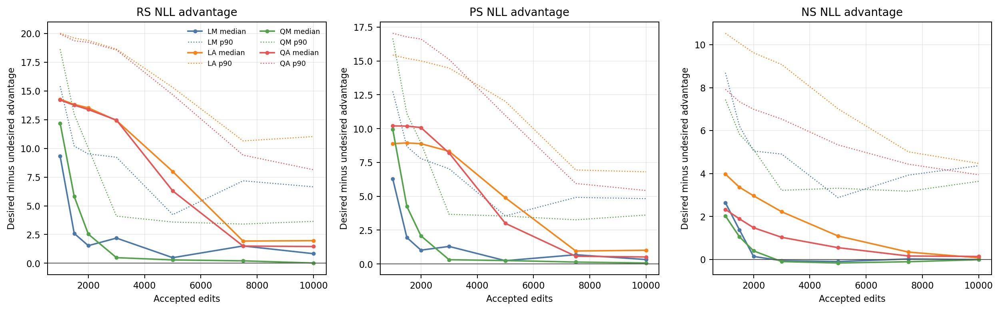

## 6. Edit-age strata

각 checkpoint seen-prefix 안에서 early first20% / middle60% / recent last20%로 고정했다.

| arm | t | age | request n | RS | PS | NS | rewrite_acc | rephrase_acc |
| --- | --- | --- | --- | --- | --- | --- | --- | --- |
| LM | 1000 | EARLY_FIRST_20PCT | 200 | 176/200 (0.8800) | 328/400 (0.8200) | 1442/2000 (0.7210) | 0.6200 | 0.4775 |
| LM | 1000 | MIDDLE_60PCT | 600 | 571/600 (0.9517) | 1058/1200 (0.8817) | 4339/6000 (0.7232) | 0.8533 | 0.6142 |
| LM | 1000 | RECENT_LAST_20PCT | 200 | 200/200 (1.0000) | 377/400 (0.9425) | 1485/2000 (0.7425) | 0.9950 | 0.7925 |
| LM | 1500 | EARLY_FIRST_20PCT | 300 | 157/300 (0.5233) | 299/600 (0.4983) | 1975/3000 (0.6583) | 0.1433 | 0.1033 |
| LM | 1500 | MIDDLE_60PCT | 900 | 613/900 (0.6811) | 1141/1800 (0.6339) | 5997/9000 (0.6663) | 0.3211 | 0.2533 |
| LM | 1500 | RECENT_LAST_20PCT | 300 | 295/300 (0.9833) | 582/600 (0.9700) | 1789/3000 (0.5963) | 0.9300 | 0.7950 |
| LM | 2000 | EARLY_FIRST_20PCT | 400 | 189/400 (0.4725) | 400/800 (0.5000) | 2091/4000 (0.5228) | 0.0325 | 0.0250 |
| LM | 2000 | MIDDLE_60PCT | 1200 | 702/1200 (0.5850) | 1304/2400 (0.5433) | 6395/12000 (0.5329) | 0.0800 | 0.0563 |
| LM | 2000 | RECENT_LAST_20PCT | 400 | 370/400 (0.9250) | 690/800 (0.8625) | 1826/4000 (0.4565) | 0.6175 | 0.4675 |
| LM | 3000 | EARLY_FIRST_20PCT | 600 | 283/600 (0.4717) | 597/1200 (0.4975) | 3158/6000 (0.5263) | 0.0500 | 0.0208 |
| LM | 3000 | MIDDLE_60PCT | 1800 | 1182/1800 (0.6567) | 2165/3600 (0.6014) | 8991/18000 (0.4995) | 0.1533 | 0.0581 |
| LM | 3000 | RECENT_LAST_20PCT | 600 | 551/600 (0.9183) | 970/1200 (0.8083) | 2671/6000 (0.4452) | 0.5350 | 0.1858 |
| LM | 5000 | EARLY_FIRST_20PCT | 1000 | 524/1000 (0.5240) | 1044/2000 (0.5220) | 4913/10000 (0.4913) | 0.0010 | 0.0000 |
| LM | 5000 | MIDDLE_60PCT | 3000 | 1649/3000 (0.5497) | 3099/6000 (0.5165) | 14569/30000 (0.4856) | 0.0060 | 0.0008 |
| LM | 5000 | RECENT_LAST_20PCT | 1000 | 748/1000 (0.7480) | 1270/2000 (0.6350) | 4690/10000 (0.4690) | 0.0620 | 0.0155 |
| LM | 7500 | EARLY_FIRST_20PCT | 1500 | 750/1500 (0.5000) | 1541/3000 (0.5137) | 7588/15000 (0.5059) | 0.0233 | 0.0080 |
| LM | 7500 | MIDDLE_60PCT | 4500 | 3008/4500 (0.6684) | 5289/9000 (0.5877) | 22348/45000 (0.4966) | 0.0569 | 0.0229 |
| LM | 7500 | RECENT_LAST_20PCT | 1500 | 1266/1500 (0.8440) | 2066/3000 (0.6887) | 7753/15000 (0.5169) | 0.2727 | 0.0820 |
| LM | 10000 | EARLY_FIRST_20PCT | 2000 | 1017/2000 (0.5085) | 1965/4000 (0.4913) | 10225/20000 (0.5112) | 0.0095 | 0.0077 |
| LM | 10000 | MIDDLE_60PCT | 6000 | 3461/6000 (0.5768) | 6384/12000 (0.5320) | 29989/60000 (0.4998) | 0.0208 | 0.0132 |
| LM | 10000 | RECENT_LAST_20PCT | 2000 | 1543/2000 (0.7715) | 2632/4000 (0.6580) | 9681/20000 (0.4840) | 0.1065 | 0.0362 |
| LA | 1000 | EARLY_FIRST_20PCT | 200 | 199/200 (0.9950) | 362/400 (0.9050) | 1551/2000 (0.7755) | 0.9800 | 0.6275 |
| LA | 1000 | MIDDLE_60PCT | 600 | 600/600 (1.0000) | 1157/1200 (0.9642) | 4588/6000 (0.7647) | 0.9967 | 0.7308 |
| LA | 1000 | RECENT_LAST_20PCT | 200 | 200/200 (1.0000) | 394/400 (0.9850) | 1641/2000 (0.8205) | 1.0000 | 0.8050 |
| LA | 1500 | EARLY_FIRST_20PCT | 300 | 299/300 (0.9967) | 535/600 (0.8917) | 2207/3000 (0.7357) | 0.9767 | 0.6183 |
| LA | 1500 | MIDDLE_60PCT | 900 | 896/900 (0.9956) | 1742/1800 (0.9678) | 6861/9000 (0.7623) | 0.9944 | 0.7700 |
| LA | 1500 | RECENT_LAST_20PCT | 300 | 300/300 (1.0000) | 590/600 (0.9833) | 2203/3000 (0.7343) | 1.0000 | 0.8083 |
| LA | 2000 | EARLY_FIRST_20PCT | 400 | 395/400 (0.9875) | 723/800 (0.9038) | 2891/4000 (0.7228) | 0.9550 | 0.6375 |
| LA | 2000 | MIDDLE_60PCT | 1200 | 1199/1200 (0.9992) | 2316/2400 (0.9650) | 8797/12000 (0.7331) | 0.9925 | 0.7779 |
| LA | 2000 | RECENT_LAST_20PCT | 400 | 400/400 (1.0000) | 783/800 (0.9788) | 2806/4000 (0.7015) | 1.0000 | 0.8025 |
| LA | 3000 | EARLY_FIRST_20PCT | 600 | 585/600 (0.9750) | 1057/1200 (0.8808) | 4131/6000 (0.6885) | 0.8833 | 0.5692 |
| LA | 3000 | MIDDLE_60PCT | 1800 | 1793/1800 (0.9961) | 3465/3600 (0.9625) | 12258/18000 (0.6810) | 0.9739 | 0.7511 |
| LA | 3000 | RECENT_LAST_20PCT | 600 | 599/600 (0.9983) | 1175/1200 (0.9792) | 3936/6000 (0.6560) | 0.9950 | 0.8300 |
| LA | 5000 | EARLY_FIRST_20PCT | 1000 | 796/1000 (0.7960) | 1379/2000 (0.6895) | 6083/10000 (0.6083) | 0.4480 | 0.2360 |
| LA | 5000 | MIDDLE_60PCT | 3000 | 2781/3000 (0.9270) | 5139/6000 (0.8565) | 18220/30000 (0.6073) | 0.6470 | 0.4467 |
| LA | 5000 | RECENT_LAST_20PCT | 1000 | 994/1000 (0.9940) | 1899/2000 (0.9495) | 6022/10000 (0.6022) | 0.9040 | 0.6620 |
| LA | 7500 | EARLY_FIRST_20PCT | 1500 | 768/1500 (0.5120) | 1472/3000 (0.4907) | 8285/15000 (0.5523) | 0.0247 | 0.0130 |
| LA | 7500 | MIDDLE_60PCT | 4500 | 2817/4500 (0.6260) | 5071/9000 (0.5634) | 24181/45000 (0.5374) | 0.0796 | 0.0343 |
| LA | 7500 | RECENT_LAST_20PCT | 1500 | 1446/1500 (0.9640) | 2553/3000 (0.8510) | 8000/15000 (0.5333) | 0.7153 | 0.3503 |
| LA | 10000 | EARLY_FIRST_20PCT | 2000 | 1028/2000 (0.5140) | 1973/4000 (0.4933) | 10453/20000 (0.5226) | 0.0130 | 0.0075 |
| LA | 10000 | MIDDLE_60PCT | 6000 | 3816/6000 (0.6360) | 6900/12000 (0.5750) | 30385/60000 (0.5064) | 0.0962 | 0.0298 |
| LA | 10000 | RECENT_LAST_20PCT | 2000 | 1941/2000 (0.9705) | 3412/4000 (0.8530) | 10080/20000 (0.5040) | 0.7050 | 0.3347 |
| QM | 1000 | EARLY_FIRST_20PCT | 200 | 192/200 (0.9600) | 384/400 (0.9600) | 1394/2000 (0.6970) | 0.8900 | 0.6700 |
| QM | 1000 | MIDDLE_60PCT | 600 | 593/600 (0.9883) | 1166/1200 (0.9717) | 4104/6000 (0.6840) | 0.9267 | 0.6992 |
| QM | 1000 | RECENT_LAST_20PCT | 200 | 200/200 (1.0000) | 387/400 (0.9675) | 1450/2000 (0.7250) | 0.9800 | 0.7325 |
| QM | 1500 | EARLY_FIRST_20PCT | 300 | 248/300 (0.8267) | 456/600 (0.7600) | 1810/3000 (0.6033) | 0.4333 | 0.2883 |
| QM | 1500 | MIDDLE_60PCT | 900 | 758/900 (0.8422) | 1432/1800 (0.7956) | 5658/9000 (0.6287) | 0.4978 | 0.3350 |
| QM | 1500 | RECENT_LAST_20PCT | 300 | 288/300 (0.9600) | 531/600 (0.8850) | 1833/3000 (0.6110) | 0.8733 | 0.5650 |
| QM | 2000 | EARLY_FIRST_20PCT | 400 | 249/400 (0.6225) | 475/800 (0.5938) | 2118/4000 (0.5295) | 0.0700 | 0.0500 |
| QM | 2000 | MIDDLE_60PCT | 1200 | 773/1200 (0.6442) | 1512/2400 (0.6300) | 6558/12000 (0.5465) | 0.1442 | 0.0988 |
| QM | 2000 | RECENT_LAST_20PCT | 400 | 391/400 (0.9775) | 735/800 (0.9187) | 2189/4000 (0.5473) | 0.8325 | 0.6362 |
| QM | 3000 | EARLY_FIRST_20PCT | 600 | 316/600 (0.5267) | 651/1200 (0.5425) | 2877/6000 (0.4795) | 0.0017 | 0.0042 |
| QM | 3000 | MIDDLE_60PCT | 1800 | 951/1800 (0.5283) | 1932/3600 (0.5367) | 8871/18000 (0.4928) | 0.0067 | 0.0036 |
| QM | 3000 | RECENT_LAST_20PCT | 600 | 428/600 (0.7133) | 750/1200 (0.6250) | 2806/6000 (0.4677) | 0.0550 | 0.0167 |
| QM | 5000 | EARLY_FIRST_20PCT | 1000 | 515/1000 (0.5150) | 1047/2000 (0.5235) | 4768/10000 (0.4768) | 0.0010 | 0.0000 |
| QM | 5000 | MIDDLE_60PCT | 3000 | 1608/3000 (0.5360) | 3170/6000 (0.5283) | 14449/30000 (0.4816) | 0.0000 | 0.0002 |
| QM | 5000 | RECENT_LAST_20PCT | 1000 | 573/1000 (0.5730) | 1117/2000 (0.5585) | 4628/10000 (0.4628) | 0.0000 | 0.0000 |
| QM | 7500 | EARLY_FIRST_20PCT | 1500 | 775/1500 (0.5167) | 1550/3000 (0.5167) | 7177/15000 (0.4785) | 0.0000 | 0.0000 |
| QM | 7500 | MIDDLE_60PCT | 4500 | 2401/4500 (0.5336) | 4737/9000 (0.5263) | 21826/45000 (0.4850) | 0.0002 | 0.0001 |
| QM | 7500 | RECENT_LAST_20PCT | 1500 | 791/1500 (0.5273) | 1578/3000 (0.5260) | 7318/15000 (0.4879) | 0.0000 | 0.0000 |
| QM | 10000 | EARLY_FIRST_20PCT | 2000 | 978/2000 (0.4890) | 1976/4000 (0.4940) | 10093/20000 (0.5047) | 0.0000 | 0.0000 |
| QM | 10000 | MIDDLE_60PCT | 6000 | 3013/6000 (0.5022) | 6105/12000 (0.5088) | 29969/60000 (0.4995) | 0.0000 | 0.0000 |
| QM | 10000 | RECENT_LAST_20PCT | 2000 | 1046/2000 (0.5230) | 2125/4000 (0.5312) | 9781/20000 (0.4890) | 0.0000 | 0.0000 |
| QA | 1000 | EARLY_FIRST_20PCT | 200 | 200/200 (1.0000) | 389/400 (0.9725) | 1423/2000 (0.7115) | 0.9750 | 0.6750 |
| QA | 1000 | MIDDLE_60PCT | 600 | 599/600 (0.9983) | 1180/1200 (0.9833) | 4263/6000 (0.7105) | 0.9900 | 0.6892 |
| QA | 1000 | RECENT_LAST_20PCT | 200 | 200/200 (1.0000) | 398/400 (0.9950) | 1453/2000 (0.7265) | 0.9950 | 0.7625 |
| QA | 1500 | EARLY_FIRST_20PCT | 300 | 300/300 (1.0000) | 579/600 (0.9650) | 1982/3000 (0.6607) | 0.9467 | 0.6433 |
| QA | 1500 | MIDDLE_60PCT | 900 | 898/900 (0.9978) | 1780/1800 (0.9889) | 6067/9000 (0.6741) | 0.9889 | 0.7117 |
| QA | 1500 | RECENT_LAST_20PCT | 300 | 299/300 (0.9967) | 597/600 (0.9950) | 2064/3000 (0.6880) | 0.9967 | 0.7933 |
| QA | 2000 | EARLY_FIRST_20PCT | 400 | 396/400 (0.9900) | 767/800 (0.9587) | 2518/4000 (0.6295) | 0.9100 | 0.6088 |
| QA | 2000 | MIDDLE_60PCT | 1200 | 1194/1200 (0.9950) | 2368/2400 (0.9867) | 7800/12000 (0.6500) | 0.9767 | 0.7108 |
| QA | 2000 | RECENT_LAST_20PCT | 400 | 400/400 (1.0000) | 793/800 (0.9912) | 2583/4000 (0.6458) | 1.0000 | 0.7588 |
| QA | 3000 | EARLY_FIRST_20PCT | 600 | 557/600 (0.9283) | 1028/1200 (0.8567) | 3612/6000 (0.6020) | 0.7467 | 0.4192 |
| QA | 3000 | MIDDLE_60PCT | 1800 | 1754/1800 (0.9744) | 3274/3600 (0.9094) | 10805/18000 (0.6003) | 0.8956 | 0.5603 |
| QA | 3000 | RECENT_LAST_20PCT | 600 | 594/600 (0.9900) | 1147/1200 (0.9558) | 3647/6000 (0.6078) | 0.9500 | 0.6808 |
| QA | 5000 | EARLY_FIRST_20PCT | 1000 | 729/1000 (0.7290) | 1172/2000 (0.5860) | 5569/10000 (0.5569) | 0.1670 | 0.0470 |
| QA | 5000 | MIDDLE_60PCT | 3000 | 2558/3000 (0.8527) | 4267/6000 (0.7112) | 16891/30000 (0.5630) | 0.3940 | 0.1575 |
| QA | 5000 | RECENT_LAST_20PCT | 1000 | 984/1000 (0.9840) | 1878/2000 (0.9390) | 5610/10000 (0.5610) | 0.8040 | 0.5960 |
| QA | 7500 | EARLY_FIRST_20PCT | 1500 | 748/1500 (0.4987) | 1436/3000 (0.4787) | 7937/15000 (0.5291) | 0.0040 | 0.0053 |
| QA | 7500 | MIDDLE_60PCT | 4500 | 2799/4500 (0.6220) | 4864/9000 (0.5404) | 23269/45000 (0.5171) | 0.0576 | 0.0182 |
| QA | 7500 | RECENT_LAST_20PCT | 1500 | 1344/1500 (0.8960) | 2114/3000 (0.7047) | 7796/15000 (0.5197) | 0.4540 | 0.1700 |
| QA | 10000 | EARLY_FIRST_20PCT | 2000 | 997/2000 (0.4985) | 1900/4000 (0.4750) | 10411/20000 (0.5205) | 0.0025 | 0.0050 |
| QA | 10000 | MIDDLE_60PCT | 6000 | 3829/6000 (0.6382) | 6473/12000 (0.5394) | 31147/60000 (0.5191) | 0.0572 | 0.0154 |
| QA | 10000 | RECENT_LAST_20PCT | 2000 | 1827/2000 (0.9135) | 2918/4000 (0.7295) | 10376/20000 (0.5188) | 0.3680 | 0.1202 |

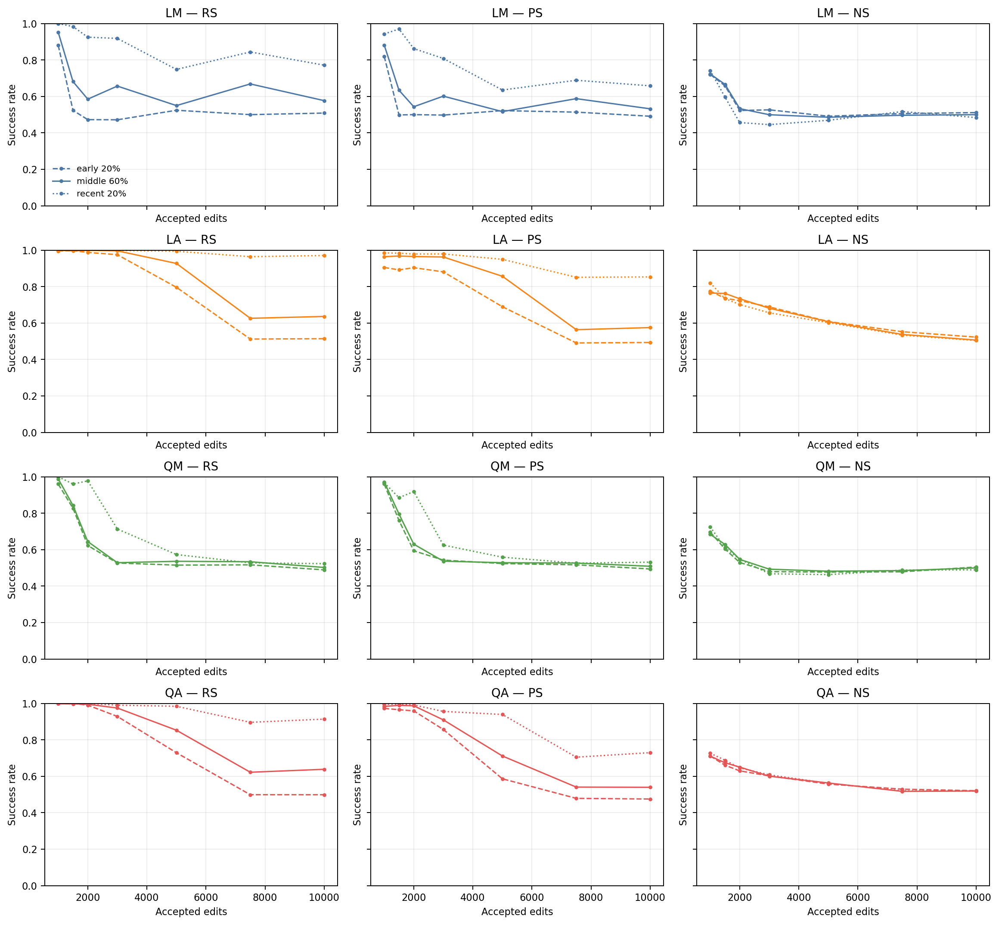

## 7. Checkpoint 변화와 paired arithmetic

| arm | span | metric | from | to | delta |
| --- | --- | --- | --- | --- | --- |
| LM | 1000→1500 | rs | 0.9470 | 0.7100 | -0.2370 |
| LM | 1000→1500 | ps | 0.8815 | 0.6740 | -0.2075 |
| LM | 1000→1500 | ns | 0.7266 | 0.6507 | -0.0759 |
| LM | 1500→2000 | rs | 0.7100 | 0.6305 | -0.0795 |
| LM | 1500→2000 | ps | 0.6740 | 0.5985 | -0.0755 |
| LM | 1500→2000 | ns | 0.6507 | 0.5156 | -0.1351 |
| LM | 2000→3000 | rs | 0.6305 | 0.6720 | 0.0415 |
| LM | 2000→3000 | ps | 0.5985 | 0.6220 | 0.0235 |
| LM | 2000→3000 | ns | 0.5156 | 0.4940 | -0.0216 |
| LM | 3000→5000 | rs | 0.6720 | 0.5842 | -0.0878 |
| LM | 3000→5000 | ps | 0.6220 | 0.5413 | -0.0807 |
| LM | 3000→5000 | ns | 0.4940 | 0.4834 | -0.0106 |
| LM | 5000→7500 | rs | 0.5842 | 0.6699 | 0.0857 |
| LM | 5000→7500 | ps | 0.5413 | 0.5931 | 0.0518 |
| LM | 5000→7500 | ns | 0.4834 | 0.5025 | 0.0191 |
| LM | 7500→10000 | rs | 0.6699 | 0.6021 | -0.0678 |
| LM | 7500→10000 | ps | 0.5931 | 0.5491 | -0.0440 |
| LM | 7500→10000 | ns | 0.5025 | 0.4990 | -0.0036 |
| LM | 1000→10000 | rs | 0.9470 | 0.6021 | -0.3449 |
| LM | 1000→10000 | ps | 0.8815 | 0.5491 | -0.3324 |
| LM | 1000→10000 | ns | 0.7266 | 0.4990 | -0.2277 |
| LA | 1000→1500 | rs | 0.9990 | 0.9967 | -0.0023 |
| LA | 1000→1500 | ps | 0.9565 | 0.9557 | -0.0008 |
| LA | 1000→1500 | ns | 0.7780 | 0.7514 | -0.0266 |
| LA | 1500→2000 | rs | 0.9967 | 0.9970 | 0.0003 |
| LA | 1500→2000 | ps | 0.9557 | 0.9555 | -0.0002 |
| LA | 1500→2000 | ns | 0.7514 | 0.7247 | -0.0267 |
| LA | 2000→3000 | rs | 0.9970 | 0.9923 | -0.0047 |
| LA | 2000→3000 | ps | 0.9555 | 0.9495 | -0.0060 |
| LA | 2000→3000 | ns | 0.7247 | 0.6775 | -0.0472 |
| LA | 3000→5000 | rs | 0.9923 | 0.9142 | -0.0781 |
| LA | 3000→5000 | ps | 0.9495 | 0.8417 | -0.1078 |
| LA | 3000→5000 | ns | 0.6775 | 0.6065 | -0.0710 |
| LA | 5000→7500 | rs | 0.9142 | 0.6708 | -0.2434 |
| LA | 5000→7500 | ps | 0.8417 | 0.6064 | -0.2353 |
| LA | 5000→7500 | ns | 0.6065 | 0.5395 | -0.0670 |
| LA | 7500→10000 | rs | 0.6708 | 0.6785 | 0.0077 |
| LA | 7500→10000 | ps | 0.6064 | 0.6142 | 0.0078 |
| LA | 7500→10000 | ns | 0.5395 | 0.5092 | -0.0304 |
| LA | 1000→10000 | rs | 0.9990 | 0.6785 | -0.3205 |
| LA | 1000→10000 | ps | 0.9565 | 0.6142 | -0.3423 |
| LA | 1000→10000 | ns | 0.7780 | 0.5092 | -0.2688 |
| QM | 1000→1500 | rs | 0.9850 | 0.8627 | -0.1223 |
| QM | 1000→1500 | ps | 0.9685 | 0.8063 | -0.1622 |
| QM | 1000→1500 | ns | 0.6948 | 0.6201 | -0.0747 |
| QM | 1500→2000 | rs | 0.8627 | 0.7065 | -0.1562 |
| QM | 1500→2000 | ps | 0.8063 | 0.6805 | -0.1258 |
| QM | 1500→2000 | ns | 0.6201 | 0.5433 | -0.0768 |
| QM | 2000→3000 | rs | 0.7065 | 0.5650 | -0.1415 |
| QM | 2000→3000 | ps | 0.6805 | 0.5555 | -0.1250 |
| QM | 2000→3000 | ns | 0.5433 | 0.4851 | -0.0581 |
| QM | 3000→5000 | rs | 0.5650 | 0.5392 | -0.0258 |
| QM | 3000→5000 | ps | 0.5555 | 0.5334 | -0.0221 |
| QM | 3000→5000 | ns | 0.4851 | 0.4769 | -0.0082 |
| QM | 5000→7500 | rs | 0.5392 | 0.5289 | -0.0103 |
| QM | 5000→7500 | ps | 0.5334 | 0.5243 | -0.0091 |
| QM | 5000→7500 | ns | 0.4769 | 0.4843 | 0.0074 |
| QM | 7500→10000 | rs | 0.5289 | 0.5037 | -0.0252 |
| QM | 7500→10000 | ps | 0.5243 | 0.5103 | -0.0140 |
| QM | 7500→10000 | ns | 0.4843 | 0.4984 | 0.0141 |
| QM | 1000→10000 | rs | 0.9850 | 0.5037 | -0.4813 |
| QM | 1000→10000 | ps | 0.9685 | 0.5103 | -0.4582 |
| QM | 1000→10000 | ns | 0.6948 | 0.4984 | -0.1964 |
| QA | 1000→1500 | rs | 0.9990 | 0.9980 | -0.0010 |
| QA | 1000→1500 | ps | 0.9835 | 0.9853 | 0.0018 |
| QA | 1000→1500 | ns | 0.7139 | 0.6742 | -0.0397 |
| QA | 1500→2000 | rs | 0.9980 | 0.9950 | -0.0030 |
| QA | 1500→2000 | ps | 0.9853 | 0.9820 | -0.0033 |
| QA | 1500→2000 | ns | 0.6742 | 0.6451 | -0.0292 |
| QA | 2000→3000 | rs | 0.9950 | 0.9683 | -0.0267 |
| QA | 2000→3000 | ps | 0.9820 | 0.9082 | -0.0738 |
| QA | 2000→3000 | ns | 0.6451 | 0.6021 | -0.0429 |
| QA | 3000→5000 | rs | 0.9683 | 0.8542 | -0.1141 |
| QA | 3000→5000 | ps | 0.9082 | 0.7317 | -0.1765 |
| QA | 3000→5000 | ns | 0.6021 | 0.5614 | -0.0407 |
| QA | 5000→7500 | rs | 0.8542 | 0.6521 | -0.2021 |
| QA | 5000→7500 | ps | 0.7317 | 0.5609 | -0.1708 |
| QA | 5000→7500 | ns | 0.5614 | 0.5200 | -0.0414 |
| QA | 7500→10000 | rs | 0.6521 | 0.6653 | 0.0132 |
| QA | 7500→10000 | ps | 0.5609 | 0.5645 | 0.0036 |
| QA | 7500→10000 | ns | 0.5200 | 0.5193 | -0.0007 |
| QA | 1000→10000 | rs | 0.9990 | 0.6653 | -0.3337 |
| QA | 1000→10000 | ps | 0.9835 | 0.5645 | -0.4190 |
| QA | 1000→10000 | ns | 0.7139 | 0.5193 | -0.1946 |

| comparison | t | metric | left | right | left-right |
| --- | --- | --- | --- | --- | --- |
| ALPHAEDIT_MINUS_MEMIT_LLAMA | 1000 | rs | 0.9990 | 0.9470 | 0.0520 |
| ALPHAEDIT_MINUS_MEMIT_LLAMA | 1000 | ps | 0.9565 | 0.8815 | 0.0750 |
| ALPHAEDIT_MINUS_MEMIT_LLAMA | 1000 | ns | 0.7780 | 0.7266 | 0.0514 |
| ALPHAEDIT_MINUS_MEMIT_LLAMA | 1500 | rs | 0.9967 | 0.7100 | 0.2867 |
| ALPHAEDIT_MINUS_MEMIT_LLAMA | 1500 | ps | 0.9557 | 0.6740 | 0.2817 |
| ALPHAEDIT_MINUS_MEMIT_LLAMA | 1500 | ns | 0.7514 | 0.6507 | 0.1007 |
| ALPHAEDIT_MINUS_MEMIT_LLAMA | 2000 | rs | 0.9970 | 0.6305 | 0.3665 |
| ALPHAEDIT_MINUS_MEMIT_LLAMA | 2000 | ps | 0.9555 | 0.5985 | 0.3570 |
| ALPHAEDIT_MINUS_MEMIT_LLAMA | 2000 | ns | 0.7247 | 0.5156 | 0.2091 |
| ALPHAEDIT_MINUS_MEMIT_LLAMA | 3000 | rs | 0.9923 | 0.6720 | 0.3203 |
| ALPHAEDIT_MINUS_MEMIT_LLAMA | 3000 | ps | 0.9495 | 0.6220 | 0.3275 |
| ALPHAEDIT_MINUS_MEMIT_LLAMA | 3000 | ns | 0.6775 | 0.4940 | 0.1835 |
| ALPHAEDIT_MINUS_MEMIT_LLAMA | 5000 | rs | 0.9142 | 0.5842 | 0.3300 |
| ALPHAEDIT_MINUS_MEMIT_LLAMA | 5000 | ps | 0.8417 | 0.5413 | 0.3004 |
| ALPHAEDIT_MINUS_MEMIT_LLAMA | 5000 | ns | 0.6065 | 0.4834 | 0.1231 |
| ALPHAEDIT_MINUS_MEMIT_LLAMA | 7500 | rs | 0.6708 | 0.6699 | 0.0009 |
| ALPHAEDIT_MINUS_MEMIT_LLAMA | 7500 | ps | 0.6064 | 0.5931 | 0.0133 |
| ALPHAEDIT_MINUS_MEMIT_LLAMA | 7500 | ns | 0.5395 | 0.5025 | 0.0370 |
| ALPHAEDIT_MINUS_MEMIT_LLAMA | 10000 | rs | 0.6785 | 0.6021 | 0.0764 |
| ALPHAEDIT_MINUS_MEMIT_LLAMA | 10000 | ps | 0.6142 | 0.5491 | 0.0652 |
| ALPHAEDIT_MINUS_MEMIT_LLAMA | 10000 | ns | 0.5092 | 0.4990 | 0.0102 |
| ALPHAEDIT_MINUS_MEMIT_QWEN | 1000 | rs | 0.9990 | 0.9850 | 0.0140 |
| ALPHAEDIT_MINUS_MEMIT_QWEN | 1000 | ps | 0.9835 | 0.9685 | 0.0150 |
| ALPHAEDIT_MINUS_MEMIT_QWEN | 1000 | ns | 0.7139 | 0.6948 | 0.0191 |
| ALPHAEDIT_MINUS_MEMIT_QWEN | 1500 | rs | 0.9980 | 0.8627 | 0.1353 |
| ALPHAEDIT_MINUS_MEMIT_QWEN | 1500 | ps | 0.9853 | 0.8063 | 0.1790 |
| ALPHAEDIT_MINUS_MEMIT_QWEN | 1500 | ns | 0.6742 | 0.6201 | 0.0541 |
| ALPHAEDIT_MINUS_MEMIT_QWEN | 2000 | rs | 0.9950 | 0.7065 | 0.2885 |
| ALPHAEDIT_MINUS_MEMIT_QWEN | 2000 | ps | 0.9820 | 0.6805 | 0.3015 |
| ALPHAEDIT_MINUS_MEMIT_QWEN | 2000 | ns | 0.6451 | 0.5433 | 0.1018 |
| ALPHAEDIT_MINUS_MEMIT_QWEN | 3000 | rs | 0.9683 | 0.5650 | 0.4033 |
| ALPHAEDIT_MINUS_MEMIT_QWEN | 3000 | ps | 0.9082 | 0.5555 | 0.3527 |
| ALPHAEDIT_MINUS_MEMIT_QWEN | 3000 | ns | 0.6021 | 0.4851 | 0.1170 |
| ALPHAEDIT_MINUS_MEMIT_QWEN | 5000 | rs | 0.8542 | 0.5392 | 0.3150 |
| ALPHAEDIT_MINUS_MEMIT_QWEN | 5000 | ps | 0.7317 | 0.5334 | 0.1983 |
| ALPHAEDIT_MINUS_MEMIT_QWEN | 5000 | ns | 0.5614 | 0.4769 | 0.0845 |
| ALPHAEDIT_MINUS_MEMIT_QWEN | 7500 | rs | 0.6521 | 0.5289 | 0.1232 |
| ALPHAEDIT_MINUS_MEMIT_QWEN | 7500 | ps | 0.5609 | 0.5243 | 0.0366 |
| ALPHAEDIT_MINUS_MEMIT_QWEN | 7500 | ns | 0.5200 | 0.4843 | 0.0357 |
| ALPHAEDIT_MINUS_MEMIT_QWEN | 10000 | rs | 0.6653 | 0.5037 | 0.1616 |
| ALPHAEDIT_MINUS_MEMIT_QWEN | 10000 | ps | 0.5645 | 0.5103 | 0.0543 |
| ALPHAEDIT_MINUS_MEMIT_QWEN | 10000 | ns | 0.5193 | 0.4984 | 0.0209 |
| LLAMA_MINUS_QWEN_MEMIT | 1000 | rs | 0.9470 | 0.9850 | -0.0380 |
| LLAMA_MINUS_QWEN_MEMIT | 1000 | ps | 0.8815 | 0.9685 | -0.0870 |
| LLAMA_MINUS_QWEN_MEMIT | 1000 | ns | 0.7266 | 0.6948 | 0.0318 |
| LLAMA_MINUS_QWEN_MEMIT | 1500 | rs | 0.7100 | 0.8627 | -0.1527 |
| LLAMA_MINUS_QWEN_MEMIT | 1500 | ps | 0.6740 | 0.8063 | -0.1323 |
| LLAMA_MINUS_QWEN_MEMIT | 1500 | ns | 0.6507 | 0.6201 | 0.0307 |
| LLAMA_MINUS_QWEN_MEMIT | 2000 | rs | 0.6305 | 0.7065 | -0.0760 |
| LLAMA_MINUS_QWEN_MEMIT | 2000 | ps | 0.5985 | 0.6805 | -0.0820 |
| LLAMA_MINUS_QWEN_MEMIT | 2000 | ns | 0.5156 | 0.5433 | -0.0277 |
| LLAMA_MINUS_QWEN_MEMIT | 3000 | rs | 0.6720 | 0.5650 | 0.1070 |
| LLAMA_MINUS_QWEN_MEMIT | 3000 | ps | 0.6220 | 0.5555 | 0.0665 |
| LLAMA_MINUS_QWEN_MEMIT | 3000 | ns | 0.4940 | 0.4851 | 0.0089 |
| LLAMA_MINUS_QWEN_MEMIT | 5000 | rs | 0.5842 | 0.5392 | 0.0450 |
| LLAMA_MINUS_QWEN_MEMIT | 5000 | ps | 0.5413 | 0.5334 | 0.0079 |
| LLAMA_MINUS_QWEN_MEMIT | 5000 | ns | 0.4834 | 0.4769 | 0.0065 |
| LLAMA_MINUS_QWEN_MEMIT | 7500 | rs | 0.6699 | 0.5289 | 0.1409 |
| LLAMA_MINUS_QWEN_MEMIT | 7500 | ps | 0.5931 | 0.5243 | 0.0687 |
| LLAMA_MINUS_QWEN_MEMIT | 7500 | ns | 0.5025 | 0.4843 | 0.0182 |
| LLAMA_MINUS_QWEN_MEMIT | 10000 | rs | 0.6021 | 0.5037 | 0.0984 |
| LLAMA_MINUS_QWEN_MEMIT | 10000 | ps | 0.5491 | 0.5103 | 0.0388 |
| LLAMA_MINUS_QWEN_MEMIT | 10000 | ns | 0.4990 | 0.4984 | 0.0005 |
| LLAMA_MINUS_QWEN_ALPHAEDIT | 1000 | rs | 0.9990 | 0.9990 | 0.0000 |
| LLAMA_MINUS_QWEN_ALPHAEDIT | 1000 | ps | 0.9565 | 0.9835 | -0.0270 |
| LLAMA_MINUS_QWEN_ALPHAEDIT | 1000 | ns | 0.7780 | 0.7139 | 0.0641 |
| LLAMA_MINUS_QWEN_ALPHAEDIT | 1500 | rs | 0.9967 | 0.9980 | -0.0013 |
| LLAMA_MINUS_QWEN_ALPHAEDIT | 1500 | ps | 0.9557 | 0.9853 | -0.0297 |
| LLAMA_MINUS_QWEN_ALPHAEDIT | 1500 | ns | 0.7514 | 0.6742 | 0.0772 |
| LLAMA_MINUS_QWEN_ALPHAEDIT | 2000 | rs | 0.9970 | 0.9950 | 0.0020 |
| LLAMA_MINUS_QWEN_ALPHAEDIT | 2000 | ps | 0.9555 | 0.9820 | -0.0265 |
| LLAMA_MINUS_QWEN_ALPHAEDIT | 2000 | ns | 0.7247 | 0.6451 | 0.0796 |
| LLAMA_MINUS_QWEN_ALPHAEDIT | 3000 | rs | 0.9923 | 0.9683 | 0.0240 |
| LLAMA_MINUS_QWEN_ALPHAEDIT | 3000 | ps | 0.9495 | 0.9082 | 0.0413 |
| LLAMA_MINUS_QWEN_ALPHAEDIT | 3000 | ns | 0.6775 | 0.6021 | 0.0754 |
| LLAMA_MINUS_QWEN_ALPHAEDIT | 5000 | rs | 0.9142 | 0.8542 | 0.0600 |
| LLAMA_MINUS_QWEN_ALPHAEDIT | 5000 | ps | 0.8417 | 0.7317 | 0.1100 |
| LLAMA_MINUS_QWEN_ALPHAEDIT | 5000 | ns | 0.6065 | 0.5614 | 0.0451 |
| LLAMA_MINUS_QWEN_ALPHAEDIT | 7500 | rs | 0.6708 | 0.6521 | 0.0187 |
| LLAMA_MINUS_QWEN_ALPHAEDIT | 7500 | ps | 0.6064 | 0.5609 | 0.0455 |
| LLAMA_MINUS_QWEN_ALPHAEDIT | 7500 | ns | 0.5395 | 0.5200 | 0.0195 |
| LLAMA_MINUS_QWEN_ALPHAEDIT | 10000 | rs | 0.6785 | 0.6653 | 0.0132 |
| LLAMA_MINUS_QWEN_ALPHAEDIT | 10000 | ps | 0.6142 | 0.5645 | 0.0497 |
| LLAMA_MINUS_QWEN_ALPHAEDIT | 10000 | ns | 0.5092 | 0.5193 | -0.0102 |

## 8. Mechanism ↔ canonical cumulative metric descriptive association

동일 7 checkpoints/arm에서 계산한 기술 통계다. n=7이고 causal claim=0이다.

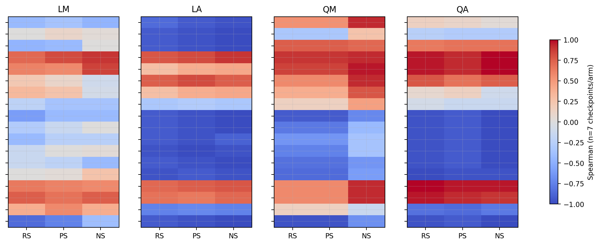

### 8.1 Evaluation-only backfill compute

| arm | t | requests | locality prompts | wall s | forward batches | parity batches | peak GiB |
| --- | --- | --- | --- | --- | --- | --- | --- |
| LM | 1000 | 1000 | 10000 | 72.1 | 1022 | 3 | 30.40 |
| LM | 1500 | 1500 | 15000 | 103.9 | 1536 | 3 | 30.40 |
| LM | 2000 | 2000 | 20000 | 137.0 | 2043 | 3 | 30.40 |
| LM | 3000 | 3000 | 30000 | 201.3 | 3057 | 3 | 30.40 |
| LM | 5000 | 5000 | 50000 | 331.5 | 5092 | 3 | 30.40 |
| LM | 7500 | 7500 | 75000 | 493.8 | 7628 | 3 | 30.40 |
| LM | 10000 | 10000 | 100000 | 654.0 | 10168 | 3 | 30.40 |
| LA | 1000 | 1000 | 10000 | 75.7 | 1022 | 3 | 30.40 |
| LA | 1500 | 1500 | 15000 | 109.1 | 1536 | 3 | 30.40 |
| LA | 2000 | 2000 | 20000 | 141.4 | 2043 | 3 | 30.40 |
| LA | 3000 | 3000 | 30000 | 207.0 | 3057 | 3 | 30.40 |
| LA | 5000 | 5000 | 50000 | 335.7 | 5092 | 3 | 30.40 |
| LA | 7500 | 7500 | 75000 | 497.8 | 7628 | 3 | 30.40 |
| LA | 10000 | 10000 | 100000 | 657.8 | 10168 | 3 | 30.40 |
| QM | 1000 | 1000 | 10000 | 68.0 | 1022 | 3 | 28.77 |
| QM | 1500 | 1500 | 15000 | 91.3 | 1536 | 3 | 28.77 |
| QM | 2000 | 2000 | 20000 | 119.8 | 2043 | 3 | 28.77 |
| QM | 3000 | 3000 | 30000 | 174.6 | 3057 | 3 | 28.77 |
| QM | 5000 | 5000 | 50000 | 285.3 | 5092 | 3 | 28.77 |
| QM | 7500 | 7500 | 75000 | 422.8 | 7628 | 3 | 28.77 |
| QM | 10000 | 10000 | 100000 | 561.1 | 10168 | 3 | 28.77 |
| QA | 1000 | 1000 | 10000 | 72.4 | 1022 | 3 | 28.77 |
| QA | 1500 | 1500 | 15000 | 98.2 | 1536 | 3 | 28.77 |
| QA | 2000 | 2000 | 20000 | 133.7 | 2043 | 3 | 28.77 |
| QA | 3000 | 3000 | 30000 | 193.2 | 3057 | 3 | 28.77 |
| QA | 5000 | 5000 | 50000 | 299.3 | 5092 | 3 | 28.77 |
| QA | 7500 | 7500 | 75000 | 438.1 | 7628 | 3 | 28.77 |
| QA | 10000 | 10000 | 100000 | 572.4 | 10168 | 3 | 28.77 |

각 checkpoint는 frozen W_t를 한 번 로드했다. 표의 wall time은 checkpoint 평가이며 edit replay와 model update는 0이다.

아래는 v5의 provenance, residual trajectory, A/Y/E/rho/tau, inherited debt, recurrence, layer update, online/current-B100 diagnostics, cache fork, comparisons, compute, exclusions와 artifact inventory를 하나의 본문으로 계승한 것이다. 그 안의 과거 headline 이름은 secondary accuracy 의미로 재표기했다.

## 9. Provenance, jobs, denominators, invariants

- v3 report SHA `c9daf397b8c9fa679fa89e4f6407d7e03761a11f9ead177e998a97e726e24a8f`; v4-r2 report SHA `225fbe8cc7fea44a2e9e00b01a1e3648686e439cd6618a150165b3f33cc95c68`.
- v5 analysis source HEAD/tree `51fd5f22a38f94fee56bf48bcd156821d390eff0` / `0320f33c4958dc2bb90f2560319004227daced8e`.
- Common stream/order/evaluator `2951b86dfa829ef38b2fb03551a81dc9ce4f11c779af3f0f0c027224ed65cf7d` / `f86dfc97f50614d8fe3d7ed929326485ea0b1237151f93d7ed7339bae8979c43` / `72b8ecb737157a42d6a055ffd339dc3f907876a0a98165a00cca49ca9bbed07d`.
- New evaluation: 28/28 checkpoint receipts, 120,000 request-state rows, final 40,000 requests/80,000 rephrase prompts/400,000 locality prompts. FULL-FP32; nonfinite/failure/imputation/duplicate=0.
- Evaluation-only compute_z/writer/key/solve/cache-history mutation/backward/gradient/model update=0; before/after weight pointer/version/bytes exact.
- Stored schedule `{1000,1500,2000,3000,5000,7500,10000}`; absent `{100,500,4000,6000,8000}`. This was an outcome-blind state-availability amendment; replay/interpolation/substitution=0.

Original v3 execution provenance and invariants follow in the same main-body section.

| 모델 | 방법 | canonical job | source HEAD/tree | batches | requests | checkpoints | raw members/bytes | raw member root |
|---|---|---|---|---:|---:|---:|---:|---|
| Llama-3-8B-Instruct | Official MEMIT | 32424 | `85a05d0a831db667fc68c27e634302eb30cc7d79` / `84113d14cb0427afd871448fd4a5c870c7f31153` | 100 | 10000 | 8 | 117/9470818583 | `961149f2751a3388b348c484bed882158660f0ae85b946c9bb69077a89528a85` |
| Llama-3-8B-Instruct | Official AlphaEdit | 32380 | `85a05d0a831db667fc68c27e634302eb30cc7d79` / `84113d14cb0427afd871448fd4a5c870c7f31153` | 100 | 10000 | 8 | 117/38248437276 | `191a075ab53e77b662ccd82a609a83bbea43b503fa660432c2994bb97e1d2ed5` |
| Qwen2.5-7B-Instruct | Official MEMIT | 31686_1 | `85a05d0a831db667fc68c27e634302eb30cc7d79` / `84113d14cb0427afd871448fd4a5c870c7f31153` | 100 | 10000 | 8 | 117/10938883628 | `02c27c740c26c04430a06549fb58e8739a4eddb032b2adee3b61da0d2c7f791c` |
| Qwen2.5-7B-Instruct | Official AlphaEdit | 31651_0 (JobIDRaw=31652) | `583aaa3f65602c13174ba4426ddb0f6a18ae7e82` / `601d394d77f676cb247aa44f9389c0ccc29a0f54` | 100 | 10000 | 8 | 117/61186136329 | `d5256efd74db14f5b23a5a6ab786aa139844048b040bf4a68096feff5c8c3b5a` |

- Canonical result roots와 모든 journal/checkpoint/state/log/receipt 절대경로·SHA는 `raw-member-inventory.csv`와 `analysis-manifest.json`에 있다.
- 공통 stream/order/sentinel/evaluator identity와 pinned stock EasyEdit HEAD/tree는 manifest 외부 입력에 봉인했다.
- 합계: arm 4/4, B100 400/400, training requests 40,000/40,000, checkpoints 32/32, primary sentinel observations 3,200, AlphaEdit reset-cache observations 1,600, 전체 checkpoint observations 4,800.
- Arm별 compute_z=10,000, recompute=0, layer observation=500, terminal forward=100. W commit→next entry=99/99; W0/cache terminal restore=4/4; nonfinite=0, rollback violation=0, imputation=0.
- AlphaEdit는 성공 B100마다 신규 100개를 append했고, consume width는 그 시점의 전체 prior-history width(0→9,900)였다. Exit cache width는 0→10,000으로 연속 증가했다. MEMIT은 static covariance computation cache만 사용했고 request-history state를 만들지 않았다.
- Edited weight 5/5는 `torch.float32`; BF16/FP16 parameter=0. GPU peak memory, total forward, JVP/VJP/HVP, autocast/quantization/numeric-cast inventory는 schema에 없으므로 추정하지 않았다.

### 9.1 Arm별 실제 실행 command/config/resource

`SubmitLine`은 Slurm accounting에서 read-only로 회수한 실제 제출 문자열이다. Science config는 각 terminal result의 sealed `lock` 객체이며 아래 identity는 canonical JSON SHA-256이다.

| arm | JobIDRaw/name | workdir | launcher SHA | SubmitLine SHA | config SHA | ReqMem / AllocTRES / node |
|---|---|---|---|---|---|---|
| LM | 32424/odeedit_lrd_life_r1_s4 | `/data/janghj/ODE-edit` | `12e7f0c567f67c82110ddb906e42452e2f70013fe45815f92a7d6f818eb9e44c` | `26809643498c886f2f689f317a85b306b4e4bb1ce03b6722fddca186f79adc93` | `9a9be38542356b0fbd3c634fbdff38edcfd540282dece690620198e92044e2c6` | 59G / `billing=8,cpu=8,gres/gpu=1,mem=59G,node=1` / server4 |
| LA | 32380/odeedit_lrd_life_r1_s4 | `/data/janghj/ODE-edit` | `12e7f0c567f67c82110ddb906e42452e2f70013fe45815f92a7d6f818eb9e44c` | `7f4a7b4fad6b4bb8e7fe3ebb35f1217a4fb769ffb38ca3de4770cb39e6fdad83` | `9a9be38542356b0fbd3c634fbdff38edcfd540282dece690620198e92044e2c6` | 59G / `billing=8,cpu=8,gres/gpu=1,mem=59G,node=1` / server4 |
| QM | 31686/off_layer_debt_life_qm_tech_r1_s4 | `/data/janghj/ODE-edit/local/worktrees/official-layer-realization-debt-lifelong-b100-v1-tech-r1` | `01083416f7423996464c7ffed1f0d885edd65a7f82e62487052cf5517dabaa96` | `c0259091335294026d9a9e557b1b6774100ef3fe2de1374f982e63ec50794adb` | `9a9be38542356b0fbd3c634fbdff38edcfd540282dece690620198e92044e2c6` | 62.50G / `billing=8,cpu=8,gres/gpu=1,mem=62.50G,node=1` / server4 |
| QA | 31652/off_layer_debt_life_s4 | `/data/janghj/ODE-edit/local/worktrees/official-layer-realization-debt-lifelong-b100-v1` | `01083416f7423996464c7ffed1f0d885edd65a7f82e62487052cf5517dabaa96` | `cc07a9332c4362440c25b844007fd262dbc9c2960fbbbdccf3e6b00be30b7ae9` | `9a9be38542356b0fbd3c634fbdff38edcfd540282dece690620198e92044e2c6` | 120000M / `billing=8,cpu=8,gres/gpu=1,mem=120000M,node=1` / server4 |

Exact SubmitLine과 sealed science config:

#### LM — Llama-3-8B-Instruct / Official MEMIT

```text
sbatch --parsable --export=ALL,ODE_LRD_LIFE_SOURCE_ROOT=/data/janghj/ODE-edit/local/worktrees/official-layer-realization-debt-lifelong-b100-v1-tech-r1,ODE_LRD_LIFE_EXPECTED_HEAD=85a05d0a831db667fc68c27e634302eb30cc7d79,ODE_LRD_LIFE_RESULT_ROOT=/data/janghj/ODE-edit/local/results/official-layer-realization-debt-lifelong-b100-v1/campaign-20260902-four-arm-completion-tech-r1,ODE_LRD_LIFE_PREFLIGHT_RECEIPT=/data/janghj/ODE-edit/local/state/official-layer-realization-debt-lifelong-b100-v1/campaign-20260901-tech-r1/preflight.json,ODE_LRD_LIFE_EXPECTED_PREFLIGHT_SHA=794c1f8b5792e9cbd09420b79543a76e6884fe1104cb48fe33659758275f60b8,ODE_LRD_LIFE_RESOURCE_RECEIPT=/data/janghj/ODE-edit/local/state/official-layer-realization-debt-lifelong-b100-v1/campaign-20260902-four-arm-completion-tech-r1/resource-seal-llama-memit-tech-r1.json,ODE_LRD_LIFE_EXPECTED_RESOURCE_SHA=dfec118e8520328f69f90a4f065d927e68aaadacec45da2be7ab7ff3bab26b1b,ODE_LRD_LIFE_STREAM_SEAL=/data/janghj/ODE-edit/local/state/official-layer-realization-debt-lifelong-b100-v1/stream-seal-v1.json,ODE_LRD_LIFE_EXPECTED_STREAM_SHA=5848dca7323335483039ec125b644dadfb87b0996133f9825f951088cf3a7861,ODE_LRD_LIFE_CAMPAIGN_ID=official-layer-realization-debt-lifelong-b100-v1-campaign-20260902-four-arm-completion-tech-r1,ODE_LRD_LIFE_MODEL=llama3-8b-inst,ODE_LRD_LIFE_METHOD=memit,ODE_LRD_MEMORY_POLICY_ROOT=/data/janghj/ODE-edit/local/worktrees/slurm-memory-policy-rollout-20260902,ODE_LRD_EXPECTED_POLICY_HEAD=462d9afd8af7edd888281dbc015231042857ba99 /data/janghj/ODE-edit/local/state/official-layer-realization-debt-lifelong-b100-v1/campaign-20260902-four-arm-completion-tech-r1/launcher-server4-resource-tech-r1.sbatch
```

```json
{"accepted_cache_append_per_request":1,"batch_count":100,"batch_size":100,"checkpoint_batches":[0,10,15,20,30,50,75,100],"compact_report_batches":[10,20,50,100],"compute_z_per_request":1,"full_fp32":true,"gpu_cap":2,"layers":[4,5,6,7,8],"observer_layer_calls_per_batch":5,"observer_terminal_calls_per_batch":1,"order_seed_index":1,"recurrence_relative_tolerance":0.0001,"request_count":10000,"sample_duplication_count":0,"scalar_reduction_dtype":"float64","scientific_promotion":false,"sustained_violation_batch_count":3}
```

#### LA — Llama-3-8B-Instruct / Official AlphaEdit

```text
sbatch --parsable --export=ALL,ODE_LRD_LIFE_SOURCE_ROOT=/data/janghj/ODE-edit/local/worktrees/official-layer-realization-debt-lifelong-b100-v1-tech-r1,ODE_LRD_LIFE_EXPECTED_HEAD=85a05d0a831db667fc68c27e634302eb30cc7d79,ODE_LRD_LIFE_RESULT_ROOT=/data/janghj/ODE-edit/local/results/official-layer-realization-debt-lifelong-b100-v1/campaign-20260902-four-arm-completion-tech-r1,ODE_LRD_LIFE_PREFLIGHT_RECEIPT=/data/janghj/ODE-edit/local/state/official-layer-realization-debt-lifelong-b100-v1/campaign-20260901-tech-r1/preflight.json,ODE_LRD_LIFE_EXPECTED_PREFLIGHT_SHA=794c1f8b5792e9cbd09420b79543a76e6884fe1104cb48fe33659758275f60b8,ODE_LRD_LIFE_RESOURCE_RECEIPT=/data/janghj/ODE-edit/local/state/official-layer-realization-debt-lifelong-b100-v1/campaign-20260902-four-arm-completion-tech-r1/resource-seal-llama-alphaedit-tech-r1.json,ODE_LRD_LIFE_EXPECTED_RESOURCE_SHA=0de4e6094d87262e1d19a9cf33e2b09e4eb75a150d1f4c9bf8b2dbb887250a97,ODE_LRD_LIFE_STREAM_SEAL=/data/janghj/ODE-edit/local/state/official-layer-realization-debt-lifelong-b100-v1/stream-seal-v1.json,ODE_LRD_LIFE_EXPECTED_STREAM_SHA=5848dca7323335483039ec125b644dadfb87b0996133f9825f951088cf3a7861,ODE_LRD_LIFE_CAMPAIGN_ID=official-layer-realization-debt-lifelong-b100-v1-campaign-20260902-four-arm-completion-tech-r1,ODE_LRD_LIFE_MODEL=llama3-8b-inst,ODE_LRD_LIFE_METHOD=alphaedit,ODE_LRD_MEMORY_POLICY_ROOT=/data/janghj/ODE-edit/local/worktrees/slurm-memory-policy-rollout-20260902,ODE_LRD_EXPECTED_POLICY_HEAD=462d9afd8af7edd888281dbc015231042857ba99 /data/janghj/ODE-edit/local/state/official-layer-realization-debt-lifelong-b100-v1/campaign-20260902-four-arm-completion-tech-r1/launcher-server4-resource-tech-r1.sbatch
```

```json
{"accepted_cache_append_per_request":1,"batch_count":100,"batch_size":100,"checkpoint_batches":[0,10,15,20,30,50,75,100],"compact_report_batches":[10,20,50,100],"compute_z_per_request":1,"full_fp32":true,"gpu_cap":2,"layers":[4,5,6,7,8],"observer_layer_calls_per_batch":5,"observer_terminal_calls_per_batch":1,"order_seed_index":1,"recurrence_relative_tolerance":0.0001,"request_count":10000,"sample_duplication_count":0,"scalar_reduction_dtype":"float64","scientific_promotion":false,"sustained_violation_batch_count":3}
```

#### QM — Qwen2.5-7B-Instruct / Official MEMIT

```text
sbatch --parsable --array=1-1%1 --mem=64000M --job-name=off_layer_debt_life_qm_tech_r1_s4 --output=/data/janghj/ODE-edit/local/logs/official-layer-realization-debt-lifelong-b100-v1/%x-%A_%a.out --error=/data/janghj/ODE-edit/local/logs/official-layer-realization-debt-lifelong-b100-v1/%x-%A_%a.err --export=ALL project/run_scripts/session06_official_layer_realization_debt_lifelong_server4.sbatch
```

```json
{"accepted_cache_append_per_request":1,"batch_count":100,"batch_size":100,"checkpoint_batches":[0,10,15,20,30,50,75,100],"compact_report_batches":[10,20,50,100],"compute_z_per_request":1,"full_fp32":true,"gpu_cap":2,"layers":[4,5,6,7,8],"observer_layer_calls_per_batch":5,"observer_terminal_calls_per_batch":1,"order_seed_index":1,"recurrence_relative_tolerance":0.0001,"request_count":10000,"sample_duplication_count":0,"scalar_reduction_dtype":"float64","scientific_promotion":false,"sustained_violation_batch_count":3}
```

#### QA — Qwen2.5-7B-Instruct / Official AlphaEdit

```text
sbatch --parsable --export=ALL project/run_scripts/session06_official_layer_realization_debt_lifelong_server4.sbatch
```

```json
{"accepted_cache_append_per_request":1,"batch_count":100,"batch_size":100,"checkpoint_batches":[0,10,15,20,30,50,75,100],"compact_report_batches":[10,20,50,100],"compute_z_per_request":1,"full_fp32":true,"gpu_cap":2,"layers":[4,5,6,7,8],"observer_layer_calls_per_batch":5,"observer_terminal_calls_per_batch":1,"order_seed_index":1,"recurrence_relative_tolerance":0.0001,"request_count":10000,"sample_duplication_count":0,"scalar_reduction_dtype":"float64","scientific_promotion":false,"sustained_violation_batch_count":3}
```

## 10. CHECKPOINT_FINAL_W_ON_ALL_SEEN_REQUESTS — 28-row core rates

각 W_t는 sealed first t requests 전체를 평가한다. current B100나 online-at-write가 아니다.

| arm | t | request n | rewrite_acc | rephrase_acc (prompt) | rephrase_acc strict-all-2 | neighborhood_target_true_teacher_forced_acc | rewrite pref | rephrase request-cluster mean preference (not PS) |
|---|---|---|---|---|---|---|---|---|
| LM | 1000 | 1000 | 835/1000 (0.8350) | 1245/2000 (0.6225) | 484/1000 (0.4840) | 1912/10000 (0.1912) | 947/1000 (0.9470) | 905/1000 (0.9050) |
| LM | 1500 | 1500 | 611/1500 (0.4073) | 995/3000 (0.3317) | 353/1500 (0.2353) | 2492/15000 (0.1661) | 1065/1500 (0.7100) | 1035/1500 (0.6900) |
| LM | 2000 | 2000 | 356/2000 (0.1780) | 529/4000 (0.1323) | 159/2000 (0.0795) | 628/20000 (0.0314) | 1261/2000 (0.6305) | 1217/2000 (0.6085) |
| LM | 3000 | 3000 | 627/3000 (0.2090) | 457/6000 (0.0762) | 101/3000 (0.0337) | 851/30000 (0.0284) | 2016/3000 (0.6720) | 1878/3000 (0.6260) |
| LM | 5000 | 5000 | 81/5000 (0.0162) | 36/10000 (0.0036) | 5/5000 (0.0010) | 39/50000 (0.0008) | 2921/5000 (0.5842) | 2715/5000 (0.5430) |
| LM | 7500 | 7500 | 700/7500 (0.0933) | 476/15000 (0.0317) | 75/7500 (0.0100) | 1332/75000 (0.0178) | 5024/7500 (0.6699) | 4523/7500 (0.6031) |
| LM | 10000 | 10000 | 357/10000 (0.0357) | 335/20000 (0.0168) | 53/10000 (0.0053) | 648/100000 (0.0065) | 6021/10000 (0.6021) | 5577/10000 (0.5577) |
| LA | 1000 | 1000 | 994/1000 (0.9940) | 1450/2000 (0.7250) | 585/1000 (0.5850) | 2130/10000 (0.2130) | 999/1000 (0.9990) | 972/1000 (0.9720) |
| LA | 1500 | 1500 | 1488/1500 (0.9920) | 2242/3000 (0.7473) | 910/1500 (0.6067) | 2940/15000 (0.1960) | 1495/1500 (0.9967) | 1455/1500 (0.9700) |
| LA | 2000 | 2000 | 1973/2000 (0.9865) | 3019/4000 (0.7548) | 1220/2000 (0.6100) | 3491/20000 (0.1746) | 1994/2000 (0.9970) | 1940/2000 (0.9700) |
| LA | 3000 | 3000 | 2880/3000 (0.9600) | 4383/6000 (0.7305) | 1748/3000 (0.5827) | 4529/30000 (0.1510) | 2977/3000 (0.9923) | 2895/3000 (0.9650) |
| LA | 5000 | 5000 | 3293/5000 (0.6586) | 4476/10000 (0.4476) | 1379/5000 (0.2758) | 3815/50000 (0.0763) | 4571/5000 (0.9142) | 4380/5000 (0.8760) |
| LA | 7500 | 7500 | 1468/7500 (0.1957) | 1399/15000 (0.0933) | 342/7500 (0.0456) | 1256/75000 (0.0167) | 5031/7500 (0.6708) | 4669/7500 (0.6225) |
| LA | 10000 | 10000 | 2013/10000 (0.2013) | 1727/20000 (0.0863) | 426/10000 (0.0426) | 1413/100000 (0.0141) | 6785/10000 (0.6785) | 6271/10000 (0.6271) |
| QM | 1000 | 1000 | 930/1000 (0.9300) | 1400/2000 (0.7000) | 541/1000 (0.5410) | 1235/10000 (0.1235) | 985/1000 (0.9850) | 979/1000 (0.9790) |
| QM | 1500 | 1500 | 840/1500 (0.5600) | 1115/3000 (0.3717) | 297/1500 (0.1980) | 1192/15000 (0.0795) | 1294/1500 (0.8627) | 1291/1500 (0.8607) |
| QM | 2000 | 2000 | 534/2000 (0.2670) | 786/4000 (0.1965) | 243/2000 (0.1215) | 624/20000 (0.0312) | 1413/2000 (0.7065) | 1384/2000 (0.6920) |
| QM | 3000 | 3000 | 46/3000 (0.0153) | 38/6000 (0.0063) | 3/3000 (0.0010) | 19/30000 (0.0006) | 1695/3000 (0.5650) | 1665/3000 (0.5550) |
| QM | 5000 | 5000 | 1/5000 (0.0002) | 1/10000 (0.0001) | 0/5000 (0.0000) | 0/50000 (0.0000) | 2696/5000 (0.5392) | 2678/5000 (0.5356) |
| QM | 7500 | 7500 | 1/7500 (0.0001) | 1/15000 (0.0001) | 0/7500 (0.0000) | 0/75000 (0.0000) | 3967/7500 (0.5289) | 3911/7500 (0.5215) |
| QM | 10000 | 10000 | 0/10000 (0.0000) | 0/20000 (0.0000) | 0/10000 (0.0000) | 0/100000 (0.0000) | 5037/10000 (0.5037) | 5106/10000 (0.5106) |
| QA | 1000 | 1000 | 988/1000 (0.9880) | 1402/2000 (0.7010) | 545/1000 (0.5450) | 948/10000 (0.0948) | 999/1000 (0.9990) | 990/1000 (0.9900) |
| QA | 1500 | 1500 | 1473/1500 (0.9820) | 2143/3000 (0.7143) | 850/1500 (0.5667) | 1179/15000 (0.0786) | 1497/1500 (0.9980) | 1489/1500 (0.9927) |
| QA | 2000 | 2000 | 1936/2000 (0.9680) | 2800/4000 (0.7000) | 1101/2000 (0.5505) | 1401/20000 (0.0701) | 1990/2000 (0.9950) | 1981/2000 (0.9905) |
| QA | 3000 | 3000 | 2630/3000 (0.8767) | 3337/6000 (0.5562) | 1105/3000 (0.3683) | 1592/30000 (0.0531) | 2905/3000 (0.9683) | 2842/3000 (0.9473) |
| QA | 5000 | 5000 | 2153/5000 (0.4306) | 2231/10000 (0.2231) | 604/5000 (0.1208) | 675/50000 (0.0135) | 4271/5000 (0.8542) | 3855/5000 (0.7710) |
| QA | 7500 | 7500 | 946/7500 (0.1261) | 690/15000 (0.0460) | 143/7500 (0.0191) | 265/75000 (0.0035) | 4891/7500 (0.6521) | 4292/7500 (0.5723) |
| QA | 10000 | 10000 | 1084/10000 (0.1084) | 686/20000 (0.0343) | 105/10000 (0.0105) | 246/100000 (0.0025) | 6653/10000 (0.6653) | 5755/10000 (0.5755) |

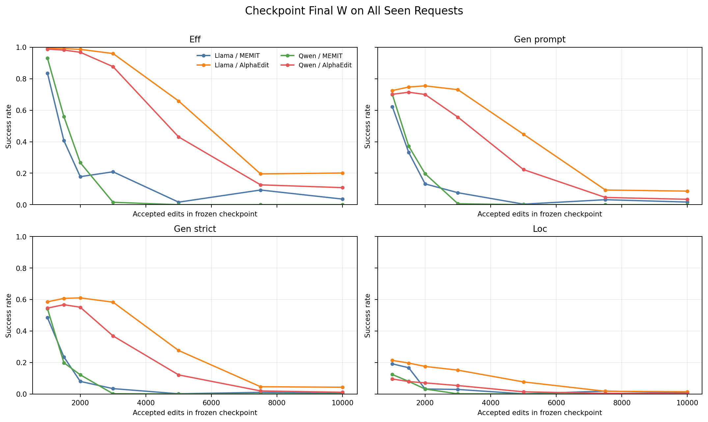

## 11. Checkpoint×arm×category full distributions

각 표는 7 checkpoints×5 categories=35 rows/arm이다. NLL/margin은 mean/median/p90/max; request와 prompt 집계 단위를 분리했다.

### 11.1 LM — Llama-3-8B-Instruct / Official MEMIT

| t | category | strict n/d(rate) | request NLL μ/med/p90/max | prompt NLL μ/med/p90/max | request margin μ/med/p90/max | prompt margin μ/med/p90/max | token accuracy |
|---|---|---|---|---|---|---|---|
| 1000 | Rewrite / target-new | 835/1000 (0.8350) | 0.8104/0.0360/2.7119/20.6062 | 0.8104/0.0360/2.7119/20.6062 | 3.4687/4.3923/7.4493/11.2315 | 3.4687/4.3923/7.4493/11.2315 | NOT_RECORDED_EVALUATOR_SCHEMA |
| 1000 | Rewrite / target-true | 15/1000 (0.0150) | 9.8054/9.6629/15.6734/25.0194 | 9.8054/9.6629/15.6734/25.0194 | -9.5647/-9.5545/-3.4959/2.9591 | -9.5647/-9.5545/-3.4959/2.9591 | NOT_RECORDED_EVALUATOR_SCHEMA |
| 1000 | Rephrase / target-new | 1245/2000 (0.6225) | 1.8944/0.8548/5.3697/18.7724 | 1.8944/0.5296/5.9499/20.1729 | -0.6723/-0.2367/4.3984/8.1262 | 0.7986/1.4840/5.6836/11.0977 | NOT_RECORDED_EVALUATOR_SCHEMA |
| 1000 | Rephrase / target-true | 70/2000 (0.0350) | 8.1362/7.9074/13.2000/21.9482 | 8.1362/7.8435/13.3424/23.8099 | -8.9239/-8.8104/-3.6966/2.6266 | -7.5791/-7.4425/-2.1743/5.1685 | NOT_RECORDED_EVALUATOR_SCHEMA |
| 1000 | Locality / target-true | 1912/10000 (0.1912) | 4.5640/4.0293/7.8617/13.4484 | 4.5640/3.9450/9.2444/21.1922 | -7.7004/-7.5383/-3.5812/1.9539 | -3.2801/-3.0042/1.2898/8.3736 | NOT_RECORDED_EVALUATOR_SCHEMA |
| 1500 | Rewrite / target-new | 611/1500 (0.4073) | 3.5830/2.6761/8.6954/23.5940 | 3.5830/2.6761/8.6954/23.5940 | -1.2038/-1.2442/5.1955/14.8460 | -1.2038/-1.2442/5.1955/14.8460 | NOT_RECORDED_EVALUATOR_SCHEMA |
| 1500 | Rewrite / target-true | 105/1500 (0.0700) | 6.6311/5.9977/11.8722/27.2955 | 6.6311/5.9977/11.8722/27.2955 | -5.6161/-4.9596/-0.5201/3.3472 | -5.6161/-4.9596/-0.5201/3.3472 | NOT_RECORDED_EVALUATOR_SCHEMA |
| 1500 | Rephrase / target-new | 995/3000 (0.3317) | 4.2866/3.7264/9.2210/19.6301 | 4.2866/3.4733/9.7973/22.9383 | -3.7749/-3.4222/2.5736/10.4339 | -2.2882/-2.0203/3.7434/12.0312 | NOT_RECORDED_EVALUATOR_SCHEMA |
| 1500 | Rephrase / target-true | 235/3000 (0.0783) | 6.6565/6.1928/11.0351/23.4763 | 6.6565/6.1418/11.6320/25.4628 | -6.8764/-6.3269/-1.8149/3.5375 | -5.5041/-4.9607/-0.4853/5.2938 | NOT_RECORDED_EVALUATOR_SCHEMA |
| 1500 | Locality / target-true | 2492/15000 (0.1661) | 5.0285/4.5647/8.5428/15.7344 | 5.0285/4.4801/9.5753/22.1546 | -7.8416/-7.3096/-3.0844/1.7216 | -3.5067/-2.9876/0.8497/4.8024 | NOT_RECORDED_EVALUATOR_SCHEMA |
| 2000 | Rewrite / target-new | 356/2000 (0.1780) | 7.5754/8.2959/13.0052/21.3549 | 7.5754/8.2959/13.0052/21.3549 | -4.5104/-5.3951/3.4393/14.8484 | -4.5104/-5.3951/3.4393/14.8484 | NOT_RECORDED_EVALUATOR_SCHEMA |
| 2000 | Rewrite / target-true | 54/2000 (0.0270) | 9.7258/9.8209/13.9735/25.4640 | 9.7258/9.8209/13.9735/25.4640 | -7.3915/-7.0580/-2.6501/4.7503 | -7.3915/-7.0580/-2.6501/4.7503 | NOT_RECORDED_EVALUATOR_SCHEMA |
| 2000 | Rephrase / target-new | 529/4000 (0.1323) | 8.3422/8.9330/13.1733/20.0522 | 8.3422/9.0487/13.4380/23.5904 | -6.9854/-7.3322/-0.9028/13.0071 | -5.5614/-6.2418/1.3888/17.9034 | NOT_RECORDED_EVALUATOR_SCHEMA |
| 2000 | Rephrase / target-true | 82/4000 (0.0205) | 9.8726/10.0051/13.6237/24.4370 | 9.8726/10.0955/13.9684/28.1468 | -8.8934/-8.4806/-4.2009/2.4631 | -7.5846/-7.3833/-2.8152/5.9516 | NOT_RECORDED_EVALUATOR_SCHEMA |
| 2000 | Locality / target-true | 628/20000 (0.0314) | 9.3187/9.3818/12.5753/17.7709 | 9.3187/9.6430/13.3097/27.4368 | -10.6557/-10.1622/-6.2378/0.6501 | -6.6663/-6.5824/-2.2651/6.9636 | NOT_RECORDED_EVALUATOR_SCHEMA |
| 3000 | Rewrite / target-new | 627/3000 (0.2090) | 7.1347/7.3595/12.6522/19.1763 | 7.1347/7.3595/12.6522/19.1763 | -4.3160/-4.7976/2.7903/12.6063 | -4.3160/-4.7976/2.7903/12.6063 | NOT_RECORDED_EVALUATOR_SCHEMA |
| 3000 | Rewrite / target-true | 70/3000 (0.0233) | 9.6995/9.8770/13.6554/29.6915 | 9.6995/9.8770/13.6554/29.6915 | -7.4432/-7.4236/-2.8030/5.1640 | -7.4432/-7.4236/-2.8030/5.1640 | NOT_RECORDED_EVALUATOR_SCHEMA |
| 3000 | Rephrase / target-new | 457/6000 (0.0762) | 8.9163/9.1836/13.2891/17.7773 | 8.9163/9.2666/13.5586/20.5520 | -7.6853/-7.9820/-2.6086/6.5149 | -6.4338/-6.7232/-0.8666/8.2545 | NOT_RECORDED_EVALUATOR_SCHEMA |
| 3000 | Rephrase / target-true | 67/6000 (0.0112) | 10.3404/10.5458/13.9751/19.0882 | 10.3404/10.5178/14.1952/22.1130 | -9.0653/-9.1289/-4.9523/1.2153 | -7.9902/-8.0561/-3.6126/4.5797 | NOT_RECORDED_EVALUATOR_SCHEMA |
| 3000 | Locality / target-true | 851/30000 (0.0284) | 9.8103/10.0582/13.4315/19.0167 | 9.8103/10.0961/13.7324/23.0892 | -10.4210/-10.4609/-6.2957/0.0360 | -7.2450/-7.3788/-2.6416/5.6566 | NOT_RECORDED_EVALUATOR_SCHEMA |
| 5000 | Rewrite / target-new | 81/5000 (0.0162) | 12.4923/12.9335/15.7831/20.4414 | 12.4923/12.9335/15.7831/20.4414 | -8.5281/-8.8751/-4.7892/6.4890 | -8.5281/-8.8751/-4.7892/6.4890 | NOT_RECORDED_EVALUATOR_SCHEMA |
| 5000 | Rewrite / target-true | 2/5000 (0.0004) | 13.2224/13.3975/16.1870/20.5259 | 13.2224/13.3975/16.1870/20.5259 | -9.2683/-9.3569/-6.0766/1.6146 | -9.2683/-9.3569/-6.0766/1.6146 | NOT_RECORDED_EVALUATOR_SCHEMA |
| 5000 | Rephrase / target-new | 36/10000 (0.0036) | 13.2611/13.4673/15.9454/19.9061 | 13.2611/13.5377/16.1741/20.4167 | -9.7961/-9.8741/-6.9654/3.7376 | -9.0036/-9.1609/-5.9815/4.7939 | NOT_RECORDED_EVALUATOR_SCHEMA |
| 5000 | Rephrase / target-true | 2/10000 (0.0002) | 13.6308/13.6983/16.3200/19.9028 | 13.6308/13.7406/16.5327/20.5969 | -10.1347/-10.1111/-7.4428/-0.9066 | -9.3613/-9.3450/-6.4998/0.6981 | NOT_RECORDED_EVALUATOR_SCHEMA |
| 5000 | Locality / target-true | 39/50000 (0.0008) | 13.4046/13.4723/15.7702/19.6222 | 13.4046/13.5134/16.3013/22.4093 | -11.9533/-11.9587/-9.3377/-4.5169 | -9.4058/-9.4482/-6.3797/1.9687 | NOT_RECORDED_EVALUATOR_SCHEMA |
| 7500 | Rewrite / target-new | 700/7500 (0.0933) | 9.2131/9.8615/14.0676/22.5646 | 9.2131/9.8615/14.0676/22.5646 | -6.7242/-7.1272/-0.2868/10.9019 | -6.7242/-7.1272/-0.2868/10.9019 | NOT_RECORDED_EVALUATOR_SCHEMA |
| 7500 | Rewrite / target-true | 100/7500 (0.0133) | 11.1042/11.4627/14.8504/22.8085 | 11.1042/11.4627/14.8504/22.8085 | -8.8083/-8.7865/-4.2697/4.7376 | -8.8083/-8.7865/-4.2697/4.7376 | NOT_RECORDED_EVALUATOR_SCHEMA |
| 7500 | Rephrase / target-new | 476/15000 (0.0317) | 10.8286/11.1950/14.2720/22.7909 | 10.8286/11.2986/14.5727/27.3666 | -9.2389/-9.2926/-4.9084/9.3279 | -7.8279/-8.0498/-2.9587/11.1580 | NOT_RECORDED_EVALUATOR_SCHEMA |
| 7500 | Rephrase / target-true | 76/15000 (0.0051) | 11.7252/11.9708/14.7345/24.6082 | 11.7252/11.9375/14.9966/26.9785 | -10.0119/-9.8680/-6.1465/1.3359 | -8.7667/-8.7306/-4.7153/4.7293 | NOT_RECORDED_EVALUATOR_SCHEMA |
| 7500 | Locality / target-true | 1332/75000 (0.0178) | 11.3389/11.7482/14.5167/19.0069 | 11.3389/11.7787/15.1743/24.7733 | -13.1889/-12.9670/-8.6405/-0.3649 | -8.8837/-8.9465/-3.9906/6.0699 | NOT_RECORDED_EVALUATOR_SCHEMA |
| 10000 | Rewrite / target-new | 357/10000 (0.0357) | 10.9172/11.3481/15.5948/28.0700 | 10.9172/11.3481/15.5948/28.0700 | -8.9319/-8.8587/-3.1769/12.2041 | -8.9319/-8.8587/-3.1769/12.2041 | NOT_RECORDED_EVALUATOR_SCHEMA |
| 10000 | Rewrite / target-true | 36/10000 (0.0036) | 12.1494/12.2542/16.1612/32.0345 | 12.1494/12.2542/16.1612/32.0345 | -10.2235/-9.8578/-5.3974/5.0930 | -10.2235/-9.8578/-5.3974/5.0930 | NOT_RECORDED_EVALUATOR_SCHEMA |
| 10000 | Rephrase / target-new | 335/20000 (0.0168) | 11.6303/11.9529/14.9115/23.0916 | 11.6303/11.9425/15.3509/29.7133 | -10.6431/-10.3027/-6.1487/3.6708 | -9.0034/-8.8232/-4.3275/8.0561 | NOT_RECORDED_EVALUATOR_SCHEMA |
| 10000 | Rephrase / target-true | 52/20000 (0.0026) | 12.1982/12.3425/15.2497/25.9596 | 12.1982/12.3023/15.6379/29.8108 | -11.1774/-10.6777/-6.9613/2.0992 | -9.5819/-9.1940/-5.3908/4.0099 | NOT_RECORDED_EVALUATOR_SCHEMA |
| 10000 | Locality / target-true | 648/100000 (0.0065) | 12.3682/12.5320/15.5810/24.3893 | 12.3682/12.4786/16.5322/33.7139 | -15.8013/-15.6363/-10.7443/-2.7562 | -10.4247/-9.9741/-5.4727/4.1699 | NOT_RECORDED_EVALUATOR_SCHEMA |

### 11.2 LA — Llama-3-8B-Instruct / Official AlphaEdit

| t | category | strict n/d(rate) | request NLL μ/med/p90/max | prompt NLL μ/med/p90/max | request margin μ/med/p90/max | prompt margin μ/med/p90/max | token accuracy |
|---|---|---|---|---|---|---|---|
| 1000 | Rewrite / target-new | 994/1000 (0.9940) | 0.0302/0.0010/0.0054/9.9790 | 0.0302/0.0010/0.0054/9.9790 | 7.9230/8.0515/9.6917/11.9039 | 7.9230/8.0515/9.6917/11.9039 | NOT_RECORDED_EVALUATOR_SCHEMA |
| 1000 | Rewrite / target-true | 0/1000 (0.0000) | 14.5141/14.2784/20.0197/27.7559 | 14.5141/14.2784/20.0197/27.7559 | -14.5816/-14.3378/-9.5379/-2.4412 | -14.5816/-14.3378/-9.5379/-2.4412 | NOT_RECORDED_EVALUATOR_SCHEMA |
| 1000 | Rephrase / target-new | 1450/2000 (0.7250) | 1.3437/0.3614/3.9031/13.0080 | 1.3437/0.1129/4.7780/15.5031 | 0.4253/1.0495/5.7423/9.5363 | 2.2147/3.1219/7.0822/11.5177 | NOT_RECORDED_EVALUATOR_SCHEMA |
| 1000 | Rephrase / target-true | 23/2000 (0.0115) | 10.1176/9.9992/15.2587/23.8417 | 10.1176/9.9508/15.7648/25.4063 | -11.3100/-11.1437/-5.8165/3.9761 | -9.7781/-9.7542/-4.0700/4.7203 | NOT_RECORDED_EVALUATOR_SCHEMA |
| 1000 | Locality / target-true | 2130/10000 (0.2130) | 4.8098/4.5261/7.9388/13.9881 | 4.8098/4.1889/10.1247/21.7319 | -9.2457/-9.1926/-4.5987/1.2239 | -3.6319/-3.3950/1.6984/10.4985 | NOT_RECORDED_EVALUATOR_SCHEMA |
| 1500 | Rewrite / target-new | 1488/1500 (0.9920) | 0.0459/0.0014/0.0094/12.1049 | 0.0459/0.0014/0.0094/12.1049 | 7.5381/7.6945/9.5321/11.9381 | 7.5381/7.6945/9.5321/11.9381 | NOT_RECORDED_EVALUATOR_SCHEMA |
| 1500 | Rewrite / target-true | 0/1500 (0.0000) | 14.0626/13.8297/19.6012/28.6101 | 14.0626/13.8297/19.6012/28.6101 | -14.1401/-13.9207/-9.1276/-0.9168 | -14.1401/-13.9207/-9.1276/-0.9168 | NOT_RECORDED_EVALUATOR_SCHEMA |
| 1500 | Rephrase / target-new | 2242/3000 (0.7473) | 1.1844/0.3345/3.4968/12.8721 | 1.1844/0.1182/4.1811/15.7901 | 0.6618/1.3571/5.5585/8.9994 | 2.3681/3.0779/7.0328/11.0602 | NOT_RECORDED_EVALUATOR_SCHEMA |
| 1500 | Rephrase / target-true | 38/3000 (0.0127) | 9.9722/9.8433/15.0208/23.2325 | 9.9722/9.8512/15.4398/25.5461 | -11.1767/-11.0608/-5.9954/4.0184 | -9.6536/-9.5793/-3.8924/5.8714 | NOT_RECORDED_EVALUATOR_SCHEMA |
| 1500 | Locality / target-true | 2940/15000 (0.1960) | 4.9450/4.6395/8.1731/15.1797 | 4.9450/4.3865/10.2105/26.5820 | -9.4936/-9.3405/-4.8194/-0.0087 | -3.8115/-3.5379/1.4903/9.8643 | NOT_RECORDED_EVALUATOR_SCHEMA |
| 2000 | Rewrite / target-new | 1973/2000 (0.9865) | 0.0773/0.0020/0.0178/15.7695 | 0.0773/0.0020/0.0178/15.7695 | 7.1311/7.4156/9.3000/12.4815 | 7.1311/7.4156/9.3000/12.4815 | NOT_RECORDED_EVALUATOR_SCHEMA |
| 2000 | Rewrite / target-true | 0/2000 (0.0000) | 13.8113/13.5453/19.4044/28.9533 | 13.8113/13.5453/19.4044/28.9533 | -13.8658/-13.6357/-8.8622/-0.5207 | -13.8658/-13.6357/-8.8622/-0.5207 | NOT_RECORDED_EVALUATOR_SCHEMA |
| 2000 | Rephrase / target-new | 3019/4000 (0.7548) | 1.1793/0.3286/3.4629/12.6918 | 1.1793/0.1229/4.2131/15.4371 | 0.6068/1.3448/5.2441/9.2710 | 2.3174/3.0659/6.7708/11.0567 | NOT_RECORDED_EVALUATOR_SCHEMA |
| 2000 | Rephrase / target-true | 51/4000 (0.0127) | 9.9407/9.7929/14.6808/22.7753 | 9.9407/9.8189/15.2228/26.9230 | -11.0924/-10.9636/-6.0088/4.3083 | -9.6120/-9.5320/-4.0142/4.8283 | NOT_RECORDED_EVALUATOR_SCHEMA |
| 2000 | Locality / target-true | 3491/20000 (0.1746) | 5.2177/4.8369/8.6566/14.9725 | 5.2177/4.7098/10.5122/25.9672 | -9.7758/-9.6099/-5.2666/0.2848 | -4.1186/-3.8353/1.2223/8.7994 | NOT_RECORDED_EVALUATOR_SCHEMA |
| 3000 | Rewrite / target-new | 2880/3000 (0.9600) | 0.2187/0.0041/0.0976/19.7149 | 0.2187/0.0041/0.0976/19.7149 | 6.1438/6.6787/8.8627/13.9645 | 6.1438/6.6787/8.8627/13.9645 | NOT_RECORDED_EVALUATOR_SCHEMA |
| 3000 | Rewrite / target-true | 5/3000 (0.0017) | 12.7952/12.4992/18.6936/30.9205 | 12.7952/12.4992/18.6936/30.9205 | -12.7917/-12.5317/-7.2726/3.9481 | -12.7917/-12.5317/-7.2726/3.9481 | NOT_RECORDED_EVALUATOR_SCHEMA |
| 3000 | Rephrase / target-new | 4383/6000 (0.7305) | 1.3305/0.4580/3.6951/17.2303 | 1.3305/0.1973/4.6273/17.9141 | 0.2982/0.9414/4.9866/9.8526 | 1.9484/2.6499/6.4632/11.4587 | NOT_RECORDED_EVALUATOR_SCHEMA |
| 3000 | Rephrase / target-true | 79/6000 (0.0132) | 9.5816/9.3876/14.3105/26.9241 | 9.5816/9.3958/14.8528/27.1394 | -10.6295/-10.4696/-5.6042/2.0048 | -9.1830/-9.0554/-3.8188/5.5591 | NOT_RECORDED_EVALUATOR_SCHEMA |
| 3000 | Locality / target-true | 4529/30000 (0.1510) | 5.5698/5.1760/8.9675/16.4148 | 5.5698/5.1324/10.8259/26.4449 | -10.1649/-9.9310/-5.8669/0.5414 | -4.5147/-4.2663/0.8815/9.0043 | NOT_RECORDED_EVALUATOR_SCHEMA |
| 5000 | Rewrite / target-new | 3293/5000 (0.6586) | 2.2558/0.1842/8.0548/22.9588 | 2.2558/0.1842/8.0548/22.9588 | 1.2135/2.6515/7.3598/13.7433 | 1.2135/2.6515/7.3598/13.7433 | NOT_RECORDED_EVALUATOR_SCHEMA |
| 5000 | Rewrite / target-true | 31/5000 (0.0062) | 10.1575/9.9347/15.8483/27.9580 | 10.1575/9.9347/15.8483/27.9580 | -9.8066/-9.6474/-4.0277/3.7073 | -9.8066/-9.6474/-4.0277/3.7073 | NOT_RECORDED_EVALUATOR_SCHEMA |
| 5000 | Rephrase / target-new | 4476/10000 (0.4476) | 3.4144/2.5985/7.9342/18.4716 | 3.4144/2.0422/8.9540/22.2522 | -3.2396/-2.8898/2.8153/9.6342 | -1.2446/-0.6767/4.6784/12.1345 | NOT_RECORDED_EVALUATOR_SCHEMA |
| 5000 | Rephrase / target-true | 190/10000 (0.0190) | 8.5301/8.3003/12.8560/24.1315 | 8.5301/8.2892/13.5707/26.0589 | -9.3555/-9.0665/-4.5044/2.3447 | -7.7215/-7.4584/-2.5535/5.1806 | NOT_RECORDED_EVALUATOR_SCHEMA |
| 5000 | Locality / target-true | 3815/50000 (0.0763) | 7.0395/6.8489/10.7042/17.3691 | 7.0395/6.7540/12.3206/26.0930 | -11.6625/-11.0700/-7.0617/-1.9165 | -6.0599/-5.8103/-0.5691/8.2050 | NOT_RECORDED_EVALUATOR_SCHEMA |
| 7500 | Rewrite / target-new | 1468/7500 (0.1957) | 7.4173/7.8291/13.5957/28.8199 | 7.4173/7.8291/13.5957/28.8199 | -5.3645/-6.1648/4.2946/14.7353 | -5.3645/-6.1648/4.2946/14.7353 | NOT_RECORDED_EVALUATOR_SCHEMA |
| 7500 | Rewrite / target-true | 63/7500 (0.0084) | 10.2282/10.0932/15.1259/27.9338 | 10.2282/10.0932/15.1259/27.9338 | -9.0188/-8.7840/-3.7178/3.8951 | -9.0188/-8.7840/-3.7178/3.8951 | NOT_RECORDED_EVALUATOR_SCHEMA |
| 7500 | Rephrase / target-new | 1399/15000 (0.0933) | 8.5674/8.7881/13.4102/20.5783 | 8.5674/8.8505/14.0156/25.4982 | -8.5531/-8.7725/-2.6071/10.3645 | -6.7439/-7.0006/-0.2382/13.0595 | NOT_RECORDED_EVALUATOR_SCHEMA |
| 7500 | Rephrase / target-true | 152/15000 (0.0101) | 9.9659/9.9524/13.9726/22.8069 | 9.9659/9.9832/14.5567/26.6093 | -10.0982/-9.8554/-5.4347/2.9230 | -8.4205/-8.2119/-3.4427/4.1523 | NOT_RECORDED_EVALUATOR_SCHEMA |
| 7500 | Locality / target-true | 1256/75000 (0.0167) | 9.7312/9.7495/13.0030/18.7065 | 9.7312/9.6895/14.7061/30.8952 | -14.0056/-13.8546/-9.1596/-3.0300 | -8.3289/-8.1276/-3.0111/5.1332 | NOT_RECORDED_EVALUATOR_SCHEMA |
| 10000 | Rewrite / target-new | 2013/10000 (0.2013) | 7.8485/8.6774/13.6737/24.2509 | 7.8485/8.6774/13.6737/24.2509 | -5.1720/-6.1566/4.1804/18.5015 | -5.1720/-6.1566/4.1804/18.5015 | NOT_RECORDED_EVALUATOR_SCHEMA |
| 10000 | Rewrite / target-true | 59/10000 (0.0059) | 10.8313/10.8699/15.0215/32.4774 | 10.8313/10.8699/15.0215/32.4774 | -8.9973/-8.7474/-4.3235/4.3608 | -8.9973/-8.7474/-4.3235/4.3608 | NOT_RECORDED_EVALUATOR_SCHEMA |
| 10000 | Rephrase / target-new | 1727/20000 (0.0863) | 9.1570/9.6252/13.5203/20.4028 | 9.1570/9.7212/13.9556/26.6626 | -8.3923/-8.6704/-3.1992/11.4948 | -6.7287/-7.1859/-0.5859/13.0682 | NOT_RECORDED_EVALUATOR_SCHEMA |
| 10000 | Rephrase / target-true | 113/20000 (0.0056) | 10.6277/10.6583/14.0409/22.9689 | 10.6277/10.7614/14.5850/31.1551 | -9.9746/-9.8001/-5.9020/0.5545 | -8.4647/-8.3787/-3.9985/4.6446 | NOT_RECORDED_EVALUATOR_SCHEMA |
| 10000 | Locality / target-true | 1413/100000 (0.0141) | 10.4065/10.4624/13.3611/19.0954 | 10.4065/10.6157/14.5932/29.5636 | -13.0089/-12.8050/-9.1012/-1.2668 | -8.2759/-8.2026/-3.6111/7.4329 | NOT_RECORDED_EVALUATOR_SCHEMA |

### 11.3 QM — Qwen2.5-7B-Instruct / Official MEMIT

| t | category | strict n/d(rate) | request NLL μ/med/p90/max | prompt NLL μ/med/p90/max | request margin μ/med/p90/max | prompt margin μ/med/p90/max | token accuracy |
|---|---|---|---|---|---|---|---|
| 1000 | Rewrite / target-new | 930/1000 (0.9300) | 0.3975/0.0297/0.5983/14.3499 | 0.3975/0.0297/0.5983/14.3499 | 4.3202/4.7354/7.3403/10.3199 | 4.3202/4.7354/7.3403/10.3199 | NOT_RECORDED_EVALUATOR_SCHEMA |
| 1000 | Rewrite / target-true | 2/1000 (0.0020) | 12.6487/12.3274/18.6966/30.2571 | 12.6487/12.3274/18.6966/30.2571 | -12.5494/-12.2773/-6.5985/0.4706 | -12.5494/-12.2773/-6.5985/0.4706 | NOT_RECORDED_EVALUATOR_SCHEMA |
| 1000 | Rephrase / target-new | 1400/2000 (0.7000) | 1.5142/0.6320/4.2413/13.8558 | 1.5142/0.2976/5.0879/17.0371 | -0.2473/0.4439/4.6760/8.5296 | 1.4551/2.2049/6.0332/9.8769 | NOT_RECORDED_EVALUATOR_SCHEMA |
| 1000 | Rephrase / target-true | 11/2000 (0.0055) | 11.4937/11.4016/16.5652/27.9499 | 11.4937/11.2797/17.1525/29.9347 | -12.6203/-12.4862/-6.7637/-0.8218 | -11.0786/-10.8479/-5.1302/3.4693 | NOT_RECORDED_EVALUATOR_SCHEMA |
| 1000 | Locality / target-true | 1235/10000 (0.1235) | 5.8438/5.4748/9.3778/15.3127 | 5.8438/5.4032/10.8974/24.3594 | -9.4441/-9.1577/-4.8673/-0.9453 | -4.5289/-4.2366/0.4199/6.7723 | NOT_RECORDED_EVALUATOR_SCHEMA |
| 1500 | Rewrite / target-new | 840/1500 (0.5600) | 2.5635/1.1242/7.1798/19.5018 | 2.5635/1.1242/7.1798/19.5018 | 0.0759/0.6909/5.1415/11.0237 | 0.0759/0.6909/5.1415/11.0237 | NOT_RECORDED_EVALUATOR_SCHEMA |
| 1500 | Rewrite / target-true | 31/1500 (0.0207) | 8.4825/8.1769/13.6928/26.7867 | 8.4825/8.1769/13.6928/26.7867 | -7.6019/-7.3165/-2.0570/3.1416 | -7.6019/-7.3165/-2.0570/3.1416 | NOT_RECORDED_EVALUATOR_SCHEMA |
| 1500 | Rephrase / target-new | 1115/3000 (0.3717) | 4.1006/3.5168/8.5332/19.4733 | 4.1006/3.1321/9.6308/22.4531 | -3.8406/-3.6920/1.7246/7.9630 | -1.9255/-1.5704/3.7286/9.7622 | NOT_RECORDED_EVALUATOR_SCHEMA |
| 1500 | Rephrase / target-true | 61/3000 (0.0203) | 8.6098/8.4902/12.8317/24.4436 | 8.6098/8.3958/13.4812/25.1316 | -9.0535/-8.7863/-4.1994/1.4171 | -7.4117/-7.2361/-2.4435/3.1827 | NOT_RECORDED_EVALUATOR_SCHEMA |
| 1500 | Locality / target-true | 1192/15000 (0.0795) | 6.3991/5.9815/10.1488/15.0686 | 6.3991/6.0646/11.2648/23.0598 | -9.2950/-9.1116/-4.9777/-0.7114 | -4.8400/-4.5185/-0.3379/5.5160 | NOT_RECORDED_EVALUATOR_SCHEMA |
| 2000 | Rewrite / target-new | 534/2000 (0.2670) | 5.5150/5.3834/11.2219/19.6584 | 5.5150/5.3834/11.2219/19.6584 | -3.1272/-3.3555/3.9448/12.7699 | -3.1272/-3.3555/3.9448/12.7699 | NOT_RECORDED_EVALUATOR_SCHEMA |
| 2000 | Rewrite / target-true | 34/2000 (0.0170) | 8.4746/8.2581/13.0742/22.3510 | 8.4746/8.2581/13.0742/22.3510 | -6.9560/-6.6743/-2.1920/4.7671 | -6.9560/-6.6743/-2.1920/4.7671 | NOT_RECORDED_EVALUATOR_SCHEMA |
| 2000 | Rephrase / target-new | 786/4000 (0.1965) | 6.4905/6.5104/11.6115/16.9125 | 6.4905/6.4553/12.2182/20.5754 | -5.9414/-6.1263/0.6971/10.2548 | -4.3234/-4.5044/2.3805/11.8418 | NOT_RECORDED_EVALUATOR_SCHEMA |
| 2000 | Rephrase / target-true | 57/4000 (0.0143) | 8.9773/8.8003/13.0932/21.2323 | 8.9773/8.7829/13.6541/24.7754 | -8.8166/-8.6771/-4.3904/3.0721 | -7.3361/-7.0502/-2.6737/5.0496 | NOT_RECORDED_EVALUATOR_SCHEMA |
| 2000 | Locality / target-true | 624/20000 (0.0312) | 8.1581/7.9811/11.6711/16.7655 | 8.1581/7.9208/12.8246/23.3412 | -10.9078/-10.7056/-6.4331/-0.7567 | -6.3141/-6.0688/-1.7259/3.7223 | NOT_RECORDED_EVALUATOR_SCHEMA |
| 3000 | Rewrite / target-new | 46/3000 (0.0153) | 12.3452/12.6881/15.7781/19.6598 | 12.3452/12.6881/15.7781/19.6598 | -9.5194/-9.7814/-4.6833/7.3184 | -9.5194/-9.7814/-4.6833/7.3184 | NOT_RECORDED_EVALUATOR_SCHEMA |
| 3000 | Rewrite / target-true | 1/3000 (0.0003) | 12.9248/13.0945/16.0491/21.4313 | 12.9248/13.0945/16.0491/21.4313 | -10.1256/-10.1418/-5.7689/1.1863 | -10.1256/-10.1418/-5.7689/1.1863 | NOT_RECORDED_EVALUATOR_SCHEMA |
| 3000 | Rephrase / target-new | 38/6000 (0.0063) | 12.9364/12.9799/15.7502/19.6944 | 12.9364/13.1464/16.0028/20.9809 | -11.5523/-11.6549/-8.2056/4.9766 | -10.1781/-10.3550/-5.9184/7.4105 | NOT_RECORDED_EVALUATOR_SCHEMA |
| 3000 | Rephrase / target-true | 7/6000 (0.0012) | 13.2750/13.3624/15.9200/20.9174 | 13.2750/13.4199/16.2273/21.6392 | -11.8583/-11.9522/-8.4885/0.0832 | -10.5250/-10.5922/-6.4260/1.0135 | NOT_RECORDED_EVALUATOR_SCHEMA |
| 3000 | Locality / target-true | 19/30000 (0.0006) | 13.1387/13.1062/15.3670/19.1941 | 13.1387/13.2748/16.2035/21.6776 | -13.8671/-14.0361/-10.6158/-6.3959 | -10.3773/-10.3980/-6.0348/2.3566 | NOT_RECORDED_EVALUATOR_SCHEMA |
| 5000 | Rewrite / target-new | 1/5000 (0.0002) | 15.5292/15.3791/19.2187/29.4299 | 15.5292/15.3791/19.2187/29.4299 | -14.6994/-14.8018/-10.0451/1.6128 | -14.6994/-14.8018/-10.0451/1.6128 | NOT_RECORDED_EVALUATOR_SCHEMA |
| 5000 | Rewrite / target-true | 0/5000 (0.0000) | 15.7679/15.5657/19.3519/30.6016 | 15.7679/15.5657/19.3519/30.6016 | -14.9296/-15.0175/-10.2838/-1.5236 | -14.9296/-15.0175/-10.2838/-1.5236 | NOT_RECORDED_EVALUATOR_SCHEMA |
| 5000 | Rephrase / target-new | 1/10000 (0.0001) | 16.0172/15.8768/19.3384/26.0604 | 16.0172/15.8560/19.7458/29.3455 | -16.8408/-16.7773/-13.2598/-6.1494 | -15.4562/-15.5296/-11.2065/0.0903 | NOT_RECORDED_EVALUATOR_SCHEMA |
| 5000 | Rephrase / target-true | 0/10000 (0.0000) | 16.2224/16.0152/19.5262/26.6438 | 16.2224/15.9976/19.9970/28.2138 | -17.0504/-16.8516/-13.3740/-7.7271 | -15.6497/-15.6356/-11.3904/-1.7968 | NOT_RECORDED_EVALUATOR_SCHEMA |
| 5000 | Locality / target-true | 0/50000 (0.0000) | 15.9593/15.6860/18.9713/25.7894 | 15.9593/15.7015/19.8341/29.9062 | -18.9233/-18.7254/-15.3600/-10.3824 | -15.1643/-15.2127/-10.4720/-0.8145 | NOT_RECORDED_EVALUATOR_SCHEMA |
| 7500 | Rewrite / target-new | 1/7500 (0.0001) | 14.9008/14.2866/18.8989/34.9866 | 14.9008/14.2866/18.8989/34.9866 | -13.2573/-12.6609/-8.5769/0.7669 | -13.2573/-12.6609/-8.5769/0.7669 | NOT_RECORDED_EVALUATOR_SCHEMA |
| 7500 | Rewrite / target-true | 0/7500 (0.0000) | 15.0798/14.4569/18.9943/37.9235 | 15.0798/14.4569/18.9943/37.9235 | -13.4304/-12.8483/-8.6793/-3.4380 | -13.4304/-12.8483/-8.6793/-3.4380 | NOT_RECORDED_EVALUATOR_SCHEMA |
| 7500 | Rephrase / target-new | 1/15000 (0.0001) | 14.5947/14.2137/18.1633/30.0791 | 14.5947/13.9398/18.9336/33.0436 | -14.4541/-13.6002/-9.4357/-3.9665 | -12.6029/-11.8643/-7.8251/0.4900 | NOT_RECORDED_EVALUATOR_SCHEMA |
| 7500 | Rephrase / target-true | 0/15000 (0.0000) | 14.7310/14.2723/18.3442/31.7282 | 14.7310/14.0456/19.1376/33.2829 | -14.5965/-13.7225/-9.6270/-4.0254 | -12.7311/-11.9854/-7.9418/-2.6726 | NOT_RECORDED_EVALUATOR_SCHEMA |
| 7500 | Locality / target-true | 0/75000 (0.0000) | 15.1697/14.8892/18.1533/28.3626 | 15.1697/14.5253/19.2551/35.5342 | -18.9783/-18.0341/-13.6802/-7.6580 | -13.5233/-12.9346/-8.7192/-2.6995 | NOT_RECORDED_EVALUATOR_SCHEMA |
| 10000 | Rewrite / target-new | 0/10000 (0.0000) | 18.1171/16.4310/26.5229/46.7678 | 18.1171/16.4310/26.5229/46.7678 | -16.6843/-15.0777/-9.0509/-3.0657 | -16.6843/-15.0777/-9.0509/-3.0657 | NOT_RECORDED_EVALUATOR_SCHEMA |
| 10000 | Rewrite / target-true | 0/10000 (0.0000) | 18.1728/16.4660/26.5883/50.3754 | 18.1728/16.4660/26.5883/50.3754 | -16.7142/-15.0840/-9.1295/-2.8040 | -16.7142/-15.0840/-9.1295/-2.8040 | NOT_RECORDED_EVALUATOR_SCHEMA |
| 10000 | Rephrase / target-new | 0/20000 (0.0000) | 18.5074/17.8092/25.0185/42.5447 | 18.5074/16.9011/27.2766/46.2484 | -20.4639/-20.1354/-11.8816/-5.7399 | -17.1736/-15.5469/-9.3661/-3.2667 | NOT_RECORDED_EVALUATOR_SCHEMA |
| 10000 | Rephrase / target-true | 0/20000 (0.0000) | 18.5779/17.8753/24.9780/41.8980 | 18.5779/16.9713/27.4454/44.3517 | -20.5042/-20.1426/-11.9737/-5.4730 | -17.2304/-15.5868/-9.4583/-3.4459 | NOT_RECORDED_EVALUATOR_SCHEMA |
| 10000 | Locality / target-true | 0/100000 (0.0000) | 18.3533/17.5966/23.1626/41.9381 | 18.3533/16.5580/27.2327/48.9946 | -26.0963/-25.2095/-18.1922/-10.9744 | -16.9254/-15.2478/-9.1355/-2.6633 | NOT_RECORDED_EVALUATOR_SCHEMA |

### 11.4 QA — Qwen2.5-7B-Instruct / Official AlphaEdit

| t | category | strict n/d(rate) | request NLL μ/med/p90/max | prompt NLL μ/med/p90/max | request margin μ/med/p90/max | prompt margin μ/med/p90/max | token accuracy |
|---|---|---|---|---|---|---|---|
| 1000 | Rewrite / target-new | 988/1000 (0.9880) | 0.0997/0.0136/0.0931/14.8770 | 0.0997/0.0136/0.0931/14.8770 | 5.4020/5.5227/7.6258/10.4234 | 5.4020/5.5227/7.6258/10.4234 | NOT_RECORDED_EVALUATOR_SCHEMA |
| 1000 | Rewrite / target-true | 0/1000 (0.0000) | 14.3297/14.2744/19.9971/32.5246 | 14.3297/14.2744/19.9971/32.5246 | -14.3457/-14.3187/-8.6390/-0.7139 | -14.3457/-14.3187/-8.6390/-0.7139 | NOT_RECORDED_EVALUATOR_SCHEMA |
| 1000 | Rephrase / target-new | 1402/2000 (0.7010) | 1.4798/0.5592/4.0521/12.8849 | 1.4798/0.2764/4.9289/17.2315 | -0.2057/0.6944/4.5484/8.5874 | 1.5193/2.3003/6.1329/10.6553 | NOT_RECORDED_EVALUATOR_SCHEMA |
| 1000 | Rephrase / target-true | 2/2000 (0.0010) | 12.0620/11.8265/17.1800/28.1611 | 12.0620/11.8098/17.6327/31.4969 | -13.2191/-12.7953/-8.0741/-3.0359 | -11.6697/-11.3862/-6.0574/1.8539 | NOT_RECORDED_EVALUATOR_SCHEMA |
| 1000 | Locality / target-true | 948/10000 (0.0948) | 6.5357/6.2726/9.7974/16.7751 | 6.5357/6.1803/11.5340/24.8514 | -10.6133/-10.4366/-5.9212/-0.6786 | -5.2714/-5.0134/-0.0794/5.9426 | NOT_RECORDED_EVALUATOR_SCHEMA |
| 1500 | Rewrite / target-new | 1473/1500 (0.9820) | 0.1310/0.0155/0.1322/14.3891 | 0.1310/0.0155/0.1322/14.3891 | 5.2297/5.3095/7.6284/11.9235 | 5.2297/5.3095/7.6284/11.9235 | NOT_RECORDED_EVALUATOR_SCHEMA |
| 1500 | Rewrite / target-true | 1/1500 (0.0007) | 13.8851/13.7885/19.3685/30.4241 | 13.8851/13.7885/19.3685/30.4241 | -13.9030/-13.8435/-8.2872/1.9866 | -13.9030/-13.8435/-8.2872/1.9866 | NOT_RECORDED_EVALUATOR_SCHEMA |
| 1500 | Rephrase / target-new | 2143/3000 (0.7143) | 1.4128/0.5591/4.0651/12.8271 | 1.4128/0.2490/4.6584/14.3423 | -0.0385/0.7629/4.5740/9.1235 | 1.6536/2.4157/6.1367/11.8798 | NOT_RECORDED_EVALUATOR_SCHEMA |
| 1500 | Rephrase / target-true | 6/3000 (0.0020) | 11.7507/11.6359/16.5988/26.2154 | 11.7507/11.6012/17.3745/30.6566 | -12.9105/-12.6556/-7.5333/-1.2904 | -11.3732/-11.2045/-5.6880/2.3488 | NOT_RECORDED_EVALUATOR_SCHEMA |
| 1500 | Locality / target-true | 1179/15000 (0.0786) | 6.9664/6.7577/10.3469/17.2750 | 6.9664/6.7017/12.1722/23.9635 | -11.2107/-11.1290/-6.7668/-1.9132 | -5.7654/-5.5900/-0.4606/6.0837 | NOT_RECORDED_EVALUATOR_SCHEMA |
| 2000 | Rewrite / target-new | 1936/2000 (0.9680) | 0.2099/0.0191/0.1846/14.9958 | 0.2099/0.0191/0.1846/14.9958 | 4.9622/5.1506/7.5565/12.6186 | 4.9622/5.1506/7.5565/12.6186 | NOT_RECORDED_EVALUATOR_SCHEMA |
| 2000 | Rewrite / target-true | 2/2000 (0.0010) | 13.6038/13.5125/19.2778/31.9992 | 13.6038/13.5125/19.2778/31.9992 | -13.5814/-13.4983/-7.9147/2.7912 | -13.5814/-13.4983/-7.9147/2.7912 | NOT_RECORDED_EVALUATOR_SCHEMA |
| 2000 | Rephrase / target-new | 2800/4000 (0.7000) | 1.4740/0.5873/4.0795/13.9444 | 1.4740/0.2731/4.8248/17.6289 | -0.1191/0.6019/4.5087/9.9823 | 1.5519/2.2856/6.0725/12.1533 | NOT_RECORDED_EVALUATOR_SCHEMA |
| 2000 | Rephrase / target-true | 9/4000 (0.0022) | 11.6866/11.6534/16.6505/26.7764 | 11.6866/11.5842/17.1712/31.3802 | -12.8034/-12.5937/-7.6147/-0.6778 | -11.2841/-11.1848/-5.6717/4.2631 | NOT_RECORDED_EVALUATOR_SCHEMA |
| 2000 | Locality / target-true | 1401/20000 (0.0701) | 7.4213/7.1699/10.8513/15.7570 | 7.4213/7.2141/12.6797/26.3534 | -11.8935/-11.7230/-7.4174/-2.1225 | -6.2557/-6.1289/-0.7130/6.9226 | NOT_RECORDED_EVALUATOR_SCHEMA |
| 3000 | Rewrite / target-new | 2630/3000 (0.8767) | 0.8622/0.0296/2.3142/20.1845 | 0.8622/0.0296/2.3142/20.1845 | 3.6939/4.6625/7.4065/11.8839 | 3.6939/4.6625/7.4065/11.8839 | NOT_RECORDED_EVALUATOR_SCHEMA |
| 3000 | Rewrite / target-true | 13/3000 (0.0043) | 12.8474/12.7956/18.7260/33.7841 | 12.8474/12.7956/18.7260/33.7841 | -12.6778/-12.7358/-6.8030/5.6359 | -12.6778/-12.7358/-6.8030/5.6359 | NOT_RECORDED_EVALUATOR_SCHEMA |
| 3000 | Rephrase / target-new | 3337/6000 (0.5562) | 2.8711/1.8628/7.5428/16.4115 | 2.8711/0.8655/8.9051/22.8563 | -2.5301/-1.9842/3.7347/8.8329 | -0.2910/0.7750/5.4794/10.3926 | NOT_RECORDED_EVALUATOR_SCHEMA |
| 3000 | Rephrase / target-true | 47/6000 (0.0078) | 10.7803/10.7408/15.3897/24.4743 | 10.7803/10.7413/15.9892/26.5209 | -11.7946/-11.7829/-6.5994/3.7052 | -10.1189/-10.1059/-4.4445/5.0993 | NOT_RECORDED_EVALUATOR_SCHEMA |
| 3000 | Locality / target-true | 1592/30000 (0.0531) | 8.1656/8.0739/11.6080/17.1232 | 8.1656/8.0614/13.6350/29.2191 | -12.8701/-12.8371/-8.5178/-2.7246 | -7.0473/-7.0039/-1.2458/7.2395 | NOT_RECORDED_EVALUATOR_SCHEMA |
| 5000 | Rewrite / target-new | 2153/5000 (0.4306) | 4.5581/2.7332/12.0108/23.7668 | 4.5581/2.7332/12.0108/23.7668 | -2.0410/-1.3095/5.4771/13.0972 | -2.0410/-1.3095/5.4771/13.0972 | NOT_RECORDED_EVALUATOR_SCHEMA |
| 5000 | Rewrite / target-true | 36/5000 (0.0072) | 11.0632/10.9162/16.2243/29.1717 | 11.0632/10.9162/16.2243/29.1717 | -10.1265/-9.8928/-4.6438/3.6419 | -10.1265/-9.8928/-4.6438/3.6419 | NOT_RECORDED_EVALUATOR_SCHEMA |
| 5000 | Rephrase / target-new | 2231/10000 (0.2231) | 6.4719/6.4062/11.8501/19.9023 | 6.4719/6.3597/12.8984/22.2640 | -6.5625/-7.0093/0.7224/7.9636 | -4.5124/-4.7554/2.8410/10.3619 | NOT_RECORDED_EVALUATOR_SCHEMA |
| 5000 | Rephrase / target-true | 89/10000 (0.0089) | 10.0851/10.0893/14.0000/24.2610 | 10.0851/10.0649/14.7260/26.0915 | -10.3676/-10.2845/-5.8105/2.2203 | -8.7552/-8.6966/-3.8058/3.9612 | NOT_RECORDED_EVALUATOR_SCHEMA |
| 5000 | Locality / target-true | 675/50000 (0.0135) | 10.0808/10.0575/13.0699/16.9911 | 10.0808/10.1048/15.0443/28.1398 | -14.2518/-14.2053/-10.4158/-2.4448 | -8.6095/-8.5419/-3.3861/8.0692 | NOT_RECORDED_EVALUATOR_SCHEMA |
| 7500 | Rewrite / target-new | 946/7500 (0.1261) | 9.3534/10.0402/15.0542/23.5947 | 9.3534/10.0402/15.0542/23.5947 | -6.6609/-7.2414/1.3863/14.6499 | -6.6609/-7.2414/1.3863/14.6499 | NOT_RECORDED_EVALUATOR_SCHEMA |
| 7500 | Rewrite / target-true | 19/7500 (0.0025) | 11.6825/11.5858/16.0561/31.7307 | 11.6825/11.5858/16.0561/31.7307 | -9.4175/-9.1222/-4.8592/2.7449 | -9.4175/-9.1222/-4.8592/2.7449 | NOT_RECORDED_EVALUATOR_SCHEMA |
| 7500 | Rephrase / target-new | 690/15000 (0.0460) | 9.7038/9.7813/14.3737/20.4020 | 9.7038/9.8426/14.9437/23.6923 | -8.9278/-8.8741/-3.9476/6.0139 | -7.4058/-7.3844/-2.0457/10.9250 | NOT_RECORDED_EVALUATOR_SCHEMA |
| 7500 | Rephrase / target-true | 99/15000 (0.0066) | 10.4915/10.3933/14.6284/20.4808 | 10.4915/10.4403/15.1105/22.8323 | -9.6679/-9.4527/-5.2825/0.7851 | -8.2887/-8.0614/-3.6943/3.5629 | NOT_RECORDED_EVALUATOR_SCHEMA |
| 7500 | Locality / target-true | 265/75000 (0.0035) | 11.5165/11.4455/14.5017/20.1558 | 11.5165/11.4777/15.8335/27.4158 | -13.8181/-13.7562/-9.8099/-4.8260 | -8.9902/-8.6986/-4.4610/3.5116 | NOT_RECORDED_EVALUATOR_SCHEMA |
| 10000 | Rewrite / target-new | 1084/10000 (0.1084) | 9.8393/10.5178/15.1599/23.2025 | 9.8393/10.5178/15.1599/23.2025 | -6.6431/-7.0507/0.3564/11.1693 | -6.6431/-7.0507/0.3564/11.1693 | NOT_RECORDED_EVALUATOR_SCHEMA |
| 10000 | Rewrite / target-true | 23/10000 (0.0023) | 11.9720/11.8138/16.0878/25.7398 | 11.9720/11.8138/16.0878/25.7398 | -9.0739/-8.7133/-4.9812/3.9889 | -9.0739/-8.7133/-4.9812/3.9889 | NOT_RECORDED_EVALUATOR_SCHEMA |
| 10000 | Rephrase / target-new | 686/20000 (0.0343) | 10.5130/10.7069/14.5312/21.9783 | 10.5130/10.7000/15.2836/23.6395 | -9.3745/-9.2884/-4.6689/7.5479 | -7.7079/-7.6075/-2.7415/11.3064 | NOT_RECORDED_EVALUATOR_SCHEMA |
| 10000 | Rephrase / target-true | 74/20000 (0.0037) | 11.2529/11.2416/14.7810/20.3368 | 11.2529/11.1764/15.5687/22.5273 | -10.0542/-9.7866/-5.8822/0.3744 | -8.5073/-8.1925/-4.2483/5.9422 | NOT_RECORDED_EVALUATOR_SCHEMA |
| 10000 | Locality / target-true | 246/100000 (0.0025) | 11.9771/11.8881/14.3911/18.5072 | 11.9771/11.8788/16.0297/23.6947 | -13.6972/-13.8480/-10.0505/-4.8839 | -8.8873/-8.5090/-4.7699/6.1940 | NOT_RECORDED_EVALUATOR_SCHEMA |

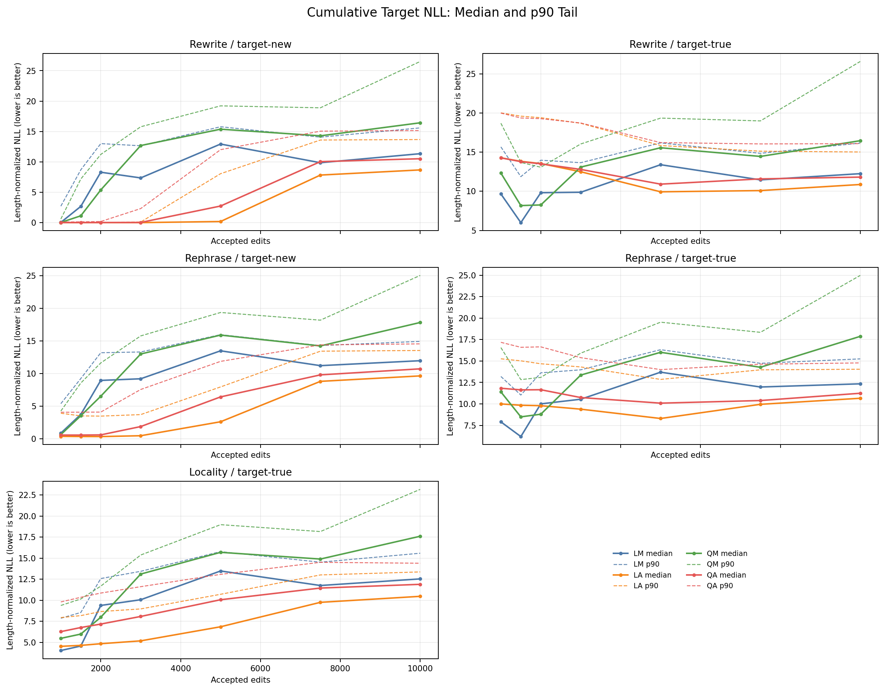

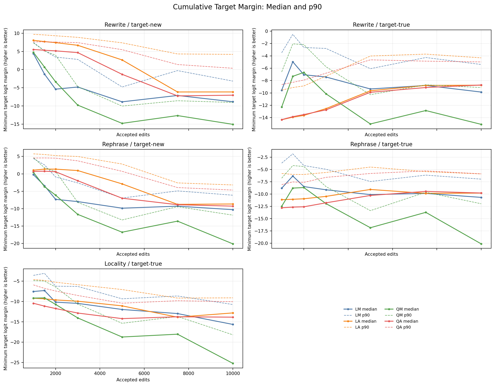

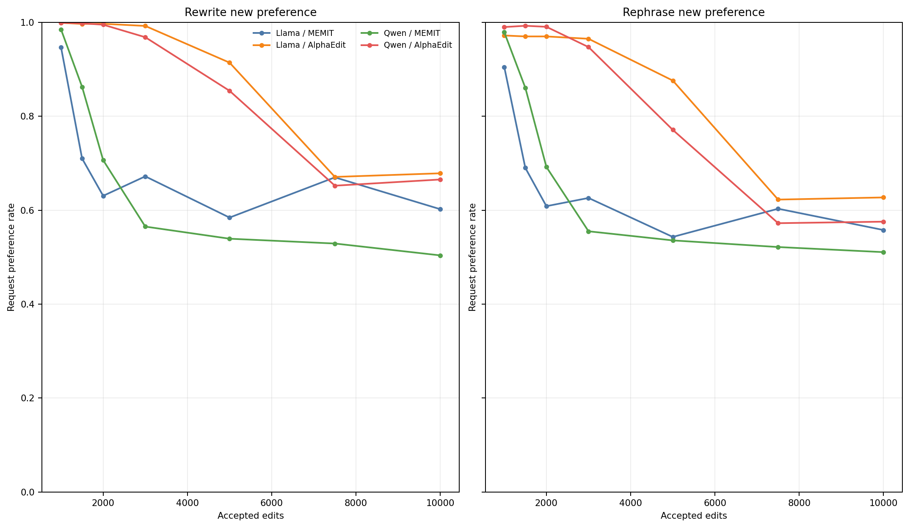

## 12. Checkpoint change, collapse/recovery, model/method comparisons

- **LM:** LM은 rewrite_acc가 1k 0.8350→2k 0.1780으로 급락했고 3k 0.2090으로 부분 반등, 5k 0.0162로 재붕괴, 7.5k 0.0933으로 반등한 뒤 10k 0.0357로 다시 낮아졌다. rephrase_acc strict-all-2와 neighborhood_target_true_teacher_forced_acc는 각 checkpoint에서 rewrite_acc보다 낮았으며 final 값은 §1의 exact n/d다.
  Tail-direction audit: 1500→2000 Rewrite / target-new: Δmedian=5.6198, Δp90=4.3098, Δmax=-2.2391; 5000→7500 Rewrite / target-new: Δmedian=-3.0720, Δp90=-1.7155, Δmax=2.1231; 2000→3000 Rephrase / target-new: Δmedian=0.2506, Δp90=0.1158, Δmax=-2.2748; 5000→7500 Rephrase / target-new: Δmedian=-2.2724, Δp90=-1.6735, Δmax=2.8847.
- **LA:** LA는 rewrite_acc 1k/1.5k/2k=0.9940/0.9920/0.9865로 높게 유지했으나 3k 0.9600 이후 5k 0.6586, 7.5k 0.1957로 급락했고 10k 0.2013은 작은 반등이다. rephrase_acc strict-all-2와 neighborhood_target_true_teacher_forced_acc는 각 checkpoint에서 rewrite_acc보다 낮았으며 final 값은 §1의 exact n/d다.
  Tail-direction audit: 7500→10000 Rewrite / target-new: Δmedian=0.8482, Δp90=0.0780, Δmax=-4.5691; 7500→10000 Rephrase / target-new: Δmedian=0.8371, Δp90=0.1101, Δmax=-0.1755.
- **QM:** QM은 rewrite_acc 1k 0.9300→2k 0.2670→3k 0.0153으로 급붕괴했고 5k 이후 0.0002/0.0001/0.0000으로 사실상 0이었다. rephrase_acc strict-all-2와 neighborhood_target_true_teacher_forced_acc는 각 checkpoint에서 rewrite_acc보다 낮았으며 final 값은 §1의 exact n/d다.
  Tail-direction audit: 5000→7500 Rewrite / target-new: Δmedian=-1.0925, Δp90=-0.3198, Δmax=5.5567; 1500→2000 Rephrase / target-new: Δmedian=2.9936, Δp90=3.0783, Δmax=-2.5608; 5000→7500 Rephrase / target-new: Δmedian=-1.6632, Δp90=-1.1751, Δmax=4.0188.
- **QA:** QA는 rewrite_acc 1k/1.5k/2k=0.9880/0.9820/0.9680으로 유지했지만 3k 0.8767, 5k 0.4306, 7.5k 0.1261, 10k 0.1084로 단계적으로 붕괴했다. rephrase_acc strict-all-2와 neighborhood_target_true_teacher_forced_acc는 각 checkpoint에서 rewrite_acc보다 낮았으며 final 값은 §1의 exact n/d다.
  Tail-direction audit: 1000→1500 Rewrite / target-new: Δmedian=0.0020, Δp90=0.0391, Δmax=-0.4879; 5000→7500 Rewrite / target-new: Δmedian=7.3070, Δp90=3.0434, Δmax=-0.1721; 7500→10000 Rewrite / target-new: Δmedian=0.4776, Δp90=0.1057, Δmax=-0.3922; 1000→1500 Rephrase / target-new: Δmedian=-0.0001, Δp90=0.0130, Δmax=-0.0578.

### 12.1 LM core transition 전량

| span | metric | n/d | delta |
|---|---|---|---|
| 1000→1500 | rewrite_acc | 835/1000→611/1500 | -0.42767 |
| 1000→1500 | rephrase_acc (prompt) | 1245/2000→995/3000 | -0.29083 |
| 1000→1500 | rephrase_acc strict-all-2 | 484/1000→353/1500 | -0.24867 |
| 1000→1500 | neighborhood_target_true_teacher_forced_acc | 1912/10000→2492/15000 | -0.02507 |
| 1000→1500 | Rewrite new preference | 947/1000→1065/1500 | -0.23700 |
| 1000→1500 | Rephrase new preference | 905/1000→1035/1500 | -0.21500 |
| 1500→2000 | rewrite_acc | 611/1500→356/2000 | -0.22933 |
| 1500→2000 | rephrase_acc (prompt) | 995/3000→529/4000 | -0.19942 |
| 1500→2000 | rephrase_acc strict-all-2 | 353/1500→159/2000 | -0.15583 |
| 1500→2000 | neighborhood_target_true_teacher_forced_acc | 2492/15000→628/20000 | -0.13473 |
| 1500→2000 | Rewrite new preference | 1065/1500→1261/2000 | -0.07950 |
| 1500→2000 | Rephrase new preference | 1035/1500→1217/2000 | -0.08150 |
| 2000→3000 | rewrite_acc | 356/2000→627/3000 | 0.03100 |
| 2000→3000 | rephrase_acc (prompt) | 529/4000→457/6000 | -0.05608 |
| 2000→3000 | rephrase_acc strict-all-2 | 159/2000→101/3000 | -0.04583 |
| 2000→3000 | neighborhood_target_true_teacher_forced_acc | 628/20000→851/30000 | -0.00303 |
| 2000→3000 | Rewrite new preference | 1261/2000→2016/3000 | 0.04150 |
| 2000→3000 | Rephrase new preference | 1217/2000→1878/3000 | 0.01750 |
| 3000→5000 | rewrite_acc | 627/3000→81/5000 | -0.19280 |
| 3000→5000 | rephrase_acc (prompt) | 457/6000→36/10000 | -0.07257 |
| 3000→5000 | rephrase_acc strict-all-2 | 101/3000→5/5000 | -0.03267 |
| 3000→5000 | neighborhood_target_true_teacher_forced_acc | 851/30000→39/50000 | -0.02759 |
| 3000→5000 | Rewrite new preference | 2016/3000→2921/5000 | -0.08780 |
| 3000→5000 | Rephrase new preference | 1878/3000→2715/5000 | -0.08300 |
| 5000→7500 | rewrite_acc | 81/5000→700/7500 | 0.07713 |
| 5000→7500 | rephrase_acc (prompt) | 36/10000→476/15000 | 0.02813 |
| 5000→7500 | rephrase_acc strict-all-2 | 5/5000→75/7500 | 0.00900 |
| 5000→7500 | neighborhood_target_true_teacher_forced_acc | 39/50000→1332/75000 | 0.01698 |
| 5000→7500 | Rewrite new preference | 2921/5000→5024/7500 | 0.08567 |
| 5000→7500 | Rephrase new preference | 2715/5000→4523/7500 | 0.06007 |
| 7500→10000 | rewrite_acc | 700/7500→357/10000 | -0.05763 |
| 7500→10000 | rephrase_acc (prompt) | 476/15000→335/20000 | -0.01498 |
| 7500→10000 | rephrase_acc strict-all-2 | 75/7500→53/10000 | -0.00470 |
| 7500→10000 | neighborhood_target_true_teacher_forced_acc | 1332/75000→648/100000 | -0.01128 |
| 7500→10000 | Rewrite new preference | 5024/7500→6021/10000 | -0.06777 |
| 7500→10000 | Rephrase new preference | 4523/7500→5577/10000 | -0.04537 |
| 1000→10000 | rewrite_acc | 835/1000→357/10000 | -0.79930 |
| 1000→10000 | rephrase_acc (prompt) | 1245/2000→335/20000 | -0.60575 |
| 1000→10000 | rephrase_acc strict-all-2 | 484/1000→53/10000 | -0.47870 |
| 1000→10000 | neighborhood_target_true_teacher_forced_acc | 1912/10000→648/100000 | -0.18472 |
| 1000→10000 | Rewrite new preference | 947/1000→6021/10000 | -0.34490 |
| 1000→10000 | Rephrase new preference | 905/1000→5577/10000 | -0.34730 |

### 12.2 LA core transition 전량

| span | metric | n/d | delta |
|---|---|---|---|
| 1000→1500 | rewrite_acc | 994/1000→1488/1500 | -0.00200 |
| 1000→1500 | rephrase_acc (prompt) | 1450/2000→2242/3000 | 0.02233 |
| 1000→1500 | rephrase_acc strict-all-2 | 585/1000→910/1500 | 0.02167 |
| 1000→1500 | neighborhood_target_true_teacher_forced_acc | 2130/10000→2940/15000 | -0.01700 |
| 1000→1500 | Rewrite new preference | 999/1000→1495/1500 | -0.00233 |
| 1000→1500 | Rephrase new preference | 972/1000→1455/1500 | -0.00200 |
| 1500→2000 | rewrite_acc | 1488/1500→1973/2000 | -0.00550 |
| 1500→2000 | rephrase_acc (prompt) | 2242/3000→3019/4000 | 0.00742 |
| 1500→2000 | rephrase_acc strict-all-2 | 910/1500→1220/2000 | 0.00333 |
| 1500→2000 | neighborhood_target_true_teacher_forced_acc | 2940/15000→3491/20000 | -0.02145 |
| 1500→2000 | Rewrite new preference | 1495/1500→1994/2000 | 0.00033 |
| 1500→2000 | Rephrase new preference | 1455/1500→1940/2000 | 0.00000 |
| 2000→3000 | rewrite_acc | 1973/2000→2880/3000 | -0.02650 |
| 2000→3000 | rephrase_acc (prompt) | 3019/4000→4383/6000 | -0.02425 |
| 2000→3000 | rephrase_acc strict-all-2 | 1220/2000→1748/3000 | -0.02733 |
| 2000→3000 | neighborhood_target_true_teacher_forced_acc | 3491/20000→4529/30000 | -0.02358 |
| 2000→3000 | Rewrite new preference | 1994/2000→2977/3000 | -0.00467 |
| 2000→3000 | Rephrase new preference | 1940/2000→2895/3000 | -0.00500 |
| 3000→5000 | rewrite_acc | 2880/3000→3293/5000 | -0.30140 |
| 3000→5000 | rephrase_acc (prompt) | 4383/6000→4476/10000 | -0.28290 |
| 3000→5000 | rephrase_acc strict-all-2 | 1748/3000→1379/5000 | -0.30687 |
| 3000→5000 | neighborhood_target_true_teacher_forced_acc | 4529/30000→3815/50000 | -0.07467 |
| 3000→5000 | Rewrite new preference | 2977/3000→4571/5000 | -0.07813 |
| 3000→5000 | Rephrase new preference | 2895/3000→4380/5000 | -0.08900 |
| 5000→7500 | rewrite_acc | 3293/5000→1468/7500 | -0.46287 |
| 5000→7500 | rephrase_acc (prompt) | 4476/10000→1399/15000 | -0.35433 |
| 5000→7500 | rephrase_acc strict-all-2 | 1379/5000→342/7500 | -0.23020 |
| 5000→7500 | neighborhood_target_true_teacher_forced_acc | 3815/50000→1256/75000 | -0.05955 |
| 5000→7500 | Rewrite new preference | 4571/5000→5031/7500 | -0.24340 |
| 5000→7500 | Rephrase new preference | 4380/5000→4669/7500 | -0.25347 |
| 7500→10000 | rewrite_acc | 1468/7500→2013/10000 | 0.00557 |
| 7500→10000 | rephrase_acc (prompt) | 1399/15000→1727/20000 | -0.00692 |
| 7500→10000 | rephrase_acc strict-all-2 | 342/7500→426/10000 | -0.00300 |
| 7500→10000 | neighborhood_target_true_teacher_forced_acc | 1256/75000→1413/100000 | -0.00262 |
| 7500→10000 | Rewrite new preference | 5031/7500→6785/10000 | 0.00770 |
| 7500→10000 | Rephrase new preference | 4669/7500→6271/10000 | 0.00457 |
| 1000→10000 | rewrite_acc | 994/1000→2013/10000 | -0.79270 |
| 1000→10000 | rephrase_acc (prompt) | 1450/2000→1727/20000 | -0.63865 |
| 1000→10000 | rephrase_acc strict-all-2 | 585/1000→426/10000 | -0.54240 |
| 1000→10000 | neighborhood_target_true_teacher_forced_acc | 2130/10000→1413/100000 | -0.19887 |
| 1000→10000 | Rewrite new preference | 999/1000→6785/10000 | -0.32050 |
| 1000→10000 | Rephrase new preference | 972/1000→6271/10000 | -0.34490 |

### 12.3 QM core transition 전량

| span | metric | n/d | delta |
|---|---|---|---|
| 1000→1500 | rewrite_acc | 930/1000→840/1500 | -0.37000 |
| 1000→1500 | rephrase_acc (prompt) | 1400/2000→1115/3000 | -0.32833 |
| 1000→1500 | rephrase_acc strict-all-2 | 541/1000→297/1500 | -0.34300 |
| 1000→1500 | neighborhood_target_true_teacher_forced_acc | 1235/10000→1192/15000 | -0.04403 |
| 1000→1500 | Rewrite new preference | 985/1000→1294/1500 | -0.12233 |
| 1000→1500 | Rephrase new preference | 979/1000→1291/1500 | -0.11833 |
| 1500→2000 | rewrite_acc | 840/1500→534/2000 | -0.29300 |
| 1500→2000 | rephrase_acc (prompt) | 1115/3000→786/4000 | -0.17517 |
| 1500→2000 | rephrase_acc strict-all-2 | 297/1500→243/2000 | -0.07650 |
| 1500→2000 | neighborhood_target_true_teacher_forced_acc | 1192/15000→624/20000 | -0.04827 |
| 1500→2000 | Rewrite new preference | 1294/1500→1413/2000 | -0.15617 |
| 1500→2000 | Rephrase new preference | 1291/1500→1384/2000 | -0.16867 |
| 2000→3000 | rewrite_acc | 534/2000→46/3000 | -0.25167 |
| 2000→3000 | rephrase_acc (prompt) | 786/4000→38/6000 | -0.19017 |
| 2000→3000 | rephrase_acc strict-all-2 | 243/2000→3/3000 | -0.12050 |
| 2000→3000 | neighborhood_target_true_teacher_forced_acc | 624/20000→19/30000 | -0.03057 |
| 2000→3000 | Rewrite new preference | 1413/2000→1695/3000 | -0.14150 |
| 2000→3000 | Rephrase new preference | 1384/2000→1665/3000 | -0.13700 |
| 3000→5000 | rewrite_acc | 46/3000→1/5000 | -0.01513 |
| 3000→5000 | rephrase_acc (prompt) | 38/6000→1/10000 | -0.00623 |
| 3000→5000 | rephrase_acc strict-all-2 | 3/3000→0/5000 | -0.00100 |
| 3000→5000 | neighborhood_target_true_teacher_forced_acc | 19/30000→0/50000 | -0.00063 |
| 3000→5000 | Rewrite new preference | 1695/3000→2696/5000 | -0.02580 |
| 3000→5000 | Rephrase new preference | 1665/3000→2678/5000 | -0.01940 |
| 5000→7500 | rewrite_acc | 1/5000→1/7500 | -0.00007 |
| 5000→7500 | rephrase_acc (prompt) | 1/10000→1/15000 | -0.00003 |
| 5000→7500 | rephrase_acc strict-all-2 | 0/5000→0/7500 | 0.00000 |
| 5000→7500 | neighborhood_target_true_teacher_forced_acc | 0/50000→0/75000 | 0.00000 |
| 5000→7500 | Rewrite new preference | 2696/5000→3967/7500 | -0.01027 |
| 5000→7500 | Rephrase new preference | 2678/5000→3911/7500 | -0.01413 |
| 7500→10000 | rewrite_acc | 1/7500→0/10000 | -0.00013 |
| 7500→10000 | rephrase_acc (prompt) | 1/15000→0/20000 | -0.00007 |
| 7500→10000 | rephrase_acc strict-all-2 | 0/7500→0/10000 | 0.00000 |
| 7500→10000 | neighborhood_target_true_teacher_forced_acc | 0/75000→0/100000 | 0.00000 |
| 7500→10000 | Rewrite new preference | 3967/7500→5037/10000 | -0.02523 |
| 7500→10000 | Rephrase new preference | 3911/7500→5106/10000 | -0.01087 |
| 1000→10000 | rewrite_acc | 930/1000→0/10000 | -0.93000 |
| 1000→10000 | rephrase_acc (prompt) | 1400/2000→0/20000 | -0.70000 |
| 1000→10000 | rephrase_acc strict-all-2 | 541/1000→0/10000 | -0.54100 |
| 1000→10000 | neighborhood_target_true_teacher_forced_acc | 1235/10000→0/100000 | -0.12350 |
| 1000→10000 | Rewrite new preference | 985/1000→5037/10000 | -0.48130 |
| 1000→10000 | Rephrase new preference | 979/1000→5106/10000 | -0.46840 |

### 12.4 QA core transition 전량

| span | metric | n/d | delta |
|---|---|---|---|
| 1000→1500 | rewrite_acc | 988/1000→1473/1500 | -0.00600 |
| 1000→1500 | rephrase_acc (prompt) | 1402/2000→2143/3000 | 0.01333 |
| 1000→1500 | rephrase_acc strict-all-2 | 545/1000→850/1500 | 0.02167 |
| 1000→1500 | neighborhood_target_true_teacher_forced_acc | 948/10000→1179/15000 | -0.01620 |
| 1000→1500 | Rewrite new preference | 999/1000→1497/1500 | -0.00100 |
| 1000→1500 | Rephrase new preference | 990/1000→1489/1500 | 0.00267 |
| 1500→2000 | rewrite_acc | 1473/1500→1936/2000 | -0.01400 |
| 1500→2000 | rephrase_acc (prompt) | 2143/3000→2800/4000 | -0.01433 |
| 1500→2000 | rephrase_acc strict-all-2 | 850/1500→1101/2000 | -0.01617 |
| 1500→2000 | neighborhood_target_true_teacher_forced_acc | 1179/15000→1401/20000 | -0.00855 |
| 1500→2000 | Rewrite new preference | 1497/1500→1990/2000 | -0.00300 |
| 1500→2000 | Rephrase new preference | 1489/1500→1981/2000 | -0.00217 |
| 2000→3000 | rewrite_acc | 1936/2000→2630/3000 | -0.09133 |
| 2000→3000 | rephrase_acc (prompt) | 2800/4000→3337/6000 | -0.14383 |
| 2000→3000 | rephrase_acc strict-all-2 | 1101/2000→1105/3000 | -0.18217 |
| 2000→3000 | neighborhood_target_true_teacher_forced_acc | 1401/20000→1592/30000 | -0.01698 |
| 2000→3000 | Rewrite new preference | 1990/2000→2905/3000 | -0.02667 |
| 2000→3000 | Rephrase new preference | 1981/2000→2842/3000 | -0.04317 |
| 3000→5000 | rewrite_acc | 2630/3000→2153/5000 | -0.44607 |
| 3000→5000 | rephrase_acc (prompt) | 3337/6000→2231/10000 | -0.33307 |
| 3000→5000 | rephrase_acc strict-all-2 | 1105/3000→604/5000 | -0.24753 |
| 3000→5000 | neighborhood_target_true_teacher_forced_acc | 1592/30000→675/50000 | -0.03957 |
| 3000→5000 | Rewrite new preference | 2905/3000→4271/5000 | -0.11413 |
| 3000→5000 | Rephrase new preference | 2842/3000→3855/5000 | -0.17633 |
| 5000→7500 | rewrite_acc | 2153/5000→946/7500 | -0.30447 |
| 5000→7500 | rephrase_acc (prompt) | 2231/10000→690/15000 | -0.17710 |
| 5000→7500 | rephrase_acc strict-all-2 | 604/5000→143/7500 | -0.10173 |
| 5000→7500 | neighborhood_target_true_teacher_forced_acc | 675/50000→265/75000 | -0.00997 |
| 5000→7500 | Rewrite new preference | 4271/5000→4891/7500 | -0.20207 |
| 5000→7500 | Rephrase new preference | 3855/5000→4292/7500 | -0.19873 |
| 7500→10000 | rewrite_acc | 946/7500→1084/10000 | -0.01773 |
| 7500→10000 | rephrase_acc (prompt) | 690/15000→686/20000 | -0.01170 |
| 7500→10000 | rephrase_acc strict-all-2 | 143/7500→105/10000 | -0.00857 |
| 7500→10000 | neighborhood_target_true_teacher_forced_acc | 265/75000→246/100000 | -0.00107 |
| 7500→10000 | Rewrite new preference | 4891/7500→6653/10000 | 0.01317 |
| 7500→10000 | Rephrase new preference | 4292/7500→5755/10000 | 0.00323 |
| 1000→10000 | rewrite_acc | 988/1000→1084/10000 | -0.87960 |
| 1000→10000 | rephrase_acc (prompt) | 1402/2000→686/20000 | -0.66670 |
| 1000→10000 | rephrase_acc strict-all-2 | 545/1000→105/10000 | -0.53450 |
| 1000→10000 | neighborhood_target_true_teacher_forced_acc | 948/10000→246/100000 | -0.09234 |
| 1000→10000 | Rewrite new preference | 999/1000→6653/10000 | -0.33370 |
| 1000→10000 | Rephrase new preference | 990/1000→5755/10000 | -0.41450 |

### 12.5 Category distribution change 전량


#### LM

| span | category | Δstrict | Δrequest NLL μ/med/p90/max | Δrequest margin μ/med/p90/max |
|---|---|---|---|---|
| 1000→1500 | Rewrite / target-new | -0.4277 | 2.7726/2.6401/5.9834/2.9878 | -4.6725/-5.6365/-2.2538/3.6146 |
| 1500→2000 | Rewrite / target-new | -0.2293 | 3.9923/5.6198/4.3098/-2.2391 | -3.3067/-4.1509/-1.7563/0.0024 |
| 2000→3000 | Rewrite / target-new | 0.0310 | -0.4406/-0.9364/-0.3530/-2.1786 | 0.1944/0.5975/-0.6490/-2.2421 |
| 3000→5000 | Rewrite / target-new | -0.1928 | 5.3576/5.5740/3.1310/1.2652 | -4.2120/-4.0775/-7.5795/-6.1173 |
| 5000→7500 | Rewrite / target-new | 0.0771 | -3.2792/-3.0720/-1.7155/2.1231 | 1.8038/1.7479/4.5025/4.4129 |
| 7500→10000 | Rewrite / target-new | -0.0576 | 1.7041/1.4866/1.5271/5.5055 | -2.2077/-1.7315/-2.8901/1.3022 |
| 1000→10000 | Rewrite / target-new | -0.7993 | 10.1068/11.3121/12.8828/7.4638 | -12.4006/-13.2510/-10.6261/0.9726 |
| 1000→1500 | Rewrite / target-true | 0.0550 | -3.1743/-3.6652/-3.8012/2.2761 | 3.9486/4.5950/2.9758/0.3882 |
| 1500→2000 | Rewrite / target-true | -0.0430 | 3.0947/3.8232/2.1014/-1.8315 | -1.7754/-2.0984/-2.1300/1.4031 |
| 2000→3000 | Rewrite / target-true | -0.0037 | -0.0263/0.0561/-0.3181/4.2274 | -0.0517/-0.3656/-0.1529/0.4137 |
| 3000→5000 | Rewrite / target-true | -0.0229 | 3.5229/3.5205/2.5315/-9.1655 | -1.8250/-1.9333/-3.2736/-3.5494 |
| 5000→7500 | Rewrite / target-true | 0.0129 | -2.1182/-1.9349/-1.3366/2.2826 | 0.4600/0.5704/1.8068/3.1230 |
| 7500→10000 | Rewrite / target-true | -0.0097 | 1.0452/0.7915/1.3109/9.2260 | -1.4153/-1.0713/-1.1277/0.3554 |
| 1000→10000 | Rewrite / target-true | -0.0114 | 2.3440/2.5913/0.4878/7.0150 | -0.6589/-0.3032/-1.9015/2.1339 |
| 1000→1500 | Rephrase / target-new | -0.2908 | 2.3922/2.8716/3.8513/0.8577 | -3.1025/-3.1856/-1.8248/2.3077 |
| 1500→2000 | Rephrase / target-new | -0.1994 | 4.0556/5.2067/3.9524/0.4221 | -3.2105/-3.9100/-3.4764/2.5732 |
| 2000→3000 | Rephrase / target-new | -0.0561 | 0.5740/0.2506/0.1158/-2.2748 | -0.6999/-0.6498/-1.7058/-6.4923 |
| 3000→5000 | Rephrase / target-new | -0.0726 | 4.3448/4.2837/2.6563/2.1288 | -2.1108/-1.8921/-4.3568/-2.7773 |
| 5000→7500 | Rephrase / target-new | 0.0281 | -2.4325/-2.2724/-1.6735/2.8847 | 0.5572/0.5815/2.0570/5.5904 |
| 7500→10000 | Rephrase / target-new | -0.0150 | 0.8017/0.7579/0.6395/0.3007 | -1.4042/-1.0101/-1.2403/-5.6571 |
| 1000→10000 | Rephrase / target-new | -0.6058 | 9.7360/11.0981/9.5418/4.3192 | -9.9708/-10.0661/-10.5471/-4.4553 |
| 1000→1500 | Rephrase / target-true | 0.0433 | -1.4797/-1.7146/-2.1649/1.5281 | 2.0476/2.4834/1.8817/0.9108 |
| 1500→2000 | Rephrase / target-true | -0.0578 | 3.2161/3.8123/2.5885/0.9607 | -2.0170/-2.1536/-2.3860/-1.0743 |
| 2000→3000 | Rephrase / target-true | -0.0093 | 0.4678/0.5406/0.3514/-5.3489 | -0.1718/-0.6484/-0.7514/-1.2478 |
| 3000→5000 | Rephrase / target-true | -0.0110 | 3.2904/3.1525/2.3449/0.8146 | -1.0694/-0.9821/-2.4905/-2.1219 |
| 5000→7500 | Rephrase / target-true | 0.0049 | -1.9056/-1.7275/-1.5855/4.7054 | 0.1228/0.2431/1.2963/2.2425 |
| 7500→10000 | Rephrase / target-true | -0.0025 | 0.4729/0.3718/0.5152/1.3514 | -1.1655/-0.8097/-0.8147/0.7634 |
| 1000→10000 | Rephrase / target-true | -0.0324 | 4.0619/4.4352/2.0497/4.0114 | -2.2535/-1.8673/-3.2647/-0.5274 |
| 1000→1500 | Locality / target-true | -0.0251 | 0.4645/0.5354/0.6811/2.2860 | -0.1411/0.2287/0.4968/-0.2323 |
| 1500→2000 | Locality / target-true | -0.1347 | 4.2902/4.8171/4.0325/2.0365 | -2.8141/-2.8526/-3.1534/-1.0714 |
| 2000→3000 | Locality / target-true | -0.0030 | 0.4917/0.6764/0.8562/1.2457 | 0.2347/-0.2987/-0.0579/-0.6142 |
| 3000→5000 | Locality / target-true | -0.0276 | 3.5942/3.4141/2.3387/0.6055 | -1.5323/-1.4979/-3.0420/-4.5528 |
| 5000→7500 | Locality / target-true | 0.0170 | -2.0657/-1.7241/-1.2535/-0.6153 | -1.2357/-1.0083/0.6973/4.1520 |
| 7500→10000 | Locality / target-true | -0.0113 | 1.0293/0.7838/1.0643/5.3824 | -2.6124/-2.6693/-2.1038/-2.3913 |
| 1000→10000 | Locality / target-true | -0.1847 | 7.8042/8.5027/7.7193/10.9408 | -8.1009/-8.0980/-7.1631/-4.7101 |

#### LA

| span | category | Δstrict | Δrequest NLL μ/med/p90/max | Δrequest margin μ/med/p90/max |
|---|---|---|---|---|
| 1000→1500 | Rewrite / target-new | -0.0020 | 0.0158/0.0004/0.0040/2.1260 | -0.3848/-0.3569/-0.1595/0.0342 |
| 1500→2000 | Rewrite / target-new | -0.0055 | 0.0314/0.0005/0.0084/3.6645 | -0.4070/-0.2790/-0.2321/0.5434 |
| 2000→3000 | Rewrite / target-new | -0.0265 | 0.1414/0.0021/0.0798/3.9455 | -0.9873/-0.7369/-0.4373/1.4830 |
| 3000→5000 | Rewrite / target-new | -0.3014 | 2.0371/0.1801/7.9571/3.2439 | -4.9303/-4.0272/-1.5029/-0.2211 |
| 5000→7500 | Rewrite / target-new | -0.4629 | 5.1615/7.6449/5.5410/5.8611 | -6.5780/-8.8163/-3.0652/0.9919 |
| 7500→10000 | Rewrite / target-new | 0.0056 | 0.4311/0.8482/0.0780/-4.5691 | 0.1925/0.0082/-0.1142/3.7662 |
| 1000→10000 | Rewrite / target-new | -0.7927 | 7.8183/8.6763/13.6683/14.2719 | -13.0950/-14.2080/-5.5112/6.5976 |
| 1000→1500 | Rewrite / target-true | 0.0000 | -0.4515/-0.4487/-0.4185/0.8543 | 0.4415/0.4170/0.4103/1.5243 |
| 1500→2000 | Rewrite / target-true | 0.0000 | -0.2513/-0.2844/-0.1968/0.3432 | 0.2743/0.2850/0.2654/0.3962 |
| 2000→3000 | Rewrite / target-true | 0.0017 | -1.0162/-1.0461/-0.7108/1.9672 | 1.0740/1.1040/1.5895/4.4688 |
| 3000→5000 | Rewrite / target-true | 0.0045 | -2.6377/-2.5645/-2.8452/-2.9625 | 2.9851/2.8843/3.2449/-0.2409 |
| 5000→7500 | Rewrite / target-true | 0.0022 | 0.0708/0.1584/-0.7224/-0.0242 | 0.7878/0.8634/0.3100/0.1879 |
| 7500→10000 | Rewrite / target-true | -0.0025 | 0.6031/0.7768/-0.1044/4.5436 | 0.0215/0.0366/-0.6058/0.4656 |
| 1000→10000 | Rewrite / target-true | 0.0059 | -3.6828/-3.4085/-4.9981/4.7215 | 5.5843/5.5903/5.2144/6.8019 |
| 1000→1500 | Rephrase / target-new | 0.0223 | -0.1593/-0.0268/-0.4063/-0.1359 | 0.2365/0.3076/-0.1838/-0.5368 |
| 1500→2000 | Rephrase / target-new | 0.0074 | -0.0051/-0.0059/-0.0339/-0.1803 | -0.0550/-0.0123/-0.3145/0.2716 |
| 2000→3000 | Rephrase / target-new | -0.0242 | 0.1511/0.1294/0.2322/4.5385 | -0.3087/-0.4034/-0.2575/0.5815 |
| 3000→5000 | Rephrase / target-new | -0.2829 | 2.0840/2.1404/4.2391/1.2413 | -3.5378/-3.8313/-2.1713/-0.2183 |
| 5000→7500 | Rephrase / target-new | -0.3543 | 5.1530/6.1897/5.4760/2.1067 | -5.3135/-5.8826/-5.4223/0.7303 |
| 7500→10000 | Rephrase / target-new | -0.0069 | 0.5896/0.8371/0.1101/-0.1755 | 0.1609/0.1021/-0.5922/1.1303 |
| 1000→10000 | Rephrase / target-new | -0.6386 | 7.8133/9.2639/9.6172/7.3948 | -8.8176/-9.7199/-8.9415/1.9585 |
| 1000→1500 | Rephrase / target-true | 0.0012 | -0.1454/-0.1559/-0.2379/-0.6093 | 0.1333/0.0829/-0.1789/0.0423 |
| 1500→2000 | Rephrase / target-true | 0.0001 | -0.0315/-0.0504/-0.3400/-0.4571 | 0.0842/0.0972/-0.0134/0.2899 |
| 2000→3000 | Rephrase / target-true | 0.0004 | -0.3591/-0.4053/-0.3703/4.1488 | 0.4629/0.4939/0.4046/-2.3036 |
| 3000→5000 | Rephrase / target-true | 0.0058 | -1.0515/-1.0874/-1.4545/-2.7926 | 1.2741/1.4031/1.0998/0.3400 |
| 5000→7500 | Rephrase / target-true | -0.0089 | 1.4358/1.6521/1.1167/-1.3246 | -0.7428/-0.7888/-0.9302/0.5783 |
| 7500→10000 | Rephrase / target-true | -0.0045 | 0.6618/0.7059/0.0683/0.1621 | 0.1236/0.0553/-0.4674/-2.3686 |
| 1000→10000 | Rephrase / target-true | -0.0059 | 0.5101/0.6591/-1.2178/-0.8728 | 1.3353/1.3436/-0.0855/-3.4216 |
| 1000→1500 | Locality / target-true | -0.0170 | 0.1352/0.1133/0.2343/1.1916 | -0.2478/-0.1479/-0.2207/-1.2327 |
| 1500→2000 | Locality / target-true | -0.0214 | 0.2727/0.1974/0.4834/-0.2071 | -0.2823/-0.2694/-0.4473/0.2935 |
| 2000→3000 | Locality / target-true | -0.0236 | 0.3521/0.3391/0.3109/1.4423 | -0.3890/-0.3210/-0.6003/0.2566 |
| 3000→5000 | Locality / target-true | -0.0747 | 1.4697/1.6729/1.7367/0.9543 | -1.4977/-1.1391/-1.1948/-2.4579 |
| 5000→7500 | Locality / target-true | -0.0596 | 2.6916/2.9006/2.2989/1.3375 | -2.3431/-2.7846/-2.0979/-1.1135 |
| 7500→10000 | Locality / target-true | -0.0026 | 0.6754/0.7129/0.3581/0.3888 | 0.9968/1.0496/0.0584/1.7632 |
| 1000→10000 | Locality / target-true | -0.1989 | 5.5967/5.9363/5.4223/5.1073 | -3.7632/-3.6125/-4.5025/-2.4908 |

#### QM

| span | category | Δstrict | Δrequest NLL μ/med/p90/max | Δrequest margin μ/med/p90/max |
|---|---|---|---|---|
| 1000→1500 | Rewrite / target-new | -0.3700 | 2.1660/1.0946/6.5815/5.1519 | -4.2443/-4.0445/-2.1988/0.7039 |
| 1500→2000 | Rewrite / target-new | -0.2930 | 2.9516/4.2592/4.0420/0.1566 | -3.2031/-4.0464/-1.1967/1.7462 |
| 2000→3000 | Rewrite / target-new | -0.2517 | 6.8302/7.3047/4.5563/0.0014 | -6.3923/-6.4259/-8.6281/-5.4515 |
| 3000→5000 | Rewrite / target-new | -0.0151 | 3.1839/2.6910/3.4405/9.7701 | -5.1800/-5.0204/-5.3618/-5.7056 |
| 5000→7500 | Rewrite / target-new | -0.0001 | -0.6284/-1.0925/-0.3198/5.5567 | 1.4422/2.1409/1.4682/-0.8458 |
| 7500→10000 | Rewrite / target-new | -0.0001 | 3.2163/2.1444/7.6240/11.7812 | -3.4271/-2.4168/-0.4740/-3.8326 |
| 1000→10000 | Rewrite / target-new | -0.9300 | 17.7196/16.4014/25.9245/32.4179 | -21.0045/-19.8131/-16.3912/-13.3856 |
| 1000→1500 | Rewrite / target-true | 0.0187 | -4.1662/-4.1505/-5.0038/-3.4704 | 4.9476/4.9608/4.5415/2.6711 |
| 1500→2000 | Rewrite / target-true | -0.0037 | -0.0079/0.0812/-0.6186/-4.4357 | 0.6459/0.6422/-0.1350/1.6255 |
| 2000→3000 | Rewrite / target-true | -0.0167 | 4.4502/4.8365/2.9749/-0.9197 | -3.1696/-3.4675/-3.5769/-3.5809 |
| 3000→5000 | Rewrite / target-true | -0.0003 | 2.8431/2.4712/3.3029/9.1703 | -4.8040/-4.8758/-4.5148/-2.7099 |
| 5000→7500 | Rewrite / target-true | 0.0000 | -0.6881/-1.1088/-0.3576/7.3219 | 1.4992/2.1693/1.6044/-1.9144 |
| 7500→10000 | Rewrite / target-true | 0.0000 | 3.0930/2.0091/7.5940/12.4518 | -3.2838/-2.2357/-0.4502/0.6340 |
| 1000→10000 | Rewrite / target-true | -0.0020 | 5.5241/4.1386/7.8917/20.1183 | -4.1648/-2.8067/-2.5311/-3.2746 |
| 1000→1500 | Rephrase / target-new | -0.3283 | 2.5864/2.8848/4.2919/5.6176 | -3.5934/-4.1359/-2.9514/-0.5666 |
| 1500→2000 | Rephrase / target-new | -0.1752 | 2.3899/2.9936/3.0783/-2.5608 | -2.1007/-2.4342/-1.0275/2.2918 |
| 2000→3000 | Rephrase / target-new | -0.1902 | 6.4459/6.4696/4.1388/2.7819 | -5.6109/-5.5287/-8.9027/-5.2782 |
| 3000→5000 | Rephrase / target-new | -0.0062 | 3.0807/2.8969/3.5882/6.3660 | -5.2884/-5.1224/-5.0542/-11.1260 |
| 5000→7500 | Rephrase / target-new | -0.0000 | -1.4224/-1.6632/-1.1751/4.0188 | 2.3867/3.1771/3.8241/2.1828 |
| 7500→10000 | Rephrase / target-new | -0.0001 | 3.9127/3.5955/6.8552/12.4656 | -6.0098/-6.5352/-2.4459/-1.7734 |
| 1000→10000 | Rephrase / target-new | -0.7000 | 16.9932/17.1772/20.7771/28.6889 | -20.2167/-20.5793/-16.5576/-14.2696 |
| 1000→1500 | Rephrase / target-true | 0.0148 | -2.8838/-2.9114/-3.7335/-3.5063 | 3.5669/3.6999/2.5643/2.2388 |
| 1500→2000 | Rephrase / target-true | -0.0061 | 0.3675/0.3101/0.2614/-3.2113 | 0.2368/0.1093/-0.1909/1.6551 |
| 2000→3000 | Rephrase / target-true | -0.0131 | 4.2976/4.5621/2.8268/-0.3149 | -3.0417/-3.2752/-4.0982/-2.9890 |
| 3000→5000 | Rephrase / target-true | -0.0012 | 2.9474/2.6527/3.6062/5.7263 | -5.1921/-4.8994/-4.8854/-7.8102 |
| 5000→7500 | Rephrase / target-true | 0.0000 | -1.4914/-1.7429/-1.1820/5.0845 | 2.4539/3.1291/3.7470/3.7017 |
| 7500→10000 | Rephrase / target-true | 0.0000 | 3.8469/3.6030/6.6339/10.1698 | -5.9076/-6.4201/-2.3467/-1.4477 |
| 1000→10000 | Rephrase / target-true | -0.0055 | 7.0842/6.4737/8.4128/13.9481 | -7.8838/-7.6564/-5.2100/-4.6513 |
| 1000→1500 | Locality / target-true | -0.0440 | 0.5553/0.5067/0.7710/-0.2441 | 0.1491/0.0462/-0.1104/0.2340 |
| 1500→2000 | Locality / target-true | -0.0483 | 1.7590/1.9996/1.5224/1.6969 | -1.6127/-1.5941/-1.4554/-0.0453 |
| 2000→3000 | Locality / target-true | -0.0306 | 4.9806/5.1250/3.6959/2.4286 | -2.9594/-3.3305/-4.1827/-5.6393 |
| 3000→5000 | Locality / target-true | -0.0006 | 2.8206/2.5798/3.6042/6.5953 | -5.0561/-4.6893/-4.7442/-3.9865 |
| 5000→7500 | Locality / target-true | 0.0000 | -0.7896/-0.7968/-0.8180/2.5733 | -0.0550/0.6912/1.6798/2.7244 |
| 7500→10000 | Locality / target-true | 0.0000 | 3.1835/2.7074/5.0093/13.5754 | -7.1180/-7.1754/-4.5120/-3.3165 |
| 1000→10000 | Locality / target-true | -0.1235 | 12.5095/12.1218/13.7848/26.6254 | -16.6521/-16.0518/-13.3249/-10.0291 |

#### QA

| span | category | Δstrict | Δrequest NLL μ/med/p90/max | Δrequest margin μ/med/p90/max |
|---|---|---|---|---|
| 1000→1500 | Rewrite / target-new | -0.0060 | 0.0313/0.0020/0.0391/-0.4879 | -0.1724/-0.2132/0.0027/1.5001 |
| 1500→2000 | Rewrite / target-new | -0.0140 | 0.0789/0.0036/0.0525/0.6067 | -0.2675/-0.1589/-0.0719/0.6951 |
| 2000→3000 | Rewrite / target-new | -0.0913 | 0.6523/0.0105/2.1296/5.1887 | -1.2682/-0.4881/-0.1501/-0.7347 |
| 3000→5000 | Rewrite / target-new | -0.4461 | 3.6958/2.7036/9.6966/3.5824 | -5.7349/-5.9720/-1.9294/1.2133 |
| 5000→7500 | Rewrite / target-new | -0.3045 | 4.7954/7.3070/3.0434/-0.1721 | -4.6200/-5.9319/-4.0908/1.5527 |
| 7500→10000 | Rewrite / target-new | -0.0177 | 0.4859/0.4776/0.1057/-0.3922 | 0.0178/0.1907/-1.0299/-3.4806 |
| 1000→10000 | Rewrite / target-new | -0.8796 | 9.7396/10.5042/15.0668/8.3255 | -12.0452/-12.5734/-7.2694/0.7459 |
| 1000→1500 | Rewrite / target-true | 0.0007 | -0.4445/-0.4859/-0.6286/-2.1005 | 0.4426/0.4752/0.3518/2.7005 |
| 1500→2000 | Rewrite / target-true | 0.0003 | -0.2813/-0.2760/-0.0907/1.5751 | 0.3216/0.3451/0.3725/0.8046 |
| 2000→3000 | Rewrite / target-true | 0.0033 | -0.7564/-0.7169/-0.5518/1.7849 | 0.9036/0.7626/1.1117/2.8448 |
| 3000→5000 | Rewrite / target-true | 0.0029 | -1.7842/-1.8794/-2.5017/-4.6124 | 2.5513/2.8430/2.1593/-1.9940 |
| 5000→7500 | Rewrite / target-true | -0.0047 | 0.6193/0.6696/-0.1682/2.5590 | 0.7090/0.7706/-0.2154/-0.8970 |
| 7500→10000 | Rewrite / target-true | -0.0002 | 0.2895/0.2280/0.0317/-5.9909 | 0.3436/0.4089/-0.1220/1.2440 |
| 1000→10000 | Rewrite / target-true | 0.0023 | -2.3577/-2.4606/-3.9093/-6.7848 | 5.2718/5.6053/3.6579/4.7028 |
| 1000→1500 | Rephrase / target-new | 0.0133 | -0.0670/-0.0001/0.0130/-0.0578 | 0.1672/0.0685/0.0255/0.5362 |
| 1500→2000 | Rephrase / target-new | -0.0143 | 0.0612/0.0282/0.0144/1.1173 | -0.0806/-0.1610/-0.0653/0.8587 |
| 2000→3000 | Rephrase / target-new | -0.1438 | 1.3971/1.2755/3.4633/2.4671 | -2.4110/-2.5861/-0.7740/-1.1494 |
| 3000→5000 | Rephrase / target-new | -0.3331 | 3.6008/4.5434/4.3073/3.4908 | -4.0324/-5.0251/-3.0122/-0.8693 |
| 5000→7500 | Rephrase / target-new | -0.1771 | 3.2319/3.3751/2.5236/0.4997 | -2.3653/-1.8649/-4.6700/-1.9497 |
| 7500→10000 | Rephrase / target-new | -0.0117 | 0.8092/0.9256/0.1575/1.5763 | -0.4467/-0.4143/-0.7213/1.5341 |
| 1000→10000 | Rephrase / target-new | -0.6667 | 9.0332/10.1477/10.4791/9.0933 | -9.1688/-9.9828/-9.2173/-1.0394 |
| 1000→1500 | Rephrase / target-true | 0.0010 | -0.3113/-0.1906/-0.5812/-1.9457 | 0.3086/0.1397/0.5408/1.7455 |
| 1500→2000 | Rephrase / target-true | 0.0002 | -0.0641/0.0174/0.0517/0.5610 | 0.1070/0.0619/-0.0814/0.6127 |
| 2000→3000 | Rephrase / target-true | 0.0056 | -0.9063/-0.9125/-1.2608/-2.3021 | 1.0088/0.8108/1.0153/4.3829 |
| 3000→5000 | Rephrase / target-true | 0.0011 | -0.6952/-0.6515/-1.3897/-0.2132 | 1.4270/1.4985/0.7889/-1.4849 |
| 5000→7500 | Rephrase / target-true | -0.0023 | 0.4063/0.3040/0.6284/-3.7802 | 0.6998/0.8317/0.5280/-1.4351 |
| 7500→10000 | Rephrase / target-true | -0.0029 | 0.7615/0.8483/0.1526/-0.1440 | -0.3863/-0.3339/-0.5996/-0.4107 |
| 1000→10000 | Rephrase / target-true | 0.0027 | -0.8091/-0.5850/-2.3990/-7.8243 | 3.1649/3.0087/2.1919/3.4103 |
| 1000→1500 | Locality / target-true | -0.0162 | 0.4307/0.4851/0.5495/0.4999 | -0.5974/-0.6924/-0.8456/-1.2345 |
| 1500→2000 | Locality / target-true | -0.0086 | 0.4548/0.4122/0.5044/-1.5180 | -0.6829/-0.5940/-0.6506/-0.2093 |
| 2000→3000 | Locality / target-true | -0.0170 | 0.7443/0.9040/0.7567/1.3662 | -0.9765/-1.1141/-1.1004/-0.6021 |
| 3000→5000 | Locality / target-true | -0.0396 | 1.9153/1.9836/1.4619/-0.1321 | -1.3817/-1.3682/-1.8980/0.2798 |
| 5000→7500 | Locality / target-true | -0.0100 | 1.4356/1.3880/1.4318/3.1647 | 0.4337/0.4490/0.6059/-2.3812 |
| 7500→10000 | Locality / target-true | -0.0011 | 0.4606/0.4426/-0.1107/-1.6486 | 0.1209/-0.0917/-0.2407/-0.0579 |
| 1000→10000 | Locality / target-true | -0.0923 | 5.4413/5.6155/4.5936/1.7321 | -3.0839/-3.4113/-4.1293/-4.2053 |

### 12.6 Same-checkpoint paired model/method deltas

Delta는 left−right다. n/d는 양쪽을 모두 기록한다.

#### ALPHAEDIT_MINUS_MEMIT_LLAMA

| t | metric | left vs right n/d | left | right | delta |
|---|---|---|---|---|---|
| 1000 | rewrite_acc | 994/1000 vs 835/1000 | 0.9940 | 0.8350 | 0.1590 |
| 1000 | rephrase_acc (prompt) | 1450/2000 vs 1245/2000 | 0.7250 | 0.6225 | 0.1025 |
| 1000 | rephrase_acc strict-all-2 | 585/1000 vs 484/1000 | 0.5850 | 0.4840 | 0.1010 |
| 1000 | neighborhood_target_true_teacher_forced_acc | 2130/10000 vs 1912/10000 | 0.2130 | 0.1912 | 0.0218 |
| 1000 | Rewrite new preference | 999/1000 vs 947/1000 | 0.9990 | 0.9470 | 0.0520 |
| 1000 | Rephrase new preference | 972/1000 vs 905/1000 | 0.9720 | 0.9050 | 0.0670 |
| 1500 | rewrite_acc | 1488/1500 vs 611/1500 | 0.9920 | 0.4073 | 0.5847 |
| 1500 | rephrase_acc (prompt) | 2242/3000 vs 995/3000 | 0.7473 | 0.3317 | 0.4157 |
| 1500 | rephrase_acc strict-all-2 | 910/1500 vs 353/1500 | 0.6067 | 0.2353 | 0.3713 |
| 1500 | neighborhood_target_true_teacher_forced_acc | 2940/15000 vs 2492/15000 | 0.1960 | 0.1661 | 0.0299 |
| 1500 | Rewrite new preference | 1495/1500 vs 1065/1500 | 0.9967 | 0.7100 | 0.2867 |
| 1500 | Rephrase new preference | 1455/1500 vs 1035/1500 | 0.9700 | 0.6900 | 0.2800 |
| 2000 | rewrite_acc | 1973/2000 vs 356/2000 | 0.9865 | 0.1780 | 0.8085 |
| 2000 | rephrase_acc (prompt) | 3019/4000 vs 529/4000 | 0.7548 | 0.1323 | 0.6225 |
| 2000 | rephrase_acc strict-all-2 | 1220/2000 vs 159/2000 | 0.6100 | 0.0795 | 0.5305 |
| 2000 | neighborhood_target_true_teacher_forced_acc | 3491/20000 vs 628/20000 | 0.1746 | 0.0314 | 0.1431 |
| 2000 | Rewrite new preference | 1994/2000 vs 1261/2000 | 0.9970 | 0.6305 | 0.3665 |
| 2000 | Rephrase new preference | 1940/2000 vs 1217/2000 | 0.9700 | 0.6085 | 0.3615 |
| 3000 | rewrite_acc | 2880/3000 vs 627/3000 | 0.9600 | 0.2090 | 0.7510 |
| 3000 | rephrase_acc (prompt) | 4383/6000 vs 457/6000 | 0.7305 | 0.0762 | 0.6543 |
| 3000 | rephrase_acc strict-all-2 | 1748/3000 vs 101/3000 | 0.5827 | 0.0337 | 0.5490 |
| 3000 | neighborhood_target_true_teacher_forced_acc | 4529/30000 vs 851/30000 | 0.1510 | 0.0284 | 0.1226 |
| 3000 | Rewrite new preference | 2977/3000 vs 2016/3000 | 0.9923 | 0.6720 | 0.3203 |
| 3000 | Rephrase new preference | 2895/3000 vs 1878/3000 | 0.9650 | 0.6260 | 0.3390 |
| 5000 | rewrite_acc | 3293/5000 vs 81/5000 | 0.6586 | 0.0162 | 0.6424 |
| 5000 | rephrase_acc (prompt) | 4476/10000 vs 36/10000 | 0.4476 | 0.0036 | 0.4440 |
| 5000 | rephrase_acc strict-all-2 | 1379/5000 vs 5/5000 | 0.2758 | 0.0010 | 0.2748 |
| 5000 | neighborhood_target_true_teacher_forced_acc | 3815/50000 vs 39/50000 | 0.0763 | 0.0008 | 0.0755 |
| 5000 | Rewrite new preference | 4571/5000 vs 2921/5000 | 0.9142 | 0.5842 | 0.3300 |
| 5000 | Rephrase new preference | 4380/5000 vs 2715/5000 | 0.8760 | 0.5430 | 0.3330 |
| 7500 | rewrite_acc | 1468/7500 vs 700/7500 | 0.1957 | 0.0933 | 0.1024 |
| 7500 | rephrase_acc (prompt) | 1399/15000 vs 476/15000 | 0.0933 | 0.0317 | 0.0615 |
| 7500 | rephrase_acc strict-all-2 | 342/7500 vs 75/7500 | 0.0456 | 0.0100 | 0.0356 |
| 7500 | neighborhood_target_true_teacher_forced_acc | 1256/75000 vs 1332/75000 | 0.0167 | 0.0178 | -0.0010 |
| 7500 | Rewrite new preference | 5031/7500 vs 5024/7500 | 0.6708 | 0.6699 | 0.0009 |
| 7500 | Rephrase new preference | 4669/7500 vs 4523/7500 | 0.6225 | 0.6031 | 0.0195 |
| 10000 | rewrite_acc | 2013/10000 vs 357/10000 | 0.2013 | 0.0357 | 0.1656 |
| 10000 | rephrase_acc (prompt) | 1727/20000 vs 335/20000 | 0.0863 | 0.0168 | 0.0696 |
| 10000 | rephrase_acc strict-all-2 | 426/10000 vs 53/10000 | 0.0426 | 0.0053 | 0.0373 |
| 10000 | neighborhood_target_true_teacher_forced_acc | 1413/100000 vs 648/100000 | 0.0141 | 0.0065 | 0.0077 |
| 10000 | Rewrite new preference | 6785/10000 vs 6021/10000 | 0.6785 | 0.6021 | 0.0764 |
| 10000 | Rephrase new preference | 6271/10000 vs 5577/10000 | 0.6271 | 0.5577 | 0.0694 |

| t | category | strict n/d | Δstrict | ΔNLL μ/med/p90/max | Δmargin μ/med/p90/max |
|---|---|---|---|---|---|
| 1000 | Rewrite / target-new | 994/1000 vs 835/1000 | 0.1590 | -0.7802/-0.0350/-2.7066/-10.6273 | 4.4542/3.6591/2.2424/0.6724 |
| 1000 | Rewrite / target-true | 0/1000 vs 15/1000 | -0.0150 | 4.7087/4.6155/4.3463/2.7364 | -5.0169/-4.7832/-6.0420/-5.4002 |
| 1000 | Rephrase / target-new | 1450/2000 vs 1245/2000 | 0.1025 | -0.5507/-0.4934/-1.4665/-5.7644 | 1.0976/1.2861/1.3439/1.4101 |
| 1000 | Rephrase / target-true | 23/2000 vs 70/2000 | -0.0235 | 1.9814/2.0918/2.0587/1.8935 | -2.3861/-2.3333/-2.1199/1.3494 |
| 1000 | Locality / target-true | 2130/10000 vs 1912/10000 | 0.0218 | 0.2459/0.4969/0.0771/0.5396 | -1.5453/-1.6543/-1.0175/-0.7300 |
| 1500 | Rewrite / target-new | 1488/1500 vs 611/1500 | 0.5847 | -3.5371/-2.6747/-8.6860/-11.4891 | 8.7419/8.9388/4.3366/-2.9079 |
| 1500 | Rewrite / target-true | 0/1500 vs 105/1500 | -0.0700 | 7.4315/7.8320/7.7290/1.3146 | -8.5240/-8.9611/-8.6075/-4.2640 |
| 1500 | Rephrase / target-new | 2242/3000 vs 995/3000 | 0.4157 | -3.1022/-3.3918/-5.7242/-6.7580 | 4.4367/4.7793/2.9849/-1.4345 |
| 1500 | Rephrase / target-true | 38/3000 vs 235/3000 | -0.0657 | 3.3157/3.6504/3.9856/-0.2438 | -4.3003/-4.7339/-4.1805/0.4809 |
| 1500 | Locality / target-true | 2940/15000 vs 2492/15000 | 0.0299 | -0.0835/0.0748/-0.3697/-0.5547 | -1.6520/-2.0309/-1.7350/-1.7303 |
| 2000 | Rewrite / target-new | 1973/2000 vs 356/2000 | 0.8085 | -7.4981/-8.2940/-12.9874/-5.5854 | 11.6415/12.8107/5.8608/-2.3669 |
| 2000 | Rewrite / target-true | 0/2000 vs 54/2000 | -0.0270 | 4.0855/3.7244/5.4308/3.4893 | -6.4742/-6.5777/-6.2121/-5.2710 |
| 2000 | Rephrase / target-new | 3019/4000 vs 529/4000 | 0.6225 | -7.1629/-8.6044/-9.7104/-7.3603 | 7.5922/8.6770/6.1468/-3.7361 |
| 2000 | Rephrase / target-true | 51/4000 vs 82/4000 | -0.0078 | 0.0681/-0.2123/1.0571/-1.6617 | -2.1990/-2.4830/-1.8079/1.8452 |
| 2000 | Locality / target-true | 3491/20000 vs 628/20000 | 0.1431 | -4.1010/-4.5449/-3.9188/-2.7984 | 0.8798/0.5522/0.9712/-0.3653 |
| 3000 | Rewrite / target-new | 2880/3000 vs 627/3000 | 0.7510 | -6.9160/-7.3554/-12.5545/0.5387 | 10.4598/11.4764/6.0724/1.3582 |
| 3000 | Rewrite / target-true | 5/3000 vs 70/3000 | -0.0217 | 3.0956/2.6222/5.0381/1.2291 | -5.3485/-5.1081/-4.4697/-1.2159 |
| 3000 | Rephrase / target-new | 4383/6000 vs 457/6000 | 0.6543 | -7.5858/-8.7256/-9.5940/-0.5470 | 7.9835/8.9234/7.5952/3.3377 |
| 3000 | Rephrase / target-true | 79/6000 vs 67/6000 | 0.0020 | -0.7588/-1.1581/0.3354/7.8360 | -1.5643/-1.3407/-0.6519/0.7894 |
| 3000 | Locality / target-true | 4529/30000 vs 851/30000 | 0.1226 | -4.2406/-4.8822/-4.4641/-2.6019 | 0.2561/0.5299/0.4288/0.5055 |
| 5000 | Rewrite / target-new | 3293/5000 vs 81/5000 | 0.6424 | -10.2365/-12.7493/-7.7284/2.5174 | 9.7416/11.5266/12.1490/7.2543 |
| 5000 | Rewrite / target-true | 31/5000 vs 2/5000 | 0.0058 | -3.0650/-3.4628/-0.3386/7.4320 | -0.5384/-0.2905/2.0488/2.0927 |
| 5000 | Rephrase / target-new | 4476/10000 vs 36/10000 | 0.4440 | -9.8467/-10.8689/-8.0112/-1.4345 | 6.5565/6.9842/9.7806/5.8966 |
| 5000 | Rephrase / target-true | 190/10000 vs 2/10000 | 0.0188 | -5.1007/-5.3980/-3.4640/4.2287 | 0.7792/1.0445/2.9384/3.2513 |
| 5000 | Locality / target-true | 3815/50000 vs 39/50000 | 0.0755 | -6.3651/-6.6234/-5.0660/-2.2531 | 0.2907/0.8887/2.2760/2.6004 |
| 7500 | Rewrite / target-new | 1468/7500 vs 700/7500 | 0.1024 | -1.7958/-2.0324/-0.4719/6.2554 | 1.3597/0.9624/4.5814/3.8334 |
| 7500 | Rewrite / target-true | 63/7500 vs 100/7500 | -0.0049 | -0.8760/-1.3695/0.2756/5.1253 | -0.2105/0.0024/0.5520/-0.8425 |
| 7500 | Rephrase / target-new | 1399/15000 vs 476/15000 | 0.0615 | -2.2612/-2.4068/-0.8618/-2.2125 | 0.6857/0.5201/2.3014/1.0366 |
| 7500 | Rephrase / target-true | 152/15000 vs 76/15000 | 0.0051 | -1.7593/-2.0184/-0.7618/-1.8014 | -0.0863/0.0126/0.7119/1.5872 |
| 7500 | Locality / target-true | 1256/75000 vs 1332/75000 | -0.0010 | -1.6077/-1.9987/-1.5137/-0.3003 | -0.8167/-0.8876/-0.5191/-2.6652 |
| 10000 | Rewrite / target-new | 2013/10000 vs 357/10000 | 0.1656 | -3.0687/-2.6708/-1.9211/-3.8192 | 3.7599/2.7021/7.3573/6.2974 |
| 10000 | Rewrite / target-true | 59/10000 vs 36/10000 | 0.0023 | -1.3181/-1.3843/-1.1397/0.4429 | 1.2263/1.1103/1.0739/-0.7322 |
| 10000 | Rephrase / target-new | 1727/20000 vs 335/20000 | 0.0696 | -2.4734/-2.3276/-1.3911/-2.6888 | 2.2508/1.6323/2.9495/7.8240 |
| 10000 | Rephrase / target-true | 113/20000 vs 52/20000 | 0.0030 | -1.5705/-1.6843/-1.2088/-2.9907 | 1.2027/0.8776/1.0593/-1.5448 |
| 10000 | Locality / target-true | 1413/100000 vs 648/100000 | 0.0077 | -1.9617/-2.0696/-2.2199/-5.2939 | 2.7924/2.8313/1.6431/1.4893 |

#### ALPHAEDIT_MINUS_MEMIT_QWEN

| t | metric | left vs right n/d | left | right | delta |
|---|---|---|---|---|---|
| 1000 | rewrite_acc | 988/1000 vs 930/1000 | 0.9880 | 0.9300 | 0.0580 |
| 1000 | rephrase_acc (prompt) | 1402/2000 vs 1400/2000 | 0.7010 | 0.7000 | 0.0010 |
| 1000 | rephrase_acc strict-all-2 | 545/1000 vs 541/1000 | 0.5450 | 0.5410 | 0.0040 |
| 1000 | neighborhood_target_true_teacher_forced_acc | 948/10000 vs 1235/10000 | 0.0948 | 0.1235 | -0.0287 |
| 1000 | Rewrite new preference | 999/1000 vs 985/1000 | 0.9990 | 0.9850 | 0.0140 |
| 1000 | Rephrase new preference | 990/1000 vs 979/1000 | 0.9900 | 0.9790 | 0.0110 |
| 1500 | rewrite_acc | 1473/1500 vs 840/1500 | 0.9820 | 0.5600 | 0.4220 |
| 1500 | rephrase_acc (prompt) | 2143/3000 vs 1115/3000 | 0.7143 | 0.3717 | 0.3427 |
| 1500 | rephrase_acc strict-all-2 | 850/1500 vs 297/1500 | 0.5667 | 0.1980 | 0.3687 |
| 1500 | neighborhood_target_true_teacher_forced_acc | 1179/15000 vs 1192/15000 | 0.0786 | 0.0795 | -0.0009 |
| 1500 | Rewrite new preference | 1497/1500 vs 1294/1500 | 0.9980 | 0.8627 | 0.1353 |
| 1500 | Rephrase new preference | 1489/1500 vs 1291/1500 | 0.9927 | 0.8607 | 0.1320 |
| 2000 | rewrite_acc | 1936/2000 vs 534/2000 | 0.9680 | 0.2670 | 0.7010 |
| 2000 | rephrase_acc (prompt) | 2800/4000 vs 786/4000 | 0.7000 | 0.1965 | 0.5035 |
| 2000 | rephrase_acc strict-all-2 | 1101/2000 vs 243/2000 | 0.5505 | 0.1215 | 0.4290 |
| 2000 | neighborhood_target_true_teacher_forced_acc | 1401/20000 vs 624/20000 | 0.0701 | 0.0312 | 0.0389 |
| 2000 | Rewrite new preference | 1990/2000 vs 1413/2000 | 0.9950 | 0.7065 | 0.2885 |
| 2000 | Rephrase new preference | 1981/2000 vs 1384/2000 | 0.9905 | 0.6920 | 0.2985 |
| 3000 | rewrite_acc | 2630/3000 vs 46/3000 | 0.8767 | 0.0153 | 0.8613 |
| 3000 | rephrase_acc (prompt) | 3337/6000 vs 38/6000 | 0.5562 | 0.0063 | 0.5498 |
| 3000 | rephrase_acc strict-all-2 | 1105/3000 vs 3/3000 | 0.3683 | 0.0010 | 0.3673 |
| 3000 | neighborhood_target_true_teacher_forced_acc | 1592/30000 vs 19/30000 | 0.0531 | 0.0006 | 0.0524 |
| 3000 | Rewrite new preference | 2905/3000 vs 1695/3000 | 0.9683 | 0.5650 | 0.4033 |
| 3000 | Rephrase new preference | 2842/3000 vs 1665/3000 | 0.9473 | 0.5550 | 0.3923 |
| 5000 | rewrite_acc | 2153/5000 vs 1/5000 | 0.4306 | 0.0002 | 0.4304 |
| 5000 | rephrase_acc (prompt) | 2231/10000 vs 1/10000 | 0.2231 | 0.0001 | 0.2230 |
| 5000 | rephrase_acc strict-all-2 | 604/5000 vs 0/5000 | 0.1208 | 0.0000 | 0.1208 |
| 5000 | neighborhood_target_true_teacher_forced_acc | 675/50000 vs 0/50000 | 0.0135 | 0.0000 | 0.0135 |
| 5000 | Rewrite new preference | 4271/5000 vs 2696/5000 | 0.8542 | 0.5392 | 0.3150 |
| 5000 | Rephrase new preference | 3855/5000 vs 2678/5000 | 0.7710 | 0.5356 | 0.2354 |
| 7500 | rewrite_acc | 946/7500 vs 1/7500 | 0.1261 | 0.0001 | 0.1260 |
| 7500 | rephrase_acc (prompt) | 690/15000 vs 1/15000 | 0.0460 | 0.0001 | 0.0459 |
| 7500 | rephrase_acc strict-all-2 | 143/7500 vs 0/7500 | 0.0191 | 0.0000 | 0.0191 |
| 7500 | neighborhood_target_true_teacher_forced_acc | 265/75000 vs 0/75000 | 0.0035 | 0.0000 | 0.0035 |
| 7500 | Rewrite new preference | 4891/7500 vs 3967/7500 | 0.6521 | 0.5289 | 0.1232 |
| 7500 | Rephrase new preference | 4292/7500 vs 3911/7500 | 0.5723 | 0.5215 | 0.0508 |
| 10000 | rewrite_acc | 1084/10000 vs 0/10000 | 0.1084 | 0.0000 | 0.1084 |
| 10000 | rephrase_acc (prompt) | 686/20000 vs 0/20000 | 0.0343 | 0.0000 | 0.0343 |
| 10000 | rephrase_acc strict-all-2 | 105/10000 vs 0/10000 | 0.0105 | 0.0000 | 0.0105 |
| 10000 | neighborhood_target_true_teacher_forced_acc | 246/100000 vs 0/100000 | 0.0025 | 0.0000 | 0.0025 |
| 10000 | Rewrite new preference | 6653/10000 vs 5037/10000 | 0.6653 | 0.5037 | 0.1616 |
| 10000 | Rephrase new preference | 5755/10000 vs 5106/10000 | 0.5755 | 0.5106 | 0.0649 |

| t | category | strict n/d | Δstrict | ΔNLL μ/med/p90/max | Δmargin μ/med/p90/max |
|---|---|---|---|---|---|
| 1000 | Rewrite / target-new | 988/1000 vs 930/1000 | 0.0580 | -0.2978/-0.0161/-0.5052/0.5271 | 1.0819/0.7873/0.2855/0.1036 |
| 1000 | Rewrite / target-true | 0/1000 vs 2/1000 | -0.0020 | 1.6810/1.9470/1.3005/2.2675 | -1.7962/-2.0413/-2.0406/-1.1845 |
| 1000 | Rephrase / target-new | 1402/2000 vs 1400/2000 | 0.0010 | -0.0344/-0.0728/-0.1892/-0.9709 | 0.0415/0.2505/-0.1276/0.0577 |
| 1000 | Rephrase / target-true | 2/2000 vs 11/2000 | -0.0045 | 0.5684/0.4249/0.6148/0.2112 | -0.5987/-0.3091/-1.3103/-2.2141 |
| 1000 | Locality / target-true | 948/10000 vs 1235/10000 | -0.0287 | 0.6920/0.7978/0.4196/1.4624 | -1.1691/-1.2789/-1.0539/0.2667 |
| 1500 | Rewrite / target-new | 1473/1500 vs 840/1500 | 0.4220 | -2.4325/-1.1087/-7.0477/-5.1127 | 5.1538/4.6185/2.4869/0.8998 |
| 1500 | Rewrite / target-true | 1/1500 vs 31/1500 | -0.0200 | 5.4026/5.6116/5.6757/3.6374 | -6.3012/-6.5270/-6.2302/-1.1551 |
| 1500 | Rephrase / target-new | 2143/3000 vs 1115/3000 | 0.3427 | -2.6878/-2.9577/-4.4681/-6.6462 | 3.8021/4.4549/2.8494/1.1606 |
| 1500 | Rephrase / target-true | 6/3000 vs 61/3000 | -0.0183 | 3.1409/3.1457/3.7671/1.7718 | -3.8570/-3.8693/-3.3339/-2.7075 |
| 1500 | Locality / target-true | 1179/15000 vs 1192/15000 | -0.0009 | 0.5674/0.7763/0.1981/2.2064 | -1.9157/-2.0175/-1.7891/-1.2018 |
| 2000 | Rewrite / target-new | 1936/2000 vs 534/2000 | 0.7010 | -5.3051/-5.3643/-11.0372/-4.6626 | 8.0893/8.5061/3.6117/-0.1513 |
| 2000 | Rewrite / target-true | 2/2000 vs 34/2000 | -0.0160 | 5.1292/5.2544/6.2036/9.6482 | -6.6254/-6.8240/-5.7227/-1.9759 |
| 2000 | Rephrase / target-new | 2800/4000 vs 786/4000 | 0.5035 | -5.0165/-5.9230/-7.5319/-2.9681 | 5.8223/6.7282/3.8116/-0.2725 |
| 2000 | Rephrase / target-true | 9/4000 vs 57/4000 | -0.0120 | 2.7093/2.8531/3.5573/5.5441 | -3.9868/-3.9167/-3.2243/-3.7499 |
| 2000 | Locality / target-true | 1401/20000 vs 624/20000 | 0.0389 | -0.7368/-0.8112/-0.8198/-1.0085 | -0.9858/-1.0174/-0.9843/-1.3658 |
| 3000 | Rewrite / target-new | 2630/3000 vs 46/3000 | 0.8613 | -11.4830/-12.6585/-13.4639/0.5247 | 13.2134/14.4439/12.0898/4.5656 |
| 3000 | Rewrite / target-true | 13/3000 vs 1/3000 | 0.0040 | -0.0774/-0.2989/2.6769/12.3528 | -2.5522/-2.5940/-1.0341/4.4497 |
| 3000 | Rephrase / target-new | 3337/6000 vs 38/6000 | 0.5498 | -10.0654/-11.1171/-8.2074/-3.2829 | 9.0222/9.6708/11.9403/3.8562 |
| 3000 | Rephrase / target-true | 47/6000 vs 7/6000 | 0.0067 | -2.4947/-2.6216/-0.5303/3.5568 | 0.0637/0.1693/1.8891/3.6220 |
| 3000 | Locality / target-true | 1592/30000 vs 19/30000 | 0.0524 | -4.9731/-5.0322/-3.7590/-2.0709 | 0.9971/1.1991/2.0980/3.6714 |
| 5000 | Rewrite / target-new | 2153/5000 vs 1/5000 | 0.4304 | -10.9711/-12.6459/-7.2079/-5.6631 | 12.6585/13.4923/15.5222/11.4844 |
| 5000 | Rewrite / target-true | 36/5000 vs 0/5000 | 0.0072 | -4.7047/-4.6495/-3.1276/-1.4299 | 4.8031/5.1248/5.6400/5.1655 |
| 5000 | Rephrase / target-new | 2231/10000 vs 1/10000 | 0.2230 | -9.5453/-9.4706/-7.4883/-6.1581 | 10.2782/9.7680/13.9823/14.1130 |
| 5000 | Rephrase / target-true | 89/10000 vs 0/10000 | 0.0089 | -6.1373/-5.9258/-5.5262/-2.3827 | 6.6828/6.5672/7.5635/9.9473 |
| 5000 | Locality / target-true | 675/50000 vs 0/50000 | 0.0135 | -5.8785/-5.6285/-5.9013/-8.7983 | 4.6715/4.5201/4.9442/7.9376 |
| 7500 | Rewrite / target-new | 946/7500 vs 1/7500 | 0.1260 | -5.5474/-4.2464/-3.8446/-11.3919 | 6.5963/5.4195/9.9632/13.8830 |
| 7500 | Rewrite / target-true | 19/7500 vs 0/7500 | 0.0025 | -3.3973/-2.8711/-2.9382/-6.1928 | 4.0129/3.7261/3.8202/6.1829 |
| 7500 | Rephrase / target-new | 690/15000 vs 1/15000 | 0.0459 | -4.8910/-4.4324/-3.7896/-9.6771 | 5.5263/4.7261/5.4881/9.9804 |
| 7500 | Rephrase / target-true | 99/15000 vs 0/15000 | 0.0066 | -4.2396/-3.8790/-3.7157/-11.2474 | 4.9286/4.2698/4.3445/4.8105 |
| 7500 | Locality / target-true | 265/75000 vs 0/75000 | 0.0035 | -3.6533/-3.4437/-3.6516/-8.2068 | 5.1602/4.2779/3.8703/2.8319 |
| 10000 | Rewrite / target-new | 1084/10000 vs 0/10000 | 0.1084 | -8.2778/-5.9132/-11.3630/-23.5653 | 10.0412/8.0270/9.4073/14.2350 |
| 10000 | Rewrite / target-true | 23/10000 vs 0/10000 | 0.0023 | -6.2008/-4.6522/-10.5005/-24.6355 | 7.6403/6.3707/4.1484/6.7929 |
| 10000 | Rephrase / target-new | 686/20000 vs 0/20000 | 0.0343 | -7.9944/-7.1023/-10.4872/-20.5664 | 11.0894/10.8470/7.2127/13.2879 |
| 10000 | Rephrase / target-true | 74/20000 vs 0/20000 | 0.0037 | -7.3249/-6.6338/-10.1970/-21.5612 | 10.4500/10.3560/6.0916/5.8475 |
| 10000 | Locality / target-true | 246/100000 vs 0/100000 | 0.0025 | -6.3762/-5.7085/-8.7716/-23.4309 | 12.3991/11.3616/8.1416/6.0905 |

#### LLAMA_MINUS_QWEN_MEMIT

| t | metric | left vs right n/d | left | right | delta |
|---|---|---|---|---|---|
| 1000 | rewrite_acc | 835/1000 vs 930/1000 | 0.8350 | 0.9300 | -0.0950 |
| 1000 | rephrase_acc (prompt) | 1245/2000 vs 1400/2000 | 0.6225 | 0.7000 | -0.0775 |
| 1000 | rephrase_acc strict-all-2 | 484/1000 vs 541/1000 | 0.4840 | 0.5410 | -0.0570 |
| 1000 | neighborhood_target_true_teacher_forced_acc | 1912/10000 vs 1235/10000 | 0.1912 | 0.1235 | 0.0677 |
| 1000 | Rewrite new preference | 947/1000 vs 985/1000 | 0.9470 | 0.9850 | -0.0380 |
| 1000 | Rephrase new preference | 905/1000 vs 979/1000 | 0.9050 | 0.9790 | -0.0740 |
| 1500 | rewrite_acc | 611/1500 vs 840/1500 | 0.4073 | 0.5600 | -0.1527 |
| 1500 | rephrase_acc (prompt) | 995/3000 vs 1115/3000 | 0.3317 | 0.3717 | -0.0400 |
| 1500 | rephrase_acc strict-all-2 | 353/1500 vs 297/1500 | 0.2353 | 0.1980 | 0.0373 |
| 1500 | neighborhood_target_true_teacher_forced_acc | 2492/15000 vs 1192/15000 | 0.1661 | 0.0795 | 0.0867 |
| 1500 | Rewrite new preference | 1065/1500 vs 1294/1500 | 0.7100 | 0.8627 | -0.1527 |
| 1500 | Rephrase new preference | 1035/1500 vs 1291/1500 | 0.6900 | 0.8607 | -0.1707 |
| 2000 | rewrite_acc | 356/2000 vs 534/2000 | 0.1780 | 0.2670 | -0.0890 |
| 2000 | rephrase_acc (prompt) | 529/4000 vs 786/4000 | 0.1323 | 0.1965 | -0.0643 |
| 2000 | rephrase_acc strict-all-2 | 159/2000 vs 243/2000 | 0.0795 | 0.1215 | -0.0420 |
| 2000 | neighborhood_target_true_teacher_forced_acc | 628/20000 vs 624/20000 | 0.0314 | 0.0312 | 0.0002 |
| 2000 | Rewrite new preference | 1261/2000 vs 1413/2000 | 0.6305 | 0.7065 | -0.0760 |
| 2000 | Rephrase new preference | 1217/2000 vs 1384/2000 | 0.6085 | 0.6920 | -0.0835 |
| 3000 | rewrite_acc | 627/3000 vs 46/3000 | 0.2090 | 0.0153 | 0.1937 |
| 3000 | rephrase_acc (prompt) | 457/6000 vs 38/6000 | 0.0762 | 0.0063 | 0.0698 |
| 3000 | rephrase_acc strict-all-2 | 101/3000 vs 3/3000 | 0.0337 | 0.0010 | 0.0327 |
| 3000 | neighborhood_target_true_teacher_forced_acc | 851/30000 vs 19/30000 | 0.0284 | 0.0006 | 0.0277 |
| 3000 | Rewrite new preference | 2016/3000 vs 1695/3000 | 0.6720 | 0.5650 | 0.1070 |
| 3000 | Rephrase new preference | 1878/3000 vs 1665/3000 | 0.6260 | 0.5550 | 0.0710 |
| 5000 | rewrite_acc | 81/5000 vs 1/5000 | 0.0162 | 0.0002 | 0.0160 |
| 5000 | rephrase_acc (prompt) | 36/10000 vs 1/10000 | 0.0036 | 0.0001 | 0.0035 |
| 5000 | rephrase_acc strict-all-2 | 5/5000 vs 0/5000 | 0.0010 | 0.0000 | 0.0010 |
| 5000 | neighborhood_target_true_teacher_forced_acc | 39/50000 vs 0/50000 | 0.0008 | 0.0000 | 0.0008 |
| 5000 | Rewrite new preference | 2921/5000 vs 2696/5000 | 0.5842 | 0.5392 | 0.0450 |
| 5000 | Rephrase new preference | 2715/5000 vs 2678/5000 | 0.5430 | 0.5356 | 0.0074 |
| 7500 | rewrite_acc | 700/7500 vs 1/7500 | 0.0933 | 0.0001 | 0.0932 |
| 7500 | rephrase_acc (prompt) | 476/15000 vs 1/15000 | 0.0317 | 0.0001 | 0.0317 |
| 7500 | rephrase_acc strict-all-2 | 75/7500 vs 0/7500 | 0.0100 | 0.0000 | 0.0100 |
| 7500 | neighborhood_target_true_teacher_forced_acc | 1332/75000 vs 0/75000 | 0.0178 | 0.0000 | 0.0178 |
| 7500 | Rewrite new preference | 5024/7500 vs 3967/7500 | 0.6699 | 0.5289 | 0.1409 |
| 7500 | Rephrase new preference | 4523/7500 vs 3911/7500 | 0.6031 | 0.5215 | 0.0816 |
| 10000 | rewrite_acc | 357/10000 vs 0/10000 | 0.0357 | 0.0000 | 0.0357 |
| 10000 | rephrase_acc (prompt) | 335/20000 vs 0/20000 | 0.0168 | 0.0000 | 0.0168 |
| 10000 | rephrase_acc strict-all-2 | 53/10000 vs 0/10000 | 0.0053 | 0.0000 | 0.0053 |
| 10000 | neighborhood_target_true_teacher_forced_acc | 648/100000 vs 0/100000 | 0.0065 | 0.0000 | 0.0065 |
| 10000 | Rewrite new preference | 6021/10000 vs 5037/10000 | 0.6021 | 0.5037 | 0.0984 |
| 10000 | Rephrase new preference | 5577/10000 vs 5106/10000 | 0.5577 | 0.5106 | 0.0471 |

| t | category | strict n/d | Δstrict | ΔNLL μ/med/p90/max | Δmargin μ/med/p90/max |
|---|---|---|---|---|---|
| 1000 | Rewrite / target-new | 835/1000 vs 930/1000 | -0.0950 | 0.4130/0.0063/2.1136/6.2563 | -0.8514/-0.3431/0.1090/0.9116 |
| 1000 | Rewrite / target-true | 15/1000 vs 2/1000 | 0.0130 | -2.8432/-2.6645/-3.0232/-5.2377 | 2.9847/2.7228/3.1026/2.4885 |
| 1000 | Rephrase / target-new | 1245/2000 vs 1400/2000 | -0.0775 | 0.3802/0.2228/1.1283/4.9166 | -0.4251/-0.6805/-0.2776/-0.4034 |
| 1000 | Rephrase / target-true | 70/2000 vs 11/2000 | 0.0295 | -3.3574/-3.4942/-3.3652/-6.0017 | 3.6964/3.6759/3.0671/3.4484 |
| 1000 | Locality / target-true | 1912/10000 vs 1235/10000 | 0.0677 | -1.2798/-1.4455/-1.5161/-1.8642 | 1.7437/1.6194/1.2861/2.8992 |
| 1500 | Rewrite / target-new | 611/1500 vs 840/1500 | -0.1527 | 1.0196/1.5519/1.5155/4.0922 | -1.2797/-1.9352/0.0540/3.8223 |
| 1500 | Rewrite / target-true | 105/1500 vs 31/1500 | 0.0493 | -1.8514/-2.1792/-1.8206/0.5088 | 1.9857/2.3569/1.5369/0.2056 |
| 1500 | Rephrase / target-new | 995/3000 vs 1115/3000 | -0.0400 | 0.1860/0.2096/0.6878/0.1568 | 0.0658/0.2698/0.8490/2.4709 |
| 1500 | Rephrase / target-true | 235/3000 vs 61/3000 | 0.0580 | -1.9533/-2.2974/-1.7966/-0.9673 | 2.1771/2.4594/2.3845/2.1204 |
| 1500 | Locality / target-true | 2492/15000 vs 1192/15000 | 0.0867 | -1.3706/-1.4168/-1.6060/0.6658 | 1.4535/1.8020/1.8933/2.4329 |
| 2000 | Rewrite / target-new | 356/2000 vs 534/2000 | -0.0890 | 2.0604/2.9125/1.7833/1.6965 | -1.3832/-2.0396/-0.5056/2.0785 |
| 2000 | Rewrite / target-true | 54/2000 vs 34/2000 | 0.0100 | 1.2512/1.5628/0.8994/3.1130 | -0.4355/-0.3837/-0.4581/-0.0168 |
| 2000 | Rephrase / target-new | 529/4000 vs 786/4000 | -0.0643 | 1.8517/2.4227/1.5619/3.1397 | -1.0440/-1.2059/-1.5998/2.7523 |
| 2000 | Rephrase / target-true | 82/4000 vs 57/4000 | 0.0063 | 0.8952/1.2049/0.5305/3.2047 | -0.0768/0.1965/0.1895/-0.6090 |
| 2000 | Locality / target-true | 628/20000 vs 624/20000 | 0.0002 | 1.1606/1.4007/0.9042/1.0054 | 0.2521/0.5435/0.1953/1.4068 |
| 3000 | Rewrite / target-new | 627/3000 vs 46/3000 | 0.1937 | -5.2105/-5.3286/-3.1260/-0.4835 | 5.2034/4.9837/7.4736/5.2880 |
| 3000 | Rewrite / target-true | 70/3000 vs 1/3000 | 0.0230 | -3.2253/-3.2175/-2.3936/8.2601 | 2.6823/2.7181/2.9659/3.9778 |
| 3000 | Rephrase / target-new | 457/6000 vs 38/6000 | 0.0698 | -4.0202/-3.7963/-2.4611/-1.9170 | 3.8671/3.6730/5.5971/1.5382 |
| 3000 | Rephrase / target-true | 67/6000 vs 7/6000 | 0.0100 | -2.9346/-2.8167/-1.9449/-1.8293 | 2.7931/2.8233/3.5362/1.1322 |
| 3000 | Locality / target-true | 851/30000 vs 19/30000 | 0.0277 | -3.3283/-3.0480/-1.9355/-0.1774 | 3.4462/3.5753/4.3201/6.4319 |
| 5000 | Rewrite / target-new | 81/5000 vs 1/5000 | 0.0160 | -3.0368/-2.4456/-3.4355/-8.9885 | 6.1714/5.9267/5.2558/4.8763 |
| 5000 | Rewrite / target-true | 2/5000 vs 0/5000 | 0.0004 | -2.5455/-2.1682/-3.1649/-10.0756 | 5.6613/5.6607/4.2072/3.1382 |
| 5000 | Rephrase / target-new | 36/10000 vs 1/10000 | 0.0035 | -2.7561/-2.4095/-3.3930/-6.1542 | 7.0447/6.9033/6.2944/9.8870 |
| 5000 | Rephrase / target-true | 2/10000 vs 0/10000 | 0.0002 | -2.5916/-2.3169/-3.2062/-6.7410 | 6.9157/6.7406/5.9311/6.8205 |
| 5000 | Locality / target-true | 39/50000 vs 0/50000 | 0.0008 | -2.5547/-2.2137/-3.2011/-6.1672 | 6.9700/6.7666/6.0223/5.8655 |
| 7500 | Rewrite / target-new | 700/7500 vs 1/7500 | 0.0932 | -5.6877/-4.4251/-4.8312/-12.4220 | 6.5331/5.5337/8.2901/10.1350 |
| 7500 | Rewrite / target-true | 100/7500 vs 0/7500 | 0.0133 | -3.9756/-2.9942/-4.1439/-15.1150 | 4.6221/4.0618/4.4096/8.1756 |
| 7500 | Rephrase / target-new | 476/15000 vs 1/15000 | 0.0317 | -3.7661/-3.0187/-3.8913/-7.2883 | 5.2152/4.3076/4.5273/13.2945 |
| 7500 | Rephrase / target-true | 76/15000 vs 0/15000 | 0.0051 | -3.0058/-2.3015/-3.6097/-7.1200 | 4.5846/3.8546/3.4805/5.3613 |
| 7500 | Locality / target-true | 1332/75000 vs 0/75000 | 0.0178 | -3.8309/-3.1410/-3.6366/-9.3558 | 5.7893/5.0671/5.0397/7.2931 |
| 10000 | Rewrite / target-new | 357/10000 vs 0/10000 | 0.0357 | -7.1999/-5.0829/-10.9281/-18.6978 | 7.7525/6.2190/5.8740/15.2698 |
| 10000 | Rewrite / target-true | 36/10000 vs 0/10000 | 0.0036 | -6.0234/-4.2118/-10.4271/-18.3409 | 6.4906/5.2263/3.7322/7.8969 |
| 10000 | Rephrase / target-new | 335/20000 vs 0/20000 | 0.0168 | -6.8771/-5.8563/-10.1070/-19.4531 | 9.8208/9.8327/5.7329/9.4108 |
| 10000 | Rephrase / target-true | 52/20000 vs 0/20000 | 0.0026 | -6.3797/-5.5328/-9.7283/-15.9384 | 9.3268/9.4649/5.0125/7.5723 |
| 10000 | Locality / target-true | 648/100000 vs 0/100000 | 0.0065 | -5.9851/-5.0645/-7.5816/-17.5488 | 10.2950/9.5732/7.4479/8.2182 |

#### LLAMA_MINUS_QWEN_ALPHAEDIT

| t | metric | left vs right n/d | left | right | delta |
|---|---|---|---|---|---|
| 1000 | rewrite_acc | 994/1000 vs 988/1000 | 0.9940 | 0.9880 | 0.0060 |
| 1000 | rephrase_acc (prompt) | 1450/2000 vs 1402/2000 | 0.7250 | 0.7010 | 0.0240 |
| 1000 | rephrase_acc strict-all-2 | 585/1000 vs 545/1000 | 0.5850 | 0.5450 | 0.0400 |
| 1000 | neighborhood_target_true_teacher_forced_acc | 2130/10000 vs 948/10000 | 0.2130 | 0.0948 | 0.1182 |
| 1000 | Rewrite new preference | 999/1000 vs 999/1000 | 0.9990 | 0.9990 | 0.0000 |
| 1000 | Rephrase new preference | 972/1000 vs 990/1000 | 0.9720 | 0.9900 | -0.0180 |
| 1500 | rewrite_acc | 1488/1500 vs 1473/1500 | 0.9920 | 0.9820 | 0.0100 |
| 1500 | rephrase_acc (prompt) | 2242/3000 vs 2143/3000 | 0.7473 | 0.7143 | 0.0330 |
| 1500 | rephrase_acc strict-all-2 | 910/1500 vs 850/1500 | 0.6067 | 0.5667 | 0.0400 |
| 1500 | neighborhood_target_true_teacher_forced_acc | 2940/15000 vs 1179/15000 | 0.1960 | 0.0786 | 0.1174 |
| 1500 | Rewrite new preference | 1495/1500 vs 1497/1500 | 0.9967 | 0.9980 | -0.0013 |
| 1500 | Rephrase new preference | 1455/1500 vs 1489/1500 | 0.9700 | 0.9927 | -0.0227 |
| 2000 | rewrite_acc | 1973/2000 vs 1936/2000 | 0.9865 | 0.9680 | 0.0185 |
| 2000 | rephrase_acc (prompt) | 3019/4000 vs 2800/4000 | 0.7548 | 0.7000 | 0.0548 |
| 2000 | rephrase_acc strict-all-2 | 1220/2000 vs 1101/2000 | 0.6100 | 0.5505 | 0.0595 |
| 2000 | neighborhood_target_true_teacher_forced_acc | 3491/20000 vs 1401/20000 | 0.1746 | 0.0701 | 0.1045 |
| 2000 | Rewrite new preference | 1994/2000 vs 1990/2000 | 0.9970 | 0.9950 | 0.0020 |
| 2000 | Rephrase new preference | 1940/2000 vs 1981/2000 | 0.9700 | 0.9905 | -0.0205 |
| 3000 | rewrite_acc | 2880/3000 vs 2630/3000 | 0.9600 | 0.8767 | 0.0833 |
| 3000 | rephrase_acc (prompt) | 4383/6000 vs 3337/6000 | 0.7305 | 0.5562 | 0.1743 |
| 3000 | rephrase_acc strict-all-2 | 1748/3000 vs 1105/3000 | 0.5827 | 0.3683 | 0.2143 |
| 3000 | neighborhood_target_true_teacher_forced_acc | 4529/30000 vs 1592/30000 | 0.1510 | 0.0531 | 0.0979 |
| 3000 | Rewrite new preference | 2977/3000 vs 2905/3000 | 0.9923 | 0.9683 | 0.0240 |
| 3000 | Rephrase new preference | 2895/3000 vs 2842/3000 | 0.9650 | 0.9473 | 0.0177 |
| 5000 | rewrite_acc | 3293/5000 vs 2153/5000 | 0.6586 | 0.4306 | 0.2280 |
| 5000 | rephrase_acc (prompt) | 4476/10000 vs 2231/10000 | 0.4476 | 0.2231 | 0.2245 |
| 5000 | rephrase_acc strict-all-2 | 1379/5000 vs 604/5000 | 0.2758 | 0.1208 | 0.1550 |
| 5000 | neighborhood_target_true_teacher_forced_acc | 3815/50000 vs 675/50000 | 0.0763 | 0.0135 | 0.0628 |
| 5000 | Rewrite new preference | 4571/5000 vs 4271/5000 | 0.9142 | 0.8542 | 0.0600 |
| 5000 | Rephrase new preference | 4380/5000 vs 3855/5000 | 0.8760 | 0.7710 | 0.1050 |
| 7500 | rewrite_acc | 1468/7500 vs 946/7500 | 0.1957 | 0.1261 | 0.0696 |
| 7500 | rephrase_acc (prompt) | 1399/15000 vs 690/15000 | 0.0933 | 0.0460 | 0.0473 |
| 7500 | rephrase_acc strict-all-2 | 342/7500 vs 143/7500 | 0.0456 | 0.0191 | 0.0265 |
| 7500 | neighborhood_target_true_teacher_forced_acc | 1256/75000 vs 265/75000 | 0.0167 | 0.0035 | 0.0132 |
| 7500 | Rewrite new preference | 5031/7500 vs 4891/7500 | 0.6708 | 0.6521 | 0.0187 |
| 7500 | Rephrase new preference | 4669/7500 vs 4292/7500 | 0.6225 | 0.5723 | 0.0503 |
| 10000 | rewrite_acc | 2013/10000 vs 1084/10000 | 0.2013 | 0.1084 | 0.0929 |
| 10000 | rephrase_acc (prompt) | 1727/20000 vs 686/20000 | 0.0863 | 0.0343 | 0.0520 |
| 10000 | rephrase_acc strict-all-2 | 426/10000 vs 105/10000 | 0.0426 | 0.0105 | 0.0321 |
| 10000 | neighborhood_target_true_teacher_forced_acc | 1413/100000 vs 246/100000 | 0.0141 | 0.0025 | 0.0117 |
| 10000 | Rewrite new preference | 6785/10000 vs 6653/10000 | 0.6785 | 0.6653 | 0.0132 |
| 10000 | Rephrase new preference | 6271/10000 vs 5755/10000 | 0.6271 | 0.5755 | 0.0516 |

| t | category | strict n/d | Δstrict | ΔNLL μ/med/p90/max | Δmargin μ/med/p90/max |
|---|---|---|---|---|---|
| 1000 | Rewrite / target-new | 994/1000 vs 988/1000 | 0.0060 | -0.0695/-0.0125/-0.0878/-4.8981 | 2.5209/2.5288/2.0659/1.4805 |
| 1000 | Rewrite / target-true | 0/1000 vs 0/1000 | 0.0000 | 0.1845/0.0040/0.0226/-4.7688 | -0.2359/-0.0191/-0.8989/-1.7273 |
| 1000 | Rephrase / target-new | 1450/2000 vs 1402/2000 | 0.0240 | -0.1361/-0.1979/-0.1490/0.1231 | 0.6310/0.3551/1.1939/0.9489 |
| 1000 | Rephrase / target-true | 23/2000 vs 2/2000 | 0.0105 | -1.9444/-1.8274/-1.9213/-4.3194 | 1.9091/1.6516/2.2576/7.0120 |
| 1000 | Locality / target-true | 2130/10000 vs 948/10000 | 0.1182 | -1.7259/-1.7465/-1.8586/-2.7870 | 1.3675/1.2441/1.3225/1.9025 |
| 1500 | Rewrite / target-new | 1488/1500 vs 1473/1500 | 0.0100 | -0.0851/-0.0141/-0.1228/-2.2842 | 2.3084/2.3851/1.9037/0.0146 |
| 1500 | Rewrite / target-true | 0/1500 vs 1/1500 | -0.0007 | 0.1775/0.0412/0.2327/-1.8139 | -0.2371/-0.0772/-0.8404/-2.9034 |
| 1500 | Rephrase / target-new | 2242/3000 vs 2143/3000 | 0.0330 | -0.2284/-0.2246/-0.5683/0.0450 | 0.7003/0.5942/0.9846/-0.1241 |
| 1500 | Rephrase / target-true | 38/3000 vs 6/3000 | 0.0107 | -1.7785/-1.7927/-1.5780/-2.9829 | 1.7338/1.5948/1.5379/5.3088 |
| 1500 | Locality / target-true | 2940/15000 vs 1179/15000 | 0.1174 | -2.0214/-2.1183/-2.1738/-2.0953 | 1.7171/1.7885/1.9475/1.9044 |
| 2000 | Rewrite / target-new | 1973/2000 vs 1936/2000 | 0.0185 | -0.1326/-0.0171/-0.1668/0.7737 | 2.1689/2.2650/1.7435/-0.1371 |
| 2000 | Rewrite / target-true | 0/2000 vs 2/2000 | -0.0010 | 0.2075/0.0328/0.1265/-3.0459 | -0.2844/-0.1374/-0.9475/-3.3118 |
| 2000 | Rephrase / target-new | 3019/4000 vs 2800/4000 | 0.0548 | -0.2946/-0.2587/-0.6166/-1.2526 | 0.7259/0.7429/0.7354/-0.7112 |
| 2000 | Rephrase / target-true | 51/4000 vs 9/4000 | 0.0105 | -1.7459/-1.8605/-1.9697/-4.0011 | 1.7110/1.6302/1.6059/4.9861 |
| 2000 | Locality / target-true | 3491/20000 vs 1401/20000 | 0.1045 | -2.2036/-2.3330/-2.1948/-0.7845 | 2.1177/2.1131/2.1508/2.4073 |
| 3000 | Rewrite / target-new | 2880/3000 vs 2630/3000 | 0.0833 | -0.6435/-0.0255/-2.2166/-0.4695 | 2.4499/2.0162/1.4562/2.0806 |
| 3000 | Rewrite / target-true | 5/3000 vs 13/3000 | -0.0027 | -0.0523/-0.2964/-0.0324/-2.8635 | -0.1140/0.2041/-0.4696/-1.6878 |
| 3000 | Rephrase / target-new | 4383/6000 vs 3337/6000 | 0.1743 | -1.5406/-1.4048/-3.8477/0.8188 | 2.8283/2.9256/1.2519/1.0197 |
| 3000 | Rephrase / target-true | 79/6000 vs 47/6000 | 0.0053 | -1.1987/-1.3532/-1.0792/2.4499 | 1.1651/1.3133/0.9952/-1.7004 |
| 3000 | Locality / target-true | 4529/30000 vs 1592/30000 | 0.0979 | -2.5958/-2.8979/-2.6406/-0.7084 | 2.7052/2.9061/2.6509/3.2660 |
| 5000 | Rewrite / target-new | 3293/5000 vs 2153/5000 | 0.2280 | -2.3022/-2.5490/-3.9560/-0.8080 | 3.2545/3.9610/1.8827/0.6462 |
| 5000 | Rewrite / target-true | 31/5000 vs 36/5000 | -0.0010 | -0.9057/-0.9815/-0.3759/-1.2137 | 0.3199/0.2454/0.6160/0.0654 |
| 5000 | Rephrase / target-new | 4476/10000 vs 2231/10000 | 0.2245 | -3.0574/-3.8078/-3.9159/-1.4307 | 3.3229/4.1195/2.0928/1.6706 |
| 5000 | Rephrase / target-true | 190/10000 vs 89/10000 | 0.0101 | -1.5550/-1.7891/-1.1441/-0.1296 | 1.0122/1.2179/1.3061/0.1245 |
| 5000 | Locality / target-true | 3815/50000 vs 675/50000 | 0.0628 | -3.0413/-3.2086/-2.3658/0.3780 | 2.5893/3.1352/3.3541/0.5283 |
| 7500 | Rewrite / target-new | 1468/7500 vs 946/7500 | 0.0696 | -1.9361/-2.2111/-1.4585/5.2252 | 1.2964/1.0766/2.9083/0.0854 |
| 7500 | Rewrite / target-true | 63/7500 vs 19/7500 | 0.0059 | -1.4543/-1.4927/-0.9301/-3.7969 | 0.3987/0.3382/1.1414/1.1503 |
| 7500 | Rephrase / target-new | 1399/15000 vs 690/15000 | 0.0473 | -1.1363/-0.9932/-0.9635/0.1763 | 0.3747/0.1017/1.3405/4.3507 |
| 7500 | Rephrase / target-true | 152/15000 vs 99/15000 | 0.0035 | -0.5255/-0.4409/-0.6558/2.3261 | -0.4304/-0.4026/-0.1521/2.1379 |
| 7500 | Locality / target-true | 1256/75000 vs 265/75000 | 0.0132 | -1.7853/-1.6960/-1.4987/-1.4493 | -0.1875/-0.0984/0.6503/1.7960 |
| 10000 | Rewrite / target-new | 2013/10000 vs 1084/10000 | 0.0929 | -1.9909/-1.8404/-1.4862/1.0483 | 1.4711/0.8941/3.8241/7.3321 |
| 10000 | Rewrite / target-true | 59/10000 vs 23/10000 | 0.0036 | -1.1407/-0.9439/-1.0662/6.7375 | 0.0766/-0.0341/0.6577/0.3719 |
| 10000 | Rephrase / target-new | 1727/20000 vs 686/20000 | 0.0520 | -1.3560/-1.0817/-1.0109/-1.5755 | 0.9823/0.6180/1.4696/3.9469 |
| 10000 | Rephrase / target-true | 113/20000 vs 74/20000 | 0.0019 | -0.6253/-0.5833/-0.7401/2.6321 | 0.0796/-0.0135/-0.0199/0.1801 |
| 10000 | Locality / target-true | 1413/100000 vs 246/100000 | 0.0117 | -1.5705/-1.4257/-1.0299/0.5882 | 0.6883/1.0429/0.9493/3.6171 |

## 13. Cumulative retention/forgetting — 84 checkpoint×age rows

Age bins are relative within each seen prefix: first 20%, middle 60%, last 20%. Thus exact request denominators are 0.2t/0.6t/0.2t; prompt denominators follow 1/2/10 prompts per request.

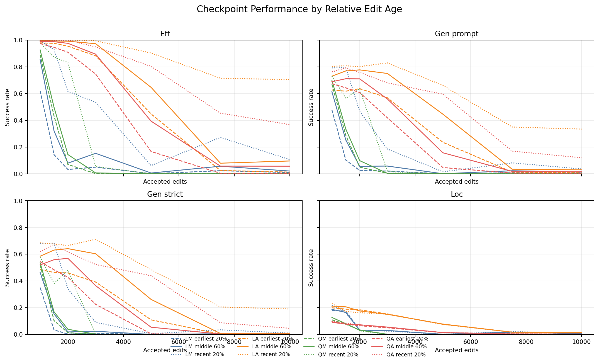

### 13.1 LM age-strata core

| t | age | request n | rewrite_acc | rephrase_acc (prompt) | rephrase_acc strict-all-2 | neighborhood_target_true_teacher_forced_acc |
|---|---|---|---|---|---|---|
| 1000 | EARLY_FIRST_20PCT | 200 | 0.6200 | 0.4775 | 0.3500 | 0.1785 |
| 1000 | MIDDLE_60PCT | 600 | 0.8533 | 0.6142 | 0.4633 | 0.1870 |
| 1000 | RECENT_LAST_20PCT | 200 | 0.9950 | 0.7925 | 0.6800 | 0.2165 |
| 1500 | EARLY_FIRST_20PCT | 300 | 0.1433 | 0.1033 | 0.0333 | 0.1750 |
| 1500 | MIDDLE_60PCT | 900 | 0.3211 | 0.2533 | 0.1533 | 0.1646 |
| 1500 | RECENT_LAST_20PCT | 300 | 0.9300 | 0.7950 | 0.6833 | 0.1620 |
| 2000 | EARLY_FIRST_20PCT | 400 | 0.0325 | 0.0250 | 0.0025 | 0.0320 |
| 2000 | MIDDLE_60PCT | 1200 | 0.0800 | 0.0563 | 0.0183 | 0.0315 |
| 2000 | RECENT_LAST_20PCT | 400 | 0.6175 | 0.4675 | 0.3400 | 0.0305 |
| 3000 | EARLY_FIRST_20PCT | 600 | 0.0500 | 0.0208 | 0.0083 | 0.0295 |
| 3000 | MIDDLE_60PCT | 1800 | 0.1533 | 0.0581 | 0.0233 | 0.0292 |
| 3000 | RECENT_LAST_20PCT | 600 | 0.5350 | 0.1858 | 0.0900 | 0.0247 |
| 5000 | EARLY_FIRST_20PCT | 1000 | 0.0010 | 0.0000 | 0.0000 | 0.0005 |
| 5000 | MIDDLE_60PCT | 3000 | 0.0060 | 0.0008 | 0.0000 | 0.0008 |
| 5000 | RECENT_LAST_20PCT | 1000 | 0.0620 | 0.0155 | 0.0050 | 0.0009 |
| 7500 | EARLY_FIRST_20PCT | 1500 | 0.0233 | 0.0080 | 0.0013 | 0.0163 |
| 7500 | MIDDLE_60PCT | 4500 | 0.0569 | 0.0229 | 0.0049 | 0.0172 |
| 7500 | RECENT_LAST_20PCT | 1500 | 0.2727 | 0.0820 | 0.0340 | 0.0210 |
| 10000 | EARLY_FIRST_20PCT | 2000 | 0.0095 | 0.0077 | 0.0020 | 0.0070 |
| 10000 | MIDDLE_60PCT | 6000 | 0.0208 | 0.0132 | 0.0050 | 0.0062 |
| 10000 | RECENT_LAST_20PCT | 2000 | 0.1065 | 0.0362 | 0.0095 | 0.0067 |

| t | age | category | request n | prompt n | NLL μ/med/p90/max | margin μ/med/p90/max |
|---|---|---|---|---|---|---|
| 1000 | EARLY_FIRST_20PCT | Rewrite / target-new | 200 | 200 | 1.9089/0.4558/5.3099/20.6062 | 0.6950/1.5109/5.5859/8.9397 |
| 1000 | EARLY_FIRST_20PCT | Rewrite / target-true | 200 | 200 | 7.9562/7.4252/14.0213/21.1894 | -7.4442/-6.7962/-2.1768/1.9082 |
| 1000 | EARLY_FIRST_20PCT | Rephrase / target-new | 200 | 400 | 2.7825/1.9637/7.1556/18.7724 | -2.1001/-1.6195/3.1677/6.8242 |
| 1000 | EARLY_FIRST_20PCT | Rephrase / target-true | 200 | 400 | 7.2635/6.8815/12.1954/16.8090 | -7.7866/-7.6780/-3.2446/2.2527 |
| 1000 | EARLY_FIRST_20PCT | Locality / target-true | 200 | 2000 | 4.6523/4.1404/8.2293/12.6383 | -7.8236/-7.5932/-3.6790/-0.5179 |
| 1000 | MIDDLE_60PCT | Rewrite / target-new | 600 | 600 | 0.6961/0.0423/2.2213/12.4228 | 3.4790/4.1974/7.4390/11.0942 |
| 1000 | MIDDLE_60PCT | Rewrite / target-true | 600 | 600 | 9.5549/9.4138/15.2809/22.3303 | -9.3340/-9.3177/-3.5402/2.9591 |
| 1000 | MIDDLE_60PCT | Rephrase / target-new | 600 | 1200 | 1.8719/0.9475/5.1300/14.1505 | -0.7761/-0.4939/4.0931/7.8378 |
| 1000 | MIDDLE_60PCT | Rephrase / target-true | 600 | 1200 | 7.9115/7.7399/12.6204/20.5536 | -8.7147/-8.7305/-3.4701/2.6266 |
| 1000 | MIDDLE_60PCT | Locality / target-true | 600 | 6000 | 4.5684/4.0021/7.8193/13.4484 | -7.7023/-7.5380/-3.5870/1.9539 |
| 1000 | RECENT_LAST_20PCT | Rewrite / target-new | 200 | 200 | 0.0548/0.0067/0.0302/6.0792 | 6.2117/6.2608/8.1682/11.2315 |
| 1000 | RECENT_LAST_20PCT | Rewrite / target-true | 200 | 200 | 12.4062/12.2238/17.4235/25.0194 | -12.3772/-12.2195/-7.6270/-0.0822 |
| 1000 | RECENT_LAST_20PCT | Rephrase / target-new | 200 | 400 | 1.0735/0.2132/3.6699/9.4718 | 1.0668/2.0509/5.0820/8.1262 |
| 1000 | RECENT_LAST_20PCT | Rephrase / target-true | 200 | 400 | 9.6830/9.3763/14.3013/21.9482 | -10.6889/-10.5883/-5.9306/-2.0107 |
| 1000 | RECENT_LAST_20PCT | Locality / target-true | 200 | 2000 | 4.4625/4.0723/7.6129/11.7136 | -7.5716/-7.4719/-3.3311/-0.1357 |
| 1500 | EARLY_FIRST_20PCT | Rewrite / target-new | 300 | 300 | 5.0579/4.3072/10.1045/16.3065 | -3.6134/-2.8602/0.6797/5.3136 |
| 1500 | EARLY_FIRST_20PCT | Rewrite / target-true | 300 | 300 | 5.2064/4.7100/10.0294/16.4331 | -3.8784/-3.4572/0.5886/2.9104 |
| 1500 | EARLY_FIRST_20PCT | Rephrase / target-new | 300 | 600 | 5.9035/5.4460/10.5774/18.8086 | -6.0552/-5.2624/-1.4113/1.4063 |
| 1500 | EARLY_FIRST_20PCT | Rephrase / target-true | 300 | 600 | 5.9248/5.3894/10.7879/19.1544 | -6.0763/-5.4565/-1.0206/3.3152 |
| 1500 | EARLY_FIRST_20PCT | Locality / target-true | 300 | 3000 | 4.9767/4.4270/8.5211/12.8659 | -7.7596/-7.2367/-3.0283/0.9804 |
| 1500 | MIDDLE_60PCT | Rewrite / target-new | 900 | 900 | 4.1538/3.4587/9.0600/23.5940 | -2.3677/-2.0129/2.8285/8.5840 |
| 1500 | MIDDLE_60PCT | Rewrite / target-true | 900 | 900 | 5.9470/5.4943/10.2910/21.2918 | -4.7199/-4.3051/-0.4889/3.3472 |
| 1500 | MIDDLE_60PCT | Rephrase / target-new | 900 | 1800 | 4.7709/4.2997/9.7305/19.6301 | -4.5277/-3.8811/0.7845/5.3537 |
| 1500 | MIDDLE_60PCT | Rephrase / target-true | 900 | 1800 | 6.2101/5.8586/10.2558/17.8091 | -6.2566/-5.7441/-1.6368/3.3800 |
| 1500 | MIDDLE_60PCT | Locality / target-true | 900 | 9000 | 5.0597/4.6177/8.6696/15.7344 | -7.7907/-7.3239/-3.0963/1.7216 |
| 1500 | RECENT_LAST_20PCT | Rewrite / target-new | 300 | 300 | 0.3960/0.0220/0.4969/14.1490 | 4.6976/5.1253/8.0245/14.8460 |
| 1500 | RECENT_LAST_20PCT | Rewrite / target-true | 300 | 300 | 10.1080/9.6171/15.1878/27.2955 | -10.0427/-9.5741/-5.0645/2.8609 |
| 1500 | RECENT_LAST_20PCT | Rephrase / target-new | 300 | 600 | 1.2166/0.3007/3.7678/12.1618 | 0.7641/1.9214/5.2817/10.4339 |
| 1500 | RECENT_LAST_20PCT | Rephrase / target-true | 300 | 600 | 8.7274/8.5140/13.3041/23.4763 | -9.5356/-9.2004/-4.5349/3.5375 |
| 1500 | RECENT_LAST_20PCT | Locality / target-true | 300 | 3000 | 4.9867/4.6291/8.1917/14.1513 | -8.0761/-7.3046/-3.0724/0.1117 |
| 2000 | EARLY_FIRST_20PCT | Rewrite / target-new | 400 | 400 | 9.4357/9.6740/13.4353/18.7327 | -6.7953/-6.5771/-2.4781/7.3277 |
| 2000 | EARLY_FIRST_20PCT | Rewrite / target-true | 400 | 400 | 9.1782/9.2088/13.5200/20.3827 | -6.5989/-6.5318/-2.0838/2.6999 |
| 2000 | EARLY_FIRST_20PCT | Rephrase / target-new | 400 | 800 | 9.9894/10.2564/13.8174/20.0522 | -8.7573/-8.5196/-4.1599/2.8471 |
| 2000 | EARLY_FIRST_20PCT | Rephrase / target-true | 400 | 800 | 9.7599/10.0036/13.2181/17.1479 | -8.6204/-8.4517/-4.0173/1.9260 |
| 2000 | EARLY_FIRST_20PCT | Locality / target-true | 400 | 4000 | 9.3705/9.3099/12.8354/17.7709 | -10.6976/-10.0394/-6.3947/-0.3891 |
| 2000 | MIDDLE_60PCT | Rewrite / target-new | 1200 | 1200 | 8.4977/8.9617/13.1405/21.3549 | -5.8170/-6.0446/-0.5465/9.9570 |
| 2000 | MIDDLE_60PCT | Rewrite / target-true | 1200 | 1200 | 9.4055/9.6970/13.3483/20.1779 | -6.8778/-6.7981/-2.5307/4.7503 |
| 2000 | MIDDLE_60PCT | Rephrase / target-new | 1200 | 2400 | 9.1712/9.4192/13.2915/19.9099 | -8.0495/-7.8692/-3.2229/4.8410 |
| 2000 | MIDDLE_60PCT | Rephrase / target-true | 1200 | 2400 | 9.5724/9.7066/13.3064/19.3710 | -8.4091/-8.1620/-3.9945/2.4631 |
| 2000 | MIDDLE_60PCT | Locality / target-true | 1200 | 12000 | 9.2910/9.4325/12.4343/17.2029 | -10.6357/-10.2287/-6.1518/0.6501 |
| 2000 | RECENT_LAST_20PCT | Rewrite / target-new | 400 | 400 | 2.9481/0.8936/8.6711/14.9701 | 1.6942/2.0928/7.9489/14.8484 |
| 2000 | RECENT_LAST_20PCT | Rewrite / target-true | 400 | 400 | 11.2345/10.9574/16.5241/25.4640 | -9.7254/-8.9138/-4.2133/4.1541 |
| 2000 | RECENT_LAST_20PCT | Rephrase / target-new | 400 | 800 | 4.2082/3.3803/9.8355/13.9821 | -2.0212/-2.1392/5.2345/13.0071 |
| 2000 | RECENT_LAST_20PCT | Rephrase / target-true | 400 | 800 | 10.8858/10.6143/15.3993/24.4370 | -10.6193/-9.8435/-5.1188/0.4301 |
| 2000 | RECENT_LAST_20PCT | Locality / target-true | 400 | 4000 | 9.3499/9.3176/12.6337/16.9963 | -10.6735/-10.0990/-6.6467/-2.2443 |
| 3000 | EARLY_FIRST_20PCT | Rewrite / target-new | 600 | 600 | 9.4812/9.7072/13.6645/19.1763 | -6.8962/-7.0554/-2.1657/5.4010 |
| 3000 | EARLY_FIRST_20PCT | Rewrite / target-true | 600 | 600 | 9.5246/9.7518/13.4566/20.1217 | -6.9745/-7.0253/-2.5816/3.5604 |
| 3000 | EARLY_FIRST_20PCT | Rephrase / target-new | 600 | 1200 | 10.3029/10.4488/14.0599/17.7773 | -8.9355/-8.9100/-4.8086/1.2241 |
| 3000 | EARLY_FIRST_20PCT | Rephrase / target-true | 600 | 1200 | 10.3750/10.4914/14.1018/17.0441 | -8.9886/-8.9824/-5.0089/-0.0122 |
| 3000 | EARLY_FIRST_20PCT | Locality / target-true | 600 | 6000 | 9.6500/9.8372/13.1854/17.2158 | -10.3002/-10.2890/-6.1494/-0.3056 |
| 3000 | MIDDLE_60PCT | Rewrite / target-new | 1800 | 1800 | 7.6096/7.9219/12.7057/17.6303 | -4.9324/-5.3184/1.3669/12.6063 |
| 3000 | MIDDLE_60PCT | Rewrite / target-true | 1800 | 1800 | 9.7263/9.8832/13.6346/29.6915 | -7.3986/-7.3922/-2.7577/5.1640 |
| 3000 | MIDDLE_60PCT | Rephrase / target-new | 1800 | 3600 | 9.2631/9.6172/13.3443/17.7472 | -8.0464/-8.3586/-3.2597/6.5149 |
| 3000 | MIDDLE_60PCT | Rephrase / target-true | 1800 | 3600 | 10.3685/10.6273/13.9332/19.0882 | -9.0933/-9.1751/-5.0049/1.2153 |
| 3000 | MIDDLE_60PCT | Locality / target-true | 1800 | 18000 | 9.8776/10.1484/13.4013/19.0167 | -10.4632/-10.5715/-6.3260/0.0360 |
| 3000 | RECENT_LAST_20PCT | Rewrite / target-new | 600 | 600 | 3.3637/2.6363/7.7942/14.7715 | 0.1135/0.4423/5.0228/9.1240 |
| 3000 | RECENT_LAST_20PCT | Rewrite / target-true | 600 | 600 | 9.7943/10.0034/13.8653/19.9477 | -8.0459/-7.9626/-3.6970/3.1745 |
| 3000 | RECENT_LAST_20PCT | Rephrase / target-new | 600 | 1200 | 6.4891/6.5815/10.7357/15.8000 | -5.3516/-5.3184/-0.2867/6.0895 |
| 3000 | RECENT_LAST_20PCT | Rephrase / target-true | 600 | 1200 | 10.2214/10.2593/13.8235/19.0397 | -9.0578/-9.1338/-4.6384/-0.7897 |
| 3000 | RECENT_LAST_20PCT | Locality / target-true | 600 | 6000 | 9.7688/9.9557/13.6351/15.6420 | -10.4152/-10.3828/-6.3663/-0.2589 |
| 5000 | EARLY_FIRST_20PCT | Rewrite / target-new | 1000 | 1000 | 13.1820/13.2882/15.9337/19.2993 | -9.2561/-9.3176/-6.2222/2.0456 |
| 5000 | EARLY_FIRST_20PCT | Rewrite / target-true | 1000 | 1000 | 13.2737/13.4272/15.9702/19.4765 | -9.3271/-9.3455/-6.2285/-0.7301 |
| 5000 | EARLY_FIRST_20PCT | Rephrase / target-new | 1000 | 2000 | 13.5504/13.5988/15.9982/19.9061 | -10.0563/-10.0192/-7.6145/-2.3408 |
| 5000 | EARLY_FIRST_20PCT | Rephrase / target-true | 1000 | 2000 | 13.7094/13.8169/16.2551/19.0828 | -10.2445/-10.1975/-7.6428/-2.1278 |
| 5000 | EARLY_FIRST_20PCT | Locality / target-true | 1000 | 10000 | 13.3983/13.5097/15.7446/19.3128 | -11.9541/-11.9167/-9.2688/-5.9773 |
| 5000 | MIDDLE_60PCT | Rewrite / target-new | 3000 | 3000 | 12.8457/13.1784/15.8448/20.4414 | -8.8927/-9.1459/-5.5508/3.9363 |
| 5000 | MIDDLE_60PCT | Rewrite / target-true | 3000 | 3000 | 13.3037/13.4536/16.2989/20.5259 | -9.3405/-9.4145/-6.1249/1.6146 |
| 5000 | MIDDLE_60PCT | Rephrase / target-new | 3000 | 6000 | 13.4467/13.6212/16.0238/19.4359 | -9.9624/-9.9824/-7.2655/-0.2928 |
| 5000 | MIDDLE_60PCT | Rephrase / target-true | 3000 | 6000 | 13.6599/13.7240/16.3480/19.9028 | -10.1638/-10.1569/-7.4256/-0.9066 |
| 5000 | MIDDLE_60PCT | Locality / target-true | 3000 | 30000 | 13.4109/13.4514/15.8115/19.4642 | -11.9723/-11.9680/-9.3450/-4.5169 |
| 5000 | RECENT_LAST_20PCT | Rewrite / target-new | 1000 | 1000 | 10.7427/11.5142/15.0859/18.4399 | -6.7062/-7.2313/-1.4989/6.4890 |
| 5000 | RECENT_LAST_20PCT | Rewrite / target-true | 1000 | 1000 | 12.9273/13.1548/16.0667/19.3118 | -8.9929/-9.0960/-5.8395/0.0496 |
| 5000 | RECENT_LAST_20PCT | Rephrase / target-new | 1000 | 2000 | 12.4151/12.6899/15.5849/17.8511 | -9.0371/-9.3229/-5.8188/3.7376 |
| 5000 | RECENT_LAST_20PCT | Rephrase / target-true | 1000 | 2000 | 13.4650/13.5350/16.1666/19.7703 | -9.9374/-9.8710/-7.2903/-2.4218 |
| 5000 | RECENT_LAST_20PCT | Locality / target-true | 1000 | 10000 | 13.3919/13.4880/15.7226/19.6222 | -11.8953/-11.9556/-9.3783/-5.0887 |
| 7500 | EARLY_FIRST_20PCT | Rewrite / target-new | 1500 | 1500 | 11.0939/11.4853/15.1106/22.1856 | -8.7476/-8.8265/-3.9785/6.7977 |
| 7500 | EARLY_FIRST_20PCT | Rewrite / target-true | 1500 | 1500 | 11.2341/11.5939/14.9790/21.7890 | -8.8949/-8.9423/-4.1865/4.7376 |
| 7500 | EARLY_FIRST_20PCT | Rephrase / target-new | 1500 | 3000 | 11.7192/11.9796/14.7319/21.1240 | -9.9640/-9.9133/-6.2187/0.2453 |
| 7500 | EARLY_FIRST_20PCT | Rephrase / target-true | 1500 | 3000 | 11.8578/12.0915/14.7934/20.1803 | -10.0763/-9.9164/-6.4047/-0.6181 |
| 7500 | EARLY_FIRST_20PCT | Locality / target-true | 1500 | 15000 | 11.3834/11.8699/14.4903/18.8134 | -13.2211/-13.0670/-8.7025/-0.9804 |
| 7500 | MIDDLE_60PCT | Rewrite / target-new | 4500 | 4500 | 9.5627/10.0452/14.0071/22.5646 | -7.1186/-7.3554/-1.4647/8.4879 |
| 7500 | MIDDLE_60PCT | Rewrite / target-true | 4500 | 4500 | 11.1869/11.5416/14.9238/22.8085 | -8.8304/-8.8177/-4.2697/4.6562 |
| 7500 | MIDDLE_60PCT | Rephrase / target-new | 4500 | 9000 | 10.9871/11.2686/14.3098/22.7909 | -9.4032/-9.3596/-5.2172/3.3989 |
| 7500 | MIDDLE_60PCT | Rephrase / target-true | 4500 | 9000 | 11.7740/12.0369/14.7589/24.6082 | -10.0637/-9.9043/-6.1382/1.3359 |
| 7500 | MIDDLE_60PCT | Locality / target-true | 4500 | 45000 | 11.3984/11.8172/14.5329/19.0069 | -13.2387/-13.0113/-8.6992/-0.3649 |
| 7500 | RECENT_LAST_20PCT | Rewrite / target-new | 1500 | 1500 | 6.2835/6.1293/12.1976/20.7461 | -3.5176/-3.6888/3.0157/10.9019 |
| 7500 | RECENT_LAST_20PCT | Rewrite / target-true | 1500 | 1500 | 10.7263/10.9791/14.5267/22.4686 | -8.6555/-8.5919/-4.2870/2.5405 |
| 7500 | RECENT_LAST_20PCT | Rephrase / target-new | 1500 | 3000 | 9.4626/9.8588/13.4686/17.6405 | -8.0208/-8.3784/-2.7134/9.3279 |
| 7500 | RECENT_LAST_20PCT | Rephrase / target-true | 1500 | 3000 | 11.4464/11.6074/14.5007/19.2544 | -9.7922/-9.6104/-5.9052/-0.1280 |
| 7500 | RECENT_LAST_20PCT | Locality / target-true | 1500 | 15000 | 11.1157/11.4655/14.4905/18.4451 | -13.0076/-12.7482/-8.4931/-2.0751 |
| 10000 | EARLY_FIRST_20PCT | Rewrite / target-new | 2000 | 2000 | 12.0690/12.1842/16.3020/28.0700 | -10.1353/-9.6794/-4.9038/5.3599 |
| 10000 | EARLY_FIRST_20PCT | Rewrite / target-true | 2000 | 2000 | 12.3048/12.3081/16.3412/29.9130 | -10.3638/-9.8921/-5.5541/1.6757 |
| 10000 | EARLY_FIRST_20PCT | Rephrase / target-new | 2000 | 4000 | 12.1534/12.3648/15.1611/23.0916 | -11.1937/-10.7884/-6.9574/1.7906 |
| 10000 | EARLY_FIRST_20PCT | Rephrase / target-true | 2000 | 4000 | 12.2371/12.3352/15.3675/23.4629 | -11.2330/-10.7039/-7.0033/0.1416 |
| 10000 | EARLY_FIRST_20PCT | Locality / target-true | 2000 | 20000 | 12.3565/12.5347/15.5908/23.4210 | -15.8398/-15.6336/-10.7738/-3.8093 |
| 10000 | MIDDLE_60PCT | Rewrite / target-new | 6000 | 6000 | 11.3182/11.6379/15.7207/26.3003 | -9.3732/-9.1553/-4.1951/12.2041 |
| 10000 | MIDDLE_60PCT | Rewrite / target-true | 6000 | 6000 | 12.1721/12.2817/16.2624/32.0345 | -10.2436/-9.8848/-5.3851/3.2794 |
| 10000 | MIDDLE_60PCT | Rephrase / target-new | 6000 | 12000 | 11.7888/12.0487/15.0214/22.8630 | -10.7845/-10.3943/-6.3751/3.6708 |
| 10000 | MIDDLE_60PCT | Rephrase / target-true | 6000 | 12000 | 12.2067/12.3395/15.2342/24.9933 | -11.1859/-10.6673/-6.9348/2.0992 |
| 10000 | MIDDLE_60PCT | Locality / target-true | 6000 | 60000 | 12.3285/12.4639/15.5853/24.3893 | -15.7374/-15.5819/-10.7212/-2.7562 |
| 10000 | RECENT_LAST_20PCT | Rewrite / target-new | 2000 | 2000 | 8.5625/9.0014/13.9358/26.1821 | -6.4044/-6.7476/0.2320/10.7345 |
| 10000 | RECENT_LAST_20PCT | Rewrite / target-true | 2000 | 2000 | 11.9259/12.0718/15.6976/26.9731 | -10.0230/-9.7591/-5.2664/5.0930 |
| 10000 | RECENT_LAST_20PCT | Rephrase / target-new | 2000 | 4000 | 10.6318/11.0066/14.3692/23.0007 | -9.6684/-9.5694/-4.8232/3.1339 |
| 10000 | RECENT_LAST_20PCT | Rephrase / target-true | 2000 | 4000 | 12.1336/12.3557/15.1562/25.9596 | -11.0962/-10.6679/-7.0357/1.6682 |
| 10000 | RECENT_LAST_20PCT | Locality / target-true | 2000 | 20000 | 12.4990/12.6701/15.5616/24.2461 | -15.9545/-15.7554/-10.8708/-4.8990 |

### 13.2 LA age-strata core

| t | age | request n | rewrite_acc | rephrase_acc (prompt) | rephrase_acc strict-all-2 | neighborhood_target_true_teacher_forced_acc |
|---|---|---|---|---|---|---|
| 1000 | EARLY_FIRST_20PCT | 200 | 0.9800 | 0.6275 | 0.4850 | 0.1990 |
| 1000 | MIDDLE_60PCT | 600 | 0.9967 | 0.7308 | 0.5850 | 0.2117 |
| 1000 | RECENT_LAST_20PCT | 200 | 1.0000 | 0.8050 | 0.6850 | 0.2310 |
| 1500 | EARLY_FIRST_20PCT | 300 | 0.9767 | 0.6183 | 0.4633 | 0.1890 |
| 1500 | MIDDLE_60PCT | 900 | 0.9944 | 0.7700 | 0.6311 | 0.2066 |
| 1500 | RECENT_LAST_20PCT | 300 | 1.0000 | 0.8083 | 0.6767 | 0.1713 |
| 2000 | EARLY_FIRST_20PCT | 400 | 0.9550 | 0.6375 | 0.4600 | 0.1840 |
| 2000 | MIDDLE_60PCT | 1200 | 0.9925 | 0.7779 | 0.6417 | 0.1755 |
| 2000 | RECENT_LAST_20PCT | 400 | 1.0000 | 0.8025 | 0.6650 | 0.1623 |
| 3000 | EARLY_FIRST_20PCT | 600 | 0.8833 | 0.5692 | 0.3917 | 0.1528 |
| 3000 | MIDDLE_60PCT | 1800 | 0.9739 | 0.7511 | 0.6033 | 0.1503 |
| 3000 | RECENT_LAST_20PCT | 600 | 0.9950 | 0.8300 | 0.7117 | 0.1512 |
| 5000 | EARLY_FIRST_20PCT | 1000 | 0.4480 | 0.2360 | 0.1090 | 0.0754 |
| 5000 | MIDDLE_60PCT | 3000 | 0.6470 | 0.4467 | 0.2617 | 0.0772 |
| 5000 | RECENT_LAST_20PCT | 1000 | 0.9040 | 0.6620 | 0.4850 | 0.0745 |
| 7500 | EARLY_FIRST_20PCT | 1500 | 0.0247 | 0.0130 | 0.0027 | 0.0167 |
| 7500 | MIDDLE_60PCT | 4500 | 0.0796 | 0.0343 | 0.0067 | 0.0165 |
| 7500 | RECENT_LAST_20PCT | 1500 | 0.7153 | 0.3503 | 0.2053 | 0.0175 |
| 10000 | EARLY_FIRST_20PCT | 2000 | 0.0130 | 0.0075 | 0.0005 | 0.0142 |
| 10000 | MIDDLE_60PCT | 6000 | 0.0962 | 0.0298 | 0.0075 | 0.0146 |
| 10000 | RECENT_LAST_20PCT | 2000 | 0.7050 | 0.3347 | 0.1900 | 0.0126 |

| t | age | category | request n | prompt n | NLL μ/med/p90/max | margin μ/med/p90/max |
|---|---|---|---|---|---|---|
| 1000 | EARLY_FIRST_20PCT | Rewrite / target-new | 200 | 200 | 0.0677/0.0012/0.0085/5.0138 | 7.5499/7.6665/9.7519/11.9039 |
| 1000 | EARLY_FIRST_20PCT | Rewrite / target-true | 200 | 200 | 13.6640/13.0316/20.0197/27.4946 | -13.7311/-13.1779/-8.2110/-2.4412 |
| 1000 | EARLY_FIRST_20PCT | Rephrase / target-new | 200 | 400 | 2.0369/0.9388/5.1384/13.0080 | -0.8101/-0.3739/5.3635/8.2393 |
| 1000 | EARLY_FIRST_20PCT | Rephrase / target-true | 200 | 400 | 9.0733/9.0820/14.3699/19.1652 | -10.1719/-10.3215/-4.3678/3.9761 |
| 1000 | EARLY_FIRST_20PCT | Locality / target-true | 200 | 2000 | 4.9337/4.6210/8.5153/11.9822 | -9.4146/-9.5663/-5.1482/0.3924 |
| 1000 | MIDDLE_60PCT | Rewrite / target-new | 600 | 600 | 0.0270/0.0010/0.0041/9.9790 | 8.0709/8.1631/9.7845/11.4739 |
| 1000 | MIDDLE_60PCT | Rewrite / target-true | 600 | 600 | 14.7346/14.4604/20.0423/27.7559 | -14.8254/-14.5159/-9.8647/-3.6701 |
| 1000 | MIDDLE_60PCT | Rephrase / target-new | 600 | 1200 | 1.2527/0.3648/3.5256/11.4530 | 0.4771/1.0229/5.7427/9.5363 |
| 1000 | MIDDLE_60PCT | Rephrase / target-true | 600 | 1200 | 10.1741/10.0446/15.2626/23.8417 | -11.4206/-11.2239/-5.9821/-0.1264 |
| 1000 | MIDDLE_60PCT | Locality / target-true | 600 | 6000 | 4.8052/4.5256/7.7796/13.9881 | -9.2677/-9.1772/-4.6945/1.2239 |
| 1000 | RECENT_LAST_20PCT | Rewrite / target-new | 200 | 200 | 0.0023/0.0012/0.0055/0.0293 | 7.8523/8.0025/9.2876/11.2882 |
| 1000 | RECENT_LAST_20PCT | Rewrite / target-true | 200 | 200 | 14.7029/14.6650/19.4475/27.5095 | -14.7006/-14.6637/-9.6558/-3.5761 |
| 1000 | RECENT_LAST_20PCT | Rephrase / target-new | 200 | 400 | 0.9234/0.1421/3.0924/9.8379 | 1.5054/2.1046/5.8686/8.1441 |
| 1000 | RECENT_LAST_20PCT | Rephrase / target-true | 200 | 400 | 10.9924/10.9960/16.1482/23.4062 | -12.1163/-12.1955/-6.9352/-1.0767 |
| 1000 | RECENT_LAST_20PCT | Locality / target-true | 200 | 2000 | 4.7000/4.4596/7.8862/11.4339 | -9.0111/-8.8593/-4.2262/0.7194 |
| 1500 | EARLY_FIRST_20PCT | Rewrite / target-new | 300 | 300 | 0.0883/0.0016/0.0202/5.5801 | 7.1463/7.4605/9.3753/11.8922 |
| 1500 | EARLY_FIRST_20PCT | Rewrite / target-true | 300 | 300 | 13.1394/12.4456/19.1882/26.4913 | -13.2477/-12.5379/-8.3555/-1.0102 |
| 1500 | EARLY_FIRST_20PCT | Rephrase / target-new | 300 | 600 | 1.9897/0.9359/5.4175/12.8721 | -0.8877/-0.7252/5.1855/8.9994 |
| 1500 | EARLY_FIRST_20PCT | Rephrase / target-true | 300 | 600 | 8.8752/8.8770/13.4089/19.7487 | -10.0464/-10.2185/-4.6127/3.6797 |
| 1500 | EARLY_FIRST_20PCT | Locality / target-true | 300 | 3000 | 4.9395/4.6404/8.2472/13.4409 | -9.6495/-9.6257/-4.9677/-1.6761 |
| 1500 | MIDDLE_60PCT | Rewrite / target-new | 900 | 900 | 0.0457/0.0014/0.0079/12.1049 | 7.5724/7.7375/9.3698/11.7444 |
| 1500 | MIDDLE_60PCT | Rewrite / target-true | 900 | 900 | 14.3482/14.2284/19.8612/28.6101 | -14.3918/-14.2668/-9.1731/-0.9168 |
| 1500 | MIDDLE_60PCT | Rephrase / target-new | 900 | 1800 | 1.0485/0.2729/3.1530/10.2396 | 0.9420/1.5093/5.6570/8.5350 |
| 1500 | MIDDLE_60PCT | Rephrase / target-true | 900 | 1800 | 10.2951/10.1637/15.3231/23.2325 | -11.5017/-11.3266/-6.2770/4.0184 |
| 1500 | MIDDLE_60PCT | Locality / target-true | 900 | 9000 | 4.9276/4.6336/8.1424/15.1797 | -9.3982/-9.1949/-4.5966/-0.0087 |
| 1500 | RECENT_LAST_20PCT | Rewrite / target-new | 300 | 300 | 0.0042/0.0013/0.0079/0.3164 | 7.8272/7.7759/9.7766/11.9381 |
| 1500 | RECENT_LAST_20PCT | Rewrite / target-true | 300 | 300 | 14.1293/13.8824/19.0723/26.4617 | -14.2773/-14.0785/-9.7588/-5.9842 |
| 1500 | RECENT_LAST_20PCT | Rephrase / target-new | 300 | 600 | 0.7868/0.2400/2.3345/7.0827 | 1.3709/1.8562/5.6177/8.8910 |
| 1500 | RECENT_LAST_20PCT | Rephrase / target-true | 300 | 600 | 10.1002/10.1095/14.2535/21.9267 | -11.3319/-11.2617/-6.7377/-2.8597 |
| 1500 | RECENT_LAST_20PCT | Locality / target-true | 300 | 3000 | 5.0027/4.7071/8.1711/11.4233 | -9.6239/-9.5375/-5.3340/-0.5844 |
| 2000 | EARLY_FIRST_20PCT | Rewrite / target-new | 400 | 400 | 0.2624/0.0023/0.0759/15.7695 | 6.4604/7.2619/9.3550/11.5994 |
| 2000 | EARLY_FIRST_20PCT | Rewrite / target-true | 400 | 400 | 12.8969/12.4218/19.1177/25.7235 | -12.9756/-12.5698/-7.6606/-0.5207 |
| 2000 | EARLY_FIRST_20PCT | Rephrase / target-new | 400 | 800 | 1.9481/1.0015/5.2664/12.6918 | -0.9565/-0.4753/4.6077/8.8263 |
| 2000 | EARLY_FIRST_20PCT | Rephrase / target-true | 400 | 800 | 8.8135/8.6570/13.3441/22.7753 | -10.0281/-10.0283/-4.5229/0.5343 |
| 2000 | EARLY_FIRST_20PCT | Locality / target-true | 400 | 4000 | 5.0845/4.6632/8.5172/13.7650 | -9.7872/-9.5124/-4.9875/-2.0104 |
| 2000 | MIDDLE_60PCT | Rewrite / target-new | 1200 | 1200 | 0.0398/0.0019/0.0145/9.4634 | 7.2420/7.4253/9.2844/11.9242 |
| 2000 | MIDDLE_60PCT | Rewrite / target-true | 1200 | 1200 | 13.9404/13.6901/19.3894/28.9533 | -13.9892/-13.7799/-9.0274/-1.0824 |
| 2000 | MIDDLE_60PCT | Rephrase / target-new | 1200 | 2400 | 1.0176/0.2740/3.1119/10.4385 | 0.9273/1.5968/5.2781/9.2710 |
| 2000 | MIDDLE_60PCT | Rephrase / target-true | 1200 | 2400 | 10.0573/9.9771/14.6775/22.7103 | -11.2077/-11.1013/-6.1576/4.3083 |
| 2000 | MIDDLE_60PCT | Locality / target-true | 1200 | 12000 | 5.2131/4.8938/8.6138/14.9725 | -9.7828/-9.6174/-5.3487/0.2817 |
| 2000 | RECENT_LAST_20PCT | Rewrite / target-new | 400 | 400 | 0.0048/0.0018/0.0107/0.0816 | 7.4690/7.5136/9.2964/12.4815 |
| 2000 | RECENT_LAST_20PCT | Rewrite / target-true | 400 | 400 | 14.3385/14.0299/20.0388/26.5293 | -14.3857/-14.0577/-9.3124/-4.4669 |
| 2000 | RECENT_LAST_20PCT | Rephrase / target-new | 400 | 800 | 0.8959/0.1906/2.8786/7.7773 | 1.2089/2.0740/5.3027/8.1280 |
| 2000 | RECENT_LAST_20PCT | Rephrase / target-true | 400 | 800 | 10.7180/10.5425/15.3451/21.8551 | -11.8110/-11.5131/-7.0456/0.7612 |
| 2000 | RECENT_LAST_20PCT | Locality / target-true | 400 | 4000 | 5.3645/4.9423/8.9168/14.0679 | -9.7437/-9.6398/-5.2158/0.2848 |
| 3000 | EARLY_FIRST_20PCT | Rewrite / target-new | 600 | 600 | 0.5732/0.0087/1.3561/14.0989 | 4.7279/5.8379/8.5202/11.4981 |
| 3000 | EARLY_FIRST_20PCT | Rewrite / target-true | 600 | 600 | 11.4331/10.9681/17.6635/25.2421 | -11.3438/-10.9584/-5.3224/3.7490 |
| 3000 | EARLY_FIRST_20PCT | Rephrase / target-new | 600 | 1200 | 2.2311/1.2813/5.9668/14.1846 | -1.4677/-1.0375/4.1276/9.1948 |
| 3000 | EARLY_FIRST_20PCT | Rephrase / target-true | 600 | 1200 | 8.1555/7.9215/12.7401/21.2827 | -9.2319/-9.1329/-4.1611/1.8336 |
| 3000 | EARLY_FIRST_20PCT | Locality / target-true | 600 | 6000 | 5.5602/5.0959/8.9799/14.1044 | -10.1303/-9.9387/-5.5845/-1.5050 |
| 3000 | MIDDLE_60PCT | Rewrite / target-new | 1800 | 1800 | 0.1494/0.0040/0.0669/13.0631 | 6.3064/6.6932/8.8951/12.2207 |
| 3000 | MIDDLE_60PCT | Rewrite / target-true | 1800 | 1800 | 12.9096/12.6533/18.6734/30.9205 | -12.9165/-12.6865/-7.3794/3.9481 |
| 3000 | MIDDLE_60PCT | Rephrase / target-new | 1800 | 3600 | 1.2069/0.3999/3.4275/11.4368 | 0.4656/1.1646/4.9346/9.5003 |
| 3000 | MIDDLE_60PCT | Rephrase / target-true | 1800 | 3600 | 9.6804/9.5230/14.1617/26.9241 | -10.7173/-10.5734/-5.7932/2.0048 |
| 3000 | MIDDLE_60PCT | Locality / target-true | 1800 | 18000 | 5.6145/5.2523/9.0330/16.4148 | -10.2239/-9.9910/-5.9752/-1.3165 |
| 3000 | RECENT_LAST_20PCT | Rewrite / target-new | 600 | 600 | 0.0724/0.0027/0.0170/19.7149 | 7.0719/7.1091/9.1047/13.9645 |
| 3000 | RECENT_LAST_20PCT | Rewrite / target-true | 600 | 600 | 13.8139/13.5777/19.3686/27.1157 | -13.8655/-13.5998/-8.6298/-4.3936 |
| 3000 | RECENT_LAST_20PCT | Rephrase / target-new | 600 | 1200 | 0.8005/0.1635/2.3128/17.2303 | 1.5617/2.1776/5.4441/9.8526 |
| 3000 | RECENT_LAST_20PCT | Rephrase / target-true | 600 | 1200 | 10.7113/10.5495/15.6762/24.3995 | -11.7638/-11.5989/-6.6258/-1.3840 |
| 3000 | RECENT_LAST_20PCT | Locality / target-true | 600 | 6000 | 5.4452/5.0434/8.6811/13.9846 | -10.0222/-9.8119/-5.7799/0.5414 |
| 5000 | EARLY_FIRST_20PCT | Rewrite / target-new | 1000 | 1000 | 3.9131/1.9420/10.4424/22.1290 | -1.7251/-1.0403/5.6798/11.3067 |
| 5000 | EARLY_FIRST_20PCT | Rewrite / target-true | 1000 | 1000 | 8.6071/8.4666/13.7260/21.4866 | -8.0167/-7.8483/-2.5664/3.2388 |
| 5000 | EARLY_FIRST_20PCT | Rephrase / target-new | 1000 | 2000 | 5.1156/4.6823/9.7844/17.2261 | -5.5381/-5.2592/0.1466/5.0145 |
| 5000 | EARLY_FIRST_20PCT | Rephrase / target-true | 1000 | 2000 | 7.3983/7.2631/11.3960/18.0675 | -8.0431/-7.8682/-3.5873/2.1497 |
| 5000 | EARLY_FIRST_20PCT | Locality / target-true | 1000 | 10000 | 7.1164/6.9645/10.9896/17.3691 | -11.7285/-11.2439/-6.9186/-2.6219 |
| 5000 | MIDDLE_60PCT | Rewrite / target-new | 3000 | 3000 | 2.2895/0.2811/8.0151/22.9588 | 0.9379/2.2699/6.9904/11.5780 |
| 5000 | MIDDLE_60PCT | Rewrite / target-true | 3000 | 3000 | 9.9290/9.6472/15.4311/27.9580 | -9.5635/-9.3258/-4.0585/3.7073 |
| 5000 | MIDDLE_60PCT | Rephrase / target-new | 3000 | 6000 | 3.3991/2.6263/7.6612/18.4716 | -3.3590/-2.9722/2.4764/9.6342 |
| 5000 | MIDDLE_60PCT | Rephrase / target-true | 3000 | 6000 | 8.4786/8.2103/12.7616/23.7513 | -9.3104/-8.9606/-4.5712/2.3447 |
| 5000 | MIDDLE_60PCT | Locality / target-true | 3000 | 30000 | 7.0249/6.7952/10.6919/16.7280 | -11.6745/-11.0172/-7.1213/-2.4475 |
| 5000 | RECENT_LAST_20PCT | Rewrite / target-new | 1000 | 1000 | 0.4975/0.0106/1.0045/15.7417 | 4.9791/5.7952/8.4935/13.7433 |
| 5000 | RECENT_LAST_20PCT | Rewrite / target-true | 1000 | 1000 | 12.3930/12.1480/17.7034/27.0184 | -12.3258/-12.0405/-7.2466/-0.4080 |
| 5000 | RECENT_LAST_20PCT | Rephrase / target-new | 1000 | 2000 | 1.7593/0.9772/4.7543/12.6467 | -0.5828/-0.0967/4.5539/9.4790 |
| 5000 | RECENT_LAST_20PCT | Rephrase / target-true | 1000 | 2000 | 9.8165/9.5971/14.2186/24.1315 | -10.8030/-10.7068/-5.9074/0.1864 |
| 5000 | RECENT_LAST_20PCT | Locality / target-true | 1000 | 10000 | 7.0065/6.9245/10.4794/15.9894 | -11.5607/-11.1037/-7.1424/-1.9165 |
| 7500 | EARLY_FIRST_20PCT | Rewrite / target-new | 1500 | 1500 | 9.5487/9.4283/14.5128/28.8199 | -8.1369/-7.9788/-2.9694/4.9053 |
| 7500 | EARLY_FIRST_20PCT | Rewrite / target-true | 1500 | 1500 | 9.7448/9.7460/14.5479/26.5354 | -8.3358/-8.1207/-3.1030/2.6604 |
| 7500 | EARLY_FIRST_20PCT | Rephrase / target-new | 1500 | 3000 | 9.8844/9.9872/13.9535/19.9436 | -9.8796/-9.6434/-4.9441/1.8477 |
| 7500 | EARLY_FIRST_20PCT | Rephrase / target-true | 1500 | 3000 | 9.7651/9.7501/13.7058/20.5335 | -9.7749/-9.4020/-5.0804/2.9230 |
| 7500 | EARLY_FIRST_20PCT | Locality / target-true | 1500 | 15000 | 9.6549/9.7729/12.9091/17.0630 | -13.8022/-13.6889/-8.8909/-3.7328 |
| 7500 | MIDDLE_60PCT | Rewrite / target-new | 4500 | 4500 | 8.5301/8.7661/13.9136/25.3379 | -7.0120/-7.1454/-0.6035/8.9572 |
| 7500 | MIDDLE_60PCT | Rewrite / target-true | 4500 | 4500 | 9.9213/9.8503/14.7815/26.0895 | -8.5680/-8.3683/-3.5115/3.8951 |
| 7500 | MIDDLE_60PCT | Rephrase / target-new | 4500 | 9000 | 9.3531/9.3502/13.6612/20.5783 | -9.4542/-9.3533/-4.4007/7.4813 |
| 7500 | MIDDLE_60PCT | Rephrase / target-true | 4500 | 9000 | 9.9603/9.9516/13.9482/21.6737 | -10.0391/-9.8251/-5.4071/2.3272 |
| 7500 | MIDDLE_60PCT | Locality / target-true | 4500 | 45000 | 9.7680/9.7955/13.0221/18.7065 | -14.0963/-13.9085/-9.2314/-4.0520 |
| 7500 | RECENT_LAST_20PCT | Rewrite / target-new | 1500 | 1500 | 1.9475/0.0942/7.1777/23.9806 | 2.3502/3.8720/7.9794/14.7353 |
| 7500 | RECENT_LAST_20PCT | Rewrite / target-true | 1500 | 1500 | 11.6324/11.3212/17.2426/27.9338 | -11.0539/-10.6221/-5.4856/-0.1005 |
| 7500 | RECENT_LAST_20PCT | Rephrase / target-new | 1500 | 3000 | 4.8934/4.5163/10.1483/18.3930 | -4.5234/-4.9526/2.8570/10.3645 |
| 7500 | RECENT_LAST_20PCT | Rephrase / target-true | 1500 | 3000 | 10.1835/10.1629/14.2041/22.8069 | -10.5991/-10.4287/-5.9096/0.1350 |
| 7500 | RECENT_LAST_20PCT | Locality / target-true | 1500 | 15000 | 9.6967/9.5919/13.0650/17.6768 | -13.9372/-13.8980/-9.1410/-3.0300 |
| 10000 | EARLY_FIRST_20PCT | Rewrite / target-new | 2000 | 2000 | 10.5559/10.8113/14.5203/24.2509 | -8.3964/-8.3365/-3.8897/6.4562 |
| 10000 | EARLY_FIRST_20PCT | Rewrite / target-true | 2000 | 2000 | 10.6289/10.8420/14.6088/24.8168 | -8.4664/-8.3155/-4.0749/1.9270 |
| 10000 | EARLY_FIRST_20PCT | Rephrase / target-new | 2000 | 4000 | 10.6306/10.6944/14.0958/19.1604 | -9.7856/-9.6422/-5.6712/0.2121 |
| 10000 | EARLY_FIRST_20PCT | Rephrase / target-true | 2000 | 4000 | 10.5994/10.7448/13.9224/19.1762 | -9.7719/-9.7013/-5.8488/0.0761 |
| 10000 | EARLY_FIRST_20PCT | Locality / target-true | 2000 | 20000 | 10.3385/10.3625/13.3406/18.0301 | -12.8978/-12.6835/-8.9982/-4.0842 |
| 10000 | MIDDLE_60PCT | Rewrite / target-new | 6000 | 6000 | 8.8561/9.3039/13.8832/23.2183 | -6.5625/-6.9323/-0.1851/11.4908 |
| 10000 | MIDDLE_60PCT | Rewrite / target-true | 6000 | 6000 | 10.5480/10.6544/14.6573/24.1864 | -8.5087/-8.3732/-4.0134/4.3608 |
| 10000 | MIDDLE_60PCT | Rephrase / target-new | 6000 | 12000 | 9.9189/10.1167/13.6899/20.4028 | -9.1843/-9.1995/-4.8472/5.9674 |
| 10000 | MIDDLE_60PCT | Rephrase / target-true | 6000 | 12000 | 10.6416/10.6990/14.0320/22.9689 | -9.8883/-9.7237/-5.8601/0.5545 |
| 10000 | MIDDLE_60PCT | Locality / target-true | 6000 | 60000 | 10.4380/10.5288/13.3622/19.0954 | -13.0540/-12.8516/-9.1889/-1.2668 |
| 10000 | RECENT_LAST_20PCT | Rewrite / target-new | 2000 | 2000 | 2.1181/0.2677/7.0290/17.0214 | 2.2240/3.2811/7.5057/18.5015 |
| 10000 | RECENT_LAST_20PCT | Rewrite / target-true | 2000 | 2000 | 11.8834/11.5582/16.5078/32.4774 | -10.9939/-10.5249/-5.9134/0.2342 |
| 10000 | RECENT_LAST_20PCT | Rephrase / target-new | 2000 | 4000 | 5.3975/5.1590/10.4813/18.9832 | -4.6228/-4.9495/2.2430/11.4948 |
| 10000 | RECENT_LAST_20PCT | Rephrase / target-true | 2000 | 4000 | 10.6142/10.4706/14.2117/22.8322 | -10.4366/-10.1389/-6.0625/-1.2245 |
| 10000 | RECENT_LAST_20PCT | Locality / target-true | 2000 | 20000 | 10.3802/10.3516/13.3842/18.2295 | -12.9847/-12.7798/-8.9642/-4.2424 |

### 13.3 QM age-strata core

| t | age | request n | rewrite_acc | rephrase_acc (prompt) | rephrase_acc strict-all-2 | neighborhood_target_true_teacher_forced_acc |
|---|---|---|---|---|---|---|
| 1000 | EARLY_FIRST_20PCT | 200 | 0.8900 | 0.6700 | 0.5200 | 0.1090 |
| 1000 | MIDDLE_60PCT | 600 | 0.9267 | 0.6992 | 0.5350 | 0.1265 |
| 1000 | RECENT_LAST_20PCT | 200 | 0.9800 | 0.7325 | 0.5800 | 0.1290 |
| 1500 | EARLY_FIRST_20PCT | 300 | 0.4333 | 0.2883 | 0.1033 | 0.0760 |
| 1500 | MIDDLE_60PCT | 900 | 0.4978 | 0.3350 | 0.1689 | 0.0802 |
| 1500 | RECENT_LAST_20PCT | 300 | 0.8733 | 0.5650 | 0.3800 | 0.0807 |
| 2000 | EARLY_FIRST_20PCT | 400 | 0.0700 | 0.0500 | 0.0125 | 0.0335 |
| 2000 | MIDDLE_60PCT | 1200 | 0.1442 | 0.0988 | 0.0383 | 0.0318 |
| 2000 | RECENT_LAST_20PCT | 400 | 0.8325 | 0.6362 | 0.4800 | 0.0272 |
| 3000 | EARLY_FIRST_20PCT | 600 | 0.0017 | 0.0042 | 0.0000 | 0.0005 |
| 3000 | MIDDLE_60PCT | 1800 | 0.0067 | 0.0036 | 0.0017 | 0.0007 |
| 3000 | RECENT_LAST_20PCT | 600 | 0.0550 | 0.0167 | 0.0000 | 0.0005 |
| 5000 | EARLY_FIRST_20PCT | 1000 | 0.0010 | 0.0000 | 0.0000 | 0.0000 |
| 5000 | MIDDLE_60PCT | 3000 | 0.0000 | 0.0002 | 0.0000 | 0.0000 |
| 5000 | RECENT_LAST_20PCT | 1000 | 0.0000 | 0.0000 | 0.0000 | 0.0000 |
| 7500 | EARLY_FIRST_20PCT | 1500 | 0.0000 | 0.0000 | 0.0000 | 0.0000 |
| 7500 | MIDDLE_60PCT | 4500 | 0.0002 | 0.0001 | 0.0000 | 0.0000 |
| 7500 | RECENT_LAST_20PCT | 1500 | 0.0000 | 0.0000 | 0.0000 | 0.0000 |
| 10000 | EARLY_FIRST_20PCT | 2000 | 0.0000 | 0.0000 | 0.0000 | 0.0000 |
| 10000 | MIDDLE_60PCT | 6000 | 0.0000 | 0.0000 | 0.0000 | 0.0000 |
| 10000 | RECENT_LAST_20PCT | 2000 | 0.0000 | 0.0000 | 0.0000 | 0.0000 |

| t | age | category | request n | prompt n | NLL μ/med/p90/max | margin μ/med/p90/max |
|---|---|---|---|---|---|---|
| 1000 | EARLY_FIRST_20PCT | Rewrite / target-new | 200 | 200 | 0.7329/0.0409/1.5854/14.3499 | 3.5547/4.3115/7.1175/9.1681 |
| 1000 | EARLY_FIRST_20PCT | Rewrite / target-true | 200 | 200 | 12.4463/12.1228/18.7397/30.2571 | -12.2824/-12.0160/-6.8077/0.4706 |
| 1000 | EARLY_FIRST_20PCT | Rephrase / target-new | 200 | 400 | 1.7654/0.5976/4.7446/13.8558 | -0.4266/0.4684/4.7192/7.7675 |
| 1000 | EARLY_FIRST_20PCT | Rephrase / target-true | 200 | 400 | 11.7640/11.2367/16.3868/27.9499 | -12.8834/-12.3141/-7.5490/-4.0471 |
| 1000 | EARLY_FIRST_20PCT | Locality / target-true | 200 | 2000 | 5.8949/5.4203/9.4940/13.4166 | -9.6042/-9.2083/-4.9526/-3.1497 |
| 1000 | MIDDLE_60PCT | Rewrite / target-new | 600 | 600 | 0.3683/0.0330/0.6360/12.1047 | 4.2512/4.5709/7.2680/10.3199 |
| 1000 | MIDDLE_60PCT | Rewrite / target-true | 600 | 600 | 12.5292/12.2312/18.5773/28.7537 | -12.4362/-12.1840/-6.1353/0.3004 |
| 1000 | MIDDLE_60PCT | Rephrase / target-new | 600 | 1200 | 1.4671/0.6355/4.0808/12.5755 | -0.2649/0.3835/4.6500/8.5296 |
| 1000 | MIDDLE_60PCT | Rephrase / target-true | 600 | 1200 | 11.4285/11.5065/16.5182/26.9881 | -12.5581/-12.5879/-6.9458/-0.8218 |
| 1000 | MIDDLE_60PCT | Locality / target-true | 600 | 6000 | 5.8439/5.5043/9.3778/15.3127 | -9.4214/-9.2019/-4.7114/-0.9453 |
| 1000 | RECENT_LAST_20PCT | Rewrite / target-new | 200 | 200 | 0.1494/0.0173/0.1161/12.2566 | 5.2926/5.4807/7.6887/9.8848 |
| 1000 | RECENT_LAST_20PCT | Rewrite / target-true | 200 | 200 | 13.2093/13.2281/19.0535/22.1691 | -13.1560/-13.2100/-7.8659/-3.7553 |
| 1000 | RECENT_LAST_20PCT | Rephrase / target-new | 200 | 400 | 1.4041/0.6268/3.8831/9.8463 | -0.0151/0.5563/4.4060/7.3546 |
| 1000 | RECENT_LAST_20PCT | Rephrase / target-true | 200 | 400 | 11.4188/11.4564/16.7594/24.1541 | -12.5438/-12.4050/-6.0363/-1.6030 |
| 1000 | RECENT_LAST_20PCT | Locality / target-true | 200 | 2000 | 5.7922/5.4094/9.1450/12.8925 | -9.3524/-9.0351/-5.1587/-2.0359 |
| 1500 | EARLY_FIRST_20PCT | Rewrite / target-new | 300 | 300 | 3.4954/2.3733/8.4980/19.5018 | -1.2304/-0.9357/4.6077/9.9553 |
| 1500 | EARLY_FIRST_20PCT | Rewrite / target-true | 300 | 300 | 8.4286/8.1163/14.3293/22.8977 | -7.4632/-7.1901/-1.7808/2.8783 |
| 1500 | EARLY_FIRST_20PCT | Rephrase / target-new | 300 | 600 | 4.9257/4.4101/9.2443/19.4733 | -5.0087/-4.8271/0.0700/3.9951 |
| 1500 | EARLY_FIRST_20PCT | Rephrase / target-true | 300 | 600 | 8.7478/8.5891/13.0675/17.8336 | -9.0534/-8.9542/-3.9905/-0.3382 |
| 1500 | EARLY_FIRST_20PCT | Locality / target-true | 300 | 3000 | 6.3590/5.8431/10.1967/15.0686 | -9.3008/-9.3582/-5.1135/-0.7114 |
| 1500 | MIDDLE_60PCT | Rewrite / target-new | 900 | 900 | 2.8818/1.7961/7.4190/16.3201 | -0.5490/-0.0205/4.0642/9.9392 |
| 1500 | MIDDLE_60PCT | Rewrite / target-true | 900 | 900 | 8.2029/7.8550/13.2059/26.7867 | -7.1436/-6.8838/-1.8685/3.1416 |
| 1500 | MIDDLE_60PCT | Rephrase / target-new | 900 | 1800 | 4.3440/3.7441/8.9601/17.0241 | -4.1965/-3.9998/1.3801/7.9630 |
| 1500 | MIDDLE_60PCT | Rephrase / target-true | 900 | 1800 | 8.6354/8.5280/12.7991/24.0957 | -9.0557/-8.7784/-4.2972/1.4171 |
| 1500 | MIDDLE_60PCT | Locality / target-true | 900 | 9000 | 6.5011/6.1216/10.2340/13.9671 | -9.3708/-9.0970/-4.9679/-0.8632 |
| 1500 | RECENT_LAST_20PCT | Rewrite / target-new | 300 | 300 | 0.6765/0.1097/1.6949/12.3497 | 3.2568/3.7903/6.5086/11.0237 |
| 1500 | RECENT_LAST_20PCT | Rewrite / target-true | 300 | 300 | 9.3754/9.0076/14.7846/25.0479 | -9.1154/-8.8335/-3.3890/1.6981 |
| 1500 | RECENT_LAST_20PCT | Rephrase / target-new | 300 | 600 | 2.5452/1.8079/6.2064/14.4983 | -1.6049/-1.1442/3.5168/6.2019 |
| 1500 | RECENT_LAST_20PCT | Rephrase / target-true | 300 | 600 | 8.3951/8.2714/12.7357/24.4436 | -9.0468/-8.5654/-4.2788/1.2986 |
| 1500 | RECENT_LAST_20PCT | Locality / target-true | 300 | 3000 | 6.1330/5.7126/9.6794/13.2070 | -9.0620/-8.9120/-4.9096/-1.4727 |
| 2000 | EARLY_FIRST_20PCT | Rewrite / target-new | 400 | 400 | 7.2525/6.9877/11.9116/19.6584 | -5.3824/-5.1200/-0.5847/6.5057 |
| 2000 | EARLY_FIRST_20PCT | Rewrite / target-true | 400 | 400 | 8.4526/8.1269/13.1958/19.6354 | -6.6690/-6.4578/-2.2448/4.7671 |
| 2000 | EARLY_FIRST_20PCT | Rephrase / target-new | 400 | 800 | 8.0308/7.9714/12.2894/16.6939 | -7.7329/-7.4504/-3.2254/4.2748 |
| 2000 | EARLY_FIRST_20PCT | Rephrase / target-true | 400 | 800 | 9.1182/8.9515/13.1051/19.4941 | -8.8169/-8.5955/-4.5147/3.0721 |
| 2000 | EARLY_FIRST_20PCT | Locality / target-true | 400 | 4000 | 8.1787/7.8255/12.0870/16.7655 | -10.9564/-10.8542/-6.2943/-1.5004 |
| 2000 | MIDDLE_60PCT | Rewrite / target-new | 1200 | 1200 | 6.4283/6.1542/11.5529/18.3626 | -4.4818/-4.2525/0.6938/6.5417 |
| 2000 | MIDDLE_60PCT | Rewrite / target-true | 1200 | 1200 | 8.0065/7.8220/12.3403/19.0765 | -6.2588/-6.0190/-1.7711/2.3068 |
| 2000 | MIDDLE_60PCT | Rephrase / target-new | 1200 | 2400 | 7.3391/7.1568/11.8406/16.9125 | -7.0241/-6.9326/-2.1070/4.5448 |
| 2000 | MIDDLE_60PCT | Rephrase / target-true | 1200 | 2400 | 8.7235/8.5298/12.7015/18.4741 | -8.3922/-8.1958/-4.0023/0.3644 |
| 2000 | MIDDLE_60PCT | Locality / target-true | 1200 | 12000 | 8.1624/8.0477/11.5622/16.7191 | -10.9253/-10.7209/-6.3752/-1.0541 |
| 2000 | RECENT_LAST_20PCT | Rewrite / target-new | 400 | 400 | 1.0378/0.1394/3.2746/14.6157 | 3.1917/3.7169/6.7945/12.7699 |
| 2000 | RECENT_LAST_20PCT | Rewrite / target-true | 400 | 400 | 9.9010/9.6574/14.7022/22.3510 | -9.3345/-9.1818/-4.0635/0.5768 |
| 2000 | RECENT_LAST_20PCT | Rephrase / target-new | 400 | 800 | 2.4044/1.3670/6.4682/12.9460 | -0.9018/-0.2252/4.0778/10.2548 |
| 2000 | RECENT_LAST_20PCT | Rephrase / target-true | 400 | 800 | 9.5980/9.5089/13.8768/21.2323 | -10.0896/-9.8001/-5.2467/-1.6833 |
| 2000 | RECENT_LAST_20PCT | Locality / target-true | 400 | 4000 | 8.1245/7.8348/11.7570/15.5916 | -10.8064/-10.6122/-6.5341/-0.7567 |
| 3000 | EARLY_FIRST_20PCT | Rewrite / target-new | 600 | 600 | 13.0553/13.2558/16.0018/18.5441 | -10.2279/-10.3205/-5.7911/0.2864 |
| 3000 | EARLY_FIRST_20PCT | Rewrite / target-true | 600 | 600 | 13.1337/13.2069/16.4585/18.7457 | -10.3042/-10.2404/-5.6872/-0.3089 |
| 3000 | EARLY_FIRST_20PCT | Rephrase / target-new | 600 | 1200 | 13.1805/13.2020/15.8185/19.3031 | -11.7821/-11.9313/-8.6164/-2.8850 |
| 3000 | EARLY_FIRST_20PCT | Rephrase / target-true | 600 | 1200 | 13.3397/13.3683/16.0509/20.9174 | -11.9523/-12.0067/-8.5868/-3.8791 |
| 3000 | EARLY_FIRST_20PCT | Locality / target-true | 600 | 6000 | 13.1775/13.1642/15.5022/19.1941 | -13.9295/-14.1088/-10.6119/-6.3959 |
| 3000 | MIDDLE_60PCT | Rewrite / target-new | 1800 | 1800 | 12.6883/12.9039/15.9556/19.6598 | -9.9397/-10.0384/-5.3582/2.3939 |
| 3000 | MIDDLE_60PCT | Rewrite / target-true | 1800 | 1800 | 12.9628/13.1519/15.9905/21.4313 | -10.2187/-10.3052/-5.8263/1.1863 |
| 3000 | MIDDLE_60PCT | Rephrase / target-new | 1800 | 3600 | 13.1135/13.0697/15.8448/19.6944 | -11.6868/-11.8036/-8.4732/4.9766 |
| 3000 | MIDDLE_60PCT | Rephrase / target-true | 1800 | 3600 | 13.2999/13.3794/15.9217/19.9777 | -11.8852/-11.9704/-8.5933/0.0832 |
| 3000 | MIDDLE_60PCT | Locality / target-true | 1800 | 18000 | 13.1438/13.0859/15.3462/18.4479 | -13.8501/-13.9845/-10.6701/-6.6509 |
| 3000 | RECENT_LAST_20PCT | Rewrite / target-new | 600 | 600 | 10.6060/11.1869/14.4714/17.7126 | -7.5502/-8.0131/-1.7124/7.3184 |
| 3000 | RECENT_LAST_20PCT | Rewrite / target-true | 600 | 600 | 12.6022/12.6841/15.7022/19.7017 | -9.6677/-9.5251/-5.6634/-1.0532 |
| 3000 | RECENT_LAST_20PCT | Rephrase / target-new | 600 | 1200 | 12.1611/12.4570/15.2931/17.9390 | -10.9191/-10.9804/-7.4012/-0.3698 |
| 3000 | RECENT_LAST_20PCT | Rephrase / target-true | 600 | 1200 | 13.1354/13.2773/15.7873/18.1155 | -11.6838/-11.7213/-8.0756/-1.9839 |
| 3000 | RECENT_LAST_20PCT | Locality / target-true | 600 | 6000 | 13.0846/13.0953/15.3371/17.7781 | -13.8560/-14.0709/-10.3840/-7.5823 |
| 5000 | EARLY_FIRST_20PCT | Rewrite / target-new | 1000 | 1000 | 15.8185/15.6953/19.6173/25.4339 | -15.0283/-15.0490/-10.7084/1.6128 |
| 5000 | EARLY_FIRST_20PCT | Rewrite / target-true | 1000 | 1000 | 15.8903/15.7728/19.5910/27.3442 | -15.0885/-15.2510/-10.2758/-2.9396 |
| 5000 | EARLY_FIRST_20PCT | Rephrase / target-new | 1000 | 2000 | 16.1864/16.0205/19.5052/24.8721 | -17.0318/-16.9633/-13.4747/-8.7707 |
| 5000 | EARLY_FIRST_20PCT | Rephrase / target-true | 1000 | 2000 | 16.3128/15.9945/19.8613/25.4382 | -17.1362/-16.9016/-13.3502/-8.5992 |
| 5000 | EARLY_FIRST_20PCT | Locality / target-true | 1000 | 10000 | 16.0253/15.7420/19.0720/25.7894 | -19.0925/-18.8895/-15.6053/-12.8142 |
| 5000 | MIDDLE_60PCT | Rewrite / target-new | 3000 | 3000 | 15.4935/15.3376/19.2665/29.4299 | -14.6593/-14.7649/-9.8917/-0.7565 |
| 5000 | MIDDLE_60PCT | Rewrite / target-true | 3000 | 3000 | 15.7423/15.5275/19.3743/30.6016 | -14.8971/-14.9777/-10.2975/-1.5236 |
| 5000 | MIDDLE_60PCT | Rephrase / target-new | 3000 | 6000 | 15.9651/15.8201/19.2234/26.0604 | -16.8012/-16.7207/-13.2017/-6.2134 |
| 5000 | MIDDLE_60PCT | Rephrase / target-true | 3000 | 6000 | 16.1661/15.9922/19.3638/26.3248 | -17.0147/-16.8584/-13.3654/-7.7271 |
| 5000 | MIDDLE_60PCT | Locality / target-true | 3000 | 30000 | 15.9168/15.6462/18.9302/25.6440 | -18.8467/-18.6681/-15.3183/-10.3824 |
| 5000 | RECENT_LAST_20PCT | Rewrite / target-new | 1000 | 1000 | 15.3467/15.2843/18.7833/27.5228 | -14.4911/-14.5938/-9.9676/-2.5901 |
| 5000 | RECENT_LAST_20PCT | Rewrite / target-true | 1000 | 1000 | 15.7223/15.5418/19.1739/25.1615 | -14.8681/-14.9933/-10.2849/-3.2252 |
| 5000 | RECENT_LAST_20PCT | Rephrase / target-new | 1000 | 2000 | 16.0042/15.9152/19.3623/24.8917 | -16.7685/-16.7058/-13.2275/-6.1494 |
| 5000 | RECENT_LAST_20PCT | Rephrase / target-true | 1000 | 2000 | 16.3010/16.0781/19.6060/26.6438 | -17.0716/-16.7995/-13.4609/-7.8393 |
| 5000 | RECENT_LAST_20PCT | Locality / target-true | 1000 | 10000 | 16.0210/15.7711/18.9961/25.2604 | -18.9837/-18.7561/-15.3807/-11.2018 |
| 7500 | EARLY_FIRST_20PCT | Rewrite / target-new | 1500 | 1500 | 15.0457/14.4421/19.0023/31.0713 | -13.4961/-12.9185/-8.8281/-4.2065 |
| 7500 | EARLY_FIRST_20PCT | Rewrite / target-true | 1500 | 1500 | 15.1385/14.4960/19.1429/35.4463 | -13.5651/-13.0064/-8.7480/-4.3625 |
| 7500 | EARLY_FIRST_20PCT | Rephrase / target-new | 1500 | 3000 | 14.6008/14.1723/18.1841/30.0791 | -14.4539/-13.6031/-9.5790/-3.9665 |
| 7500 | EARLY_FIRST_20PCT | Rephrase / target-true | 1500 | 3000 | 14.6866/14.1510/18.4609/29.3131 | -14.5070/-13.6367/-9.5929/-5.3213 |
| 7500 | EARLY_FIRST_20PCT | Locality / target-true | 1500 | 15000 | 15.2036/14.9125/18.1491/26.6385 | -18.9995/-18.0331/-13.5972/-10.0884 |
| 7500 | MIDDLE_60PCT | Rewrite / target-new | 4500 | 4500 | 14.8607/14.2387/18.9453/34.9866 | -13.1876/-12.5898/-8.4719/0.7669 |
| 7500 | MIDDLE_60PCT | Rewrite / target-true | 4500 | 4500 | 15.0668/14.4545/18.9528/37.9235 | -13.3907/-12.7861/-8.6074/-3.4380 |
| 7500 | MIDDLE_60PCT | Rephrase / target-new | 4500 | 9000 | 14.5706/14.2015/18.1895/29.0631 | -14.4306/-13.5731/-9.3527/-4.2677 |
| 7500 | MIDDLE_60PCT | Rephrase / target-true | 4500 | 9000 | 14.7305/14.2977/18.2252/30.2646 | -14.6150/-13.7278/-9.6160/-4.0254 |
| 7500 | MIDDLE_60PCT | Locality / target-true | 4500 | 45000 | 15.1494/14.8495/18.1398/28.3626 | -18.9645/-18.0391/-13.7585/-7.6580 |
| 7500 | RECENT_LAST_20PCT | Rewrite / target-new | 1500 | 1500 | 14.8761/14.2463/18.7326/33.8480 | -13.2276/-12.6009/-8.6126/-3.8328 |
| 7500 | RECENT_LAST_20PCT | Rewrite / target-true | 1500 | 1500 | 15.0603/14.4389/19.0214/34.7648 | -13.4149/-12.8959/-8.7904/-4.0212 |
| 7500 | RECENT_LAST_20PCT | Rephrase / target-new | 1500 | 3000 | 14.6609/14.2865/18.0621/29.2675 | -14.5249/-13.6877/-9.6168/-5.6931 |
| 7500 | RECENT_LAST_20PCT | Rephrase / target-true | 1500 | 3000 | 14.7770/14.3350/18.5286/31.7282 | -14.6304/-13.7696/-9.7471/-5.1482 |
| 7500 | RECENT_LAST_20PCT | Locality / target-true | 1500 | 15000 | 15.1968/14.9390/18.1627/26.4852 | -18.9984/-17.9502/-13.6053/-8.7377 |
| 10000 | EARLY_FIRST_20PCT | Rewrite / target-new | 2000 | 2000 | 18.1161/16.4961/26.2035/46.4985 | -16.7196/-15.2068/-9.1979/-3.7214 |
| 10000 | EARLY_FIRST_20PCT | Rewrite / target-true | 2000 | 2000 | 18.1020/16.4219/26.2841/44.4738 | -16.6412/-15.1469/-9.1722/-2.8040 |
| 10000 | EARLY_FIRST_20PCT | Rephrase / target-new | 2000 | 4000 | 18.4650/17.7386/25.1047/39.8084 | -20.3674/-19.8956/-11.8591/-5.7399 |
| 10000 | EARLY_FIRST_20PCT | Rephrase / target-true | 2000 | 4000 | 18.4515/17.6197/24.8828/39.1910 | -20.3250/-19.7441/-11.7615/-7.0446 |
| 10000 | EARLY_FIRST_20PCT | Locality / target-true | 2000 | 20000 | 18.3607/17.6671/23.2732/39.8651 | -26.2198/-25.3346/-18.2616/-11.4443 |
| 10000 | MIDDLE_60PCT | Rewrite / target-new | 6000 | 6000 | 18.1680/16.4599/26.6869/46.7678 | -16.7152/-15.0852/-8.9955/-3.0657 |
| 10000 | MIDDLE_60PCT | Rewrite / target-true | 6000 | 6000 | 18.2125/16.4230/26.7375/50.3754 | -16.7399/-15.0380/-9.1125/-3.1647 |
| 10000 | MIDDLE_60PCT | Rephrase / target-new | 6000 | 12000 | 18.5659/17.8794/25.0906/42.5447 | -20.5341/-20.2408/-11.9334/-5.9153 |
| 10000 | MIDDLE_60PCT | Rephrase / target-true | 6000 | 12000 | 18.6352/17.9172/25.1322/41.8980 | -20.5650/-20.2230/-12.0265/-5.4730 |
| 10000 | MIDDLE_60PCT | Locality / target-true | 6000 | 60000 | 18.3922/17.6245/23.2939/41.9381 | -26.0942/-25.2491/-18.0276/-10.9744 |
| 10000 | RECENT_LAST_20PCT | Rewrite / target-new | 2000 | 2000 | 17.9654/16.3555/26.3311/45.4988 | -16.5567/-15.0002/-9.1969/-3.2697 |
| 10000 | RECENT_LAST_20PCT | Rewrite / target-true | 2000 | 2000 | 18.1244/16.6743/26.3008/48.1942 | -16.7100/-15.1366/-9.1419/-3.7587 |
| 10000 | RECENT_LAST_20PCT | Rephrase / target-new | 2000 | 4000 | 18.3742/17.6580/24.5925/39.9126 | -20.3499/-20.0249/-11.6788/-6.7618 |
| 10000 | RECENT_LAST_20PCT | Rephrase / target-true | 2000 | 4000 | 18.5323/17.9520/24.7437/40.8766 | -20.5008/-20.2131/-12.0177/-6.0510 |
| 10000 | RECENT_LAST_20PCT | Locality / target-true | 2000 | 20000 | 18.2290/17.5046/22.7370/41.5479 | -25.9790/-24.9708/-18.3340/-11.8558 |

### 13.4 QA age-strata core

| t | age | request n | rewrite_acc | rephrase_acc (prompt) | rephrase_acc strict-all-2 | neighborhood_target_true_teacher_forced_acc |
|---|---|---|---|---|---|---|
| 1000 | EARLY_FIRST_20PCT | 200 | 0.9750 | 0.6750 | 0.5450 | 0.0905 |
| 1000 | MIDDLE_60PCT | 600 | 0.9900 | 0.6892 | 0.5200 | 0.0945 |
| 1000 | RECENT_LAST_20PCT | 200 | 0.9950 | 0.7625 | 0.6200 | 0.1000 |
| 1500 | EARLY_FIRST_20PCT | 300 | 0.9467 | 0.6433 | 0.4833 | 0.0763 |
| 1500 | MIDDLE_60PCT | 900 | 0.9889 | 0.7117 | 0.5589 | 0.0772 |
| 1500 | RECENT_LAST_20PCT | 300 | 0.9967 | 0.7933 | 0.6733 | 0.0850 |
| 2000 | EARLY_FIRST_20PCT | 400 | 0.9100 | 0.6088 | 0.4275 | 0.0648 |
| 2000 | MIDDLE_60PCT | 1200 | 0.9767 | 0.7108 | 0.5692 | 0.0720 |
| 2000 | RECENT_LAST_20PCT | 400 | 1.0000 | 0.7588 | 0.6175 | 0.0695 |
| 3000 | EARLY_FIRST_20PCT | 600 | 0.7467 | 0.4192 | 0.2250 | 0.0493 |
| 3000 | MIDDLE_60PCT | 1800 | 0.8956 | 0.5603 | 0.3644 | 0.0548 |
| 3000 | RECENT_LAST_20PCT | 600 | 0.9500 | 0.6808 | 0.5233 | 0.0517 |
| 5000 | EARLY_FIRST_20PCT | 1000 | 0.1670 | 0.0470 | 0.0040 | 0.0135 |
| 5000 | MIDDLE_60PCT | 3000 | 0.3940 | 0.1575 | 0.0537 | 0.0135 |
| 5000 | RECENT_LAST_20PCT | 1000 | 0.8040 | 0.5960 | 0.4390 | 0.0134 |
| 7500 | EARLY_FIRST_20PCT | 1500 | 0.0040 | 0.0053 | 0.0000 | 0.0041 |
| 7500 | MIDDLE_60PCT | 4500 | 0.0576 | 0.0182 | 0.0027 | 0.0032 |
| 7500 | RECENT_LAST_20PCT | 1500 | 0.4540 | 0.1700 | 0.0873 | 0.0040 |
| 10000 | EARLY_FIRST_20PCT | 2000 | 0.0025 | 0.0050 | 0.0005 | 0.0025 |
| 10000 | MIDDLE_60PCT | 6000 | 0.0572 | 0.0154 | 0.0022 | 0.0025 |
| 10000 | RECENT_LAST_20PCT | 2000 | 0.3680 | 0.1202 | 0.0455 | 0.0022 |

| t | age | category | request n | prompt n | NLL μ/med/p90/max | margin μ/med/p90/max |
|---|---|---|---|---|---|---|
| 1000 | EARLY_FIRST_20PCT | Rewrite / target-new | 200 | 200 | 0.1688/0.0252/0.2578/6.6871 | 4.8057/5.0456/7.1678/9.2026 |
| 1000 | EARLY_FIRST_20PCT | Rewrite / target-true | 200 | 200 | 13.7493/13.7204/19.0195/32.5246 | -13.7696/-13.8201/-8.4093/-0.7139 |
| 1000 | EARLY_FIRST_20PCT | Rephrase / target-new | 200 | 400 | 1.8002/0.6130/4.9563/11.6425 | -0.5135/0.7009/4.1891/8.5874 |
| 1000 | EARLY_FIRST_20PCT | Rephrase / target-true | 200 | 400 | 11.7893/11.6794/16.7275/28.1611 | -12.7873/-12.4826/-7.1106/-3.0359 |
| 1000 | EARLY_FIRST_20PCT | Locality / target-true | 200 | 2000 | 6.4987/6.2306/10.0421/13.3839 | -10.5396/-10.4175/-5.5908/-1.4939 |
| 1000 | MIDDLE_60PCT | Rewrite / target-new | 600 | 600 | 0.0938/0.0131/0.0812/14.8770 | 5.4514/5.5917/7.6164/10.0333 |
| 1000 | MIDDLE_60PCT | Rewrite / target-true | 600 | 600 | 14.3552/14.2962/20.0996/30.7879 | -14.3839/-14.3319/-8.5177/-1.7910 |
| 1000 | MIDDLE_60PCT | Rephrase / target-new | 600 | 1200 | 1.4911/0.6742/4.0562/12.8849 | -0.3598/0.2577/4.3986/8.5499 |
| 1000 | MIDDLE_60PCT | Rephrase / target-true | 600 | 1200 | 11.9002/11.6856/16.9932/25.7375 | -13.1132/-12.7396/-8.0758/-3.7194 |
| 1000 | MIDDLE_60PCT | Locality / target-true | 600 | 6000 | 6.5553/6.2072/9.7890/16.7751 | -10.6184/-10.3505/-6.0154/-2.0730 |
| 1000 | RECENT_LAST_20PCT | Rewrite / target-new | 200 | 200 | 0.0480/0.0085/0.0612/4.4719 | 5.8503/5.8171/8.0627/10.4234 |
| 1000 | RECENT_LAST_20PCT | Rewrite / target-true | 200 | 200 | 14.8335/14.7458/20.2345/26.4094 | -14.8069/-14.7393/-9.2913/-5.2748 |
| 1000 | RECENT_LAST_20PCT | Rephrase / target-new | 200 | 400 | 1.1254/0.3273/3.2195/6.5052 | 0.5642/1.4009/4.7912/8.3649 |
| 1000 | RECENT_LAST_20PCT | Rephrase / target-true | 200 | 400 | 12.8202/12.4836/18.2225/23.6217 | -13.9683/-13.7112/-8.9572/-3.8132 |
| 1000 | RECENT_LAST_20PCT | Locality / target-true | 200 | 2000 | 6.5142/6.4465/9.6013/13.0321 | -10.6716/-10.6620/-5.9381/-0.6786 |
| 1500 | EARLY_FIRST_20PCT | Rewrite / target-new | 300 | 300 | 0.2877/0.0290/0.4582/10.4754 | 4.4193/4.8472/7.4126/9.7075 |
| 1500 | EARLY_FIRST_20PCT | Rewrite / target-true | 300 | 300 | 13.1599/13.2500/18.7926/29.6979 | -13.1566/-13.2252/-7.5851/-0.2736 |
| 1500 | EARLY_FIRST_20PCT | Rephrase / target-new | 300 | 600 | 1.8863/0.9518/5.0315/11.6923 | -0.8726/-0.2345/4.3130/7.9543 |
| 1500 | EARLY_FIRST_20PCT | Rephrase / target-true | 300 | 600 | 11.2645/10.9007/16.7429/23.9844 | -12.4590/-12.1103/-6.8760/-3.1893 |
| 1500 | EARLY_FIRST_20PCT | Locality / target-true | 300 | 3000 | 6.9995/6.6684/10.6503/14.2459 | -11.1943/-11.1332/-6.4891/-2.9325 |
| 1500 | MIDDLE_60PCT | Rewrite / target-new | 900 | 900 | 0.1017/0.0155/0.1108/14.3891 | 5.3200/5.3163/7.5948/11.9235 |
| 1500 | MIDDLE_60PCT | Rewrite / target-true | 900 | 900 | 14.1231/13.9691/19.8397/30.4241 | -14.1134/-13.9687/-8.3133/1.9866 |
| 1500 | MIDDLE_60PCT | Rephrase / target-new | 900 | 1800 | 1.4002/0.5668/3.9688/12.8271 | -0.0889/0.7120/4.5431/8.2068 |
| 1500 | MIDDLE_60PCT | Rephrase / target-true | 900 | 1800 | 11.9181/11.8470/16.6416/26.2154 | -13.0490/-12.7536/-7.8681/-1.2904 |
| 1500 | MIDDLE_60PCT | Locality / target-true | 900 | 9000 | 7.0371/6.8087/10.3723/17.2750 | -11.2605/-11.0901/-6.9029/-2.1702 |
| 1500 | RECENT_LAST_20PCT | Rewrite / target-new | 300 | 300 | 0.0623/0.0096/0.0651/11.0244 | 5.7691/5.7427/7.9229/10.6829 |
| 1500 | RECENT_LAST_20PCT | Rewrite / target-true | 300 | 300 | 13.8966/13.9714/18.5259/23.7591 | -14.0183/-14.0603/-9.5105/-3.1756 |
| 1500 | RECENT_LAST_20PCT | Rephrase / target-new | 300 | 600 | 0.9772/0.2565/3.2954/7.8174 | 0.9467/1.7851/4.9725/9.1235 |
| 1500 | RECENT_LAST_20PCT | Rephrase / target-true | 300 | 600 | 11.7349/11.6086/16.3292/22.7853 | -12.9464/-12.8208/-7.5540/-2.9380 |
| 1500 | RECENT_LAST_20PCT | Locality / target-true | 300 | 3000 | 6.7213/6.5903/9.7977/13.5463 | -11.0778/-11.2587/-6.4825/-1.9132 |
| 2000 | EARLY_FIRST_20PCT | Rewrite / target-new | 400 | 400 | 0.5572/0.0453/1.3160/14.9958 | 3.9004/4.5103/7.3167/9.7897 |
| 2000 | EARLY_FIRST_20PCT | Rewrite / target-true | 400 | 400 | 12.8880/12.7891/18.8626/31.9992 | -12.8278/-12.7715/-7.2559/2.7912 |
| 2000 | EARLY_FIRST_20PCT | Rephrase / target-new | 400 | 800 | 2.0606/1.1575/5.4170/13.2492 | -1.2331/-0.9162/4.1519/8.2054 |
| 2000 | EARLY_FIRST_20PCT | Rephrase / target-true | 400 | 800 | 11.1611/10.9494/16.2559/23.2964 | -12.3761/-11.9433/-7.2111/-3.3706 |
| 2000 | EARLY_FIRST_20PCT | Locality / target-true | 400 | 4000 | 7.3590/6.9926/10.8356/14.7052 | -12.0086/-11.7023/-7.3813/-3.9569 |
| 2000 | MIDDLE_60PCT | Rewrite / target-new | 1200 | 1200 | 0.1526/0.0179/0.1533/14.5572 | 5.0793/5.1956/7.4910/12.6186 |
| 2000 | MIDDLE_60PCT | Rewrite / target-true | 1200 | 1200 | 13.7060/13.6187/19.2262/31.6430 | -13.6893/-13.6137/-8.1310/2.6100 |
| 2000 | MIDDLE_60PCT | Rephrase / target-new | 1200 | 2400 | 1.4058/0.4997/3.9644/13.9444 | 0.0233/0.8325/4.5410/9.9823 |
| 2000 | MIDDLE_60PCT | Rephrase / target-true | 1200 | 2400 | 11.7352/11.6606/16.6469/26.7764 | -12.8374/-12.6331/-7.7186/-0.6778 |
| 2000 | MIDDLE_60PCT | Locality / target-true | 1200 | 12000 | 7.4062/7.2111/10.7647/15.7570 | -11.8417/-11.7240/-7.4134/-2.1225 |
| 2000 | RECENT_LAST_20PCT | Rewrite / target-new | 400 | 400 | 0.0345/0.0125/0.0794/1.0748 | 5.6726/5.6191/7.8929/10.9105 |
| 2000 | RECENT_LAST_20PCT | Rewrite / target-true | 400 | 400 | 14.0131/13.8894/19.7196/26.6403 | -14.0112/-13.8694/-8.4079/-3.8876 |
| 2000 | RECENT_LAST_20PCT | Rephrase / target-new | 400 | 800 | 1.0918/0.3911/3.0501/10.2134 | 0.5677/1.3701/4.7850/7.9712 |
| 2000 | RECENT_LAST_20PCT | Rephrase / target-true | 400 | 800 | 12.0663/12.2577/16.9860/25.3893 | -13.1288/-13.0194/-7.8294/-2.3474 |
| 2000 | RECENT_LAST_20PCT | Locality / target-true | 400 | 4000 | 7.5288/7.3579/10.9661/15.0228 | -11.9341/-11.7249/-7.5678/-3.2584 |
| 3000 | EARLY_FIRST_20PCT | Rewrite / target-new | 600 | 600 | 1.7449/0.0979/7.4375/17.3909 | 1.7833/3.2958/6.5796/10.3473 |
| 3000 | EARLY_FIRST_20PCT | Rewrite / target-true | 600 | 600 | 11.9289/11.9716/17.8159/33.7841 | -11.5821/-11.6082/-5.2377/5.6359 |
| 3000 | EARLY_FIRST_20PCT | Rephrase / target-new | 600 | 1200 | 4.0719/3.3046/9.2904/16.4115 | -4.5165/-4.2634/1.9406/5.9366 |
| 3000 | EARLY_FIRST_20PCT | Rephrase / target-true | 600 | 1200 | 10.1553/10.0905/14.6926/22.0059 | -11.0214/-11.0502/-5.6195/3.7052 |
| 3000 | EARLY_FIRST_20PCT | Locality / target-true | 600 | 6000 | 8.2371/8.0918/11.8447/16.4406 | -13.0195/-13.1005/-8.7093/-2.7246 |
| 3000 | MIDDLE_60PCT | Rewrite / target-new | 1800 | 1800 | 0.7269/0.0282/1.5920/20.1845 | 3.8987/4.7357/7.3622/10.6000 |
| 3000 | MIDDLE_60PCT | Rewrite / target-true | 1800 | 1800 | 12.9882/12.9177/18.8089/29.4288 | -12.8358/-12.8510/-7.0964/2.6595 |
| 3000 | MIDDLE_60PCT | Rephrase / target-new | 1800 | 3600 | 2.7978/1.8425/7.4336/15.3803 | -2.4742/-1.9308/3.7018/8.8329 |
| 3000 | MIDDLE_60PCT | Rephrase / target-true | 1800 | 3600 | 10.8306/10.8030/15.3665/24.4743 | -11.8944/-11.8375/-6.7602/0.2869 |
| 3000 | MIDDLE_60PCT | Locality / target-true | 1800 | 18000 | 8.1751/8.0865/11.6080/17.1232 | -12.8029/-12.8080/-8.4542/-3.6986 |
| 3000 | RECENT_LAST_20PCT | Rewrite / target-new | 600 | 600 | 0.3854/0.0144/0.2146/18.0392 | 4.9902/5.4022/7.9744/11.8839 |
| 3000 | RECENT_LAST_20PCT | Rewrite / target-true | 600 | 600 | 13.3436/13.3159/19.1879/25.1736 | -13.2992/-13.4131/-7.6200/-0.4336 |
| 3000 | RECENT_LAST_20PCT | Rephrase / target-new | 600 | 1200 | 1.8899/0.7532/5.5523/14.7521 | -0.7113/0.1877/4.6405/8.6799 |
| 3000 | RECENT_LAST_20PCT | Rephrase / target-true | 600 | 1200 | 11.2544/11.0348/15.8261/24.0667 | -12.2684/-12.0720/-7.4658/-0.5624 |
| 3000 | RECENT_LAST_20PCT | Locality / target-true | 600 | 6000 | 8.0654/7.9993/11.2809/16.5375 | -12.9221/-12.7244/-8.6999/-3.5103 |
| 5000 | EARLY_FIRST_20PCT | Rewrite / target-new | 1000 | 1000 | 7.3301/7.5817/13.6808/21.3204 | -5.7011/-5.9468/1.5292/7.7839 |
| 5000 | EARLY_FIRST_20PCT | Rewrite / target-true | 1000 | 1000 | 10.3930/10.3408/15.4900/29.1717 | -9.1245/-8.9409/-3.9874/2.3547 |
| 5000 | EARLY_FIRST_20PCT | Rephrase / target-new | 1000 | 2000 | 8.8082/8.9455/13.0527/18.8779 | -9.1629/-9.3019/-4.4472/2.8461 |
| 5000 | EARLY_FIRST_20PCT | Rephrase / target-true | 1000 | 2000 | 9.7730/9.8428/13.6636/19.7739 | -9.8433/-9.8831/-5.3810/2.2203 |
| 5000 | EARLY_FIRST_20PCT | Locality / target-true | 1000 | 10000 | 10.1140/10.0619/13.2821/16.5573 | -14.2393/-14.0597/-10.5794/-2.4448 |
| 5000 | MIDDLE_60PCT | Rewrite / target-new | 3000 | 3000 | 4.7255/3.2737/11.9779/23.7668 | -2.4695/-1.8331/4.5477/10.5888 |
| 5000 | MIDDLE_60PCT | Rewrite / target-true | 3000 | 3000 | 10.8032/10.6329/15.7647/25.6270 | -9.7905/-9.5861/-4.5290/3.6419 |
| 5000 | MIDDLE_60PCT | Rephrase / target-new | 3000 | 6000 | 6.9735/6.7729/11.9551/19.9023 | -7.3714/-7.5319/-1.5211/5.4770 |
| 5000 | MIDDLE_60PCT | Rephrase / target-true | 3000 | 6000 | 9.8390/9.8723/13.5962/20.4174 | -10.0456/-10.0060/-5.6726/0.8740 |
| 5000 | MIDDLE_60PCT | Locality / target-true | 3000 | 30000 | 10.0682/10.0253/13.0552/16.7490 | -14.2471/-14.2615/-10.3295/-4.0150 |
| 5000 | RECENT_LAST_20PCT | Rewrite / target-new | 1000 | 1000 | 1.2836/0.0883/4.6612/19.4853 | 2.9045/3.8638/7.3762/13.0972 |
| 5000 | RECENT_LAST_20PCT | Rewrite / target-true | 1000 | 1000 | 12.5134/12.3511/18.0569/26.6273 | -12.1363/-11.8982/-6.6647/1.2457 |
| 5000 | RECENT_LAST_20PCT | Rephrase / target-new | 1000 | 2000 | 2.6305/1.4265/7.1451/14.9199 | -1.5355/-0.6946/4.2288/7.9636 |
| 5000 | RECENT_LAST_20PCT | Rephrase / target-true | 1000 | 2000 | 11.1356/10.9823/15.4191/24.2610 | -11.8583/-11.7037/-7.0216/-1.2769 |
| 5000 | RECENT_LAST_20PCT | Locality / target-true | 1000 | 10000 | 10.0856/10.1307/12.8967/16.9911 | -14.2783/-14.1844/-10.4348/-5.7136 |
| 7500 | EARLY_FIRST_20PCT | Rewrite / target-new | 1500 | 1500 | 11.7186/11.7856/15.9720/23.5947 | -9.2691/-9.1849/-4.4538/0.7612 |
| 7500 | EARLY_FIRST_20PCT | Rewrite / target-true | 1500 | 1500 | 11.7286/11.6348/16.0369/23.5251 | -9.2824/-9.0131/-4.9055/1.5428 |
| 7500 | EARLY_FIRST_20PCT | Rephrase / target-new | 1500 | 3000 | 10.7324/10.6924/14.9670/20.4020 | -9.8945/-9.5743/-5.3059/-0.2491 |
| 7500 | EARLY_FIRST_20PCT | Rephrase / target-true | 1500 | 3000 | 10.5576/10.4852/14.7855/19.7108 | -9.6826/-9.5250/-5.2220/0.7851 |
| 7500 | EARLY_FIRST_20PCT | Locality / target-true | 1500 | 15000 | 11.5048/11.4914/14.5851/20.1558 | -13.7691/-13.6367/-9.8070/-6.2166 |
| 7500 | MIDDLE_60PCT | Rewrite / target-new | 4500 | 4500 | 10.0941/10.4241/15.1967/22.5695 | -7.5619/-7.6955/-1.6362/9.0597 |
| 7500 | MIDDLE_60PCT | Rewrite / target-true | 4500 | 4500 | 11.6173/11.5207/15.9609/24.8258 | -9.2195/-8.9362/-4.7065/2.7449 |
| 7500 | MIDDLE_60PCT | Rephrase / target-new | 4500 | 9000 | 10.1160/10.0596/14.5475/20.3213 | -9.3339/-9.1770/-4.6038/2.4890 |
| 7500 | MIDDLE_60PCT | Rephrase / target-true | 4500 | 9000 | 10.5173/10.4398/14.5998/20.4808 | -9.6461/-9.4437/-5.2910/-0.3060 |
| 7500 | MIDDLE_60PCT | Locality / target-true | 4500 | 45000 | 11.5466/11.4694/14.4979/19.4701 | -13.8608/-13.8224/-9.8366/-4.8260 |
| 7500 | RECENT_LAST_20PCT | Rewrite / target-new | 1500 | 1500 | 4.7662/3.5426/11.5882/22.6810 | -1.3499/-0.8765/5.6024/14.6499 |
| 7500 | RECENT_LAST_20PCT | Rewrite / target-true | 1500 | 1500 | 11.8322/11.7322/16.5679/31.7307 | -10.1466/-9.7812/-5.1583/-0.6519 |
| 7500 | RECENT_LAST_20PCT | Rephrase / target-new | 1500 | 3000 | 7.4383/7.5307/12.7816/18.6574 | -6.7431/-6.8725/-0.5182/6.0139 |
| 7500 | RECENT_LAST_20PCT | Rephrase / target-true | 1500 | 3000 | 10.3479/10.1036/14.4196/19.9307 | -9.7186/-9.4160/-5.3211/-0.2522 |
| 7500 | RECENT_LAST_20PCT | Locality / target-true | 1500 | 15000 | 11.4376/11.3433/14.4108/18.5618 | -13.7390/-13.6671/-9.7525/-6.0039 |
| 10000 | EARLY_FIRST_20PCT | Rewrite / target-new | 2000 | 2000 | 12.1640/12.1549/15.8911/21.1503 | -9.0873/-8.8226/-5.0988/3.9694 |
| 10000 | EARLY_FIRST_20PCT | Rewrite / target-true | 2000 | 2000 | 12.1382/11.9895/16.3053/22.4261 | -9.0485/-8.6119/-4.9906/1.9462 |
| 10000 | EARLY_FIRST_20PCT | Rephrase / target-new | 2000 | 4000 | 11.4837/11.4634/15.1221/21.9783 | -10.2049/-9.9367/-5.8782/0.1782 |
| 10000 | EARLY_FIRST_20PCT | Rephrase / target-true | 2000 | 4000 | 11.3453/11.3600/14.9932/19.5251 | -10.1039/-9.8437/-5.8652/-0.2483 |
| 10000 | EARLY_FIRST_20PCT | Locality / target-true | 2000 | 20000 | 11.9766/11.8940/14.4761/17.8423 | -13.7552/-13.8256/-10.1806/-4.8839 |
| 10000 | MIDDLE_60PCT | Rewrite / target-new | 6000 | 6000 | 10.4818/10.8764/15.2200/23.2025 | -7.3610/-7.4445/-1.8786/10.6448 |
| 10000 | MIDDLE_60PCT | Rewrite / target-true | 6000 | 6000 | 12.0091/11.8783/16.0707/24.7206 | -9.0137/-8.6597/-4.9661/3.9889 |
| 10000 | MIDDLE_60PCT | Rephrase / target-new | 6000 | 12000 | 10.8969/10.9766/14.5972/20.3955 | -9.7549/-9.5525/-5.4064/2.3993 |
| 10000 | MIDDLE_60PCT | Rephrase / target-true | 6000 | 12000 | 11.2886/11.2695/14.7824/20.3368 | -10.0729/-9.7971/-5.8854/0.3744 |
| 10000 | MIDDLE_60PCT | Locality / target-true | 6000 | 60000 | 11.9772/11.8764/14.3755/18.5072 | -13.6657/-13.8178/-10.0191/-5.5507 |
| 10000 | RECENT_LAST_20PCT | Rewrite / target-new | 2000 | 2000 | 5.5872/5.1047/11.7290/17.8270 | -2.0456/-1.7647/4.4354/11.1693 |
| 10000 | RECENT_LAST_20PCT | Rewrite / target-true | 2000 | 2000 | 11.6943/11.4392/15.8097/25.7398 | -9.2798/-8.9825/-5.0545/1.0636 |
| 10000 | RECENT_LAST_20PCT | Rephrase / target-new | 2000 | 4000 | 8.3905/8.5859/12.9700/18.2030 | -7.4028/-7.3111/-2.0708/7.5479 |
| 10000 | RECENT_LAST_20PCT | Rephrase / target-true | 2000 | 4000 | 11.0537/11.0346/14.6084/19.8517 | -9.9485/-9.7539/-5.8839/-0.2919 |
| 10000 | RECENT_LAST_20PCT | Locality / target-true | 2000 | 20000 | 11.9771/11.9107/14.3361/17.6345 | -13.7337/-13.9338/-10.0206/-6.1338 |

### 13.5 Recent−early recency effect

| arm | t | early n | recent n | Δrewrite_acc | Δrephrase_acc (prompt) | Δrephrase_acc strict-all-2 | Δneighborhood_target_true_teacher_forced_acc |
|---|---|---|---|---|---|---|---|
| LM | 1000 | 200 | 200 | 0.3750 | 0.3150 | 0.3300 | 0.0380 |
| LM | 1500 | 300 | 300 | 0.7867 | 0.6917 | 0.6500 | -0.0130 |
| LM | 2000 | 400 | 400 | 0.5850 | 0.4425 | 0.3375 | -0.0015 |
| LM | 3000 | 600 | 600 | 0.4850 | 0.1650 | 0.0817 | -0.0048 |
| LM | 5000 | 1000 | 1000 | 0.0610 | 0.0155 | 0.0050 | 0.0004 |
| LM | 7500 | 1500 | 1500 | 0.2493 | 0.0740 | 0.0327 | 0.0047 |
| LM | 10000 | 2000 | 2000 | 0.0970 | 0.0285 | 0.0075 | -0.0003 |
| LA | 1000 | 200 | 200 | 0.0200 | 0.1775 | 0.2000 | 0.0320 |
| LA | 1500 | 300 | 300 | 0.0233 | 0.1900 | 0.2133 | -0.0177 |
| LA | 2000 | 400 | 400 | 0.0450 | 0.1650 | 0.2050 | -0.0217 |
| LA | 3000 | 600 | 600 | 0.1117 | 0.2608 | 0.3200 | -0.0017 |
| LA | 5000 | 1000 | 1000 | 0.4560 | 0.4260 | 0.3760 | -0.0009 |
| LA | 7500 | 1500 | 1500 | 0.6907 | 0.3373 | 0.2027 | 0.0008 |
| LA | 10000 | 2000 | 2000 | 0.6920 | 0.3272 | 0.1895 | -0.0016 |
| QM | 1000 | 200 | 200 | 0.0900 | 0.0625 | 0.0600 | 0.0200 |
| QM | 1500 | 300 | 300 | 0.4400 | 0.2767 | 0.2767 | 0.0047 |
| QM | 2000 | 400 | 400 | 0.7625 | 0.5862 | 0.4675 | -0.0063 |
| QM | 3000 | 600 | 600 | 0.0533 | 0.0125 | 0.0000 | 0.0000 |
| QM | 5000 | 1000 | 1000 | -0.0010 | 0.0000 | 0.0000 | 0.0000 |
| QM | 7500 | 1500 | 1500 | 0.0000 | 0.0000 | 0.0000 | 0.0000 |
| QM | 10000 | 2000 | 2000 | 0.0000 | 0.0000 | 0.0000 | 0.0000 |
| QA | 1000 | 200 | 200 | 0.0200 | 0.0875 | 0.0750 | 0.0095 |
| QA | 1500 | 300 | 300 | 0.0500 | 0.1500 | 0.1900 | 0.0087 |
| QA | 2000 | 400 | 400 | 0.0900 | 0.1500 | 0.1900 | 0.0048 |
| QA | 3000 | 600 | 600 | 0.2033 | 0.2617 | 0.2983 | 0.0023 |
| QA | 5000 | 1000 | 1000 | 0.6370 | 0.5490 | 0.4350 | -0.0001 |
| QA | 7500 | 1500 | 1500 | 0.4500 | 0.1647 | 0.0873 | -0.0001 |
| QA | 10000 | 2000 | 2000 | 0.3655 | 0.1152 | 0.0450 | -0.0003 |

## 14. Performance-definition separation and online→cumulative forgetting gap

- **Final-W full10k:** W₁₀₀₀₀이 모든 10k를 현재 얼마나 기억하는가.
- **Checkpoint cumulative seen-prefix:** W_t가 first t 전체를 현재 얼마나 기억하는가.
- **Online-at-write:** 각 request가 자기 B100 write 직후 보인 성능을 first t까지 모은 것.
- **Current B100:** checkpoint의 최신 100개만 평가한 local diagnostic.
- **Fixed sentinel:** 시간축에서 동일 probe의 mechanism 변화를 본 것. 서로 대체하지 않는다.

동일 first-t rewrite request/order에서만 cumulative−online forgetting gap을 계산했다. Online raw에는 Gen/neighborhood_target_true_teacher_forced_acc가 없어 `NOT_RECORDED_ONLINE_SCHEMA`다.

### 14.1 LM

| t | category | online→cumulative strict n/d | Δstrict | ΔNLL μ/med/p90/max | Δmargin μ/med/p90/max |
|---|---|---|---|---|---|
| 1000 | Rewrite / target-new | 983/1000→835/1000 | -0.1480 | 0.6934/0.0327/2.6878/7.4959 | -3.1782/-2.5353/-1.3632/0.0000 |
| 1000 | Rewrite / target-true | 2/1000→15/1000 | 0.0130 | -2.9766/-3.0314/-2.6826/-0.1799 | 3.2583/3.2164/4.5063/-3.0202 |
| 1500 | Rewrite / target-new | 1477/1500→611/1500 | -0.5773 | 3.4908/2.6718/8.6572/10.4837 | -7.6935/-7.8714/-3.5116/0.0000 |
| 1500 | Rewrite / target-true | 2/1500→105/1500 | 0.0687 | -5.8528/-6.0856/-6.2666/-0.7419 | 6.9147/7.1975/7.1492/-2.6320 |
| 2000 | Rewrite / target-new | 1927/2000→356/2000 | -0.7855 | 7.3055/8.2910/12.9196/6.5983 | -10.7287/-11.9056/-5.5031/-3.9623 |
| 2000 | Rewrite / target-true | 2/2000→54/2000 | 0.0260 | -2.8522/-2.3659/-4.4420/-8.5501 | 5.1236/5.0517/4.6288/-1.2289 |
| 3000 | Rewrite / target-new | 2860/3000→627/3000 | -0.7443 | 6.7725/7.3499/11.8646/4.4197 | -9.9557/-10.7840/-5.8748/-6.2044 |
| 3000 | Rewrite / target-true | 3/3000→70/3000 | 0.0223 | -2.5405/-1.9940/-4.1498/-4.3227 | 4.6022/4.3169/3.8926/-0.8152 |
| 5000 | Rewrite / target-new | 4353/5000→81/5000 | -0.8544 | 11.2390/12.8832/11.3870/3.3439 | -12.6237/-13.7028/-12.8837/-12.3217 |
| 5000 | Rewrite / target-true | 10/5000→2/5000 | -0.0016 | 1.5645/1.9815/-0.5309/-13.4882 | 1.6141/1.1445/-0.4863/-4.3647 |
| 7500 | Rewrite / target-new | 5565/7500→700/7500 | -0.6487 | 6.7512/9.5705/4.7851/4.8875 | -9.1081/-10.7505/-7.8658/-7.9088 |
| 7500 | Rewrite / target-true | 11/7500→100/7500 | 0.0119 | -0.5472/-0.0664/-1.3351/-11.2057 | 1.5915/1.1564/1.3414/-1.2416 |
| 10000 | Rewrite / target-new | 6406/10000→357/10000 | -0.6049 | 7.7611/10.4767/5.5086/5.6297 | -10.1132/-11.2660/-10.3410/-6.6067 |
| 10000 | Rewrite / target-true | 17/10000→36/10000 | 0.0019 | 0.4860/0.6475/0.2449/-1.9797 | 0.0285/0.0020/0.1774/-0.8863 |

### 14.2 LA

| t | category | online→cumulative strict n/d | Δstrict | ΔNLL μ/med/p90/max | Δmargin μ/med/p90/max |
|---|---|---|---|---|---|
| 1000 | Rewrite / target-new | 1000/1000→994/1000 | -0.0060 | 0.0285/0.0002/0.0019/9.8192 | -0.3275/-0.2358/-0.0023/-1.2859 |
| 1000 | Rewrite / target-true | 0/1000→0/1000 | 0.0000 | -0.4530/-0.4031/-0.2857/-0.6925 | 0.4653/0.4281/0.6753/0.9126 |
| 1500 | Rewrite / target-new | 1500/1500→1488/1500 | -0.0080 | 0.0438/0.0005/0.0048/11.9452 | -0.5755/-0.4705/-0.1531/-1.2517 |
| 1500 | Rewrite / target-true | 0/1500→0/1500 | 0.0000 | -0.7177/-0.6417/-0.4789/0.0562 | 0.7344/0.6387/0.9998/2.4369 |
| 2000 | Rewrite / target-new | 2000/2000→1973/2000 | -0.0135 | 0.0747/0.0009/0.0120/15.6098 | -0.8311/-0.6039/-0.3607/-0.7083 |
| 2000 | Rewrite / target-true | 0/2000→0/2000 | 0.0000 | -0.8756/-0.8731/-0.6323/-0.9704 | 0.9012/0.8554/1.1267/2.8331 |
| 3000 | Rewrite / target-new | 3000/3000→2880/3000 | -0.0400 | 0.2152/0.0028/0.0897/19.5552 | -1.6325/-1.1606/-0.7068/0.6946 |
| 3000 | Rewrite / target-true | 0/3000→5/3000 | 0.0017 | -1.6912/-1.6702/-1.3296/0.2762 | 1.7633/1.7212/2.3517/7.3019 |
| 5000 | Rewrite / target-new | 4993/5000→3293/5000 | -0.3400 | 2.2445/0.1823/8.0401/18.3985 | -6.2063/-4.8455/-2.1051/0.0000 |
| 5000 | Rewrite / target-true | 0/5000→31/5000 | 0.0062 | -3.9309/-3.8564/-3.6630/-2.6863 | 4.3460/4.1968/5.1622/7.0610 |
| 7500 | Rewrite / target-new | 7452/7500→1468/7500 | -0.7979 | 7.3796/7.8267/13.5699/12.7912 | -12.4540/-13.3827/-5.1031/0.0565 |
| 7500 | Rewrite / target-true | 0/7500→63/7500 | 0.0084 | -3.6926/-3.5074/-4.1609/-2.9167 | 4.9391/4.8577/5.2879/4.9583 |
| 10000 | Rewrite / target-new | 9888/10000→2013/10000 | -0.7875 | 7.7767/8.6744/13.6243/8.2221 | -12.0628/-13.1993/-5.1938/-1.4327 |
| 10000 | Rewrite / target-true | 0/10000→59/10000 | 0.0059 | -3.0821/-2.7379/-4.2605/1.6268 | 4.9197/4.8787/4.5716/5.3980 |

### 14.3 QM

| t | category | online→cumulative strict n/d | Δstrict | ΔNLL μ/med/p90/max | Δmargin μ/med/p90/max |
|---|---|---|---|---|---|
| 1000 | Rewrite / target-new | 996/1000→930/1000 | -0.0660 | 0.3556/0.0196/0.5335/8.8988 | -1.4808/-1.0278/-0.5560/-0.7004 |
| 1000 | Rewrite / target-true | 0/1000→2/1000 | 0.0020 | -1.9635/-2.0939/-2.1475/-1.0484 | 2.1087/2.1690/2.5729/1.7520 |
| 1500 | Rewrite / target-new | 1485/1500→840/1500 | -0.4300 | 2.4874/1.1123/7.0919/11.7444 | -5.5266/-4.8851/-2.7156/0.0000 |
| 1500 | Rewrite / target-true | 1/1500→31/1500 | 0.0200 | -5.1824/-5.1725/-6.3933/-4.5188 | 6.0900/6.0913/5.7987/2.7327 |
| 2000 | Rewrite / target-new | 1972/2000→534/2000 | -0.7190 | 5.4096/5.3693/11.0950/11.7810 | -8.6318/-8.8879/-3.8679/-0.6601 |
| 2000 | Rewrite / target-true | 2/2000→34/2000 | 0.0160 | -4.5454/-4.3966/-6.4252/-8.9545 | 6.0520/6.0314/5.0002/4.1165 |
| 3000 | Rewrite / target-new | 2556/3000→46/3000 | -0.8367 | 10.9165/12.6587/8.9693/3.2191 | -13.2122/-14.6808/-12.3040/-8.1904 |
| 3000 | Rewrite / target-true | 2/3000→1/3000 | -0.0003 | 0.4380/0.9767/-2.2713/-9.8742 | 1.8022/1.3160/0.5340/0.5356 |
| 5000 | Rewrite / target-new | 2570/5000→1/5000 | -0.5138 | 9.3044/13.7436/4.0160/4.6617 | -12.3025/-15.8124/-17.0600/-13.8960 |
| 5000 | Rewrite / target-true | 2/5000→0/5000 | -0.0004 | 2.5846/2.3703/1.4512/-0.7039 | -2.8326/-3.1775/-3.4074/-2.1742 |
| 7500 | Rewrite / target-new | 2571/7500→1/7500 | -0.3427 | 5.8081/2.3682/2.1405/5.8921 | -7.1537/-3.2714/-14.9957/-14.7418 |
| 7500 | Rewrite / target-true | 2/7500→0/7500 | -0.0003 | 1.2738/0.6814/0.7936/4.6548 | -0.7869/-0.4135/-1.1928/-4.0886 |
| 10000 | Rewrite / target-new | 2571/10000→0/10000 | -0.2571 | 7.2350/3.5248/8.3909/1.2949 | -8.4116/-4.3006/-14.9491/-18.5745 |
| 10000 | Rewrite / target-true | 2/10000→0/10000 | -0.0002 | 3.7100/2.3686/7.4191/2.1812 | -3.4908/-2.3555/-1.2608/-3.4546 |

### 14.4 QA

| t | category | online→cumulative strict n/d | Δstrict | ΔNLL μ/med/p90/max | Δmargin μ/med/p90/max |
|---|---|---|---|---|---|
| 1000 | Rewrite / target-new | 996/1000→988/1000 | -0.0080 | 0.0532/0.0038/0.0340/4.9146 | -0.4356/-0.3032/-0.3400/-0.7468 |
| 1000 | Rewrite / target-true | 0/1000→0/1000 | 0.0000 | -0.4849/-0.3302/-0.8188/0.3815 | 0.5216/0.3570/0.6734/3.9667 |
| 1500 | Rewrite / target-new | 1495/1500→1473/1500 | -0.0147 | 0.0850/0.0058/0.0731/3.3935 | -0.6205/-0.4971/-0.3443/0.7533 |
| 1500 | Rewrite / target-true | 0/1500→1/1500 | 0.0007 | -0.6954/-0.5680/-1.1502/-1.7191 | 0.7451/0.6195/0.9401/5.1621 |
| 2000 | Rewrite / target-new | 1995/2000→1936/2000 | -0.0295 | 0.1687/0.0090/0.1256/4.0001 | -0.8792/-0.6433/-0.3760/1.4484 |
| 2000 | Rewrite / target-true | 0/2000→2/2000 | 0.0010 | -0.8757/-0.7505/-1.1091/-0.1439 | 0.9494/0.8207/1.1635/5.9667 |
| 3000 | Rewrite / target-new | 2990/3000→2630/3000 | -0.1200 | 0.8185/0.0195/2.2536/9.1888 | -2.1460/-1.1168/-0.5866/-1.0092 |
| 3000 | Rewrite / target-true | 0/3000→13/3000 | 0.0043 | -1.4355/-1.3021/-1.2278/1.6409 | 1.6455/1.4017/2.0970/7.7186 |
| 5000 | Rewrite / target-new | 4893/5000→2153/5000 | -0.5480 | 4.4162/2.7206/11.8916/7.9165 | -7.5301/-6.9316/-2.4985/-0.0019 |
| 5000 | Rewrite / target-true | 1/5000→36/5000 | 0.0070 | -2.7274/-2.7143/-3.1698/-2.9715 | 3.6654/3.7755/3.6312/1.1154 |
| 7500 | Rewrite / target-new | 7115/7500→946/7500 | -0.8225 | 8.9478/10.0217/14.5159/5.8522 | -11.6186/-12.5902/-6.4719/-0.6681 |
| 7500 | Rewrite / target-true | 1/7500→19/7500 | 0.0024 | -1.9024/-1.7825/-2.9409/-0.4124 | 4.0198/4.1527/3.1100/0.2184 |
| 10000 | Rewrite / target-new | 8974/10000→1084/10000 | -0.7890 | 8.9342/10.4883/12.3937/4.8507 | -10.8941/-12.0522/-7.3312/-4.1547 |
| 10000 | Rewrite / target-true | 3/10000→23/10000 | 0.0020 | -1.3225/-1.2191/-2.4620/-6.4033 | 3.8073/3.9726/2.3975/1.4624 |

## 15. Mechanism↔cumulative performance descriptive association

동일 exact 7 checkpoints에서 v3 sentinel mechanism과 cumulative seen-prefix 성능을 결합했다. 각 coefficient n=7/arm이며 chronological confounding이 있으므로 causal claim=0이다.

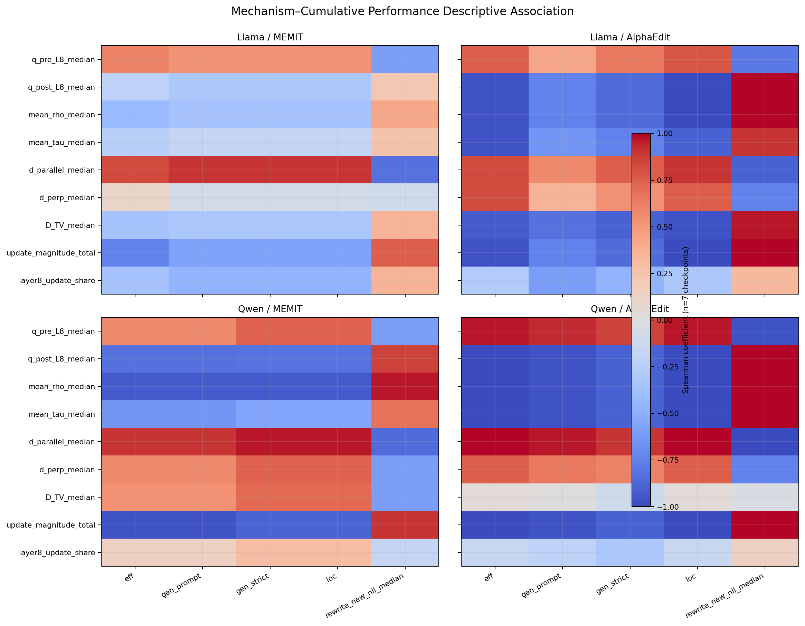

### 15.1 LM

| mechanism | outcome | n | Spearman | Pearson | direction |
|---|---|---|---|---|---|
| q_pre_L8_median | eff | 7 | 0.6071 | 0.7997 | POSITIVE |
| q_pre_L8_median | gen_prompt | 7 | 0.5357 | 0.7573 | POSITIVE |
| q_pre_L8_median | gen_strict | 7 | 0.5357 | 0.7549 | POSITIVE |
| q_pre_L8_median | loc | 7 | 0.5357 | 0.7106 | POSITIVE |
| q_pre_L8_median | rewrite_new_nll_median | 7 | -0.6071 | -0.7798 | NEGATIVE |
| q_pre_L8_median | rephrase_new_nll_median | 7 | -0.5357 | -0.7648 | NEGATIVE |
| q_post_L8_median | eff | 7 | -0.2143 | -0.5276 | NEGATIVE |
| q_post_L8_median | gen_prompt | 7 | -0.3214 | -0.6181 | NEGATIVE |
| q_post_L8_median | gen_strict | 7 | -0.3214 | -0.6409 | NEGATIVE |
| q_post_L8_median | loc | 7 | -0.3214 | -0.5558 | NEGATIVE |
| q_post_L8_median | rewrite_new_nll_median | 7 | 0.2143 | 0.3886 | POSITIVE |
| q_post_L8_median | rephrase_new_nll_median | 7 | 0.3214 | 0.4718 | POSITIVE |
| mean_rho_median | eff | 7 | -0.4286 | -0.8169 | NEGATIVE |
| mean_rho_median | gen_prompt | 7 | -0.3571 | -0.8008 | NEGATIVE |
| mean_rho_median | gen_strict | 7 | -0.3571 | -0.8186 | NEGATIVE |
| mean_rho_median | loc | 7 | -0.3571 | -0.7591 | NEGATIVE |
| mean_rho_median | rewrite_new_nll_median | 7 | 0.4286 | 0.7019 | POSITIVE |
| mean_rho_median | rephrase_new_nll_median | 7 | 0.3571 | 0.7047 | POSITIVE |
| mean_tau_median | eff | 7 | -0.2500 | -0.7117 | NEGATIVE |
| mean_tau_median | gen_prompt | 7 | -0.1786 | -0.6798 | NEGATIVE |
| mean_tau_median | gen_strict | 7 | -0.1786 | -0.7063 | NEGATIVE |
| mean_tau_median | loc | 7 | -0.1786 | -0.5924 | NEGATIVE |
| mean_tau_median | rewrite_new_nll_median | 7 | 0.2500 | 0.5416 | POSITIVE |
| mean_tau_median | rephrase_new_nll_median | 7 | 0.1786 | 0.5430 | POSITIVE |
| d_parallel_median | eff | 7 | 0.8214 | 0.9585 | POSITIVE |
| d_parallel_median | gen_prompt | 7 | 0.8929 | 0.9534 | POSITIVE |
| d_parallel_median | gen_strict | 7 | 0.8929 | 0.9503 | POSITIVE |
| d_parallel_median | loc | 7 | 0.8929 | 0.8720 | POSITIVE |
| d_parallel_median | rewrite_new_nll_median | 7 | -0.8214 | -0.9108 | NEGATIVE |
| d_parallel_median | rephrase_new_nll_median | 7 | -0.8929 | -0.9281 | NEGATIVE |
| d_perp_median | eff | 7 | 0.1071 | 0.2577 | POSITIVE |
| d_perp_median | gen_prompt | 7 | -0.0714 | 0.1950 | NEGATIVE |
| d_perp_median | gen_strict | 7 | -0.0714 | 0.1956 | NEGATIVE |
| d_perp_median | loc | 7 | -0.0714 | 0.2641 | NEGATIVE |
| d_perp_median | rewrite_new_nll_median | 7 | -0.1071 | -0.3013 | NEGATIVE |
| d_perp_median | rephrase_new_nll_median | 7 | 0.0714 | -0.2508 | POSITIVE |
| D_TV_median | eff | 7 | -0.3571 | -0.8270 | NEGATIVE |
| D_TV_median | gen_prompt | 7 | -0.3214 | -0.8474 | NEGATIVE |
| D_TV_median | gen_strict | 7 | -0.3214 | -0.8689 | NEGATIVE |
| D_TV_median | loc | 7 | -0.3214 | -0.7994 | NEGATIVE |
| D_TV_median | rewrite_new_nll_median | 7 | 0.3571 | 0.7106 | POSITIVE |
| D_TV_median | rephrase_new_nll_median | 7 | 0.3214 | 0.7457 | POSITIVE |
| update_magnitude_total | eff | 7 | -0.7500 | -0.8885 | NEGATIVE |
| update_magnitude_total | gen_prompt | 7 | -0.5714 | -0.8239 | NEGATIVE |
| update_magnitude_total | gen_strict | 7 | -0.5714 | -0.8164 | NEGATIVE |
| update_magnitude_total | loc | 7 | -0.5714 | -0.7910 | NEGATIVE |
| update_magnitude_total | rewrite_new_nll_median | 7 | 0.7500 | 0.8672 | POSITIVE |
| update_magnitude_total | rephrase_new_nll_median | 7 | 0.5714 | 0.8345 | POSITIVE |
| layer8_update_share | eff | 7 | -0.3571 | -0.4109 | NEGATIVE |
| layer8_update_share | gen_prompt | 7 | -0.4643 | -0.4808 | NEGATIVE |
| layer8_update_share | gen_strict | 7 | -0.4643 | -0.4610 | NEGATIVE |
| layer8_update_share | loc | 7 | -0.4643 | -0.5522 | NEGATIVE |
| layer8_update_share | rewrite_new_nll_median | 7 | 0.3571 | 0.4867 | POSITIVE |
| layer8_update_share | rephrase_new_nll_median | 7 | 0.4643 | 0.5193 | POSITIVE |
| Vbar | eff | 7 | -0.4286 | -0.4065 | NEGATIVE |
| Vbar | gen_prompt | 7 | -0.2500 | -0.3393 | NEGATIVE |
| Vbar | gen_strict | 7 | -0.2500 | -0.3565 | NEGATIVE |
| Vbar | loc | 7 | -0.2500 | -0.3430 | NEGATIVE |
| Vbar | rewrite_new_nll_median | 7 | 0.4286 | 0.3179 | POSITIVE |
| Vbar | rephrase_new_nll_median | 7 | 0.2500 | 0.2858 | POSITIVE |
| unreachable_fraction | eff | 7 | 0.5714 | 0.3268 | POSITIVE |
| unreachable_fraction | gen_prompt | 7 | 0.6429 | 0.3346 | POSITIVE |
| unreachable_fraction | gen_strict | 7 | 0.6429 | 0.2916 | POSITIVE |
| unreachable_fraction | loc | 7 | 0.6429 | 0.3624 | POSITIVE |
| unreachable_fraction | rewrite_new_nll_median | 7 | -0.5714 | -0.4739 | NEGATIVE |
| unreachable_fraction | rephrase_new_nll_median | 7 | -0.6429 | -0.4671 | NEGATIVE |

### 15.2 LA

| mechanism | outcome | n | Spearman | Pearson | direction |
|---|---|---|---|---|---|
| q_pre_L8_median | eff | 7 | 0.7500 | 0.5307 | POSITIVE |
| q_pre_L8_median | gen_prompt | 7 | 0.4286 | 0.5045 | POSITIVE |
| q_pre_L8_median | gen_strict | 7 | 0.6429 | 0.5176 | POSITIVE |
| q_pre_L8_median | loc | 7 | 0.7857 | 0.6978 | POSITIVE |
| q_pre_L8_median | rewrite_new_nll_median | 7 | -0.7857 | -0.4556 | NEGATIVE |
| q_pre_L8_median | rephrase_new_nll_median | 7 | -0.6429 | -0.4987 | NEGATIVE |
| q_post_L8_median | eff | 7 | -0.9643 | -0.9697 | NEGATIVE |
| q_post_L8_median | gen_prompt | 7 | -0.7500 | -0.9643 | NEGATIVE |
| q_post_L8_median | gen_strict | 7 | -0.8571 | -0.9365 | NEGATIVE |
| q_post_L8_median | loc | 7 | -1.0000 | -0.9072 | NEGATIVE |
| q_post_L8_median | rewrite_new_nll_median | 7 | 1.0000 | 0.9890 | POSITIVE |
| q_post_L8_median | rephrase_new_nll_median | 7 | 0.8571 | 0.9934 | POSITIVE |
| mean_rho_median | eff | 7 | -0.9643 | -0.9874 | NEGATIVE |
| mean_rho_median | gen_prompt | 7 | -0.7500 | -0.9849 | NEGATIVE |
| mean_rho_median | gen_strict | 7 | -0.8571 | -0.9862 | NEGATIVE |
| mean_rho_median | loc | 7 | -1.0000 | -0.9913 | NEGATIVE |
| mean_rho_median | rewrite_new_nll_median | 7 | 1.0000 | 0.9141 | POSITIVE |
| mean_rho_median | rephrase_new_nll_median | 7 | 0.8571 | 0.9677 | POSITIVE |
| mean_tau_median | eff | 7 | -0.9643 | -0.8934 | NEGATIVE |
| mean_tau_median | gen_prompt | 7 | -0.6429 | -0.8992 | NEGATIVE |
| mean_tau_median | gen_strict | 7 | -0.7500 | -0.9363 | NEGATIVE |
| mean_tau_median | loc | 7 | -0.8929 | -0.9565 | NEGATIVE |
| mean_tau_median | rewrite_new_nll_median | 7 | 0.8929 | 0.7119 | POSITIVE |
| mean_tau_median | rephrase_new_nll_median | 7 | 0.7500 | 0.8211 | POSITIVE |
| d_parallel_median | eff | 7 | 0.8214 | 0.5972 | POSITIVE |
| d_parallel_median | gen_prompt | 7 | 0.5714 | 0.5741 | POSITIVE |
| d_parallel_median | gen_strict | 7 | 0.7500 | 0.5827 | POSITIVE |
| d_parallel_median | loc | 7 | 0.8929 | 0.7417 | POSITIVE |
| d_parallel_median | rewrite_new_nll_median | 7 | -0.8929 | -0.5406 | NEGATIVE |
| d_parallel_median | rephrase_new_nll_median | 7 | -0.7500 | -0.5812 | NEGATIVE |
| d_perp_median | eff | 7 | 0.8214 | 0.6653 | POSITIVE |
| d_perp_median | gen_prompt | 7 | 0.3571 | 0.6362 | POSITIVE |
| d_perp_median | gen_strict | 7 | 0.5357 | 0.6254 | POSITIVE |
| d_perp_median | loc | 7 | 0.7500 | 0.7624 | POSITIVE |
| d_perp_median | rewrite_new_nll_median | 7 | -0.7500 | -0.6395 | NEGATIVE |
| d_perp_median | rephrase_new_nll_median | 7 | -0.5357 | -0.6489 | NEGATIVE |
| D_TV_median | eff | 7 | -0.9286 | -0.9878 | NEGATIVE |
| D_TV_median | gen_prompt | 7 | -0.8214 | -0.9845 | NEGATIVE |
| D_TV_median | gen_strict | 7 | -0.8929 | -0.9650 | NEGATIVE |
| D_TV_median | loc | 7 | -0.9643 | -0.9369 | NEGATIVE |
| D_TV_median | rewrite_new_nll_median | 7 | 0.9643 | 0.9788 | POSITIVE |
| D_TV_median | rephrase_new_nll_median | 7 | 0.8929 | 0.9982 | POSITIVE |
| update_magnitude_total | eff | 7 | -0.9643 | -0.9668 | NEGATIVE |
| update_magnitude_total | gen_prompt | 7 | -0.7500 | -0.9639 | NEGATIVE |
| update_magnitude_total | gen_strict | 7 | -0.8571 | -0.9460 | NEGATIVE |
| update_magnitude_total | loc | 7 | -1.0000 | -0.9291 | NEGATIVE |
| update_magnitude_total | rewrite_new_nll_median | 7 | 1.0000 | 0.9614 | POSITIVE |
| update_magnitude_total | rephrase_new_nll_median | 7 | 0.8571 | 0.9823 | POSITIVE |
| layer8_update_share | eff | 7 | -0.2857 | -0.8014 | NEGATIVE |
| layer8_update_share | gen_prompt | 7 | -0.6071 | -0.8038 | NEGATIVE |
| layer8_update_share | gen_strict | 7 | -0.4643 | -0.7530 | NEGATIVE |
| layer8_update_share | loc | 7 | -0.3214 | -0.6398 | NEGATIVE |
| layer8_update_share | rewrite_new_nll_median | 7 | 0.3214 | 0.9084 | POSITIVE |
| layer8_update_share | rephrase_new_nll_median | 7 | 0.4643 | 0.8683 | POSITIVE |
| Vbar | eff | 7 | -0.9643 | -0.9109 | NEGATIVE |
| Vbar | gen_prompt | 7 | -0.7500 | -0.9083 | NEGATIVE |
| Vbar | gen_strict | 7 | -0.8571 | -0.8849 | NEGATIVE |
| Vbar | loc | 7 | -1.0000 | -0.8659 | NEGATIVE |
| Vbar | rewrite_new_nll_median | 7 | 1.0000 | 0.9345 | POSITIVE |
| Vbar | rephrase_new_nll_median | 7 | 0.8571 | 0.9435 | POSITIVE |
| unreachable_fraction | eff | 7 | -0.7143 | -0.9462 | NEGATIVE |
| unreachable_fraction | gen_prompt | 7 | -1.0000 | -0.9555 | NEGATIVE |
| unreachable_fraction | gen_strict | 7 | -0.9643 | -0.9804 | NEGATIVE |
| unreachable_fraction | loc | 7 | -0.7500 | -0.9610 | NEGATIVE |
| unreachable_fraction | rewrite_new_nll_median | 7 | 0.7500 | 0.8043 | POSITIVE |
| unreachable_fraction | rephrase_new_nll_median | 7 | 0.9643 | 0.8973 | POSITIVE |

### 15.3 QM

| mechanism | outcome | n | Spearman | Pearson | direction |
|---|---|---|---|---|---|
| q_pre_L8_median | eff | 7 | 0.5714 | 0.8938 | POSITIVE |
| q_pre_L8_median | gen_prompt | 7 | 0.5714 | 0.8718 | POSITIVE |
| q_pre_L8_median | gen_strict | 7 | 0.7412 | 0.8059 | POSITIVE |
| q_pre_L8_median | loc | 7 | 0.7412 | 0.9063 | POSITIVE |
| q_pre_L8_median | rewrite_new_nll_median | 7 | -0.6071 | -0.8681 | NEGATIVE |
| q_pre_L8_median | rephrase_new_nll_median | 7 | -0.6071 | -0.8296 | NEGATIVE |
| q_post_L8_median | eff | 7 | -0.8214 | -0.6593 | NEGATIVE |
| q_post_L8_median | gen_prompt | 7 | -0.8214 | -0.6435 | NEGATIVE |
| q_post_L8_median | gen_strict | 7 | -0.8154 | -0.5760 | NEGATIVE |
| q_post_L8_median | loc | 7 | -0.8154 | -0.6453 | NEGATIVE |
| q_post_L8_median | rewrite_new_nll_median | 7 | 0.8571 | 0.8579 | POSITIVE |
| q_post_L8_median | rephrase_new_nll_median | 7 | 0.8571 | 0.8725 | POSITIVE |
| mean_rho_median | eff | 7 | -0.9286 | -0.9357 | NEGATIVE |
| mean_rho_median | gen_prompt | 7 | -0.9286 | -0.9170 | NEGATIVE |
| mean_rho_median | gen_strict | 7 | -0.9266 | -0.8639 | NEGATIVE |
| mean_rho_median | loc | 7 | -0.9266 | -0.9473 | NEGATIVE |
| mean_rho_median | rewrite_new_nll_median | 7 | 0.9643 | 0.9165 | POSITIVE |
| mean_rho_median | rephrase_new_nll_median | 7 | 0.9643 | 0.9153 | POSITIVE |
| mean_tau_median | eff | 7 | -0.6429 | -0.8540 | NEGATIVE |
| mean_tau_median | gen_prompt | 7 | -0.6429 | -0.8422 | NEGATIVE |
| mean_tau_median | gen_strict | 7 | -0.5559 | -0.8122 | NEGATIVE |
| mean_tau_median | loc | 7 | -0.5559 | -0.8679 | NEGATIVE |
| mean_tau_median | rewrite_new_nll_median | 7 | 0.6786 | 0.7923 | POSITIVE |
| mean_tau_median | rephrase_new_nll_median | 7 | 0.6786 | 0.8159 | POSITIVE |
| d_parallel_median | eff | 7 | 0.8929 | 0.9713 | POSITIVE |
| d_parallel_median | gen_prompt | 7 | 0.8929 | 0.9576 | POSITIVE |
| d_parallel_median | gen_strict | 7 | 0.9636 | 0.9110 | POSITIVE |
| d_parallel_median | loc | 7 | 0.9636 | 0.9762 | POSITIVE |
| d_parallel_median | rewrite_new_nll_median | 7 | -0.8571 | -0.9460 | NEGATIVE |
| d_parallel_median | rephrase_new_nll_median | 7 | -0.8571 | -0.9386 | NEGATIVE |
| d_perp_median | eff | 7 | 0.5714 | 0.6825 | POSITIVE |
| d_perp_median | gen_prompt | 7 | 0.5714 | 0.6455 | POSITIVE |
| d_perp_median | gen_strict | 7 | 0.7412 | 0.5406 | POSITIVE |
| d_perp_median | loc | 7 | 0.7412 | 0.7012 | POSITIVE |
| d_perp_median | rewrite_new_nll_median | 7 | -0.6071 | -0.7429 | NEGATIVE |
| d_perp_median | rephrase_new_nll_median | 7 | -0.6071 | -0.6712 | NEGATIVE |
| D_TV_median | eff | 7 | 0.5357 | 0.7811 | POSITIVE |
| D_TV_median | gen_prompt | 7 | 0.5357 | 0.7786 | POSITIVE |
| D_TV_median | gen_strict | 7 | 0.7042 | 0.7657 | POSITIVE |
| D_TV_median | loc | 7 | 0.7042 | 0.7900 | POSITIVE |
| D_TV_median | rewrite_new_nll_median | 7 | -0.6071 | -0.6259 | NEGATIVE |
| D_TV_median | rephrase_new_nll_median | 7 | -0.6071 | -0.5962 | NEGATIVE |
| update_magnitude_total | eff | 7 | -0.9643 | -0.9513 | NEGATIVE |
| update_magnitude_total | gen_prompt | 7 | -0.9643 | -0.9386 | NEGATIVE |
| update_magnitude_total | gen_strict | 7 | -0.8895 | -0.8840 | NEGATIVE |
| update_magnitude_total | loc | 7 | -0.8895 | -0.9497 | NEGATIVE |
| update_magnitude_total | rewrite_new_nll_median | 7 | 0.8929 | 0.9858 | POSITIVE |
| update_magnitude_total | rephrase_new_nll_median | 7 | 0.8929 | 0.9865 | POSITIVE |
| layer8_update_share | eff | 7 | 0.1429 | 0.3789 | POSITIVE |
| layer8_update_share | gen_prompt | 7 | 0.1429 | 0.3854 | POSITIVE |
| layer8_update_share | gen_strict | 7 | 0.2965 | 0.4332 | POSITIVE |
| layer8_update_share | loc | 7 | 0.2965 | 0.4011 | POSITIVE |
| layer8_update_share | rewrite_new_nll_median | 7 | -0.1786 | -0.1029 | NEGATIVE |
| layer8_update_share | rephrase_new_nll_median | 7 | -0.1786 | -0.1166 | NEGATIVE |
| Vbar | eff | 7 | 0.7500 | 0.9408 | POSITIVE |
| Vbar | gen_prompt | 7 | 0.7500 | 0.9305 | POSITIVE |
| Vbar | gen_strict | 7 | 0.8154 | 0.9022 | POSITIVE |
| Vbar | loc | 7 | 0.8154 | 0.9511 | POSITIVE |
| Vbar | rewrite_new_nll_median | 7 | -0.8571 | -0.8550 | NEGATIVE |
| Vbar | rephrase_new_nll_median | 7 | -0.8571 | -0.8584 | NEGATIVE |
| unreachable_fraction | eff | 7 | 0.1429 | -0.2680 | POSITIVE |
| unreachable_fraction | gen_prompt | 7 | 0.1429 | -0.2771 | POSITIVE |
| unreachable_fraction | gen_strict | 7 | 0.0741 | -0.3098 | POSITIVE |
| unreachable_fraction | loc | 7 | 0.0741 | -0.2893 | POSITIVE |
| unreachable_fraction | rewrite_new_nll_median | 7 | 0.0000 | 0.0210 | ZERO |
| unreachable_fraction | rephrase_new_nll_median | 7 | 0.0000 | 0.0241 | ZERO |

### 15.4 QA

| mechanism | outcome | n | Spearman | Pearson | direction |
|---|---|---|---|---|---|
| q_pre_L8_median | eff | 7 | 0.9643 | 0.9760 | POSITIVE |
| q_pre_L8_median | gen_prompt | 7 | 0.9286 | 0.9831 | POSITIVE |
| q_pre_L8_median | gen_strict | 7 | 0.8571 | 0.9789 | POSITIVE |
| q_pre_L8_median | loc | 7 | 0.9643 | 0.9869 | POSITIVE |
| q_pre_L8_median | rewrite_new_nll_median | 7 | -0.9643 | -0.8783 | NEGATIVE |
| q_pre_L8_median | rephrase_new_nll_median | 7 | -0.9286 | -0.9672 | NEGATIVE |
| q_post_L8_median | eff | 7 | -1.0000 | -0.9309 | NEGATIVE |
| q_post_L8_median | gen_prompt | 7 | -0.9643 | -0.9132 | NEGATIVE |
| q_post_L8_median | gen_strict | 7 | -0.8929 | -0.8880 | NEGATIVE |
| q_post_L8_median | loc | 7 | -1.0000 | -0.8706 | NEGATIVE |
| q_post_L8_median | rewrite_new_nll_median | 7 | 1.0000 | 0.9529 | POSITIVE |
| q_post_L8_median | rephrase_new_nll_median | 7 | 0.9643 | 0.9479 | POSITIVE |
| mean_rho_median | eff | 7 | -1.0000 | -0.9940 | NEGATIVE |
| mean_rho_median | gen_prompt | 7 | -0.9643 | -0.9890 | NEGATIVE |
| mean_rho_median | gen_strict | 7 | -0.8929 | -0.9739 | NEGATIVE |
| mean_rho_median | loc | 7 | -1.0000 | -0.9642 | NEGATIVE |
| mean_rho_median | rewrite_new_nll_median | 7 | 1.0000 | 0.9519 | POSITIVE |
| mean_rho_median | rephrase_new_nll_median | 7 | 0.9643 | 0.9961 | POSITIVE |
| mean_tau_median | eff | 7 | -1.0000 | -0.9848 | NEGATIVE |
| mean_tau_median | gen_prompt | 7 | -0.9643 | -0.9755 | NEGATIVE |
| mean_tau_median | gen_strict | 7 | -0.8929 | -0.9572 | NEGATIVE |
| mean_tau_median | loc | 7 | -1.0000 | -0.9430 | NEGATIVE |
| mean_tau_median | rewrite_new_nll_median | 7 | 1.0000 | 0.9683 | POSITIVE |
| mean_tau_median | rephrase_new_nll_median | 7 | 0.9643 | 0.9907 | POSITIVE |
| d_parallel_median | eff | 7 | 1.0000 | 0.9882 | POSITIVE |
| d_parallel_median | gen_prompt | 7 | 0.9643 | 0.9886 | POSITIVE |
| d_parallel_median | gen_strict | 7 | 0.8929 | 0.9794 | POSITIVE |
| d_parallel_median | loc | 7 | 1.0000 | 0.9813 | POSITIVE |
| d_parallel_median | rewrite_new_nll_median | 7 | -1.0000 | -0.9312 | NEGATIVE |
| d_parallel_median | rephrase_new_nll_median | 7 | -0.9643 | -0.9885 | NEGATIVE |
| d_perp_median | eff | 7 | 0.7500 | 0.8200 | POSITIVE |
| d_perp_median | gen_prompt | 7 | 0.6429 | 0.8372 | POSITIVE |
| d_perp_median | gen_strict | 7 | 0.6071 | 0.8409 | POSITIVE |
| d_perp_median | loc | 7 | 0.7500 | 0.8761 | POSITIVE |
| d_perp_median | rewrite_new_nll_median | 7 | -0.7500 | -0.6493 | NEGATIVE |
| d_perp_median | rephrase_new_nll_median | 7 | -0.6429 | -0.7959 | NEGATIVE |
| D_TV_median | eff | 7 | 0.0357 | -0.0031 | POSITIVE |
| D_TV_median | gen_prompt | 7 | 0.0000 | 0.0716 | ZERO |
| D_TV_median | gen_strict | 7 | -0.1071 | 0.1426 | NEGATIVE |
| D_TV_median | loc | 7 | 0.0357 | 0.2288 | POSITIVE |
| D_TV_median | rewrite_new_nll_median | 7 | -0.0357 | 0.2832 | NEGATIVE |
| D_TV_median | rephrase_new_nll_median | 7 | 0.0000 | 0.0394 | ZERO |
| update_magnitude_total | eff | 7 | -1.0000 | -0.9152 | NEGATIVE |
| update_magnitude_total | gen_prompt | 7 | -0.9643 | -0.8962 | NEGATIVE |
| update_magnitude_total | gen_strict | 7 | -0.8929 | -0.8695 | NEGATIVE |
| update_magnitude_total | loc | 7 | -1.0000 | -0.8412 | NEGATIVE |
| update_magnitude_total | rewrite_new_nll_median | 7 | 1.0000 | 0.9425 | POSITIVE |
| update_magnitude_total | rephrase_new_nll_median | 7 | 0.9643 | 0.9353 | POSITIVE |
| layer8_update_share | eff | 7 | -0.1429 | -0.5837 | NEGATIVE |
| layer8_update_share | gen_prompt | 7 | -0.2143 | -0.5200 | NEGATIVE |
| layer8_update_share | gen_strict | 7 | -0.3214 | -0.4477 | NEGATIVE |
| layer8_update_share | loc | 7 | -0.1429 | -0.3682 | NEGATIVE |
| layer8_update_share | rewrite_new_nll_median | 7 | 0.1429 | 0.7292 | POSITIVE |
| layer8_update_share | rephrase_new_nll_median | 7 | 0.2143 | 0.6128 | POSITIVE |
| Vbar | eff | 7 | 0.6786 | 0.8013 | POSITIVE |
| Vbar | gen_prompt | 7 | 0.7143 | 0.7441 | POSITIVE |
| Vbar | gen_strict | 7 | 0.6429 | 0.6780 | POSITIVE |
| Vbar | loc | 7 | 0.6786 | 0.6685 | POSITIVE |
| Vbar | rewrite_new_nll_median | 7 | -0.6786 | -0.8980 | NEGATIVE |
| Vbar | rephrase_new_nll_median | 7 | -0.7143 | -0.8124 | NEGATIVE |
| unreachable_fraction | eff | 7 | -0.7857 | -0.8648 | NEGATIVE |
| unreachable_fraction | gen_prompt | 7 | -0.8214 | -0.8916 | NEGATIVE |
| unreachable_fraction | gen_strict | 7 | -0.8929 | -0.9133 | NEGATIVE |
| unreachable_fraction | loc | 7 | -0.7857 | -0.8763 | NEGATIVE |
| unreachable_fraction | rewrite_new_nll_median | 7 | 0.7857 | 0.8059 | POSITIVE |
| unreachable_fraction | rephrase_new_nll_median | 7 | 0.8214 | 0.8599 | POSITIVE |

## 16. Residual trajectory와 lifelong drift — cumulative 연결

이 mechanism trajectory는 §4–§9 cumulative retention과 같은 checkpoint clock에 결합되지만 sentinel 100과 seen-prefix t requests는 denominator가 다르다.


### 16.1 10k sentinel q 분포

통계 열은 `mean/median/IQR/p90/max`; 각 셀 n=100이다.

| 모델 | 방법 | pre-L8 q | post-L8 q | q_pre-L8>0.2 | median trajectory pre-L4→post-L8 |
|---|---|---:|---:|---:|---|
| Llama-3-8B-Instruct | Official MEMIT | 0.5120/0.5116/0.0789/0.5862/0.6543 | 0.3100/0.3080/0.0862/0.3896/0.4579 | 100/100 | 1.0000/0.7319/0.6598/0.6337/0.5116/0.3080 |
| Llama-3-8B-Instruct | Official AlphaEdit | 0.3869/0.3860/0.0538/0.4386/0.7066 | 0.1961/0.1918/0.1092/0.2822/0.5220 | 100/100 | 1.0000/0.9008/0.5817/0.4647/0.3860/0.1918 |
| Qwen2.5-7B-Instruct | Official MEMIT | 0.3733/0.3534/0.0914/0.4947/0.9901 | 0.2791/0.2557/0.0880/0.4012/0.5682 | 100/100 | 1.0000/1.3066/0.6617/0.4595/0.3534/0.2557 |
| Qwen2.5-7B-Instruct | Official AlphaEdit | 0.2447/0.2219/0.0910/0.3174/1.0475 | 0.0309/0.0255/0.0201/0.0487/0.1699 | 65/100 | 1.0000/0.9153/0.6122/0.3813/0.2219/0.0255 |

### 16.2 fixed sentinel의 t0→10k paired 변화

동일 request hash n=100/arm의 `10k−t0` median이다.

| 모델 | 방법 | Δpre-L8 q | Δpost-L8 q | Δd∥ | Δd⊥ | Δmean ρ | Δmean τ | ΔD_TV | Δcenter |
|---|---|---:|---:|---:|---:|---:|---:|---:|---:|
| Llama-3-8B-Instruct | Official MEMIT | -0.1424 | 0.0159 | -0.1587 | -0.0277 | 0.9053 | 1.1062 | 0.1361 | -1.1353 |
| Llama-3-8B-Instruct | Official AlphaEdit | -0.1692 | 0.1500 | -0.0932 | -0.1559 | 0.6361 | 0.3722 | 0.2403 | -1.4260 |
| Qwen2.5-7B-Instruct | Official MEMIT | -0.1068 | 0.1709 | -0.2298 | 0.0569 | 1.0172 | 1.2518 | -0.0838 | -1.6967 |
| Qwen2.5-7B-Instruct | Official AlphaEdit | -0.0982 | 0.0201 | -0.1395 | -0.0262 | 0.6685 | 0.6590 | -0.0315 | -1.0161 |

### 16.3 모든 registered checkpoint

Weight total은 sentinel probe의 5개 layer Frobenius magnitude 합이다. Functional strict는 그 checkpoint의 current B100이며 t0에는 PRE_EDIT sentinel을 쓴다.

| 모델/방법 | edits | pre/post-L8 q med | q>0.2 | D_TV med | Δcenter med | update total | V̄/unreachable/min h̄ | rewrite/rephrase/locality strict |
|---|---:|---:|---:|---:|---:|---:|---:|---|
| LM | 0 | 0.6568/0.2923 | 100/100 | 0.1176 | 0.3615 | 18.4125 | 3.4896/0.2672/-2.6304 | 0/100 (0.000)/0/200 (0.000)/281/1000 (0.281) |
| LM | 1000 | 0.5711/0.2564 | 100/100 | 0.0983 | 0.2502 | 39.1237 | 1.4711/0.6431/-0.6874 | 100/100 (1.000)/152/200 (0.760)/201/1000 (0.201) |
| LM | 1500 | 0.5092/0.2832 | 100/100 | 0.2450 | -0.3894 | 90.8305 | 2.9271/0.7196/-5.8631 | 98/100 (0.980)/170/200 (0.850)/158/1000 (0.158) |
| LM | 2000 | 0.4656/0.2842 | 100/100 | 0.3739 | -0.8107 | 139.5007 | 5.9076/0.7769/-5.1925 | 89/100 (0.890)/138/200 (0.690)/38/1000 (0.038) |
| LM | 3000 | 0.5083/0.3416 | 100/100 | 0.3551 | -1.0403 | 78.9746 | 1.4947/0.6901/-1.0246 | 86/100 (0.860)/66/200 (0.330)/37/1000 (0.037) |
| LM | 5000 | 0.4361/0.2719 | 100/100 | 0.3293 | -0.9754 | 138.2773 | 2.3654/0.5926/-1.5082 | 19/100 (0.190)/7/200 (0.035)/1/1000 (0.001) |
| LM | 7500 | 0.4963/0.3318 | 100/100 | 0.3319 | -1.0377 | 114.2469 | 3.7803/0.5535/-2.8510 | 68/100 (0.680)/40/200 (0.200)/15/1000 (0.015) |
| LM | 10000 | 0.5116/0.3080 | 100/100 | 0.2554 | -0.7540 | 136.3196 | 3.2385/0.5224/-2.2385 | 27/100 (0.270)/17/200 (0.085)/5/1000 (0.005) |
| LA | 0 | 0.5401/0.0382 | 100/100 | 0.1317 | 0.3883 | 20.9372 | 1.5437/0.4105/-0.7157 | 0/100 (0.000)/0/200 (0.000)/281/1000 (0.281) |
| LA | 1000 | 0.4261/0.0437 | 100/100 | 0.0607 | 0.0799 | 31.4208 | 2.9493/0.3708/-2.2174 | 100/100 (1.000)/166/200 (0.830)/217/1000 (0.217) |
| LA | 1500 | 0.4079/0.0458 | 100/100 | 0.0583 | -0.0067 | 33.6092 | 3.1732/0.3683/-2.4427 | 100/100 (1.000)/158/200 (0.790)/186/1000 (0.186) |
| LA | 2000 | 0.3963/0.0483 | 100/100 | 0.0693 | -0.0585 | 36.6695 | 3.4812/0.3644/-2.7362 | 100/100 (1.000)/165/200 (0.825)/148/1000 (0.148) |
| LA | 3000 | 0.3835/0.0509 | 100/100 | 0.0722 | -0.1156 | 41.4803 | 3.7123/0.3687/-3.0401 | 100/100 (1.000)/164/200 (0.820)/128/1000 (0.128) |
| LA | 5000 | 0.3926/0.0692 | 100/100 | 0.1444 | -0.3683 | 60.7452 | 4.9702/0.5650/-4.5730 | 99/100 (0.990)/150/200 (0.750)/66/1000 (0.066) |
| LA | 7500 | 0.3890/0.1601 | 100/100 | 0.3265 | -0.8911 | 104.9500 | 8.4321/0.5957/-7.4321 | 100/100 (1.000)/105/200 (0.525)/9/1000 (0.009) |
| LA | 10000 | 0.3860/0.1918 | 100/100 | 0.3763 | -1.0401 | 137.8613 | 13.6264/0.6052/-12.6264 | 99/100 (0.990)/103/200 (0.515)/9/1000 (0.009) |
| QM | 0 | 0.4501/0.0875 | 100/100 | 0.4384 | 1.3317 | 155.3193 | 3.7331/0.6266/-3.2549 | 0/100 (0.000)/0/200 (0.000)/182/1000 (0.182) |
| QM | 1000 | 0.4712/0.0896 | 100/100 | 0.3880 | 1.1820 | 123.2348 | 1.2297/0.5844/-0.6911 | 100/100 (1.000)/147/200 (0.735)/126/1000 (0.126) |
| QM | 1500 | 0.4807/0.0795 | 100/100 | 0.3466 | 1.1160 | 188.7382 | 1.0609/0.6628/-0.3439 | 96/100 (0.960)/113/200 (0.565)/74/1000 (0.074) |
| QM | 2000 | 0.3460/0.0627 | 99/100 | 0.2819 | 0.4225 | 315.9665 | 0.6458/0.8012/-0.3089 | 98/100 (0.980)/152/200 (0.760)/30/1000 (0.030) |
| QM | 3000 | 0.3137/0.1271 | 95/100 | 0.2569 | 0.1682 | 509.4898 | 0.7418/0.8481/-0.9659 | 9/100 (0.090)/4/200 (0.020)/0/1000 (0.000) |
| QM | 5000 | 0.2712/0.1835 | 91/100 | 0.2423 | -0.2201 | 498.1988 | 0.5692/0.6793/-0.1782 | 0/100 (0.000)/0/200 (0.000)/0/1000 (0.000) |
| QM | 7500 | 0.2727/0.1782 | 97/100 | 0.2733 | -0.1311 | 519.0698 | 0.6531/0.5665/-0.1389 | 0/100 (0.000)/0/200 (0.000)/0/1000 (0.000) |
| QM | 10000 | 0.3534/0.2557 | 100/100 | 0.3450 | -0.3753 | 604.1410 | 0.6330/0.6159/-0.2263 | 0/100 (0.000)/0/200 (0.000)/0/1000 (0.000) |
| QA | 0 | 0.3246/0.0047 | 100/100 | 0.2410 | 0.6424 | 109.1978 | 8.4228/0.6918/-7.5113 | 0/100 (0.000)/0/200 (0.000)/182/1000 (0.182) |
| QA | 1000 | 0.3163/0.0074 | 100/100 | 0.2046 | 0.5430 | 104.2912 | 4.2839/0.5605/-3.2994 | 100/100 (1.000)/154/200 (0.770)/99/1000 (0.099) |
| QA | 1500 | 0.3004/0.0081 | 99/100 | 0.1875 | 0.5004 | 113.2183 | 4.3552/0.5553/-3.3659 | 100/100 (1.000)/153/200 (0.765)/88/1000 (0.088) |
| QA | 2000 | 0.3000/0.0093 | 99/100 | 0.1774 | 0.4807 | 117.6864 | 3.7027/0.5505/-2.7752 | 100/100 (1.000)/158/200 (0.790)/61/1000 (0.061) |
| QA | 3000 | 0.2898/0.0103 | 100/100 | 0.1617 | 0.4270 | 156.4622 | 4.9355/0.6082/-3.9355 | 98/100 (0.980)/140/200 (0.700)/48/1000 (0.048) |
| QA | 5000 | 0.2300/0.0132 | 82/100 | 0.1135 | -0.0636 | 243.4389 | 4.1154/0.6028/-3.5159 | 94/100 (0.940)/130/200 (0.650)/10/1000 (0.010) |
| QA | 7500 | 0.2173/0.0187 | 59/100 | 0.1827 | -0.2656 | 385.0033 | 2.9143/0.6491/-2.0676 | 91/100 (0.910)/69/200 (0.345)/3/1000 (0.003) |
| QA | 10000 | 0.2219/0.0255 | 65/100 | 0.2153 | -0.3848 | 613.6856 | 2.1977/0.6185/-1.4843 | 64/100 (0.640)/34/200 (0.170)/3/1000 (0.003) |


분모: sentinel n=100/checkpoint/arm. Heatmap은 고정 schedule 8개 checkpoint의 median이며 보간하지 않았다.

## 17. Allocation–realization: A, Y, E, rho, tau

A/Y/E full vectors는 publish되지 않았다. 저장된 normalized scalar에서 `Y∥=ρA`, `Y⊥ norm=τA`, `E∥=(1−ρ)A`, `E⊥ norm=τA`만 결정적으로 파생했다. 직교 벡터의 방향은 추정하지 않았다.

아래 값은 10k sentinel n=100/layer/arm이고 각 scalar는 `mean/median/IQR/p90/max`다.

| arm | L | A/R1 | Y/R1 | E/R1 | ρ | τ | Y∥/R1 | Y⊥/R1 | E∥/R1 | E⊥ norm/R1 | under/over/opposite/exact |
|---|---:|---:|---:|---:|---:|---:|---:|---:|---:|---:|---:|
| LM | 4 | 0.2000/0.2000/0.0000/0.2000/0.2000 | 0.7794/0.8010/0.2117/0.9789/1.0555 | 0.6562/0.6761/0.2057/0.8521/0.9207 | 2.7365/2.7226/0.9260/3.5724/3.9551 | 2.7475/2.6999/0.8738/3.4732/4.0470 | 0.5473/0.5445/0.1852/0.7145/0.7910 | 0.5495/0.5400/0.1748/0.6946/0.8094 | -0.3473/-0.3445/0.1852/-0.1699/0.0012 | 0.5495/0.5400/0.1748/0.6946/0.8094 | 1/99/0/0 |
| LM | 5 | 0.1822/0.1830/0.0217/0.2085/0.2289 | 0.5380/0.5038/0.3276/0.8535/1.0542 | 0.4748/0.4397/0.2890/0.7572/0.9118 | 1.5339/1.3873/1.0400/2.7370/3.3407 | 2.4525/2.4150/1.2757/3.6330/4.5604 | 0.2856/0.2547/0.2091/0.5157/0.7416 | 0.4496/0.4348/0.2655/0.7034/0.7912 | -0.1034/-0.0714/0.1888/0.0521/0.1299 | 0.4496/0.4348/0.2655/0.7034/0.7912 | 27/73/0/0 |
| LM | 6 | 0.2201/0.2199/0.0379/0.2560/0.2945 | 0.5203/0.4920/0.5118/0.8897/1.0661 | 0.4761/0.4458/0.3890/0.7809/0.9035 | 1.1500/0.9420/1.3094/2.2611/2.9949 | 1.9667/2.1034/1.3411/3.0059/3.2471 | 0.2654/0.2084/0.3234/0.5511/0.7272 | 0.4405/0.4450/0.3780/0.7135/0.8118 | -0.0453/0.0111/0.3059/0.1549/0.2195 | 0.4405/0.4450/0.3780/0.7135/0.8118 | 53/47/0/0 |
| LM | 7 | 0.3200/0.3168/0.0583/0.3743/0.4171 | 0.4346/0.4347/0.2832/0.6633/0.7667 | 0.3599/0.3536/0.1413/0.4783/0.5439 | 0.8322/0.7708/0.6125/1.2725/1.6464 | 1.0241/1.1143/0.3535/1.3099/1.5392 | 0.2746/0.2385/0.2352/0.4896/0.5924 | 0.3317/0.3425/0.1684/0.4677/0.5362 | 0.0454/0.0684/0.1852/0.1851/0.2273 | 0.3317/0.3425/0.1684/0.4677/0.5362 | 64/36/0/0 |
| LM | 8 | 0.5120/0.5116/0.0789/0.5862/0.6543 | 0.2683/0.2625/0.0567/0.3299/0.4238 | 0.3100/0.3080/0.0862/0.3896/0.4579 | 0.4563/0.4435/0.1268/0.5887/0.6374 | 0.2531/0.2511/0.0884/0.3324/0.4485 | 0.2323/0.2250/0.0635/0.2994/0.3704 | 0.1291/0.1300/0.0393/0.1816/0.2093 | 0.2797/0.2758/0.0980/0.3625/0.4390 | 0.1291/0.1300/0.0393/0.1816/0.2093 | 100/0/0/0 |
| LA | 4 | 0.2000/0.2000/0.0000/0.2000/0.2000 | 1.0329/0.9669/0.3313/1.5895/2.9790 | 0.9386/0.8514/0.3605/1.5301/2.9579 | 2.6806/2.6868/0.7854/3.4336/4.1152 | 4.3295/3.8000/1.8427/7.0511/14.7513 | 0.5361/0.5374/0.1571/0.6867/0.8230 | 0.8659/0.7600/0.3685/1.4102/2.9503 | -0.3361/-0.3374/0.1571/-0.1829/0.0841 | 0.8659/0.7600/0.3685/1.4102/2.9503 | 1/99/0/0 |
| LA | 5 | 0.2512/0.2252/0.0718/0.3564/0.7520 | 0.7858/0.6070/0.4963/1.4521/3.6649 | 0.6089/0.4674/0.4436/1.1572/3.0036 | 2.3124/2.0772/1.2764/3.9241/4.6263 | 1.7046/1.5885/0.7865/2.4000/3.3922 | 0.6346/0.4554/0.4563/1.2415/3.3082 | 0.4445/0.3803/0.2865/0.6864/1.5771 | -0.3835/-0.2389/0.3480/-0.0851/0.0301 | 0.4445/0.3803/0.2865/0.6864/1.5771 | 1/99/0/0 |
| LA | 6 | 0.2120/0.1939/0.0489/0.2482/0.5351 | 0.2700/0.1592/0.1486/0.4965/1.7132 | 0.2126/0.1314/0.0485/0.3345/1.3216 | 0.8648/0.6099/0.5472/1.6703/3.2048 | 0.6317/0.5132/0.4413/1.0714/2.2940 | 0.2208/0.1158/0.1263/0.3958/1.3780 | 0.1502/0.0981/0.0911/0.2759/1.0179 | -0.0088/0.0720/0.1013/0.1171/0.2026 | 0.1502/0.0981/0.0911/0.2759/1.0179 | 74/26/0/0 |
| LA | 7 | 0.2377/0.2323/0.0272/0.2696/0.5215 | 0.1108/0.0987/0.0530/0.1439/0.4938 | 0.1612/0.1599/0.0306/0.1885/0.2824 | 0.3884/0.3743/0.1450/0.5074/1.3185 | 0.2361/0.2062/0.1269/0.3944/0.7083 | 0.0944/0.0863/0.0340/0.1244/0.4350 | 0.0565/0.0472/0.0297/0.0930/0.2337 | 0.1432/0.1461/0.0425/0.1805/0.2812 | 0.0565/0.0472/0.0297/0.0930/0.2337 | 98/2/0/0 |
| LA | 8 | 0.3869/0.3860/0.0538/0.4386/0.7066 | 0.1947/0.1913/0.0572/0.2551/0.3267 | 0.1961/0.1918/0.1092/0.2822/0.5220 | 0.5101/0.4814/0.2052/0.7310/0.7939 | 0.0649/0.0635/0.0300/0.0880/0.1513 | 0.1925/0.1887/0.0595/0.2544/0.3263 | 0.0251/0.0237/0.0135/0.0357/0.0696 | 0.1943/0.1893/0.1099/0.2810/0.5199 | 0.0251/0.0237/0.0135/0.0357/0.0696 | 100/0/0/0 |
| QM | 4 | 0.2000/0.2000/0.0000/0.2000/0.2000 | 1.5633/1.4535/0.8353/2.2340/4.3490 | 1.4803/1.3632/0.8326/2.1771/4.3039 | 3.5456/3.4030/1.7399/5.3149/8.1919 | 6.8605/6.2311/3.8648/10.0601/21.0677 | 0.7091/0.6806/0.3480/1.0630/1.6384 | 1.3721/1.2462/0.7730/2.0120/4.2135 | -0.5091/-0.4806/0.3480/-0.1813/-0.0490 | 1.3721/1.2462/0.7730/2.0120/4.2135 | 0/100/0/0 |
| QM | 5 | 0.3611/0.3266/0.1811/0.5092/1.0536 | 1.3629/1.1879/0.9009/2.3359/6.5173 | 1.0659/0.9157/0.7668/1.9396/5.5618 | 3.0313/2.9536/1.2585/4.2703/5.9850 | 1.7279/1.5238/0.8092/2.4138/8.9638 | 1.1912/1.0071/0.7964/2.0644/6.0042 | 0.6299/0.5347/0.3869/1.0508/2.5347 | -0.8301/-0.6653/0.6784/-0.1868/0.0889 | 0.6299/0.5347/0.3869/1.0508/2.5347 | 1/99/0/0 |
| QM | 6 | 0.2564/0.2206/0.0881/0.3726/1.0343 | 0.3956/0.2508/0.2006/0.6438/5.6991 | 0.2408/0.1241/0.0845/0.3538/5.0989 | 1.1237/0.9692/0.4545/1.6348/6.5642 | 0.6170/0.5627/0.2278/0.8130/4.2062 | 0.3477/0.2130/0.1954/0.5563/4.7985 | 0.1804/0.1178/0.0745/0.2629/3.0748 | -0.0913/0.0062/0.0955/0.0641/0.1401 | 0.1804/0.1178/0.0745/0.2629/3.0748 | 53/47/0/0 |
| QM | 7 | 0.2627/0.2298/0.0697/0.3333/2.0151 | 0.2059/0.1435/0.0675/0.2779/3.7212 | 0.1656/0.1352/0.0457/0.2110/1.8312 | 0.5638/0.5341/0.2001/0.7318/1.7922 | 0.3907/0.3592/0.1532/0.6099/1.0705 | 0.1730/0.1190/0.0673/0.2401/3.6115 | 0.1008/0.0843/0.0391/0.1434/0.8972 | 0.0898/0.1049/0.0466/0.1633/0.2636 | 0.1008/0.0843/0.0391/0.1434/0.8972 | 96/4/0/0 |
| QM | 8 | 0.3733/0.3534/0.0914/0.4947/0.9901 | 0.1733/0.1532/0.0702/0.2499/0.6010 | 0.2791/0.2557/0.0880/0.4012/0.5682 | 0.3215/0.3318/0.1839/0.4970/0.7555 | 0.3141/0.2928/0.1424/0.4515/0.7223 | 0.1216/0.1034/0.0745/0.2070/0.5847 | 0.1123/0.1032/0.0527/0.1622/0.2203 | 0.2517/0.2318/0.0936/0.3776/0.5577 | 0.1123/0.1032/0.0527/0.1622/0.2203 | 100/0/0/0 |
| QA | 4 | 0.2000/0.2000/0.0000/0.2000/0.2000 | 0.8936/0.8477/0.3241/1.2377/2.2498 | 0.8126/0.7579/0.3500/1.1574/2.2191 | 2.1711/2.2340/0.9240/2.9408/3.5506 | 3.8406/3.5682/1.8601/5.7197/11.0291 | 0.4342/0.4468/0.1848/0.5882/0.7101 | 0.7681/0.7136/0.3720/1.1439/2.2058 | -0.2342/-0.2468/0.1848/-0.0662/0.0543 | 0.7681/0.7136/0.3720/1.1439/2.2058 | 5/95/0/0 |
| QA | 5 | 0.2443/0.2288/0.0574/0.3185/0.5688 | 0.6863/0.5838/0.3843/1.0326/4.4590 | 0.5257/0.4404/0.3248/0.8415/3.9508 | 2.0554/1.9209/0.8528/3.0404/7.1049 | 1.6465/1.6219/0.8130/2.3131/3.3131 | 0.5335/0.4457/0.2606/0.8297/4.0412 | 0.4175/0.3794/0.3117/0.6467/1.8844 | -0.2892/-0.2167/0.2318/-0.0624/0.0412 | 0.4175/0.3794/0.3117/0.6467/1.8844 | 2/98/0/0 |
| QA | 6 | 0.2206/0.2041/0.0841/0.2807/0.8609 | 0.4099/0.3098/0.1750/0.5586/4.2791 | 0.2653/0.1769/0.1585/0.4036/3.4480 | 1.4095/1.2981/0.3726/1.7822/4.8325 | 0.9170/0.8359/0.4226/1.3792/3.2190 | 0.3420/0.2630/0.1190/0.4480/4.1602 | 0.2145/0.1664/0.1302/0.3692/1.0703 | -0.1213/-0.0550/0.0867/-0.0086/0.0730 | 0.2145/0.1664/0.1302/0.3692/1.0703 | 7/93/0/0 |
| QA | 7 | 0.2164/0.1906/0.0765/0.2929/0.9344 | 0.2855/0.2130/0.1266/0.4189/2.8263 | 0.1471/0.1034/0.0828/0.2119/1.9156 | 1.0624/1.0209/0.2430/1.2899/3.1434 | 0.5203/0.5126/0.2618/0.8363/1.0950 | 0.2557/0.1892/0.1070/0.3529/2.7781 | 0.1172/0.0980/0.0836/0.1970/0.6291 | -0.0394/-0.0041/0.0490/0.0399/0.0987 | 0.1172/0.0980/0.0836/0.1970/0.6291 | 46/54/0/0 |
| QA | 8 | 0.2447/0.2219/0.0910/0.3174/1.0475 | 0.2572/0.2275/0.1124/0.3275/1.2150 | 0.0309/0.0255/0.0201/0.0487/0.1699 | 1.0446/1.0435/0.1020/1.1853/1.3373 | 0.0821/0.0713/0.0574/0.1547/0.2558 | 0.2564/0.2270/0.1121/0.3271/1.2146 | 0.0183/0.0171/0.0119/0.0322/0.0413 | -0.0117/-0.0098/0.0244/0.0178/0.0868 | 0.0183/0.0171/0.0119/0.0322/0.0413 | 31/69/0/0 |


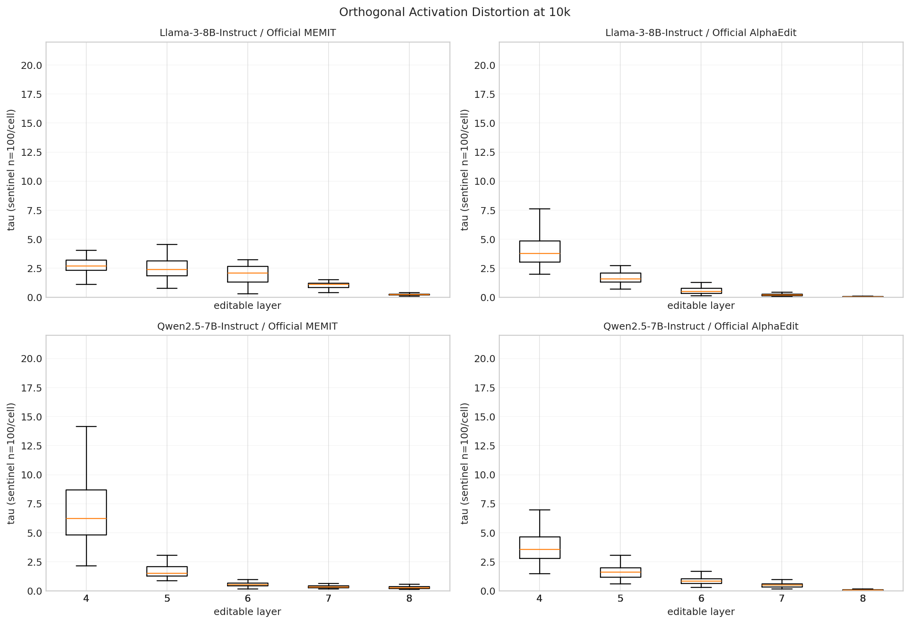

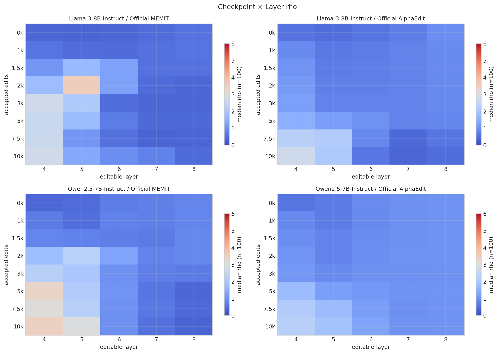


## 18. Inherited debt와 recurrence closure

| arm | d∥ mean/med/IQR/p90/max | d⊥ mean/med/IQR/p90/max | recurrence mean/med/p90/max | worst request hash | violations/<1e-4 denom |
|---|---:|---:|---:|---|---:|
| LM | 0.1620/0.1568/0.1126/0.2486/0.3420 | 0.3561/0.3549/0.0723/0.4209/0.4703 | 1.081e-17/9.326e-18/1.781e-17/2.279e-17 | `aab746360def8be4469d3c7cf41498cfa56ee2814112798e36b73859f0ad7eb7` | 0/100 |
| LA | 0.0512/0.0558/0.0677/0.1143/0.2455 | 0.2880/0.2802/0.0650/0.3543/0.6935 | 1.455e-17/1.060e-17/2.504e-17/6.408e-17 | `a2504ec4d20467287c8ffe7efb9af95148999619a5259f45d962d45740dae6a2` | 0/100 |
| QM | -0.0454/-0.0613/0.0816/0.0468/0.1992 | 0.3318/0.2982/0.1067/0.4520/0.9892 | 2.166e-17/1.839e-17/3.576e-17/9.350e-17 | `9d8b7f9f68f5c75bd4737fbfe169d23d8e15ba10ba5d2a5acd88d2e0ec68032f` | 0/100 |
| QA | -0.0963/-0.0969/0.0441/-0.0496/-0.0239 | 0.2171/0.1945/0.0942/0.2957/1.0448 | 1.499e-17/1.280e-17/1.986e-17/9.613e-17 | `93ad994356fe678654023901f37f9e27d5f12b5ef412912e01a36c992f7fda44` | 0/100 |

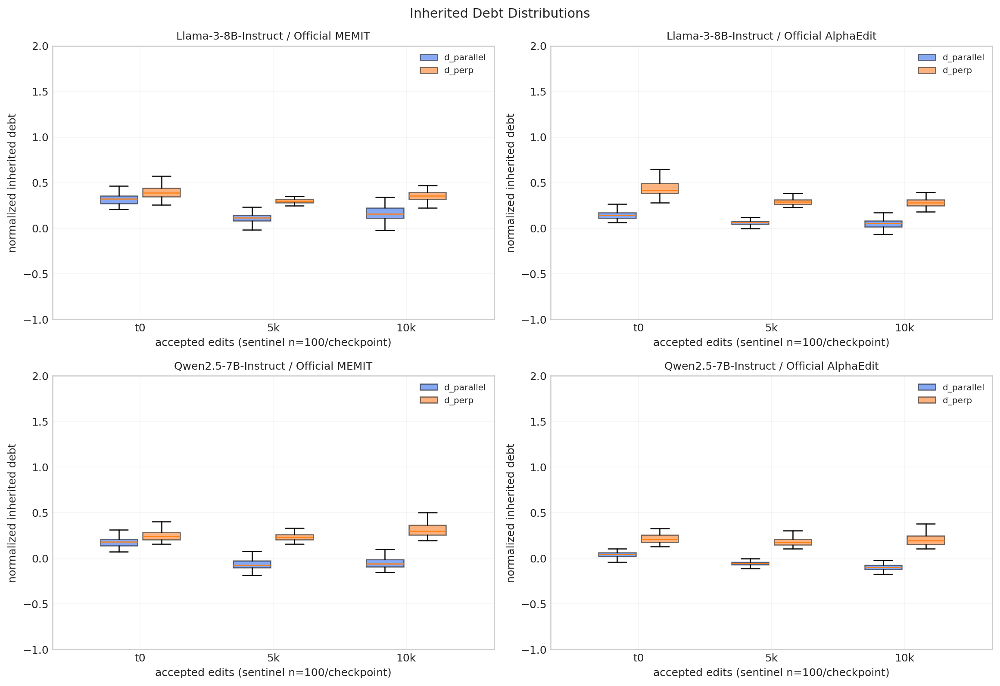

All outliers are finite, identity-valid raw members. Worst identities and top-10 p90/max drivers are in `outlier-ledger.csv`; raw prompts are not published.

## 19. Layer-wise update magnitude/share

Activation progress와 weight action은 서로 다른 축이다. Production 통계의 독립 관측 단위는 B100 batch n=100/layer/arm이며 request 100개로 복제하지 않았다.

| arm | L | production ΔW magnitude mean/med/IQR/p90/max | production share mean/med/IQR/p90/max | 10k sentinel magnitude/share |
|---|---:|---:|---:|---:|
| LM | 4 | 18.8261/20.6004/9.4740/25.7599/27.7523 | 0.1813/0.1859/0.0179/0.2002/0.2092 | 26.9119/0.1974 |
| LM | 5 | 16.3045/17.3538/5.1434/21.6638/26.2385 | 0.1604/0.1559/0.0116/0.1814/0.2091 | 19.9172/0.1461 |
| LM | 6 | 13.4343/14.0628/6.1321/20.0214/25.2477 | 0.1352/0.1287/0.0382/0.1684/0.1951 | 14.5065/0.1064 |
| LM | 7 | 20.2270/22.0727/7.7755/26.7715/29.8233 | 0.2011/0.2002/0.0070/0.2133/0.2147 | 27.5055/0.2018 |
| LM | 8 | 32.7391/36.1053/14.0735/44.8858/47.2559 | 0.3220/0.3248/0.0267/0.3467/0.3544 | 47.4785/0.3483 |
| LA | 4 | 10.2358/8.4708/8.3331/18.3263/21.7898 | 0.1463/0.1475/0.0103/0.1531/0.1597 | 21.9840/0.1595 |
| LA | 5 | 12.5905/10.2881/12.5390/23.1260/28.1115 | 0.1721/0.1689/0.0259/0.1962/0.2044 | 26.9896/0.1958 |
| LA | 6 | 12.5039/11.2416/11.2291/20.6608/24.0187 | 0.1793/0.1807/0.0055/0.1841/0.1870 | 21.9431/0.1592 |
| LA | 7 | 14.0430/13.4921/10.4497/21.7546/25.0409 | 0.2085/0.2201/0.0298/0.2244/0.2273 | 24.4588/0.1774 |
| LA | 8 | 20.7531/17.3935/19.2738/36.8338/43.6171 | 0.2938/0.2943/0.0145/0.3026/0.3173 | 42.4857/0.3082 |
| QM | 4 | 234.9343/265.5902/99.0599/321.1063/422.5914 | 0.4885/0.4906/0.0793/0.5471/0.6052 | 271.2696/0.4490 |
| QM | 5 | 55.5655/53.1529/13.7718/80.4404/99.5414 | 0.1345/0.1062/0.1010/0.2170/0.2395 | 60.9045/0.1008 |
| QM | 6 | 65.0448/65.9591/22.7692/99.8964/146.9477 | 0.1336/0.1302/0.0290/0.1717/0.2245 | 101.1565/0.1674 |
| QM | 7 | 53.6350/58.1161/19.4140/74.0009/101.0963 | 0.1162/0.1159/0.0181/0.1317/0.1429 | 89.7010/0.1485 |
| QM | 8 | 58.3921/65.4837/18.2990/77.2914/94.6252 | 0.1271/0.1264/0.0136/0.1435/0.1586 | 81.1093/0.1343 |
| QA | 4 | 88.0091/74.4665/92.4615/151.3842/533.0186 | 0.2747/0.2647/0.0446/0.3094/0.5981 | 167.2712/0.2726 |
| QA | 5 | 44.1683/44.7923/21.3110/62.4927/76.9345 | 0.1814/0.1649/0.1151/0.2523/0.2769 | 77.3231/0.1260 |
| QA | 6 | 45.5212/40.4554/49.4715/85.3721/98.5385 | 0.1527/0.1526/0.0173/0.1703/0.1935 | 100.5019/0.1638 |
| QA | 7 | 63.8103/58.7891/72.7496/113.0432/142.4894 | 0.2128/0.2172/0.0358/0.2382/0.2556 | 146.7555/0.2391 |
| QA | 8 | 53.4252/46.7589/59.0388/96.4405/127.4659 | 0.1784/0.1761/0.0325/0.2116/0.2314 | 121.8338/0.1985 |

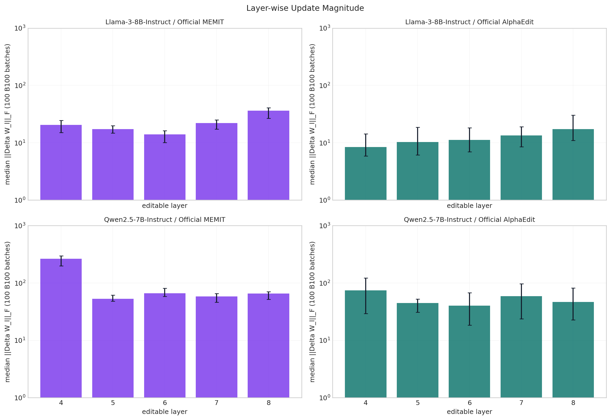

그림 제목은 `Layer-wise Update Magnitude`; n=100 B100 batches/layer/arm. 참조 guide line이나 하단 보조 문구를 추가하지 않았다.

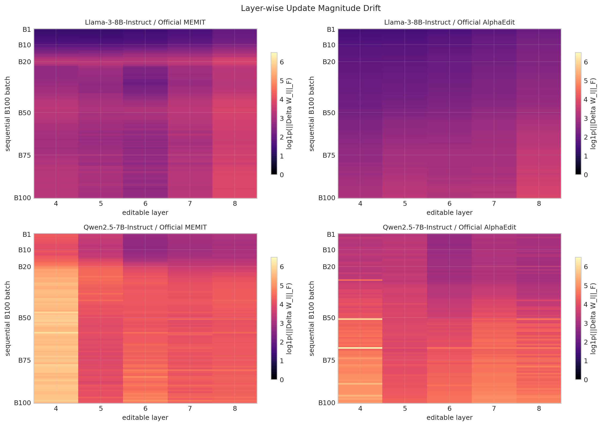

## 20. Endpoint diagnostics — PRE_EDIT, current B100, online, retention

**Diagnostic boundary:** 아래 v3 current-B100/online/retention 수치는 역사적 원문 그대로 보존하지만 final 또는 cumulative headline으로 사용하지 않는다.

### 20.1 PRE_EDIT reference

각 NLL/margin 열은 `mean/median/p90/max`; strict 분모는 실제 prompt 수다.

| 모델 | 방법 cohort | rewrite new NLL | rewrite new margin | rewrite strict | rephrase new NLL | rephrase strict | locality true NLL | locality strict |
|---|---|---:|---:|---:|---:|---:|---:|---:|
| Llama-3-8B-Instruct | Official MEMIT PRE_EDIT | 11.5761/11.7640/16.4094/20.2464 | -11.1748/-11.5588/-5.6046/-1.8011 | 0/100 (0.000) | 10.1912/9.9872/14.3599/17.9728 | 0/200 (0.000) | 4.7884/5.0469/8.6175/12.1227 | 281/1000 (0.281) |
| Llama-3-8B-Instruct | Official AlphaEdit PRE_EDIT | 11.5761/11.7640/16.4094/20.2464 | -11.1748/-11.5588/-5.6046/-1.8011 | 0/100 (0.000) | 10.1912/9.9872/14.3599/17.9728 | 0/200 (0.000) | 4.7884/5.0469/8.6175/12.1227 | 281/1000 (0.281) |
| Qwen2.5-7B-Instruct | Official MEMIT PRE_EDIT | 10.5882/10.3821/15.0318/18.4091 | -9.7410/-9.3683/-5.3664/-0.5653 | 0/100 (0.000) | 10.2340/10.2213/14.2690/18.9477 | 0/200 (0.000) | 5.2254/5.3274/8.5918/10.7814 | 182/1000 (0.182) |
| Qwen2.5-7B-Instruct | Official AlphaEdit PRE_EDIT | 10.5882/10.3821/15.0318/18.4091 | -9.7410/-9.3683/-5.3664/-0.5653 | 0/100 (0.000) | 10.2340/10.2213/14.2690/18.9477 | 0/200 (0.000) | 5.2254/5.3274/8.5918/10.7814 | 182/1000 (0.182) |

### 20.2 10k final-W current B100 detail

| arm | metric | NLL mean/med/p90/max | margin mean/med/p90/max | strict |
|---|---|---:|---:|---:|
| LM | rewrite_target_new | 5.4301/5.0030/10.8083/13.4911 | -2.7091/-2.7099/3.8078/10.7345 | 27/100 (0.270) |
| LM | rewrite_target_true | 11.8147/11.3474/15.8733/21.9046 | -10.0756/-9.3750/-5.6269/-1.3556 | 0/100 (0.000) |
| LM | rephrase_target_new | 9.5051/10.0216/12.8003/21.1107 | -6.8492/-7.0819/-1.2751/3.2965 | 17/200 (0.085) |
| LM | locality_target_true | 12.7149/12.9980/15.5756/20.7855 | -10.8154/-10.8719/-7.2455/-1.9816 | 5/1000 (0.005) |
| LA | rewrite_target_new | 0.1949/0.0108/0.6664/2.7910 | 6.0797/6.1684/9.2369/14.1054 | 99/100 (0.990) |
| LA | rewrite_target_true | 14.5259/14.4404/20.7481/25.3806 | -14.3585/-14.2093/-8.3485/-4.0163 | 0/100 (0.000) |
| LA | rephrase_target_new | 3.6938/3.3068/8.3026/14.3747 | -0.1525/0.2765/5.4713/8.7491 | 103/200 (0.515) |
| LA | locality_target_true | 10.6806/10.4773/14.1168/16.8003 | -8.4927/-8.3754/-5.4449/-3.1692 | 9/1000 (0.009) |
| QM | rewrite_target_new | 17.9274/16.4052/24.7327/45.4729 | -16.5304/-14.7775/-8.8489/-4.2301 | 0/100 (0.000) |
| QM | rewrite_target_true | 18.3685/17.3507/24.0535/48.1942 | -17.0513/-16.6559/-9.4065/-6.2717 | 0/100 (0.000) |
| QM | rephrase_target_new | 18.1673/16.9920/25.2341/38.8369 | -16.8403/-15.9286/-10.5448/-6.4670 | 0/200 (0.000) |
| QM | locality_target_true | 17.7711/16.6738/22.0839/34.1844 | -16.3816/-14.6421/-11.5708/-9.4239 | 0/1000 (0.000) |
| QA | rewrite_target_new | 3.5243/1.1896/9.1265/16.2187 | 0.6994/2.0876/5.4578/10.3995 | 64/100 (0.640) |
| QA | rewrite_target_true | 12.7382/12.5596/16.7625/19.7372 | -10.9876/-10.7975/-7.0254/-4.2639 | 0/100 (0.000) |
| QA | rephrase_target_new | 7.4472/7.9704/12.3221/15.5665 | -4.4589/-4.9739/1.0835/5.5468 | 34/200 (0.170) |
| QA | locality_target_true | 12.3696/12.2035/15.0274/16.6427 | -9.2801/-9.1242/-6.8080/-4.6003 | 3/1000 (0.003) |

### 20.3 Production online B100 endpoints 전체 10k

각 행은 순차 실행 중 각 B100 직후 current request endpoint 10,000개를 합친 값이다. 통계는 `mean/median/p90/max`; strict는 request-level 분자/10,000이다.

| arm | new NLL | true NLL | new margin | true margin | new strict | true strict |
|---|---:|---:|---:|---:|---:|---:|
| LM | 3.1561/0.8715/10.0862/22.4404 | 11.6634/11.6067/15.9163/34.0142 | 1.1813/2.4073/7.1641/18.8108 | -10.2520/-9.8598/-5.5747/5.9792 | 6406/10000 | 17/10000 |
| LA | 0.0718/0.0030/0.0494/16.0287 | 13.9134/13.6079/19.2820/30.8505 | 6.8908/7.0427/9.3742/19.9342 | -13.9169/-13.6261/-8.8952/-1.0372 | 9888/10000 | 0/10000 |
| QM | 10.8821/12.9062/18.1320/45.4729 | 14.4628/14.0974/19.1691/48.1942 | -8.2728/-10.7770/5.8982/15.5088 | -13.2233/-12.7285/-7.8687/0.6506 | 2571/10000 | 2/10000 |
| QA | 0.9052/0.0295/2.7662/18.3518 | 13.2945/13.0329/18.5498/32.1431 | 4.2510/5.0015/7.6875/15.3240 | -12.8812/-12.6860/-7.3787/2.5265 | 8974/10000 | 3/10000 |

### 20.4 Terminal retention

Retention panels record rewrite only; rephrase/locality are `NOT_RECORDED_LOW_COST_BATCH` and are not filled with zero.

| arm | cohort | rewrite new NLL mean/med/p90/max | new strict | rewrite true NLL mean/med/p90/max | true strict |
|---|---|---:|---:|---:|---:|
| LM | retention_earliest | 13.4129/11.9229/18.1379/26.7140 | 0/32 (0.000) | 12.3947/12.4346/16.6091/22.4381 | 0/32 (0.000) |
| LM | retention_recent | 5.2270/4.3172/11.5166/13.4911 | 8/32 (0.250) | 11.9537/11.1507/17.0108/21.9046 | 0/32 (0.000) |
| LM | retention_hash_stratified | 10.2593/10.8319/15.5051/18.6814 | 3/64 (0.047) | 11.7259/11.9966/15.4168/17.1259 | 0/64 (0.000) |
| LA | retention_earliest | 10.0533/9.7546/14.1204/16.0507 | 0/32 (0.000) | 10.0954/10.5791/13.7608/14.6579 | 0/32 (0.000) |
| LA | retention_recent | 0.1739/0.0058/0.3075/2.3217 | 31/32 (0.969) | 15.0873/14.2629/23.4991/25.3806 | 0/32 (0.000) |
| LA | retention_hash_stratified | 7.2346/7.0200/13.3317/15.2843 | 16/64 (0.250) | 10.0289/10.3024/14.4523/16.7529 | 3/64 (0.047) |
| QM | retention_earliest | 17.6107/14.4019/25.4695/38.5881 | 0/32 (0.000) | 17.3905/15.8090/23.9985/35.7321 | 0/32 (0.000) |
| QM | retention_recent | 16.8165/15.2540/22.5361/28.2904 | 0/32 (0.000) | 16.9752/17.0459/22.7745/24.2247 | 0/32 (0.000) |
| QM | retention_hash_stratified | 18.1332/16.3845/25.9730/41.3191 | 0/64 (0.000) | 18.7338/16.6796/29.2842/36.8278 | 0/64 (0.000) |
| QA | retention_earliest | 12.0077/12.4881/16.7111/18.7024 | 0/32 (0.000) | 11.4773/11.6703/16.0311/18.0785 | 1/32 (0.031) |
| QA | retention_recent | 2.8928/0.7933/7.4565/16.2187 | 23/32 (0.719) | 13.1679/13.1961/16.6594/19.7372 | 0/32 (0.000) |
| QA | retention_hash_stratified | 9.0061/9.5058/14.4789/18.5006 | 13/64 (0.203) | 12.1189/11.9515/15.4867/18.6011 | 0/64 (0.000) |

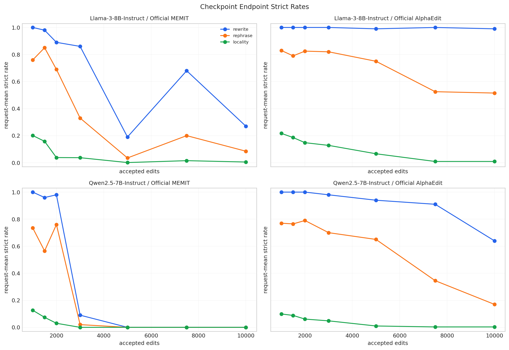

그림 분모: current B100 100 requests/checkpoint/arm; prompt count는 request 안에서만 반영했다. Checkpoint 사이 missing interpolation=0.

## 21. AlphaEdit accumulated-cache vs reset-cache mechanism fork

동일 checkpoint state와 shared sentinel z의 observational clone이다. Production cache policy를 바꾸지 않았으며 probe 후 W/cache exact restore다.

| 모델 | fork | q pre/post-L8 med | D_TV med | update total | V̄ | unreachable |
|---|---|---:|---:|---:|---:|---:|
| Llama-3-8B-Instruct | ACCUMULATED_OR_STATIC | 0.3860/0.1918 | 0.3763 | 137.8613 | 13.6264 | 0.6052 |
| Llama-3-8B-Instruct | RESET_CACHE | 0.2908/0.0459 | 0.3018 | 117.4593 | 1.3712 | 0.6351 |
| Llama-3-8B-Instruct | RESET−ACC paired median | -0.0954/-0.1373 | -0.0719 | N/A | N/A | N/A |
| Qwen2.5-7B-Instruct | ACCUMULATED_OR_STATIC | 0.2219/0.0255 | 0.2153 | 613.6856 | 2.1977 | 0.6185 |
| Qwen2.5-7B-Instruct | RESET_CACHE | 0.2259/0.0261 | 0.2023 | 255.0197 | 1.2429 | 0.6101 |
| Qwen2.5-7B-Instruct | RESET−ACC paired median | 0.0003/0.0010 | -0.0100 | N/A | N/A | N/A |

### 21.1 Ordered vs same-entry layer probe (10k)

Same-entry는 각 layer를 동일 checkpoint-entry W에서 독립 적용한 weight-response probe다. Request-level q/ρ/τ를 기록하지 않았으므로 아래는 layer update/response magnitude 비교이며 target-progress causal estimate가 아니다.

| arm | L | ordered ΔW | same-entry ΔW | same−ordered | same-entry response |
|---|---:|---:|---:|---:|---:|
| LA | 4 | 21.9840 | 21.9840 | 0.0000 | 286.9857 |
| LA | 5 | 26.9896 | 26.9896 | 0.0000 | 92.2843 |
| LA | 6 | 21.9431 | 21.9431 | 0.0000 | 29.5546 |
| LA | 7 | 24.4588 | 24.4588 | 0.0000 | 12.3582 |
| LA | 8 | 42.4857 | 42.4857 | 0.0000 | 20.0329 |
| LM | 4 | 26.9119 | 26.9119 | 0.0000 | 353.2280 |
| LM | 5 | 19.9172 | 19.9172 | 0.0000 | 186.0371 |
| LM | 6 | 14.5065 | 14.5065 | -0.0000 | 224.3964 |
| LM | 7 | 27.5055 | 27.5055 | 0.0000 | 155.5435 |
| LM | 8 | 47.4785 | 47.4785 | 0.0000 | 96.4786 |
| QA | 4 | 167.2712 | 167.2712 | 0.0000 | 3955.2686 |
| QA | 5 | 77.3231 | 77.3231 | 0.0000 | 1781.5029 |
| QA | 6 | 100.5019 | 100.5019 | 0.0000 | 944.4288 |
| QA | 7 | 146.7555 | 146.7555 | 0.0000 | 552.0395 |
| QA | 8 | 121.8338 | 121.8338 | 0.0000 | 470.0931 |
| QM | 4 | 271.2696 | 271.2696 | 0.0000 | 11031.7238 |
| QM | 5 | 60.9045 | 60.9045 | 0.0000 | 6693.2686 |
| QM | 6 | 101.1565 | 101.1565 | 0.0000 | 3534.0101 |
| QM | 7 | 89.7010 | 89.7010 | 0.0000 | 1588.3515 |
| QM | 8 | 81.1093 | 81.1093 | 0.0000 | 1175.1197 |

## 22. Paired model/method comparisons

Production comparisons use exact `(batch_index, request_sha256)` matching, n=10,000 with B100-cluster bootstrap; checkpoint comparisons use fixed sentinel request hash, n=100. Positive is left-minus-right.

| comparison | metric | paired n | mean | median | p90 | 95% bootstrap mean CI | uncertainty unit |
|---|---|---:|---:|---:|---:|---:|---|
| llama3-8b-inst:alphaedit-minus-memit:production | q_pre_L8 | 10000 | 1.1540 | -0.1099 | -0.0010 | -10.5215..9.1675 | PAIRED_BATCH_INDEX_CLUSTER |
| llama3-8b-inst:alphaedit-minus-memit:production | q_post_L8 | 10000 | -0.6145 | -0.2233 | -0.1054 | -11.2804..7.1434 | PAIRED_BATCH_INDEX_CLUSTER |
| llama3-8b-inst:alphaedit-minus-memit:production | d_parallel | 10000 | -0.1742 | -0.1087 | 0.0098 | -0.7802..0.2749 | PAIRED_BATCH_INDEX_CLUSTER |
| llama3-8b-inst:alphaedit-minus-memit:production | d_perp | 10000 | 1.2240 | -0.0360 | 0.0441 | -8.7591..9.3076 | PAIRED_BATCH_INDEX_CLUSTER |
| llama3-8b-inst:alphaedit-minus-memit:production | mean_rho | 10000 | 0.0633 | 0.0997 | 0.5834 | -0.5912..0.6536 | PAIRED_BATCH_INDEX_CLUSTER |
| llama3-8b-inst:alphaedit-minus-memit:production | mean_tau | 10000 | 5.3083 | -0.0267 | 0.6260 | 1.1729..9.7969 | PAIRED_BATCH_INDEX_CLUSTER |
| llama3-8b-inst:alphaedit-minus-memit:production | target_new_nll | 10000 | -3.0843 | -0.8232 | -0.0005 | -3.5975..-2.5907 | PAIRED_BATCH_INDEX_CLUSTER |
| qwen2.5-7b-inst:alphaedit-minus-memit:production | q_pre_L8 | 10000 | 0.4970 | -0.0706 | 0.0524 | -0.0824..1.6469 | PAIRED_BATCH_INDEX_CLUSTER |
| qwen2.5-7b-inst:alphaedit-minus-memit:production | q_post_L8 | 10000 | 0.2503 | -0.1323 | -0.0536 | -0.1560..1.0526 | PAIRED_BATCH_INDEX_CLUSTER |
| qwen2.5-7b-inst:alphaedit-minus-memit:production | d_parallel | 10000 | 0.0075 | -0.0257 | 0.0642 | -0.0438..0.1035 | PAIRED_BATCH_INDEX_CLUSTER |
| qwen2.5-7b-inst:alphaedit-minus-memit:production | d_perp | 10000 | 0.5083 | -0.0554 | 0.0489 | -0.0668..1.6515 | PAIRED_BATCH_INDEX_CLUSTER |
| qwen2.5-7b-inst:alphaedit-minus-memit:production | mean_rho | 10000 | -0.1217 | -0.1035 | 0.4065 | -0.1744..-0.0562 | PAIRED_BATCH_INDEX_CLUSTER |
| qwen2.5-7b-inst:alphaedit-minus-memit:production | mean_tau | 10000 | 0.2917 | -0.3286 | 0.2653 | -0.4570..1.7517 | PAIRED_BATCH_INDEX_CLUSTER |
| qwen2.5-7b-inst:alphaedit-minus-memit:production | target_new_nll | 10000 | -9.9769 | -12.0160 | 0.0003 | -11.1404..-8.8657 | PAIRED_BATCH_INDEX_CLUSTER |
| alphaedit:llama-minus-qwen:production | q_pre_L8 | 10000 | 7.4484 | 0.1457 | 0.2421 | 3.5107..11.9821 | PAIRED_BATCH_INDEX_CLUSTER |
| alphaedit:llama-minus-qwen:production | q_post_L8 | 10000 | 6.2651 | 0.0516 | 0.1793 | 2.8886..10.4058 | PAIRED_BATCH_INDEX_CLUSTER |
| alphaedit:llama-minus-qwen:production | d_parallel | 10000 | 0.0960 | 0.1139 | 0.2032 | -0.0971..0.2761 | PAIRED_BATCH_INDEX_CLUSTER |
| alphaedit:llama-minus-qwen:production | d_perp | 10000 | 7.3932 | 0.0940 | 0.1871 | 3.4275..12.0249 | PAIRED_BATCH_INDEX_CLUSTER |
| alphaedit:llama-minus-qwen:production | mean_rho | 10000 | -0.1869 | -0.1559 | 0.1782 | -0.5983..0.1977 | PAIRED_BATCH_INDEX_CLUSTER |
| alphaedit:llama-minus-qwen:production | mean_tau | 10000 | 6.5668 | 0.1337 | 0.7458 | 2.7307..10.9543 | PAIRED_BATCH_INDEX_CLUSTER |
| alphaedit:llama-minus-qwen:production | target_new_nll | 10000 | -0.8334 | -0.0199 | 0.0079 | -1.0334..-0.6467 | PAIRED_BATCH_INDEX_CLUSTER |
| memit:llama-minus-qwen:production | q_pre_L8 | 10000 | 6.7914 | 0.1804 | 0.3061 | 0.1649..17.5725 | PAIRED_BATCH_INDEX_CLUSTER |
| memit:llama-minus-qwen:production | q_post_L8 | 10000 | 7.1299 | 0.1559 | 0.2724 | 0.1380..18.0000 | PAIRED_BATCH_INDEX_CLUSTER |
| memit:llama-minus-qwen:production | d_parallel | 10000 | 0.2776 | 0.1858 | 0.3145 | -0.2592..0.9097 | PAIRED_BATCH_INDEX_CLUSTER |
| memit:llama-minus-qwen:production | d_perp | 10000 | 6.6775 | 0.0801 | 0.1776 | 0.0634..16.8745 | PAIRED_BATCH_INDEX_CLUSTER |
| memit:llama-minus-qwen:production | mean_rho | 10000 | -0.3719 | -0.3184 | 0.2186 | -0.7411..-0.0155 | PAIRED_BATCH_INDEX_CLUSTER |
| memit:llama-minus-qwen:production | mean_tau | 10000 | 1.5502 | -0.1233 | 0.5079 | -0.2316..4.2268 | PAIRED_BATCH_INDEX_CLUSTER |
| memit:llama-minus-qwen:production | target_new_nll | 10000 | -7.7259 | -8.1061 | 0.0012 | -8.6669..-6.7530 | PAIRED_BATCH_INDEX_CLUSTER |
| llama3-8b-inst:alphaedit-minus-memit:sentinel-10000 | q_pre_L8 | 100 | -0.1251 | -0.1229 | -0.0469 | -0.1412..-0.1086 | PAIRED_REQUEST_HASH |
| llama3-8b-inst:alphaedit-minus-memit:sentinel-10000 | q_post_L8 | 100 | -0.1139 | -0.1282 | 0.0185 | -0.1332..-0.0943 | PAIRED_REQUEST_HASH |
| llama3-8b-inst:alphaedit-minus-memit:sentinel-10000 | d_parallel | 100 | -0.1108 | -0.1077 | 0.0009 | -0.1298..-0.0931 | PAIRED_REQUEST_HASH |
| llama3-8b-inst:alphaedit-minus-memit:sentinel-10000 | d_perp | 100 | -0.0681 | -0.0853 | 0.0341 | -0.0823..-0.0516 | PAIRED_REQUEST_HASH |
| llama3-8b-inst:alphaedit-minus-memit:sentinel-10000 | mean_rho | 100 | 0.0095 | -0.0162 | 0.7596 | -0.1031..0.1250 | PAIRED_REQUEST_HASH |
| llama3-8b-inst:alphaedit-minus-memit:sentinel-10000 | mean_tau | 100 | -0.2954 | -0.3829 | 0.6876 | -0.4327..-0.1527 | PAIRED_REQUEST_HASH |
| llama3-8b-inst:alphaedit-minus-memit:sentinel-10000 | D_TV | 100 | 0.1117 | 0.1326 | 0.1953 | 0.0970..0.1261 | PAIRED_REQUEST_HASH |
| qwen2.5-7b-inst:alphaedit-minus-memit:sentinel-10000 | q_pre_L8 | 100 | -0.1287 | -0.1170 | 0.0026 | -0.1627..-0.0963 | PAIRED_REQUEST_HASH |
| qwen2.5-7b-inst:alphaedit-minus-memit:sentinel-10000 | q_post_L8 | 100 | -0.2482 | -0.2316 | -0.1677 | -0.2650..-0.2324 | PAIRED_REQUEST_HASH |
| qwen2.5-7b-inst:alphaedit-minus-memit:sentinel-10000 | d_parallel | 100 | -0.0509 | -0.0423 | 0.0455 | -0.0680..-0.0339 | PAIRED_REQUEST_HASH |
| qwen2.5-7b-inst:alphaedit-minus-memit:sentinel-10000 | d_perp | 100 | -0.1147 | -0.1081 | 0.0252 | -0.1477..-0.0800 | PAIRED_REQUEST_HASH |
| qwen2.5-7b-inst:alphaedit-minus-memit:sentinel-10000 | mean_rho | 100 | -0.1686 | -0.1208 | 0.5965 | -0.2922..-0.0426 | PAIRED_REQUEST_HASH |
| qwen2.5-7b-inst:alphaedit-minus-memit:sentinel-10000 | mean_tau | 100 | -0.5807 | -0.5281 | 0.4380 | -0.7329..-0.4332 | PAIRED_REQUEST_HASH |
| qwen2.5-7b-inst:alphaedit-minus-memit:sentinel-10000 | D_TV | 100 | -0.1453 | -0.1512 | 0.0152 | -0.1681..-0.1223 | PAIRED_REQUEST_HASH |

## 23. Original v3 descriptive associations

Within-B100 request associations and across-B100 chronological associations are separate. The latter is edit-time confounded. Correlation is association only, not causation.

| arm | unit | x→y | estimate/median | IQR | 95% cluster bootstrap CI | n/clusters |
|---|---|---|---:|---:|---:|---:|
| LM | B100_CLUSTERED_REQUEST_DESCRIPTIVE | q_post_L8→target_new_nll | 0.1726 | 0.2223 | 0.1383..0.2004 | 10000/100 |
| LM | B100_CLUSTERED_REQUEST_DESCRIPTIVE | d_parallel→target_new_nll | -0.0345 | 0.2698 | -0.0616..0.0207 | 10000/100 |
| LM | B100_CLUSTERED_REQUEST_DESCRIPTIVE | d_perp→target_new_nll | 0.2139 | 0.2135 | 0.1580..0.2192 | 10000/100 |
| LM | B100_CLUSTERED_REQUEST_DESCRIPTIVE | D_TV→target_new_nll | 0.0872 | 0.2748 | 0.0732..0.1480 | 10000/100 |
| LM | B100_CLUSTERED_REQUEST_DESCRIPTIVE | q_post_L8→target_new_margin | -0.1522 | 0.1949 | -0.1889..-0.1294 | 10000/100 |
| LM | B100_BATCH_TIME_SERIES_DESCRIPTIVE | q_post_L8→batch_median_target_new_nll | 0.2858 | 0.0000 | 0.0708..0.4795 | 10000/100 |
| LM | B100_BATCH_TIME_SERIES_DESCRIPTIVE | D_TV→batch_median_target_new_nll | 0.3273 | 0.0000 | 0.1017..0.5258 | 10000/100 |
| LM | B100_BATCH_TIME_SERIES_DESCRIPTIVE | total_update_magnitude→batch_median_target_new_nll | 0.7134 | 0.0000 | 0.5449..0.8367 | 10000/100 |
| LA | B100_CLUSTERED_REQUEST_DESCRIPTIVE | q_post_L8→target_new_nll | 0.0540 | 0.1197 | 0.0453..0.0871 | 10000/100 |
| LA | B100_CLUSTERED_REQUEST_DESCRIPTIVE | d_parallel→target_new_nll | -0.0925 | 0.2022 | -0.1090..-0.0575 | 10000/100 |
| LA | B100_CLUSTERED_REQUEST_DESCRIPTIVE | d_perp→target_new_nll | 0.0182 | 0.2254 | -0.0101..0.0469 | 10000/100 |
| LA | B100_CLUSTERED_REQUEST_DESCRIPTIVE | D_TV→target_new_nll | 0.0635 | 0.1482 | 0.0367..0.0760 | 10000/100 |
| LA | B100_CLUSTERED_REQUEST_DESCRIPTIVE | q_post_L8→target_new_margin | -0.0636 | 0.1243 | -0.0936..-0.0538 | 10000/100 |
| LA | B100_BATCH_TIME_SERIES_DESCRIPTIVE | q_post_L8→batch_median_target_new_nll | 0.8556 | 0.0000 | 0.7666..0.9159 | 10000/100 |
| LA | B100_BATCH_TIME_SERIES_DESCRIPTIVE | D_TV→batch_median_target_new_nll | 0.7532 | 0.0000 | 0.6570..0.8203 | 10000/100 |
| LA | B100_BATCH_TIME_SERIES_DESCRIPTIVE | total_update_magnitude→batch_median_target_new_nll | 0.8676 | 0.0000 | 0.7823..0.9252 | 10000/100 |
| QM | B100_CLUSTERED_REQUEST_DESCRIPTIVE | q_post_L8→target_new_nll | 0.0529 | 0.1826 | 0.0491..0.1049 | 10000/100 |
| QM | B100_CLUSTERED_REQUEST_DESCRIPTIVE | d_parallel→target_new_nll | -0.0262 | 0.1540 | -0.0406..0.0102 | 10000/100 |
| QM | B100_CLUSTERED_REQUEST_DESCRIPTIVE | d_perp→target_new_nll | 0.0512 | 0.1953 | 0.0268..0.0845 | 10000/100 |
| QM | B100_CLUSTERED_REQUEST_DESCRIPTIVE | D_TV→target_new_nll | 0.0331 | 0.1392 | 0.0131..0.0532 | 10000/100 |
| QM | B100_CLUSTERED_REQUEST_DESCRIPTIVE | q_post_L8→target_new_margin | -0.0750 | 0.1691 | -0.1135..-0.0606 | 10000/100 |
| QM | B100_BATCH_TIME_SERIES_DESCRIPTIVE | q_post_L8→batch_median_target_new_nll | 0.8405 | 0.0000 | 0.7588..0.8910 | 10000/100 |
| QM | B100_BATCH_TIME_SERIES_DESCRIPTIVE | D_TV→batch_median_target_new_nll | -0.0609 | 0.0000 | -0.2970..0.1889 | 10000/100 |
| QM | B100_BATCH_TIME_SERIES_DESCRIPTIVE | total_update_magnitude→batch_median_target_new_nll | 0.7507 | 0.0000 | 0.6095..0.8435 | 10000/100 |
| QA | B100_CLUSTERED_REQUEST_DESCRIPTIVE | q_post_L8→target_new_nll | 0.0656 | 0.1530 | 0.0375..0.0830 | 10000/100 |
| QA | B100_CLUSTERED_REQUEST_DESCRIPTIVE | d_parallel→target_new_nll | 0.0300 | 0.1797 | 0.0183..0.0694 | 10000/100 |
| QA | B100_CLUSTERED_REQUEST_DESCRIPTIVE | d_perp→target_new_nll | 0.0325 | 0.2891 | 0.0198..0.0886 | 10000/100 |
| QA | B100_CLUSTERED_REQUEST_DESCRIPTIVE | D_TV→target_new_nll | 0.1098 | 0.1970 | 0.0945..0.1477 | 10000/100 |
| QA | B100_CLUSTERED_REQUEST_DESCRIPTIVE | q_post_L8→target_new_margin | -0.0623 | 0.1741 | -0.0778..-0.0327 | 10000/100 |
| QA | B100_BATCH_TIME_SERIES_DESCRIPTIVE | q_post_L8→batch_median_target_new_nll | 0.8445 | 0.0000 | 0.7834..0.8880 | 10000/100 |
| QA | B100_BATCH_TIME_SERIES_DESCRIPTIVE | D_TV→batch_median_target_new_nll | 0.3157 | 0.0000 | 0.1015..0.5169 | 10000/100 |
| QA | B100_BATCH_TIME_SERIES_DESCRIPTIVE | total_update_magnitude→batch_median_target_new_nll | 0.9236 | 0.0000 | 0.8802..0.9463 | 10000/100 |

## 24. Completion geometry와 failure-time boundary

| arm | edits | A0 | V_to_go | V̄ | unreachable | min h̄ |
|---|---:|---:|---:|---:|---:|---:|
| LM | 0 | 38.2299 | 133.4074 | 3.4896 | 0.2672 | -2.6304 |
| LM | 1000 | 164.7754 | 242.4058 | 1.4711 | 0.6431 | -0.6874 |
| LM | 1500 | 859.5327 | 2515.9123 | 2.9271 | 0.7196 | -5.8631 |
| LM | 2000 | 2042.5158 | 12066.4274 | 5.9076 | 0.7769 | -5.1925 |
| LM | 3000 | 701.7684 | 1048.9301 | 1.4947 | 0.6901 | -1.0246 |
| LM | 5000 | 2049.0221 | 4846.7521 | 2.3654 | 0.5926 | -1.5082 |
| LM | 7500 | 1473.5171 | 5570.3149 | 3.7803 | 0.5535 | -2.8510 |
| LM | 10000 | 2171.0724 | 7031.0904 | 3.2385 | 0.5224 | -2.2385 |
| LA | 0 | 48.5380 | 74.9268 | 1.5437 | 0.4105 | -0.7157 |
| LA | 1000 | 105.8233 | 312.1059 | 2.9493 | 0.3708 | -2.2174 |
| LA | 1500 | 120.3544 | 381.9032 | 3.1732 | 0.3683 | -2.4427 |
| LA | 2000 | 142.8053 | 497.1354 | 3.4812 | 0.3644 | -2.7362 |
| LA | 3000 | 181.7189 | 674.5953 | 3.7123 | 0.3687 | -3.0401 |
| LA | 5000 | 391.9746 | 1948.2001 | 4.9702 | 0.5650 | -4.5730 |
| LA | 7500 | 1175.9671 | 9915.8270 | 8.4321 | 0.5957 | -7.4321 |
| LA | 10000 | 2048.2521 | 27910.2183 | 13.6264 | 0.6052 | -12.6264 |
| QM | 0 | 3140.5763 | 11724.1352 | 3.7331 | 0.6266 | -3.2549 |
| QM | 1000 | 1976.2971 | 2430.3469 | 1.2297 | 0.5844 | -0.6911 |
| QM | 1500 | 4768.7612 | 5059.0385 | 1.0609 | 0.6628 | -0.3439 |
| QM | 2000 | 13455.8022 | 8689.2975 | 0.6458 | 0.8012 | -0.3089 |
| QM | 3000 | 39505.9632 | 29306.3652 | 0.7418 | 0.8481 | -0.9659 |
| QM | 5000 | 39200.5840 | 22314.6588 | 0.5692 | 0.6793 | -0.1782 |
| QM | 7500 | 45345.6895 | 29613.1195 | 0.6531 | 0.5665 | -0.1389 |
| QM | 10000 | 51077.1053 | 32330.4729 | 0.6330 | 0.6159 | -0.2263 |
| QA | 0 | 1238.6475 | 10432.9337 | 8.4228 | 0.6918 | -7.5113 |
| QA | 1000 | 1131.9121 | 4848.9480 | 4.2839 | 0.5605 | -3.2994 |
| QA | 1500 | 1340.4005 | 5837.7670 | 4.3552 | 0.5553 | -3.3659 |
| QA | 2000 | 1448.4382 | 5363.1067 | 3.7027 | 0.5505 | -2.7752 |
| QA | 3000 | 2587.3667 | 12769.9510 | 4.9355 | 0.6082 | -3.9355 |
| QA | 5000 | 6139.9615 | 25268.3078 | 4.1154 | 0.6028 | -3.5159 |
| QA | 7500 | 15804.3077 | 46058.3322 | 2.9143 | 0.6491 | -2.0676 |
| QA | 10000 | 40219.9147 | 88392.1720 | 2.1977 | 0.6185 | -1.4843 |

### 24.1 Recorded waypoint predictive diagnostic (10k)

| arm | fork | waypoint n | Spearman V_to_go vs actual tail action | boundary | AUROC/AUPRC |
|---|---|---:|---:|---|---|
| LA | ACCUMULATED_OR_STATIC | 5 | 1.0000 | LAYER_ORDINAL_CONFOUNDED_NOT_INDEPENDENT_PREDICTOR_VALIDATION | NOT_IDENTIFIABLE_PREREGISTERED_FAILURE_LABEL_ABSENT/NOT_IDENTIFIABLE_PREREGISTERED_FAILURE_LABEL_ABSENT |
| LM | ACCUMULATED_OR_STATIC | 5 | 1.0000 | LAYER_ORDINAL_CONFOUNDED_NOT_INDEPENDENT_PREDICTOR_VALIDATION | NOT_IDENTIFIABLE_PREREGISTERED_FAILURE_LABEL_ABSENT/NOT_IDENTIFIABLE_PREREGISTERED_FAILURE_LABEL_ABSENT |
| QA | ACCUMULATED_OR_STATIC | 5 | 1.0000 | LAYER_ORDINAL_CONFOUNDED_NOT_INDEPENDENT_PREDICTOR_VALIDATION | NOT_IDENTIFIABLE_PREREGISTERED_FAILURE_LABEL_ABSENT/NOT_IDENTIFIABLE_PREREGISTERED_FAILURE_LABEL_ABSENT |
| QM | ACCUMULATED_OR_STATIC | 5 | 1.0000 | LAYER_ORDINAL_CONFOUNDED_NOT_INDEPENDENT_PREDICTOR_VALIDATION | NOT_IDENTIFIABLE_PREREGISTERED_FAILURE_LABEL_ABSENT/NOT_IDENTIFIABLE_PREREGISTERED_FAILURE_LABEL_ABSENT |

`completion-predictive-boundary.csv`의 waypoint Spearman은 layer ordinal과 remaining-layer count가 함께 변하는 값이므로 independent predictor validation이 아니다. Preregistered calibration envelope와 sustained failure labels가 raw schema에 없어 AUROC/AUPRC 및 T_G/T_A/T_Z/T_F는 `NOT_IDENTIFIABLE_PREREGISTERED_CALIBRATION_ENVELOPE_ABSENT`; 임의 onset/right-censor time을 부여하지 않았다.

## 25. Outlier audit

아래는 각 arm의 terminal sentinel q_post-L8 상위 3개다. 전체 p90/max driver는 `outlier-ledger.csv`에 있다.

| arm | rank | q_post-L8 | request hash | recurrence relerr | identity/nonfinite |
|---|---:|---:|---|---:|---|
| LM | 1 | 0.4579 | `ff8f1ed64a83a42716871a9c789ca191ebaded6293eb288172a1ca113089fe20` | 8.672e-18 | 1/0 |
| LM | 2 | 0.4542 | `7c2f5bb236e96261dc34990b0f0ab573547224b284efdf0ebd8c5cacd29402bf` | 7.237e-18 | 1/0 |
| LM | 3 | 0.4129 | `92b5d8fb0eb032c6bcfab40a91282b71edf9665f7ac35cefba7846e0defb5784` | 1.173e-17 | 1/0 |
| LA | 1 | 0.5220 | `a2504ec4d20467287c8ffe7efb9af95148999619a5259f45d962d45740dae6a2` | 6.408e-17 | 1/0 |
| LA | 2 | 0.4781 | `df087133692c40217f8d97826a6564dfe1b763d39e209caeefff14280905d8bc` | 4.887e-18 | 1/0 |
| LA | 3 | 0.3601 | `be3d4c6f8949cbc57581fa268bb085cbc1c907bebb5792b4fb998f5e7d4f77d2` | 1.685e-17 | 1/0 |
| QM | 1 | 0.5682 | `9d8b7f9f68f5c75bd4737fbfe169d23d8e15ba10ba5d2a5acd88d2e0ec68032f` | 9.350e-17 | 1/0 |
| QM | 2 | 0.5500 | `9703f57f49bbf203498d567f0e02e763aa5c32504aa72bfe18684b00ec8ceb63` | 1.946e-17 | 1/0 |
| QM | 3 | 0.5266 | `8b5aa21f523082755b04230735837462b5d12eeee3ccb02cd41b195921259a3e` | 1.063e-17 | 1/0 |
| QA | 1 | 0.1699 | `93ad994356fe678654023901f37f9e27d5f12b5ef412912e01a36c992f7fda44` | 9.613e-17 | 1/0 |
| QA | 2 | 0.1147 | `187893851b4f593610de601f19bd4e26738468a3e985aa5fb67e84f6d90c8e71` | 2.133e-17 | 1/0 |
| QA | 3 | 0.1141 | `6b0205634dd17cde897260681026947e23997d4fc0ef76c173c778c0942ffc04` | 1.408e-17 | 1/0 |

## 26. Compute/accounting

| arm | cell/edit-core/observer hours | observer share | compute_z/recompute | layer obs/terminal fw | key/solve/backward | checkpoint ordered forks | MaxRSS GiB | GPU peak |
|---|---:|---:|---:|---:|---:|---:|---:|---|
| LM | 9.1620/7.3734/0.2015 | 0.0220 | 10000/0 | 500/100 | 500/500/206763 | 8 | 17.1117 | NOT_RECORDED_SCHEMA |
| LA | 9.4409/5.8051/0.2009 | 0.0213 | 10000/0 | 500/100 | 1000/500/143443 | 16 | 53.9206 | NOT_RECORDED_SCHEMA |
| QM | 9.2753/7.3832/0.2340 | 0.0252 | 10000/0 | 500/100 | 500/500/215707 | 8 | 25.3614 | NOT_RECORDED_SCHEMA |
| QA | 11.9954/6.5866/0.2490 | 0.0208 | 10000/0 | 500/100 | 1000/500/182109 | 16 | 98.2052 | NOT_RECORDED_SCHEMA |

Checkpoint mechanism accounting:

| arm | direct-z optimizer/shared replay/recompute | ordered layer obs/terminal fw/same-entry fw | key/solve/backward | checkpoint edit-core/observer sec |
|---|---:|---:|---:|---:|
| LM | 800/0/0 | 40/8/48 | 40/40/14855 | 1972.8280/64.6769 |
| LA | 800/800/0 | 80/16/96 | 160/80/12897 | 2255.1226/111.8841 |
| QM | 800/0/0 | 40/8/48 | 40/40/15055 | 1924.3172/67.9104 |
| QA | 800/800/0 | 80/16/96 | 160/80/12970 | 2181.6797/141.1560 |

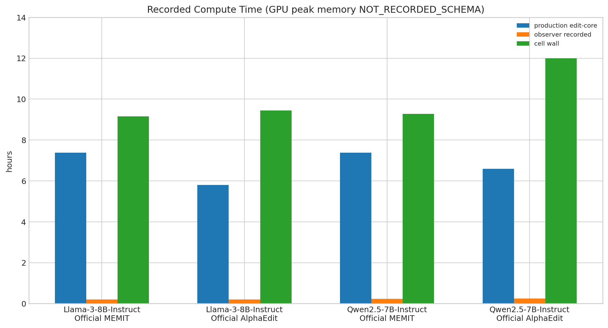

`compute-accounting.csv`는 production과 checkpoint edit-core/observer를 분리한다. Setup/model-load/evaluator를 포함한 cell wall과 edit-core를 같은 값으로 해석하지 않았다.

## 27. Technical exclusions

| canonical arm | excluded job | classification | reason | denominator |
|---|---|---|---|---:|
| LA | 32374 | PURE_TECHNICAL_PYTHON_SOURCE_PATH_PRECEDENCE | root checkout adapter without observer argument loaded before locked source; T0 pre-B100, denominator0 | 0 |
| QM | 31651_1 | PURE_TECHNICAL_RESOURCE_PENDING_SUPERSEDED | pending resource cell cancelled before execution; elapsed0, model/science endpoint0, denominator0 | 0 |
| QM | 31653_1 | PURE_TECHNICAL_OFFICIAL_INTERFACE_BINDING | MEMIT same-entry probe omitted track=out and received tuple before first B100; denominator0 | 0 |

짧은 external `srun` overlap sidecar는 canonical parent experiment failure가 아니며 parent/array terminal과 raw chain을 기준으로 판정했다.

## 28. NOT_RECORDED와 해석 한계

- `GPU_PEAK_MEMORY`, `TOTAL_FORWARD_COUNT`, `JVP/VJP/HVP`, `AUTOCAST/QUANTIZATION/NUMERIC_CAST_INVENTORY`: `NOT_RECORDED_SCHEMA`.
- Retention rephrase/locality: `NOT_RECORDED_LOW_COST_BATCH`.
- Same-entry probe는 layer weight-response magnitude만 기록했고 request-level q/ρ/τ는 기록하지 않았다. 따라서 ordered-vs-same-entry target progress causal decomposition은 하지 않았다.
- Completion failure onset/AUROC/AUPRC: preregistered threshold/outcome label 부재로 식별 불가. 과학 신호 부재를 임의 right-censor time으로 바꾸지 않았다.
- Raw prompt/logit/generation publish=0. NLL/margin/strict scalar만 사용했다.
- Raw action/norm을 Llama와 Qwen 사이에 pooling하지 않았다. 모델·방법별 absolute와 normalized 값을 분리했다.

## 29. Reproducible figures와 artifact inventory

모든 PNG는 `lifelong_analysis_figures.py`의 headless `Agg` CLI가 sealed CSV만 읽어 생성한다. Seed/style/DPI/size/panel order/color/axis policy가 코드에 고정되며 missing interpolation/imputation=0이다. 아래 exact command는 sealed package를 덮어쓰지 않고 임시 create-once 디렉터리에 11개 PNG를 다시 렌더링한 뒤 byte SHA를 비교한다. Codex visualization/imagegen/manual image edit artifact=0.

```text
env MPLCONFIGDIR=/tmp/odeedit-lifelong-analysis-mpl /data/janghj/EasyEdit/.venv/bin/python3 -m project.run_scripts.official_layer_realization_debt.lifelong_analysis_figures --tables /data/janghj/ODE-edit/local/worktrees/official-layer-debt-lifelong-fourarm-analysis-v1/experiment-reports/servers/server4/official-layer-realization-debt-lifelong-b100x100-2026-09-03-v3 --verify-existing /data/janghj/ODE-edit/local/worktrees/official-layer-debt-lifelong-fourarm-analysis-v1/experiment-reports/servers/server4/official-layer-realization-debt-lifelong-b100x100-2026-09-03-v3
```

### 29.1 Derived table inventory

완전한 request/layer/batch/checkpoint 정보는 deterministic gzip CSV, 요약·비교·compute·exclusion·raw inventory는 plain CSV다. 아래는 package의 모든 derived table filename, 실제 row count, SHA-256이다.

| table | rows | SHA-256 |
|---|---:|---|
| `allocation-realization-summary.csv` | 2600 | `fc1829d7c1a6cdd98c14d9d989c6df21ffeeeb8ad49c0c3c56fee627b808acf1` |
| `arm-summary.csv` | 4 | `47e451b9497445cf8c59c6e03a3d3738c47b13395e6ecf6d282e32fcccc2abe2` |
| `checkpoint-geometry-complete.csv.gz` | 48 | `e0fad373f9569b96f6f125119448701634406cc75f4ca8710c0160644ae9062d` |
| `checkpoint-layer-complete.csv.gz` | 24000 | `64d3709a3c9184a14d8ad76e89d99bcc33b3f71f77e3dad7008b4eb5e2334fd8` |
| `checkpoint-request-complete.csv.gz` | 4800 | `1b8199001e6244a78b252d98a5b6ad1903890c5201e926e0aaaac1b4692d0ece` |
| `checkpoint-same-entry-complete.csv.gz` | 240 | `57b2c77d978b86a7ecadcfc54e67e5b93ea393dec22e98710e3cf59ca2b56148` |
| `checkpoint-summary.csv` | 864 | `bdf11ba01ccfeb42ee291963461a542cac8fde4ba290e180708a0b90aef63004` |
| `checkpoint-update-magnitude-share.csv` | 960 | `56415bcba19441bcde67aecb3502636b596a3ac6a6ff97e96709c2528cef37e7` |
| `checkpoint-waypoint-complete.csv.gz` | 288 | `5826b141e341faf3b186551420af431cd3bcca332560344a971bc5c95cfe31ca` |
| `checkpoint-weight-complete.csv.gz` | 240 | `3a0a70724b00e51df13df26015095ad14a966996d12d12d956436a6d9a5c26e9` |
| `completion-geometry-summary.csv` | 48 | `30c2fc02b725e35126b6233000170e25b56c2eb656daded08b256153f9b22c6a` |
| `completion-predictive-boundary.csv` | 48 | `20c1ee9c0c9f76d3e5167d99d904848c7f342bb88dd40b5cf64e4cfc05ab509e` |
| `compute-accounting.csv` | 4 | `24e1f3be01f8e2ea4cd240e74aeaa581c07ce58dc58ba3e9d9c1ff110482ee34` |
| `descriptive-associations.csv` | 48 | `9819e8b275594710fd03ef88b0215195097712a4cecbadd71c7157b72d818075` |
| `endpoint-metrics-summary.csv` | 3904 | `015ce5133738540656741b3ad9092c5ccc3baf6a77a96d5cc95b91a41fab2442` |
| `execution-provenance.csv` | 4 | `d20a01c1c1fbfc66df909ea1ae916caca670a0bdd8b9f4c14061efbe2a034716` |
| `failure-time-right-censor-boundary.csv` | 16 | `281c5734cb1dfe8faf5c369602e9b64eef21cbd3f7838a5b9e85dc4c1c41afdd` |
| `functional-endpoint-complete.csv.gz` | 27136 | `5ac0164953884d7f4ff92c36acb6fe116f6466d8d955363c3de3f18533ae5882` |
| `inherited-debt-summary.csv` | 904 | `46d0fd9fd4262d074e366e1c8fe9a555ea26098e1fcc5602d1428c909b39aa7b` |
| `layer-q-summary.csv` | 3164 | `e2c157c271d3bb2bf5ba559d809e64204367ac67c9fa4999fe21942a9bc13f43` |
| `ordered-vs-same-entry-layer-delta.csv` | 240 | `2567a25f9b3647d2e0515cc3928dc4b45d604fdcd75e971f036acc4c901eaf0a` |
| `outlier-ledger.csv` | 480 | `56b0fa104d22c113b3707869a773e572e9d7d79056e13660101aee41a587c8e0` |
| `paired-deltas.csv` | 1336 | `adc01597783f70258cf72881ffb0b56fcae96c13748b1821e6d2590dee148f3d` |
| `production-batch-complete.csv.gz` | 400 | `cadbc0fc66f4b6ddfc2bab5b598aec8dffde38b040824b565c6acb791216808a` |
| `production-compute-by-batch.csv.gz` | 480 | `26bd3fc43633530dda918e55d4e641c9d56777a123094db17ee0d18c7ac3a9b0` |
| `production-layer-complete.csv.gz` | 200000 | `2fa6450eafa2cc9a095b25f1f8009bb2da16084a5eeefdd0287a7b568814359e` |
| `production-request-complete.csv.gz` | 40000 | `4e0d6020e97f8c45f6ad246224a2f581097991fc6ca8d08c621c460e1492dff5` |
| `production-weight-batch-unit-complete.csv.gz` | 2000 | `d3333403c9fd5249d2163e51d3221e356c33e5c3617c1150de729e7294d967a8` |
| `raw-member-inventory.csv` | 468 | `46d30ed27a0dd54309971e1eb9a7e374c6274c9b078d8789c0a0f7339332bf6e` |
| `recurrence-summary.csv` | 52 | `ec08c143d216a4ca8b75c35d27a65bbdaf4ee4dd2fb070b615ceda616a625840` |
| `rho-tau-summary.csv` | 520 | `b5bad6a9a000d34811034104af61f70274f56d75e99a6e3c5772b1abf52742d0` |
| `same-entry-probe-summary.csv` | 720 | `6852a4d2461b92d9a5adff39438d75510059ea477231d5157443efb89be6d2dc` |
| `technical-exclusions.csv` | 3 | `707f002ef0612fa935e782a2520bfdfa6cd320d493a6cf377984f85c54961545` |
| `update-magnitude-share.csv` | 80 | `d57f2e1f430873513c81d9ead23ac902dccee17b626146f7a467aabd7219f3e4` |

### 29.2 Figure inventory

| figure | bytes | SHA-256 | denominator/missing policy |
|---|---:|---|---|
| `primary-residual-trajectory-2x2.png` | 565691 | `acb560c6183fcfd28fb54004d91766fe3e8a82f3a425c1b45ab34f3c8dec1237` | 10k sentinel n=100/cell; display range q=[0,4.5]; full extrema remain in CSV; missing values are not interpolated or imputed. Missing values are not interpolated or imputed. |
| `checkpoint-layer-q-heatmap.png` | 145875 | `4783f26503162c298522dad103314d004c979aaabc30d48a89f522a89ae6846e` | Sentinel n=100/checkpoint/cell; medians by fixed checkpoint schedule; shared color range q=[0,1.5]. Missing values are not interpolated or imputed. |
| `rho-by-layer-terminal.png` | 101195 | `c4abb86f052ae6fe2b6ef9cf7b366f078a1fa1154d621b99303cd617f4ecbc4b` | 10k sentinel n=100/layer/cell; shared display range rho=[-0.5,9]. Missing values are not interpolated or imputed. |
| `tau-by-layer-terminal.png` | 112214 | `632d6cee48879f47c735d6ffe823833ae6bfd1b6b606ec6b9a6290bbd725daf3` | 10k sentinel n=100/layer/cell; shared display range tau=[0,22]. Missing values are not interpolated or imputed. |
| `inherited-debt-distributions.png` | 125547 | `db5ff41a18f0872c66fce83deca346adb65607c81ec5bbcffba3c412808cac32` | Sentinel n=100/checkpoint/cell at t0,5k,10k; display range [-1,2], full extrema in CSV. Missing values are not interpolated or imputed. |
| `checkpoint-layer-rho-heatmap.png` | 123594 | `b25df72ccbd3d31ee787d5e3f3919782426e160384f94e17d5381720e6d40245` | Sentinel n=100/checkpoint/layer/cell; shared median color range rho=[0,6]. Missing values are not interpolated or imputed. |
| `checkpoint-layer-tau-heatmap.png` | 125359 | `fcc6e50b53eb07b5fc953c19e179d2f91db874b44de3ca7f97c256d824560dba` | Sentinel n=100/checkpoint/layer/cell; shared median color range tau=[0,8]. Missing values are not interpolated or imputed. |
| `layer-wise-update-magnitude.png` | 102983 | `b9e68a2bd0f052f1ece4faf0e314bea30ee59610d5cd4cc4adb837ac497a0c33` | Weight observation unit is one B100 batch; n=100/layer/cell; log display range [1,1000]. Missing values are not interpolated or imputed. |
| `layer-wise-update-magnitude-drift.png` | 146829 | `96f17c1b4fd23624968c01bccedaa67f1ca8b66b3c128fc342b75ac43c11d360` | One observed B100 update per batch/layer/cell; log1p color range [0,6.5]; no interpolation. Missing values are not interpolated or imputed. |
| `endpoint-checkpoint-strict-rates.png` | 247232 | `96c516c8f11410bf9cf8383390e5dc3232d0d2b0c8aa9e6a3796dade20c2baf3` | Current B100 functional panel n=100 requests/checkpoint/cell; prompt-count weighted within request only. Missing values are not interpolated or imputed. |
| `compute-time-comparison.png` | 62344 | `baf5443a7cc9513d985a14a8fbd367e734c5bd340e0c82069625625c7d32ec90` | Recorded edit-core, observer and cell wall time; GPU peak memory is not inferred. Missing values are not interpolated or imputed. |

Package member root와 외부 raw roots는 `analysis-manifest.json` 및 `rooted-analysis-receipt.json`에 봉인한다.

### FACT / INFERENCE / DECISION

- **FACT:** four-arm common denominator와 W/cache/hash/recurrence/FULL-FP32 invariants는 모두 valid하다.
- **FACT:** terminal AlphaEdit closure는 MEMIT보다 낮지만 보존 및 earliest retention 손실이 크다. Layer update concentration은 Llama L8, Qwen L4로 갈린다.
- **INFERENCE:** action–realization decoupling drift는 architecture/method-conditioned이며 네 arm 공통 monotonic precursor가 아니다.
- **DECISION:** observational result only; barrier intervention opening condition은 이 분석만으로 충족되었다고 판정하지 않는다. `scientific_promotion=false`.

## 30. FACT / INFERENCE / DECISION

- **FACT:** four-arm final W₁₀₀₀₀ full-10k 성능과 28 checkpoint cumulative rows는 sealed v4-r2 receipt에서 재해시했으며, v3 mechanism tables 48 members도 독립 재해시했다.
- **FACT:** LM은 비단조 collapse/recovery를, LA는 3k 이후 특히 5k→7.5k 급락을, QM은 3k까지 급붕괴 후 5k 이후 거의 0을, QA는 3k 이후 단계적 붕괴를 보였다.
- **FACT:** earliest/middle/recent 격차는 checkpoint와 arm에 따라 달랐고, final W에서 recent retention이 대체로 earliest보다 높았다. 전체 84 rows와 category tails는 §7에 있다.
- **INFERENCE:** AlphaEdit가 같은 모델 MEMIT보다 장기 retention을 더 유지했지만 네 arm 공통 locality collapse와 큰 forgetting gap은 lifelong preservation 한계를 보여준다.
- **INFERENCE:** mechanism correlation은 n=7과 time confounding 때문에 architecture/method-conditioned descriptive association으로만 해석한다.
- **DECISION:** barrier usefulness, ODE necessity, universal last-layer bottleneck, scientific promotion을 주장하지 않는다. `scientific_promotion=false`; 다음 자동 experiment=0.

## 31. v5 package inventory

- New table count: 13; new figure count: 7.
- v3 member count/root: 48 / `8c3441ffe0776f493fd78fea2858c0660e3e2c305a6b03b4e5ddcda35df5161a`.
- v4-r2 member count/root: 19 / `aeb08ebe484b21c09a2d90e7ce2a5e33fcc90c7608b35da958ad73e527c81015`.
- Complete per-request and raw historical tables remain in sealed v3/v4 packages; v5 does not duplicate model/checkpoint/cache/raw prompt data.
- Every new table row count/SHA, plot input/source/output SHA and command are bound in `analysis-manifest.json` and `rooted-analysis-receipt.json`.


## 32. FACT / boundary

- FACT: RS/PS는 기존 sealed NLL pairs에서 재계산했고, NS에 필요한 locality target-new만 frozen checkpoint evaluation으로 보충했다.
- FACT: 기존 v3/v4-r2/v5 bytes와 edit trajectory는 변경하지 않았다.
- FACT: primary success bit는 strict inequality이며 tie는 failure다. 누락/중복/imputation은 0이다.
- BOUNDARY: accuracy, current B100, online-at-write, cumulative final-W, mechanism telemetry는 서로 다른 지표/분모다.
- DECISION: `scientific_promotion=false`; 자동 후속 GPU experiment=0.
