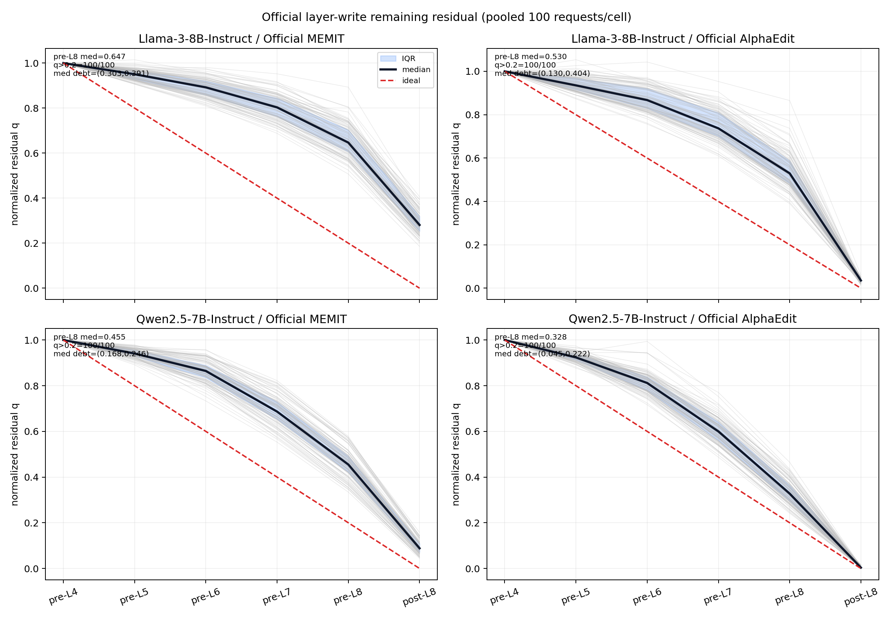
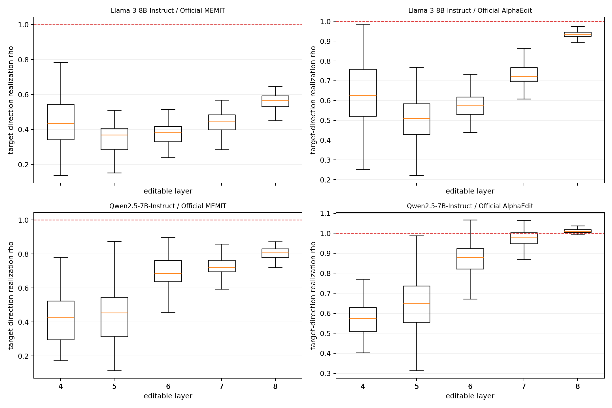
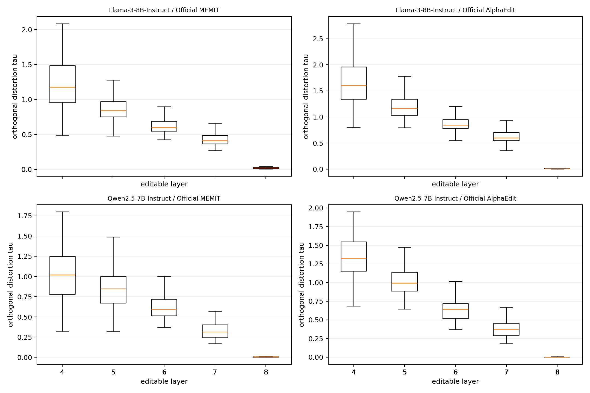
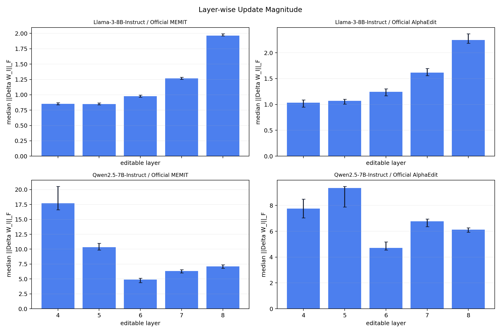

# Official layer-write realization debt — B1→B10 cumulative sequential 사실 보고서

상태: **SEQUENTIAL_OBSERVATIONAL_STUDY_TERMINAL_VALID**

범위: **B1→B10 cumulative W/cache sequential**. 각 셀은 W0에서 한 번 시작해 10개 B10 batch를 순서대로 누적했으며 batch별 W0 reset은 0이다. AlphaEdit은 B1 cold entry 뒤 dynamic `cache_c`를 B10까지 연속 소비·append했다. MEMIT은 Official static covariance computation cache만 재사용했다.

이 연구는 Official update를 변경하지 않은 descriptive observation이다. barrier benefit, ODE necessity, universal last-layer bottleneck 또는 독립↔순차 인과효과를 주장하지 않는다. `scientific_promotion=false`다.

## 핵심 sequential 결과

| 모델 | Official 방법 | pre-L8 q median | post-L8 q median | pre-L8 q>0.2 | d_parallel median | d_perp median | recurrence max |
|---|---|---:|---:|---:|---:|---:|---:|
| Llama-3-8B-Instruct | Official MEMIT | 0.6468 | 0.2809 | 100/100 | 0.3028 | 0.3910 | 6.293e-18 |
| Llama-3-8B-Instruct | Official AlphaEdit | 0.5296 | 0.0356 | 100/100 | 0.1305 | 0.4041 | 9.868e-18 |
| Qwen2.5-7B-Instruct | Official MEMIT | 0.4549 | 0.0883 | 100/100 | 0.1680 | 0.2457 | 9.820e-18 |
| Qwen2.5-7B-Instruct | Official AlphaEdit | 0.3277 | 0.0038 | 100/100 | 0.0455 | 0.2222 | 1.049e-17 |

Batch별 `/10` trajectory는 [q-by-batch-facets.png](q-by-batch-facets.png)에 보존했다. Pooled 표의 분모는 `/100`이다.

## B1→B10 continuity 및 계측 완전성

| 모델 | 방법 | W commit→next entry | cache B1 entry→B10 exit | cache links | direct-z | recompute | layer obs | terminal fwd | terminal W0/cache restore |
|---|---|---:|---:|---:|---:|---:|---:|---:|---:|
| Llama-3-8B-Instruct | Official MEMIT | 9/9 | 0→0 | 9/9 | 100/100 | 0 | 50/50 | 10/10 | PASS/PASS |
| Llama-3-8B-Instruct | Official AlphaEdit | 9/9 | 0→100 | 9/9 | 100/100 | 0 | 50/50 | 10/10 | PASS/PASS |
| Qwen2.5-7B-Instruct | Official MEMIT | 9/9 | 0→0 | 9/9 | 100/100 | 0 | 50/50 | 10/10 | PASS/PASS |
| Qwen2.5-7B-Instruct | Official AlphaEdit | 9/9 | 0→100 | 9/9 | 100/100 | 0 | 50/50 | 10/10 | PASS/PASS |

AlphaEdit cache 폭은 `0→100`; MEMIT의 `0→0`은 request-history cache가 없고 static covariance cache identity만 9/9 연결됐다는 뜻이다. 첫 실제 B1 transaction은 네 셀 모두 observer 5/5, terminal forward 1, recurrence `<1e-4`, finite, W/cache entry contract와 추가 decision/update count 0을 통과했다.

## q trajectory 및 layer realization

| 모델 | 방법 | pre-L4 | pre-L5 | pre-L6 | pre-L7 | pre-L8 | post-L8 |
|---|---|---:|---:|---:|---:|---:|---:|
| Llama-3-8B-Instruct | Official MEMIT | 1.0000 | 0.9504 | 0.8923 | 0.8032 | 0.6468 | 0.2809 |
| Llama-3-8B-Instruct | Official AlphaEdit | 1.0000 | 0.9352 | 0.8673 | 0.7371 | 0.5296 | 0.0356 |
| Qwen2.5-7B-Instruct | Official MEMIT | 1.0000 | 0.9409 | 0.8645 | 0.6867 | 0.4549 | 0.0883 |
| Qwen2.5-7B-Instruct | Official AlphaEdit | 1.0000 | 0.9238 | 0.8119 | 0.5998 | 0.3277 | 0.0038 |

`rho`와 `tau`, allocation-realization gap `E`, inherited debt의 request-level 값은 [layer-request-metrics.csv](layer-request-metrics.csv)에 있다.

## Layer-wise weight update

`energy=||Delta W_l||_F^2`, `share=energy/sum_l energy`로 별도 저장했다. 아래 막대는 각 셀의 10 sequential batches에서 관측한 `||Delta W_l||_F` median이고 error bar는 IQR이다.

## Independent W0/cold-state 관찰과 descriptive 비교

아래 차이는 `sequential - independent`이며 execution semantics가 달라 causal effect로 해석하지 않는다.

| 모델 | 방법 | Δ pre-L8 q median | Δ post-L8 q median | Δ d_parallel median | Δ d_perp median |
|---|---|---:|---:|---:|---:|
| Llama-3-8B-Instruct | Official MEMIT | -0.0080 | -0.0017 | -0.0041 | -0.0049 |
| Llama-3-8B-Instruct | Official AlphaEdit | -0.0319 | 0.0028 | -0.0062 | -0.0315 |
| Qwen2.5-7B-Instruct | Official MEMIT | -0.0025 | 0.0025 | -0.0019 | -0.0097 |
| Qwen2.5-7B-Instruct | Official AlphaEdit | -0.0090 | -0.0005 | -0.0001 | -0.0064 |

## Endpoint metric (계측 무결성 보조)

각 값은 해당 batch 직후 현재 10 requests의 metric이며 controller/selection에는 사용되지 않았다.

| 모델 | 방법 | target-new NLL mean/median/p90 | target-true NLL mean/median/p90 | target-new strict |
|---|---|---:|---:|---:|
| Llama-3-8B-Instruct | Official MEMIT | 0.2267/0.0028/0.0412 | 12.3050/11.5819/17.6506 | 97/100 |
| Llama-3-8B-Instruct | Official AlphaEdit | 0.0008/0.0006/0.0022 | 15.2910/14.5430/21.3244 | 100/100 |
| Qwen2.5-7B-Instruct | Official MEMIT | 0.0166/0.0084/0.0439 | 15.0311/14.3026/22.0339 | 100/100 |
| Qwen2.5-7B-Instruct | Official AlphaEdit | 0.0201/0.0107/0.0546 | 14.6106/13.5629/21.2134 | 100/100 |

## 실행·identity

- valid cells 4/4, batches 40/40, requests 400/400; failure/nonfinite/imputation 0.
- direct-z 400, recompute 0, layer observations 200, terminal forwards 40, W links 36/36, terminal W0/cache restore 4/4.
- raw prompt/logit/generation publish 0; EasyEdit source/update equation change 0.
- Slurm valid lineages: `31585, 31593`.
- run source HEAD/tree: `5a5a94cd98c495353e1bc5ed0fa5637f3f753481` / `c33b3041ce6cb874b9985c34c76a4ef157167ad6`.
- stream/order/evaluator: `74d6896535fe46211e3f11d3d9b420c1ab36f1d503ee81f9eaace23c2fcb89e6` / `abe62c071168789b4a1e5ff57d2645ea16a328946362ea7bff166d6d5c76cd5c` / `72b8ecb737157a42d6a055ffd339dc3f907876a0a98165a00cca49ca9bbed07d`.
- raw roots는 ignored local path에 immutable 보존하며 Git package에는 포함하지 않았다.
